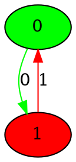

# the graphs for number of 1 nodes from 1 to 1
## Graph 1 - appeared 1times
___

```graphviz
digraph G {
0[label="0" fillcolor="green" style="filled"];
1[label="1" fillcolor="red" style="filled"];
0->1 [label="0" color="green"];
1->0 [label="1" color="red"];
}
```
___
