# the graphs for number of 19 nodes from 12201 to 12300
## Graph 12201 - list de compréhension : 2,3,3,3|1,1,2,4
___
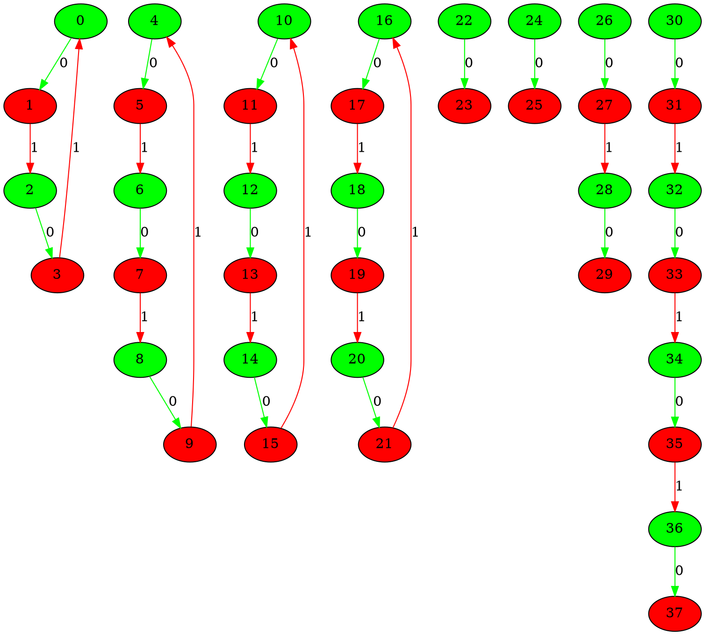
```graphviz
digraph G {
0[label="0" fillcolor="green" style="filled"];
1[label="1" fillcolor="red" style="filled"];
2[label="2" fillcolor="green" style="filled"];
3[label="3" fillcolor="red" style="filled"];
4[label="4" fillcolor="green" style="filled"];
5[label="5" fillcolor="red" style="filled"];
6[label="6" fillcolor="green" style="filled"];
7[label="7" fillcolor="red" style="filled"];
8[label="8" fillcolor="green" style="filled"];
9[label="9" fillcolor="red" style="filled"];
10[label="10" fillcolor="green" style="filled"];
11[label="11" fillcolor="red" style="filled"];
12[label="12" fillcolor="green" style="filled"];
13[label="13" fillcolor="red" style="filled"];
14[label="14" fillcolor="green" style="filled"];
15[label="15" fillcolor="red" style="filled"];
16[label="16" fillcolor="green" style="filled"];
17[label="17" fillcolor="red" style="filled"];
18[label="18" fillcolor="green" style="filled"];
19[label="19" fillcolor="red" style="filled"];
20[label="20" fillcolor="green" style="filled"];
21[label="21" fillcolor="red" style="filled"];
22[label="22" fillcolor="green" style="filled"];
23[label="23" fillcolor="red" style="filled"];
24[label="24" fillcolor="green" style="filled"];
25[label="25" fillcolor="red" style="filled"];
26[label="26" fillcolor="green" style="filled"];
27[label="27" fillcolor="red" style="filled"];
28[label="28" fillcolor="green" style="filled"];
29[label="29" fillcolor="red" style="filled"];
30[label="30" fillcolor="green" style="filled"];
31[label="31" fillcolor="red" style="filled"];
32[label="32" fillcolor="green" style="filled"];
33[label="33" fillcolor="red" style="filled"];
34[label="34" fillcolor="green" style="filled"];
35[label="35" fillcolor="red" style="filled"];
36[label="36" fillcolor="green" style="filled"];
37[label="37" fillcolor="red" style="filled"];
0->1 [label="0" color="green"];
2->3 [label="0" color="green"];
4->5 [label="0" color="green"];
6->7 [label="0" color="green"];
8->9 [label="0" color="green"];
10->11 [label="0" color="green"];
12->13 [label="0" color="green"];
14->15 [label="0" color="green"];
16->17 [label="0" color="green"];
18->19 [label="0" color="green"];
20->21 [label="0" color="green"];
22->23 [label="0" color="green"];
24->25 [label="0" color="green"];
26->27 [label="0" color="green"];
28->29 [label="0" color="green"];
30->31 [label="0" color="green"];
32->33 [label="0" color="green"];
34->35 [label="0" color="green"];
36->37 [label="0" color="green"];
1->2 [label="1" color="red"];
3->0 [label="1" color="red"];
5->6 [label="1" color="red"];
7->8 [label="1" color="red"];
9->4 [label="1" color="red"];
11->12 [label="1" color="red"];
13->14 [label="1" color="red"];
15->10 [label="1" color="red"];
17->18 [label="1" color="red"];
19->20 [label="1" color="red"];
21->16 [label="1" color="red"];
27->28 [label="1" color="red"];
31->32 [label="1" color="red"];
33->34 [label="1" color="red"];
35->36 [label="1" color="red"];
}
```
___
## Graph 12202 - list de compréhension : 2,3,3,3,4|1,1,2
___
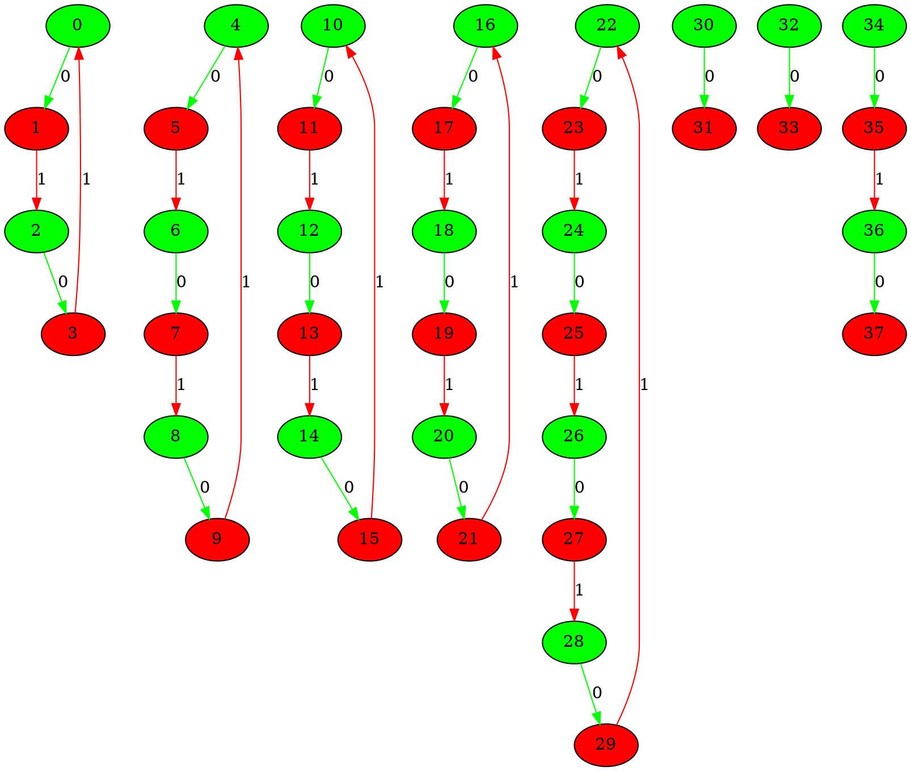
```graphviz
digraph G {
0[label="0" fillcolor="green" style="filled"];
1[label="1" fillcolor="red" style="filled"];
2[label="2" fillcolor="green" style="filled"];
3[label="3" fillcolor="red" style="filled"];
4[label="4" fillcolor="green" style="filled"];
5[label="5" fillcolor="red" style="filled"];
6[label="6" fillcolor="green" style="filled"];
7[label="7" fillcolor="red" style="filled"];
8[label="8" fillcolor="green" style="filled"];
9[label="9" fillcolor="red" style="filled"];
10[label="10" fillcolor="green" style="filled"];
11[label="11" fillcolor="red" style="filled"];
12[label="12" fillcolor="green" style="filled"];
13[label="13" fillcolor="red" style="filled"];
14[label="14" fillcolor="green" style="filled"];
15[label="15" fillcolor="red" style="filled"];
16[label="16" fillcolor="green" style="filled"];
17[label="17" fillcolor="red" style="filled"];
18[label="18" fillcolor="green" style="filled"];
19[label="19" fillcolor="red" style="filled"];
20[label="20" fillcolor="green" style="filled"];
21[label="21" fillcolor="red" style="filled"];
22[label="22" fillcolor="green" style="filled"];
23[label="23" fillcolor="red" style="filled"];
24[label="24" fillcolor="green" style="filled"];
25[label="25" fillcolor="red" style="filled"];
26[label="26" fillcolor="green" style="filled"];
27[label="27" fillcolor="red" style="filled"];
28[label="28" fillcolor="green" style="filled"];
29[label="29" fillcolor="red" style="filled"];
30[label="30" fillcolor="green" style="filled"];
31[label="31" fillcolor="red" style="filled"];
32[label="32" fillcolor="green" style="filled"];
33[label="33" fillcolor="red" style="filled"];
34[label="34" fillcolor="green" style="filled"];
35[label="35" fillcolor="red" style="filled"];
36[label="36" fillcolor="green" style="filled"];
37[label="37" fillcolor="red" style="filled"];
0->1 [label="0" color="green"];
2->3 [label="0" color="green"];
4->5 [label="0" color="green"];
6->7 [label="0" color="green"];
8->9 [label="0" color="green"];
10->11 [label="0" color="green"];
12->13 [label="0" color="green"];
14->15 [label="0" color="green"];
16->17 [label="0" color="green"];
18->19 [label="0" color="green"];
20->21 [label="0" color="green"];
22->23 [label="0" color="green"];
24->25 [label="0" color="green"];
26->27 [label="0" color="green"];
28->29 [label="0" color="green"];
30->31 [label="0" color="green"];
32->33 [label="0" color="green"];
34->35 [label="0" color="green"];
36->37 [label="0" color="green"];
1->2 [label="1" color="red"];
3->0 [label="1" color="red"];
5->6 [label="1" color="red"];
7->8 [label="1" color="red"];
9->4 [label="1" color="red"];
11->12 [label="1" color="red"];
13->14 [label="1" color="red"];
15->10 [label="1" color="red"];
17->18 [label="1" color="red"];
19->20 [label="1" color="red"];
21->16 [label="1" color="red"];
23->24 [label="1" color="red"];
25->26 [label="1" color="red"];
27->28 [label="1" color="red"];
29->22 [label="1" color="red"];
35->36 [label="1" color="red"];
}
```
___
## Graph 12203 - list de compréhension : 2,3,3,4|1,1,2,3
___
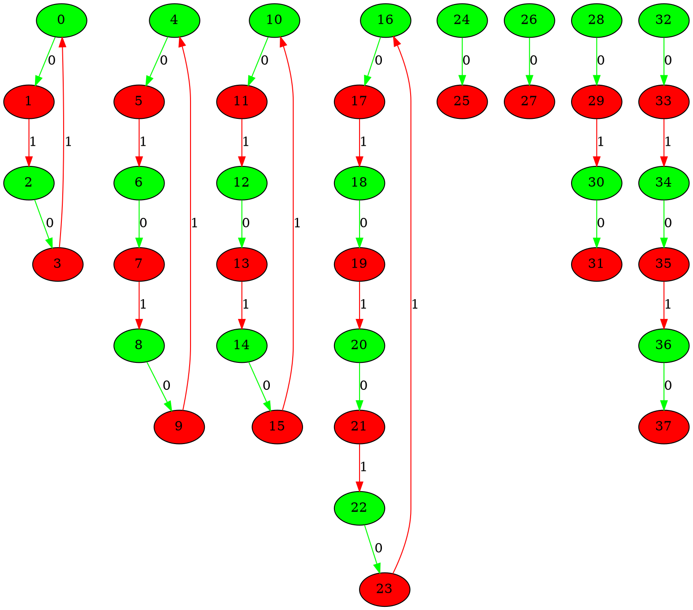
```graphviz
digraph G {
0[label="0" fillcolor="green" style="filled"];
1[label="1" fillcolor="red" style="filled"];
2[label="2" fillcolor="green" style="filled"];
3[label="3" fillcolor="red" style="filled"];
4[label="4" fillcolor="green" style="filled"];
5[label="5" fillcolor="red" style="filled"];
6[label="6" fillcolor="green" style="filled"];
7[label="7" fillcolor="red" style="filled"];
8[label="8" fillcolor="green" style="filled"];
9[label="9" fillcolor="red" style="filled"];
10[label="10" fillcolor="green" style="filled"];
11[label="11" fillcolor="red" style="filled"];
12[label="12" fillcolor="green" style="filled"];
13[label="13" fillcolor="red" style="filled"];
14[label="14" fillcolor="green" style="filled"];
15[label="15" fillcolor="red" style="filled"];
16[label="16" fillcolor="green" style="filled"];
17[label="17" fillcolor="red" style="filled"];
18[label="18" fillcolor="green" style="filled"];
19[label="19" fillcolor="red" style="filled"];
20[label="20" fillcolor="green" style="filled"];
21[label="21" fillcolor="red" style="filled"];
22[label="22" fillcolor="green" style="filled"];
23[label="23" fillcolor="red" style="filled"];
24[label="24" fillcolor="green" style="filled"];
25[label="25" fillcolor="red" style="filled"];
26[label="26" fillcolor="green" style="filled"];
27[label="27" fillcolor="red" style="filled"];
28[label="28" fillcolor="green" style="filled"];
29[label="29" fillcolor="red" style="filled"];
30[label="30" fillcolor="green" style="filled"];
31[label="31" fillcolor="red" style="filled"];
32[label="32" fillcolor="green" style="filled"];
33[label="33" fillcolor="red" style="filled"];
34[label="34" fillcolor="green" style="filled"];
35[label="35" fillcolor="red" style="filled"];
36[label="36" fillcolor="green" style="filled"];
37[label="37" fillcolor="red" style="filled"];
0->1 [label="0" color="green"];
2->3 [label="0" color="green"];
4->5 [label="0" color="green"];
6->7 [label="0" color="green"];
8->9 [label="0" color="green"];
10->11 [label="0" color="green"];
12->13 [label="0" color="green"];
14->15 [label="0" color="green"];
16->17 [label="0" color="green"];
18->19 [label="0" color="green"];
20->21 [label="0" color="green"];
22->23 [label="0" color="green"];
24->25 [label="0" color="green"];
26->27 [label="0" color="green"];
28->29 [label="0" color="green"];
30->31 [label="0" color="green"];
32->33 [label="0" color="green"];
34->35 [label="0" color="green"];
36->37 [label="0" color="green"];
1->2 [label="1" color="red"];
3->0 [label="1" color="red"];
5->6 [label="1" color="red"];
7->8 [label="1" color="red"];
9->4 [label="1" color="red"];
11->12 [label="1" color="red"];
13->14 [label="1" color="red"];
15->10 [label="1" color="red"];
17->18 [label="1" color="red"];
19->20 [label="1" color="red"];
21->22 [label="1" color="red"];
23->16 [label="1" color="red"];
29->30 [label="1" color="red"];
33->34 [label="1" color="red"];
35->36 [label="1" color="red"];
}
```
___
## Graph 12204 - list de compréhension : 2,3,4|1,1,2,3,3
___
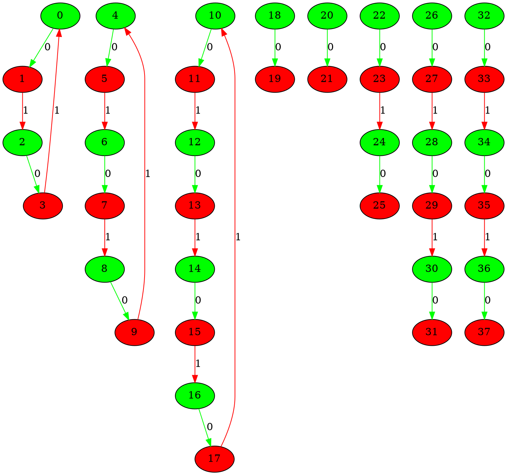
```graphviz
digraph G {
0[label="0" fillcolor="green" style="filled"];
1[label="1" fillcolor="red" style="filled"];
2[label="2" fillcolor="green" style="filled"];
3[label="3" fillcolor="red" style="filled"];
4[label="4" fillcolor="green" style="filled"];
5[label="5" fillcolor="red" style="filled"];
6[label="6" fillcolor="green" style="filled"];
7[label="7" fillcolor="red" style="filled"];
8[label="8" fillcolor="green" style="filled"];
9[label="9" fillcolor="red" style="filled"];
10[label="10" fillcolor="green" style="filled"];
11[label="11" fillcolor="red" style="filled"];
12[label="12" fillcolor="green" style="filled"];
13[label="13" fillcolor="red" style="filled"];
14[label="14" fillcolor="green" style="filled"];
15[label="15" fillcolor="red" style="filled"];
16[label="16" fillcolor="green" style="filled"];
17[label="17" fillcolor="red" style="filled"];
18[label="18" fillcolor="green" style="filled"];
19[label="19" fillcolor="red" style="filled"];
20[label="20" fillcolor="green" style="filled"];
21[label="21" fillcolor="red" style="filled"];
22[label="22" fillcolor="green" style="filled"];
23[label="23" fillcolor="red" style="filled"];
24[label="24" fillcolor="green" style="filled"];
25[label="25" fillcolor="red" style="filled"];
26[label="26" fillcolor="green" style="filled"];
27[label="27" fillcolor="red" style="filled"];
28[label="28" fillcolor="green" style="filled"];
29[label="29" fillcolor="red" style="filled"];
30[label="30" fillcolor="green" style="filled"];
31[label="31" fillcolor="red" style="filled"];
32[label="32" fillcolor="green" style="filled"];
33[label="33" fillcolor="red" style="filled"];
34[label="34" fillcolor="green" style="filled"];
35[label="35" fillcolor="red" style="filled"];
36[label="36" fillcolor="green" style="filled"];
37[label="37" fillcolor="red" style="filled"];
0->1 [label="0" color="green"];
2->3 [label="0" color="green"];
4->5 [label="0" color="green"];
6->7 [label="0" color="green"];
8->9 [label="0" color="green"];
10->11 [label="0" color="green"];
12->13 [label="0" color="green"];
14->15 [label="0" color="green"];
16->17 [label="0" color="green"];
18->19 [label="0" color="green"];
20->21 [label="0" color="green"];
22->23 [label="0" color="green"];
24->25 [label="0" color="green"];
26->27 [label="0" color="green"];
28->29 [label="0" color="green"];
30->31 [label="0" color="green"];
32->33 [label="0" color="green"];
34->35 [label="0" color="green"];
36->37 [label="0" color="green"];
1->2 [label="1" color="red"];
3->0 [label="1" color="red"];
5->6 [label="1" color="red"];
7->8 [label="1" color="red"];
9->4 [label="1" color="red"];
11->12 [label="1" color="red"];
13->14 [label="1" color="red"];
15->16 [label="1" color="red"];
17->10 [label="1" color="red"];
23->24 [label="1" color="red"];
27->28 [label="1" color="red"];
29->30 [label="1" color="red"];
33->34 [label="1" color="red"];
35->36 [label="1" color="red"];
}
```
___
## Graph 12205 - list de compréhension : 2,4|1,1,2,3,3,3
___
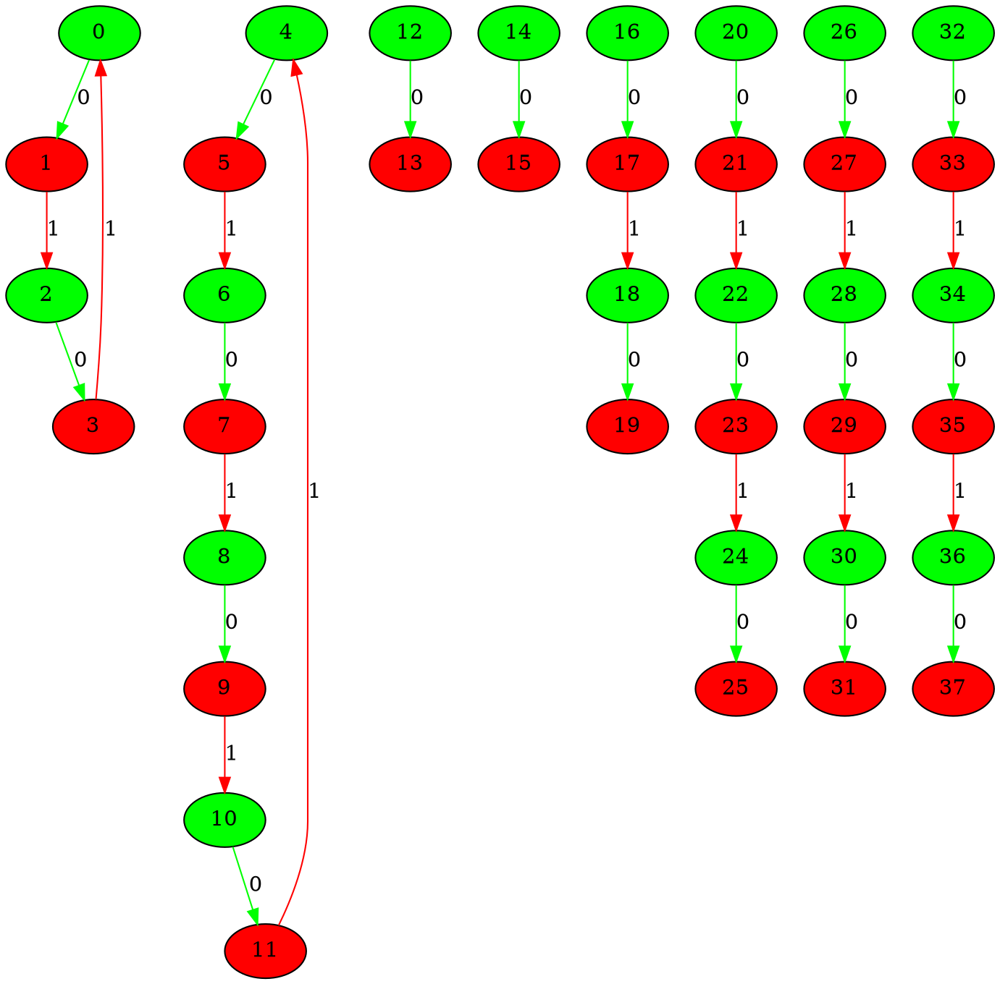
```graphviz
digraph G {
0[label="0" fillcolor="green" style="filled"];
1[label="1" fillcolor="red" style="filled"];
2[label="2" fillcolor="green" style="filled"];
3[label="3" fillcolor="red" style="filled"];
4[label="4" fillcolor="green" style="filled"];
5[label="5" fillcolor="red" style="filled"];
6[label="6" fillcolor="green" style="filled"];
7[label="7" fillcolor="red" style="filled"];
8[label="8" fillcolor="green" style="filled"];
9[label="9" fillcolor="red" style="filled"];
10[label="10" fillcolor="green" style="filled"];
11[label="11" fillcolor="red" style="filled"];
12[label="12" fillcolor="green" style="filled"];
13[label="13" fillcolor="red" style="filled"];
14[label="14" fillcolor="green" style="filled"];
15[label="15" fillcolor="red" style="filled"];
16[label="16" fillcolor="green" style="filled"];
17[label="17" fillcolor="red" style="filled"];
18[label="18" fillcolor="green" style="filled"];
19[label="19" fillcolor="red" style="filled"];
20[label="20" fillcolor="green" style="filled"];
21[label="21" fillcolor="red" style="filled"];
22[label="22" fillcolor="green" style="filled"];
23[label="23" fillcolor="red" style="filled"];
24[label="24" fillcolor="green" style="filled"];
25[label="25" fillcolor="red" style="filled"];
26[label="26" fillcolor="green" style="filled"];
27[label="27" fillcolor="red" style="filled"];
28[label="28" fillcolor="green" style="filled"];
29[label="29" fillcolor="red" style="filled"];
30[label="30" fillcolor="green" style="filled"];
31[label="31" fillcolor="red" style="filled"];
32[label="32" fillcolor="green" style="filled"];
33[label="33" fillcolor="red" style="filled"];
34[label="34" fillcolor="green" style="filled"];
35[label="35" fillcolor="red" style="filled"];
36[label="36" fillcolor="green" style="filled"];
37[label="37" fillcolor="red" style="filled"];
0->1 [label="0" color="green"];
2->3 [label="0" color="green"];
4->5 [label="0" color="green"];
6->7 [label="0" color="green"];
8->9 [label="0" color="green"];
10->11 [label="0" color="green"];
12->13 [label="0" color="green"];
14->15 [label="0" color="green"];
16->17 [label="0" color="green"];
18->19 [label="0" color="green"];
20->21 [label="0" color="green"];
22->23 [label="0" color="green"];
24->25 [label="0" color="green"];
26->27 [label="0" color="green"];
28->29 [label="0" color="green"];
30->31 [label="0" color="green"];
32->33 [label="0" color="green"];
34->35 [label="0" color="green"];
36->37 [label="0" color="green"];
1->2 [label="1" color="red"];
3->0 [label="1" color="red"];
5->6 [label="1" color="red"];
7->8 [label="1" color="red"];
9->10 [label="1" color="red"];
11->4 [label="1" color="red"];
17->18 [label="1" color="red"];
21->22 [label="1" color="red"];
23->24 [label="1" color="red"];
27->28 [label="1" color="red"];
29->30 [label="1" color="red"];
33->34 [label="1" color="red"];
35->36 [label="1" color="red"];
}
```
___
## Graph 12206 - list de compréhension : 3|1,1,2,2,3,3,4
___
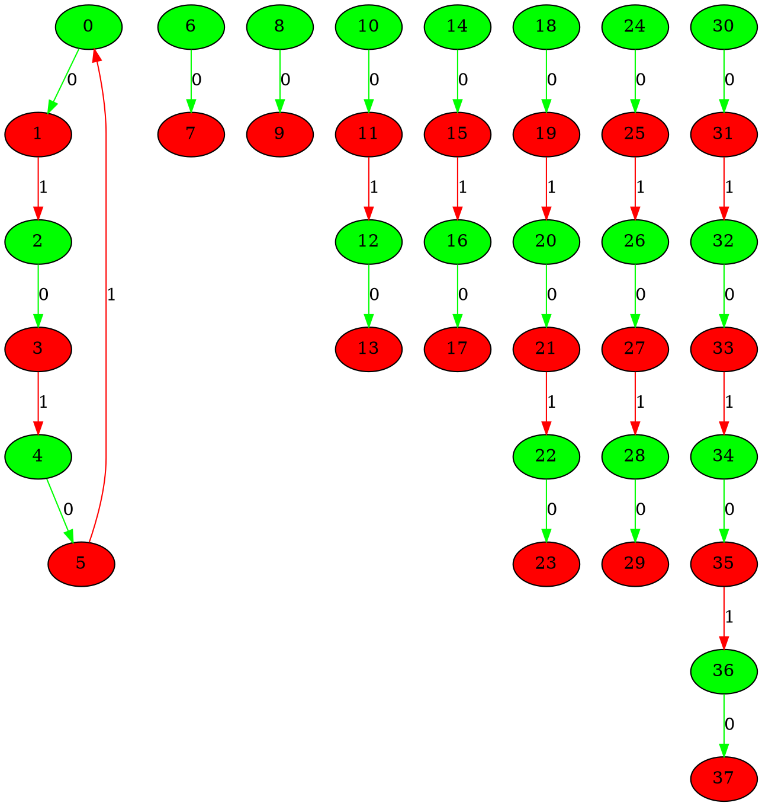
```graphviz
digraph G {
0[label="0" fillcolor="green" style="filled"];
1[label="1" fillcolor="red" style="filled"];
2[label="2" fillcolor="green" style="filled"];
3[label="3" fillcolor="red" style="filled"];
4[label="4" fillcolor="green" style="filled"];
5[label="5" fillcolor="red" style="filled"];
6[label="6" fillcolor="green" style="filled"];
7[label="7" fillcolor="red" style="filled"];
8[label="8" fillcolor="green" style="filled"];
9[label="9" fillcolor="red" style="filled"];
10[label="10" fillcolor="green" style="filled"];
11[label="11" fillcolor="red" style="filled"];
12[label="12" fillcolor="green" style="filled"];
13[label="13" fillcolor="red" style="filled"];
14[label="14" fillcolor="green" style="filled"];
15[label="15" fillcolor="red" style="filled"];
16[label="16" fillcolor="green" style="filled"];
17[label="17" fillcolor="red" style="filled"];
18[label="18" fillcolor="green" style="filled"];
19[label="19" fillcolor="red" style="filled"];
20[label="20" fillcolor="green" style="filled"];
21[label="21" fillcolor="red" style="filled"];
22[label="22" fillcolor="green" style="filled"];
23[label="23" fillcolor="red" style="filled"];
24[label="24" fillcolor="green" style="filled"];
25[label="25" fillcolor="red" style="filled"];
26[label="26" fillcolor="green" style="filled"];
27[label="27" fillcolor="red" style="filled"];
28[label="28" fillcolor="green" style="filled"];
29[label="29" fillcolor="red" style="filled"];
30[label="30" fillcolor="green" style="filled"];
31[label="31" fillcolor="red" style="filled"];
32[label="32" fillcolor="green" style="filled"];
33[label="33" fillcolor="red" style="filled"];
34[label="34" fillcolor="green" style="filled"];
35[label="35" fillcolor="red" style="filled"];
36[label="36" fillcolor="green" style="filled"];
37[label="37" fillcolor="red" style="filled"];
0->1 [label="0" color="green"];
2->3 [label="0" color="green"];
4->5 [label="0" color="green"];
6->7 [label="0" color="green"];
8->9 [label="0" color="green"];
10->11 [label="0" color="green"];
12->13 [label="0" color="green"];
14->15 [label="0" color="green"];
16->17 [label="0" color="green"];
18->19 [label="0" color="green"];
20->21 [label="0" color="green"];
22->23 [label="0" color="green"];
24->25 [label="0" color="green"];
26->27 [label="0" color="green"];
28->29 [label="0" color="green"];
30->31 [label="0" color="green"];
32->33 [label="0" color="green"];
34->35 [label="0" color="green"];
36->37 [label="0" color="green"];
1->2 [label="1" color="red"];
3->4 [label="1" color="red"];
5->0 [label="1" color="red"];
11->12 [label="1" color="red"];
15->16 [label="1" color="red"];
19->20 [label="1" color="red"];
21->22 [label="1" color="red"];
25->26 [label="1" color="red"];
27->28 [label="1" color="red"];
31->32 [label="1" color="red"];
33->34 [label="1" color="red"];
35->36 [label="1" color="red"];
}
```
___
## Graph 12207 - list de compréhension : 3,3|1,1,2,2,3,4
___
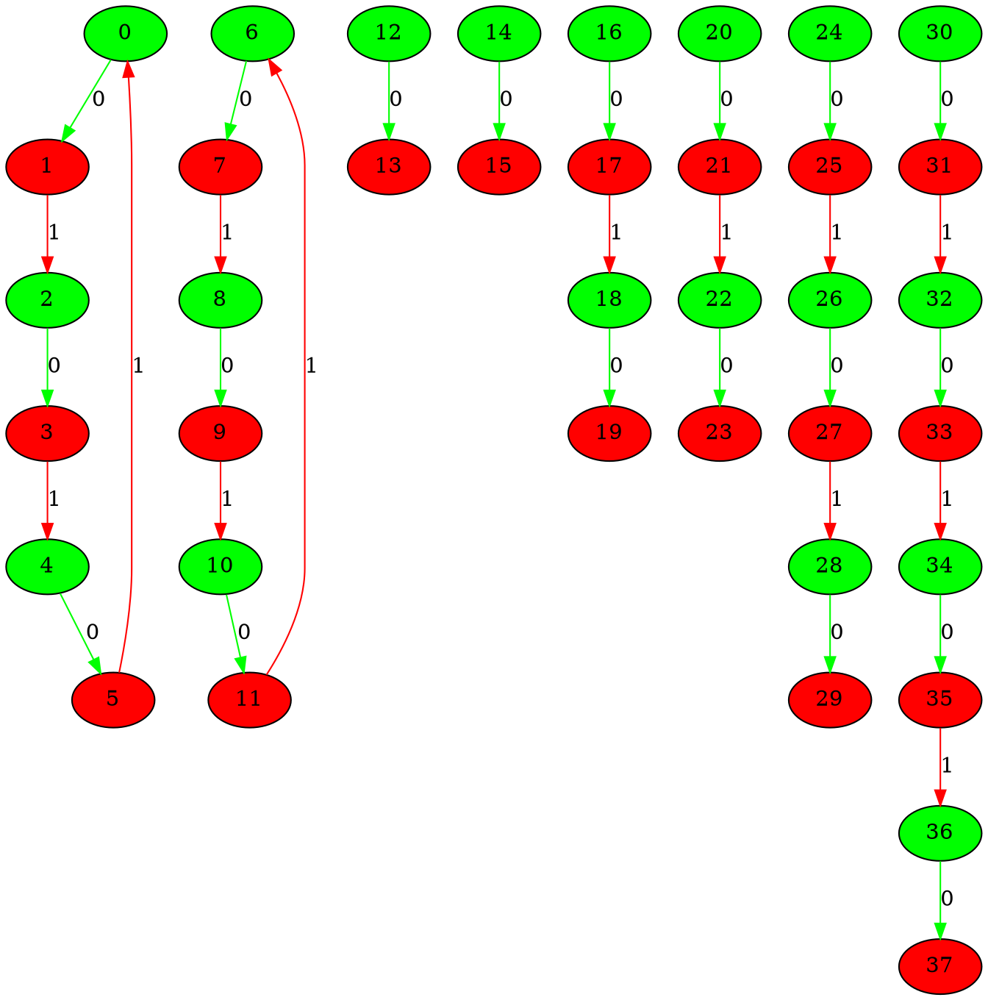
```graphviz
digraph G {
0[label="0" fillcolor="green" style="filled"];
1[label="1" fillcolor="red" style="filled"];
2[label="2" fillcolor="green" style="filled"];
3[label="3" fillcolor="red" style="filled"];
4[label="4" fillcolor="green" style="filled"];
5[label="5" fillcolor="red" style="filled"];
6[label="6" fillcolor="green" style="filled"];
7[label="7" fillcolor="red" style="filled"];
8[label="8" fillcolor="green" style="filled"];
9[label="9" fillcolor="red" style="filled"];
10[label="10" fillcolor="green" style="filled"];
11[label="11" fillcolor="red" style="filled"];
12[label="12" fillcolor="green" style="filled"];
13[label="13" fillcolor="red" style="filled"];
14[label="14" fillcolor="green" style="filled"];
15[label="15" fillcolor="red" style="filled"];
16[label="16" fillcolor="green" style="filled"];
17[label="17" fillcolor="red" style="filled"];
18[label="18" fillcolor="green" style="filled"];
19[label="19" fillcolor="red" style="filled"];
20[label="20" fillcolor="green" style="filled"];
21[label="21" fillcolor="red" style="filled"];
22[label="22" fillcolor="green" style="filled"];
23[label="23" fillcolor="red" style="filled"];
24[label="24" fillcolor="green" style="filled"];
25[label="25" fillcolor="red" style="filled"];
26[label="26" fillcolor="green" style="filled"];
27[label="27" fillcolor="red" style="filled"];
28[label="28" fillcolor="green" style="filled"];
29[label="29" fillcolor="red" style="filled"];
30[label="30" fillcolor="green" style="filled"];
31[label="31" fillcolor="red" style="filled"];
32[label="32" fillcolor="green" style="filled"];
33[label="33" fillcolor="red" style="filled"];
34[label="34" fillcolor="green" style="filled"];
35[label="35" fillcolor="red" style="filled"];
36[label="36" fillcolor="green" style="filled"];
37[label="37" fillcolor="red" style="filled"];
0->1 [label="0" color="green"];
2->3 [label="0" color="green"];
4->5 [label="0" color="green"];
6->7 [label="0" color="green"];
8->9 [label="0" color="green"];
10->11 [label="0" color="green"];
12->13 [label="0" color="green"];
14->15 [label="0" color="green"];
16->17 [label="0" color="green"];
18->19 [label="0" color="green"];
20->21 [label="0" color="green"];
22->23 [label="0" color="green"];
24->25 [label="0" color="green"];
26->27 [label="0" color="green"];
28->29 [label="0" color="green"];
30->31 [label="0" color="green"];
32->33 [label="0" color="green"];
34->35 [label="0" color="green"];
36->37 [label="0" color="green"];
1->2 [label="1" color="red"];
3->4 [label="1" color="red"];
5->0 [label="1" color="red"];
7->8 [label="1" color="red"];
9->10 [label="1" color="red"];
11->6 [label="1" color="red"];
17->18 [label="1" color="red"];
21->22 [label="1" color="red"];
25->26 [label="1" color="red"];
27->28 [label="1" color="red"];
31->32 [label="1" color="red"];
33->34 [label="1" color="red"];
35->36 [label="1" color="red"];
}
```
___
## Graph 12208 - list de compréhension : 3,3,3|1,1,2,2,4
___
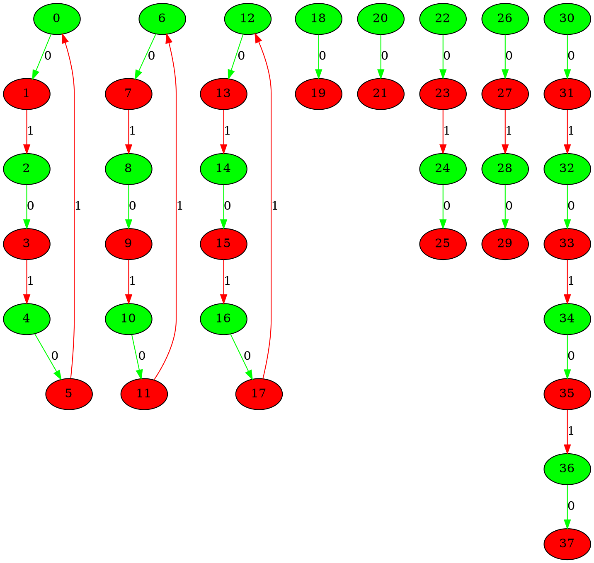
```graphviz
digraph G {
0[label="0" fillcolor="green" style="filled"];
1[label="1" fillcolor="red" style="filled"];
2[label="2" fillcolor="green" style="filled"];
3[label="3" fillcolor="red" style="filled"];
4[label="4" fillcolor="green" style="filled"];
5[label="5" fillcolor="red" style="filled"];
6[label="6" fillcolor="green" style="filled"];
7[label="7" fillcolor="red" style="filled"];
8[label="8" fillcolor="green" style="filled"];
9[label="9" fillcolor="red" style="filled"];
10[label="10" fillcolor="green" style="filled"];
11[label="11" fillcolor="red" style="filled"];
12[label="12" fillcolor="green" style="filled"];
13[label="13" fillcolor="red" style="filled"];
14[label="14" fillcolor="green" style="filled"];
15[label="15" fillcolor="red" style="filled"];
16[label="16" fillcolor="green" style="filled"];
17[label="17" fillcolor="red" style="filled"];
18[label="18" fillcolor="green" style="filled"];
19[label="19" fillcolor="red" style="filled"];
20[label="20" fillcolor="green" style="filled"];
21[label="21" fillcolor="red" style="filled"];
22[label="22" fillcolor="green" style="filled"];
23[label="23" fillcolor="red" style="filled"];
24[label="24" fillcolor="green" style="filled"];
25[label="25" fillcolor="red" style="filled"];
26[label="26" fillcolor="green" style="filled"];
27[label="27" fillcolor="red" style="filled"];
28[label="28" fillcolor="green" style="filled"];
29[label="29" fillcolor="red" style="filled"];
30[label="30" fillcolor="green" style="filled"];
31[label="31" fillcolor="red" style="filled"];
32[label="32" fillcolor="green" style="filled"];
33[label="33" fillcolor="red" style="filled"];
34[label="34" fillcolor="green" style="filled"];
35[label="35" fillcolor="red" style="filled"];
36[label="36" fillcolor="green" style="filled"];
37[label="37" fillcolor="red" style="filled"];
0->1 [label="0" color="green"];
2->3 [label="0" color="green"];
4->5 [label="0" color="green"];
6->7 [label="0" color="green"];
8->9 [label="0" color="green"];
10->11 [label="0" color="green"];
12->13 [label="0" color="green"];
14->15 [label="0" color="green"];
16->17 [label="0" color="green"];
18->19 [label="0" color="green"];
20->21 [label="0" color="green"];
22->23 [label="0" color="green"];
24->25 [label="0" color="green"];
26->27 [label="0" color="green"];
28->29 [label="0" color="green"];
30->31 [label="0" color="green"];
32->33 [label="0" color="green"];
34->35 [label="0" color="green"];
36->37 [label="0" color="green"];
1->2 [label="1" color="red"];
3->4 [label="1" color="red"];
5->0 [label="1" color="red"];
7->8 [label="1" color="red"];
9->10 [label="1" color="red"];
11->6 [label="1" color="red"];
13->14 [label="1" color="red"];
15->16 [label="1" color="red"];
17->12 [label="1" color="red"];
23->24 [label="1" color="red"];
27->28 [label="1" color="red"];
31->32 [label="1" color="red"];
33->34 [label="1" color="red"];
35->36 [label="1" color="red"];
}
```
___
## Graph 12209 - list de compréhension : 3,3,3,4|1,1,2,2
___
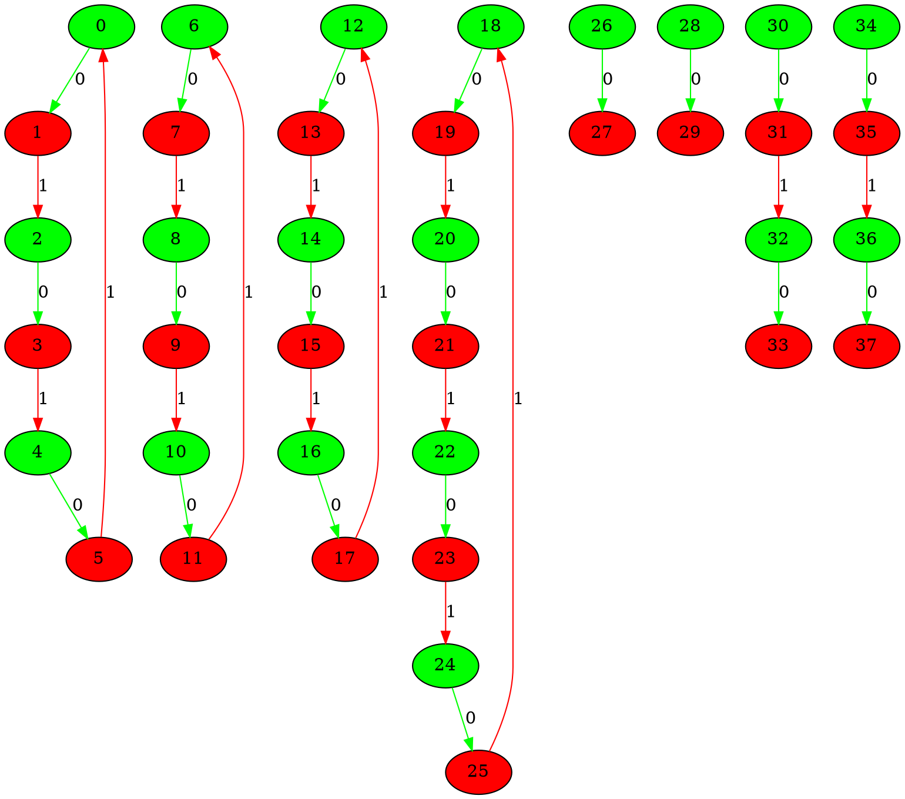
```graphviz
digraph G {
0[label="0" fillcolor="green" style="filled"];
1[label="1" fillcolor="red" style="filled"];
2[label="2" fillcolor="green" style="filled"];
3[label="3" fillcolor="red" style="filled"];
4[label="4" fillcolor="green" style="filled"];
5[label="5" fillcolor="red" style="filled"];
6[label="6" fillcolor="green" style="filled"];
7[label="7" fillcolor="red" style="filled"];
8[label="8" fillcolor="green" style="filled"];
9[label="9" fillcolor="red" style="filled"];
10[label="10" fillcolor="green" style="filled"];
11[label="11" fillcolor="red" style="filled"];
12[label="12" fillcolor="green" style="filled"];
13[label="13" fillcolor="red" style="filled"];
14[label="14" fillcolor="green" style="filled"];
15[label="15" fillcolor="red" style="filled"];
16[label="16" fillcolor="green" style="filled"];
17[label="17" fillcolor="red" style="filled"];
18[label="18" fillcolor="green" style="filled"];
19[label="19" fillcolor="red" style="filled"];
20[label="20" fillcolor="green" style="filled"];
21[label="21" fillcolor="red" style="filled"];
22[label="22" fillcolor="green" style="filled"];
23[label="23" fillcolor="red" style="filled"];
24[label="24" fillcolor="green" style="filled"];
25[label="25" fillcolor="red" style="filled"];
26[label="26" fillcolor="green" style="filled"];
27[label="27" fillcolor="red" style="filled"];
28[label="28" fillcolor="green" style="filled"];
29[label="29" fillcolor="red" style="filled"];
30[label="30" fillcolor="green" style="filled"];
31[label="31" fillcolor="red" style="filled"];
32[label="32" fillcolor="green" style="filled"];
33[label="33" fillcolor="red" style="filled"];
34[label="34" fillcolor="green" style="filled"];
35[label="35" fillcolor="red" style="filled"];
36[label="36" fillcolor="green" style="filled"];
37[label="37" fillcolor="red" style="filled"];
0->1 [label="0" color="green"];
2->3 [label="0" color="green"];
4->5 [label="0" color="green"];
6->7 [label="0" color="green"];
8->9 [label="0" color="green"];
10->11 [label="0" color="green"];
12->13 [label="0" color="green"];
14->15 [label="0" color="green"];
16->17 [label="0" color="green"];
18->19 [label="0" color="green"];
20->21 [label="0" color="green"];
22->23 [label="0" color="green"];
24->25 [label="0" color="green"];
26->27 [label="0" color="green"];
28->29 [label="0" color="green"];
30->31 [label="0" color="green"];
32->33 [label="0" color="green"];
34->35 [label="0" color="green"];
36->37 [label="0" color="green"];
1->2 [label="1" color="red"];
3->4 [label="1" color="red"];
5->0 [label="1" color="red"];
7->8 [label="1" color="red"];
9->10 [label="1" color="red"];
11->6 [label="1" color="red"];
13->14 [label="1" color="red"];
15->16 [label="1" color="red"];
17->12 [label="1" color="red"];
19->20 [label="1" color="red"];
21->22 [label="1" color="red"];
23->24 [label="1" color="red"];
25->18 [label="1" color="red"];
31->32 [label="1" color="red"];
35->36 [label="1" color="red"];
}
```
___
## Graph 12210 - list de compréhension : 3,3,4|1,1,2,2,3
___
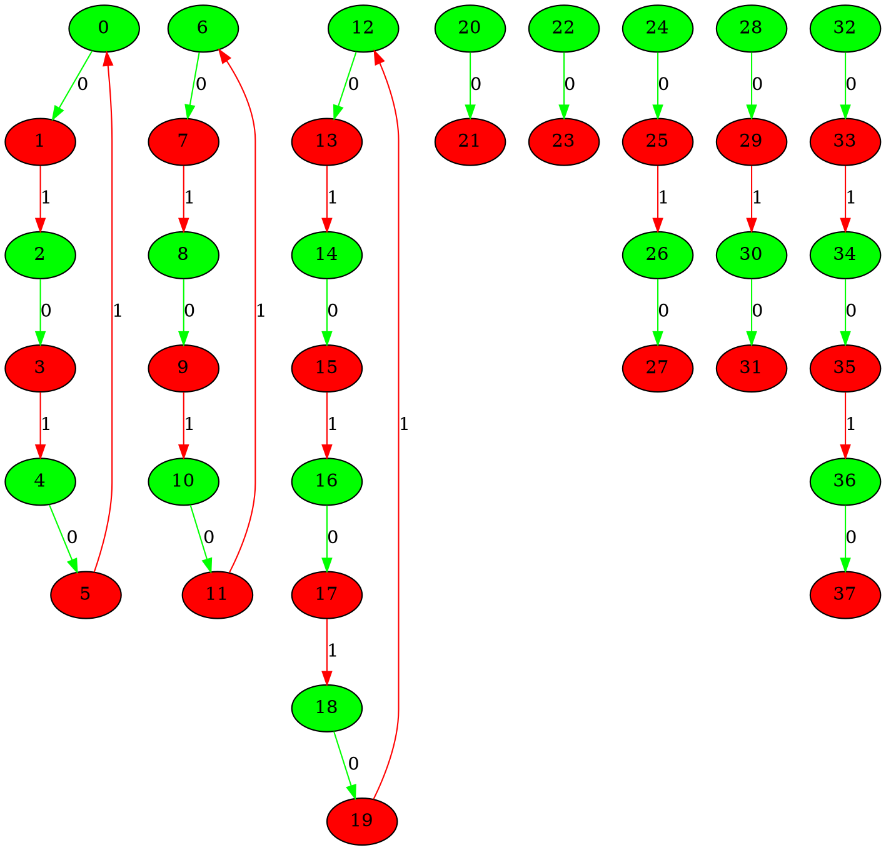
```graphviz
digraph G {
0[label="0" fillcolor="green" style="filled"];
1[label="1" fillcolor="red" style="filled"];
2[label="2" fillcolor="green" style="filled"];
3[label="3" fillcolor="red" style="filled"];
4[label="4" fillcolor="green" style="filled"];
5[label="5" fillcolor="red" style="filled"];
6[label="6" fillcolor="green" style="filled"];
7[label="7" fillcolor="red" style="filled"];
8[label="8" fillcolor="green" style="filled"];
9[label="9" fillcolor="red" style="filled"];
10[label="10" fillcolor="green" style="filled"];
11[label="11" fillcolor="red" style="filled"];
12[label="12" fillcolor="green" style="filled"];
13[label="13" fillcolor="red" style="filled"];
14[label="14" fillcolor="green" style="filled"];
15[label="15" fillcolor="red" style="filled"];
16[label="16" fillcolor="green" style="filled"];
17[label="17" fillcolor="red" style="filled"];
18[label="18" fillcolor="green" style="filled"];
19[label="19" fillcolor="red" style="filled"];
20[label="20" fillcolor="green" style="filled"];
21[label="21" fillcolor="red" style="filled"];
22[label="22" fillcolor="green" style="filled"];
23[label="23" fillcolor="red" style="filled"];
24[label="24" fillcolor="green" style="filled"];
25[label="25" fillcolor="red" style="filled"];
26[label="26" fillcolor="green" style="filled"];
27[label="27" fillcolor="red" style="filled"];
28[label="28" fillcolor="green" style="filled"];
29[label="29" fillcolor="red" style="filled"];
30[label="30" fillcolor="green" style="filled"];
31[label="31" fillcolor="red" style="filled"];
32[label="32" fillcolor="green" style="filled"];
33[label="33" fillcolor="red" style="filled"];
34[label="34" fillcolor="green" style="filled"];
35[label="35" fillcolor="red" style="filled"];
36[label="36" fillcolor="green" style="filled"];
37[label="37" fillcolor="red" style="filled"];
0->1 [label="0" color="green"];
2->3 [label="0" color="green"];
4->5 [label="0" color="green"];
6->7 [label="0" color="green"];
8->9 [label="0" color="green"];
10->11 [label="0" color="green"];
12->13 [label="0" color="green"];
14->15 [label="0" color="green"];
16->17 [label="0" color="green"];
18->19 [label="0" color="green"];
20->21 [label="0" color="green"];
22->23 [label="0" color="green"];
24->25 [label="0" color="green"];
26->27 [label="0" color="green"];
28->29 [label="0" color="green"];
30->31 [label="0" color="green"];
32->33 [label="0" color="green"];
34->35 [label="0" color="green"];
36->37 [label="0" color="green"];
1->2 [label="1" color="red"];
3->4 [label="1" color="red"];
5->0 [label="1" color="red"];
7->8 [label="1" color="red"];
9->10 [label="1" color="red"];
11->6 [label="1" color="red"];
13->14 [label="1" color="red"];
15->16 [label="1" color="red"];
17->18 [label="1" color="red"];
19->12 [label="1" color="red"];
25->26 [label="1" color="red"];
29->30 [label="1" color="red"];
33->34 [label="1" color="red"];
35->36 [label="1" color="red"];
}
```
___
## Graph 12211 - list de compréhension : 3,4|1,1,2,2,3,3
___
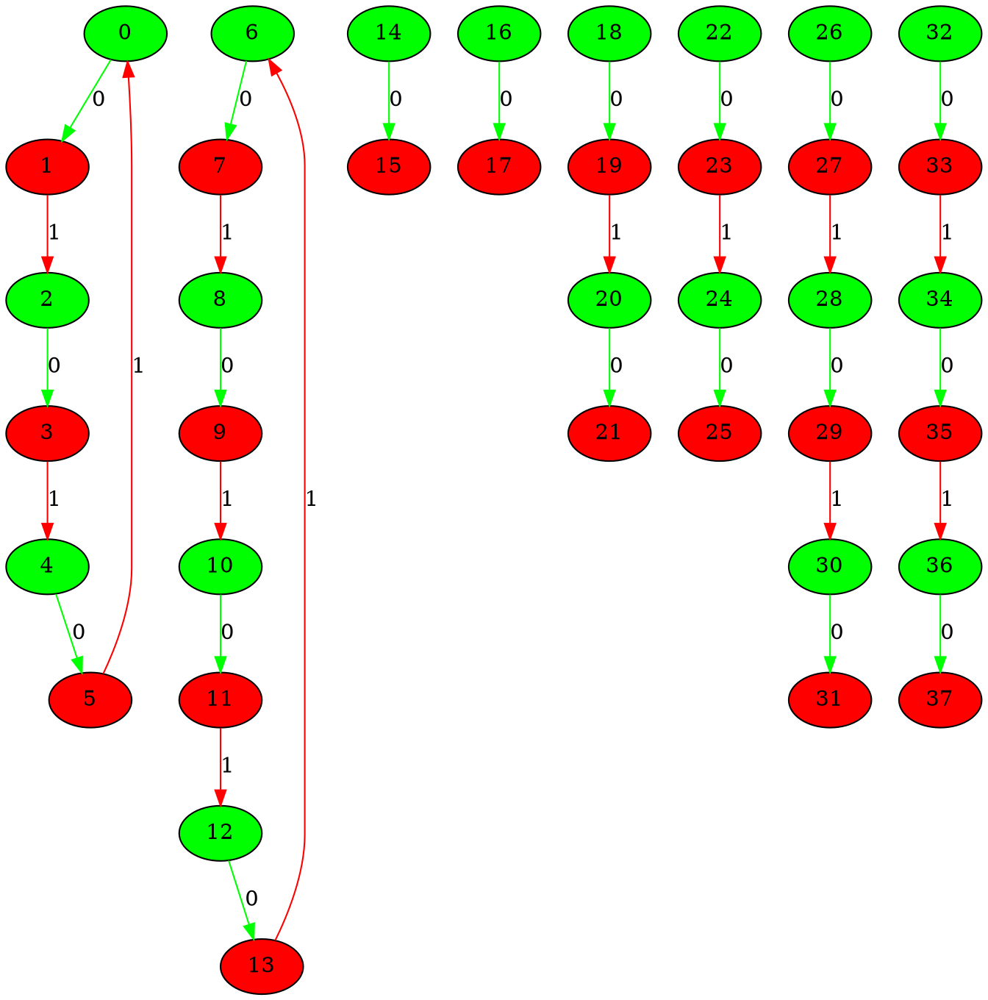
```graphviz
digraph G {
0[label="0" fillcolor="green" style="filled"];
1[label="1" fillcolor="red" style="filled"];
2[label="2" fillcolor="green" style="filled"];
3[label="3" fillcolor="red" style="filled"];
4[label="4" fillcolor="green" style="filled"];
5[label="5" fillcolor="red" style="filled"];
6[label="6" fillcolor="green" style="filled"];
7[label="7" fillcolor="red" style="filled"];
8[label="8" fillcolor="green" style="filled"];
9[label="9" fillcolor="red" style="filled"];
10[label="10" fillcolor="green" style="filled"];
11[label="11" fillcolor="red" style="filled"];
12[label="12" fillcolor="green" style="filled"];
13[label="13" fillcolor="red" style="filled"];
14[label="14" fillcolor="green" style="filled"];
15[label="15" fillcolor="red" style="filled"];
16[label="16" fillcolor="green" style="filled"];
17[label="17" fillcolor="red" style="filled"];
18[label="18" fillcolor="green" style="filled"];
19[label="19" fillcolor="red" style="filled"];
20[label="20" fillcolor="green" style="filled"];
21[label="21" fillcolor="red" style="filled"];
22[label="22" fillcolor="green" style="filled"];
23[label="23" fillcolor="red" style="filled"];
24[label="24" fillcolor="green" style="filled"];
25[label="25" fillcolor="red" style="filled"];
26[label="26" fillcolor="green" style="filled"];
27[label="27" fillcolor="red" style="filled"];
28[label="28" fillcolor="green" style="filled"];
29[label="29" fillcolor="red" style="filled"];
30[label="30" fillcolor="green" style="filled"];
31[label="31" fillcolor="red" style="filled"];
32[label="32" fillcolor="green" style="filled"];
33[label="33" fillcolor="red" style="filled"];
34[label="34" fillcolor="green" style="filled"];
35[label="35" fillcolor="red" style="filled"];
36[label="36" fillcolor="green" style="filled"];
37[label="37" fillcolor="red" style="filled"];
0->1 [label="0" color="green"];
2->3 [label="0" color="green"];
4->5 [label="0" color="green"];
6->7 [label="0" color="green"];
8->9 [label="0" color="green"];
10->11 [label="0" color="green"];
12->13 [label="0" color="green"];
14->15 [label="0" color="green"];
16->17 [label="0" color="green"];
18->19 [label="0" color="green"];
20->21 [label="0" color="green"];
22->23 [label="0" color="green"];
24->25 [label="0" color="green"];
26->27 [label="0" color="green"];
28->29 [label="0" color="green"];
30->31 [label="0" color="green"];
32->33 [label="0" color="green"];
34->35 [label="0" color="green"];
36->37 [label="0" color="green"];
1->2 [label="1" color="red"];
3->4 [label="1" color="red"];
5->0 [label="1" color="red"];
7->8 [label="1" color="red"];
9->10 [label="1" color="red"];
11->12 [label="1" color="red"];
13->6 [label="1" color="red"];
19->20 [label="1" color="red"];
23->24 [label="1" color="red"];
27->28 [label="1" color="red"];
29->30 [label="1" color="red"];
33->34 [label="1" color="red"];
35->36 [label="1" color="red"];
}
```
___
## Graph 12212 - list de compréhension : 4|1,1,2,2,3,3,3
___
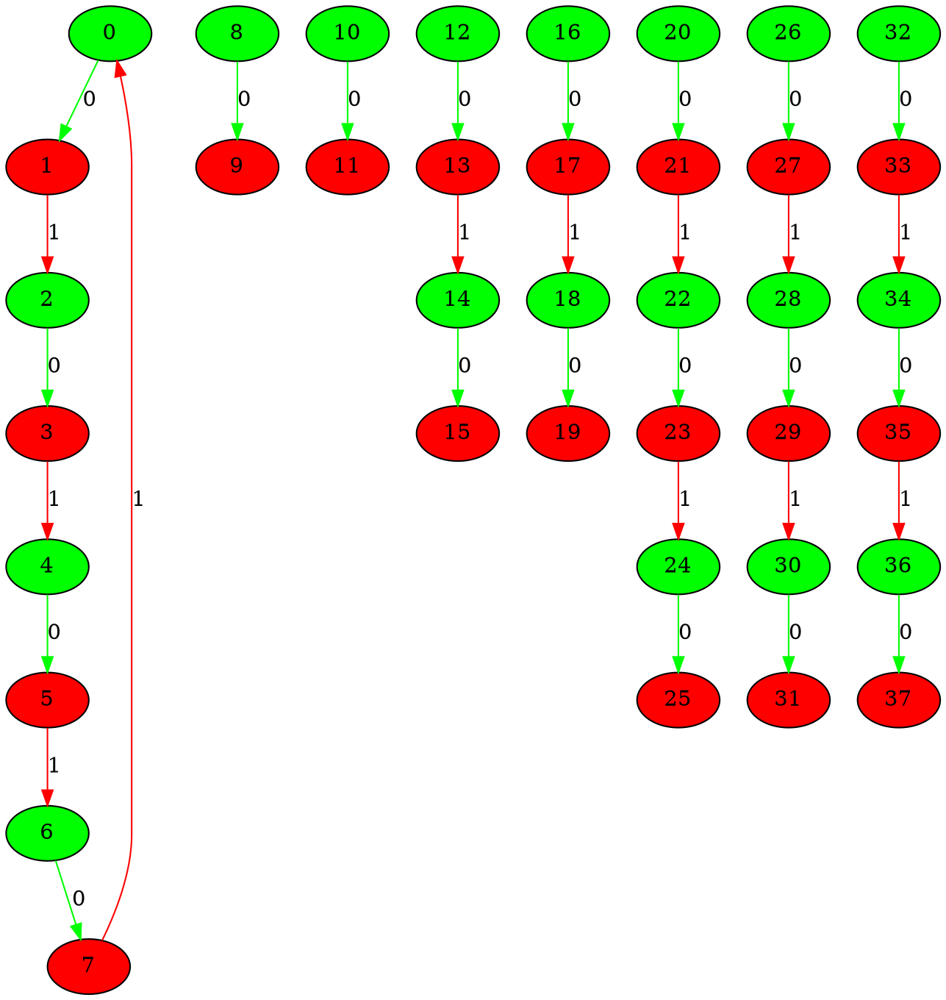
```graphviz
digraph G {
0[label="0" fillcolor="green" style="filled"];
1[label="1" fillcolor="red" style="filled"];
2[label="2" fillcolor="green" style="filled"];
3[label="3" fillcolor="red" style="filled"];
4[label="4" fillcolor="green" style="filled"];
5[label="5" fillcolor="red" style="filled"];
6[label="6" fillcolor="green" style="filled"];
7[label="7" fillcolor="red" style="filled"];
8[label="8" fillcolor="green" style="filled"];
9[label="9" fillcolor="red" style="filled"];
10[label="10" fillcolor="green" style="filled"];
11[label="11" fillcolor="red" style="filled"];
12[label="12" fillcolor="green" style="filled"];
13[label="13" fillcolor="red" style="filled"];
14[label="14" fillcolor="green" style="filled"];
15[label="15" fillcolor="red" style="filled"];
16[label="16" fillcolor="green" style="filled"];
17[label="17" fillcolor="red" style="filled"];
18[label="18" fillcolor="green" style="filled"];
19[label="19" fillcolor="red" style="filled"];
20[label="20" fillcolor="green" style="filled"];
21[label="21" fillcolor="red" style="filled"];
22[label="22" fillcolor="green" style="filled"];
23[label="23" fillcolor="red" style="filled"];
24[label="24" fillcolor="green" style="filled"];
25[label="25" fillcolor="red" style="filled"];
26[label="26" fillcolor="green" style="filled"];
27[label="27" fillcolor="red" style="filled"];
28[label="28" fillcolor="green" style="filled"];
29[label="29" fillcolor="red" style="filled"];
30[label="30" fillcolor="green" style="filled"];
31[label="31" fillcolor="red" style="filled"];
32[label="32" fillcolor="green" style="filled"];
33[label="33" fillcolor="red" style="filled"];
34[label="34" fillcolor="green" style="filled"];
35[label="35" fillcolor="red" style="filled"];
36[label="36" fillcolor="green" style="filled"];
37[label="37" fillcolor="red" style="filled"];
0->1 [label="0" color="green"];
2->3 [label="0" color="green"];
4->5 [label="0" color="green"];
6->7 [label="0" color="green"];
8->9 [label="0" color="green"];
10->11 [label="0" color="green"];
12->13 [label="0" color="green"];
14->15 [label="0" color="green"];
16->17 [label="0" color="green"];
18->19 [label="0" color="green"];
20->21 [label="0" color="green"];
22->23 [label="0" color="green"];
24->25 [label="0" color="green"];
26->27 [label="0" color="green"];
28->29 [label="0" color="green"];
30->31 [label="0" color="green"];
32->33 [label="0" color="green"];
34->35 [label="0" color="green"];
36->37 [label="0" color="green"];
1->2 [label="1" color="red"];
3->4 [label="1" color="red"];
5->6 [label="1" color="red"];
7->0 [label="1" color="red"];
13->14 [label="1" color="red"];
17->18 [label="1" color="red"];
21->22 [label="1" color="red"];
23->24 [label="1" color="red"];
27->28 [label="1" color="red"];
29->30 [label="1" color="red"];
33->34 [label="1" color="red"];
35->36 [label="1" color="red"];
}
```
___
## Graph 12213 - list de compréhension : 0|1,1,2,2,3,3,7
___
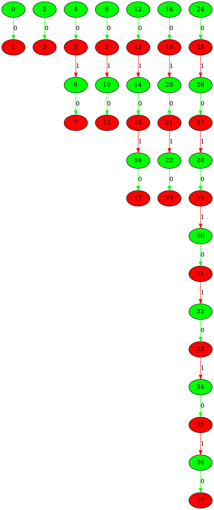
```graphviz
digraph G {
0[label="0" fillcolor="green" style="filled"];
1[label="1" fillcolor="red" style="filled"];
2[label="2" fillcolor="green" style="filled"];
3[label="3" fillcolor="red" style="filled"];
4[label="4" fillcolor="green" style="filled"];
5[label="5" fillcolor="red" style="filled"];
6[label="6" fillcolor="green" style="filled"];
7[label="7" fillcolor="red" style="filled"];
8[label="8" fillcolor="green" style="filled"];
9[label="9" fillcolor="red" style="filled"];
10[label="10" fillcolor="green" style="filled"];
11[label="11" fillcolor="red" style="filled"];
12[label="12" fillcolor="green" style="filled"];
13[label="13" fillcolor="red" style="filled"];
14[label="14" fillcolor="green" style="filled"];
15[label="15" fillcolor="red" style="filled"];
16[label="16" fillcolor="green" style="filled"];
17[label="17" fillcolor="red" style="filled"];
18[label="18" fillcolor="green" style="filled"];
19[label="19" fillcolor="red" style="filled"];
20[label="20" fillcolor="green" style="filled"];
21[label="21" fillcolor="red" style="filled"];
22[label="22" fillcolor="green" style="filled"];
23[label="23" fillcolor="red" style="filled"];
24[label="24" fillcolor="green" style="filled"];
25[label="25" fillcolor="red" style="filled"];
26[label="26" fillcolor="green" style="filled"];
27[label="27" fillcolor="red" style="filled"];
28[label="28" fillcolor="green" style="filled"];
29[label="29" fillcolor="red" style="filled"];
30[label="30" fillcolor="green" style="filled"];
31[label="31" fillcolor="red" style="filled"];
32[label="32" fillcolor="green" style="filled"];
33[label="33" fillcolor="red" style="filled"];
34[label="34" fillcolor="green" style="filled"];
35[label="35" fillcolor="red" style="filled"];
36[label="36" fillcolor="green" style="filled"];
37[label="37" fillcolor="red" style="filled"];
0->1 [label="0" color="green"];
2->3 [label="0" color="green"];
4->5 [label="0" color="green"];
6->7 [label="0" color="green"];
8->9 [label="0" color="green"];
10->11 [label="0" color="green"];
12->13 [label="0" color="green"];
14->15 [label="0" color="green"];
16->17 [label="0" color="green"];
18->19 [label="0" color="green"];
20->21 [label="0" color="green"];
22->23 [label="0" color="green"];
24->25 [label="0" color="green"];
26->27 [label="0" color="green"];
28->29 [label="0" color="green"];
30->31 [label="0" color="green"];
32->33 [label="0" color="green"];
34->35 [label="0" color="green"];
36->37 [label="0" color="green"];
5->6 [label="1" color="red"];
9->10 [label="1" color="red"];
13->14 [label="1" color="red"];
15->16 [label="1" color="red"];
19->20 [label="1" color="red"];
21->22 [label="1" color="red"];
25->26 [label="1" color="red"];
27->28 [label="1" color="red"];
29->30 [label="1" color="red"];
31->32 [label="1" color="red"];
33->34 [label="1" color="red"];
35->36 [label="1" color="red"];
}
```
___
## Graph 12214 - list de compréhension : 1|1,2,2,3,3,7
___
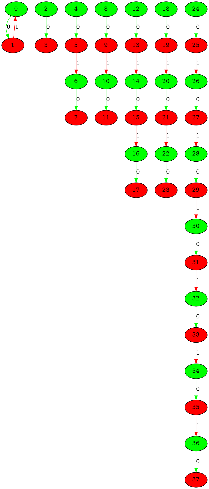
```graphviz
digraph G {
0[label="0" fillcolor="green" style="filled"];
1[label="1" fillcolor="red" style="filled"];
2[label="2" fillcolor="green" style="filled"];
3[label="3" fillcolor="red" style="filled"];
4[label="4" fillcolor="green" style="filled"];
5[label="5" fillcolor="red" style="filled"];
6[label="6" fillcolor="green" style="filled"];
7[label="7" fillcolor="red" style="filled"];
8[label="8" fillcolor="green" style="filled"];
9[label="9" fillcolor="red" style="filled"];
10[label="10" fillcolor="green" style="filled"];
11[label="11" fillcolor="red" style="filled"];
12[label="12" fillcolor="green" style="filled"];
13[label="13" fillcolor="red" style="filled"];
14[label="14" fillcolor="green" style="filled"];
15[label="15" fillcolor="red" style="filled"];
16[label="16" fillcolor="green" style="filled"];
17[label="17" fillcolor="red" style="filled"];
18[label="18" fillcolor="green" style="filled"];
19[label="19" fillcolor="red" style="filled"];
20[label="20" fillcolor="green" style="filled"];
21[label="21" fillcolor="red" style="filled"];
22[label="22" fillcolor="green" style="filled"];
23[label="23" fillcolor="red" style="filled"];
24[label="24" fillcolor="green" style="filled"];
25[label="25" fillcolor="red" style="filled"];
26[label="26" fillcolor="green" style="filled"];
27[label="27" fillcolor="red" style="filled"];
28[label="28" fillcolor="green" style="filled"];
29[label="29" fillcolor="red" style="filled"];
30[label="30" fillcolor="green" style="filled"];
31[label="31" fillcolor="red" style="filled"];
32[label="32" fillcolor="green" style="filled"];
33[label="33" fillcolor="red" style="filled"];
34[label="34" fillcolor="green" style="filled"];
35[label="35" fillcolor="red" style="filled"];
36[label="36" fillcolor="green" style="filled"];
37[label="37" fillcolor="red" style="filled"];
0->1 [label="0" color="green"];
2->3 [label="0" color="green"];
4->5 [label="0" color="green"];
6->7 [label="0" color="green"];
8->9 [label="0" color="green"];
10->11 [label="0" color="green"];
12->13 [label="0" color="green"];
14->15 [label="0" color="green"];
16->17 [label="0" color="green"];
18->19 [label="0" color="green"];
20->21 [label="0" color="green"];
22->23 [label="0" color="green"];
24->25 [label="0" color="green"];
26->27 [label="0" color="green"];
28->29 [label="0" color="green"];
30->31 [label="0" color="green"];
32->33 [label="0" color="green"];
34->35 [label="0" color="green"];
36->37 [label="0" color="green"];
1->0 [label="1" color="red"];
5->6 [label="1" color="red"];
9->10 [label="1" color="red"];
13->14 [label="1" color="red"];
15->16 [label="1" color="red"];
19->20 [label="1" color="red"];
21->22 [label="1" color="red"];
25->26 [label="1" color="red"];
27->28 [label="1" color="red"];
29->30 [label="1" color="red"];
31->32 [label="1" color="red"];
33->34 [label="1" color="red"];
35->36 [label="1" color="red"];
}
```
___
## Graph 12215 - list de compréhension : 1,1|2,2,3,3,7
___
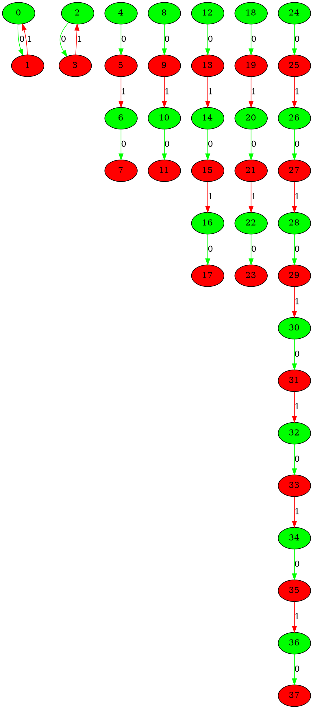
```graphviz
digraph G {
0[label="0" fillcolor="green" style="filled"];
1[label="1" fillcolor="red" style="filled"];
2[label="2" fillcolor="green" style="filled"];
3[label="3" fillcolor="red" style="filled"];
4[label="4" fillcolor="green" style="filled"];
5[label="5" fillcolor="red" style="filled"];
6[label="6" fillcolor="green" style="filled"];
7[label="7" fillcolor="red" style="filled"];
8[label="8" fillcolor="green" style="filled"];
9[label="9" fillcolor="red" style="filled"];
10[label="10" fillcolor="green" style="filled"];
11[label="11" fillcolor="red" style="filled"];
12[label="12" fillcolor="green" style="filled"];
13[label="13" fillcolor="red" style="filled"];
14[label="14" fillcolor="green" style="filled"];
15[label="15" fillcolor="red" style="filled"];
16[label="16" fillcolor="green" style="filled"];
17[label="17" fillcolor="red" style="filled"];
18[label="18" fillcolor="green" style="filled"];
19[label="19" fillcolor="red" style="filled"];
20[label="20" fillcolor="green" style="filled"];
21[label="21" fillcolor="red" style="filled"];
22[label="22" fillcolor="green" style="filled"];
23[label="23" fillcolor="red" style="filled"];
24[label="24" fillcolor="green" style="filled"];
25[label="25" fillcolor="red" style="filled"];
26[label="26" fillcolor="green" style="filled"];
27[label="27" fillcolor="red" style="filled"];
28[label="28" fillcolor="green" style="filled"];
29[label="29" fillcolor="red" style="filled"];
30[label="30" fillcolor="green" style="filled"];
31[label="31" fillcolor="red" style="filled"];
32[label="32" fillcolor="green" style="filled"];
33[label="33" fillcolor="red" style="filled"];
34[label="34" fillcolor="green" style="filled"];
35[label="35" fillcolor="red" style="filled"];
36[label="36" fillcolor="green" style="filled"];
37[label="37" fillcolor="red" style="filled"];
0->1 [label="0" color="green"];
2->3 [label="0" color="green"];
4->5 [label="0" color="green"];
6->7 [label="0" color="green"];
8->9 [label="0" color="green"];
10->11 [label="0" color="green"];
12->13 [label="0" color="green"];
14->15 [label="0" color="green"];
16->17 [label="0" color="green"];
18->19 [label="0" color="green"];
20->21 [label="0" color="green"];
22->23 [label="0" color="green"];
24->25 [label="0" color="green"];
26->27 [label="0" color="green"];
28->29 [label="0" color="green"];
30->31 [label="0" color="green"];
32->33 [label="0" color="green"];
34->35 [label="0" color="green"];
36->37 [label="0" color="green"];
1->0 [label="1" color="red"];
3->2 [label="1" color="red"];
5->6 [label="1" color="red"];
9->10 [label="1" color="red"];
13->14 [label="1" color="red"];
15->16 [label="1" color="red"];
19->20 [label="1" color="red"];
21->22 [label="1" color="red"];
25->26 [label="1" color="red"];
27->28 [label="1" color="red"];
29->30 [label="1" color="red"];
31->32 [label="1" color="red"];
33->34 [label="1" color="red"];
35->36 [label="1" color="red"];
}
```
___
## Graph 12216 - list de compréhension : 1,1,2|2,3,3,7
___
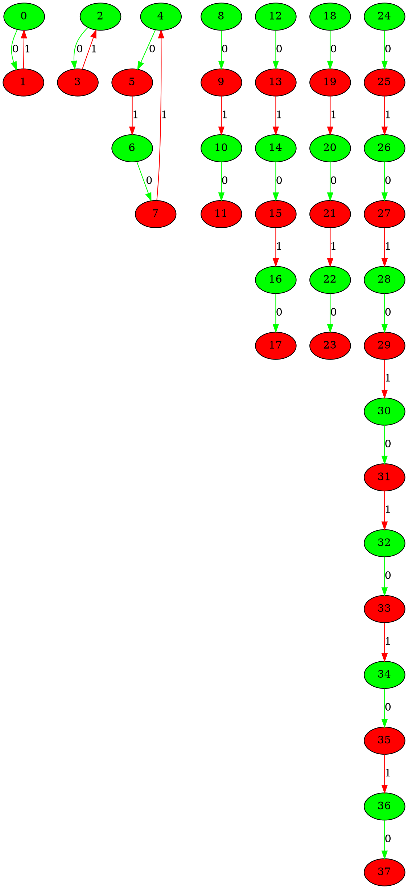
```graphviz
digraph G {
0[label="0" fillcolor="green" style="filled"];
1[label="1" fillcolor="red" style="filled"];
2[label="2" fillcolor="green" style="filled"];
3[label="3" fillcolor="red" style="filled"];
4[label="4" fillcolor="green" style="filled"];
5[label="5" fillcolor="red" style="filled"];
6[label="6" fillcolor="green" style="filled"];
7[label="7" fillcolor="red" style="filled"];
8[label="8" fillcolor="green" style="filled"];
9[label="9" fillcolor="red" style="filled"];
10[label="10" fillcolor="green" style="filled"];
11[label="11" fillcolor="red" style="filled"];
12[label="12" fillcolor="green" style="filled"];
13[label="13" fillcolor="red" style="filled"];
14[label="14" fillcolor="green" style="filled"];
15[label="15" fillcolor="red" style="filled"];
16[label="16" fillcolor="green" style="filled"];
17[label="17" fillcolor="red" style="filled"];
18[label="18" fillcolor="green" style="filled"];
19[label="19" fillcolor="red" style="filled"];
20[label="20" fillcolor="green" style="filled"];
21[label="21" fillcolor="red" style="filled"];
22[label="22" fillcolor="green" style="filled"];
23[label="23" fillcolor="red" style="filled"];
24[label="24" fillcolor="green" style="filled"];
25[label="25" fillcolor="red" style="filled"];
26[label="26" fillcolor="green" style="filled"];
27[label="27" fillcolor="red" style="filled"];
28[label="28" fillcolor="green" style="filled"];
29[label="29" fillcolor="red" style="filled"];
30[label="30" fillcolor="green" style="filled"];
31[label="31" fillcolor="red" style="filled"];
32[label="32" fillcolor="green" style="filled"];
33[label="33" fillcolor="red" style="filled"];
34[label="34" fillcolor="green" style="filled"];
35[label="35" fillcolor="red" style="filled"];
36[label="36" fillcolor="green" style="filled"];
37[label="37" fillcolor="red" style="filled"];
0->1 [label="0" color="green"];
2->3 [label="0" color="green"];
4->5 [label="0" color="green"];
6->7 [label="0" color="green"];
8->9 [label="0" color="green"];
10->11 [label="0" color="green"];
12->13 [label="0" color="green"];
14->15 [label="0" color="green"];
16->17 [label="0" color="green"];
18->19 [label="0" color="green"];
20->21 [label="0" color="green"];
22->23 [label="0" color="green"];
24->25 [label="0" color="green"];
26->27 [label="0" color="green"];
28->29 [label="0" color="green"];
30->31 [label="0" color="green"];
32->33 [label="0" color="green"];
34->35 [label="0" color="green"];
36->37 [label="0" color="green"];
1->0 [label="1" color="red"];
3->2 [label="1" color="red"];
5->6 [label="1" color="red"];
7->4 [label="1" color="red"];
9->10 [label="1" color="red"];
13->14 [label="1" color="red"];
15->16 [label="1" color="red"];
19->20 [label="1" color="red"];
21->22 [label="1" color="red"];
25->26 [label="1" color="red"];
27->28 [label="1" color="red"];
29->30 [label="1" color="red"];
31->32 [label="1" color="red"];
33->34 [label="1" color="red"];
35->36 [label="1" color="red"];
}
```
___
## Graph 12217 - list de compréhension : 1,1,2,2|3,3,7
___
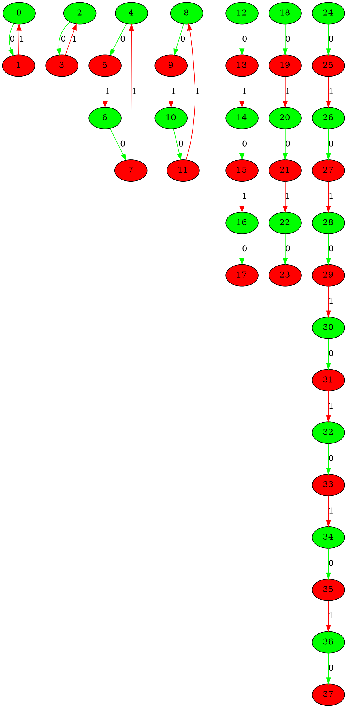
```graphviz
digraph G {
0[label="0" fillcolor="green" style="filled"];
1[label="1" fillcolor="red" style="filled"];
2[label="2" fillcolor="green" style="filled"];
3[label="3" fillcolor="red" style="filled"];
4[label="4" fillcolor="green" style="filled"];
5[label="5" fillcolor="red" style="filled"];
6[label="6" fillcolor="green" style="filled"];
7[label="7" fillcolor="red" style="filled"];
8[label="8" fillcolor="green" style="filled"];
9[label="9" fillcolor="red" style="filled"];
10[label="10" fillcolor="green" style="filled"];
11[label="11" fillcolor="red" style="filled"];
12[label="12" fillcolor="green" style="filled"];
13[label="13" fillcolor="red" style="filled"];
14[label="14" fillcolor="green" style="filled"];
15[label="15" fillcolor="red" style="filled"];
16[label="16" fillcolor="green" style="filled"];
17[label="17" fillcolor="red" style="filled"];
18[label="18" fillcolor="green" style="filled"];
19[label="19" fillcolor="red" style="filled"];
20[label="20" fillcolor="green" style="filled"];
21[label="21" fillcolor="red" style="filled"];
22[label="22" fillcolor="green" style="filled"];
23[label="23" fillcolor="red" style="filled"];
24[label="24" fillcolor="green" style="filled"];
25[label="25" fillcolor="red" style="filled"];
26[label="26" fillcolor="green" style="filled"];
27[label="27" fillcolor="red" style="filled"];
28[label="28" fillcolor="green" style="filled"];
29[label="29" fillcolor="red" style="filled"];
30[label="30" fillcolor="green" style="filled"];
31[label="31" fillcolor="red" style="filled"];
32[label="32" fillcolor="green" style="filled"];
33[label="33" fillcolor="red" style="filled"];
34[label="34" fillcolor="green" style="filled"];
35[label="35" fillcolor="red" style="filled"];
36[label="36" fillcolor="green" style="filled"];
37[label="37" fillcolor="red" style="filled"];
0->1 [label="0" color="green"];
2->3 [label="0" color="green"];
4->5 [label="0" color="green"];
6->7 [label="0" color="green"];
8->9 [label="0" color="green"];
10->11 [label="0" color="green"];
12->13 [label="0" color="green"];
14->15 [label="0" color="green"];
16->17 [label="0" color="green"];
18->19 [label="0" color="green"];
20->21 [label="0" color="green"];
22->23 [label="0" color="green"];
24->25 [label="0" color="green"];
26->27 [label="0" color="green"];
28->29 [label="0" color="green"];
30->31 [label="0" color="green"];
32->33 [label="0" color="green"];
34->35 [label="0" color="green"];
36->37 [label="0" color="green"];
1->0 [label="1" color="red"];
3->2 [label="1" color="red"];
5->6 [label="1" color="red"];
7->4 [label="1" color="red"];
9->10 [label="1" color="red"];
11->8 [label="1" color="red"];
13->14 [label="1" color="red"];
15->16 [label="1" color="red"];
19->20 [label="1" color="red"];
21->22 [label="1" color="red"];
25->26 [label="1" color="red"];
27->28 [label="1" color="red"];
29->30 [label="1" color="red"];
31->32 [label="1" color="red"];
33->34 [label="1" color="red"];
35->36 [label="1" color="red"];
}
```
___
## Graph 12218 - list de compréhension : 1,1,2,2,3|3,7
___
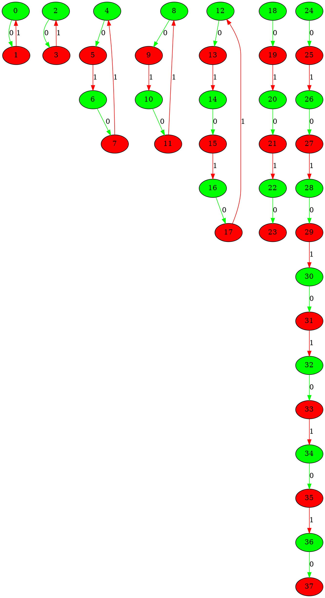
```graphviz
digraph G {
0[label="0" fillcolor="green" style="filled"];
1[label="1" fillcolor="red" style="filled"];
2[label="2" fillcolor="green" style="filled"];
3[label="3" fillcolor="red" style="filled"];
4[label="4" fillcolor="green" style="filled"];
5[label="5" fillcolor="red" style="filled"];
6[label="6" fillcolor="green" style="filled"];
7[label="7" fillcolor="red" style="filled"];
8[label="8" fillcolor="green" style="filled"];
9[label="9" fillcolor="red" style="filled"];
10[label="10" fillcolor="green" style="filled"];
11[label="11" fillcolor="red" style="filled"];
12[label="12" fillcolor="green" style="filled"];
13[label="13" fillcolor="red" style="filled"];
14[label="14" fillcolor="green" style="filled"];
15[label="15" fillcolor="red" style="filled"];
16[label="16" fillcolor="green" style="filled"];
17[label="17" fillcolor="red" style="filled"];
18[label="18" fillcolor="green" style="filled"];
19[label="19" fillcolor="red" style="filled"];
20[label="20" fillcolor="green" style="filled"];
21[label="21" fillcolor="red" style="filled"];
22[label="22" fillcolor="green" style="filled"];
23[label="23" fillcolor="red" style="filled"];
24[label="24" fillcolor="green" style="filled"];
25[label="25" fillcolor="red" style="filled"];
26[label="26" fillcolor="green" style="filled"];
27[label="27" fillcolor="red" style="filled"];
28[label="28" fillcolor="green" style="filled"];
29[label="29" fillcolor="red" style="filled"];
30[label="30" fillcolor="green" style="filled"];
31[label="31" fillcolor="red" style="filled"];
32[label="32" fillcolor="green" style="filled"];
33[label="33" fillcolor="red" style="filled"];
34[label="34" fillcolor="green" style="filled"];
35[label="35" fillcolor="red" style="filled"];
36[label="36" fillcolor="green" style="filled"];
37[label="37" fillcolor="red" style="filled"];
0->1 [label="0" color="green"];
2->3 [label="0" color="green"];
4->5 [label="0" color="green"];
6->7 [label="0" color="green"];
8->9 [label="0" color="green"];
10->11 [label="0" color="green"];
12->13 [label="0" color="green"];
14->15 [label="0" color="green"];
16->17 [label="0" color="green"];
18->19 [label="0" color="green"];
20->21 [label="0" color="green"];
22->23 [label="0" color="green"];
24->25 [label="0" color="green"];
26->27 [label="0" color="green"];
28->29 [label="0" color="green"];
30->31 [label="0" color="green"];
32->33 [label="0" color="green"];
34->35 [label="0" color="green"];
36->37 [label="0" color="green"];
1->0 [label="1" color="red"];
3->2 [label="1" color="red"];
5->6 [label="1" color="red"];
7->4 [label="1" color="red"];
9->10 [label="1" color="red"];
11->8 [label="1" color="red"];
13->14 [label="1" color="red"];
15->16 [label="1" color="red"];
17->12 [label="1" color="red"];
19->20 [label="1" color="red"];
21->22 [label="1" color="red"];
25->26 [label="1" color="red"];
27->28 [label="1" color="red"];
29->30 [label="1" color="red"];
31->32 [label="1" color="red"];
33->34 [label="1" color="red"];
35->36 [label="1" color="red"];
}
```
___
## Graph 12219 - list de compréhension : 1,1,2,2,3,3|7
___
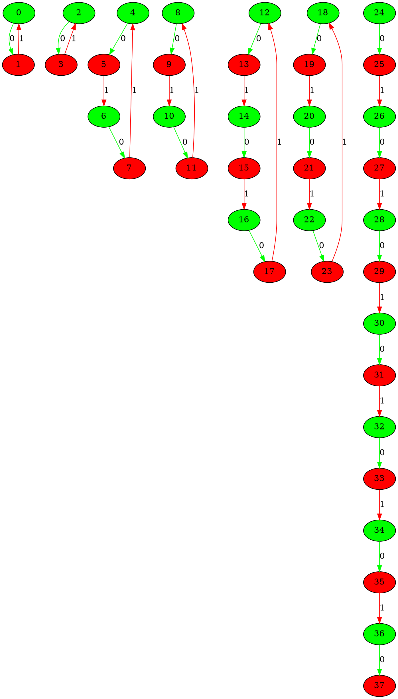
```graphviz
digraph G {
0[label="0" fillcolor="green" style="filled"];
1[label="1" fillcolor="red" style="filled"];
2[label="2" fillcolor="green" style="filled"];
3[label="3" fillcolor="red" style="filled"];
4[label="4" fillcolor="green" style="filled"];
5[label="5" fillcolor="red" style="filled"];
6[label="6" fillcolor="green" style="filled"];
7[label="7" fillcolor="red" style="filled"];
8[label="8" fillcolor="green" style="filled"];
9[label="9" fillcolor="red" style="filled"];
10[label="10" fillcolor="green" style="filled"];
11[label="11" fillcolor="red" style="filled"];
12[label="12" fillcolor="green" style="filled"];
13[label="13" fillcolor="red" style="filled"];
14[label="14" fillcolor="green" style="filled"];
15[label="15" fillcolor="red" style="filled"];
16[label="16" fillcolor="green" style="filled"];
17[label="17" fillcolor="red" style="filled"];
18[label="18" fillcolor="green" style="filled"];
19[label="19" fillcolor="red" style="filled"];
20[label="20" fillcolor="green" style="filled"];
21[label="21" fillcolor="red" style="filled"];
22[label="22" fillcolor="green" style="filled"];
23[label="23" fillcolor="red" style="filled"];
24[label="24" fillcolor="green" style="filled"];
25[label="25" fillcolor="red" style="filled"];
26[label="26" fillcolor="green" style="filled"];
27[label="27" fillcolor="red" style="filled"];
28[label="28" fillcolor="green" style="filled"];
29[label="29" fillcolor="red" style="filled"];
30[label="30" fillcolor="green" style="filled"];
31[label="31" fillcolor="red" style="filled"];
32[label="32" fillcolor="green" style="filled"];
33[label="33" fillcolor="red" style="filled"];
34[label="34" fillcolor="green" style="filled"];
35[label="35" fillcolor="red" style="filled"];
36[label="36" fillcolor="green" style="filled"];
37[label="37" fillcolor="red" style="filled"];
0->1 [label="0" color="green"];
2->3 [label="0" color="green"];
4->5 [label="0" color="green"];
6->7 [label="0" color="green"];
8->9 [label="0" color="green"];
10->11 [label="0" color="green"];
12->13 [label="0" color="green"];
14->15 [label="0" color="green"];
16->17 [label="0" color="green"];
18->19 [label="0" color="green"];
20->21 [label="0" color="green"];
22->23 [label="0" color="green"];
24->25 [label="0" color="green"];
26->27 [label="0" color="green"];
28->29 [label="0" color="green"];
30->31 [label="0" color="green"];
32->33 [label="0" color="green"];
34->35 [label="0" color="green"];
36->37 [label="0" color="green"];
1->0 [label="1" color="red"];
3->2 [label="1" color="red"];
5->6 [label="1" color="red"];
7->4 [label="1" color="red"];
9->10 [label="1" color="red"];
11->8 [label="1" color="red"];
13->14 [label="1" color="red"];
15->16 [label="1" color="red"];
17->12 [label="1" color="red"];
19->20 [label="1" color="red"];
21->22 [label="1" color="red"];
23->18 [label="1" color="red"];
25->26 [label="1" color="red"];
27->28 [label="1" color="red"];
29->30 [label="1" color="red"];
31->32 [label="1" color="red"];
33->34 [label="1" color="red"];
35->36 [label="1" color="red"];
}
```
___
## Graph 12220 - list de compréhension : 1,1,2,2,3,3,7|0
___
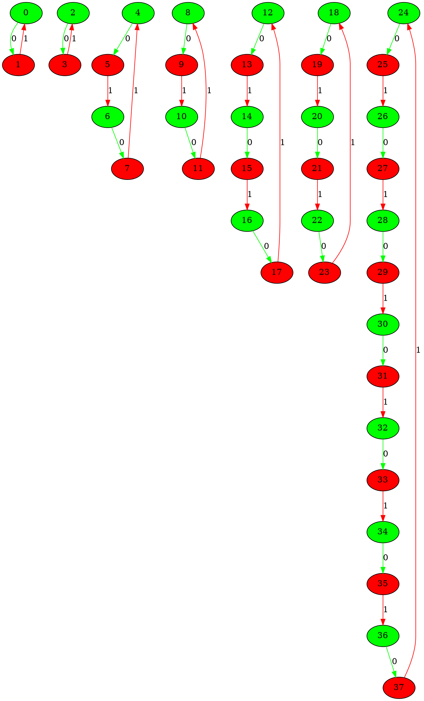
```graphviz
digraph G {
0[label="0" fillcolor="green" style="filled"];
1[label="1" fillcolor="red" style="filled"];
2[label="2" fillcolor="green" style="filled"];
3[label="3" fillcolor="red" style="filled"];
4[label="4" fillcolor="green" style="filled"];
5[label="5" fillcolor="red" style="filled"];
6[label="6" fillcolor="green" style="filled"];
7[label="7" fillcolor="red" style="filled"];
8[label="8" fillcolor="green" style="filled"];
9[label="9" fillcolor="red" style="filled"];
10[label="10" fillcolor="green" style="filled"];
11[label="11" fillcolor="red" style="filled"];
12[label="12" fillcolor="green" style="filled"];
13[label="13" fillcolor="red" style="filled"];
14[label="14" fillcolor="green" style="filled"];
15[label="15" fillcolor="red" style="filled"];
16[label="16" fillcolor="green" style="filled"];
17[label="17" fillcolor="red" style="filled"];
18[label="18" fillcolor="green" style="filled"];
19[label="19" fillcolor="red" style="filled"];
20[label="20" fillcolor="green" style="filled"];
21[label="21" fillcolor="red" style="filled"];
22[label="22" fillcolor="green" style="filled"];
23[label="23" fillcolor="red" style="filled"];
24[label="24" fillcolor="green" style="filled"];
25[label="25" fillcolor="red" style="filled"];
26[label="26" fillcolor="green" style="filled"];
27[label="27" fillcolor="red" style="filled"];
28[label="28" fillcolor="green" style="filled"];
29[label="29" fillcolor="red" style="filled"];
30[label="30" fillcolor="green" style="filled"];
31[label="31" fillcolor="red" style="filled"];
32[label="32" fillcolor="green" style="filled"];
33[label="33" fillcolor="red" style="filled"];
34[label="34" fillcolor="green" style="filled"];
35[label="35" fillcolor="red" style="filled"];
36[label="36" fillcolor="green" style="filled"];
37[label="37" fillcolor="red" style="filled"];
0->1 [label="0" color="green"];
2->3 [label="0" color="green"];
4->5 [label="0" color="green"];
6->7 [label="0" color="green"];
8->9 [label="0" color="green"];
10->11 [label="0" color="green"];
12->13 [label="0" color="green"];
14->15 [label="0" color="green"];
16->17 [label="0" color="green"];
18->19 [label="0" color="green"];
20->21 [label="0" color="green"];
22->23 [label="0" color="green"];
24->25 [label="0" color="green"];
26->27 [label="0" color="green"];
28->29 [label="0" color="green"];
30->31 [label="0" color="green"];
32->33 [label="0" color="green"];
34->35 [label="0" color="green"];
36->37 [label="0" color="green"];
1->0 [label="1" color="red"];
3->2 [label="1" color="red"];
5->6 [label="1" color="red"];
7->4 [label="1" color="red"];
9->10 [label="1" color="red"];
11->8 [label="1" color="red"];
13->14 [label="1" color="red"];
15->16 [label="1" color="red"];
17->12 [label="1" color="red"];
19->20 [label="1" color="red"];
21->22 [label="1" color="red"];
23->18 [label="1" color="red"];
25->26 [label="1" color="red"];
27->28 [label="1" color="red"];
29->30 [label="1" color="red"];
31->32 [label="1" color="red"];
33->34 [label="1" color="red"];
35->36 [label="1" color="red"];
37->24 [label="1" color="red"];
}
```
___
## Graph 12221 - list de compréhension : 1,1,2,2,3,7|3
___
```graphviz
digraph G {
0[label="0" fillcolor="green" style="filled"];
1[label="1" fillcolor="red" style="filled"];
2[label="2" fillcolor="green" style="filled"];
3[label="3" fillcolor="red" style="filled"];
4[label="4" fillcolor="green" style="filled"];
5[label="5" fillcolor="red" style="filled"];
6[label="6" fillcolor="green" style="filled"];
7[label="7" fillcolor="red" style="filled"];
8[label="8" fillcolor="green" style="filled"];
9[label="9" fillcolor="red" style="filled"];
10[label="10" fillcolor="green" style="filled"];
11[label="11" fillcolor="red" style="filled"];
12[label="12" fillcolor="green" style="filled"];
13[label="13" fillcolor="red" style="filled"];
14[label="14" fillcolor="green" style="filled"];
15[label="15" fillcolor="red" style="filled"];
16[label="16" fillcolor="green" style="filled"];
17[label="17" fillcolor="red" style="filled"];
18[label="18" fillcolor="green" style="filled"];
19[label="19" fillcolor="red" style="filled"];
20[label="20" fillcolor="green" style="filled"];
21[label="21" fillcolor="red" style="filled"];
22[label="22" fillcolor="green" style="filled"];
23[label="23" fillcolor="red" style="filled"];
24[label="24" fillcolor="green" style="filled"];
25[label="25" fillcolor="red" style="filled"];
26[label="26" fillcolor="green" style="filled"];
27[label="27" fillcolor="red" style="filled"];
28[label="28" fillcolor="green" style="filled"];
29[label="29" fillcolor="red" style="filled"];
30[label="30" fillcolor="green" style="filled"];
31[label="31" fillcolor="red" style="filled"];
32[label="32" fillcolor="green" style="filled"];
33[label="33" fillcolor="red" style="filled"];
34[label="34" fillcolor="green" style="filled"];
35[label="35" fillcolor="red" style="filled"];
36[label="36" fillcolor="green" style="filled"];
37[label="37" fillcolor="red" style="filled"];
0->1 [label="0" color="green"];
2->3 [label="0" color="green"];
4->5 [label="0" color="green"];
6->7 [label="0" color="green"];
8->9 [label="0" color="green"];
10->11 [label="0" color="green"];
12->13 [label="0" color="green"];
14->15 [label="0" color="green"];
16->17 [label="0" color="green"];
18->19 [label="0" color="green"];
20->21 [label="0" color="green"];
22->23 [label="0" color="green"];
24->25 [label="0" color="green"];
26->27 [label="0" color="green"];
28->29 [label="0" color="green"];
30->31 [label="0" color="green"];
32->33 [label="0" color="green"];
34->35 [label="0" color="green"];
36->37 [label="0" color="green"];
1->0 [label="1" color="red"];
3->2 [label="1" color="red"];
5->6 [label="1" color="red"];
7->4 [label="1" color="red"];
9->10 [label="1" color="red"];
11->8 [label="1" color="red"];
13->14 [label="1" color="red"];
15->16 [label="1" color="red"];
17->12 [label="1" color="red"];
19->20 [label="1" color="red"];
21->22 [label="1" color="red"];
23->24 [label="1" color="red"];
25->26 [label="1" color="red"];
27->28 [label="1" color="red"];
29->30 [label="1" color="red"];
31->18 [label="1" color="red"];
33->34 [label="1" color="red"];
35->36 [label="1" color="red"];
}
```
___
## Graph 12222 - list de compréhension : 1,1,2,2,7|3,3
___
```graphviz
digraph G {
0[label="0" fillcolor="green" style="filled"];
1[label="1" fillcolor="red" style="filled"];
2[label="2" fillcolor="green" style="filled"];
3[label="3" fillcolor="red" style="filled"];
4[label="4" fillcolor="green" style="filled"];
5[label="5" fillcolor="red" style="filled"];
6[label="6" fillcolor="green" style="filled"];
7[label="7" fillcolor="red" style="filled"];
8[label="8" fillcolor="green" style="filled"];
9[label="9" fillcolor="red" style="filled"];
10[label="10" fillcolor="green" style="filled"];
11[label="11" fillcolor="red" style="filled"];
12[label="12" fillcolor="green" style="filled"];
13[label="13" fillcolor="red" style="filled"];
14[label="14" fillcolor="green" style="filled"];
15[label="15" fillcolor="red" style="filled"];
16[label="16" fillcolor="green" style="filled"];
17[label="17" fillcolor="red" style="filled"];
18[label="18" fillcolor="green" style="filled"];
19[label="19" fillcolor="red" style="filled"];
20[label="20" fillcolor="green" style="filled"];
21[label="21" fillcolor="red" style="filled"];
22[label="22" fillcolor="green" style="filled"];
23[label="23" fillcolor="red" style="filled"];
24[label="24" fillcolor="green" style="filled"];
25[label="25" fillcolor="red" style="filled"];
26[label="26" fillcolor="green" style="filled"];
27[label="27" fillcolor="red" style="filled"];
28[label="28" fillcolor="green" style="filled"];
29[label="29" fillcolor="red" style="filled"];
30[label="30" fillcolor="green" style="filled"];
31[label="31" fillcolor="red" style="filled"];
32[label="32" fillcolor="green" style="filled"];
33[label="33" fillcolor="red" style="filled"];
34[label="34" fillcolor="green" style="filled"];
35[label="35" fillcolor="red" style="filled"];
36[label="36" fillcolor="green" style="filled"];
37[label="37" fillcolor="red" style="filled"];
0->1 [label="0" color="green"];
2->3 [label="0" color="green"];
4->5 [label="0" color="green"];
6->7 [label="0" color="green"];
8->9 [label="0" color="green"];
10->11 [label="0" color="green"];
12->13 [label="0" color="green"];
14->15 [label="0" color="green"];
16->17 [label="0" color="green"];
18->19 [label="0" color="green"];
20->21 [label="0" color="green"];
22->23 [label="0" color="green"];
24->25 [label="0" color="green"];
26->27 [label="0" color="green"];
28->29 [label="0" color="green"];
30->31 [label="0" color="green"];
32->33 [label="0" color="green"];
34->35 [label="0" color="green"];
36->37 [label="0" color="green"];
1->0 [label="1" color="red"];
3->2 [label="1" color="red"];
5->6 [label="1" color="red"];
7->4 [label="1" color="red"];
9->10 [label="1" color="red"];
11->8 [label="1" color="red"];
13->14 [label="1" color="red"];
15->16 [label="1" color="red"];
17->18 [label="1" color="red"];
19->20 [label="1" color="red"];
21->22 [label="1" color="red"];
23->24 [label="1" color="red"];
25->12 [label="1" color="red"];
27->28 [label="1" color="red"];
29->30 [label="1" color="red"];
33->34 [label="1" color="red"];
35->36 [label="1" color="red"];
}
```
___
## Graph 12223 - list de compréhension : 1,1,2,3|2,3,7
___
```graphviz
digraph G {
0[label="0" fillcolor="green" style="filled"];
1[label="1" fillcolor="red" style="filled"];
2[label="2" fillcolor="green" style="filled"];
3[label="3" fillcolor="red" style="filled"];
4[label="4" fillcolor="green" style="filled"];
5[label="5" fillcolor="red" style="filled"];
6[label="6" fillcolor="green" style="filled"];
7[label="7" fillcolor="red" style="filled"];
8[label="8" fillcolor="green" style="filled"];
9[label="9" fillcolor="red" style="filled"];
10[label="10" fillcolor="green" style="filled"];
11[label="11" fillcolor="red" style="filled"];
12[label="12" fillcolor="green" style="filled"];
13[label="13" fillcolor="red" style="filled"];
14[label="14" fillcolor="green" style="filled"];
15[label="15" fillcolor="red" style="filled"];
16[label="16" fillcolor="green" style="filled"];
17[label="17" fillcolor="red" style="filled"];
18[label="18" fillcolor="green" style="filled"];
19[label="19" fillcolor="red" style="filled"];
20[label="20" fillcolor="green" style="filled"];
21[label="21" fillcolor="red" style="filled"];
22[label="22" fillcolor="green" style="filled"];
23[label="23" fillcolor="red" style="filled"];
24[label="24" fillcolor="green" style="filled"];
25[label="25" fillcolor="red" style="filled"];
26[label="26" fillcolor="green" style="filled"];
27[label="27" fillcolor="red" style="filled"];
28[label="28" fillcolor="green" style="filled"];
29[label="29" fillcolor="red" style="filled"];
30[label="30" fillcolor="green" style="filled"];
31[label="31" fillcolor="red" style="filled"];
32[label="32" fillcolor="green" style="filled"];
33[label="33" fillcolor="red" style="filled"];
34[label="34" fillcolor="green" style="filled"];
35[label="35" fillcolor="red" style="filled"];
36[label="36" fillcolor="green" style="filled"];
37[label="37" fillcolor="red" style="filled"];
0->1 [label="0" color="green"];
2->3 [label="0" color="green"];
4->5 [label="0" color="green"];
6->7 [label="0" color="green"];
8->9 [label="0" color="green"];
10->11 [label="0" color="green"];
12->13 [label="0" color="green"];
14->15 [label="0" color="green"];
16->17 [label="0" color="green"];
18->19 [label="0" color="green"];
20->21 [label="0" color="green"];
22->23 [label="0" color="green"];
24->25 [label="0" color="green"];
26->27 [label="0" color="green"];
28->29 [label="0" color="green"];
30->31 [label="0" color="green"];
32->33 [label="0" color="green"];
34->35 [label="0" color="green"];
36->37 [label="0" color="green"];
1->0 [label="1" color="red"];
3->2 [label="1" color="red"];
5->6 [label="1" color="red"];
7->4 [label="1" color="red"];
9->10 [label="1" color="red"];
11->12 [label="1" color="red"];
13->8 [label="1" color="red"];
15->16 [label="1" color="red"];
19->20 [label="1" color="red"];
21->22 [label="1" color="red"];
25->26 [label="1" color="red"];
27->28 [label="1" color="red"];
29->30 [label="1" color="red"];
31->32 [label="1" color="red"];
33->34 [label="1" color="red"];
35->36 [label="1" color="red"];
}
```
___
## Graph 12224 - list de compréhension : 1,1,2,3,3|2,7
___
```graphviz
digraph G {
0[label="0" fillcolor="green" style="filled"];
1[label="1" fillcolor="red" style="filled"];
2[label="2" fillcolor="green" style="filled"];
3[label="3" fillcolor="red" style="filled"];
4[label="4" fillcolor="green" style="filled"];
5[label="5" fillcolor="red" style="filled"];
6[label="6" fillcolor="green" style="filled"];
7[label="7" fillcolor="red" style="filled"];
8[label="8" fillcolor="green" style="filled"];
9[label="9" fillcolor="red" style="filled"];
10[label="10" fillcolor="green" style="filled"];
11[label="11" fillcolor="red" style="filled"];
12[label="12" fillcolor="green" style="filled"];
13[label="13" fillcolor="red" style="filled"];
14[label="14" fillcolor="green" style="filled"];
15[label="15" fillcolor="red" style="filled"];
16[label="16" fillcolor="green" style="filled"];
17[label="17" fillcolor="red" style="filled"];
18[label="18" fillcolor="green" style="filled"];
19[label="19" fillcolor="red" style="filled"];
20[label="20" fillcolor="green" style="filled"];
21[label="21" fillcolor="red" style="filled"];
22[label="22" fillcolor="green" style="filled"];
23[label="23" fillcolor="red" style="filled"];
24[label="24" fillcolor="green" style="filled"];
25[label="25" fillcolor="red" style="filled"];
26[label="26" fillcolor="green" style="filled"];
27[label="27" fillcolor="red" style="filled"];
28[label="28" fillcolor="green" style="filled"];
29[label="29" fillcolor="red" style="filled"];
30[label="30" fillcolor="green" style="filled"];
31[label="31" fillcolor="red" style="filled"];
32[label="32" fillcolor="green" style="filled"];
33[label="33" fillcolor="red" style="filled"];
34[label="34" fillcolor="green" style="filled"];
35[label="35" fillcolor="red" style="filled"];
36[label="36" fillcolor="green" style="filled"];
37[label="37" fillcolor="red" style="filled"];
0->1 [label="0" color="green"];
2->3 [label="0" color="green"];
4->5 [label="0" color="green"];
6->7 [label="0" color="green"];
8->9 [label="0" color="green"];
10->11 [label="0" color="green"];
12->13 [label="0" color="green"];
14->15 [label="0" color="green"];
16->17 [label="0" color="green"];
18->19 [label="0" color="green"];
20->21 [label="0" color="green"];
22->23 [label="0" color="green"];
24->25 [label="0" color="green"];
26->27 [label="0" color="green"];
28->29 [label="0" color="green"];
30->31 [label="0" color="green"];
32->33 [label="0" color="green"];
34->35 [label="0" color="green"];
36->37 [label="0" color="green"];
1->0 [label="1" color="red"];
3->2 [label="1" color="red"];
5->6 [label="1" color="red"];
7->4 [label="1" color="red"];
9->10 [label="1" color="red"];
11->12 [label="1" color="red"];
13->8 [label="1" color="red"];
15->16 [label="1" color="red"];
17->18 [label="1" color="red"];
19->14 [label="1" color="red"];
21->22 [label="1" color="red"];
25->26 [label="1" color="red"];
27->28 [label="1" color="red"];
29->30 [label="1" color="red"];
31->32 [label="1" color="red"];
33->34 [label="1" color="red"];
35->36 [label="1" color="red"];
}
```
___
## Graph 12225 - list de compréhension : 1,1,2,3,3,7|2
___
```graphviz
digraph G {
0[label="0" fillcolor="green" style="filled"];
1[label="1" fillcolor="red" style="filled"];
2[label="2" fillcolor="green" style="filled"];
3[label="3" fillcolor="red" style="filled"];
4[label="4" fillcolor="green" style="filled"];
5[label="5" fillcolor="red" style="filled"];
6[label="6" fillcolor="green" style="filled"];
7[label="7" fillcolor="red" style="filled"];
8[label="8" fillcolor="green" style="filled"];
9[label="9" fillcolor="red" style="filled"];
10[label="10" fillcolor="green" style="filled"];
11[label="11" fillcolor="red" style="filled"];
12[label="12" fillcolor="green" style="filled"];
13[label="13" fillcolor="red" style="filled"];
14[label="14" fillcolor="green" style="filled"];
15[label="15" fillcolor="red" style="filled"];
16[label="16" fillcolor="green" style="filled"];
17[label="17" fillcolor="red" style="filled"];
18[label="18" fillcolor="green" style="filled"];
19[label="19" fillcolor="red" style="filled"];
20[label="20" fillcolor="green" style="filled"];
21[label="21" fillcolor="red" style="filled"];
22[label="22" fillcolor="green" style="filled"];
23[label="23" fillcolor="red" style="filled"];
24[label="24" fillcolor="green" style="filled"];
25[label="25" fillcolor="red" style="filled"];
26[label="26" fillcolor="green" style="filled"];
27[label="27" fillcolor="red" style="filled"];
28[label="28" fillcolor="green" style="filled"];
29[label="29" fillcolor="red" style="filled"];
30[label="30" fillcolor="green" style="filled"];
31[label="31" fillcolor="red" style="filled"];
32[label="32" fillcolor="green" style="filled"];
33[label="33" fillcolor="red" style="filled"];
34[label="34" fillcolor="green" style="filled"];
35[label="35" fillcolor="red" style="filled"];
36[label="36" fillcolor="green" style="filled"];
37[label="37" fillcolor="red" style="filled"];
0->1 [label="0" color="green"];
2->3 [label="0" color="green"];
4->5 [label="0" color="green"];
6->7 [label="0" color="green"];
8->9 [label="0" color="green"];
10->11 [label="0" color="green"];
12->13 [label="0" color="green"];
14->15 [label="0" color="green"];
16->17 [label="0" color="green"];
18->19 [label="0" color="green"];
20->21 [label="0" color="green"];
22->23 [label="0" color="green"];
24->25 [label="0" color="green"];
26->27 [label="0" color="green"];
28->29 [label="0" color="green"];
30->31 [label="0" color="green"];
32->33 [label="0" color="green"];
34->35 [label="0" color="green"];
36->37 [label="0" color="green"];
1->0 [label="1" color="red"];
3->2 [label="1" color="red"];
5->6 [label="1" color="red"];
7->4 [label="1" color="red"];
9->10 [label="1" color="red"];
11->12 [label="1" color="red"];
13->8 [label="1" color="red"];
15->16 [label="1" color="red"];
17->18 [label="1" color="red"];
19->14 [label="1" color="red"];
21->22 [label="1" color="red"];
23->24 [label="1" color="red"];
25->26 [label="1" color="red"];
27->28 [label="1" color="red"];
29->30 [label="1" color="red"];
31->32 [label="1" color="red"];
33->20 [label="1" color="red"];
35->36 [label="1" color="red"];
}
```
___
## Graph 12226 - list de compréhension : 1,1,2,3,7|2,3
___
```graphviz
digraph G {
0[label="0" fillcolor="green" style="filled"];
1[label="1" fillcolor="red" style="filled"];
2[label="2" fillcolor="green" style="filled"];
3[label="3" fillcolor="red" style="filled"];
4[label="4" fillcolor="green" style="filled"];
5[label="5" fillcolor="red" style="filled"];
6[label="6" fillcolor="green" style="filled"];
7[label="7" fillcolor="red" style="filled"];
8[label="8" fillcolor="green" style="filled"];
9[label="9" fillcolor="red" style="filled"];
10[label="10" fillcolor="green" style="filled"];
11[label="11" fillcolor="red" style="filled"];
12[label="12" fillcolor="green" style="filled"];
13[label="13" fillcolor="red" style="filled"];
14[label="14" fillcolor="green" style="filled"];
15[label="15" fillcolor="red" style="filled"];
16[label="16" fillcolor="green" style="filled"];
17[label="17" fillcolor="red" style="filled"];
18[label="18" fillcolor="green" style="filled"];
19[label="19" fillcolor="red" style="filled"];
20[label="20" fillcolor="green" style="filled"];
21[label="21" fillcolor="red" style="filled"];
22[label="22" fillcolor="green" style="filled"];
23[label="23" fillcolor="red" style="filled"];
24[label="24" fillcolor="green" style="filled"];
25[label="25" fillcolor="red" style="filled"];
26[label="26" fillcolor="green" style="filled"];
27[label="27" fillcolor="red" style="filled"];
28[label="28" fillcolor="green" style="filled"];
29[label="29" fillcolor="red" style="filled"];
30[label="30" fillcolor="green" style="filled"];
31[label="31" fillcolor="red" style="filled"];
32[label="32" fillcolor="green" style="filled"];
33[label="33" fillcolor="red" style="filled"];
34[label="34" fillcolor="green" style="filled"];
35[label="35" fillcolor="red" style="filled"];
36[label="36" fillcolor="green" style="filled"];
37[label="37" fillcolor="red" style="filled"];
0->1 [label="0" color="green"];
2->3 [label="0" color="green"];
4->5 [label="0" color="green"];
6->7 [label="0" color="green"];
8->9 [label="0" color="green"];
10->11 [label="0" color="green"];
12->13 [label="0" color="green"];
14->15 [label="0" color="green"];
16->17 [label="0" color="green"];
18->19 [label="0" color="green"];
20->21 [label="0" color="green"];
22->23 [label="0" color="green"];
24->25 [label="0" color="green"];
26->27 [label="0" color="green"];
28->29 [label="0" color="green"];
30->31 [label="0" color="green"];
32->33 [label="0" color="green"];
34->35 [label="0" color="green"];
36->37 [label="0" color="green"];
1->0 [label="1" color="red"];
3->2 [label="1" color="red"];
5->6 [label="1" color="red"];
7->4 [label="1" color="red"];
9->10 [label="1" color="red"];
11->12 [label="1" color="red"];
13->8 [label="1" color="red"];
15->16 [label="1" color="red"];
17->18 [label="1" color="red"];
19->20 [label="1" color="red"];
21->22 [label="1" color="red"];
23->24 [label="1" color="red"];
25->26 [label="1" color="red"];
27->14 [label="1" color="red"];
29->30 [label="1" color="red"];
33->34 [label="1" color="red"];
35->36 [label="1" color="red"];
}
```
___
## Graph 12227 - list de compréhension : 1,1,2,7|2,3,3
___
```graphviz
digraph G {
0[label="0" fillcolor="green" style="filled"];
1[label="1" fillcolor="red" style="filled"];
2[label="2" fillcolor="green" style="filled"];
3[label="3" fillcolor="red" style="filled"];
4[label="4" fillcolor="green" style="filled"];
5[label="5" fillcolor="red" style="filled"];
6[label="6" fillcolor="green" style="filled"];
7[label="7" fillcolor="red" style="filled"];
8[label="8" fillcolor="green" style="filled"];
9[label="9" fillcolor="red" style="filled"];
10[label="10" fillcolor="green" style="filled"];
11[label="11" fillcolor="red" style="filled"];
12[label="12" fillcolor="green" style="filled"];
13[label="13" fillcolor="red" style="filled"];
14[label="14" fillcolor="green" style="filled"];
15[label="15" fillcolor="red" style="filled"];
16[label="16" fillcolor="green" style="filled"];
17[label="17" fillcolor="red" style="filled"];
18[label="18" fillcolor="green" style="filled"];
19[label="19" fillcolor="red" style="filled"];
20[label="20" fillcolor="green" style="filled"];
21[label="21" fillcolor="red" style="filled"];
22[label="22" fillcolor="green" style="filled"];
23[label="23" fillcolor="red" style="filled"];
24[label="24" fillcolor="green" style="filled"];
25[label="25" fillcolor="red" style="filled"];
26[label="26" fillcolor="green" style="filled"];
27[label="27" fillcolor="red" style="filled"];
28[label="28" fillcolor="green" style="filled"];
29[label="29" fillcolor="red" style="filled"];
30[label="30" fillcolor="green" style="filled"];
31[label="31" fillcolor="red" style="filled"];
32[label="32" fillcolor="green" style="filled"];
33[label="33" fillcolor="red" style="filled"];
34[label="34" fillcolor="green" style="filled"];
35[label="35" fillcolor="red" style="filled"];
36[label="36" fillcolor="green" style="filled"];
37[label="37" fillcolor="red" style="filled"];
0->1 [label="0" color="green"];
2->3 [label="0" color="green"];
4->5 [label="0" color="green"];
6->7 [label="0" color="green"];
8->9 [label="0" color="green"];
10->11 [label="0" color="green"];
12->13 [label="0" color="green"];
14->15 [label="0" color="green"];
16->17 [label="0" color="green"];
18->19 [label="0" color="green"];
20->21 [label="0" color="green"];
22->23 [label="0" color="green"];
24->25 [label="0" color="green"];
26->27 [label="0" color="green"];
28->29 [label="0" color="green"];
30->31 [label="0" color="green"];
32->33 [label="0" color="green"];
34->35 [label="0" color="green"];
36->37 [label="0" color="green"];
1->0 [label="1" color="red"];
3->2 [label="1" color="red"];
5->6 [label="1" color="red"];
7->4 [label="1" color="red"];
9->10 [label="1" color="red"];
11->12 [label="1" color="red"];
13->14 [label="1" color="red"];
15->16 [label="1" color="red"];
17->18 [label="1" color="red"];
19->20 [label="1" color="red"];
21->8 [label="1" color="red"];
23->24 [label="1" color="red"];
27->28 [label="1" color="red"];
29->30 [label="1" color="red"];
33->34 [label="1" color="red"];
35->36 [label="1" color="red"];
}
```
___
## Graph 12228 - list de compréhension : 1,1,3|2,2,3,7
___
```graphviz
digraph G {
0[label="0" fillcolor="green" style="filled"];
1[label="1" fillcolor="red" style="filled"];
2[label="2" fillcolor="green" style="filled"];
3[label="3" fillcolor="red" style="filled"];
4[label="4" fillcolor="green" style="filled"];
5[label="5" fillcolor="red" style="filled"];
6[label="6" fillcolor="green" style="filled"];
7[label="7" fillcolor="red" style="filled"];
8[label="8" fillcolor="green" style="filled"];
9[label="9" fillcolor="red" style="filled"];
10[label="10" fillcolor="green" style="filled"];
11[label="11" fillcolor="red" style="filled"];
12[label="12" fillcolor="green" style="filled"];
13[label="13" fillcolor="red" style="filled"];
14[label="14" fillcolor="green" style="filled"];
15[label="15" fillcolor="red" style="filled"];
16[label="16" fillcolor="green" style="filled"];
17[label="17" fillcolor="red" style="filled"];
18[label="18" fillcolor="green" style="filled"];
19[label="19" fillcolor="red" style="filled"];
20[label="20" fillcolor="green" style="filled"];
21[label="21" fillcolor="red" style="filled"];
22[label="22" fillcolor="green" style="filled"];
23[label="23" fillcolor="red" style="filled"];
24[label="24" fillcolor="green" style="filled"];
25[label="25" fillcolor="red" style="filled"];
26[label="26" fillcolor="green" style="filled"];
27[label="27" fillcolor="red" style="filled"];
28[label="28" fillcolor="green" style="filled"];
29[label="29" fillcolor="red" style="filled"];
30[label="30" fillcolor="green" style="filled"];
31[label="31" fillcolor="red" style="filled"];
32[label="32" fillcolor="green" style="filled"];
33[label="33" fillcolor="red" style="filled"];
34[label="34" fillcolor="green" style="filled"];
35[label="35" fillcolor="red" style="filled"];
36[label="36" fillcolor="green" style="filled"];
37[label="37" fillcolor="red" style="filled"];
0->1 [label="0" color="green"];
2->3 [label="0" color="green"];
4->5 [label="0" color="green"];
6->7 [label="0" color="green"];
8->9 [label="0" color="green"];
10->11 [label="0" color="green"];
12->13 [label="0" color="green"];
14->15 [label="0" color="green"];
16->17 [label="0" color="green"];
18->19 [label="0" color="green"];
20->21 [label="0" color="green"];
22->23 [label="0" color="green"];
24->25 [label="0" color="green"];
26->27 [label="0" color="green"];
28->29 [label="0" color="green"];
30->31 [label="0" color="green"];
32->33 [label="0" color="green"];
34->35 [label="0" color="green"];
36->37 [label="0" color="green"];
1->0 [label="1" color="red"];
3->2 [label="1" color="red"];
5->6 [label="1" color="red"];
7->8 [label="1" color="red"];
9->4 [label="1" color="red"];
11->12 [label="1" color="red"];
15->16 [label="1" color="red"];
19->20 [label="1" color="red"];
21->22 [label="1" color="red"];
25->26 [label="1" color="red"];
27->28 [label="1" color="red"];
29->30 [label="1" color="red"];
31->32 [label="1" color="red"];
33->34 [label="1" color="red"];
35->36 [label="1" color="red"];
}
```
___
## Graph 12229 - list de compréhension : 1,1,3,3|2,2,7
___
```graphviz
digraph G {
0[label="0" fillcolor="green" style="filled"];
1[label="1" fillcolor="red" style="filled"];
2[label="2" fillcolor="green" style="filled"];
3[label="3" fillcolor="red" style="filled"];
4[label="4" fillcolor="green" style="filled"];
5[label="5" fillcolor="red" style="filled"];
6[label="6" fillcolor="green" style="filled"];
7[label="7" fillcolor="red" style="filled"];
8[label="8" fillcolor="green" style="filled"];
9[label="9" fillcolor="red" style="filled"];
10[label="10" fillcolor="green" style="filled"];
11[label="11" fillcolor="red" style="filled"];
12[label="12" fillcolor="green" style="filled"];
13[label="13" fillcolor="red" style="filled"];
14[label="14" fillcolor="green" style="filled"];
15[label="15" fillcolor="red" style="filled"];
16[label="16" fillcolor="green" style="filled"];
17[label="17" fillcolor="red" style="filled"];
18[label="18" fillcolor="green" style="filled"];
19[label="19" fillcolor="red" style="filled"];
20[label="20" fillcolor="green" style="filled"];
21[label="21" fillcolor="red" style="filled"];
22[label="22" fillcolor="green" style="filled"];
23[label="23" fillcolor="red" style="filled"];
24[label="24" fillcolor="green" style="filled"];
25[label="25" fillcolor="red" style="filled"];
26[label="26" fillcolor="green" style="filled"];
27[label="27" fillcolor="red" style="filled"];
28[label="28" fillcolor="green" style="filled"];
29[label="29" fillcolor="red" style="filled"];
30[label="30" fillcolor="green" style="filled"];
31[label="31" fillcolor="red" style="filled"];
32[label="32" fillcolor="green" style="filled"];
33[label="33" fillcolor="red" style="filled"];
34[label="34" fillcolor="green" style="filled"];
35[label="35" fillcolor="red" style="filled"];
36[label="36" fillcolor="green" style="filled"];
37[label="37" fillcolor="red" style="filled"];
0->1 [label="0" color="green"];
2->3 [label="0" color="green"];
4->5 [label="0" color="green"];
6->7 [label="0" color="green"];
8->9 [label="0" color="green"];
10->11 [label="0" color="green"];
12->13 [label="0" color="green"];
14->15 [label="0" color="green"];
16->17 [label="0" color="green"];
18->19 [label="0" color="green"];
20->21 [label="0" color="green"];
22->23 [label="0" color="green"];
24->25 [label="0" color="green"];
26->27 [label="0" color="green"];
28->29 [label="0" color="green"];
30->31 [label="0" color="green"];
32->33 [label="0" color="green"];
34->35 [label="0" color="green"];
36->37 [label="0" color="green"];
1->0 [label="1" color="red"];
3->2 [label="1" color="red"];
5->6 [label="1" color="red"];
7->8 [label="1" color="red"];
9->4 [label="1" color="red"];
11->12 [label="1" color="red"];
13->14 [label="1" color="red"];
15->10 [label="1" color="red"];
17->18 [label="1" color="red"];
21->22 [label="1" color="red"];
25->26 [label="1" color="red"];
27->28 [label="1" color="red"];
29->30 [label="1" color="red"];
31->32 [label="1" color="red"];
33->34 [label="1" color="red"];
35->36 [label="1" color="red"];
}
```
___
## Graph 12230 - list de compréhension : 1,1,3,3,7|2,2
___
```graphviz
digraph G {
0[label="0" fillcolor="green" style="filled"];
1[label="1" fillcolor="red" style="filled"];
2[label="2" fillcolor="green" style="filled"];
3[label="3" fillcolor="red" style="filled"];
4[label="4" fillcolor="green" style="filled"];
5[label="5" fillcolor="red" style="filled"];
6[label="6" fillcolor="green" style="filled"];
7[label="7" fillcolor="red" style="filled"];
8[label="8" fillcolor="green" style="filled"];
9[label="9" fillcolor="red" style="filled"];
10[label="10" fillcolor="green" style="filled"];
11[label="11" fillcolor="red" style="filled"];
12[label="12" fillcolor="green" style="filled"];
13[label="13" fillcolor="red" style="filled"];
14[label="14" fillcolor="green" style="filled"];
15[label="15" fillcolor="red" style="filled"];
16[label="16" fillcolor="green" style="filled"];
17[label="17" fillcolor="red" style="filled"];
18[label="18" fillcolor="green" style="filled"];
19[label="19" fillcolor="red" style="filled"];
20[label="20" fillcolor="green" style="filled"];
21[label="21" fillcolor="red" style="filled"];
22[label="22" fillcolor="green" style="filled"];
23[label="23" fillcolor="red" style="filled"];
24[label="24" fillcolor="green" style="filled"];
25[label="25" fillcolor="red" style="filled"];
26[label="26" fillcolor="green" style="filled"];
27[label="27" fillcolor="red" style="filled"];
28[label="28" fillcolor="green" style="filled"];
29[label="29" fillcolor="red" style="filled"];
30[label="30" fillcolor="green" style="filled"];
31[label="31" fillcolor="red" style="filled"];
32[label="32" fillcolor="green" style="filled"];
33[label="33" fillcolor="red" style="filled"];
34[label="34" fillcolor="green" style="filled"];
35[label="35" fillcolor="red" style="filled"];
36[label="36" fillcolor="green" style="filled"];
37[label="37" fillcolor="red" style="filled"];
0->1 [label="0" color="green"];
2->3 [label="0" color="green"];
4->5 [label="0" color="green"];
6->7 [label="0" color="green"];
8->9 [label="0" color="green"];
10->11 [label="0" color="green"];
12->13 [label="0" color="green"];
14->15 [label="0" color="green"];
16->17 [label="0" color="green"];
18->19 [label="0" color="green"];
20->21 [label="0" color="green"];
22->23 [label="0" color="green"];
24->25 [label="0" color="green"];
26->27 [label="0" color="green"];
28->29 [label="0" color="green"];
30->31 [label="0" color="green"];
32->33 [label="0" color="green"];
34->35 [label="0" color="green"];
36->37 [label="0" color="green"];
1->0 [label="1" color="red"];
3->2 [label="1" color="red"];
5->6 [label="1" color="red"];
7->8 [label="1" color="red"];
9->4 [label="1" color="red"];
11->12 [label="1" color="red"];
13->14 [label="1" color="red"];
15->10 [label="1" color="red"];
17->18 [label="1" color="red"];
19->20 [label="1" color="red"];
21->22 [label="1" color="red"];
23->24 [label="1" color="red"];
25->26 [label="1" color="red"];
27->28 [label="1" color="red"];
29->16 [label="1" color="red"];
31->32 [label="1" color="red"];
35->36 [label="1" color="red"];
}
```
___
## Graph 12231 - list de compréhension : 1,1,3,7|2,2,3
___
```graphviz
digraph G {
0[label="0" fillcolor="green" style="filled"];
1[label="1" fillcolor="red" style="filled"];
2[label="2" fillcolor="green" style="filled"];
3[label="3" fillcolor="red" style="filled"];
4[label="4" fillcolor="green" style="filled"];
5[label="5" fillcolor="red" style="filled"];
6[label="6" fillcolor="green" style="filled"];
7[label="7" fillcolor="red" style="filled"];
8[label="8" fillcolor="green" style="filled"];
9[label="9" fillcolor="red" style="filled"];
10[label="10" fillcolor="green" style="filled"];
11[label="11" fillcolor="red" style="filled"];
12[label="12" fillcolor="green" style="filled"];
13[label="13" fillcolor="red" style="filled"];
14[label="14" fillcolor="green" style="filled"];
15[label="15" fillcolor="red" style="filled"];
16[label="16" fillcolor="green" style="filled"];
17[label="17" fillcolor="red" style="filled"];
18[label="18" fillcolor="green" style="filled"];
19[label="19" fillcolor="red" style="filled"];
20[label="20" fillcolor="green" style="filled"];
21[label="21" fillcolor="red" style="filled"];
22[label="22" fillcolor="green" style="filled"];
23[label="23" fillcolor="red" style="filled"];
24[label="24" fillcolor="green" style="filled"];
25[label="25" fillcolor="red" style="filled"];
26[label="26" fillcolor="green" style="filled"];
27[label="27" fillcolor="red" style="filled"];
28[label="28" fillcolor="green" style="filled"];
29[label="29" fillcolor="red" style="filled"];
30[label="30" fillcolor="green" style="filled"];
31[label="31" fillcolor="red" style="filled"];
32[label="32" fillcolor="green" style="filled"];
33[label="33" fillcolor="red" style="filled"];
34[label="34" fillcolor="green" style="filled"];
35[label="35" fillcolor="red" style="filled"];
36[label="36" fillcolor="green" style="filled"];
37[label="37" fillcolor="red" style="filled"];
0->1 [label="0" color="green"];
2->3 [label="0" color="green"];
4->5 [label="0" color="green"];
6->7 [label="0" color="green"];
8->9 [label="0" color="green"];
10->11 [label="0" color="green"];
12->13 [label="0" color="green"];
14->15 [label="0" color="green"];
16->17 [label="0" color="green"];
18->19 [label="0" color="green"];
20->21 [label="0" color="green"];
22->23 [label="0" color="green"];
24->25 [label="0" color="green"];
26->27 [label="0" color="green"];
28->29 [label="0" color="green"];
30->31 [label="0" color="green"];
32->33 [label="0" color="green"];
34->35 [label="0" color="green"];
36->37 [label="0" color="green"];
1->0 [label="1" color="red"];
3->2 [label="1" color="red"];
5->6 [label="1" color="red"];
7->8 [label="1" color="red"];
9->4 [label="1" color="red"];
11->12 [label="1" color="red"];
13->14 [label="1" color="red"];
15->16 [label="1" color="red"];
17->18 [label="1" color="red"];
19->20 [label="1" color="red"];
21->22 [label="1" color="red"];
23->10 [label="1" color="red"];
25->26 [label="1" color="red"];
29->30 [label="1" color="red"];
33->34 [label="1" color="red"];
35->36 [label="1" color="red"];
}
```
___
## Graph 12232 - list de compréhension : 1,1,7|2,2,3,3
___
```graphviz
digraph G {
0[label="0" fillcolor="green" style="filled"];
1[label="1" fillcolor="red" style="filled"];
2[label="2" fillcolor="green" style="filled"];
3[label="3" fillcolor="red" style="filled"];
4[label="4" fillcolor="green" style="filled"];
5[label="5" fillcolor="red" style="filled"];
6[label="6" fillcolor="green" style="filled"];
7[label="7" fillcolor="red" style="filled"];
8[label="8" fillcolor="green" style="filled"];
9[label="9" fillcolor="red" style="filled"];
10[label="10" fillcolor="green" style="filled"];
11[label="11" fillcolor="red" style="filled"];
12[label="12" fillcolor="green" style="filled"];
13[label="13" fillcolor="red" style="filled"];
14[label="14" fillcolor="green" style="filled"];
15[label="15" fillcolor="red" style="filled"];
16[label="16" fillcolor="green" style="filled"];
17[label="17" fillcolor="red" style="filled"];
18[label="18" fillcolor="green" style="filled"];
19[label="19" fillcolor="red" style="filled"];
20[label="20" fillcolor="green" style="filled"];
21[label="21" fillcolor="red" style="filled"];
22[label="22" fillcolor="green" style="filled"];
23[label="23" fillcolor="red" style="filled"];
24[label="24" fillcolor="green" style="filled"];
25[label="25" fillcolor="red" style="filled"];
26[label="26" fillcolor="green" style="filled"];
27[label="27" fillcolor="red" style="filled"];
28[label="28" fillcolor="green" style="filled"];
29[label="29" fillcolor="red" style="filled"];
30[label="30" fillcolor="green" style="filled"];
31[label="31" fillcolor="red" style="filled"];
32[label="32" fillcolor="green" style="filled"];
33[label="33" fillcolor="red" style="filled"];
34[label="34" fillcolor="green" style="filled"];
35[label="35" fillcolor="red" style="filled"];
36[label="36" fillcolor="green" style="filled"];
37[label="37" fillcolor="red" style="filled"];
0->1 [label="0" color="green"];
2->3 [label="0" color="green"];
4->5 [label="0" color="green"];
6->7 [label="0" color="green"];
8->9 [label="0" color="green"];
10->11 [label="0" color="green"];
12->13 [label="0" color="green"];
14->15 [label="0" color="green"];
16->17 [label="0" color="green"];
18->19 [label="0" color="green"];
20->21 [label="0" color="green"];
22->23 [label="0" color="green"];
24->25 [label="0" color="green"];
26->27 [label="0" color="green"];
28->29 [label="0" color="green"];
30->31 [label="0" color="green"];
32->33 [label="0" color="green"];
34->35 [label="0" color="green"];
36->37 [label="0" color="green"];
1->0 [label="1" color="red"];
3->2 [label="1" color="red"];
5->6 [label="1" color="red"];
7->8 [label="1" color="red"];
9->10 [label="1" color="red"];
11->12 [label="1" color="red"];
13->14 [label="1" color="red"];
15->16 [label="1" color="red"];
17->4 [label="1" color="red"];
19->20 [label="1" color="red"];
23->24 [label="1" color="red"];
27->28 [label="1" color="red"];
29->30 [label="1" color="red"];
33->34 [label="1" color="red"];
35->36 [label="1" color="red"];
}
```
___
## Graph 12233 - list de compréhension : 1,2|1,2,3,3,7
___
```graphviz
digraph G {
0[label="0" fillcolor="green" style="filled"];
1[label="1" fillcolor="red" style="filled"];
2[label="2" fillcolor="green" style="filled"];
3[label="3" fillcolor="red" style="filled"];
4[label="4" fillcolor="green" style="filled"];
5[label="5" fillcolor="red" style="filled"];
6[label="6" fillcolor="green" style="filled"];
7[label="7" fillcolor="red" style="filled"];
8[label="8" fillcolor="green" style="filled"];
9[label="9" fillcolor="red" style="filled"];
10[label="10" fillcolor="green" style="filled"];
11[label="11" fillcolor="red" style="filled"];
12[label="12" fillcolor="green" style="filled"];
13[label="13" fillcolor="red" style="filled"];
14[label="14" fillcolor="green" style="filled"];
15[label="15" fillcolor="red" style="filled"];
16[label="16" fillcolor="green" style="filled"];
17[label="17" fillcolor="red" style="filled"];
18[label="18" fillcolor="green" style="filled"];
19[label="19" fillcolor="red" style="filled"];
20[label="20" fillcolor="green" style="filled"];
21[label="21" fillcolor="red" style="filled"];
22[label="22" fillcolor="green" style="filled"];
23[label="23" fillcolor="red" style="filled"];
24[label="24" fillcolor="green" style="filled"];
25[label="25" fillcolor="red" style="filled"];
26[label="26" fillcolor="green" style="filled"];
27[label="27" fillcolor="red" style="filled"];
28[label="28" fillcolor="green" style="filled"];
29[label="29" fillcolor="red" style="filled"];
30[label="30" fillcolor="green" style="filled"];
31[label="31" fillcolor="red" style="filled"];
32[label="32" fillcolor="green" style="filled"];
33[label="33" fillcolor="red" style="filled"];
34[label="34" fillcolor="green" style="filled"];
35[label="35" fillcolor="red" style="filled"];
36[label="36" fillcolor="green" style="filled"];
37[label="37" fillcolor="red" style="filled"];
0->1 [label="0" color="green"];
2->3 [label="0" color="green"];
4->5 [label="0" color="green"];
6->7 [label="0" color="green"];
8->9 [label="0" color="green"];
10->11 [label="0" color="green"];
12->13 [label="0" color="green"];
14->15 [label="0" color="green"];
16->17 [label="0" color="green"];
18->19 [label="0" color="green"];
20->21 [label="0" color="green"];
22->23 [label="0" color="green"];
24->25 [label="0" color="green"];
26->27 [label="0" color="green"];
28->29 [label="0" color="green"];
30->31 [label="0" color="green"];
32->33 [label="0" color="green"];
34->35 [label="0" color="green"];
36->37 [label="0" color="green"];
1->0 [label="1" color="red"];
3->4 [label="1" color="red"];
5->2 [label="1" color="red"];
9->10 [label="1" color="red"];
13->14 [label="1" color="red"];
15->16 [label="1" color="red"];
19->20 [label="1" color="red"];
21->22 [label="1" color="red"];
25->26 [label="1" color="red"];
27->28 [label="1" color="red"];
29->30 [label="1" color="red"];
31->32 [label="1" color="red"];
33->34 [label="1" color="red"];
35->36 [label="1" color="red"];
}
```
___
## Graph 12234 - list de compréhension : 1,2,2|1,3,3,7
___
```graphviz
digraph G {
0[label="0" fillcolor="green" style="filled"];
1[label="1" fillcolor="red" style="filled"];
2[label="2" fillcolor="green" style="filled"];
3[label="3" fillcolor="red" style="filled"];
4[label="4" fillcolor="green" style="filled"];
5[label="5" fillcolor="red" style="filled"];
6[label="6" fillcolor="green" style="filled"];
7[label="7" fillcolor="red" style="filled"];
8[label="8" fillcolor="green" style="filled"];
9[label="9" fillcolor="red" style="filled"];
10[label="10" fillcolor="green" style="filled"];
11[label="11" fillcolor="red" style="filled"];
12[label="12" fillcolor="green" style="filled"];
13[label="13" fillcolor="red" style="filled"];
14[label="14" fillcolor="green" style="filled"];
15[label="15" fillcolor="red" style="filled"];
16[label="16" fillcolor="green" style="filled"];
17[label="17" fillcolor="red" style="filled"];
18[label="18" fillcolor="green" style="filled"];
19[label="19" fillcolor="red" style="filled"];
20[label="20" fillcolor="green" style="filled"];
21[label="21" fillcolor="red" style="filled"];
22[label="22" fillcolor="green" style="filled"];
23[label="23" fillcolor="red" style="filled"];
24[label="24" fillcolor="green" style="filled"];
25[label="25" fillcolor="red" style="filled"];
26[label="26" fillcolor="green" style="filled"];
27[label="27" fillcolor="red" style="filled"];
28[label="28" fillcolor="green" style="filled"];
29[label="29" fillcolor="red" style="filled"];
30[label="30" fillcolor="green" style="filled"];
31[label="31" fillcolor="red" style="filled"];
32[label="32" fillcolor="green" style="filled"];
33[label="33" fillcolor="red" style="filled"];
34[label="34" fillcolor="green" style="filled"];
35[label="35" fillcolor="red" style="filled"];
36[label="36" fillcolor="green" style="filled"];
37[label="37" fillcolor="red" style="filled"];
0->1 [label="0" color="green"];
2->3 [label="0" color="green"];
4->5 [label="0" color="green"];
6->7 [label="0" color="green"];
8->9 [label="0" color="green"];
10->11 [label="0" color="green"];
12->13 [label="0" color="green"];
14->15 [label="0" color="green"];
16->17 [label="0" color="green"];
18->19 [label="0" color="green"];
20->21 [label="0" color="green"];
22->23 [label="0" color="green"];
24->25 [label="0" color="green"];
26->27 [label="0" color="green"];
28->29 [label="0" color="green"];
30->31 [label="0" color="green"];
32->33 [label="0" color="green"];
34->35 [label="0" color="green"];
36->37 [label="0" color="green"];
1->0 [label="1" color="red"];
3->4 [label="1" color="red"];
5->2 [label="1" color="red"];
7->8 [label="1" color="red"];
9->6 [label="1" color="red"];
13->14 [label="1" color="red"];
15->16 [label="1" color="red"];
19->20 [label="1" color="red"];
21->22 [label="1" color="red"];
25->26 [label="1" color="red"];
27->28 [label="1" color="red"];
29->30 [label="1" color="red"];
31->32 [label="1" color="red"];
33->34 [label="1" color="red"];
35->36 [label="1" color="red"];
}
```
___
## Graph 12235 - list de compréhension : 1,2,2,3|1,3,7
___
```graphviz
digraph G {
0[label="0" fillcolor="green" style="filled"];
1[label="1" fillcolor="red" style="filled"];
2[label="2" fillcolor="green" style="filled"];
3[label="3" fillcolor="red" style="filled"];
4[label="4" fillcolor="green" style="filled"];
5[label="5" fillcolor="red" style="filled"];
6[label="6" fillcolor="green" style="filled"];
7[label="7" fillcolor="red" style="filled"];
8[label="8" fillcolor="green" style="filled"];
9[label="9" fillcolor="red" style="filled"];
10[label="10" fillcolor="green" style="filled"];
11[label="11" fillcolor="red" style="filled"];
12[label="12" fillcolor="green" style="filled"];
13[label="13" fillcolor="red" style="filled"];
14[label="14" fillcolor="green" style="filled"];
15[label="15" fillcolor="red" style="filled"];
16[label="16" fillcolor="green" style="filled"];
17[label="17" fillcolor="red" style="filled"];
18[label="18" fillcolor="green" style="filled"];
19[label="19" fillcolor="red" style="filled"];
20[label="20" fillcolor="green" style="filled"];
21[label="21" fillcolor="red" style="filled"];
22[label="22" fillcolor="green" style="filled"];
23[label="23" fillcolor="red" style="filled"];
24[label="24" fillcolor="green" style="filled"];
25[label="25" fillcolor="red" style="filled"];
26[label="26" fillcolor="green" style="filled"];
27[label="27" fillcolor="red" style="filled"];
28[label="28" fillcolor="green" style="filled"];
29[label="29" fillcolor="red" style="filled"];
30[label="30" fillcolor="green" style="filled"];
31[label="31" fillcolor="red" style="filled"];
32[label="32" fillcolor="green" style="filled"];
33[label="33" fillcolor="red" style="filled"];
34[label="34" fillcolor="green" style="filled"];
35[label="35" fillcolor="red" style="filled"];
36[label="36" fillcolor="green" style="filled"];
37[label="37" fillcolor="red" style="filled"];
0->1 [label="0" color="green"];
2->3 [label="0" color="green"];
4->5 [label="0" color="green"];
6->7 [label="0" color="green"];
8->9 [label="0" color="green"];
10->11 [label="0" color="green"];
12->13 [label="0" color="green"];
14->15 [label="0" color="green"];
16->17 [label="0" color="green"];
18->19 [label="0" color="green"];
20->21 [label="0" color="green"];
22->23 [label="0" color="green"];
24->25 [label="0" color="green"];
26->27 [label="0" color="green"];
28->29 [label="0" color="green"];
30->31 [label="0" color="green"];
32->33 [label="0" color="green"];
34->35 [label="0" color="green"];
36->37 [label="0" color="green"];
1->0 [label="1" color="red"];
3->4 [label="1" color="red"];
5->2 [label="1" color="red"];
7->8 [label="1" color="red"];
9->6 [label="1" color="red"];
11->12 [label="1" color="red"];
13->14 [label="1" color="red"];
15->10 [label="1" color="red"];
19->20 [label="1" color="red"];
21->22 [label="1" color="red"];
25->26 [label="1" color="red"];
27->28 [label="1" color="red"];
29->30 [label="1" color="red"];
31->32 [label="1" color="red"];
33->34 [label="1" color="red"];
35->36 [label="1" color="red"];
}
```
___
## Graph 12236 - list de compréhension : 1,2,2,3,3|1,7
___
```graphviz
digraph G {
0[label="0" fillcolor="green" style="filled"];
1[label="1" fillcolor="red" style="filled"];
2[label="2" fillcolor="green" style="filled"];
3[label="3" fillcolor="red" style="filled"];
4[label="4" fillcolor="green" style="filled"];
5[label="5" fillcolor="red" style="filled"];
6[label="6" fillcolor="green" style="filled"];
7[label="7" fillcolor="red" style="filled"];
8[label="8" fillcolor="green" style="filled"];
9[label="9" fillcolor="red" style="filled"];
10[label="10" fillcolor="green" style="filled"];
11[label="11" fillcolor="red" style="filled"];
12[label="12" fillcolor="green" style="filled"];
13[label="13" fillcolor="red" style="filled"];
14[label="14" fillcolor="green" style="filled"];
15[label="15" fillcolor="red" style="filled"];
16[label="16" fillcolor="green" style="filled"];
17[label="17" fillcolor="red" style="filled"];
18[label="18" fillcolor="green" style="filled"];
19[label="19" fillcolor="red" style="filled"];
20[label="20" fillcolor="green" style="filled"];
21[label="21" fillcolor="red" style="filled"];
22[label="22" fillcolor="green" style="filled"];
23[label="23" fillcolor="red" style="filled"];
24[label="24" fillcolor="green" style="filled"];
25[label="25" fillcolor="red" style="filled"];
26[label="26" fillcolor="green" style="filled"];
27[label="27" fillcolor="red" style="filled"];
28[label="28" fillcolor="green" style="filled"];
29[label="29" fillcolor="red" style="filled"];
30[label="30" fillcolor="green" style="filled"];
31[label="31" fillcolor="red" style="filled"];
32[label="32" fillcolor="green" style="filled"];
33[label="33" fillcolor="red" style="filled"];
34[label="34" fillcolor="green" style="filled"];
35[label="35" fillcolor="red" style="filled"];
36[label="36" fillcolor="green" style="filled"];
37[label="37" fillcolor="red" style="filled"];
0->1 [label="0" color="green"];
2->3 [label="0" color="green"];
4->5 [label="0" color="green"];
6->7 [label="0" color="green"];
8->9 [label="0" color="green"];
10->11 [label="0" color="green"];
12->13 [label="0" color="green"];
14->15 [label="0" color="green"];
16->17 [label="0" color="green"];
18->19 [label="0" color="green"];
20->21 [label="0" color="green"];
22->23 [label="0" color="green"];
24->25 [label="0" color="green"];
26->27 [label="0" color="green"];
28->29 [label="0" color="green"];
30->31 [label="0" color="green"];
32->33 [label="0" color="green"];
34->35 [label="0" color="green"];
36->37 [label="0" color="green"];
1->0 [label="1" color="red"];
3->4 [label="1" color="red"];
5->2 [label="1" color="red"];
7->8 [label="1" color="red"];
9->6 [label="1" color="red"];
11->12 [label="1" color="red"];
13->14 [label="1" color="red"];
15->10 [label="1" color="red"];
17->18 [label="1" color="red"];
19->20 [label="1" color="red"];
21->16 [label="1" color="red"];
25->26 [label="1" color="red"];
27->28 [label="1" color="red"];
29->30 [label="1" color="red"];
31->32 [label="1" color="red"];
33->34 [label="1" color="red"];
35->36 [label="1" color="red"];
}
```
___
## Graph 12237 - list de compréhension : 1,2,2,3,3,7|1
___
```graphviz
digraph G {
0[label="0" fillcolor="green" style="filled"];
1[label="1" fillcolor="red" style="filled"];
2[label="2" fillcolor="green" style="filled"];
3[label="3" fillcolor="red" style="filled"];
4[label="4" fillcolor="green" style="filled"];
5[label="5" fillcolor="red" style="filled"];
6[label="6" fillcolor="green" style="filled"];
7[label="7" fillcolor="red" style="filled"];
8[label="8" fillcolor="green" style="filled"];
9[label="9" fillcolor="red" style="filled"];
10[label="10" fillcolor="green" style="filled"];
11[label="11" fillcolor="red" style="filled"];
12[label="12" fillcolor="green" style="filled"];
13[label="13" fillcolor="red" style="filled"];
14[label="14" fillcolor="green" style="filled"];
15[label="15" fillcolor="red" style="filled"];
16[label="16" fillcolor="green" style="filled"];
17[label="17" fillcolor="red" style="filled"];
18[label="18" fillcolor="green" style="filled"];
19[label="19" fillcolor="red" style="filled"];
20[label="20" fillcolor="green" style="filled"];
21[label="21" fillcolor="red" style="filled"];
22[label="22" fillcolor="green" style="filled"];
23[label="23" fillcolor="red" style="filled"];
24[label="24" fillcolor="green" style="filled"];
25[label="25" fillcolor="red" style="filled"];
26[label="26" fillcolor="green" style="filled"];
27[label="27" fillcolor="red" style="filled"];
28[label="28" fillcolor="green" style="filled"];
29[label="29" fillcolor="red" style="filled"];
30[label="30" fillcolor="green" style="filled"];
31[label="31" fillcolor="red" style="filled"];
32[label="32" fillcolor="green" style="filled"];
33[label="33" fillcolor="red" style="filled"];
34[label="34" fillcolor="green" style="filled"];
35[label="35" fillcolor="red" style="filled"];
36[label="36" fillcolor="green" style="filled"];
37[label="37" fillcolor="red" style="filled"];
0->1 [label="0" color="green"];
2->3 [label="0" color="green"];
4->5 [label="0" color="green"];
6->7 [label="0" color="green"];
8->9 [label="0" color="green"];
10->11 [label="0" color="green"];
12->13 [label="0" color="green"];
14->15 [label="0" color="green"];
16->17 [label="0" color="green"];
18->19 [label="0" color="green"];
20->21 [label="0" color="green"];
22->23 [label="0" color="green"];
24->25 [label="0" color="green"];
26->27 [label="0" color="green"];
28->29 [label="0" color="green"];
30->31 [label="0" color="green"];
32->33 [label="0" color="green"];
34->35 [label="0" color="green"];
36->37 [label="0" color="green"];
1->0 [label="1" color="red"];
3->4 [label="1" color="red"];
5->2 [label="1" color="red"];
7->8 [label="1" color="red"];
9->6 [label="1" color="red"];
11->12 [label="1" color="red"];
13->14 [label="1" color="red"];
15->10 [label="1" color="red"];
17->18 [label="1" color="red"];
19->20 [label="1" color="red"];
21->16 [label="1" color="red"];
23->24 [label="1" color="red"];
25->26 [label="1" color="red"];
27->28 [label="1" color="red"];
29->30 [label="1" color="red"];
31->32 [label="1" color="red"];
33->34 [label="1" color="red"];
35->22 [label="1" color="red"];
}
```
___
## Graph 12238 - list de compréhension : 1,2,2,3,7|1,3
___
```graphviz
digraph G {
0[label="0" fillcolor="green" style="filled"];
1[label="1" fillcolor="red" style="filled"];
2[label="2" fillcolor="green" style="filled"];
3[label="3" fillcolor="red" style="filled"];
4[label="4" fillcolor="green" style="filled"];
5[label="5" fillcolor="red" style="filled"];
6[label="6" fillcolor="green" style="filled"];
7[label="7" fillcolor="red" style="filled"];
8[label="8" fillcolor="green" style="filled"];
9[label="9" fillcolor="red" style="filled"];
10[label="10" fillcolor="green" style="filled"];
11[label="11" fillcolor="red" style="filled"];
12[label="12" fillcolor="green" style="filled"];
13[label="13" fillcolor="red" style="filled"];
14[label="14" fillcolor="green" style="filled"];
15[label="15" fillcolor="red" style="filled"];
16[label="16" fillcolor="green" style="filled"];
17[label="17" fillcolor="red" style="filled"];
18[label="18" fillcolor="green" style="filled"];
19[label="19" fillcolor="red" style="filled"];
20[label="20" fillcolor="green" style="filled"];
21[label="21" fillcolor="red" style="filled"];
22[label="22" fillcolor="green" style="filled"];
23[label="23" fillcolor="red" style="filled"];
24[label="24" fillcolor="green" style="filled"];
25[label="25" fillcolor="red" style="filled"];
26[label="26" fillcolor="green" style="filled"];
27[label="27" fillcolor="red" style="filled"];
28[label="28" fillcolor="green" style="filled"];
29[label="29" fillcolor="red" style="filled"];
30[label="30" fillcolor="green" style="filled"];
31[label="31" fillcolor="red" style="filled"];
32[label="32" fillcolor="green" style="filled"];
33[label="33" fillcolor="red" style="filled"];
34[label="34" fillcolor="green" style="filled"];
35[label="35" fillcolor="red" style="filled"];
36[label="36" fillcolor="green" style="filled"];
37[label="37" fillcolor="red" style="filled"];
0->1 [label="0" color="green"];
2->3 [label="0" color="green"];
4->5 [label="0" color="green"];
6->7 [label="0" color="green"];
8->9 [label="0" color="green"];
10->11 [label="0" color="green"];
12->13 [label="0" color="green"];
14->15 [label="0" color="green"];
16->17 [label="0" color="green"];
18->19 [label="0" color="green"];
20->21 [label="0" color="green"];
22->23 [label="0" color="green"];
24->25 [label="0" color="green"];
26->27 [label="0" color="green"];
28->29 [label="0" color="green"];
30->31 [label="0" color="green"];
32->33 [label="0" color="green"];
34->35 [label="0" color="green"];
36->37 [label="0" color="green"];
1->0 [label="1" color="red"];
3->4 [label="1" color="red"];
5->2 [label="1" color="red"];
7->8 [label="1" color="red"];
9->6 [label="1" color="red"];
11->12 [label="1" color="red"];
13->14 [label="1" color="red"];
15->10 [label="1" color="red"];
17->18 [label="1" color="red"];
19->20 [label="1" color="red"];
21->22 [label="1" color="red"];
23->24 [label="1" color="red"];
25->26 [label="1" color="red"];
27->28 [label="1" color="red"];
29->16 [label="1" color="red"];
33->34 [label="1" color="red"];
35->36 [label="1" color="red"];
}
```
___
## Graph 12239 - list de compréhension : 1,2,2,7|1,3,3
___
```graphviz
digraph G {
0[label="0" fillcolor="green" style="filled"];
1[label="1" fillcolor="red" style="filled"];
2[label="2" fillcolor="green" style="filled"];
3[label="3" fillcolor="red" style="filled"];
4[label="4" fillcolor="green" style="filled"];
5[label="5" fillcolor="red" style="filled"];
6[label="6" fillcolor="green" style="filled"];
7[label="7" fillcolor="red" style="filled"];
8[label="8" fillcolor="green" style="filled"];
9[label="9" fillcolor="red" style="filled"];
10[label="10" fillcolor="green" style="filled"];
11[label="11" fillcolor="red" style="filled"];
12[label="12" fillcolor="green" style="filled"];
13[label="13" fillcolor="red" style="filled"];
14[label="14" fillcolor="green" style="filled"];
15[label="15" fillcolor="red" style="filled"];
16[label="16" fillcolor="green" style="filled"];
17[label="17" fillcolor="red" style="filled"];
18[label="18" fillcolor="green" style="filled"];
19[label="19" fillcolor="red" style="filled"];
20[label="20" fillcolor="green" style="filled"];
21[label="21" fillcolor="red" style="filled"];
22[label="22" fillcolor="green" style="filled"];
23[label="23" fillcolor="red" style="filled"];
24[label="24" fillcolor="green" style="filled"];
25[label="25" fillcolor="red" style="filled"];
26[label="26" fillcolor="green" style="filled"];
27[label="27" fillcolor="red" style="filled"];
28[label="28" fillcolor="green" style="filled"];
29[label="29" fillcolor="red" style="filled"];
30[label="30" fillcolor="green" style="filled"];
31[label="31" fillcolor="red" style="filled"];
32[label="32" fillcolor="green" style="filled"];
33[label="33" fillcolor="red" style="filled"];
34[label="34" fillcolor="green" style="filled"];
35[label="35" fillcolor="red" style="filled"];
36[label="36" fillcolor="green" style="filled"];
37[label="37" fillcolor="red" style="filled"];
0->1 [label="0" color="green"];
2->3 [label="0" color="green"];
4->5 [label="0" color="green"];
6->7 [label="0" color="green"];
8->9 [label="0" color="green"];
10->11 [label="0" color="green"];
12->13 [label="0" color="green"];
14->15 [label="0" color="green"];
16->17 [label="0" color="green"];
18->19 [label="0" color="green"];
20->21 [label="0" color="green"];
22->23 [label="0" color="green"];
24->25 [label="0" color="green"];
26->27 [label="0" color="green"];
28->29 [label="0" color="green"];
30->31 [label="0" color="green"];
32->33 [label="0" color="green"];
34->35 [label="0" color="green"];
36->37 [label="0" color="green"];
1->0 [label="1" color="red"];
3->4 [label="1" color="red"];
5->2 [label="1" color="red"];
7->8 [label="1" color="red"];
9->6 [label="1" color="red"];
11->12 [label="1" color="red"];
13->14 [label="1" color="red"];
15->16 [label="1" color="red"];
17->18 [label="1" color="red"];
19->20 [label="1" color="red"];
21->22 [label="1" color="red"];
23->10 [label="1" color="red"];
27->28 [label="1" color="red"];
29->30 [label="1" color="red"];
33->34 [label="1" color="red"];
35->36 [label="1" color="red"];
}
```
___
## Graph 12240 - list de compréhension : 1,2,3|1,2,3,7
___
```graphviz
digraph G {
0[label="0" fillcolor="green" style="filled"];
1[label="1" fillcolor="red" style="filled"];
2[label="2" fillcolor="green" style="filled"];
3[label="3" fillcolor="red" style="filled"];
4[label="4" fillcolor="green" style="filled"];
5[label="5" fillcolor="red" style="filled"];
6[label="6" fillcolor="green" style="filled"];
7[label="7" fillcolor="red" style="filled"];
8[label="8" fillcolor="green" style="filled"];
9[label="9" fillcolor="red" style="filled"];
10[label="10" fillcolor="green" style="filled"];
11[label="11" fillcolor="red" style="filled"];
12[label="12" fillcolor="green" style="filled"];
13[label="13" fillcolor="red" style="filled"];
14[label="14" fillcolor="green" style="filled"];
15[label="15" fillcolor="red" style="filled"];
16[label="16" fillcolor="green" style="filled"];
17[label="17" fillcolor="red" style="filled"];
18[label="18" fillcolor="green" style="filled"];
19[label="19" fillcolor="red" style="filled"];
20[label="20" fillcolor="green" style="filled"];
21[label="21" fillcolor="red" style="filled"];
22[label="22" fillcolor="green" style="filled"];
23[label="23" fillcolor="red" style="filled"];
24[label="24" fillcolor="green" style="filled"];
25[label="25" fillcolor="red" style="filled"];
26[label="26" fillcolor="green" style="filled"];
27[label="27" fillcolor="red" style="filled"];
28[label="28" fillcolor="green" style="filled"];
29[label="29" fillcolor="red" style="filled"];
30[label="30" fillcolor="green" style="filled"];
31[label="31" fillcolor="red" style="filled"];
32[label="32" fillcolor="green" style="filled"];
33[label="33" fillcolor="red" style="filled"];
34[label="34" fillcolor="green" style="filled"];
35[label="35" fillcolor="red" style="filled"];
36[label="36" fillcolor="green" style="filled"];
37[label="37" fillcolor="red" style="filled"];
0->1 [label="0" color="green"];
2->3 [label="0" color="green"];
4->5 [label="0" color="green"];
6->7 [label="0" color="green"];
8->9 [label="0" color="green"];
10->11 [label="0" color="green"];
12->13 [label="0" color="green"];
14->15 [label="0" color="green"];
16->17 [label="0" color="green"];
18->19 [label="0" color="green"];
20->21 [label="0" color="green"];
22->23 [label="0" color="green"];
24->25 [label="0" color="green"];
26->27 [label="0" color="green"];
28->29 [label="0" color="green"];
30->31 [label="0" color="green"];
32->33 [label="0" color="green"];
34->35 [label="0" color="green"];
36->37 [label="0" color="green"];
1->0 [label="1" color="red"];
3->4 [label="1" color="red"];
5->2 [label="1" color="red"];
7->8 [label="1" color="red"];
9->10 [label="1" color="red"];
11->6 [label="1" color="red"];
15->16 [label="1" color="red"];
19->20 [label="1" color="red"];
21->22 [label="1" color="red"];
25->26 [label="1" color="red"];
27->28 [label="1" color="red"];
29->30 [label="1" color="red"];
31->32 [label="1" color="red"];
33->34 [label="1" color="red"];
35->36 [label="1" color="red"];
}
```
___
## Graph 12241 - list de compréhension : 1,2,3,3|1,2,7
___
```graphviz
digraph G {
0[label="0" fillcolor="green" style="filled"];
1[label="1" fillcolor="red" style="filled"];
2[label="2" fillcolor="green" style="filled"];
3[label="3" fillcolor="red" style="filled"];
4[label="4" fillcolor="green" style="filled"];
5[label="5" fillcolor="red" style="filled"];
6[label="6" fillcolor="green" style="filled"];
7[label="7" fillcolor="red" style="filled"];
8[label="8" fillcolor="green" style="filled"];
9[label="9" fillcolor="red" style="filled"];
10[label="10" fillcolor="green" style="filled"];
11[label="11" fillcolor="red" style="filled"];
12[label="12" fillcolor="green" style="filled"];
13[label="13" fillcolor="red" style="filled"];
14[label="14" fillcolor="green" style="filled"];
15[label="15" fillcolor="red" style="filled"];
16[label="16" fillcolor="green" style="filled"];
17[label="17" fillcolor="red" style="filled"];
18[label="18" fillcolor="green" style="filled"];
19[label="19" fillcolor="red" style="filled"];
20[label="20" fillcolor="green" style="filled"];
21[label="21" fillcolor="red" style="filled"];
22[label="22" fillcolor="green" style="filled"];
23[label="23" fillcolor="red" style="filled"];
24[label="24" fillcolor="green" style="filled"];
25[label="25" fillcolor="red" style="filled"];
26[label="26" fillcolor="green" style="filled"];
27[label="27" fillcolor="red" style="filled"];
28[label="28" fillcolor="green" style="filled"];
29[label="29" fillcolor="red" style="filled"];
30[label="30" fillcolor="green" style="filled"];
31[label="31" fillcolor="red" style="filled"];
32[label="32" fillcolor="green" style="filled"];
33[label="33" fillcolor="red" style="filled"];
34[label="34" fillcolor="green" style="filled"];
35[label="35" fillcolor="red" style="filled"];
36[label="36" fillcolor="green" style="filled"];
37[label="37" fillcolor="red" style="filled"];
0->1 [label="0" color="green"];
2->3 [label="0" color="green"];
4->5 [label="0" color="green"];
6->7 [label="0" color="green"];
8->9 [label="0" color="green"];
10->11 [label="0" color="green"];
12->13 [label="0" color="green"];
14->15 [label="0" color="green"];
16->17 [label="0" color="green"];
18->19 [label="0" color="green"];
20->21 [label="0" color="green"];
22->23 [label="0" color="green"];
24->25 [label="0" color="green"];
26->27 [label="0" color="green"];
28->29 [label="0" color="green"];
30->31 [label="0" color="green"];
32->33 [label="0" color="green"];
34->35 [label="0" color="green"];
36->37 [label="0" color="green"];
1->0 [label="1" color="red"];
3->4 [label="1" color="red"];
5->2 [label="1" color="red"];
7->8 [label="1" color="red"];
9->10 [label="1" color="red"];
11->6 [label="1" color="red"];
13->14 [label="1" color="red"];
15->16 [label="1" color="red"];
17->12 [label="1" color="red"];
21->22 [label="1" color="red"];
25->26 [label="1" color="red"];
27->28 [label="1" color="red"];
29->30 [label="1" color="red"];
31->32 [label="1" color="red"];
33->34 [label="1" color="red"];
35->36 [label="1" color="red"];
}
```
___
## Graph 12242 - list de compréhension : 1,2,3,3,7|1,2
___
```graphviz
digraph G {
0[label="0" fillcolor="green" style="filled"];
1[label="1" fillcolor="red" style="filled"];
2[label="2" fillcolor="green" style="filled"];
3[label="3" fillcolor="red" style="filled"];
4[label="4" fillcolor="green" style="filled"];
5[label="5" fillcolor="red" style="filled"];
6[label="6" fillcolor="green" style="filled"];
7[label="7" fillcolor="red" style="filled"];
8[label="8" fillcolor="green" style="filled"];
9[label="9" fillcolor="red" style="filled"];
10[label="10" fillcolor="green" style="filled"];
11[label="11" fillcolor="red" style="filled"];
12[label="12" fillcolor="green" style="filled"];
13[label="13" fillcolor="red" style="filled"];
14[label="14" fillcolor="green" style="filled"];
15[label="15" fillcolor="red" style="filled"];
16[label="16" fillcolor="green" style="filled"];
17[label="17" fillcolor="red" style="filled"];
18[label="18" fillcolor="green" style="filled"];
19[label="19" fillcolor="red" style="filled"];
20[label="20" fillcolor="green" style="filled"];
21[label="21" fillcolor="red" style="filled"];
22[label="22" fillcolor="green" style="filled"];
23[label="23" fillcolor="red" style="filled"];
24[label="24" fillcolor="green" style="filled"];
25[label="25" fillcolor="red" style="filled"];
26[label="26" fillcolor="green" style="filled"];
27[label="27" fillcolor="red" style="filled"];
28[label="28" fillcolor="green" style="filled"];
29[label="29" fillcolor="red" style="filled"];
30[label="30" fillcolor="green" style="filled"];
31[label="31" fillcolor="red" style="filled"];
32[label="32" fillcolor="green" style="filled"];
33[label="33" fillcolor="red" style="filled"];
34[label="34" fillcolor="green" style="filled"];
35[label="35" fillcolor="red" style="filled"];
36[label="36" fillcolor="green" style="filled"];
37[label="37" fillcolor="red" style="filled"];
0->1 [label="0" color="green"];
2->3 [label="0" color="green"];
4->5 [label="0" color="green"];
6->7 [label="0" color="green"];
8->9 [label="0" color="green"];
10->11 [label="0" color="green"];
12->13 [label="0" color="green"];
14->15 [label="0" color="green"];
16->17 [label="0" color="green"];
18->19 [label="0" color="green"];
20->21 [label="0" color="green"];
22->23 [label="0" color="green"];
24->25 [label="0" color="green"];
26->27 [label="0" color="green"];
28->29 [label="0" color="green"];
30->31 [label="0" color="green"];
32->33 [label="0" color="green"];
34->35 [label="0" color="green"];
36->37 [label="0" color="green"];
1->0 [label="1" color="red"];
3->4 [label="1" color="red"];
5->2 [label="1" color="red"];
7->8 [label="1" color="red"];
9->10 [label="1" color="red"];
11->6 [label="1" color="red"];
13->14 [label="1" color="red"];
15->16 [label="1" color="red"];
17->12 [label="1" color="red"];
19->20 [label="1" color="red"];
21->22 [label="1" color="red"];
23->24 [label="1" color="red"];
25->26 [label="1" color="red"];
27->28 [label="1" color="red"];
29->30 [label="1" color="red"];
31->18 [label="1" color="red"];
35->36 [label="1" color="red"];
}
```
___
## Graph 12243 - list de compréhension : 1,2,3,7|1,2,3
___
```graphviz
digraph G {
0[label="0" fillcolor="green" style="filled"];
1[label="1" fillcolor="red" style="filled"];
2[label="2" fillcolor="green" style="filled"];
3[label="3" fillcolor="red" style="filled"];
4[label="4" fillcolor="green" style="filled"];
5[label="5" fillcolor="red" style="filled"];
6[label="6" fillcolor="green" style="filled"];
7[label="7" fillcolor="red" style="filled"];
8[label="8" fillcolor="green" style="filled"];
9[label="9" fillcolor="red" style="filled"];
10[label="10" fillcolor="green" style="filled"];
11[label="11" fillcolor="red" style="filled"];
12[label="12" fillcolor="green" style="filled"];
13[label="13" fillcolor="red" style="filled"];
14[label="14" fillcolor="green" style="filled"];
15[label="15" fillcolor="red" style="filled"];
16[label="16" fillcolor="green" style="filled"];
17[label="17" fillcolor="red" style="filled"];
18[label="18" fillcolor="green" style="filled"];
19[label="19" fillcolor="red" style="filled"];
20[label="20" fillcolor="green" style="filled"];
21[label="21" fillcolor="red" style="filled"];
22[label="22" fillcolor="green" style="filled"];
23[label="23" fillcolor="red" style="filled"];
24[label="24" fillcolor="green" style="filled"];
25[label="25" fillcolor="red" style="filled"];
26[label="26" fillcolor="green" style="filled"];
27[label="27" fillcolor="red" style="filled"];
28[label="28" fillcolor="green" style="filled"];
29[label="29" fillcolor="red" style="filled"];
30[label="30" fillcolor="green" style="filled"];
31[label="31" fillcolor="red" style="filled"];
32[label="32" fillcolor="green" style="filled"];
33[label="33" fillcolor="red" style="filled"];
34[label="34" fillcolor="green" style="filled"];
35[label="35" fillcolor="red" style="filled"];
36[label="36" fillcolor="green" style="filled"];
37[label="37" fillcolor="red" style="filled"];
0->1 [label="0" color="green"];
2->3 [label="0" color="green"];
4->5 [label="0" color="green"];
6->7 [label="0" color="green"];
8->9 [label="0" color="green"];
10->11 [label="0" color="green"];
12->13 [label="0" color="green"];
14->15 [label="0" color="green"];
16->17 [label="0" color="green"];
18->19 [label="0" color="green"];
20->21 [label="0" color="green"];
22->23 [label="0" color="green"];
24->25 [label="0" color="green"];
26->27 [label="0" color="green"];
28->29 [label="0" color="green"];
30->31 [label="0" color="green"];
32->33 [label="0" color="green"];
34->35 [label="0" color="green"];
36->37 [label="0" color="green"];
1->0 [label="1" color="red"];
3->4 [label="1" color="red"];
5->2 [label="1" color="red"];
7->8 [label="1" color="red"];
9->10 [label="1" color="red"];
11->6 [label="1" color="red"];
13->14 [label="1" color="red"];
15->16 [label="1" color="red"];
17->18 [label="1" color="red"];
19->20 [label="1" color="red"];
21->22 [label="1" color="red"];
23->24 [label="1" color="red"];
25->12 [label="1" color="red"];
29->30 [label="1" color="red"];
33->34 [label="1" color="red"];
35->36 [label="1" color="red"];
}
```
___
## Graph 12244 - list de compréhension : 1,2,7|1,2,3,3
___
```graphviz
digraph G {
0[label="0" fillcolor="green" style="filled"];
1[label="1" fillcolor="red" style="filled"];
2[label="2" fillcolor="green" style="filled"];
3[label="3" fillcolor="red" style="filled"];
4[label="4" fillcolor="green" style="filled"];
5[label="5" fillcolor="red" style="filled"];
6[label="6" fillcolor="green" style="filled"];
7[label="7" fillcolor="red" style="filled"];
8[label="8" fillcolor="green" style="filled"];
9[label="9" fillcolor="red" style="filled"];
10[label="10" fillcolor="green" style="filled"];
11[label="11" fillcolor="red" style="filled"];
12[label="12" fillcolor="green" style="filled"];
13[label="13" fillcolor="red" style="filled"];
14[label="14" fillcolor="green" style="filled"];
15[label="15" fillcolor="red" style="filled"];
16[label="16" fillcolor="green" style="filled"];
17[label="17" fillcolor="red" style="filled"];
18[label="18" fillcolor="green" style="filled"];
19[label="19" fillcolor="red" style="filled"];
20[label="20" fillcolor="green" style="filled"];
21[label="21" fillcolor="red" style="filled"];
22[label="22" fillcolor="green" style="filled"];
23[label="23" fillcolor="red" style="filled"];
24[label="24" fillcolor="green" style="filled"];
25[label="25" fillcolor="red" style="filled"];
26[label="26" fillcolor="green" style="filled"];
27[label="27" fillcolor="red" style="filled"];
28[label="28" fillcolor="green" style="filled"];
29[label="29" fillcolor="red" style="filled"];
30[label="30" fillcolor="green" style="filled"];
31[label="31" fillcolor="red" style="filled"];
32[label="32" fillcolor="green" style="filled"];
33[label="33" fillcolor="red" style="filled"];
34[label="34" fillcolor="green" style="filled"];
35[label="35" fillcolor="red" style="filled"];
36[label="36" fillcolor="green" style="filled"];
37[label="37" fillcolor="red" style="filled"];
0->1 [label="0" color="green"];
2->3 [label="0" color="green"];
4->5 [label="0" color="green"];
6->7 [label="0" color="green"];
8->9 [label="0" color="green"];
10->11 [label="0" color="green"];
12->13 [label="0" color="green"];
14->15 [label="0" color="green"];
16->17 [label="0" color="green"];
18->19 [label="0" color="green"];
20->21 [label="0" color="green"];
22->23 [label="0" color="green"];
24->25 [label="0" color="green"];
26->27 [label="0" color="green"];
28->29 [label="0" color="green"];
30->31 [label="0" color="green"];
32->33 [label="0" color="green"];
34->35 [label="0" color="green"];
36->37 [label="0" color="green"];
1->0 [label="1" color="red"];
3->4 [label="1" color="red"];
5->2 [label="1" color="red"];
7->8 [label="1" color="red"];
9->10 [label="1" color="red"];
11->12 [label="1" color="red"];
13->14 [label="1" color="red"];
15->16 [label="1" color="red"];
17->18 [label="1" color="red"];
19->6 [label="1" color="red"];
23->24 [label="1" color="red"];
27->28 [label="1" color="red"];
29->30 [label="1" color="red"];
33->34 [label="1" color="red"];
35->36 [label="1" color="red"];
}
```
___
## Graph 12245 - list de compréhension : 1,3|1,2,2,3,7
___
```graphviz
digraph G {
0[label="0" fillcolor="green" style="filled"];
1[label="1" fillcolor="red" style="filled"];
2[label="2" fillcolor="green" style="filled"];
3[label="3" fillcolor="red" style="filled"];
4[label="4" fillcolor="green" style="filled"];
5[label="5" fillcolor="red" style="filled"];
6[label="6" fillcolor="green" style="filled"];
7[label="7" fillcolor="red" style="filled"];
8[label="8" fillcolor="green" style="filled"];
9[label="9" fillcolor="red" style="filled"];
10[label="10" fillcolor="green" style="filled"];
11[label="11" fillcolor="red" style="filled"];
12[label="12" fillcolor="green" style="filled"];
13[label="13" fillcolor="red" style="filled"];
14[label="14" fillcolor="green" style="filled"];
15[label="15" fillcolor="red" style="filled"];
16[label="16" fillcolor="green" style="filled"];
17[label="17" fillcolor="red" style="filled"];
18[label="18" fillcolor="green" style="filled"];
19[label="19" fillcolor="red" style="filled"];
20[label="20" fillcolor="green" style="filled"];
21[label="21" fillcolor="red" style="filled"];
22[label="22" fillcolor="green" style="filled"];
23[label="23" fillcolor="red" style="filled"];
24[label="24" fillcolor="green" style="filled"];
25[label="25" fillcolor="red" style="filled"];
26[label="26" fillcolor="green" style="filled"];
27[label="27" fillcolor="red" style="filled"];
28[label="28" fillcolor="green" style="filled"];
29[label="29" fillcolor="red" style="filled"];
30[label="30" fillcolor="green" style="filled"];
31[label="31" fillcolor="red" style="filled"];
32[label="32" fillcolor="green" style="filled"];
33[label="33" fillcolor="red" style="filled"];
34[label="34" fillcolor="green" style="filled"];
35[label="35" fillcolor="red" style="filled"];
36[label="36" fillcolor="green" style="filled"];
37[label="37" fillcolor="red" style="filled"];
0->1 [label="0" color="green"];
2->3 [label="0" color="green"];
4->5 [label="0" color="green"];
6->7 [label="0" color="green"];
8->9 [label="0" color="green"];
10->11 [label="0" color="green"];
12->13 [label="0" color="green"];
14->15 [label="0" color="green"];
16->17 [label="0" color="green"];
18->19 [label="0" color="green"];
20->21 [label="0" color="green"];
22->23 [label="0" color="green"];
24->25 [label="0" color="green"];
26->27 [label="0" color="green"];
28->29 [label="0" color="green"];
30->31 [label="0" color="green"];
32->33 [label="0" color="green"];
34->35 [label="0" color="green"];
36->37 [label="0" color="green"];
1->0 [label="1" color="red"];
3->4 [label="1" color="red"];
5->6 [label="1" color="red"];
7->2 [label="1" color="red"];
11->12 [label="1" color="red"];
15->16 [label="1" color="red"];
19->20 [label="1" color="red"];
21->22 [label="1" color="red"];
25->26 [label="1" color="red"];
27->28 [label="1" color="red"];
29->30 [label="1" color="red"];
31->32 [label="1" color="red"];
33->34 [label="1" color="red"];
35->36 [label="1" color="red"];
}
```
___
## Graph 12246 - list de compréhension : 1,3,3|1,2,2,7
___
```graphviz
digraph G {
0[label="0" fillcolor="green" style="filled"];
1[label="1" fillcolor="red" style="filled"];
2[label="2" fillcolor="green" style="filled"];
3[label="3" fillcolor="red" style="filled"];
4[label="4" fillcolor="green" style="filled"];
5[label="5" fillcolor="red" style="filled"];
6[label="6" fillcolor="green" style="filled"];
7[label="7" fillcolor="red" style="filled"];
8[label="8" fillcolor="green" style="filled"];
9[label="9" fillcolor="red" style="filled"];
10[label="10" fillcolor="green" style="filled"];
11[label="11" fillcolor="red" style="filled"];
12[label="12" fillcolor="green" style="filled"];
13[label="13" fillcolor="red" style="filled"];
14[label="14" fillcolor="green" style="filled"];
15[label="15" fillcolor="red" style="filled"];
16[label="16" fillcolor="green" style="filled"];
17[label="17" fillcolor="red" style="filled"];
18[label="18" fillcolor="green" style="filled"];
19[label="19" fillcolor="red" style="filled"];
20[label="20" fillcolor="green" style="filled"];
21[label="21" fillcolor="red" style="filled"];
22[label="22" fillcolor="green" style="filled"];
23[label="23" fillcolor="red" style="filled"];
24[label="24" fillcolor="green" style="filled"];
25[label="25" fillcolor="red" style="filled"];
26[label="26" fillcolor="green" style="filled"];
27[label="27" fillcolor="red" style="filled"];
28[label="28" fillcolor="green" style="filled"];
29[label="29" fillcolor="red" style="filled"];
30[label="30" fillcolor="green" style="filled"];
31[label="31" fillcolor="red" style="filled"];
32[label="32" fillcolor="green" style="filled"];
33[label="33" fillcolor="red" style="filled"];
34[label="34" fillcolor="green" style="filled"];
35[label="35" fillcolor="red" style="filled"];
36[label="36" fillcolor="green" style="filled"];
37[label="37" fillcolor="red" style="filled"];
0->1 [label="0" color="green"];
2->3 [label="0" color="green"];
4->5 [label="0" color="green"];
6->7 [label="0" color="green"];
8->9 [label="0" color="green"];
10->11 [label="0" color="green"];
12->13 [label="0" color="green"];
14->15 [label="0" color="green"];
16->17 [label="0" color="green"];
18->19 [label="0" color="green"];
20->21 [label="0" color="green"];
22->23 [label="0" color="green"];
24->25 [label="0" color="green"];
26->27 [label="0" color="green"];
28->29 [label="0" color="green"];
30->31 [label="0" color="green"];
32->33 [label="0" color="green"];
34->35 [label="0" color="green"];
36->37 [label="0" color="green"];
1->0 [label="1" color="red"];
3->4 [label="1" color="red"];
5->6 [label="1" color="red"];
7->2 [label="1" color="red"];
9->10 [label="1" color="red"];
11->12 [label="1" color="red"];
13->8 [label="1" color="red"];
17->18 [label="1" color="red"];
21->22 [label="1" color="red"];
25->26 [label="1" color="red"];
27->28 [label="1" color="red"];
29->30 [label="1" color="red"];
31->32 [label="1" color="red"];
33->34 [label="1" color="red"];
35->36 [label="1" color="red"];
}
```
___
## Graph 12247 - list de compréhension : 1,3,3,7|1,2,2
___
```graphviz
digraph G {
0[label="0" fillcolor="green" style="filled"];
1[label="1" fillcolor="red" style="filled"];
2[label="2" fillcolor="green" style="filled"];
3[label="3" fillcolor="red" style="filled"];
4[label="4" fillcolor="green" style="filled"];
5[label="5" fillcolor="red" style="filled"];
6[label="6" fillcolor="green" style="filled"];
7[label="7" fillcolor="red" style="filled"];
8[label="8" fillcolor="green" style="filled"];
9[label="9" fillcolor="red" style="filled"];
10[label="10" fillcolor="green" style="filled"];
11[label="11" fillcolor="red" style="filled"];
12[label="12" fillcolor="green" style="filled"];
13[label="13" fillcolor="red" style="filled"];
14[label="14" fillcolor="green" style="filled"];
15[label="15" fillcolor="red" style="filled"];
16[label="16" fillcolor="green" style="filled"];
17[label="17" fillcolor="red" style="filled"];
18[label="18" fillcolor="green" style="filled"];
19[label="19" fillcolor="red" style="filled"];
20[label="20" fillcolor="green" style="filled"];
21[label="21" fillcolor="red" style="filled"];
22[label="22" fillcolor="green" style="filled"];
23[label="23" fillcolor="red" style="filled"];
24[label="24" fillcolor="green" style="filled"];
25[label="25" fillcolor="red" style="filled"];
26[label="26" fillcolor="green" style="filled"];
27[label="27" fillcolor="red" style="filled"];
28[label="28" fillcolor="green" style="filled"];
29[label="29" fillcolor="red" style="filled"];
30[label="30" fillcolor="green" style="filled"];
31[label="31" fillcolor="red" style="filled"];
32[label="32" fillcolor="green" style="filled"];
33[label="33" fillcolor="red" style="filled"];
34[label="34" fillcolor="green" style="filled"];
35[label="35" fillcolor="red" style="filled"];
36[label="36" fillcolor="green" style="filled"];
37[label="37" fillcolor="red" style="filled"];
0->1 [label="0" color="green"];
2->3 [label="0" color="green"];
4->5 [label="0" color="green"];
6->7 [label="0" color="green"];
8->9 [label="0" color="green"];
10->11 [label="0" color="green"];
12->13 [label="0" color="green"];
14->15 [label="0" color="green"];
16->17 [label="0" color="green"];
18->19 [label="0" color="green"];
20->21 [label="0" color="green"];
22->23 [label="0" color="green"];
24->25 [label="0" color="green"];
26->27 [label="0" color="green"];
28->29 [label="0" color="green"];
30->31 [label="0" color="green"];
32->33 [label="0" color="green"];
34->35 [label="0" color="green"];
36->37 [label="0" color="green"];
1->0 [label="1" color="red"];
3->4 [label="1" color="red"];
5->6 [label="1" color="red"];
7->2 [label="1" color="red"];
9->10 [label="1" color="red"];
11->12 [label="1" color="red"];
13->8 [label="1" color="red"];
15->16 [label="1" color="red"];
17->18 [label="1" color="red"];
19->20 [label="1" color="red"];
21->22 [label="1" color="red"];
23->24 [label="1" color="red"];
25->26 [label="1" color="red"];
27->14 [label="1" color="red"];
31->32 [label="1" color="red"];
35->36 [label="1" color="red"];
}
```
___
## Graph 12248 - list de compréhension : 1,3,7|1,2,2,3
___
```graphviz
digraph G {
0[label="0" fillcolor="green" style="filled"];
1[label="1" fillcolor="red" style="filled"];
2[label="2" fillcolor="green" style="filled"];
3[label="3" fillcolor="red" style="filled"];
4[label="4" fillcolor="green" style="filled"];
5[label="5" fillcolor="red" style="filled"];
6[label="6" fillcolor="green" style="filled"];
7[label="7" fillcolor="red" style="filled"];
8[label="8" fillcolor="green" style="filled"];
9[label="9" fillcolor="red" style="filled"];
10[label="10" fillcolor="green" style="filled"];
11[label="11" fillcolor="red" style="filled"];
12[label="12" fillcolor="green" style="filled"];
13[label="13" fillcolor="red" style="filled"];
14[label="14" fillcolor="green" style="filled"];
15[label="15" fillcolor="red" style="filled"];
16[label="16" fillcolor="green" style="filled"];
17[label="17" fillcolor="red" style="filled"];
18[label="18" fillcolor="green" style="filled"];
19[label="19" fillcolor="red" style="filled"];
20[label="20" fillcolor="green" style="filled"];
21[label="21" fillcolor="red" style="filled"];
22[label="22" fillcolor="green" style="filled"];
23[label="23" fillcolor="red" style="filled"];
24[label="24" fillcolor="green" style="filled"];
25[label="25" fillcolor="red" style="filled"];
26[label="26" fillcolor="green" style="filled"];
27[label="27" fillcolor="red" style="filled"];
28[label="28" fillcolor="green" style="filled"];
29[label="29" fillcolor="red" style="filled"];
30[label="30" fillcolor="green" style="filled"];
31[label="31" fillcolor="red" style="filled"];
32[label="32" fillcolor="green" style="filled"];
33[label="33" fillcolor="red" style="filled"];
34[label="34" fillcolor="green" style="filled"];
35[label="35" fillcolor="red" style="filled"];
36[label="36" fillcolor="green" style="filled"];
37[label="37" fillcolor="red" style="filled"];
0->1 [label="0" color="green"];
2->3 [label="0" color="green"];
4->5 [label="0" color="green"];
6->7 [label="0" color="green"];
8->9 [label="0" color="green"];
10->11 [label="0" color="green"];
12->13 [label="0" color="green"];
14->15 [label="0" color="green"];
16->17 [label="0" color="green"];
18->19 [label="0" color="green"];
20->21 [label="0" color="green"];
22->23 [label="0" color="green"];
24->25 [label="0" color="green"];
26->27 [label="0" color="green"];
28->29 [label="0" color="green"];
30->31 [label="0" color="green"];
32->33 [label="0" color="green"];
34->35 [label="0" color="green"];
36->37 [label="0" color="green"];
1->0 [label="1" color="red"];
3->4 [label="1" color="red"];
5->6 [label="1" color="red"];
7->2 [label="1" color="red"];
9->10 [label="1" color="red"];
11->12 [label="1" color="red"];
13->14 [label="1" color="red"];
15->16 [label="1" color="red"];
17->18 [label="1" color="red"];
19->20 [label="1" color="red"];
21->8 [label="1" color="red"];
25->26 [label="1" color="red"];
29->30 [label="1" color="red"];
33->34 [label="1" color="red"];
35->36 [label="1" color="red"];
}
```
___
## Graph 12249 - list de compréhension : 1,7|1,2,2,3,3
___
```graphviz
digraph G {
0[label="0" fillcolor="green" style="filled"];
1[label="1" fillcolor="red" style="filled"];
2[label="2" fillcolor="green" style="filled"];
3[label="3" fillcolor="red" style="filled"];
4[label="4" fillcolor="green" style="filled"];
5[label="5" fillcolor="red" style="filled"];
6[label="6" fillcolor="green" style="filled"];
7[label="7" fillcolor="red" style="filled"];
8[label="8" fillcolor="green" style="filled"];
9[label="9" fillcolor="red" style="filled"];
10[label="10" fillcolor="green" style="filled"];
11[label="11" fillcolor="red" style="filled"];
12[label="12" fillcolor="green" style="filled"];
13[label="13" fillcolor="red" style="filled"];
14[label="14" fillcolor="green" style="filled"];
15[label="15" fillcolor="red" style="filled"];
16[label="16" fillcolor="green" style="filled"];
17[label="17" fillcolor="red" style="filled"];
18[label="18" fillcolor="green" style="filled"];
19[label="19" fillcolor="red" style="filled"];
20[label="20" fillcolor="green" style="filled"];
21[label="21" fillcolor="red" style="filled"];
22[label="22" fillcolor="green" style="filled"];
23[label="23" fillcolor="red" style="filled"];
24[label="24" fillcolor="green" style="filled"];
25[label="25" fillcolor="red" style="filled"];
26[label="26" fillcolor="green" style="filled"];
27[label="27" fillcolor="red" style="filled"];
28[label="28" fillcolor="green" style="filled"];
29[label="29" fillcolor="red" style="filled"];
30[label="30" fillcolor="green" style="filled"];
31[label="31" fillcolor="red" style="filled"];
32[label="32" fillcolor="green" style="filled"];
33[label="33" fillcolor="red" style="filled"];
34[label="34" fillcolor="green" style="filled"];
35[label="35" fillcolor="red" style="filled"];
36[label="36" fillcolor="green" style="filled"];
37[label="37" fillcolor="red" style="filled"];
0->1 [label="0" color="green"];
2->3 [label="0" color="green"];
4->5 [label="0" color="green"];
6->7 [label="0" color="green"];
8->9 [label="0" color="green"];
10->11 [label="0" color="green"];
12->13 [label="0" color="green"];
14->15 [label="0" color="green"];
16->17 [label="0" color="green"];
18->19 [label="0" color="green"];
20->21 [label="0" color="green"];
22->23 [label="0" color="green"];
24->25 [label="0" color="green"];
26->27 [label="0" color="green"];
28->29 [label="0" color="green"];
30->31 [label="0" color="green"];
32->33 [label="0" color="green"];
34->35 [label="0" color="green"];
36->37 [label="0" color="green"];
1->0 [label="1" color="red"];
3->4 [label="1" color="red"];
5->6 [label="1" color="red"];
7->8 [label="1" color="red"];
9->10 [label="1" color="red"];
11->12 [label="1" color="red"];
13->14 [label="1" color="red"];
15->2 [label="1" color="red"];
19->20 [label="1" color="red"];
23->24 [label="1" color="red"];
27->28 [label="1" color="red"];
29->30 [label="1" color="red"];
33->34 [label="1" color="red"];
35->36 [label="1" color="red"];
}
```
___
## Graph 12250 - list de compréhension : 2|1,1,2,3,3,7
___
```graphviz
digraph G {
0[label="0" fillcolor="green" style="filled"];
1[label="1" fillcolor="red" style="filled"];
2[label="2" fillcolor="green" style="filled"];
3[label="3" fillcolor="red" style="filled"];
4[label="4" fillcolor="green" style="filled"];
5[label="5" fillcolor="red" style="filled"];
6[label="6" fillcolor="green" style="filled"];
7[label="7" fillcolor="red" style="filled"];
8[label="8" fillcolor="green" style="filled"];
9[label="9" fillcolor="red" style="filled"];
10[label="10" fillcolor="green" style="filled"];
11[label="11" fillcolor="red" style="filled"];
12[label="12" fillcolor="green" style="filled"];
13[label="13" fillcolor="red" style="filled"];
14[label="14" fillcolor="green" style="filled"];
15[label="15" fillcolor="red" style="filled"];
16[label="16" fillcolor="green" style="filled"];
17[label="17" fillcolor="red" style="filled"];
18[label="18" fillcolor="green" style="filled"];
19[label="19" fillcolor="red" style="filled"];
20[label="20" fillcolor="green" style="filled"];
21[label="21" fillcolor="red" style="filled"];
22[label="22" fillcolor="green" style="filled"];
23[label="23" fillcolor="red" style="filled"];
24[label="24" fillcolor="green" style="filled"];
25[label="25" fillcolor="red" style="filled"];
26[label="26" fillcolor="green" style="filled"];
27[label="27" fillcolor="red" style="filled"];
28[label="28" fillcolor="green" style="filled"];
29[label="29" fillcolor="red" style="filled"];
30[label="30" fillcolor="green" style="filled"];
31[label="31" fillcolor="red" style="filled"];
32[label="32" fillcolor="green" style="filled"];
33[label="33" fillcolor="red" style="filled"];
34[label="34" fillcolor="green" style="filled"];
35[label="35" fillcolor="red" style="filled"];
36[label="36" fillcolor="green" style="filled"];
37[label="37" fillcolor="red" style="filled"];
0->1 [label="0" color="green"];
2->3 [label="0" color="green"];
4->5 [label="0" color="green"];
6->7 [label="0" color="green"];
8->9 [label="0" color="green"];
10->11 [label="0" color="green"];
12->13 [label="0" color="green"];
14->15 [label="0" color="green"];
16->17 [label="0" color="green"];
18->19 [label="0" color="green"];
20->21 [label="0" color="green"];
22->23 [label="0" color="green"];
24->25 [label="0" color="green"];
26->27 [label="0" color="green"];
28->29 [label="0" color="green"];
30->31 [label="0" color="green"];
32->33 [label="0" color="green"];
34->35 [label="0" color="green"];
36->37 [label="0" color="green"];
1->2 [label="1" color="red"];
3->0 [label="1" color="red"];
9->10 [label="1" color="red"];
13->14 [label="1" color="red"];
15->16 [label="1" color="red"];
19->20 [label="1" color="red"];
21->22 [label="1" color="red"];
25->26 [label="1" color="red"];
27->28 [label="1" color="red"];
29->30 [label="1" color="red"];
31->32 [label="1" color="red"];
33->34 [label="1" color="red"];
35->36 [label="1" color="red"];
}
```
___
## Graph 12251 - list de compréhension : 2,2|1,1,3,3,7
___
```graphviz
digraph G {
0[label="0" fillcolor="green" style="filled"];
1[label="1" fillcolor="red" style="filled"];
2[label="2" fillcolor="green" style="filled"];
3[label="3" fillcolor="red" style="filled"];
4[label="4" fillcolor="green" style="filled"];
5[label="5" fillcolor="red" style="filled"];
6[label="6" fillcolor="green" style="filled"];
7[label="7" fillcolor="red" style="filled"];
8[label="8" fillcolor="green" style="filled"];
9[label="9" fillcolor="red" style="filled"];
10[label="10" fillcolor="green" style="filled"];
11[label="11" fillcolor="red" style="filled"];
12[label="12" fillcolor="green" style="filled"];
13[label="13" fillcolor="red" style="filled"];
14[label="14" fillcolor="green" style="filled"];
15[label="15" fillcolor="red" style="filled"];
16[label="16" fillcolor="green" style="filled"];
17[label="17" fillcolor="red" style="filled"];
18[label="18" fillcolor="green" style="filled"];
19[label="19" fillcolor="red" style="filled"];
20[label="20" fillcolor="green" style="filled"];
21[label="21" fillcolor="red" style="filled"];
22[label="22" fillcolor="green" style="filled"];
23[label="23" fillcolor="red" style="filled"];
24[label="24" fillcolor="green" style="filled"];
25[label="25" fillcolor="red" style="filled"];
26[label="26" fillcolor="green" style="filled"];
27[label="27" fillcolor="red" style="filled"];
28[label="28" fillcolor="green" style="filled"];
29[label="29" fillcolor="red" style="filled"];
30[label="30" fillcolor="green" style="filled"];
31[label="31" fillcolor="red" style="filled"];
32[label="32" fillcolor="green" style="filled"];
33[label="33" fillcolor="red" style="filled"];
34[label="34" fillcolor="green" style="filled"];
35[label="35" fillcolor="red" style="filled"];
36[label="36" fillcolor="green" style="filled"];
37[label="37" fillcolor="red" style="filled"];
0->1 [label="0" color="green"];
2->3 [label="0" color="green"];
4->5 [label="0" color="green"];
6->7 [label="0" color="green"];
8->9 [label="0" color="green"];
10->11 [label="0" color="green"];
12->13 [label="0" color="green"];
14->15 [label="0" color="green"];
16->17 [label="0" color="green"];
18->19 [label="0" color="green"];
20->21 [label="0" color="green"];
22->23 [label="0" color="green"];
24->25 [label="0" color="green"];
26->27 [label="0" color="green"];
28->29 [label="0" color="green"];
30->31 [label="0" color="green"];
32->33 [label="0" color="green"];
34->35 [label="0" color="green"];
36->37 [label="0" color="green"];
1->2 [label="1" color="red"];
3->0 [label="1" color="red"];
5->6 [label="1" color="red"];
7->4 [label="1" color="red"];
13->14 [label="1" color="red"];
15->16 [label="1" color="red"];
19->20 [label="1" color="red"];
21->22 [label="1" color="red"];
25->26 [label="1" color="red"];
27->28 [label="1" color="red"];
29->30 [label="1" color="red"];
31->32 [label="1" color="red"];
33->34 [label="1" color="red"];
35->36 [label="1" color="red"];
}
```
___
## Graph 12252 - list de compréhension : 2,2,3|1,1,3,7
___
```graphviz
digraph G {
0[label="0" fillcolor="green" style="filled"];
1[label="1" fillcolor="red" style="filled"];
2[label="2" fillcolor="green" style="filled"];
3[label="3" fillcolor="red" style="filled"];
4[label="4" fillcolor="green" style="filled"];
5[label="5" fillcolor="red" style="filled"];
6[label="6" fillcolor="green" style="filled"];
7[label="7" fillcolor="red" style="filled"];
8[label="8" fillcolor="green" style="filled"];
9[label="9" fillcolor="red" style="filled"];
10[label="10" fillcolor="green" style="filled"];
11[label="11" fillcolor="red" style="filled"];
12[label="12" fillcolor="green" style="filled"];
13[label="13" fillcolor="red" style="filled"];
14[label="14" fillcolor="green" style="filled"];
15[label="15" fillcolor="red" style="filled"];
16[label="16" fillcolor="green" style="filled"];
17[label="17" fillcolor="red" style="filled"];
18[label="18" fillcolor="green" style="filled"];
19[label="19" fillcolor="red" style="filled"];
20[label="20" fillcolor="green" style="filled"];
21[label="21" fillcolor="red" style="filled"];
22[label="22" fillcolor="green" style="filled"];
23[label="23" fillcolor="red" style="filled"];
24[label="24" fillcolor="green" style="filled"];
25[label="25" fillcolor="red" style="filled"];
26[label="26" fillcolor="green" style="filled"];
27[label="27" fillcolor="red" style="filled"];
28[label="28" fillcolor="green" style="filled"];
29[label="29" fillcolor="red" style="filled"];
30[label="30" fillcolor="green" style="filled"];
31[label="31" fillcolor="red" style="filled"];
32[label="32" fillcolor="green" style="filled"];
33[label="33" fillcolor="red" style="filled"];
34[label="34" fillcolor="green" style="filled"];
35[label="35" fillcolor="red" style="filled"];
36[label="36" fillcolor="green" style="filled"];
37[label="37" fillcolor="red" style="filled"];
0->1 [label="0" color="green"];
2->3 [label="0" color="green"];
4->5 [label="0" color="green"];
6->7 [label="0" color="green"];
8->9 [label="0" color="green"];
10->11 [label="0" color="green"];
12->13 [label="0" color="green"];
14->15 [label="0" color="green"];
16->17 [label="0" color="green"];
18->19 [label="0" color="green"];
20->21 [label="0" color="green"];
22->23 [label="0" color="green"];
24->25 [label="0" color="green"];
26->27 [label="0" color="green"];
28->29 [label="0" color="green"];
30->31 [label="0" color="green"];
32->33 [label="0" color="green"];
34->35 [label="0" color="green"];
36->37 [label="0" color="green"];
1->2 [label="1" color="red"];
3->0 [label="1" color="red"];
5->6 [label="1" color="red"];
7->4 [label="1" color="red"];
9->10 [label="1" color="red"];
11->12 [label="1" color="red"];
13->8 [label="1" color="red"];
19->20 [label="1" color="red"];
21->22 [label="1" color="red"];
25->26 [label="1" color="red"];
27->28 [label="1" color="red"];
29->30 [label="1" color="red"];
31->32 [label="1" color="red"];
33->34 [label="1" color="red"];
35->36 [label="1" color="red"];
}
```
___
## Graph 12253 - list de compréhension : 2,2,3,3|1,1,7
___
```graphviz
digraph G {
0[label="0" fillcolor="green" style="filled"];
1[label="1" fillcolor="red" style="filled"];
2[label="2" fillcolor="green" style="filled"];
3[label="3" fillcolor="red" style="filled"];
4[label="4" fillcolor="green" style="filled"];
5[label="5" fillcolor="red" style="filled"];
6[label="6" fillcolor="green" style="filled"];
7[label="7" fillcolor="red" style="filled"];
8[label="8" fillcolor="green" style="filled"];
9[label="9" fillcolor="red" style="filled"];
10[label="10" fillcolor="green" style="filled"];
11[label="11" fillcolor="red" style="filled"];
12[label="12" fillcolor="green" style="filled"];
13[label="13" fillcolor="red" style="filled"];
14[label="14" fillcolor="green" style="filled"];
15[label="15" fillcolor="red" style="filled"];
16[label="16" fillcolor="green" style="filled"];
17[label="17" fillcolor="red" style="filled"];
18[label="18" fillcolor="green" style="filled"];
19[label="19" fillcolor="red" style="filled"];
20[label="20" fillcolor="green" style="filled"];
21[label="21" fillcolor="red" style="filled"];
22[label="22" fillcolor="green" style="filled"];
23[label="23" fillcolor="red" style="filled"];
24[label="24" fillcolor="green" style="filled"];
25[label="25" fillcolor="red" style="filled"];
26[label="26" fillcolor="green" style="filled"];
27[label="27" fillcolor="red" style="filled"];
28[label="28" fillcolor="green" style="filled"];
29[label="29" fillcolor="red" style="filled"];
30[label="30" fillcolor="green" style="filled"];
31[label="31" fillcolor="red" style="filled"];
32[label="32" fillcolor="green" style="filled"];
33[label="33" fillcolor="red" style="filled"];
34[label="34" fillcolor="green" style="filled"];
35[label="35" fillcolor="red" style="filled"];
36[label="36" fillcolor="green" style="filled"];
37[label="37" fillcolor="red" style="filled"];
0->1 [label="0" color="green"];
2->3 [label="0" color="green"];
4->5 [label="0" color="green"];
6->7 [label="0" color="green"];
8->9 [label="0" color="green"];
10->11 [label="0" color="green"];
12->13 [label="0" color="green"];
14->15 [label="0" color="green"];
16->17 [label="0" color="green"];
18->19 [label="0" color="green"];
20->21 [label="0" color="green"];
22->23 [label="0" color="green"];
24->25 [label="0" color="green"];
26->27 [label="0" color="green"];
28->29 [label="0" color="green"];
30->31 [label="0" color="green"];
32->33 [label="0" color="green"];
34->35 [label="0" color="green"];
36->37 [label="0" color="green"];
1->2 [label="1" color="red"];
3->0 [label="1" color="red"];
5->6 [label="1" color="red"];
7->4 [label="1" color="red"];
9->10 [label="1" color="red"];
11->12 [label="1" color="red"];
13->8 [label="1" color="red"];
15->16 [label="1" color="red"];
17->18 [label="1" color="red"];
19->14 [label="1" color="red"];
25->26 [label="1" color="red"];
27->28 [label="1" color="red"];
29->30 [label="1" color="red"];
31->32 [label="1" color="red"];
33->34 [label="1" color="red"];
35->36 [label="1" color="red"];
}
```
___
## Graph 12254 - list de compréhension : 2,2,3,3,7|1,1
___
```graphviz
digraph G {
0[label="0" fillcolor="green" style="filled"];
1[label="1" fillcolor="red" style="filled"];
2[label="2" fillcolor="green" style="filled"];
3[label="3" fillcolor="red" style="filled"];
4[label="4" fillcolor="green" style="filled"];
5[label="5" fillcolor="red" style="filled"];
6[label="6" fillcolor="green" style="filled"];
7[label="7" fillcolor="red" style="filled"];
8[label="8" fillcolor="green" style="filled"];
9[label="9" fillcolor="red" style="filled"];
10[label="10" fillcolor="green" style="filled"];
11[label="11" fillcolor="red" style="filled"];
12[label="12" fillcolor="green" style="filled"];
13[label="13" fillcolor="red" style="filled"];
14[label="14" fillcolor="green" style="filled"];
15[label="15" fillcolor="red" style="filled"];
16[label="16" fillcolor="green" style="filled"];
17[label="17" fillcolor="red" style="filled"];
18[label="18" fillcolor="green" style="filled"];
19[label="19" fillcolor="red" style="filled"];
20[label="20" fillcolor="green" style="filled"];
21[label="21" fillcolor="red" style="filled"];
22[label="22" fillcolor="green" style="filled"];
23[label="23" fillcolor="red" style="filled"];
24[label="24" fillcolor="green" style="filled"];
25[label="25" fillcolor="red" style="filled"];
26[label="26" fillcolor="green" style="filled"];
27[label="27" fillcolor="red" style="filled"];
28[label="28" fillcolor="green" style="filled"];
29[label="29" fillcolor="red" style="filled"];
30[label="30" fillcolor="green" style="filled"];
31[label="31" fillcolor="red" style="filled"];
32[label="32" fillcolor="green" style="filled"];
33[label="33" fillcolor="red" style="filled"];
34[label="34" fillcolor="green" style="filled"];
35[label="35" fillcolor="red" style="filled"];
36[label="36" fillcolor="green" style="filled"];
37[label="37" fillcolor="red" style="filled"];
0->1 [label="0" color="green"];
2->3 [label="0" color="green"];
4->5 [label="0" color="green"];
6->7 [label="0" color="green"];
8->9 [label="0" color="green"];
10->11 [label="0" color="green"];
12->13 [label="0" color="green"];
14->15 [label="0" color="green"];
16->17 [label="0" color="green"];
18->19 [label="0" color="green"];
20->21 [label="0" color="green"];
22->23 [label="0" color="green"];
24->25 [label="0" color="green"];
26->27 [label="0" color="green"];
28->29 [label="0" color="green"];
30->31 [label="0" color="green"];
32->33 [label="0" color="green"];
34->35 [label="0" color="green"];
36->37 [label="0" color="green"];
1->2 [label="1" color="red"];
3->0 [label="1" color="red"];
5->6 [label="1" color="red"];
7->4 [label="1" color="red"];
9->10 [label="1" color="red"];
11->12 [label="1" color="red"];
13->8 [label="1" color="red"];
15->16 [label="1" color="red"];
17->18 [label="1" color="red"];
19->14 [label="1" color="red"];
21->22 [label="1" color="red"];
23->24 [label="1" color="red"];
25->26 [label="1" color="red"];
27->28 [label="1" color="red"];
29->30 [label="1" color="red"];
31->32 [label="1" color="red"];
33->20 [label="1" color="red"];
}
```
___
## Graph 12255 - list de compréhension : 2,2,3,7|1,1,3
___
```graphviz
digraph G {
0[label="0" fillcolor="green" style="filled"];
1[label="1" fillcolor="red" style="filled"];
2[label="2" fillcolor="green" style="filled"];
3[label="3" fillcolor="red" style="filled"];
4[label="4" fillcolor="green" style="filled"];
5[label="5" fillcolor="red" style="filled"];
6[label="6" fillcolor="green" style="filled"];
7[label="7" fillcolor="red" style="filled"];
8[label="8" fillcolor="green" style="filled"];
9[label="9" fillcolor="red" style="filled"];
10[label="10" fillcolor="green" style="filled"];
11[label="11" fillcolor="red" style="filled"];
12[label="12" fillcolor="green" style="filled"];
13[label="13" fillcolor="red" style="filled"];
14[label="14" fillcolor="green" style="filled"];
15[label="15" fillcolor="red" style="filled"];
16[label="16" fillcolor="green" style="filled"];
17[label="17" fillcolor="red" style="filled"];
18[label="18" fillcolor="green" style="filled"];
19[label="19" fillcolor="red" style="filled"];
20[label="20" fillcolor="green" style="filled"];
21[label="21" fillcolor="red" style="filled"];
22[label="22" fillcolor="green" style="filled"];
23[label="23" fillcolor="red" style="filled"];
24[label="24" fillcolor="green" style="filled"];
25[label="25" fillcolor="red" style="filled"];
26[label="26" fillcolor="green" style="filled"];
27[label="27" fillcolor="red" style="filled"];
28[label="28" fillcolor="green" style="filled"];
29[label="29" fillcolor="red" style="filled"];
30[label="30" fillcolor="green" style="filled"];
31[label="31" fillcolor="red" style="filled"];
32[label="32" fillcolor="green" style="filled"];
33[label="33" fillcolor="red" style="filled"];
34[label="34" fillcolor="green" style="filled"];
35[label="35" fillcolor="red" style="filled"];
36[label="36" fillcolor="green" style="filled"];
37[label="37" fillcolor="red" style="filled"];
0->1 [label="0" color="green"];
2->3 [label="0" color="green"];
4->5 [label="0" color="green"];
6->7 [label="0" color="green"];
8->9 [label="0" color="green"];
10->11 [label="0" color="green"];
12->13 [label="0" color="green"];
14->15 [label="0" color="green"];
16->17 [label="0" color="green"];
18->19 [label="0" color="green"];
20->21 [label="0" color="green"];
22->23 [label="0" color="green"];
24->25 [label="0" color="green"];
26->27 [label="0" color="green"];
28->29 [label="0" color="green"];
30->31 [label="0" color="green"];
32->33 [label="0" color="green"];
34->35 [label="0" color="green"];
36->37 [label="0" color="green"];
1->2 [label="1" color="red"];
3->0 [label="1" color="red"];
5->6 [label="1" color="red"];
7->4 [label="1" color="red"];
9->10 [label="1" color="red"];
11->12 [label="1" color="red"];
13->8 [label="1" color="red"];
15->16 [label="1" color="red"];
17->18 [label="1" color="red"];
19->20 [label="1" color="red"];
21->22 [label="1" color="red"];
23->24 [label="1" color="red"];
25->26 [label="1" color="red"];
27->14 [label="1" color="red"];
33->34 [label="1" color="red"];
35->36 [label="1" color="red"];
}
```
___
## Graph 12256 - list de compréhension : 2,2,7|1,1,3,3
___
```graphviz
digraph G {
0[label="0" fillcolor="green" style="filled"];
1[label="1" fillcolor="red" style="filled"];
2[label="2" fillcolor="green" style="filled"];
3[label="3" fillcolor="red" style="filled"];
4[label="4" fillcolor="green" style="filled"];
5[label="5" fillcolor="red" style="filled"];
6[label="6" fillcolor="green" style="filled"];
7[label="7" fillcolor="red" style="filled"];
8[label="8" fillcolor="green" style="filled"];
9[label="9" fillcolor="red" style="filled"];
10[label="10" fillcolor="green" style="filled"];
11[label="11" fillcolor="red" style="filled"];
12[label="12" fillcolor="green" style="filled"];
13[label="13" fillcolor="red" style="filled"];
14[label="14" fillcolor="green" style="filled"];
15[label="15" fillcolor="red" style="filled"];
16[label="16" fillcolor="green" style="filled"];
17[label="17" fillcolor="red" style="filled"];
18[label="18" fillcolor="green" style="filled"];
19[label="19" fillcolor="red" style="filled"];
20[label="20" fillcolor="green" style="filled"];
21[label="21" fillcolor="red" style="filled"];
22[label="22" fillcolor="green" style="filled"];
23[label="23" fillcolor="red" style="filled"];
24[label="24" fillcolor="green" style="filled"];
25[label="25" fillcolor="red" style="filled"];
26[label="26" fillcolor="green" style="filled"];
27[label="27" fillcolor="red" style="filled"];
28[label="28" fillcolor="green" style="filled"];
29[label="29" fillcolor="red" style="filled"];
30[label="30" fillcolor="green" style="filled"];
31[label="31" fillcolor="red" style="filled"];
32[label="32" fillcolor="green" style="filled"];
33[label="33" fillcolor="red" style="filled"];
34[label="34" fillcolor="green" style="filled"];
35[label="35" fillcolor="red" style="filled"];
36[label="36" fillcolor="green" style="filled"];
37[label="37" fillcolor="red" style="filled"];
0->1 [label="0" color="green"];
2->3 [label="0" color="green"];
4->5 [label="0" color="green"];
6->7 [label="0" color="green"];
8->9 [label="0" color="green"];
10->11 [label="0" color="green"];
12->13 [label="0" color="green"];
14->15 [label="0" color="green"];
16->17 [label="0" color="green"];
18->19 [label="0" color="green"];
20->21 [label="0" color="green"];
22->23 [label="0" color="green"];
24->25 [label="0" color="green"];
26->27 [label="0" color="green"];
28->29 [label="0" color="green"];
30->31 [label="0" color="green"];
32->33 [label="0" color="green"];
34->35 [label="0" color="green"];
36->37 [label="0" color="green"];
1->2 [label="1" color="red"];
3->0 [label="1" color="red"];
5->6 [label="1" color="red"];
7->4 [label="1" color="red"];
9->10 [label="1" color="red"];
11->12 [label="1" color="red"];
13->14 [label="1" color="red"];
15->16 [label="1" color="red"];
17->18 [label="1" color="red"];
19->20 [label="1" color="red"];
21->8 [label="1" color="red"];
27->28 [label="1" color="red"];
29->30 [label="1" color="red"];
33->34 [label="1" color="red"];
35->36 [label="1" color="red"];
}
```
___
## Graph 12257 - list de compréhension : 2,3|1,1,2,3,7
___
```graphviz
digraph G {
0[label="0" fillcolor="green" style="filled"];
1[label="1" fillcolor="red" style="filled"];
2[label="2" fillcolor="green" style="filled"];
3[label="3" fillcolor="red" style="filled"];
4[label="4" fillcolor="green" style="filled"];
5[label="5" fillcolor="red" style="filled"];
6[label="6" fillcolor="green" style="filled"];
7[label="7" fillcolor="red" style="filled"];
8[label="8" fillcolor="green" style="filled"];
9[label="9" fillcolor="red" style="filled"];
10[label="10" fillcolor="green" style="filled"];
11[label="11" fillcolor="red" style="filled"];
12[label="12" fillcolor="green" style="filled"];
13[label="13" fillcolor="red" style="filled"];
14[label="14" fillcolor="green" style="filled"];
15[label="15" fillcolor="red" style="filled"];
16[label="16" fillcolor="green" style="filled"];
17[label="17" fillcolor="red" style="filled"];
18[label="18" fillcolor="green" style="filled"];
19[label="19" fillcolor="red" style="filled"];
20[label="20" fillcolor="green" style="filled"];
21[label="21" fillcolor="red" style="filled"];
22[label="22" fillcolor="green" style="filled"];
23[label="23" fillcolor="red" style="filled"];
24[label="24" fillcolor="green" style="filled"];
25[label="25" fillcolor="red" style="filled"];
26[label="26" fillcolor="green" style="filled"];
27[label="27" fillcolor="red" style="filled"];
28[label="28" fillcolor="green" style="filled"];
29[label="29" fillcolor="red" style="filled"];
30[label="30" fillcolor="green" style="filled"];
31[label="31" fillcolor="red" style="filled"];
32[label="32" fillcolor="green" style="filled"];
33[label="33" fillcolor="red" style="filled"];
34[label="34" fillcolor="green" style="filled"];
35[label="35" fillcolor="red" style="filled"];
36[label="36" fillcolor="green" style="filled"];
37[label="37" fillcolor="red" style="filled"];
0->1 [label="0" color="green"];
2->3 [label="0" color="green"];
4->5 [label="0" color="green"];
6->7 [label="0" color="green"];
8->9 [label="0" color="green"];
10->11 [label="0" color="green"];
12->13 [label="0" color="green"];
14->15 [label="0" color="green"];
16->17 [label="0" color="green"];
18->19 [label="0" color="green"];
20->21 [label="0" color="green"];
22->23 [label="0" color="green"];
24->25 [label="0" color="green"];
26->27 [label="0" color="green"];
28->29 [label="0" color="green"];
30->31 [label="0" color="green"];
32->33 [label="0" color="green"];
34->35 [label="0" color="green"];
36->37 [label="0" color="green"];
1->2 [label="1" color="red"];
3->0 [label="1" color="red"];
5->6 [label="1" color="red"];
7->8 [label="1" color="red"];
9->4 [label="1" color="red"];
15->16 [label="1" color="red"];
19->20 [label="1" color="red"];
21->22 [label="1" color="red"];
25->26 [label="1" color="red"];
27->28 [label="1" color="red"];
29->30 [label="1" color="red"];
31->32 [label="1" color="red"];
33->34 [label="1" color="red"];
35->36 [label="1" color="red"];
}
```
___
## Graph 12258 - list de compréhension : 2,3,3|1,1,2,7
___
```graphviz
digraph G {
0[label="0" fillcolor="green" style="filled"];
1[label="1" fillcolor="red" style="filled"];
2[label="2" fillcolor="green" style="filled"];
3[label="3" fillcolor="red" style="filled"];
4[label="4" fillcolor="green" style="filled"];
5[label="5" fillcolor="red" style="filled"];
6[label="6" fillcolor="green" style="filled"];
7[label="7" fillcolor="red" style="filled"];
8[label="8" fillcolor="green" style="filled"];
9[label="9" fillcolor="red" style="filled"];
10[label="10" fillcolor="green" style="filled"];
11[label="11" fillcolor="red" style="filled"];
12[label="12" fillcolor="green" style="filled"];
13[label="13" fillcolor="red" style="filled"];
14[label="14" fillcolor="green" style="filled"];
15[label="15" fillcolor="red" style="filled"];
16[label="16" fillcolor="green" style="filled"];
17[label="17" fillcolor="red" style="filled"];
18[label="18" fillcolor="green" style="filled"];
19[label="19" fillcolor="red" style="filled"];
20[label="20" fillcolor="green" style="filled"];
21[label="21" fillcolor="red" style="filled"];
22[label="22" fillcolor="green" style="filled"];
23[label="23" fillcolor="red" style="filled"];
24[label="24" fillcolor="green" style="filled"];
25[label="25" fillcolor="red" style="filled"];
26[label="26" fillcolor="green" style="filled"];
27[label="27" fillcolor="red" style="filled"];
28[label="28" fillcolor="green" style="filled"];
29[label="29" fillcolor="red" style="filled"];
30[label="30" fillcolor="green" style="filled"];
31[label="31" fillcolor="red" style="filled"];
32[label="32" fillcolor="green" style="filled"];
33[label="33" fillcolor="red" style="filled"];
34[label="34" fillcolor="green" style="filled"];
35[label="35" fillcolor="red" style="filled"];
36[label="36" fillcolor="green" style="filled"];
37[label="37" fillcolor="red" style="filled"];
0->1 [label="0" color="green"];
2->3 [label="0" color="green"];
4->5 [label="0" color="green"];
6->7 [label="0" color="green"];
8->9 [label="0" color="green"];
10->11 [label="0" color="green"];
12->13 [label="0" color="green"];
14->15 [label="0" color="green"];
16->17 [label="0" color="green"];
18->19 [label="0" color="green"];
20->21 [label="0" color="green"];
22->23 [label="0" color="green"];
24->25 [label="0" color="green"];
26->27 [label="0" color="green"];
28->29 [label="0" color="green"];
30->31 [label="0" color="green"];
32->33 [label="0" color="green"];
34->35 [label="0" color="green"];
36->37 [label="0" color="green"];
1->2 [label="1" color="red"];
3->0 [label="1" color="red"];
5->6 [label="1" color="red"];
7->8 [label="1" color="red"];
9->4 [label="1" color="red"];
11->12 [label="1" color="red"];
13->14 [label="1" color="red"];
15->10 [label="1" color="red"];
21->22 [label="1" color="red"];
25->26 [label="1" color="red"];
27->28 [label="1" color="red"];
29->30 [label="1" color="red"];
31->32 [label="1" color="red"];
33->34 [label="1" color="red"];
35->36 [label="1" color="red"];
}
```
___
## Graph 12259 - list de compréhension : 2,3,3,7|1,1,2
___
```graphviz
digraph G {
0[label="0" fillcolor="green" style="filled"];
1[label="1" fillcolor="red" style="filled"];
2[label="2" fillcolor="green" style="filled"];
3[label="3" fillcolor="red" style="filled"];
4[label="4" fillcolor="green" style="filled"];
5[label="5" fillcolor="red" style="filled"];
6[label="6" fillcolor="green" style="filled"];
7[label="7" fillcolor="red" style="filled"];
8[label="8" fillcolor="green" style="filled"];
9[label="9" fillcolor="red" style="filled"];
10[label="10" fillcolor="green" style="filled"];
11[label="11" fillcolor="red" style="filled"];
12[label="12" fillcolor="green" style="filled"];
13[label="13" fillcolor="red" style="filled"];
14[label="14" fillcolor="green" style="filled"];
15[label="15" fillcolor="red" style="filled"];
16[label="16" fillcolor="green" style="filled"];
17[label="17" fillcolor="red" style="filled"];
18[label="18" fillcolor="green" style="filled"];
19[label="19" fillcolor="red" style="filled"];
20[label="20" fillcolor="green" style="filled"];
21[label="21" fillcolor="red" style="filled"];
22[label="22" fillcolor="green" style="filled"];
23[label="23" fillcolor="red" style="filled"];
24[label="24" fillcolor="green" style="filled"];
25[label="25" fillcolor="red" style="filled"];
26[label="26" fillcolor="green" style="filled"];
27[label="27" fillcolor="red" style="filled"];
28[label="28" fillcolor="green" style="filled"];
29[label="29" fillcolor="red" style="filled"];
30[label="30" fillcolor="green" style="filled"];
31[label="31" fillcolor="red" style="filled"];
32[label="32" fillcolor="green" style="filled"];
33[label="33" fillcolor="red" style="filled"];
34[label="34" fillcolor="green" style="filled"];
35[label="35" fillcolor="red" style="filled"];
36[label="36" fillcolor="green" style="filled"];
37[label="37" fillcolor="red" style="filled"];
0->1 [label="0" color="green"];
2->3 [label="0" color="green"];
4->5 [label="0" color="green"];
6->7 [label="0" color="green"];
8->9 [label="0" color="green"];
10->11 [label="0" color="green"];
12->13 [label="0" color="green"];
14->15 [label="0" color="green"];
16->17 [label="0" color="green"];
18->19 [label="0" color="green"];
20->21 [label="0" color="green"];
22->23 [label="0" color="green"];
24->25 [label="0" color="green"];
26->27 [label="0" color="green"];
28->29 [label="0" color="green"];
30->31 [label="0" color="green"];
32->33 [label="0" color="green"];
34->35 [label="0" color="green"];
36->37 [label="0" color="green"];
1->2 [label="1" color="red"];
3->0 [label="1" color="red"];
5->6 [label="1" color="red"];
7->8 [label="1" color="red"];
9->4 [label="1" color="red"];
11->12 [label="1" color="red"];
13->14 [label="1" color="red"];
15->10 [label="1" color="red"];
17->18 [label="1" color="red"];
19->20 [label="1" color="red"];
21->22 [label="1" color="red"];
23->24 [label="1" color="red"];
25->26 [label="1" color="red"];
27->28 [label="1" color="red"];
29->16 [label="1" color="red"];
35->36 [label="1" color="red"];
}
```
___
## Graph 12260 - list de compréhension : 2,3,7|1,1,2,3
___
```graphviz
digraph G {
0[label="0" fillcolor="green" style="filled"];
1[label="1" fillcolor="red" style="filled"];
2[label="2" fillcolor="green" style="filled"];
3[label="3" fillcolor="red" style="filled"];
4[label="4" fillcolor="green" style="filled"];
5[label="5" fillcolor="red" style="filled"];
6[label="6" fillcolor="green" style="filled"];
7[label="7" fillcolor="red" style="filled"];
8[label="8" fillcolor="green" style="filled"];
9[label="9" fillcolor="red" style="filled"];
10[label="10" fillcolor="green" style="filled"];
11[label="11" fillcolor="red" style="filled"];
12[label="12" fillcolor="green" style="filled"];
13[label="13" fillcolor="red" style="filled"];
14[label="14" fillcolor="green" style="filled"];
15[label="15" fillcolor="red" style="filled"];
16[label="16" fillcolor="green" style="filled"];
17[label="17" fillcolor="red" style="filled"];
18[label="18" fillcolor="green" style="filled"];
19[label="19" fillcolor="red" style="filled"];
20[label="20" fillcolor="green" style="filled"];
21[label="21" fillcolor="red" style="filled"];
22[label="22" fillcolor="green" style="filled"];
23[label="23" fillcolor="red" style="filled"];
24[label="24" fillcolor="green" style="filled"];
25[label="25" fillcolor="red" style="filled"];
26[label="26" fillcolor="green" style="filled"];
27[label="27" fillcolor="red" style="filled"];
28[label="28" fillcolor="green" style="filled"];
29[label="29" fillcolor="red" style="filled"];
30[label="30" fillcolor="green" style="filled"];
31[label="31" fillcolor="red" style="filled"];
32[label="32" fillcolor="green" style="filled"];
33[label="33" fillcolor="red" style="filled"];
34[label="34" fillcolor="green" style="filled"];
35[label="35" fillcolor="red" style="filled"];
36[label="36" fillcolor="green" style="filled"];
37[label="37" fillcolor="red" style="filled"];
0->1 [label="0" color="green"];
2->3 [label="0" color="green"];
4->5 [label="0" color="green"];
6->7 [label="0" color="green"];
8->9 [label="0" color="green"];
10->11 [label="0" color="green"];
12->13 [label="0" color="green"];
14->15 [label="0" color="green"];
16->17 [label="0" color="green"];
18->19 [label="0" color="green"];
20->21 [label="0" color="green"];
22->23 [label="0" color="green"];
24->25 [label="0" color="green"];
26->27 [label="0" color="green"];
28->29 [label="0" color="green"];
30->31 [label="0" color="green"];
32->33 [label="0" color="green"];
34->35 [label="0" color="green"];
36->37 [label="0" color="green"];
1->2 [label="1" color="red"];
3->0 [label="1" color="red"];
5->6 [label="1" color="red"];
7->8 [label="1" color="red"];
9->4 [label="1" color="red"];
11->12 [label="1" color="red"];
13->14 [label="1" color="red"];
15->16 [label="1" color="red"];
17->18 [label="1" color="red"];
19->20 [label="1" color="red"];
21->22 [label="1" color="red"];
23->10 [label="1" color="red"];
29->30 [label="1" color="red"];
33->34 [label="1" color="red"];
35->36 [label="1" color="red"];
}
```
___
## Graph 12261 - list de compréhension : 2,7|1,1,2,3,3
___
```graphviz
digraph G {
0[label="0" fillcolor="green" style="filled"];
1[label="1" fillcolor="red" style="filled"];
2[label="2" fillcolor="green" style="filled"];
3[label="3" fillcolor="red" style="filled"];
4[label="4" fillcolor="green" style="filled"];
5[label="5" fillcolor="red" style="filled"];
6[label="6" fillcolor="green" style="filled"];
7[label="7" fillcolor="red" style="filled"];
8[label="8" fillcolor="green" style="filled"];
9[label="9" fillcolor="red" style="filled"];
10[label="10" fillcolor="green" style="filled"];
11[label="11" fillcolor="red" style="filled"];
12[label="12" fillcolor="green" style="filled"];
13[label="13" fillcolor="red" style="filled"];
14[label="14" fillcolor="green" style="filled"];
15[label="15" fillcolor="red" style="filled"];
16[label="16" fillcolor="green" style="filled"];
17[label="17" fillcolor="red" style="filled"];
18[label="18" fillcolor="green" style="filled"];
19[label="19" fillcolor="red" style="filled"];
20[label="20" fillcolor="green" style="filled"];
21[label="21" fillcolor="red" style="filled"];
22[label="22" fillcolor="green" style="filled"];
23[label="23" fillcolor="red" style="filled"];
24[label="24" fillcolor="green" style="filled"];
25[label="25" fillcolor="red" style="filled"];
26[label="26" fillcolor="green" style="filled"];
27[label="27" fillcolor="red" style="filled"];
28[label="28" fillcolor="green" style="filled"];
29[label="29" fillcolor="red" style="filled"];
30[label="30" fillcolor="green" style="filled"];
31[label="31" fillcolor="red" style="filled"];
32[label="32" fillcolor="green" style="filled"];
33[label="33" fillcolor="red" style="filled"];
34[label="34" fillcolor="green" style="filled"];
35[label="35" fillcolor="red" style="filled"];
36[label="36" fillcolor="green" style="filled"];
37[label="37" fillcolor="red" style="filled"];
0->1 [label="0" color="green"];
2->3 [label="0" color="green"];
4->5 [label="0" color="green"];
6->7 [label="0" color="green"];
8->9 [label="0" color="green"];
10->11 [label="0" color="green"];
12->13 [label="0" color="green"];
14->15 [label="0" color="green"];
16->17 [label="0" color="green"];
18->19 [label="0" color="green"];
20->21 [label="0" color="green"];
22->23 [label="0" color="green"];
24->25 [label="0" color="green"];
26->27 [label="0" color="green"];
28->29 [label="0" color="green"];
30->31 [label="0" color="green"];
32->33 [label="0" color="green"];
34->35 [label="0" color="green"];
36->37 [label="0" color="green"];
1->2 [label="1" color="red"];
3->0 [label="1" color="red"];
5->6 [label="1" color="red"];
7->8 [label="1" color="red"];
9->10 [label="1" color="red"];
11->12 [label="1" color="red"];
13->14 [label="1" color="red"];
15->16 [label="1" color="red"];
17->4 [label="1" color="red"];
23->24 [label="1" color="red"];
27->28 [label="1" color="red"];
29->30 [label="1" color="red"];
33->34 [label="1" color="red"];
35->36 [label="1" color="red"];
}
```
___
## Graph 12262 - list de compréhension : 3|1,1,2,2,3,7
___
```graphviz
digraph G {
0[label="0" fillcolor="green" style="filled"];
1[label="1" fillcolor="red" style="filled"];
2[label="2" fillcolor="green" style="filled"];
3[label="3" fillcolor="red" style="filled"];
4[label="4" fillcolor="green" style="filled"];
5[label="5" fillcolor="red" style="filled"];
6[label="6" fillcolor="green" style="filled"];
7[label="7" fillcolor="red" style="filled"];
8[label="8" fillcolor="green" style="filled"];
9[label="9" fillcolor="red" style="filled"];
10[label="10" fillcolor="green" style="filled"];
11[label="11" fillcolor="red" style="filled"];
12[label="12" fillcolor="green" style="filled"];
13[label="13" fillcolor="red" style="filled"];
14[label="14" fillcolor="green" style="filled"];
15[label="15" fillcolor="red" style="filled"];
16[label="16" fillcolor="green" style="filled"];
17[label="17" fillcolor="red" style="filled"];
18[label="18" fillcolor="green" style="filled"];
19[label="19" fillcolor="red" style="filled"];
20[label="20" fillcolor="green" style="filled"];
21[label="21" fillcolor="red" style="filled"];
22[label="22" fillcolor="green" style="filled"];
23[label="23" fillcolor="red" style="filled"];
24[label="24" fillcolor="green" style="filled"];
25[label="25" fillcolor="red" style="filled"];
26[label="26" fillcolor="green" style="filled"];
27[label="27" fillcolor="red" style="filled"];
28[label="28" fillcolor="green" style="filled"];
29[label="29" fillcolor="red" style="filled"];
30[label="30" fillcolor="green" style="filled"];
31[label="31" fillcolor="red" style="filled"];
32[label="32" fillcolor="green" style="filled"];
33[label="33" fillcolor="red" style="filled"];
34[label="34" fillcolor="green" style="filled"];
35[label="35" fillcolor="red" style="filled"];
36[label="36" fillcolor="green" style="filled"];
37[label="37" fillcolor="red" style="filled"];
0->1 [label="0" color="green"];
2->3 [label="0" color="green"];
4->5 [label="0" color="green"];
6->7 [label="0" color="green"];
8->9 [label="0" color="green"];
10->11 [label="0" color="green"];
12->13 [label="0" color="green"];
14->15 [label="0" color="green"];
16->17 [label="0" color="green"];
18->19 [label="0" color="green"];
20->21 [label="0" color="green"];
22->23 [label="0" color="green"];
24->25 [label="0" color="green"];
26->27 [label="0" color="green"];
28->29 [label="0" color="green"];
30->31 [label="0" color="green"];
32->33 [label="0" color="green"];
34->35 [label="0" color="green"];
36->37 [label="0" color="green"];
1->2 [label="1" color="red"];
3->4 [label="1" color="red"];
5->0 [label="1" color="red"];
11->12 [label="1" color="red"];
15->16 [label="1" color="red"];
19->20 [label="1" color="red"];
21->22 [label="1" color="red"];
25->26 [label="1" color="red"];
27->28 [label="1" color="red"];
29->30 [label="1" color="red"];
31->32 [label="1" color="red"];
33->34 [label="1" color="red"];
35->36 [label="1" color="red"];
}
```
___
## Graph 12263 - list de compréhension : 3,3|1,1,2,2,7
___
```graphviz
digraph G {
0[label="0" fillcolor="green" style="filled"];
1[label="1" fillcolor="red" style="filled"];
2[label="2" fillcolor="green" style="filled"];
3[label="3" fillcolor="red" style="filled"];
4[label="4" fillcolor="green" style="filled"];
5[label="5" fillcolor="red" style="filled"];
6[label="6" fillcolor="green" style="filled"];
7[label="7" fillcolor="red" style="filled"];
8[label="8" fillcolor="green" style="filled"];
9[label="9" fillcolor="red" style="filled"];
10[label="10" fillcolor="green" style="filled"];
11[label="11" fillcolor="red" style="filled"];
12[label="12" fillcolor="green" style="filled"];
13[label="13" fillcolor="red" style="filled"];
14[label="14" fillcolor="green" style="filled"];
15[label="15" fillcolor="red" style="filled"];
16[label="16" fillcolor="green" style="filled"];
17[label="17" fillcolor="red" style="filled"];
18[label="18" fillcolor="green" style="filled"];
19[label="19" fillcolor="red" style="filled"];
20[label="20" fillcolor="green" style="filled"];
21[label="21" fillcolor="red" style="filled"];
22[label="22" fillcolor="green" style="filled"];
23[label="23" fillcolor="red" style="filled"];
24[label="24" fillcolor="green" style="filled"];
25[label="25" fillcolor="red" style="filled"];
26[label="26" fillcolor="green" style="filled"];
27[label="27" fillcolor="red" style="filled"];
28[label="28" fillcolor="green" style="filled"];
29[label="29" fillcolor="red" style="filled"];
30[label="30" fillcolor="green" style="filled"];
31[label="31" fillcolor="red" style="filled"];
32[label="32" fillcolor="green" style="filled"];
33[label="33" fillcolor="red" style="filled"];
34[label="34" fillcolor="green" style="filled"];
35[label="35" fillcolor="red" style="filled"];
36[label="36" fillcolor="green" style="filled"];
37[label="37" fillcolor="red" style="filled"];
0->1 [label="0" color="green"];
2->3 [label="0" color="green"];
4->5 [label="0" color="green"];
6->7 [label="0" color="green"];
8->9 [label="0" color="green"];
10->11 [label="0" color="green"];
12->13 [label="0" color="green"];
14->15 [label="0" color="green"];
16->17 [label="0" color="green"];
18->19 [label="0" color="green"];
20->21 [label="0" color="green"];
22->23 [label="0" color="green"];
24->25 [label="0" color="green"];
26->27 [label="0" color="green"];
28->29 [label="0" color="green"];
30->31 [label="0" color="green"];
32->33 [label="0" color="green"];
34->35 [label="0" color="green"];
36->37 [label="0" color="green"];
1->2 [label="1" color="red"];
3->4 [label="1" color="red"];
5->0 [label="1" color="red"];
7->8 [label="1" color="red"];
9->10 [label="1" color="red"];
11->6 [label="1" color="red"];
17->18 [label="1" color="red"];
21->22 [label="1" color="red"];
25->26 [label="1" color="red"];
27->28 [label="1" color="red"];
29->30 [label="1" color="red"];
31->32 [label="1" color="red"];
33->34 [label="1" color="red"];
35->36 [label="1" color="red"];
}
```
___
## Graph 12264 - list de compréhension : 3,3,7|1,1,2,2
___
```graphviz
digraph G {
0[label="0" fillcolor="green" style="filled"];
1[label="1" fillcolor="red" style="filled"];
2[label="2" fillcolor="green" style="filled"];
3[label="3" fillcolor="red" style="filled"];
4[label="4" fillcolor="green" style="filled"];
5[label="5" fillcolor="red" style="filled"];
6[label="6" fillcolor="green" style="filled"];
7[label="7" fillcolor="red" style="filled"];
8[label="8" fillcolor="green" style="filled"];
9[label="9" fillcolor="red" style="filled"];
10[label="10" fillcolor="green" style="filled"];
11[label="11" fillcolor="red" style="filled"];
12[label="12" fillcolor="green" style="filled"];
13[label="13" fillcolor="red" style="filled"];
14[label="14" fillcolor="green" style="filled"];
15[label="15" fillcolor="red" style="filled"];
16[label="16" fillcolor="green" style="filled"];
17[label="17" fillcolor="red" style="filled"];
18[label="18" fillcolor="green" style="filled"];
19[label="19" fillcolor="red" style="filled"];
20[label="20" fillcolor="green" style="filled"];
21[label="21" fillcolor="red" style="filled"];
22[label="22" fillcolor="green" style="filled"];
23[label="23" fillcolor="red" style="filled"];
24[label="24" fillcolor="green" style="filled"];
25[label="25" fillcolor="red" style="filled"];
26[label="26" fillcolor="green" style="filled"];
27[label="27" fillcolor="red" style="filled"];
28[label="28" fillcolor="green" style="filled"];
29[label="29" fillcolor="red" style="filled"];
30[label="30" fillcolor="green" style="filled"];
31[label="31" fillcolor="red" style="filled"];
32[label="32" fillcolor="green" style="filled"];
33[label="33" fillcolor="red" style="filled"];
34[label="34" fillcolor="green" style="filled"];
35[label="35" fillcolor="red" style="filled"];
36[label="36" fillcolor="green" style="filled"];
37[label="37" fillcolor="red" style="filled"];
0->1 [label="0" color="green"];
2->3 [label="0" color="green"];
4->5 [label="0" color="green"];
6->7 [label="0" color="green"];
8->9 [label="0" color="green"];
10->11 [label="0" color="green"];
12->13 [label="0" color="green"];
14->15 [label="0" color="green"];
16->17 [label="0" color="green"];
18->19 [label="0" color="green"];
20->21 [label="0" color="green"];
22->23 [label="0" color="green"];
24->25 [label="0" color="green"];
26->27 [label="0" color="green"];
28->29 [label="0" color="green"];
30->31 [label="0" color="green"];
32->33 [label="0" color="green"];
34->35 [label="0" color="green"];
36->37 [label="0" color="green"];
1->2 [label="1" color="red"];
3->4 [label="1" color="red"];
5->0 [label="1" color="red"];
7->8 [label="1" color="red"];
9->10 [label="1" color="red"];
11->6 [label="1" color="red"];
13->14 [label="1" color="red"];
15->16 [label="1" color="red"];
17->18 [label="1" color="red"];
19->20 [label="1" color="red"];
21->22 [label="1" color="red"];
23->24 [label="1" color="red"];
25->12 [label="1" color="red"];
31->32 [label="1" color="red"];
35->36 [label="1" color="red"];
}
```
___
## Graph 12265 - list de compréhension : 3,7|1,1,2,2,3
___
```graphviz
digraph G {
0[label="0" fillcolor="green" style="filled"];
1[label="1" fillcolor="red" style="filled"];
2[label="2" fillcolor="green" style="filled"];
3[label="3" fillcolor="red" style="filled"];
4[label="4" fillcolor="green" style="filled"];
5[label="5" fillcolor="red" style="filled"];
6[label="6" fillcolor="green" style="filled"];
7[label="7" fillcolor="red" style="filled"];
8[label="8" fillcolor="green" style="filled"];
9[label="9" fillcolor="red" style="filled"];
10[label="10" fillcolor="green" style="filled"];
11[label="11" fillcolor="red" style="filled"];
12[label="12" fillcolor="green" style="filled"];
13[label="13" fillcolor="red" style="filled"];
14[label="14" fillcolor="green" style="filled"];
15[label="15" fillcolor="red" style="filled"];
16[label="16" fillcolor="green" style="filled"];
17[label="17" fillcolor="red" style="filled"];
18[label="18" fillcolor="green" style="filled"];
19[label="19" fillcolor="red" style="filled"];
20[label="20" fillcolor="green" style="filled"];
21[label="21" fillcolor="red" style="filled"];
22[label="22" fillcolor="green" style="filled"];
23[label="23" fillcolor="red" style="filled"];
24[label="24" fillcolor="green" style="filled"];
25[label="25" fillcolor="red" style="filled"];
26[label="26" fillcolor="green" style="filled"];
27[label="27" fillcolor="red" style="filled"];
28[label="28" fillcolor="green" style="filled"];
29[label="29" fillcolor="red" style="filled"];
30[label="30" fillcolor="green" style="filled"];
31[label="31" fillcolor="red" style="filled"];
32[label="32" fillcolor="green" style="filled"];
33[label="33" fillcolor="red" style="filled"];
34[label="34" fillcolor="green" style="filled"];
35[label="35" fillcolor="red" style="filled"];
36[label="36" fillcolor="green" style="filled"];
37[label="37" fillcolor="red" style="filled"];
0->1 [label="0" color="green"];
2->3 [label="0" color="green"];
4->5 [label="0" color="green"];
6->7 [label="0" color="green"];
8->9 [label="0" color="green"];
10->11 [label="0" color="green"];
12->13 [label="0" color="green"];
14->15 [label="0" color="green"];
16->17 [label="0" color="green"];
18->19 [label="0" color="green"];
20->21 [label="0" color="green"];
22->23 [label="0" color="green"];
24->25 [label="0" color="green"];
26->27 [label="0" color="green"];
28->29 [label="0" color="green"];
30->31 [label="0" color="green"];
32->33 [label="0" color="green"];
34->35 [label="0" color="green"];
36->37 [label="0" color="green"];
1->2 [label="1" color="red"];
3->4 [label="1" color="red"];
5->0 [label="1" color="red"];
7->8 [label="1" color="red"];
9->10 [label="1" color="red"];
11->12 [label="1" color="red"];
13->14 [label="1" color="red"];
15->16 [label="1" color="red"];
17->18 [label="1" color="red"];
19->6 [label="1" color="red"];
25->26 [label="1" color="red"];
29->30 [label="1" color="red"];
33->34 [label="1" color="red"];
35->36 [label="1" color="red"];
}
```
___
## Graph 12266 - list de compréhension : 7|1,1,2,2,3,3
___
```graphviz
digraph G {
0[label="0" fillcolor="green" style="filled"];
1[label="1" fillcolor="red" style="filled"];
2[label="2" fillcolor="green" style="filled"];
3[label="3" fillcolor="red" style="filled"];
4[label="4" fillcolor="green" style="filled"];
5[label="5" fillcolor="red" style="filled"];
6[label="6" fillcolor="green" style="filled"];
7[label="7" fillcolor="red" style="filled"];
8[label="8" fillcolor="green" style="filled"];
9[label="9" fillcolor="red" style="filled"];
10[label="10" fillcolor="green" style="filled"];
11[label="11" fillcolor="red" style="filled"];
12[label="12" fillcolor="green" style="filled"];
13[label="13" fillcolor="red" style="filled"];
14[label="14" fillcolor="green" style="filled"];
15[label="15" fillcolor="red" style="filled"];
16[label="16" fillcolor="green" style="filled"];
17[label="17" fillcolor="red" style="filled"];
18[label="18" fillcolor="green" style="filled"];
19[label="19" fillcolor="red" style="filled"];
20[label="20" fillcolor="green" style="filled"];
21[label="21" fillcolor="red" style="filled"];
22[label="22" fillcolor="green" style="filled"];
23[label="23" fillcolor="red" style="filled"];
24[label="24" fillcolor="green" style="filled"];
25[label="25" fillcolor="red" style="filled"];
26[label="26" fillcolor="green" style="filled"];
27[label="27" fillcolor="red" style="filled"];
28[label="28" fillcolor="green" style="filled"];
29[label="29" fillcolor="red" style="filled"];
30[label="30" fillcolor="green" style="filled"];
31[label="31" fillcolor="red" style="filled"];
32[label="32" fillcolor="green" style="filled"];
33[label="33" fillcolor="red" style="filled"];
34[label="34" fillcolor="green" style="filled"];
35[label="35" fillcolor="red" style="filled"];
36[label="36" fillcolor="green" style="filled"];
37[label="37" fillcolor="red" style="filled"];
0->1 [label="0" color="green"];
2->3 [label="0" color="green"];
4->5 [label="0" color="green"];
6->7 [label="0" color="green"];
8->9 [label="0" color="green"];
10->11 [label="0" color="green"];
12->13 [label="0" color="green"];
14->15 [label="0" color="green"];
16->17 [label="0" color="green"];
18->19 [label="0" color="green"];
20->21 [label="0" color="green"];
22->23 [label="0" color="green"];
24->25 [label="0" color="green"];
26->27 [label="0" color="green"];
28->29 [label="0" color="green"];
30->31 [label="0" color="green"];
32->33 [label="0" color="green"];
34->35 [label="0" color="green"];
36->37 [label="0" color="green"];
1->2 [label="1" color="red"];
3->4 [label="1" color="red"];
5->6 [label="1" color="red"];
7->8 [label="1" color="red"];
9->10 [label="1" color="red"];
11->12 [label="1" color="red"];
13->0 [label="1" color="red"];
19->20 [label="1" color="red"];
23->24 [label="1" color="red"];
27->28 [label="1" color="red"];
29->30 [label="1" color="red"];
33->34 [label="1" color="red"];
35->36 [label="1" color="red"];
}
```
___
## Graph 12267 - list de compréhension : 0|1,1,2,2,3,4,6
___
```graphviz
digraph G {
0[label="0" fillcolor="green" style="filled"];
1[label="1" fillcolor="red" style="filled"];
2[label="2" fillcolor="green" style="filled"];
3[label="3" fillcolor="red" style="filled"];
4[label="4" fillcolor="green" style="filled"];
5[label="5" fillcolor="red" style="filled"];
6[label="6" fillcolor="green" style="filled"];
7[label="7" fillcolor="red" style="filled"];
8[label="8" fillcolor="green" style="filled"];
9[label="9" fillcolor="red" style="filled"];
10[label="10" fillcolor="green" style="filled"];
11[label="11" fillcolor="red" style="filled"];
12[label="12" fillcolor="green" style="filled"];
13[label="13" fillcolor="red" style="filled"];
14[label="14" fillcolor="green" style="filled"];
15[label="15" fillcolor="red" style="filled"];
16[label="16" fillcolor="green" style="filled"];
17[label="17" fillcolor="red" style="filled"];
18[label="18" fillcolor="green" style="filled"];
19[label="19" fillcolor="red" style="filled"];
20[label="20" fillcolor="green" style="filled"];
21[label="21" fillcolor="red" style="filled"];
22[label="22" fillcolor="green" style="filled"];
23[label="23" fillcolor="red" style="filled"];
24[label="24" fillcolor="green" style="filled"];
25[label="25" fillcolor="red" style="filled"];
26[label="26" fillcolor="green" style="filled"];
27[label="27" fillcolor="red" style="filled"];
28[label="28" fillcolor="green" style="filled"];
29[label="29" fillcolor="red" style="filled"];
30[label="30" fillcolor="green" style="filled"];
31[label="31" fillcolor="red" style="filled"];
32[label="32" fillcolor="green" style="filled"];
33[label="33" fillcolor="red" style="filled"];
34[label="34" fillcolor="green" style="filled"];
35[label="35" fillcolor="red" style="filled"];
36[label="36" fillcolor="green" style="filled"];
37[label="37" fillcolor="red" style="filled"];
0->1 [label="0" color="green"];
2->3 [label="0" color="green"];
4->5 [label="0" color="green"];
6->7 [label="0" color="green"];
8->9 [label="0" color="green"];
10->11 [label="0" color="green"];
12->13 [label="0" color="green"];
14->15 [label="0" color="green"];
16->17 [label="0" color="green"];
18->19 [label="0" color="green"];
20->21 [label="0" color="green"];
22->23 [label="0" color="green"];
24->25 [label="0" color="green"];
26->27 [label="0" color="green"];
28->29 [label="0" color="green"];
30->31 [label="0" color="green"];
32->33 [label="0" color="green"];
34->35 [label="0" color="green"];
36->37 [label="0" color="green"];
5->6 [label="1" color="red"];
9->10 [label="1" color="red"];
13->14 [label="1" color="red"];
15->16 [label="1" color="red"];
19->20 [label="1" color="red"];
21->22 [label="1" color="red"];
23->24 [label="1" color="red"];
27->28 [label="1" color="red"];
29->30 [label="1" color="red"];
31->32 [label="1" color="red"];
33->34 [label="1" color="red"];
35->36 [label="1" color="red"];
}
```
___
## Graph 12268 - list de compréhension : 1|1,2,2,3,4,6
___
```graphviz
digraph G {
0[label="0" fillcolor="green" style="filled"];
1[label="1" fillcolor="red" style="filled"];
2[label="2" fillcolor="green" style="filled"];
3[label="3" fillcolor="red" style="filled"];
4[label="4" fillcolor="green" style="filled"];
5[label="5" fillcolor="red" style="filled"];
6[label="6" fillcolor="green" style="filled"];
7[label="7" fillcolor="red" style="filled"];
8[label="8" fillcolor="green" style="filled"];
9[label="9" fillcolor="red" style="filled"];
10[label="10" fillcolor="green" style="filled"];
11[label="11" fillcolor="red" style="filled"];
12[label="12" fillcolor="green" style="filled"];
13[label="13" fillcolor="red" style="filled"];
14[label="14" fillcolor="green" style="filled"];
15[label="15" fillcolor="red" style="filled"];
16[label="16" fillcolor="green" style="filled"];
17[label="17" fillcolor="red" style="filled"];
18[label="18" fillcolor="green" style="filled"];
19[label="19" fillcolor="red" style="filled"];
20[label="20" fillcolor="green" style="filled"];
21[label="21" fillcolor="red" style="filled"];
22[label="22" fillcolor="green" style="filled"];
23[label="23" fillcolor="red" style="filled"];
24[label="24" fillcolor="green" style="filled"];
25[label="25" fillcolor="red" style="filled"];
26[label="26" fillcolor="green" style="filled"];
27[label="27" fillcolor="red" style="filled"];
28[label="28" fillcolor="green" style="filled"];
29[label="29" fillcolor="red" style="filled"];
30[label="30" fillcolor="green" style="filled"];
31[label="31" fillcolor="red" style="filled"];
32[label="32" fillcolor="green" style="filled"];
33[label="33" fillcolor="red" style="filled"];
34[label="34" fillcolor="green" style="filled"];
35[label="35" fillcolor="red" style="filled"];
36[label="36" fillcolor="green" style="filled"];
37[label="37" fillcolor="red" style="filled"];
0->1 [label="0" color="green"];
2->3 [label="0" color="green"];
4->5 [label="0" color="green"];
6->7 [label="0" color="green"];
8->9 [label="0" color="green"];
10->11 [label="0" color="green"];
12->13 [label="0" color="green"];
14->15 [label="0" color="green"];
16->17 [label="0" color="green"];
18->19 [label="0" color="green"];
20->21 [label="0" color="green"];
22->23 [label="0" color="green"];
24->25 [label="0" color="green"];
26->27 [label="0" color="green"];
28->29 [label="0" color="green"];
30->31 [label="0" color="green"];
32->33 [label="0" color="green"];
34->35 [label="0" color="green"];
36->37 [label="0" color="green"];
1->0 [label="1" color="red"];
5->6 [label="1" color="red"];
9->10 [label="1" color="red"];
13->14 [label="1" color="red"];
15->16 [label="1" color="red"];
19->20 [label="1" color="red"];
21->22 [label="1" color="red"];
23->24 [label="1" color="red"];
27->28 [label="1" color="red"];
29->30 [label="1" color="red"];
31->32 [label="1" color="red"];
33->34 [label="1" color="red"];
35->36 [label="1" color="red"];
}
```
___
## Graph 12269 - list de compréhension : 1,1|2,2,3,4,6
___
```graphviz
digraph G {
0[label="0" fillcolor="green" style="filled"];
1[label="1" fillcolor="red" style="filled"];
2[label="2" fillcolor="green" style="filled"];
3[label="3" fillcolor="red" style="filled"];
4[label="4" fillcolor="green" style="filled"];
5[label="5" fillcolor="red" style="filled"];
6[label="6" fillcolor="green" style="filled"];
7[label="7" fillcolor="red" style="filled"];
8[label="8" fillcolor="green" style="filled"];
9[label="9" fillcolor="red" style="filled"];
10[label="10" fillcolor="green" style="filled"];
11[label="11" fillcolor="red" style="filled"];
12[label="12" fillcolor="green" style="filled"];
13[label="13" fillcolor="red" style="filled"];
14[label="14" fillcolor="green" style="filled"];
15[label="15" fillcolor="red" style="filled"];
16[label="16" fillcolor="green" style="filled"];
17[label="17" fillcolor="red" style="filled"];
18[label="18" fillcolor="green" style="filled"];
19[label="19" fillcolor="red" style="filled"];
20[label="20" fillcolor="green" style="filled"];
21[label="21" fillcolor="red" style="filled"];
22[label="22" fillcolor="green" style="filled"];
23[label="23" fillcolor="red" style="filled"];
24[label="24" fillcolor="green" style="filled"];
25[label="25" fillcolor="red" style="filled"];
26[label="26" fillcolor="green" style="filled"];
27[label="27" fillcolor="red" style="filled"];
28[label="28" fillcolor="green" style="filled"];
29[label="29" fillcolor="red" style="filled"];
30[label="30" fillcolor="green" style="filled"];
31[label="31" fillcolor="red" style="filled"];
32[label="32" fillcolor="green" style="filled"];
33[label="33" fillcolor="red" style="filled"];
34[label="34" fillcolor="green" style="filled"];
35[label="35" fillcolor="red" style="filled"];
36[label="36" fillcolor="green" style="filled"];
37[label="37" fillcolor="red" style="filled"];
0->1 [label="0" color="green"];
2->3 [label="0" color="green"];
4->5 [label="0" color="green"];
6->7 [label="0" color="green"];
8->9 [label="0" color="green"];
10->11 [label="0" color="green"];
12->13 [label="0" color="green"];
14->15 [label="0" color="green"];
16->17 [label="0" color="green"];
18->19 [label="0" color="green"];
20->21 [label="0" color="green"];
22->23 [label="0" color="green"];
24->25 [label="0" color="green"];
26->27 [label="0" color="green"];
28->29 [label="0" color="green"];
30->31 [label="0" color="green"];
32->33 [label="0" color="green"];
34->35 [label="0" color="green"];
36->37 [label="0" color="green"];
1->0 [label="1" color="red"];
3->2 [label="1" color="red"];
5->6 [label="1" color="red"];
9->10 [label="1" color="red"];
13->14 [label="1" color="red"];
15->16 [label="1" color="red"];
19->20 [label="1" color="red"];
21->22 [label="1" color="red"];
23->24 [label="1" color="red"];
27->28 [label="1" color="red"];
29->30 [label="1" color="red"];
31->32 [label="1" color="red"];
33->34 [label="1" color="red"];
35->36 [label="1" color="red"];
}
```
___
## Graph 12270 - list de compréhension : 1,1,2|2,3,4,6
___
```graphviz
digraph G {
0[label="0" fillcolor="green" style="filled"];
1[label="1" fillcolor="red" style="filled"];
2[label="2" fillcolor="green" style="filled"];
3[label="3" fillcolor="red" style="filled"];
4[label="4" fillcolor="green" style="filled"];
5[label="5" fillcolor="red" style="filled"];
6[label="6" fillcolor="green" style="filled"];
7[label="7" fillcolor="red" style="filled"];
8[label="8" fillcolor="green" style="filled"];
9[label="9" fillcolor="red" style="filled"];
10[label="10" fillcolor="green" style="filled"];
11[label="11" fillcolor="red" style="filled"];
12[label="12" fillcolor="green" style="filled"];
13[label="13" fillcolor="red" style="filled"];
14[label="14" fillcolor="green" style="filled"];
15[label="15" fillcolor="red" style="filled"];
16[label="16" fillcolor="green" style="filled"];
17[label="17" fillcolor="red" style="filled"];
18[label="18" fillcolor="green" style="filled"];
19[label="19" fillcolor="red" style="filled"];
20[label="20" fillcolor="green" style="filled"];
21[label="21" fillcolor="red" style="filled"];
22[label="22" fillcolor="green" style="filled"];
23[label="23" fillcolor="red" style="filled"];
24[label="24" fillcolor="green" style="filled"];
25[label="25" fillcolor="red" style="filled"];
26[label="26" fillcolor="green" style="filled"];
27[label="27" fillcolor="red" style="filled"];
28[label="28" fillcolor="green" style="filled"];
29[label="29" fillcolor="red" style="filled"];
30[label="30" fillcolor="green" style="filled"];
31[label="31" fillcolor="red" style="filled"];
32[label="32" fillcolor="green" style="filled"];
33[label="33" fillcolor="red" style="filled"];
34[label="34" fillcolor="green" style="filled"];
35[label="35" fillcolor="red" style="filled"];
36[label="36" fillcolor="green" style="filled"];
37[label="37" fillcolor="red" style="filled"];
0->1 [label="0" color="green"];
2->3 [label="0" color="green"];
4->5 [label="0" color="green"];
6->7 [label="0" color="green"];
8->9 [label="0" color="green"];
10->11 [label="0" color="green"];
12->13 [label="0" color="green"];
14->15 [label="0" color="green"];
16->17 [label="0" color="green"];
18->19 [label="0" color="green"];
20->21 [label="0" color="green"];
22->23 [label="0" color="green"];
24->25 [label="0" color="green"];
26->27 [label="0" color="green"];
28->29 [label="0" color="green"];
30->31 [label="0" color="green"];
32->33 [label="0" color="green"];
34->35 [label="0" color="green"];
36->37 [label="0" color="green"];
1->0 [label="1" color="red"];
3->2 [label="1" color="red"];
5->6 [label="1" color="red"];
7->4 [label="1" color="red"];
9->10 [label="1" color="red"];
13->14 [label="1" color="red"];
15->16 [label="1" color="red"];
19->20 [label="1" color="red"];
21->22 [label="1" color="red"];
23->24 [label="1" color="red"];
27->28 [label="1" color="red"];
29->30 [label="1" color="red"];
31->32 [label="1" color="red"];
33->34 [label="1" color="red"];
35->36 [label="1" color="red"];
}
```
___
## Graph 12271 - list de compréhension : 1,1,2,2|3,4,6
___
```graphviz
digraph G {
0[label="0" fillcolor="green" style="filled"];
1[label="1" fillcolor="red" style="filled"];
2[label="2" fillcolor="green" style="filled"];
3[label="3" fillcolor="red" style="filled"];
4[label="4" fillcolor="green" style="filled"];
5[label="5" fillcolor="red" style="filled"];
6[label="6" fillcolor="green" style="filled"];
7[label="7" fillcolor="red" style="filled"];
8[label="8" fillcolor="green" style="filled"];
9[label="9" fillcolor="red" style="filled"];
10[label="10" fillcolor="green" style="filled"];
11[label="11" fillcolor="red" style="filled"];
12[label="12" fillcolor="green" style="filled"];
13[label="13" fillcolor="red" style="filled"];
14[label="14" fillcolor="green" style="filled"];
15[label="15" fillcolor="red" style="filled"];
16[label="16" fillcolor="green" style="filled"];
17[label="17" fillcolor="red" style="filled"];
18[label="18" fillcolor="green" style="filled"];
19[label="19" fillcolor="red" style="filled"];
20[label="20" fillcolor="green" style="filled"];
21[label="21" fillcolor="red" style="filled"];
22[label="22" fillcolor="green" style="filled"];
23[label="23" fillcolor="red" style="filled"];
24[label="24" fillcolor="green" style="filled"];
25[label="25" fillcolor="red" style="filled"];
26[label="26" fillcolor="green" style="filled"];
27[label="27" fillcolor="red" style="filled"];
28[label="28" fillcolor="green" style="filled"];
29[label="29" fillcolor="red" style="filled"];
30[label="30" fillcolor="green" style="filled"];
31[label="31" fillcolor="red" style="filled"];
32[label="32" fillcolor="green" style="filled"];
33[label="33" fillcolor="red" style="filled"];
34[label="34" fillcolor="green" style="filled"];
35[label="35" fillcolor="red" style="filled"];
36[label="36" fillcolor="green" style="filled"];
37[label="37" fillcolor="red" style="filled"];
0->1 [label="0" color="green"];
2->3 [label="0" color="green"];
4->5 [label="0" color="green"];
6->7 [label="0" color="green"];
8->9 [label="0" color="green"];
10->11 [label="0" color="green"];
12->13 [label="0" color="green"];
14->15 [label="0" color="green"];
16->17 [label="0" color="green"];
18->19 [label="0" color="green"];
20->21 [label="0" color="green"];
22->23 [label="0" color="green"];
24->25 [label="0" color="green"];
26->27 [label="0" color="green"];
28->29 [label="0" color="green"];
30->31 [label="0" color="green"];
32->33 [label="0" color="green"];
34->35 [label="0" color="green"];
36->37 [label="0" color="green"];
1->0 [label="1" color="red"];
3->2 [label="1" color="red"];
5->6 [label="1" color="red"];
7->4 [label="1" color="red"];
9->10 [label="1" color="red"];
11->8 [label="1" color="red"];
13->14 [label="1" color="red"];
15->16 [label="1" color="red"];
19->20 [label="1" color="red"];
21->22 [label="1" color="red"];
23->24 [label="1" color="red"];
27->28 [label="1" color="red"];
29->30 [label="1" color="red"];
31->32 [label="1" color="red"];
33->34 [label="1" color="red"];
35->36 [label="1" color="red"];
}
```
___
## Graph 12272 - list de compréhension : 1,1,2,2,3|4,6
___
```graphviz
digraph G {
0[label="0" fillcolor="green" style="filled"];
1[label="1" fillcolor="red" style="filled"];
2[label="2" fillcolor="green" style="filled"];
3[label="3" fillcolor="red" style="filled"];
4[label="4" fillcolor="green" style="filled"];
5[label="5" fillcolor="red" style="filled"];
6[label="6" fillcolor="green" style="filled"];
7[label="7" fillcolor="red" style="filled"];
8[label="8" fillcolor="green" style="filled"];
9[label="9" fillcolor="red" style="filled"];
10[label="10" fillcolor="green" style="filled"];
11[label="11" fillcolor="red" style="filled"];
12[label="12" fillcolor="green" style="filled"];
13[label="13" fillcolor="red" style="filled"];
14[label="14" fillcolor="green" style="filled"];
15[label="15" fillcolor="red" style="filled"];
16[label="16" fillcolor="green" style="filled"];
17[label="17" fillcolor="red" style="filled"];
18[label="18" fillcolor="green" style="filled"];
19[label="19" fillcolor="red" style="filled"];
20[label="20" fillcolor="green" style="filled"];
21[label="21" fillcolor="red" style="filled"];
22[label="22" fillcolor="green" style="filled"];
23[label="23" fillcolor="red" style="filled"];
24[label="24" fillcolor="green" style="filled"];
25[label="25" fillcolor="red" style="filled"];
26[label="26" fillcolor="green" style="filled"];
27[label="27" fillcolor="red" style="filled"];
28[label="28" fillcolor="green" style="filled"];
29[label="29" fillcolor="red" style="filled"];
30[label="30" fillcolor="green" style="filled"];
31[label="31" fillcolor="red" style="filled"];
32[label="32" fillcolor="green" style="filled"];
33[label="33" fillcolor="red" style="filled"];
34[label="34" fillcolor="green" style="filled"];
35[label="35" fillcolor="red" style="filled"];
36[label="36" fillcolor="green" style="filled"];
37[label="37" fillcolor="red" style="filled"];
0->1 [label="0" color="green"];
2->3 [label="0" color="green"];
4->5 [label="0" color="green"];
6->7 [label="0" color="green"];
8->9 [label="0" color="green"];
10->11 [label="0" color="green"];
12->13 [label="0" color="green"];
14->15 [label="0" color="green"];
16->17 [label="0" color="green"];
18->19 [label="0" color="green"];
20->21 [label="0" color="green"];
22->23 [label="0" color="green"];
24->25 [label="0" color="green"];
26->27 [label="0" color="green"];
28->29 [label="0" color="green"];
30->31 [label="0" color="green"];
32->33 [label="0" color="green"];
34->35 [label="0" color="green"];
36->37 [label="0" color="green"];
1->0 [label="1" color="red"];
3->2 [label="1" color="red"];
5->6 [label="1" color="red"];
7->4 [label="1" color="red"];
9->10 [label="1" color="red"];
11->8 [label="1" color="red"];
13->14 [label="1" color="red"];
15->16 [label="1" color="red"];
17->12 [label="1" color="red"];
19->20 [label="1" color="red"];
21->22 [label="1" color="red"];
23->24 [label="1" color="red"];
27->28 [label="1" color="red"];
29->30 [label="1" color="red"];
31->32 [label="1" color="red"];
33->34 [label="1" color="red"];
35->36 [label="1" color="red"];
}
```
___
## Graph 12273 - list de compréhension : 1,1,2,2,3,4|6
___
```graphviz
digraph G {
0[label="0" fillcolor="green" style="filled"];
1[label="1" fillcolor="red" style="filled"];
2[label="2" fillcolor="green" style="filled"];
3[label="3" fillcolor="red" style="filled"];
4[label="4" fillcolor="green" style="filled"];
5[label="5" fillcolor="red" style="filled"];
6[label="6" fillcolor="green" style="filled"];
7[label="7" fillcolor="red" style="filled"];
8[label="8" fillcolor="green" style="filled"];
9[label="9" fillcolor="red" style="filled"];
10[label="10" fillcolor="green" style="filled"];
11[label="11" fillcolor="red" style="filled"];
12[label="12" fillcolor="green" style="filled"];
13[label="13" fillcolor="red" style="filled"];
14[label="14" fillcolor="green" style="filled"];
15[label="15" fillcolor="red" style="filled"];
16[label="16" fillcolor="green" style="filled"];
17[label="17" fillcolor="red" style="filled"];
18[label="18" fillcolor="green" style="filled"];
19[label="19" fillcolor="red" style="filled"];
20[label="20" fillcolor="green" style="filled"];
21[label="21" fillcolor="red" style="filled"];
22[label="22" fillcolor="green" style="filled"];
23[label="23" fillcolor="red" style="filled"];
24[label="24" fillcolor="green" style="filled"];
25[label="25" fillcolor="red" style="filled"];
26[label="26" fillcolor="green" style="filled"];
27[label="27" fillcolor="red" style="filled"];
28[label="28" fillcolor="green" style="filled"];
29[label="29" fillcolor="red" style="filled"];
30[label="30" fillcolor="green" style="filled"];
31[label="31" fillcolor="red" style="filled"];
32[label="32" fillcolor="green" style="filled"];
33[label="33" fillcolor="red" style="filled"];
34[label="34" fillcolor="green" style="filled"];
35[label="35" fillcolor="red" style="filled"];
36[label="36" fillcolor="green" style="filled"];
37[label="37" fillcolor="red" style="filled"];
0->1 [label="0" color="green"];
2->3 [label="0" color="green"];
4->5 [label="0" color="green"];
6->7 [label="0" color="green"];
8->9 [label="0" color="green"];
10->11 [label="0" color="green"];
12->13 [label="0" color="green"];
14->15 [label="0" color="green"];
16->17 [label="0" color="green"];
18->19 [label="0" color="green"];
20->21 [label="0" color="green"];
22->23 [label="0" color="green"];
24->25 [label="0" color="green"];
26->27 [label="0" color="green"];
28->29 [label="0" color="green"];
30->31 [label="0" color="green"];
32->33 [label="0" color="green"];
34->35 [label="0" color="green"];
36->37 [label="0" color="green"];
1->0 [label="1" color="red"];
3->2 [label="1" color="red"];
5->6 [label="1" color="red"];
7->4 [label="1" color="red"];
9->10 [label="1" color="red"];
11->8 [label="1" color="red"];
13->14 [label="1" color="red"];
15->16 [label="1" color="red"];
17->12 [label="1" color="red"];
19->20 [label="1" color="red"];
21->22 [label="1" color="red"];
23->24 [label="1" color="red"];
25->18 [label="1" color="red"];
27->28 [label="1" color="red"];
29->30 [label="1" color="red"];
31->32 [label="1" color="red"];
33->34 [label="1" color="red"];
35->36 [label="1" color="red"];
}
```
___
## Graph 12274 - list de compréhension : 1,1,2,2,3,4,6|0
___
```graphviz
digraph G {
0[label="0" fillcolor="green" style="filled"];
1[label="1" fillcolor="red" style="filled"];
2[label="2" fillcolor="green" style="filled"];
3[label="3" fillcolor="red" style="filled"];
4[label="4" fillcolor="green" style="filled"];
5[label="5" fillcolor="red" style="filled"];
6[label="6" fillcolor="green" style="filled"];
7[label="7" fillcolor="red" style="filled"];
8[label="8" fillcolor="green" style="filled"];
9[label="9" fillcolor="red" style="filled"];
10[label="10" fillcolor="green" style="filled"];
11[label="11" fillcolor="red" style="filled"];
12[label="12" fillcolor="green" style="filled"];
13[label="13" fillcolor="red" style="filled"];
14[label="14" fillcolor="green" style="filled"];
15[label="15" fillcolor="red" style="filled"];
16[label="16" fillcolor="green" style="filled"];
17[label="17" fillcolor="red" style="filled"];
18[label="18" fillcolor="green" style="filled"];
19[label="19" fillcolor="red" style="filled"];
20[label="20" fillcolor="green" style="filled"];
21[label="21" fillcolor="red" style="filled"];
22[label="22" fillcolor="green" style="filled"];
23[label="23" fillcolor="red" style="filled"];
24[label="24" fillcolor="green" style="filled"];
25[label="25" fillcolor="red" style="filled"];
26[label="26" fillcolor="green" style="filled"];
27[label="27" fillcolor="red" style="filled"];
28[label="28" fillcolor="green" style="filled"];
29[label="29" fillcolor="red" style="filled"];
30[label="30" fillcolor="green" style="filled"];
31[label="31" fillcolor="red" style="filled"];
32[label="32" fillcolor="green" style="filled"];
33[label="33" fillcolor="red" style="filled"];
34[label="34" fillcolor="green" style="filled"];
35[label="35" fillcolor="red" style="filled"];
36[label="36" fillcolor="green" style="filled"];
37[label="37" fillcolor="red" style="filled"];
0->1 [label="0" color="green"];
2->3 [label="0" color="green"];
4->5 [label="0" color="green"];
6->7 [label="0" color="green"];
8->9 [label="0" color="green"];
10->11 [label="0" color="green"];
12->13 [label="0" color="green"];
14->15 [label="0" color="green"];
16->17 [label="0" color="green"];
18->19 [label="0" color="green"];
20->21 [label="0" color="green"];
22->23 [label="0" color="green"];
24->25 [label="0" color="green"];
26->27 [label="0" color="green"];
28->29 [label="0" color="green"];
30->31 [label="0" color="green"];
32->33 [label="0" color="green"];
34->35 [label="0" color="green"];
36->37 [label="0" color="green"];
1->0 [label="1" color="red"];
3->2 [label="1" color="red"];
5->6 [label="1" color="red"];
7->4 [label="1" color="red"];
9->10 [label="1" color="red"];
11->8 [label="1" color="red"];
13->14 [label="1" color="red"];
15->16 [label="1" color="red"];
17->12 [label="1" color="red"];
19->20 [label="1" color="red"];
21->22 [label="1" color="red"];
23->24 [label="1" color="red"];
25->18 [label="1" color="red"];
27->28 [label="1" color="red"];
29->30 [label="1" color="red"];
31->32 [label="1" color="red"];
33->34 [label="1" color="red"];
35->36 [label="1" color="red"];
37->26 [label="1" color="red"];
}
```
___
## Graph 12275 - list de compréhension : 1,1,2,2,3,6|4
___
```graphviz
digraph G {
0[label="0" fillcolor="green" style="filled"];
1[label="1" fillcolor="red" style="filled"];
2[label="2" fillcolor="green" style="filled"];
3[label="3" fillcolor="red" style="filled"];
4[label="4" fillcolor="green" style="filled"];
5[label="5" fillcolor="red" style="filled"];
6[label="6" fillcolor="green" style="filled"];
7[label="7" fillcolor="red" style="filled"];
8[label="8" fillcolor="green" style="filled"];
9[label="9" fillcolor="red" style="filled"];
10[label="10" fillcolor="green" style="filled"];
11[label="11" fillcolor="red" style="filled"];
12[label="12" fillcolor="green" style="filled"];
13[label="13" fillcolor="red" style="filled"];
14[label="14" fillcolor="green" style="filled"];
15[label="15" fillcolor="red" style="filled"];
16[label="16" fillcolor="green" style="filled"];
17[label="17" fillcolor="red" style="filled"];
18[label="18" fillcolor="green" style="filled"];
19[label="19" fillcolor="red" style="filled"];
20[label="20" fillcolor="green" style="filled"];
21[label="21" fillcolor="red" style="filled"];
22[label="22" fillcolor="green" style="filled"];
23[label="23" fillcolor="red" style="filled"];
24[label="24" fillcolor="green" style="filled"];
25[label="25" fillcolor="red" style="filled"];
26[label="26" fillcolor="green" style="filled"];
27[label="27" fillcolor="red" style="filled"];
28[label="28" fillcolor="green" style="filled"];
29[label="29" fillcolor="red" style="filled"];
30[label="30" fillcolor="green" style="filled"];
31[label="31" fillcolor="red" style="filled"];
32[label="32" fillcolor="green" style="filled"];
33[label="33" fillcolor="red" style="filled"];
34[label="34" fillcolor="green" style="filled"];
35[label="35" fillcolor="red" style="filled"];
36[label="36" fillcolor="green" style="filled"];
37[label="37" fillcolor="red" style="filled"];
0->1 [label="0" color="green"];
2->3 [label="0" color="green"];
4->5 [label="0" color="green"];
6->7 [label="0" color="green"];
8->9 [label="0" color="green"];
10->11 [label="0" color="green"];
12->13 [label="0" color="green"];
14->15 [label="0" color="green"];
16->17 [label="0" color="green"];
18->19 [label="0" color="green"];
20->21 [label="0" color="green"];
22->23 [label="0" color="green"];
24->25 [label="0" color="green"];
26->27 [label="0" color="green"];
28->29 [label="0" color="green"];
30->31 [label="0" color="green"];
32->33 [label="0" color="green"];
34->35 [label="0" color="green"];
36->37 [label="0" color="green"];
1->0 [label="1" color="red"];
3->2 [label="1" color="red"];
5->6 [label="1" color="red"];
7->4 [label="1" color="red"];
9->10 [label="1" color="red"];
11->8 [label="1" color="red"];
13->14 [label="1" color="red"];
15->16 [label="1" color="red"];
17->12 [label="1" color="red"];
19->20 [label="1" color="red"];
21->22 [label="1" color="red"];
23->24 [label="1" color="red"];
25->26 [label="1" color="red"];
27->28 [label="1" color="red"];
29->18 [label="1" color="red"];
31->32 [label="1" color="red"];
33->34 [label="1" color="red"];
35->36 [label="1" color="red"];
}
```
___
## Graph 12276 - list de compréhension : 1,1,2,2,4|3,6
___
```graphviz
digraph G {
0[label="0" fillcolor="green" style="filled"];
1[label="1" fillcolor="red" style="filled"];
2[label="2" fillcolor="green" style="filled"];
3[label="3" fillcolor="red" style="filled"];
4[label="4" fillcolor="green" style="filled"];
5[label="5" fillcolor="red" style="filled"];
6[label="6" fillcolor="green" style="filled"];
7[label="7" fillcolor="red" style="filled"];
8[label="8" fillcolor="green" style="filled"];
9[label="9" fillcolor="red" style="filled"];
10[label="10" fillcolor="green" style="filled"];
11[label="11" fillcolor="red" style="filled"];
12[label="12" fillcolor="green" style="filled"];
13[label="13" fillcolor="red" style="filled"];
14[label="14" fillcolor="green" style="filled"];
15[label="15" fillcolor="red" style="filled"];
16[label="16" fillcolor="green" style="filled"];
17[label="17" fillcolor="red" style="filled"];
18[label="18" fillcolor="green" style="filled"];
19[label="19" fillcolor="red" style="filled"];
20[label="20" fillcolor="green" style="filled"];
21[label="21" fillcolor="red" style="filled"];
22[label="22" fillcolor="green" style="filled"];
23[label="23" fillcolor="red" style="filled"];
24[label="24" fillcolor="green" style="filled"];
25[label="25" fillcolor="red" style="filled"];
26[label="26" fillcolor="green" style="filled"];
27[label="27" fillcolor="red" style="filled"];
28[label="28" fillcolor="green" style="filled"];
29[label="29" fillcolor="red" style="filled"];
30[label="30" fillcolor="green" style="filled"];
31[label="31" fillcolor="red" style="filled"];
32[label="32" fillcolor="green" style="filled"];
33[label="33" fillcolor="red" style="filled"];
34[label="34" fillcolor="green" style="filled"];
35[label="35" fillcolor="red" style="filled"];
36[label="36" fillcolor="green" style="filled"];
37[label="37" fillcolor="red" style="filled"];
0->1 [label="0" color="green"];
2->3 [label="0" color="green"];
4->5 [label="0" color="green"];
6->7 [label="0" color="green"];
8->9 [label="0" color="green"];
10->11 [label="0" color="green"];
12->13 [label="0" color="green"];
14->15 [label="0" color="green"];
16->17 [label="0" color="green"];
18->19 [label="0" color="green"];
20->21 [label="0" color="green"];
22->23 [label="0" color="green"];
24->25 [label="0" color="green"];
26->27 [label="0" color="green"];
28->29 [label="0" color="green"];
30->31 [label="0" color="green"];
32->33 [label="0" color="green"];
34->35 [label="0" color="green"];
36->37 [label="0" color="green"];
1->0 [label="1" color="red"];
3->2 [label="1" color="red"];
5->6 [label="1" color="red"];
7->4 [label="1" color="red"];
9->10 [label="1" color="red"];
11->8 [label="1" color="red"];
13->14 [label="1" color="red"];
15->16 [label="1" color="red"];
17->18 [label="1" color="red"];
19->12 [label="1" color="red"];
21->22 [label="1" color="red"];
23->24 [label="1" color="red"];
27->28 [label="1" color="red"];
29->30 [label="1" color="red"];
31->32 [label="1" color="red"];
33->34 [label="1" color="red"];
35->36 [label="1" color="red"];
}
```
___
## Graph 12277 - list de compréhension : 1,1,2,2,4,6|3
___
```graphviz
digraph G {
0[label="0" fillcolor="green" style="filled"];
1[label="1" fillcolor="red" style="filled"];
2[label="2" fillcolor="green" style="filled"];
3[label="3" fillcolor="red" style="filled"];
4[label="4" fillcolor="green" style="filled"];
5[label="5" fillcolor="red" style="filled"];
6[label="6" fillcolor="green" style="filled"];
7[label="7" fillcolor="red" style="filled"];
8[label="8" fillcolor="green" style="filled"];
9[label="9" fillcolor="red" style="filled"];
10[label="10" fillcolor="green" style="filled"];
11[label="11" fillcolor="red" style="filled"];
12[label="12" fillcolor="green" style="filled"];
13[label="13" fillcolor="red" style="filled"];
14[label="14" fillcolor="green" style="filled"];
15[label="15" fillcolor="red" style="filled"];
16[label="16" fillcolor="green" style="filled"];
17[label="17" fillcolor="red" style="filled"];
18[label="18" fillcolor="green" style="filled"];
19[label="19" fillcolor="red" style="filled"];
20[label="20" fillcolor="green" style="filled"];
21[label="21" fillcolor="red" style="filled"];
22[label="22" fillcolor="green" style="filled"];
23[label="23" fillcolor="red" style="filled"];
24[label="24" fillcolor="green" style="filled"];
25[label="25" fillcolor="red" style="filled"];
26[label="26" fillcolor="green" style="filled"];
27[label="27" fillcolor="red" style="filled"];
28[label="28" fillcolor="green" style="filled"];
29[label="29" fillcolor="red" style="filled"];
30[label="30" fillcolor="green" style="filled"];
31[label="31" fillcolor="red" style="filled"];
32[label="32" fillcolor="green" style="filled"];
33[label="33" fillcolor="red" style="filled"];
34[label="34" fillcolor="green" style="filled"];
35[label="35" fillcolor="red" style="filled"];
36[label="36" fillcolor="green" style="filled"];
37[label="37" fillcolor="red" style="filled"];
0->1 [label="0" color="green"];
2->3 [label="0" color="green"];
4->5 [label="0" color="green"];
6->7 [label="0" color="green"];
8->9 [label="0" color="green"];
10->11 [label="0" color="green"];
12->13 [label="0" color="green"];
14->15 [label="0" color="green"];
16->17 [label="0" color="green"];
18->19 [label="0" color="green"];
20->21 [label="0" color="green"];
22->23 [label="0" color="green"];
24->25 [label="0" color="green"];
26->27 [label="0" color="green"];
28->29 [label="0" color="green"];
30->31 [label="0" color="green"];
32->33 [label="0" color="green"];
34->35 [label="0" color="green"];
36->37 [label="0" color="green"];
1->0 [label="1" color="red"];
3->2 [label="1" color="red"];
5->6 [label="1" color="red"];
7->4 [label="1" color="red"];
9->10 [label="1" color="red"];
11->8 [label="1" color="red"];
13->14 [label="1" color="red"];
15->16 [label="1" color="red"];
17->18 [label="1" color="red"];
19->12 [label="1" color="red"];
21->22 [label="1" color="red"];
23->24 [label="1" color="red"];
25->26 [label="1" color="red"];
27->28 [label="1" color="red"];
29->30 [label="1" color="red"];
31->20 [label="1" color="red"];
33->34 [label="1" color="red"];
35->36 [label="1" color="red"];
}
```
___
## Graph 12278 - list de compréhension : 1,1,2,2,6|3,4
___
```graphviz
digraph G {
0[label="0" fillcolor="green" style="filled"];
1[label="1" fillcolor="red" style="filled"];
2[label="2" fillcolor="green" style="filled"];
3[label="3" fillcolor="red" style="filled"];
4[label="4" fillcolor="green" style="filled"];
5[label="5" fillcolor="red" style="filled"];
6[label="6" fillcolor="green" style="filled"];
7[label="7" fillcolor="red" style="filled"];
8[label="8" fillcolor="green" style="filled"];
9[label="9" fillcolor="red" style="filled"];
10[label="10" fillcolor="green" style="filled"];
11[label="11" fillcolor="red" style="filled"];
12[label="12" fillcolor="green" style="filled"];
13[label="13" fillcolor="red" style="filled"];
14[label="14" fillcolor="green" style="filled"];
15[label="15" fillcolor="red" style="filled"];
16[label="16" fillcolor="green" style="filled"];
17[label="17" fillcolor="red" style="filled"];
18[label="18" fillcolor="green" style="filled"];
19[label="19" fillcolor="red" style="filled"];
20[label="20" fillcolor="green" style="filled"];
21[label="21" fillcolor="red" style="filled"];
22[label="22" fillcolor="green" style="filled"];
23[label="23" fillcolor="red" style="filled"];
24[label="24" fillcolor="green" style="filled"];
25[label="25" fillcolor="red" style="filled"];
26[label="26" fillcolor="green" style="filled"];
27[label="27" fillcolor="red" style="filled"];
28[label="28" fillcolor="green" style="filled"];
29[label="29" fillcolor="red" style="filled"];
30[label="30" fillcolor="green" style="filled"];
31[label="31" fillcolor="red" style="filled"];
32[label="32" fillcolor="green" style="filled"];
33[label="33" fillcolor="red" style="filled"];
34[label="34" fillcolor="green" style="filled"];
35[label="35" fillcolor="red" style="filled"];
36[label="36" fillcolor="green" style="filled"];
37[label="37" fillcolor="red" style="filled"];
0->1 [label="0" color="green"];
2->3 [label="0" color="green"];
4->5 [label="0" color="green"];
6->7 [label="0" color="green"];
8->9 [label="0" color="green"];
10->11 [label="0" color="green"];
12->13 [label="0" color="green"];
14->15 [label="0" color="green"];
16->17 [label="0" color="green"];
18->19 [label="0" color="green"];
20->21 [label="0" color="green"];
22->23 [label="0" color="green"];
24->25 [label="0" color="green"];
26->27 [label="0" color="green"];
28->29 [label="0" color="green"];
30->31 [label="0" color="green"];
32->33 [label="0" color="green"];
34->35 [label="0" color="green"];
36->37 [label="0" color="green"];
1->0 [label="1" color="red"];
3->2 [label="1" color="red"];
5->6 [label="1" color="red"];
7->4 [label="1" color="red"];
9->10 [label="1" color="red"];
11->8 [label="1" color="red"];
13->14 [label="1" color="red"];
15->16 [label="1" color="red"];
17->18 [label="1" color="red"];
19->20 [label="1" color="red"];
21->22 [label="1" color="red"];
23->12 [label="1" color="red"];
25->26 [label="1" color="red"];
27->28 [label="1" color="red"];
31->32 [label="1" color="red"];
33->34 [label="1" color="red"];
35->36 [label="1" color="red"];
}
```
___
## Graph 12279 - list de compréhension : 1,1,2,3|2,4,6
___
```graphviz
digraph G {
0[label="0" fillcolor="green" style="filled"];
1[label="1" fillcolor="red" style="filled"];
2[label="2" fillcolor="green" style="filled"];
3[label="3" fillcolor="red" style="filled"];
4[label="4" fillcolor="green" style="filled"];
5[label="5" fillcolor="red" style="filled"];
6[label="6" fillcolor="green" style="filled"];
7[label="7" fillcolor="red" style="filled"];
8[label="8" fillcolor="green" style="filled"];
9[label="9" fillcolor="red" style="filled"];
10[label="10" fillcolor="green" style="filled"];
11[label="11" fillcolor="red" style="filled"];
12[label="12" fillcolor="green" style="filled"];
13[label="13" fillcolor="red" style="filled"];
14[label="14" fillcolor="green" style="filled"];
15[label="15" fillcolor="red" style="filled"];
16[label="16" fillcolor="green" style="filled"];
17[label="17" fillcolor="red" style="filled"];
18[label="18" fillcolor="green" style="filled"];
19[label="19" fillcolor="red" style="filled"];
20[label="20" fillcolor="green" style="filled"];
21[label="21" fillcolor="red" style="filled"];
22[label="22" fillcolor="green" style="filled"];
23[label="23" fillcolor="red" style="filled"];
24[label="24" fillcolor="green" style="filled"];
25[label="25" fillcolor="red" style="filled"];
26[label="26" fillcolor="green" style="filled"];
27[label="27" fillcolor="red" style="filled"];
28[label="28" fillcolor="green" style="filled"];
29[label="29" fillcolor="red" style="filled"];
30[label="30" fillcolor="green" style="filled"];
31[label="31" fillcolor="red" style="filled"];
32[label="32" fillcolor="green" style="filled"];
33[label="33" fillcolor="red" style="filled"];
34[label="34" fillcolor="green" style="filled"];
35[label="35" fillcolor="red" style="filled"];
36[label="36" fillcolor="green" style="filled"];
37[label="37" fillcolor="red" style="filled"];
0->1 [label="0" color="green"];
2->3 [label="0" color="green"];
4->5 [label="0" color="green"];
6->7 [label="0" color="green"];
8->9 [label="0" color="green"];
10->11 [label="0" color="green"];
12->13 [label="0" color="green"];
14->15 [label="0" color="green"];
16->17 [label="0" color="green"];
18->19 [label="0" color="green"];
20->21 [label="0" color="green"];
22->23 [label="0" color="green"];
24->25 [label="0" color="green"];
26->27 [label="0" color="green"];
28->29 [label="0" color="green"];
30->31 [label="0" color="green"];
32->33 [label="0" color="green"];
34->35 [label="0" color="green"];
36->37 [label="0" color="green"];
1->0 [label="1" color="red"];
3->2 [label="1" color="red"];
5->6 [label="1" color="red"];
7->4 [label="1" color="red"];
9->10 [label="1" color="red"];
11->12 [label="1" color="red"];
13->8 [label="1" color="red"];
15->16 [label="1" color="red"];
19->20 [label="1" color="red"];
21->22 [label="1" color="red"];
23->24 [label="1" color="red"];
27->28 [label="1" color="red"];
29->30 [label="1" color="red"];
31->32 [label="1" color="red"];
33->34 [label="1" color="red"];
35->36 [label="1" color="red"];
}
```
___
## Graph 12280 - list de compréhension : 1,1,2,3,4|2,6
___
```graphviz
digraph G {
0[label="0" fillcolor="green" style="filled"];
1[label="1" fillcolor="red" style="filled"];
2[label="2" fillcolor="green" style="filled"];
3[label="3" fillcolor="red" style="filled"];
4[label="4" fillcolor="green" style="filled"];
5[label="5" fillcolor="red" style="filled"];
6[label="6" fillcolor="green" style="filled"];
7[label="7" fillcolor="red" style="filled"];
8[label="8" fillcolor="green" style="filled"];
9[label="9" fillcolor="red" style="filled"];
10[label="10" fillcolor="green" style="filled"];
11[label="11" fillcolor="red" style="filled"];
12[label="12" fillcolor="green" style="filled"];
13[label="13" fillcolor="red" style="filled"];
14[label="14" fillcolor="green" style="filled"];
15[label="15" fillcolor="red" style="filled"];
16[label="16" fillcolor="green" style="filled"];
17[label="17" fillcolor="red" style="filled"];
18[label="18" fillcolor="green" style="filled"];
19[label="19" fillcolor="red" style="filled"];
20[label="20" fillcolor="green" style="filled"];
21[label="21" fillcolor="red" style="filled"];
22[label="22" fillcolor="green" style="filled"];
23[label="23" fillcolor="red" style="filled"];
24[label="24" fillcolor="green" style="filled"];
25[label="25" fillcolor="red" style="filled"];
26[label="26" fillcolor="green" style="filled"];
27[label="27" fillcolor="red" style="filled"];
28[label="28" fillcolor="green" style="filled"];
29[label="29" fillcolor="red" style="filled"];
30[label="30" fillcolor="green" style="filled"];
31[label="31" fillcolor="red" style="filled"];
32[label="32" fillcolor="green" style="filled"];
33[label="33" fillcolor="red" style="filled"];
34[label="34" fillcolor="green" style="filled"];
35[label="35" fillcolor="red" style="filled"];
36[label="36" fillcolor="green" style="filled"];
37[label="37" fillcolor="red" style="filled"];
0->1 [label="0" color="green"];
2->3 [label="0" color="green"];
4->5 [label="0" color="green"];
6->7 [label="0" color="green"];
8->9 [label="0" color="green"];
10->11 [label="0" color="green"];
12->13 [label="0" color="green"];
14->15 [label="0" color="green"];
16->17 [label="0" color="green"];
18->19 [label="0" color="green"];
20->21 [label="0" color="green"];
22->23 [label="0" color="green"];
24->25 [label="0" color="green"];
26->27 [label="0" color="green"];
28->29 [label="0" color="green"];
30->31 [label="0" color="green"];
32->33 [label="0" color="green"];
34->35 [label="0" color="green"];
36->37 [label="0" color="green"];
1->0 [label="1" color="red"];
3->2 [label="1" color="red"];
5->6 [label="1" color="red"];
7->4 [label="1" color="red"];
9->10 [label="1" color="red"];
11->12 [label="1" color="red"];
13->8 [label="1" color="red"];
15->16 [label="1" color="red"];
17->18 [label="1" color="red"];
19->20 [label="1" color="red"];
21->14 [label="1" color="red"];
23->24 [label="1" color="red"];
27->28 [label="1" color="red"];
29->30 [label="1" color="red"];
31->32 [label="1" color="red"];
33->34 [label="1" color="red"];
35->36 [label="1" color="red"];
}
```
___
## Graph 12281 - list de compréhension : 1,1,2,3,4,6|2
___
```graphviz
digraph G {
0[label="0" fillcolor="green" style="filled"];
1[label="1" fillcolor="red" style="filled"];
2[label="2" fillcolor="green" style="filled"];
3[label="3" fillcolor="red" style="filled"];
4[label="4" fillcolor="green" style="filled"];
5[label="5" fillcolor="red" style="filled"];
6[label="6" fillcolor="green" style="filled"];
7[label="7" fillcolor="red" style="filled"];
8[label="8" fillcolor="green" style="filled"];
9[label="9" fillcolor="red" style="filled"];
10[label="10" fillcolor="green" style="filled"];
11[label="11" fillcolor="red" style="filled"];
12[label="12" fillcolor="green" style="filled"];
13[label="13" fillcolor="red" style="filled"];
14[label="14" fillcolor="green" style="filled"];
15[label="15" fillcolor="red" style="filled"];
16[label="16" fillcolor="green" style="filled"];
17[label="17" fillcolor="red" style="filled"];
18[label="18" fillcolor="green" style="filled"];
19[label="19" fillcolor="red" style="filled"];
20[label="20" fillcolor="green" style="filled"];
21[label="21" fillcolor="red" style="filled"];
22[label="22" fillcolor="green" style="filled"];
23[label="23" fillcolor="red" style="filled"];
24[label="24" fillcolor="green" style="filled"];
25[label="25" fillcolor="red" style="filled"];
26[label="26" fillcolor="green" style="filled"];
27[label="27" fillcolor="red" style="filled"];
28[label="28" fillcolor="green" style="filled"];
29[label="29" fillcolor="red" style="filled"];
30[label="30" fillcolor="green" style="filled"];
31[label="31" fillcolor="red" style="filled"];
32[label="32" fillcolor="green" style="filled"];
33[label="33" fillcolor="red" style="filled"];
34[label="34" fillcolor="green" style="filled"];
35[label="35" fillcolor="red" style="filled"];
36[label="36" fillcolor="green" style="filled"];
37[label="37" fillcolor="red" style="filled"];
0->1 [label="0" color="green"];
2->3 [label="0" color="green"];
4->5 [label="0" color="green"];
6->7 [label="0" color="green"];
8->9 [label="0" color="green"];
10->11 [label="0" color="green"];
12->13 [label="0" color="green"];
14->15 [label="0" color="green"];
16->17 [label="0" color="green"];
18->19 [label="0" color="green"];
20->21 [label="0" color="green"];
22->23 [label="0" color="green"];
24->25 [label="0" color="green"];
26->27 [label="0" color="green"];
28->29 [label="0" color="green"];
30->31 [label="0" color="green"];
32->33 [label="0" color="green"];
34->35 [label="0" color="green"];
36->37 [label="0" color="green"];
1->0 [label="1" color="red"];
3->2 [label="1" color="red"];
5->6 [label="1" color="red"];
7->4 [label="1" color="red"];
9->10 [label="1" color="red"];
11->12 [label="1" color="red"];
13->8 [label="1" color="red"];
15->16 [label="1" color="red"];
17->18 [label="1" color="red"];
19->20 [label="1" color="red"];
21->14 [label="1" color="red"];
23->24 [label="1" color="red"];
25->26 [label="1" color="red"];
27->28 [label="1" color="red"];
29->30 [label="1" color="red"];
31->32 [label="1" color="red"];
33->22 [label="1" color="red"];
35->36 [label="1" color="red"];
}
```
___
## Graph 12282 - list de compréhension : 1,1,2,3,6|2,4
___
```graphviz
digraph G {
0[label="0" fillcolor="green" style="filled"];
1[label="1" fillcolor="red" style="filled"];
2[label="2" fillcolor="green" style="filled"];
3[label="3" fillcolor="red" style="filled"];
4[label="4" fillcolor="green" style="filled"];
5[label="5" fillcolor="red" style="filled"];
6[label="6" fillcolor="green" style="filled"];
7[label="7" fillcolor="red" style="filled"];
8[label="8" fillcolor="green" style="filled"];
9[label="9" fillcolor="red" style="filled"];
10[label="10" fillcolor="green" style="filled"];
11[label="11" fillcolor="red" style="filled"];
12[label="12" fillcolor="green" style="filled"];
13[label="13" fillcolor="red" style="filled"];
14[label="14" fillcolor="green" style="filled"];
15[label="15" fillcolor="red" style="filled"];
16[label="16" fillcolor="green" style="filled"];
17[label="17" fillcolor="red" style="filled"];
18[label="18" fillcolor="green" style="filled"];
19[label="19" fillcolor="red" style="filled"];
20[label="20" fillcolor="green" style="filled"];
21[label="21" fillcolor="red" style="filled"];
22[label="22" fillcolor="green" style="filled"];
23[label="23" fillcolor="red" style="filled"];
24[label="24" fillcolor="green" style="filled"];
25[label="25" fillcolor="red" style="filled"];
26[label="26" fillcolor="green" style="filled"];
27[label="27" fillcolor="red" style="filled"];
28[label="28" fillcolor="green" style="filled"];
29[label="29" fillcolor="red" style="filled"];
30[label="30" fillcolor="green" style="filled"];
31[label="31" fillcolor="red" style="filled"];
32[label="32" fillcolor="green" style="filled"];
33[label="33" fillcolor="red" style="filled"];
34[label="34" fillcolor="green" style="filled"];
35[label="35" fillcolor="red" style="filled"];
36[label="36" fillcolor="green" style="filled"];
37[label="37" fillcolor="red" style="filled"];
0->1 [label="0" color="green"];
2->3 [label="0" color="green"];
4->5 [label="0" color="green"];
6->7 [label="0" color="green"];
8->9 [label="0" color="green"];
10->11 [label="0" color="green"];
12->13 [label="0" color="green"];
14->15 [label="0" color="green"];
16->17 [label="0" color="green"];
18->19 [label="0" color="green"];
20->21 [label="0" color="green"];
22->23 [label="0" color="green"];
24->25 [label="0" color="green"];
26->27 [label="0" color="green"];
28->29 [label="0" color="green"];
30->31 [label="0" color="green"];
32->33 [label="0" color="green"];
34->35 [label="0" color="green"];
36->37 [label="0" color="green"];
1->0 [label="1" color="red"];
3->2 [label="1" color="red"];
5->6 [label="1" color="red"];
7->4 [label="1" color="red"];
9->10 [label="1" color="red"];
11->12 [label="1" color="red"];
13->8 [label="1" color="red"];
15->16 [label="1" color="red"];
17->18 [label="1" color="red"];
19->20 [label="1" color="red"];
21->22 [label="1" color="red"];
23->24 [label="1" color="red"];
25->14 [label="1" color="red"];
27->28 [label="1" color="red"];
31->32 [label="1" color="red"];
33->34 [label="1" color="red"];
35->36 [label="1" color="red"];
}
```
___
## Graph 12283 - list de compréhension : 1,1,2,4|2,3,6
___
```graphviz
digraph G {
0[label="0" fillcolor="green" style="filled"];
1[label="1" fillcolor="red" style="filled"];
2[label="2" fillcolor="green" style="filled"];
3[label="3" fillcolor="red" style="filled"];
4[label="4" fillcolor="green" style="filled"];
5[label="5" fillcolor="red" style="filled"];
6[label="6" fillcolor="green" style="filled"];
7[label="7" fillcolor="red" style="filled"];
8[label="8" fillcolor="green" style="filled"];
9[label="9" fillcolor="red" style="filled"];
10[label="10" fillcolor="green" style="filled"];
11[label="11" fillcolor="red" style="filled"];
12[label="12" fillcolor="green" style="filled"];
13[label="13" fillcolor="red" style="filled"];
14[label="14" fillcolor="green" style="filled"];
15[label="15" fillcolor="red" style="filled"];
16[label="16" fillcolor="green" style="filled"];
17[label="17" fillcolor="red" style="filled"];
18[label="18" fillcolor="green" style="filled"];
19[label="19" fillcolor="red" style="filled"];
20[label="20" fillcolor="green" style="filled"];
21[label="21" fillcolor="red" style="filled"];
22[label="22" fillcolor="green" style="filled"];
23[label="23" fillcolor="red" style="filled"];
24[label="24" fillcolor="green" style="filled"];
25[label="25" fillcolor="red" style="filled"];
26[label="26" fillcolor="green" style="filled"];
27[label="27" fillcolor="red" style="filled"];
28[label="28" fillcolor="green" style="filled"];
29[label="29" fillcolor="red" style="filled"];
30[label="30" fillcolor="green" style="filled"];
31[label="31" fillcolor="red" style="filled"];
32[label="32" fillcolor="green" style="filled"];
33[label="33" fillcolor="red" style="filled"];
34[label="34" fillcolor="green" style="filled"];
35[label="35" fillcolor="red" style="filled"];
36[label="36" fillcolor="green" style="filled"];
37[label="37" fillcolor="red" style="filled"];
0->1 [label="0" color="green"];
2->3 [label="0" color="green"];
4->5 [label="0" color="green"];
6->7 [label="0" color="green"];
8->9 [label="0" color="green"];
10->11 [label="0" color="green"];
12->13 [label="0" color="green"];
14->15 [label="0" color="green"];
16->17 [label="0" color="green"];
18->19 [label="0" color="green"];
20->21 [label="0" color="green"];
22->23 [label="0" color="green"];
24->25 [label="0" color="green"];
26->27 [label="0" color="green"];
28->29 [label="0" color="green"];
30->31 [label="0" color="green"];
32->33 [label="0" color="green"];
34->35 [label="0" color="green"];
36->37 [label="0" color="green"];
1->0 [label="1" color="red"];
3->2 [label="1" color="red"];
5->6 [label="1" color="red"];
7->4 [label="1" color="red"];
9->10 [label="1" color="red"];
11->12 [label="1" color="red"];
13->14 [label="1" color="red"];
15->8 [label="1" color="red"];
17->18 [label="1" color="red"];
21->22 [label="1" color="red"];
23->24 [label="1" color="red"];
27->28 [label="1" color="red"];
29->30 [label="1" color="red"];
31->32 [label="1" color="red"];
33->34 [label="1" color="red"];
35->36 [label="1" color="red"];
}
```
___
## Graph 12284 - list de compréhension : 1,1,2,4,6|2,3
___
```graphviz
digraph G {
0[label="0" fillcolor="green" style="filled"];
1[label="1" fillcolor="red" style="filled"];
2[label="2" fillcolor="green" style="filled"];
3[label="3" fillcolor="red" style="filled"];
4[label="4" fillcolor="green" style="filled"];
5[label="5" fillcolor="red" style="filled"];
6[label="6" fillcolor="green" style="filled"];
7[label="7" fillcolor="red" style="filled"];
8[label="8" fillcolor="green" style="filled"];
9[label="9" fillcolor="red" style="filled"];
10[label="10" fillcolor="green" style="filled"];
11[label="11" fillcolor="red" style="filled"];
12[label="12" fillcolor="green" style="filled"];
13[label="13" fillcolor="red" style="filled"];
14[label="14" fillcolor="green" style="filled"];
15[label="15" fillcolor="red" style="filled"];
16[label="16" fillcolor="green" style="filled"];
17[label="17" fillcolor="red" style="filled"];
18[label="18" fillcolor="green" style="filled"];
19[label="19" fillcolor="red" style="filled"];
20[label="20" fillcolor="green" style="filled"];
21[label="21" fillcolor="red" style="filled"];
22[label="22" fillcolor="green" style="filled"];
23[label="23" fillcolor="red" style="filled"];
24[label="24" fillcolor="green" style="filled"];
25[label="25" fillcolor="red" style="filled"];
26[label="26" fillcolor="green" style="filled"];
27[label="27" fillcolor="red" style="filled"];
28[label="28" fillcolor="green" style="filled"];
29[label="29" fillcolor="red" style="filled"];
30[label="30" fillcolor="green" style="filled"];
31[label="31" fillcolor="red" style="filled"];
32[label="32" fillcolor="green" style="filled"];
33[label="33" fillcolor="red" style="filled"];
34[label="34" fillcolor="green" style="filled"];
35[label="35" fillcolor="red" style="filled"];
36[label="36" fillcolor="green" style="filled"];
37[label="37" fillcolor="red" style="filled"];
0->1 [label="0" color="green"];
2->3 [label="0" color="green"];
4->5 [label="0" color="green"];
6->7 [label="0" color="green"];
8->9 [label="0" color="green"];
10->11 [label="0" color="green"];
12->13 [label="0" color="green"];
14->15 [label="0" color="green"];
16->17 [label="0" color="green"];
18->19 [label="0" color="green"];
20->21 [label="0" color="green"];
22->23 [label="0" color="green"];
24->25 [label="0" color="green"];
26->27 [label="0" color="green"];
28->29 [label="0" color="green"];
30->31 [label="0" color="green"];
32->33 [label="0" color="green"];
34->35 [label="0" color="green"];
36->37 [label="0" color="green"];
1->0 [label="1" color="red"];
3->2 [label="1" color="red"];
5->6 [label="1" color="red"];
7->4 [label="1" color="red"];
9->10 [label="1" color="red"];
11->12 [label="1" color="red"];
13->14 [label="1" color="red"];
15->8 [label="1" color="red"];
17->18 [label="1" color="red"];
19->20 [label="1" color="red"];
21->22 [label="1" color="red"];
23->24 [label="1" color="red"];
25->26 [label="1" color="red"];
27->16 [label="1" color="red"];
29->30 [label="1" color="red"];
33->34 [label="1" color="red"];
35->36 [label="1" color="red"];
}
```
___
## Graph 12285 - list de compréhension : 1,1,2,6|2,3,4
___
```graphviz
digraph G {
0[label="0" fillcolor="green" style="filled"];
1[label="1" fillcolor="red" style="filled"];
2[label="2" fillcolor="green" style="filled"];
3[label="3" fillcolor="red" style="filled"];
4[label="4" fillcolor="green" style="filled"];
5[label="5" fillcolor="red" style="filled"];
6[label="6" fillcolor="green" style="filled"];
7[label="7" fillcolor="red" style="filled"];
8[label="8" fillcolor="green" style="filled"];
9[label="9" fillcolor="red" style="filled"];
10[label="10" fillcolor="green" style="filled"];
11[label="11" fillcolor="red" style="filled"];
12[label="12" fillcolor="green" style="filled"];
13[label="13" fillcolor="red" style="filled"];
14[label="14" fillcolor="green" style="filled"];
15[label="15" fillcolor="red" style="filled"];
16[label="16" fillcolor="green" style="filled"];
17[label="17" fillcolor="red" style="filled"];
18[label="18" fillcolor="green" style="filled"];
19[label="19" fillcolor="red" style="filled"];
20[label="20" fillcolor="green" style="filled"];
21[label="21" fillcolor="red" style="filled"];
22[label="22" fillcolor="green" style="filled"];
23[label="23" fillcolor="red" style="filled"];
24[label="24" fillcolor="green" style="filled"];
25[label="25" fillcolor="red" style="filled"];
26[label="26" fillcolor="green" style="filled"];
27[label="27" fillcolor="red" style="filled"];
28[label="28" fillcolor="green" style="filled"];
29[label="29" fillcolor="red" style="filled"];
30[label="30" fillcolor="green" style="filled"];
31[label="31" fillcolor="red" style="filled"];
32[label="32" fillcolor="green" style="filled"];
33[label="33" fillcolor="red" style="filled"];
34[label="34" fillcolor="green" style="filled"];
35[label="35" fillcolor="red" style="filled"];
36[label="36" fillcolor="green" style="filled"];
37[label="37" fillcolor="red" style="filled"];
0->1 [label="0" color="green"];
2->3 [label="0" color="green"];
4->5 [label="0" color="green"];
6->7 [label="0" color="green"];
8->9 [label="0" color="green"];
10->11 [label="0" color="green"];
12->13 [label="0" color="green"];
14->15 [label="0" color="green"];
16->17 [label="0" color="green"];
18->19 [label="0" color="green"];
20->21 [label="0" color="green"];
22->23 [label="0" color="green"];
24->25 [label="0" color="green"];
26->27 [label="0" color="green"];
28->29 [label="0" color="green"];
30->31 [label="0" color="green"];
32->33 [label="0" color="green"];
34->35 [label="0" color="green"];
36->37 [label="0" color="green"];
1->0 [label="1" color="red"];
3->2 [label="1" color="red"];
5->6 [label="1" color="red"];
7->4 [label="1" color="red"];
9->10 [label="1" color="red"];
11->12 [label="1" color="red"];
13->14 [label="1" color="red"];
15->16 [label="1" color="red"];
17->18 [label="1" color="red"];
19->8 [label="1" color="red"];
21->22 [label="1" color="red"];
25->26 [label="1" color="red"];
27->28 [label="1" color="red"];
31->32 [label="1" color="red"];
33->34 [label="1" color="red"];
35->36 [label="1" color="red"];
}
```
___
## Graph 12286 - list de compréhension : 1,1,3|2,2,4,6
___
```graphviz
digraph G {
0[label="0" fillcolor="green" style="filled"];
1[label="1" fillcolor="red" style="filled"];
2[label="2" fillcolor="green" style="filled"];
3[label="3" fillcolor="red" style="filled"];
4[label="4" fillcolor="green" style="filled"];
5[label="5" fillcolor="red" style="filled"];
6[label="6" fillcolor="green" style="filled"];
7[label="7" fillcolor="red" style="filled"];
8[label="8" fillcolor="green" style="filled"];
9[label="9" fillcolor="red" style="filled"];
10[label="10" fillcolor="green" style="filled"];
11[label="11" fillcolor="red" style="filled"];
12[label="12" fillcolor="green" style="filled"];
13[label="13" fillcolor="red" style="filled"];
14[label="14" fillcolor="green" style="filled"];
15[label="15" fillcolor="red" style="filled"];
16[label="16" fillcolor="green" style="filled"];
17[label="17" fillcolor="red" style="filled"];
18[label="18" fillcolor="green" style="filled"];
19[label="19" fillcolor="red" style="filled"];
20[label="20" fillcolor="green" style="filled"];
21[label="21" fillcolor="red" style="filled"];
22[label="22" fillcolor="green" style="filled"];
23[label="23" fillcolor="red" style="filled"];
24[label="24" fillcolor="green" style="filled"];
25[label="25" fillcolor="red" style="filled"];
26[label="26" fillcolor="green" style="filled"];
27[label="27" fillcolor="red" style="filled"];
28[label="28" fillcolor="green" style="filled"];
29[label="29" fillcolor="red" style="filled"];
30[label="30" fillcolor="green" style="filled"];
31[label="31" fillcolor="red" style="filled"];
32[label="32" fillcolor="green" style="filled"];
33[label="33" fillcolor="red" style="filled"];
34[label="34" fillcolor="green" style="filled"];
35[label="35" fillcolor="red" style="filled"];
36[label="36" fillcolor="green" style="filled"];
37[label="37" fillcolor="red" style="filled"];
0->1 [label="0" color="green"];
2->3 [label="0" color="green"];
4->5 [label="0" color="green"];
6->7 [label="0" color="green"];
8->9 [label="0" color="green"];
10->11 [label="0" color="green"];
12->13 [label="0" color="green"];
14->15 [label="0" color="green"];
16->17 [label="0" color="green"];
18->19 [label="0" color="green"];
20->21 [label="0" color="green"];
22->23 [label="0" color="green"];
24->25 [label="0" color="green"];
26->27 [label="0" color="green"];
28->29 [label="0" color="green"];
30->31 [label="0" color="green"];
32->33 [label="0" color="green"];
34->35 [label="0" color="green"];
36->37 [label="0" color="green"];
1->0 [label="1" color="red"];
3->2 [label="1" color="red"];
5->6 [label="1" color="red"];
7->8 [label="1" color="red"];
9->4 [label="1" color="red"];
11->12 [label="1" color="red"];
15->16 [label="1" color="red"];
19->20 [label="1" color="red"];
21->22 [label="1" color="red"];
23->24 [label="1" color="red"];
27->28 [label="1" color="red"];
29->30 [label="1" color="red"];
31->32 [label="1" color="red"];
33->34 [label="1" color="red"];
35->36 [label="1" color="red"];
}
```
___
## Graph 12287 - list de compréhension : 1,1,3,4|2,2,6
___
```graphviz
digraph G {
0[label="0" fillcolor="green" style="filled"];
1[label="1" fillcolor="red" style="filled"];
2[label="2" fillcolor="green" style="filled"];
3[label="3" fillcolor="red" style="filled"];
4[label="4" fillcolor="green" style="filled"];
5[label="5" fillcolor="red" style="filled"];
6[label="6" fillcolor="green" style="filled"];
7[label="7" fillcolor="red" style="filled"];
8[label="8" fillcolor="green" style="filled"];
9[label="9" fillcolor="red" style="filled"];
10[label="10" fillcolor="green" style="filled"];
11[label="11" fillcolor="red" style="filled"];
12[label="12" fillcolor="green" style="filled"];
13[label="13" fillcolor="red" style="filled"];
14[label="14" fillcolor="green" style="filled"];
15[label="15" fillcolor="red" style="filled"];
16[label="16" fillcolor="green" style="filled"];
17[label="17" fillcolor="red" style="filled"];
18[label="18" fillcolor="green" style="filled"];
19[label="19" fillcolor="red" style="filled"];
20[label="20" fillcolor="green" style="filled"];
21[label="21" fillcolor="red" style="filled"];
22[label="22" fillcolor="green" style="filled"];
23[label="23" fillcolor="red" style="filled"];
24[label="24" fillcolor="green" style="filled"];
25[label="25" fillcolor="red" style="filled"];
26[label="26" fillcolor="green" style="filled"];
27[label="27" fillcolor="red" style="filled"];
28[label="28" fillcolor="green" style="filled"];
29[label="29" fillcolor="red" style="filled"];
30[label="30" fillcolor="green" style="filled"];
31[label="31" fillcolor="red" style="filled"];
32[label="32" fillcolor="green" style="filled"];
33[label="33" fillcolor="red" style="filled"];
34[label="34" fillcolor="green" style="filled"];
35[label="35" fillcolor="red" style="filled"];
36[label="36" fillcolor="green" style="filled"];
37[label="37" fillcolor="red" style="filled"];
0->1 [label="0" color="green"];
2->3 [label="0" color="green"];
4->5 [label="0" color="green"];
6->7 [label="0" color="green"];
8->9 [label="0" color="green"];
10->11 [label="0" color="green"];
12->13 [label="0" color="green"];
14->15 [label="0" color="green"];
16->17 [label="0" color="green"];
18->19 [label="0" color="green"];
20->21 [label="0" color="green"];
22->23 [label="0" color="green"];
24->25 [label="0" color="green"];
26->27 [label="0" color="green"];
28->29 [label="0" color="green"];
30->31 [label="0" color="green"];
32->33 [label="0" color="green"];
34->35 [label="0" color="green"];
36->37 [label="0" color="green"];
1->0 [label="1" color="red"];
3->2 [label="1" color="red"];
5->6 [label="1" color="red"];
7->8 [label="1" color="red"];
9->4 [label="1" color="red"];
11->12 [label="1" color="red"];
13->14 [label="1" color="red"];
15->16 [label="1" color="red"];
17->10 [label="1" color="red"];
19->20 [label="1" color="red"];
23->24 [label="1" color="red"];
27->28 [label="1" color="red"];
29->30 [label="1" color="red"];
31->32 [label="1" color="red"];
33->34 [label="1" color="red"];
35->36 [label="1" color="red"];
}
```
___
## Graph 12288 - list de compréhension : 1,1,3,4,6|2,2
___
```graphviz
digraph G {
0[label="0" fillcolor="green" style="filled"];
1[label="1" fillcolor="red" style="filled"];
2[label="2" fillcolor="green" style="filled"];
3[label="3" fillcolor="red" style="filled"];
4[label="4" fillcolor="green" style="filled"];
5[label="5" fillcolor="red" style="filled"];
6[label="6" fillcolor="green" style="filled"];
7[label="7" fillcolor="red" style="filled"];
8[label="8" fillcolor="green" style="filled"];
9[label="9" fillcolor="red" style="filled"];
10[label="10" fillcolor="green" style="filled"];
11[label="11" fillcolor="red" style="filled"];
12[label="12" fillcolor="green" style="filled"];
13[label="13" fillcolor="red" style="filled"];
14[label="14" fillcolor="green" style="filled"];
15[label="15" fillcolor="red" style="filled"];
16[label="16" fillcolor="green" style="filled"];
17[label="17" fillcolor="red" style="filled"];
18[label="18" fillcolor="green" style="filled"];
19[label="19" fillcolor="red" style="filled"];
20[label="20" fillcolor="green" style="filled"];
21[label="21" fillcolor="red" style="filled"];
22[label="22" fillcolor="green" style="filled"];
23[label="23" fillcolor="red" style="filled"];
24[label="24" fillcolor="green" style="filled"];
25[label="25" fillcolor="red" style="filled"];
26[label="26" fillcolor="green" style="filled"];
27[label="27" fillcolor="red" style="filled"];
28[label="28" fillcolor="green" style="filled"];
29[label="29" fillcolor="red" style="filled"];
30[label="30" fillcolor="green" style="filled"];
31[label="31" fillcolor="red" style="filled"];
32[label="32" fillcolor="green" style="filled"];
33[label="33" fillcolor="red" style="filled"];
34[label="34" fillcolor="green" style="filled"];
35[label="35" fillcolor="red" style="filled"];
36[label="36" fillcolor="green" style="filled"];
37[label="37" fillcolor="red" style="filled"];
0->1 [label="0" color="green"];
2->3 [label="0" color="green"];
4->5 [label="0" color="green"];
6->7 [label="0" color="green"];
8->9 [label="0" color="green"];
10->11 [label="0" color="green"];
12->13 [label="0" color="green"];
14->15 [label="0" color="green"];
16->17 [label="0" color="green"];
18->19 [label="0" color="green"];
20->21 [label="0" color="green"];
22->23 [label="0" color="green"];
24->25 [label="0" color="green"];
26->27 [label="0" color="green"];
28->29 [label="0" color="green"];
30->31 [label="0" color="green"];
32->33 [label="0" color="green"];
34->35 [label="0" color="green"];
36->37 [label="0" color="green"];
1->0 [label="1" color="red"];
3->2 [label="1" color="red"];
5->6 [label="1" color="red"];
7->8 [label="1" color="red"];
9->4 [label="1" color="red"];
11->12 [label="1" color="red"];
13->14 [label="1" color="red"];
15->16 [label="1" color="red"];
17->10 [label="1" color="red"];
19->20 [label="1" color="red"];
21->22 [label="1" color="red"];
23->24 [label="1" color="red"];
25->26 [label="1" color="red"];
27->28 [label="1" color="red"];
29->18 [label="1" color="red"];
31->32 [label="1" color="red"];
35->36 [label="1" color="red"];
}
```
___
## Graph 12289 - list de compréhension : 1,1,3,6|2,2,4
___
```graphviz
digraph G {
0[label="0" fillcolor="green" style="filled"];
1[label="1" fillcolor="red" style="filled"];
2[label="2" fillcolor="green" style="filled"];
3[label="3" fillcolor="red" style="filled"];
4[label="4" fillcolor="green" style="filled"];
5[label="5" fillcolor="red" style="filled"];
6[label="6" fillcolor="green" style="filled"];
7[label="7" fillcolor="red" style="filled"];
8[label="8" fillcolor="green" style="filled"];
9[label="9" fillcolor="red" style="filled"];
10[label="10" fillcolor="green" style="filled"];
11[label="11" fillcolor="red" style="filled"];
12[label="12" fillcolor="green" style="filled"];
13[label="13" fillcolor="red" style="filled"];
14[label="14" fillcolor="green" style="filled"];
15[label="15" fillcolor="red" style="filled"];
16[label="16" fillcolor="green" style="filled"];
17[label="17" fillcolor="red" style="filled"];
18[label="18" fillcolor="green" style="filled"];
19[label="19" fillcolor="red" style="filled"];
20[label="20" fillcolor="green" style="filled"];
21[label="21" fillcolor="red" style="filled"];
22[label="22" fillcolor="green" style="filled"];
23[label="23" fillcolor="red" style="filled"];
24[label="24" fillcolor="green" style="filled"];
25[label="25" fillcolor="red" style="filled"];
26[label="26" fillcolor="green" style="filled"];
27[label="27" fillcolor="red" style="filled"];
28[label="28" fillcolor="green" style="filled"];
29[label="29" fillcolor="red" style="filled"];
30[label="30" fillcolor="green" style="filled"];
31[label="31" fillcolor="red" style="filled"];
32[label="32" fillcolor="green" style="filled"];
33[label="33" fillcolor="red" style="filled"];
34[label="34" fillcolor="green" style="filled"];
35[label="35" fillcolor="red" style="filled"];
36[label="36" fillcolor="green" style="filled"];
37[label="37" fillcolor="red" style="filled"];
0->1 [label="0" color="green"];
2->3 [label="0" color="green"];
4->5 [label="0" color="green"];
6->7 [label="0" color="green"];
8->9 [label="0" color="green"];
10->11 [label="0" color="green"];
12->13 [label="0" color="green"];
14->15 [label="0" color="green"];
16->17 [label="0" color="green"];
18->19 [label="0" color="green"];
20->21 [label="0" color="green"];
22->23 [label="0" color="green"];
24->25 [label="0" color="green"];
26->27 [label="0" color="green"];
28->29 [label="0" color="green"];
30->31 [label="0" color="green"];
32->33 [label="0" color="green"];
34->35 [label="0" color="green"];
36->37 [label="0" color="green"];
1->0 [label="1" color="red"];
3->2 [label="1" color="red"];
5->6 [label="1" color="red"];
7->8 [label="1" color="red"];
9->4 [label="1" color="red"];
11->12 [label="1" color="red"];
13->14 [label="1" color="red"];
15->16 [label="1" color="red"];
17->18 [label="1" color="red"];
19->20 [label="1" color="red"];
21->10 [label="1" color="red"];
23->24 [label="1" color="red"];
27->28 [label="1" color="red"];
31->32 [label="1" color="red"];
33->34 [label="1" color="red"];
35->36 [label="1" color="red"];
}
```
___
## Graph 12290 - list de compréhension : 1,1,4|2,2,3,6
___
```graphviz
digraph G {
0[label="0" fillcolor="green" style="filled"];
1[label="1" fillcolor="red" style="filled"];
2[label="2" fillcolor="green" style="filled"];
3[label="3" fillcolor="red" style="filled"];
4[label="4" fillcolor="green" style="filled"];
5[label="5" fillcolor="red" style="filled"];
6[label="6" fillcolor="green" style="filled"];
7[label="7" fillcolor="red" style="filled"];
8[label="8" fillcolor="green" style="filled"];
9[label="9" fillcolor="red" style="filled"];
10[label="10" fillcolor="green" style="filled"];
11[label="11" fillcolor="red" style="filled"];
12[label="12" fillcolor="green" style="filled"];
13[label="13" fillcolor="red" style="filled"];
14[label="14" fillcolor="green" style="filled"];
15[label="15" fillcolor="red" style="filled"];
16[label="16" fillcolor="green" style="filled"];
17[label="17" fillcolor="red" style="filled"];
18[label="18" fillcolor="green" style="filled"];
19[label="19" fillcolor="red" style="filled"];
20[label="20" fillcolor="green" style="filled"];
21[label="21" fillcolor="red" style="filled"];
22[label="22" fillcolor="green" style="filled"];
23[label="23" fillcolor="red" style="filled"];
24[label="24" fillcolor="green" style="filled"];
25[label="25" fillcolor="red" style="filled"];
26[label="26" fillcolor="green" style="filled"];
27[label="27" fillcolor="red" style="filled"];
28[label="28" fillcolor="green" style="filled"];
29[label="29" fillcolor="red" style="filled"];
30[label="30" fillcolor="green" style="filled"];
31[label="31" fillcolor="red" style="filled"];
32[label="32" fillcolor="green" style="filled"];
33[label="33" fillcolor="red" style="filled"];
34[label="34" fillcolor="green" style="filled"];
35[label="35" fillcolor="red" style="filled"];
36[label="36" fillcolor="green" style="filled"];
37[label="37" fillcolor="red" style="filled"];
0->1 [label="0" color="green"];
2->3 [label="0" color="green"];
4->5 [label="0" color="green"];
6->7 [label="0" color="green"];
8->9 [label="0" color="green"];
10->11 [label="0" color="green"];
12->13 [label="0" color="green"];
14->15 [label="0" color="green"];
16->17 [label="0" color="green"];
18->19 [label="0" color="green"];
20->21 [label="0" color="green"];
22->23 [label="0" color="green"];
24->25 [label="0" color="green"];
26->27 [label="0" color="green"];
28->29 [label="0" color="green"];
30->31 [label="0" color="green"];
32->33 [label="0" color="green"];
34->35 [label="0" color="green"];
36->37 [label="0" color="green"];
1->0 [label="1" color="red"];
3->2 [label="1" color="red"];
5->6 [label="1" color="red"];
7->8 [label="1" color="red"];
9->10 [label="1" color="red"];
11->4 [label="1" color="red"];
13->14 [label="1" color="red"];
17->18 [label="1" color="red"];
21->22 [label="1" color="red"];
23->24 [label="1" color="red"];
27->28 [label="1" color="red"];
29->30 [label="1" color="red"];
31->32 [label="1" color="red"];
33->34 [label="1" color="red"];
35->36 [label="1" color="red"];
}
```
___
## Graph 12291 - list de compréhension : 1,1,4,6|2,2,3
___
```graphviz
digraph G {
0[label="0" fillcolor="green" style="filled"];
1[label="1" fillcolor="red" style="filled"];
2[label="2" fillcolor="green" style="filled"];
3[label="3" fillcolor="red" style="filled"];
4[label="4" fillcolor="green" style="filled"];
5[label="5" fillcolor="red" style="filled"];
6[label="6" fillcolor="green" style="filled"];
7[label="7" fillcolor="red" style="filled"];
8[label="8" fillcolor="green" style="filled"];
9[label="9" fillcolor="red" style="filled"];
10[label="10" fillcolor="green" style="filled"];
11[label="11" fillcolor="red" style="filled"];
12[label="12" fillcolor="green" style="filled"];
13[label="13" fillcolor="red" style="filled"];
14[label="14" fillcolor="green" style="filled"];
15[label="15" fillcolor="red" style="filled"];
16[label="16" fillcolor="green" style="filled"];
17[label="17" fillcolor="red" style="filled"];
18[label="18" fillcolor="green" style="filled"];
19[label="19" fillcolor="red" style="filled"];
20[label="20" fillcolor="green" style="filled"];
21[label="21" fillcolor="red" style="filled"];
22[label="22" fillcolor="green" style="filled"];
23[label="23" fillcolor="red" style="filled"];
24[label="24" fillcolor="green" style="filled"];
25[label="25" fillcolor="red" style="filled"];
26[label="26" fillcolor="green" style="filled"];
27[label="27" fillcolor="red" style="filled"];
28[label="28" fillcolor="green" style="filled"];
29[label="29" fillcolor="red" style="filled"];
30[label="30" fillcolor="green" style="filled"];
31[label="31" fillcolor="red" style="filled"];
32[label="32" fillcolor="green" style="filled"];
33[label="33" fillcolor="red" style="filled"];
34[label="34" fillcolor="green" style="filled"];
35[label="35" fillcolor="red" style="filled"];
36[label="36" fillcolor="green" style="filled"];
37[label="37" fillcolor="red" style="filled"];
0->1 [label="0" color="green"];
2->3 [label="0" color="green"];
4->5 [label="0" color="green"];
6->7 [label="0" color="green"];
8->9 [label="0" color="green"];
10->11 [label="0" color="green"];
12->13 [label="0" color="green"];
14->15 [label="0" color="green"];
16->17 [label="0" color="green"];
18->19 [label="0" color="green"];
20->21 [label="0" color="green"];
22->23 [label="0" color="green"];
24->25 [label="0" color="green"];
26->27 [label="0" color="green"];
28->29 [label="0" color="green"];
30->31 [label="0" color="green"];
32->33 [label="0" color="green"];
34->35 [label="0" color="green"];
36->37 [label="0" color="green"];
1->0 [label="1" color="red"];
3->2 [label="1" color="red"];
5->6 [label="1" color="red"];
7->8 [label="1" color="red"];
9->10 [label="1" color="red"];
11->4 [label="1" color="red"];
13->14 [label="1" color="red"];
15->16 [label="1" color="red"];
17->18 [label="1" color="red"];
19->20 [label="1" color="red"];
21->22 [label="1" color="red"];
23->12 [label="1" color="red"];
25->26 [label="1" color="red"];
29->30 [label="1" color="red"];
33->34 [label="1" color="red"];
35->36 [label="1" color="red"];
}
```
___
## Graph 12292 - list de compréhension : 1,1,6|2,2,3,4
___
```graphviz
digraph G {
0[label="0" fillcolor="green" style="filled"];
1[label="1" fillcolor="red" style="filled"];
2[label="2" fillcolor="green" style="filled"];
3[label="3" fillcolor="red" style="filled"];
4[label="4" fillcolor="green" style="filled"];
5[label="5" fillcolor="red" style="filled"];
6[label="6" fillcolor="green" style="filled"];
7[label="7" fillcolor="red" style="filled"];
8[label="8" fillcolor="green" style="filled"];
9[label="9" fillcolor="red" style="filled"];
10[label="10" fillcolor="green" style="filled"];
11[label="11" fillcolor="red" style="filled"];
12[label="12" fillcolor="green" style="filled"];
13[label="13" fillcolor="red" style="filled"];
14[label="14" fillcolor="green" style="filled"];
15[label="15" fillcolor="red" style="filled"];
16[label="16" fillcolor="green" style="filled"];
17[label="17" fillcolor="red" style="filled"];
18[label="18" fillcolor="green" style="filled"];
19[label="19" fillcolor="red" style="filled"];
20[label="20" fillcolor="green" style="filled"];
21[label="21" fillcolor="red" style="filled"];
22[label="22" fillcolor="green" style="filled"];
23[label="23" fillcolor="red" style="filled"];
24[label="24" fillcolor="green" style="filled"];
25[label="25" fillcolor="red" style="filled"];
26[label="26" fillcolor="green" style="filled"];
27[label="27" fillcolor="red" style="filled"];
28[label="28" fillcolor="green" style="filled"];
29[label="29" fillcolor="red" style="filled"];
30[label="30" fillcolor="green" style="filled"];
31[label="31" fillcolor="red" style="filled"];
32[label="32" fillcolor="green" style="filled"];
33[label="33" fillcolor="red" style="filled"];
34[label="34" fillcolor="green" style="filled"];
35[label="35" fillcolor="red" style="filled"];
36[label="36" fillcolor="green" style="filled"];
37[label="37" fillcolor="red" style="filled"];
0->1 [label="0" color="green"];
2->3 [label="0" color="green"];
4->5 [label="0" color="green"];
6->7 [label="0" color="green"];
8->9 [label="0" color="green"];
10->11 [label="0" color="green"];
12->13 [label="0" color="green"];
14->15 [label="0" color="green"];
16->17 [label="0" color="green"];
18->19 [label="0" color="green"];
20->21 [label="0" color="green"];
22->23 [label="0" color="green"];
24->25 [label="0" color="green"];
26->27 [label="0" color="green"];
28->29 [label="0" color="green"];
30->31 [label="0" color="green"];
32->33 [label="0" color="green"];
34->35 [label="0" color="green"];
36->37 [label="0" color="green"];
1->0 [label="1" color="red"];
3->2 [label="1" color="red"];
5->6 [label="1" color="red"];
7->8 [label="1" color="red"];
9->10 [label="1" color="red"];
11->12 [label="1" color="red"];
13->14 [label="1" color="red"];
15->4 [label="1" color="red"];
17->18 [label="1" color="red"];
21->22 [label="1" color="red"];
25->26 [label="1" color="red"];
27->28 [label="1" color="red"];
31->32 [label="1" color="red"];
33->34 [label="1" color="red"];
35->36 [label="1" color="red"];
}
```
___
## Graph 12293 - list de compréhension : 1,2|1,2,3,4,6
___
```graphviz
digraph G {
0[label="0" fillcolor="green" style="filled"];
1[label="1" fillcolor="red" style="filled"];
2[label="2" fillcolor="green" style="filled"];
3[label="3" fillcolor="red" style="filled"];
4[label="4" fillcolor="green" style="filled"];
5[label="5" fillcolor="red" style="filled"];
6[label="6" fillcolor="green" style="filled"];
7[label="7" fillcolor="red" style="filled"];
8[label="8" fillcolor="green" style="filled"];
9[label="9" fillcolor="red" style="filled"];
10[label="10" fillcolor="green" style="filled"];
11[label="11" fillcolor="red" style="filled"];
12[label="12" fillcolor="green" style="filled"];
13[label="13" fillcolor="red" style="filled"];
14[label="14" fillcolor="green" style="filled"];
15[label="15" fillcolor="red" style="filled"];
16[label="16" fillcolor="green" style="filled"];
17[label="17" fillcolor="red" style="filled"];
18[label="18" fillcolor="green" style="filled"];
19[label="19" fillcolor="red" style="filled"];
20[label="20" fillcolor="green" style="filled"];
21[label="21" fillcolor="red" style="filled"];
22[label="22" fillcolor="green" style="filled"];
23[label="23" fillcolor="red" style="filled"];
24[label="24" fillcolor="green" style="filled"];
25[label="25" fillcolor="red" style="filled"];
26[label="26" fillcolor="green" style="filled"];
27[label="27" fillcolor="red" style="filled"];
28[label="28" fillcolor="green" style="filled"];
29[label="29" fillcolor="red" style="filled"];
30[label="30" fillcolor="green" style="filled"];
31[label="31" fillcolor="red" style="filled"];
32[label="32" fillcolor="green" style="filled"];
33[label="33" fillcolor="red" style="filled"];
34[label="34" fillcolor="green" style="filled"];
35[label="35" fillcolor="red" style="filled"];
36[label="36" fillcolor="green" style="filled"];
37[label="37" fillcolor="red" style="filled"];
0->1 [label="0" color="green"];
2->3 [label="0" color="green"];
4->5 [label="0" color="green"];
6->7 [label="0" color="green"];
8->9 [label="0" color="green"];
10->11 [label="0" color="green"];
12->13 [label="0" color="green"];
14->15 [label="0" color="green"];
16->17 [label="0" color="green"];
18->19 [label="0" color="green"];
20->21 [label="0" color="green"];
22->23 [label="0" color="green"];
24->25 [label="0" color="green"];
26->27 [label="0" color="green"];
28->29 [label="0" color="green"];
30->31 [label="0" color="green"];
32->33 [label="0" color="green"];
34->35 [label="0" color="green"];
36->37 [label="0" color="green"];
1->0 [label="1" color="red"];
3->4 [label="1" color="red"];
5->2 [label="1" color="red"];
9->10 [label="1" color="red"];
13->14 [label="1" color="red"];
15->16 [label="1" color="red"];
19->20 [label="1" color="red"];
21->22 [label="1" color="red"];
23->24 [label="1" color="red"];
27->28 [label="1" color="red"];
29->30 [label="1" color="red"];
31->32 [label="1" color="red"];
33->34 [label="1" color="red"];
35->36 [label="1" color="red"];
}
```
___
## Graph 12294 - list de compréhension : 1,2,2|1,3,4,6
___
```graphviz
digraph G {
0[label="0" fillcolor="green" style="filled"];
1[label="1" fillcolor="red" style="filled"];
2[label="2" fillcolor="green" style="filled"];
3[label="3" fillcolor="red" style="filled"];
4[label="4" fillcolor="green" style="filled"];
5[label="5" fillcolor="red" style="filled"];
6[label="6" fillcolor="green" style="filled"];
7[label="7" fillcolor="red" style="filled"];
8[label="8" fillcolor="green" style="filled"];
9[label="9" fillcolor="red" style="filled"];
10[label="10" fillcolor="green" style="filled"];
11[label="11" fillcolor="red" style="filled"];
12[label="12" fillcolor="green" style="filled"];
13[label="13" fillcolor="red" style="filled"];
14[label="14" fillcolor="green" style="filled"];
15[label="15" fillcolor="red" style="filled"];
16[label="16" fillcolor="green" style="filled"];
17[label="17" fillcolor="red" style="filled"];
18[label="18" fillcolor="green" style="filled"];
19[label="19" fillcolor="red" style="filled"];
20[label="20" fillcolor="green" style="filled"];
21[label="21" fillcolor="red" style="filled"];
22[label="22" fillcolor="green" style="filled"];
23[label="23" fillcolor="red" style="filled"];
24[label="24" fillcolor="green" style="filled"];
25[label="25" fillcolor="red" style="filled"];
26[label="26" fillcolor="green" style="filled"];
27[label="27" fillcolor="red" style="filled"];
28[label="28" fillcolor="green" style="filled"];
29[label="29" fillcolor="red" style="filled"];
30[label="30" fillcolor="green" style="filled"];
31[label="31" fillcolor="red" style="filled"];
32[label="32" fillcolor="green" style="filled"];
33[label="33" fillcolor="red" style="filled"];
34[label="34" fillcolor="green" style="filled"];
35[label="35" fillcolor="red" style="filled"];
36[label="36" fillcolor="green" style="filled"];
37[label="37" fillcolor="red" style="filled"];
0->1 [label="0" color="green"];
2->3 [label="0" color="green"];
4->5 [label="0" color="green"];
6->7 [label="0" color="green"];
8->9 [label="0" color="green"];
10->11 [label="0" color="green"];
12->13 [label="0" color="green"];
14->15 [label="0" color="green"];
16->17 [label="0" color="green"];
18->19 [label="0" color="green"];
20->21 [label="0" color="green"];
22->23 [label="0" color="green"];
24->25 [label="0" color="green"];
26->27 [label="0" color="green"];
28->29 [label="0" color="green"];
30->31 [label="0" color="green"];
32->33 [label="0" color="green"];
34->35 [label="0" color="green"];
36->37 [label="0" color="green"];
1->0 [label="1" color="red"];
3->4 [label="1" color="red"];
5->2 [label="1" color="red"];
7->8 [label="1" color="red"];
9->6 [label="1" color="red"];
13->14 [label="1" color="red"];
15->16 [label="1" color="red"];
19->20 [label="1" color="red"];
21->22 [label="1" color="red"];
23->24 [label="1" color="red"];
27->28 [label="1" color="red"];
29->30 [label="1" color="red"];
31->32 [label="1" color="red"];
33->34 [label="1" color="red"];
35->36 [label="1" color="red"];
}
```
___
## Graph 12295 - list de compréhension : 1,2,2,3|1,4,6
___
```graphviz
digraph G {
0[label="0" fillcolor="green" style="filled"];
1[label="1" fillcolor="red" style="filled"];
2[label="2" fillcolor="green" style="filled"];
3[label="3" fillcolor="red" style="filled"];
4[label="4" fillcolor="green" style="filled"];
5[label="5" fillcolor="red" style="filled"];
6[label="6" fillcolor="green" style="filled"];
7[label="7" fillcolor="red" style="filled"];
8[label="8" fillcolor="green" style="filled"];
9[label="9" fillcolor="red" style="filled"];
10[label="10" fillcolor="green" style="filled"];
11[label="11" fillcolor="red" style="filled"];
12[label="12" fillcolor="green" style="filled"];
13[label="13" fillcolor="red" style="filled"];
14[label="14" fillcolor="green" style="filled"];
15[label="15" fillcolor="red" style="filled"];
16[label="16" fillcolor="green" style="filled"];
17[label="17" fillcolor="red" style="filled"];
18[label="18" fillcolor="green" style="filled"];
19[label="19" fillcolor="red" style="filled"];
20[label="20" fillcolor="green" style="filled"];
21[label="21" fillcolor="red" style="filled"];
22[label="22" fillcolor="green" style="filled"];
23[label="23" fillcolor="red" style="filled"];
24[label="24" fillcolor="green" style="filled"];
25[label="25" fillcolor="red" style="filled"];
26[label="26" fillcolor="green" style="filled"];
27[label="27" fillcolor="red" style="filled"];
28[label="28" fillcolor="green" style="filled"];
29[label="29" fillcolor="red" style="filled"];
30[label="30" fillcolor="green" style="filled"];
31[label="31" fillcolor="red" style="filled"];
32[label="32" fillcolor="green" style="filled"];
33[label="33" fillcolor="red" style="filled"];
34[label="34" fillcolor="green" style="filled"];
35[label="35" fillcolor="red" style="filled"];
36[label="36" fillcolor="green" style="filled"];
37[label="37" fillcolor="red" style="filled"];
0->1 [label="0" color="green"];
2->3 [label="0" color="green"];
4->5 [label="0" color="green"];
6->7 [label="0" color="green"];
8->9 [label="0" color="green"];
10->11 [label="0" color="green"];
12->13 [label="0" color="green"];
14->15 [label="0" color="green"];
16->17 [label="0" color="green"];
18->19 [label="0" color="green"];
20->21 [label="0" color="green"];
22->23 [label="0" color="green"];
24->25 [label="0" color="green"];
26->27 [label="0" color="green"];
28->29 [label="0" color="green"];
30->31 [label="0" color="green"];
32->33 [label="0" color="green"];
34->35 [label="0" color="green"];
36->37 [label="0" color="green"];
1->0 [label="1" color="red"];
3->4 [label="1" color="red"];
5->2 [label="1" color="red"];
7->8 [label="1" color="red"];
9->6 [label="1" color="red"];
11->12 [label="1" color="red"];
13->14 [label="1" color="red"];
15->10 [label="1" color="red"];
19->20 [label="1" color="red"];
21->22 [label="1" color="red"];
23->24 [label="1" color="red"];
27->28 [label="1" color="red"];
29->30 [label="1" color="red"];
31->32 [label="1" color="red"];
33->34 [label="1" color="red"];
35->36 [label="1" color="red"];
}
```
___
## Graph 12296 - list de compréhension : 1,2,2,3,4|1,6
___
```graphviz
digraph G {
0[label="0" fillcolor="green" style="filled"];
1[label="1" fillcolor="red" style="filled"];
2[label="2" fillcolor="green" style="filled"];
3[label="3" fillcolor="red" style="filled"];
4[label="4" fillcolor="green" style="filled"];
5[label="5" fillcolor="red" style="filled"];
6[label="6" fillcolor="green" style="filled"];
7[label="7" fillcolor="red" style="filled"];
8[label="8" fillcolor="green" style="filled"];
9[label="9" fillcolor="red" style="filled"];
10[label="10" fillcolor="green" style="filled"];
11[label="11" fillcolor="red" style="filled"];
12[label="12" fillcolor="green" style="filled"];
13[label="13" fillcolor="red" style="filled"];
14[label="14" fillcolor="green" style="filled"];
15[label="15" fillcolor="red" style="filled"];
16[label="16" fillcolor="green" style="filled"];
17[label="17" fillcolor="red" style="filled"];
18[label="18" fillcolor="green" style="filled"];
19[label="19" fillcolor="red" style="filled"];
20[label="20" fillcolor="green" style="filled"];
21[label="21" fillcolor="red" style="filled"];
22[label="22" fillcolor="green" style="filled"];
23[label="23" fillcolor="red" style="filled"];
24[label="24" fillcolor="green" style="filled"];
25[label="25" fillcolor="red" style="filled"];
26[label="26" fillcolor="green" style="filled"];
27[label="27" fillcolor="red" style="filled"];
28[label="28" fillcolor="green" style="filled"];
29[label="29" fillcolor="red" style="filled"];
30[label="30" fillcolor="green" style="filled"];
31[label="31" fillcolor="red" style="filled"];
32[label="32" fillcolor="green" style="filled"];
33[label="33" fillcolor="red" style="filled"];
34[label="34" fillcolor="green" style="filled"];
35[label="35" fillcolor="red" style="filled"];
36[label="36" fillcolor="green" style="filled"];
37[label="37" fillcolor="red" style="filled"];
0->1 [label="0" color="green"];
2->3 [label="0" color="green"];
4->5 [label="0" color="green"];
6->7 [label="0" color="green"];
8->9 [label="0" color="green"];
10->11 [label="0" color="green"];
12->13 [label="0" color="green"];
14->15 [label="0" color="green"];
16->17 [label="0" color="green"];
18->19 [label="0" color="green"];
20->21 [label="0" color="green"];
22->23 [label="0" color="green"];
24->25 [label="0" color="green"];
26->27 [label="0" color="green"];
28->29 [label="0" color="green"];
30->31 [label="0" color="green"];
32->33 [label="0" color="green"];
34->35 [label="0" color="green"];
36->37 [label="0" color="green"];
1->0 [label="1" color="red"];
3->4 [label="1" color="red"];
5->2 [label="1" color="red"];
7->8 [label="1" color="red"];
9->6 [label="1" color="red"];
11->12 [label="1" color="red"];
13->14 [label="1" color="red"];
15->10 [label="1" color="red"];
17->18 [label="1" color="red"];
19->20 [label="1" color="red"];
21->22 [label="1" color="red"];
23->16 [label="1" color="red"];
27->28 [label="1" color="red"];
29->30 [label="1" color="red"];
31->32 [label="1" color="red"];
33->34 [label="1" color="red"];
35->36 [label="1" color="red"];
}
```
___
## Graph 12297 - list de compréhension : 1,2,2,3,4,6|1
___
```graphviz
digraph G {
0[label="0" fillcolor="green" style="filled"];
1[label="1" fillcolor="red" style="filled"];
2[label="2" fillcolor="green" style="filled"];
3[label="3" fillcolor="red" style="filled"];
4[label="4" fillcolor="green" style="filled"];
5[label="5" fillcolor="red" style="filled"];
6[label="6" fillcolor="green" style="filled"];
7[label="7" fillcolor="red" style="filled"];
8[label="8" fillcolor="green" style="filled"];
9[label="9" fillcolor="red" style="filled"];
10[label="10" fillcolor="green" style="filled"];
11[label="11" fillcolor="red" style="filled"];
12[label="12" fillcolor="green" style="filled"];
13[label="13" fillcolor="red" style="filled"];
14[label="14" fillcolor="green" style="filled"];
15[label="15" fillcolor="red" style="filled"];
16[label="16" fillcolor="green" style="filled"];
17[label="17" fillcolor="red" style="filled"];
18[label="18" fillcolor="green" style="filled"];
19[label="19" fillcolor="red" style="filled"];
20[label="20" fillcolor="green" style="filled"];
21[label="21" fillcolor="red" style="filled"];
22[label="22" fillcolor="green" style="filled"];
23[label="23" fillcolor="red" style="filled"];
24[label="24" fillcolor="green" style="filled"];
25[label="25" fillcolor="red" style="filled"];
26[label="26" fillcolor="green" style="filled"];
27[label="27" fillcolor="red" style="filled"];
28[label="28" fillcolor="green" style="filled"];
29[label="29" fillcolor="red" style="filled"];
30[label="30" fillcolor="green" style="filled"];
31[label="31" fillcolor="red" style="filled"];
32[label="32" fillcolor="green" style="filled"];
33[label="33" fillcolor="red" style="filled"];
34[label="34" fillcolor="green" style="filled"];
35[label="35" fillcolor="red" style="filled"];
36[label="36" fillcolor="green" style="filled"];
37[label="37" fillcolor="red" style="filled"];
0->1 [label="0" color="green"];
2->3 [label="0" color="green"];
4->5 [label="0" color="green"];
6->7 [label="0" color="green"];
8->9 [label="0" color="green"];
10->11 [label="0" color="green"];
12->13 [label="0" color="green"];
14->15 [label="0" color="green"];
16->17 [label="0" color="green"];
18->19 [label="0" color="green"];
20->21 [label="0" color="green"];
22->23 [label="0" color="green"];
24->25 [label="0" color="green"];
26->27 [label="0" color="green"];
28->29 [label="0" color="green"];
30->31 [label="0" color="green"];
32->33 [label="0" color="green"];
34->35 [label="0" color="green"];
36->37 [label="0" color="green"];
1->0 [label="1" color="red"];
3->4 [label="1" color="red"];
5->2 [label="1" color="red"];
7->8 [label="1" color="red"];
9->6 [label="1" color="red"];
11->12 [label="1" color="red"];
13->14 [label="1" color="red"];
15->10 [label="1" color="red"];
17->18 [label="1" color="red"];
19->20 [label="1" color="red"];
21->22 [label="1" color="red"];
23->16 [label="1" color="red"];
25->26 [label="1" color="red"];
27->28 [label="1" color="red"];
29->30 [label="1" color="red"];
31->32 [label="1" color="red"];
33->34 [label="1" color="red"];
35->24 [label="1" color="red"];
}
```
___
## Graph 12298 - list de compréhension : 1,2,2,3,6|1,4
___
```graphviz
digraph G {
0[label="0" fillcolor="green" style="filled"];
1[label="1" fillcolor="red" style="filled"];
2[label="2" fillcolor="green" style="filled"];
3[label="3" fillcolor="red" style="filled"];
4[label="4" fillcolor="green" style="filled"];
5[label="5" fillcolor="red" style="filled"];
6[label="6" fillcolor="green" style="filled"];
7[label="7" fillcolor="red" style="filled"];
8[label="8" fillcolor="green" style="filled"];
9[label="9" fillcolor="red" style="filled"];
10[label="10" fillcolor="green" style="filled"];
11[label="11" fillcolor="red" style="filled"];
12[label="12" fillcolor="green" style="filled"];
13[label="13" fillcolor="red" style="filled"];
14[label="14" fillcolor="green" style="filled"];
15[label="15" fillcolor="red" style="filled"];
16[label="16" fillcolor="green" style="filled"];
17[label="17" fillcolor="red" style="filled"];
18[label="18" fillcolor="green" style="filled"];
19[label="19" fillcolor="red" style="filled"];
20[label="20" fillcolor="green" style="filled"];
21[label="21" fillcolor="red" style="filled"];
22[label="22" fillcolor="green" style="filled"];
23[label="23" fillcolor="red" style="filled"];
24[label="24" fillcolor="green" style="filled"];
25[label="25" fillcolor="red" style="filled"];
26[label="26" fillcolor="green" style="filled"];
27[label="27" fillcolor="red" style="filled"];
28[label="28" fillcolor="green" style="filled"];
29[label="29" fillcolor="red" style="filled"];
30[label="30" fillcolor="green" style="filled"];
31[label="31" fillcolor="red" style="filled"];
32[label="32" fillcolor="green" style="filled"];
33[label="33" fillcolor="red" style="filled"];
34[label="34" fillcolor="green" style="filled"];
35[label="35" fillcolor="red" style="filled"];
36[label="36" fillcolor="green" style="filled"];
37[label="37" fillcolor="red" style="filled"];
0->1 [label="0" color="green"];
2->3 [label="0" color="green"];
4->5 [label="0" color="green"];
6->7 [label="0" color="green"];
8->9 [label="0" color="green"];
10->11 [label="0" color="green"];
12->13 [label="0" color="green"];
14->15 [label="0" color="green"];
16->17 [label="0" color="green"];
18->19 [label="0" color="green"];
20->21 [label="0" color="green"];
22->23 [label="0" color="green"];
24->25 [label="0" color="green"];
26->27 [label="0" color="green"];
28->29 [label="0" color="green"];
30->31 [label="0" color="green"];
32->33 [label="0" color="green"];
34->35 [label="0" color="green"];
36->37 [label="0" color="green"];
1->0 [label="1" color="red"];
3->4 [label="1" color="red"];
5->2 [label="1" color="red"];
7->8 [label="1" color="red"];
9->6 [label="1" color="red"];
11->12 [label="1" color="red"];
13->14 [label="1" color="red"];
15->10 [label="1" color="red"];
17->18 [label="1" color="red"];
19->20 [label="1" color="red"];
21->22 [label="1" color="red"];
23->24 [label="1" color="red"];
25->26 [label="1" color="red"];
27->16 [label="1" color="red"];
31->32 [label="1" color="red"];
33->34 [label="1" color="red"];
35->36 [label="1" color="red"];
}
```
___
## Graph 12299 - list de compréhension : 1,2,2,4|1,3,6
___
```graphviz
digraph G {
0[label="0" fillcolor="green" style="filled"];
1[label="1" fillcolor="red" style="filled"];
2[label="2" fillcolor="green" style="filled"];
3[label="3" fillcolor="red" style="filled"];
4[label="4" fillcolor="green" style="filled"];
5[label="5" fillcolor="red" style="filled"];
6[label="6" fillcolor="green" style="filled"];
7[label="7" fillcolor="red" style="filled"];
8[label="8" fillcolor="green" style="filled"];
9[label="9" fillcolor="red" style="filled"];
10[label="10" fillcolor="green" style="filled"];
11[label="11" fillcolor="red" style="filled"];
12[label="12" fillcolor="green" style="filled"];
13[label="13" fillcolor="red" style="filled"];
14[label="14" fillcolor="green" style="filled"];
15[label="15" fillcolor="red" style="filled"];
16[label="16" fillcolor="green" style="filled"];
17[label="17" fillcolor="red" style="filled"];
18[label="18" fillcolor="green" style="filled"];
19[label="19" fillcolor="red" style="filled"];
20[label="20" fillcolor="green" style="filled"];
21[label="21" fillcolor="red" style="filled"];
22[label="22" fillcolor="green" style="filled"];
23[label="23" fillcolor="red" style="filled"];
24[label="24" fillcolor="green" style="filled"];
25[label="25" fillcolor="red" style="filled"];
26[label="26" fillcolor="green" style="filled"];
27[label="27" fillcolor="red" style="filled"];
28[label="28" fillcolor="green" style="filled"];
29[label="29" fillcolor="red" style="filled"];
30[label="30" fillcolor="green" style="filled"];
31[label="31" fillcolor="red" style="filled"];
32[label="32" fillcolor="green" style="filled"];
33[label="33" fillcolor="red" style="filled"];
34[label="34" fillcolor="green" style="filled"];
35[label="35" fillcolor="red" style="filled"];
36[label="36" fillcolor="green" style="filled"];
37[label="37" fillcolor="red" style="filled"];
0->1 [label="0" color="green"];
2->3 [label="0" color="green"];
4->5 [label="0" color="green"];
6->7 [label="0" color="green"];
8->9 [label="0" color="green"];
10->11 [label="0" color="green"];
12->13 [label="0" color="green"];
14->15 [label="0" color="green"];
16->17 [label="0" color="green"];
18->19 [label="0" color="green"];
20->21 [label="0" color="green"];
22->23 [label="0" color="green"];
24->25 [label="0" color="green"];
26->27 [label="0" color="green"];
28->29 [label="0" color="green"];
30->31 [label="0" color="green"];
32->33 [label="0" color="green"];
34->35 [label="0" color="green"];
36->37 [label="0" color="green"];
1->0 [label="1" color="red"];
3->4 [label="1" color="red"];
5->2 [label="1" color="red"];
7->8 [label="1" color="red"];
9->6 [label="1" color="red"];
11->12 [label="1" color="red"];
13->14 [label="1" color="red"];
15->16 [label="1" color="red"];
17->10 [label="1" color="red"];
21->22 [label="1" color="red"];
23->24 [label="1" color="red"];
27->28 [label="1" color="red"];
29->30 [label="1" color="red"];
31->32 [label="1" color="red"];
33->34 [label="1" color="red"];
35->36 [label="1" color="red"];
}
```
___
## Graph 12300 - list de compréhension : 1,2,2,4,6|1,3
___
```graphviz
digraph G {
0[label="0" fillcolor="green" style="filled"];
1[label="1" fillcolor="red" style="filled"];
2[label="2" fillcolor="green" style="filled"];
3[label="3" fillcolor="red" style="filled"];
4[label="4" fillcolor="green" style="filled"];
5[label="5" fillcolor="red" style="filled"];
6[label="6" fillcolor="green" style="filled"];
7[label="7" fillcolor="red" style="filled"];
8[label="8" fillcolor="green" style="filled"];
9[label="9" fillcolor="red" style="filled"];
10[label="10" fillcolor="green" style="filled"];
11[label="11" fillcolor="red" style="filled"];
12[label="12" fillcolor="green" style="filled"];
13[label="13" fillcolor="red" style="filled"];
14[label="14" fillcolor="green" style="filled"];
15[label="15" fillcolor="red" style="filled"];
16[label="16" fillcolor="green" style="filled"];
17[label="17" fillcolor="red" style="filled"];
18[label="18" fillcolor="green" style="filled"];
19[label="19" fillcolor="red" style="filled"];
20[label="20" fillcolor="green" style="filled"];
21[label="21" fillcolor="red" style="filled"];
22[label="22" fillcolor="green" style="filled"];
23[label="23" fillcolor="red" style="filled"];
24[label="24" fillcolor="green" style="filled"];
25[label="25" fillcolor="red" style="filled"];
26[label="26" fillcolor="green" style="filled"];
27[label="27" fillcolor="red" style="filled"];
28[label="28" fillcolor="green" style="filled"];
29[label="29" fillcolor="red" style="filled"];
30[label="30" fillcolor="green" style="filled"];
31[label="31" fillcolor="red" style="filled"];
32[label="32" fillcolor="green" style="filled"];
33[label="33" fillcolor="red" style="filled"];
34[label="34" fillcolor="green" style="filled"];
35[label="35" fillcolor="red" style="filled"];
36[label="36" fillcolor="green" style="filled"];
37[label="37" fillcolor="red" style="filled"];
0->1 [label="0" color="green"];
2->3 [label="0" color="green"];
4->5 [label="0" color="green"];
6->7 [label="0" color="green"];
8->9 [label="0" color="green"];
10->11 [label="0" color="green"];
12->13 [label="0" color="green"];
14->15 [label="0" color="green"];
16->17 [label="0" color="green"];
18->19 [label="0" color="green"];
20->21 [label="0" color="green"];
22->23 [label="0" color="green"];
24->25 [label="0" color="green"];
26->27 [label="0" color="green"];
28->29 [label="0" color="green"];
30->31 [label="0" color="green"];
32->33 [label="0" color="green"];
34->35 [label="0" color="green"];
36->37 [label="0" color="green"];
1->0 [label="1" color="red"];
3->4 [label="1" color="red"];
5->2 [label="1" color="red"];
7->8 [label="1" color="red"];
9->6 [label="1" color="red"];
11->12 [label="1" color="red"];
13->14 [label="1" color="red"];
15->16 [label="1" color="red"];
17->10 [label="1" color="red"];
19->20 [label="1" color="red"];
21->22 [label="1" color="red"];
23->24 [label="1" color="red"];
25->26 [label="1" color="red"];
27->28 [label="1" color="red"];
29->18 [label="1" color="red"];
33->34 [label="1" color="red"];
35->36 [label="1" color="red"];
}
```
___
