# the graphs for number of 19 nodes from 12301 to 12400
## Graph 12301 - list de compréhension : 1,2,2,6|1,3,4
___
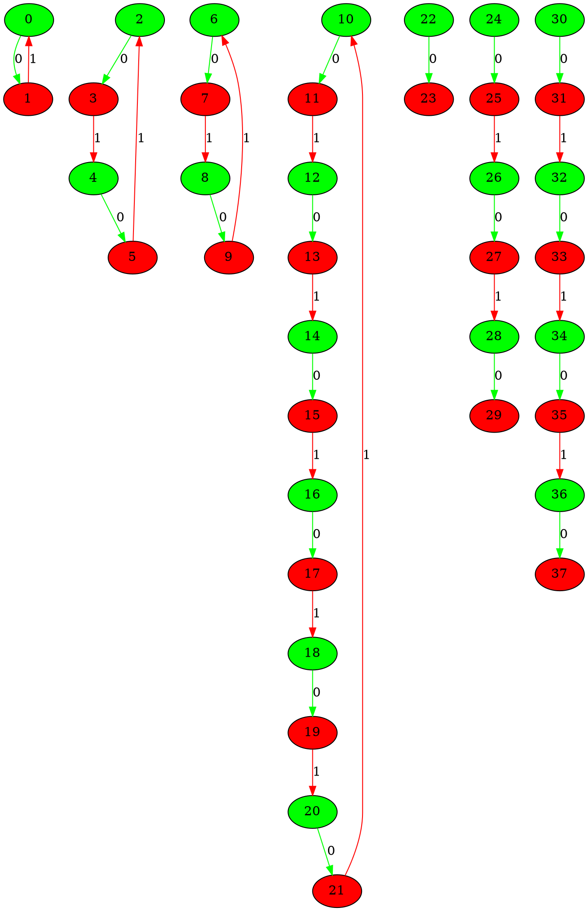
```graphviz
digraph G {
0[label="0" fillcolor="green" style="filled"];
1[label="1" fillcolor="red" style="filled"];
2[label="2" fillcolor="green" style="filled"];
3[label="3" fillcolor="red" style="filled"];
4[label="4" fillcolor="green" style="filled"];
5[label="5" fillcolor="red" style="filled"];
6[label="6" fillcolor="green" style="filled"];
7[label="7" fillcolor="red" style="filled"];
8[label="8" fillcolor="green" style="filled"];
9[label="9" fillcolor="red" style="filled"];
10[label="10" fillcolor="green" style="filled"];
11[label="11" fillcolor="red" style="filled"];
12[label="12" fillcolor="green" style="filled"];
13[label="13" fillcolor="red" style="filled"];
14[label="14" fillcolor="green" style="filled"];
15[label="15" fillcolor="red" style="filled"];
16[label="16" fillcolor="green" style="filled"];
17[label="17" fillcolor="red" style="filled"];
18[label="18" fillcolor="green" style="filled"];
19[label="19" fillcolor="red" style="filled"];
20[label="20" fillcolor="green" style="filled"];
21[label="21" fillcolor="red" style="filled"];
22[label="22" fillcolor="green" style="filled"];
23[label="23" fillcolor="red" style="filled"];
24[label="24" fillcolor="green" style="filled"];
25[label="25" fillcolor="red" style="filled"];
26[label="26" fillcolor="green" style="filled"];
27[label="27" fillcolor="red" style="filled"];
28[label="28" fillcolor="green" style="filled"];
29[label="29" fillcolor="red" style="filled"];
30[label="30" fillcolor="green" style="filled"];
31[label="31" fillcolor="red" style="filled"];
32[label="32" fillcolor="green" style="filled"];
33[label="33" fillcolor="red" style="filled"];
34[label="34" fillcolor="green" style="filled"];
35[label="35" fillcolor="red" style="filled"];
36[label="36" fillcolor="green" style="filled"];
37[label="37" fillcolor="red" style="filled"];
0->1 [label="0" color="green"];
2->3 [label="0" color="green"];
4->5 [label="0" color="green"];
6->7 [label="0" color="green"];
8->9 [label="0" color="green"];
10->11 [label="0" color="green"];
12->13 [label="0" color="green"];
14->15 [label="0" color="green"];
16->17 [label="0" color="green"];
18->19 [label="0" color="green"];
20->21 [label="0" color="green"];
22->23 [label="0" color="green"];
24->25 [label="0" color="green"];
26->27 [label="0" color="green"];
28->29 [label="0" color="green"];
30->31 [label="0" color="green"];
32->33 [label="0" color="green"];
34->35 [label="0" color="green"];
36->37 [label="0" color="green"];
1->0 [label="1" color="red"];
3->4 [label="1" color="red"];
5->2 [label="1" color="red"];
7->8 [label="1" color="red"];
9->6 [label="1" color="red"];
11->12 [label="1" color="red"];
13->14 [label="1" color="red"];
15->16 [label="1" color="red"];
17->18 [label="1" color="red"];
19->20 [label="1" color="red"];
21->10 [label="1" color="red"];
25->26 [label="1" color="red"];
27->28 [label="1" color="red"];
31->32 [label="1" color="red"];
33->34 [label="1" color="red"];
35->36 [label="1" color="red"];
}
```
___
## Graph 12302 - list de compréhension : 1,2,3|1,2,4,6
___
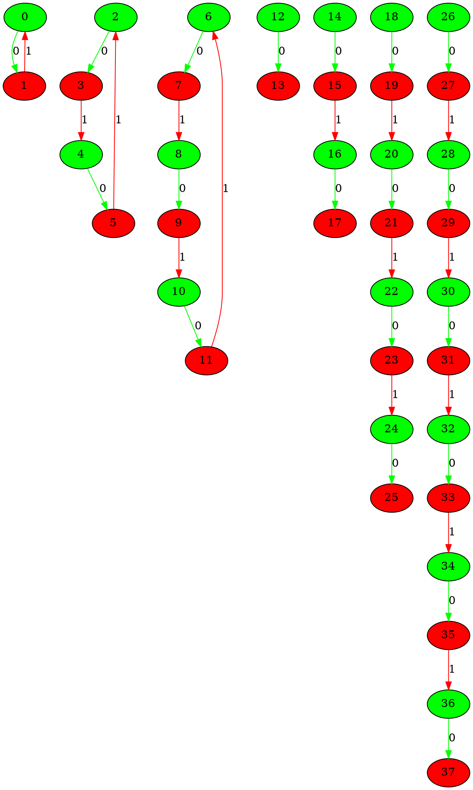
```graphviz
digraph G {
0[label="0" fillcolor="green" style="filled"];
1[label="1" fillcolor="red" style="filled"];
2[label="2" fillcolor="green" style="filled"];
3[label="3" fillcolor="red" style="filled"];
4[label="4" fillcolor="green" style="filled"];
5[label="5" fillcolor="red" style="filled"];
6[label="6" fillcolor="green" style="filled"];
7[label="7" fillcolor="red" style="filled"];
8[label="8" fillcolor="green" style="filled"];
9[label="9" fillcolor="red" style="filled"];
10[label="10" fillcolor="green" style="filled"];
11[label="11" fillcolor="red" style="filled"];
12[label="12" fillcolor="green" style="filled"];
13[label="13" fillcolor="red" style="filled"];
14[label="14" fillcolor="green" style="filled"];
15[label="15" fillcolor="red" style="filled"];
16[label="16" fillcolor="green" style="filled"];
17[label="17" fillcolor="red" style="filled"];
18[label="18" fillcolor="green" style="filled"];
19[label="19" fillcolor="red" style="filled"];
20[label="20" fillcolor="green" style="filled"];
21[label="21" fillcolor="red" style="filled"];
22[label="22" fillcolor="green" style="filled"];
23[label="23" fillcolor="red" style="filled"];
24[label="24" fillcolor="green" style="filled"];
25[label="25" fillcolor="red" style="filled"];
26[label="26" fillcolor="green" style="filled"];
27[label="27" fillcolor="red" style="filled"];
28[label="28" fillcolor="green" style="filled"];
29[label="29" fillcolor="red" style="filled"];
30[label="30" fillcolor="green" style="filled"];
31[label="31" fillcolor="red" style="filled"];
32[label="32" fillcolor="green" style="filled"];
33[label="33" fillcolor="red" style="filled"];
34[label="34" fillcolor="green" style="filled"];
35[label="35" fillcolor="red" style="filled"];
36[label="36" fillcolor="green" style="filled"];
37[label="37" fillcolor="red" style="filled"];
0->1 [label="0" color="green"];
2->3 [label="0" color="green"];
4->5 [label="0" color="green"];
6->7 [label="0" color="green"];
8->9 [label="0" color="green"];
10->11 [label="0" color="green"];
12->13 [label="0" color="green"];
14->15 [label="0" color="green"];
16->17 [label="0" color="green"];
18->19 [label="0" color="green"];
20->21 [label="0" color="green"];
22->23 [label="0" color="green"];
24->25 [label="0" color="green"];
26->27 [label="0" color="green"];
28->29 [label="0" color="green"];
30->31 [label="0" color="green"];
32->33 [label="0" color="green"];
34->35 [label="0" color="green"];
36->37 [label="0" color="green"];
1->0 [label="1" color="red"];
3->4 [label="1" color="red"];
5->2 [label="1" color="red"];
7->8 [label="1" color="red"];
9->10 [label="1" color="red"];
11->6 [label="1" color="red"];
15->16 [label="1" color="red"];
19->20 [label="1" color="red"];
21->22 [label="1" color="red"];
23->24 [label="1" color="red"];
27->28 [label="1" color="red"];
29->30 [label="1" color="red"];
31->32 [label="1" color="red"];
33->34 [label="1" color="red"];
35->36 [label="1" color="red"];
}
```
___
## Graph 12303 - list de compréhension : 1,2,3,4|1,2,6
___
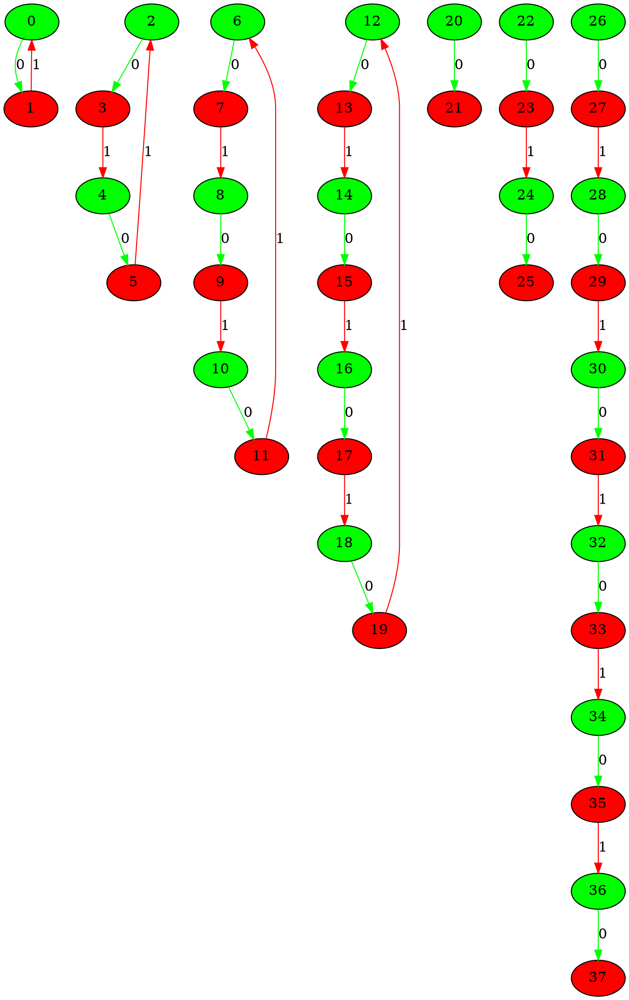
```graphviz
digraph G {
0[label="0" fillcolor="green" style="filled"];
1[label="1" fillcolor="red" style="filled"];
2[label="2" fillcolor="green" style="filled"];
3[label="3" fillcolor="red" style="filled"];
4[label="4" fillcolor="green" style="filled"];
5[label="5" fillcolor="red" style="filled"];
6[label="6" fillcolor="green" style="filled"];
7[label="7" fillcolor="red" style="filled"];
8[label="8" fillcolor="green" style="filled"];
9[label="9" fillcolor="red" style="filled"];
10[label="10" fillcolor="green" style="filled"];
11[label="11" fillcolor="red" style="filled"];
12[label="12" fillcolor="green" style="filled"];
13[label="13" fillcolor="red" style="filled"];
14[label="14" fillcolor="green" style="filled"];
15[label="15" fillcolor="red" style="filled"];
16[label="16" fillcolor="green" style="filled"];
17[label="17" fillcolor="red" style="filled"];
18[label="18" fillcolor="green" style="filled"];
19[label="19" fillcolor="red" style="filled"];
20[label="20" fillcolor="green" style="filled"];
21[label="21" fillcolor="red" style="filled"];
22[label="22" fillcolor="green" style="filled"];
23[label="23" fillcolor="red" style="filled"];
24[label="24" fillcolor="green" style="filled"];
25[label="25" fillcolor="red" style="filled"];
26[label="26" fillcolor="green" style="filled"];
27[label="27" fillcolor="red" style="filled"];
28[label="28" fillcolor="green" style="filled"];
29[label="29" fillcolor="red" style="filled"];
30[label="30" fillcolor="green" style="filled"];
31[label="31" fillcolor="red" style="filled"];
32[label="32" fillcolor="green" style="filled"];
33[label="33" fillcolor="red" style="filled"];
34[label="34" fillcolor="green" style="filled"];
35[label="35" fillcolor="red" style="filled"];
36[label="36" fillcolor="green" style="filled"];
37[label="37" fillcolor="red" style="filled"];
0->1 [label="0" color="green"];
2->3 [label="0" color="green"];
4->5 [label="0" color="green"];
6->7 [label="0" color="green"];
8->9 [label="0" color="green"];
10->11 [label="0" color="green"];
12->13 [label="0" color="green"];
14->15 [label="0" color="green"];
16->17 [label="0" color="green"];
18->19 [label="0" color="green"];
20->21 [label="0" color="green"];
22->23 [label="0" color="green"];
24->25 [label="0" color="green"];
26->27 [label="0" color="green"];
28->29 [label="0" color="green"];
30->31 [label="0" color="green"];
32->33 [label="0" color="green"];
34->35 [label="0" color="green"];
36->37 [label="0" color="green"];
1->0 [label="1" color="red"];
3->4 [label="1" color="red"];
5->2 [label="1" color="red"];
7->8 [label="1" color="red"];
9->10 [label="1" color="red"];
11->6 [label="1" color="red"];
13->14 [label="1" color="red"];
15->16 [label="1" color="red"];
17->18 [label="1" color="red"];
19->12 [label="1" color="red"];
23->24 [label="1" color="red"];
27->28 [label="1" color="red"];
29->30 [label="1" color="red"];
31->32 [label="1" color="red"];
33->34 [label="1" color="red"];
35->36 [label="1" color="red"];
}
```
___
## Graph 12304 - list de compréhension : 1,2,3,4,6|1,2
___
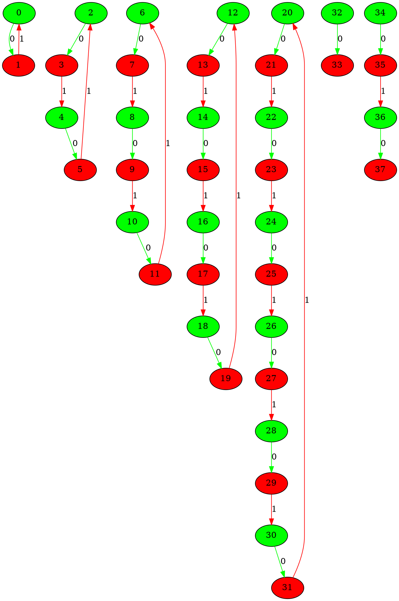
```graphviz
digraph G {
0[label="0" fillcolor="green" style="filled"];
1[label="1" fillcolor="red" style="filled"];
2[label="2" fillcolor="green" style="filled"];
3[label="3" fillcolor="red" style="filled"];
4[label="4" fillcolor="green" style="filled"];
5[label="5" fillcolor="red" style="filled"];
6[label="6" fillcolor="green" style="filled"];
7[label="7" fillcolor="red" style="filled"];
8[label="8" fillcolor="green" style="filled"];
9[label="9" fillcolor="red" style="filled"];
10[label="10" fillcolor="green" style="filled"];
11[label="11" fillcolor="red" style="filled"];
12[label="12" fillcolor="green" style="filled"];
13[label="13" fillcolor="red" style="filled"];
14[label="14" fillcolor="green" style="filled"];
15[label="15" fillcolor="red" style="filled"];
16[label="16" fillcolor="green" style="filled"];
17[label="17" fillcolor="red" style="filled"];
18[label="18" fillcolor="green" style="filled"];
19[label="19" fillcolor="red" style="filled"];
20[label="20" fillcolor="green" style="filled"];
21[label="21" fillcolor="red" style="filled"];
22[label="22" fillcolor="green" style="filled"];
23[label="23" fillcolor="red" style="filled"];
24[label="24" fillcolor="green" style="filled"];
25[label="25" fillcolor="red" style="filled"];
26[label="26" fillcolor="green" style="filled"];
27[label="27" fillcolor="red" style="filled"];
28[label="28" fillcolor="green" style="filled"];
29[label="29" fillcolor="red" style="filled"];
30[label="30" fillcolor="green" style="filled"];
31[label="31" fillcolor="red" style="filled"];
32[label="32" fillcolor="green" style="filled"];
33[label="33" fillcolor="red" style="filled"];
34[label="34" fillcolor="green" style="filled"];
35[label="35" fillcolor="red" style="filled"];
36[label="36" fillcolor="green" style="filled"];
37[label="37" fillcolor="red" style="filled"];
0->1 [label="0" color="green"];
2->3 [label="0" color="green"];
4->5 [label="0" color="green"];
6->7 [label="0" color="green"];
8->9 [label="0" color="green"];
10->11 [label="0" color="green"];
12->13 [label="0" color="green"];
14->15 [label="0" color="green"];
16->17 [label="0" color="green"];
18->19 [label="0" color="green"];
20->21 [label="0" color="green"];
22->23 [label="0" color="green"];
24->25 [label="0" color="green"];
26->27 [label="0" color="green"];
28->29 [label="0" color="green"];
30->31 [label="0" color="green"];
32->33 [label="0" color="green"];
34->35 [label="0" color="green"];
36->37 [label="0" color="green"];
1->0 [label="1" color="red"];
3->4 [label="1" color="red"];
5->2 [label="1" color="red"];
7->8 [label="1" color="red"];
9->10 [label="1" color="red"];
11->6 [label="1" color="red"];
13->14 [label="1" color="red"];
15->16 [label="1" color="red"];
17->18 [label="1" color="red"];
19->12 [label="1" color="red"];
21->22 [label="1" color="red"];
23->24 [label="1" color="red"];
25->26 [label="1" color="red"];
27->28 [label="1" color="red"];
29->30 [label="1" color="red"];
31->20 [label="1" color="red"];
35->36 [label="1" color="red"];
}
```
___
## Graph 12305 - list de compréhension : 1,2,3,6|1,2,4
___
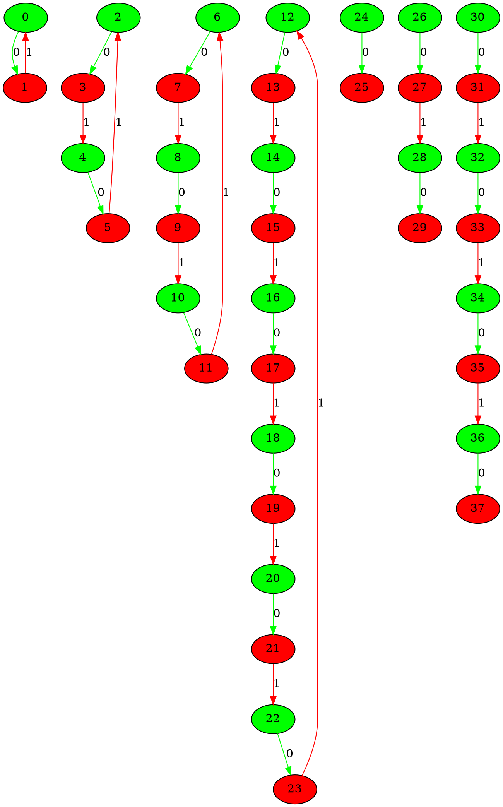
```graphviz
digraph G {
0[label="0" fillcolor="green" style="filled"];
1[label="1" fillcolor="red" style="filled"];
2[label="2" fillcolor="green" style="filled"];
3[label="3" fillcolor="red" style="filled"];
4[label="4" fillcolor="green" style="filled"];
5[label="5" fillcolor="red" style="filled"];
6[label="6" fillcolor="green" style="filled"];
7[label="7" fillcolor="red" style="filled"];
8[label="8" fillcolor="green" style="filled"];
9[label="9" fillcolor="red" style="filled"];
10[label="10" fillcolor="green" style="filled"];
11[label="11" fillcolor="red" style="filled"];
12[label="12" fillcolor="green" style="filled"];
13[label="13" fillcolor="red" style="filled"];
14[label="14" fillcolor="green" style="filled"];
15[label="15" fillcolor="red" style="filled"];
16[label="16" fillcolor="green" style="filled"];
17[label="17" fillcolor="red" style="filled"];
18[label="18" fillcolor="green" style="filled"];
19[label="19" fillcolor="red" style="filled"];
20[label="20" fillcolor="green" style="filled"];
21[label="21" fillcolor="red" style="filled"];
22[label="22" fillcolor="green" style="filled"];
23[label="23" fillcolor="red" style="filled"];
24[label="24" fillcolor="green" style="filled"];
25[label="25" fillcolor="red" style="filled"];
26[label="26" fillcolor="green" style="filled"];
27[label="27" fillcolor="red" style="filled"];
28[label="28" fillcolor="green" style="filled"];
29[label="29" fillcolor="red" style="filled"];
30[label="30" fillcolor="green" style="filled"];
31[label="31" fillcolor="red" style="filled"];
32[label="32" fillcolor="green" style="filled"];
33[label="33" fillcolor="red" style="filled"];
34[label="34" fillcolor="green" style="filled"];
35[label="35" fillcolor="red" style="filled"];
36[label="36" fillcolor="green" style="filled"];
37[label="37" fillcolor="red" style="filled"];
0->1 [label="0" color="green"];
2->3 [label="0" color="green"];
4->5 [label="0" color="green"];
6->7 [label="0" color="green"];
8->9 [label="0" color="green"];
10->11 [label="0" color="green"];
12->13 [label="0" color="green"];
14->15 [label="0" color="green"];
16->17 [label="0" color="green"];
18->19 [label="0" color="green"];
20->21 [label="0" color="green"];
22->23 [label="0" color="green"];
24->25 [label="0" color="green"];
26->27 [label="0" color="green"];
28->29 [label="0" color="green"];
30->31 [label="0" color="green"];
32->33 [label="0" color="green"];
34->35 [label="0" color="green"];
36->37 [label="0" color="green"];
1->0 [label="1" color="red"];
3->4 [label="1" color="red"];
5->2 [label="1" color="red"];
7->8 [label="1" color="red"];
9->10 [label="1" color="red"];
11->6 [label="1" color="red"];
13->14 [label="1" color="red"];
15->16 [label="1" color="red"];
17->18 [label="1" color="red"];
19->20 [label="1" color="red"];
21->22 [label="1" color="red"];
23->12 [label="1" color="red"];
27->28 [label="1" color="red"];
31->32 [label="1" color="red"];
33->34 [label="1" color="red"];
35->36 [label="1" color="red"];
}
```
___
## Graph 12306 - list de compréhension : 1,2,4|1,2,3,6
___
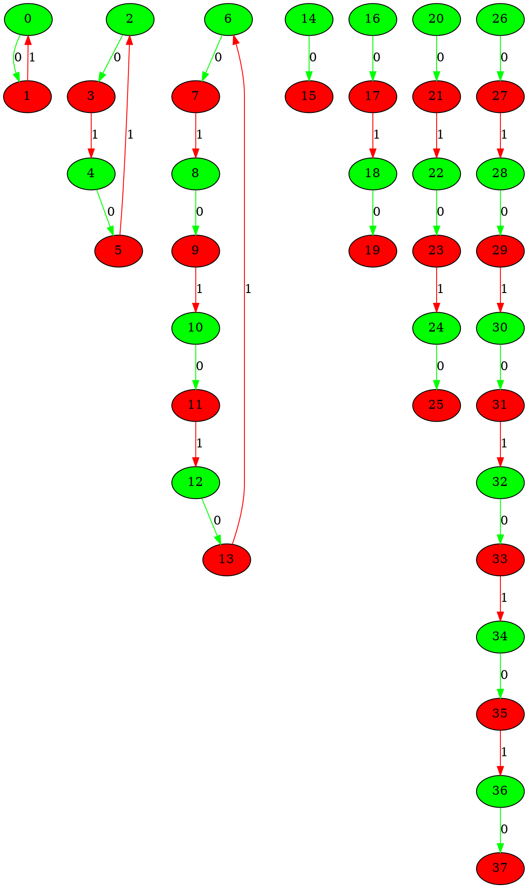
```graphviz
digraph G {
0[label="0" fillcolor="green" style="filled"];
1[label="1" fillcolor="red" style="filled"];
2[label="2" fillcolor="green" style="filled"];
3[label="3" fillcolor="red" style="filled"];
4[label="4" fillcolor="green" style="filled"];
5[label="5" fillcolor="red" style="filled"];
6[label="6" fillcolor="green" style="filled"];
7[label="7" fillcolor="red" style="filled"];
8[label="8" fillcolor="green" style="filled"];
9[label="9" fillcolor="red" style="filled"];
10[label="10" fillcolor="green" style="filled"];
11[label="11" fillcolor="red" style="filled"];
12[label="12" fillcolor="green" style="filled"];
13[label="13" fillcolor="red" style="filled"];
14[label="14" fillcolor="green" style="filled"];
15[label="15" fillcolor="red" style="filled"];
16[label="16" fillcolor="green" style="filled"];
17[label="17" fillcolor="red" style="filled"];
18[label="18" fillcolor="green" style="filled"];
19[label="19" fillcolor="red" style="filled"];
20[label="20" fillcolor="green" style="filled"];
21[label="21" fillcolor="red" style="filled"];
22[label="22" fillcolor="green" style="filled"];
23[label="23" fillcolor="red" style="filled"];
24[label="24" fillcolor="green" style="filled"];
25[label="25" fillcolor="red" style="filled"];
26[label="26" fillcolor="green" style="filled"];
27[label="27" fillcolor="red" style="filled"];
28[label="28" fillcolor="green" style="filled"];
29[label="29" fillcolor="red" style="filled"];
30[label="30" fillcolor="green" style="filled"];
31[label="31" fillcolor="red" style="filled"];
32[label="32" fillcolor="green" style="filled"];
33[label="33" fillcolor="red" style="filled"];
34[label="34" fillcolor="green" style="filled"];
35[label="35" fillcolor="red" style="filled"];
36[label="36" fillcolor="green" style="filled"];
37[label="37" fillcolor="red" style="filled"];
0->1 [label="0" color="green"];
2->3 [label="0" color="green"];
4->5 [label="0" color="green"];
6->7 [label="0" color="green"];
8->9 [label="0" color="green"];
10->11 [label="0" color="green"];
12->13 [label="0" color="green"];
14->15 [label="0" color="green"];
16->17 [label="0" color="green"];
18->19 [label="0" color="green"];
20->21 [label="0" color="green"];
22->23 [label="0" color="green"];
24->25 [label="0" color="green"];
26->27 [label="0" color="green"];
28->29 [label="0" color="green"];
30->31 [label="0" color="green"];
32->33 [label="0" color="green"];
34->35 [label="0" color="green"];
36->37 [label="0" color="green"];
1->0 [label="1" color="red"];
3->4 [label="1" color="red"];
5->2 [label="1" color="red"];
7->8 [label="1" color="red"];
9->10 [label="1" color="red"];
11->12 [label="1" color="red"];
13->6 [label="1" color="red"];
17->18 [label="1" color="red"];
21->22 [label="1" color="red"];
23->24 [label="1" color="red"];
27->28 [label="1" color="red"];
29->30 [label="1" color="red"];
31->32 [label="1" color="red"];
33->34 [label="1" color="red"];
35->36 [label="1" color="red"];
}
```
___
## Graph 12307 - list de compréhension : 1,2,4,6|1,2,3
___
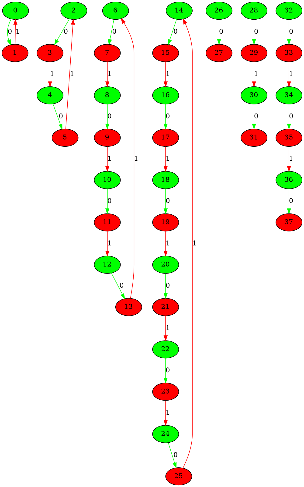
```graphviz
digraph G {
0[label="0" fillcolor="green" style="filled"];
1[label="1" fillcolor="red" style="filled"];
2[label="2" fillcolor="green" style="filled"];
3[label="3" fillcolor="red" style="filled"];
4[label="4" fillcolor="green" style="filled"];
5[label="5" fillcolor="red" style="filled"];
6[label="6" fillcolor="green" style="filled"];
7[label="7" fillcolor="red" style="filled"];
8[label="8" fillcolor="green" style="filled"];
9[label="9" fillcolor="red" style="filled"];
10[label="10" fillcolor="green" style="filled"];
11[label="11" fillcolor="red" style="filled"];
12[label="12" fillcolor="green" style="filled"];
13[label="13" fillcolor="red" style="filled"];
14[label="14" fillcolor="green" style="filled"];
15[label="15" fillcolor="red" style="filled"];
16[label="16" fillcolor="green" style="filled"];
17[label="17" fillcolor="red" style="filled"];
18[label="18" fillcolor="green" style="filled"];
19[label="19" fillcolor="red" style="filled"];
20[label="20" fillcolor="green" style="filled"];
21[label="21" fillcolor="red" style="filled"];
22[label="22" fillcolor="green" style="filled"];
23[label="23" fillcolor="red" style="filled"];
24[label="24" fillcolor="green" style="filled"];
25[label="25" fillcolor="red" style="filled"];
26[label="26" fillcolor="green" style="filled"];
27[label="27" fillcolor="red" style="filled"];
28[label="28" fillcolor="green" style="filled"];
29[label="29" fillcolor="red" style="filled"];
30[label="30" fillcolor="green" style="filled"];
31[label="31" fillcolor="red" style="filled"];
32[label="32" fillcolor="green" style="filled"];
33[label="33" fillcolor="red" style="filled"];
34[label="34" fillcolor="green" style="filled"];
35[label="35" fillcolor="red" style="filled"];
36[label="36" fillcolor="green" style="filled"];
37[label="37" fillcolor="red" style="filled"];
0->1 [label="0" color="green"];
2->3 [label="0" color="green"];
4->5 [label="0" color="green"];
6->7 [label="0" color="green"];
8->9 [label="0" color="green"];
10->11 [label="0" color="green"];
12->13 [label="0" color="green"];
14->15 [label="0" color="green"];
16->17 [label="0" color="green"];
18->19 [label="0" color="green"];
20->21 [label="0" color="green"];
22->23 [label="0" color="green"];
24->25 [label="0" color="green"];
26->27 [label="0" color="green"];
28->29 [label="0" color="green"];
30->31 [label="0" color="green"];
32->33 [label="0" color="green"];
34->35 [label="0" color="green"];
36->37 [label="0" color="green"];
1->0 [label="1" color="red"];
3->4 [label="1" color="red"];
5->2 [label="1" color="red"];
7->8 [label="1" color="red"];
9->10 [label="1" color="red"];
11->12 [label="1" color="red"];
13->6 [label="1" color="red"];
15->16 [label="1" color="red"];
17->18 [label="1" color="red"];
19->20 [label="1" color="red"];
21->22 [label="1" color="red"];
23->24 [label="1" color="red"];
25->14 [label="1" color="red"];
29->30 [label="1" color="red"];
33->34 [label="1" color="red"];
35->36 [label="1" color="red"];
}
```
___
## Graph 12308 - list de compréhension : 1,2,6|1,2,3,4
___
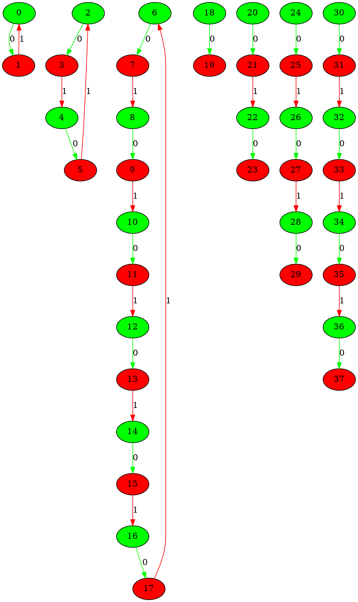
```graphviz
digraph G {
0[label="0" fillcolor="green" style="filled"];
1[label="1" fillcolor="red" style="filled"];
2[label="2" fillcolor="green" style="filled"];
3[label="3" fillcolor="red" style="filled"];
4[label="4" fillcolor="green" style="filled"];
5[label="5" fillcolor="red" style="filled"];
6[label="6" fillcolor="green" style="filled"];
7[label="7" fillcolor="red" style="filled"];
8[label="8" fillcolor="green" style="filled"];
9[label="9" fillcolor="red" style="filled"];
10[label="10" fillcolor="green" style="filled"];
11[label="11" fillcolor="red" style="filled"];
12[label="12" fillcolor="green" style="filled"];
13[label="13" fillcolor="red" style="filled"];
14[label="14" fillcolor="green" style="filled"];
15[label="15" fillcolor="red" style="filled"];
16[label="16" fillcolor="green" style="filled"];
17[label="17" fillcolor="red" style="filled"];
18[label="18" fillcolor="green" style="filled"];
19[label="19" fillcolor="red" style="filled"];
20[label="20" fillcolor="green" style="filled"];
21[label="21" fillcolor="red" style="filled"];
22[label="22" fillcolor="green" style="filled"];
23[label="23" fillcolor="red" style="filled"];
24[label="24" fillcolor="green" style="filled"];
25[label="25" fillcolor="red" style="filled"];
26[label="26" fillcolor="green" style="filled"];
27[label="27" fillcolor="red" style="filled"];
28[label="28" fillcolor="green" style="filled"];
29[label="29" fillcolor="red" style="filled"];
30[label="30" fillcolor="green" style="filled"];
31[label="31" fillcolor="red" style="filled"];
32[label="32" fillcolor="green" style="filled"];
33[label="33" fillcolor="red" style="filled"];
34[label="34" fillcolor="green" style="filled"];
35[label="35" fillcolor="red" style="filled"];
36[label="36" fillcolor="green" style="filled"];
37[label="37" fillcolor="red" style="filled"];
0->1 [label="0" color="green"];
2->3 [label="0" color="green"];
4->5 [label="0" color="green"];
6->7 [label="0" color="green"];
8->9 [label="0" color="green"];
10->11 [label="0" color="green"];
12->13 [label="0" color="green"];
14->15 [label="0" color="green"];
16->17 [label="0" color="green"];
18->19 [label="0" color="green"];
20->21 [label="0" color="green"];
22->23 [label="0" color="green"];
24->25 [label="0" color="green"];
26->27 [label="0" color="green"];
28->29 [label="0" color="green"];
30->31 [label="0" color="green"];
32->33 [label="0" color="green"];
34->35 [label="0" color="green"];
36->37 [label="0" color="green"];
1->0 [label="1" color="red"];
3->4 [label="1" color="red"];
5->2 [label="1" color="red"];
7->8 [label="1" color="red"];
9->10 [label="1" color="red"];
11->12 [label="1" color="red"];
13->14 [label="1" color="red"];
15->16 [label="1" color="red"];
17->6 [label="1" color="red"];
21->22 [label="1" color="red"];
25->26 [label="1" color="red"];
27->28 [label="1" color="red"];
31->32 [label="1" color="red"];
33->34 [label="1" color="red"];
35->36 [label="1" color="red"];
}
```
___
## Graph 12309 - list de compréhension : 1,3|1,2,2,4,6
___
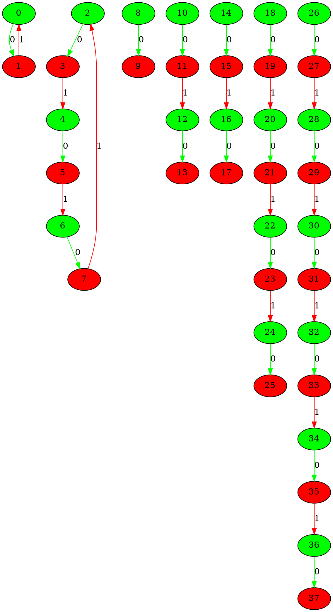
```graphviz
digraph G {
0[label="0" fillcolor="green" style="filled"];
1[label="1" fillcolor="red" style="filled"];
2[label="2" fillcolor="green" style="filled"];
3[label="3" fillcolor="red" style="filled"];
4[label="4" fillcolor="green" style="filled"];
5[label="5" fillcolor="red" style="filled"];
6[label="6" fillcolor="green" style="filled"];
7[label="7" fillcolor="red" style="filled"];
8[label="8" fillcolor="green" style="filled"];
9[label="9" fillcolor="red" style="filled"];
10[label="10" fillcolor="green" style="filled"];
11[label="11" fillcolor="red" style="filled"];
12[label="12" fillcolor="green" style="filled"];
13[label="13" fillcolor="red" style="filled"];
14[label="14" fillcolor="green" style="filled"];
15[label="15" fillcolor="red" style="filled"];
16[label="16" fillcolor="green" style="filled"];
17[label="17" fillcolor="red" style="filled"];
18[label="18" fillcolor="green" style="filled"];
19[label="19" fillcolor="red" style="filled"];
20[label="20" fillcolor="green" style="filled"];
21[label="21" fillcolor="red" style="filled"];
22[label="22" fillcolor="green" style="filled"];
23[label="23" fillcolor="red" style="filled"];
24[label="24" fillcolor="green" style="filled"];
25[label="25" fillcolor="red" style="filled"];
26[label="26" fillcolor="green" style="filled"];
27[label="27" fillcolor="red" style="filled"];
28[label="28" fillcolor="green" style="filled"];
29[label="29" fillcolor="red" style="filled"];
30[label="30" fillcolor="green" style="filled"];
31[label="31" fillcolor="red" style="filled"];
32[label="32" fillcolor="green" style="filled"];
33[label="33" fillcolor="red" style="filled"];
34[label="34" fillcolor="green" style="filled"];
35[label="35" fillcolor="red" style="filled"];
36[label="36" fillcolor="green" style="filled"];
37[label="37" fillcolor="red" style="filled"];
0->1 [label="0" color="green"];
2->3 [label="0" color="green"];
4->5 [label="0" color="green"];
6->7 [label="0" color="green"];
8->9 [label="0" color="green"];
10->11 [label="0" color="green"];
12->13 [label="0" color="green"];
14->15 [label="0" color="green"];
16->17 [label="0" color="green"];
18->19 [label="0" color="green"];
20->21 [label="0" color="green"];
22->23 [label="0" color="green"];
24->25 [label="0" color="green"];
26->27 [label="0" color="green"];
28->29 [label="0" color="green"];
30->31 [label="0" color="green"];
32->33 [label="0" color="green"];
34->35 [label="0" color="green"];
36->37 [label="0" color="green"];
1->0 [label="1" color="red"];
3->4 [label="1" color="red"];
5->6 [label="1" color="red"];
7->2 [label="1" color="red"];
11->12 [label="1" color="red"];
15->16 [label="1" color="red"];
19->20 [label="1" color="red"];
21->22 [label="1" color="red"];
23->24 [label="1" color="red"];
27->28 [label="1" color="red"];
29->30 [label="1" color="red"];
31->32 [label="1" color="red"];
33->34 [label="1" color="red"];
35->36 [label="1" color="red"];
}
```
___
## Graph 12310 - list de compréhension : 1,3,4|1,2,2,6
___
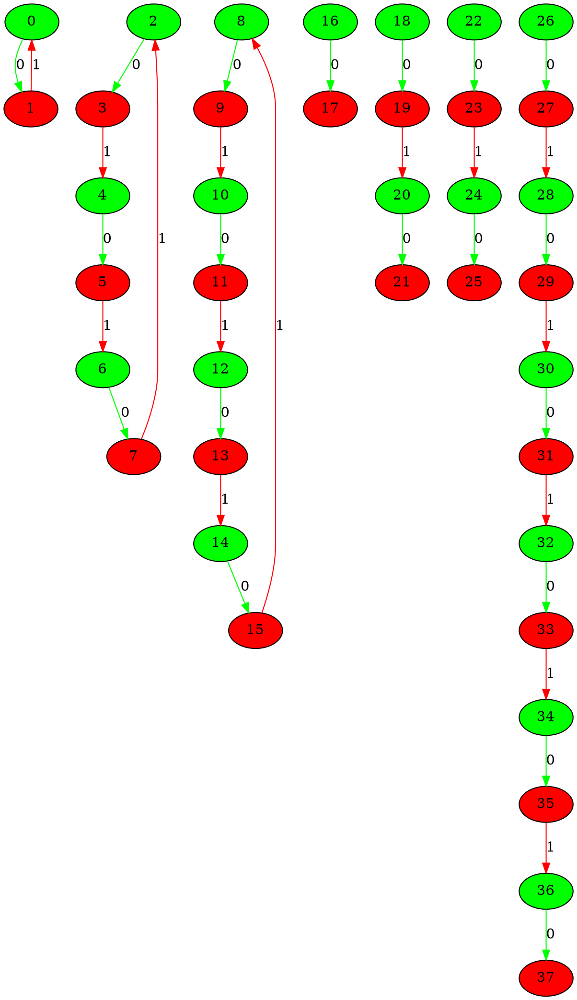
```graphviz
digraph G {
0[label="0" fillcolor="green" style="filled"];
1[label="1" fillcolor="red" style="filled"];
2[label="2" fillcolor="green" style="filled"];
3[label="3" fillcolor="red" style="filled"];
4[label="4" fillcolor="green" style="filled"];
5[label="5" fillcolor="red" style="filled"];
6[label="6" fillcolor="green" style="filled"];
7[label="7" fillcolor="red" style="filled"];
8[label="8" fillcolor="green" style="filled"];
9[label="9" fillcolor="red" style="filled"];
10[label="10" fillcolor="green" style="filled"];
11[label="11" fillcolor="red" style="filled"];
12[label="12" fillcolor="green" style="filled"];
13[label="13" fillcolor="red" style="filled"];
14[label="14" fillcolor="green" style="filled"];
15[label="15" fillcolor="red" style="filled"];
16[label="16" fillcolor="green" style="filled"];
17[label="17" fillcolor="red" style="filled"];
18[label="18" fillcolor="green" style="filled"];
19[label="19" fillcolor="red" style="filled"];
20[label="20" fillcolor="green" style="filled"];
21[label="21" fillcolor="red" style="filled"];
22[label="22" fillcolor="green" style="filled"];
23[label="23" fillcolor="red" style="filled"];
24[label="24" fillcolor="green" style="filled"];
25[label="25" fillcolor="red" style="filled"];
26[label="26" fillcolor="green" style="filled"];
27[label="27" fillcolor="red" style="filled"];
28[label="28" fillcolor="green" style="filled"];
29[label="29" fillcolor="red" style="filled"];
30[label="30" fillcolor="green" style="filled"];
31[label="31" fillcolor="red" style="filled"];
32[label="32" fillcolor="green" style="filled"];
33[label="33" fillcolor="red" style="filled"];
34[label="34" fillcolor="green" style="filled"];
35[label="35" fillcolor="red" style="filled"];
36[label="36" fillcolor="green" style="filled"];
37[label="37" fillcolor="red" style="filled"];
0->1 [label="0" color="green"];
2->3 [label="0" color="green"];
4->5 [label="0" color="green"];
6->7 [label="0" color="green"];
8->9 [label="0" color="green"];
10->11 [label="0" color="green"];
12->13 [label="0" color="green"];
14->15 [label="0" color="green"];
16->17 [label="0" color="green"];
18->19 [label="0" color="green"];
20->21 [label="0" color="green"];
22->23 [label="0" color="green"];
24->25 [label="0" color="green"];
26->27 [label="0" color="green"];
28->29 [label="0" color="green"];
30->31 [label="0" color="green"];
32->33 [label="0" color="green"];
34->35 [label="0" color="green"];
36->37 [label="0" color="green"];
1->0 [label="1" color="red"];
3->4 [label="1" color="red"];
5->6 [label="1" color="red"];
7->2 [label="1" color="red"];
9->10 [label="1" color="red"];
11->12 [label="1" color="red"];
13->14 [label="1" color="red"];
15->8 [label="1" color="red"];
19->20 [label="1" color="red"];
23->24 [label="1" color="red"];
27->28 [label="1" color="red"];
29->30 [label="1" color="red"];
31->32 [label="1" color="red"];
33->34 [label="1" color="red"];
35->36 [label="1" color="red"];
}
```
___
## Graph 12311 - list de compréhension : 1,3,4,6|1,2,2
___
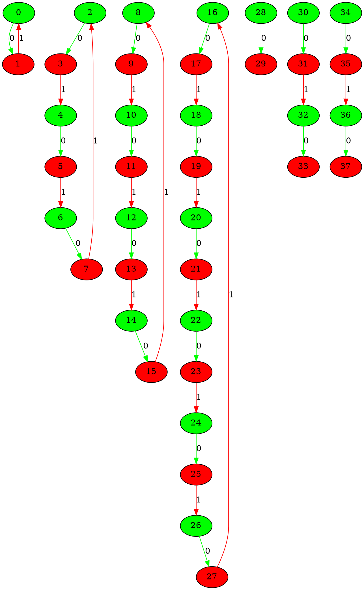
```graphviz
digraph G {
0[label="0" fillcolor="green" style="filled"];
1[label="1" fillcolor="red" style="filled"];
2[label="2" fillcolor="green" style="filled"];
3[label="3" fillcolor="red" style="filled"];
4[label="4" fillcolor="green" style="filled"];
5[label="5" fillcolor="red" style="filled"];
6[label="6" fillcolor="green" style="filled"];
7[label="7" fillcolor="red" style="filled"];
8[label="8" fillcolor="green" style="filled"];
9[label="9" fillcolor="red" style="filled"];
10[label="10" fillcolor="green" style="filled"];
11[label="11" fillcolor="red" style="filled"];
12[label="12" fillcolor="green" style="filled"];
13[label="13" fillcolor="red" style="filled"];
14[label="14" fillcolor="green" style="filled"];
15[label="15" fillcolor="red" style="filled"];
16[label="16" fillcolor="green" style="filled"];
17[label="17" fillcolor="red" style="filled"];
18[label="18" fillcolor="green" style="filled"];
19[label="19" fillcolor="red" style="filled"];
20[label="20" fillcolor="green" style="filled"];
21[label="21" fillcolor="red" style="filled"];
22[label="22" fillcolor="green" style="filled"];
23[label="23" fillcolor="red" style="filled"];
24[label="24" fillcolor="green" style="filled"];
25[label="25" fillcolor="red" style="filled"];
26[label="26" fillcolor="green" style="filled"];
27[label="27" fillcolor="red" style="filled"];
28[label="28" fillcolor="green" style="filled"];
29[label="29" fillcolor="red" style="filled"];
30[label="30" fillcolor="green" style="filled"];
31[label="31" fillcolor="red" style="filled"];
32[label="32" fillcolor="green" style="filled"];
33[label="33" fillcolor="red" style="filled"];
34[label="34" fillcolor="green" style="filled"];
35[label="35" fillcolor="red" style="filled"];
36[label="36" fillcolor="green" style="filled"];
37[label="37" fillcolor="red" style="filled"];
0->1 [label="0" color="green"];
2->3 [label="0" color="green"];
4->5 [label="0" color="green"];
6->7 [label="0" color="green"];
8->9 [label="0" color="green"];
10->11 [label="0" color="green"];
12->13 [label="0" color="green"];
14->15 [label="0" color="green"];
16->17 [label="0" color="green"];
18->19 [label="0" color="green"];
20->21 [label="0" color="green"];
22->23 [label="0" color="green"];
24->25 [label="0" color="green"];
26->27 [label="0" color="green"];
28->29 [label="0" color="green"];
30->31 [label="0" color="green"];
32->33 [label="0" color="green"];
34->35 [label="0" color="green"];
36->37 [label="0" color="green"];
1->0 [label="1" color="red"];
3->4 [label="1" color="red"];
5->6 [label="1" color="red"];
7->2 [label="1" color="red"];
9->10 [label="1" color="red"];
11->12 [label="1" color="red"];
13->14 [label="1" color="red"];
15->8 [label="1" color="red"];
17->18 [label="1" color="red"];
19->20 [label="1" color="red"];
21->22 [label="1" color="red"];
23->24 [label="1" color="red"];
25->26 [label="1" color="red"];
27->16 [label="1" color="red"];
31->32 [label="1" color="red"];
35->36 [label="1" color="red"];
}
```
___
## Graph 12312 - list de compréhension : 1,3,6|1,2,2,4
___
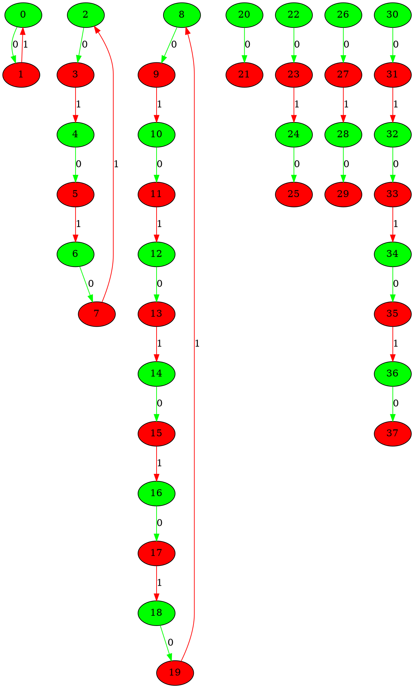
```graphviz
digraph G {
0[label="0" fillcolor="green" style="filled"];
1[label="1" fillcolor="red" style="filled"];
2[label="2" fillcolor="green" style="filled"];
3[label="3" fillcolor="red" style="filled"];
4[label="4" fillcolor="green" style="filled"];
5[label="5" fillcolor="red" style="filled"];
6[label="6" fillcolor="green" style="filled"];
7[label="7" fillcolor="red" style="filled"];
8[label="8" fillcolor="green" style="filled"];
9[label="9" fillcolor="red" style="filled"];
10[label="10" fillcolor="green" style="filled"];
11[label="11" fillcolor="red" style="filled"];
12[label="12" fillcolor="green" style="filled"];
13[label="13" fillcolor="red" style="filled"];
14[label="14" fillcolor="green" style="filled"];
15[label="15" fillcolor="red" style="filled"];
16[label="16" fillcolor="green" style="filled"];
17[label="17" fillcolor="red" style="filled"];
18[label="18" fillcolor="green" style="filled"];
19[label="19" fillcolor="red" style="filled"];
20[label="20" fillcolor="green" style="filled"];
21[label="21" fillcolor="red" style="filled"];
22[label="22" fillcolor="green" style="filled"];
23[label="23" fillcolor="red" style="filled"];
24[label="24" fillcolor="green" style="filled"];
25[label="25" fillcolor="red" style="filled"];
26[label="26" fillcolor="green" style="filled"];
27[label="27" fillcolor="red" style="filled"];
28[label="28" fillcolor="green" style="filled"];
29[label="29" fillcolor="red" style="filled"];
30[label="30" fillcolor="green" style="filled"];
31[label="31" fillcolor="red" style="filled"];
32[label="32" fillcolor="green" style="filled"];
33[label="33" fillcolor="red" style="filled"];
34[label="34" fillcolor="green" style="filled"];
35[label="35" fillcolor="red" style="filled"];
36[label="36" fillcolor="green" style="filled"];
37[label="37" fillcolor="red" style="filled"];
0->1 [label="0" color="green"];
2->3 [label="0" color="green"];
4->5 [label="0" color="green"];
6->7 [label="0" color="green"];
8->9 [label="0" color="green"];
10->11 [label="0" color="green"];
12->13 [label="0" color="green"];
14->15 [label="0" color="green"];
16->17 [label="0" color="green"];
18->19 [label="0" color="green"];
20->21 [label="0" color="green"];
22->23 [label="0" color="green"];
24->25 [label="0" color="green"];
26->27 [label="0" color="green"];
28->29 [label="0" color="green"];
30->31 [label="0" color="green"];
32->33 [label="0" color="green"];
34->35 [label="0" color="green"];
36->37 [label="0" color="green"];
1->0 [label="1" color="red"];
3->4 [label="1" color="red"];
5->6 [label="1" color="red"];
7->2 [label="1" color="red"];
9->10 [label="1" color="red"];
11->12 [label="1" color="red"];
13->14 [label="1" color="red"];
15->16 [label="1" color="red"];
17->18 [label="1" color="red"];
19->8 [label="1" color="red"];
23->24 [label="1" color="red"];
27->28 [label="1" color="red"];
31->32 [label="1" color="red"];
33->34 [label="1" color="red"];
35->36 [label="1" color="red"];
}
```
___
## Graph 12313 - list de compréhension : 1,4|1,2,2,3,6
___
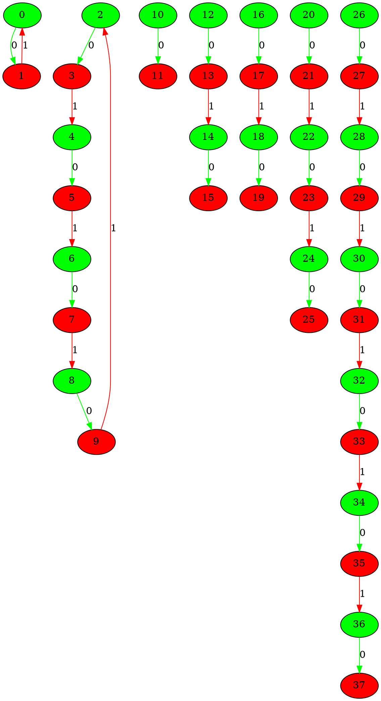
```graphviz
digraph G {
0[label="0" fillcolor="green" style="filled"];
1[label="1" fillcolor="red" style="filled"];
2[label="2" fillcolor="green" style="filled"];
3[label="3" fillcolor="red" style="filled"];
4[label="4" fillcolor="green" style="filled"];
5[label="5" fillcolor="red" style="filled"];
6[label="6" fillcolor="green" style="filled"];
7[label="7" fillcolor="red" style="filled"];
8[label="8" fillcolor="green" style="filled"];
9[label="9" fillcolor="red" style="filled"];
10[label="10" fillcolor="green" style="filled"];
11[label="11" fillcolor="red" style="filled"];
12[label="12" fillcolor="green" style="filled"];
13[label="13" fillcolor="red" style="filled"];
14[label="14" fillcolor="green" style="filled"];
15[label="15" fillcolor="red" style="filled"];
16[label="16" fillcolor="green" style="filled"];
17[label="17" fillcolor="red" style="filled"];
18[label="18" fillcolor="green" style="filled"];
19[label="19" fillcolor="red" style="filled"];
20[label="20" fillcolor="green" style="filled"];
21[label="21" fillcolor="red" style="filled"];
22[label="22" fillcolor="green" style="filled"];
23[label="23" fillcolor="red" style="filled"];
24[label="24" fillcolor="green" style="filled"];
25[label="25" fillcolor="red" style="filled"];
26[label="26" fillcolor="green" style="filled"];
27[label="27" fillcolor="red" style="filled"];
28[label="28" fillcolor="green" style="filled"];
29[label="29" fillcolor="red" style="filled"];
30[label="30" fillcolor="green" style="filled"];
31[label="31" fillcolor="red" style="filled"];
32[label="32" fillcolor="green" style="filled"];
33[label="33" fillcolor="red" style="filled"];
34[label="34" fillcolor="green" style="filled"];
35[label="35" fillcolor="red" style="filled"];
36[label="36" fillcolor="green" style="filled"];
37[label="37" fillcolor="red" style="filled"];
0->1 [label="0" color="green"];
2->3 [label="0" color="green"];
4->5 [label="0" color="green"];
6->7 [label="0" color="green"];
8->9 [label="0" color="green"];
10->11 [label="0" color="green"];
12->13 [label="0" color="green"];
14->15 [label="0" color="green"];
16->17 [label="0" color="green"];
18->19 [label="0" color="green"];
20->21 [label="0" color="green"];
22->23 [label="0" color="green"];
24->25 [label="0" color="green"];
26->27 [label="0" color="green"];
28->29 [label="0" color="green"];
30->31 [label="0" color="green"];
32->33 [label="0" color="green"];
34->35 [label="0" color="green"];
36->37 [label="0" color="green"];
1->0 [label="1" color="red"];
3->4 [label="1" color="red"];
5->6 [label="1" color="red"];
7->8 [label="1" color="red"];
9->2 [label="1" color="red"];
13->14 [label="1" color="red"];
17->18 [label="1" color="red"];
21->22 [label="1" color="red"];
23->24 [label="1" color="red"];
27->28 [label="1" color="red"];
29->30 [label="1" color="red"];
31->32 [label="1" color="red"];
33->34 [label="1" color="red"];
35->36 [label="1" color="red"];
}
```
___
## Graph 12314 - list de compréhension : 1,4,6|1,2,2,3
___
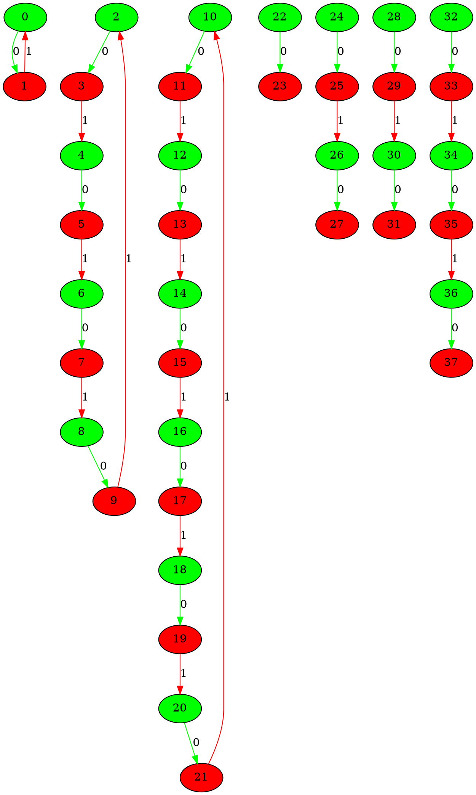
```graphviz
digraph G {
0[label="0" fillcolor="green" style="filled"];
1[label="1" fillcolor="red" style="filled"];
2[label="2" fillcolor="green" style="filled"];
3[label="3" fillcolor="red" style="filled"];
4[label="4" fillcolor="green" style="filled"];
5[label="5" fillcolor="red" style="filled"];
6[label="6" fillcolor="green" style="filled"];
7[label="7" fillcolor="red" style="filled"];
8[label="8" fillcolor="green" style="filled"];
9[label="9" fillcolor="red" style="filled"];
10[label="10" fillcolor="green" style="filled"];
11[label="11" fillcolor="red" style="filled"];
12[label="12" fillcolor="green" style="filled"];
13[label="13" fillcolor="red" style="filled"];
14[label="14" fillcolor="green" style="filled"];
15[label="15" fillcolor="red" style="filled"];
16[label="16" fillcolor="green" style="filled"];
17[label="17" fillcolor="red" style="filled"];
18[label="18" fillcolor="green" style="filled"];
19[label="19" fillcolor="red" style="filled"];
20[label="20" fillcolor="green" style="filled"];
21[label="21" fillcolor="red" style="filled"];
22[label="22" fillcolor="green" style="filled"];
23[label="23" fillcolor="red" style="filled"];
24[label="24" fillcolor="green" style="filled"];
25[label="25" fillcolor="red" style="filled"];
26[label="26" fillcolor="green" style="filled"];
27[label="27" fillcolor="red" style="filled"];
28[label="28" fillcolor="green" style="filled"];
29[label="29" fillcolor="red" style="filled"];
30[label="30" fillcolor="green" style="filled"];
31[label="31" fillcolor="red" style="filled"];
32[label="32" fillcolor="green" style="filled"];
33[label="33" fillcolor="red" style="filled"];
34[label="34" fillcolor="green" style="filled"];
35[label="35" fillcolor="red" style="filled"];
36[label="36" fillcolor="green" style="filled"];
37[label="37" fillcolor="red" style="filled"];
0->1 [label="0" color="green"];
2->3 [label="0" color="green"];
4->5 [label="0" color="green"];
6->7 [label="0" color="green"];
8->9 [label="0" color="green"];
10->11 [label="0" color="green"];
12->13 [label="0" color="green"];
14->15 [label="0" color="green"];
16->17 [label="0" color="green"];
18->19 [label="0" color="green"];
20->21 [label="0" color="green"];
22->23 [label="0" color="green"];
24->25 [label="0" color="green"];
26->27 [label="0" color="green"];
28->29 [label="0" color="green"];
30->31 [label="0" color="green"];
32->33 [label="0" color="green"];
34->35 [label="0" color="green"];
36->37 [label="0" color="green"];
1->0 [label="1" color="red"];
3->4 [label="1" color="red"];
5->6 [label="1" color="red"];
7->8 [label="1" color="red"];
9->2 [label="1" color="red"];
11->12 [label="1" color="red"];
13->14 [label="1" color="red"];
15->16 [label="1" color="red"];
17->18 [label="1" color="red"];
19->20 [label="1" color="red"];
21->10 [label="1" color="red"];
25->26 [label="1" color="red"];
29->30 [label="1" color="red"];
33->34 [label="1" color="red"];
35->36 [label="1" color="red"];
}
```
___
## Graph 12315 - list de compréhension : 1,6|1,2,2,3,4
___
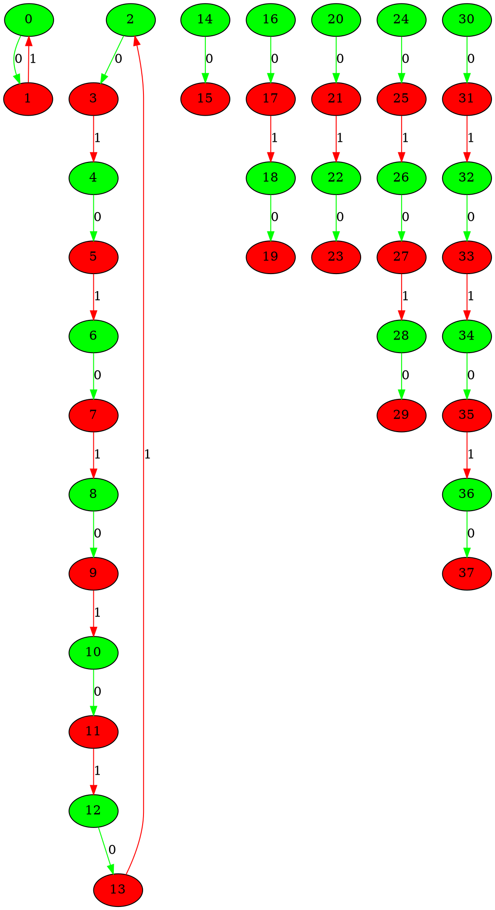
```graphviz
digraph G {
0[label="0" fillcolor="green" style="filled"];
1[label="1" fillcolor="red" style="filled"];
2[label="2" fillcolor="green" style="filled"];
3[label="3" fillcolor="red" style="filled"];
4[label="4" fillcolor="green" style="filled"];
5[label="5" fillcolor="red" style="filled"];
6[label="6" fillcolor="green" style="filled"];
7[label="7" fillcolor="red" style="filled"];
8[label="8" fillcolor="green" style="filled"];
9[label="9" fillcolor="red" style="filled"];
10[label="10" fillcolor="green" style="filled"];
11[label="11" fillcolor="red" style="filled"];
12[label="12" fillcolor="green" style="filled"];
13[label="13" fillcolor="red" style="filled"];
14[label="14" fillcolor="green" style="filled"];
15[label="15" fillcolor="red" style="filled"];
16[label="16" fillcolor="green" style="filled"];
17[label="17" fillcolor="red" style="filled"];
18[label="18" fillcolor="green" style="filled"];
19[label="19" fillcolor="red" style="filled"];
20[label="20" fillcolor="green" style="filled"];
21[label="21" fillcolor="red" style="filled"];
22[label="22" fillcolor="green" style="filled"];
23[label="23" fillcolor="red" style="filled"];
24[label="24" fillcolor="green" style="filled"];
25[label="25" fillcolor="red" style="filled"];
26[label="26" fillcolor="green" style="filled"];
27[label="27" fillcolor="red" style="filled"];
28[label="28" fillcolor="green" style="filled"];
29[label="29" fillcolor="red" style="filled"];
30[label="30" fillcolor="green" style="filled"];
31[label="31" fillcolor="red" style="filled"];
32[label="32" fillcolor="green" style="filled"];
33[label="33" fillcolor="red" style="filled"];
34[label="34" fillcolor="green" style="filled"];
35[label="35" fillcolor="red" style="filled"];
36[label="36" fillcolor="green" style="filled"];
37[label="37" fillcolor="red" style="filled"];
0->1 [label="0" color="green"];
2->3 [label="0" color="green"];
4->5 [label="0" color="green"];
6->7 [label="0" color="green"];
8->9 [label="0" color="green"];
10->11 [label="0" color="green"];
12->13 [label="0" color="green"];
14->15 [label="0" color="green"];
16->17 [label="0" color="green"];
18->19 [label="0" color="green"];
20->21 [label="0" color="green"];
22->23 [label="0" color="green"];
24->25 [label="0" color="green"];
26->27 [label="0" color="green"];
28->29 [label="0" color="green"];
30->31 [label="0" color="green"];
32->33 [label="0" color="green"];
34->35 [label="0" color="green"];
36->37 [label="0" color="green"];
1->0 [label="1" color="red"];
3->4 [label="1" color="red"];
5->6 [label="1" color="red"];
7->8 [label="1" color="red"];
9->10 [label="1" color="red"];
11->12 [label="1" color="red"];
13->2 [label="1" color="red"];
17->18 [label="1" color="red"];
21->22 [label="1" color="red"];
25->26 [label="1" color="red"];
27->28 [label="1" color="red"];
31->32 [label="1" color="red"];
33->34 [label="1" color="red"];
35->36 [label="1" color="red"];
}
```
___
## Graph 12316 - list de compréhension : 2|1,1,2,3,4,6
___
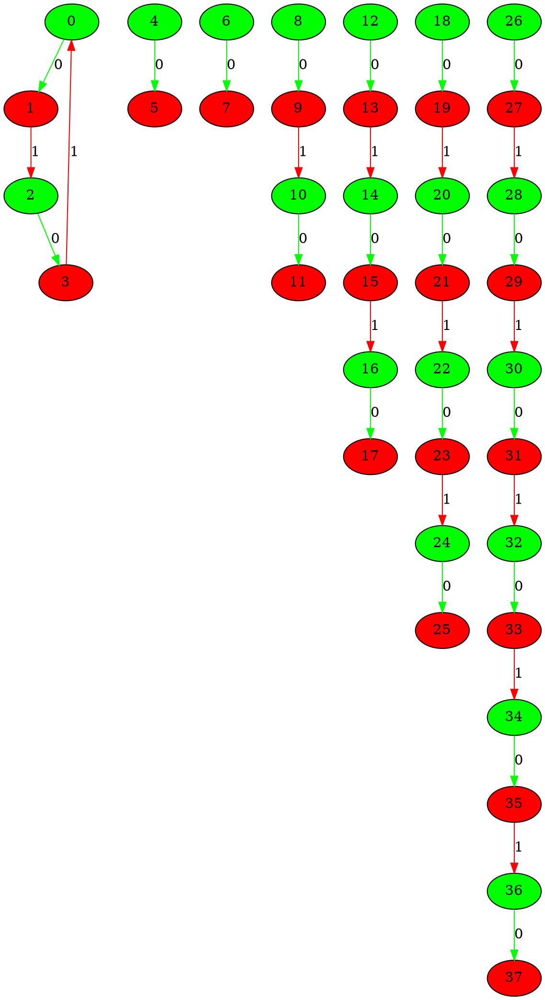
```graphviz
digraph G {
0[label="0" fillcolor="green" style="filled"];
1[label="1" fillcolor="red" style="filled"];
2[label="2" fillcolor="green" style="filled"];
3[label="3" fillcolor="red" style="filled"];
4[label="4" fillcolor="green" style="filled"];
5[label="5" fillcolor="red" style="filled"];
6[label="6" fillcolor="green" style="filled"];
7[label="7" fillcolor="red" style="filled"];
8[label="8" fillcolor="green" style="filled"];
9[label="9" fillcolor="red" style="filled"];
10[label="10" fillcolor="green" style="filled"];
11[label="11" fillcolor="red" style="filled"];
12[label="12" fillcolor="green" style="filled"];
13[label="13" fillcolor="red" style="filled"];
14[label="14" fillcolor="green" style="filled"];
15[label="15" fillcolor="red" style="filled"];
16[label="16" fillcolor="green" style="filled"];
17[label="17" fillcolor="red" style="filled"];
18[label="18" fillcolor="green" style="filled"];
19[label="19" fillcolor="red" style="filled"];
20[label="20" fillcolor="green" style="filled"];
21[label="21" fillcolor="red" style="filled"];
22[label="22" fillcolor="green" style="filled"];
23[label="23" fillcolor="red" style="filled"];
24[label="24" fillcolor="green" style="filled"];
25[label="25" fillcolor="red" style="filled"];
26[label="26" fillcolor="green" style="filled"];
27[label="27" fillcolor="red" style="filled"];
28[label="28" fillcolor="green" style="filled"];
29[label="29" fillcolor="red" style="filled"];
30[label="30" fillcolor="green" style="filled"];
31[label="31" fillcolor="red" style="filled"];
32[label="32" fillcolor="green" style="filled"];
33[label="33" fillcolor="red" style="filled"];
34[label="34" fillcolor="green" style="filled"];
35[label="35" fillcolor="red" style="filled"];
36[label="36" fillcolor="green" style="filled"];
37[label="37" fillcolor="red" style="filled"];
0->1 [label="0" color="green"];
2->3 [label="0" color="green"];
4->5 [label="0" color="green"];
6->7 [label="0" color="green"];
8->9 [label="0" color="green"];
10->11 [label="0" color="green"];
12->13 [label="0" color="green"];
14->15 [label="0" color="green"];
16->17 [label="0" color="green"];
18->19 [label="0" color="green"];
20->21 [label="0" color="green"];
22->23 [label="0" color="green"];
24->25 [label="0" color="green"];
26->27 [label="0" color="green"];
28->29 [label="0" color="green"];
30->31 [label="0" color="green"];
32->33 [label="0" color="green"];
34->35 [label="0" color="green"];
36->37 [label="0" color="green"];
1->2 [label="1" color="red"];
3->0 [label="1" color="red"];
9->10 [label="1" color="red"];
13->14 [label="1" color="red"];
15->16 [label="1" color="red"];
19->20 [label="1" color="red"];
21->22 [label="1" color="red"];
23->24 [label="1" color="red"];
27->28 [label="1" color="red"];
29->30 [label="1" color="red"];
31->32 [label="1" color="red"];
33->34 [label="1" color="red"];
35->36 [label="1" color="red"];
}
```
___
## Graph 12317 - list de compréhension : 2,2|1,1,3,4,6
___
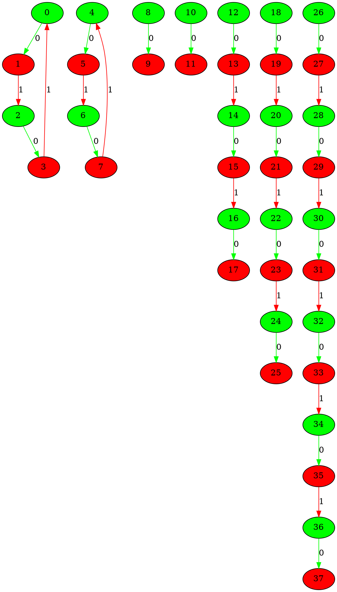
```graphviz
digraph G {
0[label="0" fillcolor="green" style="filled"];
1[label="1" fillcolor="red" style="filled"];
2[label="2" fillcolor="green" style="filled"];
3[label="3" fillcolor="red" style="filled"];
4[label="4" fillcolor="green" style="filled"];
5[label="5" fillcolor="red" style="filled"];
6[label="6" fillcolor="green" style="filled"];
7[label="7" fillcolor="red" style="filled"];
8[label="8" fillcolor="green" style="filled"];
9[label="9" fillcolor="red" style="filled"];
10[label="10" fillcolor="green" style="filled"];
11[label="11" fillcolor="red" style="filled"];
12[label="12" fillcolor="green" style="filled"];
13[label="13" fillcolor="red" style="filled"];
14[label="14" fillcolor="green" style="filled"];
15[label="15" fillcolor="red" style="filled"];
16[label="16" fillcolor="green" style="filled"];
17[label="17" fillcolor="red" style="filled"];
18[label="18" fillcolor="green" style="filled"];
19[label="19" fillcolor="red" style="filled"];
20[label="20" fillcolor="green" style="filled"];
21[label="21" fillcolor="red" style="filled"];
22[label="22" fillcolor="green" style="filled"];
23[label="23" fillcolor="red" style="filled"];
24[label="24" fillcolor="green" style="filled"];
25[label="25" fillcolor="red" style="filled"];
26[label="26" fillcolor="green" style="filled"];
27[label="27" fillcolor="red" style="filled"];
28[label="28" fillcolor="green" style="filled"];
29[label="29" fillcolor="red" style="filled"];
30[label="30" fillcolor="green" style="filled"];
31[label="31" fillcolor="red" style="filled"];
32[label="32" fillcolor="green" style="filled"];
33[label="33" fillcolor="red" style="filled"];
34[label="34" fillcolor="green" style="filled"];
35[label="35" fillcolor="red" style="filled"];
36[label="36" fillcolor="green" style="filled"];
37[label="37" fillcolor="red" style="filled"];
0->1 [label="0" color="green"];
2->3 [label="0" color="green"];
4->5 [label="0" color="green"];
6->7 [label="0" color="green"];
8->9 [label="0" color="green"];
10->11 [label="0" color="green"];
12->13 [label="0" color="green"];
14->15 [label="0" color="green"];
16->17 [label="0" color="green"];
18->19 [label="0" color="green"];
20->21 [label="0" color="green"];
22->23 [label="0" color="green"];
24->25 [label="0" color="green"];
26->27 [label="0" color="green"];
28->29 [label="0" color="green"];
30->31 [label="0" color="green"];
32->33 [label="0" color="green"];
34->35 [label="0" color="green"];
36->37 [label="0" color="green"];
1->2 [label="1" color="red"];
3->0 [label="1" color="red"];
5->6 [label="1" color="red"];
7->4 [label="1" color="red"];
13->14 [label="1" color="red"];
15->16 [label="1" color="red"];
19->20 [label="1" color="red"];
21->22 [label="1" color="red"];
23->24 [label="1" color="red"];
27->28 [label="1" color="red"];
29->30 [label="1" color="red"];
31->32 [label="1" color="red"];
33->34 [label="1" color="red"];
35->36 [label="1" color="red"];
}
```
___
## Graph 12318 - list de compréhension : 2,2,3|1,1,4,6
___
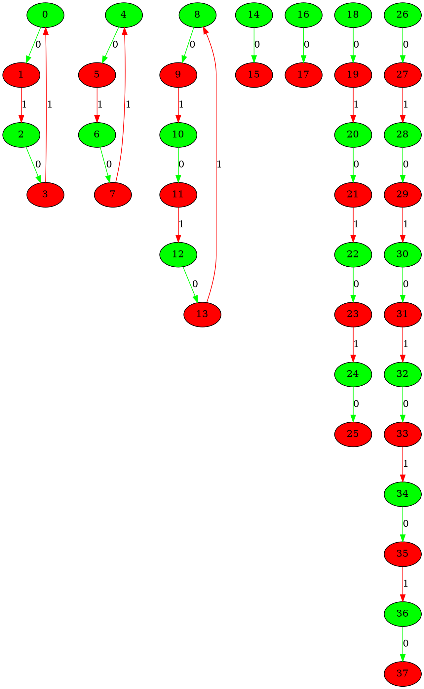
```graphviz
digraph G {
0[label="0" fillcolor="green" style="filled"];
1[label="1" fillcolor="red" style="filled"];
2[label="2" fillcolor="green" style="filled"];
3[label="3" fillcolor="red" style="filled"];
4[label="4" fillcolor="green" style="filled"];
5[label="5" fillcolor="red" style="filled"];
6[label="6" fillcolor="green" style="filled"];
7[label="7" fillcolor="red" style="filled"];
8[label="8" fillcolor="green" style="filled"];
9[label="9" fillcolor="red" style="filled"];
10[label="10" fillcolor="green" style="filled"];
11[label="11" fillcolor="red" style="filled"];
12[label="12" fillcolor="green" style="filled"];
13[label="13" fillcolor="red" style="filled"];
14[label="14" fillcolor="green" style="filled"];
15[label="15" fillcolor="red" style="filled"];
16[label="16" fillcolor="green" style="filled"];
17[label="17" fillcolor="red" style="filled"];
18[label="18" fillcolor="green" style="filled"];
19[label="19" fillcolor="red" style="filled"];
20[label="20" fillcolor="green" style="filled"];
21[label="21" fillcolor="red" style="filled"];
22[label="22" fillcolor="green" style="filled"];
23[label="23" fillcolor="red" style="filled"];
24[label="24" fillcolor="green" style="filled"];
25[label="25" fillcolor="red" style="filled"];
26[label="26" fillcolor="green" style="filled"];
27[label="27" fillcolor="red" style="filled"];
28[label="28" fillcolor="green" style="filled"];
29[label="29" fillcolor="red" style="filled"];
30[label="30" fillcolor="green" style="filled"];
31[label="31" fillcolor="red" style="filled"];
32[label="32" fillcolor="green" style="filled"];
33[label="33" fillcolor="red" style="filled"];
34[label="34" fillcolor="green" style="filled"];
35[label="35" fillcolor="red" style="filled"];
36[label="36" fillcolor="green" style="filled"];
37[label="37" fillcolor="red" style="filled"];
0->1 [label="0" color="green"];
2->3 [label="0" color="green"];
4->5 [label="0" color="green"];
6->7 [label="0" color="green"];
8->9 [label="0" color="green"];
10->11 [label="0" color="green"];
12->13 [label="0" color="green"];
14->15 [label="0" color="green"];
16->17 [label="0" color="green"];
18->19 [label="0" color="green"];
20->21 [label="0" color="green"];
22->23 [label="0" color="green"];
24->25 [label="0" color="green"];
26->27 [label="0" color="green"];
28->29 [label="0" color="green"];
30->31 [label="0" color="green"];
32->33 [label="0" color="green"];
34->35 [label="0" color="green"];
36->37 [label="0" color="green"];
1->2 [label="1" color="red"];
3->0 [label="1" color="red"];
5->6 [label="1" color="red"];
7->4 [label="1" color="red"];
9->10 [label="1" color="red"];
11->12 [label="1" color="red"];
13->8 [label="1" color="red"];
19->20 [label="1" color="red"];
21->22 [label="1" color="red"];
23->24 [label="1" color="red"];
27->28 [label="1" color="red"];
29->30 [label="1" color="red"];
31->32 [label="1" color="red"];
33->34 [label="1" color="red"];
35->36 [label="1" color="red"];
}
```
___
## Graph 12319 - list de compréhension : 2,2,3,4|1,1,6
___
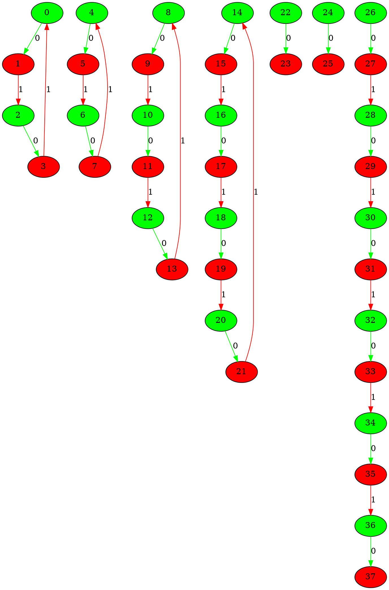
```graphviz
digraph G {
0[label="0" fillcolor="green" style="filled"];
1[label="1" fillcolor="red" style="filled"];
2[label="2" fillcolor="green" style="filled"];
3[label="3" fillcolor="red" style="filled"];
4[label="4" fillcolor="green" style="filled"];
5[label="5" fillcolor="red" style="filled"];
6[label="6" fillcolor="green" style="filled"];
7[label="7" fillcolor="red" style="filled"];
8[label="8" fillcolor="green" style="filled"];
9[label="9" fillcolor="red" style="filled"];
10[label="10" fillcolor="green" style="filled"];
11[label="11" fillcolor="red" style="filled"];
12[label="12" fillcolor="green" style="filled"];
13[label="13" fillcolor="red" style="filled"];
14[label="14" fillcolor="green" style="filled"];
15[label="15" fillcolor="red" style="filled"];
16[label="16" fillcolor="green" style="filled"];
17[label="17" fillcolor="red" style="filled"];
18[label="18" fillcolor="green" style="filled"];
19[label="19" fillcolor="red" style="filled"];
20[label="20" fillcolor="green" style="filled"];
21[label="21" fillcolor="red" style="filled"];
22[label="22" fillcolor="green" style="filled"];
23[label="23" fillcolor="red" style="filled"];
24[label="24" fillcolor="green" style="filled"];
25[label="25" fillcolor="red" style="filled"];
26[label="26" fillcolor="green" style="filled"];
27[label="27" fillcolor="red" style="filled"];
28[label="28" fillcolor="green" style="filled"];
29[label="29" fillcolor="red" style="filled"];
30[label="30" fillcolor="green" style="filled"];
31[label="31" fillcolor="red" style="filled"];
32[label="32" fillcolor="green" style="filled"];
33[label="33" fillcolor="red" style="filled"];
34[label="34" fillcolor="green" style="filled"];
35[label="35" fillcolor="red" style="filled"];
36[label="36" fillcolor="green" style="filled"];
37[label="37" fillcolor="red" style="filled"];
0->1 [label="0" color="green"];
2->3 [label="0" color="green"];
4->5 [label="0" color="green"];
6->7 [label="0" color="green"];
8->9 [label="0" color="green"];
10->11 [label="0" color="green"];
12->13 [label="0" color="green"];
14->15 [label="0" color="green"];
16->17 [label="0" color="green"];
18->19 [label="0" color="green"];
20->21 [label="0" color="green"];
22->23 [label="0" color="green"];
24->25 [label="0" color="green"];
26->27 [label="0" color="green"];
28->29 [label="0" color="green"];
30->31 [label="0" color="green"];
32->33 [label="0" color="green"];
34->35 [label="0" color="green"];
36->37 [label="0" color="green"];
1->2 [label="1" color="red"];
3->0 [label="1" color="red"];
5->6 [label="1" color="red"];
7->4 [label="1" color="red"];
9->10 [label="1" color="red"];
11->12 [label="1" color="red"];
13->8 [label="1" color="red"];
15->16 [label="1" color="red"];
17->18 [label="1" color="red"];
19->20 [label="1" color="red"];
21->14 [label="1" color="red"];
27->28 [label="1" color="red"];
29->30 [label="1" color="red"];
31->32 [label="1" color="red"];
33->34 [label="1" color="red"];
35->36 [label="1" color="red"];
}
```
___
## Graph 12320 - list de compréhension : 2,2,3,4,6|1,1
___
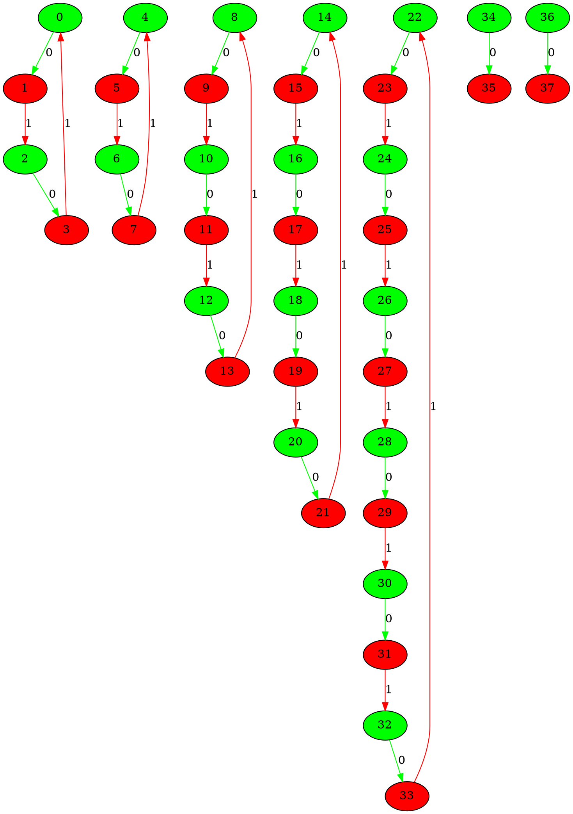
```graphviz
digraph G {
0[label="0" fillcolor="green" style="filled"];
1[label="1" fillcolor="red" style="filled"];
2[label="2" fillcolor="green" style="filled"];
3[label="3" fillcolor="red" style="filled"];
4[label="4" fillcolor="green" style="filled"];
5[label="5" fillcolor="red" style="filled"];
6[label="6" fillcolor="green" style="filled"];
7[label="7" fillcolor="red" style="filled"];
8[label="8" fillcolor="green" style="filled"];
9[label="9" fillcolor="red" style="filled"];
10[label="10" fillcolor="green" style="filled"];
11[label="11" fillcolor="red" style="filled"];
12[label="12" fillcolor="green" style="filled"];
13[label="13" fillcolor="red" style="filled"];
14[label="14" fillcolor="green" style="filled"];
15[label="15" fillcolor="red" style="filled"];
16[label="16" fillcolor="green" style="filled"];
17[label="17" fillcolor="red" style="filled"];
18[label="18" fillcolor="green" style="filled"];
19[label="19" fillcolor="red" style="filled"];
20[label="20" fillcolor="green" style="filled"];
21[label="21" fillcolor="red" style="filled"];
22[label="22" fillcolor="green" style="filled"];
23[label="23" fillcolor="red" style="filled"];
24[label="24" fillcolor="green" style="filled"];
25[label="25" fillcolor="red" style="filled"];
26[label="26" fillcolor="green" style="filled"];
27[label="27" fillcolor="red" style="filled"];
28[label="28" fillcolor="green" style="filled"];
29[label="29" fillcolor="red" style="filled"];
30[label="30" fillcolor="green" style="filled"];
31[label="31" fillcolor="red" style="filled"];
32[label="32" fillcolor="green" style="filled"];
33[label="33" fillcolor="red" style="filled"];
34[label="34" fillcolor="green" style="filled"];
35[label="35" fillcolor="red" style="filled"];
36[label="36" fillcolor="green" style="filled"];
37[label="37" fillcolor="red" style="filled"];
0->1 [label="0" color="green"];
2->3 [label="0" color="green"];
4->5 [label="0" color="green"];
6->7 [label="0" color="green"];
8->9 [label="0" color="green"];
10->11 [label="0" color="green"];
12->13 [label="0" color="green"];
14->15 [label="0" color="green"];
16->17 [label="0" color="green"];
18->19 [label="0" color="green"];
20->21 [label="0" color="green"];
22->23 [label="0" color="green"];
24->25 [label="0" color="green"];
26->27 [label="0" color="green"];
28->29 [label="0" color="green"];
30->31 [label="0" color="green"];
32->33 [label="0" color="green"];
34->35 [label="0" color="green"];
36->37 [label="0" color="green"];
1->2 [label="1" color="red"];
3->0 [label="1" color="red"];
5->6 [label="1" color="red"];
7->4 [label="1" color="red"];
9->10 [label="1" color="red"];
11->12 [label="1" color="red"];
13->8 [label="1" color="red"];
15->16 [label="1" color="red"];
17->18 [label="1" color="red"];
19->20 [label="1" color="red"];
21->14 [label="1" color="red"];
23->24 [label="1" color="red"];
25->26 [label="1" color="red"];
27->28 [label="1" color="red"];
29->30 [label="1" color="red"];
31->32 [label="1" color="red"];
33->22 [label="1" color="red"];
}
```
___
## Graph 12321 - list de compréhension : 2,2,3,6|1,1,4
___
```graphviz
digraph G {
0[label="0" fillcolor="green" style="filled"];
1[label="1" fillcolor="red" style="filled"];
2[label="2" fillcolor="green" style="filled"];
3[label="3" fillcolor="red" style="filled"];
4[label="4" fillcolor="green" style="filled"];
5[label="5" fillcolor="red" style="filled"];
6[label="6" fillcolor="green" style="filled"];
7[label="7" fillcolor="red" style="filled"];
8[label="8" fillcolor="green" style="filled"];
9[label="9" fillcolor="red" style="filled"];
10[label="10" fillcolor="green" style="filled"];
11[label="11" fillcolor="red" style="filled"];
12[label="12" fillcolor="green" style="filled"];
13[label="13" fillcolor="red" style="filled"];
14[label="14" fillcolor="green" style="filled"];
15[label="15" fillcolor="red" style="filled"];
16[label="16" fillcolor="green" style="filled"];
17[label="17" fillcolor="red" style="filled"];
18[label="18" fillcolor="green" style="filled"];
19[label="19" fillcolor="red" style="filled"];
20[label="20" fillcolor="green" style="filled"];
21[label="21" fillcolor="red" style="filled"];
22[label="22" fillcolor="green" style="filled"];
23[label="23" fillcolor="red" style="filled"];
24[label="24" fillcolor="green" style="filled"];
25[label="25" fillcolor="red" style="filled"];
26[label="26" fillcolor="green" style="filled"];
27[label="27" fillcolor="red" style="filled"];
28[label="28" fillcolor="green" style="filled"];
29[label="29" fillcolor="red" style="filled"];
30[label="30" fillcolor="green" style="filled"];
31[label="31" fillcolor="red" style="filled"];
32[label="32" fillcolor="green" style="filled"];
33[label="33" fillcolor="red" style="filled"];
34[label="34" fillcolor="green" style="filled"];
35[label="35" fillcolor="red" style="filled"];
36[label="36" fillcolor="green" style="filled"];
37[label="37" fillcolor="red" style="filled"];
0->1 [label="0" color="green"];
2->3 [label="0" color="green"];
4->5 [label="0" color="green"];
6->7 [label="0" color="green"];
8->9 [label="0" color="green"];
10->11 [label="0" color="green"];
12->13 [label="0" color="green"];
14->15 [label="0" color="green"];
16->17 [label="0" color="green"];
18->19 [label="0" color="green"];
20->21 [label="0" color="green"];
22->23 [label="0" color="green"];
24->25 [label="0" color="green"];
26->27 [label="0" color="green"];
28->29 [label="0" color="green"];
30->31 [label="0" color="green"];
32->33 [label="0" color="green"];
34->35 [label="0" color="green"];
36->37 [label="0" color="green"];
1->2 [label="1" color="red"];
3->0 [label="1" color="red"];
5->6 [label="1" color="red"];
7->4 [label="1" color="red"];
9->10 [label="1" color="red"];
11->12 [label="1" color="red"];
13->8 [label="1" color="red"];
15->16 [label="1" color="red"];
17->18 [label="1" color="red"];
19->20 [label="1" color="red"];
21->22 [label="1" color="red"];
23->24 [label="1" color="red"];
25->14 [label="1" color="red"];
31->32 [label="1" color="red"];
33->34 [label="1" color="red"];
35->36 [label="1" color="red"];
}
```
___
## Graph 12322 - list de compréhension : 2,2,4|1,1,3,6
___
```graphviz
digraph G {
0[label="0" fillcolor="green" style="filled"];
1[label="1" fillcolor="red" style="filled"];
2[label="2" fillcolor="green" style="filled"];
3[label="3" fillcolor="red" style="filled"];
4[label="4" fillcolor="green" style="filled"];
5[label="5" fillcolor="red" style="filled"];
6[label="6" fillcolor="green" style="filled"];
7[label="7" fillcolor="red" style="filled"];
8[label="8" fillcolor="green" style="filled"];
9[label="9" fillcolor="red" style="filled"];
10[label="10" fillcolor="green" style="filled"];
11[label="11" fillcolor="red" style="filled"];
12[label="12" fillcolor="green" style="filled"];
13[label="13" fillcolor="red" style="filled"];
14[label="14" fillcolor="green" style="filled"];
15[label="15" fillcolor="red" style="filled"];
16[label="16" fillcolor="green" style="filled"];
17[label="17" fillcolor="red" style="filled"];
18[label="18" fillcolor="green" style="filled"];
19[label="19" fillcolor="red" style="filled"];
20[label="20" fillcolor="green" style="filled"];
21[label="21" fillcolor="red" style="filled"];
22[label="22" fillcolor="green" style="filled"];
23[label="23" fillcolor="red" style="filled"];
24[label="24" fillcolor="green" style="filled"];
25[label="25" fillcolor="red" style="filled"];
26[label="26" fillcolor="green" style="filled"];
27[label="27" fillcolor="red" style="filled"];
28[label="28" fillcolor="green" style="filled"];
29[label="29" fillcolor="red" style="filled"];
30[label="30" fillcolor="green" style="filled"];
31[label="31" fillcolor="red" style="filled"];
32[label="32" fillcolor="green" style="filled"];
33[label="33" fillcolor="red" style="filled"];
34[label="34" fillcolor="green" style="filled"];
35[label="35" fillcolor="red" style="filled"];
36[label="36" fillcolor="green" style="filled"];
37[label="37" fillcolor="red" style="filled"];
0->1 [label="0" color="green"];
2->3 [label="0" color="green"];
4->5 [label="0" color="green"];
6->7 [label="0" color="green"];
8->9 [label="0" color="green"];
10->11 [label="0" color="green"];
12->13 [label="0" color="green"];
14->15 [label="0" color="green"];
16->17 [label="0" color="green"];
18->19 [label="0" color="green"];
20->21 [label="0" color="green"];
22->23 [label="0" color="green"];
24->25 [label="0" color="green"];
26->27 [label="0" color="green"];
28->29 [label="0" color="green"];
30->31 [label="0" color="green"];
32->33 [label="0" color="green"];
34->35 [label="0" color="green"];
36->37 [label="0" color="green"];
1->2 [label="1" color="red"];
3->0 [label="1" color="red"];
5->6 [label="1" color="red"];
7->4 [label="1" color="red"];
9->10 [label="1" color="red"];
11->12 [label="1" color="red"];
13->14 [label="1" color="red"];
15->8 [label="1" color="red"];
21->22 [label="1" color="red"];
23->24 [label="1" color="red"];
27->28 [label="1" color="red"];
29->30 [label="1" color="red"];
31->32 [label="1" color="red"];
33->34 [label="1" color="red"];
35->36 [label="1" color="red"];
}
```
___
## Graph 12323 - list de compréhension : 2,2,4,6|1,1,3
___
```graphviz
digraph G {
0[label="0" fillcolor="green" style="filled"];
1[label="1" fillcolor="red" style="filled"];
2[label="2" fillcolor="green" style="filled"];
3[label="3" fillcolor="red" style="filled"];
4[label="4" fillcolor="green" style="filled"];
5[label="5" fillcolor="red" style="filled"];
6[label="6" fillcolor="green" style="filled"];
7[label="7" fillcolor="red" style="filled"];
8[label="8" fillcolor="green" style="filled"];
9[label="9" fillcolor="red" style="filled"];
10[label="10" fillcolor="green" style="filled"];
11[label="11" fillcolor="red" style="filled"];
12[label="12" fillcolor="green" style="filled"];
13[label="13" fillcolor="red" style="filled"];
14[label="14" fillcolor="green" style="filled"];
15[label="15" fillcolor="red" style="filled"];
16[label="16" fillcolor="green" style="filled"];
17[label="17" fillcolor="red" style="filled"];
18[label="18" fillcolor="green" style="filled"];
19[label="19" fillcolor="red" style="filled"];
20[label="20" fillcolor="green" style="filled"];
21[label="21" fillcolor="red" style="filled"];
22[label="22" fillcolor="green" style="filled"];
23[label="23" fillcolor="red" style="filled"];
24[label="24" fillcolor="green" style="filled"];
25[label="25" fillcolor="red" style="filled"];
26[label="26" fillcolor="green" style="filled"];
27[label="27" fillcolor="red" style="filled"];
28[label="28" fillcolor="green" style="filled"];
29[label="29" fillcolor="red" style="filled"];
30[label="30" fillcolor="green" style="filled"];
31[label="31" fillcolor="red" style="filled"];
32[label="32" fillcolor="green" style="filled"];
33[label="33" fillcolor="red" style="filled"];
34[label="34" fillcolor="green" style="filled"];
35[label="35" fillcolor="red" style="filled"];
36[label="36" fillcolor="green" style="filled"];
37[label="37" fillcolor="red" style="filled"];
0->1 [label="0" color="green"];
2->3 [label="0" color="green"];
4->5 [label="0" color="green"];
6->7 [label="0" color="green"];
8->9 [label="0" color="green"];
10->11 [label="0" color="green"];
12->13 [label="0" color="green"];
14->15 [label="0" color="green"];
16->17 [label="0" color="green"];
18->19 [label="0" color="green"];
20->21 [label="0" color="green"];
22->23 [label="0" color="green"];
24->25 [label="0" color="green"];
26->27 [label="0" color="green"];
28->29 [label="0" color="green"];
30->31 [label="0" color="green"];
32->33 [label="0" color="green"];
34->35 [label="0" color="green"];
36->37 [label="0" color="green"];
1->2 [label="1" color="red"];
3->0 [label="1" color="red"];
5->6 [label="1" color="red"];
7->4 [label="1" color="red"];
9->10 [label="1" color="red"];
11->12 [label="1" color="red"];
13->14 [label="1" color="red"];
15->8 [label="1" color="red"];
17->18 [label="1" color="red"];
19->20 [label="1" color="red"];
21->22 [label="1" color="red"];
23->24 [label="1" color="red"];
25->26 [label="1" color="red"];
27->16 [label="1" color="red"];
33->34 [label="1" color="red"];
35->36 [label="1" color="red"];
}
```
___
## Graph 12324 - list de compréhension : 2,2,6|1,1,3,4
___
```graphviz
digraph G {
0[label="0" fillcolor="green" style="filled"];
1[label="1" fillcolor="red" style="filled"];
2[label="2" fillcolor="green" style="filled"];
3[label="3" fillcolor="red" style="filled"];
4[label="4" fillcolor="green" style="filled"];
5[label="5" fillcolor="red" style="filled"];
6[label="6" fillcolor="green" style="filled"];
7[label="7" fillcolor="red" style="filled"];
8[label="8" fillcolor="green" style="filled"];
9[label="9" fillcolor="red" style="filled"];
10[label="10" fillcolor="green" style="filled"];
11[label="11" fillcolor="red" style="filled"];
12[label="12" fillcolor="green" style="filled"];
13[label="13" fillcolor="red" style="filled"];
14[label="14" fillcolor="green" style="filled"];
15[label="15" fillcolor="red" style="filled"];
16[label="16" fillcolor="green" style="filled"];
17[label="17" fillcolor="red" style="filled"];
18[label="18" fillcolor="green" style="filled"];
19[label="19" fillcolor="red" style="filled"];
20[label="20" fillcolor="green" style="filled"];
21[label="21" fillcolor="red" style="filled"];
22[label="22" fillcolor="green" style="filled"];
23[label="23" fillcolor="red" style="filled"];
24[label="24" fillcolor="green" style="filled"];
25[label="25" fillcolor="red" style="filled"];
26[label="26" fillcolor="green" style="filled"];
27[label="27" fillcolor="red" style="filled"];
28[label="28" fillcolor="green" style="filled"];
29[label="29" fillcolor="red" style="filled"];
30[label="30" fillcolor="green" style="filled"];
31[label="31" fillcolor="red" style="filled"];
32[label="32" fillcolor="green" style="filled"];
33[label="33" fillcolor="red" style="filled"];
34[label="34" fillcolor="green" style="filled"];
35[label="35" fillcolor="red" style="filled"];
36[label="36" fillcolor="green" style="filled"];
37[label="37" fillcolor="red" style="filled"];
0->1 [label="0" color="green"];
2->3 [label="0" color="green"];
4->5 [label="0" color="green"];
6->7 [label="0" color="green"];
8->9 [label="0" color="green"];
10->11 [label="0" color="green"];
12->13 [label="0" color="green"];
14->15 [label="0" color="green"];
16->17 [label="0" color="green"];
18->19 [label="0" color="green"];
20->21 [label="0" color="green"];
22->23 [label="0" color="green"];
24->25 [label="0" color="green"];
26->27 [label="0" color="green"];
28->29 [label="0" color="green"];
30->31 [label="0" color="green"];
32->33 [label="0" color="green"];
34->35 [label="0" color="green"];
36->37 [label="0" color="green"];
1->2 [label="1" color="red"];
3->0 [label="1" color="red"];
5->6 [label="1" color="red"];
7->4 [label="1" color="red"];
9->10 [label="1" color="red"];
11->12 [label="1" color="red"];
13->14 [label="1" color="red"];
15->16 [label="1" color="red"];
17->18 [label="1" color="red"];
19->8 [label="1" color="red"];
25->26 [label="1" color="red"];
27->28 [label="1" color="red"];
31->32 [label="1" color="red"];
33->34 [label="1" color="red"];
35->36 [label="1" color="red"];
}
```
___
## Graph 12325 - list de compréhension : 2,3|1,1,2,4,6
___
```graphviz
digraph G {
0[label="0" fillcolor="green" style="filled"];
1[label="1" fillcolor="red" style="filled"];
2[label="2" fillcolor="green" style="filled"];
3[label="3" fillcolor="red" style="filled"];
4[label="4" fillcolor="green" style="filled"];
5[label="5" fillcolor="red" style="filled"];
6[label="6" fillcolor="green" style="filled"];
7[label="7" fillcolor="red" style="filled"];
8[label="8" fillcolor="green" style="filled"];
9[label="9" fillcolor="red" style="filled"];
10[label="10" fillcolor="green" style="filled"];
11[label="11" fillcolor="red" style="filled"];
12[label="12" fillcolor="green" style="filled"];
13[label="13" fillcolor="red" style="filled"];
14[label="14" fillcolor="green" style="filled"];
15[label="15" fillcolor="red" style="filled"];
16[label="16" fillcolor="green" style="filled"];
17[label="17" fillcolor="red" style="filled"];
18[label="18" fillcolor="green" style="filled"];
19[label="19" fillcolor="red" style="filled"];
20[label="20" fillcolor="green" style="filled"];
21[label="21" fillcolor="red" style="filled"];
22[label="22" fillcolor="green" style="filled"];
23[label="23" fillcolor="red" style="filled"];
24[label="24" fillcolor="green" style="filled"];
25[label="25" fillcolor="red" style="filled"];
26[label="26" fillcolor="green" style="filled"];
27[label="27" fillcolor="red" style="filled"];
28[label="28" fillcolor="green" style="filled"];
29[label="29" fillcolor="red" style="filled"];
30[label="30" fillcolor="green" style="filled"];
31[label="31" fillcolor="red" style="filled"];
32[label="32" fillcolor="green" style="filled"];
33[label="33" fillcolor="red" style="filled"];
34[label="34" fillcolor="green" style="filled"];
35[label="35" fillcolor="red" style="filled"];
36[label="36" fillcolor="green" style="filled"];
37[label="37" fillcolor="red" style="filled"];
0->1 [label="0" color="green"];
2->3 [label="0" color="green"];
4->5 [label="0" color="green"];
6->7 [label="0" color="green"];
8->9 [label="0" color="green"];
10->11 [label="0" color="green"];
12->13 [label="0" color="green"];
14->15 [label="0" color="green"];
16->17 [label="0" color="green"];
18->19 [label="0" color="green"];
20->21 [label="0" color="green"];
22->23 [label="0" color="green"];
24->25 [label="0" color="green"];
26->27 [label="0" color="green"];
28->29 [label="0" color="green"];
30->31 [label="0" color="green"];
32->33 [label="0" color="green"];
34->35 [label="0" color="green"];
36->37 [label="0" color="green"];
1->2 [label="1" color="red"];
3->0 [label="1" color="red"];
5->6 [label="1" color="red"];
7->8 [label="1" color="red"];
9->4 [label="1" color="red"];
15->16 [label="1" color="red"];
19->20 [label="1" color="red"];
21->22 [label="1" color="red"];
23->24 [label="1" color="red"];
27->28 [label="1" color="red"];
29->30 [label="1" color="red"];
31->32 [label="1" color="red"];
33->34 [label="1" color="red"];
35->36 [label="1" color="red"];
}
```
___
## Graph 12326 - list de compréhension : 2,3,4|1,1,2,6
___
```graphviz
digraph G {
0[label="0" fillcolor="green" style="filled"];
1[label="1" fillcolor="red" style="filled"];
2[label="2" fillcolor="green" style="filled"];
3[label="3" fillcolor="red" style="filled"];
4[label="4" fillcolor="green" style="filled"];
5[label="5" fillcolor="red" style="filled"];
6[label="6" fillcolor="green" style="filled"];
7[label="7" fillcolor="red" style="filled"];
8[label="8" fillcolor="green" style="filled"];
9[label="9" fillcolor="red" style="filled"];
10[label="10" fillcolor="green" style="filled"];
11[label="11" fillcolor="red" style="filled"];
12[label="12" fillcolor="green" style="filled"];
13[label="13" fillcolor="red" style="filled"];
14[label="14" fillcolor="green" style="filled"];
15[label="15" fillcolor="red" style="filled"];
16[label="16" fillcolor="green" style="filled"];
17[label="17" fillcolor="red" style="filled"];
18[label="18" fillcolor="green" style="filled"];
19[label="19" fillcolor="red" style="filled"];
20[label="20" fillcolor="green" style="filled"];
21[label="21" fillcolor="red" style="filled"];
22[label="22" fillcolor="green" style="filled"];
23[label="23" fillcolor="red" style="filled"];
24[label="24" fillcolor="green" style="filled"];
25[label="25" fillcolor="red" style="filled"];
26[label="26" fillcolor="green" style="filled"];
27[label="27" fillcolor="red" style="filled"];
28[label="28" fillcolor="green" style="filled"];
29[label="29" fillcolor="red" style="filled"];
30[label="30" fillcolor="green" style="filled"];
31[label="31" fillcolor="red" style="filled"];
32[label="32" fillcolor="green" style="filled"];
33[label="33" fillcolor="red" style="filled"];
34[label="34" fillcolor="green" style="filled"];
35[label="35" fillcolor="red" style="filled"];
36[label="36" fillcolor="green" style="filled"];
37[label="37" fillcolor="red" style="filled"];
0->1 [label="0" color="green"];
2->3 [label="0" color="green"];
4->5 [label="0" color="green"];
6->7 [label="0" color="green"];
8->9 [label="0" color="green"];
10->11 [label="0" color="green"];
12->13 [label="0" color="green"];
14->15 [label="0" color="green"];
16->17 [label="0" color="green"];
18->19 [label="0" color="green"];
20->21 [label="0" color="green"];
22->23 [label="0" color="green"];
24->25 [label="0" color="green"];
26->27 [label="0" color="green"];
28->29 [label="0" color="green"];
30->31 [label="0" color="green"];
32->33 [label="0" color="green"];
34->35 [label="0" color="green"];
36->37 [label="0" color="green"];
1->2 [label="1" color="red"];
3->0 [label="1" color="red"];
5->6 [label="1" color="red"];
7->8 [label="1" color="red"];
9->4 [label="1" color="red"];
11->12 [label="1" color="red"];
13->14 [label="1" color="red"];
15->16 [label="1" color="red"];
17->10 [label="1" color="red"];
23->24 [label="1" color="red"];
27->28 [label="1" color="red"];
29->30 [label="1" color="red"];
31->32 [label="1" color="red"];
33->34 [label="1" color="red"];
35->36 [label="1" color="red"];
}
```
___
## Graph 12327 - list de compréhension : 2,3,4,6|1,1,2
___
```graphviz
digraph G {
0[label="0" fillcolor="green" style="filled"];
1[label="1" fillcolor="red" style="filled"];
2[label="2" fillcolor="green" style="filled"];
3[label="3" fillcolor="red" style="filled"];
4[label="4" fillcolor="green" style="filled"];
5[label="5" fillcolor="red" style="filled"];
6[label="6" fillcolor="green" style="filled"];
7[label="7" fillcolor="red" style="filled"];
8[label="8" fillcolor="green" style="filled"];
9[label="9" fillcolor="red" style="filled"];
10[label="10" fillcolor="green" style="filled"];
11[label="11" fillcolor="red" style="filled"];
12[label="12" fillcolor="green" style="filled"];
13[label="13" fillcolor="red" style="filled"];
14[label="14" fillcolor="green" style="filled"];
15[label="15" fillcolor="red" style="filled"];
16[label="16" fillcolor="green" style="filled"];
17[label="17" fillcolor="red" style="filled"];
18[label="18" fillcolor="green" style="filled"];
19[label="19" fillcolor="red" style="filled"];
20[label="20" fillcolor="green" style="filled"];
21[label="21" fillcolor="red" style="filled"];
22[label="22" fillcolor="green" style="filled"];
23[label="23" fillcolor="red" style="filled"];
24[label="24" fillcolor="green" style="filled"];
25[label="25" fillcolor="red" style="filled"];
26[label="26" fillcolor="green" style="filled"];
27[label="27" fillcolor="red" style="filled"];
28[label="28" fillcolor="green" style="filled"];
29[label="29" fillcolor="red" style="filled"];
30[label="30" fillcolor="green" style="filled"];
31[label="31" fillcolor="red" style="filled"];
32[label="32" fillcolor="green" style="filled"];
33[label="33" fillcolor="red" style="filled"];
34[label="34" fillcolor="green" style="filled"];
35[label="35" fillcolor="red" style="filled"];
36[label="36" fillcolor="green" style="filled"];
37[label="37" fillcolor="red" style="filled"];
0->1 [label="0" color="green"];
2->3 [label="0" color="green"];
4->5 [label="0" color="green"];
6->7 [label="0" color="green"];
8->9 [label="0" color="green"];
10->11 [label="0" color="green"];
12->13 [label="0" color="green"];
14->15 [label="0" color="green"];
16->17 [label="0" color="green"];
18->19 [label="0" color="green"];
20->21 [label="0" color="green"];
22->23 [label="0" color="green"];
24->25 [label="0" color="green"];
26->27 [label="0" color="green"];
28->29 [label="0" color="green"];
30->31 [label="0" color="green"];
32->33 [label="0" color="green"];
34->35 [label="0" color="green"];
36->37 [label="0" color="green"];
1->2 [label="1" color="red"];
3->0 [label="1" color="red"];
5->6 [label="1" color="red"];
7->8 [label="1" color="red"];
9->4 [label="1" color="red"];
11->12 [label="1" color="red"];
13->14 [label="1" color="red"];
15->16 [label="1" color="red"];
17->10 [label="1" color="red"];
19->20 [label="1" color="red"];
21->22 [label="1" color="red"];
23->24 [label="1" color="red"];
25->26 [label="1" color="red"];
27->28 [label="1" color="red"];
29->18 [label="1" color="red"];
35->36 [label="1" color="red"];
}
```
___
## Graph 12328 - list de compréhension : 2,3,6|1,1,2,4
___
```graphviz
digraph G {
0[label="0" fillcolor="green" style="filled"];
1[label="1" fillcolor="red" style="filled"];
2[label="2" fillcolor="green" style="filled"];
3[label="3" fillcolor="red" style="filled"];
4[label="4" fillcolor="green" style="filled"];
5[label="5" fillcolor="red" style="filled"];
6[label="6" fillcolor="green" style="filled"];
7[label="7" fillcolor="red" style="filled"];
8[label="8" fillcolor="green" style="filled"];
9[label="9" fillcolor="red" style="filled"];
10[label="10" fillcolor="green" style="filled"];
11[label="11" fillcolor="red" style="filled"];
12[label="12" fillcolor="green" style="filled"];
13[label="13" fillcolor="red" style="filled"];
14[label="14" fillcolor="green" style="filled"];
15[label="15" fillcolor="red" style="filled"];
16[label="16" fillcolor="green" style="filled"];
17[label="17" fillcolor="red" style="filled"];
18[label="18" fillcolor="green" style="filled"];
19[label="19" fillcolor="red" style="filled"];
20[label="20" fillcolor="green" style="filled"];
21[label="21" fillcolor="red" style="filled"];
22[label="22" fillcolor="green" style="filled"];
23[label="23" fillcolor="red" style="filled"];
24[label="24" fillcolor="green" style="filled"];
25[label="25" fillcolor="red" style="filled"];
26[label="26" fillcolor="green" style="filled"];
27[label="27" fillcolor="red" style="filled"];
28[label="28" fillcolor="green" style="filled"];
29[label="29" fillcolor="red" style="filled"];
30[label="30" fillcolor="green" style="filled"];
31[label="31" fillcolor="red" style="filled"];
32[label="32" fillcolor="green" style="filled"];
33[label="33" fillcolor="red" style="filled"];
34[label="34" fillcolor="green" style="filled"];
35[label="35" fillcolor="red" style="filled"];
36[label="36" fillcolor="green" style="filled"];
37[label="37" fillcolor="red" style="filled"];
0->1 [label="0" color="green"];
2->3 [label="0" color="green"];
4->5 [label="0" color="green"];
6->7 [label="0" color="green"];
8->9 [label="0" color="green"];
10->11 [label="0" color="green"];
12->13 [label="0" color="green"];
14->15 [label="0" color="green"];
16->17 [label="0" color="green"];
18->19 [label="0" color="green"];
20->21 [label="0" color="green"];
22->23 [label="0" color="green"];
24->25 [label="0" color="green"];
26->27 [label="0" color="green"];
28->29 [label="0" color="green"];
30->31 [label="0" color="green"];
32->33 [label="0" color="green"];
34->35 [label="0" color="green"];
36->37 [label="0" color="green"];
1->2 [label="1" color="red"];
3->0 [label="1" color="red"];
5->6 [label="1" color="red"];
7->8 [label="1" color="red"];
9->4 [label="1" color="red"];
11->12 [label="1" color="red"];
13->14 [label="1" color="red"];
15->16 [label="1" color="red"];
17->18 [label="1" color="red"];
19->20 [label="1" color="red"];
21->10 [label="1" color="red"];
27->28 [label="1" color="red"];
31->32 [label="1" color="red"];
33->34 [label="1" color="red"];
35->36 [label="1" color="red"];
}
```
___
## Graph 12329 - list de compréhension : 2,4|1,1,2,3,6
___
```graphviz
digraph G {
0[label="0" fillcolor="green" style="filled"];
1[label="1" fillcolor="red" style="filled"];
2[label="2" fillcolor="green" style="filled"];
3[label="3" fillcolor="red" style="filled"];
4[label="4" fillcolor="green" style="filled"];
5[label="5" fillcolor="red" style="filled"];
6[label="6" fillcolor="green" style="filled"];
7[label="7" fillcolor="red" style="filled"];
8[label="8" fillcolor="green" style="filled"];
9[label="9" fillcolor="red" style="filled"];
10[label="10" fillcolor="green" style="filled"];
11[label="11" fillcolor="red" style="filled"];
12[label="12" fillcolor="green" style="filled"];
13[label="13" fillcolor="red" style="filled"];
14[label="14" fillcolor="green" style="filled"];
15[label="15" fillcolor="red" style="filled"];
16[label="16" fillcolor="green" style="filled"];
17[label="17" fillcolor="red" style="filled"];
18[label="18" fillcolor="green" style="filled"];
19[label="19" fillcolor="red" style="filled"];
20[label="20" fillcolor="green" style="filled"];
21[label="21" fillcolor="red" style="filled"];
22[label="22" fillcolor="green" style="filled"];
23[label="23" fillcolor="red" style="filled"];
24[label="24" fillcolor="green" style="filled"];
25[label="25" fillcolor="red" style="filled"];
26[label="26" fillcolor="green" style="filled"];
27[label="27" fillcolor="red" style="filled"];
28[label="28" fillcolor="green" style="filled"];
29[label="29" fillcolor="red" style="filled"];
30[label="30" fillcolor="green" style="filled"];
31[label="31" fillcolor="red" style="filled"];
32[label="32" fillcolor="green" style="filled"];
33[label="33" fillcolor="red" style="filled"];
34[label="34" fillcolor="green" style="filled"];
35[label="35" fillcolor="red" style="filled"];
36[label="36" fillcolor="green" style="filled"];
37[label="37" fillcolor="red" style="filled"];
0->1 [label="0" color="green"];
2->3 [label="0" color="green"];
4->5 [label="0" color="green"];
6->7 [label="0" color="green"];
8->9 [label="0" color="green"];
10->11 [label="0" color="green"];
12->13 [label="0" color="green"];
14->15 [label="0" color="green"];
16->17 [label="0" color="green"];
18->19 [label="0" color="green"];
20->21 [label="0" color="green"];
22->23 [label="0" color="green"];
24->25 [label="0" color="green"];
26->27 [label="0" color="green"];
28->29 [label="0" color="green"];
30->31 [label="0" color="green"];
32->33 [label="0" color="green"];
34->35 [label="0" color="green"];
36->37 [label="0" color="green"];
1->2 [label="1" color="red"];
3->0 [label="1" color="red"];
5->6 [label="1" color="red"];
7->8 [label="1" color="red"];
9->10 [label="1" color="red"];
11->4 [label="1" color="red"];
17->18 [label="1" color="red"];
21->22 [label="1" color="red"];
23->24 [label="1" color="red"];
27->28 [label="1" color="red"];
29->30 [label="1" color="red"];
31->32 [label="1" color="red"];
33->34 [label="1" color="red"];
35->36 [label="1" color="red"];
}
```
___
## Graph 12330 - list de compréhension : 2,4,6|1,1,2,3
___
```graphviz
digraph G {
0[label="0" fillcolor="green" style="filled"];
1[label="1" fillcolor="red" style="filled"];
2[label="2" fillcolor="green" style="filled"];
3[label="3" fillcolor="red" style="filled"];
4[label="4" fillcolor="green" style="filled"];
5[label="5" fillcolor="red" style="filled"];
6[label="6" fillcolor="green" style="filled"];
7[label="7" fillcolor="red" style="filled"];
8[label="8" fillcolor="green" style="filled"];
9[label="9" fillcolor="red" style="filled"];
10[label="10" fillcolor="green" style="filled"];
11[label="11" fillcolor="red" style="filled"];
12[label="12" fillcolor="green" style="filled"];
13[label="13" fillcolor="red" style="filled"];
14[label="14" fillcolor="green" style="filled"];
15[label="15" fillcolor="red" style="filled"];
16[label="16" fillcolor="green" style="filled"];
17[label="17" fillcolor="red" style="filled"];
18[label="18" fillcolor="green" style="filled"];
19[label="19" fillcolor="red" style="filled"];
20[label="20" fillcolor="green" style="filled"];
21[label="21" fillcolor="red" style="filled"];
22[label="22" fillcolor="green" style="filled"];
23[label="23" fillcolor="red" style="filled"];
24[label="24" fillcolor="green" style="filled"];
25[label="25" fillcolor="red" style="filled"];
26[label="26" fillcolor="green" style="filled"];
27[label="27" fillcolor="red" style="filled"];
28[label="28" fillcolor="green" style="filled"];
29[label="29" fillcolor="red" style="filled"];
30[label="30" fillcolor="green" style="filled"];
31[label="31" fillcolor="red" style="filled"];
32[label="32" fillcolor="green" style="filled"];
33[label="33" fillcolor="red" style="filled"];
34[label="34" fillcolor="green" style="filled"];
35[label="35" fillcolor="red" style="filled"];
36[label="36" fillcolor="green" style="filled"];
37[label="37" fillcolor="red" style="filled"];
0->1 [label="0" color="green"];
2->3 [label="0" color="green"];
4->5 [label="0" color="green"];
6->7 [label="0" color="green"];
8->9 [label="0" color="green"];
10->11 [label="0" color="green"];
12->13 [label="0" color="green"];
14->15 [label="0" color="green"];
16->17 [label="0" color="green"];
18->19 [label="0" color="green"];
20->21 [label="0" color="green"];
22->23 [label="0" color="green"];
24->25 [label="0" color="green"];
26->27 [label="0" color="green"];
28->29 [label="0" color="green"];
30->31 [label="0" color="green"];
32->33 [label="0" color="green"];
34->35 [label="0" color="green"];
36->37 [label="0" color="green"];
1->2 [label="1" color="red"];
3->0 [label="1" color="red"];
5->6 [label="1" color="red"];
7->8 [label="1" color="red"];
9->10 [label="1" color="red"];
11->4 [label="1" color="red"];
13->14 [label="1" color="red"];
15->16 [label="1" color="red"];
17->18 [label="1" color="red"];
19->20 [label="1" color="red"];
21->22 [label="1" color="red"];
23->12 [label="1" color="red"];
29->30 [label="1" color="red"];
33->34 [label="1" color="red"];
35->36 [label="1" color="red"];
}
```
___
## Graph 12331 - list de compréhension : 2,6|1,1,2,3,4
___
```graphviz
digraph G {
0[label="0" fillcolor="green" style="filled"];
1[label="1" fillcolor="red" style="filled"];
2[label="2" fillcolor="green" style="filled"];
3[label="3" fillcolor="red" style="filled"];
4[label="4" fillcolor="green" style="filled"];
5[label="5" fillcolor="red" style="filled"];
6[label="6" fillcolor="green" style="filled"];
7[label="7" fillcolor="red" style="filled"];
8[label="8" fillcolor="green" style="filled"];
9[label="9" fillcolor="red" style="filled"];
10[label="10" fillcolor="green" style="filled"];
11[label="11" fillcolor="red" style="filled"];
12[label="12" fillcolor="green" style="filled"];
13[label="13" fillcolor="red" style="filled"];
14[label="14" fillcolor="green" style="filled"];
15[label="15" fillcolor="red" style="filled"];
16[label="16" fillcolor="green" style="filled"];
17[label="17" fillcolor="red" style="filled"];
18[label="18" fillcolor="green" style="filled"];
19[label="19" fillcolor="red" style="filled"];
20[label="20" fillcolor="green" style="filled"];
21[label="21" fillcolor="red" style="filled"];
22[label="22" fillcolor="green" style="filled"];
23[label="23" fillcolor="red" style="filled"];
24[label="24" fillcolor="green" style="filled"];
25[label="25" fillcolor="red" style="filled"];
26[label="26" fillcolor="green" style="filled"];
27[label="27" fillcolor="red" style="filled"];
28[label="28" fillcolor="green" style="filled"];
29[label="29" fillcolor="red" style="filled"];
30[label="30" fillcolor="green" style="filled"];
31[label="31" fillcolor="red" style="filled"];
32[label="32" fillcolor="green" style="filled"];
33[label="33" fillcolor="red" style="filled"];
34[label="34" fillcolor="green" style="filled"];
35[label="35" fillcolor="red" style="filled"];
36[label="36" fillcolor="green" style="filled"];
37[label="37" fillcolor="red" style="filled"];
0->1 [label="0" color="green"];
2->3 [label="0" color="green"];
4->5 [label="0" color="green"];
6->7 [label="0" color="green"];
8->9 [label="0" color="green"];
10->11 [label="0" color="green"];
12->13 [label="0" color="green"];
14->15 [label="0" color="green"];
16->17 [label="0" color="green"];
18->19 [label="0" color="green"];
20->21 [label="0" color="green"];
22->23 [label="0" color="green"];
24->25 [label="0" color="green"];
26->27 [label="0" color="green"];
28->29 [label="0" color="green"];
30->31 [label="0" color="green"];
32->33 [label="0" color="green"];
34->35 [label="0" color="green"];
36->37 [label="0" color="green"];
1->2 [label="1" color="red"];
3->0 [label="1" color="red"];
5->6 [label="1" color="red"];
7->8 [label="1" color="red"];
9->10 [label="1" color="red"];
11->12 [label="1" color="red"];
13->14 [label="1" color="red"];
15->4 [label="1" color="red"];
21->22 [label="1" color="red"];
25->26 [label="1" color="red"];
27->28 [label="1" color="red"];
31->32 [label="1" color="red"];
33->34 [label="1" color="red"];
35->36 [label="1" color="red"];
}
```
___
## Graph 12332 - list de compréhension : 3|1,1,2,2,4,6
___
```graphviz
digraph G {
0[label="0" fillcolor="green" style="filled"];
1[label="1" fillcolor="red" style="filled"];
2[label="2" fillcolor="green" style="filled"];
3[label="3" fillcolor="red" style="filled"];
4[label="4" fillcolor="green" style="filled"];
5[label="5" fillcolor="red" style="filled"];
6[label="6" fillcolor="green" style="filled"];
7[label="7" fillcolor="red" style="filled"];
8[label="8" fillcolor="green" style="filled"];
9[label="9" fillcolor="red" style="filled"];
10[label="10" fillcolor="green" style="filled"];
11[label="11" fillcolor="red" style="filled"];
12[label="12" fillcolor="green" style="filled"];
13[label="13" fillcolor="red" style="filled"];
14[label="14" fillcolor="green" style="filled"];
15[label="15" fillcolor="red" style="filled"];
16[label="16" fillcolor="green" style="filled"];
17[label="17" fillcolor="red" style="filled"];
18[label="18" fillcolor="green" style="filled"];
19[label="19" fillcolor="red" style="filled"];
20[label="20" fillcolor="green" style="filled"];
21[label="21" fillcolor="red" style="filled"];
22[label="22" fillcolor="green" style="filled"];
23[label="23" fillcolor="red" style="filled"];
24[label="24" fillcolor="green" style="filled"];
25[label="25" fillcolor="red" style="filled"];
26[label="26" fillcolor="green" style="filled"];
27[label="27" fillcolor="red" style="filled"];
28[label="28" fillcolor="green" style="filled"];
29[label="29" fillcolor="red" style="filled"];
30[label="30" fillcolor="green" style="filled"];
31[label="31" fillcolor="red" style="filled"];
32[label="32" fillcolor="green" style="filled"];
33[label="33" fillcolor="red" style="filled"];
34[label="34" fillcolor="green" style="filled"];
35[label="35" fillcolor="red" style="filled"];
36[label="36" fillcolor="green" style="filled"];
37[label="37" fillcolor="red" style="filled"];
0->1 [label="0" color="green"];
2->3 [label="0" color="green"];
4->5 [label="0" color="green"];
6->7 [label="0" color="green"];
8->9 [label="0" color="green"];
10->11 [label="0" color="green"];
12->13 [label="0" color="green"];
14->15 [label="0" color="green"];
16->17 [label="0" color="green"];
18->19 [label="0" color="green"];
20->21 [label="0" color="green"];
22->23 [label="0" color="green"];
24->25 [label="0" color="green"];
26->27 [label="0" color="green"];
28->29 [label="0" color="green"];
30->31 [label="0" color="green"];
32->33 [label="0" color="green"];
34->35 [label="0" color="green"];
36->37 [label="0" color="green"];
1->2 [label="1" color="red"];
3->4 [label="1" color="red"];
5->0 [label="1" color="red"];
11->12 [label="1" color="red"];
15->16 [label="1" color="red"];
19->20 [label="1" color="red"];
21->22 [label="1" color="red"];
23->24 [label="1" color="red"];
27->28 [label="1" color="red"];
29->30 [label="1" color="red"];
31->32 [label="1" color="red"];
33->34 [label="1" color="red"];
35->36 [label="1" color="red"];
}
```
___
## Graph 12333 - list de compréhension : 3,4|1,1,2,2,6
___
```graphviz
digraph G {
0[label="0" fillcolor="green" style="filled"];
1[label="1" fillcolor="red" style="filled"];
2[label="2" fillcolor="green" style="filled"];
3[label="3" fillcolor="red" style="filled"];
4[label="4" fillcolor="green" style="filled"];
5[label="5" fillcolor="red" style="filled"];
6[label="6" fillcolor="green" style="filled"];
7[label="7" fillcolor="red" style="filled"];
8[label="8" fillcolor="green" style="filled"];
9[label="9" fillcolor="red" style="filled"];
10[label="10" fillcolor="green" style="filled"];
11[label="11" fillcolor="red" style="filled"];
12[label="12" fillcolor="green" style="filled"];
13[label="13" fillcolor="red" style="filled"];
14[label="14" fillcolor="green" style="filled"];
15[label="15" fillcolor="red" style="filled"];
16[label="16" fillcolor="green" style="filled"];
17[label="17" fillcolor="red" style="filled"];
18[label="18" fillcolor="green" style="filled"];
19[label="19" fillcolor="red" style="filled"];
20[label="20" fillcolor="green" style="filled"];
21[label="21" fillcolor="red" style="filled"];
22[label="22" fillcolor="green" style="filled"];
23[label="23" fillcolor="red" style="filled"];
24[label="24" fillcolor="green" style="filled"];
25[label="25" fillcolor="red" style="filled"];
26[label="26" fillcolor="green" style="filled"];
27[label="27" fillcolor="red" style="filled"];
28[label="28" fillcolor="green" style="filled"];
29[label="29" fillcolor="red" style="filled"];
30[label="30" fillcolor="green" style="filled"];
31[label="31" fillcolor="red" style="filled"];
32[label="32" fillcolor="green" style="filled"];
33[label="33" fillcolor="red" style="filled"];
34[label="34" fillcolor="green" style="filled"];
35[label="35" fillcolor="red" style="filled"];
36[label="36" fillcolor="green" style="filled"];
37[label="37" fillcolor="red" style="filled"];
0->1 [label="0" color="green"];
2->3 [label="0" color="green"];
4->5 [label="0" color="green"];
6->7 [label="0" color="green"];
8->9 [label="0" color="green"];
10->11 [label="0" color="green"];
12->13 [label="0" color="green"];
14->15 [label="0" color="green"];
16->17 [label="0" color="green"];
18->19 [label="0" color="green"];
20->21 [label="0" color="green"];
22->23 [label="0" color="green"];
24->25 [label="0" color="green"];
26->27 [label="0" color="green"];
28->29 [label="0" color="green"];
30->31 [label="0" color="green"];
32->33 [label="0" color="green"];
34->35 [label="0" color="green"];
36->37 [label="0" color="green"];
1->2 [label="1" color="red"];
3->4 [label="1" color="red"];
5->0 [label="1" color="red"];
7->8 [label="1" color="red"];
9->10 [label="1" color="red"];
11->12 [label="1" color="red"];
13->6 [label="1" color="red"];
19->20 [label="1" color="red"];
23->24 [label="1" color="red"];
27->28 [label="1" color="red"];
29->30 [label="1" color="red"];
31->32 [label="1" color="red"];
33->34 [label="1" color="red"];
35->36 [label="1" color="red"];
}
```
___
## Graph 12334 - list de compréhension : 3,4,6|1,1,2,2
___
```graphviz
digraph G {
0[label="0" fillcolor="green" style="filled"];
1[label="1" fillcolor="red" style="filled"];
2[label="2" fillcolor="green" style="filled"];
3[label="3" fillcolor="red" style="filled"];
4[label="4" fillcolor="green" style="filled"];
5[label="5" fillcolor="red" style="filled"];
6[label="6" fillcolor="green" style="filled"];
7[label="7" fillcolor="red" style="filled"];
8[label="8" fillcolor="green" style="filled"];
9[label="9" fillcolor="red" style="filled"];
10[label="10" fillcolor="green" style="filled"];
11[label="11" fillcolor="red" style="filled"];
12[label="12" fillcolor="green" style="filled"];
13[label="13" fillcolor="red" style="filled"];
14[label="14" fillcolor="green" style="filled"];
15[label="15" fillcolor="red" style="filled"];
16[label="16" fillcolor="green" style="filled"];
17[label="17" fillcolor="red" style="filled"];
18[label="18" fillcolor="green" style="filled"];
19[label="19" fillcolor="red" style="filled"];
20[label="20" fillcolor="green" style="filled"];
21[label="21" fillcolor="red" style="filled"];
22[label="22" fillcolor="green" style="filled"];
23[label="23" fillcolor="red" style="filled"];
24[label="24" fillcolor="green" style="filled"];
25[label="25" fillcolor="red" style="filled"];
26[label="26" fillcolor="green" style="filled"];
27[label="27" fillcolor="red" style="filled"];
28[label="28" fillcolor="green" style="filled"];
29[label="29" fillcolor="red" style="filled"];
30[label="30" fillcolor="green" style="filled"];
31[label="31" fillcolor="red" style="filled"];
32[label="32" fillcolor="green" style="filled"];
33[label="33" fillcolor="red" style="filled"];
34[label="34" fillcolor="green" style="filled"];
35[label="35" fillcolor="red" style="filled"];
36[label="36" fillcolor="green" style="filled"];
37[label="37" fillcolor="red" style="filled"];
0->1 [label="0" color="green"];
2->3 [label="0" color="green"];
4->5 [label="0" color="green"];
6->7 [label="0" color="green"];
8->9 [label="0" color="green"];
10->11 [label="0" color="green"];
12->13 [label="0" color="green"];
14->15 [label="0" color="green"];
16->17 [label="0" color="green"];
18->19 [label="0" color="green"];
20->21 [label="0" color="green"];
22->23 [label="0" color="green"];
24->25 [label="0" color="green"];
26->27 [label="0" color="green"];
28->29 [label="0" color="green"];
30->31 [label="0" color="green"];
32->33 [label="0" color="green"];
34->35 [label="0" color="green"];
36->37 [label="0" color="green"];
1->2 [label="1" color="red"];
3->4 [label="1" color="red"];
5->0 [label="1" color="red"];
7->8 [label="1" color="red"];
9->10 [label="1" color="red"];
11->12 [label="1" color="red"];
13->6 [label="1" color="red"];
15->16 [label="1" color="red"];
17->18 [label="1" color="red"];
19->20 [label="1" color="red"];
21->22 [label="1" color="red"];
23->24 [label="1" color="red"];
25->14 [label="1" color="red"];
31->32 [label="1" color="red"];
35->36 [label="1" color="red"];
}
```
___
## Graph 12335 - list de compréhension : 3,6|1,1,2,2,4
___
```graphviz
digraph G {
0[label="0" fillcolor="green" style="filled"];
1[label="1" fillcolor="red" style="filled"];
2[label="2" fillcolor="green" style="filled"];
3[label="3" fillcolor="red" style="filled"];
4[label="4" fillcolor="green" style="filled"];
5[label="5" fillcolor="red" style="filled"];
6[label="6" fillcolor="green" style="filled"];
7[label="7" fillcolor="red" style="filled"];
8[label="8" fillcolor="green" style="filled"];
9[label="9" fillcolor="red" style="filled"];
10[label="10" fillcolor="green" style="filled"];
11[label="11" fillcolor="red" style="filled"];
12[label="12" fillcolor="green" style="filled"];
13[label="13" fillcolor="red" style="filled"];
14[label="14" fillcolor="green" style="filled"];
15[label="15" fillcolor="red" style="filled"];
16[label="16" fillcolor="green" style="filled"];
17[label="17" fillcolor="red" style="filled"];
18[label="18" fillcolor="green" style="filled"];
19[label="19" fillcolor="red" style="filled"];
20[label="20" fillcolor="green" style="filled"];
21[label="21" fillcolor="red" style="filled"];
22[label="22" fillcolor="green" style="filled"];
23[label="23" fillcolor="red" style="filled"];
24[label="24" fillcolor="green" style="filled"];
25[label="25" fillcolor="red" style="filled"];
26[label="26" fillcolor="green" style="filled"];
27[label="27" fillcolor="red" style="filled"];
28[label="28" fillcolor="green" style="filled"];
29[label="29" fillcolor="red" style="filled"];
30[label="30" fillcolor="green" style="filled"];
31[label="31" fillcolor="red" style="filled"];
32[label="32" fillcolor="green" style="filled"];
33[label="33" fillcolor="red" style="filled"];
34[label="34" fillcolor="green" style="filled"];
35[label="35" fillcolor="red" style="filled"];
36[label="36" fillcolor="green" style="filled"];
37[label="37" fillcolor="red" style="filled"];
0->1 [label="0" color="green"];
2->3 [label="0" color="green"];
4->5 [label="0" color="green"];
6->7 [label="0" color="green"];
8->9 [label="0" color="green"];
10->11 [label="0" color="green"];
12->13 [label="0" color="green"];
14->15 [label="0" color="green"];
16->17 [label="0" color="green"];
18->19 [label="0" color="green"];
20->21 [label="0" color="green"];
22->23 [label="0" color="green"];
24->25 [label="0" color="green"];
26->27 [label="0" color="green"];
28->29 [label="0" color="green"];
30->31 [label="0" color="green"];
32->33 [label="0" color="green"];
34->35 [label="0" color="green"];
36->37 [label="0" color="green"];
1->2 [label="1" color="red"];
3->4 [label="1" color="red"];
5->0 [label="1" color="red"];
7->8 [label="1" color="red"];
9->10 [label="1" color="red"];
11->12 [label="1" color="red"];
13->14 [label="1" color="red"];
15->16 [label="1" color="red"];
17->6 [label="1" color="red"];
23->24 [label="1" color="red"];
27->28 [label="1" color="red"];
31->32 [label="1" color="red"];
33->34 [label="1" color="red"];
35->36 [label="1" color="red"];
}
```
___
## Graph 12336 - list de compréhension : 4|1,1,2,2,3,6
___
```graphviz
digraph G {
0[label="0" fillcolor="green" style="filled"];
1[label="1" fillcolor="red" style="filled"];
2[label="2" fillcolor="green" style="filled"];
3[label="3" fillcolor="red" style="filled"];
4[label="4" fillcolor="green" style="filled"];
5[label="5" fillcolor="red" style="filled"];
6[label="6" fillcolor="green" style="filled"];
7[label="7" fillcolor="red" style="filled"];
8[label="8" fillcolor="green" style="filled"];
9[label="9" fillcolor="red" style="filled"];
10[label="10" fillcolor="green" style="filled"];
11[label="11" fillcolor="red" style="filled"];
12[label="12" fillcolor="green" style="filled"];
13[label="13" fillcolor="red" style="filled"];
14[label="14" fillcolor="green" style="filled"];
15[label="15" fillcolor="red" style="filled"];
16[label="16" fillcolor="green" style="filled"];
17[label="17" fillcolor="red" style="filled"];
18[label="18" fillcolor="green" style="filled"];
19[label="19" fillcolor="red" style="filled"];
20[label="20" fillcolor="green" style="filled"];
21[label="21" fillcolor="red" style="filled"];
22[label="22" fillcolor="green" style="filled"];
23[label="23" fillcolor="red" style="filled"];
24[label="24" fillcolor="green" style="filled"];
25[label="25" fillcolor="red" style="filled"];
26[label="26" fillcolor="green" style="filled"];
27[label="27" fillcolor="red" style="filled"];
28[label="28" fillcolor="green" style="filled"];
29[label="29" fillcolor="red" style="filled"];
30[label="30" fillcolor="green" style="filled"];
31[label="31" fillcolor="red" style="filled"];
32[label="32" fillcolor="green" style="filled"];
33[label="33" fillcolor="red" style="filled"];
34[label="34" fillcolor="green" style="filled"];
35[label="35" fillcolor="red" style="filled"];
36[label="36" fillcolor="green" style="filled"];
37[label="37" fillcolor="red" style="filled"];
0->1 [label="0" color="green"];
2->3 [label="0" color="green"];
4->5 [label="0" color="green"];
6->7 [label="0" color="green"];
8->9 [label="0" color="green"];
10->11 [label="0" color="green"];
12->13 [label="0" color="green"];
14->15 [label="0" color="green"];
16->17 [label="0" color="green"];
18->19 [label="0" color="green"];
20->21 [label="0" color="green"];
22->23 [label="0" color="green"];
24->25 [label="0" color="green"];
26->27 [label="0" color="green"];
28->29 [label="0" color="green"];
30->31 [label="0" color="green"];
32->33 [label="0" color="green"];
34->35 [label="0" color="green"];
36->37 [label="0" color="green"];
1->2 [label="1" color="red"];
3->4 [label="1" color="red"];
5->6 [label="1" color="red"];
7->0 [label="1" color="red"];
13->14 [label="1" color="red"];
17->18 [label="1" color="red"];
21->22 [label="1" color="red"];
23->24 [label="1" color="red"];
27->28 [label="1" color="red"];
29->30 [label="1" color="red"];
31->32 [label="1" color="red"];
33->34 [label="1" color="red"];
35->36 [label="1" color="red"];
}
```
___
## Graph 12337 - list de compréhension : 4,6|1,1,2,2,3
___
```graphviz
digraph G {
0[label="0" fillcolor="green" style="filled"];
1[label="1" fillcolor="red" style="filled"];
2[label="2" fillcolor="green" style="filled"];
3[label="3" fillcolor="red" style="filled"];
4[label="4" fillcolor="green" style="filled"];
5[label="5" fillcolor="red" style="filled"];
6[label="6" fillcolor="green" style="filled"];
7[label="7" fillcolor="red" style="filled"];
8[label="8" fillcolor="green" style="filled"];
9[label="9" fillcolor="red" style="filled"];
10[label="10" fillcolor="green" style="filled"];
11[label="11" fillcolor="red" style="filled"];
12[label="12" fillcolor="green" style="filled"];
13[label="13" fillcolor="red" style="filled"];
14[label="14" fillcolor="green" style="filled"];
15[label="15" fillcolor="red" style="filled"];
16[label="16" fillcolor="green" style="filled"];
17[label="17" fillcolor="red" style="filled"];
18[label="18" fillcolor="green" style="filled"];
19[label="19" fillcolor="red" style="filled"];
20[label="20" fillcolor="green" style="filled"];
21[label="21" fillcolor="red" style="filled"];
22[label="22" fillcolor="green" style="filled"];
23[label="23" fillcolor="red" style="filled"];
24[label="24" fillcolor="green" style="filled"];
25[label="25" fillcolor="red" style="filled"];
26[label="26" fillcolor="green" style="filled"];
27[label="27" fillcolor="red" style="filled"];
28[label="28" fillcolor="green" style="filled"];
29[label="29" fillcolor="red" style="filled"];
30[label="30" fillcolor="green" style="filled"];
31[label="31" fillcolor="red" style="filled"];
32[label="32" fillcolor="green" style="filled"];
33[label="33" fillcolor="red" style="filled"];
34[label="34" fillcolor="green" style="filled"];
35[label="35" fillcolor="red" style="filled"];
36[label="36" fillcolor="green" style="filled"];
37[label="37" fillcolor="red" style="filled"];
0->1 [label="0" color="green"];
2->3 [label="0" color="green"];
4->5 [label="0" color="green"];
6->7 [label="0" color="green"];
8->9 [label="0" color="green"];
10->11 [label="0" color="green"];
12->13 [label="0" color="green"];
14->15 [label="0" color="green"];
16->17 [label="0" color="green"];
18->19 [label="0" color="green"];
20->21 [label="0" color="green"];
22->23 [label="0" color="green"];
24->25 [label="0" color="green"];
26->27 [label="0" color="green"];
28->29 [label="0" color="green"];
30->31 [label="0" color="green"];
32->33 [label="0" color="green"];
34->35 [label="0" color="green"];
36->37 [label="0" color="green"];
1->2 [label="1" color="red"];
3->4 [label="1" color="red"];
5->6 [label="1" color="red"];
7->0 [label="1" color="red"];
9->10 [label="1" color="red"];
11->12 [label="1" color="red"];
13->14 [label="1" color="red"];
15->16 [label="1" color="red"];
17->18 [label="1" color="red"];
19->8 [label="1" color="red"];
25->26 [label="1" color="red"];
29->30 [label="1" color="red"];
33->34 [label="1" color="red"];
35->36 [label="1" color="red"];
}
```
___
## Graph 12338 - list de compréhension : 6|1,1,2,2,3,4
___
```graphviz
digraph G {
0[label="0" fillcolor="green" style="filled"];
1[label="1" fillcolor="red" style="filled"];
2[label="2" fillcolor="green" style="filled"];
3[label="3" fillcolor="red" style="filled"];
4[label="4" fillcolor="green" style="filled"];
5[label="5" fillcolor="red" style="filled"];
6[label="6" fillcolor="green" style="filled"];
7[label="7" fillcolor="red" style="filled"];
8[label="8" fillcolor="green" style="filled"];
9[label="9" fillcolor="red" style="filled"];
10[label="10" fillcolor="green" style="filled"];
11[label="11" fillcolor="red" style="filled"];
12[label="12" fillcolor="green" style="filled"];
13[label="13" fillcolor="red" style="filled"];
14[label="14" fillcolor="green" style="filled"];
15[label="15" fillcolor="red" style="filled"];
16[label="16" fillcolor="green" style="filled"];
17[label="17" fillcolor="red" style="filled"];
18[label="18" fillcolor="green" style="filled"];
19[label="19" fillcolor="red" style="filled"];
20[label="20" fillcolor="green" style="filled"];
21[label="21" fillcolor="red" style="filled"];
22[label="22" fillcolor="green" style="filled"];
23[label="23" fillcolor="red" style="filled"];
24[label="24" fillcolor="green" style="filled"];
25[label="25" fillcolor="red" style="filled"];
26[label="26" fillcolor="green" style="filled"];
27[label="27" fillcolor="red" style="filled"];
28[label="28" fillcolor="green" style="filled"];
29[label="29" fillcolor="red" style="filled"];
30[label="30" fillcolor="green" style="filled"];
31[label="31" fillcolor="red" style="filled"];
32[label="32" fillcolor="green" style="filled"];
33[label="33" fillcolor="red" style="filled"];
34[label="34" fillcolor="green" style="filled"];
35[label="35" fillcolor="red" style="filled"];
36[label="36" fillcolor="green" style="filled"];
37[label="37" fillcolor="red" style="filled"];
0->1 [label="0" color="green"];
2->3 [label="0" color="green"];
4->5 [label="0" color="green"];
6->7 [label="0" color="green"];
8->9 [label="0" color="green"];
10->11 [label="0" color="green"];
12->13 [label="0" color="green"];
14->15 [label="0" color="green"];
16->17 [label="0" color="green"];
18->19 [label="0" color="green"];
20->21 [label="0" color="green"];
22->23 [label="0" color="green"];
24->25 [label="0" color="green"];
26->27 [label="0" color="green"];
28->29 [label="0" color="green"];
30->31 [label="0" color="green"];
32->33 [label="0" color="green"];
34->35 [label="0" color="green"];
36->37 [label="0" color="green"];
1->2 [label="1" color="red"];
3->4 [label="1" color="red"];
5->6 [label="1" color="red"];
7->8 [label="1" color="red"];
9->10 [label="1" color="red"];
11->0 [label="1" color="red"];
17->18 [label="1" color="red"];
21->22 [label="1" color="red"];
25->26 [label="1" color="red"];
27->28 [label="1" color="red"];
31->32 [label="1" color="red"];
33->34 [label="1" color="red"];
35->36 [label="1" color="red"];
}
```
___
## Graph 12339 - list de compréhension : 0|1,1,2,2,3,5,5
___
```graphviz
digraph G {
0[label="0" fillcolor="green" style="filled"];
1[label="1" fillcolor="red" style="filled"];
2[label="2" fillcolor="green" style="filled"];
3[label="3" fillcolor="red" style="filled"];
4[label="4" fillcolor="green" style="filled"];
5[label="5" fillcolor="red" style="filled"];
6[label="6" fillcolor="green" style="filled"];
7[label="7" fillcolor="red" style="filled"];
8[label="8" fillcolor="green" style="filled"];
9[label="9" fillcolor="red" style="filled"];
10[label="10" fillcolor="green" style="filled"];
11[label="11" fillcolor="red" style="filled"];
12[label="12" fillcolor="green" style="filled"];
13[label="13" fillcolor="red" style="filled"];
14[label="14" fillcolor="green" style="filled"];
15[label="15" fillcolor="red" style="filled"];
16[label="16" fillcolor="green" style="filled"];
17[label="17" fillcolor="red" style="filled"];
18[label="18" fillcolor="green" style="filled"];
19[label="19" fillcolor="red" style="filled"];
20[label="20" fillcolor="green" style="filled"];
21[label="21" fillcolor="red" style="filled"];
22[label="22" fillcolor="green" style="filled"];
23[label="23" fillcolor="red" style="filled"];
24[label="24" fillcolor="green" style="filled"];
25[label="25" fillcolor="red" style="filled"];
26[label="26" fillcolor="green" style="filled"];
27[label="27" fillcolor="red" style="filled"];
28[label="28" fillcolor="green" style="filled"];
29[label="29" fillcolor="red" style="filled"];
30[label="30" fillcolor="green" style="filled"];
31[label="31" fillcolor="red" style="filled"];
32[label="32" fillcolor="green" style="filled"];
33[label="33" fillcolor="red" style="filled"];
34[label="34" fillcolor="green" style="filled"];
35[label="35" fillcolor="red" style="filled"];
36[label="36" fillcolor="green" style="filled"];
37[label="37" fillcolor="red" style="filled"];
0->1 [label="0" color="green"];
2->3 [label="0" color="green"];
4->5 [label="0" color="green"];
6->7 [label="0" color="green"];
8->9 [label="0" color="green"];
10->11 [label="0" color="green"];
12->13 [label="0" color="green"];
14->15 [label="0" color="green"];
16->17 [label="0" color="green"];
18->19 [label="0" color="green"];
20->21 [label="0" color="green"];
22->23 [label="0" color="green"];
24->25 [label="0" color="green"];
26->27 [label="0" color="green"];
28->29 [label="0" color="green"];
30->31 [label="0" color="green"];
32->33 [label="0" color="green"];
34->35 [label="0" color="green"];
36->37 [label="0" color="green"];
5->6 [label="1" color="red"];
9->10 [label="1" color="red"];
13->14 [label="1" color="red"];
15->16 [label="1" color="red"];
19->20 [label="1" color="red"];
21->22 [label="1" color="red"];
23->24 [label="1" color="red"];
25->26 [label="1" color="red"];
29->30 [label="1" color="red"];
31->32 [label="1" color="red"];
33->34 [label="1" color="red"];
35->36 [label="1" color="red"];
}
```
___
## Graph 12340 - list de compréhension : 1|1,2,2,3,5,5
___
```graphviz
digraph G {
0[label="0" fillcolor="green" style="filled"];
1[label="1" fillcolor="red" style="filled"];
2[label="2" fillcolor="green" style="filled"];
3[label="3" fillcolor="red" style="filled"];
4[label="4" fillcolor="green" style="filled"];
5[label="5" fillcolor="red" style="filled"];
6[label="6" fillcolor="green" style="filled"];
7[label="7" fillcolor="red" style="filled"];
8[label="8" fillcolor="green" style="filled"];
9[label="9" fillcolor="red" style="filled"];
10[label="10" fillcolor="green" style="filled"];
11[label="11" fillcolor="red" style="filled"];
12[label="12" fillcolor="green" style="filled"];
13[label="13" fillcolor="red" style="filled"];
14[label="14" fillcolor="green" style="filled"];
15[label="15" fillcolor="red" style="filled"];
16[label="16" fillcolor="green" style="filled"];
17[label="17" fillcolor="red" style="filled"];
18[label="18" fillcolor="green" style="filled"];
19[label="19" fillcolor="red" style="filled"];
20[label="20" fillcolor="green" style="filled"];
21[label="21" fillcolor="red" style="filled"];
22[label="22" fillcolor="green" style="filled"];
23[label="23" fillcolor="red" style="filled"];
24[label="24" fillcolor="green" style="filled"];
25[label="25" fillcolor="red" style="filled"];
26[label="26" fillcolor="green" style="filled"];
27[label="27" fillcolor="red" style="filled"];
28[label="28" fillcolor="green" style="filled"];
29[label="29" fillcolor="red" style="filled"];
30[label="30" fillcolor="green" style="filled"];
31[label="31" fillcolor="red" style="filled"];
32[label="32" fillcolor="green" style="filled"];
33[label="33" fillcolor="red" style="filled"];
34[label="34" fillcolor="green" style="filled"];
35[label="35" fillcolor="red" style="filled"];
36[label="36" fillcolor="green" style="filled"];
37[label="37" fillcolor="red" style="filled"];
0->1 [label="0" color="green"];
2->3 [label="0" color="green"];
4->5 [label="0" color="green"];
6->7 [label="0" color="green"];
8->9 [label="0" color="green"];
10->11 [label="0" color="green"];
12->13 [label="0" color="green"];
14->15 [label="0" color="green"];
16->17 [label="0" color="green"];
18->19 [label="0" color="green"];
20->21 [label="0" color="green"];
22->23 [label="0" color="green"];
24->25 [label="0" color="green"];
26->27 [label="0" color="green"];
28->29 [label="0" color="green"];
30->31 [label="0" color="green"];
32->33 [label="0" color="green"];
34->35 [label="0" color="green"];
36->37 [label="0" color="green"];
1->0 [label="1" color="red"];
5->6 [label="1" color="red"];
9->10 [label="1" color="red"];
13->14 [label="1" color="red"];
15->16 [label="1" color="red"];
19->20 [label="1" color="red"];
21->22 [label="1" color="red"];
23->24 [label="1" color="red"];
25->26 [label="1" color="red"];
29->30 [label="1" color="red"];
31->32 [label="1" color="red"];
33->34 [label="1" color="red"];
35->36 [label="1" color="red"];
}
```
___
## Graph 12341 - list de compréhension : 1,1|2,2,3,5,5
___
```graphviz
digraph G {
0[label="0" fillcolor="green" style="filled"];
1[label="1" fillcolor="red" style="filled"];
2[label="2" fillcolor="green" style="filled"];
3[label="3" fillcolor="red" style="filled"];
4[label="4" fillcolor="green" style="filled"];
5[label="5" fillcolor="red" style="filled"];
6[label="6" fillcolor="green" style="filled"];
7[label="7" fillcolor="red" style="filled"];
8[label="8" fillcolor="green" style="filled"];
9[label="9" fillcolor="red" style="filled"];
10[label="10" fillcolor="green" style="filled"];
11[label="11" fillcolor="red" style="filled"];
12[label="12" fillcolor="green" style="filled"];
13[label="13" fillcolor="red" style="filled"];
14[label="14" fillcolor="green" style="filled"];
15[label="15" fillcolor="red" style="filled"];
16[label="16" fillcolor="green" style="filled"];
17[label="17" fillcolor="red" style="filled"];
18[label="18" fillcolor="green" style="filled"];
19[label="19" fillcolor="red" style="filled"];
20[label="20" fillcolor="green" style="filled"];
21[label="21" fillcolor="red" style="filled"];
22[label="22" fillcolor="green" style="filled"];
23[label="23" fillcolor="red" style="filled"];
24[label="24" fillcolor="green" style="filled"];
25[label="25" fillcolor="red" style="filled"];
26[label="26" fillcolor="green" style="filled"];
27[label="27" fillcolor="red" style="filled"];
28[label="28" fillcolor="green" style="filled"];
29[label="29" fillcolor="red" style="filled"];
30[label="30" fillcolor="green" style="filled"];
31[label="31" fillcolor="red" style="filled"];
32[label="32" fillcolor="green" style="filled"];
33[label="33" fillcolor="red" style="filled"];
34[label="34" fillcolor="green" style="filled"];
35[label="35" fillcolor="red" style="filled"];
36[label="36" fillcolor="green" style="filled"];
37[label="37" fillcolor="red" style="filled"];
0->1 [label="0" color="green"];
2->3 [label="0" color="green"];
4->5 [label="0" color="green"];
6->7 [label="0" color="green"];
8->9 [label="0" color="green"];
10->11 [label="0" color="green"];
12->13 [label="0" color="green"];
14->15 [label="0" color="green"];
16->17 [label="0" color="green"];
18->19 [label="0" color="green"];
20->21 [label="0" color="green"];
22->23 [label="0" color="green"];
24->25 [label="0" color="green"];
26->27 [label="0" color="green"];
28->29 [label="0" color="green"];
30->31 [label="0" color="green"];
32->33 [label="0" color="green"];
34->35 [label="0" color="green"];
36->37 [label="0" color="green"];
1->0 [label="1" color="red"];
3->2 [label="1" color="red"];
5->6 [label="1" color="red"];
9->10 [label="1" color="red"];
13->14 [label="1" color="red"];
15->16 [label="1" color="red"];
19->20 [label="1" color="red"];
21->22 [label="1" color="red"];
23->24 [label="1" color="red"];
25->26 [label="1" color="red"];
29->30 [label="1" color="red"];
31->32 [label="1" color="red"];
33->34 [label="1" color="red"];
35->36 [label="1" color="red"];
}
```
___
## Graph 12342 - list de compréhension : 1,1,2|2,3,5,5
___
```graphviz
digraph G {
0[label="0" fillcolor="green" style="filled"];
1[label="1" fillcolor="red" style="filled"];
2[label="2" fillcolor="green" style="filled"];
3[label="3" fillcolor="red" style="filled"];
4[label="4" fillcolor="green" style="filled"];
5[label="5" fillcolor="red" style="filled"];
6[label="6" fillcolor="green" style="filled"];
7[label="7" fillcolor="red" style="filled"];
8[label="8" fillcolor="green" style="filled"];
9[label="9" fillcolor="red" style="filled"];
10[label="10" fillcolor="green" style="filled"];
11[label="11" fillcolor="red" style="filled"];
12[label="12" fillcolor="green" style="filled"];
13[label="13" fillcolor="red" style="filled"];
14[label="14" fillcolor="green" style="filled"];
15[label="15" fillcolor="red" style="filled"];
16[label="16" fillcolor="green" style="filled"];
17[label="17" fillcolor="red" style="filled"];
18[label="18" fillcolor="green" style="filled"];
19[label="19" fillcolor="red" style="filled"];
20[label="20" fillcolor="green" style="filled"];
21[label="21" fillcolor="red" style="filled"];
22[label="22" fillcolor="green" style="filled"];
23[label="23" fillcolor="red" style="filled"];
24[label="24" fillcolor="green" style="filled"];
25[label="25" fillcolor="red" style="filled"];
26[label="26" fillcolor="green" style="filled"];
27[label="27" fillcolor="red" style="filled"];
28[label="28" fillcolor="green" style="filled"];
29[label="29" fillcolor="red" style="filled"];
30[label="30" fillcolor="green" style="filled"];
31[label="31" fillcolor="red" style="filled"];
32[label="32" fillcolor="green" style="filled"];
33[label="33" fillcolor="red" style="filled"];
34[label="34" fillcolor="green" style="filled"];
35[label="35" fillcolor="red" style="filled"];
36[label="36" fillcolor="green" style="filled"];
37[label="37" fillcolor="red" style="filled"];
0->1 [label="0" color="green"];
2->3 [label="0" color="green"];
4->5 [label="0" color="green"];
6->7 [label="0" color="green"];
8->9 [label="0" color="green"];
10->11 [label="0" color="green"];
12->13 [label="0" color="green"];
14->15 [label="0" color="green"];
16->17 [label="0" color="green"];
18->19 [label="0" color="green"];
20->21 [label="0" color="green"];
22->23 [label="0" color="green"];
24->25 [label="0" color="green"];
26->27 [label="0" color="green"];
28->29 [label="0" color="green"];
30->31 [label="0" color="green"];
32->33 [label="0" color="green"];
34->35 [label="0" color="green"];
36->37 [label="0" color="green"];
1->0 [label="1" color="red"];
3->2 [label="1" color="red"];
5->6 [label="1" color="red"];
7->4 [label="1" color="red"];
9->10 [label="1" color="red"];
13->14 [label="1" color="red"];
15->16 [label="1" color="red"];
19->20 [label="1" color="red"];
21->22 [label="1" color="red"];
23->24 [label="1" color="red"];
25->26 [label="1" color="red"];
29->30 [label="1" color="red"];
31->32 [label="1" color="red"];
33->34 [label="1" color="red"];
35->36 [label="1" color="red"];
}
```
___
## Graph 12343 - list de compréhension : 1,1,2,2|3,5,5
___
```graphviz
digraph G {
0[label="0" fillcolor="green" style="filled"];
1[label="1" fillcolor="red" style="filled"];
2[label="2" fillcolor="green" style="filled"];
3[label="3" fillcolor="red" style="filled"];
4[label="4" fillcolor="green" style="filled"];
5[label="5" fillcolor="red" style="filled"];
6[label="6" fillcolor="green" style="filled"];
7[label="7" fillcolor="red" style="filled"];
8[label="8" fillcolor="green" style="filled"];
9[label="9" fillcolor="red" style="filled"];
10[label="10" fillcolor="green" style="filled"];
11[label="11" fillcolor="red" style="filled"];
12[label="12" fillcolor="green" style="filled"];
13[label="13" fillcolor="red" style="filled"];
14[label="14" fillcolor="green" style="filled"];
15[label="15" fillcolor="red" style="filled"];
16[label="16" fillcolor="green" style="filled"];
17[label="17" fillcolor="red" style="filled"];
18[label="18" fillcolor="green" style="filled"];
19[label="19" fillcolor="red" style="filled"];
20[label="20" fillcolor="green" style="filled"];
21[label="21" fillcolor="red" style="filled"];
22[label="22" fillcolor="green" style="filled"];
23[label="23" fillcolor="red" style="filled"];
24[label="24" fillcolor="green" style="filled"];
25[label="25" fillcolor="red" style="filled"];
26[label="26" fillcolor="green" style="filled"];
27[label="27" fillcolor="red" style="filled"];
28[label="28" fillcolor="green" style="filled"];
29[label="29" fillcolor="red" style="filled"];
30[label="30" fillcolor="green" style="filled"];
31[label="31" fillcolor="red" style="filled"];
32[label="32" fillcolor="green" style="filled"];
33[label="33" fillcolor="red" style="filled"];
34[label="34" fillcolor="green" style="filled"];
35[label="35" fillcolor="red" style="filled"];
36[label="36" fillcolor="green" style="filled"];
37[label="37" fillcolor="red" style="filled"];
0->1 [label="0" color="green"];
2->3 [label="0" color="green"];
4->5 [label="0" color="green"];
6->7 [label="0" color="green"];
8->9 [label="0" color="green"];
10->11 [label="0" color="green"];
12->13 [label="0" color="green"];
14->15 [label="0" color="green"];
16->17 [label="0" color="green"];
18->19 [label="0" color="green"];
20->21 [label="0" color="green"];
22->23 [label="0" color="green"];
24->25 [label="0" color="green"];
26->27 [label="0" color="green"];
28->29 [label="0" color="green"];
30->31 [label="0" color="green"];
32->33 [label="0" color="green"];
34->35 [label="0" color="green"];
36->37 [label="0" color="green"];
1->0 [label="1" color="red"];
3->2 [label="1" color="red"];
5->6 [label="1" color="red"];
7->4 [label="1" color="red"];
9->10 [label="1" color="red"];
11->8 [label="1" color="red"];
13->14 [label="1" color="red"];
15->16 [label="1" color="red"];
19->20 [label="1" color="red"];
21->22 [label="1" color="red"];
23->24 [label="1" color="red"];
25->26 [label="1" color="red"];
29->30 [label="1" color="red"];
31->32 [label="1" color="red"];
33->34 [label="1" color="red"];
35->36 [label="1" color="red"];
}
```
___
## Graph 12344 - list de compréhension : 1,1,2,2,3|5,5
___
```graphviz
digraph G {
0[label="0" fillcolor="green" style="filled"];
1[label="1" fillcolor="red" style="filled"];
2[label="2" fillcolor="green" style="filled"];
3[label="3" fillcolor="red" style="filled"];
4[label="4" fillcolor="green" style="filled"];
5[label="5" fillcolor="red" style="filled"];
6[label="6" fillcolor="green" style="filled"];
7[label="7" fillcolor="red" style="filled"];
8[label="8" fillcolor="green" style="filled"];
9[label="9" fillcolor="red" style="filled"];
10[label="10" fillcolor="green" style="filled"];
11[label="11" fillcolor="red" style="filled"];
12[label="12" fillcolor="green" style="filled"];
13[label="13" fillcolor="red" style="filled"];
14[label="14" fillcolor="green" style="filled"];
15[label="15" fillcolor="red" style="filled"];
16[label="16" fillcolor="green" style="filled"];
17[label="17" fillcolor="red" style="filled"];
18[label="18" fillcolor="green" style="filled"];
19[label="19" fillcolor="red" style="filled"];
20[label="20" fillcolor="green" style="filled"];
21[label="21" fillcolor="red" style="filled"];
22[label="22" fillcolor="green" style="filled"];
23[label="23" fillcolor="red" style="filled"];
24[label="24" fillcolor="green" style="filled"];
25[label="25" fillcolor="red" style="filled"];
26[label="26" fillcolor="green" style="filled"];
27[label="27" fillcolor="red" style="filled"];
28[label="28" fillcolor="green" style="filled"];
29[label="29" fillcolor="red" style="filled"];
30[label="30" fillcolor="green" style="filled"];
31[label="31" fillcolor="red" style="filled"];
32[label="32" fillcolor="green" style="filled"];
33[label="33" fillcolor="red" style="filled"];
34[label="34" fillcolor="green" style="filled"];
35[label="35" fillcolor="red" style="filled"];
36[label="36" fillcolor="green" style="filled"];
37[label="37" fillcolor="red" style="filled"];
0->1 [label="0" color="green"];
2->3 [label="0" color="green"];
4->5 [label="0" color="green"];
6->7 [label="0" color="green"];
8->9 [label="0" color="green"];
10->11 [label="0" color="green"];
12->13 [label="0" color="green"];
14->15 [label="0" color="green"];
16->17 [label="0" color="green"];
18->19 [label="0" color="green"];
20->21 [label="0" color="green"];
22->23 [label="0" color="green"];
24->25 [label="0" color="green"];
26->27 [label="0" color="green"];
28->29 [label="0" color="green"];
30->31 [label="0" color="green"];
32->33 [label="0" color="green"];
34->35 [label="0" color="green"];
36->37 [label="0" color="green"];
1->0 [label="1" color="red"];
3->2 [label="1" color="red"];
5->6 [label="1" color="red"];
7->4 [label="1" color="red"];
9->10 [label="1" color="red"];
11->8 [label="1" color="red"];
13->14 [label="1" color="red"];
15->16 [label="1" color="red"];
17->12 [label="1" color="red"];
19->20 [label="1" color="red"];
21->22 [label="1" color="red"];
23->24 [label="1" color="red"];
25->26 [label="1" color="red"];
29->30 [label="1" color="red"];
31->32 [label="1" color="red"];
33->34 [label="1" color="red"];
35->36 [label="1" color="red"];
}
```
___
## Graph 12345 - list de compréhension : 1,1,2,2,3,5|5
___
```graphviz
digraph G {
0[label="0" fillcolor="green" style="filled"];
1[label="1" fillcolor="red" style="filled"];
2[label="2" fillcolor="green" style="filled"];
3[label="3" fillcolor="red" style="filled"];
4[label="4" fillcolor="green" style="filled"];
5[label="5" fillcolor="red" style="filled"];
6[label="6" fillcolor="green" style="filled"];
7[label="7" fillcolor="red" style="filled"];
8[label="8" fillcolor="green" style="filled"];
9[label="9" fillcolor="red" style="filled"];
10[label="10" fillcolor="green" style="filled"];
11[label="11" fillcolor="red" style="filled"];
12[label="12" fillcolor="green" style="filled"];
13[label="13" fillcolor="red" style="filled"];
14[label="14" fillcolor="green" style="filled"];
15[label="15" fillcolor="red" style="filled"];
16[label="16" fillcolor="green" style="filled"];
17[label="17" fillcolor="red" style="filled"];
18[label="18" fillcolor="green" style="filled"];
19[label="19" fillcolor="red" style="filled"];
20[label="20" fillcolor="green" style="filled"];
21[label="21" fillcolor="red" style="filled"];
22[label="22" fillcolor="green" style="filled"];
23[label="23" fillcolor="red" style="filled"];
24[label="24" fillcolor="green" style="filled"];
25[label="25" fillcolor="red" style="filled"];
26[label="26" fillcolor="green" style="filled"];
27[label="27" fillcolor="red" style="filled"];
28[label="28" fillcolor="green" style="filled"];
29[label="29" fillcolor="red" style="filled"];
30[label="30" fillcolor="green" style="filled"];
31[label="31" fillcolor="red" style="filled"];
32[label="32" fillcolor="green" style="filled"];
33[label="33" fillcolor="red" style="filled"];
34[label="34" fillcolor="green" style="filled"];
35[label="35" fillcolor="red" style="filled"];
36[label="36" fillcolor="green" style="filled"];
37[label="37" fillcolor="red" style="filled"];
0->1 [label="0" color="green"];
2->3 [label="0" color="green"];
4->5 [label="0" color="green"];
6->7 [label="0" color="green"];
8->9 [label="0" color="green"];
10->11 [label="0" color="green"];
12->13 [label="0" color="green"];
14->15 [label="0" color="green"];
16->17 [label="0" color="green"];
18->19 [label="0" color="green"];
20->21 [label="0" color="green"];
22->23 [label="0" color="green"];
24->25 [label="0" color="green"];
26->27 [label="0" color="green"];
28->29 [label="0" color="green"];
30->31 [label="0" color="green"];
32->33 [label="0" color="green"];
34->35 [label="0" color="green"];
36->37 [label="0" color="green"];
1->0 [label="1" color="red"];
3->2 [label="1" color="red"];
5->6 [label="1" color="red"];
7->4 [label="1" color="red"];
9->10 [label="1" color="red"];
11->8 [label="1" color="red"];
13->14 [label="1" color="red"];
15->16 [label="1" color="red"];
17->12 [label="1" color="red"];
19->20 [label="1" color="red"];
21->22 [label="1" color="red"];
23->24 [label="1" color="red"];
25->26 [label="1" color="red"];
27->18 [label="1" color="red"];
29->30 [label="1" color="red"];
31->32 [label="1" color="red"];
33->34 [label="1" color="red"];
35->36 [label="1" color="red"];
}
```
___
## Graph 12346 - list de compréhension : 1,1,2,2,3,5,5|0
___
```graphviz
digraph G {
0[label="0" fillcolor="green" style="filled"];
1[label="1" fillcolor="red" style="filled"];
2[label="2" fillcolor="green" style="filled"];
3[label="3" fillcolor="red" style="filled"];
4[label="4" fillcolor="green" style="filled"];
5[label="5" fillcolor="red" style="filled"];
6[label="6" fillcolor="green" style="filled"];
7[label="7" fillcolor="red" style="filled"];
8[label="8" fillcolor="green" style="filled"];
9[label="9" fillcolor="red" style="filled"];
10[label="10" fillcolor="green" style="filled"];
11[label="11" fillcolor="red" style="filled"];
12[label="12" fillcolor="green" style="filled"];
13[label="13" fillcolor="red" style="filled"];
14[label="14" fillcolor="green" style="filled"];
15[label="15" fillcolor="red" style="filled"];
16[label="16" fillcolor="green" style="filled"];
17[label="17" fillcolor="red" style="filled"];
18[label="18" fillcolor="green" style="filled"];
19[label="19" fillcolor="red" style="filled"];
20[label="20" fillcolor="green" style="filled"];
21[label="21" fillcolor="red" style="filled"];
22[label="22" fillcolor="green" style="filled"];
23[label="23" fillcolor="red" style="filled"];
24[label="24" fillcolor="green" style="filled"];
25[label="25" fillcolor="red" style="filled"];
26[label="26" fillcolor="green" style="filled"];
27[label="27" fillcolor="red" style="filled"];
28[label="28" fillcolor="green" style="filled"];
29[label="29" fillcolor="red" style="filled"];
30[label="30" fillcolor="green" style="filled"];
31[label="31" fillcolor="red" style="filled"];
32[label="32" fillcolor="green" style="filled"];
33[label="33" fillcolor="red" style="filled"];
34[label="34" fillcolor="green" style="filled"];
35[label="35" fillcolor="red" style="filled"];
36[label="36" fillcolor="green" style="filled"];
37[label="37" fillcolor="red" style="filled"];
0->1 [label="0" color="green"];
2->3 [label="0" color="green"];
4->5 [label="0" color="green"];
6->7 [label="0" color="green"];
8->9 [label="0" color="green"];
10->11 [label="0" color="green"];
12->13 [label="0" color="green"];
14->15 [label="0" color="green"];
16->17 [label="0" color="green"];
18->19 [label="0" color="green"];
20->21 [label="0" color="green"];
22->23 [label="0" color="green"];
24->25 [label="0" color="green"];
26->27 [label="0" color="green"];
28->29 [label="0" color="green"];
30->31 [label="0" color="green"];
32->33 [label="0" color="green"];
34->35 [label="0" color="green"];
36->37 [label="0" color="green"];
1->0 [label="1" color="red"];
3->2 [label="1" color="red"];
5->6 [label="1" color="red"];
7->4 [label="1" color="red"];
9->10 [label="1" color="red"];
11->8 [label="1" color="red"];
13->14 [label="1" color="red"];
15->16 [label="1" color="red"];
17->12 [label="1" color="red"];
19->20 [label="1" color="red"];
21->22 [label="1" color="red"];
23->24 [label="1" color="red"];
25->26 [label="1" color="red"];
27->18 [label="1" color="red"];
29->30 [label="1" color="red"];
31->32 [label="1" color="red"];
33->34 [label="1" color="red"];
35->36 [label="1" color="red"];
37->28 [label="1" color="red"];
}
```
___
## Graph 12347 - list de compréhension : 1,1,2,2,5|3,5
___
```graphviz
digraph G {
0[label="0" fillcolor="green" style="filled"];
1[label="1" fillcolor="red" style="filled"];
2[label="2" fillcolor="green" style="filled"];
3[label="3" fillcolor="red" style="filled"];
4[label="4" fillcolor="green" style="filled"];
5[label="5" fillcolor="red" style="filled"];
6[label="6" fillcolor="green" style="filled"];
7[label="7" fillcolor="red" style="filled"];
8[label="8" fillcolor="green" style="filled"];
9[label="9" fillcolor="red" style="filled"];
10[label="10" fillcolor="green" style="filled"];
11[label="11" fillcolor="red" style="filled"];
12[label="12" fillcolor="green" style="filled"];
13[label="13" fillcolor="red" style="filled"];
14[label="14" fillcolor="green" style="filled"];
15[label="15" fillcolor="red" style="filled"];
16[label="16" fillcolor="green" style="filled"];
17[label="17" fillcolor="red" style="filled"];
18[label="18" fillcolor="green" style="filled"];
19[label="19" fillcolor="red" style="filled"];
20[label="20" fillcolor="green" style="filled"];
21[label="21" fillcolor="red" style="filled"];
22[label="22" fillcolor="green" style="filled"];
23[label="23" fillcolor="red" style="filled"];
24[label="24" fillcolor="green" style="filled"];
25[label="25" fillcolor="red" style="filled"];
26[label="26" fillcolor="green" style="filled"];
27[label="27" fillcolor="red" style="filled"];
28[label="28" fillcolor="green" style="filled"];
29[label="29" fillcolor="red" style="filled"];
30[label="30" fillcolor="green" style="filled"];
31[label="31" fillcolor="red" style="filled"];
32[label="32" fillcolor="green" style="filled"];
33[label="33" fillcolor="red" style="filled"];
34[label="34" fillcolor="green" style="filled"];
35[label="35" fillcolor="red" style="filled"];
36[label="36" fillcolor="green" style="filled"];
37[label="37" fillcolor="red" style="filled"];
0->1 [label="0" color="green"];
2->3 [label="0" color="green"];
4->5 [label="0" color="green"];
6->7 [label="0" color="green"];
8->9 [label="0" color="green"];
10->11 [label="0" color="green"];
12->13 [label="0" color="green"];
14->15 [label="0" color="green"];
16->17 [label="0" color="green"];
18->19 [label="0" color="green"];
20->21 [label="0" color="green"];
22->23 [label="0" color="green"];
24->25 [label="0" color="green"];
26->27 [label="0" color="green"];
28->29 [label="0" color="green"];
30->31 [label="0" color="green"];
32->33 [label="0" color="green"];
34->35 [label="0" color="green"];
36->37 [label="0" color="green"];
1->0 [label="1" color="red"];
3->2 [label="1" color="red"];
5->6 [label="1" color="red"];
7->4 [label="1" color="red"];
9->10 [label="1" color="red"];
11->8 [label="1" color="red"];
13->14 [label="1" color="red"];
15->16 [label="1" color="red"];
17->18 [label="1" color="red"];
19->20 [label="1" color="red"];
21->12 [label="1" color="red"];
23->24 [label="1" color="red"];
25->26 [label="1" color="red"];
29->30 [label="1" color="red"];
31->32 [label="1" color="red"];
33->34 [label="1" color="red"];
35->36 [label="1" color="red"];
}
```
___
## Graph 12348 - list de compréhension : 1,1,2,2,5,5|3
___
```graphviz
digraph G {
0[label="0" fillcolor="green" style="filled"];
1[label="1" fillcolor="red" style="filled"];
2[label="2" fillcolor="green" style="filled"];
3[label="3" fillcolor="red" style="filled"];
4[label="4" fillcolor="green" style="filled"];
5[label="5" fillcolor="red" style="filled"];
6[label="6" fillcolor="green" style="filled"];
7[label="7" fillcolor="red" style="filled"];
8[label="8" fillcolor="green" style="filled"];
9[label="9" fillcolor="red" style="filled"];
10[label="10" fillcolor="green" style="filled"];
11[label="11" fillcolor="red" style="filled"];
12[label="12" fillcolor="green" style="filled"];
13[label="13" fillcolor="red" style="filled"];
14[label="14" fillcolor="green" style="filled"];
15[label="15" fillcolor="red" style="filled"];
16[label="16" fillcolor="green" style="filled"];
17[label="17" fillcolor="red" style="filled"];
18[label="18" fillcolor="green" style="filled"];
19[label="19" fillcolor="red" style="filled"];
20[label="20" fillcolor="green" style="filled"];
21[label="21" fillcolor="red" style="filled"];
22[label="22" fillcolor="green" style="filled"];
23[label="23" fillcolor="red" style="filled"];
24[label="24" fillcolor="green" style="filled"];
25[label="25" fillcolor="red" style="filled"];
26[label="26" fillcolor="green" style="filled"];
27[label="27" fillcolor="red" style="filled"];
28[label="28" fillcolor="green" style="filled"];
29[label="29" fillcolor="red" style="filled"];
30[label="30" fillcolor="green" style="filled"];
31[label="31" fillcolor="red" style="filled"];
32[label="32" fillcolor="green" style="filled"];
33[label="33" fillcolor="red" style="filled"];
34[label="34" fillcolor="green" style="filled"];
35[label="35" fillcolor="red" style="filled"];
36[label="36" fillcolor="green" style="filled"];
37[label="37" fillcolor="red" style="filled"];
0->1 [label="0" color="green"];
2->3 [label="0" color="green"];
4->5 [label="0" color="green"];
6->7 [label="0" color="green"];
8->9 [label="0" color="green"];
10->11 [label="0" color="green"];
12->13 [label="0" color="green"];
14->15 [label="0" color="green"];
16->17 [label="0" color="green"];
18->19 [label="0" color="green"];
20->21 [label="0" color="green"];
22->23 [label="0" color="green"];
24->25 [label="0" color="green"];
26->27 [label="0" color="green"];
28->29 [label="0" color="green"];
30->31 [label="0" color="green"];
32->33 [label="0" color="green"];
34->35 [label="0" color="green"];
36->37 [label="0" color="green"];
1->0 [label="1" color="red"];
3->2 [label="1" color="red"];
5->6 [label="1" color="red"];
7->4 [label="1" color="red"];
9->10 [label="1" color="red"];
11->8 [label="1" color="red"];
13->14 [label="1" color="red"];
15->16 [label="1" color="red"];
17->18 [label="1" color="red"];
19->20 [label="1" color="red"];
21->12 [label="1" color="red"];
23->24 [label="1" color="red"];
25->26 [label="1" color="red"];
27->28 [label="1" color="red"];
29->30 [label="1" color="red"];
31->22 [label="1" color="red"];
33->34 [label="1" color="red"];
35->36 [label="1" color="red"];
}
```
___
## Graph 12349 - list de compréhension : 1,1,2,3|2,5,5
___
```graphviz
digraph G {
0[label="0" fillcolor="green" style="filled"];
1[label="1" fillcolor="red" style="filled"];
2[label="2" fillcolor="green" style="filled"];
3[label="3" fillcolor="red" style="filled"];
4[label="4" fillcolor="green" style="filled"];
5[label="5" fillcolor="red" style="filled"];
6[label="6" fillcolor="green" style="filled"];
7[label="7" fillcolor="red" style="filled"];
8[label="8" fillcolor="green" style="filled"];
9[label="9" fillcolor="red" style="filled"];
10[label="10" fillcolor="green" style="filled"];
11[label="11" fillcolor="red" style="filled"];
12[label="12" fillcolor="green" style="filled"];
13[label="13" fillcolor="red" style="filled"];
14[label="14" fillcolor="green" style="filled"];
15[label="15" fillcolor="red" style="filled"];
16[label="16" fillcolor="green" style="filled"];
17[label="17" fillcolor="red" style="filled"];
18[label="18" fillcolor="green" style="filled"];
19[label="19" fillcolor="red" style="filled"];
20[label="20" fillcolor="green" style="filled"];
21[label="21" fillcolor="red" style="filled"];
22[label="22" fillcolor="green" style="filled"];
23[label="23" fillcolor="red" style="filled"];
24[label="24" fillcolor="green" style="filled"];
25[label="25" fillcolor="red" style="filled"];
26[label="26" fillcolor="green" style="filled"];
27[label="27" fillcolor="red" style="filled"];
28[label="28" fillcolor="green" style="filled"];
29[label="29" fillcolor="red" style="filled"];
30[label="30" fillcolor="green" style="filled"];
31[label="31" fillcolor="red" style="filled"];
32[label="32" fillcolor="green" style="filled"];
33[label="33" fillcolor="red" style="filled"];
34[label="34" fillcolor="green" style="filled"];
35[label="35" fillcolor="red" style="filled"];
36[label="36" fillcolor="green" style="filled"];
37[label="37" fillcolor="red" style="filled"];
0->1 [label="0" color="green"];
2->3 [label="0" color="green"];
4->5 [label="0" color="green"];
6->7 [label="0" color="green"];
8->9 [label="0" color="green"];
10->11 [label="0" color="green"];
12->13 [label="0" color="green"];
14->15 [label="0" color="green"];
16->17 [label="0" color="green"];
18->19 [label="0" color="green"];
20->21 [label="0" color="green"];
22->23 [label="0" color="green"];
24->25 [label="0" color="green"];
26->27 [label="0" color="green"];
28->29 [label="0" color="green"];
30->31 [label="0" color="green"];
32->33 [label="0" color="green"];
34->35 [label="0" color="green"];
36->37 [label="0" color="green"];
1->0 [label="1" color="red"];
3->2 [label="1" color="red"];
5->6 [label="1" color="red"];
7->4 [label="1" color="red"];
9->10 [label="1" color="red"];
11->12 [label="1" color="red"];
13->8 [label="1" color="red"];
15->16 [label="1" color="red"];
19->20 [label="1" color="red"];
21->22 [label="1" color="red"];
23->24 [label="1" color="red"];
25->26 [label="1" color="red"];
29->30 [label="1" color="red"];
31->32 [label="1" color="red"];
33->34 [label="1" color="red"];
35->36 [label="1" color="red"];
}
```
___
## Graph 12350 - list de compréhension : 1,1,2,3,5|2,5
___
```graphviz
digraph G {
0[label="0" fillcolor="green" style="filled"];
1[label="1" fillcolor="red" style="filled"];
2[label="2" fillcolor="green" style="filled"];
3[label="3" fillcolor="red" style="filled"];
4[label="4" fillcolor="green" style="filled"];
5[label="5" fillcolor="red" style="filled"];
6[label="6" fillcolor="green" style="filled"];
7[label="7" fillcolor="red" style="filled"];
8[label="8" fillcolor="green" style="filled"];
9[label="9" fillcolor="red" style="filled"];
10[label="10" fillcolor="green" style="filled"];
11[label="11" fillcolor="red" style="filled"];
12[label="12" fillcolor="green" style="filled"];
13[label="13" fillcolor="red" style="filled"];
14[label="14" fillcolor="green" style="filled"];
15[label="15" fillcolor="red" style="filled"];
16[label="16" fillcolor="green" style="filled"];
17[label="17" fillcolor="red" style="filled"];
18[label="18" fillcolor="green" style="filled"];
19[label="19" fillcolor="red" style="filled"];
20[label="20" fillcolor="green" style="filled"];
21[label="21" fillcolor="red" style="filled"];
22[label="22" fillcolor="green" style="filled"];
23[label="23" fillcolor="red" style="filled"];
24[label="24" fillcolor="green" style="filled"];
25[label="25" fillcolor="red" style="filled"];
26[label="26" fillcolor="green" style="filled"];
27[label="27" fillcolor="red" style="filled"];
28[label="28" fillcolor="green" style="filled"];
29[label="29" fillcolor="red" style="filled"];
30[label="30" fillcolor="green" style="filled"];
31[label="31" fillcolor="red" style="filled"];
32[label="32" fillcolor="green" style="filled"];
33[label="33" fillcolor="red" style="filled"];
34[label="34" fillcolor="green" style="filled"];
35[label="35" fillcolor="red" style="filled"];
36[label="36" fillcolor="green" style="filled"];
37[label="37" fillcolor="red" style="filled"];
0->1 [label="0" color="green"];
2->3 [label="0" color="green"];
4->5 [label="0" color="green"];
6->7 [label="0" color="green"];
8->9 [label="0" color="green"];
10->11 [label="0" color="green"];
12->13 [label="0" color="green"];
14->15 [label="0" color="green"];
16->17 [label="0" color="green"];
18->19 [label="0" color="green"];
20->21 [label="0" color="green"];
22->23 [label="0" color="green"];
24->25 [label="0" color="green"];
26->27 [label="0" color="green"];
28->29 [label="0" color="green"];
30->31 [label="0" color="green"];
32->33 [label="0" color="green"];
34->35 [label="0" color="green"];
36->37 [label="0" color="green"];
1->0 [label="1" color="red"];
3->2 [label="1" color="red"];
5->6 [label="1" color="red"];
7->4 [label="1" color="red"];
9->10 [label="1" color="red"];
11->12 [label="1" color="red"];
13->8 [label="1" color="red"];
15->16 [label="1" color="red"];
17->18 [label="1" color="red"];
19->20 [label="1" color="red"];
21->22 [label="1" color="red"];
23->14 [label="1" color="red"];
25->26 [label="1" color="red"];
29->30 [label="1" color="red"];
31->32 [label="1" color="red"];
33->34 [label="1" color="red"];
35->36 [label="1" color="red"];
}
```
___
## Graph 12351 - list de compréhension : 1,1,2,3,5,5|2
___
```graphviz
digraph G {
0[label="0" fillcolor="green" style="filled"];
1[label="1" fillcolor="red" style="filled"];
2[label="2" fillcolor="green" style="filled"];
3[label="3" fillcolor="red" style="filled"];
4[label="4" fillcolor="green" style="filled"];
5[label="5" fillcolor="red" style="filled"];
6[label="6" fillcolor="green" style="filled"];
7[label="7" fillcolor="red" style="filled"];
8[label="8" fillcolor="green" style="filled"];
9[label="9" fillcolor="red" style="filled"];
10[label="10" fillcolor="green" style="filled"];
11[label="11" fillcolor="red" style="filled"];
12[label="12" fillcolor="green" style="filled"];
13[label="13" fillcolor="red" style="filled"];
14[label="14" fillcolor="green" style="filled"];
15[label="15" fillcolor="red" style="filled"];
16[label="16" fillcolor="green" style="filled"];
17[label="17" fillcolor="red" style="filled"];
18[label="18" fillcolor="green" style="filled"];
19[label="19" fillcolor="red" style="filled"];
20[label="20" fillcolor="green" style="filled"];
21[label="21" fillcolor="red" style="filled"];
22[label="22" fillcolor="green" style="filled"];
23[label="23" fillcolor="red" style="filled"];
24[label="24" fillcolor="green" style="filled"];
25[label="25" fillcolor="red" style="filled"];
26[label="26" fillcolor="green" style="filled"];
27[label="27" fillcolor="red" style="filled"];
28[label="28" fillcolor="green" style="filled"];
29[label="29" fillcolor="red" style="filled"];
30[label="30" fillcolor="green" style="filled"];
31[label="31" fillcolor="red" style="filled"];
32[label="32" fillcolor="green" style="filled"];
33[label="33" fillcolor="red" style="filled"];
34[label="34" fillcolor="green" style="filled"];
35[label="35" fillcolor="red" style="filled"];
36[label="36" fillcolor="green" style="filled"];
37[label="37" fillcolor="red" style="filled"];
0->1 [label="0" color="green"];
2->3 [label="0" color="green"];
4->5 [label="0" color="green"];
6->7 [label="0" color="green"];
8->9 [label="0" color="green"];
10->11 [label="0" color="green"];
12->13 [label="0" color="green"];
14->15 [label="0" color="green"];
16->17 [label="0" color="green"];
18->19 [label="0" color="green"];
20->21 [label="0" color="green"];
22->23 [label="0" color="green"];
24->25 [label="0" color="green"];
26->27 [label="0" color="green"];
28->29 [label="0" color="green"];
30->31 [label="0" color="green"];
32->33 [label="0" color="green"];
34->35 [label="0" color="green"];
36->37 [label="0" color="green"];
1->0 [label="1" color="red"];
3->2 [label="1" color="red"];
5->6 [label="1" color="red"];
7->4 [label="1" color="red"];
9->10 [label="1" color="red"];
11->12 [label="1" color="red"];
13->8 [label="1" color="red"];
15->16 [label="1" color="red"];
17->18 [label="1" color="red"];
19->20 [label="1" color="red"];
21->22 [label="1" color="red"];
23->14 [label="1" color="red"];
25->26 [label="1" color="red"];
27->28 [label="1" color="red"];
29->30 [label="1" color="red"];
31->32 [label="1" color="red"];
33->24 [label="1" color="red"];
35->36 [label="1" color="red"];
}
```
___
## Graph 12352 - list de compréhension : 1,1,2,5|2,3,5
___
```graphviz
digraph G {
0[label="0" fillcolor="green" style="filled"];
1[label="1" fillcolor="red" style="filled"];
2[label="2" fillcolor="green" style="filled"];
3[label="3" fillcolor="red" style="filled"];
4[label="4" fillcolor="green" style="filled"];
5[label="5" fillcolor="red" style="filled"];
6[label="6" fillcolor="green" style="filled"];
7[label="7" fillcolor="red" style="filled"];
8[label="8" fillcolor="green" style="filled"];
9[label="9" fillcolor="red" style="filled"];
10[label="10" fillcolor="green" style="filled"];
11[label="11" fillcolor="red" style="filled"];
12[label="12" fillcolor="green" style="filled"];
13[label="13" fillcolor="red" style="filled"];
14[label="14" fillcolor="green" style="filled"];
15[label="15" fillcolor="red" style="filled"];
16[label="16" fillcolor="green" style="filled"];
17[label="17" fillcolor="red" style="filled"];
18[label="18" fillcolor="green" style="filled"];
19[label="19" fillcolor="red" style="filled"];
20[label="20" fillcolor="green" style="filled"];
21[label="21" fillcolor="red" style="filled"];
22[label="22" fillcolor="green" style="filled"];
23[label="23" fillcolor="red" style="filled"];
24[label="24" fillcolor="green" style="filled"];
25[label="25" fillcolor="red" style="filled"];
26[label="26" fillcolor="green" style="filled"];
27[label="27" fillcolor="red" style="filled"];
28[label="28" fillcolor="green" style="filled"];
29[label="29" fillcolor="red" style="filled"];
30[label="30" fillcolor="green" style="filled"];
31[label="31" fillcolor="red" style="filled"];
32[label="32" fillcolor="green" style="filled"];
33[label="33" fillcolor="red" style="filled"];
34[label="34" fillcolor="green" style="filled"];
35[label="35" fillcolor="red" style="filled"];
36[label="36" fillcolor="green" style="filled"];
37[label="37" fillcolor="red" style="filled"];
0->1 [label="0" color="green"];
2->3 [label="0" color="green"];
4->5 [label="0" color="green"];
6->7 [label="0" color="green"];
8->9 [label="0" color="green"];
10->11 [label="0" color="green"];
12->13 [label="0" color="green"];
14->15 [label="0" color="green"];
16->17 [label="0" color="green"];
18->19 [label="0" color="green"];
20->21 [label="0" color="green"];
22->23 [label="0" color="green"];
24->25 [label="0" color="green"];
26->27 [label="0" color="green"];
28->29 [label="0" color="green"];
30->31 [label="0" color="green"];
32->33 [label="0" color="green"];
34->35 [label="0" color="green"];
36->37 [label="0" color="green"];
1->0 [label="1" color="red"];
3->2 [label="1" color="red"];
5->6 [label="1" color="red"];
7->4 [label="1" color="red"];
9->10 [label="1" color="red"];
11->12 [label="1" color="red"];
13->14 [label="1" color="red"];
15->16 [label="1" color="red"];
17->8 [label="1" color="red"];
19->20 [label="1" color="red"];
23->24 [label="1" color="red"];
25->26 [label="1" color="red"];
29->30 [label="1" color="red"];
31->32 [label="1" color="red"];
33->34 [label="1" color="red"];
35->36 [label="1" color="red"];
}
```
___
## Graph 12353 - list de compréhension : 1,1,2,5,5|2,3
___
```graphviz
digraph G {
0[label="0" fillcolor="green" style="filled"];
1[label="1" fillcolor="red" style="filled"];
2[label="2" fillcolor="green" style="filled"];
3[label="3" fillcolor="red" style="filled"];
4[label="4" fillcolor="green" style="filled"];
5[label="5" fillcolor="red" style="filled"];
6[label="6" fillcolor="green" style="filled"];
7[label="7" fillcolor="red" style="filled"];
8[label="8" fillcolor="green" style="filled"];
9[label="9" fillcolor="red" style="filled"];
10[label="10" fillcolor="green" style="filled"];
11[label="11" fillcolor="red" style="filled"];
12[label="12" fillcolor="green" style="filled"];
13[label="13" fillcolor="red" style="filled"];
14[label="14" fillcolor="green" style="filled"];
15[label="15" fillcolor="red" style="filled"];
16[label="16" fillcolor="green" style="filled"];
17[label="17" fillcolor="red" style="filled"];
18[label="18" fillcolor="green" style="filled"];
19[label="19" fillcolor="red" style="filled"];
20[label="20" fillcolor="green" style="filled"];
21[label="21" fillcolor="red" style="filled"];
22[label="22" fillcolor="green" style="filled"];
23[label="23" fillcolor="red" style="filled"];
24[label="24" fillcolor="green" style="filled"];
25[label="25" fillcolor="red" style="filled"];
26[label="26" fillcolor="green" style="filled"];
27[label="27" fillcolor="red" style="filled"];
28[label="28" fillcolor="green" style="filled"];
29[label="29" fillcolor="red" style="filled"];
30[label="30" fillcolor="green" style="filled"];
31[label="31" fillcolor="red" style="filled"];
32[label="32" fillcolor="green" style="filled"];
33[label="33" fillcolor="red" style="filled"];
34[label="34" fillcolor="green" style="filled"];
35[label="35" fillcolor="red" style="filled"];
36[label="36" fillcolor="green" style="filled"];
37[label="37" fillcolor="red" style="filled"];
0->1 [label="0" color="green"];
2->3 [label="0" color="green"];
4->5 [label="0" color="green"];
6->7 [label="0" color="green"];
8->9 [label="0" color="green"];
10->11 [label="0" color="green"];
12->13 [label="0" color="green"];
14->15 [label="0" color="green"];
16->17 [label="0" color="green"];
18->19 [label="0" color="green"];
20->21 [label="0" color="green"];
22->23 [label="0" color="green"];
24->25 [label="0" color="green"];
26->27 [label="0" color="green"];
28->29 [label="0" color="green"];
30->31 [label="0" color="green"];
32->33 [label="0" color="green"];
34->35 [label="0" color="green"];
36->37 [label="0" color="green"];
1->0 [label="1" color="red"];
3->2 [label="1" color="red"];
5->6 [label="1" color="red"];
7->4 [label="1" color="red"];
9->10 [label="1" color="red"];
11->12 [label="1" color="red"];
13->14 [label="1" color="red"];
15->16 [label="1" color="red"];
17->8 [label="1" color="red"];
19->20 [label="1" color="red"];
21->22 [label="1" color="red"];
23->24 [label="1" color="red"];
25->26 [label="1" color="red"];
27->18 [label="1" color="red"];
29->30 [label="1" color="red"];
33->34 [label="1" color="red"];
35->36 [label="1" color="red"];
}
```
___
## Graph 12354 - list de compréhension : 1,1,3|2,2,5,5
___
```graphviz
digraph G {
0[label="0" fillcolor="green" style="filled"];
1[label="1" fillcolor="red" style="filled"];
2[label="2" fillcolor="green" style="filled"];
3[label="3" fillcolor="red" style="filled"];
4[label="4" fillcolor="green" style="filled"];
5[label="5" fillcolor="red" style="filled"];
6[label="6" fillcolor="green" style="filled"];
7[label="7" fillcolor="red" style="filled"];
8[label="8" fillcolor="green" style="filled"];
9[label="9" fillcolor="red" style="filled"];
10[label="10" fillcolor="green" style="filled"];
11[label="11" fillcolor="red" style="filled"];
12[label="12" fillcolor="green" style="filled"];
13[label="13" fillcolor="red" style="filled"];
14[label="14" fillcolor="green" style="filled"];
15[label="15" fillcolor="red" style="filled"];
16[label="16" fillcolor="green" style="filled"];
17[label="17" fillcolor="red" style="filled"];
18[label="18" fillcolor="green" style="filled"];
19[label="19" fillcolor="red" style="filled"];
20[label="20" fillcolor="green" style="filled"];
21[label="21" fillcolor="red" style="filled"];
22[label="22" fillcolor="green" style="filled"];
23[label="23" fillcolor="red" style="filled"];
24[label="24" fillcolor="green" style="filled"];
25[label="25" fillcolor="red" style="filled"];
26[label="26" fillcolor="green" style="filled"];
27[label="27" fillcolor="red" style="filled"];
28[label="28" fillcolor="green" style="filled"];
29[label="29" fillcolor="red" style="filled"];
30[label="30" fillcolor="green" style="filled"];
31[label="31" fillcolor="red" style="filled"];
32[label="32" fillcolor="green" style="filled"];
33[label="33" fillcolor="red" style="filled"];
34[label="34" fillcolor="green" style="filled"];
35[label="35" fillcolor="red" style="filled"];
36[label="36" fillcolor="green" style="filled"];
37[label="37" fillcolor="red" style="filled"];
0->1 [label="0" color="green"];
2->3 [label="0" color="green"];
4->5 [label="0" color="green"];
6->7 [label="0" color="green"];
8->9 [label="0" color="green"];
10->11 [label="0" color="green"];
12->13 [label="0" color="green"];
14->15 [label="0" color="green"];
16->17 [label="0" color="green"];
18->19 [label="0" color="green"];
20->21 [label="0" color="green"];
22->23 [label="0" color="green"];
24->25 [label="0" color="green"];
26->27 [label="0" color="green"];
28->29 [label="0" color="green"];
30->31 [label="0" color="green"];
32->33 [label="0" color="green"];
34->35 [label="0" color="green"];
36->37 [label="0" color="green"];
1->0 [label="1" color="red"];
3->2 [label="1" color="red"];
5->6 [label="1" color="red"];
7->8 [label="1" color="red"];
9->4 [label="1" color="red"];
11->12 [label="1" color="red"];
15->16 [label="1" color="red"];
19->20 [label="1" color="red"];
21->22 [label="1" color="red"];
23->24 [label="1" color="red"];
25->26 [label="1" color="red"];
29->30 [label="1" color="red"];
31->32 [label="1" color="red"];
33->34 [label="1" color="red"];
35->36 [label="1" color="red"];
}
```
___
## Graph 12355 - list de compréhension : 1,1,3,5|2,2,5
___
```graphviz
digraph G {
0[label="0" fillcolor="green" style="filled"];
1[label="1" fillcolor="red" style="filled"];
2[label="2" fillcolor="green" style="filled"];
3[label="3" fillcolor="red" style="filled"];
4[label="4" fillcolor="green" style="filled"];
5[label="5" fillcolor="red" style="filled"];
6[label="6" fillcolor="green" style="filled"];
7[label="7" fillcolor="red" style="filled"];
8[label="8" fillcolor="green" style="filled"];
9[label="9" fillcolor="red" style="filled"];
10[label="10" fillcolor="green" style="filled"];
11[label="11" fillcolor="red" style="filled"];
12[label="12" fillcolor="green" style="filled"];
13[label="13" fillcolor="red" style="filled"];
14[label="14" fillcolor="green" style="filled"];
15[label="15" fillcolor="red" style="filled"];
16[label="16" fillcolor="green" style="filled"];
17[label="17" fillcolor="red" style="filled"];
18[label="18" fillcolor="green" style="filled"];
19[label="19" fillcolor="red" style="filled"];
20[label="20" fillcolor="green" style="filled"];
21[label="21" fillcolor="red" style="filled"];
22[label="22" fillcolor="green" style="filled"];
23[label="23" fillcolor="red" style="filled"];
24[label="24" fillcolor="green" style="filled"];
25[label="25" fillcolor="red" style="filled"];
26[label="26" fillcolor="green" style="filled"];
27[label="27" fillcolor="red" style="filled"];
28[label="28" fillcolor="green" style="filled"];
29[label="29" fillcolor="red" style="filled"];
30[label="30" fillcolor="green" style="filled"];
31[label="31" fillcolor="red" style="filled"];
32[label="32" fillcolor="green" style="filled"];
33[label="33" fillcolor="red" style="filled"];
34[label="34" fillcolor="green" style="filled"];
35[label="35" fillcolor="red" style="filled"];
36[label="36" fillcolor="green" style="filled"];
37[label="37" fillcolor="red" style="filled"];
0->1 [label="0" color="green"];
2->3 [label="0" color="green"];
4->5 [label="0" color="green"];
6->7 [label="0" color="green"];
8->9 [label="0" color="green"];
10->11 [label="0" color="green"];
12->13 [label="0" color="green"];
14->15 [label="0" color="green"];
16->17 [label="0" color="green"];
18->19 [label="0" color="green"];
20->21 [label="0" color="green"];
22->23 [label="0" color="green"];
24->25 [label="0" color="green"];
26->27 [label="0" color="green"];
28->29 [label="0" color="green"];
30->31 [label="0" color="green"];
32->33 [label="0" color="green"];
34->35 [label="0" color="green"];
36->37 [label="0" color="green"];
1->0 [label="1" color="red"];
3->2 [label="1" color="red"];
5->6 [label="1" color="red"];
7->8 [label="1" color="red"];
9->4 [label="1" color="red"];
11->12 [label="1" color="red"];
13->14 [label="1" color="red"];
15->16 [label="1" color="red"];
17->18 [label="1" color="red"];
19->10 [label="1" color="red"];
21->22 [label="1" color="red"];
25->26 [label="1" color="red"];
29->30 [label="1" color="red"];
31->32 [label="1" color="red"];
33->34 [label="1" color="red"];
35->36 [label="1" color="red"];
}
```
___
## Graph 12356 - list de compréhension : 1,1,3,5,5|2,2
___
```graphviz
digraph G {
0[label="0" fillcolor="green" style="filled"];
1[label="1" fillcolor="red" style="filled"];
2[label="2" fillcolor="green" style="filled"];
3[label="3" fillcolor="red" style="filled"];
4[label="4" fillcolor="green" style="filled"];
5[label="5" fillcolor="red" style="filled"];
6[label="6" fillcolor="green" style="filled"];
7[label="7" fillcolor="red" style="filled"];
8[label="8" fillcolor="green" style="filled"];
9[label="9" fillcolor="red" style="filled"];
10[label="10" fillcolor="green" style="filled"];
11[label="11" fillcolor="red" style="filled"];
12[label="12" fillcolor="green" style="filled"];
13[label="13" fillcolor="red" style="filled"];
14[label="14" fillcolor="green" style="filled"];
15[label="15" fillcolor="red" style="filled"];
16[label="16" fillcolor="green" style="filled"];
17[label="17" fillcolor="red" style="filled"];
18[label="18" fillcolor="green" style="filled"];
19[label="19" fillcolor="red" style="filled"];
20[label="20" fillcolor="green" style="filled"];
21[label="21" fillcolor="red" style="filled"];
22[label="22" fillcolor="green" style="filled"];
23[label="23" fillcolor="red" style="filled"];
24[label="24" fillcolor="green" style="filled"];
25[label="25" fillcolor="red" style="filled"];
26[label="26" fillcolor="green" style="filled"];
27[label="27" fillcolor="red" style="filled"];
28[label="28" fillcolor="green" style="filled"];
29[label="29" fillcolor="red" style="filled"];
30[label="30" fillcolor="green" style="filled"];
31[label="31" fillcolor="red" style="filled"];
32[label="32" fillcolor="green" style="filled"];
33[label="33" fillcolor="red" style="filled"];
34[label="34" fillcolor="green" style="filled"];
35[label="35" fillcolor="red" style="filled"];
36[label="36" fillcolor="green" style="filled"];
37[label="37" fillcolor="red" style="filled"];
0->1 [label="0" color="green"];
2->3 [label="0" color="green"];
4->5 [label="0" color="green"];
6->7 [label="0" color="green"];
8->9 [label="0" color="green"];
10->11 [label="0" color="green"];
12->13 [label="0" color="green"];
14->15 [label="0" color="green"];
16->17 [label="0" color="green"];
18->19 [label="0" color="green"];
20->21 [label="0" color="green"];
22->23 [label="0" color="green"];
24->25 [label="0" color="green"];
26->27 [label="0" color="green"];
28->29 [label="0" color="green"];
30->31 [label="0" color="green"];
32->33 [label="0" color="green"];
34->35 [label="0" color="green"];
36->37 [label="0" color="green"];
1->0 [label="1" color="red"];
3->2 [label="1" color="red"];
5->6 [label="1" color="red"];
7->8 [label="1" color="red"];
9->4 [label="1" color="red"];
11->12 [label="1" color="red"];
13->14 [label="1" color="red"];
15->16 [label="1" color="red"];
17->18 [label="1" color="red"];
19->10 [label="1" color="red"];
21->22 [label="1" color="red"];
23->24 [label="1" color="red"];
25->26 [label="1" color="red"];
27->28 [label="1" color="red"];
29->20 [label="1" color="red"];
31->32 [label="1" color="red"];
35->36 [label="1" color="red"];
}
```
___
## Graph 12357 - list de compréhension : 1,1,5|2,2,3,5
___
```graphviz
digraph G {
0[label="0" fillcolor="green" style="filled"];
1[label="1" fillcolor="red" style="filled"];
2[label="2" fillcolor="green" style="filled"];
3[label="3" fillcolor="red" style="filled"];
4[label="4" fillcolor="green" style="filled"];
5[label="5" fillcolor="red" style="filled"];
6[label="6" fillcolor="green" style="filled"];
7[label="7" fillcolor="red" style="filled"];
8[label="8" fillcolor="green" style="filled"];
9[label="9" fillcolor="red" style="filled"];
10[label="10" fillcolor="green" style="filled"];
11[label="11" fillcolor="red" style="filled"];
12[label="12" fillcolor="green" style="filled"];
13[label="13" fillcolor="red" style="filled"];
14[label="14" fillcolor="green" style="filled"];
15[label="15" fillcolor="red" style="filled"];
16[label="16" fillcolor="green" style="filled"];
17[label="17" fillcolor="red" style="filled"];
18[label="18" fillcolor="green" style="filled"];
19[label="19" fillcolor="red" style="filled"];
20[label="20" fillcolor="green" style="filled"];
21[label="21" fillcolor="red" style="filled"];
22[label="22" fillcolor="green" style="filled"];
23[label="23" fillcolor="red" style="filled"];
24[label="24" fillcolor="green" style="filled"];
25[label="25" fillcolor="red" style="filled"];
26[label="26" fillcolor="green" style="filled"];
27[label="27" fillcolor="red" style="filled"];
28[label="28" fillcolor="green" style="filled"];
29[label="29" fillcolor="red" style="filled"];
30[label="30" fillcolor="green" style="filled"];
31[label="31" fillcolor="red" style="filled"];
32[label="32" fillcolor="green" style="filled"];
33[label="33" fillcolor="red" style="filled"];
34[label="34" fillcolor="green" style="filled"];
35[label="35" fillcolor="red" style="filled"];
36[label="36" fillcolor="green" style="filled"];
37[label="37" fillcolor="red" style="filled"];
0->1 [label="0" color="green"];
2->3 [label="0" color="green"];
4->5 [label="0" color="green"];
6->7 [label="0" color="green"];
8->9 [label="0" color="green"];
10->11 [label="0" color="green"];
12->13 [label="0" color="green"];
14->15 [label="0" color="green"];
16->17 [label="0" color="green"];
18->19 [label="0" color="green"];
20->21 [label="0" color="green"];
22->23 [label="0" color="green"];
24->25 [label="0" color="green"];
26->27 [label="0" color="green"];
28->29 [label="0" color="green"];
30->31 [label="0" color="green"];
32->33 [label="0" color="green"];
34->35 [label="0" color="green"];
36->37 [label="0" color="green"];
1->0 [label="1" color="red"];
3->2 [label="1" color="red"];
5->6 [label="1" color="red"];
7->8 [label="1" color="red"];
9->10 [label="1" color="red"];
11->12 [label="1" color="red"];
13->4 [label="1" color="red"];
15->16 [label="1" color="red"];
19->20 [label="1" color="red"];
23->24 [label="1" color="red"];
25->26 [label="1" color="red"];
29->30 [label="1" color="red"];
31->32 [label="1" color="red"];
33->34 [label="1" color="red"];
35->36 [label="1" color="red"];
}
```
___
## Graph 12358 - list de compréhension : 1,1,5,5|2,2,3
___
```graphviz
digraph G {
0[label="0" fillcolor="green" style="filled"];
1[label="1" fillcolor="red" style="filled"];
2[label="2" fillcolor="green" style="filled"];
3[label="3" fillcolor="red" style="filled"];
4[label="4" fillcolor="green" style="filled"];
5[label="5" fillcolor="red" style="filled"];
6[label="6" fillcolor="green" style="filled"];
7[label="7" fillcolor="red" style="filled"];
8[label="8" fillcolor="green" style="filled"];
9[label="9" fillcolor="red" style="filled"];
10[label="10" fillcolor="green" style="filled"];
11[label="11" fillcolor="red" style="filled"];
12[label="12" fillcolor="green" style="filled"];
13[label="13" fillcolor="red" style="filled"];
14[label="14" fillcolor="green" style="filled"];
15[label="15" fillcolor="red" style="filled"];
16[label="16" fillcolor="green" style="filled"];
17[label="17" fillcolor="red" style="filled"];
18[label="18" fillcolor="green" style="filled"];
19[label="19" fillcolor="red" style="filled"];
20[label="20" fillcolor="green" style="filled"];
21[label="21" fillcolor="red" style="filled"];
22[label="22" fillcolor="green" style="filled"];
23[label="23" fillcolor="red" style="filled"];
24[label="24" fillcolor="green" style="filled"];
25[label="25" fillcolor="red" style="filled"];
26[label="26" fillcolor="green" style="filled"];
27[label="27" fillcolor="red" style="filled"];
28[label="28" fillcolor="green" style="filled"];
29[label="29" fillcolor="red" style="filled"];
30[label="30" fillcolor="green" style="filled"];
31[label="31" fillcolor="red" style="filled"];
32[label="32" fillcolor="green" style="filled"];
33[label="33" fillcolor="red" style="filled"];
34[label="34" fillcolor="green" style="filled"];
35[label="35" fillcolor="red" style="filled"];
36[label="36" fillcolor="green" style="filled"];
37[label="37" fillcolor="red" style="filled"];
0->1 [label="0" color="green"];
2->3 [label="0" color="green"];
4->5 [label="0" color="green"];
6->7 [label="0" color="green"];
8->9 [label="0" color="green"];
10->11 [label="0" color="green"];
12->13 [label="0" color="green"];
14->15 [label="0" color="green"];
16->17 [label="0" color="green"];
18->19 [label="0" color="green"];
20->21 [label="0" color="green"];
22->23 [label="0" color="green"];
24->25 [label="0" color="green"];
26->27 [label="0" color="green"];
28->29 [label="0" color="green"];
30->31 [label="0" color="green"];
32->33 [label="0" color="green"];
34->35 [label="0" color="green"];
36->37 [label="0" color="green"];
1->0 [label="1" color="red"];
3->2 [label="1" color="red"];
5->6 [label="1" color="red"];
7->8 [label="1" color="red"];
9->10 [label="1" color="red"];
11->12 [label="1" color="red"];
13->4 [label="1" color="red"];
15->16 [label="1" color="red"];
17->18 [label="1" color="red"];
19->20 [label="1" color="red"];
21->22 [label="1" color="red"];
23->14 [label="1" color="red"];
25->26 [label="1" color="red"];
29->30 [label="1" color="red"];
33->34 [label="1" color="red"];
35->36 [label="1" color="red"];
}
```
___
## Graph 12359 - list de compréhension : 1,2|1,2,3,5,5
___
```graphviz
digraph G {
0[label="0" fillcolor="green" style="filled"];
1[label="1" fillcolor="red" style="filled"];
2[label="2" fillcolor="green" style="filled"];
3[label="3" fillcolor="red" style="filled"];
4[label="4" fillcolor="green" style="filled"];
5[label="5" fillcolor="red" style="filled"];
6[label="6" fillcolor="green" style="filled"];
7[label="7" fillcolor="red" style="filled"];
8[label="8" fillcolor="green" style="filled"];
9[label="9" fillcolor="red" style="filled"];
10[label="10" fillcolor="green" style="filled"];
11[label="11" fillcolor="red" style="filled"];
12[label="12" fillcolor="green" style="filled"];
13[label="13" fillcolor="red" style="filled"];
14[label="14" fillcolor="green" style="filled"];
15[label="15" fillcolor="red" style="filled"];
16[label="16" fillcolor="green" style="filled"];
17[label="17" fillcolor="red" style="filled"];
18[label="18" fillcolor="green" style="filled"];
19[label="19" fillcolor="red" style="filled"];
20[label="20" fillcolor="green" style="filled"];
21[label="21" fillcolor="red" style="filled"];
22[label="22" fillcolor="green" style="filled"];
23[label="23" fillcolor="red" style="filled"];
24[label="24" fillcolor="green" style="filled"];
25[label="25" fillcolor="red" style="filled"];
26[label="26" fillcolor="green" style="filled"];
27[label="27" fillcolor="red" style="filled"];
28[label="28" fillcolor="green" style="filled"];
29[label="29" fillcolor="red" style="filled"];
30[label="30" fillcolor="green" style="filled"];
31[label="31" fillcolor="red" style="filled"];
32[label="32" fillcolor="green" style="filled"];
33[label="33" fillcolor="red" style="filled"];
34[label="34" fillcolor="green" style="filled"];
35[label="35" fillcolor="red" style="filled"];
36[label="36" fillcolor="green" style="filled"];
37[label="37" fillcolor="red" style="filled"];
0->1 [label="0" color="green"];
2->3 [label="0" color="green"];
4->5 [label="0" color="green"];
6->7 [label="0" color="green"];
8->9 [label="0" color="green"];
10->11 [label="0" color="green"];
12->13 [label="0" color="green"];
14->15 [label="0" color="green"];
16->17 [label="0" color="green"];
18->19 [label="0" color="green"];
20->21 [label="0" color="green"];
22->23 [label="0" color="green"];
24->25 [label="0" color="green"];
26->27 [label="0" color="green"];
28->29 [label="0" color="green"];
30->31 [label="0" color="green"];
32->33 [label="0" color="green"];
34->35 [label="0" color="green"];
36->37 [label="0" color="green"];
1->0 [label="1" color="red"];
3->4 [label="1" color="red"];
5->2 [label="1" color="red"];
9->10 [label="1" color="red"];
13->14 [label="1" color="red"];
15->16 [label="1" color="red"];
19->20 [label="1" color="red"];
21->22 [label="1" color="red"];
23->24 [label="1" color="red"];
25->26 [label="1" color="red"];
29->30 [label="1" color="red"];
31->32 [label="1" color="red"];
33->34 [label="1" color="red"];
35->36 [label="1" color="red"];
}
```
___
## Graph 12360 - list de compréhension : 1,2,2|1,3,5,5
___
```graphviz
digraph G {
0[label="0" fillcolor="green" style="filled"];
1[label="1" fillcolor="red" style="filled"];
2[label="2" fillcolor="green" style="filled"];
3[label="3" fillcolor="red" style="filled"];
4[label="4" fillcolor="green" style="filled"];
5[label="5" fillcolor="red" style="filled"];
6[label="6" fillcolor="green" style="filled"];
7[label="7" fillcolor="red" style="filled"];
8[label="8" fillcolor="green" style="filled"];
9[label="9" fillcolor="red" style="filled"];
10[label="10" fillcolor="green" style="filled"];
11[label="11" fillcolor="red" style="filled"];
12[label="12" fillcolor="green" style="filled"];
13[label="13" fillcolor="red" style="filled"];
14[label="14" fillcolor="green" style="filled"];
15[label="15" fillcolor="red" style="filled"];
16[label="16" fillcolor="green" style="filled"];
17[label="17" fillcolor="red" style="filled"];
18[label="18" fillcolor="green" style="filled"];
19[label="19" fillcolor="red" style="filled"];
20[label="20" fillcolor="green" style="filled"];
21[label="21" fillcolor="red" style="filled"];
22[label="22" fillcolor="green" style="filled"];
23[label="23" fillcolor="red" style="filled"];
24[label="24" fillcolor="green" style="filled"];
25[label="25" fillcolor="red" style="filled"];
26[label="26" fillcolor="green" style="filled"];
27[label="27" fillcolor="red" style="filled"];
28[label="28" fillcolor="green" style="filled"];
29[label="29" fillcolor="red" style="filled"];
30[label="30" fillcolor="green" style="filled"];
31[label="31" fillcolor="red" style="filled"];
32[label="32" fillcolor="green" style="filled"];
33[label="33" fillcolor="red" style="filled"];
34[label="34" fillcolor="green" style="filled"];
35[label="35" fillcolor="red" style="filled"];
36[label="36" fillcolor="green" style="filled"];
37[label="37" fillcolor="red" style="filled"];
0->1 [label="0" color="green"];
2->3 [label="0" color="green"];
4->5 [label="0" color="green"];
6->7 [label="0" color="green"];
8->9 [label="0" color="green"];
10->11 [label="0" color="green"];
12->13 [label="0" color="green"];
14->15 [label="0" color="green"];
16->17 [label="0" color="green"];
18->19 [label="0" color="green"];
20->21 [label="0" color="green"];
22->23 [label="0" color="green"];
24->25 [label="0" color="green"];
26->27 [label="0" color="green"];
28->29 [label="0" color="green"];
30->31 [label="0" color="green"];
32->33 [label="0" color="green"];
34->35 [label="0" color="green"];
36->37 [label="0" color="green"];
1->0 [label="1" color="red"];
3->4 [label="1" color="red"];
5->2 [label="1" color="red"];
7->8 [label="1" color="red"];
9->6 [label="1" color="red"];
13->14 [label="1" color="red"];
15->16 [label="1" color="red"];
19->20 [label="1" color="red"];
21->22 [label="1" color="red"];
23->24 [label="1" color="red"];
25->26 [label="1" color="red"];
29->30 [label="1" color="red"];
31->32 [label="1" color="red"];
33->34 [label="1" color="red"];
35->36 [label="1" color="red"];
}
```
___
## Graph 12361 - list de compréhension : 1,2,2,3|1,5,5
___
```graphviz
digraph G {
0[label="0" fillcolor="green" style="filled"];
1[label="1" fillcolor="red" style="filled"];
2[label="2" fillcolor="green" style="filled"];
3[label="3" fillcolor="red" style="filled"];
4[label="4" fillcolor="green" style="filled"];
5[label="5" fillcolor="red" style="filled"];
6[label="6" fillcolor="green" style="filled"];
7[label="7" fillcolor="red" style="filled"];
8[label="8" fillcolor="green" style="filled"];
9[label="9" fillcolor="red" style="filled"];
10[label="10" fillcolor="green" style="filled"];
11[label="11" fillcolor="red" style="filled"];
12[label="12" fillcolor="green" style="filled"];
13[label="13" fillcolor="red" style="filled"];
14[label="14" fillcolor="green" style="filled"];
15[label="15" fillcolor="red" style="filled"];
16[label="16" fillcolor="green" style="filled"];
17[label="17" fillcolor="red" style="filled"];
18[label="18" fillcolor="green" style="filled"];
19[label="19" fillcolor="red" style="filled"];
20[label="20" fillcolor="green" style="filled"];
21[label="21" fillcolor="red" style="filled"];
22[label="22" fillcolor="green" style="filled"];
23[label="23" fillcolor="red" style="filled"];
24[label="24" fillcolor="green" style="filled"];
25[label="25" fillcolor="red" style="filled"];
26[label="26" fillcolor="green" style="filled"];
27[label="27" fillcolor="red" style="filled"];
28[label="28" fillcolor="green" style="filled"];
29[label="29" fillcolor="red" style="filled"];
30[label="30" fillcolor="green" style="filled"];
31[label="31" fillcolor="red" style="filled"];
32[label="32" fillcolor="green" style="filled"];
33[label="33" fillcolor="red" style="filled"];
34[label="34" fillcolor="green" style="filled"];
35[label="35" fillcolor="red" style="filled"];
36[label="36" fillcolor="green" style="filled"];
37[label="37" fillcolor="red" style="filled"];
0->1 [label="0" color="green"];
2->3 [label="0" color="green"];
4->5 [label="0" color="green"];
6->7 [label="0" color="green"];
8->9 [label="0" color="green"];
10->11 [label="0" color="green"];
12->13 [label="0" color="green"];
14->15 [label="0" color="green"];
16->17 [label="0" color="green"];
18->19 [label="0" color="green"];
20->21 [label="0" color="green"];
22->23 [label="0" color="green"];
24->25 [label="0" color="green"];
26->27 [label="0" color="green"];
28->29 [label="0" color="green"];
30->31 [label="0" color="green"];
32->33 [label="0" color="green"];
34->35 [label="0" color="green"];
36->37 [label="0" color="green"];
1->0 [label="1" color="red"];
3->4 [label="1" color="red"];
5->2 [label="1" color="red"];
7->8 [label="1" color="red"];
9->6 [label="1" color="red"];
11->12 [label="1" color="red"];
13->14 [label="1" color="red"];
15->10 [label="1" color="red"];
19->20 [label="1" color="red"];
21->22 [label="1" color="red"];
23->24 [label="1" color="red"];
25->26 [label="1" color="red"];
29->30 [label="1" color="red"];
31->32 [label="1" color="red"];
33->34 [label="1" color="red"];
35->36 [label="1" color="red"];
}
```
___
## Graph 12362 - list de compréhension : 1,2,2,3,5|1,5
___
```graphviz
digraph G {
0[label="0" fillcolor="green" style="filled"];
1[label="1" fillcolor="red" style="filled"];
2[label="2" fillcolor="green" style="filled"];
3[label="3" fillcolor="red" style="filled"];
4[label="4" fillcolor="green" style="filled"];
5[label="5" fillcolor="red" style="filled"];
6[label="6" fillcolor="green" style="filled"];
7[label="7" fillcolor="red" style="filled"];
8[label="8" fillcolor="green" style="filled"];
9[label="9" fillcolor="red" style="filled"];
10[label="10" fillcolor="green" style="filled"];
11[label="11" fillcolor="red" style="filled"];
12[label="12" fillcolor="green" style="filled"];
13[label="13" fillcolor="red" style="filled"];
14[label="14" fillcolor="green" style="filled"];
15[label="15" fillcolor="red" style="filled"];
16[label="16" fillcolor="green" style="filled"];
17[label="17" fillcolor="red" style="filled"];
18[label="18" fillcolor="green" style="filled"];
19[label="19" fillcolor="red" style="filled"];
20[label="20" fillcolor="green" style="filled"];
21[label="21" fillcolor="red" style="filled"];
22[label="22" fillcolor="green" style="filled"];
23[label="23" fillcolor="red" style="filled"];
24[label="24" fillcolor="green" style="filled"];
25[label="25" fillcolor="red" style="filled"];
26[label="26" fillcolor="green" style="filled"];
27[label="27" fillcolor="red" style="filled"];
28[label="28" fillcolor="green" style="filled"];
29[label="29" fillcolor="red" style="filled"];
30[label="30" fillcolor="green" style="filled"];
31[label="31" fillcolor="red" style="filled"];
32[label="32" fillcolor="green" style="filled"];
33[label="33" fillcolor="red" style="filled"];
34[label="34" fillcolor="green" style="filled"];
35[label="35" fillcolor="red" style="filled"];
36[label="36" fillcolor="green" style="filled"];
37[label="37" fillcolor="red" style="filled"];
0->1 [label="0" color="green"];
2->3 [label="0" color="green"];
4->5 [label="0" color="green"];
6->7 [label="0" color="green"];
8->9 [label="0" color="green"];
10->11 [label="0" color="green"];
12->13 [label="0" color="green"];
14->15 [label="0" color="green"];
16->17 [label="0" color="green"];
18->19 [label="0" color="green"];
20->21 [label="0" color="green"];
22->23 [label="0" color="green"];
24->25 [label="0" color="green"];
26->27 [label="0" color="green"];
28->29 [label="0" color="green"];
30->31 [label="0" color="green"];
32->33 [label="0" color="green"];
34->35 [label="0" color="green"];
36->37 [label="0" color="green"];
1->0 [label="1" color="red"];
3->4 [label="1" color="red"];
5->2 [label="1" color="red"];
7->8 [label="1" color="red"];
9->6 [label="1" color="red"];
11->12 [label="1" color="red"];
13->14 [label="1" color="red"];
15->10 [label="1" color="red"];
17->18 [label="1" color="red"];
19->20 [label="1" color="red"];
21->22 [label="1" color="red"];
23->24 [label="1" color="red"];
25->16 [label="1" color="red"];
29->30 [label="1" color="red"];
31->32 [label="1" color="red"];
33->34 [label="1" color="red"];
35->36 [label="1" color="red"];
}
```
___
## Graph 12363 - list de compréhension : 1,2,2,3,5,5|1
___
```graphviz
digraph G {
0[label="0" fillcolor="green" style="filled"];
1[label="1" fillcolor="red" style="filled"];
2[label="2" fillcolor="green" style="filled"];
3[label="3" fillcolor="red" style="filled"];
4[label="4" fillcolor="green" style="filled"];
5[label="5" fillcolor="red" style="filled"];
6[label="6" fillcolor="green" style="filled"];
7[label="7" fillcolor="red" style="filled"];
8[label="8" fillcolor="green" style="filled"];
9[label="9" fillcolor="red" style="filled"];
10[label="10" fillcolor="green" style="filled"];
11[label="11" fillcolor="red" style="filled"];
12[label="12" fillcolor="green" style="filled"];
13[label="13" fillcolor="red" style="filled"];
14[label="14" fillcolor="green" style="filled"];
15[label="15" fillcolor="red" style="filled"];
16[label="16" fillcolor="green" style="filled"];
17[label="17" fillcolor="red" style="filled"];
18[label="18" fillcolor="green" style="filled"];
19[label="19" fillcolor="red" style="filled"];
20[label="20" fillcolor="green" style="filled"];
21[label="21" fillcolor="red" style="filled"];
22[label="22" fillcolor="green" style="filled"];
23[label="23" fillcolor="red" style="filled"];
24[label="24" fillcolor="green" style="filled"];
25[label="25" fillcolor="red" style="filled"];
26[label="26" fillcolor="green" style="filled"];
27[label="27" fillcolor="red" style="filled"];
28[label="28" fillcolor="green" style="filled"];
29[label="29" fillcolor="red" style="filled"];
30[label="30" fillcolor="green" style="filled"];
31[label="31" fillcolor="red" style="filled"];
32[label="32" fillcolor="green" style="filled"];
33[label="33" fillcolor="red" style="filled"];
34[label="34" fillcolor="green" style="filled"];
35[label="35" fillcolor="red" style="filled"];
36[label="36" fillcolor="green" style="filled"];
37[label="37" fillcolor="red" style="filled"];
0->1 [label="0" color="green"];
2->3 [label="0" color="green"];
4->5 [label="0" color="green"];
6->7 [label="0" color="green"];
8->9 [label="0" color="green"];
10->11 [label="0" color="green"];
12->13 [label="0" color="green"];
14->15 [label="0" color="green"];
16->17 [label="0" color="green"];
18->19 [label="0" color="green"];
20->21 [label="0" color="green"];
22->23 [label="0" color="green"];
24->25 [label="0" color="green"];
26->27 [label="0" color="green"];
28->29 [label="0" color="green"];
30->31 [label="0" color="green"];
32->33 [label="0" color="green"];
34->35 [label="0" color="green"];
36->37 [label="0" color="green"];
1->0 [label="1" color="red"];
3->4 [label="1" color="red"];
5->2 [label="1" color="red"];
7->8 [label="1" color="red"];
9->6 [label="1" color="red"];
11->12 [label="1" color="red"];
13->14 [label="1" color="red"];
15->10 [label="1" color="red"];
17->18 [label="1" color="red"];
19->20 [label="1" color="red"];
21->22 [label="1" color="red"];
23->24 [label="1" color="red"];
25->16 [label="1" color="red"];
27->28 [label="1" color="red"];
29->30 [label="1" color="red"];
31->32 [label="1" color="red"];
33->34 [label="1" color="red"];
35->26 [label="1" color="red"];
}
```
___
## Graph 12364 - list de compréhension : 1,2,2,5|1,3,5
___
```graphviz
digraph G {
0[label="0" fillcolor="green" style="filled"];
1[label="1" fillcolor="red" style="filled"];
2[label="2" fillcolor="green" style="filled"];
3[label="3" fillcolor="red" style="filled"];
4[label="4" fillcolor="green" style="filled"];
5[label="5" fillcolor="red" style="filled"];
6[label="6" fillcolor="green" style="filled"];
7[label="7" fillcolor="red" style="filled"];
8[label="8" fillcolor="green" style="filled"];
9[label="9" fillcolor="red" style="filled"];
10[label="10" fillcolor="green" style="filled"];
11[label="11" fillcolor="red" style="filled"];
12[label="12" fillcolor="green" style="filled"];
13[label="13" fillcolor="red" style="filled"];
14[label="14" fillcolor="green" style="filled"];
15[label="15" fillcolor="red" style="filled"];
16[label="16" fillcolor="green" style="filled"];
17[label="17" fillcolor="red" style="filled"];
18[label="18" fillcolor="green" style="filled"];
19[label="19" fillcolor="red" style="filled"];
20[label="20" fillcolor="green" style="filled"];
21[label="21" fillcolor="red" style="filled"];
22[label="22" fillcolor="green" style="filled"];
23[label="23" fillcolor="red" style="filled"];
24[label="24" fillcolor="green" style="filled"];
25[label="25" fillcolor="red" style="filled"];
26[label="26" fillcolor="green" style="filled"];
27[label="27" fillcolor="red" style="filled"];
28[label="28" fillcolor="green" style="filled"];
29[label="29" fillcolor="red" style="filled"];
30[label="30" fillcolor="green" style="filled"];
31[label="31" fillcolor="red" style="filled"];
32[label="32" fillcolor="green" style="filled"];
33[label="33" fillcolor="red" style="filled"];
34[label="34" fillcolor="green" style="filled"];
35[label="35" fillcolor="red" style="filled"];
36[label="36" fillcolor="green" style="filled"];
37[label="37" fillcolor="red" style="filled"];
0->1 [label="0" color="green"];
2->3 [label="0" color="green"];
4->5 [label="0" color="green"];
6->7 [label="0" color="green"];
8->9 [label="0" color="green"];
10->11 [label="0" color="green"];
12->13 [label="0" color="green"];
14->15 [label="0" color="green"];
16->17 [label="0" color="green"];
18->19 [label="0" color="green"];
20->21 [label="0" color="green"];
22->23 [label="0" color="green"];
24->25 [label="0" color="green"];
26->27 [label="0" color="green"];
28->29 [label="0" color="green"];
30->31 [label="0" color="green"];
32->33 [label="0" color="green"];
34->35 [label="0" color="green"];
36->37 [label="0" color="green"];
1->0 [label="1" color="red"];
3->4 [label="1" color="red"];
5->2 [label="1" color="red"];
7->8 [label="1" color="red"];
9->6 [label="1" color="red"];
11->12 [label="1" color="red"];
13->14 [label="1" color="red"];
15->16 [label="1" color="red"];
17->18 [label="1" color="red"];
19->10 [label="1" color="red"];
23->24 [label="1" color="red"];
25->26 [label="1" color="red"];
29->30 [label="1" color="red"];
31->32 [label="1" color="red"];
33->34 [label="1" color="red"];
35->36 [label="1" color="red"];
}
```
___
## Graph 12365 - list de compréhension : 1,2,2,5,5|1,3
___
```graphviz
digraph G {
0[label="0" fillcolor="green" style="filled"];
1[label="1" fillcolor="red" style="filled"];
2[label="2" fillcolor="green" style="filled"];
3[label="3" fillcolor="red" style="filled"];
4[label="4" fillcolor="green" style="filled"];
5[label="5" fillcolor="red" style="filled"];
6[label="6" fillcolor="green" style="filled"];
7[label="7" fillcolor="red" style="filled"];
8[label="8" fillcolor="green" style="filled"];
9[label="9" fillcolor="red" style="filled"];
10[label="10" fillcolor="green" style="filled"];
11[label="11" fillcolor="red" style="filled"];
12[label="12" fillcolor="green" style="filled"];
13[label="13" fillcolor="red" style="filled"];
14[label="14" fillcolor="green" style="filled"];
15[label="15" fillcolor="red" style="filled"];
16[label="16" fillcolor="green" style="filled"];
17[label="17" fillcolor="red" style="filled"];
18[label="18" fillcolor="green" style="filled"];
19[label="19" fillcolor="red" style="filled"];
20[label="20" fillcolor="green" style="filled"];
21[label="21" fillcolor="red" style="filled"];
22[label="22" fillcolor="green" style="filled"];
23[label="23" fillcolor="red" style="filled"];
24[label="24" fillcolor="green" style="filled"];
25[label="25" fillcolor="red" style="filled"];
26[label="26" fillcolor="green" style="filled"];
27[label="27" fillcolor="red" style="filled"];
28[label="28" fillcolor="green" style="filled"];
29[label="29" fillcolor="red" style="filled"];
30[label="30" fillcolor="green" style="filled"];
31[label="31" fillcolor="red" style="filled"];
32[label="32" fillcolor="green" style="filled"];
33[label="33" fillcolor="red" style="filled"];
34[label="34" fillcolor="green" style="filled"];
35[label="35" fillcolor="red" style="filled"];
36[label="36" fillcolor="green" style="filled"];
37[label="37" fillcolor="red" style="filled"];
0->1 [label="0" color="green"];
2->3 [label="0" color="green"];
4->5 [label="0" color="green"];
6->7 [label="0" color="green"];
8->9 [label="0" color="green"];
10->11 [label="0" color="green"];
12->13 [label="0" color="green"];
14->15 [label="0" color="green"];
16->17 [label="0" color="green"];
18->19 [label="0" color="green"];
20->21 [label="0" color="green"];
22->23 [label="0" color="green"];
24->25 [label="0" color="green"];
26->27 [label="0" color="green"];
28->29 [label="0" color="green"];
30->31 [label="0" color="green"];
32->33 [label="0" color="green"];
34->35 [label="0" color="green"];
36->37 [label="0" color="green"];
1->0 [label="1" color="red"];
3->4 [label="1" color="red"];
5->2 [label="1" color="red"];
7->8 [label="1" color="red"];
9->6 [label="1" color="red"];
11->12 [label="1" color="red"];
13->14 [label="1" color="red"];
15->16 [label="1" color="red"];
17->18 [label="1" color="red"];
19->10 [label="1" color="red"];
21->22 [label="1" color="red"];
23->24 [label="1" color="red"];
25->26 [label="1" color="red"];
27->28 [label="1" color="red"];
29->20 [label="1" color="red"];
33->34 [label="1" color="red"];
35->36 [label="1" color="red"];
}
```
___
## Graph 12366 - list de compréhension : 1,2,3|1,2,5,5
___
```graphviz
digraph G {
0[label="0" fillcolor="green" style="filled"];
1[label="1" fillcolor="red" style="filled"];
2[label="2" fillcolor="green" style="filled"];
3[label="3" fillcolor="red" style="filled"];
4[label="4" fillcolor="green" style="filled"];
5[label="5" fillcolor="red" style="filled"];
6[label="6" fillcolor="green" style="filled"];
7[label="7" fillcolor="red" style="filled"];
8[label="8" fillcolor="green" style="filled"];
9[label="9" fillcolor="red" style="filled"];
10[label="10" fillcolor="green" style="filled"];
11[label="11" fillcolor="red" style="filled"];
12[label="12" fillcolor="green" style="filled"];
13[label="13" fillcolor="red" style="filled"];
14[label="14" fillcolor="green" style="filled"];
15[label="15" fillcolor="red" style="filled"];
16[label="16" fillcolor="green" style="filled"];
17[label="17" fillcolor="red" style="filled"];
18[label="18" fillcolor="green" style="filled"];
19[label="19" fillcolor="red" style="filled"];
20[label="20" fillcolor="green" style="filled"];
21[label="21" fillcolor="red" style="filled"];
22[label="22" fillcolor="green" style="filled"];
23[label="23" fillcolor="red" style="filled"];
24[label="24" fillcolor="green" style="filled"];
25[label="25" fillcolor="red" style="filled"];
26[label="26" fillcolor="green" style="filled"];
27[label="27" fillcolor="red" style="filled"];
28[label="28" fillcolor="green" style="filled"];
29[label="29" fillcolor="red" style="filled"];
30[label="30" fillcolor="green" style="filled"];
31[label="31" fillcolor="red" style="filled"];
32[label="32" fillcolor="green" style="filled"];
33[label="33" fillcolor="red" style="filled"];
34[label="34" fillcolor="green" style="filled"];
35[label="35" fillcolor="red" style="filled"];
36[label="36" fillcolor="green" style="filled"];
37[label="37" fillcolor="red" style="filled"];
0->1 [label="0" color="green"];
2->3 [label="0" color="green"];
4->5 [label="0" color="green"];
6->7 [label="0" color="green"];
8->9 [label="0" color="green"];
10->11 [label="0" color="green"];
12->13 [label="0" color="green"];
14->15 [label="0" color="green"];
16->17 [label="0" color="green"];
18->19 [label="0" color="green"];
20->21 [label="0" color="green"];
22->23 [label="0" color="green"];
24->25 [label="0" color="green"];
26->27 [label="0" color="green"];
28->29 [label="0" color="green"];
30->31 [label="0" color="green"];
32->33 [label="0" color="green"];
34->35 [label="0" color="green"];
36->37 [label="0" color="green"];
1->0 [label="1" color="red"];
3->4 [label="1" color="red"];
5->2 [label="1" color="red"];
7->8 [label="1" color="red"];
9->10 [label="1" color="red"];
11->6 [label="1" color="red"];
15->16 [label="1" color="red"];
19->20 [label="1" color="red"];
21->22 [label="1" color="red"];
23->24 [label="1" color="red"];
25->26 [label="1" color="red"];
29->30 [label="1" color="red"];
31->32 [label="1" color="red"];
33->34 [label="1" color="red"];
35->36 [label="1" color="red"];
}
```
___
## Graph 12367 - list de compréhension : 1,2,3,5|1,2,5
___
```graphviz
digraph G {
0[label="0" fillcolor="green" style="filled"];
1[label="1" fillcolor="red" style="filled"];
2[label="2" fillcolor="green" style="filled"];
3[label="3" fillcolor="red" style="filled"];
4[label="4" fillcolor="green" style="filled"];
5[label="5" fillcolor="red" style="filled"];
6[label="6" fillcolor="green" style="filled"];
7[label="7" fillcolor="red" style="filled"];
8[label="8" fillcolor="green" style="filled"];
9[label="9" fillcolor="red" style="filled"];
10[label="10" fillcolor="green" style="filled"];
11[label="11" fillcolor="red" style="filled"];
12[label="12" fillcolor="green" style="filled"];
13[label="13" fillcolor="red" style="filled"];
14[label="14" fillcolor="green" style="filled"];
15[label="15" fillcolor="red" style="filled"];
16[label="16" fillcolor="green" style="filled"];
17[label="17" fillcolor="red" style="filled"];
18[label="18" fillcolor="green" style="filled"];
19[label="19" fillcolor="red" style="filled"];
20[label="20" fillcolor="green" style="filled"];
21[label="21" fillcolor="red" style="filled"];
22[label="22" fillcolor="green" style="filled"];
23[label="23" fillcolor="red" style="filled"];
24[label="24" fillcolor="green" style="filled"];
25[label="25" fillcolor="red" style="filled"];
26[label="26" fillcolor="green" style="filled"];
27[label="27" fillcolor="red" style="filled"];
28[label="28" fillcolor="green" style="filled"];
29[label="29" fillcolor="red" style="filled"];
30[label="30" fillcolor="green" style="filled"];
31[label="31" fillcolor="red" style="filled"];
32[label="32" fillcolor="green" style="filled"];
33[label="33" fillcolor="red" style="filled"];
34[label="34" fillcolor="green" style="filled"];
35[label="35" fillcolor="red" style="filled"];
36[label="36" fillcolor="green" style="filled"];
37[label="37" fillcolor="red" style="filled"];
0->1 [label="0" color="green"];
2->3 [label="0" color="green"];
4->5 [label="0" color="green"];
6->7 [label="0" color="green"];
8->9 [label="0" color="green"];
10->11 [label="0" color="green"];
12->13 [label="0" color="green"];
14->15 [label="0" color="green"];
16->17 [label="0" color="green"];
18->19 [label="0" color="green"];
20->21 [label="0" color="green"];
22->23 [label="0" color="green"];
24->25 [label="0" color="green"];
26->27 [label="0" color="green"];
28->29 [label="0" color="green"];
30->31 [label="0" color="green"];
32->33 [label="0" color="green"];
34->35 [label="0" color="green"];
36->37 [label="0" color="green"];
1->0 [label="1" color="red"];
3->4 [label="1" color="red"];
5->2 [label="1" color="red"];
7->8 [label="1" color="red"];
9->10 [label="1" color="red"];
11->6 [label="1" color="red"];
13->14 [label="1" color="red"];
15->16 [label="1" color="red"];
17->18 [label="1" color="red"];
19->20 [label="1" color="red"];
21->12 [label="1" color="red"];
25->26 [label="1" color="red"];
29->30 [label="1" color="red"];
31->32 [label="1" color="red"];
33->34 [label="1" color="red"];
35->36 [label="1" color="red"];
}
```
___
## Graph 12368 - list de compréhension : 1,2,3,5,5|1,2
___
```graphviz
digraph G {
0[label="0" fillcolor="green" style="filled"];
1[label="1" fillcolor="red" style="filled"];
2[label="2" fillcolor="green" style="filled"];
3[label="3" fillcolor="red" style="filled"];
4[label="4" fillcolor="green" style="filled"];
5[label="5" fillcolor="red" style="filled"];
6[label="6" fillcolor="green" style="filled"];
7[label="7" fillcolor="red" style="filled"];
8[label="8" fillcolor="green" style="filled"];
9[label="9" fillcolor="red" style="filled"];
10[label="10" fillcolor="green" style="filled"];
11[label="11" fillcolor="red" style="filled"];
12[label="12" fillcolor="green" style="filled"];
13[label="13" fillcolor="red" style="filled"];
14[label="14" fillcolor="green" style="filled"];
15[label="15" fillcolor="red" style="filled"];
16[label="16" fillcolor="green" style="filled"];
17[label="17" fillcolor="red" style="filled"];
18[label="18" fillcolor="green" style="filled"];
19[label="19" fillcolor="red" style="filled"];
20[label="20" fillcolor="green" style="filled"];
21[label="21" fillcolor="red" style="filled"];
22[label="22" fillcolor="green" style="filled"];
23[label="23" fillcolor="red" style="filled"];
24[label="24" fillcolor="green" style="filled"];
25[label="25" fillcolor="red" style="filled"];
26[label="26" fillcolor="green" style="filled"];
27[label="27" fillcolor="red" style="filled"];
28[label="28" fillcolor="green" style="filled"];
29[label="29" fillcolor="red" style="filled"];
30[label="30" fillcolor="green" style="filled"];
31[label="31" fillcolor="red" style="filled"];
32[label="32" fillcolor="green" style="filled"];
33[label="33" fillcolor="red" style="filled"];
34[label="34" fillcolor="green" style="filled"];
35[label="35" fillcolor="red" style="filled"];
36[label="36" fillcolor="green" style="filled"];
37[label="37" fillcolor="red" style="filled"];
0->1 [label="0" color="green"];
2->3 [label="0" color="green"];
4->5 [label="0" color="green"];
6->7 [label="0" color="green"];
8->9 [label="0" color="green"];
10->11 [label="0" color="green"];
12->13 [label="0" color="green"];
14->15 [label="0" color="green"];
16->17 [label="0" color="green"];
18->19 [label="0" color="green"];
20->21 [label="0" color="green"];
22->23 [label="0" color="green"];
24->25 [label="0" color="green"];
26->27 [label="0" color="green"];
28->29 [label="0" color="green"];
30->31 [label="0" color="green"];
32->33 [label="0" color="green"];
34->35 [label="0" color="green"];
36->37 [label="0" color="green"];
1->0 [label="1" color="red"];
3->4 [label="1" color="red"];
5->2 [label="1" color="red"];
7->8 [label="1" color="red"];
9->10 [label="1" color="red"];
11->6 [label="1" color="red"];
13->14 [label="1" color="red"];
15->16 [label="1" color="red"];
17->18 [label="1" color="red"];
19->20 [label="1" color="red"];
21->12 [label="1" color="red"];
23->24 [label="1" color="red"];
25->26 [label="1" color="red"];
27->28 [label="1" color="red"];
29->30 [label="1" color="red"];
31->22 [label="1" color="red"];
35->36 [label="1" color="red"];
}
```
___
## Graph 12369 - list de compréhension : 1,2,5|1,2,3,5
___
```graphviz
digraph G {
0[label="0" fillcolor="green" style="filled"];
1[label="1" fillcolor="red" style="filled"];
2[label="2" fillcolor="green" style="filled"];
3[label="3" fillcolor="red" style="filled"];
4[label="4" fillcolor="green" style="filled"];
5[label="5" fillcolor="red" style="filled"];
6[label="6" fillcolor="green" style="filled"];
7[label="7" fillcolor="red" style="filled"];
8[label="8" fillcolor="green" style="filled"];
9[label="9" fillcolor="red" style="filled"];
10[label="10" fillcolor="green" style="filled"];
11[label="11" fillcolor="red" style="filled"];
12[label="12" fillcolor="green" style="filled"];
13[label="13" fillcolor="red" style="filled"];
14[label="14" fillcolor="green" style="filled"];
15[label="15" fillcolor="red" style="filled"];
16[label="16" fillcolor="green" style="filled"];
17[label="17" fillcolor="red" style="filled"];
18[label="18" fillcolor="green" style="filled"];
19[label="19" fillcolor="red" style="filled"];
20[label="20" fillcolor="green" style="filled"];
21[label="21" fillcolor="red" style="filled"];
22[label="22" fillcolor="green" style="filled"];
23[label="23" fillcolor="red" style="filled"];
24[label="24" fillcolor="green" style="filled"];
25[label="25" fillcolor="red" style="filled"];
26[label="26" fillcolor="green" style="filled"];
27[label="27" fillcolor="red" style="filled"];
28[label="28" fillcolor="green" style="filled"];
29[label="29" fillcolor="red" style="filled"];
30[label="30" fillcolor="green" style="filled"];
31[label="31" fillcolor="red" style="filled"];
32[label="32" fillcolor="green" style="filled"];
33[label="33" fillcolor="red" style="filled"];
34[label="34" fillcolor="green" style="filled"];
35[label="35" fillcolor="red" style="filled"];
36[label="36" fillcolor="green" style="filled"];
37[label="37" fillcolor="red" style="filled"];
0->1 [label="0" color="green"];
2->3 [label="0" color="green"];
4->5 [label="0" color="green"];
6->7 [label="0" color="green"];
8->9 [label="0" color="green"];
10->11 [label="0" color="green"];
12->13 [label="0" color="green"];
14->15 [label="0" color="green"];
16->17 [label="0" color="green"];
18->19 [label="0" color="green"];
20->21 [label="0" color="green"];
22->23 [label="0" color="green"];
24->25 [label="0" color="green"];
26->27 [label="0" color="green"];
28->29 [label="0" color="green"];
30->31 [label="0" color="green"];
32->33 [label="0" color="green"];
34->35 [label="0" color="green"];
36->37 [label="0" color="green"];
1->0 [label="1" color="red"];
3->4 [label="1" color="red"];
5->2 [label="1" color="red"];
7->8 [label="1" color="red"];
9->10 [label="1" color="red"];
11->12 [label="1" color="red"];
13->14 [label="1" color="red"];
15->6 [label="1" color="red"];
19->20 [label="1" color="red"];
23->24 [label="1" color="red"];
25->26 [label="1" color="red"];
29->30 [label="1" color="red"];
31->32 [label="1" color="red"];
33->34 [label="1" color="red"];
35->36 [label="1" color="red"];
}
```
___
## Graph 12370 - list de compréhension : 1,2,5,5|1,2,3
___
```graphviz
digraph G {
0[label="0" fillcolor="green" style="filled"];
1[label="1" fillcolor="red" style="filled"];
2[label="2" fillcolor="green" style="filled"];
3[label="3" fillcolor="red" style="filled"];
4[label="4" fillcolor="green" style="filled"];
5[label="5" fillcolor="red" style="filled"];
6[label="6" fillcolor="green" style="filled"];
7[label="7" fillcolor="red" style="filled"];
8[label="8" fillcolor="green" style="filled"];
9[label="9" fillcolor="red" style="filled"];
10[label="10" fillcolor="green" style="filled"];
11[label="11" fillcolor="red" style="filled"];
12[label="12" fillcolor="green" style="filled"];
13[label="13" fillcolor="red" style="filled"];
14[label="14" fillcolor="green" style="filled"];
15[label="15" fillcolor="red" style="filled"];
16[label="16" fillcolor="green" style="filled"];
17[label="17" fillcolor="red" style="filled"];
18[label="18" fillcolor="green" style="filled"];
19[label="19" fillcolor="red" style="filled"];
20[label="20" fillcolor="green" style="filled"];
21[label="21" fillcolor="red" style="filled"];
22[label="22" fillcolor="green" style="filled"];
23[label="23" fillcolor="red" style="filled"];
24[label="24" fillcolor="green" style="filled"];
25[label="25" fillcolor="red" style="filled"];
26[label="26" fillcolor="green" style="filled"];
27[label="27" fillcolor="red" style="filled"];
28[label="28" fillcolor="green" style="filled"];
29[label="29" fillcolor="red" style="filled"];
30[label="30" fillcolor="green" style="filled"];
31[label="31" fillcolor="red" style="filled"];
32[label="32" fillcolor="green" style="filled"];
33[label="33" fillcolor="red" style="filled"];
34[label="34" fillcolor="green" style="filled"];
35[label="35" fillcolor="red" style="filled"];
36[label="36" fillcolor="green" style="filled"];
37[label="37" fillcolor="red" style="filled"];
0->1 [label="0" color="green"];
2->3 [label="0" color="green"];
4->5 [label="0" color="green"];
6->7 [label="0" color="green"];
8->9 [label="0" color="green"];
10->11 [label="0" color="green"];
12->13 [label="0" color="green"];
14->15 [label="0" color="green"];
16->17 [label="0" color="green"];
18->19 [label="0" color="green"];
20->21 [label="0" color="green"];
22->23 [label="0" color="green"];
24->25 [label="0" color="green"];
26->27 [label="0" color="green"];
28->29 [label="0" color="green"];
30->31 [label="0" color="green"];
32->33 [label="0" color="green"];
34->35 [label="0" color="green"];
36->37 [label="0" color="green"];
1->0 [label="1" color="red"];
3->4 [label="1" color="red"];
5->2 [label="1" color="red"];
7->8 [label="1" color="red"];
9->10 [label="1" color="red"];
11->12 [label="1" color="red"];
13->14 [label="1" color="red"];
15->6 [label="1" color="red"];
17->18 [label="1" color="red"];
19->20 [label="1" color="red"];
21->22 [label="1" color="red"];
23->24 [label="1" color="red"];
25->16 [label="1" color="red"];
29->30 [label="1" color="red"];
33->34 [label="1" color="red"];
35->36 [label="1" color="red"];
}
```
___
## Graph 12371 - list de compréhension : 1,3|1,2,2,5,5
___
```graphviz
digraph G {
0[label="0" fillcolor="green" style="filled"];
1[label="1" fillcolor="red" style="filled"];
2[label="2" fillcolor="green" style="filled"];
3[label="3" fillcolor="red" style="filled"];
4[label="4" fillcolor="green" style="filled"];
5[label="5" fillcolor="red" style="filled"];
6[label="6" fillcolor="green" style="filled"];
7[label="7" fillcolor="red" style="filled"];
8[label="8" fillcolor="green" style="filled"];
9[label="9" fillcolor="red" style="filled"];
10[label="10" fillcolor="green" style="filled"];
11[label="11" fillcolor="red" style="filled"];
12[label="12" fillcolor="green" style="filled"];
13[label="13" fillcolor="red" style="filled"];
14[label="14" fillcolor="green" style="filled"];
15[label="15" fillcolor="red" style="filled"];
16[label="16" fillcolor="green" style="filled"];
17[label="17" fillcolor="red" style="filled"];
18[label="18" fillcolor="green" style="filled"];
19[label="19" fillcolor="red" style="filled"];
20[label="20" fillcolor="green" style="filled"];
21[label="21" fillcolor="red" style="filled"];
22[label="22" fillcolor="green" style="filled"];
23[label="23" fillcolor="red" style="filled"];
24[label="24" fillcolor="green" style="filled"];
25[label="25" fillcolor="red" style="filled"];
26[label="26" fillcolor="green" style="filled"];
27[label="27" fillcolor="red" style="filled"];
28[label="28" fillcolor="green" style="filled"];
29[label="29" fillcolor="red" style="filled"];
30[label="30" fillcolor="green" style="filled"];
31[label="31" fillcolor="red" style="filled"];
32[label="32" fillcolor="green" style="filled"];
33[label="33" fillcolor="red" style="filled"];
34[label="34" fillcolor="green" style="filled"];
35[label="35" fillcolor="red" style="filled"];
36[label="36" fillcolor="green" style="filled"];
37[label="37" fillcolor="red" style="filled"];
0->1 [label="0" color="green"];
2->3 [label="0" color="green"];
4->5 [label="0" color="green"];
6->7 [label="0" color="green"];
8->9 [label="0" color="green"];
10->11 [label="0" color="green"];
12->13 [label="0" color="green"];
14->15 [label="0" color="green"];
16->17 [label="0" color="green"];
18->19 [label="0" color="green"];
20->21 [label="0" color="green"];
22->23 [label="0" color="green"];
24->25 [label="0" color="green"];
26->27 [label="0" color="green"];
28->29 [label="0" color="green"];
30->31 [label="0" color="green"];
32->33 [label="0" color="green"];
34->35 [label="0" color="green"];
36->37 [label="0" color="green"];
1->0 [label="1" color="red"];
3->4 [label="1" color="red"];
5->6 [label="1" color="red"];
7->2 [label="1" color="red"];
11->12 [label="1" color="red"];
15->16 [label="1" color="red"];
19->20 [label="1" color="red"];
21->22 [label="1" color="red"];
23->24 [label="1" color="red"];
25->26 [label="1" color="red"];
29->30 [label="1" color="red"];
31->32 [label="1" color="red"];
33->34 [label="1" color="red"];
35->36 [label="1" color="red"];
}
```
___
## Graph 12372 - list de compréhension : 1,3,5|1,2,2,5
___
```graphviz
digraph G {
0[label="0" fillcolor="green" style="filled"];
1[label="1" fillcolor="red" style="filled"];
2[label="2" fillcolor="green" style="filled"];
3[label="3" fillcolor="red" style="filled"];
4[label="4" fillcolor="green" style="filled"];
5[label="5" fillcolor="red" style="filled"];
6[label="6" fillcolor="green" style="filled"];
7[label="7" fillcolor="red" style="filled"];
8[label="8" fillcolor="green" style="filled"];
9[label="9" fillcolor="red" style="filled"];
10[label="10" fillcolor="green" style="filled"];
11[label="11" fillcolor="red" style="filled"];
12[label="12" fillcolor="green" style="filled"];
13[label="13" fillcolor="red" style="filled"];
14[label="14" fillcolor="green" style="filled"];
15[label="15" fillcolor="red" style="filled"];
16[label="16" fillcolor="green" style="filled"];
17[label="17" fillcolor="red" style="filled"];
18[label="18" fillcolor="green" style="filled"];
19[label="19" fillcolor="red" style="filled"];
20[label="20" fillcolor="green" style="filled"];
21[label="21" fillcolor="red" style="filled"];
22[label="22" fillcolor="green" style="filled"];
23[label="23" fillcolor="red" style="filled"];
24[label="24" fillcolor="green" style="filled"];
25[label="25" fillcolor="red" style="filled"];
26[label="26" fillcolor="green" style="filled"];
27[label="27" fillcolor="red" style="filled"];
28[label="28" fillcolor="green" style="filled"];
29[label="29" fillcolor="red" style="filled"];
30[label="30" fillcolor="green" style="filled"];
31[label="31" fillcolor="red" style="filled"];
32[label="32" fillcolor="green" style="filled"];
33[label="33" fillcolor="red" style="filled"];
34[label="34" fillcolor="green" style="filled"];
35[label="35" fillcolor="red" style="filled"];
36[label="36" fillcolor="green" style="filled"];
37[label="37" fillcolor="red" style="filled"];
0->1 [label="0" color="green"];
2->3 [label="0" color="green"];
4->5 [label="0" color="green"];
6->7 [label="0" color="green"];
8->9 [label="0" color="green"];
10->11 [label="0" color="green"];
12->13 [label="0" color="green"];
14->15 [label="0" color="green"];
16->17 [label="0" color="green"];
18->19 [label="0" color="green"];
20->21 [label="0" color="green"];
22->23 [label="0" color="green"];
24->25 [label="0" color="green"];
26->27 [label="0" color="green"];
28->29 [label="0" color="green"];
30->31 [label="0" color="green"];
32->33 [label="0" color="green"];
34->35 [label="0" color="green"];
36->37 [label="0" color="green"];
1->0 [label="1" color="red"];
3->4 [label="1" color="red"];
5->6 [label="1" color="red"];
7->2 [label="1" color="red"];
9->10 [label="1" color="red"];
11->12 [label="1" color="red"];
13->14 [label="1" color="red"];
15->16 [label="1" color="red"];
17->8 [label="1" color="red"];
21->22 [label="1" color="red"];
25->26 [label="1" color="red"];
29->30 [label="1" color="red"];
31->32 [label="1" color="red"];
33->34 [label="1" color="red"];
35->36 [label="1" color="red"];
}
```
___
## Graph 12373 - list de compréhension : 1,3,5,5|1,2,2
___
```graphviz
digraph G {
0[label="0" fillcolor="green" style="filled"];
1[label="1" fillcolor="red" style="filled"];
2[label="2" fillcolor="green" style="filled"];
3[label="3" fillcolor="red" style="filled"];
4[label="4" fillcolor="green" style="filled"];
5[label="5" fillcolor="red" style="filled"];
6[label="6" fillcolor="green" style="filled"];
7[label="7" fillcolor="red" style="filled"];
8[label="8" fillcolor="green" style="filled"];
9[label="9" fillcolor="red" style="filled"];
10[label="10" fillcolor="green" style="filled"];
11[label="11" fillcolor="red" style="filled"];
12[label="12" fillcolor="green" style="filled"];
13[label="13" fillcolor="red" style="filled"];
14[label="14" fillcolor="green" style="filled"];
15[label="15" fillcolor="red" style="filled"];
16[label="16" fillcolor="green" style="filled"];
17[label="17" fillcolor="red" style="filled"];
18[label="18" fillcolor="green" style="filled"];
19[label="19" fillcolor="red" style="filled"];
20[label="20" fillcolor="green" style="filled"];
21[label="21" fillcolor="red" style="filled"];
22[label="22" fillcolor="green" style="filled"];
23[label="23" fillcolor="red" style="filled"];
24[label="24" fillcolor="green" style="filled"];
25[label="25" fillcolor="red" style="filled"];
26[label="26" fillcolor="green" style="filled"];
27[label="27" fillcolor="red" style="filled"];
28[label="28" fillcolor="green" style="filled"];
29[label="29" fillcolor="red" style="filled"];
30[label="30" fillcolor="green" style="filled"];
31[label="31" fillcolor="red" style="filled"];
32[label="32" fillcolor="green" style="filled"];
33[label="33" fillcolor="red" style="filled"];
34[label="34" fillcolor="green" style="filled"];
35[label="35" fillcolor="red" style="filled"];
36[label="36" fillcolor="green" style="filled"];
37[label="37" fillcolor="red" style="filled"];
0->1 [label="0" color="green"];
2->3 [label="0" color="green"];
4->5 [label="0" color="green"];
6->7 [label="0" color="green"];
8->9 [label="0" color="green"];
10->11 [label="0" color="green"];
12->13 [label="0" color="green"];
14->15 [label="0" color="green"];
16->17 [label="0" color="green"];
18->19 [label="0" color="green"];
20->21 [label="0" color="green"];
22->23 [label="0" color="green"];
24->25 [label="0" color="green"];
26->27 [label="0" color="green"];
28->29 [label="0" color="green"];
30->31 [label="0" color="green"];
32->33 [label="0" color="green"];
34->35 [label="0" color="green"];
36->37 [label="0" color="green"];
1->0 [label="1" color="red"];
3->4 [label="1" color="red"];
5->6 [label="1" color="red"];
7->2 [label="1" color="red"];
9->10 [label="1" color="red"];
11->12 [label="1" color="red"];
13->14 [label="1" color="red"];
15->16 [label="1" color="red"];
17->8 [label="1" color="red"];
19->20 [label="1" color="red"];
21->22 [label="1" color="red"];
23->24 [label="1" color="red"];
25->26 [label="1" color="red"];
27->18 [label="1" color="red"];
31->32 [label="1" color="red"];
35->36 [label="1" color="red"];
}
```
___
## Graph 12374 - list de compréhension : 1,5|1,2,2,3,5
___
```graphviz
digraph G {
0[label="0" fillcolor="green" style="filled"];
1[label="1" fillcolor="red" style="filled"];
2[label="2" fillcolor="green" style="filled"];
3[label="3" fillcolor="red" style="filled"];
4[label="4" fillcolor="green" style="filled"];
5[label="5" fillcolor="red" style="filled"];
6[label="6" fillcolor="green" style="filled"];
7[label="7" fillcolor="red" style="filled"];
8[label="8" fillcolor="green" style="filled"];
9[label="9" fillcolor="red" style="filled"];
10[label="10" fillcolor="green" style="filled"];
11[label="11" fillcolor="red" style="filled"];
12[label="12" fillcolor="green" style="filled"];
13[label="13" fillcolor="red" style="filled"];
14[label="14" fillcolor="green" style="filled"];
15[label="15" fillcolor="red" style="filled"];
16[label="16" fillcolor="green" style="filled"];
17[label="17" fillcolor="red" style="filled"];
18[label="18" fillcolor="green" style="filled"];
19[label="19" fillcolor="red" style="filled"];
20[label="20" fillcolor="green" style="filled"];
21[label="21" fillcolor="red" style="filled"];
22[label="22" fillcolor="green" style="filled"];
23[label="23" fillcolor="red" style="filled"];
24[label="24" fillcolor="green" style="filled"];
25[label="25" fillcolor="red" style="filled"];
26[label="26" fillcolor="green" style="filled"];
27[label="27" fillcolor="red" style="filled"];
28[label="28" fillcolor="green" style="filled"];
29[label="29" fillcolor="red" style="filled"];
30[label="30" fillcolor="green" style="filled"];
31[label="31" fillcolor="red" style="filled"];
32[label="32" fillcolor="green" style="filled"];
33[label="33" fillcolor="red" style="filled"];
34[label="34" fillcolor="green" style="filled"];
35[label="35" fillcolor="red" style="filled"];
36[label="36" fillcolor="green" style="filled"];
37[label="37" fillcolor="red" style="filled"];
0->1 [label="0" color="green"];
2->3 [label="0" color="green"];
4->5 [label="0" color="green"];
6->7 [label="0" color="green"];
8->9 [label="0" color="green"];
10->11 [label="0" color="green"];
12->13 [label="0" color="green"];
14->15 [label="0" color="green"];
16->17 [label="0" color="green"];
18->19 [label="0" color="green"];
20->21 [label="0" color="green"];
22->23 [label="0" color="green"];
24->25 [label="0" color="green"];
26->27 [label="0" color="green"];
28->29 [label="0" color="green"];
30->31 [label="0" color="green"];
32->33 [label="0" color="green"];
34->35 [label="0" color="green"];
36->37 [label="0" color="green"];
1->0 [label="1" color="red"];
3->4 [label="1" color="red"];
5->6 [label="1" color="red"];
7->8 [label="1" color="red"];
9->10 [label="1" color="red"];
11->2 [label="1" color="red"];
15->16 [label="1" color="red"];
19->20 [label="1" color="red"];
23->24 [label="1" color="red"];
25->26 [label="1" color="red"];
29->30 [label="1" color="red"];
31->32 [label="1" color="red"];
33->34 [label="1" color="red"];
35->36 [label="1" color="red"];
}
```
___
## Graph 12375 - list de compréhension : 1,5,5|1,2,2,3
___
```graphviz
digraph G {
0[label="0" fillcolor="green" style="filled"];
1[label="1" fillcolor="red" style="filled"];
2[label="2" fillcolor="green" style="filled"];
3[label="3" fillcolor="red" style="filled"];
4[label="4" fillcolor="green" style="filled"];
5[label="5" fillcolor="red" style="filled"];
6[label="6" fillcolor="green" style="filled"];
7[label="7" fillcolor="red" style="filled"];
8[label="8" fillcolor="green" style="filled"];
9[label="9" fillcolor="red" style="filled"];
10[label="10" fillcolor="green" style="filled"];
11[label="11" fillcolor="red" style="filled"];
12[label="12" fillcolor="green" style="filled"];
13[label="13" fillcolor="red" style="filled"];
14[label="14" fillcolor="green" style="filled"];
15[label="15" fillcolor="red" style="filled"];
16[label="16" fillcolor="green" style="filled"];
17[label="17" fillcolor="red" style="filled"];
18[label="18" fillcolor="green" style="filled"];
19[label="19" fillcolor="red" style="filled"];
20[label="20" fillcolor="green" style="filled"];
21[label="21" fillcolor="red" style="filled"];
22[label="22" fillcolor="green" style="filled"];
23[label="23" fillcolor="red" style="filled"];
24[label="24" fillcolor="green" style="filled"];
25[label="25" fillcolor="red" style="filled"];
26[label="26" fillcolor="green" style="filled"];
27[label="27" fillcolor="red" style="filled"];
28[label="28" fillcolor="green" style="filled"];
29[label="29" fillcolor="red" style="filled"];
30[label="30" fillcolor="green" style="filled"];
31[label="31" fillcolor="red" style="filled"];
32[label="32" fillcolor="green" style="filled"];
33[label="33" fillcolor="red" style="filled"];
34[label="34" fillcolor="green" style="filled"];
35[label="35" fillcolor="red" style="filled"];
36[label="36" fillcolor="green" style="filled"];
37[label="37" fillcolor="red" style="filled"];
0->1 [label="0" color="green"];
2->3 [label="0" color="green"];
4->5 [label="0" color="green"];
6->7 [label="0" color="green"];
8->9 [label="0" color="green"];
10->11 [label="0" color="green"];
12->13 [label="0" color="green"];
14->15 [label="0" color="green"];
16->17 [label="0" color="green"];
18->19 [label="0" color="green"];
20->21 [label="0" color="green"];
22->23 [label="0" color="green"];
24->25 [label="0" color="green"];
26->27 [label="0" color="green"];
28->29 [label="0" color="green"];
30->31 [label="0" color="green"];
32->33 [label="0" color="green"];
34->35 [label="0" color="green"];
36->37 [label="0" color="green"];
1->0 [label="1" color="red"];
3->4 [label="1" color="red"];
5->6 [label="1" color="red"];
7->8 [label="1" color="red"];
9->10 [label="1" color="red"];
11->2 [label="1" color="red"];
13->14 [label="1" color="red"];
15->16 [label="1" color="red"];
17->18 [label="1" color="red"];
19->20 [label="1" color="red"];
21->12 [label="1" color="red"];
25->26 [label="1" color="red"];
29->30 [label="1" color="red"];
33->34 [label="1" color="red"];
35->36 [label="1" color="red"];
}
```
___
## Graph 12376 - list de compréhension : 2|1,1,2,3,5,5
___
```graphviz
digraph G {
0[label="0" fillcolor="green" style="filled"];
1[label="1" fillcolor="red" style="filled"];
2[label="2" fillcolor="green" style="filled"];
3[label="3" fillcolor="red" style="filled"];
4[label="4" fillcolor="green" style="filled"];
5[label="5" fillcolor="red" style="filled"];
6[label="6" fillcolor="green" style="filled"];
7[label="7" fillcolor="red" style="filled"];
8[label="8" fillcolor="green" style="filled"];
9[label="9" fillcolor="red" style="filled"];
10[label="10" fillcolor="green" style="filled"];
11[label="11" fillcolor="red" style="filled"];
12[label="12" fillcolor="green" style="filled"];
13[label="13" fillcolor="red" style="filled"];
14[label="14" fillcolor="green" style="filled"];
15[label="15" fillcolor="red" style="filled"];
16[label="16" fillcolor="green" style="filled"];
17[label="17" fillcolor="red" style="filled"];
18[label="18" fillcolor="green" style="filled"];
19[label="19" fillcolor="red" style="filled"];
20[label="20" fillcolor="green" style="filled"];
21[label="21" fillcolor="red" style="filled"];
22[label="22" fillcolor="green" style="filled"];
23[label="23" fillcolor="red" style="filled"];
24[label="24" fillcolor="green" style="filled"];
25[label="25" fillcolor="red" style="filled"];
26[label="26" fillcolor="green" style="filled"];
27[label="27" fillcolor="red" style="filled"];
28[label="28" fillcolor="green" style="filled"];
29[label="29" fillcolor="red" style="filled"];
30[label="30" fillcolor="green" style="filled"];
31[label="31" fillcolor="red" style="filled"];
32[label="32" fillcolor="green" style="filled"];
33[label="33" fillcolor="red" style="filled"];
34[label="34" fillcolor="green" style="filled"];
35[label="35" fillcolor="red" style="filled"];
36[label="36" fillcolor="green" style="filled"];
37[label="37" fillcolor="red" style="filled"];
0->1 [label="0" color="green"];
2->3 [label="0" color="green"];
4->5 [label="0" color="green"];
6->7 [label="0" color="green"];
8->9 [label="0" color="green"];
10->11 [label="0" color="green"];
12->13 [label="0" color="green"];
14->15 [label="0" color="green"];
16->17 [label="0" color="green"];
18->19 [label="0" color="green"];
20->21 [label="0" color="green"];
22->23 [label="0" color="green"];
24->25 [label="0" color="green"];
26->27 [label="0" color="green"];
28->29 [label="0" color="green"];
30->31 [label="0" color="green"];
32->33 [label="0" color="green"];
34->35 [label="0" color="green"];
36->37 [label="0" color="green"];
1->2 [label="1" color="red"];
3->0 [label="1" color="red"];
9->10 [label="1" color="red"];
13->14 [label="1" color="red"];
15->16 [label="1" color="red"];
19->20 [label="1" color="red"];
21->22 [label="1" color="red"];
23->24 [label="1" color="red"];
25->26 [label="1" color="red"];
29->30 [label="1" color="red"];
31->32 [label="1" color="red"];
33->34 [label="1" color="red"];
35->36 [label="1" color="red"];
}
```
___
## Graph 12377 - list de compréhension : 2,2|1,1,3,5,5
___
```graphviz
digraph G {
0[label="0" fillcolor="green" style="filled"];
1[label="1" fillcolor="red" style="filled"];
2[label="2" fillcolor="green" style="filled"];
3[label="3" fillcolor="red" style="filled"];
4[label="4" fillcolor="green" style="filled"];
5[label="5" fillcolor="red" style="filled"];
6[label="6" fillcolor="green" style="filled"];
7[label="7" fillcolor="red" style="filled"];
8[label="8" fillcolor="green" style="filled"];
9[label="9" fillcolor="red" style="filled"];
10[label="10" fillcolor="green" style="filled"];
11[label="11" fillcolor="red" style="filled"];
12[label="12" fillcolor="green" style="filled"];
13[label="13" fillcolor="red" style="filled"];
14[label="14" fillcolor="green" style="filled"];
15[label="15" fillcolor="red" style="filled"];
16[label="16" fillcolor="green" style="filled"];
17[label="17" fillcolor="red" style="filled"];
18[label="18" fillcolor="green" style="filled"];
19[label="19" fillcolor="red" style="filled"];
20[label="20" fillcolor="green" style="filled"];
21[label="21" fillcolor="red" style="filled"];
22[label="22" fillcolor="green" style="filled"];
23[label="23" fillcolor="red" style="filled"];
24[label="24" fillcolor="green" style="filled"];
25[label="25" fillcolor="red" style="filled"];
26[label="26" fillcolor="green" style="filled"];
27[label="27" fillcolor="red" style="filled"];
28[label="28" fillcolor="green" style="filled"];
29[label="29" fillcolor="red" style="filled"];
30[label="30" fillcolor="green" style="filled"];
31[label="31" fillcolor="red" style="filled"];
32[label="32" fillcolor="green" style="filled"];
33[label="33" fillcolor="red" style="filled"];
34[label="34" fillcolor="green" style="filled"];
35[label="35" fillcolor="red" style="filled"];
36[label="36" fillcolor="green" style="filled"];
37[label="37" fillcolor="red" style="filled"];
0->1 [label="0" color="green"];
2->3 [label="0" color="green"];
4->5 [label="0" color="green"];
6->7 [label="0" color="green"];
8->9 [label="0" color="green"];
10->11 [label="0" color="green"];
12->13 [label="0" color="green"];
14->15 [label="0" color="green"];
16->17 [label="0" color="green"];
18->19 [label="0" color="green"];
20->21 [label="0" color="green"];
22->23 [label="0" color="green"];
24->25 [label="0" color="green"];
26->27 [label="0" color="green"];
28->29 [label="0" color="green"];
30->31 [label="0" color="green"];
32->33 [label="0" color="green"];
34->35 [label="0" color="green"];
36->37 [label="0" color="green"];
1->2 [label="1" color="red"];
3->0 [label="1" color="red"];
5->6 [label="1" color="red"];
7->4 [label="1" color="red"];
13->14 [label="1" color="red"];
15->16 [label="1" color="red"];
19->20 [label="1" color="red"];
21->22 [label="1" color="red"];
23->24 [label="1" color="red"];
25->26 [label="1" color="red"];
29->30 [label="1" color="red"];
31->32 [label="1" color="red"];
33->34 [label="1" color="red"];
35->36 [label="1" color="red"];
}
```
___
## Graph 12378 - list de compréhension : 2,2,3|1,1,5,5
___
```graphviz
digraph G {
0[label="0" fillcolor="green" style="filled"];
1[label="1" fillcolor="red" style="filled"];
2[label="2" fillcolor="green" style="filled"];
3[label="3" fillcolor="red" style="filled"];
4[label="4" fillcolor="green" style="filled"];
5[label="5" fillcolor="red" style="filled"];
6[label="6" fillcolor="green" style="filled"];
7[label="7" fillcolor="red" style="filled"];
8[label="8" fillcolor="green" style="filled"];
9[label="9" fillcolor="red" style="filled"];
10[label="10" fillcolor="green" style="filled"];
11[label="11" fillcolor="red" style="filled"];
12[label="12" fillcolor="green" style="filled"];
13[label="13" fillcolor="red" style="filled"];
14[label="14" fillcolor="green" style="filled"];
15[label="15" fillcolor="red" style="filled"];
16[label="16" fillcolor="green" style="filled"];
17[label="17" fillcolor="red" style="filled"];
18[label="18" fillcolor="green" style="filled"];
19[label="19" fillcolor="red" style="filled"];
20[label="20" fillcolor="green" style="filled"];
21[label="21" fillcolor="red" style="filled"];
22[label="22" fillcolor="green" style="filled"];
23[label="23" fillcolor="red" style="filled"];
24[label="24" fillcolor="green" style="filled"];
25[label="25" fillcolor="red" style="filled"];
26[label="26" fillcolor="green" style="filled"];
27[label="27" fillcolor="red" style="filled"];
28[label="28" fillcolor="green" style="filled"];
29[label="29" fillcolor="red" style="filled"];
30[label="30" fillcolor="green" style="filled"];
31[label="31" fillcolor="red" style="filled"];
32[label="32" fillcolor="green" style="filled"];
33[label="33" fillcolor="red" style="filled"];
34[label="34" fillcolor="green" style="filled"];
35[label="35" fillcolor="red" style="filled"];
36[label="36" fillcolor="green" style="filled"];
37[label="37" fillcolor="red" style="filled"];
0->1 [label="0" color="green"];
2->3 [label="0" color="green"];
4->5 [label="0" color="green"];
6->7 [label="0" color="green"];
8->9 [label="0" color="green"];
10->11 [label="0" color="green"];
12->13 [label="0" color="green"];
14->15 [label="0" color="green"];
16->17 [label="0" color="green"];
18->19 [label="0" color="green"];
20->21 [label="0" color="green"];
22->23 [label="0" color="green"];
24->25 [label="0" color="green"];
26->27 [label="0" color="green"];
28->29 [label="0" color="green"];
30->31 [label="0" color="green"];
32->33 [label="0" color="green"];
34->35 [label="0" color="green"];
36->37 [label="0" color="green"];
1->2 [label="1" color="red"];
3->0 [label="1" color="red"];
5->6 [label="1" color="red"];
7->4 [label="1" color="red"];
9->10 [label="1" color="red"];
11->12 [label="1" color="red"];
13->8 [label="1" color="red"];
19->20 [label="1" color="red"];
21->22 [label="1" color="red"];
23->24 [label="1" color="red"];
25->26 [label="1" color="red"];
29->30 [label="1" color="red"];
31->32 [label="1" color="red"];
33->34 [label="1" color="red"];
35->36 [label="1" color="red"];
}
```
___
## Graph 12379 - list de compréhension : 2,2,3,5|1,1,5
___
```graphviz
digraph G {
0[label="0" fillcolor="green" style="filled"];
1[label="1" fillcolor="red" style="filled"];
2[label="2" fillcolor="green" style="filled"];
3[label="3" fillcolor="red" style="filled"];
4[label="4" fillcolor="green" style="filled"];
5[label="5" fillcolor="red" style="filled"];
6[label="6" fillcolor="green" style="filled"];
7[label="7" fillcolor="red" style="filled"];
8[label="8" fillcolor="green" style="filled"];
9[label="9" fillcolor="red" style="filled"];
10[label="10" fillcolor="green" style="filled"];
11[label="11" fillcolor="red" style="filled"];
12[label="12" fillcolor="green" style="filled"];
13[label="13" fillcolor="red" style="filled"];
14[label="14" fillcolor="green" style="filled"];
15[label="15" fillcolor="red" style="filled"];
16[label="16" fillcolor="green" style="filled"];
17[label="17" fillcolor="red" style="filled"];
18[label="18" fillcolor="green" style="filled"];
19[label="19" fillcolor="red" style="filled"];
20[label="20" fillcolor="green" style="filled"];
21[label="21" fillcolor="red" style="filled"];
22[label="22" fillcolor="green" style="filled"];
23[label="23" fillcolor="red" style="filled"];
24[label="24" fillcolor="green" style="filled"];
25[label="25" fillcolor="red" style="filled"];
26[label="26" fillcolor="green" style="filled"];
27[label="27" fillcolor="red" style="filled"];
28[label="28" fillcolor="green" style="filled"];
29[label="29" fillcolor="red" style="filled"];
30[label="30" fillcolor="green" style="filled"];
31[label="31" fillcolor="red" style="filled"];
32[label="32" fillcolor="green" style="filled"];
33[label="33" fillcolor="red" style="filled"];
34[label="34" fillcolor="green" style="filled"];
35[label="35" fillcolor="red" style="filled"];
36[label="36" fillcolor="green" style="filled"];
37[label="37" fillcolor="red" style="filled"];
0->1 [label="0" color="green"];
2->3 [label="0" color="green"];
4->5 [label="0" color="green"];
6->7 [label="0" color="green"];
8->9 [label="0" color="green"];
10->11 [label="0" color="green"];
12->13 [label="0" color="green"];
14->15 [label="0" color="green"];
16->17 [label="0" color="green"];
18->19 [label="0" color="green"];
20->21 [label="0" color="green"];
22->23 [label="0" color="green"];
24->25 [label="0" color="green"];
26->27 [label="0" color="green"];
28->29 [label="0" color="green"];
30->31 [label="0" color="green"];
32->33 [label="0" color="green"];
34->35 [label="0" color="green"];
36->37 [label="0" color="green"];
1->2 [label="1" color="red"];
3->0 [label="1" color="red"];
5->6 [label="1" color="red"];
7->4 [label="1" color="red"];
9->10 [label="1" color="red"];
11->12 [label="1" color="red"];
13->8 [label="1" color="red"];
15->16 [label="1" color="red"];
17->18 [label="1" color="red"];
19->20 [label="1" color="red"];
21->22 [label="1" color="red"];
23->14 [label="1" color="red"];
29->30 [label="1" color="red"];
31->32 [label="1" color="red"];
33->34 [label="1" color="red"];
35->36 [label="1" color="red"];
}
```
___
## Graph 12380 - list de compréhension : 2,2,3,5,5|1,1
___
```graphviz
digraph G {
0[label="0" fillcolor="green" style="filled"];
1[label="1" fillcolor="red" style="filled"];
2[label="2" fillcolor="green" style="filled"];
3[label="3" fillcolor="red" style="filled"];
4[label="4" fillcolor="green" style="filled"];
5[label="5" fillcolor="red" style="filled"];
6[label="6" fillcolor="green" style="filled"];
7[label="7" fillcolor="red" style="filled"];
8[label="8" fillcolor="green" style="filled"];
9[label="9" fillcolor="red" style="filled"];
10[label="10" fillcolor="green" style="filled"];
11[label="11" fillcolor="red" style="filled"];
12[label="12" fillcolor="green" style="filled"];
13[label="13" fillcolor="red" style="filled"];
14[label="14" fillcolor="green" style="filled"];
15[label="15" fillcolor="red" style="filled"];
16[label="16" fillcolor="green" style="filled"];
17[label="17" fillcolor="red" style="filled"];
18[label="18" fillcolor="green" style="filled"];
19[label="19" fillcolor="red" style="filled"];
20[label="20" fillcolor="green" style="filled"];
21[label="21" fillcolor="red" style="filled"];
22[label="22" fillcolor="green" style="filled"];
23[label="23" fillcolor="red" style="filled"];
24[label="24" fillcolor="green" style="filled"];
25[label="25" fillcolor="red" style="filled"];
26[label="26" fillcolor="green" style="filled"];
27[label="27" fillcolor="red" style="filled"];
28[label="28" fillcolor="green" style="filled"];
29[label="29" fillcolor="red" style="filled"];
30[label="30" fillcolor="green" style="filled"];
31[label="31" fillcolor="red" style="filled"];
32[label="32" fillcolor="green" style="filled"];
33[label="33" fillcolor="red" style="filled"];
34[label="34" fillcolor="green" style="filled"];
35[label="35" fillcolor="red" style="filled"];
36[label="36" fillcolor="green" style="filled"];
37[label="37" fillcolor="red" style="filled"];
0->1 [label="0" color="green"];
2->3 [label="0" color="green"];
4->5 [label="0" color="green"];
6->7 [label="0" color="green"];
8->9 [label="0" color="green"];
10->11 [label="0" color="green"];
12->13 [label="0" color="green"];
14->15 [label="0" color="green"];
16->17 [label="0" color="green"];
18->19 [label="0" color="green"];
20->21 [label="0" color="green"];
22->23 [label="0" color="green"];
24->25 [label="0" color="green"];
26->27 [label="0" color="green"];
28->29 [label="0" color="green"];
30->31 [label="0" color="green"];
32->33 [label="0" color="green"];
34->35 [label="0" color="green"];
36->37 [label="0" color="green"];
1->2 [label="1" color="red"];
3->0 [label="1" color="red"];
5->6 [label="1" color="red"];
7->4 [label="1" color="red"];
9->10 [label="1" color="red"];
11->12 [label="1" color="red"];
13->8 [label="1" color="red"];
15->16 [label="1" color="red"];
17->18 [label="1" color="red"];
19->20 [label="1" color="red"];
21->22 [label="1" color="red"];
23->14 [label="1" color="red"];
25->26 [label="1" color="red"];
27->28 [label="1" color="red"];
29->30 [label="1" color="red"];
31->32 [label="1" color="red"];
33->24 [label="1" color="red"];
}
```
___
## Graph 12381 - list de compréhension : 2,2,5|1,1,3,5
___
```graphviz
digraph G {
0[label="0" fillcolor="green" style="filled"];
1[label="1" fillcolor="red" style="filled"];
2[label="2" fillcolor="green" style="filled"];
3[label="3" fillcolor="red" style="filled"];
4[label="4" fillcolor="green" style="filled"];
5[label="5" fillcolor="red" style="filled"];
6[label="6" fillcolor="green" style="filled"];
7[label="7" fillcolor="red" style="filled"];
8[label="8" fillcolor="green" style="filled"];
9[label="9" fillcolor="red" style="filled"];
10[label="10" fillcolor="green" style="filled"];
11[label="11" fillcolor="red" style="filled"];
12[label="12" fillcolor="green" style="filled"];
13[label="13" fillcolor="red" style="filled"];
14[label="14" fillcolor="green" style="filled"];
15[label="15" fillcolor="red" style="filled"];
16[label="16" fillcolor="green" style="filled"];
17[label="17" fillcolor="red" style="filled"];
18[label="18" fillcolor="green" style="filled"];
19[label="19" fillcolor="red" style="filled"];
20[label="20" fillcolor="green" style="filled"];
21[label="21" fillcolor="red" style="filled"];
22[label="22" fillcolor="green" style="filled"];
23[label="23" fillcolor="red" style="filled"];
24[label="24" fillcolor="green" style="filled"];
25[label="25" fillcolor="red" style="filled"];
26[label="26" fillcolor="green" style="filled"];
27[label="27" fillcolor="red" style="filled"];
28[label="28" fillcolor="green" style="filled"];
29[label="29" fillcolor="red" style="filled"];
30[label="30" fillcolor="green" style="filled"];
31[label="31" fillcolor="red" style="filled"];
32[label="32" fillcolor="green" style="filled"];
33[label="33" fillcolor="red" style="filled"];
34[label="34" fillcolor="green" style="filled"];
35[label="35" fillcolor="red" style="filled"];
36[label="36" fillcolor="green" style="filled"];
37[label="37" fillcolor="red" style="filled"];
0->1 [label="0" color="green"];
2->3 [label="0" color="green"];
4->5 [label="0" color="green"];
6->7 [label="0" color="green"];
8->9 [label="0" color="green"];
10->11 [label="0" color="green"];
12->13 [label="0" color="green"];
14->15 [label="0" color="green"];
16->17 [label="0" color="green"];
18->19 [label="0" color="green"];
20->21 [label="0" color="green"];
22->23 [label="0" color="green"];
24->25 [label="0" color="green"];
26->27 [label="0" color="green"];
28->29 [label="0" color="green"];
30->31 [label="0" color="green"];
32->33 [label="0" color="green"];
34->35 [label="0" color="green"];
36->37 [label="0" color="green"];
1->2 [label="1" color="red"];
3->0 [label="1" color="red"];
5->6 [label="1" color="red"];
7->4 [label="1" color="red"];
9->10 [label="1" color="red"];
11->12 [label="1" color="red"];
13->14 [label="1" color="red"];
15->16 [label="1" color="red"];
17->8 [label="1" color="red"];
23->24 [label="1" color="red"];
25->26 [label="1" color="red"];
29->30 [label="1" color="red"];
31->32 [label="1" color="red"];
33->34 [label="1" color="red"];
35->36 [label="1" color="red"];
}
```
___
## Graph 12382 - list de compréhension : 2,2,5,5|1,1,3
___
```graphviz
digraph G {
0[label="0" fillcolor="green" style="filled"];
1[label="1" fillcolor="red" style="filled"];
2[label="2" fillcolor="green" style="filled"];
3[label="3" fillcolor="red" style="filled"];
4[label="4" fillcolor="green" style="filled"];
5[label="5" fillcolor="red" style="filled"];
6[label="6" fillcolor="green" style="filled"];
7[label="7" fillcolor="red" style="filled"];
8[label="8" fillcolor="green" style="filled"];
9[label="9" fillcolor="red" style="filled"];
10[label="10" fillcolor="green" style="filled"];
11[label="11" fillcolor="red" style="filled"];
12[label="12" fillcolor="green" style="filled"];
13[label="13" fillcolor="red" style="filled"];
14[label="14" fillcolor="green" style="filled"];
15[label="15" fillcolor="red" style="filled"];
16[label="16" fillcolor="green" style="filled"];
17[label="17" fillcolor="red" style="filled"];
18[label="18" fillcolor="green" style="filled"];
19[label="19" fillcolor="red" style="filled"];
20[label="20" fillcolor="green" style="filled"];
21[label="21" fillcolor="red" style="filled"];
22[label="22" fillcolor="green" style="filled"];
23[label="23" fillcolor="red" style="filled"];
24[label="24" fillcolor="green" style="filled"];
25[label="25" fillcolor="red" style="filled"];
26[label="26" fillcolor="green" style="filled"];
27[label="27" fillcolor="red" style="filled"];
28[label="28" fillcolor="green" style="filled"];
29[label="29" fillcolor="red" style="filled"];
30[label="30" fillcolor="green" style="filled"];
31[label="31" fillcolor="red" style="filled"];
32[label="32" fillcolor="green" style="filled"];
33[label="33" fillcolor="red" style="filled"];
34[label="34" fillcolor="green" style="filled"];
35[label="35" fillcolor="red" style="filled"];
36[label="36" fillcolor="green" style="filled"];
37[label="37" fillcolor="red" style="filled"];
0->1 [label="0" color="green"];
2->3 [label="0" color="green"];
4->5 [label="0" color="green"];
6->7 [label="0" color="green"];
8->9 [label="0" color="green"];
10->11 [label="0" color="green"];
12->13 [label="0" color="green"];
14->15 [label="0" color="green"];
16->17 [label="0" color="green"];
18->19 [label="0" color="green"];
20->21 [label="0" color="green"];
22->23 [label="0" color="green"];
24->25 [label="0" color="green"];
26->27 [label="0" color="green"];
28->29 [label="0" color="green"];
30->31 [label="0" color="green"];
32->33 [label="0" color="green"];
34->35 [label="0" color="green"];
36->37 [label="0" color="green"];
1->2 [label="1" color="red"];
3->0 [label="1" color="red"];
5->6 [label="1" color="red"];
7->4 [label="1" color="red"];
9->10 [label="1" color="red"];
11->12 [label="1" color="red"];
13->14 [label="1" color="red"];
15->16 [label="1" color="red"];
17->8 [label="1" color="red"];
19->20 [label="1" color="red"];
21->22 [label="1" color="red"];
23->24 [label="1" color="red"];
25->26 [label="1" color="red"];
27->18 [label="1" color="red"];
33->34 [label="1" color="red"];
35->36 [label="1" color="red"];
}
```
___
## Graph 12383 - list de compréhension : 2,3|1,1,2,5,5
___
```graphviz
digraph G {
0[label="0" fillcolor="green" style="filled"];
1[label="1" fillcolor="red" style="filled"];
2[label="2" fillcolor="green" style="filled"];
3[label="3" fillcolor="red" style="filled"];
4[label="4" fillcolor="green" style="filled"];
5[label="5" fillcolor="red" style="filled"];
6[label="6" fillcolor="green" style="filled"];
7[label="7" fillcolor="red" style="filled"];
8[label="8" fillcolor="green" style="filled"];
9[label="9" fillcolor="red" style="filled"];
10[label="10" fillcolor="green" style="filled"];
11[label="11" fillcolor="red" style="filled"];
12[label="12" fillcolor="green" style="filled"];
13[label="13" fillcolor="red" style="filled"];
14[label="14" fillcolor="green" style="filled"];
15[label="15" fillcolor="red" style="filled"];
16[label="16" fillcolor="green" style="filled"];
17[label="17" fillcolor="red" style="filled"];
18[label="18" fillcolor="green" style="filled"];
19[label="19" fillcolor="red" style="filled"];
20[label="20" fillcolor="green" style="filled"];
21[label="21" fillcolor="red" style="filled"];
22[label="22" fillcolor="green" style="filled"];
23[label="23" fillcolor="red" style="filled"];
24[label="24" fillcolor="green" style="filled"];
25[label="25" fillcolor="red" style="filled"];
26[label="26" fillcolor="green" style="filled"];
27[label="27" fillcolor="red" style="filled"];
28[label="28" fillcolor="green" style="filled"];
29[label="29" fillcolor="red" style="filled"];
30[label="30" fillcolor="green" style="filled"];
31[label="31" fillcolor="red" style="filled"];
32[label="32" fillcolor="green" style="filled"];
33[label="33" fillcolor="red" style="filled"];
34[label="34" fillcolor="green" style="filled"];
35[label="35" fillcolor="red" style="filled"];
36[label="36" fillcolor="green" style="filled"];
37[label="37" fillcolor="red" style="filled"];
0->1 [label="0" color="green"];
2->3 [label="0" color="green"];
4->5 [label="0" color="green"];
6->7 [label="0" color="green"];
8->9 [label="0" color="green"];
10->11 [label="0" color="green"];
12->13 [label="0" color="green"];
14->15 [label="0" color="green"];
16->17 [label="0" color="green"];
18->19 [label="0" color="green"];
20->21 [label="0" color="green"];
22->23 [label="0" color="green"];
24->25 [label="0" color="green"];
26->27 [label="0" color="green"];
28->29 [label="0" color="green"];
30->31 [label="0" color="green"];
32->33 [label="0" color="green"];
34->35 [label="0" color="green"];
36->37 [label="0" color="green"];
1->2 [label="1" color="red"];
3->0 [label="1" color="red"];
5->6 [label="1" color="red"];
7->8 [label="1" color="red"];
9->4 [label="1" color="red"];
15->16 [label="1" color="red"];
19->20 [label="1" color="red"];
21->22 [label="1" color="red"];
23->24 [label="1" color="red"];
25->26 [label="1" color="red"];
29->30 [label="1" color="red"];
31->32 [label="1" color="red"];
33->34 [label="1" color="red"];
35->36 [label="1" color="red"];
}
```
___
## Graph 12384 - list de compréhension : 2,3,5|1,1,2,5
___
```graphviz
digraph G {
0[label="0" fillcolor="green" style="filled"];
1[label="1" fillcolor="red" style="filled"];
2[label="2" fillcolor="green" style="filled"];
3[label="3" fillcolor="red" style="filled"];
4[label="4" fillcolor="green" style="filled"];
5[label="5" fillcolor="red" style="filled"];
6[label="6" fillcolor="green" style="filled"];
7[label="7" fillcolor="red" style="filled"];
8[label="8" fillcolor="green" style="filled"];
9[label="9" fillcolor="red" style="filled"];
10[label="10" fillcolor="green" style="filled"];
11[label="11" fillcolor="red" style="filled"];
12[label="12" fillcolor="green" style="filled"];
13[label="13" fillcolor="red" style="filled"];
14[label="14" fillcolor="green" style="filled"];
15[label="15" fillcolor="red" style="filled"];
16[label="16" fillcolor="green" style="filled"];
17[label="17" fillcolor="red" style="filled"];
18[label="18" fillcolor="green" style="filled"];
19[label="19" fillcolor="red" style="filled"];
20[label="20" fillcolor="green" style="filled"];
21[label="21" fillcolor="red" style="filled"];
22[label="22" fillcolor="green" style="filled"];
23[label="23" fillcolor="red" style="filled"];
24[label="24" fillcolor="green" style="filled"];
25[label="25" fillcolor="red" style="filled"];
26[label="26" fillcolor="green" style="filled"];
27[label="27" fillcolor="red" style="filled"];
28[label="28" fillcolor="green" style="filled"];
29[label="29" fillcolor="red" style="filled"];
30[label="30" fillcolor="green" style="filled"];
31[label="31" fillcolor="red" style="filled"];
32[label="32" fillcolor="green" style="filled"];
33[label="33" fillcolor="red" style="filled"];
34[label="34" fillcolor="green" style="filled"];
35[label="35" fillcolor="red" style="filled"];
36[label="36" fillcolor="green" style="filled"];
37[label="37" fillcolor="red" style="filled"];
0->1 [label="0" color="green"];
2->3 [label="0" color="green"];
4->5 [label="0" color="green"];
6->7 [label="0" color="green"];
8->9 [label="0" color="green"];
10->11 [label="0" color="green"];
12->13 [label="0" color="green"];
14->15 [label="0" color="green"];
16->17 [label="0" color="green"];
18->19 [label="0" color="green"];
20->21 [label="0" color="green"];
22->23 [label="0" color="green"];
24->25 [label="0" color="green"];
26->27 [label="0" color="green"];
28->29 [label="0" color="green"];
30->31 [label="0" color="green"];
32->33 [label="0" color="green"];
34->35 [label="0" color="green"];
36->37 [label="0" color="green"];
1->2 [label="1" color="red"];
3->0 [label="1" color="red"];
5->6 [label="1" color="red"];
7->8 [label="1" color="red"];
9->4 [label="1" color="red"];
11->12 [label="1" color="red"];
13->14 [label="1" color="red"];
15->16 [label="1" color="red"];
17->18 [label="1" color="red"];
19->10 [label="1" color="red"];
25->26 [label="1" color="red"];
29->30 [label="1" color="red"];
31->32 [label="1" color="red"];
33->34 [label="1" color="red"];
35->36 [label="1" color="red"];
}
```
___
## Graph 12385 - list de compréhension : 2,3,5,5|1,1,2
___
```graphviz
digraph G {
0[label="0" fillcolor="green" style="filled"];
1[label="1" fillcolor="red" style="filled"];
2[label="2" fillcolor="green" style="filled"];
3[label="3" fillcolor="red" style="filled"];
4[label="4" fillcolor="green" style="filled"];
5[label="5" fillcolor="red" style="filled"];
6[label="6" fillcolor="green" style="filled"];
7[label="7" fillcolor="red" style="filled"];
8[label="8" fillcolor="green" style="filled"];
9[label="9" fillcolor="red" style="filled"];
10[label="10" fillcolor="green" style="filled"];
11[label="11" fillcolor="red" style="filled"];
12[label="12" fillcolor="green" style="filled"];
13[label="13" fillcolor="red" style="filled"];
14[label="14" fillcolor="green" style="filled"];
15[label="15" fillcolor="red" style="filled"];
16[label="16" fillcolor="green" style="filled"];
17[label="17" fillcolor="red" style="filled"];
18[label="18" fillcolor="green" style="filled"];
19[label="19" fillcolor="red" style="filled"];
20[label="20" fillcolor="green" style="filled"];
21[label="21" fillcolor="red" style="filled"];
22[label="22" fillcolor="green" style="filled"];
23[label="23" fillcolor="red" style="filled"];
24[label="24" fillcolor="green" style="filled"];
25[label="25" fillcolor="red" style="filled"];
26[label="26" fillcolor="green" style="filled"];
27[label="27" fillcolor="red" style="filled"];
28[label="28" fillcolor="green" style="filled"];
29[label="29" fillcolor="red" style="filled"];
30[label="30" fillcolor="green" style="filled"];
31[label="31" fillcolor="red" style="filled"];
32[label="32" fillcolor="green" style="filled"];
33[label="33" fillcolor="red" style="filled"];
34[label="34" fillcolor="green" style="filled"];
35[label="35" fillcolor="red" style="filled"];
36[label="36" fillcolor="green" style="filled"];
37[label="37" fillcolor="red" style="filled"];
0->1 [label="0" color="green"];
2->3 [label="0" color="green"];
4->5 [label="0" color="green"];
6->7 [label="0" color="green"];
8->9 [label="0" color="green"];
10->11 [label="0" color="green"];
12->13 [label="0" color="green"];
14->15 [label="0" color="green"];
16->17 [label="0" color="green"];
18->19 [label="0" color="green"];
20->21 [label="0" color="green"];
22->23 [label="0" color="green"];
24->25 [label="0" color="green"];
26->27 [label="0" color="green"];
28->29 [label="0" color="green"];
30->31 [label="0" color="green"];
32->33 [label="0" color="green"];
34->35 [label="0" color="green"];
36->37 [label="0" color="green"];
1->2 [label="1" color="red"];
3->0 [label="1" color="red"];
5->6 [label="1" color="red"];
7->8 [label="1" color="red"];
9->4 [label="1" color="red"];
11->12 [label="1" color="red"];
13->14 [label="1" color="red"];
15->16 [label="1" color="red"];
17->18 [label="1" color="red"];
19->10 [label="1" color="red"];
21->22 [label="1" color="red"];
23->24 [label="1" color="red"];
25->26 [label="1" color="red"];
27->28 [label="1" color="red"];
29->20 [label="1" color="red"];
35->36 [label="1" color="red"];
}
```
___
## Graph 12386 - list de compréhension : 2,5|1,1,2,3,5
___
```graphviz
digraph G {
0[label="0" fillcolor="green" style="filled"];
1[label="1" fillcolor="red" style="filled"];
2[label="2" fillcolor="green" style="filled"];
3[label="3" fillcolor="red" style="filled"];
4[label="4" fillcolor="green" style="filled"];
5[label="5" fillcolor="red" style="filled"];
6[label="6" fillcolor="green" style="filled"];
7[label="7" fillcolor="red" style="filled"];
8[label="8" fillcolor="green" style="filled"];
9[label="9" fillcolor="red" style="filled"];
10[label="10" fillcolor="green" style="filled"];
11[label="11" fillcolor="red" style="filled"];
12[label="12" fillcolor="green" style="filled"];
13[label="13" fillcolor="red" style="filled"];
14[label="14" fillcolor="green" style="filled"];
15[label="15" fillcolor="red" style="filled"];
16[label="16" fillcolor="green" style="filled"];
17[label="17" fillcolor="red" style="filled"];
18[label="18" fillcolor="green" style="filled"];
19[label="19" fillcolor="red" style="filled"];
20[label="20" fillcolor="green" style="filled"];
21[label="21" fillcolor="red" style="filled"];
22[label="22" fillcolor="green" style="filled"];
23[label="23" fillcolor="red" style="filled"];
24[label="24" fillcolor="green" style="filled"];
25[label="25" fillcolor="red" style="filled"];
26[label="26" fillcolor="green" style="filled"];
27[label="27" fillcolor="red" style="filled"];
28[label="28" fillcolor="green" style="filled"];
29[label="29" fillcolor="red" style="filled"];
30[label="30" fillcolor="green" style="filled"];
31[label="31" fillcolor="red" style="filled"];
32[label="32" fillcolor="green" style="filled"];
33[label="33" fillcolor="red" style="filled"];
34[label="34" fillcolor="green" style="filled"];
35[label="35" fillcolor="red" style="filled"];
36[label="36" fillcolor="green" style="filled"];
37[label="37" fillcolor="red" style="filled"];
0->1 [label="0" color="green"];
2->3 [label="0" color="green"];
4->5 [label="0" color="green"];
6->7 [label="0" color="green"];
8->9 [label="0" color="green"];
10->11 [label="0" color="green"];
12->13 [label="0" color="green"];
14->15 [label="0" color="green"];
16->17 [label="0" color="green"];
18->19 [label="0" color="green"];
20->21 [label="0" color="green"];
22->23 [label="0" color="green"];
24->25 [label="0" color="green"];
26->27 [label="0" color="green"];
28->29 [label="0" color="green"];
30->31 [label="0" color="green"];
32->33 [label="0" color="green"];
34->35 [label="0" color="green"];
36->37 [label="0" color="green"];
1->2 [label="1" color="red"];
3->0 [label="1" color="red"];
5->6 [label="1" color="red"];
7->8 [label="1" color="red"];
9->10 [label="1" color="red"];
11->12 [label="1" color="red"];
13->4 [label="1" color="red"];
19->20 [label="1" color="red"];
23->24 [label="1" color="red"];
25->26 [label="1" color="red"];
29->30 [label="1" color="red"];
31->32 [label="1" color="red"];
33->34 [label="1" color="red"];
35->36 [label="1" color="red"];
}
```
___
## Graph 12387 - list de compréhension : 2,5,5|1,1,2,3
___
```graphviz
digraph G {
0[label="0" fillcolor="green" style="filled"];
1[label="1" fillcolor="red" style="filled"];
2[label="2" fillcolor="green" style="filled"];
3[label="3" fillcolor="red" style="filled"];
4[label="4" fillcolor="green" style="filled"];
5[label="5" fillcolor="red" style="filled"];
6[label="6" fillcolor="green" style="filled"];
7[label="7" fillcolor="red" style="filled"];
8[label="8" fillcolor="green" style="filled"];
9[label="9" fillcolor="red" style="filled"];
10[label="10" fillcolor="green" style="filled"];
11[label="11" fillcolor="red" style="filled"];
12[label="12" fillcolor="green" style="filled"];
13[label="13" fillcolor="red" style="filled"];
14[label="14" fillcolor="green" style="filled"];
15[label="15" fillcolor="red" style="filled"];
16[label="16" fillcolor="green" style="filled"];
17[label="17" fillcolor="red" style="filled"];
18[label="18" fillcolor="green" style="filled"];
19[label="19" fillcolor="red" style="filled"];
20[label="20" fillcolor="green" style="filled"];
21[label="21" fillcolor="red" style="filled"];
22[label="22" fillcolor="green" style="filled"];
23[label="23" fillcolor="red" style="filled"];
24[label="24" fillcolor="green" style="filled"];
25[label="25" fillcolor="red" style="filled"];
26[label="26" fillcolor="green" style="filled"];
27[label="27" fillcolor="red" style="filled"];
28[label="28" fillcolor="green" style="filled"];
29[label="29" fillcolor="red" style="filled"];
30[label="30" fillcolor="green" style="filled"];
31[label="31" fillcolor="red" style="filled"];
32[label="32" fillcolor="green" style="filled"];
33[label="33" fillcolor="red" style="filled"];
34[label="34" fillcolor="green" style="filled"];
35[label="35" fillcolor="red" style="filled"];
36[label="36" fillcolor="green" style="filled"];
37[label="37" fillcolor="red" style="filled"];
0->1 [label="0" color="green"];
2->3 [label="0" color="green"];
4->5 [label="0" color="green"];
6->7 [label="0" color="green"];
8->9 [label="0" color="green"];
10->11 [label="0" color="green"];
12->13 [label="0" color="green"];
14->15 [label="0" color="green"];
16->17 [label="0" color="green"];
18->19 [label="0" color="green"];
20->21 [label="0" color="green"];
22->23 [label="0" color="green"];
24->25 [label="0" color="green"];
26->27 [label="0" color="green"];
28->29 [label="0" color="green"];
30->31 [label="0" color="green"];
32->33 [label="0" color="green"];
34->35 [label="0" color="green"];
36->37 [label="0" color="green"];
1->2 [label="1" color="red"];
3->0 [label="1" color="red"];
5->6 [label="1" color="red"];
7->8 [label="1" color="red"];
9->10 [label="1" color="red"];
11->12 [label="1" color="red"];
13->4 [label="1" color="red"];
15->16 [label="1" color="red"];
17->18 [label="1" color="red"];
19->20 [label="1" color="red"];
21->22 [label="1" color="red"];
23->14 [label="1" color="red"];
29->30 [label="1" color="red"];
33->34 [label="1" color="red"];
35->36 [label="1" color="red"];
}
```
___
## Graph 12388 - list de compréhension : 3|1,1,2,2,5,5
___
```graphviz
digraph G {
0[label="0" fillcolor="green" style="filled"];
1[label="1" fillcolor="red" style="filled"];
2[label="2" fillcolor="green" style="filled"];
3[label="3" fillcolor="red" style="filled"];
4[label="4" fillcolor="green" style="filled"];
5[label="5" fillcolor="red" style="filled"];
6[label="6" fillcolor="green" style="filled"];
7[label="7" fillcolor="red" style="filled"];
8[label="8" fillcolor="green" style="filled"];
9[label="9" fillcolor="red" style="filled"];
10[label="10" fillcolor="green" style="filled"];
11[label="11" fillcolor="red" style="filled"];
12[label="12" fillcolor="green" style="filled"];
13[label="13" fillcolor="red" style="filled"];
14[label="14" fillcolor="green" style="filled"];
15[label="15" fillcolor="red" style="filled"];
16[label="16" fillcolor="green" style="filled"];
17[label="17" fillcolor="red" style="filled"];
18[label="18" fillcolor="green" style="filled"];
19[label="19" fillcolor="red" style="filled"];
20[label="20" fillcolor="green" style="filled"];
21[label="21" fillcolor="red" style="filled"];
22[label="22" fillcolor="green" style="filled"];
23[label="23" fillcolor="red" style="filled"];
24[label="24" fillcolor="green" style="filled"];
25[label="25" fillcolor="red" style="filled"];
26[label="26" fillcolor="green" style="filled"];
27[label="27" fillcolor="red" style="filled"];
28[label="28" fillcolor="green" style="filled"];
29[label="29" fillcolor="red" style="filled"];
30[label="30" fillcolor="green" style="filled"];
31[label="31" fillcolor="red" style="filled"];
32[label="32" fillcolor="green" style="filled"];
33[label="33" fillcolor="red" style="filled"];
34[label="34" fillcolor="green" style="filled"];
35[label="35" fillcolor="red" style="filled"];
36[label="36" fillcolor="green" style="filled"];
37[label="37" fillcolor="red" style="filled"];
0->1 [label="0" color="green"];
2->3 [label="0" color="green"];
4->5 [label="0" color="green"];
6->7 [label="0" color="green"];
8->9 [label="0" color="green"];
10->11 [label="0" color="green"];
12->13 [label="0" color="green"];
14->15 [label="0" color="green"];
16->17 [label="0" color="green"];
18->19 [label="0" color="green"];
20->21 [label="0" color="green"];
22->23 [label="0" color="green"];
24->25 [label="0" color="green"];
26->27 [label="0" color="green"];
28->29 [label="0" color="green"];
30->31 [label="0" color="green"];
32->33 [label="0" color="green"];
34->35 [label="0" color="green"];
36->37 [label="0" color="green"];
1->2 [label="1" color="red"];
3->4 [label="1" color="red"];
5->0 [label="1" color="red"];
11->12 [label="1" color="red"];
15->16 [label="1" color="red"];
19->20 [label="1" color="red"];
21->22 [label="1" color="red"];
23->24 [label="1" color="red"];
25->26 [label="1" color="red"];
29->30 [label="1" color="red"];
31->32 [label="1" color="red"];
33->34 [label="1" color="red"];
35->36 [label="1" color="red"];
}
```
___
## Graph 12389 - list de compréhension : 3,5|1,1,2,2,5
___
```graphviz
digraph G {
0[label="0" fillcolor="green" style="filled"];
1[label="1" fillcolor="red" style="filled"];
2[label="2" fillcolor="green" style="filled"];
3[label="3" fillcolor="red" style="filled"];
4[label="4" fillcolor="green" style="filled"];
5[label="5" fillcolor="red" style="filled"];
6[label="6" fillcolor="green" style="filled"];
7[label="7" fillcolor="red" style="filled"];
8[label="8" fillcolor="green" style="filled"];
9[label="9" fillcolor="red" style="filled"];
10[label="10" fillcolor="green" style="filled"];
11[label="11" fillcolor="red" style="filled"];
12[label="12" fillcolor="green" style="filled"];
13[label="13" fillcolor="red" style="filled"];
14[label="14" fillcolor="green" style="filled"];
15[label="15" fillcolor="red" style="filled"];
16[label="16" fillcolor="green" style="filled"];
17[label="17" fillcolor="red" style="filled"];
18[label="18" fillcolor="green" style="filled"];
19[label="19" fillcolor="red" style="filled"];
20[label="20" fillcolor="green" style="filled"];
21[label="21" fillcolor="red" style="filled"];
22[label="22" fillcolor="green" style="filled"];
23[label="23" fillcolor="red" style="filled"];
24[label="24" fillcolor="green" style="filled"];
25[label="25" fillcolor="red" style="filled"];
26[label="26" fillcolor="green" style="filled"];
27[label="27" fillcolor="red" style="filled"];
28[label="28" fillcolor="green" style="filled"];
29[label="29" fillcolor="red" style="filled"];
30[label="30" fillcolor="green" style="filled"];
31[label="31" fillcolor="red" style="filled"];
32[label="32" fillcolor="green" style="filled"];
33[label="33" fillcolor="red" style="filled"];
34[label="34" fillcolor="green" style="filled"];
35[label="35" fillcolor="red" style="filled"];
36[label="36" fillcolor="green" style="filled"];
37[label="37" fillcolor="red" style="filled"];
0->1 [label="0" color="green"];
2->3 [label="0" color="green"];
4->5 [label="0" color="green"];
6->7 [label="0" color="green"];
8->9 [label="0" color="green"];
10->11 [label="0" color="green"];
12->13 [label="0" color="green"];
14->15 [label="0" color="green"];
16->17 [label="0" color="green"];
18->19 [label="0" color="green"];
20->21 [label="0" color="green"];
22->23 [label="0" color="green"];
24->25 [label="0" color="green"];
26->27 [label="0" color="green"];
28->29 [label="0" color="green"];
30->31 [label="0" color="green"];
32->33 [label="0" color="green"];
34->35 [label="0" color="green"];
36->37 [label="0" color="green"];
1->2 [label="1" color="red"];
3->4 [label="1" color="red"];
5->0 [label="1" color="red"];
7->8 [label="1" color="red"];
9->10 [label="1" color="red"];
11->12 [label="1" color="red"];
13->14 [label="1" color="red"];
15->6 [label="1" color="red"];
21->22 [label="1" color="red"];
25->26 [label="1" color="red"];
29->30 [label="1" color="red"];
31->32 [label="1" color="red"];
33->34 [label="1" color="red"];
35->36 [label="1" color="red"];
}
```
___
## Graph 12390 - list de compréhension : 3,5,5|1,1,2,2
___
```graphviz
digraph G {
0[label="0" fillcolor="green" style="filled"];
1[label="1" fillcolor="red" style="filled"];
2[label="2" fillcolor="green" style="filled"];
3[label="3" fillcolor="red" style="filled"];
4[label="4" fillcolor="green" style="filled"];
5[label="5" fillcolor="red" style="filled"];
6[label="6" fillcolor="green" style="filled"];
7[label="7" fillcolor="red" style="filled"];
8[label="8" fillcolor="green" style="filled"];
9[label="9" fillcolor="red" style="filled"];
10[label="10" fillcolor="green" style="filled"];
11[label="11" fillcolor="red" style="filled"];
12[label="12" fillcolor="green" style="filled"];
13[label="13" fillcolor="red" style="filled"];
14[label="14" fillcolor="green" style="filled"];
15[label="15" fillcolor="red" style="filled"];
16[label="16" fillcolor="green" style="filled"];
17[label="17" fillcolor="red" style="filled"];
18[label="18" fillcolor="green" style="filled"];
19[label="19" fillcolor="red" style="filled"];
20[label="20" fillcolor="green" style="filled"];
21[label="21" fillcolor="red" style="filled"];
22[label="22" fillcolor="green" style="filled"];
23[label="23" fillcolor="red" style="filled"];
24[label="24" fillcolor="green" style="filled"];
25[label="25" fillcolor="red" style="filled"];
26[label="26" fillcolor="green" style="filled"];
27[label="27" fillcolor="red" style="filled"];
28[label="28" fillcolor="green" style="filled"];
29[label="29" fillcolor="red" style="filled"];
30[label="30" fillcolor="green" style="filled"];
31[label="31" fillcolor="red" style="filled"];
32[label="32" fillcolor="green" style="filled"];
33[label="33" fillcolor="red" style="filled"];
34[label="34" fillcolor="green" style="filled"];
35[label="35" fillcolor="red" style="filled"];
36[label="36" fillcolor="green" style="filled"];
37[label="37" fillcolor="red" style="filled"];
0->1 [label="0" color="green"];
2->3 [label="0" color="green"];
4->5 [label="0" color="green"];
6->7 [label="0" color="green"];
8->9 [label="0" color="green"];
10->11 [label="0" color="green"];
12->13 [label="0" color="green"];
14->15 [label="0" color="green"];
16->17 [label="0" color="green"];
18->19 [label="0" color="green"];
20->21 [label="0" color="green"];
22->23 [label="0" color="green"];
24->25 [label="0" color="green"];
26->27 [label="0" color="green"];
28->29 [label="0" color="green"];
30->31 [label="0" color="green"];
32->33 [label="0" color="green"];
34->35 [label="0" color="green"];
36->37 [label="0" color="green"];
1->2 [label="1" color="red"];
3->4 [label="1" color="red"];
5->0 [label="1" color="red"];
7->8 [label="1" color="red"];
9->10 [label="1" color="red"];
11->12 [label="1" color="red"];
13->14 [label="1" color="red"];
15->6 [label="1" color="red"];
17->18 [label="1" color="red"];
19->20 [label="1" color="red"];
21->22 [label="1" color="red"];
23->24 [label="1" color="red"];
25->16 [label="1" color="red"];
31->32 [label="1" color="red"];
35->36 [label="1" color="red"];
}
```
___
## Graph 12391 - list de compréhension : 5|1,1,2,2,3,5
___
```graphviz
digraph G {
0[label="0" fillcolor="green" style="filled"];
1[label="1" fillcolor="red" style="filled"];
2[label="2" fillcolor="green" style="filled"];
3[label="3" fillcolor="red" style="filled"];
4[label="4" fillcolor="green" style="filled"];
5[label="5" fillcolor="red" style="filled"];
6[label="6" fillcolor="green" style="filled"];
7[label="7" fillcolor="red" style="filled"];
8[label="8" fillcolor="green" style="filled"];
9[label="9" fillcolor="red" style="filled"];
10[label="10" fillcolor="green" style="filled"];
11[label="11" fillcolor="red" style="filled"];
12[label="12" fillcolor="green" style="filled"];
13[label="13" fillcolor="red" style="filled"];
14[label="14" fillcolor="green" style="filled"];
15[label="15" fillcolor="red" style="filled"];
16[label="16" fillcolor="green" style="filled"];
17[label="17" fillcolor="red" style="filled"];
18[label="18" fillcolor="green" style="filled"];
19[label="19" fillcolor="red" style="filled"];
20[label="20" fillcolor="green" style="filled"];
21[label="21" fillcolor="red" style="filled"];
22[label="22" fillcolor="green" style="filled"];
23[label="23" fillcolor="red" style="filled"];
24[label="24" fillcolor="green" style="filled"];
25[label="25" fillcolor="red" style="filled"];
26[label="26" fillcolor="green" style="filled"];
27[label="27" fillcolor="red" style="filled"];
28[label="28" fillcolor="green" style="filled"];
29[label="29" fillcolor="red" style="filled"];
30[label="30" fillcolor="green" style="filled"];
31[label="31" fillcolor="red" style="filled"];
32[label="32" fillcolor="green" style="filled"];
33[label="33" fillcolor="red" style="filled"];
34[label="34" fillcolor="green" style="filled"];
35[label="35" fillcolor="red" style="filled"];
36[label="36" fillcolor="green" style="filled"];
37[label="37" fillcolor="red" style="filled"];
0->1 [label="0" color="green"];
2->3 [label="0" color="green"];
4->5 [label="0" color="green"];
6->7 [label="0" color="green"];
8->9 [label="0" color="green"];
10->11 [label="0" color="green"];
12->13 [label="0" color="green"];
14->15 [label="0" color="green"];
16->17 [label="0" color="green"];
18->19 [label="0" color="green"];
20->21 [label="0" color="green"];
22->23 [label="0" color="green"];
24->25 [label="0" color="green"];
26->27 [label="0" color="green"];
28->29 [label="0" color="green"];
30->31 [label="0" color="green"];
32->33 [label="0" color="green"];
34->35 [label="0" color="green"];
36->37 [label="0" color="green"];
1->2 [label="1" color="red"];
3->4 [label="1" color="red"];
5->6 [label="1" color="red"];
7->8 [label="1" color="red"];
9->0 [label="1" color="red"];
15->16 [label="1" color="red"];
19->20 [label="1" color="red"];
23->24 [label="1" color="red"];
25->26 [label="1" color="red"];
29->30 [label="1" color="red"];
31->32 [label="1" color="red"];
33->34 [label="1" color="red"];
35->36 [label="1" color="red"];
}
```
___
## Graph 12392 - list de compréhension : 5,5|1,1,2,2,3
___
```graphviz
digraph G {
0[label="0" fillcolor="green" style="filled"];
1[label="1" fillcolor="red" style="filled"];
2[label="2" fillcolor="green" style="filled"];
3[label="3" fillcolor="red" style="filled"];
4[label="4" fillcolor="green" style="filled"];
5[label="5" fillcolor="red" style="filled"];
6[label="6" fillcolor="green" style="filled"];
7[label="7" fillcolor="red" style="filled"];
8[label="8" fillcolor="green" style="filled"];
9[label="9" fillcolor="red" style="filled"];
10[label="10" fillcolor="green" style="filled"];
11[label="11" fillcolor="red" style="filled"];
12[label="12" fillcolor="green" style="filled"];
13[label="13" fillcolor="red" style="filled"];
14[label="14" fillcolor="green" style="filled"];
15[label="15" fillcolor="red" style="filled"];
16[label="16" fillcolor="green" style="filled"];
17[label="17" fillcolor="red" style="filled"];
18[label="18" fillcolor="green" style="filled"];
19[label="19" fillcolor="red" style="filled"];
20[label="20" fillcolor="green" style="filled"];
21[label="21" fillcolor="red" style="filled"];
22[label="22" fillcolor="green" style="filled"];
23[label="23" fillcolor="red" style="filled"];
24[label="24" fillcolor="green" style="filled"];
25[label="25" fillcolor="red" style="filled"];
26[label="26" fillcolor="green" style="filled"];
27[label="27" fillcolor="red" style="filled"];
28[label="28" fillcolor="green" style="filled"];
29[label="29" fillcolor="red" style="filled"];
30[label="30" fillcolor="green" style="filled"];
31[label="31" fillcolor="red" style="filled"];
32[label="32" fillcolor="green" style="filled"];
33[label="33" fillcolor="red" style="filled"];
34[label="34" fillcolor="green" style="filled"];
35[label="35" fillcolor="red" style="filled"];
36[label="36" fillcolor="green" style="filled"];
37[label="37" fillcolor="red" style="filled"];
0->1 [label="0" color="green"];
2->3 [label="0" color="green"];
4->5 [label="0" color="green"];
6->7 [label="0" color="green"];
8->9 [label="0" color="green"];
10->11 [label="0" color="green"];
12->13 [label="0" color="green"];
14->15 [label="0" color="green"];
16->17 [label="0" color="green"];
18->19 [label="0" color="green"];
20->21 [label="0" color="green"];
22->23 [label="0" color="green"];
24->25 [label="0" color="green"];
26->27 [label="0" color="green"];
28->29 [label="0" color="green"];
30->31 [label="0" color="green"];
32->33 [label="0" color="green"];
34->35 [label="0" color="green"];
36->37 [label="0" color="green"];
1->2 [label="1" color="red"];
3->4 [label="1" color="red"];
5->6 [label="1" color="red"];
7->8 [label="1" color="red"];
9->0 [label="1" color="red"];
11->12 [label="1" color="red"];
13->14 [label="1" color="red"];
15->16 [label="1" color="red"];
17->18 [label="1" color="red"];
19->10 [label="1" color="red"];
25->26 [label="1" color="red"];
29->30 [label="1" color="red"];
33->34 [label="1" color="red"];
35->36 [label="1" color="red"];
}
```
___
## Graph 12393 - list de compréhension : 0|1,1,2,2,3,10
___
```graphviz
digraph G {
0[label="0" fillcolor="green" style="filled"];
1[label="1" fillcolor="red" style="filled"];
2[label="2" fillcolor="green" style="filled"];
3[label="3" fillcolor="red" style="filled"];
4[label="4" fillcolor="green" style="filled"];
5[label="5" fillcolor="red" style="filled"];
6[label="6" fillcolor="green" style="filled"];
7[label="7" fillcolor="red" style="filled"];
8[label="8" fillcolor="green" style="filled"];
9[label="9" fillcolor="red" style="filled"];
10[label="10" fillcolor="green" style="filled"];
11[label="11" fillcolor="red" style="filled"];
12[label="12" fillcolor="green" style="filled"];
13[label="13" fillcolor="red" style="filled"];
14[label="14" fillcolor="green" style="filled"];
15[label="15" fillcolor="red" style="filled"];
16[label="16" fillcolor="green" style="filled"];
17[label="17" fillcolor="red" style="filled"];
18[label="18" fillcolor="green" style="filled"];
19[label="19" fillcolor="red" style="filled"];
20[label="20" fillcolor="green" style="filled"];
21[label="21" fillcolor="red" style="filled"];
22[label="22" fillcolor="green" style="filled"];
23[label="23" fillcolor="red" style="filled"];
24[label="24" fillcolor="green" style="filled"];
25[label="25" fillcolor="red" style="filled"];
26[label="26" fillcolor="green" style="filled"];
27[label="27" fillcolor="red" style="filled"];
28[label="28" fillcolor="green" style="filled"];
29[label="29" fillcolor="red" style="filled"];
30[label="30" fillcolor="green" style="filled"];
31[label="31" fillcolor="red" style="filled"];
32[label="32" fillcolor="green" style="filled"];
33[label="33" fillcolor="red" style="filled"];
34[label="34" fillcolor="green" style="filled"];
35[label="35" fillcolor="red" style="filled"];
36[label="36" fillcolor="green" style="filled"];
37[label="37" fillcolor="red" style="filled"];
0->1 [label="0" color="green"];
2->3 [label="0" color="green"];
4->5 [label="0" color="green"];
6->7 [label="0" color="green"];
8->9 [label="0" color="green"];
10->11 [label="0" color="green"];
12->13 [label="0" color="green"];
14->15 [label="0" color="green"];
16->17 [label="0" color="green"];
18->19 [label="0" color="green"];
20->21 [label="0" color="green"];
22->23 [label="0" color="green"];
24->25 [label="0" color="green"];
26->27 [label="0" color="green"];
28->29 [label="0" color="green"];
30->31 [label="0" color="green"];
32->33 [label="0" color="green"];
34->35 [label="0" color="green"];
36->37 [label="0" color="green"];
5->6 [label="1" color="red"];
9->10 [label="1" color="red"];
13->14 [label="1" color="red"];
15->16 [label="1" color="red"];
19->20 [label="1" color="red"];
21->22 [label="1" color="red"];
23->24 [label="1" color="red"];
25->26 [label="1" color="red"];
27->28 [label="1" color="red"];
29->30 [label="1" color="red"];
31->32 [label="1" color="red"];
33->34 [label="1" color="red"];
35->36 [label="1" color="red"];
}
```
___
## Graph 12394 - list de compréhension : 1|1,2,2,3,10
___
```graphviz
digraph G {
0[label="0" fillcolor="green" style="filled"];
1[label="1" fillcolor="red" style="filled"];
2[label="2" fillcolor="green" style="filled"];
3[label="3" fillcolor="red" style="filled"];
4[label="4" fillcolor="green" style="filled"];
5[label="5" fillcolor="red" style="filled"];
6[label="6" fillcolor="green" style="filled"];
7[label="7" fillcolor="red" style="filled"];
8[label="8" fillcolor="green" style="filled"];
9[label="9" fillcolor="red" style="filled"];
10[label="10" fillcolor="green" style="filled"];
11[label="11" fillcolor="red" style="filled"];
12[label="12" fillcolor="green" style="filled"];
13[label="13" fillcolor="red" style="filled"];
14[label="14" fillcolor="green" style="filled"];
15[label="15" fillcolor="red" style="filled"];
16[label="16" fillcolor="green" style="filled"];
17[label="17" fillcolor="red" style="filled"];
18[label="18" fillcolor="green" style="filled"];
19[label="19" fillcolor="red" style="filled"];
20[label="20" fillcolor="green" style="filled"];
21[label="21" fillcolor="red" style="filled"];
22[label="22" fillcolor="green" style="filled"];
23[label="23" fillcolor="red" style="filled"];
24[label="24" fillcolor="green" style="filled"];
25[label="25" fillcolor="red" style="filled"];
26[label="26" fillcolor="green" style="filled"];
27[label="27" fillcolor="red" style="filled"];
28[label="28" fillcolor="green" style="filled"];
29[label="29" fillcolor="red" style="filled"];
30[label="30" fillcolor="green" style="filled"];
31[label="31" fillcolor="red" style="filled"];
32[label="32" fillcolor="green" style="filled"];
33[label="33" fillcolor="red" style="filled"];
34[label="34" fillcolor="green" style="filled"];
35[label="35" fillcolor="red" style="filled"];
36[label="36" fillcolor="green" style="filled"];
37[label="37" fillcolor="red" style="filled"];
0->1 [label="0" color="green"];
2->3 [label="0" color="green"];
4->5 [label="0" color="green"];
6->7 [label="0" color="green"];
8->9 [label="0" color="green"];
10->11 [label="0" color="green"];
12->13 [label="0" color="green"];
14->15 [label="0" color="green"];
16->17 [label="0" color="green"];
18->19 [label="0" color="green"];
20->21 [label="0" color="green"];
22->23 [label="0" color="green"];
24->25 [label="0" color="green"];
26->27 [label="0" color="green"];
28->29 [label="0" color="green"];
30->31 [label="0" color="green"];
32->33 [label="0" color="green"];
34->35 [label="0" color="green"];
36->37 [label="0" color="green"];
1->0 [label="1" color="red"];
5->6 [label="1" color="red"];
9->10 [label="1" color="red"];
13->14 [label="1" color="red"];
15->16 [label="1" color="red"];
19->20 [label="1" color="red"];
21->22 [label="1" color="red"];
23->24 [label="1" color="red"];
25->26 [label="1" color="red"];
27->28 [label="1" color="red"];
29->30 [label="1" color="red"];
31->32 [label="1" color="red"];
33->34 [label="1" color="red"];
35->36 [label="1" color="red"];
}
```
___
## Graph 12395 - list de compréhension : 1,1|2,2,3,10
___
```graphviz
digraph G {
0[label="0" fillcolor="green" style="filled"];
1[label="1" fillcolor="red" style="filled"];
2[label="2" fillcolor="green" style="filled"];
3[label="3" fillcolor="red" style="filled"];
4[label="4" fillcolor="green" style="filled"];
5[label="5" fillcolor="red" style="filled"];
6[label="6" fillcolor="green" style="filled"];
7[label="7" fillcolor="red" style="filled"];
8[label="8" fillcolor="green" style="filled"];
9[label="9" fillcolor="red" style="filled"];
10[label="10" fillcolor="green" style="filled"];
11[label="11" fillcolor="red" style="filled"];
12[label="12" fillcolor="green" style="filled"];
13[label="13" fillcolor="red" style="filled"];
14[label="14" fillcolor="green" style="filled"];
15[label="15" fillcolor="red" style="filled"];
16[label="16" fillcolor="green" style="filled"];
17[label="17" fillcolor="red" style="filled"];
18[label="18" fillcolor="green" style="filled"];
19[label="19" fillcolor="red" style="filled"];
20[label="20" fillcolor="green" style="filled"];
21[label="21" fillcolor="red" style="filled"];
22[label="22" fillcolor="green" style="filled"];
23[label="23" fillcolor="red" style="filled"];
24[label="24" fillcolor="green" style="filled"];
25[label="25" fillcolor="red" style="filled"];
26[label="26" fillcolor="green" style="filled"];
27[label="27" fillcolor="red" style="filled"];
28[label="28" fillcolor="green" style="filled"];
29[label="29" fillcolor="red" style="filled"];
30[label="30" fillcolor="green" style="filled"];
31[label="31" fillcolor="red" style="filled"];
32[label="32" fillcolor="green" style="filled"];
33[label="33" fillcolor="red" style="filled"];
34[label="34" fillcolor="green" style="filled"];
35[label="35" fillcolor="red" style="filled"];
36[label="36" fillcolor="green" style="filled"];
37[label="37" fillcolor="red" style="filled"];
0->1 [label="0" color="green"];
2->3 [label="0" color="green"];
4->5 [label="0" color="green"];
6->7 [label="0" color="green"];
8->9 [label="0" color="green"];
10->11 [label="0" color="green"];
12->13 [label="0" color="green"];
14->15 [label="0" color="green"];
16->17 [label="0" color="green"];
18->19 [label="0" color="green"];
20->21 [label="0" color="green"];
22->23 [label="0" color="green"];
24->25 [label="0" color="green"];
26->27 [label="0" color="green"];
28->29 [label="0" color="green"];
30->31 [label="0" color="green"];
32->33 [label="0" color="green"];
34->35 [label="0" color="green"];
36->37 [label="0" color="green"];
1->0 [label="1" color="red"];
3->2 [label="1" color="red"];
5->6 [label="1" color="red"];
9->10 [label="1" color="red"];
13->14 [label="1" color="red"];
15->16 [label="1" color="red"];
19->20 [label="1" color="red"];
21->22 [label="1" color="red"];
23->24 [label="1" color="red"];
25->26 [label="1" color="red"];
27->28 [label="1" color="red"];
29->30 [label="1" color="red"];
31->32 [label="1" color="red"];
33->34 [label="1" color="red"];
35->36 [label="1" color="red"];
}
```
___
## Graph 12396 - list de compréhension : 1,1,2|2,3,10
___
```graphviz
digraph G {
0[label="0" fillcolor="green" style="filled"];
1[label="1" fillcolor="red" style="filled"];
2[label="2" fillcolor="green" style="filled"];
3[label="3" fillcolor="red" style="filled"];
4[label="4" fillcolor="green" style="filled"];
5[label="5" fillcolor="red" style="filled"];
6[label="6" fillcolor="green" style="filled"];
7[label="7" fillcolor="red" style="filled"];
8[label="8" fillcolor="green" style="filled"];
9[label="9" fillcolor="red" style="filled"];
10[label="10" fillcolor="green" style="filled"];
11[label="11" fillcolor="red" style="filled"];
12[label="12" fillcolor="green" style="filled"];
13[label="13" fillcolor="red" style="filled"];
14[label="14" fillcolor="green" style="filled"];
15[label="15" fillcolor="red" style="filled"];
16[label="16" fillcolor="green" style="filled"];
17[label="17" fillcolor="red" style="filled"];
18[label="18" fillcolor="green" style="filled"];
19[label="19" fillcolor="red" style="filled"];
20[label="20" fillcolor="green" style="filled"];
21[label="21" fillcolor="red" style="filled"];
22[label="22" fillcolor="green" style="filled"];
23[label="23" fillcolor="red" style="filled"];
24[label="24" fillcolor="green" style="filled"];
25[label="25" fillcolor="red" style="filled"];
26[label="26" fillcolor="green" style="filled"];
27[label="27" fillcolor="red" style="filled"];
28[label="28" fillcolor="green" style="filled"];
29[label="29" fillcolor="red" style="filled"];
30[label="30" fillcolor="green" style="filled"];
31[label="31" fillcolor="red" style="filled"];
32[label="32" fillcolor="green" style="filled"];
33[label="33" fillcolor="red" style="filled"];
34[label="34" fillcolor="green" style="filled"];
35[label="35" fillcolor="red" style="filled"];
36[label="36" fillcolor="green" style="filled"];
37[label="37" fillcolor="red" style="filled"];
0->1 [label="0" color="green"];
2->3 [label="0" color="green"];
4->5 [label="0" color="green"];
6->7 [label="0" color="green"];
8->9 [label="0" color="green"];
10->11 [label="0" color="green"];
12->13 [label="0" color="green"];
14->15 [label="0" color="green"];
16->17 [label="0" color="green"];
18->19 [label="0" color="green"];
20->21 [label="0" color="green"];
22->23 [label="0" color="green"];
24->25 [label="0" color="green"];
26->27 [label="0" color="green"];
28->29 [label="0" color="green"];
30->31 [label="0" color="green"];
32->33 [label="0" color="green"];
34->35 [label="0" color="green"];
36->37 [label="0" color="green"];
1->0 [label="1" color="red"];
3->2 [label="1" color="red"];
5->6 [label="1" color="red"];
7->4 [label="1" color="red"];
9->10 [label="1" color="red"];
13->14 [label="1" color="red"];
15->16 [label="1" color="red"];
19->20 [label="1" color="red"];
21->22 [label="1" color="red"];
23->24 [label="1" color="red"];
25->26 [label="1" color="red"];
27->28 [label="1" color="red"];
29->30 [label="1" color="red"];
31->32 [label="1" color="red"];
33->34 [label="1" color="red"];
35->36 [label="1" color="red"];
}
```
___
## Graph 12397 - list de compréhension : 1,1,2,2|3,10
___
```graphviz
digraph G {
0[label="0" fillcolor="green" style="filled"];
1[label="1" fillcolor="red" style="filled"];
2[label="2" fillcolor="green" style="filled"];
3[label="3" fillcolor="red" style="filled"];
4[label="4" fillcolor="green" style="filled"];
5[label="5" fillcolor="red" style="filled"];
6[label="6" fillcolor="green" style="filled"];
7[label="7" fillcolor="red" style="filled"];
8[label="8" fillcolor="green" style="filled"];
9[label="9" fillcolor="red" style="filled"];
10[label="10" fillcolor="green" style="filled"];
11[label="11" fillcolor="red" style="filled"];
12[label="12" fillcolor="green" style="filled"];
13[label="13" fillcolor="red" style="filled"];
14[label="14" fillcolor="green" style="filled"];
15[label="15" fillcolor="red" style="filled"];
16[label="16" fillcolor="green" style="filled"];
17[label="17" fillcolor="red" style="filled"];
18[label="18" fillcolor="green" style="filled"];
19[label="19" fillcolor="red" style="filled"];
20[label="20" fillcolor="green" style="filled"];
21[label="21" fillcolor="red" style="filled"];
22[label="22" fillcolor="green" style="filled"];
23[label="23" fillcolor="red" style="filled"];
24[label="24" fillcolor="green" style="filled"];
25[label="25" fillcolor="red" style="filled"];
26[label="26" fillcolor="green" style="filled"];
27[label="27" fillcolor="red" style="filled"];
28[label="28" fillcolor="green" style="filled"];
29[label="29" fillcolor="red" style="filled"];
30[label="30" fillcolor="green" style="filled"];
31[label="31" fillcolor="red" style="filled"];
32[label="32" fillcolor="green" style="filled"];
33[label="33" fillcolor="red" style="filled"];
34[label="34" fillcolor="green" style="filled"];
35[label="35" fillcolor="red" style="filled"];
36[label="36" fillcolor="green" style="filled"];
37[label="37" fillcolor="red" style="filled"];
0->1 [label="0" color="green"];
2->3 [label="0" color="green"];
4->5 [label="0" color="green"];
6->7 [label="0" color="green"];
8->9 [label="0" color="green"];
10->11 [label="0" color="green"];
12->13 [label="0" color="green"];
14->15 [label="0" color="green"];
16->17 [label="0" color="green"];
18->19 [label="0" color="green"];
20->21 [label="0" color="green"];
22->23 [label="0" color="green"];
24->25 [label="0" color="green"];
26->27 [label="0" color="green"];
28->29 [label="0" color="green"];
30->31 [label="0" color="green"];
32->33 [label="0" color="green"];
34->35 [label="0" color="green"];
36->37 [label="0" color="green"];
1->0 [label="1" color="red"];
3->2 [label="1" color="red"];
5->6 [label="1" color="red"];
7->4 [label="1" color="red"];
9->10 [label="1" color="red"];
11->8 [label="1" color="red"];
13->14 [label="1" color="red"];
15->16 [label="1" color="red"];
19->20 [label="1" color="red"];
21->22 [label="1" color="red"];
23->24 [label="1" color="red"];
25->26 [label="1" color="red"];
27->28 [label="1" color="red"];
29->30 [label="1" color="red"];
31->32 [label="1" color="red"];
33->34 [label="1" color="red"];
35->36 [label="1" color="red"];
}
```
___
## Graph 12398 - list de compréhension : 1,1,2,2,3|10
___
```graphviz
digraph G {
0[label="0" fillcolor="green" style="filled"];
1[label="1" fillcolor="red" style="filled"];
2[label="2" fillcolor="green" style="filled"];
3[label="3" fillcolor="red" style="filled"];
4[label="4" fillcolor="green" style="filled"];
5[label="5" fillcolor="red" style="filled"];
6[label="6" fillcolor="green" style="filled"];
7[label="7" fillcolor="red" style="filled"];
8[label="8" fillcolor="green" style="filled"];
9[label="9" fillcolor="red" style="filled"];
10[label="10" fillcolor="green" style="filled"];
11[label="11" fillcolor="red" style="filled"];
12[label="12" fillcolor="green" style="filled"];
13[label="13" fillcolor="red" style="filled"];
14[label="14" fillcolor="green" style="filled"];
15[label="15" fillcolor="red" style="filled"];
16[label="16" fillcolor="green" style="filled"];
17[label="17" fillcolor="red" style="filled"];
18[label="18" fillcolor="green" style="filled"];
19[label="19" fillcolor="red" style="filled"];
20[label="20" fillcolor="green" style="filled"];
21[label="21" fillcolor="red" style="filled"];
22[label="22" fillcolor="green" style="filled"];
23[label="23" fillcolor="red" style="filled"];
24[label="24" fillcolor="green" style="filled"];
25[label="25" fillcolor="red" style="filled"];
26[label="26" fillcolor="green" style="filled"];
27[label="27" fillcolor="red" style="filled"];
28[label="28" fillcolor="green" style="filled"];
29[label="29" fillcolor="red" style="filled"];
30[label="30" fillcolor="green" style="filled"];
31[label="31" fillcolor="red" style="filled"];
32[label="32" fillcolor="green" style="filled"];
33[label="33" fillcolor="red" style="filled"];
34[label="34" fillcolor="green" style="filled"];
35[label="35" fillcolor="red" style="filled"];
36[label="36" fillcolor="green" style="filled"];
37[label="37" fillcolor="red" style="filled"];
0->1 [label="0" color="green"];
2->3 [label="0" color="green"];
4->5 [label="0" color="green"];
6->7 [label="0" color="green"];
8->9 [label="0" color="green"];
10->11 [label="0" color="green"];
12->13 [label="0" color="green"];
14->15 [label="0" color="green"];
16->17 [label="0" color="green"];
18->19 [label="0" color="green"];
20->21 [label="0" color="green"];
22->23 [label="0" color="green"];
24->25 [label="0" color="green"];
26->27 [label="0" color="green"];
28->29 [label="0" color="green"];
30->31 [label="0" color="green"];
32->33 [label="0" color="green"];
34->35 [label="0" color="green"];
36->37 [label="0" color="green"];
1->0 [label="1" color="red"];
3->2 [label="1" color="red"];
5->6 [label="1" color="red"];
7->4 [label="1" color="red"];
9->10 [label="1" color="red"];
11->8 [label="1" color="red"];
13->14 [label="1" color="red"];
15->16 [label="1" color="red"];
17->12 [label="1" color="red"];
19->20 [label="1" color="red"];
21->22 [label="1" color="red"];
23->24 [label="1" color="red"];
25->26 [label="1" color="red"];
27->28 [label="1" color="red"];
29->30 [label="1" color="red"];
31->32 [label="1" color="red"];
33->34 [label="1" color="red"];
35->36 [label="1" color="red"];
}
```
___
## Graph 12399 - list de compréhension : 1,1,2,2,3,10|0
___
```graphviz
digraph G {
0[label="0" fillcolor="green" style="filled"];
1[label="1" fillcolor="red" style="filled"];
2[label="2" fillcolor="green" style="filled"];
3[label="3" fillcolor="red" style="filled"];
4[label="4" fillcolor="green" style="filled"];
5[label="5" fillcolor="red" style="filled"];
6[label="6" fillcolor="green" style="filled"];
7[label="7" fillcolor="red" style="filled"];
8[label="8" fillcolor="green" style="filled"];
9[label="9" fillcolor="red" style="filled"];
10[label="10" fillcolor="green" style="filled"];
11[label="11" fillcolor="red" style="filled"];
12[label="12" fillcolor="green" style="filled"];
13[label="13" fillcolor="red" style="filled"];
14[label="14" fillcolor="green" style="filled"];
15[label="15" fillcolor="red" style="filled"];
16[label="16" fillcolor="green" style="filled"];
17[label="17" fillcolor="red" style="filled"];
18[label="18" fillcolor="green" style="filled"];
19[label="19" fillcolor="red" style="filled"];
20[label="20" fillcolor="green" style="filled"];
21[label="21" fillcolor="red" style="filled"];
22[label="22" fillcolor="green" style="filled"];
23[label="23" fillcolor="red" style="filled"];
24[label="24" fillcolor="green" style="filled"];
25[label="25" fillcolor="red" style="filled"];
26[label="26" fillcolor="green" style="filled"];
27[label="27" fillcolor="red" style="filled"];
28[label="28" fillcolor="green" style="filled"];
29[label="29" fillcolor="red" style="filled"];
30[label="30" fillcolor="green" style="filled"];
31[label="31" fillcolor="red" style="filled"];
32[label="32" fillcolor="green" style="filled"];
33[label="33" fillcolor="red" style="filled"];
34[label="34" fillcolor="green" style="filled"];
35[label="35" fillcolor="red" style="filled"];
36[label="36" fillcolor="green" style="filled"];
37[label="37" fillcolor="red" style="filled"];
0->1 [label="0" color="green"];
2->3 [label="0" color="green"];
4->5 [label="0" color="green"];
6->7 [label="0" color="green"];
8->9 [label="0" color="green"];
10->11 [label="0" color="green"];
12->13 [label="0" color="green"];
14->15 [label="0" color="green"];
16->17 [label="0" color="green"];
18->19 [label="0" color="green"];
20->21 [label="0" color="green"];
22->23 [label="0" color="green"];
24->25 [label="0" color="green"];
26->27 [label="0" color="green"];
28->29 [label="0" color="green"];
30->31 [label="0" color="green"];
32->33 [label="0" color="green"];
34->35 [label="0" color="green"];
36->37 [label="0" color="green"];
1->0 [label="1" color="red"];
3->2 [label="1" color="red"];
5->6 [label="1" color="red"];
7->4 [label="1" color="red"];
9->10 [label="1" color="red"];
11->8 [label="1" color="red"];
13->14 [label="1" color="red"];
15->16 [label="1" color="red"];
17->12 [label="1" color="red"];
19->20 [label="1" color="red"];
21->22 [label="1" color="red"];
23->24 [label="1" color="red"];
25->26 [label="1" color="red"];
27->28 [label="1" color="red"];
29->30 [label="1" color="red"];
31->32 [label="1" color="red"];
33->34 [label="1" color="red"];
35->36 [label="1" color="red"];
37->18 [label="1" color="red"];
}
```
___
## Graph 12400 - list de compréhension : 1,1,2,2,10|3
___
```graphviz
digraph G {
0[label="0" fillcolor="green" style="filled"];
1[label="1" fillcolor="red" style="filled"];
2[label="2" fillcolor="green" style="filled"];
3[label="3" fillcolor="red" style="filled"];
4[label="4" fillcolor="green" style="filled"];
5[label="5" fillcolor="red" style="filled"];
6[label="6" fillcolor="green" style="filled"];
7[label="7" fillcolor="red" style="filled"];
8[label="8" fillcolor="green" style="filled"];
9[label="9" fillcolor="red" style="filled"];
10[label="10" fillcolor="green" style="filled"];
11[label="11" fillcolor="red" style="filled"];
12[label="12" fillcolor="green" style="filled"];
13[label="13" fillcolor="red" style="filled"];
14[label="14" fillcolor="green" style="filled"];
15[label="15" fillcolor="red" style="filled"];
16[label="16" fillcolor="green" style="filled"];
17[label="17" fillcolor="red" style="filled"];
18[label="18" fillcolor="green" style="filled"];
19[label="19" fillcolor="red" style="filled"];
20[label="20" fillcolor="green" style="filled"];
21[label="21" fillcolor="red" style="filled"];
22[label="22" fillcolor="green" style="filled"];
23[label="23" fillcolor="red" style="filled"];
24[label="24" fillcolor="green" style="filled"];
25[label="25" fillcolor="red" style="filled"];
26[label="26" fillcolor="green" style="filled"];
27[label="27" fillcolor="red" style="filled"];
28[label="28" fillcolor="green" style="filled"];
29[label="29" fillcolor="red" style="filled"];
30[label="30" fillcolor="green" style="filled"];
31[label="31" fillcolor="red" style="filled"];
32[label="32" fillcolor="green" style="filled"];
33[label="33" fillcolor="red" style="filled"];
34[label="34" fillcolor="green" style="filled"];
35[label="35" fillcolor="red" style="filled"];
36[label="36" fillcolor="green" style="filled"];
37[label="37" fillcolor="red" style="filled"];
0->1 [label="0" color="green"];
2->3 [label="0" color="green"];
4->5 [label="0" color="green"];
6->7 [label="0" color="green"];
8->9 [label="0" color="green"];
10->11 [label="0" color="green"];
12->13 [label="0" color="green"];
14->15 [label="0" color="green"];
16->17 [label="0" color="green"];
18->19 [label="0" color="green"];
20->21 [label="0" color="green"];
22->23 [label="0" color="green"];
24->25 [label="0" color="green"];
26->27 [label="0" color="green"];
28->29 [label="0" color="green"];
30->31 [label="0" color="green"];
32->33 [label="0" color="green"];
34->35 [label="0" color="green"];
36->37 [label="0" color="green"];
1->0 [label="1" color="red"];
3->2 [label="1" color="red"];
5->6 [label="1" color="red"];
7->4 [label="1" color="red"];
9->10 [label="1" color="red"];
11->8 [label="1" color="red"];
13->14 [label="1" color="red"];
15->16 [label="1" color="red"];
17->18 [label="1" color="red"];
19->20 [label="1" color="red"];
21->22 [label="1" color="red"];
23->24 [label="1" color="red"];
25->26 [label="1" color="red"];
27->28 [label="1" color="red"];
29->30 [label="1" color="red"];
31->12 [label="1" color="red"];
33->34 [label="1" color="red"];
35->36 [label="1" color="red"];
}
```
___
