# the graphs for number of 19 nodes from 12501 to 12600
## Graph 12501 - list de compréhension : 1,2,2,9|1,4
___
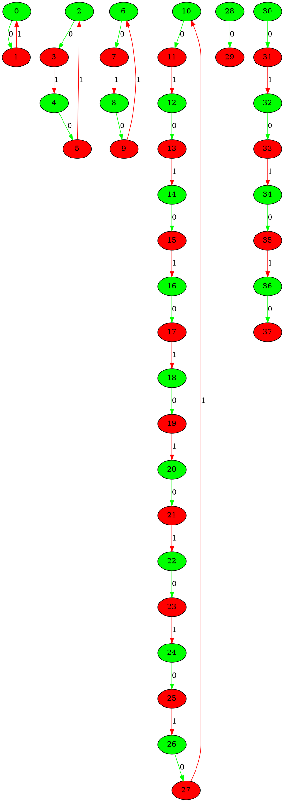
___
## Graph 12502 - list de compréhension : 1,2,4|1,2,9
___
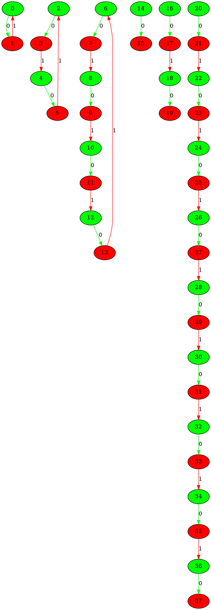
___
## Graph 12503 - list de compréhension : 1,2,4,9|1,2
___
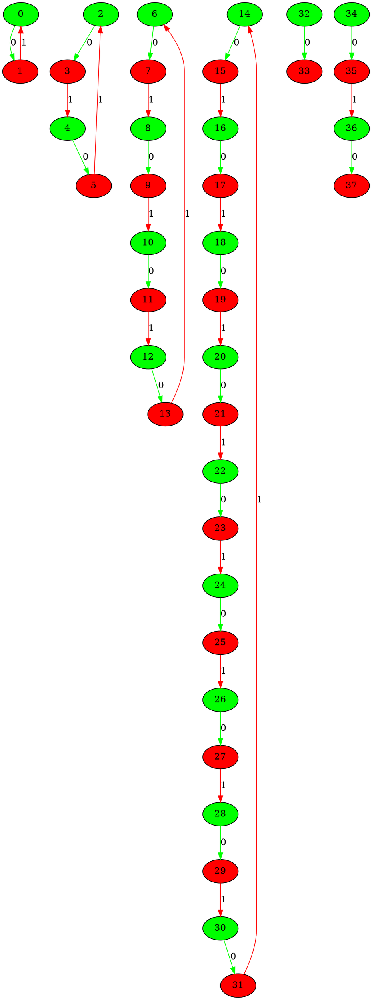
___
## Graph 12504 - list de compréhension : 1,2,9|1,2,4
___
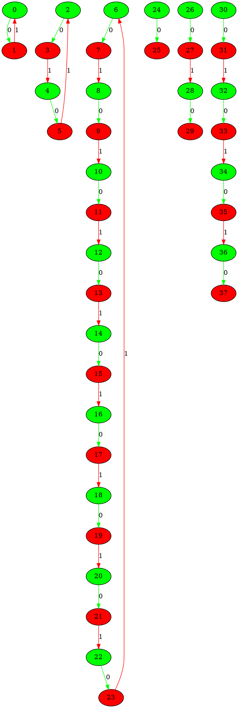
___
## Graph 12505 - list de compréhension : 1,4|1,2,2,9
___
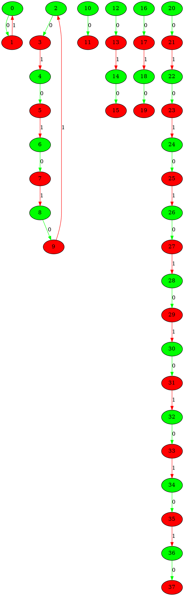
___
## Graph 12506 - list de compréhension : 1,4,9|1,2,2
___
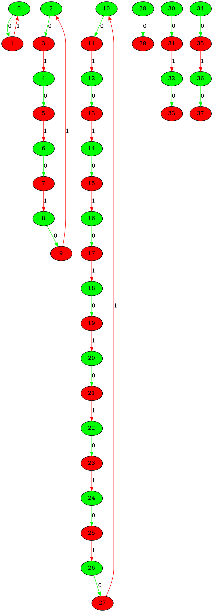
___
## Graph 12507 - list de compréhension : 1,9|1,2,2,4
___
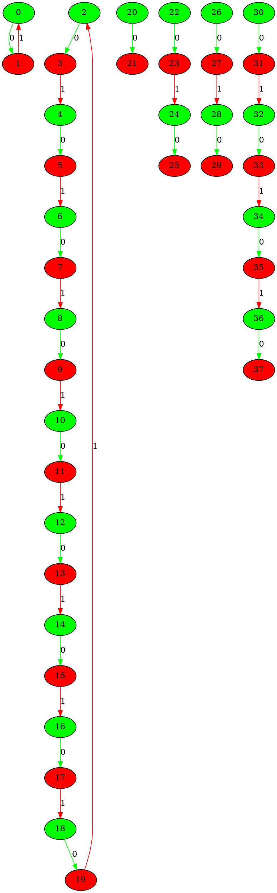
___
## Graph 12508 - list de compréhension : 2|1,1,2,4,9
___
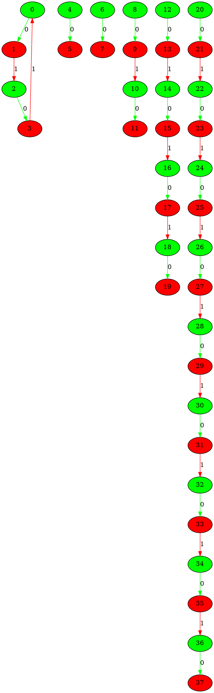
___
## Graph 12509 - list de compréhension : 2,2|1,1,4,9
___
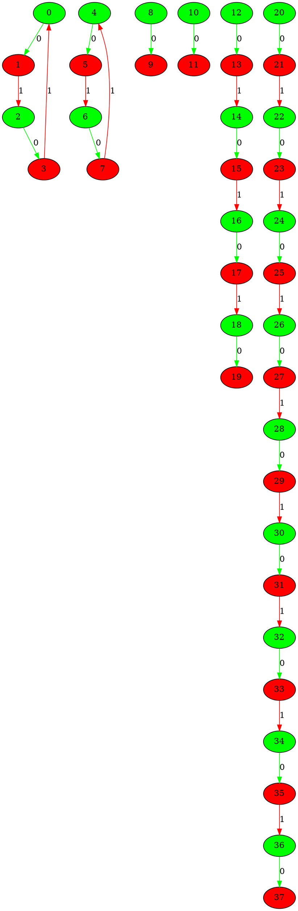
___
## Graph 12510 - list de compréhension : 2,2,4|1,1,9
___
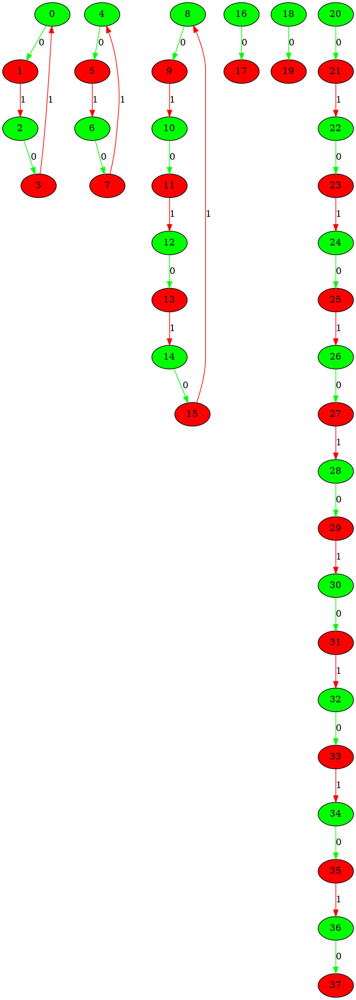
___
## Graph 12511 - list de compréhension : 2,2,4,9|1,1
___
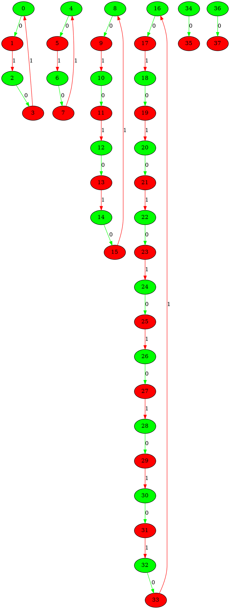
___
## Graph 12512 - list de compréhension : 2,2,9|1,1,4
___
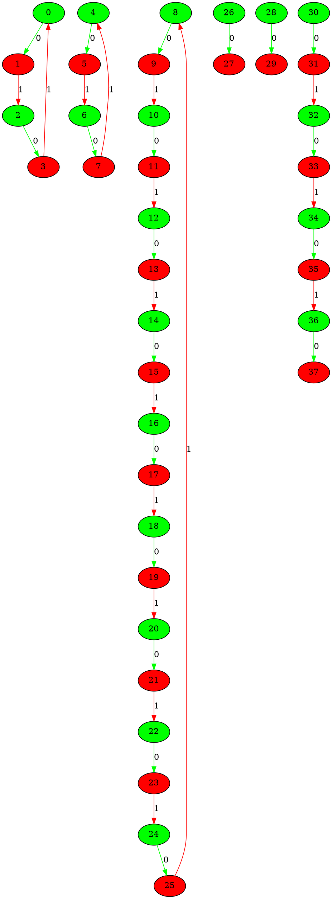
___
## Graph 12513 - list de compréhension : 2,4|1,1,2,9
___
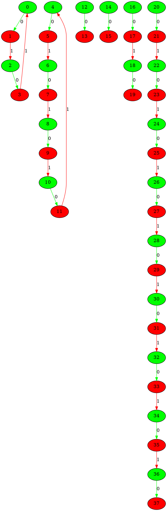
___
## Graph 12514 - list de compréhension : 2,4,9|1,1,2
___
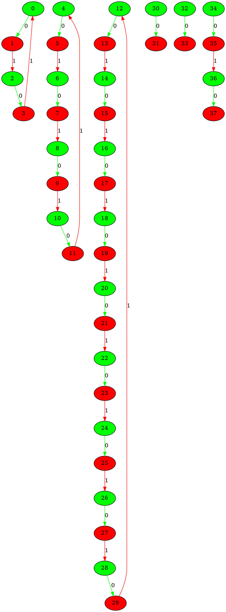
___
## Graph 12515 - list de compréhension : 2,9|1,1,2,4
___
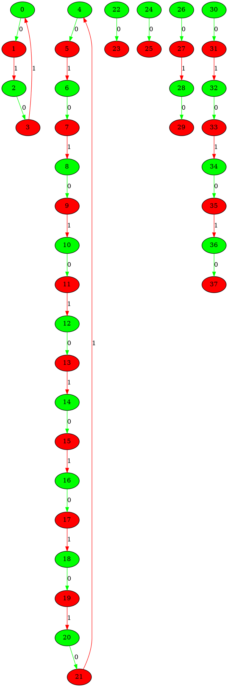
___
## Graph 12516 - list de compréhension : 4|1,1,2,2,9
___
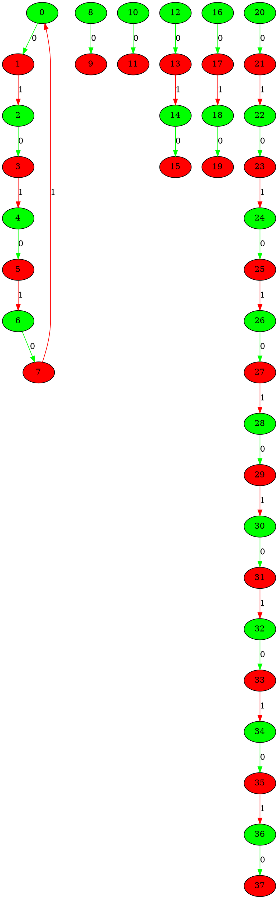
___
## Graph 12517 - list de compréhension : 4,9|1,1,2,2
___
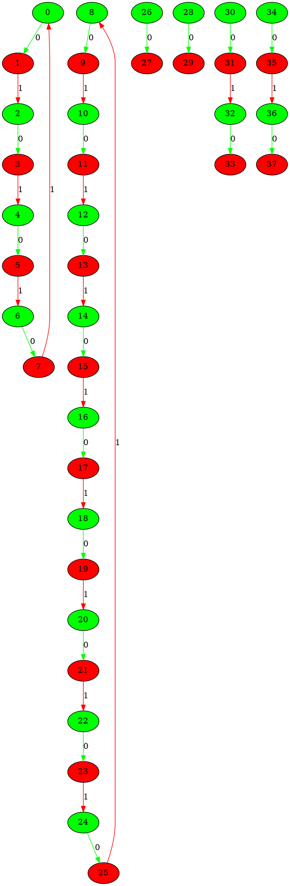
___
## Graph 12518 - list de compréhension : 9|1,1,2,2,4
___
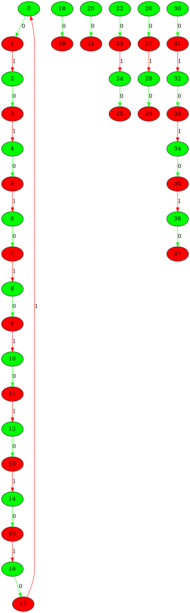
___
## Graph 12519 - list de compréhension : 0|1,1,2,2,5,8
___
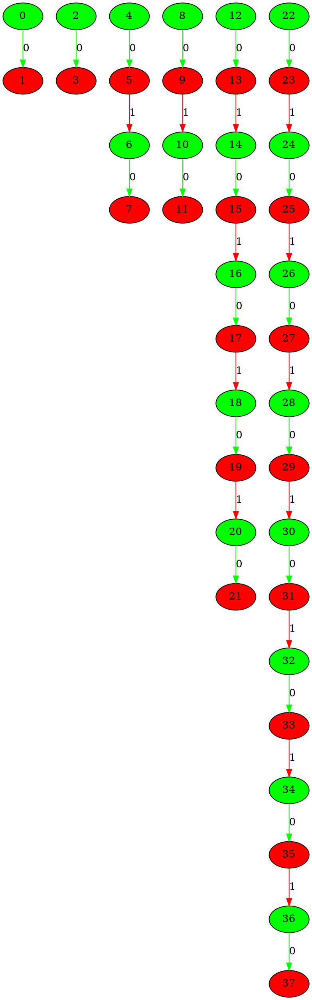
___
## Graph 12520 - list de compréhension : 1|1,2,2,5,8
___
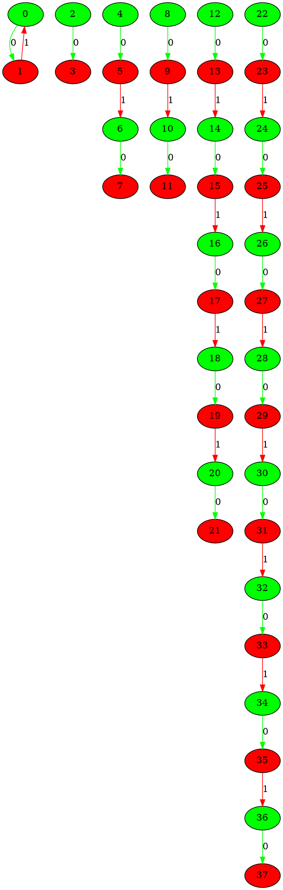
___
## Graph 12521 - list de compréhension : 1,1|2,2,5,8
___
```graphviz
digraph G {
0[label="0" fillcolor="green" style="filled"];
1[label="1" fillcolor="red" style="filled"];
2[label="2" fillcolor="green" style="filled"];
3[label="3" fillcolor="red" style="filled"];
4[label="4" fillcolor="green" style="filled"];
5[label="5" fillcolor="red" style="filled"];
6[label="6" fillcolor="green" style="filled"];
7[label="7" fillcolor="red" style="filled"];
8[label="8" fillcolor="green" style="filled"];
9[label="9" fillcolor="red" style="filled"];
10[label="10" fillcolor="green" style="filled"];
11[label="11" fillcolor="red" style="filled"];
12[label="12" fillcolor="green" style="filled"];
13[label="13" fillcolor="red" style="filled"];
14[label="14" fillcolor="green" style="filled"];
15[label="15" fillcolor="red" style="filled"];
16[label="16" fillcolor="green" style="filled"];
17[label="17" fillcolor="red" style="filled"];
18[label="18" fillcolor="green" style="filled"];
19[label="19" fillcolor="red" style="filled"];
20[label="20" fillcolor="green" style="filled"];
21[label="21" fillcolor="red" style="filled"];
22[label="22" fillcolor="green" style="filled"];
23[label="23" fillcolor="red" style="filled"];
24[label="24" fillcolor="green" style="filled"];
25[label="25" fillcolor="red" style="filled"];
26[label="26" fillcolor="green" style="filled"];
27[label="27" fillcolor="red" style="filled"];
28[label="28" fillcolor="green" style="filled"];
29[label="29" fillcolor="red" style="filled"];
30[label="30" fillcolor="green" style="filled"];
31[label="31" fillcolor="red" style="filled"];
32[label="32" fillcolor="green" style="filled"];
33[label="33" fillcolor="red" style="filled"];
34[label="34" fillcolor="green" style="filled"];
35[label="35" fillcolor="red" style="filled"];
36[label="36" fillcolor="green" style="filled"];
37[label="37" fillcolor="red" style="filled"];
0->1 [label="0" color="green"];
2->3 [label="0" color="green"];
4->5 [label="0" color="green"];
6->7 [label="0" color="green"];
8->9 [label="0" color="green"];
10->11 [label="0" color="green"];
12->13 [label="0" color="green"];
14->15 [label="0" color="green"];
16->17 [label="0" color="green"];
18->19 [label="0" color="green"];
20->21 [label="0" color="green"];
22->23 [label="0" color="green"];
24->25 [label="0" color="green"];
26->27 [label="0" color="green"];
28->29 [label="0" color="green"];
30->31 [label="0" color="green"];
32->33 [label="0" color="green"];
34->35 [label="0" color="green"];
36->37 [label="0" color="green"];
1->0 [label="1" color="red"];
3->2 [label="1" color="red"];
5->6 [label="1" color="red"];
9->10 [label="1" color="red"];
13->14 [label="1" color="red"];
15->16 [label="1" color="red"];
17->18 [label="1" color="red"];
19->20 [label="1" color="red"];
23->24 [label="1" color="red"];
25->26 [label="1" color="red"];
27->28 [label="1" color="red"];
29->30 [label="1" color="red"];
31->32 [label="1" color="red"];
33->34 [label="1" color="red"];
35->36 [label="1" color="red"];
}
```
___
## Graph 12522 - list de compréhension : 1,1,2|2,5,8
___
```graphviz
digraph G {
0[label="0" fillcolor="green" style="filled"];
1[label="1" fillcolor="red" style="filled"];
2[label="2" fillcolor="green" style="filled"];
3[label="3" fillcolor="red" style="filled"];
4[label="4" fillcolor="green" style="filled"];
5[label="5" fillcolor="red" style="filled"];
6[label="6" fillcolor="green" style="filled"];
7[label="7" fillcolor="red" style="filled"];
8[label="8" fillcolor="green" style="filled"];
9[label="9" fillcolor="red" style="filled"];
10[label="10" fillcolor="green" style="filled"];
11[label="11" fillcolor="red" style="filled"];
12[label="12" fillcolor="green" style="filled"];
13[label="13" fillcolor="red" style="filled"];
14[label="14" fillcolor="green" style="filled"];
15[label="15" fillcolor="red" style="filled"];
16[label="16" fillcolor="green" style="filled"];
17[label="17" fillcolor="red" style="filled"];
18[label="18" fillcolor="green" style="filled"];
19[label="19" fillcolor="red" style="filled"];
20[label="20" fillcolor="green" style="filled"];
21[label="21" fillcolor="red" style="filled"];
22[label="22" fillcolor="green" style="filled"];
23[label="23" fillcolor="red" style="filled"];
24[label="24" fillcolor="green" style="filled"];
25[label="25" fillcolor="red" style="filled"];
26[label="26" fillcolor="green" style="filled"];
27[label="27" fillcolor="red" style="filled"];
28[label="28" fillcolor="green" style="filled"];
29[label="29" fillcolor="red" style="filled"];
30[label="30" fillcolor="green" style="filled"];
31[label="31" fillcolor="red" style="filled"];
32[label="32" fillcolor="green" style="filled"];
33[label="33" fillcolor="red" style="filled"];
34[label="34" fillcolor="green" style="filled"];
35[label="35" fillcolor="red" style="filled"];
36[label="36" fillcolor="green" style="filled"];
37[label="37" fillcolor="red" style="filled"];
0->1 [label="0" color="green"];
2->3 [label="0" color="green"];
4->5 [label="0" color="green"];
6->7 [label="0" color="green"];
8->9 [label="0" color="green"];
10->11 [label="0" color="green"];
12->13 [label="0" color="green"];
14->15 [label="0" color="green"];
16->17 [label="0" color="green"];
18->19 [label="0" color="green"];
20->21 [label="0" color="green"];
22->23 [label="0" color="green"];
24->25 [label="0" color="green"];
26->27 [label="0" color="green"];
28->29 [label="0" color="green"];
30->31 [label="0" color="green"];
32->33 [label="0" color="green"];
34->35 [label="0" color="green"];
36->37 [label="0" color="green"];
1->0 [label="1" color="red"];
3->2 [label="1" color="red"];
5->6 [label="1" color="red"];
7->4 [label="1" color="red"];
9->10 [label="1" color="red"];
13->14 [label="1" color="red"];
15->16 [label="1" color="red"];
17->18 [label="1" color="red"];
19->20 [label="1" color="red"];
23->24 [label="1" color="red"];
25->26 [label="1" color="red"];
27->28 [label="1" color="red"];
29->30 [label="1" color="red"];
31->32 [label="1" color="red"];
33->34 [label="1" color="red"];
35->36 [label="1" color="red"];
}
```
___
## Graph 12523 - list de compréhension : 1,1,2,2|5,8
___
```graphviz
digraph G {
0[label="0" fillcolor="green" style="filled"];
1[label="1" fillcolor="red" style="filled"];
2[label="2" fillcolor="green" style="filled"];
3[label="3" fillcolor="red" style="filled"];
4[label="4" fillcolor="green" style="filled"];
5[label="5" fillcolor="red" style="filled"];
6[label="6" fillcolor="green" style="filled"];
7[label="7" fillcolor="red" style="filled"];
8[label="8" fillcolor="green" style="filled"];
9[label="9" fillcolor="red" style="filled"];
10[label="10" fillcolor="green" style="filled"];
11[label="11" fillcolor="red" style="filled"];
12[label="12" fillcolor="green" style="filled"];
13[label="13" fillcolor="red" style="filled"];
14[label="14" fillcolor="green" style="filled"];
15[label="15" fillcolor="red" style="filled"];
16[label="16" fillcolor="green" style="filled"];
17[label="17" fillcolor="red" style="filled"];
18[label="18" fillcolor="green" style="filled"];
19[label="19" fillcolor="red" style="filled"];
20[label="20" fillcolor="green" style="filled"];
21[label="21" fillcolor="red" style="filled"];
22[label="22" fillcolor="green" style="filled"];
23[label="23" fillcolor="red" style="filled"];
24[label="24" fillcolor="green" style="filled"];
25[label="25" fillcolor="red" style="filled"];
26[label="26" fillcolor="green" style="filled"];
27[label="27" fillcolor="red" style="filled"];
28[label="28" fillcolor="green" style="filled"];
29[label="29" fillcolor="red" style="filled"];
30[label="30" fillcolor="green" style="filled"];
31[label="31" fillcolor="red" style="filled"];
32[label="32" fillcolor="green" style="filled"];
33[label="33" fillcolor="red" style="filled"];
34[label="34" fillcolor="green" style="filled"];
35[label="35" fillcolor="red" style="filled"];
36[label="36" fillcolor="green" style="filled"];
37[label="37" fillcolor="red" style="filled"];
0->1 [label="0" color="green"];
2->3 [label="0" color="green"];
4->5 [label="0" color="green"];
6->7 [label="0" color="green"];
8->9 [label="0" color="green"];
10->11 [label="0" color="green"];
12->13 [label="0" color="green"];
14->15 [label="0" color="green"];
16->17 [label="0" color="green"];
18->19 [label="0" color="green"];
20->21 [label="0" color="green"];
22->23 [label="0" color="green"];
24->25 [label="0" color="green"];
26->27 [label="0" color="green"];
28->29 [label="0" color="green"];
30->31 [label="0" color="green"];
32->33 [label="0" color="green"];
34->35 [label="0" color="green"];
36->37 [label="0" color="green"];
1->0 [label="1" color="red"];
3->2 [label="1" color="red"];
5->6 [label="1" color="red"];
7->4 [label="1" color="red"];
9->10 [label="1" color="red"];
11->8 [label="1" color="red"];
13->14 [label="1" color="red"];
15->16 [label="1" color="red"];
17->18 [label="1" color="red"];
19->20 [label="1" color="red"];
23->24 [label="1" color="red"];
25->26 [label="1" color="red"];
27->28 [label="1" color="red"];
29->30 [label="1" color="red"];
31->32 [label="1" color="red"];
33->34 [label="1" color="red"];
35->36 [label="1" color="red"];
}
```
___
## Graph 12524 - list de compréhension : 1,1,2,2,5|8
___
```graphviz
digraph G {
0[label="0" fillcolor="green" style="filled"];
1[label="1" fillcolor="red" style="filled"];
2[label="2" fillcolor="green" style="filled"];
3[label="3" fillcolor="red" style="filled"];
4[label="4" fillcolor="green" style="filled"];
5[label="5" fillcolor="red" style="filled"];
6[label="6" fillcolor="green" style="filled"];
7[label="7" fillcolor="red" style="filled"];
8[label="8" fillcolor="green" style="filled"];
9[label="9" fillcolor="red" style="filled"];
10[label="10" fillcolor="green" style="filled"];
11[label="11" fillcolor="red" style="filled"];
12[label="12" fillcolor="green" style="filled"];
13[label="13" fillcolor="red" style="filled"];
14[label="14" fillcolor="green" style="filled"];
15[label="15" fillcolor="red" style="filled"];
16[label="16" fillcolor="green" style="filled"];
17[label="17" fillcolor="red" style="filled"];
18[label="18" fillcolor="green" style="filled"];
19[label="19" fillcolor="red" style="filled"];
20[label="20" fillcolor="green" style="filled"];
21[label="21" fillcolor="red" style="filled"];
22[label="22" fillcolor="green" style="filled"];
23[label="23" fillcolor="red" style="filled"];
24[label="24" fillcolor="green" style="filled"];
25[label="25" fillcolor="red" style="filled"];
26[label="26" fillcolor="green" style="filled"];
27[label="27" fillcolor="red" style="filled"];
28[label="28" fillcolor="green" style="filled"];
29[label="29" fillcolor="red" style="filled"];
30[label="30" fillcolor="green" style="filled"];
31[label="31" fillcolor="red" style="filled"];
32[label="32" fillcolor="green" style="filled"];
33[label="33" fillcolor="red" style="filled"];
34[label="34" fillcolor="green" style="filled"];
35[label="35" fillcolor="red" style="filled"];
36[label="36" fillcolor="green" style="filled"];
37[label="37" fillcolor="red" style="filled"];
0->1 [label="0" color="green"];
2->3 [label="0" color="green"];
4->5 [label="0" color="green"];
6->7 [label="0" color="green"];
8->9 [label="0" color="green"];
10->11 [label="0" color="green"];
12->13 [label="0" color="green"];
14->15 [label="0" color="green"];
16->17 [label="0" color="green"];
18->19 [label="0" color="green"];
20->21 [label="0" color="green"];
22->23 [label="0" color="green"];
24->25 [label="0" color="green"];
26->27 [label="0" color="green"];
28->29 [label="0" color="green"];
30->31 [label="0" color="green"];
32->33 [label="0" color="green"];
34->35 [label="0" color="green"];
36->37 [label="0" color="green"];
1->0 [label="1" color="red"];
3->2 [label="1" color="red"];
5->6 [label="1" color="red"];
7->4 [label="1" color="red"];
9->10 [label="1" color="red"];
11->8 [label="1" color="red"];
13->14 [label="1" color="red"];
15->16 [label="1" color="red"];
17->18 [label="1" color="red"];
19->20 [label="1" color="red"];
21->12 [label="1" color="red"];
23->24 [label="1" color="red"];
25->26 [label="1" color="red"];
27->28 [label="1" color="red"];
29->30 [label="1" color="red"];
31->32 [label="1" color="red"];
33->34 [label="1" color="red"];
35->36 [label="1" color="red"];
}
```
___
## Graph 12525 - list de compréhension : 1,1,2,2,5,8|0
___
```graphviz
digraph G {
0[label="0" fillcolor="green" style="filled"];
1[label="1" fillcolor="red" style="filled"];
2[label="2" fillcolor="green" style="filled"];
3[label="3" fillcolor="red" style="filled"];
4[label="4" fillcolor="green" style="filled"];
5[label="5" fillcolor="red" style="filled"];
6[label="6" fillcolor="green" style="filled"];
7[label="7" fillcolor="red" style="filled"];
8[label="8" fillcolor="green" style="filled"];
9[label="9" fillcolor="red" style="filled"];
10[label="10" fillcolor="green" style="filled"];
11[label="11" fillcolor="red" style="filled"];
12[label="12" fillcolor="green" style="filled"];
13[label="13" fillcolor="red" style="filled"];
14[label="14" fillcolor="green" style="filled"];
15[label="15" fillcolor="red" style="filled"];
16[label="16" fillcolor="green" style="filled"];
17[label="17" fillcolor="red" style="filled"];
18[label="18" fillcolor="green" style="filled"];
19[label="19" fillcolor="red" style="filled"];
20[label="20" fillcolor="green" style="filled"];
21[label="21" fillcolor="red" style="filled"];
22[label="22" fillcolor="green" style="filled"];
23[label="23" fillcolor="red" style="filled"];
24[label="24" fillcolor="green" style="filled"];
25[label="25" fillcolor="red" style="filled"];
26[label="26" fillcolor="green" style="filled"];
27[label="27" fillcolor="red" style="filled"];
28[label="28" fillcolor="green" style="filled"];
29[label="29" fillcolor="red" style="filled"];
30[label="30" fillcolor="green" style="filled"];
31[label="31" fillcolor="red" style="filled"];
32[label="32" fillcolor="green" style="filled"];
33[label="33" fillcolor="red" style="filled"];
34[label="34" fillcolor="green" style="filled"];
35[label="35" fillcolor="red" style="filled"];
36[label="36" fillcolor="green" style="filled"];
37[label="37" fillcolor="red" style="filled"];
0->1 [label="0" color="green"];
2->3 [label="0" color="green"];
4->5 [label="0" color="green"];
6->7 [label="0" color="green"];
8->9 [label="0" color="green"];
10->11 [label="0" color="green"];
12->13 [label="0" color="green"];
14->15 [label="0" color="green"];
16->17 [label="0" color="green"];
18->19 [label="0" color="green"];
20->21 [label="0" color="green"];
22->23 [label="0" color="green"];
24->25 [label="0" color="green"];
26->27 [label="0" color="green"];
28->29 [label="0" color="green"];
30->31 [label="0" color="green"];
32->33 [label="0" color="green"];
34->35 [label="0" color="green"];
36->37 [label="0" color="green"];
1->0 [label="1" color="red"];
3->2 [label="1" color="red"];
5->6 [label="1" color="red"];
7->4 [label="1" color="red"];
9->10 [label="1" color="red"];
11->8 [label="1" color="red"];
13->14 [label="1" color="red"];
15->16 [label="1" color="red"];
17->18 [label="1" color="red"];
19->20 [label="1" color="red"];
21->12 [label="1" color="red"];
23->24 [label="1" color="red"];
25->26 [label="1" color="red"];
27->28 [label="1" color="red"];
29->30 [label="1" color="red"];
31->32 [label="1" color="red"];
33->34 [label="1" color="red"];
35->36 [label="1" color="red"];
37->22 [label="1" color="red"];
}
```
___
## Graph 12526 - list de compréhension : 1,1,2,2,8|5
___
```graphviz
digraph G {
0[label="0" fillcolor="green" style="filled"];
1[label="1" fillcolor="red" style="filled"];
2[label="2" fillcolor="green" style="filled"];
3[label="3" fillcolor="red" style="filled"];
4[label="4" fillcolor="green" style="filled"];
5[label="5" fillcolor="red" style="filled"];
6[label="6" fillcolor="green" style="filled"];
7[label="7" fillcolor="red" style="filled"];
8[label="8" fillcolor="green" style="filled"];
9[label="9" fillcolor="red" style="filled"];
10[label="10" fillcolor="green" style="filled"];
11[label="11" fillcolor="red" style="filled"];
12[label="12" fillcolor="green" style="filled"];
13[label="13" fillcolor="red" style="filled"];
14[label="14" fillcolor="green" style="filled"];
15[label="15" fillcolor="red" style="filled"];
16[label="16" fillcolor="green" style="filled"];
17[label="17" fillcolor="red" style="filled"];
18[label="18" fillcolor="green" style="filled"];
19[label="19" fillcolor="red" style="filled"];
20[label="20" fillcolor="green" style="filled"];
21[label="21" fillcolor="red" style="filled"];
22[label="22" fillcolor="green" style="filled"];
23[label="23" fillcolor="red" style="filled"];
24[label="24" fillcolor="green" style="filled"];
25[label="25" fillcolor="red" style="filled"];
26[label="26" fillcolor="green" style="filled"];
27[label="27" fillcolor="red" style="filled"];
28[label="28" fillcolor="green" style="filled"];
29[label="29" fillcolor="red" style="filled"];
30[label="30" fillcolor="green" style="filled"];
31[label="31" fillcolor="red" style="filled"];
32[label="32" fillcolor="green" style="filled"];
33[label="33" fillcolor="red" style="filled"];
34[label="34" fillcolor="green" style="filled"];
35[label="35" fillcolor="red" style="filled"];
36[label="36" fillcolor="green" style="filled"];
37[label="37" fillcolor="red" style="filled"];
0->1 [label="0" color="green"];
2->3 [label="0" color="green"];
4->5 [label="0" color="green"];
6->7 [label="0" color="green"];
8->9 [label="0" color="green"];
10->11 [label="0" color="green"];
12->13 [label="0" color="green"];
14->15 [label="0" color="green"];
16->17 [label="0" color="green"];
18->19 [label="0" color="green"];
20->21 [label="0" color="green"];
22->23 [label="0" color="green"];
24->25 [label="0" color="green"];
26->27 [label="0" color="green"];
28->29 [label="0" color="green"];
30->31 [label="0" color="green"];
32->33 [label="0" color="green"];
34->35 [label="0" color="green"];
36->37 [label="0" color="green"];
1->0 [label="1" color="red"];
3->2 [label="1" color="red"];
5->6 [label="1" color="red"];
7->4 [label="1" color="red"];
9->10 [label="1" color="red"];
11->8 [label="1" color="red"];
13->14 [label="1" color="red"];
15->16 [label="1" color="red"];
17->18 [label="1" color="red"];
19->20 [label="1" color="red"];
21->22 [label="1" color="red"];
23->24 [label="1" color="red"];
25->26 [label="1" color="red"];
27->12 [label="1" color="red"];
29->30 [label="1" color="red"];
31->32 [label="1" color="red"];
33->34 [label="1" color="red"];
35->36 [label="1" color="red"];
}
```
___
## Graph 12527 - list de compréhension : 1,1,2,5|2,8
___
```graphviz
digraph G {
0[label="0" fillcolor="green" style="filled"];
1[label="1" fillcolor="red" style="filled"];
2[label="2" fillcolor="green" style="filled"];
3[label="3" fillcolor="red" style="filled"];
4[label="4" fillcolor="green" style="filled"];
5[label="5" fillcolor="red" style="filled"];
6[label="6" fillcolor="green" style="filled"];
7[label="7" fillcolor="red" style="filled"];
8[label="8" fillcolor="green" style="filled"];
9[label="9" fillcolor="red" style="filled"];
10[label="10" fillcolor="green" style="filled"];
11[label="11" fillcolor="red" style="filled"];
12[label="12" fillcolor="green" style="filled"];
13[label="13" fillcolor="red" style="filled"];
14[label="14" fillcolor="green" style="filled"];
15[label="15" fillcolor="red" style="filled"];
16[label="16" fillcolor="green" style="filled"];
17[label="17" fillcolor="red" style="filled"];
18[label="18" fillcolor="green" style="filled"];
19[label="19" fillcolor="red" style="filled"];
20[label="20" fillcolor="green" style="filled"];
21[label="21" fillcolor="red" style="filled"];
22[label="22" fillcolor="green" style="filled"];
23[label="23" fillcolor="red" style="filled"];
24[label="24" fillcolor="green" style="filled"];
25[label="25" fillcolor="red" style="filled"];
26[label="26" fillcolor="green" style="filled"];
27[label="27" fillcolor="red" style="filled"];
28[label="28" fillcolor="green" style="filled"];
29[label="29" fillcolor="red" style="filled"];
30[label="30" fillcolor="green" style="filled"];
31[label="31" fillcolor="red" style="filled"];
32[label="32" fillcolor="green" style="filled"];
33[label="33" fillcolor="red" style="filled"];
34[label="34" fillcolor="green" style="filled"];
35[label="35" fillcolor="red" style="filled"];
36[label="36" fillcolor="green" style="filled"];
37[label="37" fillcolor="red" style="filled"];
0->1 [label="0" color="green"];
2->3 [label="0" color="green"];
4->5 [label="0" color="green"];
6->7 [label="0" color="green"];
8->9 [label="0" color="green"];
10->11 [label="0" color="green"];
12->13 [label="0" color="green"];
14->15 [label="0" color="green"];
16->17 [label="0" color="green"];
18->19 [label="0" color="green"];
20->21 [label="0" color="green"];
22->23 [label="0" color="green"];
24->25 [label="0" color="green"];
26->27 [label="0" color="green"];
28->29 [label="0" color="green"];
30->31 [label="0" color="green"];
32->33 [label="0" color="green"];
34->35 [label="0" color="green"];
36->37 [label="0" color="green"];
1->0 [label="1" color="red"];
3->2 [label="1" color="red"];
5->6 [label="1" color="red"];
7->4 [label="1" color="red"];
9->10 [label="1" color="red"];
11->12 [label="1" color="red"];
13->14 [label="1" color="red"];
15->16 [label="1" color="red"];
17->8 [label="1" color="red"];
19->20 [label="1" color="red"];
23->24 [label="1" color="red"];
25->26 [label="1" color="red"];
27->28 [label="1" color="red"];
29->30 [label="1" color="red"];
31->32 [label="1" color="red"];
33->34 [label="1" color="red"];
35->36 [label="1" color="red"];
}
```
___
## Graph 12528 - list de compréhension : 1,1,2,5,8|2
___
```graphviz
digraph G {
0[label="0" fillcolor="green" style="filled"];
1[label="1" fillcolor="red" style="filled"];
2[label="2" fillcolor="green" style="filled"];
3[label="3" fillcolor="red" style="filled"];
4[label="4" fillcolor="green" style="filled"];
5[label="5" fillcolor="red" style="filled"];
6[label="6" fillcolor="green" style="filled"];
7[label="7" fillcolor="red" style="filled"];
8[label="8" fillcolor="green" style="filled"];
9[label="9" fillcolor="red" style="filled"];
10[label="10" fillcolor="green" style="filled"];
11[label="11" fillcolor="red" style="filled"];
12[label="12" fillcolor="green" style="filled"];
13[label="13" fillcolor="red" style="filled"];
14[label="14" fillcolor="green" style="filled"];
15[label="15" fillcolor="red" style="filled"];
16[label="16" fillcolor="green" style="filled"];
17[label="17" fillcolor="red" style="filled"];
18[label="18" fillcolor="green" style="filled"];
19[label="19" fillcolor="red" style="filled"];
20[label="20" fillcolor="green" style="filled"];
21[label="21" fillcolor="red" style="filled"];
22[label="22" fillcolor="green" style="filled"];
23[label="23" fillcolor="red" style="filled"];
24[label="24" fillcolor="green" style="filled"];
25[label="25" fillcolor="red" style="filled"];
26[label="26" fillcolor="green" style="filled"];
27[label="27" fillcolor="red" style="filled"];
28[label="28" fillcolor="green" style="filled"];
29[label="29" fillcolor="red" style="filled"];
30[label="30" fillcolor="green" style="filled"];
31[label="31" fillcolor="red" style="filled"];
32[label="32" fillcolor="green" style="filled"];
33[label="33" fillcolor="red" style="filled"];
34[label="34" fillcolor="green" style="filled"];
35[label="35" fillcolor="red" style="filled"];
36[label="36" fillcolor="green" style="filled"];
37[label="37" fillcolor="red" style="filled"];
0->1 [label="0" color="green"];
2->3 [label="0" color="green"];
4->5 [label="0" color="green"];
6->7 [label="0" color="green"];
8->9 [label="0" color="green"];
10->11 [label="0" color="green"];
12->13 [label="0" color="green"];
14->15 [label="0" color="green"];
16->17 [label="0" color="green"];
18->19 [label="0" color="green"];
20->21 [label="0" color="green"];
22->23 [label="0" color="green"];
24->25 [label="0" color="green"];
26->27 [label="0" color="green"];
28->29 [label="0" color="green"];
30->31 [label="0" color="green"];
32->33 [label="0" color="green"];
34->35 [label="0" color="green"];
36->37 [label="0" color="green"];
1->0 [label="1" color="red"];
3->2 [label="1" color="red"];
5->6 [label="1" color="red"];
7->4 [label="1" color="red"];
9->10 [label="1" color="red"];
11->12 [label="1" color="red"];
13->14 [label="1" color="red"];
15->16 [label="1" color="red"];
17->8 [label="1" color="red"];
19->20 [label="1" color="red"];
21->22 [label="1" color="red"];
23->24 [label="1" color="red"];
25->26 [label="1" color="red"];
27->28 [label="1" color="red"];
29->30 [label="1" color="red"];
31->32 [label="1" color="red"];
33->18 [label="1" color="red"];
35->36 [label="1" color="red"];
}
```
___
## Graph 12529 - list de compréhension : 1,1,2,8|2,5
___
```graphviz
digraph G {
0[label="0" fillcolor="green" style="filled"];
1[label="1" fillcolor="red" style="filled"];
2[label="2" fillcolor="green" style="filled"];
3[label="3" fillcolor="red" style="filled"];
4[label="4" fillcolor="green" style="filled"];
5[label="5" fillcolor="red" style="filled"];
6[label="6" fillcolor="green" style="filled"];
7[label="7" fillcolor="red" style="filled"];
8[label="8" fillcolor="green" style="filled"];
9[label="9" fillcolor="red" style="filled"];
10[label="10" fillcolor="green" style="filled"];
11[label="11" fillcolor="red" style="filled"];
12[label="12" fillcolor="green" style="filled"];
13[label="13" fillcolor="red" style="filled"];
14[label="14" fillcolor="green" style="filled"];
15[label="15" fillcolor="red" style="filled"];
16[label="16" fillcolor="green" style="filled"];
17[label="17" fillcolor="red" style="filled"];
18[label="18" fillcolor="green" style="filled"];
19[label="19" fillcolor="red" style="filled"];
20[label="20" fillcolor="green" style="filled"];
21[label="21" fillcolor="red" style="filled"];
22[label="22" fillcolor="green" style="filled"];
23[label="23" fillcolor="red" style="filled"];
24[label="24" fillcolor="green" style="filled"];
25[label="25" fillcolor="red" style="filled"];
26[label="26" fillcolor="green" style="filled"];
27[label="27" fillcolor="red" style="filled"];
28[label="28" fillcolor="green" style="filled"];
29[label="29" fillcolor="red" style="filled"];
30[label="30" fillcolor="green" style="filled"];
31[label="31" fillcolor="red" style="filled"];
32[label="32" fillcolor="green" style="filled"];
33[label="33" fillcolor="red" style="filled"];
34[label="34" fillcolor="green" style="filled"];
35[label="35" fillcolor="red" style="filled"];
36[label="36" fillcolor="green" style="filled"];
37[label="37" fillcolor="red" style="filled"];
0->1 [label="0" color="green"];
2->3 [label="0" color="green"];
4->5 [label="0" color="green"];
6->7 [label="0" color="green"];
8->9 [label="0" color="green"];
10->11 [label="0" color="green"];
12->13 [label="0" color="green"];
14->15 [label="0" color="green"];
16->17 [label="0" color="green"];
18->19 [label="0" color="green"];
20->21 [label="0" color="green"];
22->23 [label="0" color="green"];
24->25 [label="0" color="green"];
26->27 [label="0" color="green"];
28->29 [label="0" color="green"];
30->31 [label="0" color="green"];
32->33 [label="0" color="green"];
34->35 [label="0" color="green"];
36->37 [label="0" color="green"];
1->0 [label="1" color="red"];
3->2 [label="1" color="red"];
5->6 [label="1" color="red"];
7->4 [label="1" color="red"];
9->10 [label="1" color="red"];
11->12 [label="1" color="red"];
13->14 [label="1" color="red"];
15->16 [label="1" color="red"];
17->18 [label="1" color="red"];
19->20 [label="1" color="red"];
21->22 [label="1" color="red"];
23->8 [label="1" color="red"];
25->26 [label="1" color="red"];
29->30 [label="1" color="red"];
31->32 [label="1" color="red"];
33->34 [label="1" color="red"];
35->36 [label="1" color="red"];
}
```
___
## Graph 12530 - list de compréhension : 1,1,5|2,2,8
___
```graphviz
digraph G {
0[label="0" fillcolor="green" style="filled"];
1[label="1" fillcolor="red" style="filled"];
2[label="2" fillcolor="green" style="filled"];
3[label="3" fillcolor="red" style="filled"];
4[label="4" fillcolor="green" style="filled"];
5[label="5" fillcolor="red" style="filled"];
6[label="6" fillcolor="green" style="filled"];
7[label="7" fillcolor="red" style="filled"];
8[label="8" fillcolor="green" style="filled"];
9[label="9" fillcolor="red" style="filled"];
10[label="10" fillcolor="green" style="filled"];
11[label="11" fillcolor="red" style="filled"];
12[label="12" fillcolor="green" style="filled"];
13[label="13" fillcolor="red" style="filled"];
14[label="14" fillcolor="green" style="filled"];
15[label="15" fillcolor="red" style="filled"];
16[label="16" fillcolor="green" style="filled"];
17[label="17" fillcolor="red" style="filled"];
18[label="18" fillcolor="green" style="filled"];
19[label="19" fillcolor="red" style="filled"];
20[label="20" fillcolor="green" style="filled"];
21[label="21" fillcolor="red" style="filled"];
22[label="22" fillcolor="green" style="filled"];
23[label="23" fillcolor="red" style="filled"];
24[label="24" fillcolor="green" style="filled"];
25[label="25" fillcolor="red" style="filled"];
26[label="26" fillcolor="green" style="filled"];
27[label="27" fillcolor="red" style="filled"];
28[label="28" fillcolor="green" style="filled"];
29[label="29" fillcolor="red" style="filled"];
30[label="30" fillcolor="green" style="filled"];
31[label="31" fillcolor="red" style="filled"];
32[label="32" fillcolor="green" style="filled"];
33[label="33" fillcolor="red" style="filled"];
34[label="34" fillcolor="green" style="filled"];
35[label="35" fillcolor="red" style="filled"];
36[label="36" fillcolor="green" style="filled"];
37[label="37" fillcolor="red" style="filled"];
0->1 [label="0" color="green"];
2->3 [label="0" color="green"];
4->5 [label="0" color="green"];
6->7 [label="0" color="green"];
8->9 [label="0" color="green"];
10->11 [label="0" color="green"];
12->13 [label="0" color="green"];
14->15 [label="0" color="green"];
16->17 [label="0" color="green"];
18->19 [label="0" color="green"];
20->21 [label="0" color="green"];
22->23 [label="0" color="green"];
24->25 [label="0" color="green"];
26->27 [label="0" color="green"];
28->29 [label="0" color="green"];
30->31 [label="0" color="green"];
32->33 [label="0" color="green"];
34->35 [label="0" color="green"];
36->37 [label="0" color="green"];
1->0 [label="1" color="red"];
3->2 [label="1" color="red"];
5->6 [label="1" color="red"];
7->8 [label="1" color="red"];
9->10 [label="1" color="red"];
11->12 [label="1" color="red"];
13->4 [label="1" color="red"];
15->16 [label="1" color="red"];
19->20 [label="1" color="red"];
23->24 [label="1" color="red"];
25->26 [label="1" color="red"];
27->28 [label="1" color="red"];
29->30 [label="1" color="red"];
31->32 [label="1" color="red"];
33->34 [label="1" color="red"];
35->36 [label="1" color="red"];
}
```
___
## Graph 12531 - list de compréhension : 1,1,5,8|2,2
___
```graphviz
digraph G {
0[label="0" fillcolor="green" style="filled"];
1[label="1" fillcolor="red" style="filled"];
2[label="2" fillcolor="green" style="filled"];
3[label="3" fillcolor="red" style="filled"];
4[label="4" fillcolor="green" style="filled"];
5[label="5" fillcolor="red" style="filled"];
6[label="6" fillcolor="green" style="filled"];
7[label="7" fillcolor="red" style="filled"];
8[label="8" fillcolor="green" style="filled"];
9[label="9" fillcolor="red" style="filled"];
10[label="10" fillcolor="green" style="filled"];
11[label="11" fillcolor="red" style="filled"];
12[label="12" fillcolor="green" style="filled"];
13[label="13" fillcolor="red" style="filled"];
14[label="14" fillcolor="green" style="filled"];
15[label="15" fillcolor="red" style="filled"];
16[label="16" fillcolor="green" style="filled"];
17[label="17" fillcolor="red" style="filled"];
18[label="18" fillcolor="green" style="filled"];
19[label="19" fillcolor="red" style="filled"];
20[label="20" fillcolor="green" style="filled"];
21[label="21" fillcolor="red" style="filled"];
22[label="22" fillcolor="green" style="filled"];
23[label="23" fillcolor="red" style="filled"];
24[label="24" fillcolor="green" style="filled"];
25[label="25" fillcolor="red" style="filled"];
26[label="26" fillcolor="green" style="filled"];
27[label="27" fillcolor="red" style="filled"];
28[label="28" fillcolor="green" style="filled"];
29[label="29" fillcolor="red" style="filled"];
30[label="30" fillcolor="green" style="filled"];
31[label="31" fillcolor="red" style="filled"];
32[label="32" fillcolor="green" style="filled"];
33[label="33" fillcolor="red" style="filled"];
34[label="34" fillcolor="green" style="filled"];
35[label="35" fillcolor="red" style="filled"];
36[label="36" fillcolor="green" style="filled"];
37[label="37" fillcolor="red" style="filled"];
0->1 [label="0" color="green"];
2->3 [label="0" color="green"];
4->5 [label="0" color="green"];
6->7 [label="0" color="green"];
8->9 [label="0" color="green"];
10->11 [label="0" color="green"];
12->13 [label="0" color="green"];
14->15 [label="0" color="green"];
16->17 [label="0" color="green"];
18->19 [label="0" color="green"];
20->21 [label="0" color="green"];
22->23 [label="0" color="green"];
24->25 [label="0" color="green"];
26->27 [label="0" color="green"];
28->29 [label="0" color="green"];
30->31 [label="0" color="green"];
32->33 [label="0" color="green"];
34->35 [label="0" color="green"];
36->37 [label="0" color="green"];
1->0 [label="1" color="red"];
3->2 [label="1" color="red"];
5->6 [label="1" color="red"];
7->8 [label="1" color="red"];
9->10 [label="1" color="red"];
11->12 [label="1" color="red"];
13->4 [label="1" color="red"];
15->16 [label="1" color="red"];
17->18 [label="1" color="red"];
19->20 [label="1" color="red"];
21->22 [label="1" color="red"];
23->24 [label="1" color="red"];
25->26 [label="1" color="red"];
27->28 [label="1" color="red"];
29->14 [label="1" color="red"];
31->32 [label="1" color="red"];
35->36 [label="1" color="red"];
}
```
___
## Graph 12532 - list de compréhension : 1,1,8|2,2,5
___
```graphviz
digraph G {
0[label="0" fillcolor="green" style="filled"];
1[label="1" fillcolor="red" style="filled"];
2[label="2" fillcolor="green" style="filled"];
3[label="3" fillcolor="red" style="filled"];
4[label="4" fillcolor="green" style="filled"];
5[label="5" fillcolor="red" style="filled"];
6[label="6" fillcolor="green" style="filled"];
7[label="7" fillcolor="red" style="filled"];
8[label="8" fillcolor="green" style="filled"];
9[label="9" fillcolor="red" style="filled"];
10[label="10" fillcolor="green" style="filled"];
11[label="11" fillcolor="red" style="filled"];
12[label="12" fillcolor="green" style="filled"];
13[label="13" fillcolor="red" style="filled"];
14[label="14" fillcolor="green" style="filled"];
15[label="15" fillcolor="red" style="filled"];
16[label="16" fillcolor="green" style="filled"];
17[label="17" fillcolor="red" style="filled"];
18[label="18" fillcolor="green" style="filled"];
19[label="19" fillcolor="red" style="filled"];
20[label="20" fillcolor="green" style="filled"];
21[label="21" fillcolor="red" style="filled"];
22[label="22" fillcolor="green" style="filled"];
23[label="23" fillcolor="red" style="filled"];
24[label="24" fillcolor="green" style="filled"];
25[label="25" fillcolor="red" style="filled"];
26[label="26" fillcolor="green" style="filled"];
27[label="27" fillcolor="red" style="filled"];
28[label="28" fillcolor="green" style="filled"];
29[label="29" fillcolor="red" style="filled"];
30[label="30" fillcolor="green" style="filled"];
31[label="31" fillcolor="red" style="filled"];
32[label="32" fillcolor="green" style="filled"];
33[label="33" fillcolor="red" style="filled"];
34[label="34" fillcolor="green" style="filled"];
35[label="35" fillcolor="red" style="filled"];
36[label="36" fillcolor="green" style="filled"];
37[label="37" fillcolor="red" style="filled"];
0->1 [label="0" color="green"];
2->3 [label="0" color="green"];
4->5 [label="0" color="green"];
6->7 [label="0" color="green"];
8->9 [label="0" color="green"];
10->11 [label="0" color="green"];
12->13 [label="0" color="green"];
14->15 [label="0" color="green"];
16->17 [label="0" color="green"];
18->19 [label="0" color="green"];
20->21 [label="0" color="green"];
22->23 [label="0" color="green"];
24->25 [label="0" color="green"];
26->27 [label="0" color="green"];
28->29 [label="0" color="green"];
30->31 [label="0" color="green"];
32->33 [label="0" color="green"];
34->35 [label="0" color="green"];
36->37 [label="0" color="green"];
1->0 [label="1" color="red"];
3->2 [label="1" color="red"];
5->6 [label="1" color="red"];
7->8 [label="1" color="red"];
9->10 [label="1" color="red"];
11->12 [label="1" color="red"];
13->14 [label="1" color="red"];
15->16 [label="1" color="red"];
17->18 [label="1" color="red"];
19->4 [label="1" color="red"];
21->22 [label="1" color="red"];
25->26 [label="1" color="red"];
29->30 [label="1" color="red"];
31->32 [label="1" color="red"];
33->34 [label="1" color="red"];
35->36 [label="1" color="red"];
}
```
___
## Graph 12533 - list de compréhension : 1,2|1,2,5,8
___
```graphviz
digraph G {
0[label="0" fillcolor="green" style="filled"];
1[label="1" fillcolor="red" style="filled"];
2[label="2" fillcolor="green" style="filled"];
3[label="3" fillcolor="red" style="filled"];
4[label="4" fillcolor="green" style="filled"];
5[label="5" fillcolor="red" style="filled"];
6[label="6" fillcolor="green" style="filled"];
7[label="7" fillcolor="red" style="filled"];
8[label="8" fillcolor="green" style="filled"];
9[label="9" fillcolor="red" style="filled"];
10[label="10" fillcolor="green" style="filled"];
11[label="11" fillcolor="red" style="filled"];
12[label="12" fillcolor="green" style="filled"];
13[label="13" fillcolor="red" style="filled"];
14[label="14" fillcolor="green" style="filled"];
15[label="15" fillcolor="red" style="filled"];
16[label="16" fillcolor="green" style="filled"];
17[label="17" fillcolor="red" style="filled"];
18[label="18" fillcolor="green" style="filled"];
19[label="19" fillcolor="red" style="filled"];
20[label="20" fillcolor="green" style="filled"];
21[label="21" fillcolor="red" style="filled"];
22[label="22" fillcolor="green" style="filled"];
23[label="23" fillcolor="red" style="filled"];
24[label="24" fillcolor="green" style="filled"];
25[label="25" fillcolor="red" style="filled"];
26[label="26" fillcolor="green" style="filled"];
27[label="27" fillcolor="red" style="filled"];
28[label="28" fillcolor="green" style="filled"];
29[label="29" fillcolor="red" style="filled"];
30[label="30" fillcolor="green" style="filled"];
31[label="31" fillcolor="red" style="filled"];
32[label="32" fillcolor="green" style="filled"];
33[label="33" fillcolor="red" style="filled"];
34[label="34" fillcolor="green" style="filled"];
35[label="35" fillcolor="red" style="filled"];
36[label="36" fillcolor="green" style="filled"];
37[label="37" fillcolor="red" style="filled"];
0->1 [label="0" color="green"];
2->3 [label="0" color="green"];
4->5 [label="0" color="green"];
6->7 [label="0" color="green"];
8->9 [label="0" color="green"];
10->11 [label="0" color="green"];
12->13 [label="0" color="green"];
14->15 [label="0" color="green"];
16->17 [label="0" color="green"];
18->19 [label="0" color="green"];
20->21 [label="0" color="green"];
22->23 [label="0" color="green"];
24->25 [label="0" color="green"];
26->27 [label="0" color="green"];
28->29 [label="0" color="green"];
30->31 [label="0" color="green"];
32->33 [label="0" color="green"];
34->35 [label="0" color="green"];
36->37 [label="0" color="green"];
1->0 [label="1" color="red"];
3->4 [label="1" color="red"];
5->2 [label="1" color="red"];
9->10 [label="1" color="red"];
13->14 [label="1" color="red"];
15->16 [label="1" color="red"];
17->18 [label="1" color="red"];
19->20 [label="1" color="red"];
23->24 [label="1" color="red"];
25->26 [label="1" color="red"];
27->28 [label="1" color="red"];
29->30 [label="1" color="red"];
31->32 [label="1" color="red"];
33->34 [label="1" color="red"];
35->36 [label="1" color="red"];
}
```
___
## Graph 12534 - list de compréhension : 1,2,2|1,5,8
___
```graphviz
digraph G {
0[label="0" fillcolor="green" style="filled"];
1[label="1" fillcolor="red" style="filled"];
2[label="2" fillcolor="green" style="filled"];
3[label="3" fillcolor="red" style="filled"];
4[label="4" fillcolor="green" style="filled"];
5[label="5" fillcolor="red" style="filled"];
6[label="6" fillcolor="green" style="filled"];
7[label="7" fillcolor="red" style="filled"];
8[label="8" fillcolor="green" style="filled"];
9[label="9" fillcolor="red" style="filled"];
10[label="10" fillcolor="green" style="filled"];
11[label="11" fillcolor="red" style="filled"];
12[label="12" fillcolor="green" style="filled"];
13[label="13" fillcolor="red" style="filled"];
14[label="14" fillcolor="green" style="filled"];
15[label="15" fillcolor="red" style="filled"];
16[label="16" fillcolor="green" style="filled"];
17[label="17" fillcolor="red" style="filled"];
18[label="18" fillcolor="green" style="filled"];
19[label="19" fillcolor="red" style="filled"];
20[label="20" fillcolor="green" style="filled"];
21[label="21" fillcolor="red" style="filled"];
22[label="22" fillcolor="green" style="filled"];
23[label="23" fillcolor="red" style="filled"];
24[label="24" fillcolor="green" style="filled"];
25[label="25" fillcolor="red" style="filled"];
26[label="26" fillcolor="green" style="filled"];
27[label="27" fillcolor="red" style="filled"];
28[label="28" fillcolor="green" style="filled"];
29[label="29" fillcolor="red" style="filled"];
30[label="30" fillcolor="green" style="filled"];
31[label="31" fillcolor="red" style="filled"];
32[label="32" fillcolor="green" style="filled"];
33[label="33" fillcolor="red" style="filled"];
34[label="34" fillcolor="green" style="filled"];
35[label="35" fillcolor="red" style="filled"];
36[label="36" fillcolor="green" style="filled"];
37[label="37" fillcolor="red" style="filled"];
0->1 [label="0" color="green"];
2->3 [label="0" color="green"];
4->5 [label="0" color="green"];
6->7 [label="0" color="green"];
8->9 [label="0" color="green"];
10->11 [label="0" color="green"];
12->13 [label="0" color="green"];
14->15 [label="0" color="green"];
16->17 [label="0" color="green"];
18->19 [label="0" color="green"];
20->21 [label="0" color="green"];
22->23 [label="0" color="green"];
24->25 [label="0" color="green"];
26->27 [label="0" color="green"];
28->29 [label="0" color="green"];
30->31 [label="0" color="green"];
32->33 [label="0" color="green"];
34->35 [label="0" color="green"];
36->37 [label="0" color="green"];
1->0 [label="1" color="red"];
3->4 [label="1" color="red"];
5->2 [label="1" color="red"];
7->8 [label="1" color="red"];
9->6 [label="1" color="red"];
13->14 [label="1" color="red"];
15->16 [label="1" color="red"];
17->18 [label="1" color="red"];
19->20 [label="1" color="red"];
23->24 [label="1" color="red"];
25->26 [label="1" color="red"];
27->28 [label="1" color="red"];
29->30 [label="1" color="red"];
31->32 [label="1" color="red"];
33->34 [label="1" color="red"];
35->36 [label="1" color="red"];
}
```
___
## Graph 12535 - list de compréhension : 1,2,2,5|1,8
___
```graphviz
digraph G {
0[label="0" fillcolor="green" style="filled"];
1[label="1" fillcolor="red" style="filled"];
2[label="2" fillcolor="green" style="filled"];
3[label="3" fillcolor="red" style="filled"];
4[label="4" fillcolor="green" style="filled"];
5[label="5" fillcolor="red" style="filled"];
6[label="6" fillcolor="green" style="filled"];
7[label="7" fillcolor="red" style="filled"];
8[label="8" fillcolor="green" style="filled"];
9[label="9" fillcolor="red" style="filled"];
10[label="10" fillcolor="green" style="filled"];
11[label="11" fillcolor="red" style="filled"];
12[label="12" fillcolor="green" style="filled"];
13[label="13" fillcolor="red" style="filled"];
14[label="14" fillcolor="green" style="filled"];
15[label="15" fillcolor="red" style="filled"];
16[label="16" fillcolor="green" style="filled"];
17[label="17" fillcolor="red" style="filled"];
18[label="18" fillcolor="green" style="filled"];
19[label="19" fillcolor="red" style="filled"];
20[label="20" fillcolor="green" style="filled"];
21[label="21" fillcolor="red" style="filled"];
22[label="22" fillcolor="green" style="filled"];
23[label="23" fillcolor="red" style="filled"];
24[label="24" fillcolor="green" style="filled"];
25[label="25" fillcolor="red" style="filled"];
26[label="26" fillcolor="green" style="filled"];
27[label="27" fillcolor="red" style="filled"];
28[label="28" fillcolor="green" style="filled"];
29[label="29" fillcolor="red" style="filled"];
30[label="30" fillcolor="green" style="filled"];
31[label="31" fillcolor="red" style="filled"];
32[label="32" fillcolor="green" style="filled"];
33[label="33" fillcolor="red" style="filled"];
34[label="34" fillcolor="green" style="filled"];
35[label="35" fillcolor="red" style="filled"];
36[label="36" fillcolor="green" style="filled"];
37[label="37" fillcolor="red" style="filled"];
0->1 [label="0" color="green"];
2->3 [label="0" color="green"];
4->5 [label="0" color="green"];
6->7 [label="0" color="green"];
8->9 [label="0" color="green"];
10->11 [label="0" color="green"];
12->13 [label="0" color="green"];
14->15 [label="0" color="green"];
16->17 [label="0" color="green"];
18->19 [label="0" color="green"];
20->21 [label="0" color="green"];
22->23 [label="0" color="green"];
24->25 [label="0" color="green"];
26->27 [label="0" color="green"];
28->29 [label="0" color="green"];
30->31 [label="0" color="green"];
32->33 [label="0" color="green"];
34->35 [label="0" color="green"];
36->37 [label="0" color="green"];
1->0 [label="1" color="red"];
3->4 [label="1" color="red"];
5->2 [label="1" color="red"];
7->8 [label="1" color="red"];
9->6 [label="1" color="red"];
11->12 [label="1" color="red"];
13->14 [label="1" color="red"];
15->16 [label="1" color="red"];
17->18 [label="1" color="red"];
19->10 [label="1" color="red"];
23->24 [label="1" color="red"];
25->26 [label="1" color="red"];
27->28 [label="1" color="red"];
29->30 [label="1" color="red"];
31->32 [label="1" color="red"];
33->34 [label="1" color="red"];
35->36 [label="1" color="red"];
}
```
___
## Graph 12536 - list de compréhension : 1,2,2,5,8|1
___
```graphviz
digraph G {
0[label="0" fillcolor="green" style="filled"];
1[label="1" fillcolor="red" style="filled"];
2[label="2" fillcolor="green" style="filled"];
3[label="3" fillcolor="red" style="filled"];
4[label="4" fillcolor="green" style="filled"];
5[label="5" fillcolor="red" style="filled"];
6[label="6" fillcolor="green" style="filled"];
7[label="7" fillcolor="red" style="filled"];
8[label="8" fillcolor="green" style="filled"];
9[label="9" fillcolor="red" style="filled"];
10[label="10" fillcolor="green" style="filled"];
11[label="11" fillcolor="red" style="filled"];
12[label="12" fillcolor="green" style="filled"];
13[label="13" fillcolor="red" style="filled"];
14[label="14" fillcolor="green" style="filled"];
15[label="15" fillcolor="red" style="filled"];
16[label="16" fillcolor="green" style="filled"];
17[label="17" fillcolor="red" style="filled"];
18[label="18" fillcolor="green" style="filled"];
19[label="19" fillcolor="red" style="filled"];
20[label="20" fillcolor="green" style="filled"];
21[label="21" fillcolor="red" style="filled"];
22[label="22" fillcolor="green" style="filled"];
23[label="23" fillcolor="red" style="filled"];
24[label="24" fillcolor="green" style="filled"];
25[label="25" fillcolor="red" style="filled"];
26[label="26" fillcolor="green" style="filled"];
27[label="27" fillcolor="red" style="filled"];
28[label="28" fillcolor="green" style="filled"];
29[label="29" fillcolor="red" style="filled"];
30[label="30" fillcolor="green" style="filled"];
31[label="31" fillcolor="red" style="filled"];
32[label="32" fillcolor="green" style="filled"];
33[label="33" fillcolor="red" style="filled"];
34[label="34" fillcolor="green" style="filled"];
35[label="35" fillcolor="red" style="filled"];
36[label="36" fillcolor="green" style="filled"];
37[label="37" fillcolor="red" style="filled"];
0->1 [label="0" color="green"];
2->3 [label="0" color="green"];
4->5 [label="0" color="green"];
6->7 [label="0" color="green"];
8->9 [label="0" color="green"];
10->11 [label="0" color="green"];
12->13 [label="0" color="green"];
14->15 [label="0" color="green"];
16->17 [label="0" color="green"];
18->19 [label="0" color="green"];
20->21 [label="0" color="green"];
22->23 [label="0" color="green"];
24->25 [label="0" color="green"];
26->27 [label="0" color="green"];
28->29 [label="0" color="green"];
30->31 [label="0" color="green"];
32->33 [label="0" color="green"];
34->35 [label="0" color="green"];
36->37 [label="0" color="green"];
1->0 [label="1" color="red"];
3->4 [label="1" color="red"];
5->2 [label="1" color="red"];
7->8 [label="1" color="red"];
9->6 [label="1" color="red"];
11->12 [label="1" color="red"];
13->14 [label="1" color="red"];
15->16 [label="1" color="red"];
17->18 [label="1" color="red"];
19->10 [label="1" color="red"];
21->22 [label="1" color="red"];
23->24 [label="1" color="red"];
25->26 [label="1" color="red"];
27->28 [label="1" color="red"];
29->30 [label="1" color="red"];
31->32 [label="1" color="red"];
33->34 [label="1" color="red"];
35->20 [label="1" color="red"];
}
```
___
## Graph 12537 - list de compréhension : 1,2,2,8|1,5
___
```graphviz
digraph G {
0[label="0" fillcolor="green" style="filled"];
1[label="1" fillcolor="red" style="filled"];
2[label="2" fillcolor="green" style="filled"];
3[label="3" fillcolor="red" style="filled"];
4[label="4" fillcolor="green" style="filled"];
5[label="5" fillcolor="red" style="filled"];
6[label="6" fillcolor="green" style="filled"];
7[label="7" fillcolor="red" style="filled"];
8[label="8" fillcolor="green" style="filled"];
9[label="9" fillcolor="red" style="filled"];
10[label="10" fillcolor="green" style="filled"];
11[label="11" fillcolor="red" style="filled"];
12[label="12" fillcolor="green" style="filled"];
13[label="13" fillcolor="red" style="filled"];
14[label="14" fillcolor="green" style="filled"];
15[label="15" fillcolor="red" style="filled"];
16[label="16" fillcolor="green" style="filled"];
17[label="17" fillcolor="red" style="filled"];
18[label="18" fillcolor="green" style="filled"];
19[label="19" fillcolor="red" style="filled"];
20[label="20" fillcolor="green" style="filled"];
21[label="21" fillcolor="red" style="filled"];
22[label="22" fillcolor="green" style="filled"];
23[label="23" fillcolor="red" style="filled"];
24[label="24" fillcolor="green" style="filled"];
25[label="25" fillcolor="red" style="filled"];
26[label="26" fillcolor="green" style="filled"];
27[label="27" fillcolor="red" style="filled"];
28[label="28" fillcolor="green" style="filled"];
29[label="29" fillcolor="red" style="filled"];
30[label="30" fillcolor="green" style="filled"];
31[label="31" fillcolor="red" style="filled"];
32[label="32" fillcolor="green" style="filled"];
33[label="33" fillcolor="red" style="filled"];
34[label="34" fillcolor="green" style="filled"];
35[label="35" fillcolor="red" style="filled"];
36[label="36" fillcolor="green" style="filled"];
37[label="37" fillcolor="red" style="filled"];
0->1 [label="0" color="green"];
2->3 [label="0" color="green"];
4->5 [label="0" color="green"];
6->7 [label="0" color="green"];
8->9 [label="0" color="green"];
10->11 [label="0" color="green"];
12->13 [label="0" color="green"];
14->15 [label="0" color="green"];
16->17 [label="0" color="green"];
18->19 [label="0" color="green"];
20->21 [label="0" color="green"];
22->23 [label="0" color="green"];
24->25 [label="0" color="green"];
26->27 [label="0" color="green"];
28->29 [label="0" color="green"];
30->31 [label="0" color="green"];
32->33 [label="0" color="green"];
34->35 [label="0" color="green"];
36->37 [label="0" color="green"];
1->0 [label="1" color="red"];
3->4 [label="1" color="red"];
5->2 [label="1" color="red"];
7->8 [label="1" color="red"];
9->6 [label="1" color="red"];
11->12 [label="1" color="red"];
13->14 [label="1" color="red"];
15->16 [label="1" color="red"];
17->18 [label="1" color="red"];
19->20 [label="1" color="red"];
21->22 [label="1" color="red"];
23->24 [label="1" color="red"];
25->10 [label="1" color="red"];
29->30 [label="1" color="red"];
31->32 [label="1" color="red"];
33->34 [label="1" color="red"];
35->36 [label="1" color="red"];
}
```
___
## Graph 12538 - list de compréhension : 1,2,5|1,2,8
___
```graphviz
digraph G {
0[label="0" fillcolor="green" style="filled"];
1[label="1" fillcolor="red" style="filled"];
2[label="2" fillcolor="green" style="filled"];
3[label="3" fillcolor="red" style="filled"];
4[label="4" fillcolor="green" style="filled"];
5[label="5" fillcolor="red" style="filled"];
6[label="6" fillcolor="green" style="filled"];
7[label="7" fillcolor="red" style="filled"];
8[label="8" fillcolor="green" style="filled"];
9[label="9" fillcolor="red" style="filled"];
10[label="10" fillcolor="green" style="filled"];
11[label="11" fillcolor="red" style="filled"];
12[label="12" fillcolor="green" style="filled"];
13[label="13" fillcolor="red" style="filled"];
14[label="14" fillcolor="green" style="filled"];
15[label="15" fillcolor="red" style="filled"];
16[label="16" fillcolor="green" style="filled"];
17[label="17" fillcolor="red" style="filled"];
18[label="18" fillcolor="green" style="filled"];
19[label="19" fillcolor="red" style="filled"];
20[label="20" fillcolor="green" style="filled"];
21[label="21" fillcolor="red" style="filled"];
22[label="22" fillcolor="green" style="filled"];
23[label="23" fillcolor="red" style="filled"];
24[label="24" fillcolor="green" style="filled"];
25[label="25" fillcolor="red" style="filled"];
26[label="26" fillcolor="green" style="filled"];
27[label="27" fillcolor="red" style="filled"];
28[label="28" fillcolor="green" style="filled"];
29[label="29" fillcolor="red" style="filled"];
30[label="30" fillcolor="green" style="filled"];
31[label="31" fillcolor="red" style="filled"];
32[label="32" fillcolor="green" style="filled"];
33[label="33" fillcolor="red" style="filled"];
34[label="34" fillcolor="green" style="filled"];
35[label="35" fillcolor="red" style="filled"];
36[label="36" fillcolor="green" style="filled"];
37[label="37" fillcolor="red" style="filled"];
0->1 [label="0" color="green"];
2->3 [label="0" color="green"];
4->5 [label="0" color="green"];
6->7 [label="0" color="green"];
8->9 [label="0" color="green"];
10->11 [label="0" color="green"];
12->13 [label="0" color="green"];
14->15 [label="0" color="green"];
16->17 [label="0" color="green"];
18->19 [label="0" color="green"];
20->21 [label="0" color="green"];
22->23 [label="0" color="green"];
24->25 [label="0" color="green"];
26->27 [label="0" color="green"];
28->29 [label="0" color="green"];
30->31 [label="0" color="green"];
32->33 [label="0" color="green"];
34->35 [label="0" color="green"];
36->37 [label="0" color="green"];
1->0 [label="1" color="red"];
3->4 [label="1" color="red"];
5->2 [label="1" color="red"];
7->8 [label="1" color="red"];
9->10 [label="1" color="red"];
11->12 [label="1" color="red"];
13->14 [label="1" color="red"];
15->6 [label="1" color="red"];
19->20 [label="1" color="red"];
23->24 [label="1" color="red"];
25->26 [label="1" color="red"];
27->28 [label="1" color="red"];
29->30 [label="1" color="red"];
31->32 [label="1" color="red"];
33->34 [label="1" color="red"];
35->36 [label="1" color="red"];
}
```
___
## Graph 12539 - list de compréhension : 1,2,5,8|1,2
___
```graphviz
digraph G {
0[label="0" fillcolor="green" style="filled"];
1[label="1" fillcolor="red" style="filled"];
2[label="2" fillcolor="green" style="filled"];
3[label="3" fillcolor="red" style="filled"];
4[label="4" fillcolor="green" style="filled"];
5[label="5" fillcolor="red" style="filled"];
6[label="6" fillcolor="green" style="filled"];
7[label="7" fillcolor="red" style="filled"];
8[label="8" fillcolor="green" style="filled"];
9[label="9" fillcolor="red" style="filled"];
10[label="10" fillcolor="green" style="filled"];
11[label="11" fillcolor="red" style="filled"];
12[label="12" fillcolor="green" style="filled"];
13[label="13" fillcolor="red" style="filled"];
14[label="14" fillcolor="green" style="filled"];
15[label="15" fillcolor="red" style="filled"];
16[label="16" fillcolor="green" style="filled"];
17[label="17" fillcolor="red" style="filled"];
18[label="18" fillcolor="green" style="filled"];
19[label="19" fillcolor="red" style="filled"];
20[label="20" fillcolor="green" style="filled"];
21[label="21" fillcolor="red" style="filled"];
22[label="22" fillcolor="green" style="filled"];
23[label="23" fillcolor="red" style="filled"];
24[label="24" fillcolor="green" style="filled"];
25[label="25" fillcolor="red" style="filled"];
26[label="26" fillcolor="green" style="filled"];
27[label="27" fillcolor="red" style="filled"];
28[label="28" fillcolor="green" style="filled"];
29[label="29" fillcolor="red" style="filled"];
30[label="30" fillcolor="green" style="filled"];
31[label="31" fillcolor="red" style="filled"];
32[label="32" fillcolor="green" style="filled"];
33[label="33" fillcolor="red" style="filled"];
34[label="34" fillcolor="green" style="filled"];
35[label="35" fillcolor="red" style="filled"];
36[label="36" fillcolor="green" style="filled"];
37[label="37" fillcolor="red" style="filled"];
0->1 [label="0" color="green"];
2->3 [label="0" color="green"];
4->5 [label="0" color="green"];
6->7 [label="0" color="green"];
8->9 [label="0" color="green"];
10->11 [label="0" color="green"];
12->13 [label="0" color="green"];
14->15 [label="0" color="green"];
16->17 [label="0" color="green"];
18->19 [label="0" color="green"];
20->21 [label="0" color="green"];
22->23 [label="0" color="green"];
24->25 [label="0" color="green"];
26->27 [label="0" color="green"];
28->29 [label="0" color="green"];
30->31 [label="0" color="green"];
32->33 [label="0" color="green"];
34->35 [label="0" color="green"];
36->37 [label="0" color="green"];
1->0 [label="1" color="red"];
3->4 [label="1" color="red"];
5->2 [label="1" color="red"];
7->8 [label="1" color="red"];
9->10 [label="1" color="red"];
11->12 [label="1" color="red"];
13->14 [label="1" color="red"];
15->6 [label="1" color="red"];
17->18 [label="1" color="red"];
19->20 [label="1" color="red"];
21->22 [label="1" color="red"];
23->24 [label="1" color="red"];
25->26 [label="1" color="red"];
27->28 [label="1" color="red"];
29->30 [label="1" color="red"];
31->16 [label="1" color="red"];
35->36 [label="1" color="red"];
}
```
___
## Graph 12540 - list de compréhension : 1,2,8|1,2,5
___
```graphviz
digraph G {
0[label="0" fillcolor="green" style="filled"];
1[label="1" fillcolor="red" style="filled"];
2[label="2" fillcolor="green" style="filled"];
3[label="3" fillcolor="red" style="filled"];
4[label="4" fillcolor="green" style="filled"];
5[label="5" fillcolor="red" style="filled"];
6[label="6" fillcolor="green" style="filled"];
7[label="7" fillcolor="red" style="filled"];
8[label="8" fillcolor="green" style="filled"];
9[label="9" fillcolor="red" style="filled"];
10[label="10" fillcolor="green" style="filled"];
11[label="11" fillcolor="red" style="filled"];
12[label="12" fillcolor="green" style="filled"];
13[label="13" fillcolor="red" style="filled"];
14[label="14" fillcolor="green" style="filled"];
15[label="15" fillcolor="red" style="filled"];
16[label="16" fillcolor="green" style="filled"];
17[label="17" fillcolor="red" style="filled"];
18[label="18" fillcolor="green" style="filled"];
19[label="19" fillcolor="red" style="filled"];
20[label="20" fillcolor="green" style="filled"];
21[label="21" fillcolor="red" style="filled"];
22[label="22" fillcolor="green" style="filled"];
23[label="23" fillcolor="red" style="filled"];
24[label="24" fillcolor="green" style="filled"];
25[label="25" fillcolor="red" style="filled"];
26[label="26" fillcolor="green" style="filled"];
27[label="27" fillcolor="red" style="filled"];
28[label="28" fillcolor="green" style="filled"];
29[label="29" fillcolor="red" style="filled"];
30[label="30" fillcolor="green" style="filled"];
31[label="31" fillcolor="red" style="filled"];
32[label="32" fillcolor="green" style="filled"];
33[label="33" fillcolor="red" style="filled"];
34[label="34" fillcolor="green" style="filled"];
35[label="35" fillcolor="red" style="filled"];
36[label="36" fillcolor="green" style="filled"];
37[label="37" fillcolor="red" style="filled"];
0->1 [label="0" color="green"];
2->3 [label="0" color="green"];
4->5 [label="0" color="green"];
6->7 [label="0" color="green"];
8->9 [label="0" color="green"];
10->11 [label="0" color="green"];
12->13 [label="0" color="green"];
14->15 [label="0" color="green"];
16->17 [label="0" color="green"];
18->19 [label="0" color="green"];
20->21 [label="0" color="green"];
22->23 [label="0" color="green"];
24->25 [label="0" color="green"];
26->27 [label="0" color="green"];
28->29 [label="0" color="green"];
30->31 [label="0" color="green"];
32->33 [label="0" color="green"];
34->35 [label="0" color="green"];
36->37 [label="0" color="green"];
1->0 [label="1" color="red"];
3->4 [label="1" color="red"];
5->2 [label="1" color="red"];
7->8 [label="1" color="red"];
9->10 [label="1" color="red"];
11->12 [label="1" color="red"];
13->14 [label="1" color="red"];
15->16 [label="1" color="red"];
17->18 [label="1" color="red"];
19->20 [label="1" color="red"];
21->6 [label="1" color="red"];
25->26 [label="1" color="red"];
29->30 [label="1" color="red"];
31->32 [label="1" color="red"];
33->34 [label="1" color="red"];
35->36 [label="1" color="red"];
}
```
___
## Graph 12541 - list de compréhension : 1,5|1,2,2,8
___
```graphviz
digraph G {
0[label="0" fillcolor="green" style="filled"];
1[label="1" fillcolor="red" style="filled"];
2[label="2" fillcolor="green" style="filled"];
3[label="3" fillcolor="red" style="filled"];
4[label="4" fillcolor="green" style="filled"];
5[label="5" fillcolor="red" style="filled"];
6[label="6" fillcolor="green" style="filled"];
7[label="7" fillcolor="red" style="filled"];
8[label="8" fillcolor="green" style="filled"];
9[label="9" fillcolor="red" style="filled"];
10[label="10" fillcolor="green" style="filled"];
11[label="11" fillcolor="red" style="filled"];
12[label="12" fillcolor="green" style="filled"];
13[label="13" fillcolor="red" style="filled"];
14[label="14" fillcolor="green" style="filled"];
15[label="15" fillcolor="red" style="filled"];
16[label="16" fillcolor="green" style="filled"];
17[label="17" fillcolor="red" style="filled"];
18[label="18" fillcolor="green" style="filled"];
19[label="19" fillcolor="red" style="filled"];
20[label="20" fillcolor="green" style="filled"];
21[label="21" fillcolor="red" style="filled"];
22[label="22" fillcolor="green" style="filled"];
23[label="23" fillcolor="red" style="filled"];
24[label="24" fillcolor="green" style="filled"];
25[label="25" fillcolor="red" style="filled"];
26[label="26" fillcolor="green" style="filled"];
27[label="27" fillcolor="red" style="filled"];
28[label="28" fillcolor="green" style="filled"];
29[label="29" fillcolor="red" style="filled"];
30[label="30" fillcolor="green" style="filled"];
31[label="31" fillcolor="red" style="filled"];
32[label="32" fillcolor="green" style="filled"];
33[label="33" fillcolor="red" style="filled"];
34[label="34" fillcolor="green" style="filled"];
35[label="35" fillcolor="red" style="filled"];
36[label="36" fillcolor="green" style="filled"];
37[label="37" fillcolor="red" style="filled"];
0->1 [label="0" color="green"];
2->3 [label="0" color="green"];
4->5 [label="0" color="green"];
6->7 [label="0" color="green"];
8->9 [label="0" color="green"];
10->11 [label="0" color="green"];
12->13 [label="0" color="green"];
14->15 [label="0" color="green"];
16->17 [label="0" color="green"];
18->19 [label="0" color="green"];
20->21 [label="0" color="green"];
22->23 [label="0" color="green"];
24->25 [label="0" color="green"];
26->27 [label="0" color="green"];
28->29 [label="0" color="green"];
30->31 [label="0" color="green"];
32->33 [label="0" color="green"];
34->35 [label="0" color="green"];
36->37 [label="0" color="green"];
1->0 [label="1" color="red"];
3->4 [label="1" color="red"];
5->6 [label="1" color="red"];
7->8 [label="1" color="red"];
9->10 [label="1" color="red"];
11->2 [label="1" color="red"];
15->16 [label="1" color="red"];
19->20 [label="1" color="red"];
23->24 [label="1" color="red"];
25->26 [label="1" color="red"];
27->28 [label="1" color="red"];
29->30 [label="1" color="red"];
31->32 [label="1" color="red"];
33->34 [label="1" color="red"];
35->36 [label="1" color="red"];
}
```
___
## Graph 12542 - list de compréhension : 1,5,8|1,2,2
___
```graphviz
digraph G {
0[label="0" fillcolor="green" style="filled"];
1[label="1" fillcolor="red" style="filled"];
2[label="2" fillcolor="green" style="filled"];
3[label="3" fillcolor="red" style="filled"];
4[label="4" fillcolor="green" style="filled"];
5[label="5" fillcolor="red" style="filled"];
6[label="6" fillcolor="green" style="filled"];
7[label="7" fillcolor="red" style="filled"];
8[label="8" fillcolor="green" style="filled"];
9[label="9" fillcolor="red" style="filled"];
10[label="10" fillcolor="green" style="filled"];
11[label="11" fillcolor="red" style="filled"];
12[label="12" fillcolor="green" style="filled"];
13[label="13" fillcolor="red" style="filled"];
14[label="14" fillcolor="green" style="filled"];
15[label="15" fillcolor="red" style="filled"];
16[label="16" fillcolor="green" style="filled"];
17[label="17" fillcolor="red" style="filled"];
18[label="18" fillcolor="green" style="filled"];
19[label="19" fillcolor="red" style="filled"];
20[label="20" fillcolor="green" style="filled"];
21[label="21" fillcolor="red" style="filled"];
22[label="22" fillcolor="green" style="filled"];
23[label="23" fillcolor="red" style="filled"];
24[label="24" fillcolor="green" style="filled"];
25[label="25" fillcolor="red" style="filled"];
26[label="26" fillcolor="green" style="filled"];
27[label="27" fillcolor="red" style="filled"];
28[label="28" fillcolor="green" style="filled"];
29[label="29" fillcolor="red" style="filled"];
30[label="30" fillcolor="green" style="filled"];
31[label="31" fillcolor="red" style="filled"];
32[label="32" fillcolor="green" style="filled"];
33[label="33" fillcolor="red" style="filled"];
34[label="34" fillcolor="green" style="filled"];
35[label="35" fillcolor="red" style="filled"];
36[label="36" fillcolor="green" style="filled"];
37[label="37" fillcolor="red" style="filled"];
0->1 [label="0" color="green"];
2->3 [label="0" color="green"];
4->5 [label="0" color="green"];
6->7 [label="0" color="green"];
8->9 [label="0" color="green"];
10->11 [label="0" color="green"];
12->13 [label="0" color="green"];
14->15 [label="0" color="green"];
16->17 [label="0" color="green"];
18->19 [label="0" color="green"];
20->21 [label="0" color="green"];
22->23 [label="0" color="green"];
24->25 [label="0" color="green"];
26->27 [label="0" color="green"];
28->29 [label="0" color="green"];
30->31 [label="0" color="green"];
32->33 [label="0" color="green"];
34->35 [label="0" color="green"];
36->37 [label="0" color="green"];
1->0 [label="1" color="red"];
3->4 [label="1" color="red"];
5->6 [label="1" color="red"];
7->8 [label="1" color="red"];
9->10 [label="1" color="red"];
11->2 [label="1" color="red"];
13->14 [label="1" color="red"];
15->16 [label="1" color="red"];
17->18 [label="1" color="red"];
19->20 [label="1" color="red"];
21->22 [label="1" color="red"];
23->24 [label="1" color="red"];
25->26 [label="1" color="red"];
27->12 [label="1" color="red"];
31->32 [label="1" color="red"];
35->36 [label="1" color="red"];
}
```
___
## Graph 12543 - list de compréhension : 1,8|1,2,2,5
___
```graphviz
digraph G {
0[label="0" fillcolor="green" style="filled"];
1[label="1" fillcolor="red" style="filled"];
2[label="2" fillcolor="green" style="filled"];
3[label="3" fillcolor="red" style="filled"];
4[label="4" fillcolor="green" style="filled"];
5[label="5" fillcolor="red" style="filled"];
6[label="6" fillcolor="green" style="filled"];
7[label="7" fillcolor="red" style="filled"];
8[label="8" fillcolor="green" style="filled"];
9[label="9" fillcolor="red" style="filled"];
10[label="10" fillcolor="green" style="filled"];
11[label="11" fillcolor="red" style="filled"];
12[label="12" fillcolor="green" style="filled"];
13[label="13" fillcolor="red" style="filled"];
14[label="14" fillcolor="green" style="filled"];
15[label="15" fillcolor="red" style="filled"];
16[label="16" fillcolor="green" style="filled"];
17[label="17" fillcolor="red" style="filled"];
18[label="18" fillcolor="green" style="filled"];
19[label="19" fillcolor="red" style="filled"];
20[label="20" fillcolor="green" style="filled"];
21[label="21" fillcolor="red" style="filled"];
22[label="22" fillcolor="green" style="filled"];
23[label="23" fillcolor="red" style="filled"];
24[label="24" fillcolor="green" style="filled"];
25[label="25" fillcolor="red" style="filled"];
26[label="26" fillcolor="green" style="filled"];
27[label="27" fillcolor="red" style="filled"];
28[label="28" fillcolor="green" style="filled"];
29[label="29" fillcolor="red" style="filled"];
30[label="30" fillcolor="green" style="filled"];
31[label="31" fillcolor="red" style="filled"];
32[label="32" fillcolor="green" style="filled"];
33[label="33" fillcolor="red" style="filled"];
34[label="34" fillcolor="green" style="filled"];
35[label="35" fillcolor="red" style="filled"];
36[label="36" fillcolor="green" style="filled"];
37[label="37" fillcolor="red" style="filled"];
0->1 [label="0" color="green"];
2->3 [label="0" color="green"];
4->5 [label="0" color="green"];
6->7 [label="0" color="green"];
8->9 [label="0" color="green"];
10->11 [label="0" color="green"];
12->13 [label="0" color="green"];
14->15 [label="0" color="green"];
16->17 [label="0" color="green"];
18->19 [label="0" color="green"];
20->21 [label="0" color="green"];
22->23 [label="0" color="green"];
24->25 [label="0" color="green"];
26->27 [label="0" color="green"];
28->29 [label="0" color="green"];
30->31 [label="0" color="green"];
32->33 [label="0" color="green"];
34->35 [label="0" color="green"];
36->37 [label="0" color="green"];
1->0 [label="1" color="red"];
3->4 [label="1" color="red"];
5->6 [label="1" color="red"];
7->8 [label="1" color="red"];
9->10 [label="1" color="red"];
11->12 [label="1" color="red"];
13->14 [label="1" color="red"];
15->16 [label="1" color="red"];
17->2 [label="1" color="red"];
21->22 [label="1" color="red"];
25->26 [label="1" color="red"];
29->30 [label="1" color="red"];
31->32 [label="1" color="red"];
33->34 [label="1" color="red"];
35->36 [label="1" color="red"];
}
```
___
## Graph 12544 - list de compréhension : 2|1,1,2,5,8
___
```graphviz
digraph G {
0[label="0" fillcolor="green" style="filled"];
1[label="1" fillcolor="red" style="filled"];
2[label="2" fillcolor="green" style="filled"];
3[label="3" fillcolor="red" style="filled"];
4[label="4" fillcolor="green" style="filled"];
5[label="5" fillcolor="red" style="filled"];
6[label="6" fillcolor="green" style="filled"];
7[label="7" fillcolor="red" style="filled"];
8[label="8" fillcolor="green" style="filled"];
9[label="9" fillcolor="red" style="filled"];
10[label="10" fillcolor="green" style="filled"];
11[label="11" fillcolor="red" style="filled"];
12[label="12" fillcolor="green" style="filled"];
13[label="13" fillcolor="red" style="filled"];
14[label="14" fillcolor="green" style="filled"];
15[label="15" fillcolor="red" style="filled"];
16[label="16" fillcolor="green" style="filled"];
17[label="17" fillcolor="red" style="filled"];
18[label="18" fillcolor="green" style="filled"];
19[label="19" fillcolor="red" style="filled"];
20[label="20" fillcolor="green" style="filled"];
21[label="21" fillcolor="red" style="filled"];
22[label="22" fillcolor="green" style="filled"];
23[label="23" fillcolor="red" style="filled"];
24[label="24" fillcolor="green" style="filled"];
25[label="25" fillcolor="red" style="filled"];
26[label="26" fillcolor="green" style="filled"];
27[label="27" fillcolor="red" style="filled"];
28[label="28" fillcolor="green" style="filled"];
29[label="29" fillcolor="red" style="filled"];
30[label="30" fillcolor="green" style="filled"];
31[label="31" fillcolor="red" style="filled"];
32[label="32" fillcolor="green" style="filled"];
33[label="33" fillcolor="red" style="filled"];
34[label="34" fillcolor="green" style="filled"];
35[label="35" fillcolor="red" style="filled"];
36[label="36" fillcolor="green" style="filled"];
37[label="37" fillcolor="red" style="filled"];
0->1 [label="0" color="green"];
2->3 [label="0" color="green"];
4->5 [label="0" color="green"];
6->7 [label="0" color="green"];
8->9 [label="0" color="green"];
10->11 [label="0" color="green"];
12->13 [label="0" color="green"];
14->15 [label="0" color="green"];
16->17 [label="0" color="green"];
18->19 [label="0" color="green"];
20->21 [label="0" color="green"];
22->23 [label="0" color="green"];
24->25 [label="0" color="green"];
26->27 [label="0" color="green"];
28->29 [label="0" color="green"];
30->31 [label="0" color="green"];
32->33 [label="0" color="green"];
34->35 [label="0" color="green"];
36->37 [label="0" color="green"];
1->2 [label="1" color="red"];
3->0 [label="1" color="red"];
9->10 [label="1" color="red"];
13->14 [label="1" color="red"];
15->16 [label="1" color="red"];
17->18 [label="1" color="red"];
19->20 [label="1" color="red"];
23->24 [label="1" color="red"];
25->26 [label="1" color="red"];
27->28 [label="1" color="red"];
29->30 [label="1" color="red"];
31->32 [label="1" color="red"];
33->34 [label="1" color="red"];
35->36 [label="1" color="red"];
}
```
___
## Graph 12545 - list de compréhension : 2,2|1,1,5,8
___
```graphviz
digraph G {
0[label="0" fillcolor="green" style="filled"];
1[label="1" fillcolor="red" style="filled"];
2[label="2" fillcolor="green" style="filled"];
3[label="3" fillcolor="red" style="filled"];
4[label="4" fillcolor="green" style="filled"];
5[label="5" fillcolor="red" style="filled"];
6[label="6" fillcolor="green" style="filled"];
7[label="7" fillcolor="red" style="filled"];
8[label="8" fillcolor="green" style="filled"];
9[label="9" fillcolor="red" style="filled"];
10[label="10" fillcolor="green" style="filled"];
11[label="11" fillcolor="red" style="filled"];
12[label="12" fillcolor="green" style="filled"];
13[label="13" fillcolor="red" style="filled"];
14[label="14" fillcolor="green" style="filled"];
15[label="15" fillcolor="red" style="filled"];
16[label="16" fillcolor="green" style="filled"];
17[label="17" fillcolor="red" style="filled"];
18[label="18" fillcolor="green" style="filled"];
19[label="19" fillcolor="red" style="filled"];
20[label="20" fillcolor="green" style="filled"];
21[label="21" fillcolor="red" style="filled"];
22[label="22" fillcolor="green" style="filled"];
23[label="23" fillcolor="red" style="filled"];
24[label="24" fillcolor="green" style="filled"];
25[label="25" fillcolor="red" style="filled"];
26[label="26" fillcolor="green" style="filled"];
27[label="27" fillcolor="red" style="filled"];
28[label="28" fillcolor="green" style="filled"];
29[label="29" fillcolor="red" style="filled"];
30[label="30" fillcolor="green" style="filled"];
31[label="31" fillcolor="red" style="filled"];
32[label="32" fillcolor="green" style="filled"];
33[label="33" fillcolor="red" style="filled"];
34[label="34" fillcolor="green" style="filled"];
35[label="35" fillcolor="red" style="filled"];
36[label="36" fillcolor="green" style="filled"];
37[label="37" fillcolor="red" style="filled"];
0->1 [label="0" color="green"];
2->3 [label="0" color="green"];
4->5 [label="0" color="green"];
6->7 [label="0" color="green"];
8->9 [label="0" color="green"];
10->11 [label="0" color="green"];
12->13 [label="0" color="green"];
14->15 [label="0" color="green"];
16->17 [label="0" color="green"];
18->19 [label="0" color="green"];
20->21 [label="0" color="green"];
22->23 [label="0" color="green"];
24->25 [label="0" color="green"];
26->27 [label="0" color="green"];
28->29 [label="0" color="green"];
30->31 [label="0" color="green"];
32->33 [label="0" color="green"];
34->35 [label="0" color="green"];
36->37 [label="0" color="green"];
1->2 [label="1" color="red"];
3->0 [label="1" color="red"];
5->6 [label="1" color="red"];
7->4 [label="1" color="red"];
13->14 [label="1" color="red"];
15->16 [label="1" color="red"];
17->18 [label="1" color="red"];
19->20 [label="1" color="red"];
23->24 [label="1" color="red"];
25->26 [label="1" color="red"];
27->28 [label="1" color="red"];
29->30 [label="1" color="red"];
31->32 [label="1" color="red"];
33->34 [label="1" color="red"];
35->36 [label="1" color="red"];
}
```
___
## Graph 12546 - list de compréhension : 2,2,5|1,1,8
___
```graphviz
digraph G {
0[label="0" fillcolor="green" style="filled"];
1[label="1" fillcolor="red" style="filled"];
2[label="2" fillcolor="green" style="filled"];
3[label="3" fillcolor="red" style="filled"];
4[label="4" fillcolor="green" style="filled"];
5[label="5" fillcolor="red" style="filled"];
6[label="6" fillcolor="green" style="filled"];
7[label="7" fillcolor="red" style="filled"];
8[label="8" fillcolor="green" style="filled"];
9[label="9" fillcolor="red" style="filled"];
10[label="10" fillcolor="green" style="filled"];
11[label="11" fillcolor="red" style="filled"];
12[label="12" fillcolor="green" style="filled"];
13[label="13" fillcolor="red" style="filled"];
14[label="14" fillcolor="green" style="filled"];
15[label="15" fillcolor="red" style="filled"];
16[label="16" fillcolor="green" style="filled"];
17[label="17" fillcolor="red" style="filled"];
18[label="18" fillcolor="green" style="filled"];
19[label="19" fillcolor="red" style="filled"];
20[label="20" fillcolor="green" style="filled"];
21[label="21" fillcolor="red" style="filled"];
22[label="22" fillcolor="green" style="filled"];
23[label="23" fillcolor="red" style="filled"];
24[label="24" fillcolor="green" style="filled"];
25[label="25" fillcolor="red" style="filled"];
26[label="26" fillcolor="green" style="filled"];
27[label="27" fillcolor="red" style="filled"];
28[label="28" fillcolor="green" style="filled"];
29[label="29" fillcolor="red" style="filled"];
30[label="30" fillcolor="green" style="filled"];
31[label="31" fillcolor="red" style="filled"];
32[label="32" fillcolor="green" style="filled"];
33[label="33" fillcolor="red" style="filled"];
34[label="34" fillcolor="green" style="filled"];
35[label="35" fillcolor="red" style="filled"];
36[label="36" fillcolor="green" style="filled"];
37[label="37" fillcolor="red" style="filled"];
0->1 [label="0" color="green"];
2->3 [label="0" color="green"];
4->5 [label="0" color="green"];
6->7 [label="0" color="green"];
8->9 [label="0" color="green"];
10->11 [label="0" color="green"];
12->13 [label="0" color="green"];
14->15 [label="0" color="green"];
16->17 [label="0" color="green"];
18->19 [label="0" color="green"];
20->21 [label="0" color="green"];
22->23 [label="0" color="green"];
24->25 [label="0" color="green"];
26->27 [label="0" color="green"];
28->29 [label="0" color="green"];
30->31 [label="0" color="green"];
32->33 [label="0" color="green"];
34->35 [label="0" color="green"];
36->37 [label="0" color="green"];
1->2 [label="1" color="red"];
3->0 [label="1" color="red"];
5->6 [label="1" color="red"];
7->4 [label="1" color="red"];
9->10 [label="1" color="red"];
11->12 [label="1" color="red"];
13->14 [label="1" color="red"];
15->16 [label="1" color="red"];
17->8 [label="1" color="red"];
23->24 [label="1" color="red"];
25->26 [label="1" color="red"];
27->28 [label="1" color="red"];
29->30 [label="1" color="red"];
31->32 [label="1" color="red"];
33->34 [label="1" color="red"];
35->36 [label="1" color="red"];
}
```
___
## Graph 12547 - list de compréhension : 2,2,5,8|1,1
___
```graphviz
digraph G {
0[label="0" fillcolor="green" style="filled"];
1[label="1" fillcolor="red" style="filled"];
2[label="2" fillcolor="green" style="filled"];
3[label="3" fillcolor="red" style="filled"];
4[label="4" fillcolor="green" style="filled"];
5[label="5" fillcolor="red" style="filled"];
6[label="6" fillcolor="green" style="filled"];
7[label="7" fillcolor="red" style="filled"];
8[label="8" fillcolor="green" style="filled"];
9[label="9" fillcolor="red" style="filled"];
10[label="10" fillcolor="green" style="filled"];
11[label="11" fillcolor="red" style="filled"];
12[label="12" fillcolor="green" style="filled"];
13[label="13" fillcolor="red" style="filled"];
14[label="14" fillcolor="green" style="filled"];
15[label="15" fillcolor="red" style="filled"];
16[label="16" fillcolor="green" style="filled"];
17[label="17" fillcolor="red" style="filled"];
18[label="18" fillcolor="green" style="filled"];
19[label="19" fillcolor="red" style="filled"];
20[label="20" fillcolor="green" style="filled"];
21[label="21" fillcolor="red" style="filled"];
22[label="22" fillcolor="green" style="filled"];
23[label="23" fillcolor="red" style="filled"];
24[label="24" fillcolor="green" style="filled"];
25[label="25" fillcolor="red" style="filled"];
26[label="26" fillcolor="green" style="filled"];
27[label="27" fillcolor="red" style="filled"];
28[label="28" fillcolor="green" style="filled"];
29[label="29" fillcolor="red" style="filled"];
30[label="30" fillcolor="green" style="filled"];
31[label="31" fillcolor="red" style="filled"];
32[label="32" fillcolor="green" style="filled"];
33[label="33" fillcolor="red" style="filled"];
34[label="34" fillcolor="green" style="filled"];
35[label="35" fillcolor="red" style="filled"];
36[label="36" fillcolor="green" style="filled"];
37[label="37" fillcolor="red" style="filled"];
0->1 [label="0" color="green"];
2->3 [label="0" color="green"];
4->5 [label="0" color="green"];
6->7 [label="0" color="green"];
8->9 [label="0" color="green"];
10->11 [label="0" color="green"];
12->13 [label="0" color="green"];
14->15 [label="0" color="green"];
16->17 [label="0" color="green"];
18->19 [label="0" color="green"];
20->21 [label="0" color="green"];
22->23 [label="0" color="green"];
24->25 [label="0" color="green"];
26->27 [label="0" color="green"];
28->29 [label="0" color="green"];
30->31 [label="0" color="green"];
32->33 [label="0" color="green"];
34->35 [label="0" color="green"];
36->37 [label="0" color="green"];
1->2 [label="1" color="red"];
3->0 [label="1" color="red"];
5->6 [label="1" color="red"];
7->4 [label="1" color="red"];
9->10 [label="1" color="red"];
11->12 [label="1" color="red"];
13->14 [label="1" color="red"];
15->16 [label="1" color="red"];
17->8 [label="1" color="red"];
19->20 [label="1" color="red"];
21->22 [label="1" color="red"];
23->24 [label="1" color="red"];
25->26 [label="1" color="red"];
27->28 [label="1" color="red"];
29->30 [label="1" color="red"];
31->32 [label="1" color="red"];
33->18 [label="1" color="red"];
}
```
___
## Graph 12548 - list de compréhension : 2,2,8|1,1,5
___
```graphviz
digraph G {
0[label="0" fillcolor="green" style="filled"];
1[label="1" fillcolor="red" style="filled"];
2[label="2" fillcolor="green" style="filled"];
3[label="3" fillcolor="red" style="filled"];
4[label="4" fillcolor="green" style="filled"];
5[label="5" fillcolor="red" style="filled"];
6[label="6" fillcolor="green" style="filled"];
7[label="7" fillcolor="red" style="filled"];
8[label="8" fillcolor="green" style="filled"];
9[label="9" fillcolor="red" style="filled"];
10[label="10" fillcolor="green" style="filled"];
11[label="11" fillcolor="red" style="filled"];
12[label="12" fillcolor="green" style="filled"];
13[label="13" fillcolor="red" style="filled"];
14[label="14" fillcolor="green" style="filled"];
15[label="15" fillcolor="red" style="filled"];
16[label="16" fillcolor="green" style="filled"];
17[label="17" fillcolor="red" style="filled"];
18[label="18" fillcolor="green" style="filled"];
19[label="19" fillcolor="red" style="filled"];
20[label="20" fillcolor="green" style="filled"];
21[label="21" fillcolor="red" style="filled"];
22[label="22" fillcolor="green" style="filled"];
23[label="23" fillcolor="red" style="filled"];
24[label="24" fillcolor="green" style="filled"];
25[label="25" fillcolor="red" style="filled"];
26[label="26" fillcolor="green" style="filled"];
27[label="27" fillcolor="red" style="filled"];
28[label="28" fillcolor="green" style="filled"];
29[label="29" fillcolor="red" style="filled"];
30[label="30" fillcolor="green" style="filled"];
31[label="31" fillcolor="red" style="filled"];
32[label="32" fillcolor="green" style="filled"];
33[label="33" fillcolor="red" style="filled"];
34[label="34" fillcolor="green" style="filled"];
35[label="35" fillcolor="red" style="filled"];
36[label="36" fillcolor="green" style="filled"];
37[label="37" fillcolor="red" style="filled"];
0->1 [label="0" color="green"];
2->3 [label="0" color="green"];
4->5 [label="0" color="green"];
6->7 [label="0" color="green"];
8->9 [label="0" color="green"];
10->11 [label="0" color="green"];
12->13 [label="0" color="green"];
14->15 [label="0" color="green"];
16->17 [label="0" color="green"];
18->19 [label="0" color="green"];
20->21 [label="0" color="green"];
22->23 [label="0" color="green"];
24->25 [label="0" color="green"];
26->27 [label="0" color="green"];
28->29 [label="0" color="green"];
30->31 [label="0" color="green"];
32->33 [label="0" color="green"];
34->35 [label="0" color="green"];
36->37 [label="0" color="green"];
1->2 [label="1" color="red"];
3->0 [label="1" color="red"];
5->6 [label="1" color="red"];
7->4 [label="1" color="red"];
9->10 [label="1" color="red"];
11->12 [label="1" color="red"];
13->14 [label="1" color="red"];
15->16 [label="1" color="red"];
17->18 [label="1" color="red"];
19->20 [label="1" color="red"];
21->22 [label="1" color="red"];
23->8 [label="1" color="red"];
29->30 [label="1" color="red"];
31->32 [label="1" color="red"];
33->34 [label="1" color="red"];
35->36 [label="1" color="red"];
}
```
___
## Graph 12549 - list de compréhension : 2,5|1,1,2,8
___
```graphviz
digraph G {
0[label="0" fillcolor="green" style="filled"];
1[label="1" fillcolor="red" style="filled"];
2[label="2" fillcolor="green" style="filled"];
3[label="3" fillcolor="red" style="filled"];
4[label="4" fillcolor="green" style="filled"];
5[label="5" fillcolor="red" style="filled"];
6[label="6" fillcolor="green" style="filled"];
7[label="7" fillcolor="red" style="filled"];
8[label="8" fillcolor="green" style="filled"];
9[label="9" fillcolor="red" style="filled"];
10[label="10" fillcolor="green" style="filled"];
11[label="11" fillcolor="red" style="filled"];
12[label="12" fillcolor="green" style="filled"];
13[label="13" fillcolor="red" style="filled"];
14[label="14" fillcolor="green" style="filled"];
15[label="15" fillcolor="red" style="filled"];
16[label="16" fillcolor="green" style="filled"];
17[label="17" fillcolor="red" style="filled"];
18[label="18" fillcolor="green" style="filled"];
19[label="19" fillcolor="red" style="filled"];
20[label="20" fillcolor="green" style="filled"];
21[label="21" fillcolor="red" style="filled"];
22[label="22" fillcolor="green" style="filled"];
23[label="23" fillcolor="red" style="filled"];
24[label="24" fillcolor="green" style="filled"];
25[label="25" fillcolor="red" style="filled"];
26[label="26" fillcolor="green" style="filled"];
27[label="27" fillcolor="red" style="filled"];
28[label="28" fillcolor="green" style="filled"];
29[label="29" fillcolor="red" style="filled"];
30[label="30" fillcolor="green" style="filled"];
31[label="31" fillcolor="red" style="filled"];
32[label="32" fillcolor="green" style="filled"];
33[label="33" fillcolor="red" style="filled"];
34[label="34" fillcolor="green" style="filled"];
35[label="35" fillcolor="red" style="filled"];
36[label="36" fillcolor="green" style="filled"];
37[label="37" fillcolor="red" style="filled"];
0->1 [label="0" color="green"];
2->3 [label="0" color="green"];
4->5 [label="0" color="green"];
6->7 [label="0" color="green"];
8->9 [label="0" color="green"];
10->11 [label="0" color="green"];
12->13 [label="0" color="green"];
14->15 [label="0" color="green"];
16->17 [label="0" color="green"];
18->19 [label="0" color="green"];
20->21 [label="0" color="green"];
22->23 [label="0" color="green"];
24->25 [label="0" color="green"];
26->27 [label="0" color="green"];
28->29 [label="0" color="green"];
30->31 [label="0" color="green"];
32->33 [label="0" color="green"];
34->35 [label="0" color="green"];
36->37 [label="0" color="green"];
1->2 [label="1" color="red"];
3->0 [label="1" color="red"];
5->6 [label="1" color="red"];
7->8 [label="1" color="red"];
9->10 [label="1" color="red"];
11->12 [label="1" color="red"];
13->4 [label="1" color="red"];
19->20 [label="1" color="red"];
23->24 [label="1" color="red"];
25->26 [label="1" color="red"];
27->28 [label="1" color="red"];
29->30 [label="1" color="red"];
31->32 [label="1" color="red"];
33->34 [label="1" color="red"];
35->36 [label="1" color="red"];
}
```
___
## Graph 12550 - list de compréhension : 2,5,8|1,1,2
___
```graphviz
digraph G {
0[label="0" fillcolor="green" style="filled"];
1[label="1" fillcolor="red" style="filled"];
2[label="2" fillcolor="green" style="filled"];
3[label="3" fillcolor="red" style="filled"];
4[label="4" fillcolor="green" style="filled"];
5[label="5" fillcolor="red" style="filled"];
6[label="6" fillcolor="green" style="filled"];
7[label="7" fillcolor="red" style="filled"];
8[label="8" fillcolor="green" style="filled"];
9[label="9" fillcolor="red" style="filled"];
10[label="10" fillcolor="green" style="filled"];
11[label="11" fillcolor="red" style="filled"];
12[label="12" fillcolor="green" style="filled"];
13[label="13" fillcolor="red" style="filled"];
14[label="14" fillcolor="green" style="filled"];
15[label="15" fillcolor="red" style="filled"];
16[label="16" fillcolor="green" style="filled"];
17[label="17" fillcolor="red" style="filled"];
18[label="18" fillcolor="green" style="filled"];
19[label="19" fillcolor="red" style="filled"];
20[label="20" fillcolor="green" style="filled"];
21[label="21" fillcolor="red" style="filled"];
22[label="22" fillcolor="green" style="filled"];
23[label="23" fillcolor="red" style="filled"];
24[label="24" fillcolor="green" style="filled"];
25[label="25" fillcolor="red" style="filled"];
26[label="26" fillcolor="green" style="filled"];
27[label="27" fillcolor="red" style="filled"];
28[label="28" fillcolor="green" style="filled"];
29[label="29" fillcolor="red" style="filled"];
30[label="30" fillcolor="green" style="filled"];
31[label="31" fillcolor="red" style="filled"];
32[label="32" fillcolor="green" style="filled"];
33[label="33" fillcolor="red" style="filled"];
34[label="34" fillcolor="green" style="filled"];
35[label="35" fillcolor="red" style="filled"];
36[label="36" fillcolor="green" style="filled"];
37[label="37" fillcolor="red" style="filled"];
0->1 [label="0" color="green"];
2->3 [label="0" color="green"];
4->5 [label="0" color="green"];
6->7 [label="0" color="green"];
8->9 [label="0" color="green"];
10->11 [label="0" color="green"];
12->13 [label="0" color="green"];
14->15 [label="0" color="green"];
16->17 [label="0" color="green"];
18->19 [label="0" color="green"];
20->21 [label="0" color="green"];
22->23 [label="0" color="green"];
24->25 [label="0" color="green"];
26->27 [label="0" color="green"];
28->29 [label="0" color="green"];
30->31 [label="0" color="green"];
32->33 [label="0" color="green"];
34->35 [label="0" color="green"];
36->37 [label="0" color="green"];
1->2 [label="1" color="red"];
3->0 [label="1" color="red"];
5->6 [label="1" color="red"];
7->8 [label="1" color="red"];
9->10 [label="1" color="red"];
11->12 [label="1" color="red"];
13->4 [label="1" color="red"];
15->16 [label="1" color="red"];
17->18 [label="1" color="red"];
19->20 [label="1" color="red"];
21->22 [label="1" color="red"];
23->24 [label="1" color="red"];
25->26 [label="1" color="red"];
27->28 [label="1" color="red"];
29->14 [label="1" color="red"];
35->36 [label="1" color="red"];
}
```
___
## Graph 12551 - list de compréhension : 2,8|1,1,2,5
___
```graphviz
digraph G {
0[label="0" fillcolor="green" style="filled"];
1[label="1" fillcolor="red" style="filled"];
2[label="2" fillcolor="green" style="filled"];
3[label="3" fillcolor="red" style="filled"];
4[label="4" fillcolor="green" style="filled"];
5[label="5" fillcolor="red" style="filled"];
6[label="6" fillcolor="green" style="filled"];
7[label="7" fillcolor="red" style="filled"];
8[label="8" fillcolor="green" style="filled"];
9[label="9" fillcolor="red" style="filled"];
10[label="10" fillcolor="green" style="filled"];
11[label="11" fillcolor="red" style="filled"];
12[label="12" fillcolor="green" style="filled"];
13[label="13" fillcolor="red" style="filled"];
14[label="14" fillcolor="green" style="filled"];
15[label="15" fillcolor="red" style="filled"];
16[label="16" fillcolor="green" style="filled"];
17[label="17" fillcolor="red" style="filled"];
18[label="18" fillcolor="green" style="filled"];
19[label="19" fillcolor="red" style="filled"];
20[label="20" fillcolor="green" style="filled"];
21[label="21" fillcolor="red" style="filled"];
22[label="22" fillcolor="green" style="filled"];
23[label="23" fillcolor="red" style="filled"];
24[label="24" fillcolor="green" style="filled"];
25[label="25" fillcolor="red" style="filled"];
26[label="26" fillcolor="green" style="filled"];
27[label="27" fillcolor="red" style="filled"];
28[label="28" fillcolor="green" style="filled"];
29[label="29" fillcolor="red" style="filled"];
30[label="30" fillcolor="green" style="filled"];
31[label="31" fillcolor="red" style="filled"];
32[label="32" fillcolor="green" style="filled"];
33[label="33" fillcolor="red" style="filled"];
34[label="34" fillcolor="green" style="filled"];
35[label="35" fillcolor="red" style="filled"];
36[label="36" fillcolor="green" style="filled"];
37[label="37" fillcolor="red" style="filled"];
0->1 [label="0" color="green"];
2->3 [label="0" color="green"];
4->5 [label="0" color="green"];
6->7 [label="0" color="green"];
8->9 [label="0" color="green"];
10->11 [label="0" color="green"];
12->13 [label="0" color="green"];
14->15 [label="0" color="green"];
16->17 [label="0" color="green"];
18->19 [label="0" color="green"];
20->21 [label="0" color="green"];
22->23 [label="0" color="green"];
24->25 [label="0" color="green"];
26->27 [label="0" color="green"];
28->29 [label="0" color="green"];
30->31 [label="0" color="green"];
32->33 [label="0" color="green"];
34->35 [label="0" color="green"];
36->37 [label="0" color="green"];
1->2 [label="1" color="red"];
3->0 [label="1" color="red"];
5->6 [label="1" color="red"];
7->8 [label="1" color="red"];
9->10 [label="1" color="red"];
11->12 [label="1" color="red"];
13->14 [label="1" color="red"];
15->16 [label="1" color="red"];
17->18 [label="1" color="red"];
19->4 [label="1" color="red"];
25->26 [label="1" color="red"];
29->30 [label="1" color="red"];
31->32 [label="1" color="red"];
33->34 [label="1" color="red"];
35->36 [label="1" color="red"];
}
```
___
## Graph 12552 - list de compréhension : 5|1,1,2,2,8
___
```graphviz
digraph G {
0[label="0" fillcolor="green" style="filled"];
1[label="1" fillcolor="red" style="filled"];
2[label="2" fillcolor="green" style="filled"];
3[label="3" fillcolor="red" style="filled"];
4[label="4" fillcolor="green" style="filled"];
5[label="5" fillcolor="red" style="filled"];
6[label="6" fillcolor="green" style="filled"];
7[label="7" fillcolor="red" style="filled"];
8[label="8" fillcolor="green" style="filled"];
9[label="9" fillcolor="red" style="filled"];
10[label="10" fillcolor="green" style="filled"];
11[label="11" fillcolor="red" style="filled"];
12[label="12" fillcolor="green" style="filled"];
13[label="13" fillcolor="red" style="filled"];
14[label="14" fillcolor="green" style="filled"];
15[label="15" fillcolor="red" style="filled"];
16[label="16" fillcolor="green" style="filled"];
17[label="17" fillcolor="red" style="filled"];
18[label="18" fillcolor="green" style="filled"];
19[label="19" fillcolor="red" style="filled"];
20[label="20" fillcolor="green" style="filled"];
21[label="21" fillcolor="red" style="filled"];
22[label="22" fillcolor="green" style="filled"];
23[label="23" fillcolor="red" style="filled"];
24[label="24" fillcolor="green" style="filled"];
25[label="25" fillcolor="red" style="filled"];
26[label="26" fillcolor="green" style="filled"];
27[label="27" fillcolor="red" style="filled"];
28[label="28" fillcolor="green" style="filled"];
29[label="29" fillcolor="red" style="filled"];
30[label="30" fillcolor="green" style="filled"];
31[label="31" fillcolor="red" style="filled"];
32[label="32" fillcolor="green" style="filled"];
33[label="33" fillcolor="red" style="filled"];
34[label="34" fillcolor="green" style="filled"];
35[label="35" fillcolor="red" style="filled"];
36[label="36" fillcolor="green" style="filled"];
37[label="37" fillcolor="red" style="filled"];
0->1 [label="0" color="green"];
2->3 [label="0" color="green"];
4->5 [label="0" color="green"];
6->7 [label="0" color="green"];
8->9 [label="0" color="green"];
10->11 [label="0" color="green"];
12->13 [label="0" color="green"];
14->15 [label="0" color="green"];
16->17 [label="0" color="green"];
18->19 [label="0" color="green"];
20->21 [label="0" color="green"];
22->23 [label="0" color="green"];
24->25 [label="0" color="green"];
26->27 [label="0" color="green"];
28->29 [label="0" color="green"];
30->31 [label="0" color="green"];
32->33 [label="0" color="green"];
34->35 [label="0" color="green"];
36->37 [label="0" color="green"];
1->2 [label="1" color="red"];
3->4 [label="1" color="red"];
5->6 [label="1" color="red"];
7->8 [label="1" color="red"];
9->0 [label="1" color="red"];
15->16 [label="1" color="red"];
19->20 [label="1" color="red"];
23->24 [label="1" color="red"];
25->26 [label="1" color="red"];
27->28 [label="1" color="red"];
29->30 [label="1" color="red"];
31->32 [label="1" color="red"];
33->34 [label="1" color="red"];
35->36 [label="1" color="red"];
}
```
___
## Graph 12553 - list de compréhension : 5,8|1,1,2,2
___
```graphviz
digraph G {
0[label="0" fillcolor="green" style="filled"];
1[label="1" fillcolor="red" style="filled"];
2[label="2" fillcolor="green" style="filled"];
3[label="3" fillcolor="red" style="filled"];
4[label="4" fillcolor="green" style="filled"];
5[label="5" fillcolor="red" style="filled"];
6[label="6" fillcolor="green" style="filled"];
7[label="7" fillcolor="red" style="filled"];
8[label="8" fillcolor="green" style="filled"];
9[label="9" fillcolor="red" style="filled"];
10[label="10" fillcolor="green" style="filled"];
11[label="11" fillcolor="red" style="filled"];
12[label="12" fillcolor="green" style="filled"];
13[label="13" fillcolor="red" style="filled"];
14[label="14" fillcolor="green" style="filled"];
15[label="15" fillcolor="red" style="filled"];
16[label="16" fillcolor="green" style="filled"];
17[label="17" fillcolor="red" style="filled"];
18[label="18" fillcolor="green" style="filled"];
19[label="19" fillcolor="red" style="filled"];
20[label="20" fillcolor="green" style="filled"];
21[label="21" fillcolor="red" style="filled"];
22[label="22" fillcolor="green" style="filled"];
23[label="23" fillcolor="red" style="filled"];
24[label="24" fillcolor="green" style="filled"];
25[label="25" fillcolor="red" style="filled"];
26[label="26" fillcolor="green" style="filled"];
27[label="27" fillcolor="red" style="filled"];
28[label="28" fillcolor="green" style="filled"];
29[label="29" fillcolor="red" style="filled"];
30[label="30" fillcolor="green" style="filled"];
31[label="31" fillcolor="red" style="filled"];
32[label="32" fillcolor="green" style="filled"];
33[label="33" fillcolor="red" style="filled"];
34[label="34" fillcolor="green" style="filled"];
35[label="35" fillcolor="red" style="filled"];
36[label="36" fillcolor="green" style="filled"];
37[label="37" fillcolor="red" style="filled"];
0->1 [label="0" color="green"];
2->3 [label="0" color="green"];
4->5 [label="0" color="green"];
6->7 [label="0" color="green"];
8->9 [label="0" color="green"];
10->11 [label="0" color="green"];
12->13 [label="0" color="green"];
14->15 [label="0" color="green"];
16->17 [label="0" color="green"];
18->19 [label="0" color="green"];
20->21 [label="0" color="green"];
22->23 [label="0" color="green"];
24->25 [label="0" color="green"];
26->27 [label="0" color="green"];
28->29 [label="0" color="green"];
30->31 [label="0" color="green"];
32->33 [label="0" color="green"];
34->35 [label="0" color="green"];
36->37 [label="0" color="green"];
1->2 [label="1" color="red"];
3->4 [label="1" color="red"];
5->6 [label="1" color="red"];
7->8 [label="1" color="red"];
9->0 [label="1" color="red"];
11->12 [label="1" color="red"];
13->14 [label="1" color="red"];
15->16 [label="1" color="red"];
17->18 [label="1" color="red"];
19->20 [label="1" color="red"];
21->22 [label="1" color="red"];
23->24 [label="1" color="red"];
25->10 [label="1" color="red"];
31->32 [label="1" color="red"];
35->36 [label="1" color="red"];
}
```
___
## Graph 12554 - list de compréhension : 8|1,1,2,2,5
___
```graphviz
digraph G {
0[label="0" fillcolor="green" style="filled"];
1[label="1" fillcolor="red" style="filled"];
2[label="2" fillcolor="green" style="filled"];
3[label="3" fillcolor="red" style="filled"];
4[label="4" fillcolor="green" style="filled"];
5[label="5" fillcolor="red" style="filled"];
6[label="6" fillcolor="green" style="filled"];
7[label="7" fillcolor="red" style="filled"];
8[label="8" fillcolor="green" style="filled"];
9[label="9" fillcolor="red" style="filled"];
10[label="10" fillcolor="green" style="filled"];
11[label="11" fillcolor="red" style="filled"];
12[label="12" fillcolor="green" style="filled"];
13[label="13" fillcolor="red" style="filled"];
14[label="14" fillcolor="green" style="filled"];
15[label="15" fillcolor="red" style="filled"];
16[label="16" fillcolor="green" style="filled"];
17[label="17" fillcolor="red" style="filled"];
18[label="18" fillcolor="green" style="filled"];
19[label="19" fillcolor="red" style="filled"];
20[label="20" fillcolor="green" style="filled"];
21[label="21" fillcolor="red" style="filled"];
22[label="22" fillcolor="green" style="filled"];
23[label="23" fillcolor="red" style="filled"];
24[label="24" fillcolor="green" style="filled"];
25[label="25" fillcolor="red" style="filled"];
26[label="26" fillcolor="green" style="filled"];
27[label="27" fillcolor="red" style="filled"];
28[label="28" fillcolor="green" style="filled"];
29[label="29" fillcolor="red" style="filled"];
30[label="30" fillcolor="green" style="filled"];
31[label="31" fillcolor="red" style="filled"];
32[label="32" fillcolor="green" style="filled"];
33[label="33" fillcolor="red" style="filled"];
34[label="34" fillcolor="green" style="filled"];
35[label="35" fillcolor="red" style="filled"];
36[label="36" fillcolor="green" style="filled"];
37[label="37" fillcolor="red" style="filled"];
0->1 [label="0" color="green"];
2->3 [label="0" color="green"];
4->5 [label="0" color="green"];
6->7 [label="0" color="green"];
8->9 [label="0" color="green"];
10->11 [label="0" color="green"];
12->13 [label="0" color="green"];
14->15 [label="0" color="green"];
16->17 [label="0" color="green"];
18->19 [label="0" color="green"];
20->21 [label="0" color="green"];
22->23 [label="0" color="green"];
24->25 [label="0" color="green"];
26->27 [label="0" color="green"];
28->29 [label="0" color="green"];
30->31 [label="0" color="green"];
32->33 [label="0" color="green"];
34->35 [label="0" color="green"];
36->37 [label="0" color="green"];
1->2 [label="1" color="red"];
3->4 [label="1" color="red"];
5->6 [label="1" color="red"];
7->8 [label="1" color="red"];
9->10 [label="1" color="red"];
11->12 [label="1" color="red"];
13->14 [label="1" color="red"];
15->0 [label="1" color="red"];
21->22 [label="1" color="red"];
25->26 [label="1" color="red"];
29->30 [label="1" color="red"];
31->32 [label="1" color="red"];
33->34 [label="1" color="red"];
35->36 [label="1" color="red"];
}
```
___
## Graph 12555 - list de compréhension : 0|1,1,2,2,6,7
___
```graphviz
digraph G {
0[label="0" fillcolor="green" style="filled"];
1[label="1" fillcolor="red" style="filled"];
2[label="2" fillcolor="green" style="filled"];
3[label="3" fillcolor="red" style="filled"];
4[label="4" fillcolor="green" style="filled"];
5[label="5" fillcolor="red" style="filled"];
6[label="6" fillcolor="green" style="filled"];
7[label="7" fillcolor="red" style="filled"];
8[label="8" fillcolor="green" style="filled"];
9[label="9" fillcolor="red" style="filled"];
10[label="10" fillcolor="green" style="filled"];
11[label="11" fillcolor="red" style="filled"];
12[label="12" fillcolor="green" style="filled"];
13[label="13" fillcolor="red" style="filled"];
14[label="14" fillcolor="green" style="filled"];
15[label="15" fillcolor="red" style="filled"];
16[label="16" fillcolor="green" style="filled"];
17[label="17" fillcolor="red" style="filled"];
18[label="18" fillcolor="green" style="filled"];
19[label="19" fillcolor="red" style="filled"];
20[label="20" fillcolor="green" style="filled"];
21[label="21" fillcolor="red" style="filled"];
22[label="22" fillcolor="green" style="filled"];
23[label="23" fillcolor="red" style="filled"];
24[label="24" fillcolor="green" style="filled"];
25[label="25" fillcolor="red" style="filled"];
26[label="26" fillcolor="green" style="filled"];
27[label="27" fillcolor="red" style="filled"];
28[label="28" fillcolor="green" style="filled"];
29[label="29" fillcolor="red" style="filled"];
30[label="30" fillcolor="green" style="filled"];
31[label="31" fillcolor="red" style="filled"];
32[label="32" fillcolor="green" style="filled"];
33[label="33" fillcolor="red" style="filled"];
34[label="34" fillcolor="green" style="filled"];
35[label="35" fillcolor="red" style="filled"];
36[label="36" fillcolor="green" style="filled"];
37[label="37" fillcolor="red" style="filled"];
0->1 [label="0" color="green"];
2->3 [label="0" color="green"];
4->5 [label="0" color="green"];
6->7 [label="0" color="green"];
8->9 [label="0" color="green"];
10->11 [label="0" color="green"];
12->13 [label="0" color="green"];
14->15 [label="0" color="green"];
16->17 [label="0" color="green"];
18->19 [label="0" color="green"];
20->21 [label="0" color="green"];
22->23 [label="0" color="green"];
24->25 [label="0" color="green"];
26->27 [label="0" color="green"];
28->29 [label="0" color="green"];
30->31 [label="0" color="green"];
32->33 [label="0" color="green"];
34->35 [label="0" color="green"];
36->37 [label="0" color="green"];
5->6 [label="1" color="red"];
9->10 [label="1" color="red"];
13->14 [label="1" color="red"];
15->16 [label="1" color="red"];
17->18 [label="1" color="red"];
19->20 [label="1" color="red"];
21->22 [label="1" color="red"];
25->26 [label="1" color="red"];
27->28 [label="1" color="red"];
29->30 [label="1" color="red"];
31->32 [label="1" color="red"];
33->34 [label="1" color="red"];
35->36 [label="1" color="red"];
}
```
___
## Graph 12556 - list de compréhension : 1|1,2,2,6,7
___
```graphviz
digraph G {
0[label="0" fillcolor="green" style="filled"];
1[label="1" fillcolor="red" style="filled"];
2[label="2" fillcolor="green" style="filled"];
3[label="3" fillcolor="red" style="filled"];
4[label="4" fillcolor="green" style="filled"];
5[label="5" fillcolor="red" style="filled"];
6[label="6" fillcolor="green" style="filled"];
7[label="7" fillcolor="red" style="filled"];
8[label="8" fillcolor="green" style="filled"];
9[label="9" fillcolor="red" style="filled"];
10[label="10" fillcolor="green" style="filled"];
11[label="11" fillcolor="red" style="filled"];
12[label="12" fillcolor="green" style="filled"];
13[label="13" fillcolor="red" style="filled"];
14[label="14" fillcolor="green" style="filled"];
15[label="15" fillcolor="red" style="filled"];
16[label="16" fillcolor="green" style="filled"];
17[label="17" fillcolor="red" style="filled"];
18[label="18" fillcolor="green" style="filled"];
19[label="19" fillcolor="red" style="filled"];
20[label="20" fillcolor="green" style="filled"];
21[label="21" fillcolor="red" style="filled"];
22[label="22" fillcolor="green" style="filled"];
23[label="23" fillcolor="red" style="filled"];
24[label="24" fillcolor="green" style="filled"];
25[label="25" fillcolor="red" style="filled"];
26[label="26" fillcolor="green" style="filled"];
27[label="27" fillcolor="red" style="filled"];
28[label="28" fillcolor="green" style="filled"];
29[label="29" fillcolor="red" style="filled"];
30[label="30" fillcolor="green" style="filled"];
31[label="31" fillcolor="red" style="filled"];
32[label="32" fillcolor="green" style="filled"];
33[label="33" fillcolor="red" style="filled"];
34[label="34" fillcolor="green" style="filled"];
35[label="35" fillcolor="red" style="filled"];
36[label="36" fillcolor="green" style="filled"];
37[label="37" fillcolor="red" style="filled"];
0->1 [label="0" color="green"];
2->3 [label="0" color="green"];
4->5 [label="0" color="green"];
6->7 [label="0" color="green"];
8->9 [label="0" color="green"];
10->11 [label="0" color="green"];
12->13 [label="0" color="green"];
14->15 [label="0" color="green"];
16->17 [label="0" color="green"];
18->19 [label="0" color="green"];
20->21 [label="0" color="green"];
22->23 [label="0" color="green"];
24->25 [label="0" color="green"];
26->27 [label="0" color="green"];
28->29 [label="0" color="green"];
30->31 [label="0" color="green"];
32->33 [label="0" color="green"];
34->35 [label="0" color="green"];
36->37 [label="0" color="green"];
1->0 [label="1" color="red"];
5->6 [label="1" color="red"];
9->10 [label="1" color="red"];
13->14 [label="1" color="red"];
15->16 [label="1" color="red"];
17->18 [label="1" color="red"];
19->20 [label="1" color="red"];
21->22 [label="1" color="red"];
25->26 [label="1" color="red"];
27->28 [label="1" color="red"];
29->30 [label="1" color="red"];
31->32 [label="1" color="red"];
33->34 [label="1" color="red"];
35->36 [label="1" color="red"];
}
```
___
## Graph 12557 - list de compréhension : 1,1|2,2,6,7
___
```graphviz
digraph G {
0[label="0" fillcolor="green" style="filled"];
1[label="1" fillcolor="red" style="filled"];
2[label="2" fillcolor="green" style="filled"];
3[label="3" fillcolor="red" style="filled"];
4[label="4" fillcolor="green" style="filled"];
5[label="5" fillcolor="red" style="filled"];
6[label="6" fillcolor="green" style="filled"];
7[label="7" fillcolor="red" style="filled"];
8[label="8" fillcolor="green" style="filled"];
9[label="9" fillcolor="red" style="filled"];
10[label="10" fillcolor="green" style="filled"];
11[label="11" fillcolor="red" style="filled"];
12[label="12" fillcolor="green" style="filled"];
13[label="13" fillcolor="red" style="filled"];
14[label="14" fillcolor="green" style="filled"];
15[label="15" fillcolor="red" style="filled"];
16[label="16" fillcolor="green" style="filled"];
17[label="17" fillcolor="red" style="filled"];
18[label="18" fillcolor="green" style="filled"];
19[label="19" fillcolor="red" style="filled"];
20[label="20" fillcolor="green" style="filled"];
21[label="21" fillcolor="red" style="filled"];
22[label="22" fillcolor="green" style="filled"];
23[label="23" fillcolor="red" style="filled"];
24[label="24" fillcolor="green" style="filled"];
25[label="25" fillcolor="red" style="filled"];
26[label="26" fillcolor="green" style="filled"];
27[label="27" fillcolor="red" style="filled"];
28[label="28" fillcolor="green" style="filled"];
29[label="29" fillcolor="red" style="filled"];
30[label="30" fillcolor="green" style="filled"];
31[label="31" fillcolor="red" style="filled"];
32[label="32" fillcolor="green" style="filled"];
33[label="33" fillcolor="red" style="filled"];
34[label="34" fillcolor="green" style="filled"];
35[label="35" fillcolor="red" style="filled"];
36[label="36" fillcolor="green" style="filled"];
37[label="37" fillcolor="red" style="filled"];
0->1 [label="0" color="green"];
2->3 [label="0" color="green"];
4->5 [label="0" color="green"];
6->7 [label="0" color="green"];
8->9 [label="0" color="green"];
10->11 [label="0" color="green"];
12->13 [label="0" color="green"];
14->15 [label="0" color="green"];
16->17 [label="0" color="green"];
18->19 [label="0" color="green"];
20->21 [label="0" color="green"];
22->23 [label="0" color="green"];
24->25 [label="0" color="green"];
26->27 [label="0" color="green"];
28->29 [label="0" color="green"];
30->31 [label="0" color="green"];
32->33 [label="0" color="green"];
34->35 [label="0" color="green"];
36->37 [label="0" color="green"];
1->0 [label="1" color="red"];
3->2 [label="1" color="red"];
5->6 [label="1" color="red"];
9->10 [label="1" color="red"];
13->14 [label="1" color="red"];
15->16 [label="1" color="red"];
17->18 [label="1" color="red"];
19->20 [label="1" color="red"];
21->22 [label="1" color="red"];
25->26 [label="1" color="red"];
27->28 [label="1" color="red"];
29->30 [label="1" color="red"];
31->32 [label="1" color="red"];
33->34 [label="1" color="red"];
35->36 [label="1" color="red"];
}
```
___
## Graph 12558 - list de compréhension : 1,1,2|2,6,7
___
```graphviz
digraph G {
0[label="0" fillcolor="green" style="filled"];
1[label="1" fillcolor="red" style="filled"];
2[label="2" fillcolor="green" style="filled"];
3[label="3" fillcolor="red" style="filled"];
4[label="4" fillcolor="green" style="filled"];
5[label="5" fillcolor="red" style="filled"];
6[label="6" fillcolor="green" style="filled"];
7[label="7" fillcolor="red" style="filled"];
8[label="8" fillcolor="green" style="filled"];
9[label="9" fillcolor="red" style="filled"];
10[label="10" fillcolor="green" style="filled"];
11[label="11" fillcolor="red" style="filled"];
12[label="12" fillcolor="green" style="filled"];
13[label="13" fillcolor="red" style="filled"];
14[label="14" fillcolor="green" style="filled"];
15[label="15" fillcolor="red" style="filled"];
16[label="16" fillcolor="green" style="filled"];
17[label="17" fillcolor="red" style="filled"];
18[label="18" fillcolor="green" style="filled"];
19[label="19" fillcolor="red" style="filled"];
20[label="20" fillcolor="green" style="filled"];
21[label="21" fillcolor="red" style="filled"];
22[label="22" fillcolor="green" style="filled"];
23[label="23" fillcolor="red" style="filled"];
24[label="24" fillcolor="green" style="filled"];
25[label="25" fillcolor="red" style="filled"];
26[label="26" fillcolor="green" style="filled"];
27[label="27" fillcolor="red" style="filled"];
28[label="28" fillcolor="green" style="filled"];
29[label="29" fillcolor="red" style="filled"];
30[label="30" fillcolor="green" style="filled"];
31[label="31" fillcolor="red" style="filled"];
32[label="32" fillcolor="green" style="filled"];
33[label="33" fillcolor="red" style="filled"];
34[label="34" fillcolor="green" style="filled"];
35[label="35" fillcolor="red" style="filled"];
36[label="36" fillcolor="green" style="filled"];
37[label="37" fillcolor="red" style="filled"];
0->1 [label="0" color="green"];
2->3 [label="0" color="green"];
4->5 [label="0" color="green"];
6->7 [label="0" color="green"];
8->9 [label="0" color="green"];
10->11 [label="0" color="green"];
12->13 [label="0" color="green"];
14->15 [label="0" color="green"];
16->17 [label="0" color="green"];
18->19 [label="0" color="green"];
20->21 [label="0" color="green"];
22->23 [label="0" color="green"];
24->25 [label="0" color="green"];
26->27 [label="0" color="green"];
28->29 [label="0" color="green"];
30->31 [label="0" color="green"];
32->33 [label="0" color="green"];
34->35 [label="0" color="green"];
36->37 [label="0" color="green"];
1->0 [label="1" color="red"];
3->2 [label="1" color="red"];
5->6 [label="1" color="red"];
7->4 [label="1" color="red"];
9->10 [label="1" color="red"];
13->14 [label="1" color="red"];
15->16 [label="1" color="red"];
17->18 [label="1" color="red"];
19->20 [label="1" color="red"];
21->22 [label="1" color="red"];
25->26 [label="1" color="red"];
27->28 [label="1" color="red"];
29->30 [label="1" color="red"];
31->32 [label="1" color="red"];
33->34 [label="1" color="red"];
35->36 [label="1" color="red"];
}
```
___
## Graph 12559 - list de compréhension : 1,1,2,2|6,7
___
```graphviz
digraph G {
0[label="0" fillcolor="green" style="filled"];
1[label="1" fillcolor="red" style="filled"];
2[label="2" fillcolor="green" style="filled"];
3[label="3" fillcolor="red" style="filled"];
4[label="4" fillcolor="green" style="filled"];
5[label="5" fillcolor="red" style="filled"];
6[label="6" fillcolor="green" style="filled"];
7[label="7" fillcolor="red" style="filled"];
8[label="8" fillcolor="green" style="filled"];
9[label="9" fillcolor="red" style="filled"];
10[label="10" fillcolor="green" style="filled"];
11[label="11" fillcolor="red" style="filled"];
12[label="12" fillcolor="green" style="filled"];
13[label="13" fillcolor="red" style="filled"];
14[label="14" fillcolor="green" style="filled"];
15[label="15" fillcolor="red" style="filled"];
16[label="16" fillcolor="green" style="filled"];
17[label="17" fillcolor="red" style="filled"];
18[label="18" fillcolor="green" style="filled"];
19[label="19" fillcolor="red" style="filled"];
20[label="20" fillcolor="green" style="filled"];
21[label="21" fillcolor="red" style="filled"];
22[label="22" fillcolor="green" style="filled"];
23[label="23" fillcolor="red" style="filled"];
24[label="24" fillcolor="green" style="filled"];
25[label="25" fillcolor="red" style="filled"];
26[label="26" fillcolor="green" style="filled"];
27[label="27" fillcolor="red" style="filled"];
28[label="28" fillcolor="green" style="filled"];
29[label="29" fillcolor="red" style="filled"];
30[label="30" fillcolor="green" style="filled"];
31[label="31" fillcolor="red" style="filled"];
32[label="32" fillcolor="green" style="filled"];
33[label="33" fillcolor="red" style="filled"];
34[label="34" fillcolor="green" style="filled"];
35[label="35" fillcolor="red" style="filled"];
36[label="36" fillcolor="green" style="filled"];
37[label="37" fillcolor="red" style="filled"];
0->1 [label="0" color="green"];
2->3 [label="0" color="green"];
4->5 [label="0" color="green"];
6->7 [label="0" color="green"];
8->9 [label="0" color="green"];
10->11 [label="0" color="green"];
12->13 [label="0" color="green"];
14->15 [label="0" color="green"];
16->17 [label="0" color="green"];
18->19 [label="0" color="green"];
20->21 [label="0" color="green"];
22->23 [label="0" color="green"];
24->25 [label="0" color="green"];
26->27 [label="0" color="green"];
28->29 [label="0" color="green"];
30->31 [label="0" color="green"];
32->33 [label="0" color="green"];
34->35 [label="0" color="green"];
36->37 [label="0" color="green"];
1->0 [label="1" color="red"];
3->2 [label="1" color="red"];
5->6 [label="1" color="red"];
7->4 [label="1" color="red"];
9->10 [label="1" color="red"];
11->8 [label="1" color="red"];
13->14 [label="1" color="red"];
15->16 [label="1" color="red"];
17->18 [label="1" color="red"];
19->20 [label="1" color="red"];
21->22 [label="1" color="red"];
25->26 [label="1" color="red"];
27->28 [label="1" color="red"];
29->30 [label="1" color="red"];
31->32 [label="1" color="red"];
33->34 [label="1" color="red"];
35->36 [label="1" color="red"];
}
```
___
## Graph 12560 - list de compréhension : 1,1,2,2,6|7
___
```graphviz
digraph G {
0[label="0" fillcolor="green" style="filled"];
1[label="1" fillcolor="red" style="filled"];
2[label="2" fillcolor="green" style="filled"];
3[label="3" fillcolor="red" style="filled"];
4[label="4" fillcolor="green" style="filled"];
5[label="5" fillcolor="red" style="filled"];
6[label="6" fillcolor="green" style="filled"];
7[label="7" fillcolor="red" style="filled"];
8[label="8" fillcolor="green" style="filled"];
9[label="9" fillcolor="red" style="filled"];
10[label="10" fillcolor="green" style="filled"];
11[label="11" fillcolor="red" style="filled"];
12[label="12" fillcolor="green" style="filled"];
13[label="13" fillcolor="red" style="filled"];
14[label="14" fillcolor="green" style="filled"];
15[label="15" fillcolor="red" style="filled"];
16[label="16" fillcolor="green" style="filled"];
17[label="17" fillcolor="red" style="filled"];
18[label="18" fillcolor="green" style="filled"];
19[label="19" fillcolor="red" style="filled"];
20[label="20" fillcolor="green" style="filled"];
21[label="21" fillcolor="red" style="filled"];
22[label="22" fillcolor="green" style="filled"];
23[label="23" fillcolor="red" style="filled"];
24[label="24" fillcolor="green" style="filled"];
25[label="25" fillcolor="red" style="filled"];
26[label="26" fillcolor="green" style="filled"];
27[label="27" fillcolor="red" style="filled"];
28[label="28" fillcolor="green" style="filled"];
29[label="29" fillcolor="red" style="filled"];
30[label="30" fillcolor="green" style="filled"];
31[label="31" fillcolor="red" style="filled"];
32[label="32" fillcolor="green" style="filled"];
33[label="33" fillcolor="red" style="filled"];
34[label="34" fillcolor="green" style="filled"];
35[label="35" fillcolor="red" style="filled"];
36[label="36" fillcolor="green" style="filled"];
37[label="37" fillcolor="red" style="filled"];
0->1 [label="0" color="green"];
2->3 [label="0" color="green"];
4->5 [label="0" color="green"];
6->7 [label="0" color="green"];
8->9 [label="0" color="green"];
10->11 [label="0" color="green"];
12->13 [label="0" color="green"];
14->15 [label="0" color="green"];
16->17 [label="0" color="green"];
18->19 [label="0" color="green"];
20->21 [label="0" color="green"];
22->23 [label="0" color="green"];
24->25 [label="0" color="green"];
26->27 [label="0" color="green"];
28->29 [label="0" color="green"];
30->31 [label="0" color="green"];
32->33 [label="0" color="green"];
34->35 [label="0" color="green"];
36->37 [label="0" color="green"];
1->0 [label="1" color="red"];
3->2 [label="1" color="red"];
5->6 [label="1" color="red"];
7->4 [label="1" color="red"];
9->10 [label="1" color="red"];
11->8 [label="1" color="red"];
13->14 [label="1" color="red"];
15->16 [label="1" color="red"];
17->18 [label="1" color="red"];
19->20 [label="1" color="red"];
21->22 [label="1" color="red"];
23->12 [label="1" color="red"];
25->26 [label="1" color="red"];
27->28 [label="1" color="red"];
29->30 [label="1" color="red"];
31->32 [label="1" color="red"];
33->34 [label="1" color="red"];
35->36 [label="1" color="red"];
}
```
___
## Graph 12561 - list de compréhension : 1,1,2,2,6,7|0
___
```graphviz
digraph G {
0[label="0" fillcolor="green" style="filled"];
1[label="1" fillcolor="red" style="filled"];
2[label="2" fillcolor="green" style="filled"];
3[label="3" fillcolor="red" style="filled"];
4[label="4" fillcolor="green" style="filled"];
5[label="5" fillcolor="red" style="filled"];
6[label="6" fillcolor="green" style="filled"];
7[label="7" fillcolor="red" style="filled"];
8[label="8" fillcolor="green" style="filled"];
9[label="9" fillcolor="red" style="filled"];
10[label="10" fillcolor="green" style="filled"];
11[label="11" fillcolor="red" style="filled"];
12[label="12" fillcolor="green" style="filled"];
13[label="13" fillcolor="red" style="filled"];
14[label="14" fillcolor="green" style="filled"];
15[label="15" fillcolor="red" style="filled"];
16[label="16" fillcolor="green" style="filled"];
17[label="17" fillcolor="red" style="filled"];
18[label="18" fillcolor="green" style="filled"];
19[label="19" fillcolor="red" style="filled"];
20[label="20" fillcolor="green" style="filled"];
21[label="21" fillcolor="red" style="filled"];
22[label="22" fillcolor="green" style="filled"];
23[label="23" fillcolor="red" style="filled"];
24[label="24" fillcolor="green" style="filled"];
25[label="25" fillcolor="red" style="filled"];
26[label="26" fillcolor="green" style="filled"];
27[label="27" fillcolor="red" style="filled"];
28[label="28" fillcolor="green" style="filled"];
29[label="29" fillcolor="red" style="filled"];
30[label="30" fillcolor="green" style="filled"];
31[label="31" fillcolor="red" style="filled"];
32[label="32" fillcolor="green" style="filled"];
33[label="33" fillcolor="red" style="filled"];
34[label="34" fillcolor="green" style="filled"];
35[label="35" fillcolor="red" style="filled"];
36[label="36" fillcolor="green" style="filled"];
37[label="37" fillcolor="red" style="filled"];
0->1 [label="0" color="green"];
2->3 [label="0" color="green"];
4->5 [label="0" color="green"];
6->7 [label="0" color="green"];
8->9 [label="0" color="green"];
10->11 [label="0" color="green"];
12->13 [label="0" color="green"];
14->15 [label="0" color="green"];
16->17 [label="0" color="green"];
18->19 [label="0" color="green"];
20->21 [label="0" color="green"];
22->23 [label="0" color="green"];
24->25 [label="0" color="green"];
26->27 [label="0" color="green"];
28->29 [label="0" color="green"];
30->31 [label="0" color="green"];
32->33 [label="0" color="green"];
34->35 [label="0" color="green"];
36->37 [label="0" color="green"];
1->0 [label="1" color="red"];
3->2 [label="1" color="red"];
5->6 [label="1" color="red"];
7->4 [label="1" color="red"];
9->10 [label="1" color="red"];
11->8 [label="1" color="red"];
13->14 [label="1" color="red"];
15->16 [label="1" color="red"];
17->18 [label="1" color="red"];
19->20 [label="1" color="red"];
21->22 [label="1" color="red"];
23->12 [label="1" color="red"];
25->26 [label="1" color="red"];
27->28 [label="1" color="red"];
29->30 [label="1" color="red"];
31->32 [label="1" color="red"];
33->34 [label="1" color="red"];
35->36 [label="1" color="red"];
37->24 [label="1" color="red"];
}
```
___
## Graph 12562 - list de compréhension : 1,1,2,2,7|6
___
```graphviz
digraph G {
0[label="0" fillcolor="green" style="filled"];
1[label="1" fillcolor="red" style="filled"];
2[label="2" fillcolor="green" style="filled"];
3[label="3" fillcolor="red" style="filled"];
4[label="4" fillcolor="green" style="filled"];
5[label="5" fillcolor="red" style="filled"];
6[label="6" fillcolor="green" style="filled"];
7[label="7" fillcolor="red" style="filled"];
8[label="8" fillcolor="green" style="filled"];
9[label="9" fillcolor="red" style="filled"];
10[label="10" fillcolor="green" style="filled"];
11[label="11" fillcolor="red" style="filled"];
12[label="12" fillcolor="green" style="filled"];
13[label="13" fillcolor="red" style="filled"];
14[label="14" fillcolor="green" style="filled"];
15[label="15" fillcolor="red" style="filled"];
16[label="16" fillcolor="green" style="filled"];
17[label="17" fillcolor="red" style="filled"];
18[label="18" fillcolor="green" style="filled"];
19[label="19" fillcolor="red" style="filled"];
20[label="20" fillcolor="green" style="filled"];
21[label="21" fillcolor="red" style="filled"];
22[label="22" fillcolor="green" style="filled"];
23[label="23" fillcolor="red" style="filled"];
24[label="24" fillcolor="green" style="filled"];
25[label="25" fillcolor="red" style="filled"];
26[label="26" fillcolor="green" style="filled"];
27[label="27" fillcolor="red" style="filled"];
28[label="28" fillcolor="green" style="filled"];
29[label="29" fillcolor="red" style="filled"];
30[label="30" fillcolor="green" style="filled"];
31[label="31" fillcolor="red" style="filled"];
32[label="32" fillcolor="green" style="filled"];
33[label="33" fillcolor="red" style="filled"];
34[label="34" fillcolor="green" style="filled"];
35[label="35" fillcolor="red" style="filled"];
36[label="36" fillcolor="green" style="filled"];
37[label="37" fillcolor="red" style="filled"];
0->1 [label="0" color="green"];
2->3 [label="0" color="green"];
4->5 [label="0" color="green"];
6->7 [label="0" color="green"];
8->9 [label="0" color="green"];
10->11 [label="0" color="green"];
12->13 [label="0" color="green"];
14->15 [label="0" color="green"];
16->17 [label="0" color="green"];
18->19 [label="0" color="green"];
20->21 [label="0" color="green"];
22->23 [label="0" color="green"];
24->25 [label="0" color="green"];
26->27 [label="0" color="green"];
28->29 [label="0" color="green"];
30->31 [label="0" color="green"];
32->33 [label="0" color="green"];
34->35 [label="0" color="green"];
36->37 [label="0" color="green"];
1->0 [label="1" color="red"];
3->2 [label="1" color="red"];
5->6 [label="1" color="red"];
7->4 [label="1" color="red"];
9->10 [label="1" color="red"];
11->8 [label="1" color="red"];
13->14 [label="1" color="red"];
15->16 [label="1" color="red"];
17->18 [label="1" color="red"];
19->20 [label="1" color="red"];
21->22 [label="1" color="red"];
23->24 [label="1" color="red"];
25->12 [label="1" color="red"];
27->28 [label="1" color="red"];
29->30 [label="1" color="red"];
31->32 [label="1" color="red"];
33->34 [label="1" color="red"];
35->36 [label="1" color="red"];
}
```
___
## Graph 12563 - list de compréhension : 1,1,2,6|2,7
___
```graphviz
digraph G {
0[label="0" fillcolor="green" style="filled"];
1[label="1" fillcolor="red" style="filled"];
2[label="2" fillcolor="green" style="filled"];
3[label="3" fillcolor="red" style="filled"];
4[label="4" fillcolor="green" style="filled"];
5[label="5" fillcolor="red" style="filled"];
6[label="6" fillcolor="green" style="filled"];
7[label="7" fillcolor="red" style="filled"];
8[label="8" fillcolor="green" style="filled"];
9[label="9" fillcolor="red" style="filled"];
10[label="10" fillcolor="green" style="filled"];
11[label="11" fillcolor="red" style="filled"];
12[label="12" fillcolor="green" style="filled"];
13[label="13" fillcolor="red" style="filled"];
14[label="14" fillcolor="green" style="filled"];
15[label="15" fillcolor="red" style="filled"];
16[label="16" fillcolor="green" style="filled"];
17[label="17" fillcolor="red" style="filled"];
18[label="18" fillcolor="green" style="filled"];
19[label="19" fillcolor="red" style="filled"];
20[label="20" fillcolor="green" style="filled"];
21[label="21" fillcolor="red" style="filled"];
22[label="22" fillcolor="green" style="filled"];
23[label="23" fillcolor="red" style="filled"];
24[label="24" fillcolor="green" style="filled"];
25[label="25" fillcolor="red" style="filled"];
26[label="26" fillcolor="green" style="filled"];
27[label="27" fillcolor="red" style="filled"];
28[label="28" fillcolor="green" style="filled"];
29[label="29" fillcolor="red" style="filled"];
30[label="30" fillcolor="green" style="filled"];
31[label="31" fillcolor="red" style="filled"];
32[label="32" fillcolor="green" style="filled"];
33[label="33" fillcolor="red" style="filled"];
34[label="34" fillcolor="green" style="filled"];
35[label="35" fillcolor="red" style="filled"];
36[label="36" fillcolor="green" style="filled"];
37[label="37" fillcolor="red" style="filled"];
0->1 [label="0" color="green"];
2->3 [label="0" color="green"];
4->5 [label="0" color="green"];
6->7 [label="0" color="green"];
8->9 [label="0" color="green"];
10->11 [label="0" color="green"];
12->13 [label="0" color="green"];
14->15 [label="0" color="green"];
16->17 [label="0" color="green"];
18->19 [label="0" color="green"];
20->21 [label="0" color="green"];
22->23 [label="0" color="green"];
24->25 [label="0" color="green"];
26->27 [label="0" color="green"];
28->29 [label="0" color="green"];
30->31 [label="0" color="green"];
32->33 [label="0" color="green"];
34->35 [label="0" color="green"];
36->37 [label="0" color="green"];
1->0 [label="1" color="red"];
3->2 [label="1" color="red"];
5->6 [label="1" color="red"];
7->4 [label="1" color="red"];
9->10 [label="1" color="red"];
11->12 [label="1" color="red"];
13->14 [label="1" color="red"];
15->16 [label="1" color="red"];
17->18 [label="1" color="red"];
19->8 [label="1" color="red"];
21->22 [label="1" color="red"];
25->26 [label="1" color="red"];
27->28 [label="1" color="red"];
29->30 [label="1" color="red"];
31->32 [label="1" color="red"];
33->34 [label="1" color="red"];
35->36 [label="1" color="red"];
}
```
___
## Graph 12564 - list de compréhension : 1,1,2,6,7|2
___
```graphviz
digraph G {
0[label="0" fillcolor="green" style="filled"];
1[label="1" fillcolor="red" style="filled"];
2[label="2" fillcolor="green" style="filled"];
3[label="3" fillcolor="red" style="filled"];
4[label="4" fillcolor="green" style="filled"];
5[label="5" fillcolor="red" style="filled"];
6[label="6" fillcolor="green" style="filled"];
7[label="7" fillcolor="red" style="filled"];
8[label="8" fillcolor="green" style="filled"];
9[label="9" fillcolor="red" style="filled"];
10[label="10" fillcolor="green" style="filled"];
11[label="11" fillcolor="red" style="filled"];
12[label="12" fillcolor="green" style="filled"];
13[label="13" fillcolor="red" style="filled"];
14[label="14" fillcolor="green" style="filled"];
15[label="15" fillcolor="red" style="filled"];
16[label="16" fillcolor="green" style="filled"];
17[label="17" fillcolor="red" style="filled"];
18[label="18" fillcolor="green" style="filled"];
19[label="19" fillcolor="red" style="filled"];
20[label="20" fillcolor="green" style="filled"];
21[label="21" fillcolor="red" style="filled"];
22[label="22" fillcolor="green" style="filled"];
23[label="23" fillcolor="red" style="filled"];
24[label="24" fillcolor="green" style="filled"];
25[label="25" fillcolor="red" style="filled"];
26[label="26" fillcolor="green" style="filled"];
27[label="27" fillcolor="red" style="filled"];
28[label="28" fillcolor="green" style="filled"];
29[label="29" fillcolor="red" style="filled"];
30[label="30" fillcolor="green" style="filled"];
31[label="31" fillcolor="red" style="filled"];
32[label="32" fillcolor="green" style="filled"];
33[label="33" fillcolor="red" style="filled"];
34[label="34" fillcolor="green" style="filled"];
35[label="35" fillcolor="red" style="filled"];
36[label="36" fillcolor="green" style="filled"];
37[label="37" fillcolor="red" style="filled"];
0->1 [label="0" color="green"];
2->3 [label="0" color="green"];
4->5 [label="0" color="green"];
6->7 [label="0" color="green"];
8->9 [label="0" color="green"];
10->11 [label="0" color="green"];
12->13 [label="0" color="green"];
14->15 [label="0" color="green"];
16->17 [label="0" color="green"];
18->19 [label="0" color="green"];
20->21 [label="0" color="green"];
22->23 [label="0" color="green"];
24->25 [label="0" color="green"];
26->27 [label="0" color="green"];
28->29 [label="0" color="green"];
30->31 [label="0" color="green"];
32->33 [label="0" color="green"];
34->35 [label="0" color="green"];
36->37 [label="0" color="green"];
1->0 [label="1" color="red"];
3->2 [label="1" color="red"];
5->6 [label="1" color="red"];
7->4 [label="1" color="red"];
9->10 [label="1" color="red"];
11->12 [label="1" color="red"];
13->14 [label="1" color="red"];
15->16 [label="1" color="red"];
17->18 [label="1" color="red"];
19->8 [label="1" color="red"];
21->22 [label="1" color="red"];
23->24 [label="1" color="red"];
25->26 [label="1" color="red"];
27->28 [label="1" color="red"];
29->30 [label="1" color="red"];
31->32 [label="1" color="red"];
33->20 [label="1" color="red"];
35->36 [label="1" color="red"];
}
```
___
## Graph 12565 - list de compréhension : 1,1,2,7|2,6
___
```graphviz
digraph G {
0[label="0" fillcolor="green" style="filled"];
1[label="1" fillcolor="red" style="filled"];
2[label="2" fillcolor="green" style="filled"];
3[label="3" fillcolor="red" style="filled"];
4[label="4" fillcolor="green" style="filled"];
5[label="5" fillcolor="red" style="filled"];
6[label="6" fillcolor="green" style="filled"];
7[label="7" fillcolor="red" style="filled"];
8[label="8" fillcolor="green" style="filled"];
9[label="9" fillcolor="red" style="filled"];
10[label="10" fillcolor="green" style="filled"];
11[label="11" fillcolor="red" style="filled"];
12[label="12" fillcolor="green" style="filled"];
13[label="13" fillcolor="red" style="filled"];
14[label="14" fillcolor="green" style="filled"];
15[label="15" fillcolor="red" style="filled"];
16[label="16" fillcolor="green" style="filled"];
17[label="17" fillcolor="red" style="filled"];
18[label="18" fillcolor="green" style="filled"];
19[label="19" fillcolor="red" style="filled"];
20[label="20" fillcolor="green" style="filled"];
21[label="21" fillcolor="red" style="filled"];
22[label="22" fillcolor="green" style="filled"];
23[label="23" fillcolor="red" style="filled"];
24[label="24" fillcolor="green" style="filled"];
25[label="25" fillcolor="red" style="filled"];
26[label="26" fillcolor="green" style="filled"];
27[label="27" fillcolor="red" style="filled"];
28[label="28" fillcolor="green" style="filled"];
29[label="29" fillcolor="red" style="filled"];
30[label="30" fillcolor="green" style="filled"];
31[label="31" fillcolor="red" style="filled"];
32[label="32" fillcolor="green" style="filled"];
33[label="33" fillcolor="red" style="filled"];
34[label="34" fillcolor="green" style="filled"];
35[label="35" fillcolor="red" style="filled"];
36[label="36" fillcolor="green" style="filled"];
37[label="37" fillcolor="red" style="filled"];
0->1 [label="0" color="green"];
2->3 [label="0" color="green"];
4->5 [label="0" color="green"];
6->7 [label="0" color="green"];
8->9 [label="0" color="green"];
10->11 [label="0" color="green"];
12->13 [label="0" color="green"];
14->15 [label="0" color="green"];
16->17 [label="0" color="green"];
18->19 [label="0" color="green"];
20->21 [label="0" color="green"];
22->23 [label="0" color="green"];
24->25 [label="0" color="green"];
26->27 [label="0" color="green"];
28->29 [label="0" color="green"];
30->31 [label="0" color="green"];
32->33 [label="0" color="green"];
34->35 [label="0" color="green"];
36->37 [label="0" color="green"];
1->0 [label="1" color="red"];
3->2 [label="1" color="red"];
5->6 [label="1" color="red"];
7->4 [label="1" color="red"];
9->10 [label="1" color="red"];
11->12 [label="1" color="red"];
13->14 [label="1" color="red"];
15->16 [label="1" color="red"];
17->18 [label="1" color="red"];
19->20 [label="1" color="red"];
21->8 [label="1" color="red"];
23->24 [label="1" color="red"];
27->28 [label="1" color="red"];
29->30 [label="1" color="red"];
31->32 [label="1" color="red"];
33->34 [label="1" color="red"];
35->36 [label="1" color="red"];
}
```
___
## Graph 12566 - list de compréhension : 1,1,6|2,2,7
___
```graphviz
digraph G {
0[label="0" fillcolor="green" style="filled"];
1[label="1" fillcolor="red" style="filled"];
2[label="2" fillcolor="green" style="filled"];
3[label="3" fillcolor="red" style="filled"];
4[label="4" fillcolor="green" style="filled"];
5[label="5" fillcolor="red" style="filled"];
6[label="6" fillcolor="green" style="filled"];
7[label="7" fillcolor="red" style="filled"];
8[label="8" fillcolor="green" style="filled"];
9[label="9" fillcolor="red" style="filled"];
10[label="10" fillcolor="green" style="filled"];
11[label="11" fillcolor="red" style="filled"];
12[label="12" fillcolor="green" style="filled"];
13[label="13" fillcolor="red" style="filled"];
14[label="14" fillcolor="green" style="filled"];
15[label="15" fillcolor="red" style="filled"];
16[label="16" fillcolor="green" style="filled"];
17[label="17" fillcolor="red" style="filled"];
18[label="18" fillcolor="green" style="filled"];
19[label="19" fillcolor="red" style="filled"];
20[label="20" fillcolor="green" style="filled"];
21[label="21" fillcolor="red" style="filled"];
22[label="22" fillcolor="green" style="filled"];
23[label="23" fillcolor="red" style="filled"];
24[label="24" fillcolor="green" style="filled"];
25[label="25" fillcolor="red" style="filled"];
26[label="26" fillcolor="green" style="filled"];
27[label="27" fillcolor="red" style="filled"];
28[label="28" fillcolor="green" style="filled"];
29[label="29" fillcolor="red" style="filled"];
30[label="30" fillcolor="green" style="filled"];
31[label="31" fillcolor="red" style="filled"];
32[label="32" fillcolor="green" style="filled"];
33[label="33" fillcolor="red" style="filled"];
34[label="34" fillcolor="green" style="filled"];
35[label="35" fillcolor="red" style="filled"];
36[label="36" fillcolor="green" style="filled"];
37[label="37" fillcolor="red" style="filled"];
0->1 [label="0" color="green"];
2->3 [label="0" color="green"];
4->5 [label="0" color="green"];
6->7 [label="0" color="green"];
8->9 [label="0" color="green"];
10->11 [label="0" color="green"];
12->13 [label="0" color="green"];
14->15 [label="0" color="green"];
16->17 [label="0" color="green"];
18->19 [label="0" color="green"];
20->21 [label="0" color="green"];
22->23 [label="0" color="green"];
24->25 [label="0" color="green"];
26->27 [label="0" color="green"];
28->29 [label="0" color="green"];
30->31 [label="0" color="green"];
32->33 [label="0" color="green"];
34->35 [label="0" color="green"];
36->37 [label="0" color="green"];
1->0 [label="1" color="red"];
3->2 [label="1" color="red"];
5->6 [label="1" color="red"];
7->8 [label="1" color="red"];
9->10 [label="1" color="red"];
11->12 [label="1" color="red"];
13->14 [label="1" color="red"];
15->4 [label="1" color="red"];
17->18 [label="1" color="red"];
21->22 [label="1" color="red"];
25->26 [label="1" color="red"];
27->28 [label="1" color="red"];
29->30 [label="1" color="red"];
31->32 [label="1" color="red"];
33->34 [label="1" color="red"];
35->36 [label="1" color="red"];
}
```
___
## Graph 12567 - list de compréhension : 1,1,6,7|2,2
___
```graphviz
digraph G {
0[label="0" fillcolor="green" style="filled"];
1[label="1" fillcolor="red" style="filled"];
2[label="2" fillcolor="green" style="filled"];
3[label="3" fillcolor="red" style="filled"];
4[label="4" fillcolor="green" style="filled"];
5[label="5" fillcolor="red" style="filled"];
6[label="6" fillcolor="green" style="filled"];
7[label="7" fillcolor="red" style="filled"];
8[label="8" fillcolor="green" style="filled"];
9[label="9" fillcolor="red" style="filled"];
10[label="10" fillcolor="green" style="filled"];
11[label="11" fillcolor="red" style="filled"];
12[label="12" fillcolor="green" style="filled"];
13[label="13" fillcolor="red" style="filled"];
14[label="14" fillcolor="green" style="filled"];
15[label="15" fillcolor="red" style="filled"];
16[label="16" fillcolor="green" style="filled"];
17[label="17" fillcolor="red" style="filled"];
18[label="18" fillcolor="green" style="filled"];
19[label="19" fillcolor="red" style="filled"];
20[label="20" fillcolor="green" style="filled"];
21[label="21" fillcolor="red" style="filled"];
22[label="22" fillcolor="green" style="filled"];
23[label="23" fillcolor="red" style="filled"];
24[label="24" fillcolor="green" style="filled"];
25[label="25" fillcolor="red" style="filled"];
26[label="26" fillcolor="green" style="filled"];
27[label="27" fillcolor="red" style="filled"];
28[label="28" fillcolor="green" style="filled"];
29[label="29" fillcolor="red" style="filled"];
30[label="30" fillcolor="green" style="filled"];
31[label="31" fillcolor="red" style="filled"];
32[label="32" fillcolor="green" style="filled"];
33[label="33" fillcolor="red" style="filled"];
34[label="34" fillcolor="green" style="filled"];
35[label="35" fillcolor="red" style="filled"];
36[label="36" fillcolor="green" style="filled"];
37[label="37" fillcolor="red" style="filled"];
0->1 [label="0" color="green"];
2->3 [label="0" color="green"];
4->5 [label="0" color="green"];
6->7 [label="0" color="green"];
8->9 [label="0" color="green"];
10->11 [label="0" color="green"];
12->13 [label="0" color="green"];
14->15 [label="0" color="green"];
16->17 [label="0" color="green"];
18->19 [label="0" color="green"];
20->21 [label="0" color="green"];
22->23 [label="0" color="green"];
24->25 [label="0" color="green"];
26->27 [label="0" color="green"];
28->29 [label="0" color="green"];
30->31 [label="0" color="green"];
32->33 [label="0" color="green"];
34->35 [label="0" color="green"];
36->37 [label="0" color="green"];
1->0 [label="1" color="red"];
3->2 [label="1" color="red"];
5->6 [label="1" color="red"];
7->8 [label="1" color="red"];
9->10 [label="1" color="red"];
11->12 [label="1" color="red"];
13->14 [label="1" color="red"];
15->4 [label="1" color="red"];
17->18 [label="1" color="red"];
19->20 [label="1" color="red"];
21->22 [label="1" color="red"];
23->24 [label="1" color="red"];
25->26 [label="1" color="red"];
27->28 [label="1" color="red"];
29->16 [label="1" color="red"];
31->32 [label="1" color="red"];
35->36 [label="1" color="red"];
}
```
___
## Graph 12568 - list de compréhension : 1,1,7|2,2,6
___
```graphviz
digraph G {
0[label="0" fillcolor="green" style="filled"];
1[label="1" fillcolor="red" style="filled"];
2[label="2" fillcolor="green" style="filled"];
3[label="3" fillcolor="red" style="filled"];
4[label="4" fillcolor="green" style="filled"];
5[label="5" fillcolor="red" style="filled"];
6[label="6" fillcolor="green" style="filled"];
7[label="7" fillcolor="red" style="filled"];
8[label="8" fillcolor="green" style="filled"];
9[label="9" fillcolor="red" style="filled"];
10[label="10" fillcolor="green" style="filled"];
11[label="11" fillcolor="red" style="filled"];
12[label="12" fillcolor="green" style="filled"];
13[label="13" fillcolor="red" style="filled"];
14[label="14" fillcolor="green" style="filled"];
15[label="15" fillcolor="red" style="filled"];
16[label="16" fillcolor="green" style="filled"];
17[label="17" fillcolor="red" style="filled"];
18[label="18" fillcolor="green" style="filled"];
19[label="19" fillcolor="red" style="filled"];
20[label="20" fillcolor="green" style="filled"];
21[label="21" fillcolor="red" style="filled"];
22[label="22" fillcolor="green" style="filled"];
23[label="23" fillcolor="red" style="filled"];
24[label="24" fillcolor="green" style="filled"];
25[label="25" fillcolor="red" style="filled"];
26[label="26" fillcolor="green" style="filled"];
27[label="27" fillcolor="red" style="filled"];
28[label="28" fillcolor="green" style="filled"];
29[label="29" fillcolor="red" style="filled"];
30[label="30" fillcolor="green" style="filled"];
31[label="31" fillcolor="red" style="filled"];
32[label="32" fillcolor="green" style="filled"];
33[label="33" fillcolor="red" style="filled"];
34[label="34" fillcolor="green" style="filled"];
35[label="35" fillcolor="red" style="filled"];
36[label="36" fillcolor="green" style="filled"];
37[label="37" fillcolor="red" style="filled"];
0->1 [label="0" color="green"];
2->3 [label="0" color="green"];
4->5 [label="0" color="green"];
6->7 [label="0" color="green"];
8->9 [label="0" color="green"];
10->11 [label="0" color="green"];
12->13 [label="0" color="green"];
14->15 [label="0" color="green"];
16->17 [label="0" color="green"];
18->19 [label="0" color="green"];
20->21 [label="0" color="green"];
22->23 [label="0" color="green"];
24->25 [label="0" color="green"];
26->27 [label="0" color="green"];
28->29 [label="0" color="green"];
30->31 [label="0" color="green"];
32->33 [label="0" color="green"];
34->35 [label="0" color="green"];
36->37 [label="0" color="green"];
1->0 [label="1" color="red"];
3->2 [label="1" color="red"];
5->6 [label="1" color="red"];
7->8 [label="1" color="red"];
9->10 [label="1" color="red"];
11->12 [label="1" color="red"];
13->14 [label="1" color="red"];
15->16 [label="1" color="red"];
17->4 [label="1" color="red"];
19->20 [label="1" color="red"];
23->24 [label="1" color="red"];
27->28 [label="1" color="red"];
29->30 [label="1" color="red"];
31->32 [label="1" color="red"];
33->34 [label="1" color="red"];
35->36 [label="1" color="red"];
}
```
___
## Graph 12569 - list de compréhension : 1,2|1,2,6,7
___
```graphviz
digraph G {
0[label="0" fillcolor="green" style="filled"];
1[label="1" fillcolor="red" style="filled"];
2[label="2" fillcolor="green" style="filled"];
3[label="3" fillcolor="red" style="filled"];
4[label="4" fillcolor="green" style="filled"];
5[label="5" fillcolor="red" style="filled"];
6[label="6" fillcolor="green" style="filled"];
7[label="7" fillcolor="red" style="filled"];
8[label="8" fillcolor="green" style="filled"];
9[label="9" fillcolor="red" style="filled"];
10[label="10" fillcolor="green" style="filled"];
11[label="11" fillcolor="red" style="filled"];
12[label="12" fillcolor="green" style="filled"];
13[label="13" fillcolor="red" style="filled"];
14[label="14" fillcolor="green" style="filled"];
15[label="15" fillcolor="red" style="filled"];
16[label="16" fillcolor="green" style="filled"];
17[label="17" fillcolor="red" style="filled"];
18[label="18" fillcolor="green" style="filled"];
19[label="19" fillcolor="red" style="filled"];
20[label="20" fillcolor="green" style="filled"];
21[label="21" fillcolor="red" style="filled"];
22[label="22" fillcolor="green" style="filled"];
23[label="23" fillcolor="red" style="filled"];
24[label="24" fillcolor="green" style="filled"];
25[label="25" fillcolor="red" style="filled"];
26[label="26" fillcolor="green" style="filled"];
27[label="27" fillcolor="red" style="filled"];
28[label="28" fillcolor="green" style="filled"];
29[label="29" fillcolor="red" style="filled"];
30[label="30" fillcolor="green" style="filled"];
31[label="31" fillcolor="red" style="filled"];
32[label="32" fillcolor="green" style="filled"];
33[label="33" fillcolor="red" style="filled"];
34[label="34" fillcolor="green" style="filled"];
35[label="35" fillcolor="red" style="filled"];
36[label="36" fillcolor="green" style="filled"];
37[label="37" fillcolor="red" style="filled"];
0->1 [label="0" color="green"];
2->3 [label="0" color="green"];
4->5 [label="0" color="green"];
6->7 [label="0" color="green"];
8->9 [label="0" color="green"];
10->11 [label="0" color="green"];
12->13 [label="0" color="green"];
14->15 [label="0" color="green"];
16->17 [label="0" color="green"];
18->19 [label="0" color="green"];
20->21 [label="0" color="green"];
22->23 [label="0" color="green"];
24->25 [label="0" color="green"];
26->27 [label="0" color="green"];
28->29 [label="0" color="green"];
30->31 [label="0" color="green"];
32->33 [label="0" color="green"];
34->35 [label="0" color="green"];
36->37 [label="0" color="green"];
1->0 [label="1" color="red"];
3->4 [label="1" color="red"];
5->2 [label="1" color="red"];
9->10 [label="1" color="red"];
13->14 [label="1" color="red"];
15->16 [label="1" color="red"];
17->18 [label="1" color="red"];
19->20 [label="1" color="red"];
21->22 [label="1" color="red"];
25->26 [label="1" color="red"];
27->28 [label="1" color="red"];
29->30 [label="1" color="red"];
31->32 [label="1" color="red"];
33->34 [label="1" color="red"];
35->36 [label="1" color="red"];
}
```
___
## Graph 12570 - list de compréhension : 1,2,2|1,6,7
___
```graphviz
digraph G {
0[label="0" fillcolor="green" style="filled"];
1[label="1" fillcolor="red" style="filled"];
2[label="2" fillcolor="green" style="filled"];
3[label="3" fillcolor="red" style="filled"];
4[label="4" fillcolor="green" style="filled"];
5[label="5" fillcolor="red" style="filled"];
6[label="6" fillcolor="green" style="filled"];
7[label="7" fillcolor="red" style="filled"];
8[label="8" fillcolor="green" style="filled"];
9[label="9" fillcolor="red" style="filled"];
10[label="10" fillcolor="green" style="filled"];
11[label="11" fillcolor="red" style="filled"];
12[label="12" fillcolor="green" style="filled"];
13[label="13" fillcolor="red" style="filled"];
14[label="14" fillcolor="green" style="filled"];
15[label="15" fillcolor="red" style="filled"];
16[label="16" fillcolor="green" style="filled"];
17[label="17" fillcolor="red" style="filled"];
18[label="18" fillcolor="green" style="filled"];
19[label="19" fillcolor="red" style="filled"];
20[label="20" fillcolor="green" style="filled"];
21[label="21" fillcolor="red" style="filled"];
22[label="22" fillcolor="green" style="filled"];
23[label="23" fillcolor="red" style="filled"];
24[label="24" fillcolor="green" style="filled"];
25[label="25" fillcolor="red" style="filled"];
26[label="26" fillcolor="green" style="filled"];
27[label="27" fillcolor="red" style="filled"];
28[label="28" fillcolor="green" style="filled"];
29[label="29" fillcolor="red" style="filled"];
30[label="30" fillcolor="green" style="filled"];
31[label="31" fillcolor="red" style="filled"];
32[label="32" fillcolor="green" style="filled"];
33[label="33" fillcolor="red" style="filled"];
34[label="34" fillcolor="green" style="filled"];
35[label="35" fillcolor="red" style="filled"];
36[label="36" fillcolor="green" style="filled"];
37[label="37" fillcolor="red" style="filled"];
0->1 [label="0" color="green"];
2->3 [label="0" color="green"];
4->5 [label="0" color="green"];
6->7 [label="0" color="green"];
8->9 [label="0" color="green"];
10->11 [label="0" color="green"];
12->13 [label="0" color="green"];
14->15 [label="0" color="green"];
16->17 [label="0" color="green"];
18->19 [label="0" color="green"];
20->21 [label="0" color="green"];
22->23 [label="0" color="green"];
24->25 [label="0" color="green"];
26->27 [label="0" color="green"];
28->29 [label="0" color="green"];
30->31 [label="0" color="green"];
32->33 [label="0" color="green"];
34->35 [label="0" color="green"];
36->37 [label="0" color="green"];
1->0 [label="1" color="red"];
3->4 [label="1" color="red"];
5->2 [label="1" color="red"];
7->8 [label="1" color="red"];
9->6 [label="1" color="red"];
13->14 [label="1" color="red"];
15->16 [label="1" color="red"];
17->18 [label="1" color="red"];
19->20 [label="1" color="red"];
21->22 [label="1" color="red"];
25->26 [label="1" color="red"];
27->28 [label="1" color="red"];
29->30 [label="1" color="red"];
31->32 [label="1" color="red"];
33->34 [label="1" color="red"];
35->36 [label="1" color="red"];
}
```
___
## Graph 12571 - list de compréhension : 1,2,2,6|1,7
___
```graphviz
digraph G {
0[label="0" fillcolor="green" style="filled"];
1[label="1" fillcolor="red" style="filled"];
2[label="2" fillcolor="green" style="filled"];
3[label="3" fillcolor="red" style="filled"];
4[label="4" fillcolor="green" style="filled"];
5[label="5" fillcolor="red" style="filled"];
6[label="6" fillcolor="green" style="filled"];
7[label="7" fillcolor="red" style="filled"];
8[label="8" fillcolor="green" style="filled"];
9[label="9" fillcolor="red" style="filled"];
10[label="10" fillcolor="green" style="filled"];
11[label="11" fillcolor="red" style="filled"];
12[label="12" fillcolor="green" style="filled"];
13[label="13" fillcolor="red" style="filled"];
14[label="14" fillcolor="green" style="filled"];
15[label="15" fillcolor="red" style="filled"];
16[label="16" fillcolor="green" style="filled"];
17[label="17" fillcolor="red" style="filled"];
18[label="18" fillcolor="green" style="filled"];
19[label="19" fillcolor="red" style="filled"];
20[label="20" fillcolor="green" style="filled"];
21[label="21" fillcolor="red" style="filled"];
22[label="22" fillcolor="green" style="filled"];
23[label="23" fillcolor="red" style="filled"];
24[label="24" fillcolor="green" style="filled"];
25[label="25" fillcolor="red" style="filled"];
26[label="26" fillcolor="green" style="filled"];
27[label="27" fillcolor="red" style="filled"];
28[label="28" fillcolor="green" style="filled"];
29[label="29" fillcolor="red" style="filled"];
30[label="30" fillcolor="green" style="filled"];
31[label="31" fillcolor="red" style="filled"];
32[label="32" fillcolor="green" style="filled"];
33[label="33" fillcolor="red" style="filled"];
34[label="34" fillcolor="green" style="filled"];
35[label="35" fillcolor="red" style="filled"];
36[label="36" fillcolor="green" style="filled"];
37[label="37" fillcolor="red" style="filled"];
0->1 [label="0" color="green"];
2->3 [label="0" color="green"];
4->5 [label="0" color="green"];
6->7 [label="0" color="green"];
8->9 [label="0" color="green"];
10->11 [label="0" color="green"];
12->13 [label="0" color="green"];
14->15 [label="0" color="green"];
16->17 [label="0" color="green"];
18->19 [label="0" color="green"];
20->21 [label="0" color="green"];
22->23 [label="0" color="green"];
24->25 [label="0" color="green"];
26->27 [label="0" color="green"];
28->29 [label="0" color="green"];
30->31 [label="0" color="green"];
32->33 [label="0" color="green"];
34->35 [label="0" color="green"];
36->37 [label="0" color="green"];
1->0 [label="1" color="red"];
3->4 [label="1" color="red"];
5->2 [label="1" color="red"];
7->8 [label="1" color="red"];
9->6 [label="1" color="red"];
11->12 [label="1" color="red"];
13->14 [label="1" color="red"];
15->16 [label="1" color="red"];
17->18 [label="1" color="red"];
19->20 [label="1" color="red"];
21->10 [label="1" color="red"];
25->26 [label="1" color="red"];
27->28 [label="1" color="red"];
29->30 [label="1" color="red"];
31->32 [label="1" color="red"];
33->34 [label="1" color="red"];
35->36 [label="1" color="red"];
}
```
___
## Graph 12572 - list de compréhension : 1,2,2,6,7|1
___
```graphviz
digraph G {
0[label="0" fillcolor="green" style="filled"];
1[label="1" fillcolor="red" style="filled"];
2[label="2" fillcolor="green" style="filled"];
3[label="3" fillcolor="red" style="filled"];
4[label="4" fillcolor="green" style="filled"];
5[label="5" fillcolor="red" style="filled"];
6[label="6" fillcolor="green" style="filled"];
7[label="7" fillcolor="red" style="filled"];
8[label="8" fillcolor="green" style="filled"];
9[label="9" fillcolor="red" style="filled"];
10[label="10" fillcolor="green" style="filled"];
11[label="11" fillcolor="red" style="filled"];
12[label="12" fillcolor="green" style="filled"];
13[label="13" fillcolor="red" style="filled"];
14[label="14" fillcolor="green" style="filled"];
15[label="15" fillcolor="red" style="filled"];
16[label="16" fillcolor="green" style="filled"];
17[label="17" fillcolor="red" style="filled"];
18[label="18" fillcolor="green" style="filled"];
19[label="19" fillcolor="red" style="filled"];
20[label="20" fillcolor="green" style="filled"];
21[label="21" fillcolor="red" style="filled"];
22[label="22" fillcolor="green" style="filled"];
23[label="23" fillcolor="red" style="filled"];
24[label="24" fillcolor="green" style="filled"];
25[label="25" fillcolor="red" style="filled"];
26[label="26" fillcolor="green" style="filled"];
27[label="27" fillcolor="red" style="filled"];
28[label="28" fillcolor="green" style="filled"];
29[label="29" fillcolor="red" style="filled"];
30[label="30" fillcolor="green" style="filled"];
31[label="31" fillcolor="red" style="filled"];
32[label="32" fillcolor="green" style="filled"];
33[label="33" fillcolor="red" style="filled"];
34[label="34" fillcolor="green" style="filled"];
35[label="35" fillcolor="red" style="filled"];
36[label="36" fillcolor="green" style="filled"];
37[label="37" fillcolor="red" style="filled"];
0->1 [label="0" color="green"];
2->3 [label="0" color="green"];
4->5 [label="0" color="green"];
6->7 [label="0" color="green"];
8->9 [label="0" color="green"];
10->11 [label="0" color="green"];
12->13 [label="0" color="green"];
14->15 [label="0" color="green"];
16->17 [label="0" color="green"];
18->19 [label="0" color="green"];
20->21 [label="0" color="green"];
22->23 [label="0" color="green"];
24->25 [label="0" color="green"];
26->27 [label="0" color="green"];
28->29 [label="0" color="green"];
30->31 [label="0" color="green"];
32->33 [label="0" color="green"];
34->35 [label="0" color="green"];
36->37 [label="0" color="green"];
1->0 [label="1" color="red"];
3->4 [label="1" color="red"];
5->2 [label="1" color="red"];
7->8 [label="1" color="red"];
9->6 [label="1" color="red"];
11->12 [label="1" color="red"];
13->14 [label="1" color="red"];
15->16 [label="1" color="red"];
17->18 [label="1" color="red"];
19->20 [label="1" color="red"];
21->10 [label="1" color="red"];
23->24 [label="1" color="red"];
25->26 [label="1" color="red"];
27->28 [label="1" color="red"];
29->30 [label="1" color="red"];
31->32 [label="1" color="red"];
33->34 [label="1" color="red"];
35->22 [label="1" color="red"];
}
```
___
## Graph 12573 - list de compréhension : 1,2,2,7|1,6
___
```graphviz
digraph G {
0[label="0" fillcolor="green" style="filled"];
1[label="1" fillcolor="red" style="filled"];
2[label="2" fillcolor="green" style="filled"];
3[label="3" fillcolor="red" style="filled"];
4[label="4" fillcolor="green" style="filled"];
5[label="5" fillcolor="red" style="filled"];
6[label="6" fillcolor="green" style="filled"];
7[label="7" fillcolor="red" style="filled"];
8[label="8" fillcolor="green" style="filled"];
9[label="9" fillcolor="red" style="filled"];
10[label="10" fillcolor="green" style="filled"];
11[label="11" fillcolor="red" style="filled"];
12[label="12" fillcolor="green" style="filled"];
13[label="13" fillcolor="red" style="filled"];
14[label="14" fillcolor="green" style="filled"];
15[label="15" fillcolor="red" style="filled"];
16[label="16" fillcolor="green" style="filled"];
17[label="17" fillcolor="red" style="filled"];
18[label="18" fillcolor="green" style="filled"];
19[label="19" fillcolor="red" style="filled"];
20[label="20" fillcolor="green" style="filled"];
21[label="21" fillcolor="red" style="filled"];
22[label="22" fillcolor="green" style="filled"];
23[label="23" fillcolor="red" style="filled"];
24[label="24" fillcolor="green" style="filled"];
25[label="25" fillcolor="red" style="filled"];
26[label="26" fillcolor="green" style="filled"];
27[label="27" fillcolor="red" style="filled"];
28[label="28" fillcolor="green" style="filled"];
29[label="29" fillcolor="red" style="filled"];
30[label="30" fillcolor="green" style="filled"];
31[label="31" fillcolor="red" style="filled"];
32[label="32" fillcolor="green" style="filled"];
33[label="33" fillcolor="red" style="filled"];
34[label="34" fillcolor="green" style="filled"];
35[label="35" fillcolor="red" style="filled"];
36[label="36" fillcolor="green" style="filled"];
37[label="37" fillcolor="red" style="filled"];
0->1 [label="0" color="green"];
2->3 [label="0" color="green"];
4->5 [label="0" color="green"];
6->7 [label="0" color="green"];
8->9 [label="0" color="green"];
10->11 [label="0" color="green"];
12->13 [label="0" color="green"];
14->15 [label="0" color="green"];
16->17 [label="0" color="green"];
18->19 [label="0" color="green"];
20->21 [label="0" color="green"];
22->23 [label="0" color="green"];
24->25 [label="0" color="green"];
26->27 [label="0" color="green"];
28->29 [label="0" color="green"];
30->31 [label="0" color="green"];
32->33 [label="0" color="green"];
34->35 [label="0" color="green"];
36->37 [label="0" color="green"];
1->0 [label="1" color="red"];
3->4 [label="1" color="red"];
5->2 [label="1" color="red"];
7->8 [label="1" color="red"];
9->6 [label="1" color="red"];
11->12 [label="1" color="red"];
13->14 [label="1" color="red"];
15->16 [label="1" color="red"];
17->18 [label="1" color="red"];
19->20 [label="1" color="red"];
21->22 [label="1" color="red"];
23->10 [label="1" color="red"];
27->28 [label="1" color="red"];
29->30 [label="1" color="red"];
31->32 [label="1" color="red"];
33->34 [label="1" color="red"];
35->36 [label="1" color="red"];
}
```
___
## Graph 12574 - list de compréhension : 1,2,6|1,2,7
___
```graphviz
digraph G {
0[label="0" fillcolor="green" style="filled"];
1[label="1" fillcolor="red" style="filled"];
2[label="2" fillcolor="green" style="filled"];
3[label="3" fillcolor="red" style="filled"];
4[label="4" fillcolor="green" style="filled"];
5[label="5" fillcolor="red" style="filled"];
6[label="6" fillcolor="green" style="filled"];
7[label="7" fillcolor="red" style="filled"];
8[label="8" fillcolor="green" style="filled"];
9[label="9" fillcolor="red" style="filled"];
10[label="10" fillcolor="green" style="filled"];
11[label="11" fillcolor="red" style="filled"];
12[label="12" fillcolor="green" style="filled"];
13[label="13" fillcolor="red" style="filled"];
14[label="14" fillcolor="green" style="filled"];
15[label="15" fillcolor="red" style="filled"];
16[label="16" fillcolor="green" style="filled"];
17[label="17" fillcolor="red" style="filled"];
18[label="18" fillcolor="green" style="filled"];
19[label="19" fillcolor="red" style="filled"];
20[label="20" fillcolor="green" style="filled"];
21[label="21" fillcolor="red" style="filled"];
22[label="22" fillcolor="green" style="filled"];
23[label="23" fillcolor="red" style="filled"];
24[label="24" fillcolor="green" style="filled"];
25[label="25" fillcolor="red" style="filled"];
26[label="26" fillcolor="green" style="filled"];
27[label="27" fillcolor="red" style="filled"];
28[label="28" fillcolor="green" style="filled"];
29[label="29" fillcolor="red" style="filled"];
30[label="30" fillcolor="green" style="filled"];
31[label="31" fillcolor="red" style="filled"];
32[label="32" fillcolor="green" style="filled"];
33[label="33" fillcolor="red" style="filled"];
34[label="34" fillcolor="green" style="filled"];
35[label="35" fillcolor="red" style="filled"];
36[label="36" fillcolor="green" style="filled"];
37[label="37" fillcolor="red" style="filled"];
0->1 [label="0" color="green"];
2->3 [label="0" color="green"];
4->5 [label="0" color="green"];
6->7 [label="0" color="green"];
8->9 [label="0" color="green"];
10->11 [label="0" color="green"];
12->13 [label="0" color="green"];
14->15 [label="0" color="green"];
16->17 [label="0" color="green"];
18->19 [label="0" color="green"];
20->21 [label="0" color="green"];
22->23 [label="0" color="green"];
24->25 [label="0" color="green"];
26->27 [label="0" color="green"];
28->29 [label="0" color="green"];
30->31 [label="0" color="green"];
32->33 [label="0" color="green"];
34->35 [label="0" color="green"];
36->37 [label="0" color="green"];
1->0 [label="1" color="red"];
3->4 [label="1" color="red"];
5->2 [label="1" color="red"];
7->8 [label="1" color="red"];
9->10 [label="1" color="red"];
11->12 [label="1" color="red"];
13->14 [label="1" color="red"];
15->16 [label="1" color="red"];
17->6 [label="1" color="red"];
21->22 [label="1" color="red"];
25->26 [label="1" color="red"];
27->28 [label="1" color="red"];
29->30 [label="1" color="red"];
31->32 [label="1" color="red"];
33->34 [label="1" color="red"];
35->36 [label="1" color="red"];
}
```
___
## Graph 12575 - list de compréhension : 1,2,6,7|1,2
___
```graphviz
digraph G {
0[label="0" fillcolor="green" style="filled"];
1[label="1" fillcolor="red" style="filled"];
2[label="2" fillcolor="green" style="filled"];
3[label="3" fillcolor="red" style="filled"];
4[label="4" fillcolor="green" style="filled"];
5[label="5" fillcolor="red" style="filled"];
6[label="6" fillcolor="green" style="filled"];
7[label="7" fillcolor="red" style="filled"];
8[label="8" fillcolor="green" style="filled"];
9[label="9" fillcolor="red" style="filled"];
10[label="10" fillcolor="green" style="filled"];
11[label="11" fillcolor="red" style="filled"];
12[label="12" fillcolor="green" style="filled"];
13[label="13" fillcolor="red" style="filled"];
14[label="14" fillcolor="green" style="filled"];
15[label="15" fillcolor="red" style="filled"];
16[label="16" fillcolor="green" style="filled"];
17[label="17" fillcolor="red" style="filled"];
18[label="18" fillcolor="green" style="filled"];
19[label="19" fillcolor="red" style="filled"];
20[label="20" fillcolor="green" style="filled"];
21[label="21" fillcolor="red" style="filled"];
22[label="22" fillcolor="green" style="filled"];
23[label="23" fillcolor="red" style="filled"];
24[label="24" fillcolor="green" style="filled"];
25[label="25" fillcolor="red" style="filled"];
26[label="26" fillcolor="green" style="filled"];
27[label="27" fillcolor="red" style="filled"];
28[label="28" fillcolor="green" style="filled"];
29[label="29" fillcolor="red" style="filled"];
30[label="30" fillcolor="green" style="filled"];
31[label="31" fillcolor="red" style="filled"];
32[label="32" fillcolor="green" style="filled"];
33[label="33" fillcolor="red" style="filled"];
34[label="34" fillcolor="green" style="filled"];
35[label="35" fillcolor="red" style="filled"];
36[label="36" fillcolor="green" style="filled"];
37[label="37" fillcolor="red" style="filled"];
0->1 [label="0" color="green"];
2->3 [label="0" color="green"];
4->5 [label="0" color="green"];
6->7 [label="0" color="green"];
8->9 [label="0" color="green"];
10->11 [label="0" color="green"];
12->13 [label="0" color="green"];
14->15 [label="0" color="green"];
16->17 [label="0" color="green"];
18->19 [label="0" color="green"];
20->21 [label="0" color="green"];
22->23 [label="0" color="green"];
24->25 [label="0" color="green"];
26->27 [label="0" color="green"];
28->29 [label="0" color="green"];
30->31 [label="0" color="green"];
32->33 [label="0" color="green"];
34->35 [label="0" color="green"];
36->37 [label="0" color="green"];
1->0 [label="1" color="red"];
3->4 [label="1" color="red"];
5->2 [label="1" color="red"];
7->8 [label="1" color="red"];
9->10 [label="1" color="red"];
11->12 [label="1" color="red"];
13->14 [label="1" color="red"];
15->16 [label="1" color="red"];
17->6 [label="1" color="red"];
19->20 [label="1" color="red"];
21->22 [label="1" color="red"];
23->24 [label="1" color="red"];
25->26 [label="1" color="red"];
27->28 [label="1" color="red"];
29->30 [label="1" color="red"];
31->18 [label="1" color="red"];
35->36 [label="1" color="red"];
}
```
___
## Graph 12576 - list de compréhension : 1,2,7|1,2,6
___
```graphviz
digraph G {
0[label="0" fillcolor="green" style="filled"];
1[label="1" fillcolor="red" style="filled"];
2[label="2" fillcolor="green" style="filled"];
3[label="3" fillcolor="red" style="filled"];
4[label="4" fillcolor="green" style="filled"];
5[label="5" fillcolor="red" style="filled"];
6[label="6" fillcolor="green" style="filled"];
7[label="7" fillcolor="red" style="filled"];
8[label="8" fillcolor="green" style="filled"];
9[label="9" fillcolor="red" style="filled"];
10[label="10" fillcolor="green" style="filled"];
11[label="11" fillcolor="red" style="filled"];
12[label="12" fillcolor="green" style="filled"];
13[label="13" fillcolor="red" style="filled"];
14[label="14" fillcolor="green" style="filled"];
15[label="15" fillcolor="red" style="filled"];
16[label="16" fillcolor="green" style="filled"];
17[label="17" fillcolor="red" style="filled"];
18[label="18" fillcolor="green" style="filled"];
19[label="19" fillcolor="red" style="filled"];
20[label="20" fillcolor="green" style="filled"];
21[label="21" fillcolor="red" style="filled"];
22[label="22" fillcolor="green" style="filled"];
23[label="23" fillcolor="red" style="filled"];
24[label="24" fillcolor="green" style="filled"];
25[label="25" fillcolor="red" style="filled"];
26[label="26" fillcolor="green" style="filled"];
27[label="27" fillcolor="red" style="filled"];
28[label="28" fillcolor="green" style="filled"];
29[label="29" fillcolor="red" style="filled"];
30[label="30" fillcolor="green" style="filled"];
31[label="31" fillcolor="red" style="filled"];
32[label="32" fillcolor="green" style="filled"];
33[label="33" fillcolor="red" style="filled"];
34[label="34" fillcolor="green" style="filled"];
35[label="35" fillcolor="red" style="filled"];
36[label="36" fillcolor="green" style="filled"];
37[label="37" fillcolor="red" style="filled"];
0->1 [label="0" color="green"];
2->3 [label="0" color="green"];
4->5 [label="0" color="green"];
6->7 [label="0" color="green"];
8->9 [label="0" color="green"];
10->11 [label="0" color="green"];
12->13 [label="0" color="green"];
14->15 [label="0" color="green"];
16->17 [label="0" color="green"];
18->19 [label="0" color="green"];
20->21 [label="0" color="green"];
22->23 [label="0" color="green"];
24->25 [label="0" color="green"];
26->27 [label="0" color="green"];
28->29 [label="0" color="green"];
30->31 [label="0" color="green"];
32->33 [label="0" color="green"];
34->35 [label="0" color="green"];
36->37 [label="0" color="green"];
1->0 [label="1" color="red"];
3->4 [label="1" color="red"];
5->2 [label="1" color="red"];
7->8 [label="1" color="red"];
9->10 [label="1" color="red"];
11->12 [label="1" color="red"];
13->14 [label="1" color="red"];
15->16 [label="1" color="red"];
17->18 [label="1" color="red"];
19->6 [label="1" color="red"];
23->24 [label="1" color="red"];
27->28 [label="1" color="red"];
29->30 [label="1" color="red"];
31->32 [label="1" color="red"];
33->34 [label="1" color="red"];
35->36 [label="1" color="red"];
}
```
___
## Graph 12577 - list de compréhension : 1,6|1,2,2,7
___
```graphviz
digraph G {
0[label="0" fillcolor="green" style="filled"];
1[label="1" fillcolor="red" style="filled"];
2[label="2" fillcolor="green" style="filled"];
3[label="3" fillcolor="red" style="filled"];
4[label="4" fillcolor="green" style="filled"];
5[label="5" fillcolor="red" style="filled"];
6[label="6" fillcolor="green" style="filled"];
7[label="7" fillcolor="red" style="filled"];
8[label="8" fillcolor="green" style="filled"];
9[label="9" fillcolor="red" style="filled"];
10[label="10" fillcolor="green" style="filled"];
11[label="11" fillcolor="red" style="filled"];
12[label="12" fillcolor="green" style="filled"];
13[label="13" fillcolor="red" style="filled"];
14[label="14" fillcolor="green" style="filled"];
15[label="15" fillcolor="red" style="filled"];
16[label="16" fillcolor="green" style="filled"];
17[label="17" fillcolor="red" style="filled"];
18[label="18" fillcolor="green" style="filled"];
19[label="19" fillcolor="red" style="filled"];
20[label="20" fillcolor="green" style="filled"];
21[label="21" fillcolor="red" style="filled"];
22[label="22" fillcolor="green" style="filled"];
23[label="23" fillcolor="red" style="filled"];
24[label="24" fillcolor="green" style="filled"];
25[label="25" fillcolor="red" style="filled"];
26[label="26" fillcolor="green" style="filled"];
27[label="27" fillcolor="red" style="filled"];
28[label="28" fillcolor="green" style="filled"];
29[label="29" fillcolor="red" style="filled"];
30[label="30" fillcolor="green" style="filled"];
31[label="31" fillcolor="red" style="filled"];
32[label="32" fillcolor="green" style="filled"];
33[label="33" fillcolor="red" style="filled"];
34[label="34" fillcolor="green" style="filled"];
35[label="35" fillcolor="red" style="filled"];
36[label="36" fillcolor="green" style="filled"];
37[label="37" fillcolor="red" style="filled"];
0->1 [label="0" color="green"];
2->3 [label="0" color="green"];
4->5 [label="0" color="green"];
6->7 [label="0" color="green"];
8->9 [label="0" color="green"];
10->11 [label="0" color="green"];
12->13 [label="0" color="green"];
14->15 [label="0" color="green"];
16->17 [label="0" color="green"];
18->19 [label="0" color="green"];
20->21 [label="0" color="green"];
22->23 [label="0" color="green"];
24->25 [label="0" color="green"];
26->27 [label="0" color="green"];
28->29 [label="0" color="green"];
30->31 [label="0" color="green"];
32->33 [label="0" color="green"];
34->35 [label="0" color="green"];
36->37 [label="0" color="green"];
1->0 [label="1" color="red"];
3->4 [label="1" color="red"];
5->6 [label="1" color="red"];
7->8 [label="1" color="red"];
9->10 [label="1" color="red"];
11->12 [label="1" color="red"];
13->2 [label="1" color="red"];
17->18 [label="1" color="red"];
21->22 [label="1" color="red"];
25->26 [label="1" color="red"];
27->28 [label="1" color="red"];
29->30 [label="1" color="red"];
31->32 [label="1" color="red"];
33->34 [label="1" color="red"];
35->36 [label="1" color="red"];
}
```
___
## Graph 12578 - list de compréhension : 1,6,7|1,2,2
___
```graphviz
digraph G {
0[label="0" fillcolor="green" style="filled"];
1[label="1" fillcolor="red" style="filled"];
2[label="2" fillcolor="green" style="filled"];
3[label="3" fillcolor="red" style="filled"];
4[label="4" fillcolor="green" style="filled"];
5[label="5" fillcolor="red" style="filled"];
6[label="6" fillcolor="green" style="filled"];
7[label="7" fillcolor="red" style="filled"];
8[label="8" fillcolor="green" style="filled"];
9[label="9" fillcolor="red" style="filled"];
10[label="10" fillcolor="green" style="filled"];
11[label="11" fillcolor="red" style="filled"];
12[label="12" fillcolor="green" style="filled"];
13[label="13" fillcolor="red" style="filled"];
14[label="14" fillcolor="green" style="filled"];
15[label="15" fillcolor="red" style="filled"];
16[label="16" fillcolor="green" style="filled"];
17[label="17" fillcolor="red" style="filled"];
18[label="18" fillcolor="green" style="filled"];
19[label="19" fillcolor="red" style="filled"];
20[label="20" fillcolor="green" style="filled"];
21[label="21" fillcolor="red" style="filled"];
22[label="22" fillcolor="green" style="filled"];
23[label="23" fillcolor="red" style="filled"];
24[label="24" fillcolor="green" style="filled"];
25[label="25" fillcolor="red" style="filled"];
26[label="26" fillcolor="green" style="filled"];
27[label="27" fillcolor="red" style="filled"];
28[label="28" fillcolor="green" style="filled"];
29[label="29" fillcolor="red" style="filled"];
30[label="30" fillcolor="green" style="filled"];
31[label="31" fillcolor="red" style="filled"];
32[label="32" fillcolor="green" style="filled"];
33[label="33" fillcolor="red" style="filled"];
34[label="34" fillcolor="green" style="filled"];
35[label="35" fillcolor="red" style="filled"];
36[label="36" fillcolor="green" style="filled"];
37[label="37" fillcolor="red" style="filled"];
0->1 [label="0" color="green"];
2->3 [label="0" color="green"];
4->5 [label="0" color="green"];
6->7 [label="0" color="green"];
8->9 [label="0" color="green"];
10->11 [label="0" color="green"];
12->13 [label="0" color="green"];
14->15 [label="0" color="green"];
16->17 [label="0" color="green"];
18->19 [label="0" color="green"];
20->21 [label="0" color="green"];
22->23 [label="0" color="green"];
24->25 [label="0" color="green"];
26->27 [label="0" color="green"];
28->29 [label="0" color="green"];
30->31 [label="0" color="green"];
32->33 [label="0" color="green"];
34->35 [label="0" color="green"];
36->37 [label="0" color="green"];
1->0 [label="1" color="red"];
3->4 [label="1" color="red"];
5->6 [label="1" color="red"];
7->8 [label="1" color="red"];
9->10 [label="1" color="red"];
11->12 [label="1" color="red"];
13->2 [label="1" color="red"];
15->16 [label="1" color="red"];
17->18 [label="1" color="red"];
19->20 [label="1" color="red"];
21->22 [label="1" color="red"];
23->24 [label="1" color="red"];
25->26 [label="1" color="red"];
27->14 [label="1" color="red"];
31->32 [label="1" color="red"];
35->36 [label="1" color="red"];
}
```
___
## Graph 12579 - list de compréhension : 1,7|1,2,2,6
___
```graphviz
digraph G {
0[label="0" fillcolor="green" style="filled"];
1[label="1" fillcolor="red" style="filled"];
2[label="2" fillcolor="green" style="filled"];
3[label="3" fillcolor="red" style="filled"];
4[label="4" fillcolor="green" style="filled"];
5[label="5" fillcolor="red" style="filled"];
6[label="6" fillcolor="green" style="filled"];
7[label="7" fillcolor="red" style="filled"];
8[label="8" fillcolor="green" style="filled"];
9[label="9" fillcolor="red" style="filled"];
10[label="10" fillcolor="green" style="filled"];
11[label="11" fillcolor="red" style="filled"];
12[label="12" fillcolor="green" style="filled"];
13[label="13" fillcolor="red" style="filled"];
14[label="14" fillcolor="green" style="filled"];
15[label="15" fillcolor="red" style="filled"];
16[label="16" fillcolor="green" style="filled"];
17[label="17" fillcolor="red" style="filled"];
18[label="18" fillcolor="green" style="filled"];
19[label="19" fillcolor="red" style="filled"];
20[label="20" fillcolor="green" style="filled"];
21[label="21" fillcolor="red" style="filled"];
22[label="22" fillcolor="green" style="filled"];
23[label="23" fillcolor="red" style="filled"];
24[label="24" fillcolor="green" style="filled"];
25[label="25" fillcolor="red" style="filled"];
26[label="26" fillcolor="green" style="filled"];
27[label="27" fillcolor="red" style="filled"];
28[label="28" fillcolor="green" style="filled"];
29[label="29" fillcolor="red" style="filled"];
30[label="30" fillcolor="green" style="filled"];
31[label="31" fillcolor="red" style="filled"];
32[label="32" fillcolor="green" style="filled"];
33[label="33" fillcolor="red" style="filled"];
34[label="34" fillcolor="green" style="filled"];
35[label="35" fillcolor="red" style="filled"];
36[label="36" fillcolor="green" style="filled"];
37[label="37" fillcolor="red" style="filled"];
0->1 [label="0" color="green"];
2->3 [label="0" color="green"];
4->5 [label="0" color="green"];
6->7 [label="0" color="green"];
8->9 [label="0" color="green"];
10->11 [label="0" color="green"];
12->13 [label="0" color="green"];
14->15 [label="0" color="green"];
16->17 [label="0" color="green"];
18->19 [label="0" color="green"];
20->21 [label="0" color="green"];
22->23 [label="0" color="green"];
24->25 [label="0" color="green"];
26->27 [label="0" color="green"];
28->29 [label="0" color="green"];
30->31 [label="0" color="green"];
32->33 [label="0" color="green"];
34->35 [label="0" color="green"];
36->37 [label="0" color="green"];
1->0 [label="1" color="red"];
3->4 [label="1" color="red"];
5->6 [label="1" color="red"];
7->8 [label="1" color="red"];
9->10 [label="1" color="red"];
11->12 [label="1" color="red"];
13->14 [label="1" color="red"];
15->2 [label="1" color="red"];
19->20 [label="1" color="red"];
23->24 [label="1" color="red"];
27->28 [label="1" color="red"];
29->30 [label="1" color="red"];
31->32 [label="1" color="red"];
33->34 [label="1" color="red"];
35->36 [label="1" color="red"];
}
```
___
## Graph 12580 - list de compréhension : 2|1,1,2,6,7
___
```graphviz
digraph G {
0[label="0" fillcolor="green" style="filled"];
1[label="1" fillcolor="red" style="filled"];
2[label="2" fillcolor="green" style="filled"];
3[label="3" fillcolor="red" style="filled"];
4[label="4" fillcolor="green" style="filled"];
5[label="5" fillcolor="red" style="filled"];
6[label="6" fillcolor="green" style="filled"];
7[label="7" fillcolor="red" style="filled"];
8[label="8" fillcolor="green" style="filled"];
9[label="9" fillcolor="red" style="filled"];
10[label="10" fillcolor="green" style="filled"];
11[label="11" fillcolor="red" style="filled"];
12[label="12" fillcolor="green" style="filled"];
13[label="13" fillcolor="red" style="filled"];
14[label="14" fillcolor="green" style="filled"];
15[label="15" fillcolor="red" style="filled"];
16[label="16" fillcolor="green" style="filled"];
17[label="17" fillcolor="red" style="filled"];
18[label="18" fillcolor="green" style="filled"];
19[label="19" fillcolor="red" style="filled"];
20[label="20" fillcolor="green" style="filled"];
21[label="21" fillcolor="red" style="filled"];
22[label="22" fillcolor="green" style="filled"];
23[label="23" fillcolor="red" style="filled"];
24[label="24" fillcolor="green" style="filled"];
25[label="25" fillcolor="red" style="filled"];
26[label="26" fillcolor="green" style="filled"];
27[label="27" fillcolor="red" style="filled"];
28[label="28" fillcolor="green" style="filled"];
29[label="29" fillcolor="red" style="filled"];
30[label="30" fillcolor="green" style="filled"];
31[label="31" fillcolor="red" style="filled"];
32[label="32" fillcolor="green" style="filled"];
33[label="33" fillcolor="red" style="filled"];
34[label="34" fillcolor="green" style="filled"];
35[label="35" fillcolor="red" style="filled"];
36[label="36" fillcolor="green" style="filled"];
37[label="37" fillcolor="red" style="filled"];
0->1 [label="0" color="green"];
2->3 [label="0" color="green"];
4->5 [label="0" color="green"];
6->7 [label="0" color="green"];
8->9 [label="0" color="green"];
10->11 [label="0" color="green"];
12->13 [label="0" color="green"];
14->15 [label="0" color="green"];
16->17 [label="0" color="green"];
18->19 [label="0" color="green"];
20->21 [label="0" color="green"];
22->23 [label="0" color="green"];
24->25 [label="0" color="green"];
26->27 [label="0" color="green"];
28->29 [label="0" color="green"];
30->31 [label="0" color="green"];
32->33 [label="0" color="green"];
34->35 [label="0" color="green"];
36->37 [label="0" color="green"];
1->2 [label="1" color="red"];
3->0 [label="1" color="red"];
9->10 [label="1" color="red"];
13->14 [label="1" color="red"];
15->16 [label="1" color="red"];
17->18 [label="1" color="red"];
19->20 [label="1" color="red"];
21->22 [label="1" color="red"];
25->26 [label="1" color="red"];
27->28 [label="1" color="red"];
29->30 [label="1" color="red"];
31->32 [label="1" color="red"];
33->34 [label="1" color="red"];
35->36 [label="1" color="red"];
}
```
___
## Graph 12581 - list de compréhension : 2,2|1,1,6,7
___
```graphviz
digraph G {
0[label="0" fillcolor="green" style="filled"];
1[label="1" fillcolor="red" style="filled"];
2[label="2" fillcolor="green" style="filled"];
3[label="3" fillcolor="red" style="filled"];
4[label="4" fillcolor="green" style="filled"];
5[label="5" fillcolor="red" style="filled"];
6[label="6" fillcolor="green" style="filled"];
7[label="7" fillcolor="red" style="filled"];
8[label="8" fillcolor="green" style="filled"];
9[label="9" fillcolor="red" style="filled"];
10[label="10" fillcolor="green" style="filled"];
11[label="11" fillcolor="red" style="filled"];
12[label="12" fillcolor="green" style="filled"];
13[label="13" fillcolor="red" style="filled"];
14[label="14" fillcolor="green" style="filled"];
15[label="15" fillcolor="red" style="filled"];
16[label="16" fillcolor="green" style="filled"];
17[label="17" fillcolor="red" style="filled"];
18[label="18" fillcolor="green" style="filled"];
19[label="19" fillcolor="red" style="filled"];
20[label="20" fillcolor="green" style="filled"];
21[label="21" fillcolor="red" style="filled"];
22[label="22" fillcolor="green" style="filled"];
23[label="23" fillcolor="red" style="filled"];
24[label="24" fillcolor="green" style="filled"];
25[label="25" fillcolor="red" style="filled"];
26[label="26" fillcolor="green" style="filled"];
27[label="27" fillcolor="red" style="filled"];
28[label="28" fillcolor="green" style="filled"];
29[label="29" fillcolor="red" style="filled"];
30[label="30" fillcolor="green" style="filled"];
31[label="31" fillcolor="red" style="filled"];
32[label="32" fillcolor="green" style="filled"];
33[label="33" fillcolor="red" style="filled"];
34[label="34" fillcolor="green" style="filled"];
35[label="35" fillcolor="red" style="filled"];
36[label="36" fillcolor="green" style="filled"];
37[label="37" fillcolor="red" style="filled"];
0->1 [label="0" color="green"];
2->3 [label="0" color="green"];
4->5 [label="0" color="green"];
6->7 [label="0" color="green"];
8->9 [label="0" color="green"];
10->11 [label="0" color="green"];
12->13 [label="0" color="green"];
14->15 [label="0" color="green"];
16->17 [label="0" color="green"];
18->19 [label="0" color="green"];
20->21 [label="0" color="green"];
22->23 [label="0" color="green"];
24->25 [label="0" color="green"];
26->27 [label="0" color="green"];
28->29 [label="0" color="green"];
30->31 [label="0" color="green"];
32->33 [label="0" color="green"];
34->35 [label="0" color="green"];
36->37 [label="0" color="green"];
1->2 [label="1" color="red"];
3->0 [label="1" color="red"];
5->6 [label="1" color="red"];
7->4 [label="1" color="red"];
13->14 [label="1" color="red"];
15->16 [label="1" color="red"];
17->18 [label="1" color="red"];
19->20 [label="1" color="red"];
21->22 [label="1" color="red"];
25->26 [label="1" color="red"];
27->28 [label="1" color="red"];
29->30 [label="1" color="red"];
31->32 [label="1" color="red"];
33->34 [label="1" color="red"];
35->36 [label="1" color="red"];
}
```
___
## Graph 12582 - list de compréhension : 2,2,6|1,1,7
___
```graphviz
digraph G {
0[label="0" fillcolor="green" style="filled"];
1[label="1" fillcolor="red" style="filled"];
2[label="2" fillcolor="green" style="filled"];
3[label="3" fillcolor="red" style="filled"];
4[label="4" fillcolor="green" style="filled"];
5[label="5" fillcolor="red" style="filled"];
6[label="6" fillcolor="green" style="filled"];
7[label="7" fillcolor="red" style="filled"];
8[label="8" fillcolor="green" style="filled"];
9[label="9" fillcolor="red" style="filled"];
10[label="10" fillcolor="green" style="filled"];
11[label="11" fillcolor="red" style="filled"];
12[label="12" fillcolor="green" style="filled"];
13[label="13" fillcolor="red" style="filled"];
14[label="14" fillcolor="green" style="filled"];
15[label="15" fillcolor="red" style="filled"];
16[label="16" fillcolor="green" style="filled"];
17[label="17" fillcolor="red" style="filled"];
18[label="18" fillcolor="green" style="filled"];
19[label="19" fillcolor="red" style="filled"];
20[label="20" fillcolor="green" style="filled"];
21[label="21" fillcolor="red" style="filled"];
22[label="22" fillcolor="green" style="filled"];
23[label="23" fillcolor="red" style="filled"];
24[label="24" fillcolor="green" style="filled"];
25[label="25" fillcolor="red" style="filled"];
26[label="26" fillcolor="green" style="filled"];
27[label="27" fillcolor="red" style="filled"];
28[label="28" fillcolor="green" style="filled"];
29[label="29" fillcolor="red" style="filled"];
30[label="30" fillcolor="green" style="filled"];
31[label="31" fillcolor="red" style="filled"];
32[label="32" fillcolor="green" style="filled"];
33[label="33" fillcolor="red" style="filled"];
34[label="34" fillcolor="green" style="filled"];
35[label="35" fillcolor="red" style="filled"];
36[label="36" fillcolor="green" style="filled"];
37[label="37" fillcolor="red" style="filled"];
0->1 [label="0" color="green"];
2->3 [label="0" color="green"];
4->5 [label="0" color="green"];
6->7 [label="0" color="green"];
8->9 [label="0" color="green"];
10->11 [label="0" color="green"];
12->13 [label="0" color="green"];
14->15 [label="0" color="green"];
16->17 [label="0" color="green"];
18->19 [label="0" color="green"];
20->21 [label="0" color="green"];
22->23 [label="0" color="green"];
24->25 [label="0" color="green"];
26->27 [label="0" color="green"];
28->29 [label="0" color="green"];
30->31 [label="0" color="green"];
32->33 [label="0" color="green"];
34->35 [label="0" color="green"];
36->37 [label="0" color="green"];
1->2 [label="1" color="red"];
3->0 [label="1" color="red"];
5->6 [label="1" color="red"];
7->4 [label="1" color="red"];
9->10 [label="1" color="red"];
11->12 [label="1" color="red"];
13->14 [label="1" color="red"];
15->16 [label="1" color="red"];
17->18 [label="1" color="red"];
19->8 [label="1" color="red"];
25->26 [label="1" color="red"];
27->28 [label="1" color="red"];
29->30 [label="1" color="red"];
31->32 [label="1" color="red"];
33->34 [label="1" color="red"];
35->36 [label="1" color="red"];
}
```
___
## Graph 12583 - list de compréhension : 2,2,6,7|1,1
___
```graphviz
digraph G {
0[label="0" fillcolor="green" style="filled"];
1[label="1" fillcolor="red" style="filled"];
2[label="2" fillcolor="green" style="filled"];
3[label="3" fillcolor="red" style="filled"];
4[label="4" fillcolor="green" style="filled"];
5[label="5" fillcolor="red" style="filled"];
6[label="6" fillcolor="green" style="filled"];
7[label="7" fillcolor="red" style="filled"];
8[label="8" fillcolor="green" style="filled"];
9[label="9" fillcolor="red" style="filled"];
10[label="10" fillcolor="green" style="filled"];
11[label="11" fillcolor="red" style="filled"];
12[label="12" fillcolor="green" style="filled"];
13[label="13" fillcolor="red" style="filled"];
14[label="14" fillcolor="green" style="filled"];
15[label="15" fillcolor="red" style="filled"];
16[label="16" fillcolor="green" style="filled"];
17[label="17" fillcolor="red" style="filled"];
18[label="18" fillcolor="green" style="filled"];
19[label="19" fillcolor="red" style="filled"];
20[label="20" fillcolor="green" style="filled"];
21[label="21" fillcolor="red" style="filled"];
22[label="22" fillcolor="green" style="filled"];
23[label="23" fillcolor="red" style="filled"];
24[label="24" fillcolor="green" style="filled"];
25[label="25" fillcolor="red" style="filled"];
26[label="26" fillcolor="green" style="filled"];
27[label="27" fillcolor="red" style="filled"];
28[label="28" fillcolor="green" style="filled"];
29[label="29" fillcolor="red" style="filled"];
30[label="30" fillcolor="green" style="filled"];
31[label="31" fillcolor="red" style="filled"];
32[label="32" fillcolor="green" style="filled"];
33[label="33" fillcolor="red" style="filled"];
34[label="34" fillcolor="green" style="filled"];
35[label="35" fillcolor="red" style="filled"];
36[label="36" fillcolor="green" style="filled"];
37[label="37" fillcolor="red" style="filled"];
0->1 [label="0" color="green"];
2->3 [label="0" color="green"];
4->5 [label="0" color="green"];
6->7 [label="0" color="green"];
8->9 [label="0" color="green"];
10->11 [label="0" color="green"];
12->13 [label="0" color="green"];
14->15 [label="0" color="green"];
16->17 [label="0" color="green"];
18->19 [label="0" color="green"];
20->21 [label="0" color="green"];
22->23 [label="0" color="green"];
24->25 [label="0" color="green"];
26->27 [label="0" color="green"];
28->29 [label="0" color="green"];
30->31 [label="0" color="green"];
32->33 [label="0" color="green"];
34->35 [label="0" color="green"];
36->37 [label="0" color="green"];
1->2 [label="1" color="red"];
3->0 [label="1" color="red"];
5->6 [label="1" color="red"];
7->4 [label="1" color="red"];
9->10 [label="1" color="red"];
11->12 [label="1" color="red"];
13->14 [label="1" color="red"];
15->16 [label="1" color="red"];
17->18 [label="1" color="red"];
19->8 [label="1" color="red"];
21->22 [label="1" color="red"];
23->24 [label="1" color="red"];
25->26 [label="1" color="red"];
27->28 [label="1" color="red"];
29->30 [label="1" color="red"];
31->32 [label="1" color="red"];
33->20 [label="1" color="red"];
}
```
___
## Graph 12584 - list de compréhension : 2,2,7|1,1,6
___
```graphviz
digraph G {
0[label="0" fillcolor="green" style="filled"];
1[label="1" fillcolor="red" style="filled"];
2[label="2" fillcolor="green" style="filled"];
3[label="3" fillcolor="red" style="filled"];
4[label="4" fillcolor="green" style="filled"];
5[label="5" fillcolor="red" style="filled"];
6[label="6" fillcolor="green" style="filled"];
7[label="7" fillcolor="red" style="filled"];
8[label="8" fillcolor="green" style="filled"];
9[label="9" fillcolor="red" style="filled"];
10[label="10" fillcolor="green" style="filled"];
11[label="11" fillcolor="red" style="filled"];
12[label="12" fillcolor="green" style="filled"];
13[label="13" fillcolor="red" style="filled"];
14[label="14" fillcolor="green" style="filled"];
15[label="15" fillcolor="red" style="filled"];
16[label="16" fillcolor="green" style="filled"];
17[label="17" fillcolor="red" style="filled"];
18[label="18" fillcolor="green" style="filled"];
19[label="19" fillcolor="red" style="filled"];
20[label="20" fillcolor="green" style="filled"];
21[label="21" fillcolor="red" style="filled"];
22[label="22" fillcolor="green" style="filled"];
23[label="23" fillcolor="red" style="filled"];
24[label="24" fillcolor="green" style="filled"];
25[label="25" fillcolor="red" style="filled"];
26[label="26" fillcolor="green" style="filled"];
27[label="27" fillcolor="red" style="filled"];
28[label="28" fillcolor="green" style="filled"];
29[label="29" fillcolor="red" style="filled"];
30[label="30" fillcolor="green" style="filled"];
31[label="31" fillcolor="red" style="filled"];
32[label="32" fillcolor="green" style="filled"];
33[label="33" fillcolor="red" style="filled"];
34[label="34" fillcolor="green" style="filled"];
35[label="35" fillcolor="red" style="filled"];
36[label="36" fillcolor="green" style="filled"];
37[label="37" fillcolor="red" style="filled"];
0->1 [label="0" color="green"];
2->3 [label="0" color="green"];
4->5 [label="0" color="green"];
6->7 [label="0" color="green"];
8->9 [label="0" color="green"];
10->11 [label="0" color="green"];
12->13 [label="0" color="green"];
14->15 [label="0" color="green"];
16->17 [label="0" color="green"];
18->19 [label="0" color="green"];
20->21 [label="0" color="green"];
22->23 [label="0" color="green"];
24->25 [label="0" color="green"];
26->27 [label="0" color="green"];
28->29 [label="0" color="green"];
30->31 [label="0" color="green"];
32->33 [label="0" color="green"];
34->35 [label="0" color="green"];
36->37 [label="0" color="green"];
1->2 [label="1" color="red"];
3->0 [label="1" color="red"];
5->6 [label="1" color="red"];
7->4 [label="1" color="red"];
9->10 [label="1" color="red"];
11->12 [label="1" color="red"];
13->14 [label="1" color="red"];
15->16 [label="1" color="red"];
17->18 [label="1" color="red"];
19->20 [label="1" color="red"];
21->8 [label="1" color="red"];
27->28 [label="1" color="red"];
29->30 [label="1" color="red"];
31->32 [label="1" color="red"];
33->34 [label="1" color="red"];
35->36 [label="1" color="red"];
}
```
___
## Graph 12585 - list de compréhension : 2,6|1,1,2,7
___
```graphviz
digraph G {
0[label="0" fillcolor="green" style="filled"];
1[label="1" fillcolor="red" style="filled"];
2[label="2" fillcolor="green" style="filled"];
3[label="3" fillcolor="red" style="filled"];
4[label="4" fillcolor="green" style="filled"];
5[label="5" fillcolor="red" style="filled"];
6[label="6" fillcolor="green" style="filled"];
7[label="7" fillcolor="red" style="filled"];
8[label="8" fillcolor="green" style="filled"];
9[label="9" fillcolor="red" style="filled"];
10[label="10" fillcolor="green" style="filled"];
11[label="11" fillcolor="red" style="filled"];
12[label="12" fillcolor="green" style="filled"];
13[label="13" fillcolor="red" style="filled"];
14[label="14" fillcolor="green" style="filled"];
15[label="15" fillcolor="red" style="filled"];
16[label="16" fillcolor="green" style="filled"];
17[label="17" fillcolor="red" style="filled"];
18[label="18" fillcolor="green" style="filled"];
19[label="19" fillcolor="red" style="filled"];
20[label="20" fillcolor="green" style="filled"];
21[label="21" fillcolor="red" style="filled"];
22[label="22" fillcolor="green" style="filled"];
23[label="23" fillcolor="red" style="filled"];
24[label="24" fillcolor="green" style="filled"];
25[label="25" fillcolor="red" style="filled"];
26[label="26" fillcolor="green" style="filled"];
27[label="27" fillcolor="red" style="filled"];
28[label="28" fillcolor="green" style="filled"];
29[label="29" fillcolor="red" style="filled"];
30[label="30" fillcolor="green" style="filled"];
31[label="31" fillcolor="red" style="filled"];
32[label="32" fillcolor="green" style="filled"];
33[label="33" fillcolor="red" style="filled"];
34[label="34" fillcolor="green" style="filled"];
35[label="35" fillcolor="red" style="filled"];
36[label="36" fillcolor="green" style="filled"];
37[label="37" fillcolor="red" style="filled"];
0->1 [label="0" color="green"];
2->3 [label="0" color="green"];
4->5 [label="0" color="green"];
6->7 [label="0" color="green"];
8->9 [label="0" color="green"];
10->11 [label="0" color="green"];
12->13 [label="0" color="green"];
14->15 [label="0" color="green"];
16->17 [label="0" color="green"];
18->19 [label="0" color="green"];
20->21 [label="0" color="green"];
22->23 [label="0" color="green"];
24->25 [label="0" color="green"];
26->27 [label="0" color="green"];
28->29 [label="0" color="green"];
30->31 [label="0" color="green"];
32->33 [label="0" color="green"];
34->35 [label="0" color="green"];
36->37 [label="0" color="green"];
1->2 [label="1" color="red"];
3->0 [label="1" color="red"];
5->6 [label="1" color="red"];
7->8 [label="1" color="red"];
9->10 [label="1" color="red"];
11->12 [label="1" color="red"];
13->14 [label="1" color="red"];
15->4 [label="1" color="red"];
21->22 [label="1" color="red"];
25->26 [label="1" color="red"];
27->28 [label="1" color="red"];
29->30 [label="1" color="red"];
31->32 [label="1" color="red"];
33->34 [label="1" color="red"];
35->36 [label="1" color="red"];
}
```
___
## Graph 12586 - list de compréhension : 2,6,7|1,1,2
___
```graphviz
digraph G {
0[label="0" fillcolor="green" style="filled"];
1[label="1" fillcolor="red" style="filled"];
2[label="2" fillcolor="green" style="filled"];
3[label="3" fillcolor="red" style="filled"];
4[label="4" fillcolor="green" style="filled"];
5[label="5" fillcolor="red" style="filled"];
6[label="6" fillcolor="green" style="filled"];
7[label="7" fillcolor="red" style="filled"];
8[label="8" fillcolor="green" style="filled"];
9[label="9" fillcolor="red" style="filled"];
10[label="10" fillcolor="green" style="filled"];
11[label="11" fillcolor="red" style="filled"];
12[label="12" fillcolor="green" style="filled"];
13[label="13" fillcolor="red" style="filled"];
14[label="14" fillcolor="green" style="filled"];
15[label="15" fillcolor="red" style="filled"];
16[label="16" fillcolor="green" style="filled"];
17[label="17" fillcolor="red" style="filled"];
18[label="18" fillcolor="green" style="filled"];
19[label="19" fillcolor="red" style="filled"];
20[label="20" fillcolor="green" style="filled"];
21[label="21" fillcolor="red" style="filled"];
22[label="22" fillcolor="green" style="filled"];
23[label="23" fillcolor="red" style="filled"];
24[label="24" fillcolor="green" style="filled"];
25[label="25" fillcolor="red" style="filled"];
26[label="26" fillcolor="green" style="filled"];
27[label="27" fillcolor="red" style="filled"];
28[label="28" fillcolor="green" style="filled"];
29[label="29" fillcolor="red" style="filled"];
30[label="30" fillcolor="green" style="filled"];
31[label="31" fillcolor="red" style="filled"];
32[label="32" fillcolor="green" style="filled"];
33[label="33" fillcolor="red" style="filled"];
34[label="34" fillcolor="green" style="filled"];
35[label="35" fillcolor="red" style="filled"];
36[label="36" fillcolor="green" style="filled"];
37[label="37" fillcolor="red" style="filled"];
0->1 [label="0" color="green"];
2->3 [label="0" color="green"];
4->5 [label="0" color="green"];
6->7 [label="0" color="green"];
8->9 [label="0" color="green"];
10->11 [label="0" color="green"];
12->13 [label="0" color="green"];
14->15 [label="0" color="green"];
16->17 [label="0" color="green"];
18->19 [label="0" color="green"];
20->21 [label="0" color="green"];
22->23 [label="0" color="green"];
24->25 [label="0" color="green"];
26->27 [label="0" color="green"];
28->29 [label="0" color="green"];
30->31 [label="0" color="green"];
32->33 [label="0" color="green"];
34->35 [label="0" color="green"];
36->37 [label="0" color="green"];
1->2 [label="1" color="red"];
3->0 [label="1" color="red"];
5->6 [label="1" color="red"];
7->8 [label="1" color="red"];
9->10 [label="1" color="red"];
11->12 [label="1" color="red"];
13->14 [label="1" color="red"];
15->4 [label="1" color="red"];
17->18 [label="1" color="red"];
19->20 [label="1" color="red"];
21->22 [label="1" color="red"];
23->24 [label="1" color="red"];
25->26 [label="1" color="red"];
27->28 [label="1" color="red"];
29->16 [label="1" color="red"];
35->36 [label="1" color="red"];
}
```
___
## Graph 12587 - list de compréhension : 2,7|1,1,2,6
___
```graphviz
digraph G {
0[label="0" fillcolor="green" style="filled"];
1[label="1" fillcolor="red" style="filled"];
2[label="2" fillcolor="green" style="filled"];
3[label="3" fillcolor="red" style="filled"];
4[label="4" fillcolor="green" style="filled"];
5[label="5" fillcolor="red" style="filled"];
6[label="6" fillcolor="green" style="filled"];
7[label="7" fillcolor="red" style="filled"];
8[label="8" fillcolor="green" style="filled"];
9[label="9" fillcolor="red" style="filled"];
10[label="10" fillcolor="green" style="filled"];
11[label="11" fillcolor="red" style="filled"];
12[label="12" fillcolor="green" style="filled"];
13[label="13" fillcolor="red" style="filled"];
14[label="14" fillcolor="green" style="filled"];
15[label="15" fillcolor="red" style="filled"];
16[label="16" fillcolor="green" style="filled"];
17[label="17" fillcolor="red" style="filled"];
18[label="18" fillcolor="green" style="filled"];
19[label="19" fillcolor="red" style="filled"];
20[label="20" fillcolor="green" style="filled"];
21[label="21" fillcolor="red" style="filled"];
22[label="22" fillcolor="green" style="filled"];
23[label="23" fillcolor="red" style="filled"];
24[label="24" fillcolor="green" style="filled"];
25[label="25" fillcolor="red" style="filled"];
26[label="26" fillcolor="green" style="filled"];
27[label="27" fillcolor="red" style="filled"];
28[label="28" fillcolor="green" style="filled"];
29[label="29" fillcolor="red" style="filled"];
30[label="30" fillcolor="green" style="filled"];
31[label="31" fillcolor="red" style="filled"];
32[label="32" fillcolor="green" style="filled"];
33[label="33" fillcolor="red" style="filled"];
34[label="34" fillcolor="green" style="filled"];
35[label="35" fillcolor="red" style="filled"];
36[label="36" fillcolor="green" style="filled"];
37[label="37" fillcolor="red" style="filled"];
0->1 [label="0" color="green"];
2->3 [label="0" color="green"];
4->5 [label="0" color="green"];
6->7 [label="0" color="green"];
8->9 [label="0" color="green"];
10->11 [label="0" color="green"];
12->13 [label="0" color="green"];
14->15 [label="0" color="green"];
16->17 [label="0" color="green"];
18->19 [label="0" color="green"];
20->21 [label="0" color="green"];
22->23 [label="0" color="green"];
24->25 [label="0" color="green"];
26->27 [label="0" color="green"];
28->29 [label="0" color="green"];
30->31 [label="0" color="green"];
32->33 [label="0" color="green"];
34->35 [label="0" color="green"];
36->37 [label="0" color="green"];
1->2 [label="1" color="red"];
3->0 [label="1" color="red"];
5->6 [label="1" color="red"];
7->8 [label="1" color="red"];
9->10 [label="1" color="red"];
11->12 [label="1" color="red"];
13->14 [label="1" color="red"];
15->16 [label="1" color="red"];
17->4 [label="1" color="red"];
23->24 [label="1" color="red"];
27->28 [label="1" color="red"];
29->30 [label="1" color="red"];
31->32 [label="1" color="red"];
33->34 [label="1" color="red"];
35->36 [label="1" color="red"];
}
```
___
## Graph 12588 - list de compréhension : 6|1,1,2,2,7
___
```graphviz
digraph G {
0[label="0" fillcolor="green" style="filled"];
1[label="1" fillcolor="red" style="filled"];
2[label="2" fillcolor="green" style="filled"];
3[label="3" fillcolor="red" style="filled"];
4[label="4" fillcolor="green" style="filled"];
5[label="5" fillcolor="red" style="filled"];
6[label="6" fillcolor="green" style="filled"];
7[label="7" fillcolor="red" style="filled"];
8[label="8" fillcolor="green" style="filled"];
9[label="9" fillcolor="red" style="filled"];
10[label="10" fillcolor="green" style="filled"];
11[label="11" fillcolor="red" style="filled"];
12[label="12" fillcolor="green" style="filled"];
13[label="13" fillcolor="red" style="filled"];
14[label="14" fillcolor="green" style="filled"];
15[label="15" fillcolor="red" style="filled"];
16[label="16" fillcolor="green" style="filled"];
17[label="17" fillcolor="red" style="filled"];
18[label="18" fillcolor="green" style="filled"];
19[label="19" fillcolor="red" style="filled"];
20[label="20" fillcolor="green" style="filled"];
21[label="21" fillcolor="red" style="filled"];
22[label="22" fillcolor="green" style="filled"];
23[label="23" fillcolor="red" style="filled"];
24[label="24" fillcolor="green" style="filled"];
25[label="25" fillcolor="red" style="filled"];
26[label="26" fillcolor="green" style="filled"];
27[label="27" fillcolor="red" style="filled"];
28[label="28" fillcolor="green" style="filled"];
29[label="29" fillcolor="red" style="filled"];
30[label="30" fillcolor="green" style="filled"];
31[label="31" fillcolor="red" style="filled"];
32[label="32" fillcolor="green" style="filled"];
33[label="33" fillcolor="red" style="filled"];
34[label="34" fillcolor="green" style="filled"];
35[label="35" fillcolor="red" style="filled"];
36[label="36" fillcolor="green" style="filled"];
37[label="37" fillcolor="red" style="filled"];
0->1 [label="0" color="green"];
2->3 [label="0" color="green"];
4->5 [label="0" color="green"];
6->7 [label="0" color="green"];
8->9 [label="0" color="green"];
10->11 [label="0" color="green"];
12->13 [label="0" color="green"];
14->15 [label="0" color="green"];
16->17 [label="0" color="green"];
18->19 [label="0" color="green"];
20->21 [label="0" color="green"];
22->23 [label="0" color="green"];
24->25 [label="0" color="green"];
26->27 [label="0" color="green"];
28->29 [label="0" color="green"];
30->31 [label="0" color="green"];
32->33 [label="0" color="green"];
34->35 [label="0" color="green"];
36->37 [label="0" color="green"];
1->2 [label="1" color="red"];
3->4 [label="1" color="red"];
5->6 [label="1" color="red"];
7->8 [label="1" color="red"];
9->10 [label="1" color="red"];
11->0 [label="1" color="red"];
17->18 [label="1" color="red"];
21->22 [label="1" color="red"];
25->26 [label="1" color="red"];
27->28 [label="1" color="red"];
29->30 [label="1" color="red"];
31->32 [label="1" color="red"];
33->34 [label="1" color="red"];
35->36 [label="1" color="red"];
}
```
___
## Graph 12589 - list de compréhension : 6,7|1,1,2,2
___
```graphviz
digraph G {
0[label="0" fillcolor="green" style="filled"];
1[label="1" fillcolor="red" style="filled"];
2[label="2" fillcolor="green" style="filled"];
3[label="3" fillcolor="red" style="filled"];
4[label="4" fillcolor="green" style="filled"];
5[label="5" fillcolor="red" style="filled"];
6[label="6" fillcolor="green" style="filled"];
7[label="7" fillcolor="red" style="filled"];
8[label="8" fillcolor="green" style="filled"];
9[label="9" fillcolor="red" style="filled"];
10[label="10" fillcolor="green" style="filled"];
11[label="11" fillcolor="red" style="filled"];
12[label="12" fillcolor="green" style="filled"];
13[label="13" fillcolor="red" style="filled"];
14[label="14" fillcolor="green" style="filled"];
15[label="15" fillcolor="red" style="filled"];
16[label="16" fillcolor="green" style="filled"];
17[label="17" fillcolor="red" style="filled"];
18[label="18" fillcolor="green" style="filled"];
19[label="19" fillcolor="red" style="filled"];
20[label="20" fillcolor="green" style="filled"];
21[label="21" fillcolor="red" style="filled"];
22[label="22" fillcolor="green" style="filled"];
23[label="23" fillcolor="red" style="filled"];
24[label="24" fillcolor="green" style="filled"];
25[label="25" fillcolor="red" style="filled"];
26[label="26" fillcolor="green" style="filled"];
27[label="27" fillcolor="red" style="filled"];
28[label="28" fillcolor="green" style="filled"];
29[label="29" fillcolor="red" style="filled"];
30[label="30" fillcolor="green" style="filled"];
31[label="31" fillcolor="red" style="filled"];
32[label="32" fillcolor="green" style="filled"];
33[label="33" fillcolor="red" style="filled"];
34[label="34" fillcolor="green" style="filled"];
35[label="35" fillcolor="red" style="filled"];
36[label="36" fillcolor="green" style="filled"];
37[label="37" fillcolor="red" style="filled"];
0->1 [label="0" color="green"];
2->3 [label="0" color="green"];
4->5 [label="0" color="green"];
6->7 [label="0" color="green"];
8->9 [label="0" color="green"];
10->11 [label="0" color="green"];
12->13 [label="0" color="green"];
14->15 [label="0" color="green"];
16->17 [label="0" color="green"];
18->19 [label="0" color="green"];
20->21 [label="0" color="green"];
22->23 [label="0" color="green"];
24->25 [label="0" color="green"];
26->27 [label="0" color="green"];
28->29 [label="0" color="green"];
30->31 [label="0" color="green"];
32->33 [label="0" color="green"];
34->35 [label="0" color="green"];
36->37 [label="0" color="green"];
1->2 [label="1" color="red"];
3->4 [label="1" color="red"];
5->6 [label="1" color="red"];
7->8 [label="1" color="red"];
9->10 [label="1" color="red"];
11->0 [label="1" color="red"];
13->14 [label="1" color="red"];
15->16 [label="1" color="red"];
17->18 [label="1" color="red"];
19->20 [label="1" color="red"];
21->22 [label="1" color="red"];
23->24 [label="1" color="red"];
25->12 [label="1" color="red"];
31->32 [label="1" color="red"];
35->36 [label="1" color="red"];
}
```
___
## Graph 12590 - list de compréhension : 7|1,1,2,2,6
___
```graphviz
digraph G {
0[label="0" fillcolor="green" style="filled"];
1[label="1" fillcolor="red" style="filled"];
2[label="2" fillcolor="green" style="filled"];
3[label="3" fillcolor="red" style="filled"];
4[label="4" fillcolor="green" style="filled"];
5[label="5" fillcolor="red" style="filled"];
6[label="6" fillcolor="green" style="filled"];
7[label="7" fillcolor="red" style="filled"];
8[label="8" fillcolor="green" style="filled"];
9[label="9" fillcolor="red" style="filled"];
10[label="10" fillcolor="green" style="filled"];
11[label="11" fillcolor="red" style="filled"];
12[label="12" fillcolor="green" style="filled"];
13[label="13" fillcolor="red" style="filled"];
14[label="14" fillcolor="green" style="filled"];
15[label="15" fillcolor="red" style="filled"];
16[label="16" fillcolor="green" style="filled"];
17[label="17" fillcolor="red" style="filled"];
18[label="18" fillcolor="green" style="filled"];
19[label="19" fillcolor="red" style="filled"];
20[label="20" fillcolor="green" style="filled"];
21[label="21" fillcolor="red" style="filled"];
22[label="22" fillcolor="green" style="filled"];
23[label="23" fillcolor="red" style="filled"];
24[label="24" fillcolor="green" style="filled"];
25[label="25" fillcolor="red" style="filled"];
26[label="26" fillcolor="green" style="filled"];
27[label="27" fillcolor="red" style="filled"];
28[label="28" fillcolor="green" style="filled"];
29[label="29" fillcolor="red" style="filled"];
30[label="30" fillcolor="green" style="filled"];
31[label="31" fillcolor="red" style="filled"];
32[label="32" fillcolor="green" style="filled"];
33[label="33" fillcolor="red" style="filled"];
34[label="34" fillcolor="green" style="filled"];
35[label="35" fillcolor="red" style="filled"];
36[label="36" fillcolor="green" style="filled"];
37[label="37" fillcolor="red" style="filled"];
0->1 [label="0" color="green"];
2->3 [label="0" color="green"];
4->5 [label="0" color="green"];
6->7 [label="0" color="green"];
8->9 [label="0" color="green"];
10->11 [label="0" color="green"];
12->13 [label="0" color="green"];
14->15 [label="0" color="green"];
16->17 [label="0" color="green"];
18->19 [label="0" color="green"];
20->21 [label="0" color="green"];
22->23 [label="0" color="green"];
24->25 [label="0" color="green"];
26->27 [label="0" color="green"];
28->29 [label="0" color="green"];
30->31 [label="0" color="green"];
32->33 [label="0" color="green"];
34->35 [label="0" color="green"];
36->37 [label="0" color="green"];
1->2 [label="1" color="red"];
3->4 [label="1" color="red"];
5->6 [label="1" color="red"];
7->8 [label="1" color="red"];
9->10 [label="1" color="red"];
11->12 [label="1" color="red"];
13->0 [label="1" color="red"];
19->20 [label="1" color="red"];
23->24 [label="1" color="red"];
27->28 [label="1" color="red"];
29->30 [label="1" color="red"];
31->32 [label="1" color="red"];
33->34 [label="1" color="red"];
35->36 [label="1" color="red"];
}
```
___
## Graph 12591 - list de compréhension : 0|1,1,2,2,13
___
```graphviz
digraph G {
0[label="0" fillcolor="green" style="filled"];
1[label="1" fillcolor="red" style="filled"];
2[label="2" fillcolor="green" style="filled"];
3[label="3" fillcolor="red" style="filled"];
4[label="4" fillcolor="green" style="filled"];
5[label="5" fillcolor="red" style="filled"];
6[label="6" fillcolor="green" style="filled"];
7[label="7" fillcolor="red" style="filled"];
8[label="8" fillcolor="green" style="filled"];
9[label="9" fillcolor="red" style="filled"];
10[label="10" fillcolor="green" style="filled"];
11[label="11" fillcolor="red" style="filled"];
12[label="12" fillcolor="green" style="filled"];
13[label="13" fillcolor="red" style="filled"];
14[label="14" fillcolor="green" style="filled"];
15[label="15" fillcolor="red" style="filled"];
16[label="16" fillcolor="green" style="filled"];
17[label="17" fillcolor="red" style="filled"];
18[label="18" fillcolor="green" style="filled"];
19[label="19" fillcolor="red" style="filled"];
20[label="20" fillcolor="green" style="filled"];
21[label="21" fillcolor="red" style="filled"];
22[label="22" fillcolor="green" style="filled"];
23[label="23" fillcolor="red" style="filled"];
24[label="24" fillcolor="green" style="filled"];
25[label="25" fillcolor="red" style="filled"];
26[label="26" fillcolor="green" style="filled"];
27[label="27" fillcolor="red" style="filled"];
28[label="28" fillcolor="green" style="filled"];
29[label="29" fillcolor="red" style="filled"];
30[label="30" fillcolor="green" style="filled"];
31[label="31" fillcolor="red" style="filled"];
32[label="32" fillcolor="green" style="filled"];
33[label="33" fillcolor="red" style="filled"];
34[label="34" fillcolor="green" style="filled"];
35[label="35" fillcolor="red" style="filled"];
36[label="36" fillcolor="green" style="filled"];
37[label="37" fillcolor="red" style="filled"];
0->1 [label="0" color="green"];
2->3 [label="0" color="green"];
4->5 [label="0" color="green"];
6->7 [label="0" color="green"];
8->9 [label="0" color="green"];
10->11 [label="0" color="green"];
12->13 [label="0" color="green"];
14->15 [label="0" color="green"];
16->17 [label="0" color="green"];
18->19 [label="0" color="green"];
20->21 [label="0" color="green"];
22->23 [label="0" color="green"];
24->25 [label="0" color="green"];
26->27 [label="0" color="green"];
28->29 [label="0" color="green"];
30->31 [label="0" color="green"];
32->33 [label="0" color="green"];
34->35 [label="0" color="green"];
36->37 [label="0" color="green"];
5->6 [label="1" color="red"];
9->10 [label="1" color="red"];
13->14 [label="1" color="red"];
15->16 [label="1" color="red"];
17->18 [label="1" color="red"];
19->20 [label="1" color="red"];
21->22 [label="1" color="red"];
23->24 [label="1" color="red"];
25->26 [label="1" color="red"];
27->28 [label="1" color="red"];
29->30 [label="1" color="red"];
31->32 [label="1" color="red"];
33->34 [label="1" color="red"];
35->36 [label="1" color="red"];
}
```
___
## Graph 12592 - list de compréhension : 1|1,2,2,13
___
```graphviz
digraph G {
0[label="0" fillcolor="green" style="filled"];
1[label="1" fillcolor="red" style="filled"];
2[label="2" fillcolor="green" style="filled"];
3[label="3" fillcolor="red" style="filled"];
4[label="4" fillcolor="green" style="filled"];
5[label="5" fillcolor="red" style="filled"];
6[label="6" fillcolor="green" style="filled"];
7[label="7" fillcolor="red" style="filled"];
8[label="8" fillcolor="green" style="filled"];
9[label="9" fillcolor="red" style="filled"];
10[label="10" fillcolor="green" style="filled"];
11[label="11" fillcolor="red" style="filled"];
12[label="12" fillcolor="green" style="filled"];
13[label="13" fillcolor="red" style="filled"];
14[label="14" fillcolor="green" style="filled"];
15[label="15" fillcolor="red" style="filled"];
16[label="16" fillcolor="green" style="filled"];
17[label="17" fillcolor="red" style="filled"];
18[label="18" fillcolor="green" style="filled"];
19[label="19" fillcolor="red" style="filled"];
20[label="20" fillcolor="green" style="filled"];
21[label="21" fillcolor="red" style="filled"];
22[label="22" fillcolor="green" style="filled"];
23[label="23" fillcolor="red" style="filled"];
24[label="24" fillcolor="green" style="filled"];
25[label="25" fillcolor="red" style="filled"];
26[label="26" fillcolor="green" style="filled"];
27[label="27" fillcolor="red" style="filled"];
28[label="28" fillcolor="green" style="filled"];
29[label="29" fillcolor="red" style="filled"];
30[label="30" fillcolor="green" style="filled"];
31[label="31" fillcolor="red" style="filled"];
32[label="32" fillcolor="green" style="filled"];
33[label="33" fillcolor="red" style="filled"];
34[label="34" fillcolor="green" style="filled"];
35[label="35" fillcolor="red" style="filled"];
36[label="36" fillcolor="green" style="filled"];
37[label="37" fillcolor="red" style="filled"];
0->1 [label="0" color="green"];
2->3 [label="0" color="green"];
4->5 [label="0" color="green"];
6->7 [label="0" color="green"];
8->9 [label="0" color="green"];
10->11 [label="0" color="green"];
12->13 [label="0" color="green"];
14->15 [label="0" color="green"];
16->17 [label="0" color="green"];
18->19 [label="0" color="green"];
20->21 [label="0" color="green"];
22->23 [label="0" color="green"];
24->25 [label="0" color="green"];
26->27 [label="0" color="green"];
28->29 [label="0" color="green"];
30->31 [label="0" color="green"];
32->33 [label="0" color="green"];
34->35 [label="0" color="green"];
36->37 [label="0" color="green"];
1->0 [label="1" color="red"];
5->6 [label="1" color="red"];
9->10 [label="1" color="red"];
13->14 [label="1" color="red"];
15->16 [label="1" color="red"];
17->18 [label="1" color="red"];
19->20 [label="1" color="red"];
21->22 [label="1" color="red"];
23->24 [label="1" color="red"];
25->26 [label="1" color="red"];
27->28 [label="1" color="red"];
29->30 [label="1" color="red"];
31->32 [label="1" color="red"];
33->34 [label="1" color="red"];
35->36 [label="1" color="red"];
}
```
___
## Graph 12593 - list de compréhension : 1,1|2,2,13
___
```graphviz
digraph G {
0[label="0" fillcolor="green" style="filled"];
1[label="1" fillcolor="red" style="filled"];
2[label="2" fillcolor="green" style="filled"];
3[label="3" fillcolor="red" style="filled"];
4[label="4" fillcolor="green" style="filled"];
5[label="5" fillcolor="red" style="filled"];
6[label="6" fillcolor="green" style="filled"];
7[label="7" fillcolor="red" style="filled"];
8[label="8" fillcolor="green" style="filled"];
9[label="9" fillcolor="red" style="filled"];
10[label="10" fillcolor="green" style="filled"];
11[label="11" fillcolor="red" style="filled"];
12[label="12" fillcolor="green" style="filled"];
13[label="13" fillcolor="red" style="filled"];
14[label="14" fillcolor="green" style="filled"];
15[label="15" fillcolor="red" style="filled"];
16[label="16" fillcolor="green" style="filled"];
17[label="17" fillcolor="red" style="filled"];
18[label="18" fillcolor="green" style="filled"];
19[label="19" fillcolor="red" style="filled"];
20[label="20" fillcolor="green" style="filled"];
21[label="21" fillcolor="red" style="filled"];
22[label="22" fillcolor="green" style="filled"];
23[label="23" fillcolor="red" style="filled"];
24[label="24" fillcolor="green" style="filled"];
25[label="25" fillcolor="red" style="filled"];
26[label="26" fillcolor="green" style="filled"];
27[label="27" fillcolor="red" style="filled"];
28[label="28" fillcolor="green" style="filled"];
29[label="29" fillcolor="red" style="filled"];
30[label="30" fillcolor="green" style="filled"];
31[label="31" fillcolor="red" style="filled"];
32[label="32" fillcolor="green" style="filled"];
33[label="33" fillcolor="red" style="filled"];
34[label="34" fillcolor="green" style="filled"];
35[label="35" fillcolor="red" style="filled"];
36[label="36" fillcolor="green" style="filled"];
37[label="37" fillcolor="red" style="filled"];
0->1 [label="0" color="green"];
2->3 [label="0" color="green"];
4->5 [label="0" color="green"];
6->7 [label="0" color="green"];
8->9 [label="0" color="green"];
10->11 [label="0" color="green"];
12->13 [label="0" color="green"];
14->15 [label="0" color="green"];
16->17 [label="0" color="green"];
18->19 [label="0" color="green"];
20->21 [label="0" color="green"];
22->23 [label="0" color="green"];
24->25 [label="0" color="green"];
26->27 [label="0" color="green"];
28->29 [label="0" color="green"];
30->31 [label="0" color="green"];
32->33 [label="0" color="green"];
34->35 [label="0" color="green"];
36->37 [label="0" color="green"];
1->0 [label="1" color="red"];
3->2 [label="1" color="red"];
5->6 [label="1" color="red"];
9->10 [label="1" color="red"];
13->14 [label="1" color="red"];
15->16 [label="1" color="red"];
17->18 [label="1" color="red"];
19->20 [label="1" color="red"];
21->22 [label="1" color="red"];
23->24 [label="1" color="red"];
25->26 [label="1" color="red"];
27->28 [label="1" color="red"];
29->30 [label="1" color="red"];
31->32 [label="1" color="red"];
33->34 [label="1" color="red"];
35->36 [label="1" color="red"];
}
```
___
## Graph 12594 - list de compréhension : 1,1,2|2,13
___
```graphviz
digraph G {
0[label="0" fillcolor="green" style="filled"];
1[label="1" fillcolor="red" style="filled"];
2[label="2" fillcolor="green" style="filled"];
3[label="3" fillcolor="red" style="filled"];
4[label="4" fillcolor="green" style="filled"];
5[label="5" fillcolor="red" style="filled"];
6[label="6" fillcolor="green" style="filled"];
7[label="7" fillcolor="red" style="filled"];
8[label="8" fillcolor="green" style="filled"];
9[label="9" fillcolor="red" style="filled"];
10[label="10" fillcolor="green" style="filled"];
11[label="11" fillcolor="red" style="filled"];
12[label="12" fillcolor="green" style="filled"];
13[label="13" fillcolor="red" style="filled"];
14[label="14" fillcolor="green" style="filled"];
15[label="15" fillcolor="red" style="filled"];
16[label="16" fillcolor="green" style="filled"];
17[label="17" fillcolor="red" style="filled"];
18[label="18" fillcolor="green" style="filled"];
19[label="19" fillcolor="red" style="filled"];
20[label="20" fillcolor="green" style="filled"];
21[label="21" fillcolor="red" style="filled"];
22[label="22" fillcolor="green" style="filled"];
23[label="23" fillcolor="red" style="filled"];
24[label="24" fillcolor="green" style="filled"];
25[label="25" fillcolor="red" style="filled"];
26[label="26" fillcolor="green" style="filled"];
27[label="27" fillcolor="red" style="filled"];
28[label="28" fillcolor="green" style="filled"];
29[label="29" fillcolor="red" style="filled"];
30[label="30" fillcolor="green" style="filled"];
31[label="31" fillcolor="red" style="filled"];
32[label="32" fillcolor="green" style="filled"];
33[label="33" fillcolor="red" style="filled"];
34[label="34" fillcolor="green" style="filled"];
35[label="35" fillcolor="red" style="filled"];
36[label="36" fillcolor="green" style="filled"];
37[label="37" fillcolor="red" style="filled"];
0->1 [label="0" color="green"];
2->3 [label="0" color="green"];
4->5 [label="0" color="green"];
6->7 [label="0" color="green"];
8->9 [label="0" color="green"];
10->11 [label="0" color="green"];
12->13 [label="0" color="green"];
14->15 [label="0" color="green"];
16->17 [label="0" color="green"];
18->19 [label="0" color="green"];
20->21 [label="0" color="green"];
22->23 [label="0" color="green"];
24->25 [label="0" color="green"];
26->27 [label="0" color="green"];
28->29 [label="0" color="green"];
30->31 [label="0" color="green"];
32->33 [label="0" color="green"];
34->35 [label="0" color="green"];
36->37 [label="0" color="green"];
1->0 [label="1" color="red"];
3->2 [label="1" color="red"];
5->6 [label="1" color="red"];
7->4 [label="1" color="red"];
9->10 [label="1" color="red"];
13->14 [label="1" color="red"];
15->16 [label="1" color="red"];
17->18 [label="1" color="red"];
19->20 [label="1" color="red"];
21->22 [label="1" color="red"];
23->24 [label="1" color="red"];
25->26 [label="1" color="red"];
27->28 [label="1" color="red"];
29->30 [label="1" color="red"];
31->32 [label="1" color="red"];
33->34 [label="1" color="red"];
35->36 [label="1" color="red"];
}
```
___
## Graph 12595 - list de compréhension : 1,1,2,2|13
___
```graphviz
digraph G {
0[label="0" fillcolor="green" style="filled"];
1[label="1" fillcolor="red" style="filled"];
2[label="2" fillcolor="green" style="filled"];
3[label="3" fillcolor="red" style="filled"];
4[label="4" fillcolor="green" style="filled"];
5[label="5" fillcolor="red" style="filled"];
6[label="6" fillcolor="green" style="filled"];
7[label="7" fillcolor="red" style="filled"];
8[label="8" fillcolor="green" style="filled"];
9[label="9" fillcolor="red" style="filled"];
10[label="10" fillcolor="green" style="filled"];
11[label="11" fillcolor="red" style="filled"];
12[label="12" fillcolor="green" style="filled"];
13[label="13" fillcolor="red" style="filled"];
14[label="14" fillcolor="green" style="filled"];
15[label="15" fillcolor="red" style="filled"];
16[label="16" fillcolor="green" style="filled"];
17[label="17" fillcolor="red" style="filled"];
18[label="18" fillcolor="green" style="filled"];
19[label="19" fillcolor="red" style="filled"];
20[label="20" fillcolor="green" style="filled"];
21[label="21" fillcolor="red" style="filled"];
22[label="22" fillcolor="green" style="filled"];
23[label="23" fillcolor="red" style="filled"];
24[label="24" fillcolor="green" style="filled"];
25[label="25" fillcolor="red" style="filled"];
26[label="26" fillcolor="green" style="filled"];
27[label="27" fillcolor="red" style="filled"];
28[label="28" fillcolor="green" style="filled"];
29[label="29" fillcolor="red" style="filled"];
30[label="30" fillcolor="green" style="filled"];
31[label="31" fillcolor="red" style="filled"];
32[label="32" fillcolor="green" style="filled"];
33[label="33" fillcolor="red" style="filled"];
34[label="34" fillcolor="green" style="filled"];
35[label="35" fillcolor="red" style="filled"];
36[label="36" fillcolor="green" style="filled"];
37[label="37" fillcolor="red" style="filled"];
0->1 [label="0" color="green"];
2->3 [label="0" color="green"];
4->5 [label="0" color="green"];
6->7 [label="0" color="green"];
8->9 [label="0" color="green"];
10->11 [label="0" color="green"];
12->13 [label="0" color="green"];
14->15 [label="0" color="green"];
16->17 [label="0" color="green"];
18->19 [label="0" color="green"];
20->21 [label="0" color="green"];
22->23 [label="0" color="green"];
24->25 [label="0" color="green"];
26->27 [label="0" color="green"];
28->29 [label="0" color="green"];
30->31 [label="0" color="green"];
32->33 [label="0" color="green"];
34->35 [label="0" color="green"];
36->37 [label="0" color="green"];
1->0 [label="1" color="red"];
3->2 [label="1" color="red"];
5->6 [label="1" color="red"];
7->4 [label="1" color="red"];
9->10 [label="1" color="red"];
11->8 [label="1" color="red"];
13->14 [label="1" color="red"];
15->16 [label="1" color="red"];
17->18 [label="1" color="red"];
19->20 [label="1" color="red"];
21->22 [label="1" color="red"];
23->24 [label="1" color="red"];
25->26 [label="1" color="red"];
27->28 [label="1" color="red"];
29->30 [label="1" color="red"];
31->32 [label="1" color="red"];
33->34 [label="1" color="red"];
35->36 [label="1" color="red"];
}
```
___
## Graph 12596 - list de compréhension : 1,1,2,2,13|0
___
```graphviz
digraph G {
0[label="0" fillcolor="green" style="filled"];
1[label="1" fillcolor="red" style="filled"];
2[label="2" fillcolor="green" style="filled"];
3[label="3" fillcolor="red" style="filled"];
4[label="4" fillcolor="green" style="filled"];
5[label="5" fillcolor="red" style="filled"];
6[label="6" fillcolor="green" style="filled"];
7[label="7" fillcolor="red" style="filled"];
8[label="8" fillcolor="green" style="filled"];
9[label="9" fillcolor="red" style="filled"];
10[label="10" fillcolor="green" style="filled"];
11[label="11" fillcolor="red" style="filled"];
12[label="12" fillcolor="green" style="filled"];
13[label="13" fillcolor="red" style="filled"];
14[label="14" fillcolor="green" style="filled"];
15[label="15" fillcolor="red" style="filled"];
16[label="16" fillcolor="green" style="filled"];
17[label="17" fillcolor="red" style="filled"];
18[label="18" fillcolor="green" style="filled"];
19[label="19" fillcolor="red" style="filled"];
20[label="20" fillcolor="green" style="filled"];
21[label="21" fillcolor="red" style="filled"];
22[label="22" fillcolor="green" style="filled"];
23[label="23" fillcolor="red" style="filled"];
24[label="24" fillcolor="green" style="filled"];
25[label="25" fillcolor="red" style="filled"];
26[label="26" fillcolor="green" style="filled"];
27[label="27" fillcolor="red" style="filled"];
28[label="28" fillcolor="green" style="filled"];
29[label="29" fillcolor="red" style="filled"];
30[label="30" fillcolor="green" style="filled"];
31[label="31" fillcolor="red" style="filled"];
32[label="32" fillcolor="green" style="filled"];
33[label="33" fillcolor="red" style="filled"];
34[label="34" fillcolor="green" style="filled"];
35[label="35" fillcolor="red" style="filled"];
36[label="36" fillcolor="green" style="filled"];
37[label="37" fillcolor="red" style="filled"];
0->1 [label="0" color="green"];
2->3 [label="0" color="green"];
4->5 [label="0" color="green"];
6->7 [label="0" color="green"];
8->9 [label="0" color="green"];
10->11 [label="0" color="green"];
12->13 [label="0" color="green"];
14->15 [label="0" color="green"];
16->17 [label="0" color="green"];
18->19 [label="0" color="green"];
20->21 [label="0" color="green"];
22->23 [label="0" color="green"];
24->25 [label="0" color="green"];
26->27 [label="0" color="green"];
28->29 [label="0" color="green"];
30->31 [label="0" color="green"];
32->33 [label="0" color="green"];
34->35 [label="0" color="green"];
36->37 [label="0" color="green"];
1->0 [label="1" color="red"];
3->2 [label="1" color="red"];
5->6 [label="1" color="red"];
7->4 [label="1" color="red"];
9->10 [label="1" color="red"];
11->8 [label="1" color="red"];
13->14 [label="1" color="red"];
15->16 [label="1" color="red"];
17->18 [label="1" color="red"];
19->20 [label="1" color="red"];
21->22 [label="1" color="red"];
23->24 [label="1" color="red"];
25->26 [label="1" color="red"];
27->28 [label="1" color="red"];
29->30 [label="1" color="red"];
31->32 [label="1" color="red"];
33->34 [label="1" color="red"];
35->36 [label="1" color="red"];
37->12 [label="1" color="red"];
}
```
___
## Graph 12597 - list de compréhension : 1,1,2,13|2
___
```graphviz
digraph G {
0[label="0" fillcolor="green" style="filled"];
1[label="1" fillcolor="red" style="filled"];
2[label="2" fillcolor="green" style="filled"];
3[label="3" fillcolor="red" style="filled"];
4[label="4" fillcolor="green" style="filled"];
5[label="5" fillcolor="red" style="filled"];
6[label="6" fillcolor="green" style="filled"];
7[label="7" fillcolor="red" style="filled"];
8[label="8" fillcolor="green" style="filled"];
9[label="9" fillcolor="red" style="filled"];
10[label="10" fillcolor="green" style="filled"];
11[label="11" fillcolor="red" style="filled"];
12[label="12" fillcolor="green" style="filled"];
13[label="13" fillcolor="red" style="filled"];
14[label="14" fillcolor="green" style="filled"];
15[label="15" fillcolor="red" style="filled"];
16[label="16" fillcolor="green" style="filled"];
17[label="17" fillcolor="red" style="filled"];
18[label="18" fillcolor="green" style="filled"];
19[label="19" fillcolor="red" style="filled"];
20[label="20" fillcolor="green" style="filled"];
21[label="21" fillcolor="red" style="filled"];
22[label="22" fillcolor="green" style="filled"];
23[label="23" fillcolor="red" style="filled"];
24[label="24" fillcolor="green" style="filled"];
25[label="25" fillcolor="red" style="filled"];
26[label="26" fillcolor="green" style="filled"];
27[label="27" fillcolor="red" style="filled"];
28[label="28" fillcolor="green" style="filled"];
29[label="29" fillcolor="red" style="filled"];
30[label="30" fillcolor="green" style="filled"];
31[label="31" fillcolor="red" style="filled"];
32[label="32" fillcolor="green" style="filled"];
33[label="33" fillcolor="red" style="filled"];
34[label="34" fillcolor="green" style="filled"];
35[label="35" fillcolor="red" style="filled"];
36[label="36" fillcolor="green" style="filled"];
37[label="37" fillcolor="red" style="filled"];
0->1 [label="0" color="green"];
2->3 [label="0" color="green"];
4->5 [label="0" color="green"];
6->7 [label="0" color="green"];
8->9 [label="0" color="green"];
10->11 [label="0" color="green"];
12->13 [label="0" color="green"];
14->15 [label="0" color="green"];
16->17 [label="0" color="green"];
18->19 [label="0" color="green"];
20->21 [label="0" color="green"];
22->23 [label="0" color="green"];
24->25 [label="0" color="green"];
26->27 [label="0" color="green"];
28->29 [label="0" color="green"];
30->31 [label="0" color="green"];
32->33 [label="0" color="green"];
34->35 [label="0" color="green"];
36->37 [label="0" color="green"];
1->0 [label="1" color="red"];
3->2 [label="1" color="red"];
5->6 [label="1" color="red"];
7->4 [label="1" color="red"];
9->10 [label="1" color="red"];
11->12 [label="1" color="red"];
13->14 [label="1" color="red"];
15->16 [label="1" color="red"];
17->18 [label="1" color="red"];
19->20 [label="1" color="red"];
21->22 [label="1" color="red"];
23->24 [label="1" color="red"];
25->26 [label="1" color="red"];
27->28 [label="1" color="red"];
29->30 [label="1" color="red"];
31->32 [label="1" color="red"];
33->8 [label="1" color="red"];
35->36 [label="1" color="red"];
}
```
___
## Graph 12598 - list de compréhension : 1,1,13|2,2
___
```graphviz
digraph G {
0[label="0" fillcolor="green" style="filled"];
1[label="1" fillcolor="red" style="filled"];
2[label="2" fillcolor="green" style="filled"];
3[label="3" fillcolor="red" style="filled"];
4[label="4" fillcolor="green" style="filled"];
5[label="5" fillcolor="red" style="filled"];
6[label="6" fillcolor="green" style="filled"];
7[label="7" fillcolor="red" style="filled"];
8[label="8" fillcolor="green" style="filled"];
9[label="9" fillcolor="red" style="filled"];
10[label="10" fillcolor="green" style="filled"];
11[label="11" fillcolor="red" style="filled"];
12[label="12" fillcolor="green" style="filled"];
13[label="13" fillcolor="red" style="filled"];
14[label="14" fillcolor="green" style="filled"];
15[label="15" fillcolor="red" style="filled"];
16[label="16" fillcolor="green" style="filled"];
17[label="17" fillcolor="red" style="filled"];
18[label="18" fillcolor="green" style="filled"];
19[label="19" fillcolor="red" style="filled"];
20[label="20" fillcolor="green" style="filled"];
21[label="21" fillcolor="red" style="filled"];
22[label="22" fillcolor="green" style="filled"];
23[label="23" fillcolor="red" style="filled"];
24[label="24" fillcolor="green" style="filled"];
25[label="25" fillcolor="red" style="filled"];
26[label="26" fillcolor="green" style="filled"];
27[label="27" fillcolor="red" style="filled"];
28[label="28" fillcolor="green" style="filled"];
29[label="29" fillcolor="red" style="filled"];
30[label="30" fillcolor="green" style="filled"];
31[label="31" fillcolor="red" style="filled"];
32[label="32" fillcolor="green" style="filled"];
33[label="33" fillcolor="red" style="filled"];
34[label="34" fillcolor="green" style="filled"];
35[label="35" fillcolor="red" style="filled"];
36[label="36" fillcolor="green" style="filled"];
37[label="37" fillcolor="red" style="filled"];
0->1 [label="0" color="green"];
2->3 [label="0" color="green"];
4->5 [label="0" color="green"];
6->7 [label="0" color="green"];
8->9 [label="0" color="green"];
10->11 [label="0" color="green"];
12->13 [label="0" color="green"];
14->15 [label="0" color="green"];
16->17 [label="0" color="green"];
18->19 [label="0" color="green"];
20->21 [label="0" color="green"];
22->23 [label="0" color="green"];
24->25 [label="0" color="green"];
26->27 [label="0" color="green"];
28->29 [label="0" color="green"];
30->31 [label="0" color="green"];
32->33 [label="0" color="green"];
34->35 [label="0" color="green"];
36->37 [label="0" color="green"];
1->0 [label="1" color="red"];
3->2 [label="1" color="red"];
5->6 [label="1" color="red"];
7->8 [label="1" color="red"];
9->10 [label="1" color="red"];
11->12 [label="1" color="red"];
13->14 [label="1" color="red"];
15->16 [label="1" color="red"];
17->18 [label="1" color="red"];
19->20 [label="1" color="red"];
21->22 [label="1" color="red"];
23->24 [label="1" color="red"];
25->26 [label="1" color="red"];
27->28 [label="1" color="red"];
29->4 [label="1" color="red"];
31->32 [label="1" color="red"];
35->36 [label="1" color="red"];
}
```
___
## Graph 12599 - list de compréhension : 1,2|1,2,13
___
```graphviz
digraph G {
0[label="0" fillcolor="green" style="filled"];
1[label="1" fillcolor="red" style="filled"];
2[label="2" fillcolor="green" style="filled"];
3[label="3" fillcolor="red" style="filled"];
4[label="4" fillcolor="green" style="filled"];
5[label="5" fillcolor="red" style="filled"];
6[label="6" fillcolor="green" style="filled"];
7[label="7" fillcolor="red" style="filled"];
8[label="8" fillcolor="green" style="filled"];
9[label="9" fillcolor="red" style="filled"];
10[label="10" fillcolor="green" style="filled"];
11[label="11" fillcolor="red" style="filled"];
12[label="12" fillcolor="green" style="filled"];
13[label="13" fillcolor="red" style="filled"];
14[label="14" fillcolor="green" style="filled"];
15[label="15" fillcolor="red" style="filled"];
16[label="16" fillcolor="green" style="filled"];
17[label="17" fillcolor="red" style="filled"];
18[label="18" fillcolor="green" style="filled"];
19[label="19" fillcolor="red" style="filled"];
20[label="20" fillcolor="green" style="filled"];
21[label="21" fillcolor="red" style="filled"];
22[label="22" fillcolor="green" style="filled"];
23[label="23" fillcolor="red" style="filled"];
24[label="24" fillcolor="green" style="filled"];
25[label="25" fillcolor="red" style="filled"];
26[label="26" fillcolor="green" style="filled"];
27[label="27" fillcolor="red" style="filled"];
28[label="28" fillcolor="green" style="filled"];
29[label="29" fillcolor="red" style="filled"];
30[label="30" fillcolor="green" style="filled"];
31[label="31" fillcolor="red" style="filled"];
32[label="32" fillcolor="green" style="filled"];
33[label="33" fillcolor="red" style="filled"];
34[label="34" fillcolor="green" style="filled"];
35[label="35" fillcolor="red" style="filled"];
36[label="36" fillcolor="green" style="filled"];
37[label="37" fillcolor="red" style="filled"];
0->1 [label="0" color="green"];
2->3 [label="0" color="green"];
4->5 [label="0" color="green"];
6->7 [label="0" color="green"];
8->9 [label="0" color="green"];
10->11 [label="0" color="green"];
12->13 [label="0" color="green"];
14->15 [label="0" color="green"];
16->17 [label="0" color="green"];
18->19 [label="0" color="green"];
20->21 [label="0" color="green"];
22->23 [label="0" color="green"];
24->25 [label="0" color="green"];
26->27 [label="0" color="green"];
28->29 [label="0" color="green"];
30->31 [label="0" color="green"];
32->33 [label="0" color="green"];
34->35 [label="0" color="green"];
36->37 [label="0" color="green"];
1->0 [label="1" color="red"];
3->4 [label="1" color="red"];
5->2 [label="1" color="red"];
9->10 [label="1" color="red"];
13->14 [label="1" color="red"];
15->16 [label="1" color="red"];
17->18 [label="1" color="red"];
19->20 [label="1" color="red"];
21->22 [label="1" color="red"];
23->24 [label="1" color="red"];
25->26 [label="1" color="red"];
27->28 [label="1" color="red"];
29->30 [label="1" color="red"];
31->32 [label="1" color="red"];
33->34 [label="1" color="red"];
35->36 [label="1" color="red"];
}
```
___
## Graph 12600 - list de compréhension : 1,2,2|1,13
___
```graphviz
digraph G {
0[label="0" fillcolor="green" style="filled"];
1[label="1" fillcolor="red" style="filled"];
2[label="2" fillcolor="green" style="filled"];
3[label="3" fillcolor="red" style="filled"];
4[label="4" fillcolor="green" style="filled"];
5[label="5" fillcolor="red" style="filled"];
6[label="6" fillcolor="green" style="filled"];
7[label="7" fillcolor="red" style="filled"];
8[label="8" fillcolor="green" style="filled"];
9[label="9" fillcolor="red" style="filled"];
10[label="10" fillcolor="green" style="filled"];
11[label="11" fillcolor="red" style="filled"];
12[label="12" fillcolor="green" style="filled"];
13[label="13" fillcolor="red" style="filled"];
14[label="14" fillcolor="green" style="filled"];
15[label="15" fillcolor="red" style="filled"];
16[label="16" fillcolor="green" style="filled"];
17[label="17" fillcolor="red" style="filled"];
18[label="18" fillcolor="green" style="filled"];
19[label="19" fillcolor="red" style="filled"];
20[label="20" fillcolor="green" style="filled"];
21[label="21" fillcolor="red" style="filled"];
22[label="22" fillcolor="green" style="filled"];
23[label="23" fillcolor="red" style="filled"];
24[label="24" fillcolor="green" style="filled"];
25[label="25" fillcolor="red" style="filled"];
26[label="26" fillcolor="green" style="filled"];
27[label="27" fillcolor="red" style="filled"];
28[label="28" fillcolor="green" style="filled"];
29[label="29" fillcolor="red" style="filled"];
30[label="30" fillcolor="green" style="filled"];
31[label="31" fillcolor="red" style="filled"];
32[label="32" fillcolor="green" style="filled"];
33[label="33" fillcolor="red" style="filled"];
34[label="34" fillcolor="green" style="filled"];
35[label="35" fillcolor="red" style="filled"];
36[label="36" fillcolor="green" style="filled"];
37[label="37" fillcolor="red" style="filled"];
0->1 [label="0" color="green"];
2->3 [label="0" color="green"];
4->5 [label="0" color="green"];
6->7 [label="0" color="green"];
8->9 [label="0" color="green"];
10->11 [label="0" color="green"];
12->13 [label="0" color="green"];
14->15 [label="0" color="green"];
16->17 [label="0" color="green"];
18->19 [label="0" color="green"];
20->21 [label="0" color="green"];
22->23 [label="0" color="green"];
24->25 [label="0" color="green"];
26->27 [label="0" color="green"];
28->29 [label="0" color="green"];
30->31 [label="0" color="green"];
32->33 [label="0" color="green"];
34->35 [label="0" color="green"];
36->37 [label="0" color="green"];
1->0 [label="1" color="red"];
3->4 [label="1" color="red"];
5->2 [label="1" color="red"];
7->8 [label="1" color="red"];
9->6 [label="1" color="red"];
13->14 [label="1" color="red"];
15->16 [label="1" color="red"];
17->18 [label="1" color="red"];
19->20 [label="1" color="red"];
21->22 [label="1" color="red"];
23->24 [label="1" color="red"];
25->26 [label="1" color="red"];
27->28 [label="1" color="red"];
29->30 [label="1" color="red"];
31->32 [label="1" color="red"];
33->34 [label="1" color="red"];
35->36 [label="1" color="red"];
}
```
___
