# the graphs for number of 19 nodes from 12701 to 12800
## Graph 12701 - list de compréhension : 1,1,2,3,3,5|4
___
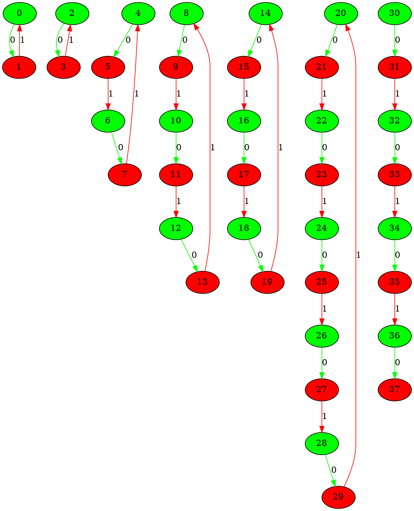
```graphviz
digraph G {
0[label="0" fillcolor="green" style="filled"];
1[label="1" fillcolor="red" style="filled"];
2[label="2" fillcolor="green" style="filled"];
3[label="3" fillcolor="red" style="filled"];
4[label="4" fillcolor="green" style="filled"];
5[label="5" fillcolor="red" style="filled"];
6[label="6" fillcolor="green" style="filled"];
7[label="7" fillcolor="red" style="filled"];
8[label="8" fillcolor="green" style="filled"];
9[label="9" fillcolor="red" style="filled"];
10[label="10" fillcolor="green" style="filled"];
11[label="11" fillcolor="red" style="filled"];
12[label="12" fillcolor="green" style="filled"];
13[label="13" fillcolor="red" style="filled"];
14[label="14" fillcolor="green" style="filled"];
15[label="15" fillcolor="red" style="filled"];
16[label="16" fillcolor="green" style="filled"];
17[label="17" fillcolor="red" style="filled"];
18[label="18" fillcolor="green" style="filled"];
19[label="19" fillcolor="red" style="filled"];
20[label="20" fillcolor="green" style="filled"];
21[label="21" fillcolor="red" style="filled"];
22[label="22" fillcolor="green" style="filled"];
23[label="23" fillcolor="red" style="filled"];
24[label="24" fillcolor="green" style="filled"];
25[label="25" fillcolor="red" style="filled"];
26[label="26" fillcolor="green" style="filled"];
27[label="27" fillcolor="red" style="filled"];
28[label="28" fillcolor="green" style="filled"];
29[label="29" fillcolor="red" style="filled"];
30[label="30" fillcolor="green" style="filled"];
31[label="31" fillcolor="red" style="filled"];
32[label="32" fillcolor="green" style="filled"];
33[label="33" fillcolor="red" style="filled"];
34[label="34" fillcolor="green" style="filled"];
35[label="35" fillcolor="red" style="filled"];
36[label="36" fillcolor="green" style="filled"];
37[label="37" fillcolor="red" style="filled"];
0->1 [label="0" color="green"];
2->3 [label="0" color="green"];
4->5 [label="0" color="green"];
6->7 [label="0" color="green"];
8->9 [label="0" color="green"];
10->11 [label="0" color="green"];
12->13 [label="0" color="green"];
14->15 [label="0" color="green"];
16->17 [label="0" color="green"];
18->19 [label="0" color="green"];
20->21 [label="0" color="green"];
22->23 [label="0" color="green"];
24->25 [label="0" color="green"];
26->27 [label="0" color="green"];
28->29 [label="0" color="green"];
30->31 [label="0" color="green"];
32->33 [label="0" color="green"];
34->35 [label="0" color="green"];
36->37 [label="0" color="green"];
1->0 [label="1" color="red"];
3->2 [label="1" color="red"];
5->6 [label="1" color="red"];
7->4 [label="1" color="red"];
9->10 [label="1" color="red"];
11->12 [label="1" color="red"];
13->8 [label="1" color="red"];
15->16 [label="1" color="red"];
17->18 [label="1" color="red"];
19->14 [label="1" color="red"];
21->22 [label="1" color="red"];
23->24 [label="1" color="red"];
25->26 [label="1" color="red"];
27->28 [label="1" color="red"];
29->20 [label="1" color="red"];
31->32 [label="1" color="red"];
33->34 [label="1" color="red"];
35->36 [label="1" color="red"];
}
```
___
## Graph 12702 - list de compréhension : 1,1,2,3,4|3,5
___
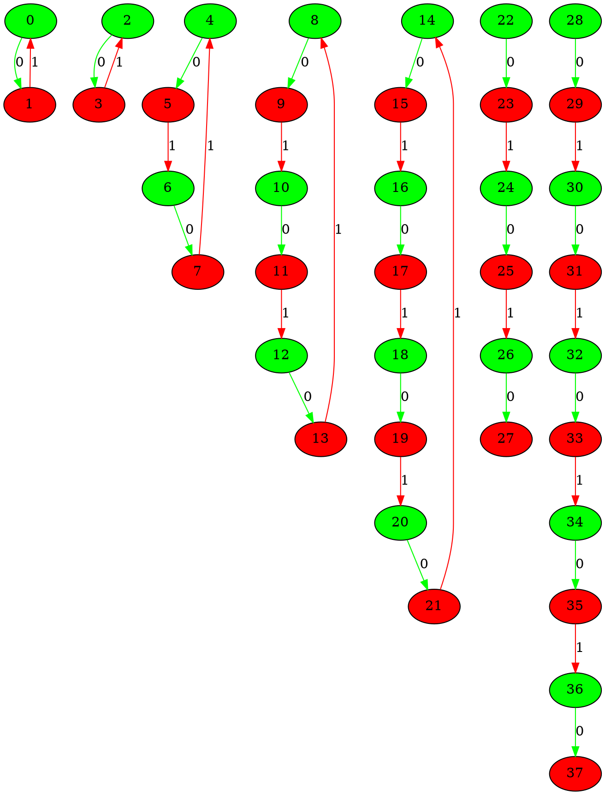
```graphviz
digraph G {
0[label="0" fillcolor="green" style="filled"];
1[label="1" fillcolor="red" style="filled"];
2[label="2" fillcolor="green" style="filled"];
3[label="3" fillcolor="red" style="filled"];
4[label="4" fillcolor="green" style="filled"];
5[label="5" fillcolor="red" style="filled"];
6[label="6" fillcolor="green" style="filled"];
7[label="7" fillcolor="red" style="filled"];
8[label="8" fillcolor="green" style="filled"];
9[label="9" fillcolor="red" style="filled"];
10[label="10" fillcolor="green" style="filled"];
11[label="11" fillcolor="red" style="filled"];
12[label="12" fillcolor="green" style="filled"];
13[label="13" fillcolor="red" style="filled"];
14[label="14" fillcolor="green" style="filled"];
15[label="15" fillcolor="red" style="filled"];
16[label="16" fillcolor="green" style="filled"];
17[label="17" fillcolor="red" style="filled"];
18[label="18" fillcolor="green" style="filled"];
19[label="19" fillcolor="red" style="filled"];
20[label="20" fillcolor="green" style="filled"];
21[label="21" fillcolor="red" style="filled"];
22[label="22" fillcolor="green" style="filled"];
23[label="23" fillcolor="red" style="filled"];
24[label="24" fillcolor="green" style="filled"];
25[label="25" fillcolor="red" style="filled"];
26[label="26" fillcolor="green" style="filled"];
27[label="27" fillcolor="red" style="filled"];
28[label="28" fillcolor="green" style="filled"];
29[label="29" fillcolor="red" style="filled"];
30[label="30" fillcolor="green" style="filled"];
31[label="31" fillcolor="red" style="filled"];
32[label="32" fillcolor="green" style="filled"];
33[label="33" fillcolor="red" style="filled"];
34[label="34" fillcolor="green" style="filled"];
35[label="35" fillcolor="red" style="filled"];
36[label="36" fillcolor="green" style="filled"];
37[label="37" fillcolor="red" style="filled"];
0->1 [label="0" color="green"];
2->3 [label="0" color="green"];
4->5 [label="0" color="green"];
6->7 [label="0" color="green"];
8->9 [label="0" color="green"];
10->11 [label="0" color="green"];
12->13 [label="0" color="green"];
14->15 [label="0" color="green"];
16->17 [label="0" color="green"];
18->19 [label="0" color="green"];
20->21 [label="0" color="green"];
22->23 [label="0" color="green"];
24->25 [label="0" color="green"];
26->27 [label="0" color="green"];
28->29 [label="0" color="green"];
30->31 [label="0" color="green"];
32->33 [label="0" color="green"];
34->35 [label="0" color="green"];
36->37 [label="0" color="green"];
1->0 [label="1" color="red"];
3->2 [label="1" color="red"];
5->6 [label="1" color="red"];
7->4 [label="1" color="red"];
9->10 [label="1" color="red"];
11->12 [label="1" color="red"];
13->8 [label="1" color="red"];
15->16 [label="1" color="red"];
17->18 [label="1" color="red"];
19->20 [label="1" color="red"];
21->14 [label="1" color="red"];
23->24 [label="1" color="red"];
25->26 [label="1" color="red"];
29->30 [label="1" color="red"];
31->32 [label="1" color="red"];
33->34 [label="1" color="red"];
35->36 [label="1" color="red"];
}
```
___
## Graph 12703 - list de compréhension : 1,1,2,3,4,5|3
___
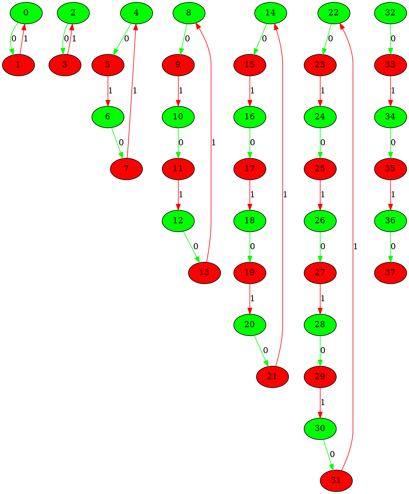
```graphviz
digraph G {
0[label="0" fillcolor="green" style="filled"];
1[label="1" fillcolor="red" style="filled"];
2[label="2" fillcolor="green" style="filled"];
3[label="3" fillcolor="red" style="filled"];
4[label="4" fillcolor="green" style="filled"];
5[label="5" fillcolor="red" style="filled"];
6[label="6" fillcolor="green" style="filled"];
7[label="7" fillcolor="red" style="filled"];
8[label="8" fillcolor="green" style="filled"];
9[label="9" fillcolor="red" style="filled"];
10[label="10" fillcolor="green" style="filled"];
11[label="11" fillcolor="red" style="filled"];
12[label="12" fillcolor="green" style="filled"];
13[label="13" fillcolor="red" style="filled"];
14[label="14" fillcolor="green" style="filled"];
15[label="15" fillcolor="red" style="filled"];
16[label="16" fillcolor="green" style="filled"];
17[label="17" fillcolor="red" style="filled"];
18[label="18" fillcolor="green" style="filled"];
19[label="19" fillcolor="red" style="filled"];
20[label="20" fillcolor="green" style="filled"];
21[label="21" fillcolor="red" style="filled"];
22[label="22" fillcolor="green" style="filled"];
23[label="23" fillcolor="red" style="filled"];
24[label="24" fillcolor="green" style="filled"];
25[label="25" fillcolor="red" style="filled"];
26[label="26" fillcolor="green" style="filled"];
27[label="27" fillcolor="red" style="filled"];
28[label="28" fillcolor="green" style="filled"];
29[label="29" fillcolor="red" style="filled"];
30[label="30" fillcolor="green" style="filled"];
31[label="31" fillcolor="red" style="filled"];
32[label="32" fillcolor="green" style="filled"];
33[label="33" fillcolor="red" style="filled"];
34[label="34" fillcolor="green" style="filled"];
35[label="35" fillcolor="red" style="filled"];
36[label="36" fillcolor="green" style="filled"];
37[label="37" fillcolor="red" style="filled"];
0->1 [label="0" color="green"];
2->3 [label="0" color="green"];
4->5 [label="0" color="green"];
6->7 [label="0" color="green"];
8->9 [label="0" color="green"];
10->11 [label="0" color="green"];
12->13 [label="0" color="green"];
14->15 [label="0" color="green"];
16->17 [label="0" color="green"];
18->19 [label="0" color="green"];
20->21 [label="0" color="green"];
22->23 [label="0" color="green"];
24->25 [label="0" color="green"];
26->27 [label="0" color="green"];
28->29 [label="0" color="green"];
30->31 [label="0" color="green"];
32->33 [label="0" color="green"];
34->35 [label="0" color="green"];
36->37 [label="0" color="green"];
1->0 [label="1" color="red"];
3->2 [label="1" color="red"];
5->6 [label="1" color="red"];
7->4 [label="1" color="red"];
9->10 [label="1" color="red"];
11->12 [label="1" color="red"];
13->8 [label="1" color="red"];
15->16 [label="1" color="red"];
17->18 [label="1" color="red"];
19->20 [label="1" color="red"];
21->14 [label="1" color="red"];
23->24 [label="1" color="red"];
25->26 [label="1" color="red"];
27->28 [label="1" color="red"];
29->30 [label="1" color="red"];
31->22 [label="1" color="red"];
33->34 [label="1" color="red"];
35->36 [label="1" color="red"];
}
```
___
## Graph 12704 - list de compréhension : 1,1,2,3,5|3,4
___
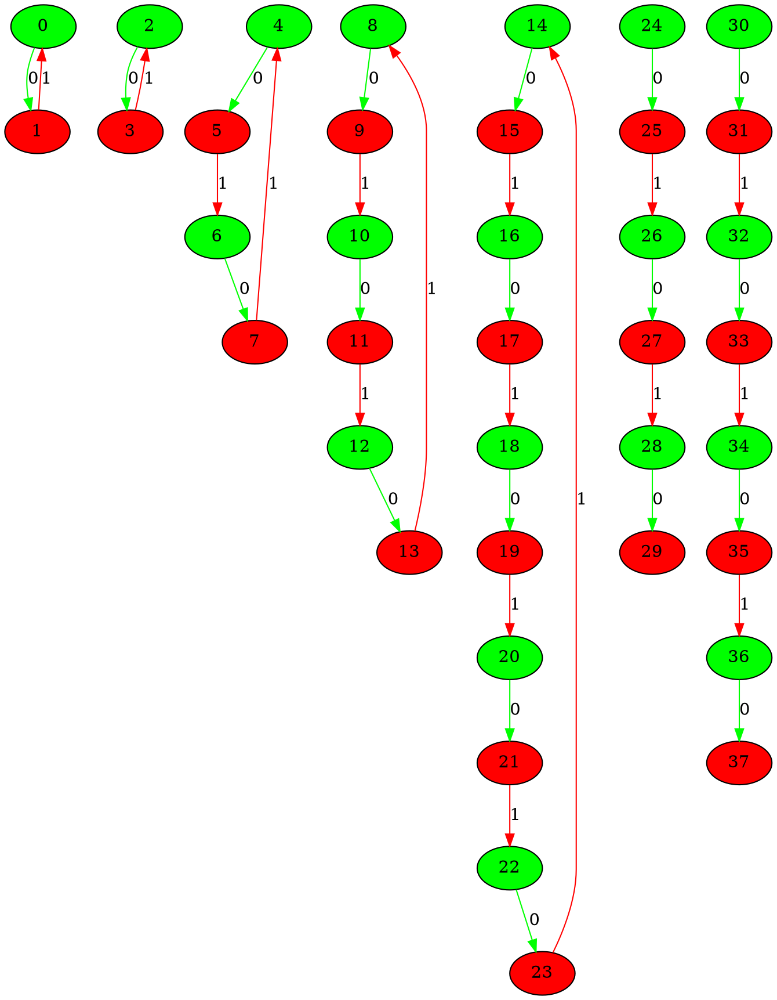
```graphviz
digraph G {
0[label="0" fillcolor="green" style="filled"];
1[label="1" fillcolor="red" style="filled"];
2[label="2" fillcolor="green" style="filled"];
3[label="3" fillcolor="red" style="filled"];
4[label="4" fillcolor="green" style="filled"];
5[label="5" fillcolor="red" style="filled"];
6[label="6" fillcolor="green" style="filled"];
7[label="7" fillcolor="red" style="filled"];
8[label="8" fillcolor="green" style="filled"];
9[label="9" fillcolor="red" style="filled"];
10[label="10" fillcolor="green" style="filled"];
11[label="11" fillcolor="red" style="filled"];
12[label="12" fillcolor="green" style="filled"];
13[label="13" fillcolor="red" style="filled"];
14[label="14" fillcolor="green" style="filled"];
15[label="15" fillcolor="red" style="filled"];
16[label="16" fillcolor="green" style="filled"];
17[label="17" fillcolor="red" style="filled"];
18[label="18" fillcolor="green" style="filled"];
19[label="19" fillcolor="red" style="filled"];
20[label="20" fillcolor="green" style="filled"];
21[label="21" fillcolor="red" style="filled"];
22[label="22" fillcolor="green" style="filled"];
23[label="23" fillcolor="red" style="filled"];
24[label="24" fillcolor="green" style="filled"];
25[label="25" fillcolor="red" style="filled"];
26[label="26" fillcolor="green" style="filled"];
27[label="27" fillcolor="red" style="filled"];
28[label="28" fillcolor="green" style="filled"];
29[label="29" fillcolor="red" style="filled"];
30[label="30" fillcolor="green" style="filled"];
31[label="31" fillcolor="red" style="filled"];
32[label="32" fillcolor="green" style="filled"];
33[label="33" fillcolor="red" style="filled"];
34[label="34" fillcolor="green" style="filled"];
35[label="35" fillcolor="red" style="filled"];
36[label="36" fillcolor="green" style="filled"];
37[label="37" fillcolor="red" style="filled"];
0->1 [label="0" color="green"];
2->3 [label="0" color="green"];
4->5 [label="0" color="green"];
6->7 [label="0" color="green"];
8->9 [label="0" color="green"];
10->11 [label="0" color="green"];
12->13 [label="0" color="green"];
14->15 [label="0" color="green"];
16->17 [label="0" color="green"];
18->19 [label="0" color="green"];
20->21 [label="0" color="green"];
22->23 [label="0" color="green"];
24->25 [label="0" color="green"];
26->27 [label="0" color="green"];
28->29 [label="0" color="green"];
30->31 [label="0" color="green"];
32->33 [label="0" color="green"];
34->35 [label="0" color="green"];
36->37 [label="0" color="green"];
1->0 [label="1" color="red"];
3->2 [label="1" color="red"];
5->6 [label="1" color="red"];
7->4 [label="1" color="red"];
9->10 [label="1" color="red"];
11->12 [label="1" color="red"];
13->8 [label="1" color="red"];
15->16 [label="1" color="red"];
17->18 [label="1" color="red"];
19->20 [label="1" color="red"];
21->22 [label="1" color="red"];
23->14 [label="1" color="red"];
25->26 [label="1" color="red"];
27->28 [label="1" color="red"];
31->32 [label="1" color="red"];
33->34 [label="1" color="red"];
35->36 [label="1" color="red"];
}
```
___
## Graph 12705 - list de compréhension : 1,1,2,4|3,3,5
___
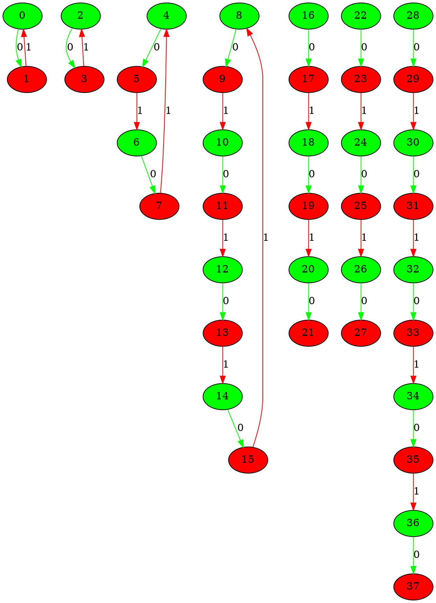
```graphviz
digraph G {
0[label="0" fillcolor="green" style="filled"];
1[label="1" fillcolor="red" style="filled"];
2[label="2" fillcolor="green" style="filled"];
3[label="3" fillcolor="red" style="filled"];
4[label="4" fillcolor="green" style="filled"];
5[label="5" fillcolor="red" style="filled"];
6[label="6" fillcolor="green" style="filled"];
7[label="7" fillcolor="red" style="filled"];
8[label="8" fillcolor="green" style="filled"];
9[label="9" fillcolor="red" style="filled"];
10[label="10" fillcolor="green" style="filled"];
11[label="11" fillcolor="red" style="filled"];
12[label="12" fillcolor="green" style="filled"];
13[label="13" fillcolor="red" style="filled"];
14[label="14" fillcolor="green" style="filled"];
15[label="15" fillcolor="red" style="filled"];
16[label="16" fillcolor="green" style="filled"];
17[label="17" fillcolor="red" style="filled"];
18[label="18" fillcolor="green" style="filled"];
19[label="19" fillcolor="red" style="filled"];
20[label="20" fillcolor="green" style="filled"];
21[label="21" fillcolor="red" style="filled"];
22[label="22" fillcolor="green" style="filled"];
23[label="23" fillcolor="red" style="filled"];
24[label="24" fillcolor="green" style="filled"];
25[label="25" fillcolor="red" style="filled"];
26[label="26" fillcolor="green" style="filled"];
27[label="27" fillcolor="red" style="filled"];
28[label="28" fillcolor="green" style="filled"];
29[label="29" fillcolor="red" style="filled"];
30[label="30" fillcolor="green" style="filled"];
31[label="31" fillcolor="red" style="filled"];
32[label="32" fillcolor="green" style="filled"];
33[label="33" fillcolor="red" style="filled"];
34[label="34" fillcolor="green" style="filled"];
35[label="35" fillcolor="red" style="filled"];
36[label="36" fillcolor="green" style="filled"];
37[label="37" fillcolor="red" style="filled"];
0->1 [label="0" color="green"];
2->3 [label="0" color="green"];
4->5 [label="0" color="green"];
6->7 [label="0" color="green"];
8->9 [label="0" color="green"];
10->11 [label="0" color="green"];
12->13 [label="0" color="green"];
14->15 [label="0" color="green"];
16->17 [label="0" color="green"];
18->19 [label="0" color="green"];
20->21 [label="0" color="green"];
22->23 [label="0" color="green"];
24->25 [label="0" color="green"];
26->27 [label="0" color="green"];
28->29 [label="0" color="green"];
30->31 [label="0" color="green"];
32->33 [label="0" color="green"];
34->35 [label="0" color="green"];
36->37 [label="0" color="green"];
1->0 [label="1" color="red"];
3->2 [label="1" color="red"];
5->6 [label="1" color="red"];
7->4 [label="1" color="red"];
9->10 [label="1" color="red"];
11->12 [label="1" color="red"];
13->14 [label="1" color="red"];
15->8 [label="1" color="red"];
17->18 [label="1" color="red"];
19->20 [label="1" color="red"];
23->24 [label="1" color="red"];
25->26 [label="1" color="red"];
29->30 [label="1" color="red"];
31->32 [label="1" color="red"];
33->34 [label="1" color="red"];
35->36 [label="1" color="red"];
}
```
___
## Graph 12706 - list de compréhension : 1,1,2,4,5|3,3
___
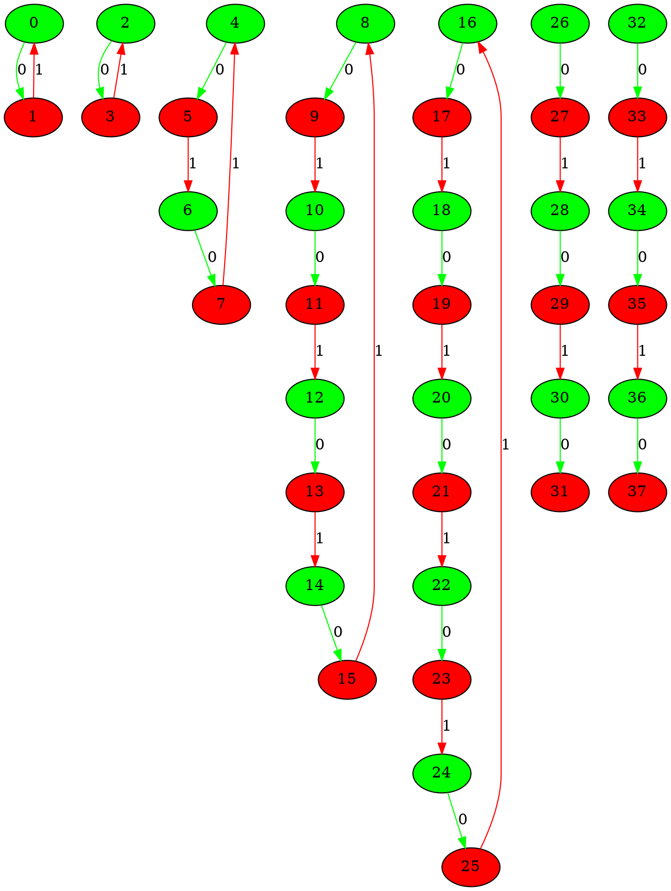
```graphviz
digraph G {
0[label="0" fillcolor="green" style="filled"];
1[label="1" fillcolor="red" style="filled"];
2[label="2" fillcolor="green" style="filled"];
3[label="3" fillcolor="red" style="filled"];
4[label="4" fillcolor="green" style="filled"];
5[label="5" fillcolor="red" style="filled"];
6[label="6" fillcolor="green" style="filled"];
7[label="7" fillcolor="red" style="filled"];
8[label="8" fillcolor="green" style="filled"];
9[label="9" fillcolor="red" style="filled"];
10[label="10" fillcolor="green" style="filled"];
11[label="11" fillcolor="red" style="filled"];
12[label="12" fillcolor="green" style="filled"];
13[label="13" fillcolor="red" style="filled"];
14[label="14" fillcolor="green" style="filled"];
15[label="15" fillcolor="red" style="filled"];
16[label="16" fillcolor="green" style="filled"];
17[label="17" fillcolor="red" style="filled"];
18[label="18" fillcolor="green" style="filled"];
19[label="19" fillcolor="red" style="filled"];
20[label="20" fillcolor="green" style="filled"];
21[label="21" fillcolor="red" style="filled"];
22[label="22" fillcolor="green" style="filled"];
23[label="23" fillcolor="red" style="filled"];
24[label="24" fillcolor="green" style="filled"];
25[label="25" fillcolor="red" style="filled"];
26[label="26" fillcolor="green" style="filled"];
27[label="27" fillcolor="red" style="filled"];
28[label="28" fillcolor="green" style="filled"];
29[label="29" fillcolor="red" style="filled"];
30[label="30" fillcolor="green" style="filled"];
31[label="31" fillcolor="red" style="filled"];
32[label="32" fillcolor="green" style="filled"];
33[label="33" fillcolor="red" style="filled"];
34[label="34" fillcolor="green" style="filled"];
35[label="35" fillcolor="red" style="filled"];
36[label="36" fillcolor="green" style="filled"];
37[label="37" fillcolor="red" style="filled"];
0->1 [label="0" color="green"];
2->3 [label="0" color="green"];
4->5 [label="0" color="green"];
6->7 [label="0" color="green"];
8->9 [label="0" color="green"];
10->11 [label="0" color="green"];
12->13 [label="0" color="green"];
14->15 [label="0" color="green"];
16->17 [label="0" color="green"];
18->19 [label="0" color="green"];
20->21 [label="0" color="green"];
22->23 [label="0" color="green"];
24->25 [label="0" color="green"];
26->27 [label="0" color="green"];
28->29 [label="0" color="green"];
30->31 [label="0" color="green"];
32->33 [label="0" color="green"];
34->35 [label="0" color="green"];
36->37 [label="0" color="green"];
1->0 [label="1" color="red"];
3->2 [label="1" color="red"];
5->6 [label="1" color="red"];
7->4 [label="1" color="red"];
9->10 [label="1" color="red"];
11->12 [label="1" color="red"];
13->14 [label="1" color="red"];
15->8 [label="1" color="red"];
17->18 [label="1" color="red"];
19->20 [label="1" color="red"];
21->22 [label="1" color="red"];
23->24 [label="1" color="red"];
25->16 [label="1" color="red"];
27->28 [label="1" color="red"];
29->30 [label="1" color="red"];
33->34 [label="1" color="red"];
35->36 [label="1" color="red"];
}
```
___
## Graph 12707 - list de compréhension : 1,1,2,5|3,3,4
___
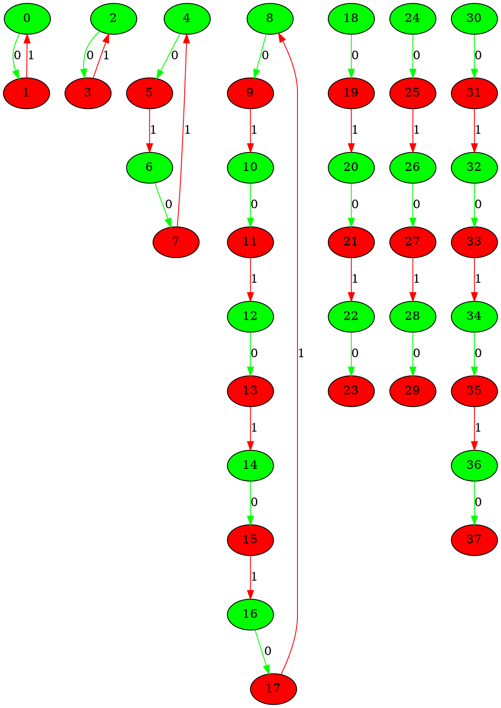
```graphviz
digraph G {
0[label="0" fillcolor="green" style="filled"];
1[label="1" fillcolor="red" style="filled"];
2[label="2" fillcolor="green" style="filled"];
3[label="3" fillcolor="red" style="filled"];
4[label="4" fillcolor="green" style="filled"];
5[label="5" fillcolor="red" style="filled"];
6[label="6" fillcolor="green" style="filled"];
7[label="7" fillcolor="red" style="filled"];
8[label="8" fillcolor="green" style="filled"];
9[label="9" fillcolor="red" style="filled"];
10[label="10" fillcolor="green" style="filled"];
11[label="11" fillcolor="red" style="filled"];
12[label="12" fillcolor="green" style="filled"];
13[label="13" fillcolor="red" style="filled"];
14[label="14" fillcolor="green" style="filled"];
15[label="15" fillcolor="red" style="filled"];
16[label="16" fillcolor="green" style="filled"];
17[label="17" fillcolor="red" style="filled"];
18[label="18" fillcolor="green" style="filled"];
19[label="19" fillcolor="red" style="filled"];
20[label="20" fillcolor="green" style="filled"];
21[label="21" fillcolor="red" style="filled"];
22[label="22" fillcolor="green" style="filled"];
23[label="23" fillcolor="red" style="filled"];
24[label="24" fillcolor="green" style="filled"];
25[label="25" fillcolor="red" style="filled"];
26[label="26" fillcolor="green" style="filled"];
27[label="27" fillcolor="red" style="filled"];
28[label="28" fillcolor="green" style="filled"];
29[label="29" fillcolor="red" style="filled"];
30[label="30" fillcolor="green" style="filled"];
31[label="31" fillcolor="red" style="filled"];
32[label="32" fillcolor="green" style="filled"];
33[label="33" fillcolor="red" style="filled"];
34[label="34" fillcolor="green" style="filled"];
35[label="35" fillcolor="red" style="filled"];
36[label="36" fillcolor="green" style="filled"];
37[label="37" fillcolor="red" style="filled"];
0->1 [label="0" color="green"];
2->3 [label="0" color="green"];
4->5 [label="0" color="green"];
6->7 [label="0" color="green"];
8->9 [label="0" color="green"];
10->11 [label="0" color="green"];
12->13 [label="0" color="green"];
14->15 [label="0" color="green"];
16->17 [label="0" color="green"];
18->19 [label="0" color="green"];
20->21 [label="0" color="green"];
22->23 [label="0" color="green"];
24->25 [label="0" color="green"];
26->27 [label="0" color="green"];
28->29 [label="0" color="green"];
30->31 [label="0" color="green"];
32->33 [label="0" color="green"];
34->35 [label="0" color="green"];
36->37 [label="0" color="green"];
1->0 [label="1" color="red"];
3->2 [label="1" color="red"];
5->6 [label="1" color="red"];
7->4 [label="1" color="red"];
9->10 [label="1" color="red"];
11->12 [label="1" color="red"];
13->14 [label="1" color="red"];
15->16 [label="1" color="red"];
17->8 [label="1" color="red"];
19->20 [label="1" color="red"];
21->22 [label="1" color="red"];
25->26 [label="1" color="red"];
27->28 [label="1" color="red"];
31->32 [label="1" color="red"];
33->34 [label="1" color="red"];
35->36 [label="1" color="red"];
}
```
___
## Graph 12708 - list de compréhension : 1,1,3|2,3,4,5
___
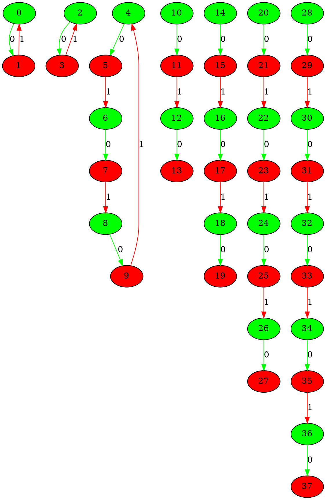
```graphviz
digraph G {
0[label="0" fillcolor="green" style="filled"];
1[label="1" fillcolor="red" style="filled"];
2[label="2" fillcolor="green" style="filled"];
3[label="3" fillcolor="red" style="filled"];
4[label="4" fillcolor="green" style="filled"];
5[label="5" fillcolor="red" style="filled"];
6[label="6" fillcolor="green" style="filled"];
7[label="7" fillcolor="red" style="filled"];
8[label="8" fillcolor="green" style="filled"];
9[label="9" fillcolor="red" style="filled"];
10[label="10" fillcolor="green" style="filled"];
11[label="11" fillcolor="red" style="filled"];
12[label="12" fillcolor="green" style="filled"];
13[label="13" fillcolor="red" style="filled"];
14[label="14" fillcolor="green" style="filled"];
15[label="15" fillcolor="red" style="filled"];
16[label="16" fillcolor="green" style="filled"];
17[label="17" fillcolor="red" style="filled"];
18[label="18" fillcolor="green" style="filled"];
19[label="19" fillcolor="red" style="filled"];
20[label="20" fillcolor="green" style="filled"];
21[label="21" fillcolor="red" style="filled"];
22[label="22" fillcolor="green" style="filled"];
23[label="23" fillcolor="red" style="filled"];
24[label="24" fillcolor="green" style="filled"];
25[label="25" fillcolor="red" style="filled"];
26[label="26" fillcolor="green" style="filled"];
27[label="27" fillcolor="red" style="filled"];
28[label="28" fillcolor="green" style="filled"];
29[label="29" fillcolor="red" style="filled"];
30[label="30" fillcolor="green" style="filled"];
31[label="31" fillcolor="red" style="filled"];
32[label="32" fillcolor="green" style="filled"];
33[label="33" fillcolor="red" style="filled"];
34[label="34" fillcolor="green" style="filled"];
35[label="35" fillcolor="red" style="filled"];
36[label="36" fillcolor="green" style="filled"];
37[label="37" fillcolor="red" style="filled"];
0->1 [label="0" color="green"];
2->3 [label="0" color="green"];
4->5 [label="0" color="green"];
6->7 [label="0" color="green"];
8->9 [label="0" color="green"];
10->11 [label="0" color="green"];
12->13 [label="0" color="green"];
14->15 [label="0" color="green"];
16->17 [label="0" color="green"];
18->19 [label="0" color="green"];
20->21 [label="0" color="green"];
22->23 [label="0" color="green"];
24->25 [label="0" color="green"];
26->27 [label="0" color="green"];
28->29 [label="0" color="green"];
30->31 [label="0" color="green"];
32->33 [label="0" color="green"];
34->35 [label="0" color="green"];
36->37 [label="0" color="green"];
1->0 [label="1" color="red"];
3->2 [label="1" color="red"];
5->6 [label="1" color="red"];
7->8 [label="1" color="red"];
9->4 [label="1" color="red"];
11->12 [label="1" color="red"];
15->16 [label="1" color="red"];
17->18 [label="1" color="red"];
21->22 [label="1" color="red"];
23->24 [label="1" color="red"];
25->26 [label="1" color="red"];
29->30 [label="1" color="red"];
31->32 [label="1" color="red"];
33->34 [label="1" color="red"];
35->36 [label="1" color="red"];
}
```
___
## Graph 12709 - list de compréhension : 1,1,3,3|2,4,5
___
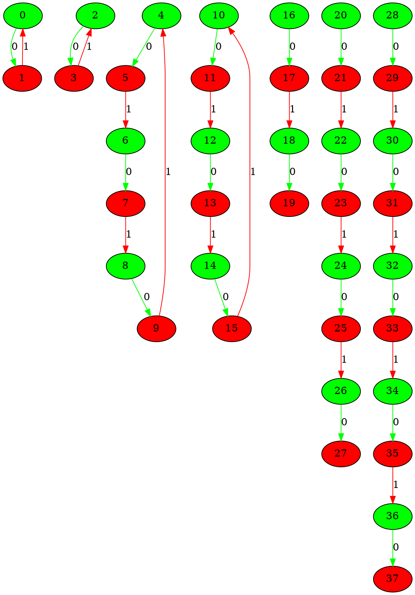
```graphviz
digraph G {
0[label="0" fillcolor="green" style="filled"];
1[label="1" fillcolor="red" style="filled"];
2[label="2" fillcolor="green" style="filled"];
3[label="3" fillcolor="red" style="filled"];
4[label="4" fillcolor="green" style="filled"];
5[label="5" fillcolor="red" style="filled"];
6[label="6" fillcolor="green" style="filled"];
7[label="7" fillcolor="red" style="filled"];
8[label="8" fillcolor="green" style="filled"];
9[label="9" fillcolor="red" style="filled"];
10[label="10" fillcolor="green" style="filled"];
11[label="11" fillcolor="red" style="filled"];
12[label="12" fillcolor="green" style="filled"];
13[label="13" fillcolor="red" style="filled"];
14[label="14" fillcolor="green" style="filled"];
15[label="15" fillcolor="red" style="filled"];
16[label="16" fillcolor="green" style="filled"];
17[label="17" fillcolor="red" style="filled"];
18[label="18" fillcolor="green" style="filled"];
19[label="19" fillcolor="red" style="filled"];
20[label="20" fillcolor="green" style="filled"];
21[label="21" fillcolor="red" style="filled"];
22[label="22" fillcolor="green" style="filled"];
23[label="23" fillcolor="red" style="filled"];
24[label="24" fillcolor="green" style="filled"];
25[label="25" fillcolor="red" style="filled"];
26[label="26" fillcolor="green" style="filled"];
27[label="27" fillcolor="red" style="filled"];
28[label="28" fillcolor="green" style="filled"];
29[label="29" fillcolor="red" style="filled"];
30[label="30" fillcolor="green" style="filled"];
31[label="31" fillcolor="red" style="filled"];
32[label="32" fillcolor="green" style="filled"];
33[label="33" fillcolor="red" style="filled"];
34[label="34" fillcolor="green" style="filled"];
35[label="35" fillcolor="red" style="filled"];
36[label="36" fillcolor="green" style="filled"];
37[label="37" fillcolor="red" style="filled"];
0->1 [label="0" color="green"];
2->3 [label="0" color="green"];
4->5 [label="0" color="green"];
6->7 [label="0" color="green"];
8->9 [label="0" color="green"];
10->11 [label="0" color="green"];
12->13 [label="0" color="green"];
14->15 [label="0" color="green"];
16->17 [label="0" color="green"];
18->19 [label="0" color="green"];
20->21 [label="0" color="green"];
22->23 [label="0" color="green"];
24->25 [label="0" color="green"];
26->27 [label="0" color="green"];
28->29 [label="0" color="green"];
30->31 [label="0" color="green"];
32->33 [label="0" color="green"];
34->35 [label="0" color="green"];
36->37 [label="0" color="green"];
1->0 [label="1" color="red"];
3->2 [label="1" color="red"];
5->6 [label="1" color="red"];
7->8 [label="1" color="red"];
9->4 [label="1" color="red"];
11->12 [label="1" color="red"];
13->14 [label="1" color="red"];
15->10 [label="1" color="red"];
17->18 [label="1" color="red"];
21->22 [label="1" color="red"];
23->24 [label="1" color="red"];
25->26 [label="1" color="red"];
29->30 [label="1" color="red"];
31->32 [label="1" color="red"];
33->34 [label="1" color="red"];
35->36 [label="1" color="red"];
}
```
___
## Graph 12710 - list de compréhension : 1,1,3,3,4|2,5
___
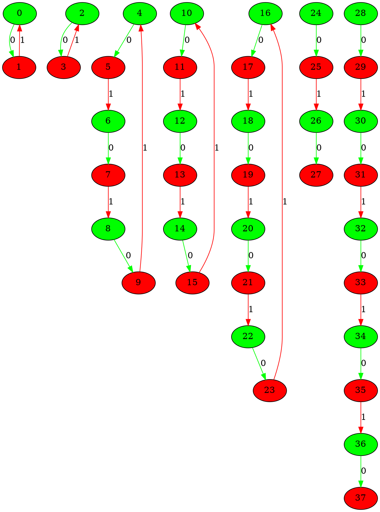
```graphviz
digraph G {
0[label="0" fillcolor="green" style="filled"];
1[label="1" fillcolor="red" style="filled"];
2[label="2" fillcolor="green" style="filled"];
3[label="3" fillcolor="red" style="filled"];
4[label="4" fillcolor="green" style="filled"];
5[label="5" fillcolor="red" style="filled"];
6[label="6" fillcolor="green" style="filled"];
7[label="7" fillcolor="red" style="filled"];
8[label="8" fillcolor="green" style="filled"];
9[label="9" fillcolor="red" style="filled"];
10[label="10" fillcolor="green" style="filled"];
11[label="11" fillcolor="red" style="filled"];
12[label="12" fillcolor="green" style="filled"];
13[label="13" fillcolor="red" style="filled"];
14[label="14" fillcolor="green" style="filled"];
15[label="15" fillcolor="red" style="filled"];
16[label="16" fillcolor="green" style="filled"];
17[label="17" fillcolor="red" style="filled"];
18[label="18" fillcolor="green" style="filled"];
19[label="19" fillcolor="red" style="filled"];
20[label="20" fillcolor="green" style="filled"];
21[label="21" fillcolor="red" style="filled"];
22[label="22" fillcolor="green" style="filled"];
23[label="23" fillcolor="red" style="filled"];
24[label="24" fillcolor="green" style="filled"];
25[label="25" fillcolor="red" style="filled"];
26[label="26" fillcolor="green" style="filled"];
27[label="27" fillcolor="red" style="filled"];
28[label="28" fillcolor="green" style="filled"];
29[label="29" fillcolor="red" style="filled"];
30[label="30" fillcolor="green" style="filled"];
31[label="31" fillcolor="red" style="filled"];
32[label="32" fillcolor="green" style="filled"];
33[label="33" fillcolor="red" style="filled"];
34[label="34" fillcolor="green" style="filled"];
35[label="35" fillcolor="red" style="filled"];
36[label="36" fillcolor="green" style="filled"];
37[label="37" fillcolor="red" style="filled"];
0->1 [label="0" color="green"];
2->3 [label="0" color="green"];
4->5 [label="0" color="green"];
6->7 [label="0" color="green"];
8->9 [label="0" color="green"];
10->11 [label="0" color="green"];
12->13 [label="0" color="green"];
14->15 [label="0" color="green"];
16->17 [label="0" color="green"];
18->19 [label="0" color="green"];
20->21 [label="0" color="green"];
22->23 [label="0" color="green"];
24->25 [label="0" color="green"];
26->27 [label="0" color="green"];
28->29 [label="0" color="green"];
30->31 [label="0" color="green"];
32->33 [label="0" color="green"];
34->35 [label="0" color="green"];
36->37 [label="0" color="green"];
1->0 [label="1" color="red"];
3->2 [label="1" color="red"];
5->6 [label="1" color="red"];
7->8 [label="1" color="red"];
9->4 [label="1" color="red"];
11->12 [label="1" color="red"];
13->14 [label="1" color="red"];
15->10 [label="1" color="red"];
17->18 [label="1" color="red"];
19->20 [label="1" color="red"];
21->22 [label="1" color="red"];
23->16 [label="1" color="red"];
25->26 [label="1" color="red"];
29->30 [label="1" color="red"];
31->32 [label="1" color="red"];
33->34 [label="1" color="red"];
35->36 [label="1" color="red"];
}
```
___
## Graph 12711 - list de compréhension : 1,1,3,3,4,5|2
___
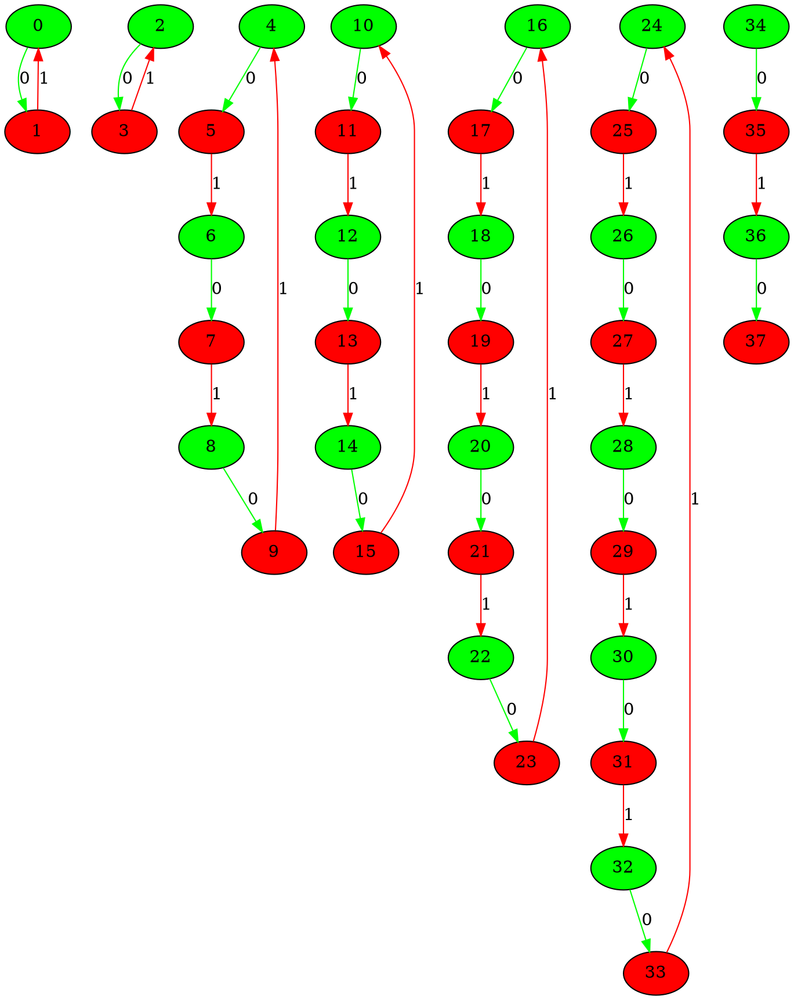
```graphviz
digraph G {
0[label="0" fillcolor="green" style="filled"];
1[label="1" fillcolor="red" style="filled"];
2[label="2" fillcolor="green" style="filled"];
3[label="3" fillcolor="red" style="filled"];
4[label="4" fillcolor="green" style="filled"];
5[label="5" fillcolor="red" style="filled"];
6[label="6" fillcolor="green" style="filled"];
7[label="7" fillcolor="red" style="filled"];
8[label="8" fillcolor="green" style="filled"];
9[label="9" fillcolor="red" style="filled"];
10[label="10" fillcolor="green" style="filled"];
11[label="11" fillcolor="red" style="filled"];
12[label="12" fillcolor="green" style="filled"];
13[label="13" fillcolor="red" style="filled"];
14[label="14" fillcolor="green" style="filled"];
15[label="15" fillcolor="red" style="filled"];
16[label="16" fillcolor="green" style="filled"];
17[label="17" fillcolor="red" style="filled"];
18[label="18" fillcolor="green" style="filled"];
19[label="19" fillcolor="red" style="filled"];
20[label="20" fillcolor="green" style="filled"];
21[label="21" fillcolor="red" style="filled"];
22[label="22" fillcolor="green" style="filled"];
23[label="23" fillcolor="red" style="filled"];
24[label="24" fillcolor="green" style="filled"];
25[label="25" fillcolor="red" style="filled"];
26[label="26" fillcolor="green" style="filled"];
27[label="27" fillcolor="red" style="filled"];
28[label="28" fillcolor="green" style="filled"];
29[label="29" fillcolor="red" style="filled"];
30[label="30" fillcolor="green" style="filled"];
31[label="31" fillcolor="red" style="filled"];
32[label="32" fillcolor="green" style="filled"];
33[label="33" fillcolor="red" style="filled"];
34[label="34" fillcolor="green" style="filled"];
35[label="35" fillcolor="red" style="filled"];
36[label="36" fillcolor="green" style="filled"];
37[label="37" fillcolor="red" style="filled"];
0->1 [label="0" color="green"];
2->3 [label="0" color="green"];
4->5 [label="0" color="green"];
6->7 [label="0" color="green"];
8->9 [label="0" color="green"];
10->11 [label="0" color="green"];
12->13 [label="0" color="green"];
14->15 [label="0" color="green"];
16->17 [label="0" color="green"];
18->19 [label="0" color="green"];
20->21 [label="0" color="green"];
22->23 [label="0" color="green"];
24->25 [label="0" color="green"];
26->27 [label="0" color="green"];
28->29 [label="0" color="green"];
30->31 [label="0" color="green"];
32->33 [label="0" color="green"];
34->35 [label="0" color="green"];
36->37 [label="0" color="green"];
1->0 [label="1" color="red"];
3->2 [label="1" color="red"];
5->6 [label="1" color="red"];
7->8 [label="1" color="red"];
9->4 [label="1" color="red"];
11->12 [label="1" color="red"];
13->14 [label="1" color="red"];
15->10 [label="1" color="red"];
17->18 [label="1" color="red"];
19->20 [label="1" color="red"];
21->22 [label="1" color="red"];
23->16 [label="1" color="red"];
25->26 [label="1" color="red"];
27->28 [label="1" color="red"];
29->30 [label="1" color="red"];
31->32 [label="1" color="red"];
33->24 [label="1" color="red"];
35->36 [label="1" color="red"];
}
```
___
## Graph 12712 - list de compréhension : 1,1,3,3,5|2,4
___
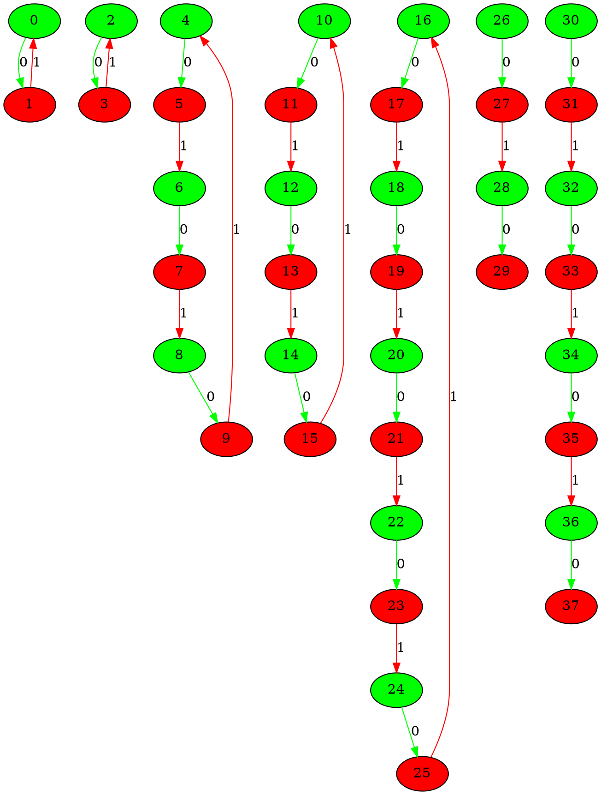
```graphviz
digraph G {
0[label="0" fillcolor="green" style="filled"];
1[label="1" fillcolor="red" style="filled"];
2[label="2" fillcolor="green" style="filled"];
3[label="3" fillcolor="red" style="filled"];
4[label="4" fillcolor="green" style="filled"];
5[label="5" fillcolor="red" style="filled"];
6[label="6" fillcolor="green" style="filled"];
7[label="7" fillcolor="red" style="filled"];
8[label="8" fillcolor="green" style="filled"];
9[label="9" fillcolor="red" style="filled"];
10[label="10" fillcolor="green" style="filled"];
11[label="11" fillcolor="red" style="filled"];
12[label="12" fillcolor="green" style="filled"];
13[label="13" fillcolor="red" style="filled"];
14[label="14" fillcolor="green" style="filled"];
15[label="15" fillcolor="red" style="filled"];
16[label="16" fillcolor="green" style="filled"];
17[label="17" fillcolor="red" style="filled"];
18[label="18" fillcolor="green" style="filled"];
19[label="19" fillcolor="red" style="filled"];
20[label="20" fillcolor="green" style="filled"];
21[label="21" fillcolor="red" style="filled"];
22[label="22" fillcolor="green" style="filled"];
23[label="23" fillcolor="red" style="filled"];
24[label="24" fillcolor="green" style="filled"];
25[label="25" fillcolor="red" style="filled"];
26[label="26" fillcolor="green" style="filled"];
27[label="27" fillcolor="red" style="filled"];
28[label="28" fillcolor="green" style="filled"];
29[label="29" fillcolor="red" style="filled"];
30[label="30" fillcolor="green" style="filled"];
31[label="31" fillcolor="red" style="filled"];
32[label="32" fillcolor="green" style="filled"];
33[label="33" fillcolor="red" style="filled"];
34[label="34" fillcolor="green" style="filled"];
35[label="35" fillcolor="red" style="filled"];
36[label="36" fillcolor="green" style="filled"];
37[label="37" fillcolor="red" style="filled"];
0->1 [label="0" color="green"];
2->3 [label="0" color="green"];
4->5 [label="0" color="green"];
6->7 [label="0" color="green"];
8->9 [label="0" color="green"];
10->11 [label="0" color="green"];
12->13 [label="0" color="green"];
14->15 [label="0" color="green"];
16->17 [label="0" color="green"];
18->19 [label="0" color="green"];
20->21 [label="0" color="green"];
22->23 [label="0" color="green"];
24->25 [label="0" color="green"];
26->27 [label="0" color="green"];
28->29 [label="0" color="green"];
30->31 [label="0" color="green"];
32->33 [label="0" color="green"];
34->35 [label="0" color="green"];
36->37 [label="0" color="green"];
1->0 [label="1" color="red"];
3->2 [label="1" color="red"];
5->6 [label="1" color="red"];
7->8 [label="1" color="red"];
9->4 [label="1" color="red"];
11->12 [label="1" color="red"];
13->14 [label="1" color="red"];
15->10 [label="1" color="red"];
17->18 [label="1" color="red"];
19->20 [label="1" color="red"];
21->22 [label="1" color="red"];
23->24 [label="1" color="red"];
25->16 [label="1" color="red"];
27->28 [label="1" color="red"];
31->32 [label="1" color="red"];
33->34 [label="1" color="red"];
35->36 [label="1" color="red"];
}
```
___
## Graph 12713 - list de compréhension : 1,1,3,4|2,3,5
___
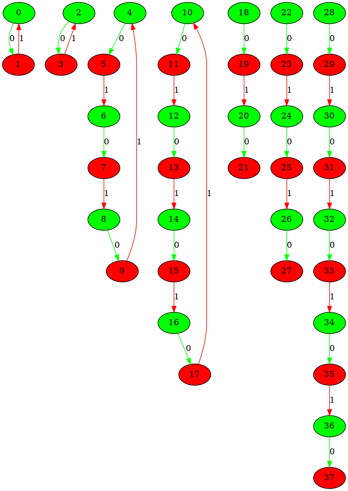
```graphviz
digraph G {
0[label="0" fillcolor="green" style="filled"];
1[label="1" fillcolor="red" style="filled"];
2[label="2" fillcolor="green" style="filled"];
3[label="3" fillcolor="red" style="filled"];
4[label="4" fillcolor="green" style="filled"];
5[label="5" fillcolor="red" style="filled"];
6[label="6" fillcolor="green" style="filled"];
7[label="7" fillcolor="red" style="filled"];
8[label="8" fillcolor="green" style="filled"];
9[label="9" fillcolor="red" style="filled"];
10[label="10" fillcolor="green" style="filled"];
11[label="11" fillcolor="red" style="filled"];
12[label="12" fillcolor="green" style="filled"];
13[label="13" fillcolor="red" style="filled"];
14[label="14" fillcolor="green" style="filled"];
15[label="15" fillcolor="red" style="filled"];
16[label="16" fillcolor="green" style="filled"];
17[label="17" fillcolor="red" style="filled"];
18[label="18" fillcolor="green" style="filled"];
19[label="19" fillcolor="red" style="filled"];
20[label="20" fillcolor="green" style="filled"];
21[label="21" fillcolor="red" style="filled"];
22[label="22" fillcolor="green" style="filled"];
23[label="23" fillcolor="red" style="filled"];
24[label="24" fillcolor="green" style="filled"];
25[label="25" fillcolor="red" style="filled"];
26[label="26" fillcolor="green" style="filled"];
27[label="27" fillcolor="red" style="filled"];
28[label="28" fillcolor="green" style="filled"];
29[label="29" fillcolor="red" style="filled"];
30[label="30" fillcolor="green" style="filled"];
31[label="31" fillcolor="red" style="filled"];
32[label="32" fillcolor="green" style="filled"];
33[label="33" fillcolor="red" style="filled"];
34[label="34" fillcolor="green" style="filled"];
35[label="35" fillcolor="red" style="filled"];
36[label="36" fillcolor="green" style="filled"];
37[label="37" fillcolor="red" style="filled"];
0->1 [label="0" color="green"];
2->3 [label="0" color="green"];
4->5 [label="0" color="green"];
6->7 [label="0" color="green"];
8->9 [label="0" color="green"];
10->11 [label="0" color="green"];
12->13 [label="0" color="green"];
14->15 [label="0" color="green"];
16->17 [label="0" color="green"];
18->19 [label="0" color="green"];
20->21 [label="0" color="green"];
22->23 [label="0" color="green"];
24->25 [label="0" color="green"];
26->27 [label="0" color="green"];
28->29 [label="0" color="green"];
30->31 [label="0" color="green"];
32->33 [label="0" color="green"];
34->35 [label="0" color="green"];
36->37 [label="0" color="green"];
1->0 [label="1" color="red"];
3->2 [label="1" color="red"];
5->6 [label="1" color="red"];
7->8 [label="1" color="red"];
9->4 [label="1" color="red"];
11->12 [label="1" color="red"];
13->14 [label="1" color="red"];
15->16 [label="1" color="red"];
17->10 [label="1" color="red"];
19->20 [label="1" color="red"];
23->24 [label="1" color="red"];
25->26 [label="1" color="red"];
29->30 [label="1" color="red"];
31->32 [label="1" color="red"];
33->34 [label="1" color="red"];
35->36 [label="1" color="red"];
}
```
___
## Graph 12714 - list de compréhension : 1,1,3,4,5|2,3
___
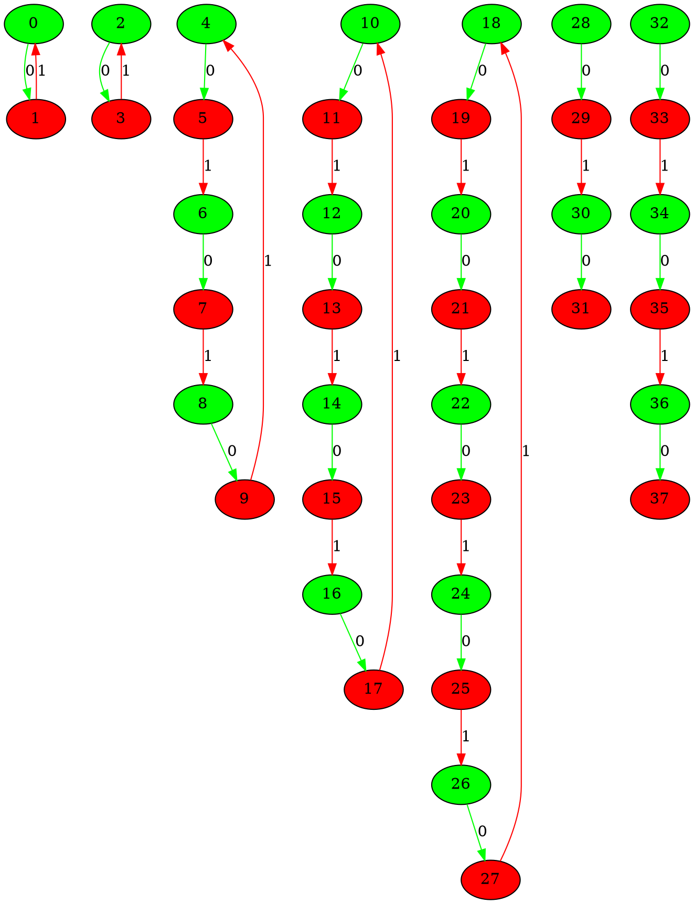
```graphviz
digraph G {
0[label="0" fillcolor="green" style="filled"];
1[label="1" fillcolor="red" style="filled"];
2[label="2" fillcolor="green" style="filled"];
3[label="3" fillcolor="red" style="filled"];
4[label="4" fillcolor="green" style="filled"];
5[label="5" fillcolor="red" style="filled"];
6[label="6" fillcolor="green" style="filled"];
7[label="7" fillcolor="red" style="filled"];
8[label="8" fillcolor="green" style="filled"];
9[label="9" fillcolor="red" style="filled"];
10[label="10" fillcolor="green" style="filled"];
11[label="11" fillcolor="red" style="filled"];
12[label="12" fillcolor="green" style="filled"];
13[label="13" fillcolor="red" style="filled"];
14[label="14" fillcolor="green" style="filled"];
15[label="15" fillcolor="red" style="filled"];
16[label="16" fillcolor="green" style="filled"];
17[label="17" fillcolor="red" style="filled"];
18[label="18" fillcolor="green" style="filled"];
19[label="19" fillcolor="red" style="filled"];
20[label="20" fillcolor="green" style="filled"];
21[label="21" fillcolor="red" style="filled"];
22[label="22" fillcolor="green" style="filled"];
23[label="23" fillcolor="red" style="filled"];
24[label="24" fillcolor="green" style="filled"];
25[label="25" fillcolor="red" style="filled"];
26[label="26" fillcolor="green" style="filled"];
27[label="27" fillcolor="red" style="filled"];
28[label="28" fillcolor="green" style="filled"];
29[label="29" fillcolor="red" style="filled"];
30[label="30" fillcolor="green" style="filled"];
31[label="31" fillcolor="red" style="filled"];
32[label="32" fillcolor="green" style="filled"];
33[label="33" fillcolor="red" style="filled"];
34[label="34" fillcolor="green" style="filled"];
35[label="35" fillcolor="red" style="filled"];
36[label="36" fillcolor="green" style="filled"];
37[label="37" fillcolor="red" style="filled"];
0->1 [label="0" color="green"];
2->3 [label="0" color="green"];
4->5 [label="0" color="green"];
6->7 [label="0" color="green"];
8->9 [label="0" color="green"];
10->11 [label="0" color="green"];
12->13 [label="0" color="green"];
14->15 [label="0" color="green"];
16->17 [label="0" color="green"];
18->19 [label="0" color="green"];
20->21 [label="0" color="green"];
22->23 [label="0" color="green"];
24->25 [label="0" color="green"];
26->27 [label="0" color="green"];
28->29 [label="0" color="green"];
30->31 [label="0" color="green"];
32->33 [label="0" color="green"];
34->35 [label="0" color="green"];
36->37 [label="0" color="green"];
1->0 [label="1" color="red"];
3->2 [label="1" color="red"];
5->6 [label="1" color="red"];
7->8 [label="1" color="red"];
9->4 [label="1" color="red"];
11->12 [label="1" color="red"];
13->14 [label="1" color="red"];
15->16 [label="1" color="red"];
17->10 [label="1" color="red"];
19->20 [label="1" color="red"];
21->22 [label="1" color="red"];
23->24 [label="1" color="red"];
25->26 [label="1" color="red"];
27->18 [label="1" color="red"];
29->30 [label="1" color="red"];
33->34 [label="1" color="red"];
35->36 [label="1" color="red"];
}
```
___
## Graph 12715 - list de compréhension : 1,1,3,5|2,3,4
___
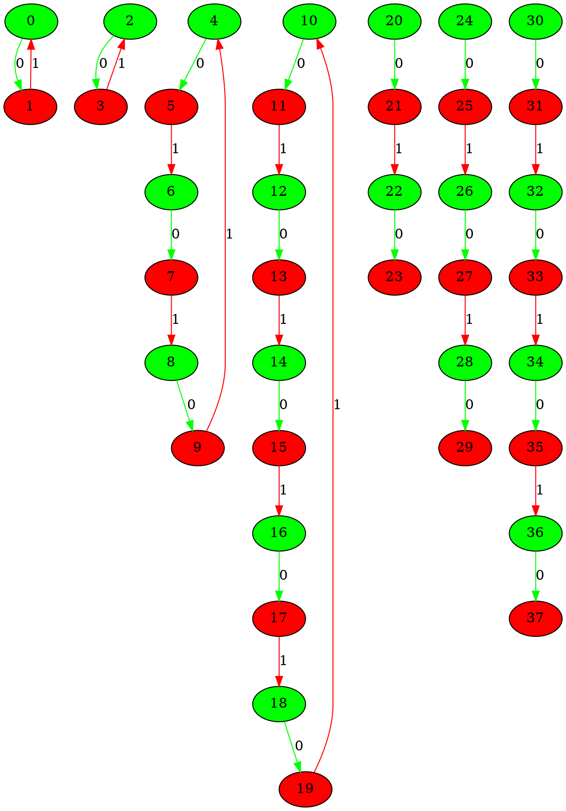
```graphviz
digraph G {
0[label="0" fillcolor="green" style="filled"];
1[label="1" fillcolor="red" style="filled"];
2[label="2" fillcolor="green" style="filled"];
3[label="3" fillcolor="red" style="filled"];
4[label="4" fillcolor="green" style="filled"];
5[label="5" fillcolor="red" style="filled"];
6[label="6" fillcolor="green" style="filled"];
7[label="7" fillcolor="red" style="filled"];
8[label="8" fillcolor="green" style="filled"];
9[label="9" fillcolor="red" style="filled"];
10[label="10" fillcolor="green" style="filled"];
11[label="11" fillcolor="red" style="filled"];
12[label="12" fillcolor="green" style="filled"];
13[label="13" fillcolor="red" style="filled"];
14[label="14" fillcolor="green" style="filled"];
15[label="15" fillcolor="red" style="filled"];
16[label="16" fillcolor="green" style="filled"];
17[label="17" fillcolor="red" style="filled"];
18[label="18" fillcolor="green" style="filled"];
19[label="19" fillcolor="red" style="filled"];
20[label="20" fillcolor="green" style="filled"];
21[label="21" fillcolor="red" style="filled"];
22[label="22" fillcolor="green" style="filled"];
23[label="23" fillcolor="red" style="filled"];
24[label="24" fillcolor="green" style="filled"];
25[label="25" fillcolor="red" style="filled"];
26[label="26" fillcolor="green" style="filled"];
27[label="27" fillcolor="red" style="filled"];
28[label="28" fillcolor="green" style="filled"];
29[label="29" fillcolor="red" style="filled"];
30[label="30" fillcolor="green" style="filled"];
31[label="31" fillcolor="red" style="filled"];
32[label="32" fillcolor="green" style="filled"];
33[label="33" fillcolor="red" style="filled"];
34[label="34" fillcolor="green" style="filled"];
35[label="35" fillcolor="red" style="filled"];
36[label="36" fillcolor="green" style="filled"];
37[label="37" fillcolor="red" style="filled"];
0->1 [label="0" color="green"];
2->3 [label="0" color="green"];
4->5 [label="0" color="green"];
6->7 [label="0" color="green"];
8->9 [label="0" color="green"];
10->11 [label="0" color="green"];
12->13 [label="0" color="green"];
14->15 [label="0" color="green"];
16->17 [label="0" color="green"];
18->19 [label="0" color="green"];
20->21 [label="0" color="green"];
22->23 [label="0" color="green"];
24->25 [label="0" color="green"];
26->27 [label="0" color="green"];
28->29 [label="0" color="green"];
30->31 [label="0" color="green"];
32->33 [label="0" color="green"];
34->35 [label="0" color="green"];
36->37 [label="0" color="green"];
1->0 [label="1" color="red"];
3->2 [label="1" color="red"];
5->6 [label="1" color="red"];
7->8 [label="1" color="red"];
9->4 [label="1" color="red"];
11->12 [label="1" color="red"];
13->14 [label="1" color="red"];
15->16 [label="1" color="red"];
17->18 [label="1" color="red"];
19->10 [label="1" color="red"];
21->22 [label="1" color="red"];
25->26 [label="1" color="red"];
27->28 [label="1" color="red"];
31->32 [label="1" color="red"];
33->34 [label="1" color="red"];
35->36 [label="1" color="red"];
}
```
___
## Graph 12716 - list de compréhension : 1,1,4|2,3,3,5
___
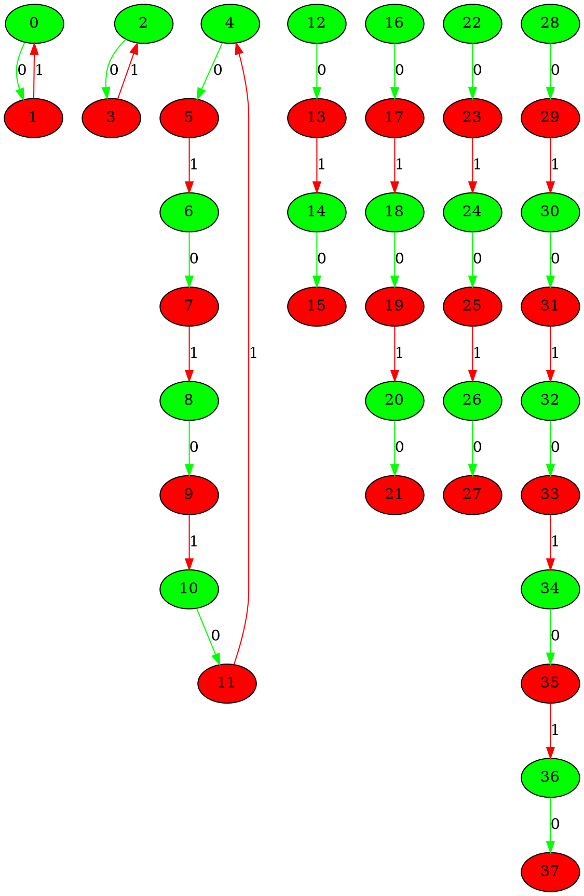
```graphviz
digraph G {
0[label="0" fillcolor="green" style="filled"];
1[label="1" fillcolor="red" style="filled"];
2[label="2" fillcolor="green" style="filled"];
3[label="3" fillcolor="red" style="filled"];
4[label="4" fillcolor="green" style="filled"];
5[label="5" fillcolor="red" style="filled"];
6[label="6" fillcolor="green" style="filled"];
7[label="7" fillcolor="red" style="filled"];
8[label="8" fillcolor="green" style="filled"];
9[label="9" fillcolor="red" style="filled"];
10[label="10" fillcolor="green" style="filled"];
11[label="11" fillcolor="red" style="filled"];
12[label="12" fillcolor="green" style="filled"];
13[label="13" fillcolor="red" style="filled"];
14[label="14" fillcolor="green" style="filled"];
15[label="15" fillcolor="red" style="filled"];
16[label="16" fillcolor="green" style="filled"];
17[label="17" fillcolor="red" style="filled"];
18[label="18" fillcolor="green" style="filled"];
19[label="19" fillcolor="red" style="filled"];
20[label="20" fillcolor="green" style="filled"];
21[label="21" fillcolor="red" style="filled"];
22[label="22" fillcolor="green" style="filled"];
23[label="23" fillcolor="red" style="filled"];
24[label="24" fillcolor="green" style="filled"];
25[label="25" fillcolor="red" style="filled"];
26[label="26" fillcolor="green" style="filled"];
27[label="27" fillcolor="red" style="filled"];
28[label="28" fillcolor="green" style="filled"];
29[label="29" fillcolor="red" style="filled"];
30[label="30" fillcolor="green" style="filled"];
31[label="31" fillcolor="red" style="filled"];
32[label="32" fillcolor="green" style="filled"];
33[label="33" fillcolor="red" style="filled"];
34[label="34" fillcolor="green" style="filled"];
35[label="35" fillcolor="red" style="filled"];
36[label="36" fillcolor="green" style="filled"];
37[label="37" fillcolor="red" style="filled"];
0->1 [label="0" color="green"];
2->3 [label="0" color="green"];
4->5 [label="0" color="green"];
6->7 [label="0" color="green"];
8->9 [label="0" color="green"];
10->11 [label="0" color="green"];
12->13 [label="0" color="green"];
14->15 [label="0" color="green"];
16->17 [label="0" color="green"];
18->19 [label="0" color="green"];
20->21 [label="0" color="green"];
22->23 [label="0" color="green"];
24->25 [label="0" color="green"];
26->27 [label="0" color="green"];
28->29 [label="0" color="green"];
30->31 [label="0" color="green"];
32->33 [label="0" color="green"];
34->35 [label="0" color="green"];
36->37 [label="0" color="green"];
1->0 [label="1" color="red"];
3->2 [label="1" color="red"];
5->6 [label="1" color="red"];
7->8 [label="1" color="red"];
9->10 [label="1" color="red"];
11->4 [label="1" color="red"];
13->14 [label="1" color="red"];
17->18 [label="1" color="red"];
19->20 [label="1" color="red"];
23->24 [label="1" color="red"];
25->26 [label="1" color="red"];
29->30 [label="1" color="red"];
31->32 [label="1" color="red"];
33->34 [label="1" color="red"];
35->36 [label="1" color="red"];
}
```
___
## Graph 12717 - list de compréhension : 1,1,4,5|2,3,3
___
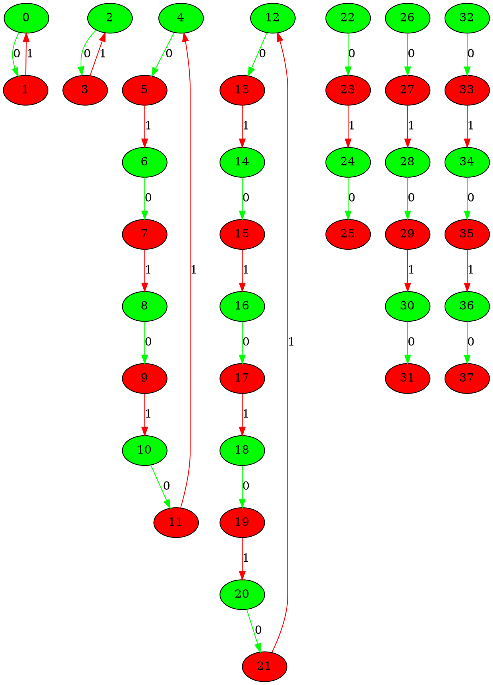
```graphviz
digraph G {
0[label="0" fillcolor="green" style="filled"];
1[label="1" fillcolor="red" style="filled"];
2[label="2" fillcolor="green" style="filled"];
3[label="3" fillcolor="red" style="filled"];
4[label="4" fillcolor="green" style="filled"];
5[label="5" fillcolor="red" style="filled"];
6[label="6" fillcolor="green" style="filled"];
7[label="7" fillcolor="red" style="filled"];
8[label="8" fillcolor="green" style="filled"];
9[label="9" fillcolor="red" style="filled"];
10[label="10" fillcolor="green" style="filled"];
11[label="11" fillcolor="red" style="filled"];
12[label="12" fillcolor="green" style="filled"];
13[label="13" fillcolor="red" style="filled"];
14[label="14" fillcolor="green" style="filled"];
15[label="15" fillcolor="red" style="filled"];
16[label="16" fillcolor="green" style="filled"];
17[label="17" fillcolor="red" style="filled"];
18[label="18" fillcolor="green" style="filled"];
19[label="19" fillcolor="red" style="filled"];
20[label="20" fillcolor="green" style="filled"];
21[label="21" fillcolor="red" style="filled"];
22[label="22" fillcolor="green" style="filled"];
23[label="23" fillcolor="red" style="filled"];
24[label="24" fillcolor="green" style="filled"];
25[label="25" fillcolor="red" style="filled"];
26[label="26" fillcolor="green" style="filled"];
27[label="27" fillcolor="red" style="filled"];
28[label="28" fillcolor="green" style="filled"];
29[label="29" fillcolor="red" style="filled"];
30[label="30" fillcolor="green" style="filled"];
31[label="31" fillcolor="red" style="filled"];
32[label="32" fillcolor="green" style="filled"];
33[label="33" fillcolor="red" style="filled"];
34[label="34" fillcolor="green" style="filled"];
35[label="35" fillcolor="red" style="filled"];
36[label="36" fillcolor="green" style="filled"];
37[label="37" fillcolor="red" style="filled"];
0->1 [label="0" color="green"];
2->3 [label="0" color="green"];
4->5 [label="0" color="green"];
6->7 [label="0" color="green"];
8->9 [label="0" color="green"];
10->11 [label="0" color="green"];
12->13 [label="0" color="green"];
14->15 [label="0" color="green"];
16->17 [label="0" color="green"];
18->19 [label="0" color="green"];
20->21 [label="0" color="green"];
22->23 [label="0" color="green"];
24->25 [label="0" color="green"];
26->27 [label="0" color="green"];
28->29 [label="0" color="green"];
30->31 [label="0" color="green"];
32->33 [label="0" color="green"];
34->35 [label="0" color="green"];
36->37 [label="0" color="green"];
1->0 [label="1" color="red"];
3->2 [label="1" color="red"];
5->6 [label="1" color="red"];
7->8 [label="1" color="red"];
9->10 [label="1" color="red"];
11->4 [label="1" color="red"];
13->14 [label="1" color="red"];
15->16 [label="1" color="red"];
17->18 [label="1" color="red"];
19->20 [label="1" color="red"];
21->12 [label="1" color="red"];
23->24 [label="1" color="red"];
27->28 [label="1" color="red"];
29->30 [label="1" color="red"];
33->34 [label="1" color="red"];
35->36 [label="1" color="red"];
}
```
___
## Graph 12718 - list de compréhension : 1,1,5|2,3,3,4
___
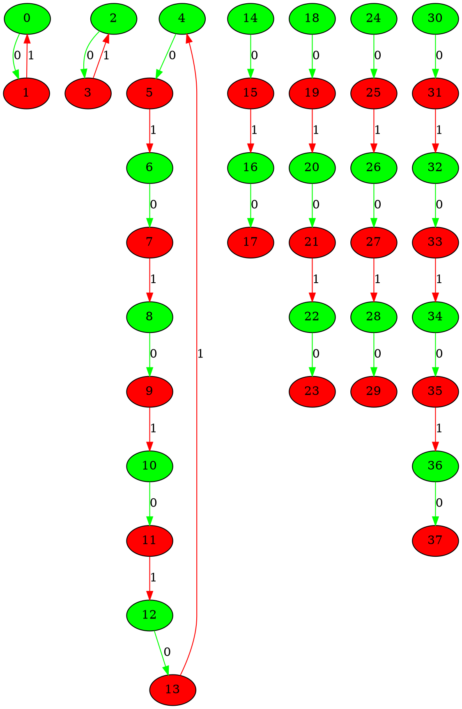
```graphviz
digraph G {
0[label="0" fillcolor="green" style="filled"];
1[label="1" fillcolor="red" style="filled"];
2[label="2" fillcolor="green" style="filled"];
3[label="3" fillcolor="red" style="filled"];
4[label="4" fillcolor="green" style="filled"];
5[label="5" fillcolor="red" style="filled"];
6[label="6" fillcolor="green" style="filled"];
7[label="7" fillcolor="red" style="filled"];
8[label="8" fillcolor="green" style="filled"];
9[label="9" fillcolor="red" style="filled"];
10[label="10" fillcolor="green" style="filled"];
11[label="11" fillcolor="red" style="filled"];
12[label="12" fillcolor="green" style="filled"];
13[label="13" fillcolor="red" style="filled"];
14[label="14" fillcolor="green" style="filled"];
15[label="15" fillcolor="red" style="filled"];
16[label="16" fillcolor="green" style="filled"];
17[label="17" fillcolor="red" style="filled"];
18[label="18" fillcolor="green" style="filled"];
19[label="19" fillcolor="red" style="filled"];
20[label="20" fillcolor="green" style="filled"];
21[label="21" fillcolor="red" style="filled"];
22[label="22" fillcolor="green" style="filled"];
23[label="23" fillcolor="red" style="filled"];
24[label="24" fillcolor="green" style="filled"];
25[label="25" fillcolor="red" style="filled"];
26[label="26" fillcolor="green" style="filled"];
27[label="27" fillcolor="red" style="filled"];
28[label="28" fillcolor="green" style="filled"];
29[label="29" fillcolor="red" style="filled"];
30[label="30" fillcolor="green" style="filled"];
31[label="31" fillcolor="red" style="filled"];
32[label="32" fillcolor="green" style="filled"];
33[label="33" fillcolor="red" style="filled"];
34[label="34" fillcolor="green" style="filled"];
35[label="35" fillcolor="red" style="filled"];
36[label="36" fillcolor="green" style="filled"];
37[label="37" fillcolor="red" style="filled"];
0->1 [label="0" color="green"];
2->3 [label="0" color="green"];
4->5 [label="0" color="green"];
6->7 [label="0" color="green"];
8->9 [label="0" color="green"];
10->11 [label="0" color="green"];
12->13 [label="0" color="green"];
14->15 [label="0" color="green"];
16->17 [label="0" color="green"];
18->19 [label="0" color="green"];
20->21 [label="0" color="green"];
22->23 [label="0" color="green"];
24->25 [label="0" color="green"];
26->27 [label="0" color="green"];
28->29 [label="0" color="green"];
30->31 [label="0" color="green"];
32->33 [label="0" color="green"];
34->35 [label="0" color="green"];
36->37 [label="0" color="green"];
1->0 [label="1" color="red"];
3->2 [label="1" color="red"];
5->6 [label="1" color="red"];
7->8 [label="1" color="red"];
9->10 [label="1" color="red"];
11->12 [label="1" color="red"];
13->4 [label="1" color="red"];
15->16 [label="1" color="red"];
19->20 [label="1" color="red"];
21->22 [label="1" color="red"];
25->26 [label="1" color="red"];
27->28 [label="1" color="red"];
31->32 [label="1" color="red"];
33->34 [label="1" color="red"];
35->36 [label="1" color="red"];
}
```
___
## Graph 12719 - list de compréhension : 1,2|1,3,3,4,5
___
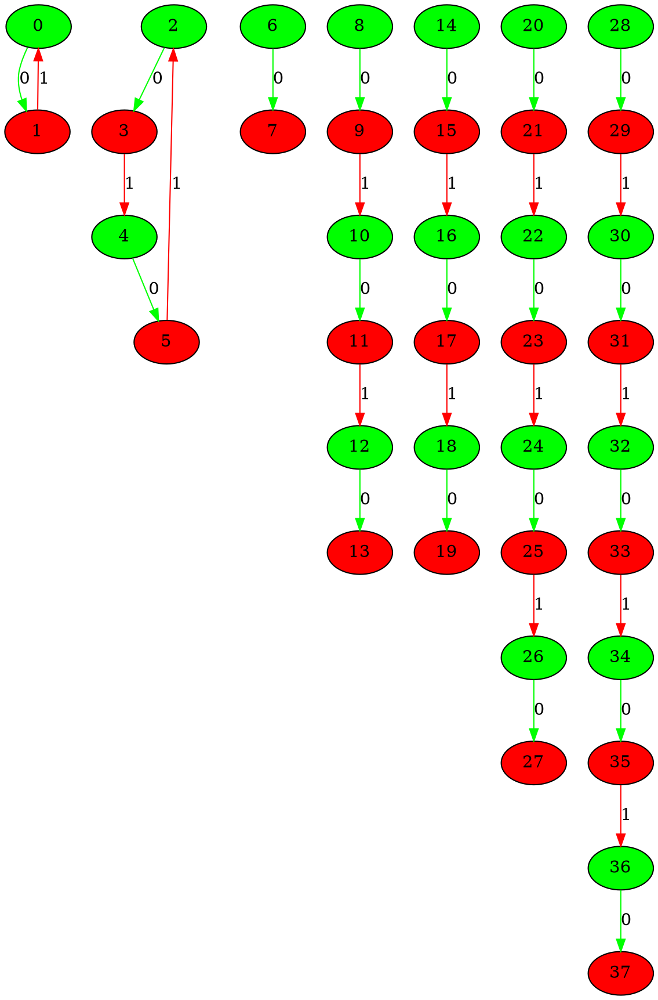
```graphviz
digraph G {
0[label="0" fillcolor="green" style="filled"];
1[label="1" fillcolor="red" style="filled"];
2[label="2" fillcolor="green" style="filled"];
3[label="3" fillcolor="red" style="filled"];
4[label="4" fillcolor="green" style="filled"];
5[label="5" fillcolor="red" style="filled"];
6[label="6" fillcolor="green" style="filled"];
7[label="7" fillcolor="red" style="filled"];
8[label="8" fillcolor="green" style="filled"];
9[label="9" fillcolor="red" style="filled"];
10[label="10" fillcolor="green" style="filled"];
11[label="11" fillcolor="red" style="filled"];
12[label="12" fillcolor="green" style="filled"];
13[label="13" fillcolor="red" style="filled"];
14[label="14" fillcolor="green" style="filled"];
15[label="15" fillcolor="red" style="filled"];
16[label="16" fillcolor="green" style="filled"];
17[label="17" fillcolor="red" style="filled"];
18[label="18" fillcolor="green" style="filled"];
19[label="19" fillcolor="red" style="filled"];
20[label="20" fillcolor="green" style="filled"];
21[label="21" fillcolor="red" style="filled"];
22[label="22" fillcolor="green" style="filled"];
23[label="23" fillcolor="red" style="filled"];
24[label="24" fillcolor="green" style="filled"];
25[label="25" fillcolor="red" style="filled"];
26[label="26" fillcolor="green" style="filled"];
27[label="27" fillcolor="red" style="filled"];
28[label="28" fillcolor="green" style="filled"];
29[label="29" fillcolor="red" style="filled"];
30[label="30" fillcolor="green" style="filled"];
31[label="31" fillcolor="red" style="filled"];
32[label="32" fillcolor="green" style="filled"];
33[label="33" fillcolor="red" style="filled"];
34[label="34" fillcolor="green" style="filled"];
35[label="35" fillcolor="red" style="filled"];
36[label="36" fillcolor="green" style="filled"];
37[label="37" fillcolor="red" style="filled"];
0->1 [label="0" color="green"];
2->3 [label="0" color="green"];
4->5 [label="0" color="green"];
6->7 [label="0" color="green"];
8->9 [label="0" color="green"];
10->11 [label="0" color="green"];
12->13 [label="0" color="green"];
14->15 [label="0" color="green"];
16->17 [label="0" color="green"];
18->19 [label="0" color="green"];
20->21 [label="0" color="green"];
22->23 [label="0" color="green"];
24->25 [label="0" color="green"];
26->27 [label="0" color="green"];
28->29 [label="0" color="green"];
30->31 [label="0" color="green"];
32->33 [label="0" color="green"];
34->35 [label="0" color="green"];
36->37 [label="0" color="green"];
1->0 [label="1" color="red"];
3->4 [label="1" color="red"];
5->2 [label="1" color="red"];
9->10 [label="1" color="red"];
11->12 [label="1" color="red"];
15->16 [label="1" color="red"];
17->18 [label="1" color="red"];
21->22 [label="1" color="red"];
23->24 [label="1" color="red"];
25->26 [label="1" color="red"];
29->30 [label="1" color="red"];
31->32 [label="1" color="red"];
33->34 [label="1" color="red"];
35->36 [label="1" color="red"];
}
```
___
## Graph 12720 - list de compréhension : 1,2,3|1,3,4,5
___
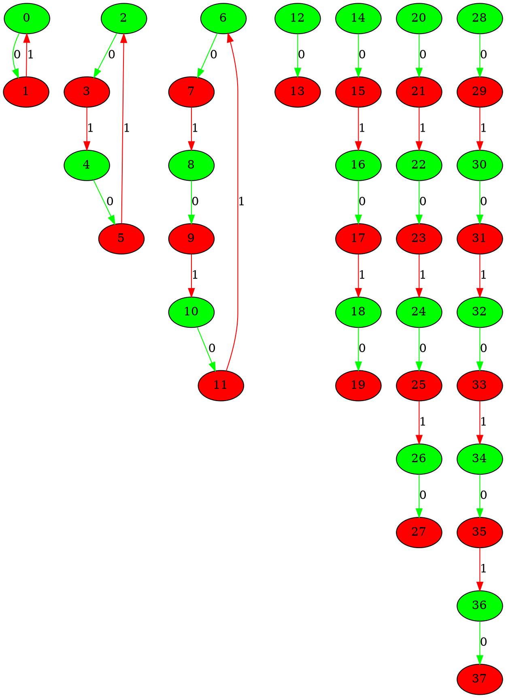
```graphviz
digraph G {
0[label="0" fillcolor="green" style="filled"];
1[label="1" fillcolor="red" style="filled"];
2[label="2" fillcolor="green" style="filled"];
3[label="3" fillcolor="red" style="filled"];
4[label="4" fillcolor="green" style="filled"];
5[label="5" fillcolor="red" style="filled"];
6[label="6" fillcolor="green" style="filled"];
7[label="7" fillcolor="red" style="filled"];
8[label="8" fillcolor="green" style="filled"];
9[label="9" fillcolor="red" style="filled"];
10[label="10" fillcolor="green" style="filled"];
11[label="11" fillcolor="red" style="filled"];
12[label="12" fillcolor="green" style="filled"];
13[label="13" fillcolor="red" style="filled"];
14[label="14" fillcolor="green" style="filled"];
15[label="15" fillcolor="red" style="filled"];
16[label="16" fillcolor="green" style="filled"];
17[label="17" fillcolor="red" style="filled"];
18[label="18" fillcolor="green" style="filled"];
19[label="19" fillcolor="red" style="filled"];
20[label="20" fillcolor="green" style="filled"];
21[label="21" fillcolor="red" style="filled"];
22[label="22" fillcolor="green" style="filled"];
23[label="23" fillcolor="red" style="filled"];
24[label="24" fillcolor="green" style="filled"];
25[label="25" fillcolor="red" style="filled"];
26[label="26" fillcolor="green" style="filled"];
27[label="27" fillcolor="red" style="filled"];
28[label="28" fillcolor="green" style="filled"];
29[label="29" fillcolor="red" style="filled"];
30[label="30" fillcolor="green" style="filled"];
31[label="31" fillcolor="red" style="filled"];
32[label="32" fillcolor="green" style="filled"];
33[label="33" fillcolor="red" style="filled"];
34[label="34" fillcolor="green" style="filled"];
35[label="35" fillcolor="red" style="filled"];
36[label="36" fillcolor="green" style="filled"];
37[label="37" fillcolor="red" style="filled"];
0->1 [label="0" color="green"];
2->3 [label="0" color="green"];
4->5 [label="0" color="green"];
6->7 [label="0" color="green"];
8->9 [label="0" color="green"];
10->11 [label="0" color="green"];
12->13 [label="0" color="green"];
14->15 [label="0" color="green"];
16->17 [label="0" color="green"];
18->19 [label="0" color="green"];
20->21 [label="0" color="green"];
22->23 [label="0" color="green"];
24->25 [label="0" color="green"];
26->27 [label="0" color="green"];
28->29 [label="0" color="green"];
30->31 [label="0" color="green"];
32->33 [label="0" color="green"];
34->35 [label="0" color="green"];
36->37 [label="0" color="green"];
1->0 [label="1" color="red"];
3->4 [label="1" color="red"];
5->2 [label="1" color="red"];
7->8 [label="1" color="red"];
9->10 [label="1" color="red"];
11->6 [label="1" color="red"];
15->16 [label="1" color="red"];
17->18 [label="1" color="red"];
21->22 [label="1" color="red"];
23->24 [label="1" color="red"];
25->26 [label="1" color="red"];
29->30 [label="1" color="red"];
31->32 [label="1" color="red"];
33->34 [label="1" color="red"];
35->36 [label="1" color="red"];
}
```
___
## Graph 12721 - list de compréhension : 1,2,3,3|1,4,5
___
```graphviz
digraph G {
0[label="0" fillcolor="green" style="filled"];
1[label="1" fillcolor="red" style="filled"];
2[label="2" fillcolor="green" style="filled"];
3[label="3" fillcolor="red" style="filled"];
4[label="4" fillcolor="green" style="filled"];
5[label="5" fillcolor="red" style="filled"];
6[label="6" fillcolor="green" style="filled"];
7[label="7" fillcolor="red" style="filled"];
8[label="8" fillcolor="green" style="filled"];
9[label="9" fillcolor="red" style="filled"];
10[label="10" fillcolor="green" style="filled"];
11[label="11" fillcolor="red" style="filled"];
12[label="12" fillcolor="green" style="filled"];
13[label="13" fillcolor="red" style="filled"];
14[label="14" fillcolor="green" style="filled"];
15[label="15" fillcolor="red" style="filled"];
16[label="16" fillcolor="green" style="filled"];
17[label="17" fillcolor="red" style="filled"];
18[label="18" fillcolor="green" style="filled"];
19[label="19" fillcolor="red" style="filled"];
20[label="20" fillcolor="green" style="filled"];
21[label="21" fillcolor="red" style="filled"];
22[label="22" fillcolor="green" style="filled"];
23[label="23" fillcolor="red" style="filled"];
24[label="24" fillcolor="green" style="filled"];
25[label="25" fillcolor="red" style="filled"];
26[label="26" fillcolor="green" style="filled"];
27[label="27" fillcolor="red" style="filled"];
28[label="28" fillcolor="green" style="filled"];
29[label="29" fillcolor="red" style="filled"];
30[label="30" fillcolor="green" style="filled"];
31[label="31" fillcolor="red" style="filled"];
32[label="32" fillcolor="green" style="filled"];
33[label="33" fillcolor="red" style="filled"];
34[label="34" fillcolor="green" style="filled"];
35[label="35" fillcolor="red" style="filled"];
36[label="36" fillcolor="green" style="filled"];
37[label="37" fillcolor="red" style="filled"];
0->1 [label="0" color="green"];
2->3 [label="0" color="green"];
4->5 [label="0" color="green"];
6->7 [label="0" color="green"];
8->9 [label="0" color="green"];
10->11 [label="0" color="green"];
12->13 [label="0" color="green"];
14->15 [label="0" color="green"];
16->17 [label="0" color="green"];
18->19 [label="0" color="green"];
20->21 [label="0" color="green"];
22->23 [label="0" color="green"];
24->25 [label="0" color="green"];
26->27 [label="0" color="green"];
28->29 [label="0" color="green"];
30->31 [label="0" color="green"];
32->33 [label="0" color="green"];
34->35 [label="0" color="green"];
36->37 [label="0" color="green"];
1->0 [label="1" color="red"];
3->4 [label="1" color="red"];
5->2 [label="1" color="red"];
7->8 [label="1" color="red"];
9->10 [label="1" color="red"];
11->6 [label="1" color="red"];
13->14 [label="1" color="red"];
15->16 [label="1" color="red"];
17->12 [label="1" color="red"];
21->22 [label="1" color="red"];
23->24 [label="1" color="red"];
25->26 [label="1" color="red"];
29->30 [label="1" color="red"];
31->32 [label="1" color="red"];
33->34 [label="1" color="red"];
35->36 [label="1" color="red"];
}
```
___
## Graph 12722 - list de compréhension : 1,2,3,3,4|1,5
___
```graphviz
digraph G {
0[label="0" fillcolor="green" style="filled"];
1[label="1" fillcolor="red" style="filled"];
2[label="2" fillcolor="green" style="filled"];
3[label="3" fillcolor="red" style="filled"];
4[label="4" fillcolor="green" style="filled"];
5[label="5" fillcolor="red" style="filled"];
6[label="6" fillcolor="green" style="filled"];
7[label="7" fillcolor="red" style="filled"];
8[label="8" fillcolor="green" style="filled"];
9[label="9" fillcolor="red" style="filled"];
10[label="10" fillcolor="green" style="filled"];
11[label="11" fillcolor="red" style="filled"];
12[label="12" fillcolor="green" style="filled"];
13[label="13" fillcolor="red" style="filled"];
14[label="14" fillcolor="green" style="filled"];
15[label="15" fillcolor="red" style="filled"];
16[label="16" fillcolor="green" style="filled"];
17[label="17" fillcolor="red" style="filled"];
18[label="18" fillcolor="green" style="filled"];
19[label="19" fillcolor="red" style="filled"];
20[label="20" fillcolor="green" style="filled"];
21[label="21" fillcolor="red" style="filled"];
22[label="22" fillcolor="green" style="filled"];
23[label="23" fillcolor="red" style="filled"];
24[label="24" fillcolor="green" style="filled"];
25[label="25" fillcolor="red" style="filled"];
26[label="26" fillcolor="green" style="filled"];
27[label="27" fillcolor="red" style="filled"];
28[label="28" fillcolor="green" style="filled"];
29[label="29" fillcolor="red" style="filled"];
30[label="30" fillcolor="green" style="filled"];
31[label="31" fillcolor="red" style="filled"];
32[label="32" fillcolor="green" style="filled"];
33[label="33" fillcolor="red" style="filled"];
34[label="34" fillcolor="green" style="filled"];
35[label="35" fillcolor="red" style="filled"];
36[label="36" fillcolor="green" style="filled"];
37[label="37" fillcolor="red" style="filled"];
0->1 [label="0" color="green"];
2->3 [label="0" color="green"];
4->5 [label="0" color="green"];
6->7 [label="0" color="green"];
8->9 [label="0" color="green"];
10->11 [label="0" color="green"];
12->13 [label="0" color="green"];
14->15 [label="0" color="green"];
16->17 [label="0" color="green"];
18->19 [label="0" color="green"];
20->21 [label="0" color="green"];
22->23 [label="0" color="green"];
24->25 [label="0" color="green"];
26->27 [label="0" color="green"];
28->29 [label="0" color="green"];
30->31 [label="0" color="green"];
32->33 [label="0" color="green"];
34->35 [label="0" color="green"];
36->37 [label="0" color="green"];
1->0 [label="1" color="red"];
3->4 [label="1" color="red"];
5->2 [label="1" color="red"];
7->8 [label="1" color="red"];
9->10 [label="1" color="red"];
11->6 [label="1" color="red"];
13->14 [label="1" color="red"];
15->16 [label="1" color="red"];
17->12 [label="1" color="red"];
19->20 [label="1" color="red"];
21->22 [label="1" color="red"];
23->24 [label="1" color="red"];
25->18 [label="1" color="red"];
29->30 [label="1" color="red"];
31->32 [label="1" color="red"];
33->34 [label="1" color="red"];
35->36 [label="1" color="red"];
}
```
___
## Graph 12723 - list de compréhension : 1,2,3,3,4,5|1
___
```graphviz
digraph G {
0[label="0" fillcolor="green" style="filled"];
1[label="1" fillcolor="red" style="filled"];
2[label="2" fillcolor="green" style="filled"];
3[label="3" fillcolor="red" style="filled"];
4[label="4" fillcolor="green" style="filled"];
5[label="5" fillcolor="red" style="filled"];
6[label="6" fillcolor="green" style="filled"];
7[label="7" fillcolor="red" style="filled"];
8[label="8" fillcolor="green" style="filled"];
9[label="9" fillcolor="red" style="filled"];
10[label="10" fillcolor="green" style="filled"];
11[label="11" fillcolor="red" style="filled"];
12[label="12" fillcolor="green" style="filled"];
13[label="13" fillcolor="red" style="filled"];
14[label="14" fillcolor="green" style="filled"];
15[label="15" fillcolor="red" style="filled"];
16[label="16" fillcolor="green" style="filled"];
17[label="17" fillcolor="red" style="filled"];
18[label="18" fillcolor="green" style="filled"];
19[label="19" fillcolor="red" style="filled"];
20[label="20" fillcolor="green" style="filled"];
21[label="21" fillcolor="red" style="filled"];
22[label="22" fillcolor="green" style="filled"];
23[label="23" fillcolor="red" style="filled"];
24[label="24" fillcolor="green" style="filled"];
25[label="25" fillcolor="red" style="filled"];
26[label="26" fillcolor="green" style="filled"];
27[label="27" fillcolor="red" style="filled"];
28[label="28" fillcolor="green" style="filled"];
29[label="29" fillcolor="red" style="filled"];
30[label="30" fillcolor="green" style="filled"];
31[label="31" fillcolor="red" style="filled"];
32[label="32" fillcolor="green" style="filled"];
33[label="33" fillcolor="red" style="filled"];
34[label="34" fillcolor="green" style="filled"];
35[label="35" fillcolor="red" style="filled"];
36[label="36" fillcolor="green" style="filled"];
37[label="37" fillcolor="red" style="filled"];
0->1 [label="0" color="green"];
2->3 [label="0" color="green"];
4->5 [label="0" color="green"];
6->7 [label="0" color="green"];
8->9 [label="0" color="green"];
10->11 [label="0" color="green"];
12->13 [label="0" color="green"];
14->15 [label="0" color="green"];
16->17 [label="0" color="green"];
18->19 [label="0" color="green"];
20->21 [label="0" color="green"];
22->23 [label="0" color="green"];
24->25 [label="0" color="green"];
26->27 [label="0" color="green"];
28->29 [label="0" color="green"];
30->31 [label="0" color="green"];
32->33 [label="0" color="green"];
34->35 [label="0" color="green"];
36->37 [label="0" color="green"];
1->0 [label="1" color="red"];
3->4 [label="1" color="red"];
5->2 [label="1" color="red"];
7->8 [label="1" color="red"];
9->10 [label="1" color="red"];
11->6 [label="1" color="red"];
13->14 [label="1" color="red"];
15->16 [label="1" color="red"];
17->12 [label="1" color="red"];
19->20 [label="1" color="red"];
21->22 [label="1" color="red"];
23->24 [label="1" color="red"];
25->18 [label="1" color="red"];
27->28 [label="1" color="red"];
29->30 [label="1" color="red"];
31->32 [label="1" color="red"];
33->34 [label="1" color="red"];
35->26 [label="1" color="red"];
}
```
___
## Graph 12724 - list de compréhension : 1,2,3,3,5|1,4
___
```graphviz
digraph G {
0[label="0" fillcolor="green" style="filled"];
1[label="1" fillcolor="red" style="filled"];
2[label="2" fillcolor="green" style="filled"];
3[label="3" fillcolor="red" style="filled"];
4[label="4" fillcolor="green" style="filled"];
5[label="5" fillcolor="red" style="filled"];
6[label="6" fillcolor="green" style="filled"];
7[label="7" fillcolor="red" style="filled"];
8[label="8" fillcolor="green" style="filled"];
9[label="9" fillcolor="red" style="filled"];
10[label="10" fillcolor="green" style="filled"];
11[label="11" fillcolor="red" style="filled"];
12[label="12" fillcolor="green" style="filled"];
13[label="13" fillcolor="red" style="filled"];
14[label="14" fillcolor="green" style="filled"];
15[label="15" fillcolor="red" style="filled"];
16[label="16" fillcolor="green" style="filled"];
17[label="17" fillcolor="red" style="filled"];
18[label="18" fillcolor="green" style="filled"];
19[label="19" fillcolor="red" style="filled"];
20[label="20" fillcolor="green" style="filled"];
21[label="21" fillcolor="red" style="filled"];
22[label="22" fillcolor="green" style="filled"];
23[label="23" fillcolor="red" style="filled"];
24[label="24" fillcolor="green" style="filled"];
25[label="25" fillcolor="red" style="filled"];
26[label="26" fillcolor="green" style="filled"];
27[label="27" fillcolor="red" style="filled"];
28[label="28" fillcolor="green" style="filled"];
29[label="29" fillcolor="red" style="filled"];
30[label="30" fillcolor="green" style="filled"];
31[label="31" fillcolor="red" style="filled"];
32[label="32" fillcolor="green" style="filled"];
33[label="33" fillcolor="red" style="filled"];
34[label="34" fillcolor="green" style="filled"];
35[label="35" fillcolor="red" style="filled"];
36[label="36" fillcolor="green" style="filled"];
37[label="37" fillcolor="red" style="filled"];
0->1 [label="0" color="green"];
2->3 [label="0" color="green"];
4->5 [label="0" color="green"];
6->7 [label="0" color="green"];
8->9 [label="0" color="green"];
10->11 [label="0" color="green"];
12->13 [label="0" color="green"];
14->15 [label="0" color="green"];
16->17 [label="0" color="green"];
18->19 [label="0" color="green"];
20->21 [label="0" color="green"];
22->23 [label="0" color="green"];
24->25 [label="0" color="green"];
26->27 [label="0" color="green"];
28->29 [label="0" color="green"];
30->31 [label="0" color="green"];
32->33 [label="0" color="green"];
34->35 [label="0" color="green"];
36->37 [label="0" color="green"];
1->0 [label="1" color="red"];
3->4 [label="1" color="red"];
5->2 [label="1" color="red"];
7->8 [label="1" color="red"];
9->10 [label="1" color="red"];
11->6 [label="1" color="red"];
13->14 [label="1" color="red"];
15->16 [label="1" color="red"];
17->12 [label="1" color="red"];
19->20 [label="1" color="red"];
21->22 [label="1" color="red"];
23->24 [label="1" color="red"];
25->26 [label="1" color="red"];
27->18 [label="1" color="red"];
31->32 [label="1" color="red"];
33->34 [label="1" color="red"];
35->36 [label="1" color="red"];
}
```
___
## Graph 12725 - list de compréhension : 1,2,3,4|1,3,5
___
```graphviz
digraph G {
0[label="0" fillcolor="green" style="filled"];
1[label="1" fillcolor="red" style="filled"];
2[label="2" fillcolor="green" style="filled"];
3[label="3" fillcolor="red" style="filled"];
4[label="4" fillcolor="green" style="filled"];
5[label="5" fillcolor="red" style="filled"];
6[label="6" fillcolor="green" style="filled"];
7[label="7" fillcolor="red" style="filled"];
8[label="8" fillcolor="green" style="filled"];
9[label="9" fillcolor="red" style="filled"];
10[label="10" fillcolor="green" style="filled"];
11[label="11" fillcolor="red" style="filled"];
12[label="12" fillcolor="green" style="filled"];
13[label="13" fillcolor="red" style="filled"];
14[label="14" fillcolor="green" style="filled"];
15[label="15" fillcolor="red" style="filled"];
16[label="16" fillcolor="green" style="filled"];
17[label="17" fillcolor="red" style="filled"];
18[label="18" fillcolor="green" style="filled"];
19[label="19" fillcolor="red" style="filled"];
20[label="20" fillcolor="green" style="filled"];
21[label="21" fillcolor="red" style="filled"];
22[label="22" fillcolor="green" style="filled"];
23[label="23" fillcolor="red" style="filled"];
24[label="24" fillcolor="green" style="filled"];
25[label="25" fillcolor="red" style="filled"];
26[label="26" fillcolor="green" style="filled"];
27[label="27" fillcolor="red" style="filled"];
28[label="28" fillcolor="green" style="filled"];
29[label="29" fillcolor="red" style="filled"];
30[label="30" fillcolor="green" style="filled"];
31[label="31" fillcolor="red" style="filled"];
32[label="32" fillcolor="green" style="filled"];
33[label="33" fillcolor="red" style="filled"];
34[label="34" fillcolor="green" style="filled"];
35[label="35" fillcolor="red" style="filled"];
36[label="36" fillcolor="green" style="filled"];
37[label="37" fillcolor="red" style="filled"];
0->1 [label="0" color="green"];
2->3 [label="0" color="green"];
4->5 [label="0" color="green"];
6->7 [label="0" color="green"];
8->9 [label="0" color="green"];
10->11 [label="0" color="green"];
12->13 [label="0" color="green"];
14->15 [label="0" color="green"];
16->17 [label="0" color="green"];
18->19 [label="0" color="green"];
20->21 [label="0" color="green"];
22->23 [label="0" color="green"];
24->25 [label="0" color="green"];
26->27 [label="0" color="green"];
28->29 [label="0" color="green"];
30->31 [label="0" color="green"];
32->33 [label="0" color="green"];
34->35 [label="0" color="green"];
36->37 [label="0" color="green"];
1->0 [label="1" color="red"];
3->4 [label="1" color="red"];
5->2 [label="1" color="red"];
7->8 [label="1" color="red"];
9->10 [label="1" color="red"];
11->6 [label="1" color="red"];
13->14 [label="1" color="red"];
15->16 [label="1" color="red"];
17->18 [label="1" color="red"];
19->12 [label="1" color="red"];
23->24 [label="1" color="red"];
25->26 [label="1" color="red"];
29->30 [label="1" color="red"];
31->32 [label="1" color="red"];
33->34 [label="1" color="red"];
35->36 [label="1" color="red"];
}
```
___
## Graph 12726 - list de compréhension : 1,2,3,4,5|1,3
___
```graphviz
digraph G {
0[label="0" fillcolor="green" style="filled"];
1[label="1" fillcolor="red" style="filled"];
2[label="2" fillcolor="green" style="filled"];
3[label="3" fillcolor="red" style="filled"];
4[label="4" fillcolor="green" style="filled"];
5[label="5" fillcolor="red" style="filled"];
6[label="6" fillcolor="green" style="filled"];
7[label="7" fillcolor="red" style="filled"];
8[label="8" fillcolor="green" style="filled"];
9[label="9" fillcolor="red" style="filled"];
10[label="10" fillcolor="green" style="filled"];
11[label="11" fillcolor="red" style="filled"];
12[label="12" fillcolor="green" style="filled"];
13[label="13" fillcolor="red" style="filled"];
14[label="14" fillcolor="green" style="filled"];
15[label="15" fillcolor="red" style="filled"];
16[label="16" fillcolor="green" style="filled"];
17[label="17" fillcolor="red" style="filled"];
18[label="18" fillcolor="green" style="filled"];
19[label="19" fillcolor="red" style="filled"];
20[label="20" fillcolor="green" style="filled"];
21[label="21" fillcolor="red" style="filled"];
22[label="22" fillcolor="green" style="filled"];
23[label="23" fillcolor="red" style="filled"];
24[label="24" fillcolor="green" style="filled"];
25[label="25" fillcolor="red" style="filled"];
26[label="26" fillcolor="green" style="filled"];
27[label="27" fillcolor="red" style="filled"];
28[label="28" fillcolor="green" style="filled"];
29[label="29" fillcolor="red" style="filled"];
30[label="30" fillcolor="green" style="filled"];
31[label="31" fillcolor="red" style="filled"];
32[label="32" fillcolor="green" style="filled"];
33[label="33" fillcolor="red" style="filled"];
34[label="34" fillcolor="green" style="filled"];
35[label="35" fillcolor="red" style="filled"];
36[label="36" fillcolor="green" style="filled"];
37[label="37" fillcolor="red" style="filled"];
0->1 [label="0" color="green"];
2->3 [label="0" color="green"];
4->5 [label="0" color="green"];
6->7 [label="0" color="green"];
8->9 [label="0" color="green"];
10->11 [label="0" color="green"];
12->13 [label="0" color="green"];
14->15 [label="0" color="green"];
16->17 [label="0" color="green"];
18->19 [label="0" color="green"];
20->21 [label="0" color="green"];
22->23 [label="0" color="green"];
24->25 [label="0" color="green"];
26->27 [label="0" color="green"];
28->29 [label="0" color="green"];
30->31 [label="0" color="green"];
32->33 [label="0" color="green"];
34->35 [label="0" color="green"];
36->37 [label="0" color="green"];
1->0 [label="1" color="red"];
3->4 [label="1" color="red"];
5->2 [label="1" color="red"];
7->8 [label="1" color="red"];
9->10 [label="1" color="red"];
11->6 [label="1" color="red"];
13->14 [label="1" color="red"];
15->16 [label="1" color="red"];
17->18 [label="1" color="red"];
19->12 [label="1" color="red"];
21->22 [label="1" color="red"];
23->24 [label="1" color="red"];
25->26 [label="1" color="red"];
27->28 [label="1" color="red"];
29->20 [label="1" color="red"];
33->34 [label="1" color="red"];
35->36 [label="1" color="red"];
}
```
___
## Graph 12727 - list de compréhension : 1,2,3,5|1,3,4
___
```graphviz
digraph G {
0[label="0" fillcolor="green" style="filled"];
1[label="1" fillcolor="red" style="filled"];
2[label="2" fillcolor="green" style="filled"];
3[label="3" fillcolor="red" style="filled"];
4[label="4" fillcolor="green" style="filled"];
5[label="5" fillcolor="red" style="filled"];
6[label="6" fillcolor="green" style="filled"];
7[label="7" fillcolor="red" style="filled"];
8[label="8" fillcolor="green" style="filled"];
9[label="9" fillcolor="red" style="filled"];
10[label="10" fillcolor="green" style="filled"];
11[label="11" fillcolor="red" style="filled"];
12[label="12" fillcolor="green" style="filled"];
13[label="13" fillcolor="red" style="filled"];
14[label="14" fillcolor="green" style="filled"];
15[label="15" fillcolor="red" style="filled"];
16[label="16" fillcolor="green" style="filled"];
17[label="17" fillcolor="red" style="filled"];
18[label="18" fillcolor="green" style="filled"];
19[label="19" fillcolor="red" style="filled"];
20[label="20" fillcolor="green" style="filled"];
21[label="21" fillcolor="red" style="filled"];
22[label="22" fillcolor="green" style="filled"];
23[label="23" fillcolor="red" style="filled"];
24[label="24" fillcolor="green" style="filled"];
25[label="25" fillcolor="red" style="filled"];
26[label="26" fillcolor="green" style="filled"];
27[label="27" fillcolor="red" style="filled"];
28[label="28" fillcolor="green" style="filled"];
29[label="29" fillcolor="red" style="filled"];
30[label="30" fillcolor="green" style="filled"];
31[label="31" fillcolor="red" style="filled"];
32[label="32" fillcolor="green" style="filled"];
33[label="33" fillcolor="red" style="filled"];
34[label="34" fillcolor="green" style="filled"];
35[label="35" fillcolor="red" style="filled"];
36[label="36" fillcolor="green" style="filled"];
37[label="37" fillcolor="red" style="filled"];
0->1 [label="0" color="green"];
2->3 [label="0" color="green"];
4->5 [label="0" color="green"];
6->7 [label="0" color="green"];
8->9 [label="0" color="green"];
10->11 [label="0" color="green"];
12->13 [label="0" color="green"];
14->15 [label="0" color="green"];
16->17 [label="0" color="green"];
18->19 [label="0" color="green"];
20->21 [label="0" color="green"];
22->23 [label="0" color="green"];
24->25 [label="0" color="green"];
26->27 [label="0" color="green"];
28->29 [label="0" color="green"];
30->31 [label="0" color="green"];
32->33 [label="0" color="green"];
34->35 [label="0" color="green"];
36->37 [label="0" color="green"];
1->0 [label="1" color="red"];
3->4 [label="1" color="red"];
5->2 [label="1" color="red"];
7->8 [label="1" color="red"];
9->10 [label="1" color="red"];
11->6 [label="1" color="red"];
13->14 [label="1" color="red"];
15->16 [label="1" color="red"];
17->18 [label="1" color="red"];
19->20 [label="1" color="red"];
21->12 [label="1" color="red"];
25->26 [label="1" color="red"];
27->28 [label="1" color="red"];
31->32 [label="1" color="red"];
33->34 [label="1" color="red"];
35->36 [label="1" color="red"];
}
```
___
## Graph 12728 - list de compréhension : 1,2,4|1,3,3,5
___
```graphviz
digraph G {
0[label="0" fillcolor="green" style="filled"];
1[label="1" fillcolor="red" style="filled"];
2[label="2" fillcolor="green" style="filled"];
3[label="3" fillcolor="red" style="filled"];
4[label="4" fillcolor="green" style="filled"];
5[label="5" fillcolor="red" style="filled"];
6[label="6" fillcolor="green" style="filled"];
7[label="7" fillcolor="red" style="filled"];
8[label="8" fillcolor="green" style="filled"];
9[label="9" fillcolor="red" style="filled"];
10[label="10" fillcolor="green" style="filled"];
11[label="11" fillcolor="red" style="filled"];
12[label="12" fillcolor="green" style="filled"];
13[label="13" fillcolor="red" style="filled"];
14[label="14" fillcolor="green" style="filled"];
15[label="15" fillcolor="red" style="filled"];
16[label="16" fillcolor="green" style="filled"];
17[label="17" fillcolor="red" style="filled"];
18[label="18" fillcolor="green" style="filled"];
19[label="19" fillcolor="red" style="filled"];
20[label="20" fillcolor="green" style="filled"];
21[label="21" fillcolor="red" style="filled"];
22[label="22" fillcolor="green" style="filled"];
23[label="23" fillcolor="red" style="filled"];
24[label="24" fillcolor="green" style="filled"];
25[label="25" fillcolor="red" style="filled"];
26[label="26" fillcolor="green" style="filled"];
27[label="27" fillcolor="red" style="filled"];
28[label="28" fillcolor="green" style="filled"];
29[label="29" fillcolor="red" style="filled"];
30[label="30" fillcolor="green" style="filled"];
31[label="31" fillcolor="red" style="filled"];
32[label="32" fillcolor="green" style="filled"];
33[label="33" fillcolor="red" style="filled"];
34[label="34" fillcolor="green" style="filled"];
35[label="35" fillcolor="red" style="filled"];
36[label="36" fillcolor="green" style="filled"];
37[label="37" fillcolor="red" style="filled"];
0->1 [label="0" color="green"];
2->3 [label="0" color="green"];
4->5 [label="0" color="green"];
6->7 [label="0" color="green"];
8->9 [label="0" color="green"];
10->11 [label="0" color="green"];
12->13 [label="0" color="green"];
14->15 [label="0" color="green"];
16->17 [label="0" color="green"];
18->19 [label="0" color="green"];
20->21 [label="0" color="green"];
22->23 [label="0" color="green"];
24->25 [label="0" color="green"];
26->27 [label="0" color="green"];
28->29 [label="0" color="green"];
30->31 [label="0" color="green"];
32->33 [label="0" color="green"];
34->35 [label="0" color="green"];
36->37 [label="0" color="green"];
1->0 [label="1" color="red"];
3->4 [label="1" color="red"];
5->2 [label="1" color="red"];
7->8 [label="1" color="red"];
9->10 [label="1" color="red"];
11->12 [label="1" color="red"];
13->6 [label="1" color="red"];
17->18 [label="1" color="red"];
19->20 [label="1" color="red"];
23->24 [label="1" color="red"];
25->26 [label="1" color="red"];
29->30 [label="1" color="red"];
31->32 [label="1" color="red"];
33->34 [label="1" color="red"];
35->36 [label="1" color="red"];
}
```
___
## Graph 12729 - list de compréhension : 1,2,4,5|1,3,3
___
```graphviz
digraph G {
0[label="0" fillcolor="green" style="filled"];
1[label="1" fillcolor="red" style="filled"];
2[label="2" fillcolor="green" style="filled"];
3[label="3" fillcolor="red" style="filled"];
4[label="4" fillcolor="green" style="filled"];
5[label="5" fillcolor="red" style="filled"];
6[label="6" fillcolor="green" style="filled"];
7[label="7" fillcolor="red" style="filled"];
8[label="8" fillcolor="green" style="filled"];
9[label="9" fillcolor="red" style="filled"];
10[label="10" fillcolor="green" style="filled"];
11[label="11" fillcolor="red" style="filled"];
12[label="12" fillcolor="green" style="filled"];
13[label="13" fillcolor="red" style="filled"];
14[label="14" fillcolor="green" style="filled"];
15[label="15" fillcolor="red" style="filled"];
16[label="16" fillcolor="green" style="filled"];
17[label="17" fillcolor="red" style="filled"];
18[label="18" fillcolor="green" style="filled"];
19[label="19" fillcolor="red" style="filled"];
20[label="20" fillcolor="green" style="filled"];
21[label="21" fillcolor="red" style="filled"];
22[label="22" fillcolor="green" style="filled"];
23[label="23" fillcolor="red" style="filled"];
24[label="24" fillcolor="green" style="filled"];
25[label="25" fillcolor="red" style="filled"];
26[label="26" fillcolor="green" style="filled"];
27[label="27" fillcolor="red" style="filled"];
28[label="28" fillcolor="green" style="filled"];
29[label="29" fillcolor="red" style="filled"];
30[label="30" fillcolor="green" style="filled"];
31[label="31" fillcolor="red" style="filled"];
32[label="32" fillcolor="green" style="filled"];
33[label="33" fillcolor="red" style="filled"];
34[label="34" fillcolor="green" style="filled"];
35[label="35" fillcolor="red" style="filled"];
36[label="36" fillcolor="green" style="filled"];
37[label="37" fillcolor="red" style="filled"];
0->1 [label="0" color="green"];
2->3 [label="0" color="green"];
4->5 [label="0" color="green"];
6->7 [label="0" color="green"];
8->9 [label="0" color="green"];
10->11 [label="0" color="green"];
12->13 [label="0" color="green"];
14->15 [label="0" color="green"];
16->17 [label="0" color="green"];
18->19 [label="0" color="green"];
20->21 [label="0" color="green"];
22->23 [label="0" color="green"];
24->25 [label="0" color="green"];
26->27 [label="0" color="green"];
28->29 [label="0" color="green"];
30->31 [label="0" color="green"];
32->33 [label="0" color="green"];
34->35 [label="0" color="green"];
36->37 [label="0" color="green"];
1->0 [label="1" color="red"];
3->4 [label="1" color="red"];
5->2 [label="1" color="red"];
7->8 [label="1" color="red"];
9->10 [label="1" color="red"];
11->12 [label="1" color="red"];
13->6 [label="1" color="red"];
15->16 [label="1" color="red"];
17->18 [label="1" color="red"];
19->20 [label="1" color="red"];
21->22 [label="1" color="red"];
23->14 [label="1" color="red"];
27->28 [label="1" color="red"];
29->30 [label="1" color="red"];
33->34 [label="1" color="red"];
35->36 [label="1" color="red"];
}
```
___
## Graph 12730 - list de compréhension : 1,2,5|1,3,3,4
___
```graphviz
digraph G {
0[label="0" fillcolor="green" style="filled"];
1[label="1" fillcolor="red" style="filled"];
2[label="2" fillcolor="green" style="filled"];
3[label="3" fillcolor="red" style="filled"];
4[label="4" fillcolor="green" style="filled"];
5[label="5" fillcolor="red" style="filled"];
6[label="6" fillcolor="green" style="filled"];
7[label="7" fillcolor="red" style="filled"];
8[label="8" fillcolor="green" style="filled"];
9[label="9" fillcolor="red" style="filled"];
10[label="10" fillcolor="green" style="filled"];
11[label="11" fillcolor="red" style="filled"];
12[label="12" fillcolor="green" style="filled"];
13[label="13" fillcolor="red" style="filled"];
14[label="14" fillcolor="green" style="filled"];
15[label="15" fillcolor="red" style="filled"];
16[label="16" fillcolor="green" style="filled"];
17[label="17" fillcolor="red" style="filled"];
18[label="18" fillcolor="green" style="filled"];
19[label="19" fillcolor="red" style="filled"];
20[label="20" fillcolor="green" style="filled"];
21[label="21" fillcolor="red" style="filled"];
22[label="22" fillcolor="green" style="filled"];
23[label="23" fillcolor="red" style="filled"];
24[label="24" fillcolor="green" style="filled"];
25[label="25" fillcolor="red" style="filled"];
26[label="26" fillcolor="green" style="filled"];
27[label="27" fillcolor="red" style="filled"];
28[label="28" fillcolor="green" style="filled"];
29[label="29" fillcolor="red" style="filled"];
30[label="30" fillcolor="green" style="filled"];
31[label="31" fillcolor="red" style="filled"];
32[label="32" fillcolor="green" style="filled"];
33[label="33" fillcolor="red" style="filled"];
34[label="34" fillcolor="green" style="filled"];
35[label="35" fillcolor="red" style="filled"];
36[label="36" fillcolor="green" style="filled"];
37[label="37" fillcolor="red" style="filled"];
0->1 [label="0" color="green"];
2->3 [label="0" color="green"];
4->5 [label="0" color="green"];
6->7 [label="0" color="green"];
8->9 [label="0" color="green"];
10->11 [label="0" color="green"];
12->13 [label="0" color="green"];
14->15 [label="0" color="green"];
16->17 [label="0" color="green"];
18->19 [label="0" color="green"];
20->21 [label="0" color="green"];
22->23 [label="0" color="green"];
24->25 [label="0" color="green"];
26->27 [label="0" color="green"];
28->29 [label="0" color="green"];
30->31 [label="0" color="green"];
32->33 [label="0" color="green"];
34->35 [label="0" color="green"];
36->37 [label="0" color="green"];
1->0 [label="1" color="red"];
3->4 [label="1" color="red"];
5->2 [label="1" color="red"];
7->8 [label="1" color="red"];
9->10 [label="1" color="red"];
11->12 [label="1" color="red"];
13->14 [label="1" color="red"];
15->6 [label="1" color="red"];
19->20 [label="1" color="red"];
21->22 [label="1" color="red"];
25->26 [label="1" color="red"];
27->28 [label="1" color="red"];
31->32 [label="1" color="red"];
33->34 [label="1" color="red"];
35->36 [label="1" color="red"];
}
```
___
## Graph 12731 - list de compréhension : 1,3|1,2,3,4,5
___
```graphviz
digraph G {
0[label="0" fillcolor="green" style="filled"];
1[label="1" fillcolor="red" style="filled"];
2[label="2" fillcolor="green" style="filled"];
3[label="3" fillcolor="red" style="filled"];
4[label="4" fillcolor="green" style="filled"];
5[label="5" fillcolor="red" style="filled"];
6[label="6" fillcolor="green" style="filled"];
7[label="7" fillcolor="red" style="filled"];
8[label="8" fillcolor="green" style="filled"];
9[label="9" fillcolor="red" style="filled"];
10[label="10" fillcolor="green" style="filled"];
11[label="11" fillcolor="red" style="filled"];
12[label="12" fillcolor="green" style="filled"];
13[label="13" fillcolor="red" style="filled"];
14[label="14" fillcolor="green" style="filled"];
15[label="15" fillcolor="red" style="filled"];
16[label="16" fillcolor="green" style="filled"];
17[label="17" fillcolor="red" style="filled"];
18[label="18" fillcolor="green" style="filled"];
19[label="19" fillcolor="red" style="filled"];
20[label="20" fillcolor="green" style="filled"];
21[label="21" fillcolor="red" style="filled"];
22[label="22" fillcolor="green" style="filled"];
23[label="23" fillcolor="red" style="filled"];
24[label="24" fillcolor="green" style="filled"];
25[label="25" fillcolor="red" style="filled"];
26[label="26" fillcolor="green" style="filled"];
27[label="27" fillcolor="red" style="filled"];
28[label="28" fillcolor="green" style="filled"];
29[label="29" fillcolor="red" style="filled"];
30[label="30" fillcolor="green" style="filled"];
31[label="31" fillcolor="red" style="filled"];
32[label="32" fillcolor="green" style="filled"];
33[label="33" fillcolor="red" style="filled"];
34[label="34" fillcolor="green" style="filled"];
35[label="35" fillcolor="red" style="filled"];
36[label="36" fillcolor="green" style="filled"];
37[label="37" fillcolor="red" style="filled"];
0->1 [label="0" color="green"];
2->3 [label="0" color="green"];
4->5 [label="0" color="green"];
6->7 [label="0" color="green"];
8->9 [label="0" color="green"];
10->11 [label="0" color="green"];
12->13 [label="0" color="green"];
14->15 [label="0" color="green"];
16->17 [label="0" color="green"];
18->19 [label="0" color="green"];
20->21 [label="0" color="green"];
22->23 [label="0" color="green"];
24->25 [label="0" color="green"];
26->27 [label="0" color="green"];
28->29 [label="0" color="green"];
30->31 [label="0" color="green"];
32->33 [label="0" color="green"];
34->35 [label="0" color="green"];
36->37 [label="0" color="green"];
1->0 [label="1" color="red"];
3->4 [label="1" color="red"];
5->6 [label="1" color="red"];
7->2 [label="1" color="red"];
11->12 [label="1" color="red"];
15->16 [label="1" color="red"];
17->18 [label="1" color="red"];
21->22 [label="1" color="red"];
23->24 [label="1" color="red"];
25->26 [label="1" color="red"];
29->30 [label="1" color="red"];
31->32 [label="1" color="red"];
33->34 [label="1" color="red"];
35->36 [label="1" color="red"];
}
```
___
## Graph 12732 - list de compréhension : 1,3,3|1,2,4,5
___
```graphviz
digraph G {
0[label="0" fillcolor="green" style="filled"];
1[label="1" fillcolor="red" style="filled"];
2[label="2" fillcolor="green" style="filled"];
3[label="3" fillcolor="red" style="filled"];
4[label="4" fillcolor="green" style="filled"];
5[label="5" fillcolor="red" style="filled"];
6[label="6" fillcolor="green" style="filled"];
7[label="7" fillcolor="red" style="filled"];
8[label="8" fillcolor="green" style="filled"];
9[label="9" fillcolor="red" style="filled"];
10[label="10" fillcolor="green" style="filled"];
11[label="11" fillcolor="red" style="filled"];
12[label="12" fillcolor="green" style="filled"];
13[label="13" fillcolor="red" style="filled"];
14[label="14" fillcolor="green" style="filled"];
15[label="15" fillcolor="red" style="filled"];
16[label="16" fillcolor="green" style="filled"];
17[label="17" fillcolor="red" style="filled"];
18[label="18" fillcolor="green" style="filled"];
19[label="19" fillcolor="red" style="filled"];
20[label="20" fillcolor="green" style="filled"];
21[label="21" fillcolor="red" style="filled"];
22[label="22" fillcolor="green" style="filled"];
23[label="23" fillcolor="red" style="filled"];
24[label="24" fillcolor="green" style="filled"];
25[label="25" fillcolor="red" style="filled"];
26[label="26" fillcolor="green" style="filled"];
27[label="27" fillcolor="red" style="filled"];
28[label="28" fillcolor="green" style="filled"];
29[label="29" fillcolor="red" style="filled"];
30[label="30" fillcolor="green" style="filled"];
31[label="31" fillcolor="red" style="filled"];
32[label="32" fillcolor="green" style="filled"];
33[label="33" fillcolor="red" style="filled"];
34[label="34" fillcolor="green" style="filled"];
35[label="35" fillcolor="red" style="filled"];
36[label="36" fillcolor="green" style="filled"];
37[label="37" fillcolor="red" style="filled"];
0->1 [label="0" color="green"];
2->3 [label="0" color="green"];
4->5 [label="0" color="green"];
6->7 [label="0" color="green"];
8->9 [label="0" color="green"];
10->11 [label="0" color="green"];
12->13 [label="0" color="green"];
14->15 [label="0" color="green"];
16->17 [label="0" color="green"];
18->19 [label="0" color="green"];
20->21 [label="0" color="green"];
22->23 [label="0" color="green"];
24->25 [label="0" color="green"];
26->27 [label="0" color="green"];
28->29 [label="0" color="green"];
30->31 [label="0" color="green"];
32->33 [label="0" color="green"];
34->35 [label="0" color="green"];
36->37 [label="0" color="green"];
1->0 [label="1" color="red"];
3->4 [label="1" color="red"];
5->6 [label="1" color="red"];
7->2 [label="1" color="red"];
9->10 [label="1" color="red"];
11->12 [label="1" color="red"];
13->8 [label="1" color="red"];
17->18 [label="1" color="red"];
21->22 [label="1" color="red"];
23->24 [label="1" color="red"];
25->26 [label="1" color="red"];
29->30 [label="1" color="red"];
31->32 [label="1" color="red"];
33->34 [label="1" color="red"];
35->36 [label="1" color="red"];
}
```
___
## Graph 12733 - list de compréhension : 1,3,3,4|1,2,5
___
```graphviz
digraph G {
0[label="0" fillcolor="green" style="filled"];
1[label="1" fillcolor="red" style="filled"];
2[label="2" fillcolor="green" style="filled"];
3[label="3" fillcolor="red" style="filled"];
4[label="4" fillcolor="green" style="filled"];
5[label="5" fillcolor="red" style="filled"];
6[label="6" fillcolor="green" style="filled"];
7[label="7" fillcolor="red" style="filled"];
8[label="8" fillcolor="green" style="filled"];
9[label="9" fillcolor="red" style="filled"];
10[label="10" fillcolor="green" style="filled"];
11[label="11" fillcolor="red" style="filled"];
12[label="12" fillcolor="green" style="filled"];
13[label="13" fillcolor="red" style="filled"];
14[label="14" fillcolor="green" style="filled"];
15[label="15" fillcolor="red" style="filled"];
16[label="16" fillcolor="green" style="filled"];
17[label="17" fillcolor="red" style="filled"];
18[label="18" fillcolor="green" style="filled"];
19[label="19" fillcolor="red" style="filled"];
20[label="20" fillcolor="green" style="filled"];
21[label="21" fillcolor="red" style="filled"];
22[label="22" fillcolor="green" style="filled"];
23[label="23" fillcolor="red" style="filled"];
24[label="24" fillcolor="green" style="filled"];
25[label="25" fillcolor="red" style="filled"];
26[label="26" fillcolor="green" style="filled"];
27[label="27" fillcolor="red" style="filled"];
28[label="28" fillcolor="green" style="filled"];
29[label="29" fillcolor="red" style="filled"];
30[label="30" fillcolor="green" style="filled"];
31[label="31" fillcolor="red" style="filled"];
32[label="32" fillcolor="green" style="filled"];
33[label="33" fillcolor="red" style="filled"];
34[label="34" fillcolor="green" style="filled"];
35[label="35" fillcolor="red" style="filled"];
36[label="36" fillcolor="green" style="filled"];
37[label="37" fillcolor="red" style="filled"];
0->1 [label="0" color="green"];
2->3 [label="0" color="green"];
4->5 [label="0" color="green"];
6->7 [label="0" color="green"];
8->9 [label="0" color="green"];
10->11 [label="0" color="green"];
12->13 [label="0" color="green"];
14->15 [label="0" color="green"];
16->17 [label="0" color="green"];
18->19 [label="0" color="green"];
20->21 [label="0" color="green"];
22->23 [label="0" color="green"];
24->25 [label="0" color="green"];
26->27 [label="0" color="green"];
28->29 [label="0" color="green"];
30->31 [label="0" color="green"];
32->33 [label="0" color="green"];
34->35 [label="0" color="green"];
36->37 [label="0" color="green"];
1->0 [label="1" color="red"];
3->4 [label="1" color="red"];
5->6 [label="1" color="red"];
7->2 [label="1" color="red"];
9->10 [label="1" color="red"];
11->12 [label="1" color="red"];
13->8 [label="1" color="red"];
15->16 [label="1" color="red"];
17->18 [label="1" color="red"];
19->20 [label="1" color="red"];
21->14 [label="1" color="red"];
25->26 [label="1" color="red"];
29->30 [label="1" color="red"];
31->32 [label="1" color="red"];
33->34 [label="1" color="red"];
35->36 [label="1" color="red"];
}
```
___
## Graph 12734 - list de compréhension : 1,3,3,4,5|1,2
___
```graphviz
digraph G {
0[label="0" fillcolor="green" style="filled"];
1[label="1" fillcolor="red" style="filled"];
2[label="2" fillcolor="green" style="filled"];
3[label="3" fillcolor="red" style="filled"];
4[label="4" fillcolor="green" style="filled"];
5[label="5" fillcolor="red" style="filled"];
6[label="6" fillcolor="green" style="filled"];
7[label="7" fillcolor="red" style="filled"];
8[label="8" fillcolor="green" style="filled"];
9[label="9" fillcolor="red" style="filled"];
10[label="10" fillcolor="green" style="filled"];
11[label="11" fillcolor="red" style="filled"];
12[label="12" fillcolor="green" style="filled"];
13[label="13" fillcolor="red" style="filled"];
14[label="14" fillcolor="green" style="filled"];
15[label="15" fillcolor="red" style="filled"];
16[label="16" fillcolor="green" style="filled"];
17[label="17" fillcolor="red" style="filled"];
18[label="18" fillcolor="green" style="filled"];
19[label="19" fillcolor="red" style="filled"];
20[label="20" fillcolor="green" style="filled"];
21[label="21" fillcolor="red" style="filled"];
22[label="22" fillcolor="green" style="filled"];
23[label="23" fillcolor="red" style="filled"];
24[label="24" fillcolor="green" style="filled"];
25[label="25" fillcolor="red" style="filled"];
26[label="26" fillcolor="green" style="filled"];
27[label="27" fillcolor="red" style="filled"];
28[label="28" fillcolor="green" style="filled"];
29[label="29" fillcolor="red" style="filled"];
30[label="30" fillcolor="green" style="filled"];
31[label="31" fillcolor="red" style="filled"];
32[label="32" fillcolor="green" style="filled"];
33[label="33" fillcolor="red" style="filled"];
34[label="34" fillcolor="green" style="filled"];
35[label="35" fillcolor="red" style="filled"];
36[label="36" fillcolor="green" style="filled"];
37[label="37" fillcolor="red" style="filled"];
0->1 [label="0" color="green"];
2->3 [label="0" color="green"];
4->5 [label="0" color="green"];
6->7 [label="0" color="green"];
8->9 [label="0" color="green"];
10->11 [label="0" color="green"];
12->13 [label="0" color="green"];
14->15 [label="0" color="green"];
16->17 [label="0" color="green"];
18->19 [label="0" color="green"];
20->21 [label="0" color="green"];
22->23 [label="0" color="green"];
24->25 [label="0" color="green"];
26->27 [label="0" color="green"];
28->29 [label="0" color="green"];
30->31 [label="0" color="green"];
32->33 [label="0" color="green"];
34->35 [label="0" color="green"];
36->37 [label="0" color="green"];
1->0 [label="1" color="red"];
3->4 [label="1" color="red"];
5->6 [label="1" color="red"];
7->2 [label="1" color="red"];
9->10 [label="1" color="red"];
11->12 [label="1" color="red"];
13->8 [label="1" color="red"];
15->16 [label="1" color="red"];
17->18 [label="1" color="red"];
19->20 [label="1" color="red"];
21->14 [label="1" color="red"];
23->24 [label="1" color="red"];
25->26 [label="1" color="red"];
27->28 [label="1" color="red"];
29->30 [label="1" color="red"];
31->22 [label="1" color="red"];
35->36 [label="1" color="red"];
}
```
___
## Graph 12735 - list de compréhension : 1,3,3,5|1,2,4
___
```graphviz
digraph G {
0[label="0" fillcolor="green" style="filled"];
1[label="1" fillcolor="red" style="filled"];
2[label="2" fillcolor="green" style="filled"];
3[label="3" fillcolor="red" style="filled"];
4[label="4" fillcolor="green" style="filled"];
5[label="5" fillcolor="red" style="filled"];
6[label="6" fillcolor="green" style="filled"];
7[label="7" fillcolor="red" style="filled"];
8[label="8" fillcolor="green" style="filled"];
9[label="9" fillcolor="red" style="filled"];
10[label="10" fillcolor="green" style="filled"];
11[label="11" fillcolor="red" style="filled"];
12[label="12" fillcolor="green" style="filled"];
13[label="13" fillcolor="red" style="filled"];
14[label="14" fillcolor="green" style="filled"];
15[label="15" fillcolor="red" style="filled"];
16[label="16" fillcolor="green" style="filled"];
17[label="17" fillcolor="red" style="filled"];
18[label="18" fillcolor="green" style="filled"];
19[label="19" fillcolor="red" style="filled"];
20[label="20" fillcolor="green" style="filled"];
21[label="21" fillcolor="red" style="filled"];
22[label="22" fillcolor="green" style="filled"];
23[label="23" fillcolor="red" style="filled"];
24[label="24" fillcolor="green" style="filled"];
25[label="25" fillcolor="red" style="filled"];
26[label="26" fillcolor="green" style="filled"];
27[label="27" fillcolor="red" style="filled"];
28[label="28" fillcolor="green" style="filled"];
29[label="29" fillcolor="red" style="filled"];
30[label="30" fillcolor="green" style="filled"];
31[label="31" fillcolor="red" style="filled"];
32[label="32" fillcolor="green" style="filled"];
33[label="33" fillcolor="red" style="filled"];
34[label="34" fillcolor="green" style="filled"];
35[label="35" fillcolor="red" style="filled"];
36[label="36" fillcolor="green" style="filled"];
37[label="37" fillcolor="red" style="filled"];
0->1 [label="0" color="green"];
2->3 [label="0" color="green"];
4->5 [label="0" color="green"];
6->7 [label="0" color="green"];
8->9 [label="0" color="green"];
10->11 [label="0" color="green"];
12->13 [label="0" color="green"];
14->15 [label="0" color="green"];
16->17 [label="0" color="green"];
18->19 [label="0" color="green"];
20->21 [label="0" color="green"];
22->23 [label="0" color="green"];
24->25 [label="0" color="green"];
26->27 [label="0" color="green"];
28->29 [label="0" color="green"];
30->31 [label="0" color="green"];
32->33 [label="0" color="green"];
34->35 [label="0" color="green"];
36->37 [label="0" color="green"];
1->0 [label="1" color="red"];
3->4 [label="1" color="red"];
5->6 [label="1" color="red"];
7->2 [label="1" color="red"];
9->10 [label="1" color="red"];
11->12 [label="1" color="red"];
13->8 [label="1" color="red"];
15->16 [label="1" color="red"];
17->18 [label="1" color="red"];
19->20 [label="1" color="red"];
21->22 [label="1" color="red"];
23->14 [label="1" color="red"];
27->28 [label="1" color="red"];
31->32 [label="1" color="red"];
33->34 [label="1" color="red"];
35->36 [label="1" color="red"];
}
```
___
## Graph 12736 - list de compréhension : 1,3,4|1,2,3,5
___
```graphviz
digraph G {
0[label="0" fillcolor="green" style="filled"];
1[label="1" fillcolor="red" style="filled"];
2[label="2" fillcolor="green" style="filled"];
3[label="3" fillcolor="red" style="filled"];
4[label="4" fillcolor="green" style="filled"];
5[label="5" fillcolor="red" style="filled"];
6[label="6" fillcolor="green" style="filled"];
7[label="7" fillcolor="red" style="filled"];
8[label="8" fillcolor="green" style="filled"];
9[label="9" fillcolor="red" style="filled"];
10[label="10" fillcolor="green" style="filled"];
11[label="11" fillcolor="red" style="filled"];
12[label="12" fillcolor="green" style="filled"];
13[label="13" fillcolor="red" style="filled"];
14[label="14" fillcolor="green" style="filled"];
15[label="15" fillcolor="red" style="filled"];
16[label="16" fillcolor="green" style="filled"];
17[label="17" fillcolor="red" style="filled"];
18[label="18" fillcolor="green" style="filled"];
19[label="19" fillcolor="red" style="filled"];
20[label="20" fillcolor="green" style="filled"];
21[label="21" fillcolor="red" style="filled"];
22[label="22" fillcolor="green" style="filled"];
23[label="23" fillcolor="red" style="filled"];
24[label="24" fillcolor="green" style="filled"];
25[label="25" fillcolor="red" style="filled"];
26[label="26" fillcolor="green" style="filled"];
27[label="27" fillcolor="red" style="filled"];
28[label="28" fillcolor="green" style="filled"];
29[label="29" fillcolor="red" style="filled"];
30[label="30" fillcolor="green" style="filled"];
31[label="31" fillcolor="red" style="filled"];
32[label="32" fillcolor="green" style="filled"];
33[label="33" fillcolor="red" style="filled"];
34[label="34" fillcolor="green" style="filled"];
35[label="35" fillcolor="red" style="filled"];
36[label="36" fillcolor="green" style="filled"];
37[label="37" fillcolor="red" style="filled"];
0->1 [label="0" color="green"];
2->3 [label="0" color="green"];
4->5 [label="0" color="green"];
6->7 [label="0" color="green"];
8->9 [label="0" color="green"];
10->11 [label="0" color="green"];
12->13 [label="0" color="green"];
14->15 [label="0" color="green"];
16->17 [label="0" color="green"];
18->19 [label="0" color="green"];
20->21 [label="0" color="green"];
22->23 [label="0" color="green"];
24->25 [label="0" color="green"];
26->27 [label="0" color="green"];
28->29 [label="0" color="green"];
30->31 [label="0" color="green"];
32->33 [label="0" color="green"];
34->35 [label="0" color="green"];
36->37 [label="0" color="green"];
1->0 [label="1" color="red"];
3->4 [label="1" color="red"];
5->6 [label="1" color="red"];
7->2 [label="1" color="red"];
9->10 [label="1" color="red"];
11->12 [label="1" color="red"];
13->14 [label="1" color="red"];
15->8 [label="1" color="red"];
19->20 [label="1" color="red"];
23->24 [label="1" color="red"];
25->26 [label="1" color="red"];
29->30 [label="1" color="red"];
31->32 [label="1" color="red"];
33->34 [label="1" color="red"];
35->36 [label="1" color="red"];
}
```
___
## Graph 12737 - list de compréhension : 1,3,4,5|1,2,3
___
```graphviz
digraph G {
0[label="0" fillcolor="green" style="filled"];
1[label="1" fillcolor="red" style="filled"];
2[label="2" fillcolor="green" style="filled"];
3[label="3" fillcolor="red" style="filled"];
4[label="4" fillcolor="green" style="filled"];
5[label="5" fillcolor="red" style="filled"];
6[label="6" fillcolor="green" style="filled"];
7[label="7" fillcolor="red" style="filled"];
8[label="8" fillcolor="green" style="filled"];
9[label="9" fillcolor="red" style="filled"];
10[label="10" fillcolor="green" style="filled"];
11[label="11" fillcolor="red" style="filled"];
12[label="12" fillcolor="green" style="filled"];
13[label="13" fillcolor="red" style="filled"];
14[label="14" fillcolor="green" style="filled"];
15[label="15" fillcolor="red" style="filled"];
16[label="16" fillcolor="green" style="filled"];
17[label="17" fillcolor="red" style="filled"];
18[label="18" fillcolor="green" style="filled"];
19[label="19" fillcolor="red" style="filled"];
20[label="20" fillcolor="green" style="filled"];
21[label="21" fillcolor="red" style="filled"];
22[label="22" fillcolor="green" style="filled"];
23[label="23" fillcolor="red" style="filled"];
24[label="24" fillcolor="green" style="filled"];
25[label="25" fillcolor="red" style="filled"];
26[label="26" fillcolor="green" style="filled"];
27[label="27" fillcolor="red" style="filled"];
28[label="28" fillcolor="green" style="filled"];
29[label="29" fillcolor="red" style="filled"];
30[label="30" fillcolor="green" style="filled"];
31[label="31" fillcolor="red" style="filled"];
32[label="32" fillcolor="green" style="filled"];
33[label="33" fillcolor="red" style="filled"];
34[label="34" fillcolor="green" style="filled"];
35[label="35" fillcolor="red" style="filled"];
36[label="36" fillcolor="green" style="filled"];
37[label="37" fillcolor="red" style="filled"];
0->1 [label="0" color="green"];
2->3 [label="0" color="green"];
4->5 [label="0" color="green"];
6->7 [label="0" color="green"];
8->9 [label="0" color="green"];
10->11 [label="0" color="green"];
12->13 [label="0" color="green"];
14->15 [label="0" color="green"];
16->17 [label="0" color="green"];
18->19 [label="0" color="green"];
20->21 [label="0" color="green"];
22->23 [label="0" color="green"];
24->25 [label="0" color="green"];
26->27 [label="0" color="green"];
28->29 [label="0" color="green"];
30->31 [label="0" color="green"];
32->33 [label="0" color="green"];
34->35 [label="0" color="green"];
36->37 [label="0" color="green"];
1->0 [label="1" color="red"];
3->4 [label="1" color="red"];
5->6 [label="1" color="red"];
7->2 [label="1" color="red"];
9->10 [label="1" color="red"];
11->12 [label="1" color="red"];
13->14 [label="1" color="red"];
15->8 [label="1" color="red"];
17->18 [label="1" color="red"];
19->20 [label="1" color="red"];
21->22 [label="1" color="red"];
23->24 [label="1" color="red"];
25->16 [label="1" color="red"];
29->30 [label="1" color="red"];
33->34 [label="1" color="red"];
35->36 [label="1" color="red"];
}
```
___
## Graph 12738 - list de compréhension : 1,3,5|1,2,3,4
___
```graphviz
digraph G {
0[label="0" fillcolor="green" style="filled"];
1[label="1" fillcolor="red" style="filled"];
2[label="2" fillcolor="green" style="filled"];
3[label="3" fillcolor="red" style="filled"];
4[label="4" fillcolor="green" style="filled"];
5[label="5" fillcolor="red" style="filled"];
6[label="6" fillcolor="green" style="filled"];
7[label="7" fillcolor="red" style="filled"];
8[label="8" fillcolor="green" style="filled"];
9[label="9" fillcolor="red" style="filled"];
10[label="10" fillcolor="green" style="filled"];
11[label="11" fillcolor="red" style="filled"];
12[label="12" fillcolor="green" style="filled"];
13[label="13" fillcolor="red" style="filled"];
14[label="14" fillcolor="green" style="filled"];
15[label="15" fillcolor="red" style="filled"];
16[label="16" fillcolor="green" style="filled"];
17[label="17" fillcolor="red" style="filled"];
18[label="18" fillcolor="green" style="filled"];
19[label="19" fillcolor="red" style="filled"];
20[label="20" fillcolor="green" style="filled"];
21[label="21" fillcolor="red" style="filled"];
22[label="22" fillcolor="green" style="filled"];
23[label="23" fillcolor="red" style="filled"];
24[label="24" fillcolor="green" style="filled"];
25[label="25" fillcolor="red" style="filled"];
26[label="26" fillcolor="green" style="filled"];
27[label="27" fillcolor="red" style="filled"];
28[label="28" fillcolor="green" style="filled"];
29[label="29" fillcolor="red" style="filled"];
30[label="30" fillcolor="green" style="filled"];
31[label="31" fillcolor="red" style="filled"];
32[label="32" fillcolor="green" style="filled"];
33[label="33" fillcolor="red" style="filled"];
34[label="34" fillcolor="green" style="filled"];
35[label="35" fillcolor="red" style="filled"];
36[label="36" fillcolor="green" style="filled"];
37[label="37" fillcolor="red" style="filled"];
0->1 [label="0" color="green"];
2->3 [label="0" color="green"];
4->5 [label="0" color="green"];
6->7 [label="0" color="green"];
8->9 [label="0" color="green"];
10->11 [label="0" color="green"];
12->13 [label="0" color="green"];
14->15 [label="0" color="green"];
16->17 [label="0" color="green"];
18->19 [label="0" color="green"];
20->21 [label="0" color="green"];
22->23 [label="0" color="green"];
24->25 [label="0" color="green"];
26->27 [label="0" color="green"];
28->29 [label="0" color="green"];
30->31 [label="0" color="green"];
32->33 [label="0" color="green"];
34->35 [label="0" color="green"];
36->37 [label="0" color="green"];
1->0 [label="1" color="red"];
3->4 [label="1" color="red"];
5->6 [label="1" color="red"];
7->2 [label="1" color="red"];
9->10 [label="1" color="red"];
11->12 [label="1" color="red"];
13->14 [label="1" color="red"];
15->16 [label="1" color="red"];
17->8 [label="1" color="red"];
21->22 [label="1" color="red"];
25->26 [label="1" color="red"];
27->28 [label="1" color="red"];
31->32 [label="1" color="red"];
33->34 [label="1" color="red"];
35->36 [label="1" color="red"];
}
```
___
## Graph 12739 - list de compréhension : 1,4|1,2,3,3,5
___
```graphviz
digraph G {
0[label="0" fillcolor="green" style="filled"];
1[label="1" fillcolor="red" style="filled"];
2[label="2" fillcolor="green" style="filled"];
3[label="3" fillcolor="red" style="filled"];
4[label="4" fillcolor="green" style="filled"];
5[label="5" fillcolor="red" style="filled"];
6[label="6" fillcolor="green" style="filled"];
7[label="7" fillcolor="red" style="filled"];
8[label="8" fillcolor="green" style="filled"];
9[label="9" fillcolor="red" style="filled"];
10[label="10" fillcolor="green" style="filled"];
11[label="11" fillcolor="red" style="filled"];
12[label="12" fillcolor="green" style="filled"];
13[label="13" fillcolor="red" style="filled"];
14[label="14" fillcolor="green" style="filled"];
15[label="15" fillcolor="red" style="filled"];
16[label="16" fillcolor="green" style="filled"];
17[label="17" fillcolor="red" style="filled"];
18[label="18" fillcolor="green" style="filled"];
19[label="19" fillcolor="red" style="filled"];
20[label="20" fillcolor="green" style="filled"];
21[label="21" fillcolor="red" style="filled"];
22[label="22" fillcolor="green" style="filled"];
23[label="23" fillcolor="red" style="filled"];
24[label="24" fillcolor="green" style="filled"];
25[label="25" fillcolor="red" style="filled"];
26[label="26" fillcolor="green" style="filled"];
27[label="27" fillcolor="red" style="filled"];
28[label="28" fillcolor="green" style="filled"];
29[label="29" fillcolor="red" style="filled"];
30[label="30" fillcolor="green" style="filled"];
31[label="31" fillcolor="red" style="filled"];
32[label="32" fillcolor="green" style="filled"];
33[label="33" fillcolor="red" style="filled"];
34[label="34" fillcolor="green" style="filled"];
35[label="35" fillcolor="red" style="filled"];
36[label="36" fillcolor="green" style="filled"];
37[label="37" fillcolor="red" style="filled"];
0->1 [label="0" color="green"];
2->3 [label="0" color="green"];
4->5 [label="0" color="green"];
6->7 [label="0" color="green"];
8->9 [label="0" color="green"];
10->11 [label="0" color="green"];
12->13 [label="0" color="green"];
14->15 [label="0" color="green"];
16->17 [label="0" color="green"];
18->19 [label="0" color="green"];
20->21 [label="0" color="green"];
22->23 [label="0" color="green"];
24->25 [label="0" color="green"];
26->27 [label="0" color="green"];
28->29 [label="0" color="green"];
30->31 [label="0" color="green"];
32->33 [label="0" color="green"];
34->35 [label="0" color="green"];
36->37 [label="0" color="green"];
1->0 [label="1" color="red"];
3->4 [label="1" color="red"];
5->6 [label="1" color="red"];
7->8 [label="1" color="red"];
9->2 [label="1" color="red"];
13->14 [label="1" color="red"];
17->18 [label="1" color="red"];
19->20 [label="1" color="red"];
23->24 [label="1" color="red"];
25->26 [label="1" color="red"];
29->30 [label="1" color="red"];
31->32 [label="1" color="red"];
33->34 [label="1" color="red"];
35->36 [label="1" color="red"];
}
```
___
## Graph 12740 - list de compréhension : 1,4,5|1,2,3,3
___
```graphviz
digraph G {
0[label="0" fillcolor="green" style="filled"];
1[label="1" fillcolor="red" style="filled"];
2[label="2" fillcolor="green" style="filled"];
3[label="3" fillcolor="red" style="filled"];
4[label="4" fillcolor="green" style="filled"];
5[label="5" fillcolor="red" style="filled"];
6[label="6" fillcolor="green" style="filled"];
7[label="7" fillcolor="red" style="filled"];
8[label="8" fillcolor="green" style="filled"];
9[label="9" fillcolor="red" style="filled"];
10[label="10" fillcolor="green" style="filled"];
11[label="11" fillcolor="red" style="filled"];
12[label="12" fillcolor="green" style="filled"];
13[label="13" fillcolor="red" style="filled"];
14[label="14" fillcolor="green" style="filled"];
15[label="15" fillcolor="red" style="filled"];
16[label="16" fillcolor="green" style="filled"];
17[label="17" fillcolor="red" style="filled"];
18[label="18" fillcolor="green" style="filled"];
19[label="19" fillcolor="red" style="filled"];
20[label="20" fillcolor="green" style="filled"];
21[label="21" fillcolor="red" style="filled"];
22[label="22" fillcolor="green" style="filled"];
23[label="23" fillcolor="red" style="filled"];
24[label="24" fillcolor="green" style="filled"];
25[label="25" fillcolor="red" style="filled"];
26[label="26" fillcolor="green" style="filled"];
27[label="27" fillcolor="red" style="filled"];
28[label="28" fillcolor="green" style="filled"];
29[label="29" fillcolor="red" style="filled"];
30[label="30" fillcolor="green" style="filled"];
31[label="31" fillcolor="red" style="filled"];
32[label="32" fillcolor="green" style="filled"];
33[label="33" fillcolor="red" style="filled"];
34[label="34" fillcolor="green" style="filled"];
35[label="35" fillcolor="red" style="filled"];
36[label="36" fillcolor="green" style="filled"];
37[label="37" fillcolor="red" style="filled"];
0->1 [label="0" color="green"];
2->3 [label="0" color="green"];
4->5 [label="0" color="green"];
6->7 [label="0" color="green"];
8->9 [label="0" color="green"];
10->11 [label="0" color="green"];
12->13 [label="0" color="green"];
14->15 [label="0" color="green"];
16->17 [label="0" color="green"];
18->19 [label="0" color="green"];
20->21 [label="0" color="green"];
22->23 [label="0" color="green"];
24->25 [label="0" color="green"];
26->27 [label="0" color="green"];
28->29 [label="0" color="green"];
30->31 [label="0" color="green"];
32->33 [label="0" color="green"];
34->35 [label="0" color="green"];
36->37 [label="0" color="green"];
1->0 [label="1" color="red"];
3->4 [label="1" color="red"];
5->6 [label="1" color="red"];
7->8 [label="1" color="red"];
9->2 [label="1" color="red"];
11->12 [label="1" color="red"];
13->14 [label="1" color="red"];
15->16 [label="1" color="red"];
17->18 [label="1" color="red"];
19->10 [label="1" color="red"];
23->24 [label="1" color="red"];
27->28 [label="1" color="red"];
29->30 [label="1" color="red"];
33->34 [label="1" color="red"];
35->36 [label="1" color="red"];
}
```
___
## Graph 12741 - list de compréhension : 1,5|1,2,3,3,4
___
```graphviz
digraph G {
0[label="0" fillcolor="green" style="filled"];
1[label="1" fillcolor="red" style="filled"];
2[label="2" fillcolor="green" style="filled"];
3[label="3" fillcolor="red" style="filled"];
4[label="4" fillcolor="green" style="filled"];
5[label="5" fillcolor="red" style="filled"];
6[label="6" fillcolor="green" style="filled"];
7[label="7" fillcolor="red" style="filled"];
8[label="8" fillcolor="green" style="filled"];
9[label="9" fillcolor="red" style="filled"];
10[label="10" fillcolor="green" style="filled"];
11[label="11" fillcolor="red" style="filled"];
12[label="12" fillcolor="green" style="filled"];
13[label="13" fillcolor="red" style="filled"];
14[label="14" fillcolor="green" style="filled"];
15[label="15" fillcolor="red" style="filled"];
16[label="16" fillcolor="green" style="filled"];
17[label="17" fillcolor="red" style="filled"];
18[label="18" fillcolor="green" style="filled"];
19[label="19" fillcolor="red" style="filled"];
20[label="20" fillcolor="green" style="filled"];
21[label="21" fillcolor="red" style="filled"];
22[label="22" fillcolor="green" style="filled"];
23[label="23" fillcolor="red" style="filled"];
24[label="24" fillcolor="green" style="filled"];
25[label="25" fillcolor="red" style="filled"];
26[label="26" fillcolor="green" style="filled"];
27[label="27" fillcolor="red" style="filled"];
28[label="28" fillcolor="green" style="filled"];
29[label="29" fillcolor="red" style="filled"];
30[label="30" fillcolor="green" style="filled"];
31[label="31" fillcolor="red" style="filled"];
32[label="32" fillcolor="green" style="filled"];
33[label="33" fillcolor="red" style="filled"];
34[label="34" fillcolor="green" style="filled"];
35[label="35" fillcolor="red" style="filled"];
36[label="36" fillcolor="green" style="filled"];
37[label="37" fillcolor="red" style="filled"];
0->1 [label="0" color="green"];
2->3 [label="0" color="green"];
4->5 [label="0" color="green"];
6->7 [label="0" color="green"];
8->9 [label="0" color="green"];
10->11 [label="0" color="green"];
12->13 [label="0" color="green"];
14->15 [label="0" color="green"];
16->17 [label="0" color="green"];
18->19 [label="0" color="green"];
20->21 [label="0" color="green"];
22->23 [label="0" color="green"];
24->25 [label="0" color="green"];
26->27 [label="0" color="green"];
28->29 [label="0" color="green"];
30->31 [label="0" color="green"];
32->33 [label="0" color="green"];
34->35 [label="0" color="green"];
36->37 [label="0" color="green"];
1->0 [label="1" color="red"];
3->4 [label="1" color="red"];
5->6 [label="1" color="red"];
7->8 [label="1" color="red"];
9->10 [label="1" color="red"];
11->2 [label="1" color="red"];
15->16 [label="1" color="red"];
19->20 [label="1" color="red"];
21->22 [label="1" color="red"];
25->26 [label="1" color="red"];
27->28 [label="1" color="red"];
31->32 [label="1" color="red"];
33->34 [label="1" color="red"];
35->36 [label="1" color="red"];
}
```
___
## Graph 12742 - list de compréhension : 2|1,1,3,3,4,5
___
```graphviz
digraph G {
0[label="0" fillcolor="green" style="filled"];
1[label="1" fillcolor="red" style="filled"];
2[label="2" fillcolor="green" style="filled"];
3[label="3" fillcolor="red" style="filled"];
4[label="4" fillcolor="green" style="filled"];
5[label="5" fillcolor="red" style="filled"];
6[label="6" fillcolor="green" style="filled"];
7[label="7" fillcolor="red" style="filled"];
8[label="8" fillcolor="green" style="filled"];
9[label="9" fillcolor="red" style="filled"];
10[label="10" fillcolor="green" style="filled"];
11[label="11" fillcolor="red" style="filled"];
12[label="12" fillcolor="green" style="filled"];
13[label="13" fillcolor="red" style="filled"];
14[label="14" fillcolor="green" style="filled"];
15[label="15" fillcolor="red" style="filled"];
16[label="16" fillcolor="green" style="filled"];
17[label="17" fillcolor="red" style="filled"];
18[label="18" fillcolor="green" style="filled"];
19[label="19" fillcolor="red" style="filled"];
20[label="20" fillcolor="green" style="filled"];
21[label="21" fillcolor="red" style="filled"];
22[label="22" fillcolor="green" style="filled"];
23[label="23" fillcolor="red" style="filled"];
24[label="24" fillcolor="green" style="filled"];
25[label="25" fillcolor="red" style="filled"];
26[label="26" fillcolor="green" style="filled"];
27[label="27" fillcolor="red" style="filled"];
28[label="28" fillcolor="green" style="filled"];
29[label="29" fillcolor="red" style="filled"];
30[label="30" fillcolor="green" style="filled"];
31[label="31" fillcolor="red" style="filled"];
32[label="32" fillcolor="green" style="filled"];
33[label="33" fillcolor="red" style="filled"];
34[label="34" fillcolor="green" style="filled"];
35[label="35" fillcolor="red" style="filled"];
36[label="36" fillcolor="green" style="filled"];
37[label="37" fillcolor="red" style="filled"];
0->1 [label="0" color="green"];
2->3 [label="0" color="green"];
4->5 [label="0" color="green"];
6->7 [label="0" color="green"];
8->9 [label="0" color="green"];
10->11 [label="0" color="green"];
12->13 [label="0" color="green"];
14->15 [label="0" color="green"];
16->17 [label="0" color="green"];
18->19 [label="0" color="green"];
20->21 [label="0" color="green"];
22->23 [label="0" color="green"];
24->25 [label="0" color="green"];
26->27 [label="0" color="green"];
28->29 [label="0" color="green"];
30->31 [label="0" color="green"];
32->33 [label="0" color="green"];
34->35 [label="0" color="green"];
36->37 [label="0" color="green"];
1->2 [label="1" color="red"];
3->0 [label="1" color="red"];
9->10 [label="1" color="red"];
11->12 [label="1" color="red"];
15->16 [label="1" color="red"];
17->18 [label="1" color="red"];
21->22 [label="1" color="red"];
23->24 [label="1" color="red"];
25->26 [label="1" color="red"];
29->30 [label="1" color="red"];
31->32 [label="1" color="red"];
33->34 [label="1" color="red"];
35->36 [label="1" color="red"];
}
```
___
## Graph 12743 - list de compréhension : 2,3|1,1,3,4,5
___
```graphviz
digraph G {
0[label="0" fillcolor="green" style="filled"];
1[label="1" fillcolor="red" style="filled"];
2[label="2" fillcolor="green" style="filled"];
3[label="3" fillcolor="red" style="filled"];
4[label="4" fillcolor="green" style="filled"];
5[label="5" fillcolor="red" style="filled"];
6[label="6" fillcolor="green" style="filled"];
7[label="7" fillcolor="red" style="filled"];
8[label="8" fillcolor="green" style="filled"];
9[label="9" fillcolor="red" style="filled"];
10[label="10" fillcolor="green" style="filled"];
11[label="11" fillcolor="red" style="filled"];
12[label="12" fillcolor="green" style="filled"];
13[label="13" fillcolor="red" style="filled"];
14[label="14" fillcolor="green" style="filled"];
15[label="15" fillcolor="red" style="filled"];
16[label="16" fillcolor="green" style="filled"];
17[label="17" fillcolor="red" style="filled"];
18[label="18" fillcolor="green" style="filled"];
19[label="19" fillcolor="red" style="filled"];
20[label="20" fillcolor="green" style="filled"];
21[label="21" fillcolor="red" style="filled"];
22[label="22" fillcolor="green" style="filled"];
23[label="23" fillcolor="red" style="filled"];
24[label="24" fillcolor="green" style="filled"];
25[label="25" fillcolor="red" style="filled"];
26[label="26" fillcolor="green" style="filled"];
27[label="27" fillcolor="red" style="filled"];
28[label="28" fillcolor="green" style="filled"];
29[label="29" fillcolor="red" style="filled"];
30[label="30" fillcolor="green" style="filled"];
31[label="31" fillcolor="red" style="filled"];
32[label="32" fillcolor="green" style="filled"];
33[label="33" fillcolor="red" style="filled"];
34[label="34" fillcolor="green" style="filled"];
35[label="35" fillcolor="red" style="filled"];
36[label="36" fillcolor="green" style="filled"];
37[label="37" fillcolor="red" style="filled"];
0->1 [label="0" color="green"];
2->3 [label="0" color="green"];
4->5 [label="0" color="green"];
6->7 [label="0" color="green"];
8->9 [label="0" color="green"];
10->11 [label="0" color="green"];
12->13 [label="0" color="green"];
14->15 [label="0" color="green"];
16->17 [label="0" color="green"];
18->19 [label="0" color="green"];
20->21 [label="0" color="green"];
22->23 [label="0" color="green"];
24->25 [label="0" color="green"];
26->27 [label="0" color="green"];
28->29 [label="0" color="green"];
30->31 [label="0" color="green"];
32->33 [label="0" color="green"];
34->35 [label="0" color="green"];
36->37 [label="0" color="green"];
1->2 [label="1" color="red"];
3->0 [label="1" color="red"];
5->6 [label="1" color="red"];
7->8 [label="1" color="red"];
9->4 [label="1" color="red"];
15->16 [label="1" color="red"];
17->18 [label="1" color="red"];
21->22 [label="1" color="red"];
23->24 [label="1" color="red"];
25->26 [label="1" color="red"];
29->30 [label="1" color="red"];
31->32 [label="1" color="red"];
33->34 [label="1" color="red"];
35->36 [label="1" color="red"];
}
```
___
## Graph 12744 - list de compréhension : 2,3,3|1,1,4,5
___
```graphviz
digraph G {
0[label="0" fillcolor="green" style="filled"];
1[label="1" fillcolor="red" style="filled"];
2[label="2" fillcolor="green" style="filled"];
3[label="3" fillcolor="red" style="filled"];
4[label="4" fillcolor="green" style="filled"];
5[label="5" fillcolor="red" style="filled"];
6[label="6" fillcolor="green" style="filled"];
7[label="7" fillcolor="red" style="filled"];
8[label="8" fillcolor="green" style="filled"];
9[label="9" fillcolor="red" style="filled"];
10[label="10" fillcolor="green" style="filled"];
11[label="11" fillcolor="red" style="filled"];
12[label="12" fillcolor="green" style="filled"];
13[label="13" fillcolor="red" style="filled"];
14[label="14" fillcolor="green" style="filled"];
15[label="15" fillcolor="red" style="filled"];
16[label="16" fillcolor="green" style="filled"];
17[label="17" fillcolor="red" style="filled"];
18[label="18" fillcolor="green" style="filled"];
19[label="19" fillcolor="red" style="filled"];
20[label="20" fillcolor="green" style="filled"];
21[label="21" fillcolor="red" style="filled"];
22[label="22" fillcolor="green" style="filled"];
23[label="23" fillcolor="red" style="filled"];
24[label="24" fillcolor="green" style="filled"];
25[label="25" fillcolor="red" style="filled"];
26[label="26" fillcolor="green" style="filled"];
27[label="27" fillcolor="red" style="filled"];
28[label="28" fillcolor="green" style="filled"];
29[label="29" fillcolor="red" style="filled"];
30[label="30" fillcolor="green" style="filled"];
31[label="31" fillcolor="red" style="filled"];
32[label="32" fillcolor="green" style="filled"];
33[label="33" fillcolor="red" style="filled"];
34[label="34" fillcolor="green" style="filled"];
35[label="35" fillcolor="red" style="filled"];
36[label="36" fillcolor="green" style="filled"];
37[label="37" fillcolor="red" style="filled"];
0->1 [label="0" color="green"];
2->3 [label="0" color="green"];
4->5 [label="0" color="green"];
6->7 [label="0" color="green"];
8->9 [label="0" color="green"];
10->11 [label="0" color="green"];
12->13 [label="0" color="green"];
14->15 [label="0" color="green"];
16->17 [label="0" color="green"];
18->19 [label="0" color="green"];
20->21 [label="0" color="green"];
22->23 [label="0" color="green"];
24->25 [label="0" color="green"];
26->27 [label="0" color="green"];
28->29 [label="0" color="green"];
30->31 [label="0" color="green"];
32->33 [label="0" color="green"];
34->35 [label="0" color="green"];
36->37 [label="0" color="green"];
1->2 [label="1" color="red"];
3->0 [label="1" color="red"];
5->6 [label="1" color="red"];
7->8 [label="1" color="red"];
9->4 [label="1" color="red"];
11->12 [label="1" color="red"];
13->14 [label="1" color="red"];
15->10 [label="1" color="red"];
21->22 [label="1" color="red"];
23->24 [label="1" color="red"];
25->26 [label="1" color="red"];
29->30 [label="1" color="red"];
31->32 [label="1" color="red"];
33->34 [label="1" color="red"];
35->36 [label="1" color="red"];
}
```
___
## Graph 12745 - list de compréhension : 2,3,3,4|1,1,5
___
```graphviz
digraph G {
0[label="0" fillcolor="green" style="filled"];
1[label="1" fillcolor="red" style="filled"];
2[label="2" fillcolor="green" style="filled"];
3[label="3" fillcolor="red" style="filled"];
4[label="4" fillcolor="green" style="filled"];
5[label="5" fillcolor="red" style="filled"];
6[label="6" fillcolor="green" style="filled"];
7[label="7" fillcolor="red" style="filled"];
8[label="8" fillcolor="green" style="filled"];
9[label="9" fillcolor="red" style="filled"];
10[label="10" fillcolor="green" style="filled"];
11[label="11" fillcolor="red" style="filled"];
12[label="12" fillcolor="green" style="filled"];
13[label="13" fillcolor="red" style="filled"];
14[label="14" fillcolor="green" style="filled"];
15[label="15" fillcolor="red" style="filled"];
16[label="16" fillcolor="green" style="filled"];
17[label="17" fillcolor="red" style="filled"];
18[label="18" fillcolor="green" style="filled"];
19[label="19" fillcolor="red" style="filled"];
20[label="20" fillcolor="green" style="filled"];
21[label="21" fillcolor="red" style="filled"];
22[label="22" fillcolor="green" style="filled"];
23[label="23" fillcolor="red" style="filled"];
24[label="24" fillcolor="green" style="filled"];
25[label="25" fillcolor="red" style="filled"];
26[label="26" fillcolor="green" style="filled"];
27[label="27" fillcolor="red" style="filled"];
28[label="28" fillcolor="green" style="filled"];
29[label="29" fillcolor="red" style="filled"];
30[label="30" fillcolor="green" style="filled"];
31[label="31" fillcolor="red" style="filled"];
32[label="32" fillcolor="green" style="filled"];
33[label="33" fillcolor="red" style="filled"];
34[label="34" fillcolor="green" style="filled"];
35[label="35" fillcolor="red" style="filled"];
36[label="36" fillcolor="green" style="filled"];
37[label="37" fillcolor="red" style="filled"];
0->1 [label="0" color="green"];
2->3 [label="0" color="green"];
4->5 [label="0" color="green"];
6->7 [label="0" color="green"];
8->9 [label="0" color="green"];
10->11 [label="0" color="green"];
12->13 [label="0" color="green"];
14->15 [label="0" color="green"];
16->17 [label="0" color="green"];
18->19 [label="0" color="green"];
20->21 [label="0" color="green"];
22->23 [label="0" color="green"];
24->25 [label="0" color="green"];
26->27 [label="0" color="green"];
28->29 [label="0" color="green"];
30->31 [label="0" color="green"];
32->33 [label="0" color="green"];
34->35 [label="0" color="green"];
36->37 [label="0" color="green"];
1->2 [label="1" color="red"];
3->0 [label="1" color="red"];
5->6 [label="1" color="red"];
7->8 [label="1" color="red"];
9->4 [label="1" color="red"];
11->12 [label="1" color="red"];
13->14 [label="1" color="red"];
15->10 [label="1" color="red"];
17->18 [label="1" color="red"];
19->20 [label="1" color="red"];
21->22 [label="1" color="red"];
23->16 [label="1" color="red"];
29->30 [label="1" color="red"];
31->32 [label="1" color="red"];
33->34 [label="1" color="red"];
35->36 [label="1" color="red"];
}
```
___
## Graph 12746 - list de compréhension : 2,3,3,4,5|1,1
___
```graphviz
digraph G {
0[label="0" fillcolor="green" style="filled"];
1[label="1" fillcolor="red" style="filled"];
2[label="2" fillcolor="green" style="filled"];
3[label="3" fillcolor="red" style="filled"];
4[label="4" fillcolor="green" style="filled"];
5[label="5" fillcolor="red" style="filled"];
6[label="6" fillcolor="green" style="filled"];
7[label="7" fillcolor="red" style="filled"];
8[label="8" fillcolor="green" style="filled"];
9[label="9" fillcolor="red" style="filled"];
10[label="10" fillcolor="green" style="filled"];
11[label="11" fillcolor="red" style="filled"];
12[label="12" fillcolor="green" style="filled"];
13[label="13" fillcolor="red" style="filled"];
14[label="14" fillcolor="green" style="filled"];
15[label="15" fillcolor="red" style="filled"];
16[label="16" fillcolor="green" style="filled"];
17[label="17" fillcolor="red" style="filled"];
18[label="18" fillcolor="green" style="filled"];
19[label="19" fillcolor="red" style="filled"];
20[label="20" fillcolor="green" style="filled"];
21[label="21" fillcolor="red" style="filled"];
22[label="22" fillcolor="green" style="filled"];
23[label="23" fillcolor="red" style="filled"];
24[label="24" fillcolor="green" style="filled"];
25[label="25" fillcolor="red" style="filled"];
26[label="26" fillcolor="green" style="filled"];
27[label="27" fillcolor="red" style="filled"];
28[label="28" fillcolor="green" style="filled"];
29[label="29" fillcolor="red" style="filled"];
30[label="30" fillcolor="green" style="filled"];
31[label="31" fillcolor="red" style="filled"];
32[label="32" fillcolor="green" style="filled"];
33[label="33" fillcolor="red" style="filled"];
34[label="34" fillcolor="green" style="filled"];
35[label="35" fillcolor="red" style="filled"];
36[label="36" fillcolor="green" style="filled"];
37[label="37" fillcolor="red" style="filled"];
0->1 [label="0" color="green"];
2->3 [label="0" color="green"];
4->5 [label="0" color="green"];
6->7 [label="0" color="green"];
8->9 [label="0" color="green"];
10->11 [label="0" color="green"];
12->13 [label="0" color="green"];
14->15 [label="0" color="green"];
16->17 [label="0" color="green"];
18->19 [label="0" color="green"];
20->21 [label="0" color="green"];
22->23 [label="0" color="green"];
24->25 [label="0" color="green"];
26->27 [label="0" color="green"];
28->29 [label="0" color="green"];
30->31 [label="0" color="green"];
32->33 [label="0" color="green"];
34->35 [label="0" color="green"];
36->37 [label="0" color="green"];
1->2 [label="1" color="red"];
3->0 [label="1" color="red"];
5->6 [label="1" color="red"];
7->8 [label="1" color="red"];
9->4 [label="1" color="red"];
11->12 [label="1" color="red"];
13->14 [label="1" color="red"];
15->10 [label="1" color="red"];
17->18 [label="1" color="red"];
19->20 [label="1" color="red"];
21->22 [label="1" color="red"];
23->16 [label="1" color="red"];
25->26 [label="1" color="red"];
27->28 [label="1" color="red"];
29->30 [label="1" color="red"];
31->32 [label="1" color="red"];
33->24 [label="1" color="red"];
}
```
___
## Graph 12747 - list de compréhension : 2,3,3,5|1,1,4
___
```graphviz
digraph G {
0[label="0" fillcolor="green" style="filled"];
1[label="1" fillcolor="red" style="filled"];
2[label="2" fillcolor="green" style="filled"];
3[label="3" fillcolor="red" style="filled"];
4[label="4" fillcolor="green" style="filled"];
5[label="5" fillcolor="red" style="filled"];
6[label="6" fillcolor="green" style="filled"];
7[label="7" fillcolor="red" style="filled"];
8[label="8" fillcolor="green" style="filled"];
9[label="9" fillcolor="red" style="filled"];
10[label="10" fillcolor="green" style="filled"];
11[label="11" fillcolor="red" style="filled"];
12[label="12" fillcolor="green" style="filled"];
13[label="13" fillcolor="red" style="filled"];
14[label="14" fillcolor="green" style="filled"];
15[label="15" fillcolor="red" style="filled"];
16[label="16" fillcolor="green" style="filled"];
17[label="17" fillcolor="red" style="filled"];
18[label="18" fillcolor="green" style="filled"];
19[label="19" fillcolor="red" style="filled"];
20[label="20" fillcolor="green" style="filled"];
21[label="21" fillcolor="red" style="filled"];
22[label="22" fillcolor="green" style="filled"];
23[label="23" fillcolor="red" style="filled"];
24[label="24" fillcolor="green" style="filled"];
25[label="25" fillcolor="red" style="filled"];
26[label="26" fillcolor="green" style="filled"];
27[label="27" fillcolor="red" style="filled"];
28[label="28" fillcolor="green" style="filled"];
29[label="29" fillcolor="red" style="filled"];
30[label="30" fillcolor="green" style="filled"];
31[label="31" fillcolor="red" style="filled"];
32[label="32" fillcolor="green" style="filled"];
33[label="33" fillcolor="red" style="filled"];
34[label="34" fillcolor="green" style="filled"];
35[label="35" fillcolor="red" style="filled"];
36[label="36" fillcolor="green" style="filled"];
37[label="37" fillcolor="red" style="filled"];
0->1 [label="0" color="green"];
2->3 [label="0" color="green"];
4->5 [label="0" color="green"];
6->7 [label="0" color="green"];
8->9 [label="0" color="green"];
10->11 [label="0" color="green"];
12->13 [label="0" color="green"];
14->15 [label="0" color="green"];
16->17 [label="0" color="green"];
18->19 [label="0" color="green"];
20->21 [label="0" color="green"];
22->23 [label="0" color="green"];
24->25 [label="0" color="green"];
26->27 [label="0" color="green"];
28->29 [label="0" color="green"];
30->31 [label="0" color="green"];
32->33 [label="0" color="green"];
34->35 [label="0" color="green"];
36->37 [label="0" color="green"];
1->2 [label="1" color="red"];
3->0 [label="1" color="red"];
5->6 [label="1" color="red"];
7->8 [label="1" color="red"];
9->4 [label="1" color="red"];
11->12 [label="1" color="red"];
13->14 [label="1" color="red"];
15->10 [label="1" color="red"];
17->18 [label="1" color="red"];
19->20 [label="1" color="red"];
21->22 [label="1" color="red"];
23->24 [label="1" color="red"];
25->16 [label="1" color="red"];
31->32 [label="1" color="red"];
33->34 [label="1" color="red"];
35->36 [label="1" color="red"];
}
```
___
## Graph 12748 - list de compréhension : 2,3,4|1,1,3,5
___
```graphviz
digraph G {
0[label="0" fillcolor="green" style="filled"];
1[label="1" fillcolor="red" style="filled"];
2[label="2" fillcolor="green" style="filled"];
3[label="3" fillcolor="red" style="filled"];
4[label="4" fillcolor="green" style="filled"];
5[label="5" fillcolor="red" style="filled"];
6[label="6" fillcolor="green" style="filled"];
7[label="7" fillcolor="red" style="filled"];
8[label="8" fillcolor="green" style="filled"];
9[label="9" fillcolor="red" style="filled"];
10[label="10" fillcolor="green" style="filled"];
11[label="11" fillcolor="red" style="filled"];
12[label="12" fillcolor="green" style="filled"];
13[label="13" fillcolor="red" style="filled"];
14[label="14" fillcolor="green" style="filled"];
15[label="15" fillcolor="red" style="filled"];
16[label="16" fillcolor="green" style="filled"];
17[label="17" fillcolor="red" style="filled"];
18[label="18" fillcolor="green" style="filled"];
19[label="19" fillcolor="red" style="filled"];
20[label="20" fillcolor="green" style="filled"];
21[label="21" fillcolor="red" style="filled"];
22[label="22" fillcolor="green" style="filled"];
23[label="23" fillcolor="red" style="filled"];
24[label="24" fillcolor="green" style="filled"];
25[label="25" fillcolor="red" style="filled"];
26[label="26" fillcolor="green" style="filled"];
27[label="27" fillcolor="red" style="filled"];
28[label="28" fillcolor="green" style="filled"];
29[label="29" fillcolor="red" style="filled"];
30[label="30" fillcolor="green" style="filled"];
31[label="31" fillcolor="red" style="filled"];
32[label="32" fillcolor="green" style="filled"];
33[label="33" fillcolor="red" style="filled"];
34[label="34" fillcolor="green" style="filled"];
35[label="35" fillcolor="red" style="filled"];
36[label="36" fillcolor="green" style="filled"];
37[label="37" fillcolor="red" style="filled"];
0->1 [label="0" color="green"];
2->3 [label="0" color="green"];
4->5 [label="0" color="green"];
6->7 [label="0" color="green"];
8->9 [label="0" color="green"];
10->11 [label="0" color="green"];
12->13 [label="0" color="green"];
14->15 [label="0" color="green"];
16->17 [label="0" color="green"];
18->19 [label="0" color="green"];
20->21 [label="0" color="green"];
22->23 [label="0" color="green"];
24->25 [label="0" color="green"];
26->27 [label="0" color="green"];
28->29 [label="0" color="green"];
30->31 [label="0" color="green"];
32->33 [label="0" color="green"];
34->35 [label="0" color="green"];
36->37 [label="0" color="green"];
1->2 [label="1" color="red"];
3->0 [label="1" color="red"];
5->6 [label="1" color="red"];
7->8 [label="1" color="red"];
9->4 [label="1" color="red"];
11->12 [label="1" color="red"];
13->14 [label="1" color="red"];
15->16 [label="1" color="red"];
17->10 [label="1" color="red"];
23->24 [label="1" color="red"];
25->26 [label="1" color="red"];
29->30 [label="1" color="red"];
31->32 [label="1" color="red"];
33->34 [label="1" color="red"];
35->36 [label="1" color="red"];
}
```
___
## Graph 12749 - list de compréhension : 2,3,4,5|1,1,3
___
```graphviz
digraph G {
0[label="0" fillcolor="green" style="filled"];
1[label="1" fillcolor="red" style="filled"];
2[label="2" fillcolor="green" style="filled"];
3[label="3" fillcolor="red" style="filled"];
4[label="4" fillcolor="green" style="filled"];
5[label="5" fillcolor="red" style="filled"];
6[label="6" fillcolor="green" style="filled"];
7[label="7" fillcolor="red" style="filled"];
8[label="8" fillcolor="green" style="filled"];
9[label="9" fillcolor="red" style="filled"];
10[label="10" fillcolor="green" style="filled"];
11[label="11" fillcolor="red" style="filled"];
12[label="12" fillcolor="green" style="filled"];
13[label="13" fillcolor="red" style="filled"];
14[label="14" fillcolor="green" style="filled"];
15[label="15" fillcolor="red" style="filled"];
16[label="16" fillcolor="green" style="filled"];
17[label="17" fillcolor="red" style="filled"];
18[label="18" fillcolor="green" style="filled"];
19[label="19" fillcolor="red" style="filled"];
20[label="20" fillcolor="green" style="filled"];
21[label="21" fillcolor="red" style="filled"];
22[label="22" fillcolor="green" style="filled"];
23[label="23" fillcolor="red" style="filled"];
24[label="24" fillcolor="green" style="filled"];
25[label="25" fillcolor="red" style="filled"];
26[label="26" fillcolor="green" style="filled"];
27[label="27" fillcolor="red" style="filled"];
28[label="28" fillcolor="green" style="filled"];
29[label="29" fillcolor="red" style="filled"];
30[label="30" fillcolor="green" style="filled"];
31[label="31" fillcolor="red" style="filled"];
32[label="32" fillcolor="green" style="filled"];
33[label="33" fillcolor="red" style="filled"];
34[label="34" fillcolor="green" style="filled"];
35[label="35" fillcolor="red" style="filled"];
36[label="36" fillcolor="green" style="filled"];
37[label="37" fillcolor="red" style="filled"];
0->1 [label="0" color="green"];
2->3 [label="0" color="green"];
4->5 [label="0" color="green"];
6->7 [label="0" color="green"];
8->9 [label="0" color="green"];
10->11 [label="0" color="green"];
12->13 [label="0" color="green"];
14->15 [label="0" color="green"];
16->17 [label="0" color="green"];
18->19 [label="0" color="green"];
20->21 [label="0" color="green"];
22->23 [label="0" color="green"];
24->25 [label="0" color="green"];
26->27 [label="0" color="green"];
28->29 [label="0" color="green"];
30->31 [label="0" color="green"];
32->33 [label="0" color="green"];
34->35 [label="0" color="green"];
36->37 [label="0" color="green"];
1->2 [label="1" color="red"];
3->0 [label="1" color="red"];
5->6 [label="1" color="red"];
7->8 [label="1" color="red"];
9->4 [label="1" color="red"];
11->12 [label="1" color="red"];
13->14 [label="1" color="red"];
15->16 [label="1" color="red"];
17->10 [label="1" color="red"];
19->20 [label="1" color="red"];
21->22 [label="1" color="red"];
23->24 [label="1" color="red"];
25->26 [label="1" color="red"];
27->18 [label="1" color="red"];
33->34 [label="1" color="red"];
35->36 [label="1" color="red"];
}
```
___
## Graph 12750 - list de compréhension : 2,3,5|1,1,3,4
___
```graphviz
digraph G {
0[label="0" fillcolor="green" style="filled"];
1[label="1" fillcolor="red" style="filled"];
2[label="2" fillcolor="green" style="filled"];
3[label="3" fillcolor="red" style="filled"];
4[label="4" fillcolor="green" style="filled"];
5[label="5" fillcolor="red" style="filled"];
6[label="6" fillcolor="green" style="filled"];
7[label="7" fillcolor="red" style="filled"];
8[label="8" fillcolor="green" style="filled"];
9[label="9" fillcolor="red" style="filled"];
10[label="10" fillcolor="green" style="filled"];
11[label="11" fillcolor="red" style="filled"];
12[label="12" fillcolor="green" style="filled"];
13[label="13" fillcolor="red" style="filled"];
14[label="14" fillcolor="green" style="filled"];
15[label="15" fillcolor="red" style="filled"];
16[label="16" fillcolor="green" style="filled"];
17[label="17" fillcolor="red" style="filled"];
18[label="18" fillcolor="green" style="filled"];
19[label="19" fillcolor="red" style="filled"];
20[label="20" fillcolor="green" style="filled"];
21[label="21" fillcolor="red" style="filled"];
22[label="22" fillcolor="green" style="filled"];
23[label="23" fillcolor="red" style="filled"];
24[label="24" fillcolor="green" style="filled"];
25[label="25" fillcolor="red" style="filled"];
26[label="26" fillcolor="green" style="filled"];
27[label="27" fillcolor="red" style="filled"];
28[label="28" fillcolor="green" style="filled"];
29[label="29" fillcolor="red" style="filled"];
30[label="30" fillcolor="green" style="filled"];
31[label="31" fillcolor="red" style="filled"];
32[label="32" fillcolor="green" style="filled"];
33[label="33" fillcolor="red" style="filled"];
34[label="34" fillcolor="green" style="filled"];
35[label="35" fillcolor="red" style="filled"];
36[label="36" fillcolor="green" style="filled"];
37[label="37" fillcolor="red" style="filled"];
0->1 [label="0" color="green"];
2->3 [label="0" color="green"];
4->5 [label="0" color="green"];
6->7 [label="0" color="green"];
8->9 [label="0" color="green"];
10->11 [label="0" color="green"];
12->13 [label="0" color="green"];
14->15 [label="0" color="green"];
16->17 [label="0" color="green"];
18->19 [label="0" color="green"];
20->21 [label="0" color="green"];
22->23 [label="0" color="green"];
24->25 [label="0" color="green"];
26->27 [label="0" color="green"];
28->29 [label="0" color="green"];
30->31 [label="0" color="green"];
32->33 [label="0" color="green"];
34->35 [label="0" color="green"];
36->37 [label="0" color="green"];
1->2 [label="1" color="red"];
3->0 [label="1" color="red"];
5->6 [label="1" color="red"];
7->8 [label="1" color="red"];
9->4 [label="1" color="red"];
11->12 [label="1" color="red"];
13->14 [label="1" color="red"];
15->16 [label="1" color="red"];
17->18 [label="1" color="red"];
19->10 [label="1" color="red"];
25->26 [label="1" color="red"];
27->28 [label="1" color="red"];
31->32 [label="1" color="red"];
33->34 [label="1" color="red"];
35->36 [label="1" color="red"];
}
```
___
## Graph 12751 - list de compréhension : 2,4|1,1,3,3,5
___
```graphviz
digraph G {
0[label="0" fillcolor="green" style="filled"];
1[label="1" fillcolor="red" style="filled"];
2[label="2" fillcolor="green" style="filled"];
3[label="3" fillcolor="red" style="filled"];
4[label="4" fillcolor="green" style="filled"];
5[label="5" fillcolor="red" style="filled"];
6[label="6" fillcolor="green" style="filled"];
7[label="7" fillcolor="red" style="filled"];
8[label="8" fillcolor="green" style="filled"];
9[label="9" fillcolor="red" style="filled"];
10[label="10" fillcolor="green" style="filled"];
11[label="11" fillcolor="red" style="filled"];
12[label="12" fillcolor="green" style="filled"];
13[label="13" fillcolor="red" style="filled"];
14[label="14" fillcolor="green" style="filled"];
15[label="15" fillcolor="red" style="filled"];
16[label="16" fillcolor="green" style="filled"];
17[label="17" fillcolor="red" style="filled"];
18[label="18" fillcolor="green" style="filled"];
19[label="19" fillcolor="red" style="filled"];
20[label="20" fillcolor="green" style="filled"];
21[label="21" fillcolor="red" style="filled"];
22[label="22" fillcolor="green" style="filled"];
23[label="23" fillcolor="red" style="filled"];
24[label="24" fillcolor="green" style="filled"];
25[label="25" fillcolor="red" style="filled"];
26[label="26" fillcolor="green" style="filled"];
27[label="27" fillcolor="red" style="filled"];
28[label="28" fillcolor="green" style="filled"];
29[label="29" fillcolor="red" style="filled"];
30[label="30" fillcolor="green" style="filled"];
31[label="31" fillcolor="red" style="filled"];
32[label="32" fillcolor="green" style="filled"];
33[label="33" fillcolor="red" style="filled"];
34[label="34" fillcolor="green" style="filled"];
35[label="35" fillcolor="red" style="filled"];
36[label="36" fillcolor="green" style="filled"];
37[label="37" fillcolor="red" style="filled"];
0->1 [label="0" color="green"];
2->3 [label="0" color="green"];
4->5 [label="0" color="green"];
6->7 [label="0" color="green"];
8->9 [label="0" color="green"];
10->11 [label="0" color="green"];
12->13 [label="0" color="green"];
14->15 [label="0" color="green"];
16->17 [label="0" color="green"];
18->19 [label="0" color="green"];
20->21 [label="0" color="green"];
22->23 [label="0" color="green"];
24->25 [label="0" color="green"];
26->27 [label="0" color="green"];
28->29 [label="0" color="green"];
30->31 [label="0" color="green"];
32->33 [label="0" color="green"];
34->35 [label="0" color="green"];
36->37 [label="0" color="green"];
1->2 [label="1" color="red"];
3->0 [label="1" color="red"];
5->6 [label="1" color="red"];
7->8 [label="1" color="red"];
9->10 [label="1" color="red"];
11->4 [label="1" color="red"];
17->18 [label="1" color="red"];
19->20 [label="1" color="red"];
23->24 [label="1" color="red"];
25->26 [label="1" color="red"];
29->30 [label="1" color="red"];
31->32 [label="1" color="red"];
33->34 [label="1" color="red"];
35->36 [label="1" color="red"];
}
```
___
## Graph 12752 - list de compréhension : 2,4,5|1,1,3,3
___
```graphviz
digraph G {
0[label="0" fillcolor="green" style="filled"];
1[label="1" fillcolor="red" style="filled"];
2[label="2" fillcolor="green" style="filled"];
3[label="3" fillcolor="red" style="filled"];
4[label="4" fillcolor="green" style="filled"];
5[label="5" fillcolor="red" style="filled"];
6[label="6" fillcolor="green" style="filled"];
7[label="7" fillcolor="red" style="filled"];
8[label="8" fillcolor="green" style="filled"];
9[label="9" fillcolor="red" style="filled"];
10[label="10" fillcolor="green" style="filled"];
11[label="11" fillcolor="red" style="filled"];
12[label="12" fillcolor="green" style="filled"];
13[label="13" fillcolor="red" style="filled"];
14[label="14" fillcolor="green" style="filled"];
15[label="15" fillcolor="red" style="filled"];
16[label="16" fillcolor="green" style="filled"];
17[label="17" fillcolor="red" style="filled"];
18[label="18" fillcolor="green" style="filled"];
19[label="19" fillcolor="red" style="filled"];
20[label="20" fillcolor="green" style="filled"];
21[label="21" fillcolor="red" style="filled"];
22[label="22" fillcolor="green" style="filled"];
23[label="23" fillcolor="red" style="filled"];
24[label="24" fillcolor="green" style="filled"];
25[label="25" fillcolor="red" style="filled"];
26[label="26" fillcolor="green" style="filled"];
27[label="27" fillcolor="red" style="filled"];
28[label="28" fillcolor="green" style="filled"];
29[label="29" fillcolor="red" style="filled"];
30[label="30" fillcolor="green" style="filled"];
31[label="31" fillcolor="red" style="filled"];
32[label="32" fillcolor="green" style="filled"];
33[label="33" fillcolor="red" style="filled"];
34[label="34" fillcolor="green" style="filled"];
35[label="35" fillcolor="red" style="filled"];
36[label="36" fillcolor="green" style="filled"];
37[label="37" fillcolor="red" style="filled"];
0->1 [label="0" color="green"];
2->3 [label="0" color="green"];
4->5 [label="0" color="green"];
6->7 [label="0" color="green"];
8->9 [label="0" color="green"];
10->11 [label="0" color="green"];
12->13 [label="0" color="green"];
14->15 [label="0" color="green"];
16->17 [label="0" color="green"];
18->19 [label="0" color="green"];
20->21 [label="0" color="green"];
22->23 [label="0" color="green"];
24->25 [label="0" color="green"];
26->27 [label="0" color="green"];
28->29 [label="0" color="green"];
30->31 [label="0" color="green"];
32->33 [label="0" color="green"];
34->35 [label="0" color="green"];
36->37 [label="0" color="green"];
1->2 [label="1" color="red"];
3->0 [label="1" color="red"];
5->6 [label="1" color="red"];
7->8 [label="1" color="red"];
9->10 [label="1" color="red"];
11->4 [label="1" color="red"];
13->14 [label="1" color="red"];
15->16 [label="1" color="red"];
17->18 [label="1" color="red"];
19->20 [label="1" color="red"];
21->12 [label="1" color="red"];
27->28 [label="1" color="red"];
29->30 [label="1" color="red"];
33->34 [label="1" color="red"];
35->36 [label="1" color="red"];
}
```
___
## Graph 12753 - list de compréhension : 2,5|1,1,3,3,4
___
```graphviz
digraph G {
0[label="0" fillcolor="green" style="filled"];
1[label="1" fillcolor="red" style="filled"];
2[label="2" fillcolor="green" style="filled"];
3[label="3" fillcolor="red" style="filled"];
4[label="4" fillcolor="green" style="filled"];
5[label="5" fillcolor="red" style="filled"];
6[label="6" fillcolor="green" style="filled"];
7[label="7" fillcolor="red" style="filled"];
8[label="8" fillcolor="green" style="filled"];
9[label="9" fillcolor="red" style="filled"];
10[label="10" fillcolor="green" style="filled"];
11[label="11" fillcolor="red" style="filled"];
12[label="12" fillcolor="green" style="filled"];
13[label="13" fillcolor="red" style="filled"];
14[label="14" fillcolor="green" style="filled"];
15[label="15" fillcolor="red" style="filled"];
16[label="16" fillcolor="green" style="filled"];
17[label="17" fillcolor="red" style="filled"];
18[label="18" fillcolor="green" style="filled"];
19[label="19" fillcolor="red" style="filled"];
20[label="20" fillcolor="green" style="filled"];
21[label="21" fillcolor="red" style="filled"];
22[label="22" fillcolor="green" style="filled"];
23[label="23" fillcolor="red" style="filled"];
24[label="24" fillcolor="green" style="filled"];
25[label="25" fillcolor="red" style="filled"];
26[label="26" fillcolor="green" style="filled"];
27[label="27" fillcolor="red" style="filled"];
28[label="28" fillcolor="green" style="filled"];
29[label="29" fillcolor="red" style="filled"];
30[label="30" fillcolor="green" style="filled"];
31[label="31" fillcolor="red" style="filled"];
32[label="32" fillcolor="green" style="filled"];
33[label="33" fillcolor="red" style="filled"];
34[label="34" fillcolor="green" style="filled"];
35[label="35" fillcolor="red" style="filled"];
36[label="36" fillcolor="green" style="filled"];
37[label="37" fillcolor="red" style="filled"];
0->1 [label="0" color="green"];
2->3 [label="0" color="green"];
4->5 [label="0" color="green"];
6->7 [label="0" color="green"];
8->9 [label="0" color="green"];
10->11 [label="0" color="green"];
12->13 [label="0" color="green"];
14->15 [label="0" color="green"];
16->17 [label="0" color="green"];
18->19 [label="0" color="green"];
20->21 [label="0" color="green"];
22->23 [label="0" color="green"];
24->25 [label="0" color="green"];
26->27 [label="0" color="green"];
28->29 [label="0" color="green"];
30->31 [label="0" color="green"];
32->33 [label="0" color="green"];
34->35 [label="0" color="green"];
36->37 [label="0" color="green"];
1->2 [label="1" color="red"];
3->0 [label="1" color="red"];
5->6 [label="1" color="red"];
7->8 [label="1" color="red"];
9->10 [label="1" color="red"];
11->12 [label="1" color="red"];
13->4 [label="1" color="red"];
19->20 [label="1" color="red"];
21->22 [label="1" color="red"];
25->26 [label="1" color="red"];
27->28 [label="1" color="red"];
31->32 [label="1" color="red"];
33->34 [label="1" color="red"];
35->36 [label="1" color="red"];
}
```
___
## Graph 12754 - list de compréhension : 3|1,1,2,3,4,5
___
```graphviz
digraph G {
0[label="0" fillcolor="green" style="filled"];
1[label="1" fillcolor="red" style="filled"];
2[label="2" fillcolor="green" style="filled"];
3[label="3" fillcolor="red" style="filled"];
4[label="4" fillcolor="green" style="filled"];
5[label="5" fillcolor="red" style="filled"];
6[label="6" fillcolor="green" style="filled"];
7[label="7" fillcolor="red" style="filled"];
8[label="8" fillcolor="green" style="filled"];
9[label="9" fillcolor="red" style="filled"];
10[label="10" fillcolor="green" style="filled"];
11[label="11" fillcolor="red" style="filled"];
12[label="12" fillcolor="green" style="filled"];
13[label="13" fillcolor="red" style="filled"];
14[label="14" fillcolor="green" style="filled"];
15[label="15" fillcolor="red" style="filled"];
16[label="16" fillcolor="green" style="filled"];
17[label="17" fillcolor="red" style="filled"];
18[label="18" fillcolor="green" style="filled"];
19[label="19" fillcolor="red" style="filled"];
20[label="20" fillcolor="green" style="filled"];
21[label="21" fillcolor="red" style="filled"];
22[label="22" fillcolor="green" style="filled"];
23[label="23" fillcolor="red" style="filled"];
24[label="24" fillcolor="green" style="filled"];
25[label="25" fillcolor="red" style="filled"];
26[label="26" fillcolor="green" style="filled"];
27[label="27" fillcolor="red" style="filled"];
28[label="28" fillcolor="green" style="filled"];
29[label="29" fillcolor="red" style="filled"];
30[label="30" fillcolor="green" style="filled"];
31[label="31" fillcolor="red" style="filled"];
32[label="32" fillcolor="green" style="filled"];
33[label="33" fillcolor="red" style="filled"];
34[label="34" fillcolor="green" style="filled"];
35[label="35" fillcolor="red" style="filled"];
36[label="36" fillcolor="green" style="filled"];
37[label="37" fillcolor="red" style="filled"];
0->1 [label="0" color="green"];
2->3 [label="0" color="green"];
4->5 [label="0" color="green"];
6->7 [label="0" color="green"];
8->9 [label="0" color="green"];
10->11 [label="0" color="green"];
12->13 [label="0" color="green"];
14->15 [label="0" color="green"];
16->17 [label="0" color="green"];
18->19 [label="0" color="green"];
20->21 [label="0" color="green"];
22->23 [label="0" color="green"];
24->25 [label="0" color="green"];
26->27 [label="0" color="green"];
28->29 [label="0" color="green"];
30->31 [label="0" color="green"];
32->33 [label="0" color="green"];
34->35 [label="0" color="green"];
36->37 [label="0" color="green"];
1->2 [label="1" color="red"];
3->4 [label="1" color="red"];
5->0 [label="1" color="red"];
11->12 [label="1" color="red"];
15->16 [label="1" color="red"];
17->18 [label="1" color="red"];
21->22 [label="1" color="red"];
23->24 [label="1" color="red"];
25->26 [label="1" color="red"];
29->30 [label="1" color="red"];
31->32 [label="1" color="red"];
33->34 [label="1" color="red"];
35->36 [label="1" color="red"];
}
```
___
## Graph 12755 - list de compréhension : 3,3|1,1,2,4,5
___
```graphviz
digraph G {
0[label="0" fillcolor="green" style="filled"];
1[label="1" fillcolor="red" style="filled"];
2[label="2" fillcolor="green" style="filled"];
3[label="3" fillcolor="red" style="filled"];
4[label="4" fillcolor="green" style="filled"];
5[label="5" fillcolor="red" style="filled"];
6[label="6" fillcolor="green" style="filled"];
7[label="7" fillcolor="red" style="filled"];
8[label="8" fillcolor="green" style="filled"];
9[label="9" fillcolor="red" style="filled"];
10[label="10" fillcolor="green" style="filled"];
11[label="11" fillcolor="red" style="filled"];
12[label="12" fillcolor="green" style="filled"];
13[label="13" fillcolor="red" style="filled"];
14[label="14" fillcolor="green" style="filled"];
15[label="15" fillcolor="red" style="filled"];
16[label="16" fillcolor="green" style="filled"];
17[label="17" fillcolor="red" style="filled"];
18[label="18" fillcolor="green" style="filled"];
19[label="19" fillcolor="red" style="filled"];
20[label="20" fillcolor="green" style="filled"];
21[label="21" fillcolor="red" style="filled"];
22[label="22" fillcolor="green" style="filled"];
23[label="23" fillcolor="red" style="filled"];
24[label="24" fillcolor="green" style="filled"];
25[label="25" fillcolor="red" style="filled"];
26[label="26" fillcolor="green" style="filled"];
27[label="27" fillcolor="red" style="filled"];
28[label="28" fillcolor="green" style="filled"];
29[label="29" fillcolor="red" style="filled"];
30[label="30" fillcolor="green" style="filled"];
31[label="31" fillcolor="red" style="filled"];
32[label="32" fillcolor="green" style="filled"];
33[label="33" fillcolor="red" style="filled"];
34[label="34" fillcolor="green" style="filled"];
35[label="35" fillcolor="red" style="filled"];
36[label="36" fillcolor="green" style="filled"];
37[label="37" fillcolor="red" style="filled"];
0->1 [label="0" color="green"];
2->3 [label="0" color="green"];
4->5 [label="0" color="green"];
6->7 [label="0" color="green"];
8->9 [label="0" color="green"];
10->11 [label="0" color="green"];
12->13 [label="0" color="green"];
14->15 [label="0" color="green"];
16->17 [label="0" color="green"];
18->19 [label="0" color="green"];
20->21 [label="0" color="green"];
22->23 [label="0" color="green"];
24->25 [label="0" color="green"];
26->27 [label="0" color="green"];
28->29 [label="0" color="green"];
30->31 [label="0" color="green"];
32->33 [label="0" color="green"];
34->35 [label="0" color="green"];
36->37 [label="0" color="green"];
1->2 [label="1" color="red"];
3->4 [label="1" color="red"];
5->0 [label="1" color="red"];
7->8 [label="1" color="red"];
9->10 [label="1" color="red"];
11->6 [label="1" color="red"];
17->18 [label="1" color="red"];
21->22 [label="1" color="red"];
23->24 [label="1" color="red"];
25->26 [label="1" color="red"];
29->30 [label="1" color="red"];
31->32 [label="1" color="red"];
33->34 [label="1" color="red"];
35->36 [label="1" color="red"];
}
```
___
## Graph 12756 - list de compréhension : 3,3,4|1,1,2,5
___
```graphviz
digraph G {
0[label="0" fillcolor="green" style="filled"];
1[label="1" fillcolor="red" style="filled"];
2[label="2" fillcolor="green" style="filled"];
3[label="3" fillcolor="red" style="filled"];
4[label="4" fillcolor="green" style="filled"];
5[label="5" fillcolor="red" style="filled"];
6[label="6" fillcolor="green" style="filled"];
7[label="7" fillcolor="red" style="filled"];
8[label="8" fillcolor="green" style="filled"];
9[label="9" fillcolor="red" style="filled"];
10[label="10" fillcolor="green" style="filled"];
11[label="11" fillcolor="red" style="filled"];
12[label="12" fillcolor="green" style="filled"];
13[label="13" fillcolor="red" style="filled"];
14[label="14" fillcolor="green" style="filled"];
15[label="15" fillcolor="red" style="filled"];
16[label="16" fillcolor="green" style="filled"];
17[label="17" fillcolor="red" style="filled"];
18[label="18" fillcolor="green" style="filled"];
19[label="19" fillcolor="red" style="filled"];
20[label="20" fillcolor="green" style="filled"];
21[label="21" fillcolor="red" style="filled"];
22[label="22" fillcolor="green" style="filled"];
23[label="23" fillcolor="red" style="filled"];
24[label="24" fillcolor="green" style="filled"];
25[label="25" fillcolor="red" style="filled"];
26[label="26" fillcolor="green" style="filled"];
27[label="27" fillcolor="red" style="filled"];
28[label="28" fillcolor="green" style="filled"];
29[label="29" fillcolor="red" style="filled"];
30[label="30" fillcolor="green" style="filled"];
31[label="31" fillcolor="red" style="filled"];
32[label="32" fillcolor="green" style="filled"];
33[label="33" fillcolor="red" style="filled"];
34[label="34" fillcolor="green" style="filled"];
35[label="35" fillcolor="red" style="filled"];
36[label="36" fillcolor="green" style="filled"];
37[label="37" fillcolor="red" style="filled"];
0->1 [label="0" color="green"];
2->3 [label="0" color="green"];
4->5 [label="0" color="green"];
6->7 [label="0" color="green"];
8->9 [label="0" color="green"];
10->11 [label="0" color="green"];
12->13 [label="0" color="green"];
14->15 [label="0" color="green"];
16->17 [label="0" color="green"];
18->19 [label="0" color="green"];
20->21 [label="0" color="green"];
22->23 [label="0" color="green"];
24->25 [label="0" color="green"];
26->27 [label="0" color="green"];
28->29 [label="0" color="green"];
30->31 [label="0" color="green"];
32->33 [label="0" color="green"];
34->35 [label="0" color="green"];
36->37 [label="0" color="green"];
1->2 [label="1" color="red"];
3->4 [label="1" color="red"];
5->0 [label="1" color="red"];
7->8 [label="1" color="red"];
9->10 [label="1" color="red"];
11->6 [label="1" color="red"];
13->14 [label="1" color="red"];
15->16 [label="1" color="red"];
17->18 [label="1" color="red"];
19->12 [label="1" color="red"];
25->26 [label="1" color="red"];
29->30 [label="1" color="red"];
31->32 [label="1" color="red"];
33->34 [label="1" color="red"];
35->36 [label="1" color="red"];
}
```
___
## Graph 12757 - list de compréhension : 3,3,4,5|1,1,2
___
```graphviz
digraph G {
0[label="0" fillcolor="green" style="filled"];
1[label="1" fillcolor="red" style="filled"];
2[label="2" fillcolor="green" style="filled"];
3[label="3" fillcolor="red" style="filled"];
4[label="4" fillcolor="green" style="filled"];
5[label="5" fillcolor="red" style="filled"];
6[label="6" fillcolor="green" style="filled"];
7[label="7" fillcolor="red" style="filled"];
8[label="8" fillcolor="green" style="filled"];
9[label="9" fillcolor="red" style="filled"];
10[label="10" fillcolor="green" style="filled"];
11[label="11" fillcolor="red" style="filled"];
12[label="12" fillcolor="green" style="filled"];
13[label="13" fillcolor="red" style="filled"];
14[label="14" fillcolor="green" style="filled"];
15[label="15" fillcolor="red" style="filled"];
16[label="16" fillcolor="green" style="filled"];
17[label="17" fillcolor="red" style="filled"];
18[label="18" fillcolor="green" style="filled"];
19[label="19" fillcolor="red" style="filled"];
20[label="20" fillcolor="green" style="filled"];
21[label="21" fillcolor="red" style="filled"];
22[label="22" fillcolor="green" style="filled"];
23[label="23" fillcolor="red" style="filled"];
24[label="24" fillcolor="green" style="filled"];
25[label="25" fillcolor="red" style="filled"];
26[label="26" fillcolor="green" style="filled"];
27[label="27" fillcolor="red" style="filled"];
28[label="28" fillcolor="green" style="filled"];
29[label="29" fillcolor="red" style="filled"];
30[label="30" fillcolor="green" style="filled"];
31[label="31" fillcolor="red" style="filled"];
32[label="32" fillcolor="green" style="filled"];
33[label="33" fillcolor="red" style="filled"];
34[label="34" fillcolor="green" style="filled"];
35[label="35" fillcolor="red" style="filled"];
36[label="36" fillcolor="green" style="filled"];
37[label="37" fillcolor="red" style="filled"];
0->1 [label="0" color="green"];
2->3 [label="0" color="green"];
4->5 [label="0" color="green"];
6->7 [label="0" color="green"];
8->9 [label="0" color="green"];
10->11 [label="0" color="green"];
12->13 [label="0" color="green"];
14->15 [label="0" color="green"];
16->17 [label="0" color="green"];
18->19 [label="0" color="green"];
20->21 [label="0" color="green"];
22->23 [label="0" color="green"];
24->25 [label="0" color="green"];
26->27 [label="0" color="green"];
28->29 [label="0" color="green"];
30->31 [label="0" color="green"];
32->33 [label="0" color="green"];
34->35 [label="0" color="green"];
36->37 [label="0" color="green"];
1->2 [label="1" color="red"];
3->4 [label="1" color="red"];
5->0 [label="1" color="red"];
7->8 [label="1" color="red"];
9->10 [label="1" color="red"];
11->6 [label="1" color="red"];
13->14 [label="1" color="red"];
15->16 [label="1" color="red"];
17->18 [label="1" color="red"];
19->12 [label="1" color="red"];
21->22 [label="1" color="red"];
23->24 [label="1" color="red"];
25->26 [label="1" color="red"];
27->28 [label="1" color="red"];
29->20 [label="1" color="red"];
35->36 [label="1" color="red"];
}
```
___
## Graph 12758 - list de compréhension : 3,3,5|1,1,2,4
___
```graphviz
digraph G {
0[label="0" fillcolor="green" style="filled"];
1[label="1" fillcolor="red" style="filled"];
2[label="2" fillcolor="green" style="filled"];
3[label="3" fillcolor="red" style="filled"];
4[label="4" fillcolor="green" style="filled"];
5[label="5" fillcolor="red" style="filled"];
6[label="6" fillcolor="green" style="filled"];
7[label="7" fillcolor="red" style="filled"];
8[label="8" fillcolor="green" style="filled"];
9[label="9" fillcolor="red" style="filled"];
10[label="10" fillcolor="green" style="filled"];
11[label="11" fillcolor="red" style="filled"];
12[label="12" fillcolor="green" style="filled"];
13[label="13" fillcolor="red" style="filled"];
14[label="14" fillcolor="green" style="filled"];
15[label="15" fillcolor="red" style="filled"];
16[label="16" fillcolor="green" style="filled"];
17[label="17" fillcolor="red" style="filled"];
18[label="18" fillcolor="green" style="filled"];
19[label="19" fillcolor="red" style="filled"];
20[label="20" fillcolor="green" style="filled"];
21[label="21" fillcolor="red" style="filled"];
22[label="22" fillcolor="green" style="filled"];
23[label="23" fillcolor="red" style="filled"];
24[label="24" fillcolor="green" style="filled"];
25[label="25" fillcolor="red" style="filled"];
26[label="26" fillcolor="green" style="filled"];
27[label="27" fillcolor="red" style="filled"];
28[label="28" fillcolor="green" style="filled"];
29[label="29" fillcolor="red" style="filled"];
30[label="30" fillcolor="green" style="filled"];
31[label="31" fillcolor="red" style="filled"];
32[label="32" fillcolor="green" style="filled"];
33[label="33" fillcolor="red" style="filled"];
34[label="34" fillcolor="green" style="filled"];
35[label="35" fillcolor="red" style="filled"];
36[label="36" fillcolor="green" style="filled"];
37[label="37" fillcolor="red" style="filled"];
0->1 [label="0" color="green"];
2->3 [label="0" color="green"];
4->5 [label="0" color="green"];
6->7 [label="0" color="green"];
8->9 [label="0" color="green"];
10->11 [label="0" color="green"];
12->13 [label="0" color="green"];
14->15 [label="0" color="green"];
16->17 [label="0" color="green"];
18->19 [label="0" color="green"];
20->21 [label="0" color="green"];
22->23 [label="0" color="green"];
24->25 [label="0" color="green"];
26->27 [label="0" color="green"];
28->29 [label="0" color="green"];
30->31 [label="0" color="green"];
32->33 [label="0" color="green"];
34->35 [label="0" color="green"];
36->37 [label="0" color="green"];
1->2 [label="1" color="red"];
3->4 [label="1" color="red"];
5->0 [label="1" color="red"];
7->8 [label="1" color="red"];
9->10 [label="1" color="red"];
11->6 [label="1" color="red"];
13->14 [label="1" color="red"];
15->16 [label="1" color="red"];
17->18 [label="1" color="red"];
19->20 [label="1" color="red"];
21->12 [label="1" color="red"];
27->28 [label="1" color="red"];
31->32 [label="1" color="red"];
33->34 [label="1" color="red"];
35->36 [label="1" color="red"];
}
```
___
## Graph 12759 - list de compréhension : 3,4|1,1,2,3,5
___
```graphviz
digraph G {
0[label="0" fillcolor="green" style="filled"];
1[label="1" fillcolor="red" style="filled"];
2[label="2" fillcolor="green" style="filled"];
3[label="3" fillcolor="red" style="filled"];
4[label="4" fillcolor="green" style="filled"];
5[label="5" fillcolor="red" style="filled"];
6[label="6" fillcolor="green" style="filled"];
7[label="7" fillcolor="red" style="filled"];
8[label="8" fillcolor="green" style="filled"];
9[label="9" fillcolor="red" style="filled"];
10[label="10" fillcolor="green" style="filled"];
11[label="11" fillcolor="red" style="filled"];
12[label="12" fillcolor="green" style="filled"];
13[label="13" fillcolor="red" style="filled"];
14[label="14" fillcolor="green" style="filled"];
15[label="15" fillcolor="red" style="filled"];
16[label="16" fillcolor="green" style="filled"];
17[label="17" fillcolor="red" style="filled"];
18[label="18" fillcolor="green" style="filled"];
19[label="19" fillcolor="red" style="filled"];
20[label="20" fillcolor="green" style="filled"];
21[label="21" fillcolor="red" style="filled"];
22[label="22" fillcolor="green" style="filled"];
23[label="23" fillcolor="red" style="filled"];
24[label="24" fillcolor="green" style="filled"];
25[label="25" fillcolor="red" style="filled"];
26[label="26" fillcolor="green" style="filled"];
27[label="27" fillcolor="red" style="filled"];
28[label="28" fillcolor="green" style="filled"];
29[label="29" fillcolor="red" style="filled"];
30[label="30" fillcolor="green" style="filled"];
31[label="31" fillcolor="red" style="filled"];
32[label="32" fillcolor="green" style="filled"];
33[label="33" fillcolor="red" style="filled"];
34[label="34" fillcolor="green" style="filled"];
35[label="35" fillcolor="red" style="filled"];
36[label="36" fillcolor="green" style="filled"];
37[label="37" fillcolor="red" style="filled"];
0->1 [label="0" color="green"];
2->3 [label="0" color="green"];
4->5 [label="0" color="green"];
6->7 [label="0" color="green"];
8->9 [label="0" color="green"];
10->11 [label="0" color="green"];
12->13 [label="0" color="green"];
14->15 [label="0" color="green"];
16->17 [label="0" color="green"];
18->19 [label="0" color="green"];
20->21 [label="0" color="green"];
22->23 [label="0" color="green"];
24->25 [label="0" color="green"];
26->27 [label="0" color="green"];
28->29 [label="0" color="green"];
30->31 [label="0" color="green"];
32->33 [label="0" color="green"];
34->35 [label="0" color="green"];
36->37 [label="0" color="green"];
1->2 [label="1" color="red"];
3->4 [label="1" color="red"];
5->0 [label="1" color="red"];
7->8 [label="1" color="red"];
9->10 [label="1" color="red"];
11->12 [label="1" color="red"];
13->6 [label="1" color="red"];
19->20 [label="1" color="red"];
23->24 [label="1" color="red"];
25->26 [label="1" color="red"];
29->30 [label="1" color="red"];
31->32 [label="1" color="red"];
33->34 [label="1" color="red"];
35->36 [label="1" color="red"];
}
```
___
## Graph 12760 - list de compréhension : 3,4,5|1,1,2,3
___
```graphviz
digraph G {
0[label="0" fillcolor="green" style="filled"];
1[label="1" fillcolor="red" style="filled"];
2[label="2" fillcolor="green" style="filled"];
3[label="3" fillcolor="red" style="filled"];
4[label="4" fillcolor="green" style="filled"];
5[label="5" fillcolor="red" style="filled"];
6[label="6" fillcolor="green" style="filled"];
7[label="7" fillcolor="red" style="filled"];
8[label="8" fillcolor="green" style="filled"];
9[label="9" fillcolor="red" style="filled"];
10[label="10" fillcolor="green" style="filled"];
11[label="11" fillcolor="red" style="filled"];
12[label="12" fillcolor="green" style="filled"];
13[label="13" fillcolor="red" style="filled"];
14[label="14" fillcolor="green" style="filled"];
15[label="15" fillcolor="red" style="filled"];
16[label="16" fillcolor="green" style="filled"];
17[label="17" fillcolor="red" style="filled"];
18[label="18" fillcolor="green" style="filled"];
19[label="19" fillcolor="red" style="filled"];
20[label="20" fillcolor="green" style="filled"];
21[label="21" fillcolor="red" style="filled"];
22[label="22" fillcolor="green" style="filled"];
23[label="23" fillcolor="red" style="filled"];
24[label="24" fillcolor="green" style="filled"];
25[label="25" fillcolor="red" style="filled"];
26[label="26" fillcolor="green" style="filled"];
27[label="27" fillcolor="red" style="filled"];
28[label="28" fillcolor="green" style="filled"];
29[label="29" fillcolor="red" style="filled"];
30[label="30" fillcolor="green" style="filled"];
31[label="31" fillcolor="red" style="filled"];
32[label="32" fillcolor="green" style="filled"];
33[label="33" fillcolor="red" style="filled"];
34[label="34" fillcolor="green" style="filled"];
35[label="35" fillcolor="red" style="filled"];
36[label="36" fillcolor="green" style="filled"];
37[label="37" fillcolor="red" style="filled"];
0->1 [label="0" color="green"];
2->3 [label="0" color="green"];
4->5 [label="0" color="green"];
6->7 [label="0" color="green"];
8->9 [label="0" color="green"];
10->11 [label="0" color="green"];
12->13 [label="0" color="green"];
14->15 [label="0" color="green"];
16->17 [label="0" color="green"];
18->19 [label="0" color="green"];
20->21 [label="0" color="green"];
22->23 [label="0" color="green"];
24->25 [label="0" color="green"];
26->27 [label="0" color="green"];
28->29 [label="0" color="green"];
30->31 [label="0" color="green"];
32->33 [label="0" color="green"];
34->35 [label="0" color="green"];
36->37 [label="0" color="green"];
1->2 [label="1" color="red"];
3->4 [label="1" color="red"];
5->0 [label="1" color="red"];
7->8 [label="1" color="red"];
9->10 [label="1" color="red"];
11->12 [label="1" color="red"];
13->6 [label="1" color="red"];
15->16 [label="1" color="red"];
17->18 [label="1" color="red"];
19->20 [label="1" color="red"];
21->22 [label="1" color="red"];
23->14 [label="1" color="red"];
29->30 [label="1" color="red"];
33->34 [label="1" color="red"];
35->36 [label="1" color="red"];
}
```
___
## Graph 12761 - list de compréhension : 3,5|1,1,2,3,4
___
```graphviz
digraph G {
0[label="0" fillcolor="green" style="filled"];
1[label="1" fillcolor="red" style="filled"];
2[label="2" fillcolor="green" style="filled"];
3[label="3" fillcolor="red" style="filled"];
4[label="4" fillcolor="green" style="filled"];
5[label="5" fillcolor="red" style="filled"];
6[label="6" fillcolor="green" style="filled"];
7[label="7" fillcolor="red" style="filled"];
8[label="8" fillcolor="green" style="filled"];
9[label="9" fillcolor="red" style="filled"];
10[label="10" fillcolor="green" style="filled"];
11[label="11" fillcolor="red" style="filled"];
12[label="12" fillcolor="green" style="filled"];
13[label="13" fillcolor="red" style="filled"];
14[label="14" fillcolor="green" style="filled"];
15[label="15" fillcolor="red" style="filled"];
16[label="16" fillcolor="green" style="filled"];
17[label="17" fillcolor="red" style="filled"];
18[label="18" fillcolor="green" style="filled"];
19[label="19" fillcolor="red" style="filled"];
20[label="20" fillcolor="green" style="filled"];
21[label="21" fillcolor="red" style="filled"];
22[label="22" fillcolor="green" style="filled"];
23[label="23" fillcolor="red" style="filled"];
24[label="24" fillcolor="green" style="filled"];
25[label="25" fillcolor="red" style="filled"];
26[label="26" fillcolor="green" style="filled"];
27[label="27" fillcolor="red" style="filled"];
28[label="28" fillcolor="green" style="filled"];
29[label="29" fillcolor="red" style="filled"];
30[label="30" fillcolor="green" style="filled"];
31[label="31" fillcolor="red" style="filled"];
32[label="32" fillcolor="green" style="filled"];
33[label="33" fillcolor="red" style="filled"];
34[label="34" fillcolor="green" style="filled"];
35[label="35" fillcolor="red" style="filled"];
36[label="36" fillcolor="green" style="filled"];
37[label="37" fillcolor="red" style="filled"];
0->1 [label="0" color="green"];
2->3 [label="0" color="green"];
4->5 [label="0" color="green"];
6->7 [label="0" color="green"];
8->9 [label="0" color="green"];
10->11 [label="0" color="green"];
12->13 [label="0" color="green"];
14->15 [label="0" color="green"];
16->17 [label="0" color="green"];
18->19 [label="0" color="green"];
20->21 [label="0" color="green"];
22->23 [label="0" color="green"];
24->25 [label="0" color="green"];
26->27 [label="0" color="green"];
28->29 [label="0" color="green"];
30->31 [label="0" color="green"];
32->33 [label="0" color="green"];
34->35 [label="0" color="green"];
36->37 [label="0" color="green"];
1->2 [label="1" color="red"];
3->4 [label="1" color="red"];
5->0 [label="1" color="red"];
7->8 [label="1" color="red"];
9->10 [label="1" color="red"];
11->12 [label="1" color="red"];
13->14 [label="1" color="red"];
15->6 [label="1" color="red"];
21->22 [label="1" color="red"];
25->26 [label="1" color="red"];
27->28 [label="1" color="red"];
31->32 [label="1" color="red"];
33->34 [label="1" color="red"];
35->36 [label="1" color="red"];
}
```
___
## Graph 12762 - list de compréhension : 4|1,1,2,3,3,5
___
```graphviz
digraph G {
0[label="0" fillcolor="green" style="filled"];
1[label="1" fillcolor="red" style="filled"];
2[label="2" fillcolor="green" style="filled"];
3[label="3" fillcolor="red" style="filled"];
4[label="4" fillcolor="green" style="filled"];
5[label="5" fillcolor="red" style="filled"];
6[label="6" fillcolor="green" style="filled"];
7[label="7" fillcolor="red" style="filled"];
8[label="8" fillcolor="green" style="filled"];
9[label="9" fillcolor="red" style="filled"];
10[label="10" fillcolor="green" style="filled"];
11[label="11" fillcolor="red" style="filled"];
12[label="12" fillcolor="green" style="filled"];
13[label="13" fillcolor="red" style="filled"];
14[label="14" fillcolor="green" style="filled"];
15[label="15" fillcolor="red" style="filled"];
16[label="16" fillcolor="green" style="filled"];
17[label="17" fillcolor="red" style="filled"];
18[label="18" fillcolor="green" style="filled"];
19[label="19" fillcolor="red" style="filled"];
20[label="20" fillcolor="green" style="filled"];
21[label="21" fillcolor="red" style="filled"];
22[label="22" fillcolor="green" style="filled"];
23[label="23" fillcolor="red" style="filled"];
24[label="24" fillcolor="green" style="filled"];
25[label="25" fillcolor="red" style="filled"];
26[label="26" fillcolor="green" style="filled"];
27[label="27" fillcolor="red" style="filled"];
28[label="28" fillcolor="green" style="filled"];
29[label="29" fillcolor="red" style="filled"];
30[label="30" fillcolor="green" style="filled"];
31[label="31" fillcolor="red" style="filled"];
32[label="32" fillcolor="green" style="filled"];
33[label="33" fillcolor="red" style="filled"];
34[label="34" fillcolor="green" style="filled"];
35[label="35" fillcolor="red" style="filled"];
36[label="36" fillcolor="green" style="filled"];
37[label="37" fillcolor="red" style="filled"];
0->1 [label="0" color="green"];
2->3 [label="0" color="green"];
4->5 [label="0" color="green"];
6->7 [label="0" color="green"];
8->9 [label="0" color="green"];
10->11 [label="0" color="green"];
12->13 [label="0" color="green"];
14->15 [label="0" color="green"];
16->17 [label="0" color="green"];
18->19 [label="0" color="green"];
20->21 [label="0" color="green"];
22->23 [label="0" color="green"];
24->25 [label="0" color="green"];
26->27 [label="0" color="green"];
28->29 [label="0" color="green"];
30->31 [label="0" color="green"];
32->33 [label="0" color="green"];
34->35 [label="0" color="green"];
36->37 [label="0" color="green"];
1->2 [label="1" color="red"];
3->4 [label="1" color="red"];
5->6 [label="1" color="red"];
7->0 [label="1" color="red"];
13->14 [label="1" color="red"];
17->18 [label="1" color="red"];
19->20 [label="1" color="red"];
23->24 [label="1" color="red"];
25->26 [label="1" color="red"];
29->30 [label="1" color="red"];
31->32 [label="1" color="red"];
33->34 [label="1" color="red"];
35->36 [label="1" color="red"];
}
```
___
## Graph 12763 - list de compréhension : 4,5|1,1,2,3,3
___
```graphviz
digraph G {
0[label="0" fillcolor="green" style="filled"];
1[label="1" fillcolor="red" style="filled"];
2[label="2" fillcolor="green" style="filled"];
3[label="3" fillcolor="red" style="filled"];
4[label="4" fillcolor="green" style="filled"];
5[label="5" fillcolor="red" style="filled"];
6[label="6" fillcolor="green" style="filled"];
7[label="7" fillcolor="red" style="filled"];
8[label="8" fillcolor="green" style="filled"];
9[label="9" fillcolor="red" style="filled"];
10[label="10" fillcolor="green" style="filled"];
11[label="11" fillcolor="red" style="filled"];
12[label="12" fillcolor="green" style="filled"];
13[label="13" fillcolor="red" style="filled"];
14[label="14" fillcolor="green" style="filled"];
15[label="15" fillcolor="red" style="filled"];
16[label="16" fillcolor="green" style="filled"];
17[label="17" fillcolor="red" style="filled"];
18[label="18" fillcolor="green" style="filled"];
19[label="19" fillcolor="red" style="filled"];
20[label="20" fillcolor="green" style="filled"];
21[label="21" fillcolor="red" style="filled"];
22[label="22" fillcolor="green" style="filled"];
23[label="23" fillcolor="red" style="filled"];
24[label="24" fillcolor="green" style="filled"];
25[label="25" fillcolor="red" style="filled"];
26[label="26" fillcolor="green" style="filled"];
27[label="27" fillcolor="red" style="filled"];
28[label="28" fillcolor="green" style="filled"];
29[label="29" fillcolor="red" style="filled"];
30[label="30" fillcolor="green" style="filled"];
31[label="31" fillcolor="red" style="filled"];
32[label="32" fillcolor="green" style="filled"];
33[label="33" fillcolor="red" style="filled"];
34[label="34" fillcolor="green" style="filled"];
35[label="35" fillcolor="red" style="filled"];
36[label="36" fillcolor="green" style="filled"];
37[label="37" fillcolor="red" style="filled"];
0->1 [label="0" color="green"];
2->3 [label="0" color="green"];
4->5 [label="0" color="green"];
6->7 [label="0" color="green"];
8->9 [label="0" color="green"];
10->11 [label="0" color="green"];
12->13 [label="0" color="green"];
14->15 [label="0" color="green"];
16->17 [label="0" color="green"];
18->19 [label="0" color="green"];
20->21 [label="0" color="green"];
22->23 [label="0" color="green"];
24->25 [label="0" color="green"];
26->27 [label="0" color="green"];
28->29 [label="0" color="green"];
30->31 [label="0" color="green"];
32->33 [label="0" color="green"];
34->35 [label="0" color="green"];
36->37 [label="0" color="green"];
1->2 [label="1" color="red"];
3->4 [label="1" color="red"];
5->6 [label="1" color="red"];
7->0 [label="1" color="red"];
9->10 [label="1" color="red"];
11->12 [label="1" color="red"];
13->14 [label="1" color="red"];
15->16 [label="1" color="red"];
17->8 [label="1" color="red"];
23->24 [label="1" color="red"];
27->28 [label="1" color="red"];
29->30 [label="1" color="red"];
33->34 [label="1" color="red"];
35->36 [label="1" color="red"];
}
```
___
## Graph 12764 - list de compréhension : 5|1,1,2,3,3,4
___
```graphviz
digraph G {
0[label="0" fillcolor="green" style="filled"];
1[label="1" fillcolor="red" style="filled"];
2[label="2" fillcolor="green" style="filled"];
3[label="3" fillcolor="red" style="filled"];
4[label="4" fillcolor="green" style="filled"];
5[label="5" fillcolor="red" style="filled"];
6[label="6" fillcolor="green" style="filled"];
7[label="7" fillcolor="red" style="filled"];
8[label="8" fillcolor="green" style="filled"];
9[label="9" fillcolor="red" style="filled"];
10[label="10" fillcolor="green" style="filled"];
11[label="11" fillcolor="red" style="filled"];
12[label="12" fillcolor="green" style="filled"];
13[label="13" fillcolor="red" style="filled"];
14[label="14" fillcolor="green" style="filled"];
15[label="15" fillcolor="red" style="filled"];
16[label="16" fillcolor="green" style="filled"];
17[label="17" fillcolor="red" style="filled"];
18[label="18" fillcolor="green" style="filled"];
19[label="19" fillcolor="red" style="filled"];
20[label="20" fillcolor="green" style="filled"];
21[label="21" fillcolor="red" style="filled"];
22[label="22" fillcolor="green" style="filled"];
23[label="23" fillcolor="red" style="filled"];
24[label="24" fillcolor="green" style="filled"];
25[label="25" fillcolor="red" style="filled"];
26[label="26" fillcolor="green" style="filled"];
27[label="27" fillcolor="red" style="filled"];
28[label="28" fillcolor="green" style="filled"];
29[label="29" fillcolor="red" style="filled"];
30[label="30" fillcolor="green" style="filled"];
31[label="31" fillcolor="red" style="filled"];
32[label="32" fillcolor="green" style="filled"];
33[label="33" fillcolor="red" style="filled"];
34[label="34" fillcolor="green" style="filled"];
35[label="35" fillcolor="red" style="filled"];
36[label="36" fillcolor="green" style="filled"];
37[label="37" fillcolor="red" style="filled"];
0->1 [label="0" color="green"];
2->3 [label="0" color="green"];
4->5 [label="0" color="green"];
6->7 [label="0" color="green"];
8->9 [label="0" color="green"];
10->11 [label="0" color="green"];
12->13 [label="0" color="green"];
14->15 [label="0" color="green"];
16->17 [label="0" color="green"];
18->19 [label="0" color="green"];
20->21 [label="0" color="green"];
22->23 [label="0" color="green"];
24->25 [label="0" color="green"];
26->27 [label="0" color="green"];
28->29 [label="0" color="green"];
30->31 [label="0" color="green"];
32->33 [label="0" color="green"];
34->35 [label="0" color="green"];
36->37 [label="0" color="green"];
1->2 [label="1" color="red"];
3->4 [label="1" color="red"];
5->6 [label="1" color="red"];
7->8 [label="1" color="red"];
9->0 [label="1" color="red"];
15->16 [label="1" color="red"];
19->20 [label="1" color="red"];
21->22 [label="1" color="red"];
25->26 [label="1" color="red"];
27->28 [label="1" color="red"];
31->32 [label="1" color="red"];
33->34 [label="1" color="red"];
35->36 [label="1" color="red"];
}
```
___
## Graph 12765 - list de compréhension : 0|1,1,2,3,3,9
___
```graphviz
digraph G {
0[label="0" fillcolor="green" style="filled"];
1[label="1" fillcolor="red" style="filled"];
2[label="2" fillcolor="green" style="filled"];
3[label="3" fillcolor="red" style="filled"];
4[label="4" fillcolor="green" style="filled"];
5[label="5" fillcolor="red" style="filled"];
6[label="6" fillcolor="green" style="filled"];
7[label="7" fillcolor="red" style="filled"];
8[label="8" fillcolor="green" style="filled"];
9[label="9" fillcolor="red" style="filled"];
10[label="10" fillcolor="green" style="filled"];
11[label="11" fillcolor="red" style="filled"];
12[label="12" fillcolor="green" style="filled"];
13[label="13" fillcolor="red" style="filled"];
14[label="14" fillcolor="green" style="filled"];
15[label="15" fillcolor="red" style="filled"];
16[label="16" fillcolor="green" style="filled"];
17[label="17" fillcolor="red" style="filled"];
18[label="18" fillcolor="green" style="filled"];
19[label="19" fillcolor="red" style="filled"];
20[label="20" fillcolor="green" style="filled"];
21[label="21" fillcolor="red" style="filled"];
22[label="22" fillcolor="green" style="filled"];
23[label="23" fillcolor="red" style="filled"];
24[label="24" fillcolor="green" style="filled"];
25[label="25" fillcolor="red" style="filled"];
26[label="26" fillcolor="green" style="filled"];
27[label="27" fillcolor="red" style="filled"];
28[label="28" fillcolor="green" style="filled"];
29[label="29" fillcolor="red" style="filled"];
30[label="30" fillcolor="green" style="filled"];
31[label="31" fillcolor="red" style="filled"];
32[label="32" fillcolor="green" style="filled"];
33[label="33" fillcolor="red" style="filled"];
34[label="34" fillcolor="green" style="filled"];
35[label="35" fillcolor="red" style="filled"];
36[label="36" fillcolor="green" style="filled"];
37[label="37" fillcolor="red" style="filled"];
0->1 [label="0" color="green"];
2->3 [label="0" color="green"];
4->5 [label="0" color="green"];
6->7 [label="0" color="green"];
8->9 [label="0" color="green"];
10->11 [label="0" color="green"];
12->13 [label="0" color="green"];
14->15 [label="0" color="green"];
16->17 [label="0" color="green"];
18->19 [label="0" color="green"];
20->21 [label="0" color="green"];
22->23 [label="0" color="green"];
24->25 [label="0" color="green"];
26->27 [label="0" color="green"];
28->29 [label="0" color="green"];
30->31 [label="0" color="green"];
32->33 [label="0" color="green"];
34->35 [label="0" color="green"];
36->37 [label="0" color="green"];
5->6 [label="1" color="red"];
9->10 [label="1" color="red"];
11->12 [label="1" color="red"];
15->16 [label="1" color="red"];
17->18 [label="1" color="red"];
21->22 [label="1" color="red"];
23->24 [label="1" color="red"];
25->26 [label="1" color="red"];
27->28 [label="1" color="red"];
29->30 [label="1" color="red"];
31->32 [label="1" color="red"];
33->34 [label="1" color="red"];
35->36 [label="1" color="red"];
}
```
___
## Graph 12766 - list de compréhension : 1|1,2,3,3,9
___
```graphviz
digraph G {
0[label="0" fillcolor="green" style="filled"];
1[label="1" fillcolor="red" style="filled"];
2[label="2" fillcolor="green" style="filled"];
3[label="3" fillcolor="red" style="filled"];
4[label="4" fillcolor="green" style="filled"];
5[label="5" fillcolor="red" style="filled"];
6[label="6" fillcolor="green" style="filled"];
7[label="7" fillcolor="red" style="filled"];
8[label="8" fillcolor="green" style="filled"];
9[label="9" fillcolor="red" style="filled"];
10[label="10" fillcolor="green" style="filled"];
11[label="11" fillcolor="red" style="filled"];
12[label="12" fillcolor="green" style="filled"];
13[label="13" fillcolor="red" style="filled"];
14[label="14" fillcolor="green" style="filled"];
15[label="15" fillcolor="red" style="filled"];
16[label="16" fillcolor="green" style="filled"];
17[label="17" fillcolor="red" style="filled"];
18[label="18" fillcolor="green" style="filled"];
19[label="19" fillcolor="red" style="filled"];
20[label="20" fillcolor="green" style="filled"];
21[label="21" fillcolor="red" style="filled"];
22[label="22" fillcolor="green" style="filled"];
23[label="23" fillcolor="red" style="filled"];
24[label="24" fillcolor="green" style="filled"];
25[label="25" fillcolor="red" style="filled"];
26[label="26" fillcolor="green" style="filled"];
27[label="27" fillcolor="red" style="filled"];
28[label="28" fillcolor="green" style="filled"];
29[label="29" fillcolor="red" style="filled"];
30[label="30" fillcolor="green" style="filled"];
31[label="31" fillcolor="red" style="filled"];
32[label="32" fillcolor="green" style="filled"];
33[label="33" fillcolor="red" style="filled"];
34[label="34" fillcolor="green" style="filled"];
35[label="35" fillcolor="red" style="filled"];
36[label="36" fillcolor="green" style="filled"];
37[label="37" fillcolor="red" style="filled"];
0->1 [label="0" color="green"];
2->3 [label="0" color="green"];
4->5 [label="0" color="green"];
6->7 [label="0" color="green"];
8->9 [label="0" color="green"];
10->11 [label="0" color="green"];
12->13 [label="0" color="green"];
14->15 [label="0" color="green"];
16->17 [label="0" color="green"];
18->19 [label="0" color="green"];
20->21 [label="0" color="green"];
22->23 [label="0" color="green"];
24->25 [label="0" color="green"];
26->27 [label="0" color="green"];
28->29 [label="0" color="green"];
30->31 [label="0" color="green"];
32->33 [label="0" color="green"];
34->35 [label="0" color="green"];
36->37 [label="0" color="green"];
1->0 [label="1" color="red"];
5->6 [label="1" color="red"];
9->10 [label="1" color="red"];
11->12 [label="1" color="red"];
15->16 [label="1" color="red"];
17->18 [label="1" color="red"];
21->22 [label="1" color="red"];
23->24 [label="1" color="red"];
25->26 [label="1" color="red"];
27->28 [label="1" color="red"];
29->30 [label="1" color="red"];
31->32 [label="1" color="red"];
33->34 [label="1" color="red"];
35->36 [label="1" color="red"];
}
```
___
## Graph 12767 - list de compréhension : 1,1|2,3,3,9
___
```graphviz
digraph G {
0[label="0" fillcolor="green" style="filled"];
1[label="1" fillcolor="red" style="filled"];
2[label="2" fillcolor="green" style="filled"];
3[label="3" fillcolor="red" style="filled"];
4[label="4" fillcolor="green" style="filled"];
5[label="5" fillcolor="red" style="filled"];
6[label="6" fillcolor="green" style="filled"];
7[label="7" fillcolor="red" style="filled"];
8[label="8" fillcolor="green" style="filled"];
9[label="9" fillcolor="red" style="filled"];
10[label="10" fillcolor="green" style="filled"];
11[label="11" fillcolor="red" style="filled"];
12[label="12" fillcolor="green" style="filled"];
13[label="13" fillcolor="red" style="filled"];
14[label="14" fillcolor="green" style="filled"];
15[label="15" fillcolor="red" style="filled"];
16[label="16" fillcolor="green" style="filled"];
17[label="17" fillcolor="red" style="filled"];
18[label="18" fillcolor="green" style="filled"];
19[label="19" fillcolor="red" style="filled"];
20[label="20" fillcolor="green" style="filled"];
21[label="21" fillcolor="red" style="filled"];
22[label="22" fillcolor="green" style="filled"];
23[label="23" fillcolor="red" style="filled"];
24[label="24" fillcolor="green" style="filled"];
25[label="25" fillcolor="red" style="filled"];
26[label="26" fillcolor="green" style="filled"];
27[label="27" fillcolor="red" style="filled"];
28[label="28" fillcolor="green" style="filled"];
29[label="29" fillcolor="red" style="filled"];
30[label="30" fillcolor="green" style="filled"];
31[label="31" fillcolor="red" style="filled"];
32[label="32" fillcolor="green" style="filled"];
33[label="33" fillcolor="red" style="filled"];
34[label="34" fillcolor="green" style="filled"];
35[label="35" fillcolor="red" style="filled"];
36[label="36" fillcolor="green" style="filled"];
37[label="37" fillcolor="red" style="filled"];
0->1 [label="0" color="green"];
2->3 [label="0" color="green"];
4->5 [label="0" color="green"];
6->7 [label="0" color="green"];
8->9 [label="0" color="green"];
10->11 [label="0" color="green"];
12->13 [label="0" color="green"];
14->15 [label="0" color="green"];
16->17 [label="0" color="green"];
18->19 [label="0" color="green"];
20->21 [label="0" color="green"];
22->23 [label="0" color="green"];
24->25 [label="0" color="green"];
26->27 [label="0" color="green"];
28->29 [label="0" color="green"];
30->31 [label="0" color="green"];
32->33 [label="0" color="green"];
34->35 [label="0" color="green"];
36->37 [label="0" color="green"];
1->0 [label="1" color="red"];
3->2 [label="1" color="red"];
5->6 [label="1" color="red"];
9->10 [label="1" color="red"];
11->12 [label="1" color="red"];
15->16 [label="1" color="red"];
17->18 [label="1" color="red"];
21->22 [label="1" color="red"];
23->24 [label="1" color="red"];
25->26 [label="1" color="red"];
27->28 [label="1" color="red"];
29->30 [label="1" color="red"];
31->32 [label="1" color="red"];
33->34 [label="1" color="red"];
35->36 [label="1" color="red"];
}
```
___
## Graph 12768 - list de compréhension : 1,1,2|3,3,9
___
```graphviz
digraph G {
0[label="0" fillcolor="green" style="filled"];
1[label="1" fillcolor="red" style="filled"];
2[label="2" fillcolor="green" style="filled"];
3[label="3" fillcolor="red" style="filled"];
4[label="4" fillcolor="green" style="filled"];
5[label="5" fillcolor="red" style="filled"];
6[label="6" fillcolor="green" style="filled"];
7[label="7" fillcolor="red" style="filled"];
8[label="8" fillcolor="green" style="filled"];
9[label="9" fillcolor="red" style="filled"];
10[label="10" fillcolor="green" style="filled"];
11[label="11" fillcolor="red" style="filled"];
12[label="12" fillcolor="green" style="filled"];
13[label="13" fillcolor="red" style="filled"];
14[label="14" fillcolor="green" style="filled"];
15[label="15" fillcolor="red" style="filled"];
16[label="16" fillcolor="green" style="filled"];
17[label="17" fillcolor="red" style="filled"];
18[label="18" fillcolor="green" style="filled"];
19[label="19" fillcolor="red" style="filled"];
20[label="20" fillcolor="green" style="filled"];
21[label="21" fillcolor="red" style="filled"];
22[label="22" fillcolor="green" style="filled"];
23[label="23" fillcolor="red" style="filled"];
24[label="24" fillcolor="green" style="filled"];
25[label="25" fillcolor="red" style="filled"];
26[label="26" fillcolor="green" style="filled"];
27[label="27" fillcolor="red" style="filled"];
28[label="28" fillcolor="green" style="filled"];
29[label="29" fillcolor="red" style="filled"];
30[label="30" fillcolor="green" style="filled"];
31[label="31" fillcolor="red" style="filled"];
32[label="32" fillcolor="green" style="filled"];
33[label="33" fillcolor="red" style="filled"];
34[label="34" fillcolor="green" style="filled"];
35[label="35" fillcolor="red" style="filled"];
36[label="36" fillcolor="green" style="filled"];
37[label="37" fillcolor="red" style="filled"];
0->1 [label="0" color="green"];
2->3 [label="0" color="green"];
4->5 [label="0" color="green"];
6->7 [label="0" color="green"];
8->9 [label="0" color="green"];
10->11 [label="0" color="green"];
12->13 [label="0" color="green"];
14->15 [label="0" color="green"];
16->17 [label="0" color="green"];
18->19 [label="0" color="green"];
20->21 [label="0" color="green"];
22->23 [label="0" color="green"];
24->25 [label="0" color="green"];
26->27 [label="0" color="green"];
28->29 [label="0" color="green"];
30->31 [label="0" color="green"];
32->33 [label="0" color="green"];
34->35 [label="0" color="green"];
36->37 [label="0" color="green"];
1->0 [label="1" color="red"];
3->2 [label="1" color="red"];
5->6 [label="1" color="red"];
7->4 [label="1" color="red"];
9->10 [label="1" color="red"];
11->12 [label="1" color="red"];
15->16 [label="1" color="red"];
17->18 [label="1" color="red"];
21->22 [label="1" color="red"];
23->24 [label="1" color="red"];
25->26 [label="1" color="red"];
27->28 [label="1" color="red"];
29->30 [label="1" color="red"];
31->32 [label="1" color="red"];
33->34 [label="1" color="red"];
35->36 [label="1" color="red"];
}
```
___
## Graph 12769 - list de compréhension : 1,1,2,3|3,9
___
```graphviz
digraph G {
0[label="0" fillcolor="green" style="filled"];
1[label="1" fillcolor="red" style="filled"];
2[label="2" fillcolor="green" style="filled"];
3[label="3" fillcolor="red" style="filled"];
4[label="4" fillcolor="green" style="filled"];
5[label="5" fillcolor="red" style="filled"];
6[label="6" fillcolor="green" style="filled"];
7[label="7" fillcolor="red" style="filled"];
8[label="8" fillcolor="green" style="filled"];
9[label="9" fillcolor="red" style="filled"];
10[label="10" fillcolor="green" style="filled"];
11[label="11" fillcolor="red" style="filled"];
12[label="12" fillcolor="green" style="filled"];
13[label="13" fillcolor="red" style="filled"];
14[label="14" fillcolor="green" style="filled"];
15[label="15" fillcolor="red" style="filled"];
16[label="16" fillcolor="green" style="filled"];
17[label="17" fillcolor="red" style="filled"];
18[label="18" fillcolor="green" style="filled"];
19[label="19" fillcolor="red" style="filled"];
20[label="20" fillcolor="green" style="filled"];
21[label="21" fillcolor="red" style="filled"];
22[label="22" fillcolor="green" style="filled"];
23[label="23" fillcolor="red" style="filled"];
24[label="24" fillcolor="green" style="filled"];
25[label="25" fillcolor="red" style="filled"];
26[label="26" fillcolor="green" style="filled"];
27[label="27" fillcolor="red" style="filled"];
28[label="28" fillcolor="green" style="filled"];
29[label="29" fillcolor="red" style="filled"];
30[label="30" fillcolor="green" style="filled"];
31[label="31" fillcolor="red" style="filled"];
32[label="32" fillcolor="green" style="filled"];
33[label="33" fillcolor="red" style="filled"];
34[label="34" fillcolor="green" style="filled"];
35[label="35" fillcolor="red" style="filled"];
36[label="36" fillcolor="green" style="filled"];
37[label="37" fillcolor="red" style="filled"];
0->1 [label="0" color="green"];
2->3 [label="0" color="green"];
4->5 [label="0" color="green"];
6->7 [label="0" color="green"];
8->9 [label="0" color="green"];
10->11 [label="0" color="green"];
12->13 [label="0" color="green"];
14->15 [label="0" color="green"];
16->17 [label="0" color="green"];
18->19 [label="0" color="green"];
20->21 [label="0" color="green"];
22->23 [label="0" color="green"];
24->25 [label="0" color="green"];
26->27 [label="0" color="green"];
28->29 [label="0" color="green"];
30->31 [label="0" color="green"];
32->33 [label="0" color="green"];
34->35 [label="0" color="green"];
36->37 [label="0" color="green"];
1->0 [label="1" color="red"];
3->2 [label="1" color="red"];
5->6 [label="1" color="red"];
7->4 [label="1" color="red"];
9->10 [label="1" color="red"];
11->12 [label="1" color="red"];
13->8 [label="1" color="red"];
15->16 [label="1" color="red"];
17->18 [label="1" color="red"];
21->22 [label="1" color="red"];
23->24 [label="1" color="red"];
25->26 [label="1" color="red"];
27->28 [label="1" color="red"];
29->30 [label="1" color="red"];
31->32 [label="1" color="red"];
33->34 [label="1" color="red"];
35->36 [label="1" color="red"];
}
```
___
## Graph 12770 - list de compréhension : 1,1,2,3,3|9
___
```graphviz
digraph G {
0[label="0" fillcolor="green" style="filled"];
1[label="1" fillcolor="red" style="filled"];
2[label="2" fillcolor="green" style="filled"];
3[label="3" fillcolor="red" style="filled"];
4[label="4" fillcolor="green" style="filled"];
5[label="5" fillcolor="red" style="filled"];
6[label="6" fillcolor="green" style="filled"];
7[label="7" fillcolor="red" style="filled"];
8[label="8" fillcolor="green" style="filled"];
9[label="9" fillcolor="red" style="filled"];
10[label="10" fillcolor="green" style="filled"];
11[label="11" fillcolor="red" style="filled"];
12[label="12" fillcolor="green" style="filled"];
13[label="13" fillcolor="red" style="filled"];
14[label="14" fillcolor="green" style="filled"];
15[label="15" fillcolor="red" style="filled"];
16[label="16" fillcolor="green" style="filled"];
17[label="17" fillcolor="red" style="filled"];
18[label="18" fillcolor="green" style="filled"];
19[label="19" fillcolor="red" style="filled"];
20[label="20" fillcolor="green" style="filled"];
21[label="21" fillcolor="red" style="filled"];
22[label="22" fillcolor="green" style="filled"];
23[label="23" fillcolor="red" style="filled"];
24[label="24" fillcolor="green" style="filled"];
25[label="25" fillcolor="red" style="filled"];
26[label="26" fillcolor="green" style="filled"];
27[label="27" fillcolor="red" style="filled"];
28[label="28" fillcolor="green" style="filled"];
29[label="29" fillcolor="red" style="filled"];
30[label="30" fillcolor="green" style="filled"];
31[label="31" fillcolor="red" style="filled"];
32[label="32" fillcolor="green" style="filled"];
33[label="33" fillcolor="red" style="filled"];
34[label="34" fillcolor="green" style="filled"];
35[label="35" fillcolor="red" style="filled"];
36[label="36" fillcolor="green" style="filled"];
37[label="37" fillcolor="red" style="filled"];
0->1 [label="0" color="green"];
2->3 [label="0" color="green"];
4->5 [label="0" color="green"];
6->7 [label="0" color="green"];
8->9 [label="0" color="green"];
10->11 [label="0" color="green"];
12->13 [label="0" color="green"];
14->15 [label="0" color="green"];
16->17 [label="0" color="green"];
18->19 [label="0" color="green"];
20->21 [label="0" color="green"];
22->23 [label="0" color="green"];
24->25 [label="0" color="green"];
26->27 [label="0" color="green"];
28->29 [label="0" color="green"];
30->31 [label="0" color="green"];
32->33 [label="0" color="green"];
34->35 [label="0" color="green"];
36->37 [label="0" color="green"];
1->0 [label="1" color="red"];
3->2 [label="1" color="red"];
5->6 [label="1" color="red"];
7->4 [label="1" color="red"];
9->10 [label="1" color="red"];
11->12 [label="1" color="red"];
13->8 [label="1" color="red"];
15->16 [label="1" color="red"];
17->18 [label="1" color="red"];
19->14 [label="1" color="red"];
21->22 [label="1" color="red"];
23->24 [label="1" color="red"];
25->26 [label="1" color="red"];
27->28 [label="1" color="red"];
29->30 [label="1" color="red"];
31->32 [label="1" color="red"];
33->34 [label="1" color="red"];
35->36 [label="1" color="red"];
}
```
___
## Graph 12771 - list de compréhension : 1,1,2,3,3,9|0
___
```graphviz
digraph G {
0[label="0" fillcolor="green" style="filled"];
1[label="1" fillcolor="red" style="filled"];
2[label="2" fillcolor="green" style="filled"];
3[label="3" fillcolor="red" style="filled"];
4[label="4" fillcolor="green" style="filled"];
5[label="5" fillcolor="red" style="filled"];
6[label="6" fillcolor="green" style="filled"];
7[label="7" fillcolor="red" style="filled"];
8[label="8" fillcolor="green" style="filled"];
9[label="9" fillcolor="red" style="filled"];
10[label="10" fillcolor="green" style="filled"];
11[label="11" fillcolor="red" style="filled"];
12[label="12" fillcolor="green" style="filled"];
13[label="13" fillcolor="red" style="filled"];
14[label="14" fillcolor="green" style="filled"];
15[label="15" fillcolor="red" style="filled"];
16[label="16" fillcolor="green" style="filled"];
17[label="17" fillcolor="red" style="filled"];
18[label="18" fillcolor="green" style="filled"];
19[label="19" fillcolor="red" style="filled"];
20[label="20" fillcolor="green" style="filled"];
21[label="21" fillcolor="red" style="filled"];
22[label="22" fillcolor="green" style="filled"];
23[label="23" fillcolor="red" style="filled"];
24[label="24" fillcolor="green" style="filled"];
25[label="25" fillcolor="red" style="filled"];
26[label="26" fillcolor="green" style="filled"];
27[label="27" fillcolor="red" style="filled"];
28[label="28" fillcolor="green" style="filled"];
29[label="29" fillcolor="red" style="filled"];
30[label="30" fillcolor="green" style="filled"];
31[label="31" fillcolor="red" style="filled"];
32[label="32" fillcolor="green" style="filled"];
33[label="33" fillcolor="red" style="filled"];
34[label="34" fillcolor="green" style="filled"];
35[label="35" fillcolor="red" style="filled"];
36[label="36" fillcolor="green" style="filled"];
37[label="37" fillcolor="red" style="filled"];
0->1 [label="0" color="green"];
2->3 [label="0" color="green"];
4->5 [label="0" color="green"];
6->7 [label="0" color="green"];
8->9 [label="0" color="green"];
10->11 [label="0" color="green"];
12->13 [label="0" color="green"];
14->15 [label="0" color="green"];
16->17 [label="0" color="green"];
18->19 [label="0" color="green"];
20->21 [label="0" color="green"];
22->23 [label="0" color="green"];
24->25 [label="0" color="green"];
26->27 [label="0" color="green"];
28->29 [label="0" color="green"];
30->31 [label="0" color="green"];
32->33 [label="0" color="green"];
34->35 [label="0" color="green"];
36->37 [label="0" color="green"];
1->0 [label="1" color="red"];
3->2 [label="1" color="red"];
5->6 [label="1" color="red"];
7->4 [label="1" color="red"];
9->10 [label="1" color="red"];
11->12 [label="1" color="red"];
13->8 [label="1" color="red"];
15->16 [label="1" color="red"];
17->18 [label="1" color="red"];
19->14 [label="1" color="red"];
21->22 [label="1" color="red"];
23->24 [label="1" color="red"];
25->26 [label="1" color="red"];
27->28 [label="1" color="red"];
29->30 [label="1" color="red"];
31->32 [label="1" color="red"];
33->34 [label="1" color="red"];
35->36 [label="1" color="red"];
37->20 [label="1" color="red"];
}
```
___
## Graph 12772 - list de compréhension : 1,1,2,3,9|3
___
```graphviz
digraph G {
0[label="0" fillcolor="green" style="filled"];
1[label="1" fillcolor="red" style="filled"];
2[label="2" fillcolor="green" style="filled"];
3[label="3" fillcolor="red" style="filled"];
4[label="4" fillcolor="green" style="filled"];
5[label="5" fillcolor="red" style="filled"];
6[label="6" fillcolor="green" style="filled"];
7[label="7" fillcolor="red" style="filled"];
8[label="8" fillcolor="green" style="filled"];
9[label="9" fillcolor="red" style="filled"];
10[label="10" fillcolor="green" style="filled"];
11[label="11" fillcolor="red" style="filled"];
12[label="12" fillcolor="green" style="filled"];
13[label="13" fillcolor="red" style="filled"];
14[label="14" fillcolor="green" style="filled"];
15[label="15" fillcolor="red" style="filled"];
16[label="16" fillcolor="green" style="filled"];
17[label="17" fillcolor="red" style="filled"];
18[label="18" fillcolor="green" style="filled"];
19[label="19" fillcolor="red" style="filled"];
20[label="20" fillcolor="green" style="filled"];
21[label="21" fillcolor="red" style="filled"];
22[label="22" fillcolor="green" style="filled"];
23[label="23" fillcolor="red" style="filled"];
24[label="24" fillcolor="green" style="filled"];
25[label="25" fillcolor="red" style="filled"];
26[label="26" fillcolor="green" style="filled"];
27[label="27" fillcolor="red" style="filled"];
28[label="28" fillcolor="green" style="filled"];
29[label="29" fillcolor="red" style="filled"];
30[label="30" fillcolor="green" style="filled"];
31[label="31" fillcolor="red" style="filled"];
32[label="32" fillcolor="green" style="filled"];
33[label="33" fillcolor="red" style="filled"];
34[label="34" fillcolor="green" style="filled"];
35[label="35" fillcolor="red" style="filled"];
36[label="36" fillcolor="green" style="filled"];
37[label="37" fillcolor="red" style="filled"];
0->1 [label="0" color="green"];
2->3 [label="0" color="green"];
4->5 [label="0" color="green"];
6->7 [label="0" color="green"];
8->9 [label="0" color="green"];
10->11 [label="0" color="green"];
12->13 [label="0" color="green"];
14->15 [label="0" color="green"];
16->17 [label="0" color="green"];
18->19 [label="0" color="green"];
20->21 [label="0" color="green"];
22->23 [label="0" color="green"];
24->25 [label="0" color="green"];
26->27 [label="0" color="green"];
28->29 [label="0" color="green"];
30->31 [label="0" color="green"];
32->33 [label="0" color="green"];
34->35 [label="0" color="green"];
36->37 [label="0" color="green"];
1->0 [label="1" color="red"];
3->2 [label="1" color="red"];
5->6 [label="1" color="red"];
7->4 [label="1" color="red"];
9->10 [label="1" color="red"];
11->12 [label="1" color="red"];
13->8 [label="1" color="red"];
15->16 [label="1" color="red"];
17->18 [label="1" color="red"];
19->20 [label="1" color="red"];
21->22 [label="1" color="red"];
23->24 [label="1" color="red"];
25->26 [label="1" color="red"];
27->28 [label="1" color="red"];
29->30 [label="1" color="red"];
31->14 [label="1" color="red"];
33->34 [label="1" color="red"];
35->36 [label="1" color="red"];
}
```
___
## Graph 12773 - list de compréhension : 1,1,2,9|3,3
___
```graphviz
digraph G {
0[label="0" fillcolor="green" style="filled"];
1[label="1" fillcolor="red" style="filled"];
2[label="2" fillcolor="green" style="filled"];
3[label="3" fillcolor="red" style="filled"];
4[label="4" fillcolor="green" style="filled"];
5[label="5" fillcolor="red" style="filled"];
6[label="6" fillcolor="green" style="filled"];
7[label="7" fillcolor="red" style="filled"];
8[label="8" fillcolor="green" style="filled"];
9[label="9" fillcolor="red" style="filled"];
10[label="10" fillcolor="green" style="filled"];
11[label="11" fillcolor="red" style="filled"];
12[label="12" fillcolor="green" style="filled"];
13[label="13" fillcolor="red" style="filled"];
14[label="14" fillcolor="green" style="filled"];
15[label="15" fillcolor="red" style="filled"];
16[label="16" fillcolor="green" style="filled"];
17[label="17" fillcolor="red" style="filled"];
18[label="18" fillcolor="green" style="filled"];
19[label="19" fillcolor="red" style="filled"];
20[label="20" fillcolor="green" style="filled"];
21[label="21" fillcolor="red" style="filled"];
22[label="22" fillcolor="green" style="filled"];
23[label="23" fillcolor="red" style="filled"];
24[label="24" fillcolor="green" style="filled"];
25[label="25" fillcolor="red" style="filled"];
26[label="26" fillcolor="green" style="filled"];
27[label="27" fillcolor="red" style="filled"];
28[label="28" fillcolor="green" style="filled"];
29[label="29" fillcolor="red" style="filled"];
30[label="30" fillcolor="green" style="filled"];
31[label="31" fillcolor="red" style="filled"];
32[label="32" fillcolor="green" style="filled"];
33[label="33" fillcolor="red" style="filled"];
34[label="34" fillcolor="green" style="filled"];
35[label="35" fillcolor="red" style="filled"];
36[label="36" fillcolor="green" style="filled"];
37[label="37" fillcolor="red" style="filled"];
0->1 [label="0" color="green"];
2->3 [label="0" color="green"];
4->5 [label="0" color="green"];
6->7 [label="0" color="green"];
8->9 [label="0" color="green"];
10->11 [label="0" color="green"];
12->13 [label="0" color="green"];
14->15 [label="0" color="green"];
16->17 [label="0" color="green"];
18->19 [label="0" color="green"];
20->21 [label="0" color="green"];
22->23 [label="0" color="green"];
24->25 [label="0" color="green"];
26->27 [label="0" color="green"];
28->29 [label="0" color="green"];
30->31 [label="0" color="green"];
32->33 [label="0" color="green"];
34->35 [label="0" color="green"];
36->37 [label="0" color="green"];
1->0 [label="1" color="red"];
3->2 [label="1" color="red"];
5->6 [label="1" color="red"];
7->4 [label="1" color="red"];
9->10 [label="1" color="red"];
11->12 [label="1" color="red"];
13->14 [label="1" color="red"];
15->16 [label="1" color="red"];
17->18 [label="1" color="red"];
19->20 [label="1" color="red"];
21->22 [label="1" color="red"];
23->24 [label="1" color="red"];
25->8 [label="1" color="red"];
27->28 [label="1" color="red"];
29->30 [label="1" color="red"];
33->34 [label="1" color="red"];
35->36 [label="1" color="red"];
}
```
___
## Graph 12774 - list de compréhension : 1,1,3|2,3,9
___
```graphviz
digraph G {
0[label="0" fillcolor="green" style="filled"];
1[label="1" fillcolor="red" style="filled"];
2[label="2" fillcolor="green" style="filled"];
3[label="3" fillcolor="red" style="filled"];
4[label="4" fillcolor="green" style="filled"];
5[label="5" fillcolor="red" style="filled"];
6[label="6" fillcolor="green" style="filled"];
7[label="7" fillcolor="red" style="filled"];
8[label="8" fillcolor="green" style="filled"];
9[label="9" fillcolor="red" style="filled"];
10[label="10" fillcolor="green" style="filled"];
11[label="11" fillcolor="red" style="filled"];
12[label="12" fillcolor="green" style="filled"];
13[label="13" fillcolor="red" style="filled"];
14[label="14" fillcolor="green" style="filled"];
15[label="15" fillcolor="red" style="filled"];
16[label="16" fillcolor="green" style="filled"];
17[label="17" fillcolor="red" style="filled"];
18[label="18" fillcolor="green" style="filled"];
19[label="19" fillcolor="red" style="filled"];
20[label="20" fillcolor="green" style="filled"];
21[label="21" fillcolor="red" style="filled"];
22[label="22" fillcolor="green" style="filled"];
23[label="23" fillcolor="red" style="filled"];
24[label="24" fillcolor="green" style="filled"];
25[label="25" fillcolor="red" style="filled"];
26[label="26" fillcolor="green" style="filled"];
27[label="27" fillcolor="red" style="filled"];
28[label="28" fillcolor="green" style="filled"];
29[label="29" fillcolor="red" style="filled"];
30[label="30" fillcolor="green" style="filled"];
31[label="31" fillcolor="red" style="filled"];
32[label="32" fillcolor="green" style="filled"];
33[label="33" fillcolor="red" style="filled"];
34[label="34" fillcolor="green" style="filled"];
35[label="35" fillcolor="red" style="filled"];
36[label="36" fillcolor="green" style="filled"];
37[label="37" fillcolor="red" style="filled"];
0->1 [label="0" color="green"];
2->3 [label="0" color="green"];
4->5 [label="0" color="green"];
6->7 [label="0" color="green"];
8->9 [label="0" color="green"];
10->11 [label="0" color="green"];
12->13 [label="0" color="green"];
14->15 [label="0" color="green"];
16->17 [label="0" color="green"];
18->19 [label="0" color="green"];
20->21 [label="0" color="green"];
22->23 [label="0" color="green"];
24->25 [label="0" color="green"];
26->27 [label="0" color="green"];
28->29 [label="0" color="green"];
30->31 [label="0" color="green"];
32->33 [label="0" color="green"];
34->35 [label="0" color="green"];
36->37 [label="0" color="green"];
1->0 [label="1" color="red"];
3->2 [label="1" color="red"];
5->6 [label="1" color="red"];
7->8 [label="1" color="red"];
9->4 [label="1" color="red"];
11->12 [label="1" color="red"];
15->16 [label="1" color="red"];
17->18 [label="1" color="red"];
21->22 [label="1" color="red"];
23->24 [label="1" color="red"];
25->26 [label="1" color="red"];
27->28 [label="1" color="red"];
29->30 [label="1" color="red"];
31->32 [label="1" color="red"];
33->34 [label="1" color="red"];
35->36 [label="1" color="red"];
}
```
___
## Graph 12775 - list de compréhension : 1,1,3,3|2,9
___
```graphviz
digraph G {
0[label="0" fillcolor="green" style="filled"];
1[label="1" fillcolor="red" style="filled"];
2[label="2" fillcolor="green" style="filled"];
3[label="3" fillcolor="red" style="filled"];
4[label="4" fillcolor="green" style="filled"];
5[label="5" fillcolor="red" style="filled"];
6[label="6" fillcolor="green" style="filled"];
7[label="7" fillcolor="red" style="filled"];
8[label="8" fillcolor="green" style="filled"];
9[label="9" fillcolor="red" style="filled"];
10[label="10" fillcolor="green" style="filled"];
11[label="11" fillcolor="red" style="filled"];
12[label="12" fillcolor="green" style="filled"];
13[label="13" fillcolor="red" style="filled"];
14[label="14" fillcolor="green" style="filled"];
15[label="15" fillcolor="red" style="filled"];
16[label="16" fillcolor="green" style="filled"];
17[label="17" fillcolor="red" style="filled"];
18[label="18" fillcolor="green" style="filled"];
19[label="19" fillcolor="red" style="filled"];
20[label="20" fillcolor="green" style="filled"];
21[label="21" fillcolor="red" style="filled"];
22[label="22" fillcolor="green" style="filled"];
23[label="23" fillcolor="red" style="filled"];
24[label="24" fillcolor="green" style="filled"];
25[label="25" fillcolor="red" style="filled"];
26[label="26" fillcolor="green" style="filled"];
27[label="27" fillcolor="red" style="filled"];
28[label="28" fillcolor="green" style="filled"];
29[label="29" fillcolor="red" style="filled"];
30[label="30" fillcolor="green" style="filled"];
31[label="31" fillcolor="red" style="filled"];
32[label="32" fillcolor="green" style="filled"];
33[label="33" fillcolor="red" style="filled"];
34[label="34" fillcolor="green" style="filled"];
35[label="35" fillcolor="red" style="filled"];
36[label="36" fillcolor="green" style="filled"];
37[label="37" fillcolor="red" style="filled"];
0->1 [label="0" color="green"];
2->3 [label="0" color="green"];
4->5 [label="0" color="green"];
6->7 [label="0" color="green"];
8->9 [label="0" color="green"];
10->11 [label="0" color="green"];
12->13 [label="0" color="green"];
14->15 [label="0" color="green"];
16->17 [label="0" color="green"];
18->19 [label="0" color="green"];
20->21 [label="0" color="green"];
22->23 [label="0" color="green"];
24->25 [label="0" color="green"];
26->27 [label="0" color="green"];
28->29 [label="0" color="green"];
30->31 [label="0" color="green"];
32->33 [label="0" color="green"];
34->35 [label="0" color="green"];
36->37 [label="0" color="green"];
1->0 [label="1" color="red"];
3->2 [label="1" color="red"];
5->6 [label="1" color="red"];
7->8 [label="1" color="red"];
9->4 [label="1" color="red"];
11->12 [label="1" color="red"];
13->14 [label="1" color="red"];
15->10 [label="1" color="red"];
17->18 [label="1" color="red"];
21->22 [label="1" color="red"];
23->24 [label="1" color="red"];
25->26 [label="1" color="red"];
27->28 [label="1" color="red"];
29->30 [label="1" color="red"];
31->32 [label="1" color="red"];
33->34 [label="1" color="red"];
35->36 [label="1" color="red"];
}
```
___
## Graph 12776 - list de compréhension : 1,1,3,3,9|2
___
```graphviz
digraph G {
0[label="0" fillcolor="green" style="filled"];
1[label="1" fillcolor="red" style="filled"];
2[label="2" fillcolor="green" style="filled"];
3[label="3" fillcolor="red" style="filled"];
4[label="4" fillcolor="green" style="filled"];
5[label="5" fillcolor="red" style="filled"];
6[label="6" fillcolor="green" style="filled"];
7[label="7" fillcolor="red" style="filled"];
8[label="8" fillcolor="green" style="filled"];
9[label="9" fillcolor="red" style="filled"];
10[label="10" fillcolor="green" style="filled"];
11[label="11" fillcolor="red" style="filled"];
12[label="12" fillcolor="green" style="filled"];
13[label="13" fillcolor="red" style="filled"];
14[label="14" fillcolor="green" style="filled"];
15[label="15" fillcolor="red" style="filled"];
16[label="16" fillcolor="green" style="filled"];
17[label="17" fillcolor="red" style="filled"];
18[label="18" fillcolor="green" style="filled"];
19[label="19" fillcolor="red" style="filled"];
20[label="20" fillcolor="green" style="filled"];
21[label="21" fillcolor="red" style="filled"];
22[label="22" fillcolor="green" style="filled"];
23[label="23" fillcolor="red" style="filled"];
24[label="24" fillcolor="green" style="filled"];
25[label="25" fillcolor="red" style="filled"];
26[label="26" fillcolor="green" style="filled"];
27[label="27" fillcolor="red" style="filled"];
28[label="28" fillcolor="green" style="filled"];
29[label="29" fillcolor="red" style="filled"];
30[label="30" fillcolor="green" style="filled"];
31[label="31" fillcolor="red" style="filled"];
32[label="32" fillcolor="green" style="filled"];
33[label="33" fillcolor="red" style="filled"];
34[label="34" fillcolor="green" style="filled"];
35[label="35" fillcolor="red" style="filled"];
36[label="36" fillcolor="green" style="filled"];
37[label="37" fillcolor="red" style="filled"];
0->1 [label="0" color="green"];
2->3 [label="0" color="green"];
4->5 [label="0" color="green"];
6->7 [label="0" color="green"];
8->9 [label="0" color="green"];
10->11 [label="0" color="green"];
12->13 [label="0" color="green"];
14->15 [label="0" color="green"];
16->17 [label="0" color="green"];
18->19 [label="0" color="green"];
20->21 [label="0" color="green"];
22->23 [label="0" color="green"];
24->25 [label="0" color="green"];
26->27 [label="0" color="green"];
28->29 [label="0" color="green"];
30->31 [label="0" color="green"];
32->33 [label="0" color="green"];
34->35 [label="0" color="green"];
36->37 [label="0" color="green"];
1->0 [label="1" color="red"];
3->2 [label="1" color="red"];
5->6 [label="1" color="red"];
7->8 [label="1" color="red"];
9->4 [label="1" color="red"];
11->12 [label="1" color="red"];
13->14 [label="1" color="red"];
15->10 [label="1" color="red"];
17->18 [label="1" color="red"];
19->20 [label="1" color="red"];
21->22 [label="1" color="red"];
23->24 [label="1" color="red"];
25->26 [label="1" color="red"];
27->28 [label="1" color="red"];
29->30 [label="1" color="red"];
31->32 [label="1" color="red"];
33->16 [label="1" color="red"];
35->36 [label="1" color="red"];
}
```
___
## Graph 12777 - list de compréhension : 1,1,3,9|2,3
___
```graphviz
digraph G {
0[label="0" fillcolor="green" style="filled"];
1[label="1" fillcolor="red" style="filled"];
2[label="2" fillcolor="green" style="filled"];
3[label="3" fillcolor="red" style="filled"];
4[label="4" fillcolor="green" style="filled"];
5[label="5" fillcolor="red" style="filled"];
6[label="6" fillcolor="green" style="filled"];
7[label="7" fillcolor="red" style="filled"];
8[label="8" fillcolor="green" style="filled"];
9[label="9" fillcolor="red" style="filled"];
10[label="10" fillcolor="green" style="filled"];
11[label="11" fillcolor="red" style="filled"];
12[label="12" fillcolor="green" style="filled"];
13[label="13" fillcolor="red" style="filled"];
14[label="14" fillcolor="green" style="filled"];
15[label="15" fillcolor="red" style="filled"];
16[label="16" fillcolor="green" style="filled"];
17[label="17" fillcolor="red" style="filled"];
18[label="18" fillcolor="green" style="filled"];
19[label="19" fillcolor="red" style="filled"];
20[label="20" fillcolor="green" style="filled"];
21[label="21" fillcolor="red" style="filled"];
22[label="22" fillcolor="green" style="filled"];
23[label="23" fillcolor="red" style="filled"];
24[label="24" fillcolor="green" style="filled"];
25[label="25" fillcolor="red" style="filled"];
26[label="26" fillcolor="green" style="filled"];
27[label="27" fillcolor="red" style="filled"];
28[label="28" fillcolor="green" style="filled"];
29[label="29" fillcolor="red" style="filled"];
30[label="30" fillcolor="green" style="filled"];
31[label="31" fillcolor="red" style="filled"];
32[label="32" fillcolor="green" style="filled"];
33[label="33" fillcolor="red" style="filled"];
34[label="34" fillcolor="green" style="filled"];
35[label="35" fillcolor="red" style="filled"];
36[label="36" fillcolor="green" style="filled"];
37[label="37" fillcolor="red" style="filled"];
0->1 [label="0" color="green"];
2->3 [label="0" color="green"];
4->5 [label="0" color="green"];
6->7 [label="0" color="green"];
8->9 [label="0" color="green"];
10->11 [label="0" color="green"];
12->13 [label="0" color="green"];
14->15 [label="0" color="green"];
16->17 [label="0" color="green"];
18->19 [label="0" color="green"];
20->21 [label="0" color="green"];
22->23 [label="0" color="green"];
24->25 [label="0" color="green"];
26->27 [label="0" color="green"];
28->29 [label="0" color="green"];
30->31 [label="0" color="green"];
32->33 [label="0" color="green"];
34->35 [label="0" color="green"];
36->37 [label="0" color="green"];
1->0 [label="1" color="red"];
3->2 [label="1" color="red"];
5->6 [label="1" color="red"];
7->8 [label="1" color="red"];
9->4 [label="1" color="red"];
11->12 [label="1" color="red"];
13->14 [label="1" color="red"];
15->16 [label="1" color="red"];
17->18 [label="1" color="red"];
19->20 [label="1" color="red"];
21->22 [label="1" color="red"];
23->24 [label="1" color="red"];
25->26 [label="1" color="red"];
27->10 [label="1" color="red"];
29->30 [label="1" color="red"];
33->34 [label="1" color="red"];
35->36 [label="1" color="red"];
}
```
___
## Graph 12778 - list de compréhension : 1,1,9|2,3,3
___
```graphviz
digraph G {
0[label="0" fillcolor="green" style="filled"];
1[label="1" fillcolor="red" style="filled"];
2[label="2" fillcolor="green" style="filled"];
3[label="3" fillcolor="red" style="filled"];
4[label="4" fillcolor="green" style="filled"];
5[label="5" fillcolor="red" style="filled"];
6[label="6" fillcolor="green" style="filled"];
7[label="7" fillcolor="red" style="filled"];
8[label="8" fillcolor="green" style="filled"];
9[label="9" fillcolor="red" style="filled"];
10[label="10" fillcolor="green" style="filled"];
11[label="11" fillcolor="red" style="filled"];
12[label="12" fillcolor="green" style="filled"];
13[label="13" fillcolor="red" style="filled"];
14[label="14" fillcolor="green" style="filled"];
15[label="15" fillcolor="red" style="filled"];
16[label="16" fillcolor="green" style="filled"];
17[label="17" fillcolor="red" style="filled"];
18[label="18" fillcolor="green" style="filled"];
19[label="19" fillcolor="red" style="filled"];
20[label="20" fillcolor="green" style="filled"];
21[label="21" fillcolor="red" style="filled"];
22[label="22" fillcolor="green" style="filled"];
23[label="23" fillcolor="red" style="filled"];
24[label="24" fillcolor="green" style="filled"];
25[label="25" fillcolor="red" style="filled"];
26[label="26" fillcolor="green" style="filled"];
27[label="27" fillcolor="red" style="filled"];
28[label="28" fillcolor="green" style="filled"];
29[label="29" fillcolor="red" style="filled"];
30[label="30" fillcolor="green" style="filled"];
31[label="31" fillcolor="red" style="filled"];
32[label="32" fillcolor="green" style="filled"];
33[label="33" fillcolor="red" style="filled"];
34[label="34" fillcolor="green" style="filled"];
35[label="35" fillcolor="red" style="filled"];
36[label="36" fillcolor="green" style="filled"];
37[label="37" fillcolor="red" style="filled"];
0->1 [label="0" color="green"];
2->3 [label="0" color="green"];
4->5 [label="0" color="green"];
6->7 [label="0" color="green"];
8->9 [label="0" color="green"];
10->11 [label="0" color="green"];
12->13 [label="0" color="green"];
14->15 [label="0" color="green"];
16->17 [label="0" color="green"];
18->19 [label="0" color="green"];
20->21 [label="0" color="green"];
22->23 [label="0" color="green"];
24->25 [label="0" color="green"];
26->27 [label="0" color="green"];
28->29 [label="0" color="green"];
30->31 [label="0" color="green"];
32->33 [label="0" color="green"];
34->35 [label="0" color="green"];
36->37 [label="0" color="green"];
1->0 [label="1" color="red"];
3->2 [label="1" color="red"];
5->6 [label="1" color="red"];
7->8 [label="1" color="red"];
9->10 [label="1" color="red"];
11->12 [label="1" color="red"];
13->14 [label="1" color="red"];
15->16 [label="1" color="red"];
17->18 [label="1" color="red"];
19->20 [label="1" color="red"];
21->4 [label="1" color="red"];
23->24 [label="1" color="red"];
27->28 [label="1" color="red"];
29->30 [label="1" color="red"];
33->34 [label="1" color="red"];
35->36 [label="1" color="red"];
}
```
___
## Graph 12779 - list de compréhension : 1,2|1,3,3,9
___
```graphviz
digraph G {
0[label="0" fillcolor="green" style="filled"];
1[label="1" fillcolor="red" style="filled"];
2[label="2" fillcolor="green" style="filled"];
3[label="3" fillcolor="red" style="filled"];
4[label="4" fillcolor="green" style="filled"];
5[label="5" fillcolor="red" style="filled"];
6[label="6" fillcolor="green" style="filled"];
7[label="7" fillcolor="red" style="filled"];
8[label="8" fillcolor="green" style="filled"];
9[label="9" fillcolor="red" style="filled"];
10[label="10" fillcolor="green" style="filled"];
11[label="11" fillcolor="red" style="filled"];
12[label="12" fillcolor="green" style="filled"];
13[label="13" fillcolor="red" style="filled"];
14[label="14" fillcolor="green" style="filled"];
15[label="15" fillcolor="red" style="filled"];
16[label="16" fillcolor="green" style="filled"];
17[label="17" fillcolor="red" style="filled"];
18[label="18" fillcolor="green" style="filled"];
19[label="19" fillcolor="red" style="filled"];
20[label="20" fillcolor="green" style="filled"];
21[label="21" fillcolor="red" style="filled"];
22[label="22" fillcolor="green" style="filled"];
23[label="23" fillcolor="red" style="filled"];
24[label="24" fillcolor="green" style="filled"];
25[label="25" fillcolor="red" style="filled"];
26[label="26" fillcolor="green" style="filled"];
27[label="27" fillcolor="red" style="filled"];
28[label="28" fillcolor="green" style="filled"];
29[label="29" fillcolor="red" style="filled"];
30[label="30" fillcolor="green" style="filled"];
31[label="31" fillcolor="red" style="filled"];
32[label="32" fillcolor="green" style="filled"];
33[label="33" fillcolor="red" style="filled"];
34[label="34" fillcolor="green" style="filled"];
35[label="35" fillcolor="red" style="filled"];
36[label="36" fillcolor="green" style="filled"];
37[label="37" fillcolor="red" style="filled"];
0->1 [label="0" color="green"];
2->3 [label="0" color="green"];
4->5 [label="0" color="green"];
6->7 [label="0" color="green"];
8->9 [label="0" color="green"];
10->11 [label="0" color="green"];
12->13 [label="0" color="green"];
14->15 [label="0" color="green"];
16->17 [label="0" color="green"];
18->19 [label="0" color="green"];
20->21 [label="0" color="green"];
22->23 [label="0" color="green"];
24->25 [label="0" color="green"];
26->27 [label="0" color="green"];
28->29 [label="0" color="green"];
30->31 [label="0" color="green"];
32->33 [label="0" color="green"];
34->35 [label="0" color="green"];
36->37 [label="0" color="green"];
1->0 [label="1" color="red"];
3->4 [label="1" color="red"];
5->2 [label="1" color="red"];
9->10 [label="1" color="red"];
11->12 [label="1" color="red"];
15->16 [label="1" color="red"];
17->18 [label="1" color="red"];
21->22 [label="1" color="red"];
23->24 [label="1" color="red"];
25->26 [label="1" color="red"];
27->28 [label="1" color="red"];
29->30 [label="1" color="red"];
31->32 [label="1" color="red"];
33->34 [label="1" color="red"];
35->36 [label="1" color="red"];
}
```
___
## Graph 12780 - list de compréhension : 1,2,3|1,3,9
___
```graphviz
digraph G {
0[label="0" fillcolor="green" style="filled"];
1[label="1" fillcolor="red" style="filled"];
2[label="2" fillcolor="green" style="filled"];
3[label="3" fillcolor="red" style="filled"];
4[label="4" fillcolor="green" style="filled"];
5[label="5" fillcolor="red" style="filled"];
6[label="6" fillcolor="green" style="filled"];
7[label="7" fillcolor="red" style="filled"];
8[label="8" fillcolor="green" style="filled"];
9[label="9" fillcolor="red" style="filled"];
10[label="10" fillcolor="green" style="filled"];
11[label="11" fillcolor="red" style="filled"];
12[label="12" fillcolor="green" style="filled"];
13[label="13" fillcolor="red" style="filled"];
14[label="14" fillcolor="green" style="filled"];
15[label="15" fillcolor="red" style="filled"];
16[label="16" fillcolor="green" style="filled"];
17[label="17" fillcolor="red" style="filled"];
18[label="18" fillcolor="green" style="filled"];
19[label="19" fillcolor="red" style="filled"];
20[label="20" fillcolor="green" style="filled"];
21[label="21" fillcolor="red" style="filled"];
22[label="22" fillcolor="green" style="filled"];
23[label="23" fillcolor="red" style="filled"];
24[label="24" fillcolor="green" style="filled"];
25[label="25" fillcolor="red" style="filled"];
26[label="26" fillcolor="green" style="filled"];
27[label="27" fillcolor="red" style="filled"];
28[label="28" fillcolor="green" style="filled"];
29[label="29" fillcolor="red" style="filled"];
30[label="30" fillcolor="green" style="filled"];
31[label="31" fillcolor="red" style="filled"];
32[label="32" fillcolor="green" style="filled"];
33[label="33" fillcolor="red" style="filled"];
34[label="34" fillcolor="green" style="filled"];
35[label="35" fillcolor="red" style="filled"];
36[label="36" fillcolor="green" style="filled"];
37[label="37" fillcolor="red" style="filled"];
0->1 [label="0" color="green"];
2->3 [label="0" color="green"];
4->5 [label="0" color="green"];
6->7 [label="0" color="green"];
8->9 [label="0" color="green"];
10->11 [label="0" color="green"];
12->13 [label="0" color="green"];
14->15 [label="0" color="green"];
16->17 [label="0" color="green"];
18->19 [label="0" color="green"];
20->21 [label="0" color="green"];
22->23 [label="0" color="green"];
24->25 [label="0" color="green"];
26->27 [label="0" color="green"];
28->29 [label="0" color="green"];
30->31 [label="0" color="green"];
32->33 [label="0" color="green"];
34->35 [label="0" color="green"];
36->37 [label="0" color="green"];
1->0 [label="1" color="red"];
3->4 [label="1" color="red"];
5->2 [label="1" color="red"];
7->8 [label="1" color="red"];
9->10 [label="1" color="red"];
11->6 [label="1" color="red"];
15->16 [label="1" color="red"];
17->18 [label="1" color="red"];
21->22 [label="1" color="red"];
23->24 [label="1" color="red"];
25->26 [label="1" color="red"];
27->28 [label="1" color="red"];
29->30 [label="1" color="red"];
31->32 [label="1" color="red"];
33->34 [label="1" color="red"];
35->36 [label="1" color="red"];
}
```
___
## Graph 12781 - list de compréhension : 1,2,3,3|1,9
___
```graphviz
digraph G {
0[label="0" fillcolor="green" style="filled"];
1[label="1" fillcolor="red" style="filled"];
2[label="2" fillcolor="green" style="filled"];
3[label="3" fillcolor="red" style="filled"];
4[label="4" fillcolor="green" style="filled"];
5[label="5" fillcolor="red" style="filled"];
6[label="6" fillcolor="green" style="filled"];
7[label="7" fillcolor="red" style="filled"];
8[label="8" fillcolor="green" style="filled"];
9[label="9" fillcolor="red" style="filled"];
10[label="10" fillcolor="green" style="filled"];
11[label="11" fillcolor="red" style="filled"];
12[label="12" fillcolor="green" style="filled"];
13[label="13" fillcolor="red" style="filled"];
14[label="14" fillcolor="green" style="filled"];
15[label="15" fillcolor="red" style="filled"];
16[label="16" fillcolor="green" style="filled"];
17[label="17" fillcolor="red" style="filled"];
18[label="18" fillcolor="green" style="filled"];
19[label="19" fillcolor="red" style="filled"];
20[label="20" fillcolor="green" style="filled"];
21[label="21" fillcolor="red" style="filled"];
22[label="22" fillcolor="green" style="filled"];
23[label="23" fillcolor="red" style="filled"];
24[label="24" fillcolor="green" style="filled"];
25[label="25" fillcolor="red" style="filled"];
26[label="26" fillcolor="green" style="filled"];
27[label="27" fillcolor="red" style="filled"];
28[label="28" fillcolor="green" style="filled"];
29[label="29" fillcolor="red" style="filled"];
30[label="30" fillcolor="green" style="filled"];
31[label="31" fillcolor="red" style="filled"];
32[label="32" fillcolor="green" style="filled"];
33[label="33" fillcolor="red" style="filled"];
34[label="34" fillcolor="green" style="filled"];
35[label="35" fillcolor="red" style="filled"];
36[label="36" fillcolor="green" style="filled"];
37[label="37" fillcolor="red" style="filled"];
0->1 [label="0" color="green"];
2->3 [label="0" color="green"];
4->5 [label="0" color="green"];
6->7 [label="0" color="green"];
8->9 [label="0" color="green"];
10->11 [label="0" color="green"];
12->13 [label="0" color="green"];
14->15 [label="0" color="green"];
16->17 [label="0" color="green"];
18->19 [label="0" color="green"];
20->21 [label="0" color="green"];
22->23 [label="0" color="green"];
24->25 [label="0" color="green"];
26->27 [label="0" color="green"];
28->29 [label="0" color="green"];
30->31 [label="0" color="green"];
32->33 [label="0" color="green"];
34->35 [label="0" color="green"];
36->37 [label="0" color="green"];
1->0 [label="1" color="red"];
3->4 [label="1" color="red"];
5->2 [label="1" color="red"];
7->8 [label="1" color="red"];
9->10 [label="1" color="red"];
11->6 [label="1" color="red"];
13->14 [label="1" color="red"];
15->16 [label="1" color="red"];
17->12 [label="1" color="red"];
21->22 [label="1" color="red"];
23->24 [label="1" color="red"];
25->26 [label="1" color="red"];
27->28 [label="1" color="red"];
29->30 [label="1" color="red"];
31->32 [label="1" color="red"];
33->34 [label="1" color="red"];
35->36 [label="1" color="red"];
}
```
___
## Graph 12782 - list de compréhension : 1,2,3,3,9|1
___
```graphviz
digraph G {
0[label="0" fillcolor="green" style="filled"];
1[label="1" fillcolor="red" style="filled"];
2[label="2" fillcolor="green" style="filled"];
3[label="3" fillcolor="red" style="filled"];
4[label="4" fillcolor="green" style="filled"];
5[label="5" fillcolor="red" style="filled"];
6[label="6" fillcolor="green" style="filled"];
7[label="7" fillcolor="red" style="filled"];
8[label="8" fillcolor="green" style="filled"];
9[label="9" fillcolor="red" style="filled"];
10[label="10" fillcolor="green" style="filled"];
11[label="11" fillcolor="red" style="filled"];
12[label="12" fillcolor="green" style="filled"];
13[label="13" fillcolor="red" style="filled"];
14[label="14" fillcolor="green" style="filled"];
15[label="15" fillcolor="red" style="filled"];
16[label="16" fillcolor="green" style="filled"];
17[label="17" fillcolor="red" style="filled"];
18[label="18" fillcolor="green" style="filled"];
19[label="19" fillcolor="red" style="filled"];
20[label="20" fillcolor="green" style="filled"];
21[label="21" fillcolor="red" style="filled"];
22[label="22" fillcolor="green" style="filled"];
23[label="23" fillcolor="red" style="filled"];
24[label="24" fillcolor="green" style="filled"];
25[label="25" fillcolor="red" style="filled"];
26[label="26" fillcolor="green" style="filled"];
27[label="27" fillcolor="red" style="filled"];
28[label="28" fillcolor="green" style="filled"];
29[label="29" fillcolor="red" style="filled"];
30[label="30" fillcolor="green" style="filled"];
31[label="31" fillcolor="red" style="filled"];
32[label="32" fillcolor="green" style="filled"];
33[label="33" fillcolor="red" style="filled"];
34[label="34" fillcolor="green" style="filled"];
35[label="35" fillcolor="red" style="filled"];
36[label="36" fillcolor="green" style="filled"];
37[label="37" fillcolor="red" style="filled"];
0->1 [label="0" color="green"];
2->3 [label="0" color="green"];
4->5 [label="0" color="green"];
6->7 [label="0" color="green"];
8->9 [label="0" color="green"];
10->11 [label="0" color="green"];
12->13 [label="0" color="green"];
14->15 [label="0" color="green"];
16->17 [label="0" color="green"];
18->19 [label="0" color="green"];
20->21 [label="0" color="green"];
22->23 [label="0" color="green"];
24->25 [label="0" color="green"];
26->27 [label="0" color="green"];
28->29 [label="0" color="green"];
30->31 [label="0" color="green"];
32->33 [label="0" color="green"];
34->35 [label="0" color="green"];
36->37 [label="0" color="green"];
1->0 [label="1" color="red"];
3->4 [label="1" color="red"];
5->2 [label="1" color="red"];
7->8 [label="1" color="red"];
9->10 [label="1" color="red"];
11->6 [label="1" color="red"];
13->14 [label="1" color="red"];
15->16 [label="1" color="red"];
17->12 [label="1" color="red"];
19->20 [label="1" color="red"];
21->22 [label="1" color="red"];
23->24 [label="1" color="red"];
25->26 [label="1" color="red"];
27->28 [label="1" color="red"];
29->30 [label="1" color="red"];
31->32 [label="1" color="red"];
33->34 [label="1" color="red"];
35->18 [label="1" color="red"];
}
```
___
## Graph 12783 - list de compréhension : 1,2,3,9|1,3
___
```graphviz
digraph G {
0[label="0" fillcolor="green" style="filled"];
1[label="1" fillcolor="red" style="filled"];
2[label="2" fillcolor="green" style="filled"];
3[label="3" fillcolor="red" style="filled"];
4[label="4" fillcolor="green" style="filled"];
5[label="5" fillcolor="red" style="filled"];
6[label="6" fillcolor="green" style="filled"];
7[label="7" fillcolor="red" style="filled"];
8[label="8" fillcolor="green" style="filled"];
9[label="9" fillcolor="red" style="filled"];
10[label="10" fillcolor="green" style="filled"];
11[label="11" fillcolor="red" style="filled"];
12[label="12" fillcolor="green" style="filled"];
13[label="13" fillcolor="red" style="filled"];
14[label="14" fillcolor="green" style="filled"];
15[label="15" fillcolor="red" style="filled"];
16[label="16" fillcolor="green" style="filled"];
17[label="17" fillcolor="red" style="filled"];
18[label="18" fillcolor="green" style="filled"];
19[label="19" fillcolor="red" style="filled"];
20[label="20" fillcolor="green" style="filled"];
21[label="21" fillcolor="red" style="filled"];
22[label="22" fillcolor="green" style="filled"];
23[label="23" fillcolor="red" style="filled"];
24[label="24" fillcolor="green" style="filled"];
25[label="25" fillcolor="red" style="filled"];
26[label="26" fillcolor="green" style="filled"];
27[label="27" fillcolor="red" style="filled"];
28[label="28" fillcolor="green" style="filled"];
29[label="29" fillcolor="red" style="filled"];
30[label="30" fillcolor="green" style="filled"];
31[label="31" fillcolor="red" style="filled"];
32[label="32" fillcolor="green" style="filled"];
33[label="33" fillcolor="red" style="filled"];
34[label="34" fillcolor="green" style="filled"];
35[label="35" fillcolor="red" style="filled"];
36[label="36" fillcolor="green" style="filled"];
37[label="37" fillcolor="red" style="filled"];
0->1 [label="0" color="green"];
2->3 [label="0" color="green"];
4->5 [label="0" color="green"];
6->7 [label="0" color="green"];
8->9 [label="0" color="green"];
10->11 [label="0" color="green"];
12->13 [label="0" color="green"];
14->15 [label="0" color="green"];
16->17 [label="0" color="green"];
18->19 [label="0" color="green"];
20->21 [label="0" color="green"];
22->23 [label="0" color="green"];
24->25 [label="0" color="green"];
26->27 [label="0" color="green"];
28->29 [label="0" color="green"];
30->31 [label="0" color="green"];
32->33 [label="0" color="green"];
34->35 [label="0" color="green"];
36->37 [label="0" color="green"];
1->0 [label="1" color="red"];
3->4 [label="1" color="red"];
5->2 [label="1" color="red"];
7->8 [label="1" color="red"];
9->10 [label="1" color="red"];
11->6 [label="1" color="red"];
13->14 [label="1" color="red"];
15->16 [label="1" color="red"];
17->18 [label="1" color="red"];
19->20 [label="1" color="red"];
21->22 [label="1" color="red"];
23->24 [label="1" color="red"];
25->26 [label="1" color="red"];
27->28 [label="1" color="red"];
29->12 [label="1" color="red"];
33->34 [label="1" color="red"];
35->36 [label="1" color="red"];
}
```
___
## Graph 12784 - list de compréhension : 1,2,9|1,3,3
___
```graphviz
digraph G {
0[label="0" fillcolor="green" style="filled"];
1[label="1" fillcolor="red" style="filled"];
2[label="2" fillcolor="green" style="filled"];
3[label="3" fillcolor="red" style="filled"];
4[label="4" fillcolor="green" style="filled"];
5[label="5" fillcolor="red" style="filled"];
6[label="6" fillcolor="green" style="filled"];
7[label="7" fillcolor="red" style="filled"];
8[label="8" fillcolor="green" style="filled"];
9[label="9" fillcolor="red" style="filled"];
10[label="10" fillcolor="green" style="filled"];
11[label="11" fillcolor="red" style="filled"];
12[label="12" fillcolor="green" style="filled"];
13[label="13" fillcolor="red" style="filled"];
14[label="14" fillcolor="green" style="filled"];
15[label="15" fillcolor="red" style="filled"];
16[label="16" fillcolor="green" style="filled"];
17[label="17" fillcolor="red" style="filled"];
18[label="18" fillcolor="green" style="filled"];
19[label="19" fillcolor="red" style="filled"];
20[label="20" fillcolor="green" style="filled"];
21[label="21" fillcolor="red" style="filled"];
22[label="22" fillcolor="green" style="filled"];
23[label="23" fillcolor="red" style="filled"];
24[label="24" fillcolor="green" style="filled"];
25[label="25" fillcolor="red" style="filled"];
26[label="26" fillcolor="green" style="filled"];
27[label="27" fillcolor="red" style="filled"];
28[label="28" fillcolor="green" style="filled"];
29[label="29" fillcolor="red" style="filled"];
30[label="30" fillcolor="green" style="filled"];
31[label="31" fillcolor="red" style="filled"];
32[label="32" fillcolor="green" style="filled"];
33[label="33" fillcolor="red" style="filled"];
34[label="34" fillcolor="green" style="filled"];
35[label="35" fillcolor="red" style="filled"];
36[label="36" fillcolor="green" style="filled"];
37[label="37" fillcolor="red" style="filled"];
0->1 [label="0" color="green"];
2->3 [label="0" color="green"];
4->5 [label="0" color="green"];
6->7 [label="0" color="green"];
8->9 [label="0" color="green"];
10->11 [label="0" color="green"];
12->13 [label="0" color="green"];
14->15 [label="0" color="green"];
16->17 [label="0" color="green"];
18->19 [label="0" color="green"];
20->21 [label="0" color="green"];
22->23 [label="0" color="green"];
24->25 [label="0" color="green"];
26->27 [label="0" color="green"];
28->29 [label="0" color="green"];
30->31 [label="0" color="green"];
32->33 [label="0" color="green"];
34->35 [label="0" color="green"];
36->37 [label="0" color="green"];
1->0 [label="1" color="red"];
3->4 [label="1" color="red"];
5->2 [label="1" color="red"];
7->8 [label="1" color="red"];
9->10 [label="1" color="red"];
11->12 [label="1" color="red"];
13->14 [label="1" color="red"];
15->16 [label="1" color="red"];
17->18 [label="1" color="red"];
19->20 [label="1" color="red"];
21->22 [label="1" color="red"];
23->6 [label="1" color="red"];
27->28 [label="1" color="red"];
29->30 [label="1" color="red"];
33->34 [label="1" color="red"];
35->36 [label="1" color="red"];
}
```
___
## Graph 12785 - list de compréhension : 1,3|1,2,3,9
___
```graphviz
digraph G {
0[label="0" fillcolor="green" style="filled"];
1[label="1" fillcolor="red" style="filled"];
2[label="2" fillcolor="green" style="filled"];
3[label="3" fillcolor="red" style="filled"];
4[label="4" fillcolor="green" style="filled"];
5[label="5" fillcolor="red" style="filled"];
6[label="6" fillcolor="green" style="filled"];
7[label="7" fillcolor="red" style="filled"];
8[label="8" fillcolor="green" style="filled"];
9[label="9" fillcolor="red" style="filled"];
10[label="10" fillcolor="green" style="filled"];
11[label="11" fillcolor="red" style="filled"];
12[label="12" fillcolor="green" style="filled"];
13[label="13" fillcolor="red" style="filled"];
14[label="14" fillcolor="green" style="filled"];
15[label="15" fillcolor="red" style="filled"];
16[label="16" fillcolor="green" style="filled"];
17[label="17" fillcolor="red" style="filled"];
18[label="18" fillcolor="green" style="filled"];
19[label="19" fillcolor="red" style="filled"];
20[label="20" fillcolor="green" style="filled"];
21[label="21" fillcolor="red" style="filled"];
22[label="22" fillcolor="green" style="filled"];
23[label="23" fillcolor="red" style="filled"];
24[label="24" fillcolor="green" style="filled"];
25[label="25" fillcolor="red" style="filled"];
26[label="26" fillcolor="green" style="filled"];
27[label="27" fillcolor="red" style="filled"];
28[label="28" fillcolor="green" style="filled"];
29[label="29" fillcolor="red" style="filled"];
30[label="30" fillcolor="green" style="filled"];
31[label="31" fillcolor="red" style="filled"];
32[label="32" fillcolor="green" style="filled"];
33[label="33" fillcolor="red" style="filled"];
34[label="34" fillcolor="green" style="filled"];
35[label="35" fillcolor="red" style="filled"];
36[label="36" fillcolor="green" style="filled"];
37[label="37" fillcolor="red" style="filled"];
0->1 [label="0" color="green"];
2->3 [label="0" color="green"];
4->5 [label="0" color="green"];
6->7 [label="0" color="green"];
8->9 [label="0" color="green"];
10->11 [label="0" color="green"];
12->13 [label="0" color="green"];
14->15 [label="0" color="green"];
16->17 [label="0" color="green"];
18->19 [label="0" color="green"];
20->21 [label="0" color="green"];
22->23 [label="0" color="green"];
24->25 [label="0" color="green"];
26->27 [label="0" color="green"];
28->29 [label="0" color="green"];
30->31 [label="0" color="green"];
32->33 [label="0" color="green"];
34->35 [label="0" color="green"];
36->37 [label="0" color="green"];
1->0 [label="1" color="red"];
3->4 [label="1" color="red"];
5->6 [label="1" color="red"];
7->2 [label="1" color="red"];
11->12 [label="1" color="red"];
15->16 [label="1" color="red"];
17->18 [label="1" color="red"];
21->22 [label="1" color="red"];
23->24 [label="1" color="red"];
25->26 [label="1" color="red"];
27->28 [label="1" color="red"];
29->30 [label="1" color="red"];
31->32 [label="1" color="red"];
33->34 [label="1" color="red"];
35->36 [label="1" color="red"];
}
```
___
## Graph 12786 - list de compréhension : 1,3,3|1,2,9
___
```graphviz
digraph G {
0[label="0" fillcolor="green" style="filled"];
1[label="1" fillcolor="red" style="filled"];
2[label="2" fillcolor="green" style="filled"];
3[label="3" fillcolor="red" style="filled"];
4[label="4" fillcolor="green" style="filled"];
5[label="5" fillcolor="red" style="filled"];
6[label="6" fillcolor="green" style="filled"];
7[label="7" fillcolor="red" style="filled"];
8[label="8" fillcolor="green" style="filled"];
9[label="9" fillcolor="red" style="filled"];
10[label="10" fillcolor="green" style="filled"];
11[label="11" fillcolor="red" style="filled"];
12[label="12" fillcolor="green" style="filled"];
13[label="13" fillcolor="red" style="filled"];
14[label="14" fillcolor="green" style="filled"];
15[label="15" fillcolor="red" style="filled"];
16[label="16" fillcolor="green" style="filled"];
17[label="17" fillcolor="red" style="filled"];
18[label="18" fillcolor="green" style="filled"];
19[label="19" fillcolor="red" style="filled"];
20[label="20" fillcolor="green" style="filled"];
21[label="21" fillcolor="red" style="filled"];
22[label="22" fillcolor="green" style="filled"];
23[label="23" fillcolor="red" style="filled"];
24[label="24" fillcolor="green" style="filled"];
25[label="25" fillcolor="red" style="filled"];
26[label="26" fillcolor="green" style="filled"];
27[label="27" fillcolor="red" style="filled"];
28[label="28" fillcolor="green" style="filled"];
29[label="29" fillcolor="red" style="filled"];
30[label="30" fillcolor="green" style="filled"];
31[label="31" fillcolor="red" style="filled"];
32[label="32" fillcolor="green" style="filled"];
33[label="33" fillcolor="red" style="filled"];
34[label="34" fillcolor="green" style="filled"];
35[label="35" fillcolor="red" style="filled"];
36[label="36" fillcolor="green" style="filled"];
37[label="37" fillcolor="red" style="filled"];
0->1 [label="0" color="green"];
2->3 [label="0" color="green"];
4->5 [label="0" color="green"];
6->7 [label="0" color="green"];
8->9 [label="0" color="green"];
10->11 [label="0" color="green"];
12->13 [label="0" color="green"];
14->15 [label="0" color="green"];
16->17 [label="0" color="green"];
18->19 [label="0" color="green"];
20->21 [label="0" color="green"];
22->23 [label="0" color="green"];
24->25 [label="0" color="green"];
26->27 [label="0" color="green"];
28->29 [label="0" color="green"];
30->31 [label="0" color="green"];
32->33 [label="0" color="green"];
34->35 [label="0" color="green"];
36->37 [label="0" color="green"];
1->0 [label="1" color="red"];
3->4 [label="1" color="red"];
5->6 [label="1" color="red"];
7->2 [label="1" color="red"];
9->10 [label="1" color="red"];
11->12 [label="1" color="red"];
13->8 [label="1" color="red"];
17->18 [label="1" color="red"];
21->22 [label="1" color="red"];
23->24 [label="1" color="red"];
25->26 [label="1" color="red"];
27->28 [label="1" color="red"];
29->30 [label="1" color="red"];
31->32 [label="1" color="red"];
33->34 [label="1" color="red"];
35->36 [label="1" color="red"];
}
```
___
## Graph 12787 - list de compréhension : 1,3,3,9|1,2
___
```graphviz
digraph G {
0[label="0" fillcolor="green" style="filled"];
1[label="1" fillcolor="red" style="filled"];
2[label="2" fillcolor="green" style="filled"];
3[label="3" fillcolor="red" style="filled"];
4[label="4" fillcolor="green" style="filled"];
5[label="5" fillcolor="red" style="filled"];
6[label="6" fillcolor="green" style="filled"];
7[label="7" fillcolor="red" style="filled"];
8[label="8" fillcolor="green" style="filled"];
9[label="9" fillcolor="red" style="filled"];
10[label="10" fillcolor="green" style="filled"];
11[label="11" fillcolor="red" style="filled"];
12[label="12" fillcolor="green" style="filled"];
13[label="13" fillcolor="red" style="filled"];
14[label="14" fillcolor="green" style="filled"];
15[label="15" fillcolor="red" style="filled"];
16[label="16" fillcolor="green" style="filled"];
17[label="17" fillcolor="red" style="filled"];
18[label="18" fillcolor="green" style="filled"];
19[label="19" fillcolor="red" style="filled"];
20[label="20" fillcolor="green" style="filled"];
21[label="21" fillcolor="red" style="filled"];
22[label="22" fillcolor="green" style="filled"];
23[label="23" fillcolor="red" style="filled"];
24[label="24" fillcolor="green" style="filled"];
25[label="25" fillcolor="red" style="filled"];
26[label="26" fillcolor="green" style="filled"];
27[label="27" fillcolor="red" style="filled"];
28[label="28" fillcolor="green" style="filled"];
29[label="29" fillcolor="red" style="filled"];
30[label="30" fillcolor="green" style="filled"];
31[label="31" fillcolor="red" style="filled"];
32[label="32" fillcolor="green" style="filled"];
33[label="33" fillcolor="red" style="filled"];
34[label="34" fillcolor="green" style="filled"];
35[label="35" fillcolor="red" style="filled"];
36[label="36" fillcolor="green" style="filled"];
37[label="37" fillcolor="red" style="filled"];
0->1 [label="0" color="green"];
2->3 [label="0" color="green"];
4->5 [label="0" color="green"];
6->7 [label="0" color="green"];
8->9 [label="0" color="green"];
10->11 [label="0" color="green"];
12->13 [label="0" color="green"];
14->15 [label="0" color="green"];
16->17 [label="0" color="green"];
18->19 [label="0" color="green"];
20->21 [label="0" color="green"];
22->23 [label="0" color="green"];
24->25 [label="0" color="green"];
26->27 [label="0" color="green"];
28->29 [label="0" color="green"];
30->31 [label="0" color="green"];
32->33 [label="0" color="green"];
34->35 [label="0" color="green"];
36->37 [label="0" color="green"];
1->0 [label="1" color="red"];
3->4 [label="1" color="red"];
5->6 [label="1" color="red"];
7->2 [label="1" color="red"];
9->10 [label="1" color="red"];
11->12 [label="1" color="red"];
13->8 [label="1" color="red"];
15->16 [label="1" color="red"];
17->18 [label="1" color="red"];
19->20 [label="1" color="red"];
21->22 [label="1" color="red"];
23->24 [label="1" color="red"];
25->26 [label="1" color="red"];
27->28 [label="1" color="red"];
29->30 [label="1" color="red"];
31->14 [label="1" color="red"];
35->36 [label="1" color="red"];
}
```
___
## Graph 12788 - list de compréhension : 1,3,9|1,2,3
___
```graphviz
digraph G {
0[label="0" fillcolor="green" style="filled"];
1[label="1" fillcolor="red" style="filled"];
2[label="2" fillcolor="green" style="filled"];
3[label="3" fillcolor="red" style="filled"];
4[label="4" fillcolor="green" style="filled"];
5[label="5" fillcolor="red" style="filled"];
6[label="6" fillcolor="green" style="filled"];
7[label="7" fillcolor="red" style="filled"];
8[label="8" fillcolor="green" style="filled"];
9[label="9" fillcolor="red" style="filled"];
10[label="10" fillcolor="green" style="filled"];
11[label="11" fillcolor="red" style="filled"];
12[label="12" fillcolor="green" style="filled"];
13[label="13" fillcolor="red" style="filled"];
14[label="14" fillcolor="green" style="filled"];
15[label="15" fillcolor="red" style="filled"];
16[label="16" fillcolor="green" style="filled"];
17[label="17" fillcolor="red" style="filled"];
18[label="18" fillcolor="green" style="filled"];
19[label="19" fillcolor="red" style="filled"];
20[label="20" fillcolor="green" style="filled"];
21[label="21" fillcolor="red" style="filled"];
22[label="22" fillcolor="green" style="filled"];
23[label="23" fillcolor="red" style="filled"];
24[label="24" fillcolor="green" style="filled"];
25[label="25" fillcolor="red" style="filled"];
26[label="26" fillcolor="green" style="filled"];
27[label="27" fillcolor="red" style="filled"];
28[label="28" fillcolor="green" style="filled"];
29[label="29" fillcolor="red" style="filled"];
30[label="30" fillcolor="green" style="filled"];
31[label="31" fillcolor="red" style="filled"];
32[label="32" fillcolor="green" style="filled"];
33[label="33" fillcolor="red" style="filled"];
34[label="34" fillcolor="green" style="filled"];
35[label="35" fillcolor="red" style="filled"];
36[label="36" fillcolor="green" style="filled"];
37[label="37" fillcolor="red" style="filled"];
0->1 [label="0" color="green"];
2->3 [label="0" color="green"];
4->5 [label="0" color="green"];
6->7 [label="0" color="green"];
8->9 [label="0" color="green"];
10->11 [label="0" color="green"];
12->13 [label="0" color="green"];
14->15 [label="0" color="green"];
16->17 [label="0" color="green"];
18->19 [label="0" color="green"];
20->21 [label="0" color="green"];
22->23 [label="0" color="green"];
24->25 [label="0" color="green"];
26->27 [label="0" color="green"];
28->29 [label="0" color="green"];
30->31 [label="0" color="green"];
32->33 [label="0" color="green"];
34->35 [label="0" color="green"];
36->37 [label="0" color="green"];
1->0 [label="1" color="red"];
3->4 [label="1" color="red"];
5->6 [label="1" color="red"];
7->2 [label="1" color="red"];
9->10 [label="1" color="red"];
11->12 [label="1" color="red"];
13->14 [label="1" color="red"];
15->16 [label="1" color="red"];
17->18 [label="1" color="red"];
19->20 [label="1" color="red"];
21->22 [label="1" color="red"];
23->24 [label="1" color="red"];
25->8 [label="1" color="red"];
29->30 [label="1" color="red"];
33->34 [label="1" color="red"];
35->36 [label="1" color="red"];
}
```
___
## Graph 12789 - list de compréhension : 1,9|1,2,3,3
___
```graphviz
digraph G {
0[label="0" fillcolor="green" style="filled"];
1[label="1" fillcolor="red" style="filled"];
2[label="2" fillcolor="green" style="filled"];
3[label="3" fillcolor="red" style="filled"];
4[label="4" fillcolor="green" style="filled"];
5[label="5" fillcolor="red" style="filled"];
6[label="6" fillcolor="green" style="filled"];
7[label="7" fillcolor="red" style="filled"];
8[label="8" fillcolor="green" style="filled"];
9[label="9" fillcolor="red" style="filled"];
10[label="10" fillcolor="green" style="filled"];
11[label="11" fillcolor="red" style="filled"];
12[label="12" fillcolor="green" style="filled"];
13[label="13" fillcolor="red" style="filled"];
14[label="14" fillcolor="green" style="filled"];
15[label="15" fillcolor="red" style="filled"];
16[label="16" fillcolor="green" style="filled"];
17[label="17" fillcolor="red" style="filled"];
18[label="18" fillcolor="green" style="filled"];
19[label="19" fillcolor="red" style="filled"];
20[label="20" fillcolor="green" style="filled"];
21[label="21" fillcolor="red" style="filled"];
22[label="22" fillcolor="green" style="filled"];
23[label="23" fillcolor="red" style="filled"];
24[label="24" fillcolor="green" style="filled"];
25[label="25" fillcolor="red" style="filled"];
26[label="26" fillcolor="green" style="filled"];
27[label="27" fillcolor="red" style="filled"];
28[label="28" fillcolor="green" style="filled"];
29[label="29" fillcolor="red" style="filled"];
30[label="30" fillcolor="green" style="filled"];
31[label="31" fillcolor="red" style="filled"];
32[label="32" fillcolor="green" style="filled"];
33[label="33" fillcolor="red" style="filled"];
34[label="34" fillcolor="green" style="filled"];
35[label="35" fillcolor="red" style="filled"];
36[label="36" fillcolor="green" style="filled"];
37[label="37" fillcolor="red" style="filled"];
0->1 [label="0" color="green"];
2->3 [label="0" color="green"];
4->5 [label="0" color="green"];
6->7 [label="0" color="green"];
8->9 [label="0" color="green"];
10->11 [label="0" color="green"];
12->13 [label="0" color="green"];
14->15 [label="0" color="green"];
16->17 [label="0" color="green"];
18->19 [label="0" color="green"];
20->21 [label="0" color="green"];
22->23 [label="0" color="green"];
24->25 [label="0" color="green"];
26->27 [label="0" color="green"];
28->29 [label="0" color="green"];
30->31 [label="0" color="green"];
32->33 [label="0" color="green"];
34->35 [label="0" color="green"];
36->37 [label="0" color="green"];
1->0 [label="1" color="red"];
3->4 [label="1" color="red"];
5->6 [label="1" color="red"];
7->8 [label="1" color="red"];
9->10 [label="1" color="red"];
11->12 [label="1" color="red"];
13->14 [label="1" color="red"];
15->16 [label="1" color="red"];
17->18 [label="1" color="red"];
19->2 [label="1" color="red"];
23->24 [label="1" color="red"];
27->28 [label="1" color="red"];
29->30 [label="1" color="red"];
33->34 [label="1" color="red"];
35->36 [label="1" color="red"];
}
```
___
## Graph 12790 - list de compréhension : 2|1,1,3,3,9
___
```graphviz
digraph G {
0[label="0" fillcolor="green" style="filled"];
1[label="1" fillcolor="red" style="filled"];
2[label="2" fillcolor="green" style="filled"];
3[label="3" fillcolor="red" style="filled"];
4[label="4" fillcolor="green" style="filled"];
5[label="5" fillcolor="red" style="filled"];
6[label="6" fillcolor="green" style="filled"];
7[label="7" fillcolor="red" style="filled"];
8[label="8" fillcolor="green" style="filled"];
9[label="9" fillcolor="red" style="filled"];
10[label="10" fillcolor="green" style="filled"];
11[label="11" fillcolor="red" style="filled"];
12[label="12" fillcolor="green" style="filled"];
13[label="13" fillcolor="red" style="filled"];
14[label="14" fillcolor="green" style="filled"];
15[label="15" fillcolor="red" style="filled"];
16[label="16" fillcolor="green" style="filled"];
17[label="17" fillcolor="red" style="filled"];
18[label="18" fillcolor="green" style="filled"];
19[label="19" fillcolor="red" style="filled"];
20[label="20" fillcolor="green" style="filled"];
21[label="21" fillcolor="red" style="filled"];
22[label="22" fillcolor="green" style="filled"];
23[label="23" fillcolor="red" style="filled"];
24[label="24" fillcolor="green" style="filled"];
25[label="25" fillcolor="red" style="filled"];
26[label="26" fillcolor="green" style="filled"];
27[label="27" fillcolor="red" style="filled"];
28[label="28" fillcolor="green" style="filled"];
29[label="29" fillcolor="red" style="filled"];
30[label="30" fillcolor="green" style="filled"];
31[label="31" fillcolor="red" style="filled"];
32[label="32" fillcolor="green" style="filled"];
33[label="33" fillcolor="red" style="filled"];
34[label="34" fillcolor="green" style="filled"];
35[label="35" fillcolor="red" style="filled"];
36[label="36" fillcolor="green" style="filled"];
37[label="37" fillcolor="red" style="filled"];
0->1 [label="0" color="green"];
2->3 [label="0" color="green"];
4->5 [label="0" color="green"];
6->7 [label="0" color="green"];
8->9 [label="0" color="green"];
10->11 [label="0" color="green"];
12->13 [label="0" color="green"];
14->15 [label="0" color="green"];
16->17 [label="0" color="green"];
18->19 [label="0" color="green"];
20->21 [label="0" color="green"];
22->23 [label="0" color="green"];
24->25 [label="0" color="green"];
26->27 [label="0" color="green"];
28->29 [label="0" color="green"];
30->31 [label="0" color="green"];
32->33 [label="0" color="green"];
34->35 [label="0" color="green"];
36->37 [label="0" color="green"];
1->2 [label="1" color="red"];
3->0 [label="1" color="red"];
9->10 [label="1" color="red"];
11->12 [label="1" color="red"];
15->16 [label="1" color="red"];
17->18 [label="1" color="red"];
21->22 [label="1" color="red"];
23->24 [label="1" color="red"];
25->26 [label="1" color="red"];
27->28 [label="1" color="red"];
29->30 [label="1" color="red"];
31->32 [label="1" color="red"];
33->34 [label="1" color="red"];
35->36 [label="1" color="red"];
}
```
___
## Graph 12791 - list de compréhension : 2,3|1,1,3,9
___
```graphviz
digraph G {
0[label="0" fillcolor="green" style="filled"];
1[label="1" fillcolor="red" style="filled"];
2[label="2" fillcolor="green" style="filled"];
3[label="3" fillcolor="red" style="filled"];
4[label="4" fillcolor="green" style="filled"];
5[label="5" fillcolor="red" style="filled"];
6[label="6" fillcolor="green" style="filled"];
7[label="7" fillcolor="red" style="filled"];
8[label="8" fillcolor="green" style="filled"];
9[label="9" fillcolor="red" style="filled"];
10[label="10" fillcolor="green" style="filled"];
11[label="11" fillcolor="red" style="filled"];
12[label="12" fillcolor="green" style="filled"];
13[label="13" fillcolor="red" style="filled"];
14[label="14" fillcolor="green" style="filled"];
15[label="15" fillcolor="red" style="filled"];
16[label="16" fillcolor="green" style="filled"];
17[label="17" fillcolor="red" style="filled"];
18[label="18" fillcolor="green" style="filled"];
19[label="19" fillcolor="red" style="filled"];
20[label="20" fillcolor="green" style="filled"];
21[label="21" fillcolor="red" style="filled"];
22[label="22" fillcolor="green" style="filled"];
23[label="23" fillcolor="red" style="filled"];
24[label="24" fillcolor="green" style="filled"];
25[label="25" fillcolor="red" style="filled"];
26[label="26" fillcolor="green" style="filled"];
27[label="27" fillcolor="red" style="filled"];
28[label="28" fillcolor="green" style="filled"];
29[label="29" fillcolor="red" style="filled"];
30[label="30" fillcolor="green" style="filled"];
31[label="31" fillcolor="red" style="filled"];
32[label="32" fillcolor="green" style="filled"];
33[label="33" fillcolor="red" style="filled"];
34[label="34" fillcolor="green" style="filled"];
35[label="35" fillcolor="red" style="filled"];
36[label="36" fillcolor="green" style="filled"];
37[label="37" fillcolor="red" style="filled"];
0->1 [label="0" color="green"];
2->3 [label="0" color="green"];
4->5 [label="0" color="green"];
6->7 [label="0" color="green"];
8->9 [label="0" color="green"];
10->11 [label="0" color="green"];
12->13 [label="0" color="green"];
14->15 [label="0" color="green"];
16->17 [label="0" color="green"];
18->19 [label="0" color="green"];
20->21 [label="0" color="green"];
22->23 [label="0" color="green"];
24->25 [label="0" color="green"];
26->27 [label="0" color="green"];
28->29 [label="0" color="green"];
30->31 [label="0" color="green"];
32->33 [label="0" color="green"];
34->35 [label="0" color="green"];
36->37 [label="0" color="green"];
1->2 [label="1" color="red"];
3->0 [label="1" color="red"];
5->6 [label="1" color="red"];
7->8 [label="1" color="red"];
9->4 [label="1" color="red"];
15->16 [label="1" color="red"];
17->18 [label="1" color="red"];
21->22 [label="1" color="red"];
23->24 [label="1" color="red"];
25->26 [label="1" color="red"];
27->28 [label="1" color="red"];
29->30 [label="1" color="red"];
31->32 [label="1" color="red"];
33->34 [label="1" color="red"];
35->36 [label="1" color="red"];
}
```
___
## Graph 12792 - list de compréhension : 2,3,3|1,1,9
___
```graphviz
digraph G {
0[label="0" fillcolor="green" style="filled"];
1[label="1" fillcolor="red" style="filled"];
2[label="2" fillcolor="green" style="filled"];
3[label="3" fillcolor="red" style="filled"];
4[label="4" fillcolor="green" style="filled"];
5[label="5" fillcolor="red" style="filled"];
6[label="6" fillcolor="green" style="filled"];
7[label="7" fillcolor="red" style="filled"];
8[label="8" fillcolor="green" style="filled"];
9[label="9" fillcolor="red" style="filled"];
10[label="10" fillcolor="green" style="filled"];
11[label="11" fillcolor="red" style="filled"];
12[label="12" fillcolor="green" style="filled"];
13[label="13" fillcolor="red" style="filled"];
14[label="14" fillcolor="green" style="filled"];
15[label="15" fillcolor="red" style="filled"];
16[label="16" fillcolor="green" style="filled"];
17[label="17" fillcolor="red" style="filled"];
18[label="18" fillcolor="green" style="filled"];
19[label="19" fillcolor="red" style="filled"];
20[label="20" fillcolor="green" style="filled"];
21[label="21" fillcolor="red" style="filled"];
22[label="22" fillcolor="green" style="filled"];
23[label="23" fillcolor="red" style="filled"];
24[label="24" fillcolor="green" style="filled"];
25[label="25" fillcolor="red" style="filled"];
26[label="26" fillcolor="green" style="filled"];
27[label="27" fillcolor="red" style="filled"];
28[label="28" fillcolor="green" style="filled"];
29[label="29" fillcolor="red" style="filled"];
30[label="30" fillcolor="green" style="filled"];
31[label="31" fillcolor="red" style="filled"];
32[label="32" fillcolor="green" style="filled"];
33[label="33" fillcolor="red" style="filled"];
34[label="34" fillcolor="green" style="filled"];
35[label="35" fillcolor="red" style="filled"];
36[label="36" fillcolor="green" style="filled"];
37[label="37" fillcolor="red" style="filled"];
0->1 [label="0" color="green"];
2->3 [label="0" color="green"];
4->5 [label="0" color="green"];
6->7 [label="0" color="green"];
8->9 [label="0" color="green"];
10->11 [label="0" color="green"];
12->13 [label="0" color="green"];
14->15 [label="0" color="green"];
16->17 [label="0" color="green"];
18->19 [label="0" color="green"];
20->21 [label="0" color="green"];
22->23 [label="0" color="green"];
24->25 [label="0" color="green"];
26->27 [label="0" color="green"];
28->29 [label="0" color="green"];
30->31 [label="0" color="green"];
32->33 [label="0" color="green"];
34->35 [label="0" color="green"];
36->37 [label="0" color="green"];
1->2 [label="1" color="red"];
3->0 [label="1" color="red"];
5->6 [label="1" color="red"];
7->8 [label="1" color="red"];
9->4 [label="1" color="red"];
11->12 [label="1" color="red"];
13->14 [label="1" color="red"];
15->10 [label="1" color="red"];
21->22 [label="1" color="red"];
23->24 [label="1" color="red"];
25->26 [label="1" color="red"];
27->28 [label="1" color="red"];
29->30 [label="1" color="red"];
31->32 [label="1" color="red"];
33->34 [label="1" color="red"];
35->36 [label="1" color="red"];
}
```
___
## Graph 12793 - list de compréhension : 2,3,3,9|1,1
___
```graphviz
digraph G {
0[label="0" fillcolor="green" style="filled"];
1[label="1" fillcolor="red" style="filled"];
2[label="2" fillcolor="green" style="filled"];
3[label="3" fillcolor="red" style="filled"];
4[label="4" fillcolor="green" style="filled"];
5[label="5" fillcolor="red" style="filled"];
6[label="6" fillcolor="green" style="filled"];
7[label="7" fillcolor="red" style="filled"];
8[label="8" fillcolor="green" style="filled"];
9[label="9" fillcolor="red" style="filled"];
10[label="10" fillcolor="green" style="filled"];
11[label="11" fillcolor="red" style="filled"];
12[label="12" fillcolor="green" style="filled"];
13[label="13" fillcolor="red" style="filled"];
14[label="14" fillcolor="green" style="filled"];
15[label="15" fillcolor="red" style="filled"];
16[label="16" fillcolor="green" style="filled"];
17[label="17" fillcolor="red" style="filled"];
18[label="18" fillcolor="green" style="filled"];
19[label="19" fillcolor="red" style="filled"];
20[label="20" fillcolor="green" style="filled"];
21[label="21" fillcolor="red" style="filled"];
22[label="22" fillcolor="green" style="filled"];
23[label="23" fillcolor="red" style="filled"];
24[label="24" fillcolor="green" style="filled"];
25[label="25" fillcolor="red" style="filled"];
26[label="26" fillcolor="green" style="filled"];
27[label="27" fillcolor="red" style="filled"];
28[label="28" fillcolor="green" style="filled"];
29[label="29" fillcolor="red" style="filled"];
30[label="30" fillcolor="green" style="filled"];
31[label="31" fillcolor="red" style="filled"];
32[label="32" fillcolor="green" style="filled"];
33[label="33" fillcolor="red" style="filled"];
34[label="34" fillcolor="green" style="filled"];
35[label="35" fillcolor="red" style="filled"];
36[label="36" fillcolor="green" style="filled"];
37[label="37" fillcolor="red" style="filled"];
0->1 [label="0" color="green"];
2->3 [label="0" color="green"];
4->5 [label="0" color="green"];
6->7 [label="0" color="green"];
8->9 [label="0" color="green"];
10->11 [label="0" color="green"];
12->13 [label="0" color="green"];
14->15 [label="0" color="green"];
16->17 [label="0" color="green"];
18->19 [label="0" color="green"];
20->21 [label="0" color="green"];
22->23 [label="0" color="green"];
24->25 [label="0" color="green"];
26->27 [label="0" color="green"];
28->29 [label="0" color="green"];
30->31 [label="0" color="green"];
32->33 [label="0" color="green"];
34->35 [label="0" color="green"];
36->37 [label="0" color="green"];
1->2 [label="1" color="red"];
3->0 [label="1" color="red"];
5->6 [label="1" color="red"];
7->8 [label="1" color="red"];
9->4 [label="1" color="red"];
11->12 [label="1" color="red"];
13->14 [label="1" color="red"];
15->10 [label="1" color="red"];
17->18 [label="1" color="red"];
19->20 [label="1" color="red"];
21->22 [label="1" color="red"];
23->24 [label="1" color="red"];
25->26 [label="1" color="red"];
27->28 [label="1" color="red"];
29->30 [label="1" color="red"];
31->32 [label="1" color="red"];
33->16 [label="1" color="red"];
}
```
___
## Graph 12794 - list de compréhension : 2,3,9|1,1,3
___
```graphviz
digraph G {
0[label="0" fillcolor="green" style="filled"];
1[label="1" fillcolor="red" style="filled"];
2[label="2" fillcolor="green" style="filled"];
3[label="3" fillcolor="red" style="filled"];
4[label="4" fillcolor="green" style="filled"];
5[label="5" fillcolor="red" style="filled"];
6[label="6" fillcolor="green" style="filled"];
7[label="7" fillcolor="red" style="filled"];
8[label="8" fillcolor="green" style="filled"];
9[label="9" fillcolor="red" style="filled"];
10[label="10" fillcolor="green" style="filled"];
11[label="11" fillcolor="red" style="filled"];
12[label="12" fillcolor="green" style="filled"];
13[label="13" fillcolor="red" style="filled"];
14[label="14" fillcolor="green" style="filled"];
15[label="15" fillcolor="red" style="filled"];
16[label="16" fillcolor="green" style="filled"];
17[label="17" fillcolor="red" style="filled"];
18[label="18" fillcolor="green" style="filled"];
19[label="19" fillcolor="red" style="filled"];
20[label="20" fillcolor="green" style="filled"];
21[label="21" fillcolor="red" style="filled"];
22[label="22" fillcolor="green" style="filled"];
23[label="23" fillcolor="red" style="filled"];
24[label="24" fillcolor="green" style="filled"];
25[label="25" fillcolor="red" style="filled"];
26[label="26" fillcolor="green" style="filled"];
27[label="27" fillcolor="red" style="filled"];
28[label="28" fillcolor="green" style="filled"];
29[label="29" fillcolor="red" style="filled"];
30[label="30" fillcolor="green" style="filled"];
31[label="31" fillcolor="red" style="filled"];
32[label="32" fillcolor="green" style="filled"];
33[label="33" fillcolor="red" style="filled"];
34[label="34" fillcolor="green" style="filled"];
35[label="35" fillcolor="red" style="filled"];
36[label="36" fillcolor="green" style="filled"];
37[label="37" fillcolor="red" style="filled"];
0->1 [label="0" color="green"];
2->3 [label="0" color="green"];
4->5 [label="0" color="green"];
6->7 [label="0" color="green"];
8->9 [label="0" color="green"];
10->11 [label="0" color="green"];
12->13 [label="0" color="green"];
14->15 [label="0" color="green"];
16->17 [label="0" color="green"];
18->19 [label="0" color="green"];
20->21 [label="0" color="green"];
22->23 [label="0" color="green"];
24->25 [label="0" color="green"];
26->27 [label="0" color="green"];
28->29 [label="0" color="green"];
30->31 [label="0" color="green"];
32->33 [label="0" color="green"];
34->35 [label="0" color="green"];
36->37 [label="0" color="green"];
1->2 [label="1" color="red"];
3->0 [label="1" color="red"];
5->6 [label="1" color="red"];
7->8 [label="1" color="red"];
9->4 [label="1" color="red"];
11->12 [label="1" color="red"];
13->14 [label="1" color="red"];
15->16 [label="1" color="red"];
17->18 [label="1" color="red"];
19->20 [label="1" color="red"];
21->22 [label="1" color="red"];
23->24 [label="1" color="red"];
25->26 [label="1" color="red"];
27->10 [label="1" color="red"];
33->34 [label="1" color="red"];
35->36 [label="1" color="red"];
}
```
___
## Graph 12795 - list de compréhension : 2,9|1,1,3,3
___
```graphviz
digraph G {
0[label="0" fillcolor="green" style="filled"];
1[label="1" fillcolor="red" style="filled"];
2[label="2" fillcolor="green" style="filled"];
3[label="3" fillcolor="red" style="filled"];
4[label="4" fillcolor="green" style="filled"];
5[label="5" fillcolor="red" style="filled"];
6[label="6" fillcolor="green" style="filled"];
7[label="7" fillcolor="red" style="filled"];
8[label="8" fillcolor="green" style="filled"];
9[label="9" fillcolor="red" style="filled"];
10[label="10" fillcolor="green" style="filled"];
11[label="11" fillcolor="red" style="filled"];
12[label="12" fillcolor="green" style="filled"];
13[label="13" fillcolor="red" style="filled"];
14[label="14" fillcolor="green" style="filled"];
15[label="15" fillcolor="red" style="filled"];
16[label="16" fillcolor="green" style="filled"];
17[label="17" fillcolor="red" style="filled"];
18[label="18" fillcolor="green" style="filled"];
19[label="19" fillcolor="red" style="filled"];
20[label="20" fillcolor="green" style="filled"];
21[label="21" fillcolor="red" style="filled"];
22[label="22" fillcolor="green" style="filled"];
23[label="23" fillcolor="red" style="filled"];
24[label="24" fillcolor="green" style="filled"];
25[label="25" fillcolor="red" style="filled"];
26[label="26" fillcolor="green" style="filled"];
27[label="27" fillcolor="red" style="filled"];
28[label="28" fillcolor="green" style="filled"];
29[label="29" fillcolor="red" style="filled"];
30[label="30" fillcolor="green" style="filled"];
31[label="31" fillcolor="red" style="filled"];
32[label="32" fillcolor="green" style="filled"];
33[label="33" fillcolor="red" style="filled"];
34[label="34" fillcolor="green" style="filled"];
35[label="35" fillcolor="red" style="filled"];
36[label="36" fillcolor="green" style="filled"];
37[label="37" fillcolor="red" style="filled"];
0->1 [label="0" color="green"];
2->3 [label="0" color="green"];
4->5 [label="0" color="green"];
6->7 [label="0" color="green"];
8->9 [label="0" color="green"];
10->11 [label="0" color="green"];
12->13 [label="0" color="green"];
14->15 [label="0" color="green"];
16->17 [label="0" color="green"];
18->19 [label="0" color="green"];
20->21 [label="0" color="green"];
22->23 [label="0" color="green"];
24->25 [label="0" color="green"];
26->27 [label="0" color="green"];
28->29 [label="0" color="green"];
30->31 [label="0" color="green"];
32->33 [label="0" color="green"];
34->35 [label="0" color="green"];
36->37 [label="0" color="green"];
1->2 [label="1" color="red"];
3->0 [label="1" color="red"];
5->6 [label="1" color="red"];
7->8 [label="1" color="red"];
9->10 [label="1" color="red"];
11->12 [label="1" color="red"];
13->14 [label="1" color="red"];
15->16 [label="1" color="red"];
17->18 [label="1" color="red"];
19->20 [label="1" color="red"];
21->4 [label="1" color="red"];
27->28 [label="1" color="red"];
29->30 [label="1" color="red"];
33->34 [label="1" color="red"];
35->36 [label="1" color="red"];
}
```
___
## Graph 12796 - list de compréhension : 3|1,1,2,3,9
___
```graphviz
digraph G {
0[label="0" fillcolor="green" style="filled"];
1[label="1" fillcolor="red" style="filled"];
2[label="2" fillcolor="green" style="filled"];
3[label="3" fillcolor="red" style="filled"];
4[label="4" fillcolor="green" style="filled"];
5[label="5" fillcolor="red" style="filled"];
6[label="6" fillcolor="green" style="filled"];
7[label="7" fillcolor="red" style="filled"];
8[label="8" fillcolor="green" style="filled"];
9[label="9" fillcolor="red" style="filled"];
10[label="10" fillcolor="green" style="filled"];
11[label="11" fillcolor="red" style="filled"];
12[label="12" fillcolor="green" style="filled"];
13[label="13" fillcolor="red" style="filled"];
14[label="14" fillcolor="green" style="filled"];
15[label="15" fillcolor="red" style="filled"];
16[label="16" fillcolor="green" style="filled"];
17[label="17" fillcolor="red" style="filled"];
18[label="18" fillcolor="green" style="filled"];
19[label="19" fillcolor="red" style="filled"];
20[label="20" fillcolor="green" style="filled"];
21[label="21" fillcolor="red" style="filled"];
22[label="22" fillcolor="green" style="filled"];
23[label="23" fillcolor="red" style="filled"];
24[label="24" fillcolor="green" style="filled"];
25[label="25" fillcolor="red" style="filled"];
26[label="26" fillcolor="green" style="filled"];
27[label="27" fillcolor="red" style="filled"];
28[label="28" fillcolor="green" style="filled"];
29[label="29" fillcolor="red" style="filled"];
30[label="30" fillcolor="green" style="filled"];
31[label="31" fillcolor="red" style="filled"];
32[label="32" fillcolor="green" style="filled"];
33[label="33" fillcolor="red" style="filled"];
34[label="34" fillcolor="green" style="filled"];
35[label="35" fillcolor="red" style="filled"];
36[label="36" fillcolor="green" style="filled"];
37[label="37" fillcolor="red" style="filled"];
0->1 [label="0" color="green"];
2->3 [label="0" color="green"];
4->5 [label="0" color="green"];
6->7 [label="0" color="green"];
8->9 [label="0" color="green"];
10->11 [label="0" color="green"];
12->13 [label="0" color="green"];
14->15 [label="0" color="green"];
16->17 [label="0" color="green"];
18->19 [label="0" color="green"];
20->21 [label="0" color="green"];
22->23 [label="0" color="green"];
24->25 [label="0" color="green"];
26->27 [label="0" color="green"];
28->29 [label="0" color="green"];
30->31 [label="0" color="green"];
32->33 [label="0" color="green"];
34->35 [label="0" color="green"];
36->37 [label="0" color="green"];
1->2 [label="1" color="red"];
3->4 [label="1" color="red"];
5->0 [label="1" color="red"];
11->12 [label="1" color="red"];
15->16 [label="1" color="red"];
17->18 [label="1" color="red"];
21->22 [label="1" color="red"];
23->24 [label="1" color="red"];
25->26 [label="1" color="red"];
27->28 [label="1" color="red"];
29->30 [label="1" color="red"];
31->32 [label="1" color="red"];
33->34 [label="1" color="red"];
35->36 [label="1" color="red"];
}
```
___
## Graph 12797 - list de compréhension : 3,3|1,1,2,9
___
```graphviz
digraph G {
0[label="0" fillcolor="green" style="filled"];
1[label="1" fillcolor="red" style="filled"];
2[label="2" fillcolor="green" style="filled"];
3[label="3" fillcolor="red" style="filled"];
4[label="4" fillcolor="green" style="filled"];
5[label="5" fillcolor="red" style="filled"];
6[label="6" fillcolor="green" style="filled"];
7[label="7" fillcolor="red" style="filled"];
8[label="8" fillcolor="green" style="filled"];
9[label="9" fillcolor="red" style="filled"];
10[label="10" fillcolor="green" style="filled"];
11[label="11" fillcolor="red" style="filled"];
12[label="12" fillcolor="green" style="filled"];
13[label="13" fillcolor="red" style="filled"];
14[label="14" fillcolor="green" style="filled"];
15[label="15" fillcolor="red" style="filled"];
16[label="16" fillcolor="green" style="filled"];
17[label="17" fillcolor="red" style="filled"];
18[label="18" fillcolor="green" style="filled"];
19[label="19" fillcolor="red" style="filled"];
20[label="20" fillcolor="green" style="filled"];
21[label="21" fillcolor="red" style="filled"];
22[label="22" fillcolor="green" style="filled"];
23[label="23" fillcolor="red" style="filled"];
24[label="24" fillcolor="green" style="filled"];
25[label="25" fillcolor="red" style="filled"];
26[label="26" fillcolor="green" style="filled"];
27[label="27" fillcolor="red" style="filled"];
28[label="28" fillcolor="green" style="filled"];
29[label="29" fillcolor="red" style="filled"];
30[label="30" fillcolor="green" style="filled"];
31[label="31" fillcolor="red" style="filled"];
32[label="32" fillcolor="green" style="filled"];
33[label="33" fillcolor="red" style="filled"];
34[label="34" fillcolor="green" style="filled"];
35[label="35" fillcolor="red" style="filled"];
36[label="36" fillcolor="green" style="filled"];
37[label="37" fillcolor="red" style="filled"];
0->1 [label="0" color="green"];
2->3 [label="0" color="green"];
4->5 [label="0" color="green"];
6->7 [label="0" color="green"];
8->9 [label="0" color="green"];
10->11 [label="0" color="green"];
12->13 [label="0" color="green"];
14->15 [label="0" color="green"];
16->17 [label="0" color="green"];
18->19 [label="0" color="green"];
20->21 [label="0" color="green"];
22->23 [label="0" color="green"];
24->25 [label="0" color="green"];
26->27 [label="0" color="green"];
28->29 [label="0" color="green"];
30->31 [label="0" color="green"];
32->33 [label="0" color="green"];
34->35 [label="0" color="green"];
36->37 [label="0" color="green"];
1->2 [label="1" color="red"];
3->4 [label="1" color="red"];
5->0 [label="1" color="red"];
7->8 [label="1" color="red"];
9->10 [label="1" color="red"];
11->6 [label="1" color="red"];
17->18 [label="1" color="red"];
21->22 [label="1" color="red"];
23->24 [label="1" color="red"];
25->26 [label="1" color="red"];
27->28 [label="1" color="red"];
29->30 [label="1" color="red"];
31->32 [label="1" color="red"];
33->34 [label="1" color="red"];
35->36 [label="1" color="red"];
}
```
___
## Graph 12798 - list de compréhension : 3,3,9|1,1,2
___
```graphviz
digraph G {
0[label="0" fillcolor="green" style="filled"];
1[label="1" fillcolor="red" style="filled"];
2[label="2" fillcolor="green" style="filled"];
3[label="3" fillcolor="red" style="filled"];
4[label="4" fillcolor="green" style="filled"];
5[label="5" fillcolor="red" style="filled"];
6[label="6" fillcolor="green" style="filled"];
7[label="7" fillcolor="red" style="filled"];
8[label="8" fillcolor="green" style="filled"];
9[label="9" fillcolor="red" style="filled"];
10[label="10" fillcolor="green" style="filled"];
11[label="11" fillcolor="red" style="filled"];
12[label="12" fillcolor="green" style="filled"];
13[label="13" fillcolor="red" style="filled"];
14[label="14" fillcolor="green" style="filled"];
15[label="15" fillcolor="red" style="filled"];
16[label="16" fillcolor="green" style="filled"];
17[label="17" fillcolor="red" style="filled"];
18[label="18" fillcolor="green" style="filled"];
19[label="19" fillcolor="red" style="filled"];
20[label="20" fillcolor="green" style="filled"];
21[label="21" fillcolor="red" style="filled"];
22[label="22" fillcolor="green" style="filled"];
23[label="23" fillcolor="red" style="filled"];
24[label="24" fillcolor="green" style="filled"];
25[label="25" fillcolor="red" style="filled"];
26[label="26" fillcolor="green" style="filled"];
27[label="27" fillcolor="red" style="filled"];
28[label="28" fillcolor="green" style="filled"];
29[label="29" fillcolor="red" style="filled"];
30[label="30" fillcolor="green" style="filled"];
31[label="31" fillcolor="red" style="filled"];
32[label="32" fillcolor="green" style="filled"];
33[label="33" fillcolor="red" style="filled"];
34[label="34" fillcolor="green" style="filled"];
35[label="35" fillcolor="red" style="filled"];
36[label="36" fillcolor="green" style="filled"];
37[label="37" fillcolor="red" style="filled"];
0->1 [label="0" color="green"];
2->3 [label="0" color="green"];
4->5 [label="0" color="green"];
6->7 [label="0" color="green"];
8->9 [label="0" color="green"];
10->11 [label="0" color="green"];
12->13 [label="0" color="green"];
14->15 [label="0" color="green"];
16->17 [label="0" color="green"];
18->19 [label="0" color="green"];
20->21 [label="0" color="green"];
22->23 [label="0" color="green"];
24->25 [label="0" color="green"];
26->27 [label="0" color="green"];
28->29 [label="0" color="green"];
30->31 [label="0" color="green"];
32->33 [label="0" color="green"];
34->35 [label="0" color="green"];
36->37 [label="0" color="green"];
1->2 [label="1" color="red"];
3->4 [label="1" color="red"];
5->0 [label="1" color="red"];
7->8 [label="1" color="red"];
9->10 [label="1" color="red"];
11->6 [label="1" color="red"];
13->14 [label="1" color="red"];
15->16 [label="1" color="red"];
17->18 [label="1" color="red"];
19->20 [label="1" color="red"];
21->22 [label="1" color="red"];
23->24 [label="1" color="red"];
25->26 [label="1" color="red"];
27->28 [label="1" color="red"];
29->12 [label="1" color="red"];
35->36 [label="1" color="red"];
}
```
___
## Graph 12799 - list de compréhension : 3,9|1,1,2,3
___
```graphviz
digraph G {
0[label="0" fillcolor="green" style="filled"];
1[label="1" fillcolor="red" style="filled"];
2[label="2" fillcolor="green" style="filled"];
3[label="3" fillcolor="red" style="filled"];
4[label="4" fillcolor="green" style="filled"];
5[label="5" fillcolor="red" style="filled"];
6[label="6" fillcolor="green" style="filled"];
7[label="7" fillcolor="red" style="filled"];
8[label="8" fillcolor="green" style="filled"];
9[label="9" fillcolor="red" style="filled"];
10[label="10" fillcolor="green" style="filled"];
11[label="11" fillcolor="red" style="filled"];
12[label="12" fillcolor="green" style="filled"];
13[label="13" fillcolor="red" style="filled"];
14[label="14" fillcolor="green" style="filled"];
15[label="15" fillcolor="red" style="filled"];
16[label="16" fillcolor="green" style="filled"];
17[label="17" fillcolor="red" style="filled"];
18[label="18" fillcolor="green" style="filled"];
19[label="19" fillcolor="red" style="filled"];
20[label="20" fillcolor="green" style="filled"];
21[label="21" fillcolor="red" style="filled"];
22[label="22" fillcolor="green" style="filled"];
23[label="23" fillcolor="red" style="filled"];
24[label="24" fillcolor="green" style="filled"];
25[label="25" fillcolor="red" style="filled"];
26[label="26" fillcolor="green" style="filled"];
27[label="27" fillcolor="red" style="filled"];
28[label="28" fillcolor="green" style="filled"];
29[label="29" fillcolor="red" style="filled"];
30[label="30" fillcolor="green" style="filled"];
31[label="31" fillcolor="red" style="filled"];
32[label="32" fillcolor="green" style="filled"];
33[label="33" fillcolor="red" style="filled"];
34[label="34" fillcolor="green" style="filled"];
35[label="35" fillcolor="red" style="filled"];
36[label="36" fillcolor="green" style="filled"];
37[label="37" fillcolor="red" style="filled"];
0->1 [label="0" color="green"];
2->3 [label="0" color="green"];
4->5 [label="0" color="green"];
6->7 [label="0" color="green"];
8->9 [label="0" color="green"];
10->11 [label="0" color="green"];
12->13 [label="0" color="green"];
14->15 [label="0" color="green"];
16->17 [label="0" color="green"];
18->19 [label="0" color="green"];
20->21 [label="0" color="green"];
22->23 [label="0" color="green"];
24->25 [label="0" color="green"];
26->27 [label="0" color="green"];
28->29 [label="0" color="green"];
30->31 [label="0" color="green"];
32->33 [label="0" color="green"];
34->35 [label="0" color="green"];
36->37 [label="0" color="green"];
1->2 [label="1" color="red"];
3->4 [label="1" color="red"];
5->0 [label="1" color="red"];
7->8 [label="1" color="red"];
9->10 [label="1" color="red"];
11->12 [label="1" color="red"];
13->14 [label="1" color="red"];
15->16 [label="1" color="red"];
17->18 [label="1" color="red"];
19->20 [label="1" color="red"];
21->22 [label="1" color="red"];
23->6 [label="1" color="red"];
29->30 [label="1" color="red"];
33->34 [label="1" color="red"];
35->36 [label="1" color="red"];
}
```
___
## Graph 12800 - list de compréhension : 9|1,1,2,3,3
___
```graphviz
digraph G {
0[label="0" fillcolor="green" style="filled"];
1[label="1" fillcolor="red" style="filled"];
2[label="2" fillcolor="green" style="filled"];
3[label="3" fillcolor="red" style="filled"];
4[label="4" fillcolor="green" style="filled"];
5[label="5" fillcolor="red" style="filled"];
6[label="6" fillcolor="green" style="filled"];
7[label="7" fillcolor="red" style="filled"];
8[label="8" fillcolor="green" style="filled"];
9[label="9" fillcolor="red" style="filled"];
10[label="10" fillcolor="green" style="filled"];
11[label="11" fillcolor="red" style="filled"];
12[label="12" fillcolor="green" style="filled"];
13[label="13" fillcolor="red" style="filled"];
14[label="14" fillcolor="green" style="filled"];
15[label="15" fillcolor="red" style="filled"];
16[label="16" fillcolor="green" style="filled"];
17[label="17" fillcolor="red" style="filled"];
18[label="18" fillcolor="green" style="filled"];
19[label="19" fillcolor="red" style="filled"];
20[label="20" fillcolor="green" style="filled"];
21[label="21" fillcolor="red" style="filled"];
22[label="22" fillcolor="green" style="filled"];
23[label="23" fillcolor="red" style="filled"];
24[label="24" fillcolor="green" style="filled"];
25[label="25" fillcolor="red" style="filled"];
26[label="26" fillcolor="green" style="filled"];
27[label="27" fillcolor="red" style="filled"];
28[label="28" fillcolor="green" style="filled"];
29[label="29" fillcolor="red" style="filled"];
30[label="30" fillcolor="green" style="filled"];
31[label="31" fillcolor="red" style="filled"];
32[label="32" fillcolor="green" style="filled"];
33[label="33" fillcolor="red" style="filled"];
34[label="34" fillcolor="green" style="filled"];
35[label="35" fillcolor="red" style="filled"];
36[label="36" fillcolor="green" style="filled"];
37[label="37" fillcolor="red" style="filled"];
0->1 [label="0" color="green"];
2->3 [label="0" color="green"];
4->5 [label="0" color="green"];
6->7 [label="0" color="green"];
8->9 [label="0" color="green"];
10->11 [label="0" color="green"];
12->13 [label="0" color="green"];
14->15 [label="0" color="green"];
16->17 [label="0" color="green"];
18->19 [label="0" color="green"];
20->21 [label="0" color="green"];
22->23 [label="0" color="green"];
24->25 [label="0" color="green"];
26->27 [label="0" color="green"];
28->29 [label="0" color="green"];
30->31 [label="0" color="green"];
32->33 [label="0" color="green"];
34->35 [label="0" color="green"];
36->37 [label="0" color="green"];
1->2 [label="1" color="red"];
3->4 [label="1" color="red"];
5->6 [label="1" color="red"];
7->8 [label="1" color="red"];
9->10 [label="1" color="red"];
11->12 [label="1" color="red"];
13->14 [label="1" color="red"];
15->16 [label="1" color="red"];
17->0 [label="1" color="red"];
23->24 [label="1" color="red"];
27->28 [label="1" color="red"];
29->30 [label="1" color="red"];
33->34 [label="1" color="red"];
35->36 [label="1" color="red"];
}
```
___
