# the graphs for number of 19 nodes from 12801 to 12900
## Graph 12801 - list de compréhension : 0|1,1,2,3,4,4,4
___
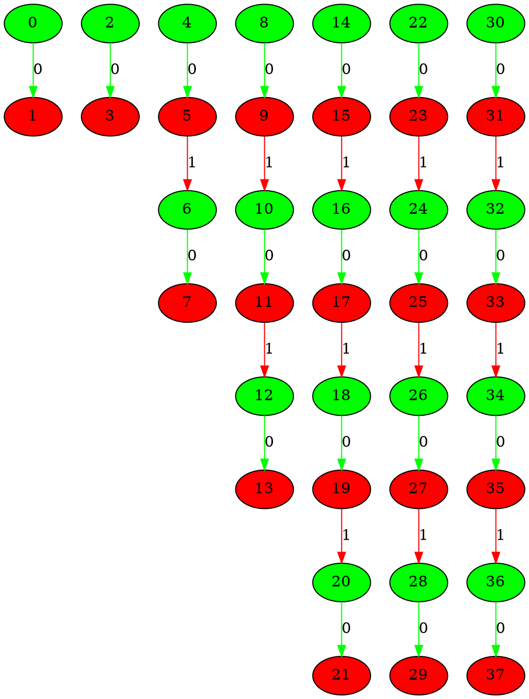
```graphviz
digraph G {
0[label="0" fillcolor="green" style="filled"];
1[label="1" fillcolor="red" style="filled"];
2[label="2" fillcolor="green" style="filled"];
3[label="3" fillcolor="red" style="filled"];
4[label="4" fillcolor="green" style="filled"];
5[label="5" fillcolor="red" style="filled"];
6[label="6" fillcolor="green" style="filled"];
7[label="7" fillcolor="red" style="filled"];
8[label="8" fillcolor="green" style="filled"];
9[label="9" fillcolor="red" style="filled"];
10[label="10" fillcolor="green" style="filled"];
11[label="11" fillcolor="red" style="filled"];
12[label="12" fillcolor="green" style="filled"];
13[label="13" fillcolor="red" style="filled"];
14[label="14" fillcolor="green" style="filled"];
15[label="15" fillcolor="red" style="filled"];
16[label="16" fillcolor="green" style="filled"];
17[label="17" fillcolor="red" style="filled"];
18[label="18" fillcolor="green" style="filled"];
19[label="19" fillcolor="red" style="filled"];
20[label="20" fillcolor="green" style="filled"];
21[label="21" fillcolor="red" style="filled"];
22[label="22" fillcolor="green" style="filled"];
23[label="23" fillcolor="red" style="filled"];
24[label="24" fillcolor="green" style="filled"];
25[label="25" fillcolor="red" style="filled"];
26[label="26" fillcolor="green" style="filled"];
27[label="27" fillcolor="red" style="filled"];
28[label="28" fillcolor="green" style="filled"];
29[label="29" fillcolor="red" style="filled"];
30[label="30" fillcolor="green" style="filled"];
31[label="31" fillcolor="red" style="filled"];
32[label="32" fillcolor="green" style="filled"];
33[label="33" fillcolor="red" style="filled"];
34[label="34" fillcolor="green" style="filled"];
35[label="35" fillcolor="red" style="filled"];
36[label="36" fillcolor="green" style="filled"];
37[label="37" fillcolor="red" style="filled"];
0->1 [label="0" color="green"];
2->3 [label="0" color="green"];
4->5 [label="0" color="green"];
6->7 [label="0" color="green"];
8->9 [label="0" color="green"];
10->11 [label="0" color="green"];
12->13 [label="0" color="green"];
14->15 [label="0" color="green"];
16->17 [label="0" color="green"];
18->19 [label="0" color="green"];
20->21 [label="0" color="green"];
22->23 [label="0" color="green"];
24->25 [label="0" color="green"];
26->27 [label="0" color="green"];
28->29 [label="0" color="green"];
30->31 [label="0" color="green"];
32->33 [label="0" color="green"];
34->35 [label="0" color="green"];
36->37 [label="0" color="green"];
5->6 [label="1" color="red"];
9->10 [label="1" color="red"];
11->12 [label="1" color="red"];
15->16 [label="1" color="red"];
17->18 [label="1" color="red"];
19->20 [label="1" color="red"];
23->24 [label="1" color="red"];
25->26 [label="1" color="red"];
27->28 [label="1" color="red"];
31->32 [label="1" color="red"];
33->34 [label="1" color="red"];
35->36 [label="1" color="red"];
}
```
___
## Graph 12802 - list de compréhension : 1|1,2,3,4,4,4
___
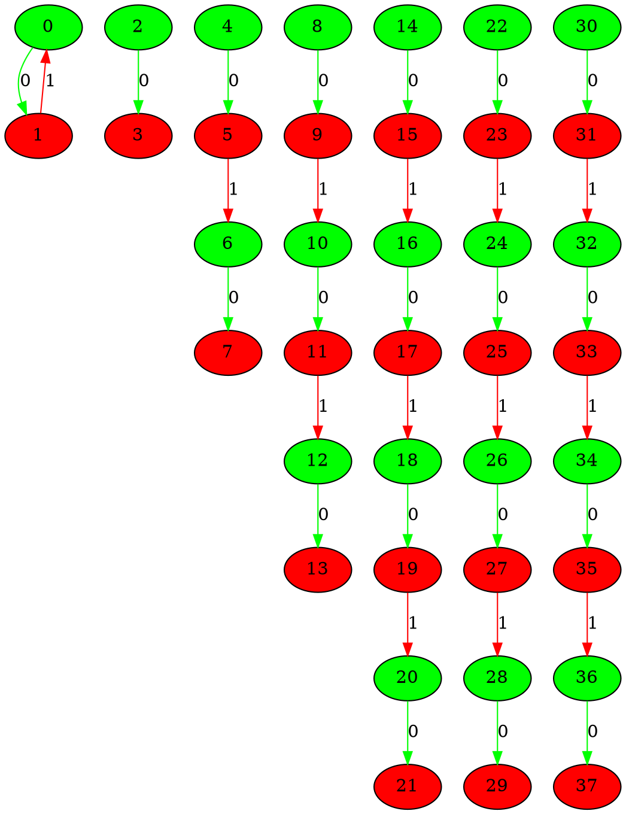
```graphviz
digraph G {
0[label="0" fillcolor="green" style="filled"];
1[label="1" fillcolor="red" style="filled"];
2[label="2" fillcolor="green" style="filled"];
3[label="3" fillcolor="red" style="filled"];
4[label="4" fillcolor="green" style="filled"];
5[label="5" fillcolor="red" style="filled"];
6[label="6" fillcolor="green" style="filled"];
7[label="7" fillcolor="red" style="filled"];
8[label="8" fillcolor="green" style="filled"];
9[label="9" fillcolor="red" style="filled"];
10[label="10" fillcolor="green" style="filled"];
11[label="11" fillcolor="red" style="filled"];
12[label="12" fillcolor="green" style="filled"];
13[label="13" fillcolor="red" style="filled"];
14[label="14" fillcolor="green" style="filled"];
15[label="15" fillcolor="red" style="filled"];
16[label="16" fillcolor="green" style="filled"];
17[label="17" fillcolor="red" style="filled"];
18[label="18" fillcolor="green" style="filled"];
19[label="19" fillcolor="red" style="filled"];
20[label="20" fillcolor="green" style="filled"];
21[label="21" fillcolor="red" style="filled"];
22[label="22" fillcolor="green" style="filled"];
23[label="23" fillcolor="red" style="filled"];
24[label="24" fillcolor="green" style="filled"];
25[label="25" fillcolor="red" style="filled"];
26[label="26" fillcolor="green" style="filled"];
27[label="27" fillcolor="red" style="filled"];
28[label="28" fillcolor="green" style="filled"];
29[label="29" fillcolor="red" style="filled"];
30[label="30" fillcolor="green" style="filled"];
31[label="31" fillcolor="red" style="filled"];
32[label="32" fillcolor="green" style="filled"];
33[label="33" fillcolor="red" style="filled"];
34[label="34" fillcolor="green" style="filled"];
35[label="35" fillcolor="red" style="filled"];
36[label="36" fillcolor="green" style="filled"];
37[label="37" fillcolor="red" style="filled"];
0->1 [label="0" color="green"];
2->3 [label="0" color="green"];
4->5 [label="0" color="green"];
6->7 [label="0" color="green"];
8->9 [label="0" color="green"];
10->11 [label="0" color="green"];
12->13 [label="0" color="green"];
14->15 [label="0" color="green"];
16->17 [label="0" color="green"];
18->19 [label="0" color="green"];
20->21 [label="0" color="green"];
22->23 [label="0" color="green"];
24->25 [label="0" color="green"];
26->27 [label="0" color="green"];
28->29 [label="0" color="green"];
30->31 [label="0" color="green"];
32->33 [label="0" color="green"];
34->35 [label="0" color="green"];
36->37 [label="0" color="green"];
1->0 [label="1" color="red"];
5->6 [label="1" color="red"];
9->10 [label="1" color="red"];
11->12 [label="1" color="red"];
15->16 [label="1" color="red"];
17->18 [label="1" color="red"];
19->20 [label="1" color="red"];
23->24 [label="1" color="red"];
25->26 [label="1" color="red"];
27->28 [label="1" color="red"];
31->32 [label="1" color="red"];
33->34 [label="1" color="red"];
35->36 [label="1" color="red"];
}
```
___
## Graph 12803 - list de compréhension : 1,1|2,3,4,4,4
___
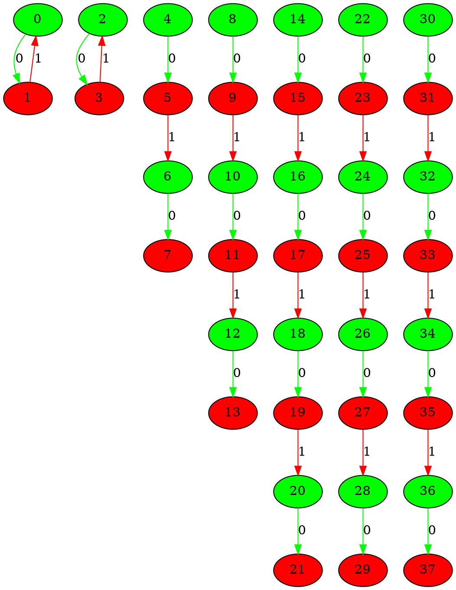
```graphviz
digraph G {
0[label="0" fillcolor="green" style="filled"];
1[label="1" fillcolor="red" style="filled"];
2[label="2" fillcolor="green" style="filled"];
3[label="3" fillcolor="red" style="filled"];
4[label="4" fillcolor="green" style="filled"];
5[label="5" fillcolor="red" style="filled"];
6[label="6" fillcolor="green" style="filled"];
7[label="7" fillcolor="red" style="filled"];
8[label="8" fillcolor="green" style="filled"];
9[label="9" fillcolor="red" style="filled"];
10[label="10" fillcolor="green" style="filled"];
11[label="11" fillcolor="red" style="filled"];
12[label="12" fillcolor="green" style="filled"];
13[label="13" fillcolor="red" style="filled"];
14[label="14" fillcolor="green" style="filled"];
15[label="15" fillcolor="red" style="filled"];
16[label="16" fillcolor="green" style="filled"];
17[label="17" fillcolor="red" style="filled"];
18[label="18" fillcolor="green" style="filled"];
19[label="19" fillcolor="red" style="filled"];
20[label="20" fillcolor="green" style="filled"];
21[label="21" fillcolor="red" style="filled"];
22[label="22" fillcolor="green" style="filled"];
23[label="23" fillcolor="red" style="filled"];
24[label="24" fillcolor="green" style="filled"];
25[label="25" fillcolor="red" style="filled"];
26[label="26" fillcolor="green" style="filled"];
27[label="27" fillcolor="red" style="filled"];
28[label="28" fillcolor="green" style="filled"];
29[label="29" fillcolor="red" style="filled"];
30[label="30" fillcolor="green" style="filled"];
31[label="31" fillcolor="red" style="filled"];
32[label="32" fillcolor="green" style="filled"];
33[label="33" fillcolor="red" style="filled"];
34[label="34" fillcolor="green" style="filled"];
35[label="35" fillcolor="red" style="filled"];
36[label="36" fillcolor="green" style="filled"];
37[label="37" fillcolor="red" style="filled"];
0->1 [label="0" color="green"];
2->3 [label="0" color="green"];
4->5 [label="0" color="green"];
6->7 [label="0" color="green"];
8->9 [label="0" color="green"];
10->11 [label="0" color="green"];
12->13 [label="0" color="green"];
14->15 [label="0" color="green"];
16->17 [label="0" color="green"];
18->19 [label="0" color="green"];
20->21 [label="0" color="green"];
22->23 [label="0" color="green"];
24->25 [label="0" color="green"];
26->27 [label="0" color="green"];
28->29 [label="0" color="green"];
30->31 [label="0" color="green"];
32->33 [label="0" color="green"];
34->35 [label="0" color="green"];
36->37 [label="0" color="green"];
1->0 [label="1" color="red"];
3->2 [label="1" color="red"];
5->6 [label="1" color="red"];
9->10 [label="1" color="red"];
11->12 [label="1" color="red"];
15->16 [label="1" color="red"];
17->18 [label="1" color="red"];
19->20 [label="1" color="red"];
23->24 [label="1" color="red"];
25->26 [label="1" color="red"];
27->28 [label="1" color="red"];
31->32 [label="1" color="red"];
33->34 [label="1" color="red"];
35->36 [label="1" color="red"];
}
```
___
## Graph 12804 - list de compréhension : 1,1,2|3,4,4,4
___
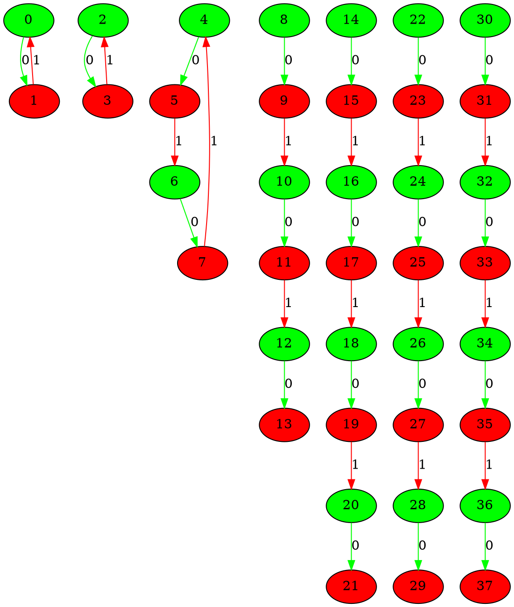
```graphviz
digraph G {
0[label="0" fillcolor="green" style="filled"];
1[label="1" fillcolor="red" style="filled"];
2[label="2" fillcolor="green" style="filled"];
3[label="3" fillcolor="red" style="filled"];
4[label="4" fillcolor="green" style="filled"];
5[label="5" fillcolor="red" style="filled"];
6[label="6" fillcolor="green" style="filled"];
7[label="7" fillcolor="red" style="filled"];
8[label="8" fillcolor="green" style="filled"];
9[label="9" fillcolor="red" style="filled"];
10[label="10" fillcolor="green" style="filled"];
11[label="11" fillcolor="red" style="filled"];
12[label="12" fillcolor="green" style="filled"];
13[label="13" fillcolor="red" style="filled"];
14[label="14" fillcolor="green" style="filled"];
15[label="15" fillcolor="red" style="filled"];
16[label="16" fillcolor="green" style="filled"];
17[label="17" fillcolor="red" style="filled"];
18[label="18" fillcolor="green" style="filled"];
19[label="19" fillcolor="red" style="filled"];
20[label="20" fillcolor="green" style="filled"];
21[label="21" fillcolor="red" style="filled"];
22[label="22" fillcolor="green" style="filled"];
23[label="23" fillcolor="red" style="filled"];
24[label="24" fillcolor="green" style="filled"];
25[label="25" fillcolor="red" style="filled"];
26[label="26" fillcolor="green" style="filled"];
27[label="27" fillcolor="red" style="filled"];
28[label="28" fillcolor="green" style="filled"];
29[label="29" fillcolor="red" style="filled"];
30[label="30" fillcolor="green" style="filled"];
31[label="31" fillcolor="red" style="filled"];
32[label="32" fillcolor="green" style="filled"];
33[label="33" fillcolor="red" style="filled"];
34[label="34" fillcolor="green" style="filled"];
35[label="35" fillcolor="red" style="filled"];
36[label="36" fillcolor="green" style="filled"];
37[label="37" fillcolor="red" style="filled"];
0->1 [label="0" color="green"];
2->3 [label="0" color="green"];
4->5 [label="0" color="green"];
6->7 [label="0" color="green"];
8->9 [label="0" color="green"];
10->11 [label="0" color="green"];
12->13 [label="0" color="green"];
14->15 [label="0" color="green"];
16->17 [label="0" color="green"];
18->19 [label="0" color="green"];
20->21 [label="0" color="green"];
22->23 [label="0" color="green"];
24->25 [label="0" color="green"];
26->27 [label="0" color="green"];
28->29 [label="0" color="green"];
30->31 [label="0" color="green"];
32->33 [label="0" color="green"];
34->35 [label="0" color="green"];
36->37 [label="0" color="green"];
1->0 [label="1" color="red"];
3->2 [label="1" color="red"];
5->6 [label="1" color="red"];
7->4 [label="1" color="red"];
9->10 [label="1" color="red"];
11->12 [label="1" color="red"];
15->16 [label="1" color="red"];
17->18 [label="1" color="red"];
19->20 [label="1" color="red"];
23->24 [label="1" color="red"];
25->26 [label="1" color="red"];
27->28 [label="1" color="red"];
31->32 [label="1" color="red"];
33->34 [label="1" color="red"];
35->36 [label="1" color="red"];
}
```
___
## Graph 12805 - list de compréhension : 1,1,2,3|4,4,4
___
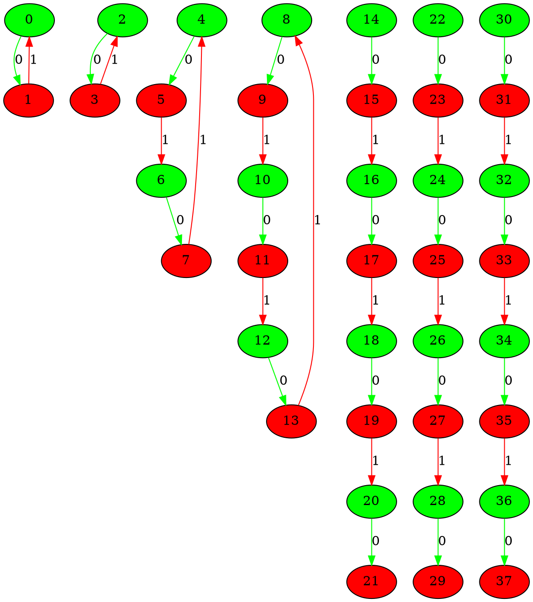
```graphviz
digraph G {
0[label="0" fillcolor="green" style="filled"];
1[label="1" fillcolor="red" style="filled"];
2[label="2" fillcolor="green" style="filled"];
3[label="3" fillcolor="red" style="filled"];
4[label="4" fillcolor="green" style="filled"];
5[label="5" fillcolor="red" style="filled"];
6[label="6" fillcolor="green" style="filled"];
7[label="7" fillcolor="red" style="filled"];
8[label="8" fillcolor="green" style="filled"];
9[label="9" fillcolor="red" style="filled"];
10[label="10" fillcolor="green" style="filled"];
11[label="11" fillcolor="red" style="filled"];
12[label="12" fillcolor="green" style="filled"];
13[label="13" fillcolor="red" style="filled"];
14[label="14" fillcolor="green" style="filled"];
15[label="15" fillcolor="red" style="filled"];
16[label="16" fillcolor="green" style="filled"];
17[label="17" fillcolor="red" style="filled"];
18[label="18" fillcolor="green" style="filled"];
19[label="19" fillcolor="red" style="filled"];
20[label="20" fillcolor="green" style="filled"];
21[label="21" fillcolor="red" style="filled"];
22[label="22" fillcolor="green" style="filled"];
23[label="23" fillcolor="red" style="filled"];
24[label="24" fillcolor="green" style="filled"];
25[label="25" fillcolor="red" style="filled"];
26[label="26" fillcolor="green" style="filled"];
27[label="27" fillcolor="red" style="filled"];
28[label="28" fillcolor="green" style="filled"];
29[label="29" fillcolor="red" style="filled"];
30[label="30" fillcolor="green" style="filled"];
31[label="31" fillcolor="red" style="filled"];
32[label="32" fillcolor="green" style="filled"];
33[label="33" fillcolor="red" style="filled"];
34[label="34" fillcolor="green" style="filled"];
35[label="35" fillcolor="red" style="filled"];
36[label="36" fillcolor="green" style="filled"];
37[label="37" fillcolor="red" style="filled"];
0->1 [label="0" color="green"];
2->3 [label="0" color="green"];
4->5 [label="0" color="green"];
6->7 [label="0" color="green"];
8->9 [label="0" color="green"];
10->11 [label="0" color="green"];
12->13 [label="0" color="green"];
14->15 [label="0" color="green"];
16->17 [label="0" color="green"];
18->19 [label="0" color="green"];
20->21 [label="0" color="green"];
22->23 [label="0" color="green"];
24->25 [label="0" color="green"];
26->27 [label="0" color="green"];
28->29 [label="0" color="green"];
30->31 [label="0" color="green"];
32->33 [label="0" color="green"];
34->35 [label="0" color="green"];
36->37 [label="0" color="green"];
1->0 [label="1" color="red"];
3->2 [label="1" color="red"];
5->6 [label="1" color="red"];
7->4 [label="1" color="red"];
9->10 [label="1" color="red"];
11->12 [label="1" color="red"];
13->8 [label="1" color="red"];
15->16 [label="1" color="red"];
17->18 [label="1" color="red"];
19->20 [label="1" color="red"];
23->24 [label="1" color="red"];
25->26 [label="1" color="red"];
27->28 [label="1" color="red"];
31->32 [label="1" color="red"];
33->34 [label="1" color="red"];
35->36 [label="1" color="red"];
}
```
___
## Graph 12806 - list de compréhension : 1,1,2,3,4|4,4
___
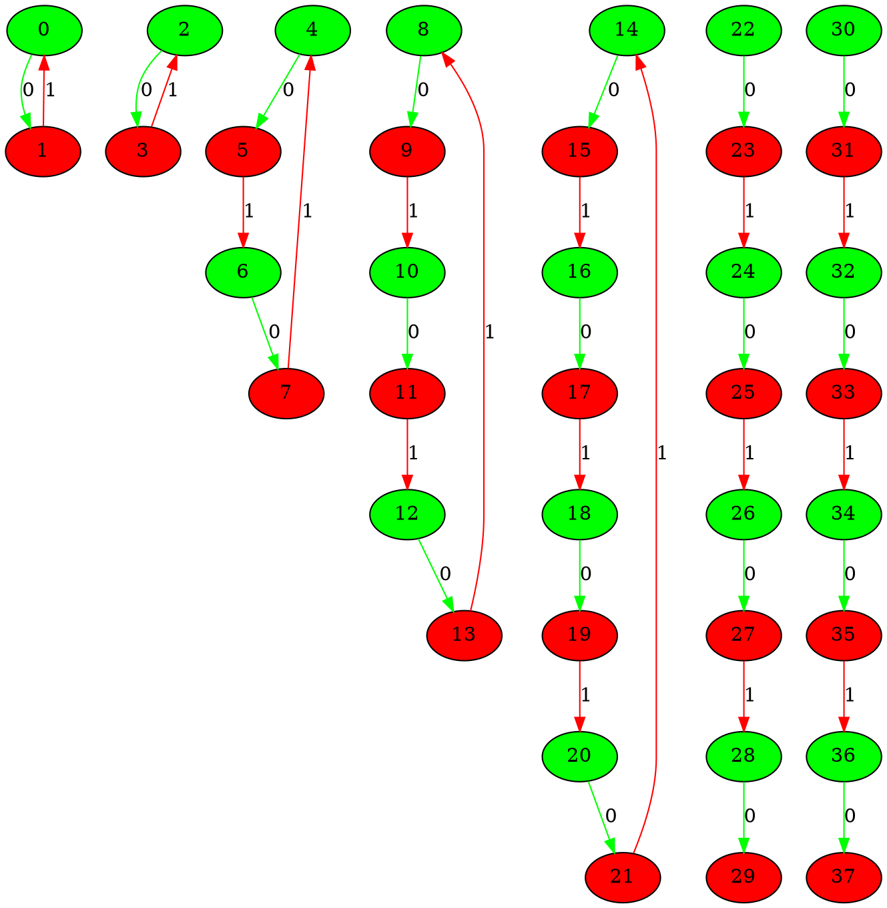
```graphviz
digraph G {
0[label="0" fillcolor="green" style="filled"];
1[label="1" fillcolor="red" style="filled"];
2[label="2" fillcolor="green" style="filled"];
3[label="3" fillcolor="red" style="filled"];
4[label="4" fillcolor="green" style="filled"];
5[label="5" fillcolor="red" style="filled"];
6[label="6" fillcolor="green" style="filled"];
7[label="7" fillcolor="red" style="filled"];
8[label="8" fillcolor="green" style="filled"];
9[label="9" fillcolor="red" style="filled"];
10[label="10" fillcolor="green" style="filled"];
11[label="11" fillcolor="red" style="filled"];
12[label="12" fillcolor="green" style="filled"];
13[label="13" fillcolor="red" style="filled"];
14[label="14" fillcolor="green" style="filled"];
15[label="15" fillcolor="red" style="filled"];
16[label="16" fillcolor="green" style="filled"];
17[label="17" fillcolor="red" style="filled"];
18[label="18" fillcolor="green" style="filled"];
19[label="19" fillcolor="red" style="filled"];
20[label="20" fillcolor="green" style="filled"];
21[label="21" fillcolor="red" style="filled"];
22[label="22" fillcolor="green" style="filled"];
23[label="23" fillcolor="red" style="filled"];
24[label="24" fillcolor="green" style="filled"];
25[label="25" fillcolor="red" style="filled"];
26[label="26" fillcolor="green" style="filled"];
27[label="27" fillcolor="red" style="filled"];
28[label="28" fillcolor="green" style="filled"];
29[label="29" fillcolor="red" style="filled"];
30[label="30" fillcolor="green" style="filled"];
31[label="31" fillcolor="red" style="filled"];
32[label="32" fillcolor="green" style="filled"];
33[label="33" fillcolor="red" style="filled"];
34[label="34" fillcolor="green" style="filled"];
35[label="35" fillcolor="red" style="filled"];
36[label="36" fillcolor="green" style="filled"];
37[label="37" fillcolor="red" style="filled"];
0->1 [label="0" color="green"];
2->3 [label="0" color="green"];
4->5 [label="0" color="green"];
6->7 [label="0" color="green"];
8->9 [label="0" color="green"];
10->11 [label="0" color="green"];
12->13 [label="0" color="green"];
14->15 [label="0" color="green"];
16->17 [label="0" color="green"];
18->19 [label="0" color="green"];
20->21 [label="0" color="green"];
22->23 [label="0" color="green"];
24->25 [label="0" color="green"];
26->27 [label="0" color="green"];
28->29 [label="0" color="green"];
30->31 [label="0" color="green"];
32->33 [label="0" color="green"];
34->35 [label="0" color="green"];
36->37 [label="0" color="green"];
1->0 [label="1" color="red"];
3->2 [label="1" color="red"];
5->6 [label="1" color="red"];
7->4 [label="1" color="red"];
9->10 [label="1" color="red"];
11->12 [label="1" color="red"];
13->8 [label="1" color="red"];
15->16 [label="1" color="red"];
17->18 [label="1" color="red"];
19->20 [label="1" color="red"];
21->14 [label="1" color="red"];
23->24 [label="1" color="red"];
25->26 [label="1" color="red"];
27->28 [label="1" color="red"];
31->32 [label="1" color="red"];
33->34 [label="1" color="red"];
35->36 [label="1" color="red"];
}
```
___
## Graph 12807 - list de compréhension : 1,1,2,3,4,4|4
___
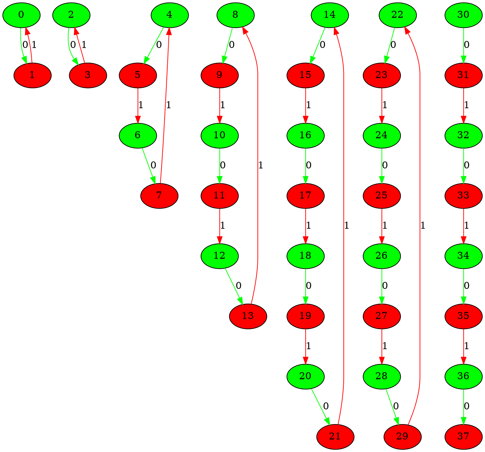
```graphviz
digraph G {
0[label="0" fillcolor="green" style="filled"];
1[label="1" fillcolor="red" style="filled"];
2[label="2" fillcolor="green" style="filled"];
3[label="3" fillcolor="red" style="filled"];
4[label="4" fillcolor="green" style="filled"];
5[label="5" fillcolor="red" style="filled"];
6[label="6" fillcolor="green" style="filled"];
7[label="7" fillcolor="red" style="filled"];
8[label="8" fillcolor="green" style="filled"];
9[label="9" fillcolor="red" style="filled"];
10[label="10" fillcolor="green" style="filled"];
11[label="11" fillcolor="red" style="filled"];
12[label="12" fillcolor="green" style="filled"];
13[label="13" fillcolor="red" style="filled"];
14[label="14" fillcolor="green" style="filled"];
15[label="15" fillcolor="red" style="filled"];
16[label="16" fillcolor="green" style="filled"];
17[label="17" fillcolor="red" style="filled"];
18[label="18" fillcolor="green" style="filled"];
19[label="19" fillcolor="red" style="filled"];
20[label="20" fillcolor="green" style="filled"];
21[label="21" fillcolor="red" style="filled"];
22[label="22" fillcolor="green" style="filled"];
23[label="23" fillcolor="red" style="filled"];
24[label="24" fillcolor="green" style="filled"];
25[label="25" fillcolor="red" style="filled"];
26[label="26" fillcolor="green" style="filled"];
27[label="27" fillcolor="red" style="filled"];
28[label="28" fillcolor="green" style="filled"];
29[label="29" fillcolor="red" style="filled"];
30[label="30" fillcolor="green" style="filled"];
31[label="31" fillcolor="red" style="filled"];
32[label="32" fillcolor="green" style="filled"];
33[label="33" fillcolor="red" style="filled"];
34[label="34" fillcolor="green" style="filled"];
35[label="35" fillcolor="red" style="filled"];
36[label="36" fillcolor="green" style="filled"];
37[label="37" fillcolor="red" style="filled"];
0->1 [label="0" color="green"];
2->3 [label="0" color="green"];
4->5 [label="0" color="green"];
6->7 [label="0" color="green"];
8->9 [label="0" color="green"];
10->11 [label="0" color="green"];
12->13 [label="0" color="green"];
14->15 [label="0" color="green"];
16->17 [label="0" color="green"];
18->19 [label="0" color="green"];
20->21 [label="0" color="green"];
22->23 [label="0" color="green"];
24->25 [label="0" color="green"];
26->27 [label="0" color="green"];
28->29 [label="0" color="green"];
30->31 [label="0" color="green"];
32->33 [label="0" color="green"];
34->35 [label="0" color="green"];
36->37 [label="0" color="green"];
1->0 [label="1" color="red"];
3->2 [label="1" color="red"];
5->6 [label="1" color="red"];
7->4 [label="1" color="red"];
9->10 [label="1" color="red"];
11->12 [label="1" color="red"];
13->8 [label="1" color="red"];
15->16 [label="1" color="red"];
17->18 [label="1" color="red"];
19->20 [label="1" color="red"];
21->14 [label="1" color="red"];
23->24 [label="1" color="red"];
25->26 [label="1" color="red"];
27->28 [label="1" color="red"];
29->22 [label="1" color="red"];
31->32 [label="1" color="red"];
33->34 [label="1" color="red"];
35->36 [label="1" color="red"];
}
```
___
## Graph 12808 - list de compréhension : 1,1,2,3,4,4,4|0
___
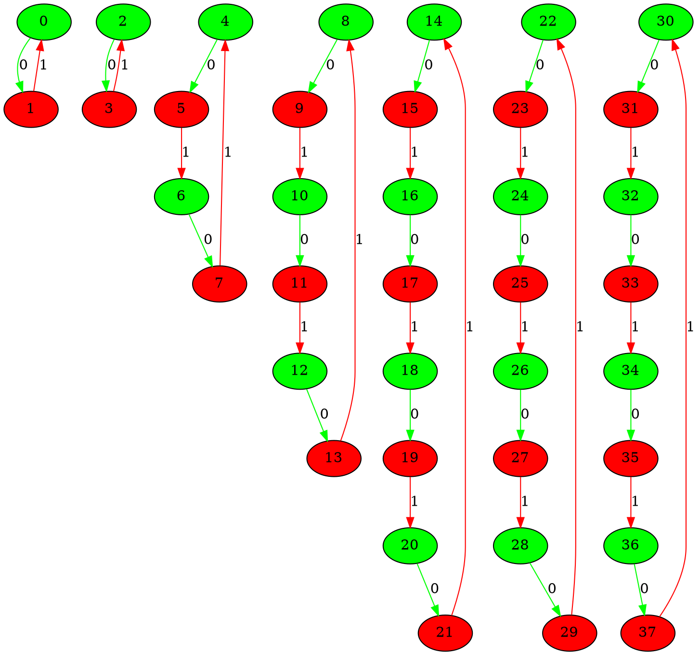
```graphviz
digraph G {
0[label="0" fillcolor="green" style="filled"];
1[label="1" fillcolor="red" style="filled"];
2[label="2" fillcolor="green" style="filled"];
3[label="3" fillcolor="red" style="filled"];
4[label="4" fillcolor="green" style="filled"];
5[label="5" fillcolor="red" style="filled"];
6[label="6" fillcolor="green" style="filled"];
7[label="7" fillcolor="red" style="filled"];
8[label="8" fillcolor="green" style="filled"];
9[label="9" fillcolor="red" style="filled"];
10[label="10" fillcolor="green" style="filled"];
11[label="11" fillcolor="red" style="filled"];
12[label="12" fillcolor="green" style="filled"];
13[label="13" fillcolor="red" style="filled"];
14[label="14" fillcolor="green" style="filled"];
15[label="15" fillcolor="red" style="filled"];
16[label="16" fillcolor="green" style="filled"];
17[label="17" fillcolor="red" style="filled"];
18[label="18" fillcolor="green" style="filled"];
19[label="19" fillcolor="red" style="filled"];
20[label="20" fillcolor="green" style="filled"];
21[label="21" fillcolor="red" style="filled"];
22[label="22" fillcolor="green" style="filled"];
23[label="23" fillcolor="red" style="filled"];
24[label="24" fillcolor="green" style="filled"];
25[label="25" fillcolor="red" style="filled"];
26[label="26" fillcolor="green" style="filled"];
27[label="27" fillcolor="red" style="filled"];
28[label="28" fillcolor="green" style="filled"];
29[label="29" fillcolor="red" style="filled"];
30[label="30" fillcolor="green" style="filled"];
31[label="31" fillcolor="red" style="filled"];
32[label="32" fillcolor="green" style="filled"];
33[label="33" fillcolor="red" style="filled"];
34[label="34" fillcolor="green" style="filled"];
35[label="35" fillcolor="red" style="filled"];
36[label="36" fillcolor="green" style="filled"];
37[label="37" fillcolor="red" style="filled"];
0->1 [label="0" color="green"];
2->3 [label="0" color="green"];
4->5 [label="0" color="green"];
6->7 [label="0" color="green"];
8->9 [label="0" color="green"];
10->11 [label="0" color="green"];
12->13 [label="0" color="green"];
14->15 [label="0" color="green"];
16->17 [label="0" color="green"];
18->19 [label="0" color="green"];
20->21 [label="0" color="green"];
22->23 [label="0" color="green"];
24->25 [label="0" color="green"];
26->27 [label="0" color="green"];
28->29 [label="0" color="green"];
30->31 [label="0" color="green"];
32->33 [label="0" color="green"];
34->35 [label="0" color="green"];
36->37 [label="0" color="green"];
1->0 [label="1" color="red"];
3->2 [label="1" color="red"];
5->6 [label="1" color="red"];
7->4 [label="1" color="red"];
9->10 [label="1" color="red"];
11->12 [label="1" color="red"];
13->8 [label="1" color="red"];
15->16 [label="1" color="red"];
17->18 [label="1" color="red"];
19->20 [label="1" color="red"];
21->14 [label="1" color="red"];
23->24 [label="1" color="red"];
25->26 [label="1" color="red"];
27->28 [label="1" color="red"];
29->22 [label="1" color="red"];
31->32 [label="1" color="red"];
33->34 [label="1" color="red"];
35->36 [label="1" color="red"];
37->30 [label="1" color="red"];
}
```
___
## Graph 12809 - list de compréhension : 1,1,2,4|3,4,4
___
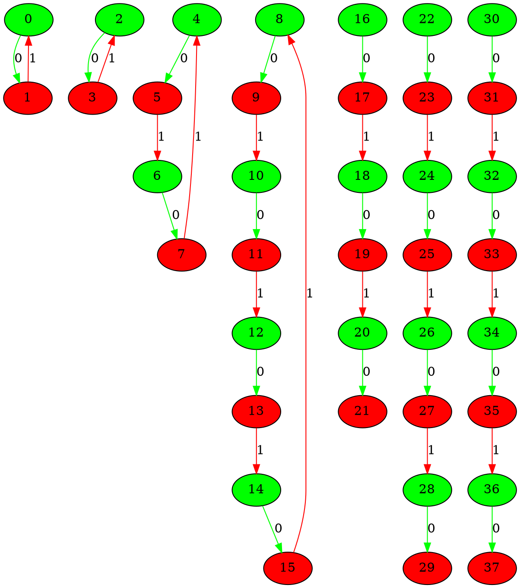
```graphviz
digraph G {
0[label="0" fillcolor="green" style="filled"];
1[label="1" fillcolor="red" style="filled"];
2[label="2" fillcolor="green" style="filled"];
3[label="3" fillcolor="red" style="filled"];
4[label="4" fillcolor="green" style="filled"];
5[label="5" fillcolor="red" style="filled"];
6[label="6" fillcolor="green" style="filled"];
7[label="7" fillcolor="red" style="filled"];
8[label="8" fillcolor="green" style="filled"];
9[label="9" fillcolor="red" style="filled"];
10[label="10" fillcolor="green" style="filled"];
11[label="11" fillcolor="red" style="filled"];
12[label="12" fillcolor="green" style="filled"];
13[label="13" fillcolor="red" style="filled"];
14[label="14" fillcolor="green" style="filled"];
15[label="15" fillcolor="red" style="filled"];
16[label="16" fillcolor="green" style="filled"];
17[label="17" fillcolor="red" style="filled"];
18[label="18" fillcolor="green" style="filled"];
19[label="19" fillcolor="red" style="filled"];
20[label="20" fillcolor="green" style="filled"];
21[label="21" fillcolor="red" style="filled"];
22[label="22" fillcolor="green" style="filled"];
23[label="23" fillcolor="red" style="filled"];
24[label="24" fillcolor="green" style="filled"];
25[label="25" fillcolor="red" style="filled"];
26[label="26" fillcolor="green" style="filled"];
27[label="27" fillcolor="red" style="filled"];
28[label="28" fillcolor="green" style="filled"];
29[label="29" fillcolor="red" style="filled"];
30[label="30" fillcolor="green" style="filled"];
31[label="31" fillcolor="red" style="filled"];
32[label="32" fillcolor="green" style="filled"];
33[label="33" fillcolor="red" style="filled"];
34[label="34" fillcolor="green" style="filled"];
35[label="35" fillcolor="red" style="filled"];
36[label="36" fillcolor="green" style="filled"];
37[label="37" fillcolor="red" style="filled"];
0->1 [label="0" color="green"];
2->3 [label="0" color="green"];
4->5 [label="0" color="green"];
6->7 [label="0" color="green"];
8->9 [label="0" color="green"];
10->11 [label="0" color="green"];
12->13 [label="0" color="green"];
14->15 [label="0" color="green"];
16->17 [label="0" color="green"];
18->19 [label="0" color="green"];
20->21 [label="0" color="green"];
22->23 [label="0" color="green"];
24->25 [label="0" color="green"];
26->27 [label="0" color="green"];
28->29 [label="0" color="green"];
30->31 [label="0" color="green"];
32->33 [label="0" color="green"];
34->35 [label="0" color="green"];
36->37 [label="0" color="green"];
1->0 [label="1" color="red"];
3->2 [label="1" color="red"];
5->6 [label="1" color="red"];
7->4 [label="1" color="red"];
9->10 [label="1" color="red"];
11->12 [label="1" color="red"];
13->14 [label="1" color="red"];
15->8 [label="1" color="red"];
17->18 [label="1" color="red"];
19->20 [label="1" color="red"];
23->24 [label="1" color="red"];
25->26 [label="1" color="red"];
27->28 [label="1" color="red"];
31->32 [label="1" color="red"];
33->34 [label="1" color="red"];
35->36 [label="1" color="red"];
}
```
___
## Graph 12810 - list de compréhension : 1,1,2,4,4|3,4
___
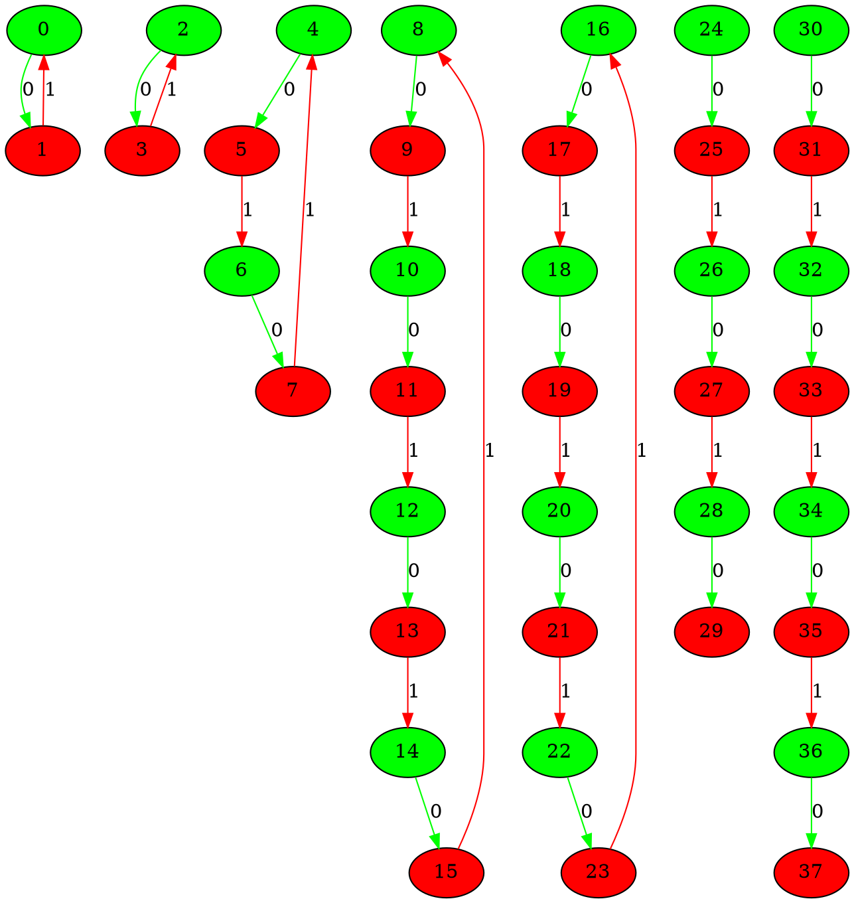
```graphviz
digraph G {
0[label="0" fillcolor="green" style="filled"];
1[label="1" fillcolor="red" style="filled"];
2[label="2" fillcolor="green" style="filled"];
3[label="3" fillcolor="red" style="filled"];
4[label="4" fillcolor="green" style="filled"];
5[label="5" fillcolor="red" style="filled"];
6[label="6" fillcolor="green" style="filled"];
7[label="7" fillcolor="red" style="filled"];
8[label="8" fillcolor="green" style="filled"];
9[label="9" fillcolor="red" style="filled"];
10[label="10" fillcolor="green" style="filled"];
11[label="11" fillcolor="red" style="filled"];
12[label="12" fillcolor="green" style="filled"];
13[label="13" fillcolor="red" style="filled"];
14[label="14" fillcolor="green" style="filled"];
15[label="15" fillcolor="red" style="filled"];
16[label="16" fillcolor="green" style="filled"];
17[label="17" fillcolor="red" style="filled"];
18[label="18" fillcolor="green" style="filled"];
19[label="19" fillcolor="red" style="filled"];
20[label="20" fillcolor="green" style="filled"];
21[label="21" fillcolor="red" style="filled"];
22[label="22" fillcolor="green" style="filled"];
23[label="23" fillcolor="red" style="filled"];
24[label="24" fillcolor="green" style="filled"];
25[label="25" fillcolor="red" style="filled"];
26[label="26" fillcolor="green" style="filled"];
27[label="27" fillcolor="red" style="filled"];
28[label="28" fillcolor="green" style="filled"];
29[label="29" fillcolor="red" style="filled"];
30[label="30" fillcolor="green" style="filled"];
31[label="31" fillcolor="red" style="filled"];
32[label="32" fillcolor="green" style="filled"];
33[label="33" fillcolor="red" style="filled"];
34[label="34" fillcolor="green" style="filled"];
35[label="35" fillcolor="red" style="filled"];
36[label="36" fillcolor="green" style="filled"];
37[label="37" fillcolor="red" style="filled"];
0->1 [label="0" color="green"];
2->3 [label="0" color="green"];
4->5 [label="0" color="green"];
6->7 [label="0" color="green"];
8->9 [label="0" color="green"];
10->11 [label="0" color="green"];
12->13 [label="0" color="green"];
14->15 [label="0" color="green"];
16->17 [label="0" color="green"];
18->19 [label="0" color="green"];
20->21 [label="0" color="green"];
22->23 [label="0" color="green"];
24->25 [label="0" color="green"];
26->27 [label="0" color="green"];
28->29 [label="0" color="green"];
30->31 [label="0" color="green"];
32->33 [label="0" color="green"];
34->35 [label="0" color="green"];
36->37 [label="0" color="green"];
1->0 [label="1" color="red"];
3->2 [label="1" color="red"];
5->6 [label="1" color="red"];
7->4 [label="1" color="red"];
9->10 [label="1" color="red"];
11->12 [label="1" color="red"];
13->14 [label="1" color="red"];
15->8 [label="1" color="red"];
17->18 [label="1" color="red"];
19->20 [label="1" color="red"];
21->22 [label="1" color="red"];
23->16 [label="1" color="red"];
25->26 [label="1" color="red"];
27->28 [label="1" color="red"];
31->32 [label="1" color="red"];
33->34 [label="1" color="red"];
35->36 [label="1" color="red"];
}
```
___
## Graph 12811 - list de compréhension : 1,1,2,4,4,4|3
___
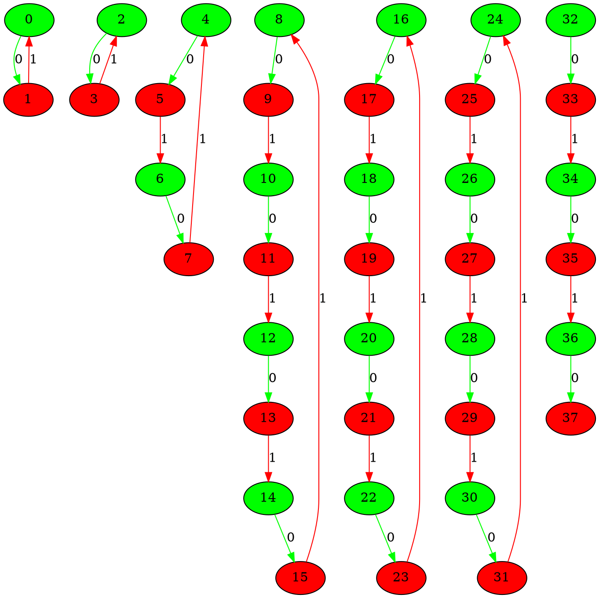
```graphviz
digraph G {
0[label="0" fillcolor="green" style="filled"];
1[label="1" fillcolor="red" style="filled"];
2[label="2" fillcolor="green" style="filled"];
3[label="3" fillcolor="red" style="filled"];
4[label="4" fillcolor="green" style="filled"];
5[label="5" fillcolor="red" style="filled"];
6[label="6" fillcolor="green" style="filled"];
7[label="7" fillcolor="red" style="filled"];
8[label="8" fillcolor="green" style="filled"];
9[label="9" fillcolor="red" style="filled"];
10[label="10" fillcolor="green" style="filled"];
11[label="11" fillcolor="red" style="filled"];
12[label="12" fillcolor="green" style="filled"];
13[label="13" fillcolor="red" style="filled"];
14[label="14" fillcolor="green" style="filled"];
15[label="15" fillcolor="red" style="filled"];
16[label="16" fillcolor="green" style="filled"];
17[label="17" fillcolor="red" style="filled"];
18[label="18" fillcolor="green" style="filled"];
19[label="19" fillcolor="red" style="filled"];
20[label="20" fillcolor="green" style="filled"];
21[label="21" fillcolor="red" style="filled"];
22[label="22" fillcolor="green" style="filled"];
23[label="23" fillcolor="red" style="filled"];
24[label="24" fillcolor="green" style="filled"];
25[label="25" fillcolor="red" style="filled"];
26[label="26" fillcolor="green" style="filled"];
27[label="27" fillcolor="red" style="filled"];
28[label="28" fillcolor="green" style="filled"];
29[label="29" fillcolor="red" style="filled"];
30[label="30" fillcolor="green" style="filled"];
31[label="31" fillcolor="red" style="filled"];
32[label="32" fillcolor="green" style="filled"];
33[label="33" fillcolor="red" style="filled"];
34[label="34" fillcolor="green" style="filled"];
35[label="35" fillcolor="red" style="filled"];
36[label="36" fillcolor="green" style="filled"];
37[label="37" fillcolor="red" style="filled"];
0->1 [label="0" color="green"];
2->3 [label="0" color="green"];
4->5 [label="0" color="green"];
6->7 [label="0" color="green"];
8->9 [label="0" color="green"];
10->11 [label="0" color="green"];
12->13 [label="0" color="green"];
14->15 [label="0" color="green"];
16->17 [label="0" color="green"];
18->19 [label="0" color="green"];
20->21 [label="0" color="green"];
22->23 [label="0" color="green"];
24->25 [label="0" color="green"];
26->27 [label="0" color="green"];
28->29 [label="0" color="green"];
30->31 [label="0" color="green"];
32->33 [label="0" color="green"];
34->35 [label="0" color="green"];
36->37 [label="0" color="green"];
1->0 [label="1" color="red"];
3->2 [label="1" color="red"];
5->6 [label="1" color="red"];
7->4 [label="1" color="red"];
9->10 [label="1" color="red"];
11->12 [label="1" color="red"];
13->14 [label="1" color="red"];
15->8 [label="1" color="red"];
17->18 [label="1" color="red"];
19->20 [label="1" color="red"];
21->22 [label="1" color="red"];
23->16 [label="1" color="red"];
25->26 [label="1" color="red"];
27->28 [label="1" color="red"];
29->30 [label="1" color="red"];
31->24 [label="1" color="red"];
33->34 [label="1" color="red"];
35->36 [label="1" color="red"];
}
```
___
## Graph 12812 - list de compréhension : 1,1,3|2,4,4,4
___
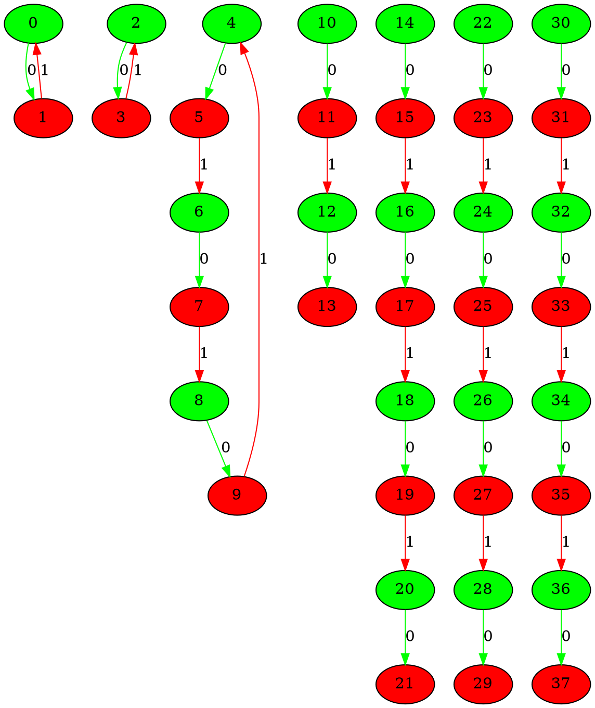
```graphviz
digraph G {
0[label="0" fillcolor="green" style="filled"];
1[label="1" fillcolor="red" style="filled"];
2[label="2" fillcolor="green" style="filled"];
3[label="3" fillcolor="red" style="filled"];
4[label="4" fillcolor="green" style="filled"];
5[label="5" fillcolor="red" style="filled"];
6[label="6" fillcolor="green" style="filled"];
7[label="7" fillcolor="red" style="filled"];
8[label="8" fillcolor="green" style="filled"];
9[label="9" fillcolor="red" style="filled"];
10[label="10" fillcolor="green" style="filled"];
11[label="11" fillcolor="red" style="filled"];
12[label="12" fillcolor="green" style="filled"];
13[label="13" fillcolor="red" style="filled"];
14[label="14" fillcolor="green" style="filled"];
15[label="15" fillcolor="red" style="filled"];
16[label="16" fillcolor="green" style="filled"];
17[label="17" fillcolor="red" style="filled"];
18[label="18" fillcolor="green" style="filled"];
19[label="19" fillcolor="red" style="filled"];
20[label="20" fillcolor="green" style="filled"];
21[label="21" fillcolor="red" style="filled"];
22[label="22" fillcolor="green" style="filled"];
23[label="23" fillcolor="red" style="filled"];
24[label="24" fillcolor="green" style="filled"];
25[label="25" fillcolor="red" style="filled"];
26[label="26" fillcolor="green" style="filled"];
27[label="27" fillcolor="red" style="filled"];
28[label="28" fillcolor="green" style="filled"];
29[label="29" fillcolor="red" style="filled"];
30[label="30" fillcolor="green" style="filled"];
31[label="31" fillcolor="red" style="filled"];
32[label="32" fillcolor="green" style="filled"];
33[label="33" fillcolor="red" style="filled"];
34[label="34" fillcolor="green" style="filled"];
35[label="35" fillcolor="red" style="filled"];
36[label="36" fillcolor="green" style="filled"];
37[label="37" fillcolor="red" style="filled"];
0->1 [label="0" color="green"];
2->3 [label="0" color="green"];
4->5 [label="0" color="green"];
6->7 [label="0" color="green"];
8->9 [label="0" color="green"];
10->11 [label="0" color="green"];
12->13 [label="0" color="green"];
14->15 [label="0" color="green"];
16->17 [label="0" color="green"];
18->19 [label="0" color="green"];
20->21 [label="0" color="green"];
22->23 [label="0" color="green"];
24->25 [label="0" color="green"];
26->27 [label="0" color="green"];
28->29 [label="0" color="green"];
30->31 [label="0" color="green"];
32->33 [label="0" color="green"];
34->35 [label="0" color="green"];
36->37 [label="0" color="green"];
1->0 [label="1" color="red"];
3->2 [label="1" color="red"];
5->6 [label="1" color="red"];
7->8 [label="1" color="red"];
9->4 [label="1" color="red"];
11->12 [label="1" color="red"];
15->16 [label="1" color="red"];
17->18 [label="1" color="red"];
19->20 [label="1" color="red"];
23->24 [label="1" color="red"];
25->26 [label="1" color="red"];
27->28 [label="1" color="red"];
31->32 [label="1" color="red"];
33->34 [label="1" color="red"];
35->36 [label="1" color="red"];
}
```
___
## Graph 12813 - list de compréhension : 1,1,3,4|2,4,4
___
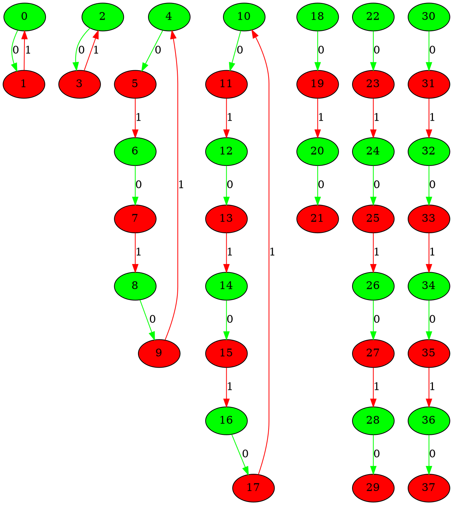
```graphviz
digraph G {
0[label="0" fillcolor="green" style="filled"];
1[label="1" fillcolor="red" style="filled"];
2[label="2" fillcolor="green" style="filled"];
3[label="3" fillcolor="red" style="filled"];
4[label="4" fillcolor="green" style="filled"];
5[label="5" fillcolor="red" style="filled"];
6[label="6" fillcolor="green" style="filled"];
7[label="7" fillcolor="red" style="filled"];
8[label="8" fillcolor="green" style="filled"];
9[label="9" fillcolor="red" style="filled"];
10[label="10" fillcolor="green" style="filled"];
11[label="11" fillcolor="red" style="filled"];
12[label="12" fillcolor="green" style="filled"];
13[label="13" fillcolor="red" style="filled"];
14[label="14" fillcolor="green" style="filled"];
15[label="15" fillcolor="red" style="filled"];
16[label="16" fillcolor="green" style="filled"];
17[label="17" fillcolor="red" style="filled"];
18[label="18" fillcolor="green" style="filled"];
19[label="19" fillcolor="red" style="filled"];
20[label="20" fillcolor="green" style="filled"];
21[label="21" fillcolor="red" style="filled"];
22[label="22" fillcolor="green" style="filled"];
23[label="23" fillcolor="red" style="filled"];
24[label="24" fillcolor="green" style="filled"];
25[label="25" fillcolor="red" style="filled"];
26[label="26" fillcolor="green" style="filled"];
27[label="27" fillcolor="red" style="filled"];
28[label="28" fillcolor="green" style="filled"];
29[label="29" fillcolor="red" style="filled"];
30[label="30" fillcolor="green" style="filled"];
31[label="31" fillcolor="red" style="filled"];
32[label="32" fillcolor="green" style="filled"];
33[label="33" fillcolor="red" style="filled"];
34[label="34" fillcolor="green" style="filled"];
35[label="35" fillcolor="red" style="filled"];
36[label="36" fillcolor="green" style="filled"];
37[label="37" fillcolor="red" style="filled"];
0->1 [label="0" color="green"];
2->3 [label="0" color="green"];
4->5 [label="0" color="green"];
6->7 [label="0" color="green"];
8->9 [label="0" color="green"];
10->11 [label="0" color="green"];
12->13 [label="0" color="green"];
14->15 [label="0" color="green"];
16->17 [label="0" color="green"];
18->19 [label="0" color="green"];
20->21 [label="0" color="green"];
22->23 [label="0" color="green"];
24->25 [label="0" color="green"];
26->27 [label="0" color="green"];
28->29 [label="0" color="green"];
30->31 [label="0" color="green"];
32->33 [label="0" color="green"];
34->35 [label="0" color="green"];
36->37 [label="0" color="green"];
1->0 [label="1" color="red"];
3->2 [label="1" color="red"];
5->6 [label="1" color="red"];
7->8 [label="1" color="red"];
9->4 [label="1" color="red"];
11->12 [label="1" color="red"];
13->14 [label="1" color="red"];
15->16 [label="1" color="red"];
17->10 [label="1" color="red"];
19->20 [label="1" color="red"];
23->24 [label="1" color="red"];
25->26 [label="1" color="red"];
27->28 [label="1" color="red"];
31->32 [label="1" color="red"];
33->34 [label="1" color="red"];
35->36 [label="1" color="red"];
}
```
___
## Graph 12814 - list de compréhension : 1,1,3,4,4|2,4
___
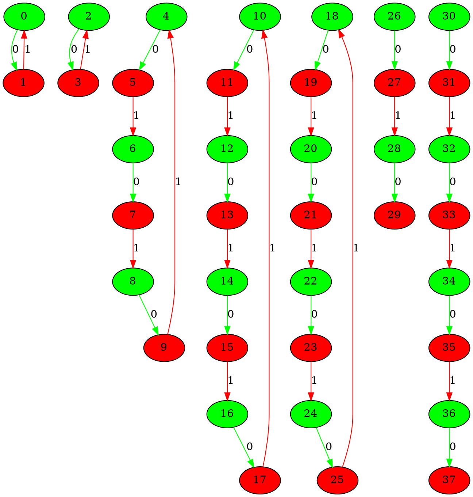
```graphviz
digraph G {
0[label="0" fillcolor="green" style="filled"];
1[label="1" fillcolor="red" style="filled"];
2[label="2" fillcolor="green" style="filled"];
3[label="3" fillcolor="red" style="filled"];
4[label="4" fillcolor="green" style="filled"];
5[label="5" fillcolor="red" style="filled"];
6[label="6" fillcolor="green" style="filled"];
7[label="7" fillcolor="red" style="filled"];
8[label="8" fillcolor="green" style="filled"];
9[label="9" fillcolor="red" style="filled"];
10[label="10" fillcolor="green" style="filled"];
11[label="11" fillcolor="red" style="filled"];
12[label="12" fillcolor="green" style="filled"];
13[label="13" fillcolor="red" style="filled"];
14[label="14" fillcolor="green" style="filled"];
15[label="15" fillcolor="red" style="filled"];
16[label="16" fillcolor="green" style="filled"];
17[label="17" fillcolor="red" style="filled"];
18[label="18" fillcolor="green" style="filled"];
19[label="19" fillcolor="red" style="filled"];
20[label="20" fillcolor="green" style="filled"];
21[label="21" fillcolor="red" style="filled"];
22[label="22" fillcolor="green" style="filled"];
23[label="23" fillcolor="red" style="filled"];
24[label="24" fillcolor="green" style="filled"];
25[label="25" fillcolor="red" style="filled"];
26[label="26" fillcolor="green" style="filled"];
27[label="27" fillcolor="red" style="filled"];
28[label="28" fillcolor="green" style="filled"];
29[label="29" fillcolor="red" style="filled"];
30[label="30" fillcolor="green" style="filled"];
31[label="31" fillcolor="red" style="filled"];
32[label="32" fillcolor="green" style="filled"];
33[label="33" fillcolor="red" style="filled"];
34[label="34" fillcolor="green" style="filled"];
35[label="35" fillcolor="red" style="filled"];
36[label="36" fillcolor="green" style="filled"];
37[label="37" fillcolor="red" style="filled"];
0->1 [label="0" color="green"];
2->3 [label="0" color="green"];
4->5 [label="0" color="green"];
6->7 [label="0" color="green"];
8->9 [label="0" color="green"];
10->11 [label="0" color="green"];
12->13 [label="0" color="green"];
14->15 [label="0" color="green"];
16->17 [label="0" color="green"];
18->19 [label="0" color="green"];
20->21 [label="0" color="green"];
22->23 [label="0" color="green"];
24->25 [label="0" color="green"];
26->27 [label="0" color="green"];
28->29 [label="0" color="green"];
30->31 [label="0" color="green"];
32->33 [label="0" color="green"];
34->35 [label="0" color="green"];
36->37 [label="0" color="green"];
1->0 [label="1" color="red"];
3->2 [label="1" color="red"];
5->6 [label="1" color="red"];
7->8 [label="1" color="red"];
9->4 [label="1" color="red"];
11->12 [label="1" color="red"];
13->14 [label="1" color="red"];
15->16 [label="1" color="red"];
17->10 [label="1" color="red"];
19->20 [label="1" color="red"];
21->22 [label="1" color="red"];
23->24 [label="1" color="red"];
25->18 [label="1" color="red"];
27->28 [label="1" color="red"];
31->32 [label="1" color="red"];
33->34 [label="1" color="red"];
35->36 [label="1" color="red"];
}
```
___
## Graph 12815 - list de compréhension : 1,1,3,4,4,4|2
___
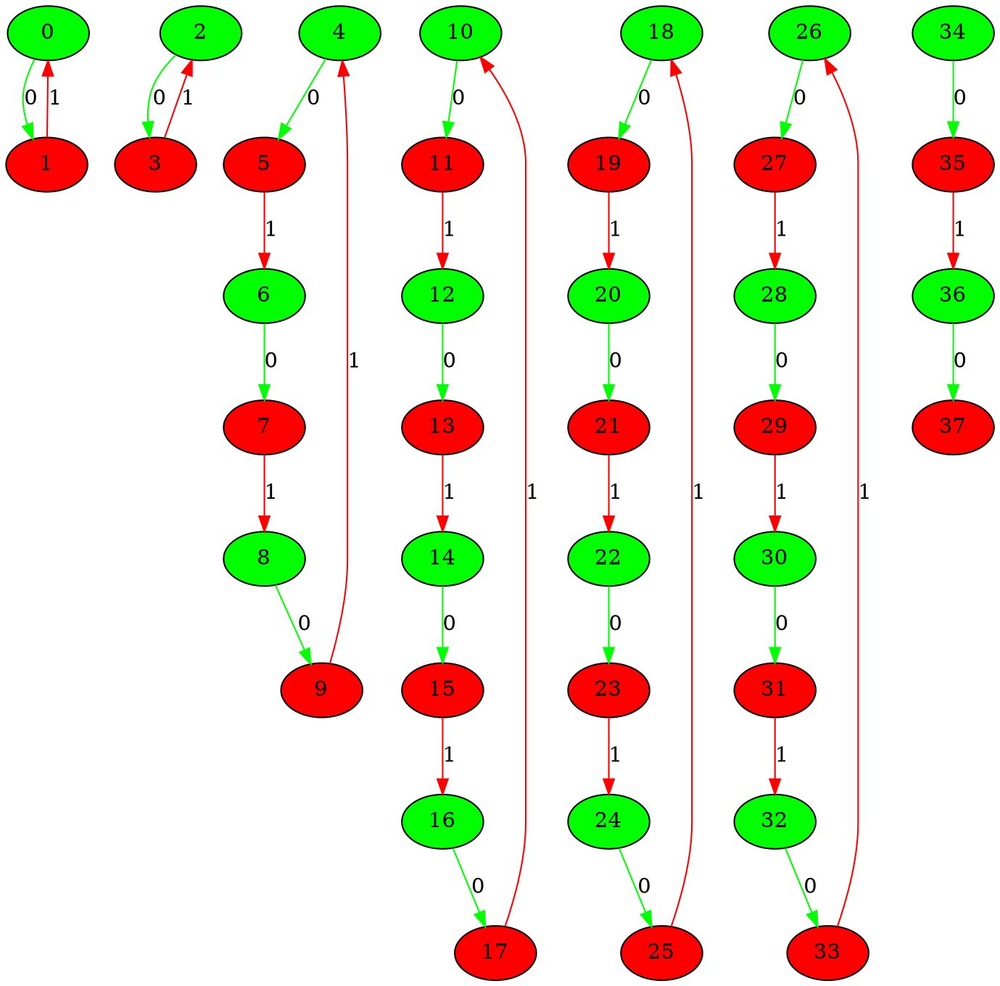
```graphviz
digraph G {
0[label="0" fillcolor="green" style="filled"];
1[label="1" fillcolor="red" style="filled"];
2[label="2" fillcolor="green" style="filled"];
3[label="3" fillcolor="red" style="filled"];
4[label="4" fillcolor="green" style="filled"];
5[label="5" fillcolor="red" style="filled"];
6[label="6" fillcolor="green" style="filled"];
7[label="7" fillcolor="red" style="filled"];
8[label="8" fillcolor="green" style="filled"];
9[label="9" fillcolor="red" style="filled"];
10[label="10" fillcolor="green" style="filled"];
11[label="11" fillcolor="red" style="filled"];
12[label="12" fillcolor="green" style="filled"];
13[label="13" fillcolor="red" style="filled"];
14[label="14" fillcolor="green" style="filled"];
15[label="15" fillcolor="red" style="filled"];
16[label="16" fillcolor="green" style="filled"];
17[label="17" fillcolor="red" style="filled"];
18[label="18" fillcolor="green" style="filled"];
19[label="19" fillcolor="red" style="filled"];
20[label="20" fillcolor="green" style="filled"];
21[label="21" fillcolor="red" style="filled"];
22[label="22" fillcolor="green" style="filled"];
23[label="23" fillcolor="red" style="filled"];
24[label="24" fillcolor="green" style="filled"];
25[label="25" fillcolor="red" style="filled"];
26[label="26" fillcolor="green" style="filled"];
27[label="27" fillcolor="red" style="filled"];
28[label="28" fillcolor="green" style="filled"];
29[label="29" fillcolor="red" style="filled"];
30[label="30" fillcolor="green" style="filled"];
31[label="31" fillcolor="red" style="filled"];
32[label="32" fillcolor="green" style="filled"];
33[label="33" fillcolor="red" style="filled"];
34[label="34" fillcolor="green" style="filled"];
35[label="35" fillcolor="red" style="filled"];
36[label="36" fillcolor="green" style="filled"];
37[label="37" fillcolor="red" style="filled"];
0->1 [label="0" color="green"];
2->3 [label="0" color="green"];
4->5 [label="0" color="green"];
6->7 [label="0" color="green"];
8->9 [label="0" color="green"];
10->11 [label="0" color="green"];
12->13 [label="0" color="green"];
14->15 [label="0" color="green"];
16->17 [label="0" color="green"];
18->19 [label="0" color="green"];
20->21 [label="0" color="green"];
22->23 [label="0" color="green"];
24->25 [label="0" color="green"];
26->27 [label="0" color="green"];
28->29 [label="0" color="green"];
30->31 [label="0" color="green"];
32->33 [label="0" color="green"];
34->35 [label="0" color="green"];
36->37 [label="0" color="green"];
1->0 [label="1" color="red"];
3->2 [label="1" color="red"];
5->6 [label="1" color="red"];
7->8 [label="1" color="red"];
9->4 [label="1" color="red"];
11->12 [label="1" color="red"];
13->14 [label="1" color="red"];
15->16 [label="1" color="red"];
17->10 [label="1" color="red"];
19->20 [label="1" color="red"];
21->22 [label="1" color="red"];
23->24 [label="1" color="red"];
25->18 [label="1" color="red"];
27->28 [label="1" color="red"];
29->30 [label="1" color="red"];
31->32 [label="1" color="red"];
33->26 [label="1" color="red"];
35->36 [label="1" color="red"];
}
```
___
## Graph 12816 - list de compréhension : 1,1,4|2,3,4,4
___
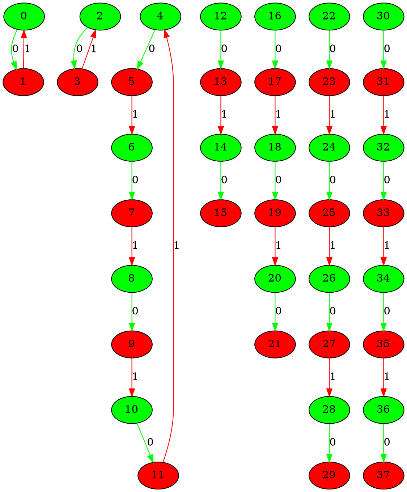
```graphviz
digraph G {
0[label="0" fillcolor="green" style="filled"];
1[label="1" fillcolor="red" style="filled"];
2[label="2" fillcolor="green" style="filled"];
3[label="3" fillcolor="red" style="filled"];
4[label="4" fillcolor="green" style="filled"];
5[label="5" fillcolor="red" style="filled"];
6[label="6" fillcolor="green" style="filled"];
7[label="7" fillcolor="red" style="filled"];
8[label="8" fillcolor="green" style="filled"];
9[label="9" fillcolor="red" style="filled"];
10[label="10" fillcolor="green" style="filled"];
11[label="11" fillcolor="red" style="filled"];
12[label="12" fillcolor="green" style="filled"];
13[label="13" fillcolor="red" style="filled"];
14[label="14" fillcolor="green" style="filled"];
15[label="15" fillcolor="red" style="filled"];
16[label="16" fillcolor="green" style="filled"];
17[label="17" fillcolor="red" style="filled"];
18[label="18" fillcolor="green" style="filled"];
19[label="19" fillcolor="red" style="filled"];
20[label="20" fillcolor="green" style="filled"];
21[label="21" fillcolor="red" style="filled"];
22[label="22" fillcolor="green" style="filled"];
23[label="23" fillcolor="red" style="filled"];
24[label="24" fillcolor="green" style="filled"];
25[label="25" fillcolor="red" style="filled"];
26[label="26" fillcolor="green" style="filled"];
27[label="27" fillcolor="red" style="filled"];
28[label="28" fillcolor="green" style="filled"];
29[label="29" fillcolor="red" style="filled"];
30[label="30" fillcolor="green" style="filled"];
31[label="31" fillcolor="red" style="filled"];
32[label="32" fillcolor="green" style="filled"];
33[label="33" fillcolor="red" style="filled"];
34[label="34" fillcolor="green" style="filled"];
35[label="35" fillcolor="red" style="filled"];
36[label="36" fillcolor="green" style="filled"];
37[label="37" fillcolor="red" style="filled"];
0->1 [label="0" color="green"];
2->3 [label="0" color="green"];
4->5 [label="0" color="green"];
6->7 [label="0" color="green"];
8->9 [label="0" color="green"];
10->11 [label="0" color="green"];
12->13 [label="0" color="green"];
14->15 [label="0" color="green"];
16->17 [label="0" color="green"];
18->19 [label="0" color="green"];
20->21 [label="0" color="green"];
22->23 [label="0" color="green"];
24->25 [label="0" color="green"];
26->27 [label="0" color="green"];
28->29 [label="0" color="green"];
30->31 [label="0" color="green"];
32->33 [label="0" color="green"];
34->35 [label="0" color="green"];
36->37 [label="0" color="green"];
1->0 [label="1" color="red"];
3->2 [label="1" color="red"];
5->6 [label="1" color="red"];
7->8 [label="1" color="red"];
9->10 [label="1" color="red"];
11->4 [label="1" color="red"];
13->14 [label="1" color="red"];
17->18 [label="1" color="red"];
19->20 [label="1" color="red"];
23->24 [label="1" color="red"];
25->26 [label="1" color="red"];
27->28 [label="1" color="red"];
31->32 [label="1" color="red"];
33->34 [label="1" color="red"];
35->36 [label="1" color="red"];
}
```
___
## Graph 12817 - list de compréhension : 1,1,4,4|2,3,4
___
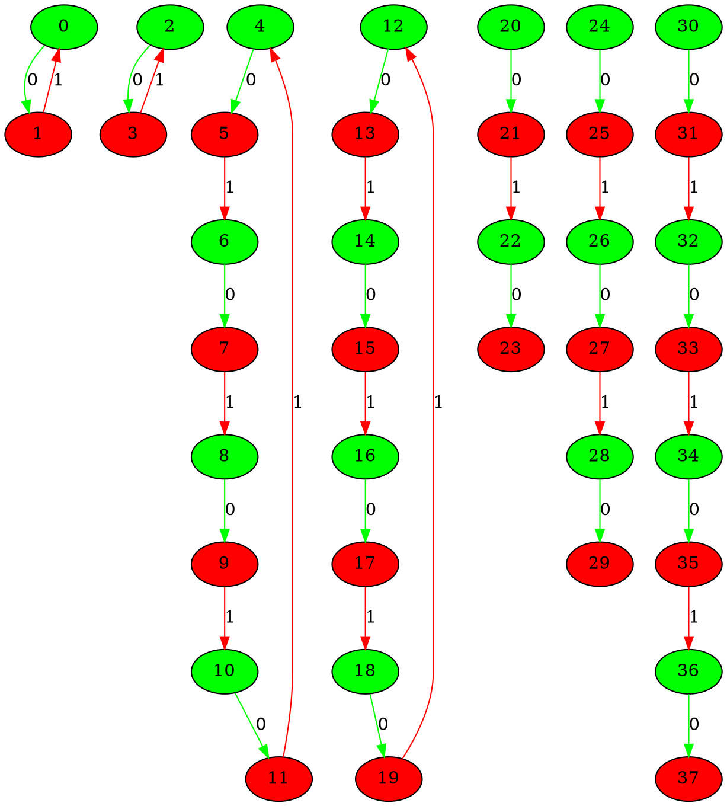
```graphviz
digraph G {
0[label="0" fillcolor="green" style="filled"];
1[label="1" fillcolor="red" style="filled"];
2[label="2" fillcolor="green" style="filled"];
3[label="3" fillcolor="red" style="filled"];
4[label="4" fillcolor="green" style="filled"];
5[label="5" fillcolor="red" style="filled"];
6[label="6" fillcolor="green" style="filled"];
7[label="7" fillcolor="red" style="filled"];
8[label="8" fillcolor="green" style="filled"];
9[label="9" fillcolor="red" style="filled"];
10[label="10" fillcolor="green" style="filled"];
11[label="11" fillcolor="red" style="filled"];
12[label="12" fillcolor="green" style="filled"];
13[label="13" fillcolor="red" style="filled"];
14[label="14" fillcolor="green" style="filled"];
15[label="15" fillcolor="red" style="filled"];
16[label="16" fillcolor="green" style="filled"];
17[label="17" fillcolor="red" style="filled"];
18[label="18" fillcolor="green" style="filled"];
19[label="19" fillcolor="red" style="filled"];
20[label="20" fillcolor="green" style="filled"];
21[label="21" fillcolor="red" style="filled"];
22[label="22" fillcolor="green" style="filled"];
23[label="23" fillcolor="red" style="filled"];
24[label="24" fillcolor="green" style="filled"];
25[label="25" fillcolor="red" style="filled"];
26[label="26" fillcolor="green" style="filled"];
27[label="27" fillcolor="red" style="filled"];
28[label="28" fillcolor="green" style="filled"];
29[label="29" fillcolor="red" style="filled"];
30[label="30" fillcolor="green" style="filled"];
31[label="31" fillcolor="red" style="filled"];
32[label="32" fillcolor="green" style="filled"];
33[label="33" fillcolor="red" style="filled"];
34[label="34" fillcolor="green" style="filled"];
35[label="35" fillcolor="red" style="filled"];
36[label="36" fillcolor="green" style="filled"];
37[label="37" fillcolor="red" style="filled"];
0->1 [label="0" color="green"];
2->3 [label="0" color="green"];
4->5 [label="0" color="green"];
6->7 [label="0" color="green"];
8->9 [label="0" color="green"];
10->11 [label="0" color="green"];
12->13 [label="0" color="green"];
14->15 [label="0" color="green"];
16->17 [label="0" color="green"];
18->19 [label="0" color="green"];
20->21 [label="0" color="green"];
22->23 [label="0" color="green"];
24->25 [label="0" color="green"];
26->27 [label="0" color="green"];
28->29 [label="0" color="green"];
30->31 [label="0" color="green"];
32->33 [label="0" color="green"];
34->35 [label="0" color="green"];
36->37 [label="0" color="green"];
1->0 [label="1" color="red"];
3->2 [label="1" color="red"];
5->6 [label="1" color="red"];
7->8 [label="1" color="red"];
9->10 [label="1" color="red"];
11->4 [label="1" color="red"];
13->14 [label="1" color="red"];
15->16 [label="1" color="red"];
17->18 [label="1" color="red"];
19->12 [label="1" color="red"];
21->22 [label="1" color="red"];
25->26 [label="1" color="red"];
27->28 [label="1" color="red"];
31->32 [label="1" color="red"];
33->34 [label="1" color="red"];
35->36 [label="1" color="red"];
}
```
___
## Graph 12818 - list de compréhension : 1,1,4,4,4|2,3
___
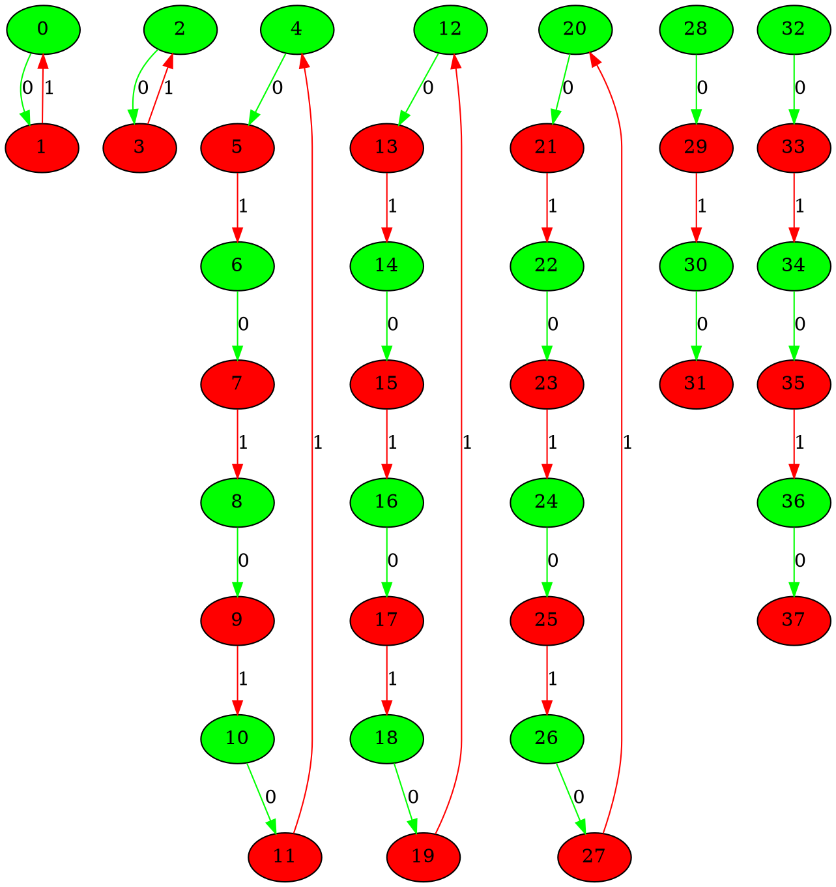
```graphviz
digraph G {
0[label="0" fillcolor="green" style="filled"];
1[label="1" fillcolor="red" style="filled"];
2[label="2" fillcolor="green" style="filled"];
3[label="3" fillcolor="red" style="filled"];
4[label="4" fillcolor="green" style="filled"];
5[label="5" fillcolor="red" style="filled"];
6[label="6" fillcolor="green" style="filled"];
7[label="7" fillcolor="red" style="filled"];
8[label="8" fillcolor="green" style="filled"];
9[label="9" fillcolor="red" style="filled"];
10[label="10" fillcolor="green" style="filled"];
11[label="11" fillcolor="red" style="filled"];
12[label="12" fillcolor="green" style="filled"];
13[label="13" fillcolor="red" style="filled"];
14[label="14" fillcolor="green" style="filled"];
15[label="15" fillcolor="red" style="filled"];
16[label="16" fillcolor="green" style="filled"];
17[label="17" fillcolor="red" style="filled"];
18[label="18" fillcolor="green" style="filled"];
19[label="19" fillcolor="red" style="filled"];
20[label="20" fillcolor="green" style="filled"];
21[label="21" fillcolor="red" style="filled"];
22[label="22" fillcolor="green" style="filled"];
23[label="23" fillcolor="red" style="filled"];
24[label="24" fillcolor="green" style="filled"];
25[label="25" fillcolor="red" style="filled"];
26[label="26" fillcolor="green" style="filled"];
27[label="27" fillcolor="red" style="filled"];
28[label="28" fillcolor="green" style="filled"];
29[label="29" fillcolor="red" style="filled"];
30[label="30" fillcolor="green" style="filled"];
31[label="31" fillcolor="red" style="filled"];
32[label="32" fillcolor="green" style="filled"];
33[label="33" fillcolor="red" style="filled"];
34[label="34" fillcolor="green" style="filled"];
35[label="35" fillcolor="red" style="filled"];
36[label="36" fillcolor="green" style="filled"];
37[label="37" fillcolor="red" style="filled"];
0->1 [label="0" color="green"];
2->3 [label="0" color="green"];
4->5 [label="0" color="green"];
6->7 [label="0" color="green"];
8->9 [label="0" color="green"];
10->11 [label="0" color="green"];
12->13 [label="0" color="green"];
14->15 [label="0" color="green"];
16->17 [label="0" color="green"];
18->19 [label="0" color="green"];
20->21 [label="0" color="green"];
22->23 [label="0" color="green"];
24->25 [label="0" color="green"];
26->27 [label="0" color="green"];
28->29 [label="0" color="green"];
30->31 [label="0" color="green"];
32->33 [label="0" color="green"];
34->35 [label="0" color="green"];
36->37 [label="0" color="green"];
1->0 [label="1" color="red"];
3->2 [label="1" color="red"];
5->6 [label="1" color="red"];
7->8 [label="1" color="red"];
9->10 [label="1" color="red"];
11->4 [label="1" color="red"];
13->14 [label="1" color="red"];
15->16 [label="1" color="red"];
17->18 [label="1" color="red"];
19->12 [label="1" color="red"];
21->22 [label="1" color="red"];
23->24 [label="1" color="red"];
25->26 [label="1" color="red"];
27->20 [label="1" color="red"];
29->30 [label="1" color="red"];
33->34 [label="1" color="red"];
35->36 [label="1" color="red"];
}
```
___
## Graph 12819 - list de compréhension : 1,2|1,3,4,4,4
___
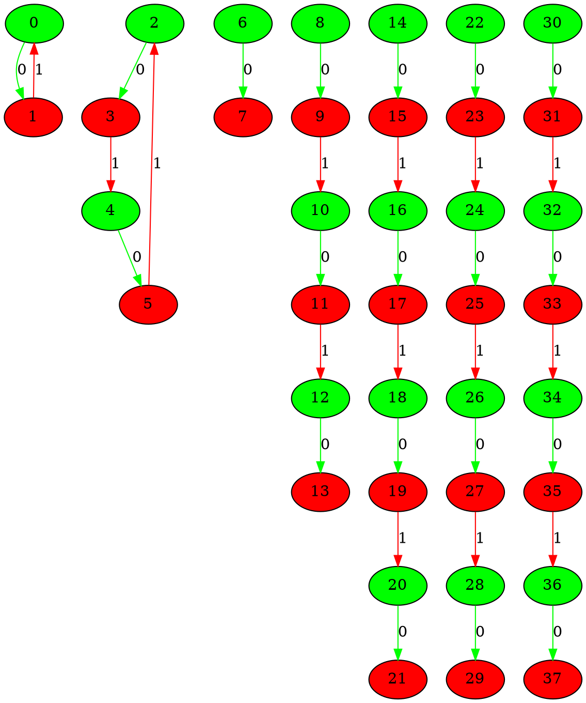
```graphviz
digraph G {
0[label="0" fillcolor="green" style="filled"];
1[label="1" fillcolor="red" style="filled"];
2[label="2" fillcolor="green" style="filled"];
3[label="3" fillcolor="red" style="filled"];
4[label="4" fillcolor="green" style="filled"];
5[label="5" fillcolor="red" style="filled"];
6[label="6" fillcolor="green" style="filled"];
7[label="7" fillcolor="red" style="filled"];
8[label="8" fillcolor="green" style="filled"];
9[label="9" fillcolor="red" style="filled"];
10[label="10" fillcolor="green" style="filled"];
11[label="11" fillcolor="red" style="filled"];
12[label="12" fillcolor="green" style="filled"];
13[label="13" fillcolor="red" style="filled"];
14[label="14" fillcolor="green" style="filled"];
15[label="15" fillcolor="red" style="filled"];
16[label="16" fillcolor="green" style="filled"];
17[label="17" fillcolor="red" style="filled"];
18[label="18" fillcolor="green" style="filled"];
19[label="19" fillcolor="red" style="filled"];
20[label="20" fillcolor="green" style="filled"];
21[label="21" fillcolor="red" style="filled"];
22[label="22" fillcolor="green" style="filled"];
23[label="23" fillcolor="red" style="filled"];
24[label="24" fillcolor="green" style="filled"];
25[label="25" fillcolor="red" style="filled"];
26[label="26" fillcolor="green" style="filled"];
27[label="27" fillcolor="red" style="filled"];
28[label="28" fillcolor="green" style="filled"];
29[label="29" fillcolor="red" style="filled"];
30[label="30" fillcolor="green" style="filled"];
31[label="31" fillcolor="red" style="filled"];
32[label="32" fillcolor="green" style="filled"];
33[label="33" fillcolor="red" style="filled"];
34[label="34" fillcolor="green" style="filled"];
35[label="35" fillcolor="red" style="filled"];
36[label="36" fillcolor="green" style="filled"];
37[label="37" fillcolor="red" style="filled"];
0->1 [label="0" color="green"];
2->3 [label="0" color="green"];
4->5 [label="0" color="green"];
6->7 [label="0" color="green"];
8->9 [label="0" color="green"];
10->11 [label="0" color="green"];
12->13 [label="0" color="green"];
14->15 [label="0" color="green"];
16->17 [label="0" color="green"];
18->19 [label="0" color="green"];
20->21 [label="0" color="green"];
22->23 [label="0" color="green"];
24->25 [label="0" color="green"];
26->27 [label="0" color="green"];
28->29 [label="0" color="green"];
30->31 [label="0" color="green"];
32->33 [label="0" color="green"];
34->35 [label="0" color="green"];
36->37 [label="0" color="green"];
1->0 [label="1" color="red"];
3->4 [label="1" color="red"];
5->2 [label="1" color="red"];
9->10 [label="1" color="red"];
11->12 [label="1" color="red"];
15->16 [label="1" color="red"];
17->18 [label="1" color="red"];
19->20 [label="1" color="red"];
23->24 [label="1" color="red"];
25->26 [label="1" color="red"];
27->28 [label="1" color="red"];
31->32 [label="1" color="red"];
33->34 [label="1" color="red"];
35->36 [label="1" color="red"];
}
```
___
## Graph 12820 - list de compréhension : 1,2,3|1,4,4,4
___
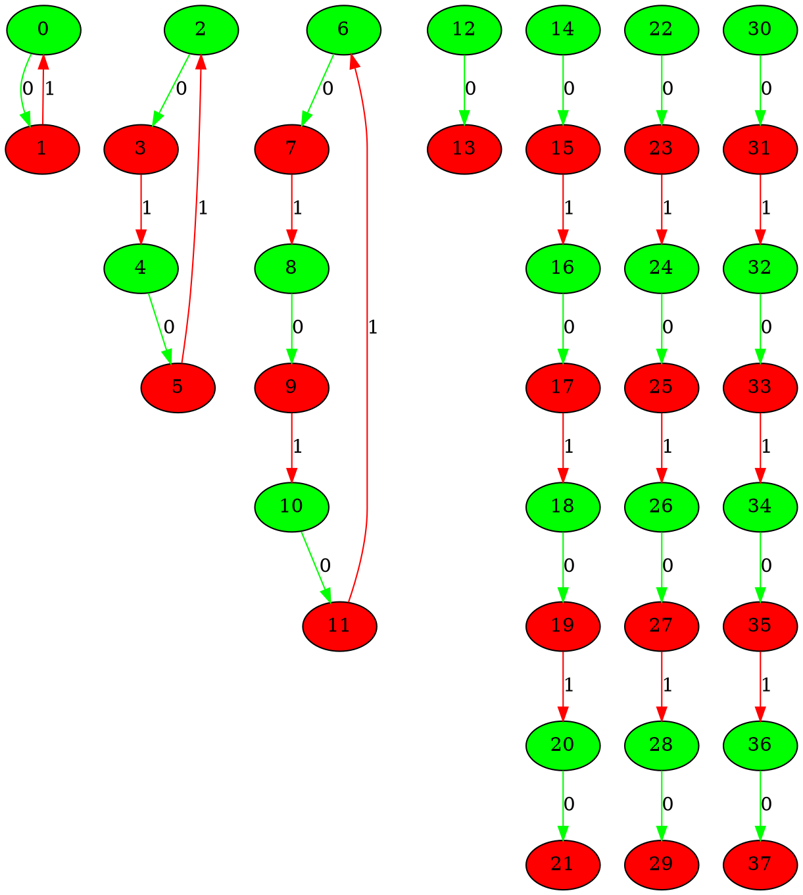
```graphviz
digraph G {
0[label="0" fillcolor="green" style="filled"];
1[label="1" fillcolor="red" style="filled"];
2[label="2" fillcolor="green" style="filled"];
3[label="3" fillcolor="red" style="filled"];
4[label="4" fillcolor="green" style="filled"];
5[label="5" fillcolor="red" style="filled"];
6[label="6" fillcolor="green" style="filled"];
7[label="7" fillcolor="red" style="filled"];
8[label="8" fillcolor="green" style="filled"];
9[label="9" fillcolor="red" style="filled"];
10[label="10" fillcolor="green" style="filled"];
11[label="11" fillcolor="red" style="filled"];
12[label="12" fillcolor="green" style="filled"];
13[label="13" fillcolor="red" style="filled"];
14[label="14" fillcolor="green" style="filled"];
15[label="15" fillcolor="red" style="filled"];
16[label="16" fillcolor="green" style="filled"];
17[label="17" fillcolor="red" style="filled"];
18[label="18" fillcolor="green" style="filled"];
19[label="19" fillcolor="red" style="filled"];
20[label="20" fillcolor="green" style="filled"];
21[label="21" fillcolor="red" style="filled"];
22[label="22" fillcolor="green" style="filled"];
23[label="23" fillcolor="red" style="filled"];
24[label="24" fillcolor="green" style="filled"];
25[label="25" fillcolor="red" style="filled"];
26[label="26" fillcolor="green" style="filled"];
27[label="27" fillcolor="red" style="filled"];
28[label="28" fillcolor="green" style="filled"];
29[label="29" fillcolor="red" style="filled"];
30[label="30" fillcolor="green" style="filled"];
31[label="31" fillcolor="red" style="filled"];
32[label="32" fillcolor="green" style="filled"];
33[label="33" fillcolor="red" style="filled"];
34[label="34" fillcolor="green" style="filled"];
35[label="35" fillcolor="red" style="filled"];
36[label="36" fillcolor="green" style="filled"];
37[label="37" fillcolor="red" style="filled"];
0->1 [label="0" color="green"];
2->3 [label="0" color="green"];
4->5 [label="0" color="green"];
6->7 [label="0" color="green"];
8->9 [label="0" color="green"];
10->11 [label="0" color="green"];
12->13 [label="0" color="green"];
14->15 [label="0" color="green"];
16->17 [label="0" color="green"];
18->19 [label="0" color="green"];
20->21 [label="0" color="green"];
22->23 [label="0" color="green"];
24->25 [label="0" color="green"];
26->27 [label="0" color="green"];
28->29 [label="0" color="green"];
30->31 [label="0" color="green"];
32->33 [label="0" color="green"];
34->35 [label="0" color="green"];
36->37 [label="0" color="green"];
1->0 [label="1" color="red"];
3->4 [label="1" color="red"];
5->2 [label="1" color="red"];
7->8 [label="1" color="red"];
9->10 [label="1" color="red"];
11->6 [label="1" color="red"];
15->16 [label="1" color="red"];
17->18 [label="1" color="red"];
19->20 [label="1" color="red"];
23->24 [label="1" color="red"];
25->26 [label="1" color="red"];
27->28 [label="1" color="red"];
31->32 [label="1" color="red"];
33->34 [label="1" color="red"];
35->36 [label="1" color="red"];
}
```
___
## Graph 12821 - list de compréhension : 1,2,3,4|1,4,4
___
```graphviz
digraph G {
0[label="0" fillcolor="green" style="filled"];
1[label="1" fillcolor="red" style="filled"];
2[label="2" fillcolor="green" style="filled"];
3[label="3" fillcolor="red" style="filled"];
4[label="4" fillcolor="green" style="filled"];
5[label="5" fillcolor="red" style="filled"];
6[label="6" fillcolor="green" style="filled"];
7[label="7" fillcolor="red" style="filled"];
8[label="8" fillcolor="green" style="filled"];
9[label="9" fillcolor="red" style="filled"];
10[label="10" fillcolor="green" style="filled"];
11[label="11" fillcolor="red" style="filled"];
12[label="12" fillcolor="green" style="filled"];
13[label="13" fillcolor="red" style="filled"];
14[label="14" fillcolor="green" style="filled"];
15[label="15" fillcolor="red" style="filled"];
16[label="16" fillcolor="green" style="filled"];
17[label="17" fillcolor="red" style="filled"];
18[label="18" fillcolor="green" style="filled"];
19[label="19" fillcolor="red" style="filled"];
20[label="20" fillcolor="green" style="filled"];
21[label="21" fillcolor="red" style="filled"];
22[label="22" fillcolor="green" style="filled"];
23[label="23" fillcolor="red" style="filled"];
24[label="24" fillcolor="green" style="filled"];
25[label="25" fillcolor="red" style="filled"];
26[label="26" fillcolor="green" style="filled"];
27[label="27" fillcolor="red" style="filled"];
28[label="28" fillcolor="green" style="filled"];
29[label="29" fillcolor="red" style="filled"];
30[label="30" fillcolor="green" style="filled"];
31[label="31" fillcolor="red" style="filled"];
32[label="32" fillcolor="green" style="filled"];
33[label="33" fillcolor="red" style="filled"];
34[label="34" fillcolor="green" style="filled"];
35[label="35" fillcolor="red" style="filled"];
36[label="36" fillcolor="green" style="filled"];
37[label="37" fillcolor="red" style="filled"];
0->1 [label="0" color="green"];
2->3 [label="0" color="green"];
4->5 [label="0" color="green"];
6->7 [label="0" color="green"];
8->9 [label="0" color="green"];
10->11 [label="0" color="green"];
12->13 [label="0" color="green"];
14->15 [label="0" color="green"];
16->17 [label="0" color="green"];
18->19 [label="0" color="green"];
20->21 [label="0" color="green"];
22->23 [label="0" color="green"];
24->25 [label="0" color="green"];
26->27 [label="0" color="green"];
28->29 [label="0" color="green"];
30->31 [label="0" color="green"];
32->33 [label="0" color="green"];
34->35 [label="0" color="green"];
36->37 [label="0" color="green"];
1->0 [label="1" color="red"];
3->4 [label="1" color="red"];
5->2 [label="1" color="red"];
7->8 [label="1" color="red"];
9->10 [label="1" color="red"];
11->6 [label="1" color="red"];
13->14 [label="1" color="red"];
15->16 [label="1" color="red"];
17->18 [label="1" color="red"];
19->12 [label="1" color="red"];
23->24 [label="1" color="red"];
25->26 [label="1" color="red"];
27->28 [label="1" color="red"];
31->32 [label="1" color="red"];
33->34 [label="1" color="red"];
35->36 [label="1" color="red"];
}
```
___
## Graph 12822 - list de compréhension : 1,2,3,4,4|1,4
___
```graphviz
digraph G {
0[label="0" fillcolor="green" style="filled"];
1[label="1" fillcolor="red" style="filled"];
2[label="2" fillcolor="green" style="filled"];
3[label="3" fillcolor="red" style="filled"];
4[label="4" fillcolor="green" style="filled"];
5[label="5" fillcolor="red" style="filled"];
6[label="6" fillcolor="green" style="filled"];
7[label="7" fillcolor="red" style="filled"];
8[label="8" fillcolor="green" style="filled"];
9[label="9" fillcolor="red" style="filled"];
10[label="10" fillcolor="green" style="filled"];
11[label="11" fillcolor="red" style="filled"];
12[label="12" fillcolor="green" style="filled"];
13[label="13" fillcolor="red" style="filled"];
14[label="14" fillcolor="green" style="filled"];
15[label="15" fillcolor="red" style="filled"];
16[label="16" fillcolor="green" style="filled"];
17[label="17" fillcolor="red" style="filled"];
18[label="18" fillcolor="green" style="filled"];
19[label="19" fillcolor="red" style="filled"];
20[label="20" fillcolor="green" style="filled"];
21[label="21" fillcolor="red" style="filled"];
22[label="22" fillcolor="green" style="filled"];
23[label="23" fillcolor="red" style="filled"];
24[label="24" fillcolor="green" style="filled"];
25[label="25" fillcolor="red" style="filled"];
26[label="26" fillcolor="green" style="filled"];
27[label="27" fillcolor="red" style="filled"];
28[label="28" fillcolor="green" style="filled"];
29[label="29" fillcolor="red" style="filled"];
30[label="30" fillcolor="green" style="filled"];
31[label="31" fillcolor="red" style="filled"];
32[label="32" fillcolor="green" style="filled"];
33[label="33" fillcolor="red" style="filled"];
34[label="34" fillcolor="green" style="filled"];
35[label="35" fillcolor="red" style="filled"];
36[label="36" fillcolor="green" style="filled"];
37[label="37" fillcolor="red" style="filled"];
0->1 [label="0" color="green"];
2->3 [label="0" color="green"];
4->5 [label="0" color="green"];
6->7 [label="0" color="green"];
8->9 [label="0" color="green"];
10->11 [label="0" color="green"];
12->13 [label="0" color="green"];
14->15 [label="0" color="green"];
16->17 [label="0" color="green"];
18->19 [label="0" color="green"];
20->21 [label="0" color="green"];
22->23 [label="0" color="green"];
24->25 [label="0" color="green"];
26->27 [label="0" color="green"];
28->29 [label="0" color="green"];
30->31 [label="0" color="green"];
32->33 [label="0" color="green"];
34->35 [label="0" color="green"];
36->37 [label="0" color="green"];
1->0 [label="1" color="red"];
3->4 [label="1" color="red"];
5->2 [label="1" color="red"];
7->8 [label="1" color="red"];
9->10 [label="1" color="red"];
11->6 [label="1" color="red"];
13->14 [label="1" color="red"];
15->16 [label="1" color="red"];
17->18 [label="1" color="red"];
19->12 [label="1" color="red"];
21->22 [label="1" color="red"];
23->24 [label="1" color="red"];
25->26 [label="1" color="red"];
27->20 [label="1" color="red"];
31->32 [label="1" color="red"];
33->34 [label="1" color="red"];
35->36 [label="1" color="red"];
}
```
___
## Graph 12823 - list de compréhension : 1,2,3,4,4,4|1
___
```graphviz
digraph G {
0[label="0" fillcolor="green" style="filled"];
1[label="1" fillcolor="red" style="filled"];
2[label="2" fillcolor="green" style="filled"];
3[label="3" fillcolor="red" style="filled"];
4[label="4" fillcolor="green" style="filled"];
5[label="5" fillcolor="red" style="filled"];
6[label="6" fillcolor="green" style="filled"];
7[label="7" fillcolor="red" style="filled"];
8[label="8" fillcolor="green" style="filled"];
9[label="9" fillcolor="red" style="filled"];
10[label="10" fillcolor="green" style="filled"];
11[label="11" fillcolor="red" style="filled"];
12[label="12" fillcolor="green" style="filled"];
13[label="13" fillcolor="red" style="filled"];
14[label="14" fillcolor="green" style="filled"];
15[label="15" fillcolor="red" style="filled"];
16[label="16" fillcolor="green" style="filled"];
17[label="17" fillcolor="red" style="filled"];
18[label="18" fillcolor="green" style="filled"];
19[label="19" fillcolor="red" style="filled"];
20[label="20" fillcolor="green" style="filled"];
21[label="21" fillcolor="red" style="filled"];
22[label="22" fillcolor="green" style="filled"];
23[label="23" fillcolor="red" style="filled"];
24[label="24" fillcolor="green" style="filled"];
25[label="25" fillcolor="red" style="filled"];
26[label="26" fillcolor="green" style="filled"];
27[label="27" fillcolor="red" style="filled"];
28[label="28" fillcolor="green" style="filled"];
29[label="29" fillcolor="red" style="filled"];
30[label="30" fillcolor="green" style="filled"];
31[label="31" fillcolor="red" style="filled"];
32[label="32" fillcolor="green" style="filled"];
33[label="33" fillcolor="red" style="filled"];
34[label="34" fillcolor="green" style="filled"];
35[label="35" fillcolor="red" style="filled"];
36[label="36" fillcolor="green" style="filled"];
37[label="37" fillcolor="red" style="filled"];
0->1 [label="0" color="green"];
2->3 [label="0" color="green"];
4->5 [label="0" color="green"];
6->7 [label="0" color="green"];
8->9 [label="0" color="green"];
10->11 [label="0" color="green"];
12->13 [label="0" color="green"];
14->15 [label="0" color="green"];
16->17 [label="0" color="green"];
18->19 [label="0" color="green"];
20->21 [label="0" color="green"];
22->23 [label="0" color="green"];
24->25 [label="0" color="green"];
26->27 [label="0" color="green"];
28->29 [label="0" color="green"];
30->31 [label="0" color="green"];
32->33 [label="0" color="green"];
34->35 [label="0" color="green"];
36->37 [label="0" color="green"];
1->0 [label="1" color="red"];
3->4 [label="1" color="red"];
5->2 [label="1" color="red"];
7->8 [label="1" color="red"];
9->10 [label="1" color="red"];
11->6 [label="1" color="red"];
13->14 [label="1" color="red"];
15->16 [label="1" color="red"];
17->18 [label="1" color="red"];
19->12 [label="1" color="red"];
21->22 [label="1" color="red"];
23->24 [label="1" color="red"];
25->26 [label="1" color="red"];
27->20 [label="1" color="red"];
29->30 [label="1" color="red"];
31->32 [label="1" color="red"];
33->34 [label="1" color="red"];
35->28 [label="1" color="red"];
}
```
___
## Graph 12824 - list de compréhension : 1,2,4|1,3,4,4
___
```graphviz
digraph G {
0[label="0" fillcolor="green" style="filled"];
1[label="1" fillcolor="red" style="filled"];
2[label="2" fillcolor="green" style="filled"];
3[label="3" fillcolor="red" style="filled"];
4[label="4" fillcolor="green" style="filled"];
5[label="5" fillcolor="red" style="filled"];
6[label="6" fillcolor="green" style="filled"];
7[label="7" fillcolor="red" style="filled"];
8[label="8" fillcolor="green" style="filled"];
9[label="9" fillcolor="red" style="filled"];
10[label="10" fillcolor="green" style="filled"];
11[label="11" fillcolor="red" style="filled"];
12[label="12" fillcolor="green" style="filled"];
13[label="13" fillcolor="red" style="filled"];
14[label="14" fillcolor="green" style="filled"];
15[label="15" fillcolor="red" style="filled"];
16[label="16" fillcolor="green" style="filled"];
17[label="17" fillcolor="red" style="filled"];
18[label="18" fillcolor="green" style="filled"];
19[label="19" fillcolor="red" style="filled"];
20[label="20" fillcolor="green" style="filled"];
21[label="21" fillcolor="red" style="filled"];
22[label="22" fillcolor="green" style="filled"];
23[label="23" fillcolor="red" style="filled"];
24[label="24" fillcolor="green" style="filled"];
25[label="25" fillcolor="red" style="filled"];
26[label="26" fillcolor="green" style="filled"];
27[label="27" fillcolor="red" style="filled"];
28[label="28" fillcolor="green" style="filled"];
29[label="29" fillcolor="red" style="filled"];
30[label="30" fillcolor="green" style="filled"];
31[label="31" fillcolor="red" style="filled"];
32[label="32" fillcolor="green" style="filled"];
33[label="33" fillcolor="red" style="filled"];
34[label="34" fillcolor="green" style="filled"];
35[label="35" fillcolor="red" style="filled"];
36[label="36" fillcolor="green" style="filled"];
37[label="37" fillcolor="red" style="filled"];
0->1 [label="0" color="green"];
2->3 [label="0" color="green"];
4->5 [label="0" color="green"];
6->7 [label="0" color="green"];
8->9 [label="0" color="green"];
10->11 [label="0" color="green"];
12->13 [label="0" color="green"];
14->15 [label="0" color="green"];
16->17 [label="0" color="green"];
18->19 [label="0" color="green"];
20->21 [label="0" color="green"];
22->23 [label="0" color="green"];
24->25 [label="0" color="green"];
26->27 [label="0" color="green"];
28->29 [label="0" color="green"];
30->31 [label="0" color="green"];
32->33 [label="0" color="green"];
34->35 [label="0" color="green"];
36->37 [label="0" color="green"];
1->0 [label="1" color="red"];
3->4 [label="1" color="red"];
5->2 [label="1" color="red"];
7->8 [label="1" color="red"];
9->10 [label="1" color="red"];
11->12 [label="1" color="red"];
13->6 [label="1" color="red"];
17->18 [label="1" color="red"];
19->20 [label="1" color="red"];
23->24 [label="1" color="red"];
25->26 [label="1" color="red"];
27->28 [label="1" color="red"];
31->32 [label="1" color="red"];
33->34 [label="1" color="red"];
35->36 [label="1" color="red"];
}
```
___
## Graph 12825 - list de compréhension : 1,2,4,4|1,3,4
___
```graphviz
digraph G {
0[label="0" fillcolor="green" style="filled"];
1[label="1" fillcolor="red" style="filled"];
2[label="2" fillcolor="green" style="filled"];
3[label="3" fillcolor="red" style="filled"];
4[label="4" fillcolor="green" style="filled"];
5[label="5" fillcolor="red" style="filled"];
6[label="6" fillcolor="green" style="filled"];
7[label="7" fillcolor="red" style="filled"];
8[label="8" fillcolor="green" style="filled"];
9[label="9" fillcolor="red" style="filled"];
10[label="10" fillcolor="green" style="filled"];
11[label="11" fillcolor="red" style="filled"];
12[label="12" fillcolor="green" style="filled"];
13[label="13" fillcolor="red" style="filled"];
14[label="14" fillcolor="green" style="filled"];
15[label="15" fillcolor="red" style="filled"];
16[label="16" fillcolor="green" style="filled"];
17[label="17" fillcolor="red" style="filled"];
18[label="18" fillcolor="green" style="filled"];
19[label="19" fillcolor="red" style="filled"];
20[label="20" fillcolor="green" style="filled"];
21[label="21" fillcolor="red" style="filled"];
22[label="22" fillcolor="green" style="filled"];
23[label="23" fillcolor="red" style="filled"];
24[label="24" fillcolor="green" style="filled"];
25[label="25" fillcolor="red" style="filled"];
26[label="26" fillcolor="green" style="filled"];
27[label="27" fillcolor="red" style="filled"];
28[label="28" fillcolor="green" style="filled"];
29[label="29" fillcolor="red" style="filled"];
30[label="30" fillcolor="green" style="filled"];
31[label="31" fillcolor="red" style="filled"];
32[label="32" fillcolor="green" style="filled"];
33[label="33" fillcolor="red" style="filled"];
34[label="34" fillcolor="green" style="filled"];
35[label="35" fillcolor="red" style="filled"];
36[label="36" fillcolor="green" style="filled"];
37[label="37" fillcolor="red" style="filled"];
0->1 [label="0" color="green"];
2->3 [label="0" color="green"];
4->5 [label="0" color="green"];
6->7 [label="0" color="green"];
8->9 [label="0" color="green"];
10->11 [label="0" color="green"];
12->13 [label="0" color="green"];
14->15 [label="0" color="green"];
16->17 [label="0" color="green"];
18->19 [label="0" color="green"];
20->21 [label="0" color="green"];
22->23 [label="0" color="green"];
24->25 [label="0" color="green"];
26->27 [label="0" color="green"];
28->29 [label="0" color="green"];
30->31 [label="0" color="green"];
32->33 [label="0" color="green"];
34->35 [label="0" color="green"];
36->37 [label="0" color="green"];
1->0 [label="1" color="red"];
3->4 [label="1" color="red"];
5->2 [label="1" color="red"];
7->8 [label="1" color="red"];
9->10 [label="1" color="red"];
11->12 [label="1" color="red"];
13->6 [label="1" color="red"];
15->16 [label="1" color="red"];
17->18 [label="1" color="red"];
19->20 [label="1" color="red"];
21->14 [label="1" color="red"];
25->26 [label="1" color="red"];
27->28 [label="1" color="red"];
31->32 [label="1" color="red"];
33->34 [label="1" color="red"];
35->36 [label="1" color="red"];
}
```
___
## Graph 12826 - list de compréhension : 1,2,4,4,4|1,3
___
```graphviz
digraph G {
0[label="0" fillcolor="green" style="filled"];
1[label="1" fillcolor="red" style="filled"];
2[label="2" fillcolor="green" style="filled"];
3[label="3" fillcolor="red" style="filled"];
4[label="4" fillcolor="green" style="filled"];
5[label="5" fillcolor="red" style="filled"];
6[label="6" fillcolor="green" style="filled"];
7[label="7" fillcolor="red" style="filled"];
8[label="8" fillcolor="green" style="filled"];
9[label="9" fillcolor="red" style="filled"];
10[label="10" fillcolor="green" style="filled"];
11[label="11" fillcolor="red" style="filled"];
12[label="12" fillcolor="green" style="filled"];
13[label="13" fillcolor="red" style="filled"];
14[label="14" fillcolor="green" style="filled"];
15[label="15" fillcolor="red" style="filled"];
16[label="16" fillcolor="green" style="filled"];
17[label="17" fillcolor="red" style="filled"];
18[label="18" fillcolor="green" style="filled"];
19[label="19" fillcolor="red" style="filled"];
20[label="20" fillcolor="green" style="filled"];
21[label="21" fillcolor="red" style="filled"];
22[label="22" fillcolor="green" style="filled"];
23[label="23" fillcolor="red" style="filled"];
24[label="24" fillcolor="green" style="filled"];
25[label="25" fillcolor="red" style="filled"];
26[label="26" fillcolor="green" style="filled"];
27[label="27" fillcolor="red" style="filled"];
28[label="28" fillcolor="green" style="filled"];
29[label="29" fillcolor="red" style="filled"];
30[label="30" fillcolor="green" style="filled"];
31[label="31" fillcolor="red" style="filled"];
32[label="32" fillcolor="green" style="filled"];
33[label="33" fillcolor="red" style="filled"];
34[label="34" fillcolor="green" style="filled"];
35[label="35" fillcolor="red" style="filled"];
36[label="36" fillcolor="green" style="filled"];
37[label="37" fillcolor="red" style="filled"];
0->1 [label="0" color="green"];
2->3 [label="0" color="green"];
4->5 [label="0" color="green"];
6->7 [label="0" color="green"];
8->9 [label="0" color="green"];
10->11 [label="0" color="green"];
12->13 [label="0" color="green"];
14->15 [label="0" color="green"];
16->17 [label="0" color="green"];
18->19 [label="0" color="green"];
20->21 [label="0" color="green"];
22->23 [label="0" color="green"];
24->25 [label="0" color="green"];
26->27 [label="0" color="green"];
28->29 [label="0" color="green"];
30->31 [label="0" color="green"];
32->33 [label="0" color="green"];
34->35 [label="0" color="green"];
36->37 [label="0" color="green"];
1->0 [label="1" color="red"];
3->4 [label="1" color="red"];
5->2 [label="1" color="red"];
7->8 [label="1" color="red"];
9->10 [label="1" color="red"];
11->12 [label="1" color="red"];
13->6 [label="1" color="red"];
15->16 [label="1" color="red"];
17->18 [label="1" color="red"];
19->20 [label="1" color="red"];
21->14 [label="1" color="red"];
23->24 [label="1" color="red"];
25->26 [label="1" color="red"];
27->28 [label="1" color="red"];
29->22 [label="1" color="red"];
33->34 [label="1" color="red"];
35->36 [label="1" color="red"];
}
```
___
## Graph 12827 - list de compréhension : 1,3|1,2,4,4,4
___
```graphviz
digraph G {
0[label="0" fillcolor="green" style="filled"];
1[label="1" fillcolor="red" style="filled"];
2[label="2" fillcolor="green" style="filled"];
3[label="3" fillcolor="red" style="filled"];
4[label="4" fillcolor="green" style="filled"];
5[label="5" fillcolor="red" style="filled"];
6[label="6" fillcolor="green" style="filled"];
7[label="7" fillcolor="red" style="filled"];
8[label="8" fillcolor="green" style="filled"];
9[label="9" fillcolor="red" style="filled"];
10[label="10" fillcolor="green" style="filled"];
11[label="11" fillcolor="red" style="filled"];
12[label="12" fillcolor="green" style="filled"];
13[label="13" fillcolor="red" style="filled"];
14[label="14" fillcolor="green" style="filled"];
15[label="15" fillcolor="red" style="filled"];
16[label="16" fillcolor="green" style="filled"];
17[label="17" fillcolor="red" style="filled"];
18[label="18" fillcolor="green" style="filled"];
19[label="19" fillcolor="red" style="filled"];
20[label="20" fillcolor="green" style="filled"];
21[label="21" fillcolor="red" style="filled"];
22[label="22" fillcolor="green" style="filled"];
23[label="23" fillcolor="red" style="filled"];
24[label="24" fillcolor="green" style="filled"];
25[label="25" fillcolor="red" style="filled"];
26[label="26" fillcolor="green" style="filled"];
27[label="27" fillcolor="red" style="filled"];
28[label="28" fillcolor="green" style="filled"];
29[label="29" fillcolor="red" style="filled"];
30[label="30" fillcolor="green" style="filled"];
31[label="31" fillcolor="red" style="filled"];
32[label="32" fillcolor="green" style="filled"];
33[label="33" fillcolor="red" style="filled"];
34[label="34" fillcolor="green" style="filled"];
35[label="35" fillcolor="red" style="filled"];
36[label="36" fillcolor="green" style="filled"];
37[label="37" fillcolor="red" style="filled"];
0->1 [label="0" color="green"];
2->3 [label="0" color="green"];
4->5 [label="0" color="green"];
6->7 [label="0" color="green"];
8->9 [label="0" color="green"];
10->11 [label="0" color="green"];
12->13 [label="0" color="green"];
14->15 [label="0" color="green"];
16->17 [label="0" color="green"];
18->19 [label="0" color="green"];
20->21 [label="0" color="green"];
22->23 [label="0" color="green"];
24->25 [label="0" color="green"];
26->27 [label="0" color="green"];
28->29 [label="0" color="green"];
30->31 [label="0" color="green"];
32->33 [label="0" color="green"];
34->35 [label="0" color="green"];
36->37 [label="0" color="green"];
1->0 [label="1" color="red"];
3->4 [label="1" color="red"];
5->6 [label="1" color="red"];
7->2 [label="1" color="red"];
11->12 [label="1" color="red"];
15->16 [label="1" color="red"];
17->18 [label="1" color="red"];
19->20 [label="1" color="red"];
23->24 [label="1" color="red"];
25->26 [label="1" color="red"];
27->28 [label="1" color="red"];
31->32 [label="1" color="red"];
33->34 [label="1" color="red"];
35->36 [label="1" color="red"];
}
```
___
## Graph 12828 - list de compréhension : 1,3,4|1,2,4,4
___
```graphviz
digraph G {
0[label="0" fillcolor="green" style="filled"];
1[label="1" fillcolor="red" style="filled"];
2[label="2" fillcolor="green" style="filled"];
3[label="3" fillcolor="red" style="filled"];
4[label="4" fillcolor="green" style="filled"];
5[label="5" fillcolor="red" style="filled"];
6[label="6" fillcolor="green" style="filled"];
7[label="7" fillcolor="red" style="filled"];
8[label="8" fillcolor="green" style="filled"];
9[label="9" fillcolor="red" style="filled"];
10[label="10" fillcolor="green" style="filled"];
11[label="11" fillcolor="red" style="filled"];
12[label="12" fillcolor="green" style="filled"];
13[label="13" fillcolor="red" style="filled"];
14[label="14" fillcolor="green" style="filled"];
15[label="15" fillcolor="red" style="filled"];
16[label="16" fillcolor="green" style="filled"];
17[label="17" fillcolor="red" style="filled"];
18[label="18" fillcolor="green" style="filled"];
19[label="19" fillcolor="red" style="filled"];
20[label="20" fillcolor="green" style="filled"];
21[label="21" fillcolor="red" style="filled"];
22[label="22" fillcolor="green" style="filled"];
23[label="23" fillcolor="red" style="filled"];
24[label="24" fillcolor="green" style="filled"];
25[label="25" fillcolor="red" style="filled"];
26[label="26" fillcolor="green" style="filled"];
27[label="27" fillcolor="red" style="filled"];
28[label="28" fillcolor="green" style="filled"];
29[label="29" fillcolor="red" style="filled"];
30[label="30" fillcolor="green" style="filled"];
31[label="31" fillcolor="red" style="filled"];
32[label="32" fillcolor="green" style="filled"];
33[label="33" fillcolor="red" style="filled"];
34[label="34" fillcolor="green" style="filled"];
35[label="35" fillcolor="red" style="filled"];
36[label="36" fillcolor="green" style="filled"];
37[label="37" fillcolor="red" style="filled"];
0->1 [label="0" color="green"];
2->3 [label="0" color="green"];
4->5 [label="0" color="green"];
6->7 [label="0" color="green"];
8->9 [label="0" color="green"];
10->11 [label="0" color="green"];
12->13 [label="0" color="green"];
14->15 [label="0" color="green"];
16->17 [label="0" color="green"];
18->19 [label="0" color="green"];
20->21 [label="0" color="green"];
22->23 [label="0" color="green"];
24->25 [label="0" color="green"];
26->27 [label="0" color="green"];
28->29 [label="0" color="green"];
30->31 [label="0" color="green"];
32->33 [label="0" color="green"];
34->35 [label="0" color="green"];
36->37 [label="0" color="green"];
1->0 [label="1" color="red"];
3->4 [label="1" color="red"];
5->6 [label="1" color="red"];
7->2 [label="1" color="red"];
9->10 [label="1" color="red"];
11->12 [label="1" color="red"];
13->14 [label="1" color="red"];
15->8 [label="1" color="red"];
19->20 [label="1" color="red"];
23->24 [label="1" color="red"];
25->26 [label="1" color="red"];
27->28 [label="1" color="red"];
31->32 [label="1" color="red"];
33->34 [label="1" color="red"];
35->36 [label="1" color="red"];
}
```
___
## Graph 12829 - list de compréhension : 1,3,4,4|1,2,4
___
```graphviz
digraph G {
0[label="0" fillcolor="green" style="filled"];
1[label="1" fillcolor="red" style="filled"];
2[label="2" fillcolor="green" style="filled"];
3[label="3" fillcolor="red" style="filled"];
4[label="4" fillcolor="green" style="filled"];
5[label="5" fillcolor="red" style="filled"];
6[label="6" fillcolor="green" style="filled"];
7[label="7" fillcolor="red" style="filled"];
8[label="8" fillcolor="green" style="filled"];
9[label="9" fillcolor="red" style="filled"];
10[label="10" fillcolor="green" style="filled"];
11[label="11" fillcolor="red" style="filled"];
12[label="12" fillcolor="green" style="filled"];
13[label="13" fillcolor="red" style="filled"];
14[label="14" fillcolor="green" style="filled"];
15[label="15" fillcolor="red" style="filled"];
16[label="16" fillcolor="green" style="filled"];
17[label="17" fillcolor="red" style="filled"];
18[label="18" fillcolor="green" style="filled"];
19[label="19" fillcolor="red" style="filled"];
20[label="20" fillcolor="green" style="filled"];
21[label="21" fillcolor="red" style="filled"];
22[label="22" fillcolor="green" style="filled"];
23[label="23" fillcolor="red" style="filled"];
24[label="24" fillcolor="green" style="filled"];
25[label="25" fillcolor="red" style="filled"];
26[label="26" fillcolor="green" style="filled"];
27[label="27" fillcolor="red" style="filled"];
28[label="28" fillcolor="green" style="filled"];
29[label="29" fillcolor="red" style="filled"];
30[label="30" fillcolor="green" style="filled"];
31[label="31" fillcolor="red" style="filled"];
32[label="32" fillcolor="green" style="filled"];
33[label="33" fillcolor="red" style="filled"];
34[label="34" fillcolor="green" style="filled"];
35[label="35" fillcolor="red" style="filled"];
36[label="36" fillcolor="green" style="filled"];
37[label="37" fillcolor="red" style="filled"];
0->1 [label="0" color="green"];
2->3 [label="0" color="green"];
4->5 [label="0" color="green"];
6->7 [label="0" color="green"];
8->9 [label="0" color="green"];
10->11 [label="0" color="green"];
12->13 [label="0" color="green"];
14->15 [label="0" color="green"];
16->17 [label="0" color="green"];
18->19 [label="0" color="green"];
20->21 [label="0" color="green"];
22->23 [label="0" color="green"];
24->25 [label="0" color="green"];
26->27 [label="0" color="green"];
28->29 [label="0" color="green"];
30->31 [label="0" color="green"];
32->33 [label="0" color="green"];
34->35 [label="0" color="green"];
36->37 [label="0" color="green"];
1->0 [label="1" color="red"];
3->4 [label="1" color="red"];
5->6 [label="1" color="red"];
7->2 [label="1" color="red"];
9->10 [label="1" color="red"];
11->12 [label="1" color="red"];
13->14 [label="1" color="red"];
15->8 [label="1" color="red"];
17->18 [label="1" color="red"];
19->20 [label="1" color="red"];
21->22 [label="1" color="red"];
23->16 [label="1" color="red"];
27->28 [label="1" color="red"];
31->32 [label="1" color="red"];
33->34 [label="1" color="red"];
35->36 [label="1" color="red"];
}
```
___
## Graph 12830 - list de compréhension : 1,3,4,4,4|1,2
___
```graphviz
digraph G {
0[label="0" fillcolor="green" style="filled"];
1[label="1" fillcolor="red" style="filled"];
2[label="2" fillcolor="green" style="filled"];
3[label="3" fillcolor="red" style="filled"];
4[label="4" fillcolor="green" style="filled"];
5[label="5" fillcolor="red" style="filled"];
6[label="6" fillcolor="green" style="filled"];
7[label="7" fillcolor="red" style="filled"];
8[label="8" fillcolor="green" style="filled"];
9[label="9" fillcolor="red" style="filled"];
10[label="10" fillcolor="green" style="filled"];
11[label="11" fillcolor="red" style="filled"];
12[label="12" fillcolor="green" style="filled"];
13[label="13" fillcolor="red" style="filled"];
14[label="14" fillcolor="green" style="filled"];
15[label="15" fillcolor="red" style="filled"];
16[label="16" fillcolor="green" style="filled"];
17[label="17" fillcolor="red" style="filled"];
18[label="18" fillcolor="green" style="filled"];
19[label="19" fillcolor="red" style="filled"];
20[label="20" fillcolor="green" style="filled"];
21[label="21" fillcolor="red" style="filled"];
22[label="22" fillcolor="green" style="filled"];
23[label="23" fillcolor="red" style="filled"];
24[label="24" fillcolor="green" style="filled"];
25[label="25" fillcolor="red" style="filled"];
26[label="26" fillcolor="green" style="filled"];
27[label="27" fillcolor="red" style="filled"];
28[label="28" fillcolor="green" style="filled"];
29[label="29" fillcolor="red" style="filled"];
30[label="30" fillcolor="green" style="filled"];
31[label="31" fillcolor="red" style="filled"];
32[label="32" fillcolor="green" style="filled"];
33[label="33" fillcolor="red" style="filled"];
34[label="34" fillcolor="green" style="filled"];
35[label="35" fillcolor="red" style="filled"];
36[label="36" fillcolor="green" style="filled"];
37[label="37" fillcolor="red" style="filled"];
0->1 [label="0" color="green"];
2->3 [label="0" color="green"];
4->5 [label="0" color="green"];
6->7 [label="0" color="green"];
8->9 [label="0" color="green"];
10->11 [label="0" color="green"];
12->13 [label="0" color="green"];
14->15 [label="0" color="green"];
16->17 [label="0" color="green"];
18->19 [label="0" color="green"];
20->21 [label="0" color="green"];
22->23 [label="0" color="green"];
24->25 [label="0" color="green"];
26->27 [label="0" color="green"];
28->29 [label="0" color="green"];
30->31 [label="0" color="green"];
32->33 [label="0" color="green"];
34->35 [label="0" color="green"];
36->37 [label="0" color="green"];
1->0 [label="1" color="red"];
3->4 [label="1" color="red"];
5->6 [label="1" color="red"];
7->2 [label="1" color="red"];
9->10 [label="1" color="red"];
11->12 [label="1" color="red"];
13->14 [label="1" color="red"];
15->8 [label="1" color="red"];
17->18 [label="1" color="red"];
19->20 [label="1" color="red"];
21->22 [label="1" color="red"];
23->16 [label="1" color="red"];
25->26 [label="1" color="red"];
27->28 [label="1" color="red"];
29->30 [label="1" color="red"];
31->24 [label="1" color="red"];
35->36 [label="1" color="red"];
}
```
___
## Graph 12831 - list de compréhension : 1,4|1,2,3,4,4
___
```graphviz
digraph G {
0[label="0" fillcolor="green" style="filled"];
1[label="1" fillcolor="red" style="filled"];
2[label="2" fillcolor="green" style="filled"];
3[label="3" fillcolor="red" style="filled"];
4[label="4" fillcolor="green" style="filled"];
5[label="5" fillcolor="red" style="filled"];
6[label="6" fillcolor="green" style="filled"];
7[label="7" fillcolor="red" style="filled"];
8[label="8" fillcolor="green" style="filled"];
9[label="9" fillcolor="red" style="filled"];
10[label="10" fillcolor="green" style="filled"];
11[label="11" fillcolor="red" style="filled"];
12[label="12" fillcolor="green" style="filled"];
13[label="13" fillcolor="red" style="filled"];
14[label="14" fillcolor="green" style="filled"];
15[label="15" fillcolor="red" style="filled"];
16[label="16" fillcolor="green" style="filled"];
17[label="17" fillcolor="red" style="filled"];
18[label="18" fillcolor="green" style="filled"];
19[label="19" fillcolor="red" style="filled"];
20[label="20" fillcolor="green" style="filled"];
21[label="21" fillcolor="red" style="filled"];
22[label="22" fillcolor="green" style="filled"];
23[label="23" fillcolor="red" style="filled"];
24[label="24" fillcolor="green" style="filled"];
25[label="25" fillcolor="red" style="filled"];
26[label="26" fillcolor="green" style="filled"];
27[label="27" fillcolor="red" style="filled"];
28[label="28" fillcolor="green" style="filled"];
29[label="29" fillcolor="red" style="filled"];
30[label="30" fillcolor="green" style="filled"];
31[label="31" fillcolor="red" style="filled"];
32[label="32" fillcolor="green" style="filled"];
33[label="33" fillcolor="red" style="filled"];
34[label="34" fillcolor="green" style="filled"];
35[label="35" fillcolor="red" style="filled"];
36[label="36" fillcolor="green" style="filled"];
37[label="37" fillcolor="red" style="filled"];
0->1 [label="0" color="green"];
2->3 [label="0" color="green"];
4->5 [label="0" color="green"];
6->7 [label="0" color="green"];
8->9 [label="0" color="green"];
10->11 [label="0" color="green"];
12->13 [label="0" color="green"];
14->15 [label="0" color="green"];
16->17 [label="0" color="green"];
18->19 [label="0" color="green"];
20->21 [label="0" color="green"];
22->23 [label="0" color="green"];
24->25 [label="0" color="green"];
26->27 [label="0" color="green"];
28->29 [label="0" color="green"];
30->31 [label="0" color="green"];
32->33 [label="0" color="green"];
34->35 [label="0" color="green"];
36->37 [label="0" color="green"];
1->0 [label="1" color="red"];
3->4 [label="1" color="red"];
5->6 [label="1" color="red"];
7->8 [label="1" color="red"];
9->2 [label="1" color="red"];
13->14 [label="1" color="red"];
17->18 [label="1" color="red"];
19->20 [label="1" color="red"];
23->24 [label="1" color="red"];
25->26 [label="1" color="red"];
27->28 [label="1" color="red"];
31->32 [label="1" color="red"];
33->34 [label="1" color="red"];
35->36 [label="1" color="red"];
}
```
___
## Graph 12832 - list de compréhension : 1,4,4|1,2,3,4
___
```graphviz
digraph G {
0[label="0" fillcolor="green" style="filled"];
1[label="1" fillcolor="red" style="filled"];
2[label="2" fillcolor="green" style="filled"];
3[label="3" fillcolor="red" style="filled"];
4[label="4" fillcolor="green" style="filled"];
5[label="5" fillcolor="red" style="filled"];
6[label="6" fillcolor="green" style="filled"];
7[label="7" fillcolor="red" style="filled"];
8[label="8" fillcolor="green" style="filled"];
9[label="9" fillcolor="red" style="filled"];
10[label="10" fillcolor="green" style="filled"];
11[label="11" fillcolor="red" style="filled"];
12[label="12" fillcolor="green" style="filled"];
13[label="13" fillcolor="red" style="filled"];
14[label="14" fillcolor="green" style="filled"];
15[label="15" fillcolor="red" style="filled"];
16[label="16" fillcolor="green" style="filled"];
17[label="17" fillcolor="red" style="filled"];
18[label="18" fillcolor="green" style="filled"];
19[label="19" fillcolor="red" style="filled"];
20[label="20" fillcolor="green" style="filled"];
21[label="21" fillcolor="red" style="filled"];
22[label="22" fillcolor="green" style="filled"];
23[label="23" fillcolor="red" style="filled"];
24[label="24" fillcolor="green" style="filled"];
25[label="25" fillcolor="red" style="filled"];
26[label="26" fillcolor="green" style="filled"];
27[label="27" fillcolor="red" style="filled"];
28[label="28" fillcolor="green" style="filled"];
29[label="29" fillcolor="red" style="filled"];
30[label="30" fillcolor="green" style="filled"];
31[label="31" fillcolor="red" style="filled"];
32[label="32" fillcolor="green" style="filled"];
33[label="33" fillcolor="red" style="filled"];
34[label="34" fillcolor="green" style="filled"];
35[label="35" fillcolor="red" style="filled"];
36[label="36" fillcolor="green" style="filled"];
37[label="37" fillcolor="red" style="filled"];
0->1 [label="0" color="green"];
2->3 [label="0" color="green"];
4->5 [label="0" color="green"];
6->7 [label="0" color="green"];
8->9 [label="0" color="green"];
10->11 [label="0" color="green"];
12->13 [label="0" color="green"];
14->15 [label="0" color="green"];
16->17 [label="0" color="green"];
18->19 [label="0" color="green"];
20->21 [label="0" color="green"];
22->23 [label="0" color="green"];
24->25 [label="0" color="green"];
26->27 [label="0" color="green"];
28->29 [label="0" color="green"];
30->31 [label="0" color="green"];
32->33 [label="0" color="green"];
34->35 [label="0" color="green"];
36->37 [label="0" color="green"];
1->0 [label="1" color="red"];
3->4 [label="1" color="red"];
5->6 [label="1" color="red"];
7->8 [label="1" color="red"];
9->2 [label="1" color="red"];
11->12 [label="1" color="red"];
13->14 [label="1" color="red"];
15->16 [label="1" color="red"];
17->10 [label="1" color="red"];
21->22 [label="1" color="red"];
25->26 [label="1" color="red"];
27->28 [label="1" color="red"];
31->32 [label="1" color="red"];
33->34 [label="1" color="red"];
35->36 [label="1" color="red"];
}
```
___
## Graph 12833 - list de compréhension : 1,4,4,4|1,2,3
___
```graphviz
digraph G {
0[label="0" fillcolor="green" style="filled"];
1[label="1" fillcolor="red" style="filled"];
2[label="2" fillcolor="green" style="filled"];
3[label="3" fillcolor="red" style="filled"];
4[label="4" fillcolor="green" style="filled"];
5[label="5" fillcolor="red" style="filled"];
6[label="6" fillcolor="green" style="filled"];
7[label="7" fillcolor="red" style="filled"];
8[label="8" fillcolor="green" style="filled"];
9[label="9" fillcolor="red" style="filled"];
10[label="10" fillcolor="green" style="filled"];
11[label="11" fillcolor="red" style="filled"];
12[label="12" fillcolor="green" style="filled"];
13[label="13" fillcolor="red" style="filled"];
14[label="14" fillcolor="green" style="filled"];
15[label="15" fillcolor="red" style="filled"];
16[label="16" fillcolor="green" style="filled"];
17[label="17" fillcolor="red" style="filled"];
18[label="18" fillcolor="green" style="filled"];
19[label="19" fillcolor="red" style="filled"];
20[label="20" fillcolor="green" style="filled"];
21[label="21" fillcolor="red" style="filled"];
22[label="22" fillcolor="green" style="filled"];
23[label="23" fillcolor="red" style="filled"];
24[label="24" fillcolor="green" style="filled"];
25[label="25" fillcolor="red" style="filled"];
26[label="26" fillcolor="green" style="filled"];
27[label="27" fillcolor="red" style="filled"];
28[label="28" fillcolor="green" style="filled"];
29[label="29" fillcolor="red" style="filled"];
30[label="30" fillcolor="green" style="filled"];
31[label="31" fillcolor="red" style="filled"];
32[label="32" fillcolor="green" style="filled"];
33[label="33" fillcolor="red" style="filled"];
34[label="34" fillcolor="green" style="filled"];
35[label="35" fillcolor="red" style="filled"];
36[label="36" fillcolor="green" style="filled"];
37[label="37" fillcolor="red" style="filled"];
0->1 [label="0" color="green"];
2->3 [label="0" color="green"];
4->5 [label="0" color="green"];
6->7 [label="0" color="green"];
8->9 [label="0" color="green"];
10->11 [label="0" color="green"];
12->13 [label="0" color="green"];
14->15 [label="0" color="green"];
16->17 [label="0" color="green"];
18->19 [label="0" color="green"];
20->21 [label="0" color="green"];
22->23 [label="0" color="green"];
24->25 [label="0" color="green"];
26->27 [label="0" color="green"];
28->29 [label="0" color="green"];
30->31 [label="0" color="green"];
32->33 [label="0" color="green"];
34->35 [label="0" color="green"];
36->37 [label="0" color="green"];
1->0 [label="1" color="red"];
3->4 [label="1" color="red"];
5->6 [label="1" color="red"];
7->8 [label="1" color="red"];
9->2 [label="1" color="red"];
11->12 [label="1" color="red"];
13->14 [label="1" color="red"];
15->16 [label="1" color="red"];
17->10 [label="1" color="red"];
19->20 [label="1" color="red"];
21->22 [label="1" color="red"];
23->24 [label="1" color="red"];
25->18 [label="1" color="red"];
29->30 [label="1" color="red"];
33->34 [label="1" color="red"];
35->36 [label="1" color="red"];
}
```
___
## Graph 12834 - list de compréhension : 2|1,1,3,4,4,4
___
```graphviz
digraph G {
0[label="0" fillcolor="green" style="filled"];
1[label="1" fillcolor="red" style="filled"];
2[label="2" fillcolor="green" style="filled"];
3[label="3" fillcolor="red" style="filled"];
4[label="4" fillcolor="green" style="filled"];
5[label="5" fillcolor="red" style="filled"];
6[label="6" fillcolor="green" style="filled"];
7[label="7" fillcolor="red" style="filled"];
8[label="8" fillcolor="green" style="filled"];
9[label="9" fillcolor="red" style="filled"];
10[label="10" fillcolor="green" style="filled"];
11[label="11" fillcolor="red" style="filled"];
12[label="12" fillcolor="green" style="filled"];
13[label="13" fillcolor="red" style="filled"];
14[label="14" fillcolor="green" style="filled"];
15[label="15" fillcolor="red" style="filled"];
16[label="16" fillcolor="green" style="filled"];
17[label="17" fillcolor="red" style="filled"];
18[label="18" fillcolor="green" style="filled"];
19[label="19" fillcolor="red" style="filled"];
20[label="20" fillcolor="green" style="filled"];
21[label="21" fillcolor="red" style="filled"];
22[label="22" fillcolor="green" style="filled"];
23[label="23" fillcolor="red" style="filled"];
24[label="24" fillcolor="green" style="filled"];
25[label="25" fillcolor="red" style="filled"];
26[label="26" fillcolor="green" style="filled"];
27[label="27" fillcolor="red" style="filled"];
28[label="28" fillcolor="green" style="filled"];
29[label="29" fillcolor="red" style="filled"];
30[label="30" fillcolor="green" style="filled"];
31[label="31" fillcolor="red" style="filled"];
32[label="32" fillcolor="green" style="filled"];
33[label="33" fillcolor="red" style="filled"];
34[label="34" fillcolor="green" style="filled"];
35[label="35" fillcolor="red" style="filled"];
36[label="36" fillcolor="green" style="filled"];
37[label="37" fillcolor="red" style="filled"];
0->1 [label="0" color="green"];
2->3 [label="0" color="green"];
4->5 [label="0" color="green"];
6->7 [label="0" color="green"];
8->9 [label="0" color="green"];
10->11 [label="0" color="green"];
12->13 [label="0" color="green"];
14->15 [label="0" color="green"];
16->17 [label="0" color="green"];
18->19 [label="0" color="green"];
20->21 [label="0" color="green"];
22->23 [label="0" color="green"];
24->25 [label="0" color="green"];
26->27 [label="0" color="green"];
28->29 [label="0" color="green"];
30->31 [label="0" color="green"];
32->33 [label="0" color="green"];
34->35 [label="0" color="green"];
36->37 [label="0" color="green"];
1->2 [label="1" color="red"];
3->0 [label="1" color="red"];
9->10 [label="1" color="red"];
11->12 [label="1" color="red"];
15->16 [label="1" color="red"];
17->18 [label="1" color="red"];
19->20 [label="1" color="red"];
23->24 [label="1" color="red"];
25->26 [label="1" color="red"];
27->28 [label="1" color="red"];
31->32 [label="1" color="red"];
33->34 [label="1" color="red"];
35->36 [label="1" color="red"];
}
```
___
## Graph 12835 - list de compréhension : 2,3|1,1,4,4,4
___
```graphviz
digraph G {
0[label="0" fillcolor="green" style="filled"];
1[label="1" fillcolor="red" style="filled"];
2[label="2" fillcolor="green" style="filled"];
3[label="3" fillcolor="red" style="filled"];
4[label="4" fillcolor="green" style="filled"];
5[label="5" fillcolor="red" style="filled"];
6[label="6" fillcolor="green" style="filled"];
7[label="7" fillcolor="red" style="filled"];
8[label="8" fillcolor="green" style="filled"];
9[label="9" fillcolor="red" style="filled"];
10[label="10" fillcolor="green" style="filled"];
11[label="11" fillcolor="red" style="filled"];
12[label="12" fillcolor="green" style="filled"];
13[label="13" fillcolor="red" style="filled"];
14[label="14" fillcolor="green" style="filled"];
15[label="15" fillcolor="red" style="filled"];
16[label="16" fillcolor="green" style="filled"];
17[label="17" fillcolor="red" style="filled"];
18[label="18" fillcolor="green" style="filled"];
19[label="19" fillcolor="red" style="filled"];
20[label="20" fillcolor="green" style="filled"];
21[label="21" fillcolor="red" style="filled"];
22[label="22" fillcolor="green" style="filled"];
23[label="23" fillcolor="red" style="filled"];
24[label="24" fillcolor="green" style="filled"];
25[label="25" fillcolor="red" style="filled"];
26[label="26" fillcolor="green" style="filled"];
27[label="27" fillcolor="red" style="filled"];
28[label="28" fillcolor="green" style="filled"];
29[label="29" fillcolor="red" style="filled"];
30[label="30" fillcolor="green" style="filled"];
31[label="31" fillcolor="red" style="filled"];
32[label="32" fillcolor="green" style="filled"];
33[label="33" fillcolor="red" style="filled"];
34[label="34" fillcolor="green" style="filled"];
35[label="35" fillcolor="red" style="filled"];
36[label="36" fillcolor="green" style="filled"];
37[label="37" fillcolor="red" style="filled"];
0->1 [label="0" color="green"];
2->3 [label="0" color="green"];
4->5 [label="0" color="green"];
6->7 [label="0" color="green"];
8->9 [label="0" color="green"];
10->11 [label="0" color="green"];
12->13 [label="0" color="green"];
14->15 [label="0" color="green"];
16->17 [label="0" color="green"];
18->19 [label="0" color="green"];
20->21 [label="0" color="green"];
22->23 [label="0" color="green"];
24->25 [label="0" color="green"];
26->27 [label="0" color="green"];
28->29 [label="0" color="green"];
30->31 [label="0" color="green"];
32->33 [label="0" color="green"];
34->35 [label="0" color="green"];
36->37 [label="0" color="green"];
1->2 [label="1" color="red"];
3->0 [label="1" color="red"];
5->6 [label="1" color="red"];
7->8 [label="1" color="red"];
9->4 [label="1" color="red"];
15->16 [label="1" color="red"];
17->18 [label="1" color="red"];
19->20 [label="1" color="red"];
23->24 [label="1" color="red"];
25->26 [label="1" color="red"];
27->28 [label="1" color="red"];
31->32 [label="1" color="red"];
33->34 [label="1" color="red"];
35->36 [label="1" color="red"];
}
```
___
## Graph 12836 - list de compréhension : 2,3,4|1,1,4,4
___
```graphviz
digraph G {
0[label="0" fillcolor="green" style="filled"];
1[label="1" fillcolor="red" style="filled"];
2[label="2" fillcolor="green" style="filled"];
3[label="3" fillcolor="red" style="filled"];
4[label="4" fillcolor="green" style="filled"];
5[label="5" fillcolor="red" style="filled"];
6[label="6" fillcolor="green" style="filled"];
7[label="7" fillcolor="red" style="filled"];
8[label="8" fillcolor="green" style="filled"];
9[label="9" fillcolor="red" style="filled"];
10[label="10" fillcolor="green" style="filled"];
11[label="11" fillcolor="red" style="filled"];
12[label="12" fillcolor="green" style="filled"];
13[label="13" fillcolor="red" style="filled"];
14[label="14" fillcolor="green" style="filled"];
15[label="15" fillcolor="red" style="filled"];
16[label="16" fillcolor="green" style="filled"];
17[label="17" fillcolor="red" style="filled"];
18[label="18" fillcolor="green" style="filled"];
19[label="19" fillcolor="red" style="filled"];
20[label="20" fillcolor="green" style="filled"];
21[label="21" fillcolor="red" style="filled"];
22[label="22" fillcolor="green" style="filled"];
23[label="23" fillcolor="red" style="filled"];
24[label="24" fillcolor="green" style="filled"];
25[label="25" fillcolor="red" style="filled"];
26[label="26" fillcolor="green" style="filled"];
27[label="27" fillcolor="red" style="filled"];
28[label="28" fillcolor="green" style="filled"];
29[label="29" fillcolor="red" style="filled"];
30[label="30" fillcolor="green" style="filled"];
31[label="31" fillcolor="red" style="filled"];
32[label="32" fillcolor="green" style="filled"];
33[label="33" fillcolor="red" style="filled"];
34[label="34" fillcolor="green" style="filled"];
35[label="35" fillcolor="red" style="filled"];
36[label="36" fillcolor="green" style="filled"];
37[label="37" fillcolor="red" style="filled"];
0->1 [label="0" color="green"];
2->3 [label="0" color="green"];
4->5 [label="0" color="green"];
6->7 [label="0" color="green"];
8->9 [label="0" color="green"];
10->11 [label="0" color="green"];
12->13 [label="0" color="green"];
14->15 [label="0" color="green"];
16->17 [label="0" color="green"];
18->19 [label="0" color="green"];
20->21 [label="0" color="green"];
22->23 [label="0" color="green"];
24->25 [label="0" color="green"];
26->27 [label="0" color="green"];
28->29 [label="0" color="green"];
30->31 [label="0" color="green"];
32->33 [label="0" color="green"];
34->35 [label="0" color="green"];
36->37 [label="0" color="green"];
1->2 [label="1" color="red"];
3->0 [label="1" color="red"];
5->6 [label="1" color="red"];
7->8 [label="1" color="red"];
9->4 [label="1" color="red"];
11->12 [label="1" color="red"];
13->14 [label="1" color="red"];
15->16 [label="1" color="red"];
17->10 [label="1" color="red"];
23->24 [label="1" color="red"];
25->26 [label="1" color="red"];
27->28 [label="1" color="red"];
31->32 [label="1" color="red"];
33->34 [label="1" color="red"];
35->36 [label="1" color="red"];
}
```
___
## Graph 12837 - list de compréhension : 2,3,4,4|1,1,4
___
```graphviz
digraph G {
0[label="0" fillcolor="green" style="filled"];
1[label="1" fillcolor="red" style="filled"];
2[label="2" fillcolor="green" style="filled"];
3[label="3" fillcolor="red" style="filled"];
4[label="4" fillcolor="green" style="filled"];
5[label="5" fillcolor="red" style="filled"];
6[label="6" fillcolor="green" style="filled"];
7[label="7" fillcolor="red" style="filled"];
8[label="8" fillcolor="green" style="filled"];
9[label="9" fillcolor="red" style="filled"];
10[label="10" fillcolor="green" style="filled"];
11[label="11" fillcolor="red" style="filled"];
12[label="12" fillcolor="green" style="filled"];
13[label="13" fillcolor="red" style="filled"];
14[label="14" fillcolor="green" style="filled"];
15[label="15" fillcolor="red" style="filled"];
16[label="16" fillcolor="green" style="filled"];
17[label="17" fillcolor="red" style="filled"];
18[label="18" fillcolor="green" style="filled"];
19[label="19" fillcolor="red" style="filled"];
20[label="20" fillcolor="green" style="filled"];
21[label="21" fillcolor="red" style="filled"];
22[label="22" fillcolor="green" style="filled"];
23[label="23" fillcolor="red" style="filled"];
24[label="24" fillcolor="green" style="filled"];
25[label="25" fillcolor="red" style="filled"];
26[label="26" fillcolor="green" style="filled"];
27[label="27" fillcolor="red" style="filled"];
28[label="28" fillcolor="green" style="filled"];
29[label="29" fillcolor="red" style="filled"];
30[label="30" fillcolor="green" style="filled"];
31[label="31" fillcolor="red" style="filled"];
32[label="32" fillcolor="green" style="filled"];
33[label="33" fillcolor="red" style="filled"];
34[label="34" fillcolor="green" style="filled"];
35[label="35" fillcolor="red" style="filled"];
36[label="36" fillcolor="green" style="filled"];
37[label="37" fillcolor="red" style="filled"];
0->1 [label="0" color="green"];
2->3 [label="0" color="green"];
4->5 [label="0" color="green"];
6->7 [label="0" color="green"];
8->9 [label="0" color="green"];
10->11 [label="0" color="green"];
12->13 [label="0" color="green"];
14->15 [label="0" color="green"];
16->17 [label="0" color="green"];
18->19 [label="0" color="green"];
20->21 [label="0" color="green"];
22->23 [label="0" color="green"];
24->25 [label="0" color="green"];
26->27 [label="0" color="green"];
28->29 [label="0" color="green"];
30->31 [label="0" color="green"];
32->33 [label="0" color="green"];
34->35 [label="0" color="green"];
36->37 [label="0" color="green"];
1->2 [label="1" color="red"];
3->0 [label="1" color="red"];
5->6 [label="1" color="red"];
7->8 [label="1" color="red"];
9->4 [label="1" color="red"];
11->12 [label="1" color="red"];
13->14 [label="1" color="red"];
15->16 [label="1" color="red"];
17->10 [label="1" color="red"];
19->20 [label="1" color="red"];
21->22 [label="1" color="red"];
23->24 [label="1" color="red"];
25->18 [label="1" color="red"];
31->32 [label="1" color="red"];
33->34 [label="1" color="red"];
35->36 [label="1" color="red"];
}
```
___
## Graph 12838 - list de compréhension : 2,3,4,4,4|1,1
___
```graphviz
digraph G {
0[label="0" fillcolor="green" style="filled"];
1[label="1" fillcolor="red" style="filled"];
2[label="2" fillcolor="green" style="filled"];
3[label="3" fillcolor="red" style="filled"];
4[label="4" fillcolor="green" style="filled"];
5[label="5" fillcolor="red" style="filled"];
6[label="6" fillcolor="green" style="filled"];
7[label="7" fillcolor="red" style="filled"];
8[label="8" fillcolor="green" style="filled"];
9[label="9" fillcolor="red" style="filled"];
10[label="10" fillcolor="green" style="filled"];
11[label="11" fillcolor="red" style="filled"];
12[label="12" fillcolor="green" style="filled"];
13[label="13" fillcolor="red" style="filled"];
14[label="14" fillcolor="green" style="filled"];
15[label="15" fillcolor="red" style="filled"];
16[label="16" fillcolor="green" style="filled"];
17[label="17" fillcolor="red" style="filled"];
18[label="18" fillcolor="green" style="filled"];
19[label="19" fillcolor="red" style="filled"];
20[label="20" fillcolor="green" style="filled"];
21[label="21" fillcolor="red" style="filled"];
22[label="22" fillcolor="green" style="filled"];
23[label="23" fillcolor="red" style="filled"];
24[label="24" fillcolor="green" style="filled"];
25[label="25" fillcolor="red" style="filled"];
26[label="26" fillcolor="green" style="filled"];
27[label="27" fillcolor="red" style="filled"];
28[label="28" fillcolor="green" style="filled"];
29[label="29" fillcolor="red" style="filled"];
30[label="30" fillcolor="green" style="filled"];
31[label="31" fillcolor="red" style="filled"];
32[label="32" fillcolor="green" style="filled"];
33[label="33" fillcolor="red" style="filled"];
34[label="34" fillcolor="green" style="filled"];
35[label="35" fillcolor="red" style="filled"];
36[label="36" fillcolor="green" style="filled"];
37[label="37" fillcolor="red" style="filled"];
0->1 [label="0" color="green"];
2->3 [label="0" color="green"];
4->5 [label="0" color="green"];
6->7 [label="0" color="green"];
8->9 [label="0" color="green"];
10->11 [label="0" color="green"];
12->13 [label="0" color="green"];
14->15 [label="0" color="green"];
16->17 [label="0" color="green"];
18->19 [label="0" color="green"];
20->21 [label="0" color="green"];
22->23 [label="0" color="green"];
24->25 [label="0" color="green"];
26->27 [label="0" color="green"];
28->29 [label="0" color="green"];
30->31 [label="0" color="green"];
32->33 [label="0" color="green"];
34->35 [label="0" color="green"];
36->37 [label="0" color="green"];
1->2 [label="1" color="red"];
3->0 [label="1" color="red"];
5->6 [label="1" color="red"];
7->8 [label="1" color="red"];
9->4 [label="1" color="red"];
11->12 [label="1" color="red"];
13->14 [label="1" color="red"];
15->16 [label="1" color="red"];
17->10 [label="1" color="red"];
19->20 [label="1" color="red"];
21->22 [label="1" color="red"];
23->24 [label="1" color="red"];
25->18 [label="1" color="red"];
27->28 [label="1" color="red"];
29->30 [label="1" color="red"];
31->32 [label="1" color="red"];
33->26 [label="1" color="red"];
}
```
___
## Graph 12839 - list de compréhension : 2,4|1,1,3,4,4
___
```graphviz
digraph G {
0[label="0" fillcolor="green" style="filled"];
1[label="1" fillcolor="red" style="filled"];
2[label="2" fillcolor="green" style="filled"];
3[label="3" fillcolor="red" style="filled"];
4[label="4" fillcolor="green" style="filled"];
5[label="5" fillcolor="red" style="filled"];
6[label="6" fillcolor="green" style="filled"];
7[label="7" fillcolor="red" style="filled"];
8[label="8" fillcolor="green" style="filled"];
9[label="9" fillcolor="red" style="filled"];
10[label="10" fillcolor="green" style="filled"];
11[label="11" fillcolor="red" style="filled"];
12[label="12" fillcolor="green" style="filled"];
13[label="13" fillcolor="red" style="filled"];
14[label="14" fillcolor="green" style="filled"];
15[label="15" fillcolor="red" style="filled"];
16[label="16" fillcolor="green" style="filled"];
17[label="17" fillcolor="red" style="filled"];
18[label="18" fillcolor="green" style="filled"];
19[label="19" fillcolor="red" style="filled"];
20[label="20" fillcolor="green" style="filled"];
21[label="21" fillcolor="red" style="filled"];
22[label="22" fillcolor="green" style="filled"];
23[label="23" fillcolor="red" style="filled"];
24[label="24" fillcolor="green" style="filled"];
25[label="25" fillcolor="red" style="filled"];
26[label="26" fillcolor="green" style="filled"];
27[label="27" fillcolor="red" style="filled"];
28[label="28" fillcolor="green" style="filled"];
29[label="29" fillcolor="red" style="filled"];
30[label="30" fillcolor="green" style="filled"];
31[label="31" fillcolor="red" style="filled"];
32[label="32" fillcolor="green" style="filled"];
33[label="33" fillcolor="red" style="filled"];
34[label="34" fillcolor="green" style="filled"];
35[label="35" fillcolor="red" style="filled"];
36[label="36" fillcolor="green" style="filled"];
37[label="37" fillcolor="red" style="filled"];
0->1 [label="0" color="green"];
2->3 [label="0" color="green"];
4->5 [label="0" color="green"];
6->7 [label="0" color="green"];
8->9 [label="0" color="green"];
10->11 [label="0" color="green"];
12->13 [label="0" color="green"];
14->15 [label="0" color="green"];
16->17 [label="0" color="green"];
18->19 [label="0" color="green"];
20->21 [label="0" color="green"];
22->23 [label="0" color="green"];
24->25 [label="0" color="green"];
26->27 [label="0" color="green"];
28->29 [label="0" color="green"];
30->31 [label="0" color="green"];
32->33 [label="0" color="green"];
34->35 [label="0" color="green"];
36->37 [label="0" color="green"];
1->2 [label="1" color="red"];
3->0 [label="1" color="red"];
5->6 [label="1" color="red"];
7->8 [label="1" color="red"];
9->10 [label="1" color="red"];
11->4 [label="1" color="red"];
17->18 [label="1" color="red"];
19->20 [label="1" color="red"];
23->24 [label="1" color="red"];
25->26 [label="1" color="red"];
27->28 [label="1" color="red"];
31->32 [label="1" color="red"];
33->34 [label="1" color="red"];
35->36 [label="1" color="red"];
}
```
___
## Graph 12840 - list de compréhension : 2,4,4|1,1,3,4
___
```graphviz
digraph G {
0[label="0" fillcolor="green" style="filled"];
1[label="1" fillcolor="red" style="filled"];
2[label="2" fillcolor="green" style="filled"];
3[label="3" fillcolor="red" style="filled"];
4[label="4" fillcolor="green" style="filled"];
5[label="5" fillcolor="red" style="filled"];
6[label="6" fillcolor="green" style="filled"];
7[label="7" fillcolor="red" style="filled"];
8[label="8" fillcolor="green" style="filled"];
9[label="9" fillcolor="red" style="filled"];
10[label="10" fillcolor="green" style="filled"];
11[label="11" fillcolor="red" style="filled"];
12[label="12" fillcolor="green" style="filled"];
13[label="13" fillcolor="red" style="filled"];
14[label="14" fillcolor="green" style="filled"];
15[label="15" fillcolor="red" style="filled"];
16[label="16" fillcolor="green" style="filled"];
17[label="17" fillcolor="red" style="filled"];
18[label="18" fillcolor="green" style="filled"];
19[label="19" fillcolor="red" style="filled"];
20[label="20" fillcolor="green" style="filled"];
21[label="21" fillcolor="red" style="filled"];
22[label="22" fillcolor="green" style="filled"];
23[label="23" fillcolor="red" style="filled"];
24[label="24" fillcolor="green" style="filled"];
25[label="25" fillcolor="red" style="filled"];
26[label="26" fillcolor="green" style="filled"];
27[label="27" fillcolor="red" style="filled"];
28[label="28" fillcolor="green" style="filled"];
29[label="29" fillcolor="red" style="filled"];
30[label="30" fillcolor="green" style="filled"];
31[label="31" fillcolor="red" style="filled"];
32[label="32" fillcolor="green" style="filled"];
33[label="33" fillcolor="red" style="filled"];
34[label="34" fillcolor="green" style="filled"];
35[label="35" fillcolor="red" style="filled"];
36[label="36" fillcolor="green" style="filled"];
37[label="37" fillcolor="red" style="filled"];
0->1 [label="0" color="green"];
2->3 [label="0" color="green"];
4->5 [label="0" color="green"];
6->7 [label="0" color="green"];
8->9 [label="0" color="green"];
10->11 [label="0" color="green"];
12->13 [label="0" color="green"];
14->15 [label="0" color="green"];
16->17 [label="0" color="green"];
18->19 [label="0" color="green"];
20->21 [label="0" color="green"];
22->23 [label="0" color="green"];
24->25 [label="0" color="green"];
26->27 [label="0" color="green"];
28->29 [label="0" color="green"];
30->31 [label="0" color="green"];
32->33 [label="0" color="green"];
34->35 [label="0" color="green"];
36->37 [label="0" color="green"];
1->2 [label="1" color="red"];
3->0 [label="1" color="red"];
5->6 [label="1" color="red"];
7->8 [label="1" color="red"];
9->10 [label="1" color="red"];
11->4 [label="1" color="red"];
13->14 [label="1" color="red"];
15->16 [label="1" color="red"];
17->18 [label="1" color="red"];
19->12 [label="1" color="red"];
25->26 [label="1" color="red"];
27->28 [label="1" color="red"];
31->32 [label="1" color="red"];
33->34 [label="1" color="red"];
35->36 [label="1" color="red"];
}
```
___
## Graph 12841 - list de compréhension : 2,4,4,4|1,1,3
___
```graphviz
digraph G {
0[label="0" fillcolor="green" style="filled"];
1[label="1" fillcolor="red" style="filled"];
2[label="2" fillcolor="green" style="filled"];
3[label="3" fillcolor="red" style="filled"];
4[label="4" fillcolor="green" style="filled"];
5[label="5" fillcolor="red" style="filled"];
6[label="6" fillcolor="green" style="filled"];
7[label="7" fillcolor="red" style="filled"];
8[label="8" fillcolor="green" style="filled"];
9[label="9" fillcolor="red" style="filled"];
10[label="10" fillcolor="green" style="filled"];
11[label="11" fillcolor="red" style="filled"];
12[label="12" fillcolor="green" style="filled"];
13[label="13" fillcolor="red" style="filled"];
14[label="14" fillcolor="green" style="filled"];
15[label="15" fillcolor="red" style="filled"];
16[label="16" fillcolor="green" style="filled"];
17[label="17" fillcolor="red" style="filled"];
18[label="18" fillcolor="green" style="filled"];
19[label="19" fillcolor="red" style="filled"];
20[label="20" fillcolor="green" style="filled"];
21[label="21" fillcolor="red" style="filled"];
22[label="22" fillcolor="green" style="filled"];
23[label="23" fillcolor="red" style="filled"];
24[label="24" fillcolor="green" style="filled"];
25[label="25" fillcolor="red" style="filled"];
26[label="26" fillcolor="green" style="filled"];
27[label="27" fillcolor="red" style="filled"];
28[label="28" fillcolor="green" style="filled"];
29[label="29" fillcolor="red" style="filled"];
30[label="30" fillcolor="green" style="filled"];
31[label="31" fillcolor="red" style="filled"];
32[label="32" fillcolor="green" style="filled"];
33[label="33" fillcolor="red" style="filled"];
34[label="34" fillcolor="green" style="filled"];
35[label="35" fillcolor="red" style="filled"];
36[label="36" fillcolor="green" style="filled"];
37[label="37" fillcolor="red" style="filled"];
0->1 [label="0" color="green"];
2->3 [label="0" color="green"];
4->5 [label="0" color="green"];
6->7 [label="0" color="green"];
8->9 [label="0" color="green"];
10->11 [label="0" color="green"];
12->13 [label="0" color="green"];
14->15 [label="0" color="green"];
16->17 [label="0" color="green"];
18->19 [label="0" color="green"];
20->21 [label="0" color="green"];
22->23 [label="0" color="green"];
24->25 [label="0" color="green"];
26->27 [label="0" color="green"];
28->29 [label="0" color="green"];
30->31 [label="0" color="green"];
32->33 [label="0" color="green"];
34->35 [label="0" color="green"];
36->37 [label="0" color="green"];
1->2 [label="1" color="red"];
3->0 [label="1" color="red"];
5->6 [label="1" color="red"];
7->8 [label="1" color="red"];
9->10 [label="1" color="red"];
11->4 [label="1" color="red"];
13->14 [label="1" color="red"];
15->16 [label="1" color="red"];
17->18 [label="1" color="red"];
19->12 [label="1" color="red"];
21->22 [label="1" color="red"];
23->24 [label="1" color="red"];
25->26 [label="1" color="red"];
27->20 [label="1" color="red"];
33->34 [label="1" color="red"];
35->36 [label="1" color="red"];
}
```
___
## Graph 12842 - list de compréhension : 3|1,1,2,4,4,4
___
```graphviz
digraph G {
0[label="0" fillcolor="green" style="filled"];
1[label="1" fillcolor="red" style="filled"];
2[label="2" fillcolor="green" style="filled"];
3[label="3" fillcolor="red" style="filled"];
4[label="4" fillcolor="green" style="filled"];
5[label="5" fillcolor="red" style="filled"];
6[label="6" fillcolor="green" style="filled"];
7[label="7" fillcolor="red" style="filled"];
8[label="8" fillcolor="green" style="filled"];
9[label="9" fillcolor="red" style="filled"];
10[label="10" fillcolor="green" style="filled"];
11[label="11" fillcolor="red" style="filled"];
12[label="12" fillcolor="green" style="filled"];
13[label="13" fillcolor="red" style="filled"];
14[label="14" fillcolor="green" style="filled"];
15[label="15" fillcolor="red" style="filled"];
16[label="16" fillcolor="green" style="filled"];
17[label="17" fillcolor="red" style="filled"];
18[label="18" fillcolor="green" style="filled"];
19[label="19" fillcolor="red" style="filled"];
20[label="20" fillcolor="green" style="filled"];
21[label="21" fillcolor="red" style="filled"];
22[label="22" fillcolor="green" style="filled"];
23[label="23" fillcolor="red" style="filled"];
24[label="24" fillcolor="green" style="filled"];
25[label="25" fillcolor="red" style="filled"];
26[label="26" fillcolor="green" style="filled"];
27[label="27" fillcolor="red" style="filled"];
28[label="28" fillcolor="green" style="filled"];
29[label="29" fillcolor="red" style="filled"];
30[label="30" fillcolor="green" style="filled"];
31[label="31" fillcolor="red" style="filled"];
32[label="32" fillcolor="green" style="filled"];
33[label="33" fillcolor="red" style="filled"];
34[label="34" fillcolor="green" style="filled"];
35[label="35" fillcolor="red" style="filled"];
36[label="36" fillcolor="green" style="filled"];
37[label="37" fillcolor="red" style="filled"];
0->1 [label="0" color="green"];
2->3 [label="0" color="green"];
4->5 [label="0" color="green"];
6->7 [label="0" color="green"];
8->9 [label="0" color="green"];
10->11 [label="0" color="green"];
12->13 [label="0" color="green"];
14->15 [label="0" color="green"];
16->17 [label="0" color="green"];
18->19 [label="0" color="green"];
20->21 [label="0" color="green"];
22->23 [label="0" color="green"];
24->25 [label="0" color="green"];
26->27 [label="0" color="green"];
28->29 [label="0" color="green"];
30->31 [label="0" color="green"];
32->33 [label="0" color="green"];
34->35 [label="0" color="green"];
36->37 [label="0" color="green"];
1->2 [label="1" color="red"];
3->4 [label="1" color="red"];
5->0 [label="1" color="red"];
11->12 [label="1" color="red"];
15->16 [label="1" color="red"];
17->18 [label="1" color="red"];
19->20 [label="1" color="red"];
23->24 [label="1" color="red"];
25->26 [label="1" color="red"];
27->28 [label="1" color="red"];
31->32 [label="1" color="red"];
33->34 [label="1" color="red"];
35->36 [label="1" color="red"];
}
```
___
## Graph 12843 - list de compréhension : 3,4|1,1,2,4,4
___
```graphviz
digraph G {
0[label="0" fillcolor="green" style="filled"];
1[label="1" fillcolor="red" style="filled"];
2[label="2" fillcolor="green" style="filled"];
3[label="3" fillcolor="red" style="filled"];
4[label="4" fillcolor="green" style="filled"];
5[label="5" fillcolor="red" style="filled"];
6[label="6" fillcolor="green" style="filled"];
7[label="7" fillcolor="red" style="filled"];
8[label="8" fillcolor="green" style="filled"];
9[label="9" fillcolor="red" style="filled"];
10[label="10" fillcolor="green" style="filled"];
11[label="11" fillcolor="red" style="filled"];
12[label="12" fillcolor="green" style="filled"];
13[label="13" fillcolor="red" style="filled"];
14[label="14" fillcolor="green" style="filled"];
15[label="15" fillcolor="red" style="filled"];
16[label="16" fillcolor="green" style="filled"];
17[label="17" fillcolor="red" style="filled"];
18[label="18" fillcolor="green" style="filled"];
19[label="19" fillcolor="red" style="filled"];
20[label="20" fillcolor="green" style="filled"];
21[label="21" fillcolor="red" style="filled"];
22[label="22" fillcolor="green" style="filled"];
23[label="23" fillcolor="red" style="filled"];
24[label="24" fillcolor="green" style="filled"];
25[label="25" fillcolor="red" style="filled"];
26[label="26" fillcolor="green" style="filled"];
27[label="27" fillcolor="red" style="filled"];
28[label="28" fillcolor="green" style="filled"];
29[label="29" fillcolor="red" style="filled"];
30[label="30" fillcolor="green" style="filled"];
31[label="31" fillcolor="red" style="filled"];
32[label="32" fillcolor="green" style="filled"];
33[label="33" fillcolor="red" style="filled"];
34[label="34" fillcolor="green" style="filled"];
35[label="35" fillcolor="red" style="filled"];
36[label="36" fillcolor="green" style="filled"];
37[label="37" fillcolor="red" style="filled"];
0->1 [label="0" color="green"];
2->3 [label="0" color="green"];
4->5 [label="0" color="green"];
6->7 [label="0" color="green"];
8->9 [label="0" color="green"];
10->11 [label="0" color="green"];
12->13 [label="0" color="green"];
14->15 [label="0" color="green"];
16->17 [label="0" color="green"];
18->19 [label="0" color="green"];
20->21 [label="0" color="green"];
22->23 [label="0" color="green"];
24->25 [label="0" color="green"];
26->27 [label="0" color="green"];
28->29 [label="0" color="green"];
30->31 [label="0" color="green"];
32->33 [label="0" color="green"];
34->35 [label="0" color="green"];
36->37 [label="0" color="green"];
1->2 [label="1" color="red"];
3->4 [label="1" color="red"];
5->0 [label="1" color="red"];
7->8 [label="1" color="red"];
9->10 [label="1" color="red"];
11->12 [label="1" color="red"];
13->6 [label="1" color="red"];
19->20 [label="1" color="red"];
23->24 [label="1" color="red"];
25->26 [label="1" color="red"];
27->28 [label="1" color="red"];
31->32 [label="1" color="red"];
33->34 [label="1" color="red"];
35->36 [label="1" color="red"];
}
```
___
## Graph 12844 - list de compréhension : 3,4,4|1,1,2,4
___
```graphviz
digraph G {
0[label="0" fillcolor="green" style="filled"];
1[label="1" fillcolor="red" style="filled"];
2[label="2" fillcolor="green" style="filled"];
3[label="3" fillcolor="red" style="filled"];
4[label="4" fillcolor="green" style="filled"];
5[label="5" fillcolor="red" style="filled"];
6[label="6" fillcolor="green" style="filled"];
7[label="7" fillcolor="red" style="filled"];
8[label="8" fillcolor="green" style="filled"];
9[label="9" fillcolor="red" style="filled"];
10[label="10" fillcolor="green" style="filled"];
11[label="11" fillcolor="red" style="filled"];
12[label="12" fillcolor="green" style="filled"];
13[label="13" fillcolor="red" style="filled"];
14[label="14" fillcolor="green" style="filled"];
15[label="15" fillcolor="red" style="filled"];
16[label="16" fillcolor="green" style="filled"];
17[label="17" fillcolor="red" style="filled"];
18[label="18" fillcolor="green" style="filled"];
19[label="19" fillcolor="red" style="filled"];
20[label="20" fillcolor="green" style="filled"];
21[label="21" fillcolor="red" style="filled"];
22[label="22" fillcolor="green" style="filled"];
23[label="23" fillcolor="red" style="filled"];
24[label="24" fillcolor="green" style="filled"];
25[label="25" fillcolor="red" style="filled"];
26[label="26" fillcolor="green" style="filled"];
27[label="27" fillcolor="red" style="filled"];
28[label="28" fillcolor="green" style="filled"];
29[label="29" fillcolor="red" style="filled"];
30[label="30" fillcolor="green" style="filled"];
31[label="31" fillcolor="red" style="filled"];
32[label="32" fillcolor="green" style="filled"];
33[label="33" fillcolor="red" style="filled"];
34[label="34" fillcolor="green" style="filled"];
35[label="35" fillcolor="red" style="filled"];
36[label="36" fillcolor="green" style="filled"];
37[label="37" fillcolor="red" style="filled"];
0->1 [label="0" color="green"];
2->3 [label="0" color="green"];
4->5 [label="0" color="green"];
6->7 [label="0" color="green"];
8->9 [label="0" color="green"];
10->11 [label="0" color="green"];
12->13 [label="0" color="green"];
14->15 [label="0" color="green"];
16->17 [label="0" color="green"];
18->19 [label="0" color="green"];
20->21 [label="0" color="green"];
22->23 [label="0" color="green"];
24->25 [label="0" color="green"];
26->27 [label="0" color="green"];
28->29 [label="0" color="green"];
30->31 [label="0" color="green"];
32->33 [label="0" color="green"];
34->35 [label="0" color="green"];
36->37 [label="0" color="green"];
1->2 [label="1" color="red"];
3->4 [label="1" color="red"];
5->0 [label="1" color="red"];
7->8 [label="1" color="red"];
9->10 [label="1" color="red"];
11->12 [label="1" color="red"];
13->6 [label="1" color="red"];
15->16 [label="1" color="red"];
17->18 [label="1" color="red"];
19->20 [label="1" color="red"];
21->14 [label="1" color="red"];
27->28 [label="1" color="red"];
31->32 [label="1" color="red"];
33->34 [label="1" color="red"];
35->36 [label="1" color="red"];
}
```
___
## Graph 12845 - list de compréhension : 3,4,4,4|1,1,2
___
```graphviz
digraph G {
0[label="0" fillcolor="green" style="filled"];
1[label="1" fillcolor="red" style="filled"];
2[label="2" fillcolor="green" style="filled"];
3[label="3" fillcolor="red" style="filled"];
4[label="4" fillcolor="green" style="filled"];
5[label="5" fillcolor="red" style="filled"];
6[label="6" fillcolor="green" style="filled"];
7[label="7" fillcolor="red" style="filled"];
8[label="8" fillcolor="green" style="filled"];
9[label="9" fillcolor="red" style="filled"];
10[label="10" fillcolor="green" style="filled"];
11[label="11" fillcolor="red" style="filled"];
12[label="12" fillcolor="green" style="filled"];
13[label="13" fillcolor="red" style="filled"];
14[label="14" fillcolor="green" style="filled"];
15[label="15" fillcolor="red" style="filled"];
16[label="16" fillcolor="green" style="filled"];
17[label="17" fillcolor="red" style="filled"];
18[label="18" fillcolor="green" style="filled"];
19[label="19" fillcolor="red" style="filled"];
20[label="20" fillcolor="green" style="filled"];
21[label="21" fillcolor="red" style="filled"];
22[label="22" fillcolor="green" style="filled"];
23[label="23" fillcolor="red" style="filled"];
24[label="24" fillcolor="green" style="filled"];
25[label="25" fillcolor="red" style="filled"];
26[label="26" fillcolor="green" style="filled"];
27[label="27" fillcolor="red" style="filled"];
28[label="28" fillcolor="green" style="filled"];
29[label="29" fillcolor="red" style="filled"];
30[label="30" fillcolor="green" style="filled"];
31[label="31" fillcolor="red" style="filled"];
32[label="32" fillcolor="green" style="filled"];
33[label="33" fillcolor="red" style="filled"];
34[label="34" fillcolor="green" style="filled"];
35[label="35" fillcolor="red" style="filled"];
36[label="36" fillcolor="green" style="filled"];
37[label="37" fillcolor="red" style="filled"];
0->1 [label="0" color="green"];
2->3 [label="0" color="green"];
4->5 [label="0" color="green"];
6->7 [label="0" color="green"];
8->9 [label="0" color="green"];
10->11 [label="0" color="green"];
12->13 [label="0" color="green"];
14->15 [label="0" color="green"];
16->17 [label="0" color="green"];
18->19 [label="0" color="green"];
20->21 [label="0" color="green"];
22->23 [label="0" color="green"];
24->25 [label="0" color="green"];
26->27 [label="0" color="green"];
28->29 [label="0" color="green"];
30->31 [label="0" color="green"];
32->33 [label="0" color="green"];
34->35 [label="0" color="green"];
36->37 [label="0" color="green"];
1->2 [label="1" color="red"];
3->4 [label="1" color="red"];
5->0 [label="1" color="red"];
7->8 [label="1" color="red"];
9->10 [label="1" color="red"];
11->12 [label="1" color="red"];
13->6 [label="1" color="red"];
15->16 [label="1" color="red"];
17->18 [label="1" color="red"];
19->20 [label="1" color="red"];
21->14 [label="1" color="red"];
23->24 [label="1" color="red"];
25->26 [label="1" color="red"];
27->28 [label="1" color="red"];
29->22 [label="1" color="red"];
35->36 [label="1" color="red"];
}
```
___
## Graph 12846 - list de compréhension : 4|1,1,2,3,4,4
___
```graphviz
digraph G {
0[label="0" fillcolor="green" style="filled"];
1[label="1" fillcolor="red" style="filled"];
2[label="2" fillcolor="green" style="filled"];
3[label="3" fillcolor="red" style="filled"];
4[label="4" fillcolor="green" style="filled"];
5[label="5" fillcolor="red" style="filled"];
6[label="6" fillcolor="green" style="filled"];
7[label="7" fillcolor="red" style="filled"];
8[label="8" fillcolor="green" style="filled"];
9[label="9" fillcolor="red" style="filled"];
10[label="10" fillcolor="green" style="filled"];
11[label="11" fillcolor="red" style="filled"];
12[label="12" fillcolor="green" style="filled"];
13[label="13" fillcolor="red" style="filled"];
14[label="14" fillcolor="green" style="filled"];
15[label="15" fillcolor="red" style="filled"];
16[label="16" fillcolor="green" style="filled"];
17[label="17" fillcolor="red" style="filled"];
18[label="18" fillcolor="green" style="filled"];
19[label="19" fillcolor="red" style="filled"];
20[label="20" fillcolor="green" style="filled"];
21[label="21" fillcolor="red" style="filled"];
22[label="22" fillcolor="green" style="filled"];
23[label="23" fillcolor="red" style="filled"];
24[label="24" fillcolor="green" style="filled"];
25[label="25" fillcolor="red" style="filled"];
26[label="26" fillcolor="green" style="filled"];
27[label="27" fillcolor="red" style="filled"];
28[label="28" fillcolor="green" style="filled"];
29[label="29" fillcolor="red" style="filled"];
30[label="30" fillcolor="green" style="filled"];
31[label="31" fillcolor="red" style="filled"];
32[label="32" fillcolor="green" style="filled"];
33[label="33" fillcolor="red" style="filled"];
34[label="34" fillcolor="green" style="filled"];
35[label="35" fillcolor="red" style="filled"];
36[label="36" fillcolor="green" style="filled"];
37[label="37" fillcolor="red" style="filled"];
0->1 [label="0" color="green"];
2->3 [label="0" color="green"];
4->5 [label="0" color="green"];
6->7 [label="0" color="green"];
8->9 [label="0" color="green"];
10->11 [label="0" color="green"];
12->13 [label="0" color="green"];
14->15 [label="0" color="green"];
16->17 [label="0" color="green"];
18->19 [label="0" color="green"];
20->21 [label="0" color="green"];
22->23 [label="0" color="green"];
24->25 [label="0" color="green"];
26->27 [label="0" color="green"];
28->29 [label="0" color="green"];
30->31 [label="0" color="green"];
32->33 [label="0" color="green"];
34->35 [label="0" color="green"];
36->37 [label="0" color="green"];
1->2 [label="1" color="red"];
3->4 [label="1" color="red"];
5->6 [label="1" color="red"];
7->0 [label="1" color="red"];
13->14 [label="1" color="red"];
17->18 [label="1" color="red"];
19->20 [label="1" color="red"];
23->24 [label="1" color="red"];
25->26 [label="1" color="red"];
27->28 [label="1" color="red"];
31->32 [label="1" color="red"];
33->34 [label="1" color="red"];
35->36 [label="1" color="red"];
}
```
___
## Graph 12847 - list de compréhension : 4,4|1,1,2,3,4
___
```graphviz
digraph G {
0[label="0" fillcolor="green" style="filled"];
1[label="1" fillcolor="red" style="filled"];
2[label="2" fillcolor="green" style="filled"];
3[label="3" fillcolor="red" style="filled"];
4[label="4" fillcolor="green" style="filled"];
5[label="5" fillcolor="red" style="filled"];
6[label="6" fillcolor="green" style="filled"];
7[label="7" fillcolor="red" style="filled"];
8[label="8" fillcolor="green" style="filled"];
9[label="9" fillcolor="red" style="filled"];
10[label="10" fillcolor="green" style="filled"];
11[label="11" fillcolor="red" style="filled"];
12[label="12" fillcolor="green" style="filled"];
13[label="13" fillcolor="red" style="filled"];
14[label="14" fillcolor="green" style="filled"];
15[label="15" fillcolor="red" style="filled"];
16[label="16" fillcolor="green" style="filled"];
17[label="17" fillcolor="red" style="filled"];
18[label="18" fillcolor="green" style="filled"];
19[label="19" fillcolor="red" style="filled"];
20[label="20" fillcolor="green" style="filled"];
21[label="21" fillcolor="red" style="filled"];
22[label="22" fillcolor="green" style="filled"];
23[label="23" fillcolor="red" style="filled"];
24[label="24" fillcolor="green" style="filled"];
25[label="25" fillcolor="red" style="filled"];
26[label="26" fillcolor="green" style="filled"];
27[label="27" fillcolor="red" style="filled"];
28[label="28" fillcolor="green" style="filled"];
29[label="29" fillcolor="red" style="filled"];
30[label="30" fillcolor="green" style="filled"];
31[label="31" fillcolor="red" style="filled"];
32[label="32" fillcolor="green" style="filled"];
33[label="33" fillcolor="red" style="filled"];
34[label="34" fillcolor="green" style="filled"];
35[label="35" fillcolor="red" style="filled"];
36[label="36" fillcolor="green" style="filled"];
37[label="37" fillcolor="red" style="filled"];
0->1 [label="0" color="green"];
2->3 [label="0" color="green"];
4->5 [label="0" color="green"];
6->7 [label="0" color="green"];
8->9 [label="0" color="green"];
10->11 [label="0" color="green"];
12->13 [label="0" color="green"];
14->15 [label="0" color="green"];
16->17 [label="0" color="green"];
18->19 [label="0" color="green"];
20->21 [label="0" color="green"];
22->23 [label="0" color="green"];
24->25 [label="0" color="green"];
26->27 [label="0" color="green"];
28->29 [label="0" color="green"];
30->31 [label="0" color="green"];
32->33 [label="0" color="green"];
34->35 [label="0" color="green"];
36->37 [label="0" color="green"];
1->2 [label="1" color="red"];
3->4 [label="1" color="red"];
5->6 [label="1" color="red"];
7->0 [label="1" color="red"];
9->10 [label="1" color="red"];
11->12 [label="1" color="red"];
13->14 [label="1" color="red"];
15->8 [label="1" color="red"];
21->22 [label="1" color="red"];
25->26 [label="1" color="red"];
27->28 [label="1" color="red"];
31->32 [label="1" color="red"];
33->34 [label="1" color="red"];
35->36 [label="1" color="red"];
}
```
___
## Graph 12848 - list de compréhension : 4,4,4|1,1,2,3
___
```graphviz
digraph G {
0[label="0" fillcolor="green" style="filled"];
1[label="1" fillcolor="red" style="filled"];
2[label="2" fillcolor="green" style="filled"];
3[label="3" fillcolor="red" style="filled"];
4[label="4" fillcolor="green" style="filled"];
5[label="5" fillcolor="red" style="filled"];
6[label="6" fillcolor="green" style="filled"];
7[label="7" fillcolor="red" style="filled"];
8[label="8" fillcolor="green" style="filled"];
9[label="9" fillcolor="red" style="filled"];
10[label="10" fillcolor="green" style="filled"];
11[label="11" fillcolor="red" style="filled"];
12[label="12" fillcolor="green" style="filled"];
13[label="13" fillcolor="red" style="filled"];
14[label="14" fillcolor="green" style="filled"];
15[label="15" fillcolor="red" style="filled"];
16[label="16" fillcolor="green" style="filled"];
17[label="17" fillcolor="red" style="filled"];
18[label="18" fillcolor="green" style="filled"];
19[label="19" fillcolor="red" style="filled"];
20[label="20" fillcolor="green" style="filled"];
21[label="21" fillcolor="red" style="filled"];
22[label="22" fillcolor="green" style="filled"];
23[label="23" fillcolor="red" style="filled"];
24[label="24" fillcolor="green" style="filled"];
25[label="25" fillcolor="red" style="filled"];
26[label="26" fillcolor="green" style="filled"];
27[label="27" fillcolor="red" style="filled"];
28[label="28" fillcolor="green" style="filled"];
29[label="29" fillcolor="red" style="filled"];
30[label="30" fillcolor="green" style="filled"];
31[label="31" fillcolor="red" style="filled"];
32[label="32" fillcolor="green" style="filled"];
33[label="33" fillcolor="red" style="filled"];
34[label="34" fillcolor="green" style="filled"];
35[label="35" fillcolor="red" style="filled"];
36[label="36" fillcolor="green" style="filled"];
37[label="37" fillcolor="red" style="filled"];
0->1 [label="0" color="green"];
2->3 [label="0" color="green"];
4->5 [label="0" color="green"];
6->7 [label="0" color="green"];
8->9 [label="0" color="green"];
10->11 [label="0" color="green"];
12->13 [label="0" color="green"];
14->15 [label="0" color="green"];
16->17 [label="0" color="green"];
18->19 [label="0" color="green"];
20->21 [label="0" color="green"];
22->23 [label="0" color="green"];
24->25 [label="0" color="green"];
26->27 [label="0" color="green"];
28->29 [label="0" color="green"];
30->31 [label="0" color="green"];
32->33 [label="0" color="green"];
34->35 [label="0" color="green"];
36->37 [label="0" color="green"];
1->2 [label="1" color="red"];
3->4 [label="1" color="red"];
5->6 [label="1" color="red"];
7->0 [label="1" color="red"];
9->10 [label="1" color="red"];
11->12 [label="1" color="red"];
13->14 [label="1" color="red"];
15->8 [label="1" color="red"];
17->18 [label="1" color="red"];
19->20 [label="1" color="red"];
21->22 [label="1" color="red"];
23->16 [label="1" color="red"];
29->30 [label="1" color="red"];
33->34 [label="1" color="red"];
35->36 [label="1" color="red"];
}
```
___
## Graph 12849 - list de compréhension : 0|1,1,2,3,4,8
___
```graphviz
digraph G {
0[label="0" fillcolor="green" style="filled"];
1[label="1" fillcolor="red" style="filled"];
2[label="2" fillcolor="green" style="filled"];
3[label="3" fillcolor="red" style="filled"];
4[label="4" fillcolor="green" style="filled"];
5[label="5" fillcolor="red" style="filled"];
6[label="6" fillcolor="green" style="filled"];
7[label="7" fillcolor="red" style="filled"];
8[label="8" fillcolor="green" style="filled"];
9[label="9" fillcolor="red" style="filled"];
10[label="10" fillcolor="green" style="filled"];
11[label="11" fillcolor="red" style="filled"];
12[label="12" fillcolor="green" style="filled"];
13[label="13" fillcolor="red" style="filled"];
14[label="14" fillcolor="green" style="filled"];
15[label="15" fillcolor="red" style="filled"];
16[label="16" fillcolor="green" style="filled"];
17[label="17" fillcolor="red" style="filled"];
18[label="18" fillcolor="green" style="filled"];
19[label="19" fillcolor="red" style="filled"];
20[label="20" fillcolor="green" style="filled"];
21[label="21" fillcolor="red" style="filled"];
22[label="22" fillcolor="green" style="filled"];
23[label="23" fillcolor="red" style="filled"];
24[label="24" fillcolor="green" style="filled"];
25[label="25" fillcolor="red" style="filled"];
26[label="26" fillcolor="green" style="filled"];
27[label="27" fillcolor="red" style="filled"];
28[label="28" fillcolor="green" style="filled"];
29[label="29" fillcolor="red" style="filled"];
30[label="30" fillcolor="green" style="filled"];
31[label="31" fillcolor="red" style="filled"];
32[label="32" fillcolor="green" style="filled"];
33[label="33" fillcolor="red" style="filled"];
34[label="34" fillcolor="green" style="filled"];
35[label="35" fillcolor="red" style="filled"];
36[label="36" fillcolor="green" style="filled"];
37[label="37" fillcolor="red" style="filled"];
0->1 [label="0" color="green"];
2->3 [label="0" color="green"];
4->5 [label="0" color="green"];
6->7 [label="0" color="green"];
8->9 [label="0" color="green"];
10->11 [label="0" color="green"];
12->13 [label="0" color="green"];
14->15 [label="0" color="green"];
16->17 [label="0" color="green"];
18->19 [label="0" color="green"];
20->21 [label="0" color="green"];
22->23 [label="0" color="green"];
24->25 [label="0" color="green"];
26->27 [label="0" color="green"];
28->29 [label="0" color="green"];
30->31 [label="0" color="green"];
32->33 [label="0" color="green"];
34->35 [label="0" color="green"];
36->37 [label="0" color="green"];
5->6 [label="1" color="red"];
9->10 [label="1" color="red"];
11->12 [label="1" color="red"];
15->16 [label="1" color="red"];
17->18 [label="1" color="red"];
19->20 [label="1" color="red"];
23->24 [label="1" color="red"];
25->26 [label="1" color="red"];
27->28 [label="1" color="red"];
29->30 [label="1" color="red"];
31->32 [label="1" color="red"];
33->34 [label="1" color="red"];
35->36 [label="1" color="red"];
}
```
___
## Graph 12850 - list de compréhension : 1|1,2,3,4,8
___
```graphviz
digraph G {
0[label="0" fillcolor="green" style="filled"];
1[label="1" fillcolor="red" style="filled"];
2[label="2" fillcolor="green" style="filled"];
3[label="3" fillcolor="red" style="filled"];
4[label="4" fillcolor="green" style="filled"];
5[label="5" fillcolor="red" style="filled"];
6[label="6" fillcolor="green" style="filled"];
7[label="7" fillcolor="red" style="filled"];
8[label="8" fillcolor="green" style="filled"];
9[label="9" fillcolor="red" style="filled"];
10[label="10" fillcolor="green" style="filled"];
11[label="11" fillcolor="red" style="filled"];
12[label="12" fillcolor="green" style="filled"];
13[label="13" fillcolor="red" style="filled"];
14[label="14" fillcolor="green" style="filled"];
15[label="15" fillcolor="red" style="filled"];
16[label="16" fillcolor="green" style="filled"];
17[label="17" fillcolor="red" style="filled"];
18[label="18" fillcolor="green" style="filled"];
19[label="19" fillcolor="red" style="filled"];
20[label="20" fillcolor="green" style="filled"];
21[label="21" fillcolor="red" style="filled"];
22[label="22" fillcolor="green" style="filled"];
23[label="23" fillcolor="red" style="filled"];
24[label="24" fillcolor="green" style="filled"];
25[label="25" fillcolor="red" style="filled"];
26[label="26" fillcolor="green" style="filled"];
27[label="27" fillcolor="red" style="filled"];
28[label="28" fillcolor="green" style="filled"];
29[label="29" fillcolor="red" style="filled"];
30[label="30" fillcolor="green" style="filled"];
31[label="31" fillcolor="red" style="filled"];
32[label="32" fillcolor="green" style="filled"];
33[label="33" fillcolor="red" style="filled"];
34[label="34" fillcolor="green" style="filled"];
35[label="35" fillcolor="red" style="filled"];
36[label="36" fillcolor="green" style="filled"];
37[label="37" fillcolor="red" style="filled"];
0->1 [label="0" color="green"];
2->3 [label="0" color="green"];
4->5 [label="0" color="green"];
6->7 [label="0" color="green"];
8->9 [label="0" color="green"];
10->11 [label="0" color="green"];
12->13 [label="0" color="green"];
14->15 [label="0" color="green"];
16->17 [label="0" color="green"];
18->19 [label="0" color="green"];
20->21 [label="0" color="green"];
22->23 [label="0" color="green"];
24->25 [label="0" color="green"];
26->27 [label="0" color="green"];
28->29 [label="0" color="green"];
30->31 [label="0" color="green"];
32->33 [label="0" color="green"];
34->35 [label="0" color="green"];
36->37 [label="0" color="green"];
1->0 [label="1" color="red"];
5->6 [label="1" color="red"];
9->10 [label="1" color="red"];
11->12 [label="1" color="red"];
15->16 [label="1" color="red"];
17->18 [label="1" color="red"];
19->20 [label="1" color="red"];
23->24 [label="1" color="red"];
25->26 [label="1" color="red"];
27->28 [label="1" color="red"];
29->30 [label="1" color="red"];
31->32 [label="1" color="red"];
33->34 [label="1" color="red"];
35->36 [label="1" color="red"];
}
```
___
## Graph 12851 - list de compréhension : 1,1|2,3,4,8
___
```graphviz
digraph G {
0[label="0" fillcolor="green" style="filled"];
1[label="1" fillcolor="red" style="filled"];
2[label="2" fillcolor="green" style="filled"];
3[label="3" fillcolor="red" style="filled"];
4[label="4" fillcolor="green" style="filled"];
5[label="5" fillcolor="red" style="filled"];
6[label="6" fillcolor="green" style="filled"];
7[label="7" fillcolor="red" style="filled"];
8[label="8" fillcolor="green" style="filled"];
9[label="9" fillcolor="red" style="filled"];
10[label="10" fillcolor="green" style="filled"];
11[label="11" fillcolor="red" style="filled"];
12[label="12" fillcolor="green" style="filled"];
13[label="13" fillcolor="red" style="filled"];
14[label="14" fillcolor="green" style="filled"];
15[label="15" fillcolor="red" style="filled"];
16[label="16" fillcolor="green" style="filled"];
17[label="17" fillcolor="red" style="filled"];
18[label="18" fillcolor="green" style="filled"];
19[label="19" fillcolor="red" style="filled"];
20[label="20" fillcolor="green" style="filled"];
21[label="21" fillcolor="red" style="filled"];
22[label="22" fillcolor="green" style="filled"];
23[label="23" fillcolor="red" style="filled"];
24[label="24" fillcolor="green" style="filled"];
25[label="25" fillcolor="red" style="filled"];
26[label="26" fillcolor="green" style="filled"];
27[label="27" fillcolor="red" style="filled"];
28[label="28" fillcolor="green" style="filled"];
29[label="29" fillcolor="red" style="filled"];
30[label="30" fillcolor="green" style="filled"];
31[label="31" fillcolor="red" style="filled"];
32[label="32" fillcolor="green" style="filled"];
33[label="33" fillcolor="red" style="filled"];
34[label="34" fillcolor="green" style="filled"];
35[label="35" fillcolor="red" style="filled"];
36[label="36" fillcolor="green" style="filled"];
37[label="37" fillcolor="red" style="filled"];
0->1 [label="0" color="green"];
2->3 [label="0" color="green"];
4->5 [label="0" color="green"];
6->7 [label="0" color="green"];
8->9 [label="0" color="green"];
10->11 [label="0" color="green"];
12->13 [label="0" color="green"];
14->15 [label="0" color="green"];
16->17 [label="0" color="green"];
18->19 [label="0" color="green"];
20->21 [label="0" color="green"];
22->23 [label="0" color="green"];
24->25 [label="0" color="green"];
26->27 [label="0" color="green"];
28->29 [label="0" color="green"];
30->31 [label="0" color="green"];
32->33 [label="0" color="green"];
34->35 [label="0" color="green"];
36->37 [label="0" color="green"];
1->0 [label="1" color="red"];
3->2 [label="1" color="red"];
5->6 [label="1" color="red"];
9->10 [label="1" color="red"];
11->12 [label="1" color="red"];
15->16 [label="1" color="red"];
17->18 [label="1" color="red"];
19->20 [label="1" color="red"];
23->24 [label="1" color="red"];
25->26 [label="1" color="red"];
27->28 [label="1" color="red"];
29->30 [label="1" color="red"];
31->32 [label="1" color="red"];
33->34 [label="1" color="red"];
35->36 [label="1" color="red"];
}
```
___
## Graph 12852 - list de compréhension : 1,1,2|3,4,8
___
```graphviz
digraph G {
0[label="0" fillcolor="green" style="filled"];
1[label="1" fillcolor="red" style="filled"];
2[label="2" fillcolor="green" style="filled"];
3[label="3" fillcolor="red" style="filled"];
4[label="4" fillcolor="green" style="filled"];
5[label="5" fillcolor="red" style="filled"];
6[label="6" fillcolor="green" style="filled"];
7[label="7" fillcolor="red" style="filled"];
8[label="8" fillcolor="green" style="filled"];
9[label="9" fillcolor="red" style="filled"];
10[label="10" fillcolor="green" style="filled"];
11[label="11" fillcolor="red" style="filled"];
12[label="12" fillcolor="green" style="filled"];
13[label="13" fillcolor="red" style="filled"];
14[label="14" fillcolor="green" style="filled"];
15[label="15" fillcolor="red" style="filled"];
16[label="16" fillcolor="green" style="filled"];
17[label="17" fillcolor="red" style="filled"];
18[label="18" fillcolor="green" style="filled"];
19[label="19" fillcolor="red" style="filled"];
20[label="20" fillcolor="green" style="filled"];
21[label="21" fillcolor="red" style="filled"];
22[label="22" fillcolor="green" style="filled"];
23[label="23" fillcolor="red" style="filled"];
24[label="24" fillcolor="green" style="filled"];
25[label="25" fillcolor="red" style="filled"];
26[label="26" fillcolor="green" style="filled"];
27[label="27" fillcolor="red" style="filled"];
28[label="28" fillcolor="green" style="filled"];
29[label="29" fillcolor="red" style="filled"];
30[label="30" fillcolor="green" style="filled"];
31[label="31" fillcolor="red" style="filled"];
32[label="32" fillcolor="green" style="filled"];
33[label="33" fillcolor="red" style="filled"];
34[label="34" fillcolor="green" style="filled"];
35[label="35" fillcolor="red" style="filled"];
36[label="36" fillcolor="green" style="filled"];
37[label="37" fillcolor="red" style="filled"];
0->1 [label="0" color="green"];
2->3 [label="0" color="green"];
4->5 [label="0" color="green"];
6->7 [label="0" color="green"];
8->9 [label="0" color="green"];
10->11 [label="0" color="green"];
12->13 [label="0" color="green"];
14->15 [label="0" color="green"];
16->17 [label="0" color="green"];
18->19 [label="0" color="green"];
20->21 [label="0" color="green"];
22->23 [label="0" color="green"];
24->25 [label="0" color="green"];
26->27 [label="0" color="green"];
28->29 [label="0" color="green"];
30->31 [label="0" color="green"];
32->33 [label="0" color="green"];
34->35 [label="0" color="green"];
36->37 [label="0" color="green"];
1->0 [label="1" color="red"];
3->2 [label="1" color="red"];
5->6 [label="1" color="red"];
7->4 [label="1" color="red"];
9->10 [label="1" color="red"];
11->12 [label="1" color="red"];
15->16 [label="1" color="red"];
17->18 [label="1" color="red"];
19->20 [label="1" color="red"];
23->24 [label="1" color="red"];
25->26 [label="1" color="red"];
27->28 [label="1" color="red"];
29->30 [label="1" color="red"];
31->32 [label="1" color="red"];
33->34 [label="1" color="red"];
35->36 [label="1" color="red"];
}
```
___
## Graph 12853 - list de compréhension : 1,1,2,3|4,8
___
```graphviz
digraph G {
0[label="0" fillcolor="green" style="filled"];
1[label="1" fillcolor="red" style="filled"];
2[label="2" fillcolor="green" style="filled"];
3[label="3" fillcolor="red" style="filled"];
4[label="4" fillcolor="green" style="filled"];
5[label="5" fillcolor="red" style="filled"];
6[label="6" fillcolor="green" style="filled"];
7[label="7" fillcolor="red" style="filled"];
8[label="8" fillcolor="green" style="filled"];
9[label="9" fillcolor="red" style="filled"];
10[label="10" fillcolor="green" style="filled"];
11[label="11" fillcolor="red" style="filled"];
12[label="12" fillcolor="green" style="filled"];
13[label="13" fillcolor="red" style="filled"];
14[label="14" fillcolor="green" style="filled"];
15[label="15" fillcolor="red" style="filled"];
16[label="16" fillcolor="green" style="filled"];
17[label="17" fillcolor="red" style="filled"];
18[label="18" fillcolor="green" style="filled"];
19[label="19" fillcolor="red" style="filled"];
20[label="20" fillcolor="green" style="filled"];
21[label="21" fillcolor="red" style="filled"];
22[label="22" fillcolor="green" style="filled"];
23[label="23" fillcolor="red" style="filled"];
24[label="24" fillcolor="green" style="filled"];
25[label="25" fillcolor="red" style="filled"];
26[label="26" fillcolor="green" style="filled"];
27[label="27" fillcolor="red" style="filled"];
28[label="28" fillcolor="green" style="filled"];
29[label="29" fillcolor="red" style="filled"];
30[label="30" fillcolor="green" style="filled"];
31[label="31" fillcolor="red" style="filled"];
32[label="32" fillcolor="green" style="filled"];
33[label="33" fillcolor="red" style="filled"];
34[label="34" fillcolor="green" style="filled"];
35[label="35" fillcolor="red" style="filled"];
36[label="36" fillcolor="green" style="filled"];
37[label="37" fillcolor="red" style="filled"];
0->1 [label="0" color="green"];
2->3 [label="0" color="green"];
4->5 [label="0" color="green"];
6->7 [label="0" color="green"];
8->9 [label="0" color="green"];
10->11 [label="0" color="green"];
12->13 [label="0" color="green"];
14->15 [label="0" color="green"];
16->17 [label="0" color="green"];
18->19 [label="0" color="green"];
20->21 [label="0" color="green"];
22->23 [label="0" color="green"];
24->25 [label="0" color="green"];
26->27 [label="0" color="green"];
28->29 [label="0" color="green"];
30->31 [label="0" color="green"];
32->33 [label="0" color="green"];
34->35 [label="0" color="green"];
36->37 [label="0" color="green"];
1->0 [label="1" color="red"];
3->2 [label="1" color="red"];
5->6 [label="1" color="red"];
7->4 [label="1" color="red"];
9->10 [label="1" color="red"];
11->12 [label="1" color="red"];
13->8 [label="1" color="red"];
15->16 [label="1" color="red"];
17->18 [label="1" color="red"];
19->20 [label="1" color="red"];
23->24 [label="1" color="red"];
25->26 [label="1" color="red"];
27->28 [label="1" color="red"];
29->30 [label="1" color="red"];
31->32 [label="1" color="red"];
33->34 [label="1" color="red"];
35->36 [label="1" color="red"];
}
```
___
## Graph 12854 - list de compréhension : 1,1,2,3,4|8
___
```graphviz
digraph G {
0[label="0" fillcolor="green" style="filled"];
1[label="1" fillcolor="red" style="filled"];
2[label="2" fillcolor="green" style="filled"];
3[label="3" fillcolor="red" style="filled"];
4[label="4" fillcolor="green" style="filled"];
5[label="5" fillcolor="red" style="filled"];
6[label="6" fillcolor="green" style="filled"];
7[label="7" fillcolor="red" style="filled"];
8[label="8" fillcolor="green" style="filled"];
9[label="9" fillcolor="red" style="filled"];
10[label="10" fillcolor="green" style="filled"];
11[label="11" fillcolor="red" style="filled"];
12[label="12" fillcolor="green" style="filled"];
13[label="13" fillcolor="red" style="filled"];
14[label="14" fillcolor="green" style="filled"];
15[label="15" fillcolor="red" style="filled"];
16[label="16" fillcolor="green" style="filled"];
17[label="17" fillcolor="red" style="filled"];
18[label="18" fillcolor="green" style="filled"];
19[label="19" fillcolor="red" style="filled"];
20[label="20" fillcolor="green" style="filled"];
21[label="21" fillcolor="red" style="filled"];
22[label="22" fillcolor="green" style="filled"];
23[label="23" fillcolor="red" style="filled"];
24[label="24" fillcolor="green" style="filled"];
25[label="25" fillcolor="red" style="filled"];
26[label="26" fillcolor="green" style="filled"];
27[label="27" fillcolor="red" style="filled"];
28[label="28" fillcolor="green" style="filled"];
29[label="29" fillcolor="red" style="filled"];
30[label="30" fillcolor="green" style="filled"];
31[label="31" fillcolor="red" style="filled"];
32[label="32" fillcolor="green" style="filled"];
33[label="33" fillcolor="red" style="filled"];
34[label="34" fillcolor="green" style="filled"];
35[label="35" fillcolor="red" style="filled"];
36[label="36" fillcolor="green" style="filled"];
37[label="37" fillcolor="red" style="filled"];
0->1 [label="0" color="green"];
2->3 [label="0" color="green"];
4->5 [label="0" color="green"];
6->7 [label="0" color="green"];
8->9 [label="0" color="green"];
10->11 [label="0" color="green"];
12->13 [label="0" color="green"];
14->15 [label="0" color="green"];
16->17 [label="0" color="green"];
18->19 [label="0" color="green"];
20->21 [label="0" color="green"];
22->23 [label="0" color="green"];
24->25 [label="0" color="green"];
26->27 [label="0" color="green"];
28->29 [label="0" color="green"];
30->31 [label="0" color="green"];
32->33 [label="0" color="green"];
34->35 [label="0" color="green"];
36->37 [label="0" color="green"];
1->0 [label="1" color="red"];
3->2 [label="1" color="red"];
5->6 [label="1" color="red"];
7->4 [label="1" color="red"];
9->10 [label="1" color="red"];
11->12 [label="1" color="red"];
13->8 [label="1" color="red"];
15->16 [label="1" color="red"];
17->18 [label="1" color="red"];
19->20 [label="1" color="red"];
21->14 [label="1" color="red"];
23->24 [label="1" color="red"];
25->26 [label="1" color="red"];
27->28 [label="1" color="red"];
29->30 [label="1" color="red"];
31->32 [label="1" color="red"];
33->34 [label="1" color="red"];
35->36 [label="1" color="red"];
}
```
___
## Graph 12855 - list de compréhension : 1,1,2,3,4,8|0
___
```graphviz
digraph G {
0[label="0" fillcolor="green" style="filled"];
1[label="1" fillcolor="red" style="filled"];
2[label="2" fillcolor="green" style="filled"];
3[label="3" fillcolor="red" style="filled"];
4[label="4" fillcolor="green" style="filled"];
5[label="5" fillcolor="red" style="filled"];
6[label="6" fillcolor="green" style="filled"];
7[label="7" fillcolor="red" style="filled"];
8[label="8" fillcolor="green" style="filled"];
9[label="9" fillcolor="red" style="filled"];
10[label="10" fillcolor="green" style="filled"];
11[label="11" fillcolor="red" style="filled"];
12[label="12" fillcolor="green" style="filled"];
13[label="13" fillcolor="red" style="filled"];
14[label="14" fillcolor="green" style="filled"];
15[label="15" fillcolor="red" style="filled"];
16[label="16" fillcolor="green" style="filled"];
17[label="17" fillcolor="red" style="filled"];
18[label="18" fillcolor="green" style="filled"];
19[label="19" fillcolor="red" style="filled"];
20[label="20" fillcolor="green" style="filled"];
21[label="21" fillcolor="red" style="filled"];
22[label="22" fillcolor="green" style="filled"];
23[label="23" fillcolor="red" style="filled"];
24[label="24" fillcolor="green" style="filled"];
25[label="25" fillcolor="red" style="filled"];
26[label="26" fillcolor="green" style="filled"];
27[label="27" fillcolor="red" style="filled"];
28[label="28" fillcolor="green" style="filled"];
29[label="29" fillcolor="red" style="filled"];
30[label="30" fillcolor="green" style="filled"];
31[label="31" fillcolor="red" style="filled"];
32[label="32" fillcolor="green" style="filled"];
33[label="33" fillcolor="red" style="filled"];
34[label="34" fillcolor="green" style="filled"];
35[label="35" fillcolor="red" style="filled"];
36[label="36" fillcolor="green" style="filled"];
37[label="37" fillcolor="red" style="filled"];
0->1 [label="0" color="green"];
2->3 [label="0" color="green"];
4->5 [label="0" color="green"];
6->7 [label="0" color="green"];
8->9 [label="0" color="green"];
10->11 [label="0" color="green"];
12->13 [label="0" color="green"];
14->15 [label="0" color="green"];
16->17 [label="0" color="green"];
18->19 [label="0" color="green"];
20->21 [label="0" color="green"];
22->23 [label="0" color="green"];
24->25 [label="0" color="green"];
26->27 [label="0" color="green"];
28->29 [label="0" color="green"];
30->31 [label="0" color="green"];
32->33 [label="0" color="green"];
34->35 [label="0" color="green"];
36->37 [label="0" color="green"];
1->0 [label="1" color="red"];
3->2 [label="1" color="red"];
5->6 [label="1" color="red"];
7->4 [label="1" color="red"];
9->10 [label="1" color="red"];
11->12 [label="1" color="red"];
13->8 [label="1" color="red"];
15->16 [label="1" color="red"];
17->18 [label="1" color="red"];
19->20 [label="1" color="red"];
21->14 [label="1" color="red"];
23->24 [label="1" color="red"];
25->26 [label="1" color="red"];
27->28 [label="1" color="red"];
29->30 [label="1" color="red"];
31->32 [label="1" color="red"];
33->34 [label="1" color="red"];
35->36 [label="1" color="red"];
37->22 [label="1" color="red"];
}
```
___
## Graph 12856 - list de compréhension : 1,1,2,3,8|4
___
```graphviz
digraph G {
0[label="0" fillcolor="green" style="filled"];
1[label="1" fillcolor="red" style="filled"];
2[label="2" fillcolor="green" style="filled"];
3[label="3" fillcolor="red" style="filled"];
4[label="4" fillcolor="green" style="filled"];
5[label="5" fillcolor="red" style="filled"];
6[label="6" fillcolor="green" style="filled"];
7[label="7" fillcolor="red" style="filled"];
8[label="8" fillcolor="green" style="filled"];
9[label="9" fillcolor="red" style="filled"];
10[label="10" fillcolor="green" style="filled"];
11[label="11" fillcolor="red" style="filled"];
12[label="12" fillcolor="green" style="filled"];
13[label="13" fillcolor="red" style="filled"];
14[label="14" fillcolor="green" style="filled"];
15[label="15" fillcolor="red" style="filled"];
16[label="16" fillcolor="green" style="filled"];
17[label="17" fillcolor="red" style="filled"];
18[label="18" fillcolor="green" style="filled"];
19[label="19" fillcolor="red" style="filled"];
20[label="20" fillcolor="green" style="filled"];
21[label="21" fillcolor="red" style="filled"];
22[label="22" fillcolor="green" style="filled"];
23[label="23" fillcolor="red" style="filled"];
24[label="24" fillcolor="green" style="filled"];
25[label="25" fillcolor="red" style="filled"];
26[label="26" fillcolor="green" style="filled"];
27[label="27" fillcolor="red" style="filled"];
28[label="28" fillcolor="green" style="filled"];
29[label="29" fillcolor="red" style="filled"];
30[label="30" fillcolor="green" style="filled"];
31[label="31" fillcolor="red" style="filled"];
32[label="32" fillcolor="green" style="filled"];
33[label="33" fillcolor="red" style="filled"];
34[label="34" fillcolor="green" style="filled"];
35[label="35" fillcolor="red" style="filled"];
36[label="36" fillcolor="green" style="filled"];
37[label="37" fillcolor="red" style="filled"];
0->1 [label="0" color="green"];
2->3 [label="0" color="green"];
4->5 [label="0" color="green"];
6->7 [label="0" color="green"];
8->9 [label="0" color="green"];
10->11 [label="0" color="green"];
12->13 [label="0" color="green"];
14->15 [label="0" color="green"];
16->17 [label="0" color="green"];
18->19 [label="0" color="green"];
20->21 [label="0" color="green"];
22->23 [label="0" color="green"];
24->25 [label="0" color="green"];
26->27 [label="0" color="green"];
28->29 [label="0" color="green"];
30->31 [label="0" color="green"];
32->33 [label="0" color="green"];
34->35 [label="0" color="green"];
36->37 [label="0" color="green"];
1->0 [label="1" color="red"];
3->2 [label="1" color="red"];
5->6 [label="1" color="red"];
7->4 [label="1" color="red"];
9->10 [label="1" color="red"];
11->12 [label="1" color="red"];
13->8 [label="1" color="red"];
15->16 [label="1" color="red"];
17->18 [label="1" color="red"];
19->20 [label="1" color="red"];
21->22 [label="1" color="red"];
23->24 [label="1" color="red"];
25->26 [label="1" color="red"];
27->28 [label="1" color="red"];
29->14 [label="1" color="red"];
31->32 [label="1" color="red"];
33->34 [label="1" color="red"];
35->36 [label="1" color="red"];
}
```
___
## Graph 12857 - list de compréhension : 1,1,2,4|3,8
___
```graphviz
digraph G {
0[label="0" fillcolor="green" style="filled"];
1[label="1" fillcolor="red" style="filled"];
2[label="2" fillcolor="green" style="filled"];
3[label="3" fillcolor="red" style="filled"];
4[label="4" fillcolor="green" style="filled"];
5[label="5" fillcolor="red" style="filled"];
6[label="6" fillcolor="green" style="filled"];
7[label="7" fillcolor="red" style="filled"];
8[label="8" fillcolor="green" style="filled"];
9[label="9" fillcolor="red" style="filled"];
10[label="10" fillcolor="green" style="filled"];
11[label="11" fillcolor="red" style="filled"];
12[label="12" fillcolor="green" style="filled"];
13[label="13" fillcolor="red" style="filled"];
14[label="14" fillcolor="green" style="filled"];
15[label="15" fillcolor="red" style="filled"];
16[label="16" fillcolor="green" style="filled"];
17[label="17" fillcolor="red" style="filled"];
18[label="18" fillcolor="green" style="filled"];
19[label="19" fillcolor="red" style="filled"];
20[label="20" fillcolor="green" style="filled"];
21[label="21" fillcolor="red" style="filled"];
22[label="22" fillcolor="green" style="filled"];
23[label="23" fillcolor="red" style="filled"];
24[label="24" fillcolor="green" style="filled"];
25[label="25" fillcolor="red" style="filled"];
26[label="26" fillcolor="green" style="filled"];
27[label="27" fillcolor="red" style="filled"];
28[label="28" fillcolor="green" style="filled"];
29[label="29" fillcolor="red" style="filled"];
30[label="30" fillcolor="green" style="filled"];
31[label="31" fillcolor="red" style="filled"];
32[label="32" fillcolor="green" style="filled"];
33[label="33" fillcolor="red" style="filled"];
34[label="34" fillcolor="green" style="filled"];
35[label="35" fillcolor="red" style="filled"];
36[label="36" fillcolor="green" style="filled"];
37[label="37" fillcolor="red" style="filled"];
0->1 [label="0" color="green"];
2->3 [label="0" color="green"];
4->5 [label="0" color="green"];
6->7 [label="0" color="green"];
8->9 [label="0" color="green"];
10->11 [label="0" color="green"];
12->13 [label="0" color="green"];
14->15 [label="0" color="green"];
16->17 [label="0" color="green"];
18->19 [label="0" color="green"];
20->21 [label="0" color="green"];
22->23 [label="0" color="green"];
24->25 [label="0" color="green"];
26->27 [label="0" color="green"];
28->29 [label="0" color="green"];
30->31 [label="0" color="green"];
32->33 [label="0" color="green"];
34->35 [label="0" color="green"];
36->37 [label="0" color="green"];
1->0 [label="1" color="red"];
3->2 [label="1" color="red"];
5->6 [label="1" color="red"];
7->4 [label="1" color="red"];
9->10 [label="1" color="red"];
11->12 [label="1" color="red"];
13->14 [label="1" color="red"];
15->8 [label="1" color="red"];
17->18 [label="1" color="red"];
19->20 [label="1" color="red"];
23->24 [label="1" color="red"];
25->26 [label="1" color="red"];
27->28 [label="1" color="red"];
29->30 [label="1" color="red"];
31->32 [label="1" color="red"];
33->34 [label="1" color="red"];
35->36 [label="1" color="red"];
}
```
___
## Graph 12858 - list de compréhension : 1,1,2,4,8|3
___
```graphviz
digraph G {
0[label="0" fillcolor="green" style="filled"];
1[label="1" fillcolor="red" style="filled"];
2[label="2" fillcolor="green" style="filled"];
3[label="3" fillcolor="red" style="filled"];
4[label="4" fillcolor="green" style="filled"];
5[label="5" fillcolor="red" style="filled"];
6[label="6" fillcolor="green" style="filled"];
7[label="7" fillcolor="red" style="filled"];
8[label="8" fillcolor="green" style="filled"];
9[label="9" fillcolor="red" style="filled"];
10[label="10" fillcolor="green" style="filled"];
11[label="11" fillcolor="red" style="filled"];
12[label="12" fillcolor="green" style="filled"];
13[label="13" fillcolor="red" style="filled"];
14[label="14" fillcolor="green" style="filled"];
15[label="15" fillcolor="red" style="filled"];
16[label="16" fillcolor="green" style="filled"];
17[label="17" fillcolor="red" style="filled"];
18[label="18" fillcolor="green" style="filled"];
19[label="19" fillcolor="red" style="filled"];
20[label="20" fillcolor="green" style="filled"];
21[label="21" fillcolor="red" style="filled"];
22[label="22" fillcolor="green" style="filled"];
23[label="23" fillcolor="red" style="filled"];
24[label="24" fillcolor="green" style="filled"];
25[label="25" fillcolor="red" style="filled"];
26[label="26" fillcolor="green" style="filled"];
27[label="27" fillcolor="red" style="filled"];
28[label="28" fillcolor="green" style="filled"];
29[label="29" fillcolor="red" style="filled"];
30[label="30" fillcolor="green" style="filled"];
31[label="31" fillcolor="red" style="filled"];
32[label="32" fillcolor="green" style="filled"];
33[label="33" fillcolor="red" style="filled"];
34[label="34" fillcolor="green" style="filled"];
35[label="35" fillcolor="red" style="filled"];
36[label="36" fillcolor="green" style="filled"];
37[label="37" fillcolor="red" style="filled"];
0->1 [label="0" color="green"];
2->3 [label="0" color="green"];
4->5 [label="0" color="green"];
6->7 [label="0" color="green"];
8->9 [label="0" color="green"];
10->11 [label="0" color="green"];
12->13 [label="0" color="green"];
14->15 [label="0" color="green"];
16->17 [label="0" color="green"];
18->19 [label="0" color="green"];
20->21 [label="0" color="green"];
22->23 [label="0" color="green"];
24->25 [label="0" color="green"];
26->27 [label="0" color="green"];
28->29 [label="0" color="green"];
30->31 [label="0" color="green"];
32->33 [label="0" color="green"];
34->35 [label="0" color="green"];
36->37 [label="0" color="green"];
1->0 [label="1" color="red"];
3->2 [label="1" color="red"];
5->6 [label="1" color="red"];
7->4 [label="1" color="red"];
9->10 [label="1" color="red"];
11->12 [label="1" color="red"];
13->14 [label="1" color="red"];
15->8 [label="1" color="red"];
17->18 [label="1" color="red"];
19->20 [label="1" color="red"];
21->22 [label="1" color="red"];
23->24 [label="1" color="red"];
25->26 [label="1" color="red"];
27->28 [label="1" color="red"];
29->30 [label="1" color="red"];
31->16 [label="1" color="red"];
33->34 [label="1" color="red"];
35->36 [label="1" color="red"];
}
```
___
## Graph 12859 - list de compréhension : 1,1,2,8|3,4
___
```graphviz
digraph G {
0[label="0" fillcolor="green" style="filled"];
1[label="1" fillcolor="red" style="filled"];
2[label="2" fillcolor="green" style="filled"];
3[label="3" fillcolor="red" style="filled"];
4[label="4" fillcolor="green" style="filled"];
5[label="5" fillcolor="red" style="filled"];
6[label="6" fillcolor="green" style="filled"];
7[label="7" fillcolor="red" style="filled"];
8[label="8" fillcolor="green" style="filled"];
9[label="9" fillcolor="red" style="filled"];
10[label="10" fillcolor="green" style="filled"];
11[label="11" fillcolor="red" style="filled"];
12[label="12" fillcolor="green" style="filled"];
13[label="13" fillcolor="red" style="filled"];
14[label="14" fillcolor="green" style="filled"];
15[label="15" fillcolor="red" style="filled"];
16[label="16" fillcolor="green" style="filled"];
17[label="17" fillcolor="red" style="filled"];
18[label="18" fillcolor="green" style="filled"];
19[label="19" fillcolor="red" style="filled"];
20[label="20" fillcolor="green" style="filled"];
21[label="21" fillcolor="red" style="filled"];
22[label="22" fillcolor="green" style="filled"];
23[label="23" fillcolor="red" style="filled"];
24[label="24" fillcolor="green" style="filled"];
25[label="25" fillcolor="red" style="filled"];
26[label="26" fillcolor="green" style="filled"];
27[label="27" fillcolor="red" style="filled"];
28[label="28" fillcolor="green" style="filled"];
29[label="29" fillcolor="red" style="filled"];
30[label="30" fillcolor="green" style="filled"];
31[label="31" fillcolor="red" style="filled"];
32[label="32" fillcolor="green" style="filled"];
33[label="33" fillcolor="red" style="filled"];
34[label="34" fillcolor="green" style="filled"];
35[label="35" fillcolor="red" style="filled"];
36[label="36" fillcolor="green" style="filled"];
37[label="37" fillcolor="red" style="filled"];
0->1 [label="0" color="green"];
2->3 [label="0" color="green"];
4->5 [label="0" color="green"];
6->7 [label="0" color="green"];
8->9 [label="0" color="green"];
10->11 [label="0" color="green"];
12->13 [label="0" color="green"];
14->15 [label="0" color="green"];
16->17 [label="0" color="green"];
18->19 [label="0" color="green"];
20->21 [label="0" color="green"];
22->23 [label="0" color="green"];
24->25 [label="0" color="green"];
26->27 [label="0" color="green"];
28->29 [label="0" color="green"];
30->31 [label="0" color="green"];
32->33 [label="0" color="green"];
34->35 [label="0" color="green"];
36->37 [label="0" color="green"];
1->0 [label="1" color="red"];
3->2 [label="1" color="red"];
5->6 [label="1" color="red"];
7->4 [label="1" color="red"];
9->10 [label="1" color="red"];
11->12 [label="1" color="red"];
13->14 [label="1" color="red"];
15->16 [label="1" color="red"];
17->18 [label="1" color="red"];
19->20 [label="1" color="red"];
21->22 [label="1" color="red"];
23->8 [label="1" color="red"];
25->26 [label="1" color="red"];
27->28 [label="1" color="red"];
31->32 [label="1" color="red"];
33->34 [label="1" color="red"];
35->36 [label="1" color="red"];
}
```
___
## Graph 12860 - list de compréhension : 1,1,3|2,4,8
___
```graphviz
digraph G {
0[label="0" fillcolor="green" style="filled"];
1[label="1" fillcolor="red" style="filled"];
2[label="2" fillcolor="green" style="filled"];
3[label="3" fillcolor="red" style="filled"];
4[label="4" fillcolor="green" style="filled"];
5[label="5" fillcolor="red" style="filled"];
6[label="6" fillcolor="green" style="filled"];
7[label="7" fillcolor="red" style="filled"];
8[label="8" fillcolor="green" style="filled"];
9[label="9" fillcolor="red" style="filled"];
10[label="10" fillcolor="green" style="filled"];
11[label="11" fillcolor="red" style="filled"];
12[label="12" fillcolor="green" style="filled"];
13[label="13" fillcolor="red" style="filled"];
14[label="14" fillcolor="green" style="filled"];
15[label="15" fillcolor="red" style="filled"];
16[label="16" fillcolor="green" style="filled"];
17[label="17" fillcolor="red" style="filled"];
18[label="18" fillcolor="green" style="filled"];
19[label="19" fillcolor="red" style="filled"];
20[label="20" fillcolor="green" style="filled"];
21[label="21" fillcolor="red" style="filled"];
22[label="22" fillcolor="green" style="filled"];
23[label="23" fillcolor="red" style="filled"];
24[label="24" fillcolor="green" style="filled"];
25[label="25" fillcolor="red" style="filled"];
26[label="26" fillcolor="green" style="filled"];
27[label="27" fillcolor="red" style="filled"];
28[label="28" fillcolor="green" style="filled"];
29[label="29" fillcolor="red" style="filled"];
30[label="30" fillcolor="green" style="filled"];
31[label="31" fillcolor="red" style="filled"];
32[label="32" fillcolor="green" style="filled"];
33[label="33" fillcolor="red" style="filled"];
34[label="34" fillcolor="green" style="filled"];
35[label="35" fillcolor="red" style="filled"];
36[label="36" fillcolor="green" style="filled"];
37[label="37" fillcolor="red" style="filled"];
0->1 [label="0" color="green"];
2->3 [label="0" color="green"];
4->5 [label="0" color="green"];
6->7 [label="0" color="green"];
8->9 [label="0" color="green"];
10->11 [label="0" color="green"];
12->13 [label="0" color="green"];
14->15 [label="0" color="green"];
16->17 [label="0" color="green"];
18->19 [label="0" color="green"];
20->21 [label="0" color="green"];
22->23 [label="0" color="green"];
24->25 [label="0" color="green"];
26->27 [label="0" color="green"];
28->29 [label="0" color="green"];
30->31 [label="0" color="green"];
32->33 [label="0" color="green"];
34->35 [label="0" color="green"];
36->37 [label="0" color="green"];
1->0 [label="1" color="red"];
3->2 [label="1" color="red"];
5->6 [label="1" color="red"];
7->8 [label="1" color="red"];
9->4 [label="1" color="red"];
11->12 [label="1" color="red"];
15->16 [label="1" color="red"];
17->18 [label="1" color="red"];
19->20 [label="1" color="red"];
23->24 [label="1" color="red"];
25->26 [label="1" color="red"];
27->28 [label="1" color="red"];
29->30 [label="1" color="red"];
31->32 [label="1" color="red"];
33->34 [label="1" color="red"];
35->36 [label="1" color="red"];
}
```
___
## Graph 12861 - list de compréhension : 1,1,3,4|2,8
___
```graphviz
digraph G {
0[label="0" fillcolor="green" style="filled"];
1[label="1" fillcolor="red" style="filled"];
2[label="2" fillcolor="green" style="filled"];
3[label="3" fillcolor="red" style="filled"];
4[label="4" fillcolor="green" style="filled"];
5[label="5" fillcolor="red" style="filled"];
6[label="6" fillcolor="green" style="filled"];
7[label="7" fillcolor="red" style="filled"];
8[label="8" fillcolor="green" style="filled"];
9[label="9" fillcolor="red" style="filled"];
10[label="10" fillcolor="green" style="filled"];
11[label="11" fillcolor="red" style="filled"];
12[label="12" fillcolor="green" style="filled"];
13[label="13" fillcolor="red" style="filled"];
14[label="14" fillcolor="green" style="filled"];
15[label="15" fillcolor="red" style="filled"];
16[label="16" fillcolor="green" style="filled"];
17[label="17" fillcolor="red" style="filled"];
18[label="18" fillcolor="green" style="filled"];
19[label="19" fillcolor="red" style="filled"];
20[label="20" fillcolor="green" style="filled"];
21[label="21" fillcolor="red" style="filled"];
22[label="22" fillcolor="green" style="filled"];
23[label="23" fillcolor="red" style="filled"];
24[label="24" fillcolor="green" style="filled"];
25[label="25" fillcolor="red" style="filled"];
26[label="26" fillcolor="green" style="filled"];
27[label="27" fillcolor="red" style="filled"];
28[label="28" fillcolor="green" style="filled"];
29[label="29" fillcolor="red" style="filled"];
30[label="30" fillcolor="green" style="filled"];
31[label="31" fillcolor="red" style="filled"];
32[label="32" fillcolor="green" style="filled"];
33[label="33" fillcolor="red" style="filled"];
34[label="34" fillcolor="green" style="filled"];
35[label="35" fillcolor="red" style="filled"];
36[label="36" fillcolor="green" style="filled"];
37[label="37" fillcolor="red" style="filled"];
0->1 [label="0" color="green"];
2->3 [label="0" color="green"];
4->5 [label="0" color="green"];
6->7 [label="0" color="green"];
8->9 [label="0" color="green"];
10->11 [label="0" color="green"];
12->13 [label="0" color="green"];
14->15 [label="0" color="green"];
16->17 [label="0" color="green"];
18->19 [label="0" color="green"];
20->21 [label="0" color="green"];
22->23 [label="0" color="green"];
24->25 [label="0" color="green"];
26->27 [label="0" color="green"];
28->29 [label="0" color="green"];
30->31 [label="0" color="green"];
32->33 [label="0" color="green"];
34->35 [label="0" color="green"];
36->37 [label="0" color="green"];
1->0 [label="1" color="red"];
3->2 [label="1" color="red"];
5->6 [label="1" color="red"];
7->8 [label="1" color="red"];
9->4 [label="1" color="red"];
11->12 [label="1" color="red"];
13->14 [label="1" color="red"];
15->16 [label="1" color="red"];
17->10 [label="1" color="red"];
19->20 [label="1" color="red"];
23->24 [label="1" color="red"];
25->26 [label="1" color="red"];
27->28 [label="1" color="red"];
29->30 [label="1" color="red"];
31->32 [label="1" color="red"];
33->34 [label="1" color="red"];
35->36 [label="1" color="red"];
}
```
___
## Graph 12862 - list de compréhension : 1,1,3,4,8|2
___
```graphviz
digraph G {
0[label="0" fillcolor="green" style="filled"];
1[label="1" fillcolor="red" style="filled"];
2[label="2" fillcolor="green" style="filled"];
3[label="3" fillcolor="red" style="filled"];
4[label="4" fillcolor="green" style="filled"];
5[label="5" fillcolor="red" style="filled"];
6[label="6" fillcolor="green" style="filled"];
7[label="7" fillcolor="red" style="filled"];
8[label="8" fillcolor="green" style="filled"];
9[label="9" fillcolor="red" style="filled"];
10[label="10" fillcolor="green" style="filled"];
11[label="11" fillcolor="red" style="filled"];
12[label="12" fillcolor="green" style="filled"];
13[label="13" fillcolor="red" style="filled"];
14[label="14" fillcolor="green" style="filled"];
15[label="15" fillcolor="red" style="filled"];
16[label="16" fillcolor="green" style="filled"];
17[label="17" fillcolor="red" style="filled"];
18[label="18" fillcolor="green" style="filled"];
19[label="19" fillcolor="red" style="filled"];
20[label="20" fillcolor="green" style="filled"];
21[label="21" fillcolor="red" style="filled"];
22[label="22" fillcolor="green" style="filled"];
23[label="23" fillcolor="red" style="filled"];
24[label="24" fillcolor="green" style="filled"];
25[label="25" fillcolor="red" style="filled"];
26[label="26" fillcolor="green" style="filled"];
27[label="27" fillcolor="red" style="filled"];
28[label="28" fillcolor="green" style="filled"];
29[label="29" fillcolor="red" style="filled"];
30[label="30" fillcolor="green" style="filled"];
31[label="31" fillcolor="red" style="filled"];
32[label="32" fillcolor="green" style="filled"];
33[label="33" fillcolor="red" style="filled"];
34[label="34" fillcolor="green" style="filled"];
35[label="35" fillcolor="red" style="filled"];
36[label="36" fillcolor="green" style="filled"];
37[label="37" fillcolor="red" style="filled"];
0->1 [label="0" color="green"];
2->3 [label="0" color="green"];
4->5 [label="0" color="green"];
6->7 [label="0" color="green"];
8->9 [label="0" color="green"];
10->11 [label="0" color="green"];
12->13 [label="0" color="green"];
14->15 [label="0" color="green"];
16->17 [label="0" color="green"];
18->19 [label="0" color="green"];
20->21 [label="0" color="green"];
22->23 [label="0" color="green"];
24->25 [label="0" color="green"];
26->27 [label="0" color="green"];
28->29 [label="0" color="green"];
30->31 [label="0" color="green"];
32->33 [label="0" color="green"];
34->35 [label="0" color="green"];
36->37 [label="0" color="green"];
1->0 [label="1" color="red"];
3->2 [label="1" color="red"];
5->6 [label="1" color="red"];
7->8 [label="1" color="red"];
9->4 [label="1" color="red"];
11->12 [label="1" color="red"];
13->14 [label="1" color="red"];
15->16 [label="1" color="red"];
17->10 [label="1" color="red"];
19->20 [label="1" color="red"];
21->22 [label="1" color="red"];
23->24 [label="1" color="red"];
25->26 [label="1" color="red"];
27->28 [label="1" color="red"];
29->30 [label="1" color="red"];
31->32 [label="1" color="red"];
33->18 [label="1" color="red"];
35->36 [label="1" color="red"];
}
```
___
## Graph 12863 - list de compréhension : 1,1,3,8|2,4
___
```graphviz
digraph G {
0[label="0" fillcolor="green" style="filled"];
1[label="1" fillcolor="red" style="filled"];
2[label="2" fillcolor="green" style="filled"];
3[label="3" fillcolor="red" style="filled"];
4[label="4" fillcolor="green" style="filled"];
5[label="5" fillcolor="red" style="filled"];
6[label="6" fillcolor="green" style="filled"];
7[label="7" fillcolor="red" style="filled"];
8[label="8" fillcolor="green" style="filled"];
9[label="9" fillcolor="red" style="filled"];
10[label="10" fillcolor="green" style="filled"];
11[label="11" fillcolor="red" style="filled"];
12[label="12" fillcolor="green" style="filled"];
13[label="13" fillcolor="red" style="filled"];
14[label="14" fillcolor="green" style="filled"];
15[label="15" fillcolor="red" style="filled"];
16[label="16" fillcolor="green" style="filled"];
17[label="17" fillcolor="red" style="filled"];
18[label="18" fillcolor="green" style="filled"];
19[label="19" fillcolor="red" style="filled"];
20[label="20" fillcolor="green" style="filled"];
21[label="21" fillcolor="red" style="filled"];
22[label="22" fillcolor="green" style="filled"];
23[label="23" fillcolor="red" style="filled"];
24[label="24" fillcolor="green" style="filled"];
25[label="25" fillcolor="red" style="filled"];
26[label="26" fillcolor="green" style="filled"];
27[label="27" fillcolor="red" style="filled"];
28[label="28" fillcolor="green" style="filled"];
29[label="29" fillcolor="red" style="filled"];
30[label="30" fillcolor="green" style="filled"];
31[label="31" fillcolor="red" style="filled"];
32[label="32" fillcolor="green" style="filled"];
33[label="33" fillcolor="red" style="filled"];
34[label="34" fillcolor="green" style="filled"];
35[label="35" fillcolor="red" style="filled"];
36[label="36" fillcolor="green" style="filled"];
37[label="37" fillcolor="red" style="filled"];
0->1 [label="0" color="green"];
2->3 [label="0" color="green"];
4->5 [label="0" color="green"];
6->7 [label="0" color="green"];
8->9 [label="0" color="green"];
10->11 [label="0" color="green"];
12->13 [label="0" color="green"];
14->15 [label="0" color="green"];
16->17 [label="0" color="green"];
18->19 [label="0" color="green"];
20->21 [label="0" color="green"];
22->23 [label="0" color="green"];
24->25 [label="0" color="green"];
26->27 [label="0" color="green"];
28->29 [label="0" color="green"];
30->31 [label="0" color="green"];
32->33 [label="0" color="green"];
34->35 [label="0" color="green"];
36->37 [label="0" color="green"];
1->0 [label="1" color="red"];
3->2 [label="1" color="red"];
5->6 [label="1" color="red"];
7->8 [label="1" color="red"];
9->4 [label="1" color="red"];
11->12 [label="1" color="red"];
13->14 [label="1" color="red"];
15->16 [label="1" color="red"];
17->18 [label="1" color="red"];
19->20 [label="1" color="red"];
21->22 [label="1" color="red"];
23->24 [label="1" color="red"];
25->10 [label="1" color="red"];
27->28 [label="1" color="red"];
31->32 [label="1" color="red"];
33->34 [label="1" color="red"];
35->36 [label="1" color="red"];
}
```
___
## Graph 12864 - list de compréhension : 1,1,4|2,3,8
___
```graphviz
digraph G {
0[label="0" fillcolor="green" style="filled"];
1[label="1" fillcolor="red" style="filled"];
2[label="2" fillcolor="green" style="filled"];
3[label="3" fillcolor="red" style="filled"];
4[label="4" fillcolor="green" style="filled"];
5[label="5" fillcolor="red" style="filled"];
6[label="6" fillcolor="green" style="filled"];
7[label="7" fillcolor="red" style="filled"];
8[label="8" fillcolor="green" style="filled"];
9[label="9" fillcolor="red" style="filled"];
10[label="10" fillcolor="green" style="filled"];
11[label="11" fillcolor="red" style="filled"];
12[label="12" fillcolor="green" style="filled"];
13[label="13" fillcolor="red" style="filled"];
14[label="14" fillcolor="green" style="filled"];
15[label="15" fillcolor="red" style="filled"];
16[label="16" fillcolor="green" style="filled"];
17[label="17" fillcolor="red" style="filled"];
18[label="18" fillcolor="green" style="filled"];
19[label="19" fillcolor="red" style="filled"];
20[label="20" fillcolor="green" style="filled"];
21[label="21" fillcolor="red" style="filled"];
22[label="22" fillcolor="green" style="filled"];
23[label="23" fillcolor="red" style="filled"];
24[label="24" fillcolor="green" style="filled"];
25[label="25" fillcolor="red" style="filled"];
26[label="26" fillcolor="green" style="filled"];
27[label="27" fillcolor="red" style="filled"];
28[label="28" fillcolor="green" style="filled"];
29[label="29" fillcolor="red" style="filled"];
30[label="30" fillcolor="green" style="filled"];
31[label="31" fillcolor="red" style="filled"];
32[label="32" fillcolor="green" style="filled"];
33[label="33" fillcolor="red" style="filled"];
34[label="34" fillcolor="green" style="filled"];
35[label="35" fillcolor="red" style="filled"];
36[label="36" fillcolor="green" style="filled"];
37[label="37" fillcolor="red" style="filled"];
0->1 [label="0" color="green"];
2->3 [label="0" color="green"];
4->5 [label="0" color="green"];
6->7 [label="0" color="green"];
8->9 [label="0" color="green"];
10->11 [label="0" color="green"];
12->13 [label="0" color="green"];
14->15 [label="0" color="green"];
16->17 [label="0" color="green"];
18->19 [label="0" color="green"];
20->21 [label="0" color="green"];
22->23 [label="0" color="green"];
24->25 [label="0" color="green"];
26->27 [label="0" color="green"];
28->29 [label="0" color="green"];
30->31 [label="0" color="green"];
32->33 [label="0" color="green"];
34->35 [label="0" color="green"];
36->37 [label="0" color="green"];
1->0 [label="1" color="red"];
3->2 [label="1" color="red"];
5->6 [label="1" color="red"];
7->8 [label="1" color="red"];
9->10 [label="1" color="red"];
11->4 [label="1" color="red"];
13->14 [label="1" color="red"];
17->18 [label="1" color="red"];
19->20 [label="1" color="red"];
23->24 [label="1" color="red"];
25->26 [label="1" color="red"];
27->28 [label="1" color="red"];
29->30 [label="1" color="red"];
31->32 [label="1" color="red"];
33->34 [label="1" color="red"];
35->36 [label="1" color="red"];
}
```
___
## Graph 12865 - list de compréhension : 1,1,4,8|2,3
___
```graphviz
digraph G {
0[label="0" fillcolor="green" style="filled"];
1[label="1" fillcolor="red" style="filled"];
2[label="2" fillcolor="green" style="filled"];
3[label="3" fillcolor="red" style="filled"];
4[label="4" fillcolor="green" style="filled"];
5[label="5" fillcolor="red" style="filled"];
6[label="6" fillcolor="green" style="filled"];
7[label="7" fillcolor="red" style="filled"];
8[label="8" fillcolor="green" style="filled"];
9[label="9" fillcolor="red" style="filled"];
10[label="10" fillcolor="green" style="filled"];
11[label="11" fillcolor="red" style="filled"];
12[label="12" fillcolor="green" style="filled"];
13[label="13" fillcolor="red" style="filled"];
14[label="14" fillcolor="green" style="filled"];
15[label="15" fillcolor="red" style="filled"];
16[label="16" fillcolor="green" style="filled"];
17[label="17" fillcolor="red" style="filled"];
18[label="18" fillcolor="green" style="filled"];
19[label="19" fillcolor="red" style="filled"];
20[label="20" fillcolor="green" style="filled"];
21[label="21" fillcolor="red" style="filled"];
22[label="22" fillcolor="green" style="filled"];
23[label="23" fillcolor="red" style="filled"];
24[label="24" fillcolor="green" style="filled"];
25[label="25" fillcolor="red" style="filled"];
26[label="26" fillcolor="green" style="filled"];
27[label="27" fillcolor="red" style="filled"];
28[label="28" fillcolor="green" style="filled"];
29[label="29" fillcolor="red" style="filled"];
30[label="30" fillcolor="green" style="filled"];
31[label="31" fillcolor="red" style="filled"];
32[label="32" fillcolor="green" style="filled"];
33[label="33" fillcolor="red" style="filled"];
34[label="34" fillcolor="green" style="filled"];
35[label="35" fillcolor="red" style="filled"];
36[label="36" fillcolor="green" style="filled"];
37[label="37" fillcolor="red" style="filled"];
0->1 [label="0" color="green"];
2->3 [label="0" color="green"];
4->5 [label="0" color="green"];
6->7 [label="0" color="green"];
8->9 [label="0" color="green"];
10->11 [label="0" color="green"];
12->13 [label="0" color="green"];
14->15 [label="0" color="green"];
16->17 [label="0" color="green"];
18->19 [label="0" color="green"];
20->21 [label="0" color="green"];
22->23 [label="0" color="green"];
24->25 [label="0" color="green"];
26->27 [label="0" color="green"];
28->29 [label="0" color="green"];
30->31 [label="0" color="green"];
32->33 [label="0" color="green"];
34->35 [label="0" color="green"];
36->37 [label="0" color="green"];
1->0 [label="1" color="red"];
3->2 [label="1" color="red"];
5->6 [label="1" color="red"];
7->8 [label="1" color="red"];
9->10 [label="1" color="red"];
11->4 [label="1" color="red"];
13->14 [label="1" color="red"];
15->16 [label="1" color="red"];
17->18 [label="1" color="red"];
19->20 [label="1" color="red"];
21->22 [label="1" color="red"];
23->24 [label="1" color="red"];
25->26 [label="1" color="red"];
27->12 [label="1" color="red"];
29->30 [label="1" color="red"];
33->34 [label="1" color="red"];
35->36 [label="1" color="red"];
}
```
___
## Graph 12866 - list de compréhension : 1,1,8|2,3,4
___
```graphviz
digraph G {
0[label="0" fillcolor="green" style="filled"];
1[label="1" fillcolor="red" style="filled"];
2[label="2" fillcolor="green" style="filled"];
3[label="3" fillcolor="red" style="filled"];
4[label="4" fillcolor="green" style="filled"];
5[label="5" fillcolor="red" style="filled"];
6[label="6" fillcolor="green" style="filled"];
7[label="7" fillcolor="red" style="filled"];
8[label="8" fillcolor="green" style="filled"];
9[label="9" fillcolor="red" style="filled"];
10[label="10" fillcolor="green" style="filled"];
11[label="11" fillcolor="red" style="filled"];
12[label="12" fillcolor="green" style="filled"];
13[label="13" fillcolor="red" style="filled"];
14[label="14" fillcolor="green" style="filled"];
15[label="15" fillcolor="red" style="filled"];
16[label="16" fillcolor="green" style="filled"];
17[label="17" fillcolor="red" style="filled"];
18[label="18" fillcolor="green" style="filled"];
19[label="19" fillcolor="red" style="filled"];
20[label="20" fillcolor="green" style="filled"];
21[label="21" fillcolor="red" style="filled"];
22[label="22" fillcolor="green" style="filled"];
23[label="23" fillcolor="red" style="filled"];
24[label="24" fillcolor="green" style="filled"];
25[label="25" fillcolor="red" style="filled"];
26[label="26" fillcolor="green" style="filled"];
27[label="27" fillcolor="red" style="filled"];
28[label="28" fillcolor="green" style="filled"];
29[label="29" fillcolor="red" style="filled"];
30[label="30" fillcolor="green" style="filled"];
31[label="31" fillcolor="red" style="filled"];
32[label="32" fillcolor="green" style="filled"];
33[label="33" fillcolor="red" style="filled"];
34[label="34" fillcolor="green" style="filled"];
35[label="35" fillcolor="red" style="filled"];
36[label="36" fillcolor="green" style="filled"];
37[label="37" fillcolor="red" style="filled"];
0->1 [label="0" color="green"];
2->3 [label="0" color="green"];
4->5 [label="0" color="green"];
6->7 [label="0" color="green"];
8->9 [label="0" color="green"];
10->11 [label="0" color="green"];
12->13 [label="0" color="green"];
14->15 [label="0" color="green"];
16->17 [label="0" color="green"];
18->19 [label="0" color="green"];
20->21 [label="0" color="green"];
22->23 [label="0" color="green"];
24->25 [label="0" color="green"];
26->27 [label="0" color="green"];
28->29 [label="0" color="green"];
30->31 [label="0" color="green"];
32->33 [label="0" color="green"];
34->35 [label="0" color="green"];
36->37 [label="0" color="green"];
1->0 [label="1" color="red"];
3->2 [label="1" color="red"];
5->6 [label="1" color="red"];
7->8 [label="1" color="red"];
9->10 [label="1" color="red"];
11->12 [label="1" color="red"];
13->14 [label="1" color="red"];
15->16 [label="1" color="red"];
17->18 [label="1" color="red"];
19->4 [label="1" color="red"];
21->22 [label="1" color="red"];
25->26 [label="1" color="red"];
27->28 [label="1" color="red"];
31->32 [label="1" color="red"];
33->34 [label="1" color="red"];
35->36 [label="1" color="red"];
}
```
___
## Graph 12867 - list de compréhension : 1,2|1,3,4,8
___
```graphviz
digraph G {
0[label="0" fillcolor="green" style="filled"];
1[label="1" fillcolor="red" style="filled"];
2[label="2" fillcolor="green" style="filled"];
3[label="3" fillcolor="red" style="filled"];
4[label="4" fillcolor="green" style="filled"];
5[label="5" fillcolor="red" style="filled"];
6[label="6" fillcolor="green" style="filled"];
7[label="7" fillcolor="red" style="filled"];
8[label="8" fillcolor="green" style="filled"];
9[label="9" fillcolor="red" style="filled"];
10[label="10" fillcolor="green" style="filled"];
11[label="11" fillcolor="red" style="filled"];
12[label="12" fillcolor="green" style="filled"];
13[label="13" fillcolor="red" style="filled"];
14[label="14" fillcolor="green" style="filled"];
15[label="15" fillcolor="red" style="filled"];
16[label="16" fillcolor="green" style="filled"];
17[label="17" fillcolor="red" style="filled"];
18[label="18" fillcolor="green" style="filled"];
19[label="19" fillcolor="red" style="filled"];
20[label="20" fillcolor="green" style="filled"];
21[label="21" fillcolor="red" style="filled"];
22[label="22" fillcolor="green" style="filled"];
23[label="23" fillcolor="red" style="filled"];
24[label="24" fillcolor="green" style="filled"];
25[label="25" fillcolor="red" style="filled"];
26[label="26" fillcolor="green" style="filled"];
27[label="27" fillcolor="red" style="filled"];
28[label="28" fillcolor="green" style="filled"];
29[label="29" fillcolor="red" style="filled"];
30[label="30" fillcolor="green" style="filled"];
31[label="31" fillcolor="red" style="filled"];
32[label="32" fillcolor="green" style="filled"];
33[label="33" fillcolor="red" style="filled"];
34[label="34" fillcolor="green" style="filled"];
35[label="35" fillcolor="red" style="filled"];
36[label="36" fillcolor="green" style="filled"];
37[label="37" fillcolor="red" style="filled"];
0->1 [label="0" color="green"];
2->3 [label="0" color="green"];
4->5 [label="0" color="green"];
6->7 [label="0" color="green"];
8->9 [label="0" color="green"];
10->11 [label="0" color="green"];
12->13 [label="0" color="green"];
14->15 [label="0" color="green"];
16->17 [label="0" color="green"];
18->19 [label="0" color="green"];
20->21 [label="0" color="green"];
22->23 [label="0" color="green"];
24->25 [label="0" color="green"];
26->27 [label="0" color="green"];
28->29 [label="0" color="green"];
30->31 [label="0" color="green"];
32->33 [label="0" color="green"];
34->35 [label="0" color="green"];
36->37 [label="0" color="green"];
1->0 [label="1" color="red"];
3->4 [label="1" color="red"];
5->2 [label="1" color="red"];
9->10 [label="1" color="red"];
11->12 [label="1" color="red"];
15->16 [label="1" color="red"];
17->18 [label="1" color="red"];
19->20 [label="1" color="red"];
23->24 [label="1" color="red"];
25->26 [label="1" color="red"];
27->28 [label="1" color="red"];
29->30 [label="1" color="red"];
31->32 [label="1" color="red"];
33->34 [label="1" color="red"];
35->36 [label="1" color="red"];
}
```
___
## Graph 12868 - list de compréhension : 1,2,3|1,4,8
___
```graphviz
digraph G {
0[label="0" fillcolor="green" style="filled"];
1[label="1" fillcolor="red" style="filled"];
2[label="2" fillcolor="green" style="filled"];
3[label="3" fillcolor="red" style="filled"];
4[label="4" fillcolor="green" style="filled"];
5[label="5" fillcolor="red" style="filled"];
6[label="6" fillcolor="green" style="filled"];
7[label="7" fillcolor="red" style="filled"];
8[label="8" fillcolor="green" style="filled"];
9[label="9" fillcolor="red" style="filled"];
10[label="10" fillcolor="green" style="filled"];
11[label="11" fillcolor="red" style="filled"];
12[label="12" fillcolor="green" style="filled"];
13[label="13" fillcolor="red" style="filled"];
14[label="14" fillcolor="green" style="filled"];
15[label="15" fillcolor="red" style="filled"];
16[label="16" fillcolor="green" style="filled"];
17[label="17" fillcolor="red" style="filled"];
18[label="18" fillcolor="green" style="filled"];
19[label="19" fillcolor="red" style="filled"];
20[label="20" fillcolor="green" style="filled"];
21[label="21" fillcolor="red" style="filled"];
22[label="22" fillcolor="green" style="filled"];
23[label="23" fillcolor="red" style="filled"];
24[label="24" fillcolor="green" style="filled"];
25[label="25" fillcolor="red" style="filled"];
26[label="26" fillcolor="green" style="filled"];
27[label="27" fillcolor="red" style="filled"];
28[label="28" fillcolor="green" style="filled"];
29[label="29" fillcolor="red" style="filled"];
30[label="30" fillcolor="green" style="filled"];
31[label="31" fillcolor="red" style="filled"];
32[label="32" fillcolor="green" style="filled"];
33[label="33" fillcolor="red" style="filled"];
34[label="34" fillcolor="green" style="filled"];
35[label="35" fillcolor="red" style="filled"];
36[label="36" fillcolor="green" style="filled"];
37[label="37" fillcolor="red" style="filled"];
0->1 [label="0" color="green"];
2->3 [label="0" color="green"];
4->5 [label="0" color="green"];
6->7 [label="0" color="green"];
8->9 [label="0" color="green"];
10->11 [label="0" color="green"];
12->13 [label="0" color="green"];
14->15 [label="0" color="green"];
16->17 [label="0" color="green"];
18->19 [label="0" color="green"];
20->21 [label="0" color="green"];
22->23 [label="0" color="green"];
24->25 [label="0" color="green"];
26->27 [label="0" color="green"];
28->29 [label="0" color="green"];
30->31 [label="0" color="green"];
32->33 [label="0" color="green"];
34->35 [label="0" color="green"];
36->37 [label="0" color="green"];
1->0 [label="1" color="red"];
3->4 [label="1" color="red"];
5->2 [label="1" color="red"];
7->8 [label="1" color="red"];
9->10 [label="1" color="red"];
11->6 [label="1" color="red"];
15->16 [label="1" color="red"];
17->18 [label="1" color="red"];
19->20 [label="1" color="red"];
23->24 [label="1" color="red"];
25->26 [label="1" color="red"];
27->28 [label="1" color="red"];
29->30 [label="1" color="red"];
31->32 [label="1" color="red"];
33->34 [label="1" color="red"];
35->36 [label="1" color="red"];
}
```
___
## Graph 12869 - list de compréhension : 1,2,3,4|1,8
___
```graphviz
digraph G {
0[label="0" fillcolor="green" style="filled"];
1[label="1" fillcolor="red" style="filled"];
2[label="2" fillcolor="green" style="filled"];
3[label="3" fillcolor="red" style="filled"];
4[label="4" fillcolor="green" style="filled"];
5[label="5" fillcolor="red" style="filled"];
6[label="6" fillcolor="green" style="filled"];
7[label="7" fillcolor="red" style="filled"];
8[label="8" fillcolor="green" style="filled"];
9[label="9" fillcolor="red" style="filled"];
10[label="10" fillcolor="green" style="filled"];
11[label="11" fillcolor="red" style="filled"];
12[label="12" fillcolor="green" style="filled"];
13[label="13" fillcolor="red" style="filled"];
14[label="14" fillcolor="green" style="filled"];
15[label="15" fillcolor="red" style="filled"];
16[label="16" fillcolor="green" style="filled"];
17[label="17" fillcolor="red" style="filled"];
18[label="18" fillcolor="green" style="filled"];
19[label="19" fillcolor="red" style="filled"];
20[label="20" fillcolor="green" style="filled"];
21[label="21" fillcolor="red" style="filled"];
22[label="22" fillcolor="green" style="filled"];
23[label="23" fillcolor="red" style="filled"];
24[label="24" fillcolor="green" style="filled"];
25[label="25" fillcolor="red" style="filled"];
26[label="26" fillcolor="green" style="filled"];
27[label="27" fillcolor="red" style="filled"];
28[label="28" fillcolor="green" style="filled"];
29[label="29" fillcolor="red" style="filled"];
30[label="30" fillcolor="green" style="filled"];
31[label="31" fillcolor="red" style="filled"];
32[label="32" fillcolor="green" style="filled"];
33[label="33" fillcolor="red" style="filled"];
34[label="34" fillcolor="green" style="filled"];
35[label="35" fillcolor="red" style="filled"];
36[label="36" fillcolor="green" style="filled"];
37[label="37" fillcolor="red" style="filled"];
0->1 [label="0" color="green"];
2->3 [label="0" color="green"];
4->5 [label="0" color="green"];
6->7 [label="0" color="green"];
8->9 [label="0" color="green"];
10->11 [label="0" color="green"];
12->13 [label="0" color="green"];
14->15 [label="0" color="green"];
16->17 [label="0" color="green"];
18->19 [label="0" color="green"];
20->21 [label="0" color="green"];
22->23 [label="0" color="green"];
24->25 [label="0" color="green"];
26->27 [label="0" color="green"];
28->29 [label="0" color="green"];
30->31 [label="0" color="green"];
32->33 [label="0" color="green"];
34->35 [label="0" color="green"];
36->37 [label="0" color="green"];
1->0 [label="1" color="red"];
3->4 [label="1" color="red"];
5->2 [label="1" color="red"];
7->8 [label="1" color="red"];
9->10 [label="1" color="red"];
11->6 [label="1" color="red"];
13->14 [label="1" color="red"];
15->16 [label="1" color="red"];
17->18 [label="1" color="red"];
19->12 [label="1" color="red"];
23->24 [label="1" color="red"];
25->26 [label="1" color="red"];
27->28 [label="1" color="red"];
29->30 [label="1" color="red"];
31->32 [label="1" color="red"];
33->34 [label="1" color="red"];
35->36 [label="1" color="red"];
}
```
___
## Graph 12870 - list de compréhension : 1,2,3,4,8|1
___
```graphviz
digraph G {
0[label="0" fillcolor="green" style="filled"];
1[label="1" fillcolor="red" style="filled"];
2[label="2" fillcolor="green" style="filled"];
3[label="3" fillcolor="red" style="filled"];
4[label="4" fillcolor="green" style="filled"];
5[label="5" fillcolor="red" style="filled"];
6[label="6" fillcolor="green" style="filled"];
7[label="7" fillcolor="red" style="filled"];
8[label="8" fillcolor="green" style="filled"];
9[label="9" fillcolor="red" style="filled"];
10[label="10" fillcolor="green" style="filled"];
11[label="11" fillcolor="red" style="filled"];
12[label="12" fillcolor="green" style="filled"];
13[label="13" fillcolor="red" style="filled"];
14[label="14" fillcolor="green" style="filled"];
15[label="15" fillcolor="red" style="filled"];
16[label="16" fillcolor="green" style="filled"];
17[label="17" fillcolor="red" style="filled"];
18[label="18" fillcolor="green" style="filled"];
19[label="19" fillcolor="red" style="filled"];
20[label="20" fillcolor="green" style="filled"];
21[label="21" fillcolor="red" style="filled"];
22[label="22" fillcolor="green" style="filled"];
23[label="23" fillcolor="red" style="filled"];
24[label="24" fillcolor="green" style="filled"];
25[label="25" fillcolor="red" style="filled"];
26[label="26" fillcolor="green" style="filled"];
27[label="27" fillcolor="red" style="filled"];
28[label="28" fillcolor="green" style="filled"];
29[label="29" fillcolor="red" style="filled"];
30[label="30" fillcolor="green" style="filled"];
31[label="31" fillcolor="red" style="filled"];
32[label="32" fillcolor="green" style="filled"];
33[label="33" fillcolor="red" style="filled"];
34[label="34" fillcolor="green" style="filled"];
35[label="35" fillcolor="red" style="filled"];
36[label="36" fillcolor="green" style="filled"];
37[label="37" fillcolor="red" style="filled"];
0->1 [label="0" color="green"];
2->3 [label="0" color="green"];
4->5 [label="0" color="green"];
6->7 [label="0" color="green"];
8->9 [label="0" color="green"];
10->11 [label="0" color="green"];
12->13 [label="0" color="green"];
14->15 [label="0" color="green"];
16->17 [label="0" color="green"];
18->19 [label="0" color="green"];
20->21 [label="0" color="green"];
22->23 [label="0" color="green"];
24->25 [label="0" color="green"];
26->27 [label="0" color="green"];
28->29 [label="0" color="green"];
30->31 [label="0" color="green"];
32->33 [label="0" color="green"];
34->35 [label="0" color="green"];
36->37 [label="0" color="green"];
1->0 [label="1" color="red"];
3->4 [label="1" color="red"];
5->2 [label="1" color="red"];
7->8 [label="1" color="red"];
9->10 [label="1" color="red"];
11->6 [label="1" color="red"];
13->14 [label="1" color="red"];
15->16 [label="1" color="red"];
17->18 [label="1" color="red"];
19->12 [label="1" color="red"];
21->22 [label="1" color="red"];
23->24 [label="1" color="red"];
25->26 [label="1" color="red"];
27->28 [label="1" color="red"];
29->30 [label="1" color="red"];
31->32 [label="1" color="red"];
33->34 [label="1" color="red"];
35->20 [label="1" color="red"];
}
```
___
## Graph 12871 - list de compréhension : 1,2,3,8|1,4
___
```graphviz
digraph G {
0[label="0" fillcolor="green" style="filled"];
1[label="1" fillcolor="red" style="filled"];
2[label="2" fillcolor="green" style="filled"];
3[label="3" fillcolor="red" style="filled"];
4[label="4" fillcolor="green" style="filled"];
5[label="5" fillcolor="red" style="filled"];
6[label="6" fillcolor="green" style="filled"];
7[label="7" fillcolor="red" style="filled"];
8[label="8" fillcolor="green" style="filled"];
9[label="9" fillcolor="red" style="filled"];
10[label="10" fillcolor="green" style="filled"];
11[label="11" fillcolor="red" style="filled"];
12[label="12" fillcolor="green" style="filled"];
13[label="13" fillcolor="red" style="filled"];
14[label="14" fillcolor="green" style="filled"];
15[label="15" fillcolor="red" style="filled"];
16[label="16" fillcolor="green" style="filled"];
17[label="17" fillcolor="red" style="filled"];
18[label="18" fillcolor="green" style="filled"];
19[label="19" fillcolor="red" style="filled"];
20[label="20" fillcolor="green" style="filled"];
21[label="21" fillcolor="red" style="filled"];
22[label="22" fillcolor="green" style="filled"];
23[label="23" fillcolor="red" style="filled"];
24[label="24" fillcolor="green" style="filled"];
25[label="25" fillcolor="red" style="filled"];
26[label="26" fillcolor="green" style="filled"];
27[label="27" fillcolor="red" style="filled"];
28[label="28" fillcolor="green" style="filled"];
29[label="29" fillcolor="red" style="filled"];
30[label="30" fillcolor="green" style="filled"];
31[label="31" fillcolor="red" style="filled"];
32[label="32" fillcolor="green" style="filled"];
33[label="33" fillcolor="red" style="filled"];
34[label="34" fillcolor="green" style="filled"];
35[label="35" fillcolor="red" style="filled"];
36[label="36" fillcolor="green" style="filled"];
37[label="37" fillcolor="red" style="filled"];
0->1 [label="0" color="green"];
2->3 [label="0" color="green"];
4->5 [label="0" color="green"];
6->7 [label="0" color="green"];
8->9 [label="0" color="green"];
10->11 [label="0" color="green"];
12->13 [label="0" color="green"];
14->15 [label="0" color="green"];
16->17 [label="0" color="green"];
18->19 [label="0" color="green"];
20->21 [label="0" color="green"];
22->23 [label="0" color="green"];
24->25 [label="0" color="green"];
26->27 [label="0" color="green"];
28->29 [label="0" color="green"];
30->31 [label="0" color="green"];
32->33 [label="0" color="green"];
34->35 [label="0" color="green"];
36->37 [label="0" color="green"];
1->0 [label="1" color="red"];
3->4 [label="1" color="red"];
5->2 [label="1" color="red"];
7->8 [label="1" color="red"];
9->10 [label="1" color="red"];
11->6 [label="1" color="red"];
13->14 [label="1" color="red"];
15->16 [label="1" color="red"];
17->18 [label="1" color="red"];
19->20 [label="1" color="red"];
21->22 [label="1" color="red"];
23->24 [label="1" color="red"];
25->26 [label="1" color="red"];
27->12 [label="1" color="red"];
31->32 [label="1" color="red"];
33->34 [label="1" color="red"];
35->36 [label="1" color="red"];
}
```
___
## Graph 12872 - list de compréhension : 1,2,4|1,3,8
___
```graphviz
digraph G {
0[label="0" fillcolor="green" style="filled"];
1[label="1" fillcolor="red" style="filled"];
2[label="2" fillcolor="green" style="filled"];
3[label="3" fillcolor="red" style="filled"];
4[label="4" fillcolor="green" style="filled"];
5[label="5" fillcolor="red" style="filled"];
6[label="6" fillcolor="green" style="filled"];
7[label="7" fillcolor="red" style="filled"];
8[label="8" fillcolor="green" style="filled"];
9[label="9" fillcolor="red" style="filled"];
10[label="10" fillcolor="green" style="filled"];
11[label="11" fillcolor="red" style="filled"];
12[label="12" fillcolor="green" style="filled"];
13[label="13" fillcolor="red" style="filled"];
14[label="14" fillcolor="green" style="filled"];
15[label="15" fillcolor="red" style="filled"];
16[label="16" fillcolor="green" style="filled"];
17[label="17" fillcolor="red" style="filled"];
18[label="18" fillcolor="green" style="filled"];
19[label="19" fillcolor="red" style="filled"];
20[label="20" fillcolor="green" style="filled"];
21[label="21" fillcolor="red" style="filled"];
22[label="22" fillcolor="green" style="filled"];
23[label="23" fillcolor="red" style="filled"];
24[label="24" fillcolor="green" style="filled"];
25[label="25" fillcolor="red" style="filled"];
26[label="26" fillcolor="green" style="filled"];
27[label="27" fillcolor="red" style="filled"];
28[label="28" fillcolor="green" style="filled"];
29[label="29" fillcolor="red" style="filled"];
30[label="30" fillcolor="green" style="filled"];
31[label="31" fillcolor="red" style="filled"];
32[label="32" fillcolor="green" style="filled"];
33[label="33" fillcolor="red" style="filled"];
34[label="34" fillcolor="green" style="filled"];
35[label="35" fillcolor="red" style="filled"];
36[label="36" fillcolor="green" style="filled"];
37[label="37" fillcolor="red" style="filled"];
0->1 [label="0" color="green"];
2->3 [label="0" color="green"];
4->5 [label="0" color="green"];
6->7 [label="0" color="green"];
8->9 [label="0" color="green"];
10->11 [label="0" color="green"];
12->13 [label="0" color="green"];
14->15 [label="0" color="green"];
16->17 [label="0" color="green"];
18->19 [label="0" color="green"];
20->21 [label="0" color="green"];
22->23 [label="0" color="green"];
24->25 [label="0" color="green"];
26->27 [label="0" color="green"];
28->29 [label="0" color="green"];
30->31 [label="0" color="green"];
32->33 [label="0" color="green"];
34->35 [label="0" color="green"];
36->37 [label="0" color="green"];
1->0 [label="1" color="red"];
3->4 [label="1" color="red"];
5->2 [label="1" color="red"];
7->8 [label="1" color="red"];
9->10 [label="1" color="red"];
11->12 [label="1" color="red"];
13->6 [label="1" color="red"];
17->18 [label="1" color="red"];
19->20 [label="1" color="red"];
23->24 [label="1" color="red"];
25->26 [label="1" color="red"];
27->28 [label="1" color="red"];
29->30 [label="1" color="red"];
31->32 [label="1" color="red"];
33->34 [label="1" color="red"];
35->36 [label="1" color="red"];
}
```
___
## Graph 12873 - list de compréhension : 1,2,4,8|1,3
___
```graphviz
digraph G {
0[label="0" fillcolor="green" style="filled"];
1[label="1" fillcolor="red" style="filled"];
2[label="2" fillcolor="green" style="filled"];
3[label="3" fillcolor="red" style="filled"];
4[label="4" fillcolor="green" style="filled"];
5[label="5" fillcolor="red" style="filled"];
6[label="6" fillcolor="green" style="filled"];
7[label="7" fillcolor="red" style="filled"];
8[label="8" fillcolor="green" style="filled"];
9[label="9" fillcolor="red" style="filled"];
10[label="10" fillcolor="green" style="filled"];
11[label="11" fillcolor="red" style="filled"];
12[label="12" fillcolor="green" style="filled"];
13[label="13" fillcolor="red" style="filled"];
14[label="14" fillcolor="green" style="filled"];
15[label="15" fillcolor="red" style="filled"];
16[label="16" fillcolor="green" style="filled"];
17[label="17" fillcolor="red" style="filled"];
18[label="18" fillcolor="green" style="filled"];
19[label="19" fillcolor="red" style="filled"];
20[label="20" fillcolor="green" style="filled"];
21[label="21" fillcolor="red" style="filled"];
22[label="22" fillcolor="green" style="filled"];
23[label="23" fillcolor="red" style="filled"];
24[label="24" fillcolor="green" style="filled"];
25[label="25" fillcolor="red" style="filled"];
26[label="26" fillcolor="green" style="filled"];
27[label="27" fillcolor="red" style="filled"];
28[label="28" fillcolor="green" style="filled"];
29[label="29" fillcolor="red" style="filled"];
30[label="30" fillcolor="green" style="filled"];
31[label="31" fillcolor="red" style="filled"];
32[label="32" fillcolor="green" style="filled"];
33[label="33" fillcolor="red" style="filled"];
34[label="34" fillcolor="green" style="filled"];
35[label="35" fillcolor="red" style="filled"];
36[label="36" fillcolor="green" style="filled"];
37[label="37" fillcolor="red" style="filled"];
0->1 [label="0" color="green"];
2->3 [label="0" color="green"];
4->5 [label="0" color="green"];
6->7 [label="0" color="green"];
8->9 [label="0" color="green"];
10->11 [label="0" color="green"];
12->13 [label="0" color="green"];
14->15 [label="0" color="green"];
16->17 [label="0" color="green"];
18->19 [label="0" color="green"];
20->21 [label="0" color="green"];
22->23 [label="0" color="green"];
24->25 [label="0" color="green"];
26->27 [label="0" color="green"];
28->29 [label="0" color="green"];
30->31 [label="0" color="green"];
32->33 [label="0" color="green"];
34->35 [label="0" color="green"];
36->37 [label="0" color="green"];
1->0 [label="1" color="red"];
3->4 [label="1" color="red"];
5->2 [label="1" color="red"];
7->8 [label="1" color="red"];
9->10 [label="1" color="red"];
11->12 [label="1" color="red"];
13->6 [label="1" color="red"];
15->16 [label="1" color="red"];
17->18 [label="1" color="red"];
19->20 [label="1" color="red"];
21->22 [label="1" color="red"];
23->24 [label="1" color="red"];
25->26 [label="1" color="red"];
27->28 [label="1" color="red"];
29->14 [label="1" color="red"];
33->34 [label="1" color="red"];
35->36 [label="1" color="red"];
}
```
___
## Graph 12874 - list de compréhension : 1,2,8|1,3,4
___
```graphviz
digraph G {
0[label="0" fillcolor="green" style="filled"];
1[label="1" fillcolor="red" style="filled"];
2[label="2" fillcolor="green" style="filled"];
3[label="3" fillcolor="red" style="filled"];
4[label="4" fillcolor="green" style="filled"];
5[label="5" fillcolor="red" style="filled"];
6[label="6" fillcolor="green" style="filled"];
7[label="7" fillcolor="red" style="filled"];
8[label="8" fillcolor="green" style="filled"];
9[label="9" fillcolor="red" style="filled"];
10[label="10" fillcolor="green" style="filled"];
11[label="11" fillcolor="red" style="filled"];
12[label="12" fillcolor="green" style="filled"];
13[label="13" fillcolor="red" style="filled"];
14[label="14" fillcolor="green" style="filled"];
15[label="15" fillcolor="red" style="filled"];
16[label="16" fillcolor="green" style="filled"];
17[label="17" fillcolor="red" style="filled"];
18[label="18" fillcolor="green" style="filled"];
19[label="19" fillcolor="red" style="filled"];
20[label="20" fillcolor="green" style="filled"];
21[label="21" fillcolor="red" style="filled"];
22[label="22" fillcolor="green" style="filled"];
23[label="23" fillcolor="red" style="filled"];
24[label="24" fillcolor="green" style="filled"];
25[label="25" fillcolor="red" style="filled"];
26[label="26" fillcolor="green" style="filled"];
27[label="27" fillcolor="red" style="filled"];
28[label="28" fillcolor="green" style="filled"];
29[label="29" fillcolor="red" style="filled"];
30[label="30" fillcolor="green" style="filled"];
31[label="31" fillcolor="red" style="filled"];
32[label="32" fillcolor="green" style="filled"];
33[label="33" fillcolor="red" style="filled"];
34[label="34" fillcolor="green" style="filled"];
35[label="35" fillcolor="red" style="filled"];
36[label="36" fillcolor="green" style="filled"];
37[label="37" fillcolor="red" style="filled"];
0->1 [label="0" color="green"];
2->3 [label="0" color="green"];
4->5 [label="0" color="green"];
6->7 [label="0" color="green"];
8->9 [label="0" color="green"];
10->11 [label="0" color="green"];
12->13 [label="0" color="green"];
14->15 [label="0" color="green"];
16->17 [label="0" color="green"];
18->19 [label="0" color="green"];
20->21 [label="0" color="green"];
22->23 [label="0" color="green"];
24->25 [label="0" color="green"];
26->27 [label="0" color="green"];
28->29 [label="0" color="green"];
30->31 [label="0" color="green"];
32->33 [label="0" color="green"];
34->35 [label="0" color="green"];
36->37 [label="0" color="green"];
1->0 [label="1" color="red"];
3->4 [label="1" color="red"];
5->2 [label="1" color="red"];
7->8 [label="1" color="red"];
9->10 [label="1" color="red"];
11->12 [label="1" color="red"];
13->14 [label="1" color="red"];
15->16 [label="1" color="red"];
17->18 [label="1" color="red"];
19->20 [label="1" color="red"];
21->6 [label="1" color="red"];
25->26 [label="1" color="red"];
27->28 [label="1" color="red"];
31->32 [label="1" color="red"];
33->34 [label="1" color="red"];
35->36 [label="1" color="red"];
}
```
___
## Graph 12875 - list de compréhension : 1,3|1,2,4,8
___
```graphviz
digraph G {
0[label="0" fillcolor="green" style="filled"];
1[label="1" fillcolor="red" style="filled"];
2[label="2" fillcolor="green" style="filled"];
3[label="3" fillcolor="red" style="filled"];
4[label="4" fillcolor="green" style="filled"];
5[label="5" fillcolor="red" style="filled"];
6[label="6" fillcolor="green" style="filled"];
7[label="7" fillcolor="red" style="filled"];
8[label="8" fillcolor="green" style="filled"];
9[label="9" fillcolor="red" style="filled"];
10[label="10" fillcolor="green" style="filled"];
11[label="11" fillcolor="red" style="filled"];
12[label="12" fillcolor="green" style="filled"];
13[label="13" fillcolor="red" style="filled"];
14[label="14" fillcolor="green" style="filled"];
15[label="15" fillcolor="red" style="filled"];
16[label="16" fillcolor="green" style="filled"];
17[label="17" fillcolor="red" style="filled"];
18[label="18" fillcolor="green" style="filled"];
19[label="19" fillcolor="red" style="filled"];
20[label="20" fillcolor="green" style="filled"];
21[label="21" fillcolor="red" style="filled"];
22[label="22" fillcolor="green" style="filled"];
23[label="23" fillcolor="red" style="filled"];
24[label="24" fillcolor="green" style="filled"];
25[label="25" fillcolor="red" style="filled"];
26[label="26" fillcolor="green" style="filled"];
27[label="27" fillcolor="red" style="filled"];
28[label="28" fillcolor="green" style="filled"];
29[label="29" fillcolor="red" style="filled"];
30[label="30" fillcolor="green" style="filled"];
31[label="31" fillcolor="red" style="filled"];
32[label="32" fillcolor="green" style="filled"];
33[label="33" fillcolor="red" style="filled"];
34[label="34" fillcolor="green" style="filled"];
35[label="35" fillcolor="red" style="filled"];
36[label="36" fillcolor="green" style="filled"];
37[label="37" fillcolor="red" style="filled"];
0->1 [label="0" color="green"];
2->3 [label="0" color="green"];
4->5 [label="0" color="green"];
6->7 [label="0" color="green"];
8->9 [label="0" color="green"];
10->11 [label="0" color="green"];
12->13 [label="0" color="green"];
14->15 [label="0" color="green"];
16->17 [label="0" color="green"];
18->19 [label="0" color="green"];
20->21 [label="0" color="green"];
22->23 [label="0" color="green"];
24->25 [label="0" color="green"];
26->27 [label="0" color="green"];
28->29 [label="0" color="green"];
30->31 [label="0" color="green"];
32->33 [label="0" color="green"];
34->35 [label="0" color="green"];
36->37 [label="0" color="green"];
1->0 [label="1" color="red"];
3->4 [label="1" color="red"];
5->6 [label="1" color="red"];
7->2 [label="1" color="red"];
11->12 [label="1" color="red"];
15->16 [label="1" color="red"];
17->18 [label="1" color="red"];
19->20 [label="1" color="red"];
23->24 [label="1" color="red"];
25->26 [label="1" color="red"];
27->28 [label="1" color="red"];
29->30 [label="1" color="red"];
31->32 [label="1" color="red"];
33->34 [label="1" color="red"];
35->36 [label="1" color="red"];
}
```
___
## Graph 12876 - list de compréhension : 1,3,4|1,2,8
___
```graphviz
digraph G {
0[label="0" fillcolor="green" style="filled"];
1[label="1" fillcolor="red" style="filled"];
2[label="2" fillcolor="green" style="filled"];
3[label="3" fillcolor="red" style="filled"];
4[label="4" fillcolor="green" style="filled"];
5[label="5" fillcolor="red" style="filled"];
6[label="6" fillcolor="green" style="filled"];
7[label="7" fillcolor="red" style="filled"];
8[label="8" fillcolor="green" style="filled"];
9[label="9" fillcolor="red" style="filled"];
10[label="10" fillcolor="green" style="filled"];
11[label="11" fillcolor="red" style="filled"];
12[label="12" fillcolor="green" style="filled"];
13[label="13" fillcolor="red" style="filled"];
14[label="14" fillcolor="green" style="filled"];
15[label="15" fillcolor="red" style="filled"];
16[label="16" fillcolor="green" style="filled"];
17[label="17" fillcolor="red" style="filled"];
18[label="18" fillcolor="green" style="filled"];
19[label="19" fillcolor="red" style="filled"];
20[label="20" fillcolor="green" style="filled"];
21[label="21" fillcolor="red" style="filled"];
22[label="22" fillcolor="green" style="filled"];
23[label="23" fillcolor="red" style="filled"];
24[label="24" fillcolor="green" style="filled"];
25[label="25" fillcolor="red" style="filled"];
26[label="26" fillcolor="green" style="filled"];
27[label="27" fillcolor="red" style="filled"];
28[label="28" fillcolor="green" style="filled"];
29[label="29" fillcolor="red" style="filled"];
30[label="30" fillcolor="green" style="filled"];
31[label="31" fillcolor="red" style="filled"];
32[label="32" fillcolor="green" style="filled"];
33[label="33" fillcolor="red" style="filled"];
34[label="34" fillcolor="green" style="filled"];
35[label="35" fillcolor="red" style="filled"];
36[label="36" fillcolor="green" style="filled"];
37[label="37" fillcolor="red" style="filled"];
0->1 [label="0" color="green"];
2->3 [label="0" color="green"];
4->5 [label="0" color="green"];
6->7 [label="0" color="green"];
8->9 [label="0" color="green"];
10->11 [label="0" color="green"];
12->13 [label="0" color="green"];
14->15 [label="0" color="green"];
16->17 [label="0" color="green"];
18->19 [label="0" color="green"];
20->21 [label="0" color="green"];
22->23 [label="0" color="green"];
24->25 [label="0" color="green"];
26->27 [label="0" color="green"];
28->29 [label="0" color="green"];
30->31 [label="0" color="green"];
32->33 [label="0" color="green"];
34->35 [label="0" color="green"];
36->37 [label="0" color="green"];
1->0 [label="1" color="red"];
3->4 [label="1" color="red"];
5->6 [label="1" color="red"];
7->2 [label="1" color="red"];
9->10 [label="1" color="red"];
11->12 [label="1" color="red"];
13->14 [label="1" color="red"];
15->8 [label="1" color="red"];
19->20 [label="1" color="red"];
23->24 [label="1" color="red"];
25->26 [label="1" color="red"];
27->28 [label="1" color="red"];
29->30 [label="1" color="red"];
31->32 [label="1" color="red"];
33->34 [label="1" color="red"];
35->36 [label="1" color="red"];
}
```
___
## Graph 12877 - list de compréhension : 1,3,4,8|1,2
___
```graphviz
digraph G {
0[label="0" fillcolor="green" style="filled"];
1[label="1" fillcolor="red" style="filled"];
2[label="2" fillcolor="green" style="filled"];
3[label="3" fillcolor="red" style="filled"];
4[label="4" fillcolor="green" style="filled"];
5[label="5" fillcolor="red" style="filled"];
6[label="6" fillcolor="green" style="filled"];
7[label="7" fillcolor="red" style="filled"];
8[label="8" fillcolor="green" style="filled"];
9[label="9" fillcolor="red" style="filled"];
10[label="10" fillcolor="green" style="filled"];
11[label="11" fillcolor="red" style="filled"];
12[label="12" fillcolor="green" style="filled"];
13[label="13" fillcolor="red" style="filled"];
14[label="14" fillcolor="green" style="filled"];
15[label="15" fillcolor="red" style="filled"];
16[label="16" fillcolor="green" style="filled"];
17[label="17" fillcolor="red" style="filled"];
18[label="18" fillcolor="green" style="filled"];
19[label="19" fillcolor="red" style="filled"];
20[label="20" fillcolor="green" style="filled"];
21[label="21" fillcolor="red" style="filled"];
22[label="22" fillcolor="green" style="filled"];
23[label="23" fillcolor="red" style="filled"];
24[label="24" fillcolor="green" style="filled"];
25[label="25" fillcolor="red" style="filled"];
26[label="26" fillcolor="green" style="filled"];
27[label="27" fillcolor="red" style="filled"];
28[label="28" fillcolor="green" style="filled"];
29[label="29" fillcolor="red" style="filled"];
30[label="30" fillcolor="green" style="filled"];
31[label="31" fillcolor="red" style="filled"];
32[label="32" fillcolor="green" style="filled"];
33[label="33" fillcolor="red" style="filled"];
34[label="34" fillcolor="green" style="filled"];
35[label="35" fillcolor="red" style="filled"];
36[label="36" fillcolor="green" style="filled"];
37[label="37" fillcolor="red" style="filled"];
0->1 [label="0" color="green"];
2->3 [label="0" color="green"];
4->5 [label="0" color="green"];
6->7 [label="0" color="green"];
8->9 [label="0" color="green"];
10->11 [label="0" color="green"];
12->13 [label="0" color="green"];
14->15 [label="0" color="green"];
16->17 [label="0" color="green"];
18->19 [label="0" color="green"];
20->21 [label="0" color="green"];
22->23 [label="0" color="green"];
24->25 [label="0" color="green"];
26->27 [label="0" color="green"];
28->29 [label="0" color="green"];
30->31 [label="0" color="green"];
32->33 [label="0" color="green"];
34->35 [label="0" color="green"];
36->37 [label="0" color="green"];
1->0 [label="1" color="red"];
3->4 [label="1" color="red"];
5->6 [label="1" color="red"];
7->2 [label="1" color="red"];
9->10 [label="1" color="red"];
11->12 [label="1" color="red"];
13->14 [label="1" color="red"];
15->8 [label="1" color="red"];
17->18 [label="1" color="red"];
19->20 [label="1" color="red"];
21->22 [label="1" color="red"];
23->24 [label="1" color="red"];
25->26 [label="1" color="red"];
27->28 [label="1" color="red"];
29->30 [label="1" color="red"];
31->16 [label="1" color="red"];
35->36 [label="1" color="red"];
}
```
___
## Graph 12878 - list de compréhension : 1,3,8|1,2,4
___
```graphviz
digraph G {
0[label="0" fillcolor="green" style="filled"];
1[label="1" fillcolor="red" style="filled"];
2[label="2" fillcolor="green" style="filled"];
3[label="3" fillcolor="red" style="filled"];
4[label="4" fillcolor="green" style="filled"];
5[label="5" fillcolor="red" style="filled"];
6[label="6" fillcolor="green" style="filled"];
7[label="7" fillcolor="red" style="filled"];
8[label="8" fillcolor="green" style="filled"];
9[label="9" fillcolor="red" style="filled"];
10[label="10" fillcolor="green" style="filled"];
11[label="11" fillcolor="red" style="filled"];
12[label="12" fillcolor="green" style="filled"];
13[label="13" fillcolor="red" style="filled"];
14[label="14" fillcolor="green" style="filled"];
15[label="15" fillcolor="red" style="filled"];
16[label="16" fillcolor="green" style="filled"];
17[label="17" fillcolor="red" style="filled"];
18[label="18" fillcolor="green" style="filled"];
19[label="19" fillcolor="red" style="filled"];
20[label="20" fillcolor="green" style="filled"];
21[label="21" fillcolor="red" style="filled"];
22[label="22" fillcolor="green" style="filled"];
23[label="23" fillcolor="red" style="filled"];
24[label="24" fillcolor="green" style="filled"];
25[label="25" fillcolor="red" style="filled"];
26[label="26" fillcolor="green" style="filled"];
27[label="27" fillcolor="red" style="filled"];
28[label="28" fillcolor="green" style="filled"];
29[label="29" fillcolor="red" style="filled"];
30[label="30" fillcolor="green" style="filled"];
31[label="31" fillcolor="red" style="filled"];
32[label="32" fillcolor="green" style="filled"];
33[label="33" fillcolor="red" style="filled"];
34[label="34" fillcolor="green" style="filled"];
35[label="35" fillcolor="red" style="filled"];
36[label="36" fillcolor="green" style="filled"];
37[label="37" fillcolor="red" style="filled"];
0->1 [label="0" color="green"];
2->3 [label="0" color="green"];
4->5 [label="0" color="green"];
6->7 [label="0" color="green"];
8->9 [label="0" color="green"];
10->11 [label="0" color="green"];
12->13 [label="0" color="green"];
14->15 [label="0" color="green"];
16->17 [label="0" color="green"];
18->19 [label="0" color="green"];
20->21 [label="0" color="green"];
22->23 [label="0" color="green"];
24->25 [label="0" color="green"];
26->27 [label="0" color="green"];
28->29 [label="0" color="green"];
30->31 [label="0" color="green"];
32->33 [label="0" color="green"];
34->35 [label="0" color="green"];
36->37 [label="0" color="green"];
1->0 [label="1" color="red"];
3->4 [label="1" color="red"];
5->6 [label="1" color="red"];
7->2 [label="1" color="red"];
9->10 [label="1" color="red"];
11->12 [label="1" color="red"];
13->14 [label="1" color="red"];
15->16 [label="1" color="red"];
17->18 [label="1" color="red"];
19->20 [label="1" color="red"];
21->22 [label="1" color="red"];
23->8 [label="1" color="red"];
27->28 [label="1" color="red"];
31->32 [label="1" color="red"];
33->34 [label="1" color="red"];
35->36 [label="1" color="red"];
}
```
___
## Graph 12879 - list de compréhension : 1,4|1,2,3,8
___
```graphviz
digraph G {
0[label="0" fillcolor="green" style="filled"];
1[label="1" fillcolor="red" style="filled"];
2[label="2" fillcolor="green" style="filled"];
3[label="3" fillcolor="red" style="filled"];
4[label="4" fillcolor="green" style="filled"];
5[label="5" fillcolor="red" style="filled"];
6[label="6" fillcolor="green" style="filled"];
7[label="7" fillcolor="red" style="filled"];
8[label="8" fillcolor="green" style="filled"];
9[label="9" fillcolor="red" style="filled"];
10[label="10" fillcolor="green" style="filled"];
11[label="11" fillcolor="red" style="filled"];
12[label="12" fillcolor="green" style="filled"];
13[label="13" fillcolor="red" style="filled"];
14[label="14" fillcolor="green" style="filled"];
15[label="15" fillcolor="red" style="filled"];
16[label="16" fillcolor="green" style="filled"];
17[label="17" fillcolor="red" style="filled"];
18[label="18" fillcolor="green" style="filled"];
19[label="19" fillcolor="red" style="filled"];
20[label="20" fillcolor="green" style="filled"];
21[label="21" fillcolor="red" style="filled"];
22[label="22" fillcolor="green" style="filled"];
23[label="23" fillcolor="red" style="filled"];
24[label="24" fillcolor="green" style="filled"];
25[label="25" fillcolor="red" style="filled"];
26[label="26" fillcolor="green" style="filled"];
27[label="27" fillcolor="red" style="filled"];
28[label="28" fillcolor="green" style="filled"];
29[label="29" fillcolor="red" style="filled"];
30[label="30" fillcolor="green" style="filled"];
31[label="31" fillcolor="red" style="filled"];
32[label="32" fillcolor="green" style="filled"];
33[label="33" fillcolor="red" style="filled"];
34[label="34" fillcolor="green" style="filled"];
35[label="35" fillcolor="red" style="filled"];
36[label="36" fillcolor="green" style="filled"];
37[label="37" fillcolor="red" style="filled"];
0->1 [label="0" color="green"];
2->3 [label="0" color="green"];
4->5 [label="0" color="green"];
6->7 [label="0" color="green"];
8->9 [label="0" color="green"];
10->11 [label="0" color="green"];
12->13 [label="0" color="green"];
14->15 [label="0" color="green"];
16->17 [label="0" color="green"];
18->19 [label="0" color="green"];
20->21 [label="0" color="green"];
22->23 [label="0" color="green"];
24->25 [label="0" color="green"];
26->27 [label="0" color="green"];
28->29 [label="0" color="green"];
30->31 [label="0" color="green"];
32->33 [label="0" color="green"];
34->35 [label="0" color="green"];
36->37 [label="0" color="green"];
1->0 [label="1" color="red"];
3->4 [label="1" color="red"];
5->6 [label="1" color="red"];
7->8 [label="1" color="red"];
9->2 [label="1" color="red"];
13->14 [label="1" color="red"];
17->18 [label="1" color="red"];
19->20 [label="1" color="red"];
23->24 [label="1" color="red"];
25->26 [label="1" color="red"];
27->28 [label="1" color="red"];
29->30 [label="1" color="red"];
31->32 [label="1" color="red"];
33->34 [label="1" color="red"];
35->36 [label="1" color="red"];
}
```
___
## Graph 12880 - list de compréhension : 1,4,8|1,2,3
___
```graphviz
digraph G {
0[label="0" fillcolor="green" style="filled"];
1[label="1" fillcolor="red" style="filled"];
2[label="2" fillcolor="green" style="filled"];
3[label="3" fillcolor="red" style="filled"];
4[label="4" fillcolor="green" style="filled"];
5[label="5" fillcolor="red" style="filled"];
6[label="6" fillcolor="green" style="filled"];
7[label="7" fillcolor="red" style="filled"];
8[label="8" fillcolor="green" style="filled"];
9[label="9" fillcolor="red" style="filled"];
10[label="10" fillcolor="green" style="filled"];
11[label="11" fillcolor="red" style="filled"];
12[label="12" fillcolor="green" style="filled"];
13[label="13" fillcolor="red" style="filled"];
14[label="14" fillcolor="green" style="filled"];
15[label="15" fillcolor="red" style="filled"];
16[label="16" fillcolor="green" style="filled"];
17[label="17" fillcolor="red" style="filled"];
18[label="18" fillcolor="green" style="filled"];
19[label="19" fillcolor="red" style="filled"];
20[label="20" fillcolor="green" style="filled"];
21[label="21" fillcolor="red" style="filled"];
22[label="22" fillcolor="green" style="filled"];
23[label="23" fillcolor="red" style="filled"];
24[label="24" fillcolor="green" style="filled"];
25[label="25" fillcolor="red" style="filled"];
26[label="26" fillcolor="green" style="filled"];
27[label="27" fillcolor="red" style="filled"];
28[label="28" fillcolor="green" style="filled"];
29[label="29" fillcolor="red" style="filled"];
30[label="30" fillcolor="green" style="filled"];
31[label="31" fillcolor="red" style="filled"];
32[label="32" fillcolor="green" style="filled"];
33[label="33" fillcolor="red" style="filled"];
34[label="34" fillcolor="green" style="filled"];
35[label="35" fillcolor="red" style="filled"];
36[label="36" fillcolor="green" style="filled"];
37[label="37" fillcolor="red" style="filled"];
0->1 [label="0" color="green"];
2->3 [label="0" color="green"];
4->5 [label="0" color="green"];
6->7 [label="0" color="green"];
8->9 [label="0" color="green"];
10->11 [label="0" color="green"];
12->13 [label="0" color="green"];
14->15 [label="0" color="green"];
16->17 [label="0" color="green"];
18->19 [label="0" color="green"];
20->21 [label="0" color="green"];
22->23 [label="0" color="green"];
24->25 [label="0" color="green"];
26->27 [label="0" color="green"];
28->29 [label="0" color="green"];
30->31 [label="0" color="green"];
32->33 [label="0" color="green"];
34->35 [label="0" color="green"];
36->37 [label="0" color="green"];
1->0 [label="1" color="red"];
3->4 [label="1" color="red"];
5->6 [label="1" color="red"];
7->8 [label="1" color="red"];
9->2 [label="1" color="red"];
11->12 [label="1" color="red"];
13->14 [label="1" color="red"];
15->16 [label="1" color="red"];
17->18 [label="1" color="red"];
19->20 [label="1" color="red"];
21->22 [label="1" color="red"];
23->24 [label="1" color="red"];
25->10 [label="1" color="red"];
29->30 [label="1" color="red"];
33->34 [label="1" color="red"];
35->36 [label="1" color="red"];
}
```
___
## Graph 12881 - list de compréhension : 1,8|1,2,3,4
___
```graphviz
digraph G {
0[label="0" fillcolor="green" style="filled"];
1[label="1" fillcolor="red" style="filled"];
2[label="2" fillcolor="green" style="filled"];
3[label="3" fillcolor="red" style="filled"];
4[label="4" fillcolor="green" style="filled"];
5[label="5" fillcolor="red" style="filled"];
6[label="6" fillcolor="green" style="filled"];
7[label="7" fillcolor="red" style="filled"];
8[label="8" fillcolor="green" style="filled"];
9[label="9" fillcolor="red" style="filled"];
10[label="10" fillcolor="green" style="filled"];
11[label="11" fillcolor="red" style="filled"];
12[label="12" fillcolor="green" style="filled"];
13[label="13" fillcolor="red" style="filled"];
14[label="14" fillcolor="green" style="filled"];
15[label="15" fillcolor="red" style="filled"];
16[label="16" fillcolor="green" style="filled"];
17[label="17" fillcolor="red" style="filled"];
18[label="18" fillcolor="green" style="filled"];
19[label="19" fillcolor="red" style="filled"];
20[label="20" fillcolor="green" style="filled"];
21[label="21" fillcolor="red" style="filled"];
22[label="22" fillcolor="green" style="filled"];
23[label="23" fillcolor="red" style="filled"];
24[label="24" fillcolor="green" style="filled"];
25[label="25" fillcolor="red" style="filled"];
26[label="26" fillcolor="green" style="filled"];
27[label="27" fillcolor="red" style="filled"];
28[label="28" fillcolor="green" style="filled"];
29[label="29" fillcolor="red" style="filled"];
30[label="30" fillcolor="green" style="filled"];
31[label="31" fillcolor="red" style="filled"];
32[label="32" fillcolor="green" style="filled"];
33[label="33" fillcolor="red" style="filled"];
34[label="34" fillcolor="green" style="filled"];
35[label="35" fillcolor="red" style="filled"];
36[label="36" fillcolor="green" style="filled"];
37[label="37" fillcolor="red" style="filled"];
0->1 [label="0" color="green"];
2->3 [label="0" color="green"];
4->5 [label="0" color="green"];
6->7 [label="0" color="green"];
8->9 [label="0" color="green"];
10->11 [label="0" color="green"];
12->13 [label="0" color="green"];
14->15 [label="0" color="green"];
16->17 [label="0" color="green"];
18->19 [label="0" color="green"];
20->21 [label="0" color="green"];
22->23 [label="0" color="green"];
24->25 [label="0" color="green"];
26->27 [label="0" color="green"];
28->29 [label="0" color="green"];
30->31 [label="0" color="green"];
32->33 [label="0" color="green"];
34->35 [label="0" color="green"];
36->37 [label="0" color="green"];
1->0 [label="1" color="red"];
3->4 [label="1" color="red"];
5->6 [label="1" color="red"];
7->8 [label="1" color="red"];
9->10 [label="1" color="red"];
11->12 [label="1" color="red"];
13->14 [label="1" color="red"];
15->16 [label="1" color="red"];
17->2 [label="1" color="red"];
21->22 [label="1" color="red"];
25->26 [label="1" color="red"];
27->28 [label="1" color="red"];
31->32 [label="1" color="red"];
33->34 [label="1" color="red"];
35->36 [label="1" color="red"];
}
```
___
## Graph 12882 - list de compréhension : 2|1,1,3,4,8
___
```graphviz
digraph G {
0[label="0" fillcolor="green" style="filled"];
1[label="1" fillcolor="red" style="filled"];
2[label="2" fillcolor="green" style="filled"];
3[label="3" fillcolor="red" style="filled"];
4[label="4" fillcolor="green" style="filled"];
5[label="5" fillcolor="red" style="filled"];
6[label="6" fillcolor="green" style="filled"];
7[label="7" fillcolor="red" style="filled"];
8[label="8" fillcolor="green" style="filled"];
9[label="9" fillcolor="red" style="filled"];
10[label="10" fillcolor="green" style="filled"];
11[label="11" fillcolor="red" style="filled"];
12[label="12" fillcolor="green" style="filled"];
13[label="13" fillcolor="red" style="filled"];
14[label="14" fillcolor="green" style="filled"];
15[label="15" fillcolor="red" style="filled"];
16[label="16" fillcolor="green" style="filled"];
17[label="17" fillcolor="red" style="filled"];
18[label="18" fillcolor="green" style="filled"];
19[label="19" fillcolor="red" style="filled"];
20[label="20" fillcolor="green" style="filled"];
21[label="21" fillcolor="red" style="filled"];
22[label="22" fillcolor="green" style="filled"];
23[label="23" fillcolor="red" style="filled"];
24[label="24" fillcolor="green" style="filled"];
25[label="25" fillcolor="red" style="filled"];
26[label="26" fillcolor="green" style="filled"];
27[label="27" fillcolor="red" style="filled"];
28[label="28" fillcolor="green" style="filled"];
29[label="29" fillcolor="red" style="filled"];
30[label="30" fillcolor="green" style="filled"];
31[label="31" fillcolor="red" style="filled"];
32[label="32" fillcolor="green" style="filled"];
33[label="33" fillcolor="red" style="filled"];
34[label="34" fillcolor="green" style="filled"];
35[label="35" fillcolor="red" style="filled"];
36[label="36" fillcolor="green" style="filled"];
37[label="37" fillcolor="red" style="filled"];
0->1 [label="0" color="green"];
2->3 [label="0" color="green"];
4->5 [label="0" color="green"];
6->7 [label="0" color="green"];
8->9 [label="0" color="green"];
10->11 [label="0" color="green"];
12->13 [label="0" color="green"];
14->15 [label="0" color="green"];
16->17 [label="0" color="green"];
18->19 [label="0" color="green"];
20->21 [label="0" color="green"];
22->23 [label="0" color="green"];
24->25 [label="0" color="green"];
26->27 [label="0" color="green"];
28->29 [label="0" color="green"];
30->31 [label="0" color="green"];
32->33 [label="0" color="green"];
34->35 [label="0" color="green"];
36->37 [label="0" color="green"];
1->2 [label="1" color="red"];
3->0 [label="1" color="red"];
9->10 [label="1" color="red"];
11->12 [label="1" color="red"];
15->16 [label="1" color="red"];
17->18 [label="1" color="red"];
19->20 [label="1" color="red"];
23->24 [label="1" color="red"];
25->26 [label="1" color="red"];
27->28 [label="1" color="red"];
29->30 [label="1" color="red"];
31->32 [label="1" color="red"];
33->34 [label="1" color="red"];
35->36 [label="1" color="red"];
}
```
___
## Graph 12883 - list de compréhension : 2,3|1,1,4,8
___
```graphviz
digraph G {
0[label="0" fillcolor="green" style="filled"];
1[label="1" fillcolor="red" style="filled"];
2[label="2" fillcolor="green" style="filled"];
3[label="3" fillcolor="red" style="filled"];
4[label="4" fillcolor="green" style="filled"];
5[label="5" fillcolor="red" style="filled"];
6[label="6" fillcolor="green" style="filled"];
7[label="7" fillcolor="red" style="filled"];
8[label="8" fillcolor="green" style="filled"];
9[label="9" fillcolor="red" style="filled"];
10[label="10" fillcolor="green" style="filled"];
11[label="11" fillcolor="red" style="filled"];
12[label="12" fillcolor="green" style="filled"];
13[label="13" fillcolor="red" style="filled"];
14[label="14" fillcolor="green" style="filled"];
15[label="15" fillcolor="red" style="filled"];
16[label="16" fillcolor="green" style="filled"];
17[label="17" fillcolor="red" style="filled"];
18[label="18" fillcolor="green" style="filled"];
19[label="19" fillcolor="red" style="filled"];
20[label="20" fillcolor="green" style="filled"];
21[label="21" fillcolor="red" style="filled"];
22[label="22" fillcolor="green" style="filled"];
23[label="23" fillcolor="red" style="filled"];
24[label="24" fillcolor="green" style="filled"];
25[label="25" fillcolor="red" style="filled"];
26[label="26" fillcolor="green" style="filled"];
27[label="27" fillcolor="red" style="filled"];
28[label="28" fillcolor="green" style="filled"];
29[label="29" fillcolor="red" style="filled"];
30[label="30" fillcolor="green" style="filled"];
31[label="31" fillcolor="red" style="filled"];
32[label="32" fillcolor="green" style="filled"];
33[label="33" fillcolor="red" style="filled"];
34[label="34" fillcolor="green" style="filled"];
35[label="35" fillcolor="red" style="filled"];
36[label="36" fillcolor="green" style="filled"];
37[label="37" fillcolor="red" style="filled"];
0->1 [label="0" color="green"];
2->3 [label="0" color="green"];
4->5 [label="0" color="green"];
6->7 [label="0" color="green"];
8->9 [label="0" color="green"];
10->11 [label="0" color="green"];
12->13 [label="0" color="green"];
14->15 [label="0" color="green"];
16->17 [label="0" color="green"];
18->19 [label="0" color="green"];
20->21 [label="0" color="green"];
22->23 [label="0" color="green"];
24->25 [label="0" color="green"];
26->27 [label="0" color="green"];
28->29 [label="0" color="green"];
30->31 [label="0" color="green"];
32->33 [label="0" color="green"];
34->35 [label="0" color="green"];
36->37 [label="0" color="green"];
1->2 [label="1" color="red"];
3->0 [label="1" color="red"];
5->6 [label="1" color="red"];
7->8 [label="1" color="red"];
9->4 [label="1" color="red"];
15->16 [label="1" color="red"];
17->18 [label="1" color="red"];
19->20 [label="1" color="red"];
23->24 [label="1" color="red"];
25->26 [label="1" color="red"];
27->28 [label="1" color="red"];
29->30 [label="1" color="red"];
31->32 [label="1" color="red"];
33->34 [label="1" color="red"];
35->36 [label="1" color="red"];
}
```
___
## Graph 12884 - list de compréhension : 2,3,4|1,1,8
___
```graphviz
digraph G {
0[label="0" fillcolor="green" style="filled"];
1[label="1" fillcolor="red" style="filled"];
2[label="2" fillcolor="green" style="filled"];
3[label="3" fillcolor="red" style="filled"];
4[label="4" fillcolor="green" style="filled"];
5[label="5" fillcolor="red" style="filled"];
6[label="6" fillcolor="green" style="filled"];
7[label="7" fillcolor="red" style="filled"];
8[label="8" fillcolor="green" style="filled"];
9[label="9" fillcolor="red" style="filled"];
10[label="10" fillcolor="green" style="filled"];
11[label="11" fillcolor="red" style="filled"];
12[label="12" fillcolor="green" style="filled"];
13[label="13" fillcolor="red" style="filled"];
14[label="14" fillcolor="green" style="filled"];
15[label="15" fillcolor="red" style="filled"];
16[label="16" fillcolor="green" style="filled"];
17[label="17" fillcolor="red" style="filled"];
18[label="18" fillcolor="green" style="filled"];
19[label="19" fillcolor="red" style="filled"];
20[label="20" fillcolor="green" style="filled"];
21[label="21" fillcolor="red" style="filled"];
22[label="22" fillcolor="green" style="filled"];
23[label="23" fillcolor="red" style="filled"];
24[label="24" fillcolor="green" style="filled"];
25[label="25" fillcolor="red" style="filled"];
26[label="26" fillcolor="green" style="filled"];
27[label="27" fillcolor="red" style="filled"];
28[label="28" fillcolor="green" style="filled"];
29[label="29" fillcolor="red" style="filled"];
30[label="30" fillcolor="green" style="filled"];
31[label="31" fillcolor="red" style="filled"];
32[label="32" fillcolor="green" style="filled"];
33[label="33" fillcolor="red" style="filled"];
34[label="34" fillcolor="green" style="filled"];
35[label="35" fillcolor="red" style="filled"];
36[label="36" fillcolor="green" style="filled"];
37[label="37" fillcolor="red" style="filled"];
0->1 [label="0" color="green"];
2->3 [label="0" color="green"];
4->5 [label="0" color="green"];
6->7 [label="0" color="green"];
8->9 [label="0" color="green"];
10->11 [label="0" color="green"];
12->13 [label="0" color="green"];
14->15 [label="0" color="green"];
16->17 [label="0" color="green"];
18->19 [label="0" color="green"];
20->21 [label="0" color="green"];
22->23 [label="0" color="green"];
24->25 [label="0" color="green"];
26->27 [label="0" color="green"];
28->29 [label="0" color="green"];
30->31 [label="0" color="green"];
32->33 [label="0" color="green"];
34->35 [label="0" color="green"];
36->37 [label="0" color="green"];
1->2 [label="1" color="red"];
3->0 [label="1" color="red"];
5->6 [label="1" color="red"];
7->8 [label="1" color="red"];
9->4 [label="1" color="red"];
11->12 [label="1" color="red"];
13->14 [label="1" color="red"];
15->16 [label="1" color="red"];
17->10 [label="1" color="red"];
23->24 [label="1" color="red"];
25->26 [label="1" color="red"];
27->28 [label="1" color="red"];
29->30 [label="1" color="red"];
31->32 [label="1" color="red"];
33->34 [label="1" color="red"];
35->36 [label="1" color="red"];
}
```
___
## Graph 12885 - list de compréhension : 2,3,4,8|1,1
___
```graphviz
digraph G {
0[label="0" fillcolor="green" style="filled"];
1[label="1" fillcolor="red" style="filled"];
2[label="2" fillcolor="green" style="filled"];
3[label="3" fillcolor="red" style="filled"];
4[label="4" fillcolor="green" style="filled"];
5[label="5" fillcolor="red" style="filled"];
6[label="6" fillcolor="green" style="filled"];
7[label="7" fillcolor="red" style="filled"];
8[label="8" fillcolor="green" style="filled"];
9[label="9" fillcolor="red" style="filled"];
10[label="10" fillcolor="green" style="filled"];
11[label="11" fillcolor="red" style="filled"];
12[label="12" fillcolor="green" style="filled"];
13[label="13" fillcolor="red" style="filled"];
14[label="14" fillcolor="green" style="filled"];
15[label="15" fillcolor="red" style="filled"];
16[label="16" fillcolor="green" style="filled"];
17[label="17" fillcolor="red" style="filled"];
18[label="18" fillcolor="green" style="filled"];
19[label="19" fillcolor="red" style="filled"];
20[label="20" fillcolor="green" style="filled"];
21[label="21" fillcolor="red" style="filled"];
22[label="22" fillcolor="green" style="filled"];
23[label="23" fillcolor="red" style="filled"];
24[label="24" fillcolor="green" style="filled"];
25[label="25" fillcolor="red" style="filled"];
26[label="26" fillcolor="green" style="filled"];
27[label="27" fillcolor="red" style="filled"];
28[label="28" fillcolor="green" style="filled"];
29[label="29" fillcolor="red" style="filled"];
30[label="30" fillcolor="green" style="filled"];
31[label="31" fillcolor="red" style="filled"];
32[label="32" fillcolor="green" style="filled"];
33[label="33" fillcolor="red" style="filled"];
34[label="34" fillcolor="green" style="filled"];
35[label="35" fillcolor="red" style="filled"];
36[label="36" fillcolor="green" style="filled"];
37[label="37" fillcolor="red" style="filled"];
0->1 [label="0" color="green"];
2->3 [label="0" color="green"];
4->5 [label="0" color="green"];
6->7 [label="0" color="green"];
8->9 [label="0" color="green"];
10->11 [label="0" color="green"];
12->13 [label="0" color="green"];
14->15 [label="0" color="green"];
16->17 [label="0" color="green"];
18->19 [label="0" color="green"];
20->21 [label="0" color="green"];
22->23 [label="0" color="green"];
24->25 [label="0" color="green"];
26->27 [label="0" color="green"];
28->29 [label="0" color="green"];
30->31 [label="0" color="green"];
32->33 [label="0" color="green"];
34->35 [label="0" color="green"];
36->37 [label="0" color="green"];
1->2 [label="1" color="red"];
3->0 [label="1" color="red"];
5->6 [label="1" color="red"];
7->8 [label="1" color="red"];
9->4 [label="1" color="red"];
11->12 [label="1" color="red"];
13->14 [label="1" color="red"];
15->16 [label="1" color="red"];
17->10 [label="1" color="red"];
19->20 [label="1" color="red"];
21->22 [label="1" color="red"];
23->24 [label="1" color="red"];
25->26 [label="1" color="red"];
27->28 [label="1" color="red"];
29->30 [label="1" color="red"];
31->32 [label="1" color="red"];
33->18 [label="1" color="red"];
}
```
___
## Graph 12886 - list de compréhension : 2,3,8|1,1,4
___
```graphviz
digraph G {
0[label="0" fillcolor="green" style="filled"];
1[label="1" fillcolor="red" style="filled"];
2[label="2" fillcolor="green" style="filled"];
3[label="3" fillcolor="red" style="filled"];
4[label="4" fillcolor="green" style="filled"];
5[label="5" fillcolor="red" style="filled"];
6[label="6" fillcolor="green" style="filled"];
7[label="7" fillcolor="red" style="filled"];
8[label="8" fillcolor="green" style="filled"];
9[label="9" fillcolor="red" style="filled"];
10[label="10" fillcolor="green" style="filled"];
11[label="11" fillcolor="red" style="filled"];
12[label="12" fillcolor="green" style="filled"];
13[label="13" fillcolor="red" style="filled"];
14[label="14" fillcolor="green" style="filled"];
15[label="15" fillcolor="red" style="filled"];
16[label="16" fillcolor="green" style="filled"];
17[label="17" fillcolor="red" style="filled"];
18[label="18" fillcolor="green" style="filled"];
19[label="19" fillcolor="red" style="filled"];
20[label="20" fillcolor="green" style="filled"];
21[label="21" fillcolor="red" style="filled"];
22[label="22" fillcolor="green" style="filled"];
23[label="23" fillcolor="red" style="filled"];
24[label="24" fillcolor="green" style="filled"];
25[label="25" fillcolor="red" style="filled"];
26[label="26" fillcolor="green" style="filled"];
27[label="27" fillcolor="red" style="filled"];
28[label="28" fillcolor="green" style="filled"];
29[label="29" fillcolor="red" style="filled"];
30[label="30" fillcolor="green" style="filled"];
31[label="31" fillcolor="red" style="filled"];
32[label="32" fillcolor="green" style="filled"];
33[label="33" fillcolor="red" style="filled"];
34[label="34" fillcolor="green" style="filled"];
35[label="35" fillcolor="red" style="filled"];
36[label="36" fillcolor="green" style="filled"];
37[label="37" fillcolor="red" style="filled"];
0->1 [label="0" color="green"];
2->3 [label="0" color="green"];
4->5 [label="0" color="green"];
6->7 [label="0" color="green"];
8->9 [label="0" color="green"];
10->11 [label="0" color="green"];
12->13 [label="0" color="green"];
14->15 [label="0" color="green"];
16->17 [label="0" color="green"];
18->19 [label="0" color="green"];
20->21 [label="0" color="green"];
22->23 [label="0" color="green"];
24->25 [label="0" color="green"];
26->27 [label="0" color="green"];
28->29 [label="0" color="green"];
30->31 [label="0" color="green"];
32->33 [label="0" color="green"];
34->35 [label="0" color="green"];
36->37 [label="0" color="green"];
1->2 [label="1" color="red"];
3->0 [label="1" color="red"];
5->6 [label="1" color="red"];
7->8 [label="1" color="red"];
9->4 [label="1" color="red"];
11->12 [label="1" color="red"];
13->14 [label="1" color="red"];
15->16 [label="1" color="red"];
17->18 [label="1" color="red"];
19->20 [label="1" color="red"];
21->22 [label="1" color="red"];
23->24 [label="1" color="red"];
25->10 [label="1" color="red"];
31->32 [label="1" color="red"];
33->34 [label="1" color="red"];
35->36 [label="1" color="red"];
}
```
___
## Graph 12887 - list de compréhension : 2,4|1,1,3,8
___
```graphviz
digraph G {
0[label="0" fillcolor="green" style="filled"];
1[label="1" fillcolor="red" style="filled"];
2[label="2" fillcolor="green" style="filled"];
3[label="3" fillcolor="red" style="filled"];
4[label="4" fillcolor="green" style="filled"];
5[label="5" fillcolor="red" style="filled"];
6[label="6" fillcolor="green" style="filled"];
7[label="7" fillcolor="red" style="filled"];
8[label="8" fillcolor="green" style="filled"];
9[label="9" fillcolor="red" style="filled"];
10[label="10" fillcolor="green" style="filled"];
11[label="11" fillcolor="red" style="filled"];
12[label="12" fillcolor="green" style="filled"];
13[label="13" fillcolor="red" style="filled"];
14[label="14" fillcolor="green" style="filled"];
15[label="15" fillcolor="red" style="filled"];
16[label="16" fillcolor="green" style="filled"];
17[label="17" fillcolor="red" style="filled"];
18[label="18" fillcolor="green" style="filled"];
19[label="19" fillcolor="red" style="filled"];
20[label="20" fillcolor="green" style="filled"];
21[label="21" fillcolor="red" style="filled"];
22[label="22" fillcolor="green" style="filled"];
23[label="23" fillcolor="red" style="filled"];
24[label="24" fillcolor="green" style="filled"];
25[label="25" fillcolor="red" style="filled"];
26[label="26" fillcolor="green" style="filled"];
27[label="27" fillcolor="red" style="filled"];
28[label="28" fillcolor="green" style="filled"];
29[label="29" fillcolor="red" style="filled"];
30[label="30" fillcolor="green" style="filled"];
31[label="31" fillcolor="red" style="filled"];
32[label="32" fillcolor="green" style="filled"];
33[label="33" fillcolor="red" style="filled"];
34[label="34" fillcolor="green" style="filled"];
35[label="35" fillcolor="red" style="filled"];
36[label="36" fillcolor="green" style="filled"];
37[label="37" fillcolor="red" style="filled"];
0->1 [label="0" color="green"];
2->3 [label="0" color="green"];
4->5 [label="0" color="green"];
6->7 [label="0" color="green"];
8->9 [label="0" color="green"];
10->11 [label="0" color="green"];
12->13 [label="0" color="green"];
14->15 [label="0" color="green"];
16->17 [label="0" color="green"];
18->19 [label="0" color="green"];
20->21 [label="0" color="green"];
22->23 [label="0" color="green"];
24->25 [label="0" color="green"];
26->27 [label="0" color="green"];
28->29 [label="0" color="green"];
30->31 [label="0" color="green"];
32->33 [label="0" color="green"];
34->35 [label="0" color="green"];
36->37 [label="0" color="green"];
1->2 [label="1" color="red"];
3->0 [label="1" color="red"];
5->6 [label="1" color="red"];
7->8 [label="1" color="red"];
9->10 [label="1" color="red"];
11->4 [label="1" color="red"];
17->18 [label="1" color="red"];
19->20 [label="1" color="red"];
23->24 [label="1" color="red"];
25->26 [label="1" color="red"];
27->28 [label="1" color="red"];
29->30 [label="1" color="red"];
31->32 [label="1" color="red"];
33->34 [label="1" color="red"];
35->36 [label="1" color="red"];
}
```
___
## Graph 12888 - list de compréhension : 2,4,8|1,1,3
___
```graphviz
digraph G {
0[label="0" fillcolor="green" style="filled"];
1[label="1" fillcolor="red" style="filled"];
2[label="2" fillcolor="green" style="filled"];
3[label="3" fillcolor="red" style="filled"];
4[label="4" fillcolor="green" style="filled"];
5[label="5" fillcolor="red" style="filled"];
6[label="6" fillcolor="green" style="filled"];
7[label="7" fillcolor="red" style="filled"];
8[label="8" fillcolor="green" style="filled"];
9[label="9" fillcolor="red" style="filled"];
10[label="10" fillcolor="green" style="filled"];
11[label="11" fillcolor="red" style="filled"];
12[label="12" fillcolor="green" style="filled"];
13[label="13" fillcolor="red" style="filled"];
14[label="14" fillcolor="green" style="filled"];
15[label="15" fillcolor="red" style="filled"];
16[label="16" fillcolor="green" style="filled"];
17[label="17" fillcolor="red" style="filled"];
18[label="18" fillcolor="green" style="filled"];
19[label="19" fillcolor="red" style="filled"];
20[label="20" fillcolor="green" style="filled"];
21[label="21" fillcolor="red" style="filled"];
22[label="22" fillcolor="green" style="filled"];
23[label="23" fillcolor="red" style="filled"];
24[label="24" fillcolor="green" style="filled"];
25[label="25" fillcolor="red" style="filled"];
26[label="26" fillcolor="green" style="filled"];
27[label="27" fillcolor="red" style="filled"];
28[label="28" fillcolor="green" style="filled"];
29[label="29" fillcolor="red" style="filled"];
30[label="30" fillcolor="green" style="filled"];
31[label="31" fillcolor="red" style="filled"];
32[label="32" fillcolor="green" style="filled"];
33[label="33" fillcolor="red" style="filled"];
34[label="34" fillcolor="green" style="filled"];
35[label="35" fillcolor="red" style="filled"];
36[label="36" fillcolor="green" style="filled"];
37[label="37" fillcolor="red" style="filled"];
0->1 [label="0" color="green"];
2->3 [label="0" color="green"];
4->5 [label="0" color="green"];
6->7 [label="0" color="green"];
8->9 [label="0" color="green"];
10->11 [label="0" color="green"];
12->13 [label="0" color="green"];
14->15 [label="0" color="green"];
16->17 [label="0" color="green"];
18->19 [label="0" color="green"];
20->21 [label="0" color="green"];
22->23 [label="0" color="green"];
24->25 [label="0" color="green"];
26->27 [label="0" color="green"];
28->29 [label="0" color="green"];
30->31 [label="0" color="green"];
32->33 [label="0" color="green"];
34->35 [label="0" color="green"];
36->37 [label="0" color="green"];
1->2 [label="1" color="red"];
3->0 [label="1" color="red"];
5->6 [label="1" color="red"];
7->8 [label="1" color="red"];
9->10 [label="1" color="red"];
11->4 [label="1" color="red"];
13->14 [label="1" color="red"];
15->16 [label="1" color="red"];
17->18 [label="1" color="red"];
19->20 [label="1" color="red"];
21->22 [label="1" color="red"];
23->24 [label="1" color="red"];
25->26 [label="1" color="red"];
27->12 [label="1" color="red"];
33->34 [label="1" color="red"];
35->36 [label="1" color="red"];
}
```
___
## Graph 12889 - list de compréhension : 2,8|1,1,3,4
___
```graphviz
digraph G {
0[label="0" fillcolor="green" style="filled"];
1[label="1" fillcolor="red" style="filled"];
2[label="2" fillcolor="green" style="filled"];
3[label="3" fillcolor="red" style="filled"];
4[label="4" fillcolor="green" style="filled"];
5[label="5" fillcolor="red" style="filled"];
6[label="6" fillcolor="green" style="filled"];
7[label="7" fillcolor="red" style="filled"];
8[label="8" fillcolor="green" style="filled"];
9[label="9" fillcolor="red" style="filled"];
10[label="10" fillcolor="green" style="filled"];
11[label="11" fillcolor="red" style="filled"];
12[label="12" fillcolor="green" style="filled"];
13[label="13" fillcolor="red" style="filled"];
14[label="14" fillcolor="green" style="filled"];
15[label="15" fillcolor="red" style="filled"];
16[label="16" fillcolor="green" style="filled"];
17[label="17" fillcolor="red" style="filled"];
18[label="18" fillcolor="green" style="filled"];
19[label="19" fillcolor="red" style="filled"];
20[label="20" fillcolor="green" style="filled"];
21[label="21" fillcolor="red" style="filled"];
22[label="22" fillcolor="green" style="filled"];
23[label="23" fillcolor="red" style="filled"];
24[label="24" fillcolor="green" style="filled"];
25[label="25" fillcolor="red" style="filled"];
26[label="26" fillcolor="green" style="filled"];
27[label="27" fillcolor="red" style="filled"];
28[label="28" fillcolor="green" style="filled"];
29[label="29" fillcolor="red" style="filled"];
30[label="30" fillcolor="green" style="filled"];
31[label="31" fillcolor="red" style="filled"];
32[label="32" fillcolor="green" style="filled"];
33[label="33" fillcolor="red" style="filled"];
34[label="34" fillcolor="green" style="filled"];
35[label="35" fillcolor="red" style="filled"];
36[label="36" fillcolor="green" style="filled"];
37[label="37" fillcolor="red" style="filled"];
0->1 [label="0" color="green"];
2->3 [label="0" color="green"];
4->5 [label="0" color="green"];
6->7 [label="0" color="green"];
8->9 [label="0" color="green"];
10->11 [label="0" color="green"];
12->13 [label="0" color="green"];
14->15 [label="0" color="green"];
16->17 [label="0" color="green"];
18->19 [label="0" color="green"];
20->21 [label="0" color="green"];
22->23 [label="0" color="green"];
24->25 [label="0" color="green"];
26->27 [label="0" color="green"];
28->29 [label="0" color="green"];
30->31 [label="0" color="green"];
32->33 [label="0" color="green"];
34->35 [label="0" color="green"];
36->37 [label="0" color="green"];
1->2 [label="1" color="red"];
3->0 [label="1" color="red"];
5->6 [label="1" color="red"];
7->8 [label="1" color="red"];
9->10 [label="1" color="red"];
11->12 [label="1" color="red"];
13->14 [label="1" color="red"];
15->16 [label="1" color="red"];
17->18 [label="1" color="red"];
19->4 [label="1" color="red"];
25->26 [label="1" color="red"];
27->28 [label="1" color="red"];
31->32 [label="1" color="red"];
33->34 [label="1" color="red"];
35->36 [label="1" color="red"];
}
```
___
## Graph 12890 - list de compréhension : 3|1,1,2,4,8
___
```graphviz
digraph G {
0[label="0" fillcolor="green" style="filled"];
1[label="1" fillcolor="red" style="filled"];
2[label="2" fillcolor="green" style="filled"];
3[label="3" fillcolor="red" style="filled"];
4[label="4" fillcolor="green" style="filled"];
5[label="5" fillcolor="red" style="filled"];
6[label="6" fillcolor="green" style="filled"];
7[label="7" fillcolor="red" style="filled"];
8[label="8" fillcolor="green" style="filled"];
9[label="9" fillcolor="red" style="filled"];
10[label="10" fillcolor="green" style="filled"];
11[label="11" fillcolor="red" style="filled"];
12[label="12" fillcolor="green" style="filled"];
13[label="13" fillcolor="red" style="filled"];
14[label="14" fillcolor="green" style="filled"];
15[label="15" fillcolor="red" style="filled"];
16[label="16" fillcolor="green" style="filled"];
17[label="17" fillcolor="red" style="filled"];
18[label="18" fillcolor="green" style="filled"];
19[label="19" fillcolor="red" style="filled"];
20[label="20" fillcolor="green" style="filled"];
21[label="21" fillcolor="red" style="filled"];
22[label="22" fillcolor="green" style="filled"];
23[label="23" fillcolor="red" style="filled"];
24[label="24" fillcolor="green" style="filled"];
25[label="25" fillcolor="red" style="filled"];
26[label="26" fillcolor="green" style="filled"];
27[label="27" fillcolor="red" style="filled"];
28[label="28" fillcolor="green" style="filled"];
29[label="29" fillcolor="red" style="filled"];
30[label="30" fillcolor="green" style="filled"];
31[label="31" fillcolor="red" style="filled"];
32[label="32" fillcolor="green" style="filled"];
33[label="33" fillcolor="red" style="filled"];
34[label="34" fillcolor="green" style="filled"];
35[label="35" fillcolor="red" style="filled"];
36[label="36" fillcolor="green" style="filled"];
37[label="37" fillcolor="red" style="filled"];
0->1 [label="0" color="green"];
2->3 [label="0" color="green"];
4->5 [label="0" color="green"];
6->7 [label="0" color="green"];
8->9 [label="0" color="green"];
10->11 [label="0" color="green"];
12->13 [label="0" color="green"];
14->15 [label="0" color="green"];
16->17 [label="0" color="green"];
18->19 [label="0" color="green"];
20->21 [label="0" color="green"];
22->23 [label="0" color="green"];
24->25 [label="0" color="green"];
26->27 [label="0" color="green"];
28->29 [label="0" color="green"];
30->31 [label="0" color="green"];
32->33 [label="0" color="green"];
34->35 [label="0" color="green"];
36->37 [label="0" color="green"];
1->2 [label="1" color="red"];
3->4 [label="1" color="red"];
5->0 [label="1" color="red"];
11->12 [label="1" color="red"];
15->16 [label="1" color="red"];
17->18 [label="1" color="red"];
19->20 [label="1" color="red"];
23->24 [label="1" color="red"];
25->26 [label="1" color="red"];
27->28 [label="1" color="red"];
29->30 [label="1" color="red"];
31->32 [label="1" color="red"];
33->34 [label="1" color="red"];
35->36 [label="1" color="red"];
}
```
___
## Graph 12891 - list de compréhension : 3,4|1,1,2,8
___
```graphviz
digraph G {
0[label="0" fillcolor="green" style="filled"];
1[label="1" fillcolor="red" style="filled"];
2[label="2" fillcolor="green" style="filled"];
3[label="3" fillcolor="red" style="filled"];
4[label="4" fillcolor="green" style="filled"];
5[label="5" fillcolor="red" style="filled"];
6[label="6" fillcolor="green" style="filled"];
7[label="7" fillcolor="red" style="filled"];
8[label="8" fillcolor="green" style="filled"];
9[label="9" fillcolor="red" style="filled"];
10[label="10" fillcolor="green" style="filled"];
11[label="11" fillcolor="red" style="filled"];
12[label="12" fillcolor="green" style="filled"];
13[label="13" fillcolor="red" style="filled"];
14[label="14" fillcolor="green" style="filled"];
15[label="15" fillcolor="red" style="filled"];
16[label="16" fillcolor="green" style="filled"];
17[label="17" fillcolor="red" style="filled"];
18[label="18" fillcolor="green" style="filled"];
19[label="19" fillcolor="red" style="filled"];
20[label="20" fillcolor="green" style="filled"];
21[label="21" fillcolor="red" style="filled"];
22[label="22" fillcolor="green" style="filled"];
23[label="23" fillcolor="red" style="filled"];
24[label="24" fillcolor="green" style="filled"];
25[label="25" fillcolor="red" style="filled"];
26[label="26" fillcolor="green" style="filled"];
27[label="27" fillcolor="red" style="filled"];
28[label="28" fillcolor="green" style="filled"];
29[label="29" fillcolor="red" style="filled"];
30[label="30" fillcolor="green" style="filled"];
31[label="31" fillcolor="red" style="filled"];
32[label="32" fillcolor="green" style="filled"];
33[label="33" fillcolor="red" style="filled"];
34[label="34" fillcolor="green" style="filled"];
35[label="35" fillcolor="red" style="filled"];
36[label="36" fillcolor="green" style="filled"];
37[label="37" fillcolor="red" style="filled"];
0->1 [label="0" color="green"];
2->3 [label="0" color="green"];
4->5 [label="0" color="green"];
6->7 [label="0" color="green"];
8->9 [label="0" color="green"];
10->11 [label="0" color="green"];
12->13 [label="0" color="green"];
14->15 [label="0" color="green"];
16->17 [label="0" color="green"];
18->19 [label="0" color="green"];
20->21 [label="0" color="green"];
22->23 [label="0" color="green"];
24->25 [label="0" color="green"];
26->27 [label="0" color="green"];
28->29 [label="0" color="green"];
30->31 [label="0" color="green"];
32->33 [label="0" color="green"];
34->35 [label="0" color="green"];
36->37 [label="0" color="green"];
1->2 [label="1" color="red"];
3->4 [label="1" color="red"];
5->0 [label="1" color="red"];
7->8 [label="1" color="red"];
9->10 [label="1" color="red"];
11->12 [label="1" color="red"];
13->6 [label="1" color="red"];
19->20 [label="1" color="red"];
23->24 [label="1" color="red"];
25->26 [label="1" color="red"];
27->28 [label="1" color="red"];
29->30 [label="1" color="red"];
31->32 [label="1" color="red"];
33->34 [label="1" color="red"];
35->36 [label="1" color="red"];
}
```
___
## Graph 12892 - list de compréhension : 3,4,8|1,1,2
___
```graphviz
digraph G {
0[label="0" fillcolor="green" style="filled"];
1[label="1" fillcolor="red" style="filled"];
2[label="2" fillcolor="green" style="filled"];
3[label="3" fillcolor="red" style="filled"];
4[label="4" fillcolor="green" style="filled"];
5[label="5" fillcolor="red" style="filled"];
6[label="6" fillcolor="green" style="filled"];
7[label="7" fillcolor="red" style="filled"];
8[label="8" fillcolor="green" style="filled"];
9[label="9" fillcolor="red" style="filled"];
10[label="10" fillcolor="green" style="filled"];
11[label="11" fillcolor="red" style="filled"];
12[label="12" fillcolor="green" style="filled"];
13[label="13" fillcolor="red" style="filled"];
14[label="14" fillcolor="green" style="filled"];
15[label="15" fillcolor="red" style="filled"];
16[label="16" fillcolor="green" style="filled"];
17[label="17" fillcolor="red" style="filled"];
18[label="18" fillcolor="green" style="filled"];
19[label="19" fillcolor="red" style="filled"];
20[label="20" fillcolor="green" style="filled"];
21[label="21" fillcolor="red" style="filled"];
22[label="22" fillcolor="green" style="filled"];
23[label="23" fillcolor="red" style="filled"];
24[label="24" fillcolor="green" style="filled"];
25[label="25" fillcolor="red" style="filled"];
26[label="26" fillcolor="green" style="filled"];
27[label="27" fillcolor="red" style="filled"];
28[label="28" fillcolor="green" style="filled"];
29[label="29" fillcolor="red" style="filled"];
30[label="30" fillcolor="green" style="filled"];
31[label="31" fillcolor="red" style="filled"];
32[label="32" fillcolor="green" style="filled"];
33[label="33" fillcolor="red" style="filled"];
34[label="34" fillcolor="green" style="filled"];
35[label="35" fillcolor="red" style="filled"];
36[label="36" fillcolor="green" style="filled"];
37[label="37" fillcolor="red" style="filled"];
0->1 [label="0" color="green"];
2->3 [label="0" color="green"];
4->5 [label="0" color="green"];
6->7 [label="0" color="green"];
8->9 [label="0" color="green"];
10->11 [label="0" color="green"];
12->13 [label="0" color="green"];
14->15 [label="0" color="green"];
16->17 [label="0" color="green"];
18->19 [label="0" color="green"];
20->21 [label="0" color="green"];
22->23 [label="0" color="green"];
24->25 [label="0" color="green"];
26->27 [label="0" color="green"];
28->29 [label="0" color="green"];
30->31 [label="0" color="green"];
32->33 [label="0" color="green"];
34->35 [label="0" color="green"];
36->37 [label="0" color="green"];
1->2 [label="1" color="red"];
3->4 [label="1" color="red"];
5->0 [label="1" color="red"];
7->8 [label="1" color="red"];
9->10 [label="1" color="red"];
11->12 [label="1" color="red"];
13->6 [label="1" color="red"];
15->16 [label="1" color="red"];
17->18 [label="1" color="red"];
19->20 [label="1" color="red"];
21->22 [label="1" color="red"];
23->24 [label="1" color="red"];
25->26 [label="1" color="red"];
27->28 [label="1" color="red"];
29->14 [label="1" color="red"];
35->36 [label="1" color="red"];
}
```
___
## Graph 12893 - list de compréhension : 3,8|1,1,2,4
___
```graphviz
digraph G {
0[label="0" fillcolor="green" style="filled"];
1[label="1" fillcolor="red" style="filled"];
2[label="2" fillcolor="green" style="filled"];
3[label="3" fillcolor="red" style="filled"];
4[label="4" fillcolor="green" style="filled"];
5[label="5" fillcolor="red" style="filled"];
6[label="6" fillcolor="green" style="filled"];
7[label="7" fillcolor="red" style="filled"];
8[label="8" fillcolor="green" style="filled"];
9[label="9" fillcolor="red" style="filled"];
10[label="10" fillcolor="green" style="filled"];
11[label="11" fillcolor="red" style="filled"];
12[label="12" fillcolor="green" style="filled"];
13[label="13" fillcolor="red" style="filled"];
14[label="14" fillcolor="green" style="filled"];
15[label="15" fillcolor="red" style="filled"];
16[label="16" fillcolor="green" style="filled"];
17[label="17" fillcolor="red" style="filled"];
18[label="18" fillcolor="green" style="filled"];
19[label="19" fillcolor="red" style="filled"];
20[label="20" fillcolor="green" style="filled"];
21[label="21" fillcolor="red" style="filled"];
22[label="22" fillcolor="green" style="filled"];
23[label="23" fillcolor="red" style="filled"];
24[label="24" fillcolor="green" style="filled"];
25[label="25" fillcolor="red" style="filled"];
26[label="26" fillcolor="green" style="filled"];
27[label="27" fillcolor="red" style="filled"];
28[label="28" fillcolor="green" style="filled"];
29[label="29" fillcolor="red" style="filled"];
30[label="30" fillcolor="green" style="filled"];
31[label="31" fillcolor="red" style="filled"];
32[label="32" fillcolor="green" style="filled"];
33[label="33" fillcolor="red" style="filled"];
34[label="34" fillcolor="green" style="filled"];
35[label="35" fillcolor="red" style="filled"];
36[label="36" fillcolor="green" style="filled"];
37[label="37" fillcolor="red" style="filled"];
0->1 [label="0" color="green"];
2->3 [label="0" color="green"];
4->5 [label="0" color="green"];
6->7 [label="0" color="green"];
8->9 [label="0" color="green"];
10->11 [label="0" color="green"];
12->13 [label="0" color="green"];
14->15 [label="0" color="green"];
16->17 [label="0" color="green"];
18->19 [label="0" color="green"];
20->21 [label="0" color="green"];
22->23 [label="0" color="green"];
24->25 [label="0" color="green"];
26->27 [label="0" color="green"];
28->29 [label="0" color="green"];
30->31 [label="0" color="green"];
32->33 [label="0" color="green"];
34->35 [label="0" color="green"];
36->37 [label="0" color="green"];
1->2 [label="1" color="red"];
3->4 [label="1" color="red"];
5->0 [label="1" color="red"];
7->8 [label="1" color="red"];
9->10 [label="1" color="red"];
11->12 [label="1" color="red"];
13->14 [label="1" color="red"];
15->16 [label="1" color="red"];
17->18 [label="1" color="red"];
19->20 [label="1" color="red"];
21->6 [label="1" color="red"];
27->28 [label="1" color="red"];
31->32 [label="1" color="red"];
33->34 [label="1" color="red"];
35->36 [label="1" color="red"];
}
```
___
## Graph 12894 - list de compréhension : 4|1,1,2,3,8
___
```graphviz
digraph G {
0[label="0" fillcolor="green" style="filled"];
1[label="1" fillcolor="red" style="filled"];
2[label="2" fillcolor="green" style="filled"];
3[label="3" fillcolor="red" style="filled"];
4[label="4" fillcolor="green" style="filled"];
5[label="5" fillcolor="red" style="filled"];
6[label="6" fillcolor="green" style="filled"];
7[label="7" fillcolor="red" style="filled"];
8[label="8" fillcolor="green" style="filled"];
9[label="9" fillcolor="red" style="filled"];
10[label="10" fillcolor="green" style="filled"];
11[label="11" fillcolor="red" style="filled"];
12[label="12" fillcolor="green" style="filled"];
13[label="13" fillcolor="red" style="filled"];
14[label="14" fillcolor="green" style="filled"];
15[label="15" fillcolor="red" style="filled"];
16[label="16" fillcolor="green" style="filled"];
17[label="17" fillcolor="red" style="filled"];
18[label="18" fillcolor="green" style="filled"];
19[label="19" fillcolor="red" style="filled"];
20[label="20" fillcolor="green" style="filled"];
21[label="21" fillcolor="red" style="filled"];
22[label="22" fillcolor="green" style="filled"];
23[label="23" fillcolor="red" style="filled"];
24[label="24" fillcolor="green" style="filled"];
25[label="25" fillcolor="red" style="filled"];
26[label="26" fillcolor="green" style="filled"];
27[label="27" fillcolor="red" style="filled"];
28[label="28" fillcolor="green" style="filled"];
29[label="29" fillcolor="red" style="filled"];
30[label="30" fillcolor="green" style="filled"];
31[label="31" fillcolor="red" style="filled"];
32[label="32" fillcolor="green" style="filled"];
33[label="33" fillcolor="red" style="filled"];
34[label="34" fillcolor="green" style="filled"];
35[label="35" fillcolor="red" style="filled"];
36[label="36" fillcolor="green" style="filled"];
37[label="37" fillcolor="red" style="filled"];
0->1 [label="0" color="green"];
2->3 [label="0" color="green"];
4->5 [label="0" color="green"];
6->7 [label="0" color="green"];
8->9 [label="0" color="green"];
10->11 [label="0" color="green"];
12->13 [label="0" color="green"];
14->15 [label="0" color="green"];
16->17 [label="0" color="green"];
18->19 [label="0" color="green"];
20->21 [label="0" color="green"];
22->23 [label="0" color="green"];
24->25 [label="0" color="green"];
26->27 [label="0" color="green"];
28->29 [label="0" color="green"];
30->31 [label="0" color="green"];
32->33 [label="0" color="green"];
34->35 [label="0" color="green"];
36->37 [label="0" color="green"];
1->2 [label="1" color="red"];
3->4 [label="1" color="red"];
5->6 [label="1" color="red"];
7->0 [label="1" color="red"];
13->14 [label="1" color="red"];
17->18 [label="1" color="red"];
19->20 [label="1" color="red"];
23->24 [label="1" color="red"];
25->26 [label="1" color="red"];
27->28 [label="1" color="red"];
29->30 [label="1" color="red"];
31->32 [label="1" color="red"];
33->34 [label="1" color="red"];
35->36 [label="1" color="red"];
}
```
___
## Graph 12895 - list de compréhension : 4,8|1,1,2,3
___
```graphviz
digraph G {
0[label="0" fillcolor="green" style="filled"];
1[label="1" fillcolor="red" style="filled"];
2[label="2" fillcolor="green" style="filled"];
3[label="3" fillcolor="red" style="filled"];
4[label="4" fillcolor="green" style="filled"];
5[label="5" fillcolor="red" style="filled"];
6[label="6" fillcolor="green" style="filled"];
7[label="7" fillcolor="red" style="filled"];
8[label="8" fillcolor="green" style="filled"];
9[label="9" fillcolor="red" style="filled"];
10[label="10" fillcolor="green" style="filled"];
11[label="11" fillcolor="red" style="filled"];
12[label="12" fillcolor="green" style="filled"];
13[label="13" fillcolor="red" style="filled"];
14[label="14" fillcolor="green" style="filled"];
15[label="15" fillcolor="red" style="filled"];
16[label="16" fillcolor="green" style="filled"];
17[label="17" fillcolor="red" style="filled"];
18[label="18" fillcolor="green" style="filled"];
19[label="19" fillcolor="red" style="filled"];
20[label="20" fillcolor="green" style="filled"];
21[label="21" fillcolor="red" style="filled"];
22[label="22" fillcolor="green" style="filled"];
23[label="23" fillcolor="red" style="filled"];
24[label="24" fillcolor="green" style="filled"];
25[label="25" fillcolor="red" style="filled"];
26[label="26" fillcolor="green" style="filled"];
27[label="27" fillcolor="red" style="filled"];
28[label="28" fillcolor="green" style="filled"];
29[label="29" fillcolor="red" style="filled"];
30[label="30" fillcolor="green" style="filled"];
31[label="31" fillcolor="red" style="filled"];
32[label="32" fillcolor="green" style="filled"];
33[label="33" fillcolor="red" style="filled"];
34[label="34" fillcolor="green" style="filled"];
35[label="35" fillcolor="red" style="filled"];
36[label="36" fillcolor="green" style="filled"];
37[label="37" fillcolor="red" style="filled"];
0->1 [label="0" color="green"];
2->3 [label="0" color="green"];
4->5 [label="0" color="green"];
6->7 [label="0" color="green"];
8->9 [label="0" color="green"];
10->11 [label="0" color="green"];
12->13 [label="0" color="green"];
14->15 [label="0" color="green"];
16->17 [label="0" color="green"];
18->19 [label="0" color="green"];
20->21 [label="0" color="green"];
22->23 [label="0" color="green"];
24->25 [label="0" color="green"];
26->27 [label="0" color="green"];
28->29 [label="0" color="green"];
30->31 [label="0" color="green"];
32->33 [label="0" color="green"];
34->35 [label="0" color="green"];
36->37 [label="0" color="green"];
1->2 [label="1" color="red"];
3->4 [label="1" color="red"];
5->6 [label="1" color="red"];
7->0 [label="1" color="red"];
9->10 [label="1" color="red"];
11->12 [label="1" color="red"];
13->14 [label="1" color="red"];
15->16 [label="1" color="red"];
17->18 [label="1" color="red"];
19->20 [label="1" color="red"];
21->22 [label="1" color="red"];
23->8 [label="1" color="red"];
29->30 [label="1" color="red"];
33->34 [label="1" color="red"];
35->36 [label="1" color="red"];
}
```
___
## Graph 12896 - list de compréhension : 8|1,1,2,3,4
___
```graphviz
digraph G {
0[label="0" fillcolor="green" style="filled"];
1[label="1" fillcolor="red" style="filled"];
2[label="2" fillcolor="green" style="filled"];
3[label="3" fillcolor="red" style="filled"];
4[label="4" fillcolor="green" style="filled"];
5[label="5" fillcolor="red" style="filled"];
6[label="6" fillcolor="green" style="filled"];
7[label="7" fillcolor="red" style="filled"];
8[label="8" fillcolor="green" style="filled"];
9[label="9" fillcolor="red" style="filled"];
10[label="10" fillcolor="green" style="filled"];
11[label="11" fillcolor="red" style="filled"];
12[label="12" fillcolor="green" style="filled"];
13[label="13" fillcolor="red" style="filled"];
14[label="14" fillcolor="green" style="filled"];
15[label="15" fillcolor="red" style="filled"];
16[label="16" fillcolor="green" style="filled"];
17[label="17" fillcolor="red" style="filled"];
18[label="18" fillcolor="green" style="filled"];
19[label="19" fillcolor="red" style="filled"];
20[label="20" fillcolor="green" style="filled"];
21[label="21" fillcolor="red" style="filled"];
22[label="22" fillcolor="green" style="filled"];
23[label="23" fillcolor="red" style="filled"];
24[label="24" fillcolor="green" style="filled"];
25[label="25" fillcolor="red" style="filled"];
26[label="26" fillcolor="green" style="filled"];
27[label="27" fillcolor="red" style="filled"];
28[label="28" fillcolor="green" style="filled"];
29[label="29" fillcolor="red" style="filled"];
30[label="30" fillcolor="green" style="filled"];
31[label="31" fillcolor="red" style="filled"];
32[label="32" fillcolor="green" style="filled"];
33[label="33" fillcolor="red" style="filled"];
34[label="34" fillcolor="green" style="filled"];
35[label="35" fillcolor="red" style="filled"];
36[label="36" fillcolor="green" style="filled"];
37[label="37" fillcolor="red" style="filled"];
0->1 [label="0" color="green"];
2->3 [label="0" color="green"];
4->5 [label="0" color="green"];
6->7 [label="0" color="green"];
8->9 [label="0" color="green"];
10->11 [label="0" color="green"];
12->13 [label="0" color="green"];
14->15 [label="0" color="green"];
16->17 [label="0" color="green"];
18->19 [label="0" color="green"];
20->21 [label="0" color="green"];
22->23 [label="0" color="green"];
24->25 [label="0" color="green"];
26->27 [label="0" color="green"];
28->29 [label="0" color="green"];
30->31 [label="0" color="green"];
32->33 [label="0" color="green"];
34->35 [label="0" color="green"];
36->37 [label="0" color="green"];
1->2 [label="1" color="red"];
3->4 [label="1" color="red"];
5->6 [label="1" color="red"];
7->8 [label="1" color="red"];
9->10 [label="1" color="red"];
11->12 [label="1" color="red"];
13->14 [label="1" color="red"];
15->0 [label="1" color="red"];
21->22 [label="1" color="red"];
25->26 [label="1" color="red"];
27->28 [label="1" color="red"];
31->32 [label="1" color="red"];
33->34 [label="1" color="red"];
35->36 [label="1" color="red"];
}
```
___
## Graph 12897 - list de compréhension : 0|1,1,2,3,5,7
___
```graphviz
digraph G {
0[label="0" fillcolor="green" style="filled"];
1[label="1" fillcolor="red" style="filled"];
2[label="2" fillcolor="green" style="filled"];
3[label="3" fillcolor="red" style="filled"];
4[label="4" fillcolor="green" style="filled"];
5[label="5" fillcolor="red" style="filled"];
6[label="6" fillcolor="green" style="filled"];
7[label="7" fillcolor="red" style="filled"];
8[label="8" fillcolor="green" style="filled"];
9[label="9" fillcolor="red" style="filled"];
10[label="10" fillcolor="green" style="filled"];
11[label="11" fillcolor="red" style="filled"];
12[label="12" fillcolor="green" style="filled"];
13[label="13" fillcolor="red" style="filled"];
14[label="14" fillcolor="green" style="filled"];
15[label="15" fillcolor="red" style="filled"];
16[label="16" fillcolor="green" style="filled"];
17[label="17" fillcolor="red" style="filled"];
18[label="18" fillcolor="green" style="filled"];
19[label="19" fillcolor="red" style="filled"];
20[label="20" fillcolor="green" style="filled"];
21[label="21" fillcolor="red" style="filled"];
22[label="22" fillcolor="green" style="filled"];
23[label="23" fillcolor="red" style="filled"];
24[label="24" fillcolor="green" style="filled"];
25[label="25" fillcolor="red" style="filled"];
26[label="26" fillcolor="green" style="filled"];
27[label="27" fillcolor="red" style="filled"];
28[label="28" fillcolor="green" style="filled"];
29[label="29" fillcolor="red" style="filled"];
30[label="30" fillcolor="green" style="filled"];
31[label="31" fillcolor="red" style="filled"];
32[label="32" fillcolor="green" style="filled"];
33[label="33" fillcolor="red" style="filled"];
34[label="34" fillcolor="green" style="filled"];
35[label="35" fillcolor="red" style="filled"];
36[label="36" fillcolor="green" style="filled"];
37[label="37" fillcolor="red" style="filled"];
0->1 [label="0" color="green"];
2->3 [label="0" color="green"];
4->5 [label="0" color="green"];
6->7 [label="0" color="green"];
8->9 [label="0" color="green"];
10->11 [label="0" color="green"];
12->13 [label="0" color="green"];
14->15 [label="0" color="green"];
16->17 [label="0" color="green"];
18->19 [label="0" color="green"];
20->21 [label="0" color="green"];
22->23 [label="0" color="green"];
24->25 [label="0" color="green"];
26->27 [label="0" color="green"];
28->29 [label="0" color="green"];
30->31 [label="0" color="green"];
32->33 [label="0" color="green"];
34->35 [label="0" color="green"];
36->37 [label="0" color="green"];
5->6 [label="1" color="red"];
9->10 [label="1" color="red"];
11->12 [label="1" color="red"];
15->16 [label="1" color="red"];
17->18 [label="1" color="red"];
19->20 [label="1" color="red"];
21->22 [label="1" color="red"];
25->26 [label="1" color="red"];
27->28 [label="1" color="red"];
29->30 [label="1" color="red"];
31->32 [label="1" color="red"];
33->34 [label="1" color="red"];
35->36 [label="1" color="red"];
}
```
___
## Graph 12898 - list de compréhension : 1|1,2,3,5,7
___
```graphviz
digraph G {
0[label="0" fillcolor="green" style="filled"];
1[label="1" fillcolor="red" style="filled"];
2[label="2" fillcolor="green" style="filled"];
3[label="3" fillcolor="red" style="filled"];
4[label="4" fillcolor="green" style="filled"];
5[label="5" fillcolor="red" style="filled"];
6[label="6" fillcolor="green" style="filled"];
7[label="7" fillcolor="red" style="filled"];
8[label="8" fillcolor="green" style="filled"];
9[label="9" fillcolor="red" style="filled"];
10[label="10" fillcolor="green" style="filled"];
11[label="11" fillcolor="red" style="filled"];
12[label="12" fillcolor="green" style="filled"];
13[label="13" fillcolor="red" style="filled"];
14[label="14" fillcolor="green" style="filled"];
15[label="15" fillcolor="red" style="filled"];
16[label="16" fillcolor="green" style="filled"];
17[label="17" fillcolor="red" style="filled"];
18[label="18" fillcolor="green" style="filled"];
19[label="19" fillcolor="red" style="filled"];
20[label="20" fillcolor="green" style="filled"];
21[label="21" fillcolor="red" style="filled"];
22[label="22" fillcolor="green" style="filled"];
23[label="23" fillcolor="red" style="filled"];
24[label="24" fillcolor="green" style="filled"];
25[label="25" fillcolor="red" style="filled"];
26[label="26" fillcolor="green" style="filled"];
27[label="27" fillcolor="red" style="filled"];
28[label="28" fillcolor="green" style="filled"];
29[label="29" fillcolor="red" style="filled"];
30[label="30" fillcolor="green" style="filled"];
31[label="31" fillcolor="red" style="filled"];
32[label="32" fillcolor="green" style="filled"];
33[label="33" fillcolor="red" style="filled"];
34[label="34" fillcolor="green" style="filled"];
35[label="35" fillcolor="red" style="filled"];
36[label="36" fillcolor="green" style="filled"];
37[label="37" fillcolor="red" style="filled"];
0->1 [label="0" color="green"];
2->3 [label="0" color="green"];
4->5 [label="0" color="green"];
6->7 [label="0" color="green"];
8->9 [label="0" color="green"];
10->11 [label="0" color="green"];
12->13 [label="0" color="green"];
14->15 [label="0" color="green"];
16->17 [label="0" color="green"];
18->19 [label="0" color="green"];
20->21 [label="0" color="green"];
22->23 [label="0" color="green"];
24->25 [label="0" color="green"];
26->27 [label="0" color="green"];
28->29 [label="0" color="green"];
30->31 [label="0" color="green"];
32->33 [label="0" color="green"];
34->35 [label="0" color="green"];
36->37 [label="0" color="green"];
1->0 [label="1" color="red"];
5->6 [label="1" color="red"];
9->10 [label="1" color="red"];
11->12 [label="1" color="red"];
15->16 [label="1" color="red"];
17->18 [label="1" color="red"];
19->20 [label="1" color="red"];
21->22 [label="1" color="red"];
25->26 [label="1" color="red"];
27->28 [label="1" color="red"];
29->30 [label="1" color="red"];
31->32 [label="1" color="red"];
33->34 [label="1" color="red"];
35->36 [label="1" color="red"];
}
```
___
## Graph 12899 - list de compréhension : 1,1|2,3,5,7
___
```graphviz
digraph G {
0[label="0" fillcolor="green" style="filled"];
1[label="1" fillcolor="red" style="filled"];
2[label="2" fillcolor="green" style="filled"];
3[label="3" fillcolor="red" style="filled"];
4[label="4" fillcolor="green" style="filled"];
5[label="5" fillcolor="red" style="filled"];
6[label="6" fillcolor="green" style="filled"];
7[label="7" fillcolor="red" style="filled"];
8[label="8" fillcolor="green" style="filled"];
9[label="9" fillcolor="red" style="filled"];
10[label="10" fillcolor="green" style="filled"];
11[label="11" fillcolor="red" style="filled"];
12[label="12" fillcolor="green" style="filled"];
13[label="13" fillcolor="red" style="filled"];
14[label="14" fillcolor="green" style="filled"];
15[label="15" fillcolor="red" style="filled"];
16[label="16" fillcolor="green" style="filled"];
17[label="17" fillcolor="red" style="filled"];
18[label="18" fillcolor="green" style="filled"];
19[label="19" fillcolor="red" style="filled"];
20[label="20" fillcolor="green" style="filled"];
21[label="21" fillcolor="red" style="filled"];
22[label="22" fillcolor="green" style="filled"];
23[label="23" fillcolor="red" style="filled"];
24[label="24" fillcolor="green" style="filled"];
25[label="25" fillcolor="red" style="filled"];
26[label="26" fillcolor="green" style="filled"];
27[label="27" fillcolor="red" style="filled"];
28[label="28" fillcolor="green" style="filled"];
29[label="29" fillcolor="red" style="filled"];
30[label="30" fillcolor="green" style="filled"];
31[label="31" fillcolor="red" style="filled"];
32[label="32" fillcolor="green" style="filled"];
33[label="33" fillcolor="red" style="filled"];
34[label="34" fillcolor="green" style="filled"];
35[label="35" fillcolor="red" style="filled"];
36[label="36" fillcolor="green" style="filled"];
37[label="37" fillcolor="red" style="filled"];
0->1 [label="0" color="green"];
2->3 [label="0" color="green"];
4->5 [label="0" color="green"];
6->7 [label="0" color="green"];
8->9 [label="0" color="green"];
10->11 [label="0" color="green"];
12->13 [label="0" color="green"];
14->15 [label="0" color="green"];
16->17 [label="0" color="green"];
18->19 [label="0" color="green"];
20->21 [label="0" color="green"];
22->23 [label="0" color="green"];
24->25 [label="0" color="green"];
26->27 [label="0" color="green"];
28->29 [label="0" color="green"];
30->31 [label="0" color="green"];
32->33 [label="0" color="green"];
34->35 [label="0" color="green"];
36->37 [label="0" color="green"];
1->0 [label="1" color="red"];
3->2 [label="1" color="red"];
5->6 [label="1" color="red"];
9->10 [label="1" color="red"];
11->12 [label="1" color="red"];
15->16 [label="1" color="red"];
17->18 [label="1" color="red"];
19->20 [label="1" color="red"];
21->22 [label="1" color="red"];
25->26 [label="1" color="red"];
27->28 [label="1" color="red"];
29->30 [label="1" color="red"];
31->32 [label="1" color="red"];
33->34 [label="1" color="red"];
35->36 [label="1" color="red"];
}
```
___
## Graph 12900 - list de compréhension : 1,1,2|3,5,7
___
```graphviz
digraph G {
0[label="0" fillcolor="green" style="filled"];
1[label="1" fillcolor="red" style="filled"];
2[label="2" fillcolor="green" style="filled"];
3[label="3" fillcolor="red" style="filled"];
4[label="4" fillcolor="green" style="filled"];
5[label="5" fillcolor="red" style="filled"];
6[label="6" fillcolor="green" style="filled"];
7[label="7" fillcolor="red" style="filled"];
8[label="8" fillcolor="green" style="filled"];
9[label="9" fillcolor="red" style="filled"];
10[label="10" fillcolor="green" style="filled"];
11[label="11" fillcolor="red" style="filled"];
12[label="12" fillcolor="green" style="filled"];
13[label="13" fillcolor="red" style="filled"];
14[label="14" fillcolor="green" style="filled"];
15[label="15" fillcolor="red" style="filled"];
16[label="16" fillcolor="green" style="filled"];
17[label="17" fillcolor="red" style="filled"];
18[label="18" fillcolor="green" style="filled"];
19[label="19" fillcolor="red" style="filled"];
20[label="20" fillcolor="green" style="filled"];
21[label="21" fillcolor="red" style="filled"];
22[label="22" fillcolor="green" style="filled"];
23[label="23" fillcolor="red" style="filled"];
24[label="24" fillcolor="green" style="filled"];
25[label="25" fillcolor="red" style="filled"];
26[label="26" fillcolor="green" style="filled"];
27[label="27" fillcolor="red" style="filled"];
28[label="28" fillcolor="green" style="filled"];
29[label="29" fillcolor="red" style="filled"];
30[label="30" fillcolor="green" style="filled"];
31[label="31" fillcolor="red" style="filled"];
32[label="32" fillcolor="green" style="filled"];
33[label="33" fillcolor="red" style="filled"];
34[label="34" fillcolor="green" style="filled"];
35[label="35" fillcolor="red" style="filled"];
36[label="36" fillcolor="green" style="filled"];
37[label="37" fillcolor="red" style="filled"];
0->1 [label="0" color="green"];
2->3 [label="0" color="green"];
4->5 [label="0" color="green"];
6->7 [label="0" color="green"];
8->9 [label="0" color="green"];
10->11 [label="0" color="green"];
12->13 [label="0" color="green"];
14->15 [label="0" color="green"];
16->17 [label="0" color="green"];
18->19 [label="0" color="green"];
20->21 [label="0" color="green"];
22->23 [label="0" color="green"];
24->25 [label="0" color="green"];
26->27 [label="0" color="green"];
28->29 [label="0" color="green"];
30->31 [label="0" color="green"];
32->33 [label="0" color="green"];
34->35 [label="0" color="green"];
36->37 [label="0" color="green"];
1->0 [label="1" color="red"];
3->2 [label="1" color="red"];
5->6 [label="1" color="red"];
7->4 [label="1" color="red"];
9->10 [label="1" color="red"];
11->12 [label="1" color="red"];
15->16 [label="1" color="red"];
17->18 [label="1" color="red"];
19->20 [label="1" color="red"];
21->22 [label="1" color="red"];
25->26 [label="1" color="red"];
27->28 [label="1" color="red"];
29->30 [label="1" color="red"];
31->32 [label="1" color="red"];
33->34 [label="1" color="red"];
35->36 [label="1" color="red"];
}
```
___
