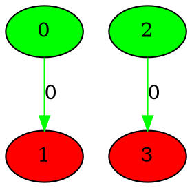
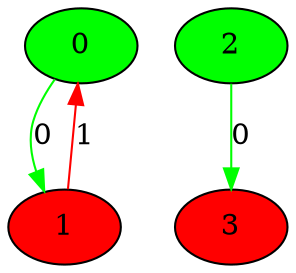
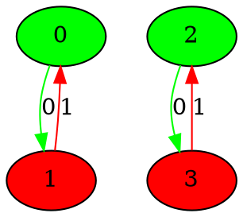
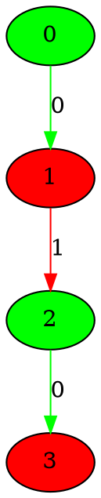
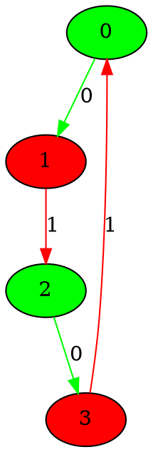

# the graphs for number of 2 nodes from 1 to 5
## Graph 1 - list de compréhension : 0|1,1
___

___
## Graph 2 - list de compréhension : 1|1
___

___
## Graph 3 - list de compréhension : 1,1|0
___

___
## Graph 4 - list de compréhension : 0|2
___

___
## Graph 5 - list de compréhension : 2|0
___

___
