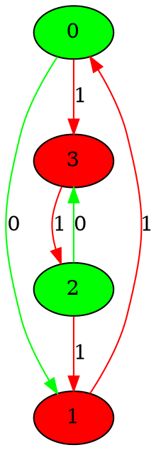
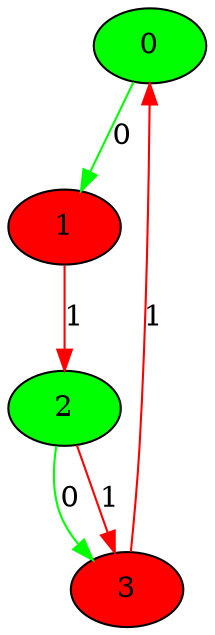

# the graphs for number of 2 nodes from 1 to 2
## Graph 1 - appeared 9times
___

```graphviz
digraph G {
0[label="0" fillcolor="green" style="filled"];
1[label="1" fillcolor="red" style="filled"];
2[label="2" fillcolor="green" style="filled"];
3[label="3" fillcolor="red" style="filled"];
0->1 [label="0" color="green"];
2->3 [label="0" color="green"];
1->0 [label="1" color="red"];
3->2 [label="1" color="red"];
0->3 [label="1" color="red"];
2->1 [label="1" color="red"];
}
```
___
## Graph 2 - appeared 3times
___

```graphviz
digraph G {
0[label="0" fillcolor="green" style="filled"];
1[label="1" fillcolor="red" style="filled"];
2[label="2" fillcolor="green" style="filled"];
3[label="3" fillcolor="red" style="filled"];
0->1 [label="0" color="green"];
2->3 [label="0" color="green"];
1->2 [label="1" color="red"];
3->0 [label="1" color="red"];
2->3 [label="1" color="red"];
}
```
___
