# the graphs for number of 20 nodes from 101 to 200
## Graph 101 - list de compréhension : 1,1,1,1,1|1,1,1,1,1,1,1,1,1,1,1,2,2
___
```graphviz
digraph G {
0[label="0" fillcolor="green" style="filled"];
1[label="1" fillcolor="red" style="filled"];
2[label="2" fillcolor="green" style="filled"];
3[label="3" fillcolor="red" style="filled"];
4[label="4" fillcolor="green" style="filled"];
5[label="5" fillcolor="red" style="filled"];
6[label="6" fillcolor="green" style="filled"];
7[label="7" fillcolor="red" style="filled"];
8[label="8" fillcolor="green" style="filled"];
9[label="9" fillcolor="red" style="filled"];
10[label="10" fillcolor="green" style="filled"];
11[label="11" fillcolor="red" style="filled"];
12[label="12" fillcolor="green" style="filled"];
13[label="13" fillcolor="red" style="filled"];
14[label="14" fillcolor="green" style="filled"];
15[label="15" fillcolor="red" style="filled"];
16[label="16" fillcolor="green" style="filled"];
17[label="17" fillcolor="red" style="filled"];
18[label="18" fillcolor="green" style="filled"];
19[label="19" fillcolor="red" style="filled"];
20[label="20" fillcolor="green" style="filled"];
21[label="21" fillcolor="red" style="filled"];
22[label="22" fillcolor="green" style="filled"];
23[label="23" fillcolor="red" style="filled"];
24[label="24" fillcolor="green" style="filled"];
25[label="25" fillcolor="red" style="filled"];
26[label="26" fillcolor="green" style="filled"];
27[label="27" fillcolor="red" style="filled"];
28[label="28" fillcolor="green" style="filled"];
29[label="29" fillcolor="red" style="filled"];
30[label="30" fillcolor="green" style="filled"];
31[label="31" fillcolor="red" style="filled"];
32[label="32" fillcolor="green" style="filled"];
33[label="33" fillcolor="red" style="filled"];
34[label="34" fillcolor="green" style="filled"];
35[label="35" fillcolor="red" style="filled"];
36[label="36" fillcolor="green" style="filled"];
37[label="37" fillcolor="red" style="filled"];
38[label="38" fillcolor="green" style="filled"];
39[label="39" fillcolor="red" style="filled"];
0->1 [label="0" color="green"];
1->0 [label="1" color="red"];
2->3 [label="0" color="green"];
3->2 [label="1" color="red"];
4->5 [label="0" color="green"];
5->4 [label="1" color="red"];
6->7 [label="0" color="green"];
7->6 [label="1" color="red"];
8->9 [label="0" color="green"];
9->8 [label="1" color="red"];
10->11 [label="0" color="green"];
12->13 [label="0" color="green"];
14->15 [label="0" color="green"];
16->17 [label="0" color="green"];
18->19 [label="0" color="green"];
20->21 [label="0" color="green"];
22->23 [label="0" color="green"];
24->25 [label="0" color="green"];
26->27 [label="0" color="green"];
28->29 [label="0" color="green"];
30->31 [label="0" color="green"];
32->33 [label="0" color="green"];
33->34 [label="1" color="red"];
34->35 [label="0" color="green"];
36->37 [label="0" color="green"];
37->38 [label="1" color="red"];
38->39 [label="0" color="green"];
}
```
___
## Graph 102 - list de compréhension : 1,1,1,1,1,1|1,1,1,1,1,1,1,1,1,1,2,2
___

___
## Graph 103 - list de compréhension : 1,1,1,1,1,1,1|1,1,1,1,1,1,1,1,1,2,2
___

___
## Graph 104 - list de compréhension : 1,1,1,1,1,1,1,1|1,1,1,1,1,1,1,1,2,2
___

___
## Graph 105 - list de compréhension : 1,1,1,1,1,1,1,1,1|1,1,1,1,1,1,1,2,2
___

___
## Graph 106 - list de compréhension : 1,1,1,1,1,1,1,1,1,1|1,1,1,1,1,1,2,2
___
```graphviz
digraph G {
0[label="0" fillcolor="green" style="filled"];
1[label="1" fillcolor="red" style="filled"];
2[label="2" fillcolor="green" style="filled"];
3[label="3" fillcolor="red" style="filled"];
4[label="4" fillcolor="green" style="filled"];
5[label="5" fillcolor="red" style="filled"];
6[label="6" fillcolor="green" style="filled"];
7[label="7" fillcolor="red" style="filled"];
8[label="8" fillcolor="green" style="filled"];
9[label="9" fillcolor="red" style="filled"];
10[label="10" fillcolor="green" style="filled"];
11[label="11" fillcolor="red" style="filled"];
12[label="12" fillcolor="green" style="filled"];
13[label="13" fillcolor="red" style="filled"];
14[label="14" fillcolor="green" style="filled"];
15[label="15" fillcolor="red" style="filled"];
16[label="16" fillcolor="green" style="filled"];
17[label="17" fillcolor="red" style="filled"];
18[label="18" fillcolor="green" style="filled"];
19[label="19" fillcolor="red" style="filled"];
20[label="20" fillcolor="green" style="filled"];
21[label="21" fillcolor="red" style="filled"];
22[label="22" fillcolor="green" style="filled"];
23[label="23" fillcolor="red" style="filled"];
24[label="24" fillcolor="green" style="filled"];
25[label="25" fillcolor="red" style="filled"];
26[label="26" fillcolor="green" style="filled"];
27[label="27" fillcolor="red" style="filled"];
28[label="28" fillcolor="green" style="filled"];
29[label="29" fillcolor="red" style="filled"];
30[label="30" fillcolor="green" style="filled"];
31[label="31" fillcolor="red" style="filled"];
32[label="32" fillcolor="green" style="filled"];
33[label="33" fillcolor="red" style="filled"];
34[label="34" fillcolor="green" style="filled"];
35[label="35" fillcolor="red" style="filled"];
36[label="36" fillcolor="green" style="filled"];
37[label="37" fillcolor="red" style="filled"];
38[label="38" fillcolor="green" style="filled"];
39[label="39" fillcolor="red" style="filled"];
0->1 [label="0" color="green"];
1->0 [label="1" color="red"];
2->3 [label="0" color="green"];
3->2 [label="1" color="red"];
4->5 [label="0" color="green"];
5->4 [label="1" color="red"];
6->7 [label="0" color="green"];
7->6 [label="1" color="red"];
8->9 [label="0" color="green"];
9->8 [label="1" color="red"];
10->11 [label="0" color="green"];
11->10 [label="1" color="red"];
12->13 [label="0" color="green"];
13->12 [label="1" color="red"];
14->15 [label="0" color="green"];
15->14 [label="1" color="red"];
16->17 [label="0" color="green"];
17->16 [label="1" color="red"];
18->19 [label="0" color="green"];
19->18 [label="1" color="red"];
20->21 [label="0" color="green"];
22->23 [label="0" color="green"];
24->25 [label="0" color="green"];
26->27 [label="0" color="green"];
28->29 [label="0" color="green"];
30->31 [label="0" color="green"];
32->33 [label="0" color="green"];
33->34 [label="1" color="red"];
34->35 [label="0" color="green"];
36->37 [label="0" color="green"];
37->38 [label="1" color="red"];
38->39 [label="0" color="green"];
}
```
___
## Graph 107 - list de compréhension : 1,1,1,1,1,1,1,1,1,1,1|1,1,1,1,1,2,2
___

___
## Graph 108 - list de compréhension : 1,1,1,1,1,1,1,1,1,1,1,1|1,1,1,1,2,2
___

___
## Graph 109 - list de compréhension : 1,1,1,1,1,1,1,1,1,1,1,1,1|1,1,1,2,2
___

___
## Graph 110 - list de compréhension : 1,1,1,1,1,1,1,1,1,1,1,1,1,1|1,1,2,2
___
```graphviz
digraph G {
0[label="0" fillcolor="green" style="filled"];
1[label="1" fillcolor="red" style="filled"];
2[label="2" fillcolor="green" style="filled"];
3[label="3" fillcolor="red" style="filled"];
4[label="4" fillcolor="green" style="filled"];
5[label="5" fillcolor="red" style="filled"];
6[label="6" fillcolor="green" style="filled"];
7[label="7" fillcolor="red" style="filled"];
8[label="8" fillcolor="green" style="filled"];
9[label="9" fillcolor="red" style="filled"];
10[label="10" fillcolor="green" style="filled"];
11[label="11" fillcolor="red" style="filled"];
12[label="12" fillcolor="green" style="filled"];
13[label="13" fillcolor="red" style="filled"];
14[label="14" fillcolor="green" style="filled"];
15[label="15" fillcolor="red" style="filled"];
16[label="16" fillcolor="green" style="filled"];
17[label="17" fillcolor="red" style="filled"];
18[label="18" fillcolor="green" style="filled"];
19[label="19" fillcolor="red" style="filled"];
20[label="20" fillcolor="green" style="filled"];
21[label="21" fillcolor="red" style="filled"];
22[label="22" fillcolor="green" style="filled"];
23[label="23" fillcolor="red" style="filled"];
24[label="24" fillcolor="green" style="filled"];
25[label="25" fillcolor="red" style="filled"];
26[label="26" fillcolor="green" style="filled"];
27[label="27" fillcolor="red" style="filled"];
28[label="28" fillcolor="green" style="filled"];
29[label="29" fillcolor="red" style="filled"];
30[label="30" fillcolor="green" style="filled"];
31[label="31" fillcolor="red" style="filled"];
32[label="32" fillcolor="green" style="filled"];
33[label="33" fillcolor="red" style="filled"];
34[label="34" fillcolor="green" style="filled"];
35[label="35" fillcolor="red" style="filled"];
36[label="36" fillcolor="green" style="filled"];
37[label="37" fillcolor="red" style="filled"];
38[label="38" fillcolor="green" style="filled"];
39[label="39" fillcolor="red" style="filled"];
0->1 [label="0" color="green"];
1->0 [label="1" color="red"];
2->3 [label="0" color="green"];
3->2 [label="1" color="red"];
4->5 [label="0" color="green"];
5->4 [label="1" color="red"];
6->7 [label="0" color="green"];
7->6 [label="1" color="red"];
8->9 [label="0" color="green"];
9->8 [label="1" color="red"];
10->11 [label="0" color="green"];
11->10 [label="1" color="red"];
12->13 [label="0" color="green"];
13->12 [label="1" color="red"];
14->15 [label="0" color="green"];
15->14 [label="1" color="red"];
16->17 [label="0" color="green"];
17->16 [label="1" color="red"];
18->19 [label="0" color="green"];
19->18 [label="1" color="red"];
20->21 [label="0" color="green"];
21->20 [label="1" color="red"];
22->23 [label="0" color="green"];
23->22 [label="1" color="red"];
24->25 [label="0" color="green"];
25->24 [label="1" color="red"];
26->27 [label="0" color="green"];
27->26 [label="1" color="red"];
28->29 [label="0" color="green"];
30->31 [label="0" color="green"];
32->33 [label="0" color="green"];
33->34 [label="1" color="red"];
34->35 [label="0" color="green"];
36->37 [label="0" color="green"];
37->38 [label="1" color="red"];
38->39 [label="0" color="green"];
}
```
___
## Graph 111 - list de compréhension : 1,1,1,1,1,1,1,1,1,1,1,1,1,1,1|1,2,2
___
```graphviz
digraph G {
0[label="0" fillcolor="green" style="filled"];
1[label="1" fillcolor="red" style="filled"];
2[label="2" fillcolor="green" style="filled"];
3[label="3" fillcolor="red" style="filled"];
4[label="4" fillcolor="green" style="filled"];
5[label="5" fillcolor="red" style="filled"];
6[label="6" fillcolor="green" style="filled"];
7[label="7" fillcolor="red" style="filled"];
8[label="8" fillcolor="green" style="filled"];
9[label="9" fillcolor="red" style="filled"];
10[label="10" fillcolor="green" style="filled"];
11[label="11" fillcolor="red" style="filled"];
12[label="12" fillcolor="green" style="filled"];
13[label="13" fillcolor="red" style="filled"];
14[label="14" fillcolor="green" style="filled"];
15[label="15" fillcolor="red" style="filled"];
16[label="16" fillcolor="green" style="filled"];
17[label="17" fillcolor="red" style="filled"];
18[label="18" fillcolor="green" style="filled"];
19[label="19" fillcolor="red" style="filled"];
20[label="20" fillcolor="green" style="filled"];
21[label="21" fillcolor="red" style="filled"];
22[label="22" fillcolor="green" style="filled"];
23[label="23" fillcolor="red" style="filled"];
24[label="24" fillcolor="green" style="filled"];
25[label="25" fillcolor="red" style="filled"];
26[label="26" fillcolor="green" style="filled"];
27[label="27" fillcolor="red" style="filled"];
28[label="28" fillcolor="green" style="filled"];
29[label="29" fillcolor="red" style="filled"];
30[label="30" fillcolor="green" style="filled"];
31[label="31" fillcolor="red" style="filled"];
32[label="32" fillcolor="green" style="filled"];
33[label="33" fillcolor="red" style="filled"];
34[label="34" fillcolor="green" style="filled"];
35[label="35" fillcolor="red" style="filled"];
36[label="36" fillcolor="green" style="filled"];
37[label="37" fillcolor="red" style="filled"];
38[label="38" fillcolor="green" style="filled"];
39[label="39" fillcolor="red" style="filled"];
0->1 [label="0" color="green"];
1->0 [label="1" color="red"];
2->3 [label="0" color="green"];
3->2 [label="1" color="red"];
4->5 [label="0" color="green"];
5->4 [label="1" color="red"];
6->7 [label="0" color="green"];
7->6 [label="1" color="red"];
8->9 [label="0" color="green"];
9->8 [label="1" color="red"];
10->11 [label="0" color="green"];
11->10 [label="1" color="red"];
12->13 [label="0" color="green"];
13->12 [label="1" color="red"];
14->15 [label="0" color="green"];
15->14 [label="1" color="red"];
16->17 [label="0" color="green"];
17->16 [label="1" color="red"];
18->19 [label="0" color="green"];
19->18 [label="1" color="red"];
20->21 [label="0" color="green"];
21->20 [label="1" color="red"];
22->23 [label="0" color="green"];
23->22 [label="1" color="red"];
24->25 [label="0" color="green"];
25->24 [label="1" color="red"];
26->27 [label="0" color="green"];
27->26 [label="1" color="red"];
28->29 [label="0" color="green"];
29->28 [label="1" color="red"];
30->31 [label="0" color="green"];
32->33 [label="0" color="green"];
33->34 [label="1" color="red"];
34->35 [label="0" color="green"];
36->37 [label="0" color="green"];
37->38 [label="1" color="red"];
38->39 [label="0" color="green"];
}
```
___
## Graph 112 - list de compréhension : 1,1,1,1,1,1,1,1,1,1,1,1,1,1,1,1|2,2
___
```graphviz
digraph G {
0[label="0" fillcolor="green" style="filled"];
1[label="1" fillcolor="red" style="filled"];
2[label="2" fillcolor="green" style="filled"];
3[label="3" fillcolor="red" style="filled"];
4[label="4" fillcolor="green" style="filled"];
5[label="5" fillcolor="red" style="filled"];
6[label="6" fillcolor="green" style="filled"];
7[label="7" fillcolor="red" style="filled"];
8[label="8" fillcolor="green" style="filled"];
9[label="9" fillcolor="red" style="filled"];
10[label="10" fillcolor="green" style="filled"];
11[label="11" fillcolor="red" style="filled"];
12[label="12" fillcolor="green" style="filled"];
13[label="13" fillcolor="red" style="filled"];
14[label="14" fillcolor="green" style="filled"];
15[label="15" fillcolor="red" style="filled"];
16[label="16" fillcolor="green" style="filled"];
17[label="17" fillcolor="red" style="filled"];
18[label="18" fillcolor="green" style="filled"];
19[label="19" fillcolor="red" style="filled"];
20[label="20" fillcolor="green" style="filled"];
21[label="21" fillcolor="red" style="filled"];
22[label="22" fillcolor="green" style="filled"];
23[label="23" fillcolor="red" style="filled"];
24[label="24" fillcolor="green" style="filled"];
25[label="25" fillcolor="red" style="filled"];
26[label="26" fillcolor="green" style="filled"];
27[label="27" fillcolor="red" style="filled"];
28[label="28" fillcolor="green" style="filled"];
29[label="29" fillcolor="red" style="filled"];
30[label="30" fillcolor="green" style="filled"];
31[label="31" fillcolor="red" style="filled"];
32[label="32" fillcolor="green" style="filled"];
33[label="33" fillcolor="red" style="filled"];
34[label="34" fillcolor="green" style="filled"];
35[label="35" fillcolor="red" style="filled"];
36[label="36" fillcolor="green" style="filled"];
37[label="37" fillcolor="red" style="filled"];
38[label="38" fillcolor="green" style="filled"];
39[label="39" fillcolor="red" style="filled"];
0->1 [label="0" color="green"];
1->0 [label="1" color="red"];
2->3 [label="0" color="green"];
3->2 [label="1" color="red"];
4->5 [label="0" color="green"];
5->4 [label="1" color="red"];
6->7 [label="0" color="green"];
7->6 [label="1" color="red"];
8->9 [label="0" color="green"];
9->8 [label="1" color="red"];
10->11 [label="0" color="green"];
11->10 [label="1" color="red"];
12->13 [label="0" color="green"];
13->12 [label="1" color="red"];
14->15 [label="0" color="green"];
15->14 [label="1" color="red"];
16->17 [label="0" color="green"];
17->16 [label="1" color="red"];
18->19 [label="0" color="green"];
19->18 [label="1" color="red"];
20->21 [label="0" color="green"];
21->20 [label="1" color="red"];
22->23 [label="0" color="green"];
23->22 [label="1" color="red"];
24->25 [label="0" color="green"];
25->24 [label="1" color="red"];
26->27 [label="0" color="green"];
27->26 [label="1" color="red"];
28->29 [label="0" color="green"];
29->28 [label="1" color="red"];
30->31 [label="0" color="green"];
31->30 [label="1" color="red"];
32->33 [label="0" color="green"];
33->34 [label="1" color="red"];
34->35 [label="0" color="green"];
36->37 [label="0" color="green"];
37->38 [label="1" color="red"];
38->39 [label="0" color="green"];
}
```
___
## Graph 113 - list de compréhension : 1,1,1,1,1,1,1,1,1,1,1,1,1,1,1,1,2|2
___
```graphviz
digraph G {
0[label="0" fillcolor="green" style="filled"];
1[label="1" fillcolor="red" style="filled"];
2[label="2" fillcolor="green" style="filled"];
3[label="3" fillcolor="red" style="filled"];
4[label="4" fillcolor="green" style="filled"];
5[label="5" fillcolor="red" style="filled"];
6[label="6" fillcolor="green" style="filled"];
7[label="7" fillcolor="red" style="filled"];
8[label="8" fillcolor="green" style="filled"];
9[label="9" fillcolor="red" style="filled"];
10[label="10" fillcolor="green" style="filled"];
11[label="11" fillcolor="red" style="filled"];
12[label="12" fillcolor="green" style="filled"];
13[label="13" fillcolor="red" style="filled"];
14[label="14" fillcolor="green" style="filled"];
15[label="15" fillcolor="red" style="filled"];
16[label="16" fillcolor="green" style="filled"];
17[label="17" fillcolor="red" style="filled"];
18[label="18" fillcolor="green" style="filled"];
19[label="19" fillcolor="red" style="filled"];
20[label="20" fillcolor="green" style="filled"];
21[label="21" fillcolor="red" style="filled"];
22[label="22" fillcolor="green" style="filled"];
23[label="23" fillcolor="red" style="filled"];
24[label="24" fillcolor="green" style="filled"];
25[label="25" fillcolor="red" style="filled"];
26[label="26" fillcolor="green" style="filled"];
27[label="27" fillcolor="red" style="filled"];
28[label="28" fillcolor="green" style="filled"];
29[label="29" fillcolor="red" style="filled"];
30[label="30" fillcolor="green" style="filled"];
31[label="31" fillcolor="red" style="filled"];
32[label="32" fillcolor="green" style="filled"];
33[label="33" fillcolor="red" style="filled"];
34[label="34" fillcolor="green" style="filled"];
35[label="35" fillcolor="red" style="filled"];
36[label="36" fillcolor="green" style="filled"];
37[label="37" fillcolor="red" style="filled"];
38[label="38" fillcolor="green" style="filled"];
39[label="39" fillcolor="red" style="filled"];
0->1 [label="0" color="green"];
1->0 [label="1" color="red"];
2->3 [label="0" color="green"];
3->2 [label="1" color="red"];
4->5 [label="0" color="green"];
5->4 [label="1" color="red"];
6->7 [label="0" color="green"];
7->6 [label="1" color="red"];
8->9 [label="0" color="green"];
9->8 [label="1" color="red"];
10->11 [label="0" color="green"];
11->10 [label="1" color="red"];
12->13 [label="0" color="green"];
13->12 [label="1" color="red"];
14->15 [label="0" color="green"];
15->14 [label="1" color="red"];
16->17 [label="0" color="green"];
17->16 [label="1" color="red"];
18->19 [label="0" color="green"];
19->18 [label="1" color="red"];
20->21 [label="0" color="green"];
21->20 [label="1" color="red"];
22->23 [label="0" color="green"];
23->22 [label="1" color="red"];
24->25 [label="0" color="green"];
25->24 [label="1" color="red"];
26->27 [label="0" color="green"];
27->26 [label="1" color="red"];
28->29 [label="0" color="green"];
29->28 [label="1" color="red"];
30->31 [label="0" color="green"];
31->30 [label="1" color="red"];
32->33 [label="0" color="green"];
33->34 [label="1" color="red"];
34->35 [label="0" color="green"];
35->32 [label="1" color="red"];
36->37 [label="0" color="green"];
37->38 [label="1" color="red"];
38->39 [label="0" color="green"];
}
```
___
## Graph 114 - list de compréhension : 1,1,1,1,1,1,1,1,1,1,1,1,1,1,1,1,2,2|0
___
```graphviz
digraph G {
0[label="0" fillcolor="green" style="filled"];
1[label="1" fillcolor="red" style="filled"];
2[label="2" fillcolor="green" style="filled"];
3[label="3" fillcolor="red" style="filled"];
4[label="4" fillcolor="green" style="filled"];
5[label="5" fillcolor="red" style="filled"];
6[label="6" fillcolor="green" style="filled"];
7[label="7" fillcolor="red" style="filled"];
8[label="8" fillcolor="green" style="filled"];
9[label="9" fillcolor="red" style="filled"];
10[label="10" fillcolor="green" style="filled"];
11[label="11" fillcolor="red" style="filled"];
12[label="12" fillcolor="green" style="filled"];
13[label="13" fillcolor="red" style="filled"];
14[label="14" fillcolor="green" style="filled"];
15[label="15" fillcolor="red" style="filled"];
16[label="16" fillcolor="green" style="filled"];
17[label="17" fillcolor="red" style="filled"];
18[label="18" fillcolor="green" style="filled"];
19[label="19" fillcolor="red" style="filled"];
20[label="20" fillcolor="green" style="filled"];
21[label="21" fillcolor="red" style="filled"];
22[label="22" fillcolor="green" style="filled"];
23[label="23" fillcolor="red" style="filled"];
24[label="24" fillcolor="green" style="filled"];
25[label="25" fillcolor="red" style="filled"];
26[label="26" fillcolor="green" style="filled"];
27[label="27" fillcolor="red" style="filled"];
28[label="28" fillcolor="green" style="filled"];
29[label="29" fillcolor="red" style="filled"];
30[label="30" fillcolor="green" style="filled"];
31[label="31" fillcolor="red" style="filled"];
32[label="32" fillcolor="green" style="filled"];
33[label="33" fillcolor="red" style="filled"];
34[label="34" fillcolor="green" style="filled"];
35[label="35" fillcolor="red" style="filled"];
36[label="36" fillcolor="green" style="filled"];
37[label="37" fillcolor="red" style="filled"];
38[label="38" fillcolor="green" style="filled"];
39[label="39" fillcolor="red" style="filled"];
0->1 [label="0" color="green"];
1->0 [label="1" color="red"];
2->3 [label="0" color="green"];
3->2 [label="1" color="red"];
4->5 [label="0" color="green"];
5->4 [label="1" color="red"];
6->7 [label="0" color="green"];
7->6 [label="1" color="red"];
8->9 [label="0" color="green"];
9->8 [label="1" color="red"];
10->11 [label="0" color="green"];
11->10 [label="1" color="red"];
12->13 [label="0" color="green"];
13->12 [label="1" color="red"];
14->15 [label="0" color="green"];
15->14 [label="1" color="red"];
16->17 [label="0" color="green"];
17->16 [label="1" color="red"];
18->19 [label="0" color="green"];
19->18 [label="1" color="red"];
20->21 [label="0" color="green"];
21->20 [label="1" color="red"];
22->23 [label="0" color="green"];
23->22 [label="1" color="red"];
24->25 [label="0" color="green"];
25->24 [label="1" color="red"];
26->27 [label="0" color="green"];
27->26 [label="1" color="red"];
28->29 [label="0" color="green"];
29->28 [label="1" color="red"];
30->31 [label="0" color="green"];
31->30 [label="1" color="red"];
32->33 [label="0" color="green"];
33->34 [label="1" color="red"];
34->35 [label="0" color="green"];
35->32 [label="1" color="red"];
36->37 [label="0" color="green"];
37->38 [label="1" color="red"];
38->39 [label="0" color="green"];
39->36 [label="1" color="red"];
}
```
___
## Graph 115 - list de compréhension : 1,1,1,1,1,1,1,1,1,1,1,1,1,1,1,2|1,2
___
```graphviz
digraph G {
0[label="0" fillcolor="green" style="filled"];
1[label="1" fillcolor="red" style="filled"];
2[label="2" fillcolor="green" style="filled"];
3[label="3" fillcolor="red" style="filled"];
4[label="4" fillcolor="green" style="filled"];
5[label="5" fillcolor="red" style="filled"];
6[label="6" fillcolor="green" style="filled"];
7[label="7" fillcolor="red" style="filled"];
8[label="8" fillcolor="green" style="filled"];
9[label="9" fillcolor="red" style="filled"];
10[label="10" fillcolor="green" style="filled"];
11[label="11" fillcolor="red" style="filled"];
12[label="12" fillcolor="green" style="filled"];
13[label="13" fillcolor="red" style="filled"];
14[label="14" fillcolor="green" style="filled"];
15[label="15" fillcolor="red" style="filled"];
16[label="16" fillcolor="green" style="filled"];
17[label="17" fillcolor="red" style="filled"];
18[label="18" fillcolor="green" style="filled"];
19[label="19" fillcolor="red" style="filled"];
20[label="20" fillcolor="green" style="filled"];
21[label="21" fillcolor="red" style="filled"];
22[label="22" fillcolor="green" style="filled"];
23[label="23" fillcolor="red" style="filled"];
24[label="24" fillcolor="green" style="filled"];
25[label="25" fillcolor="red" style="filled"];
26[label="26" fillcolor="green" style="filled"];
27[label="27" fillcolor="red" style="filled"];
28[label="28" fillcolor="green" style="filled"];
29[label="29" fillcolor="red" style="filled"];
30[label="30" fillcolor="green" style="filled"];
31[label="31" fillcolor="red" style="filled"];
32[label="32" fillcolor="green" style="filled"];
33[label="33" fillcolor="red" style="filled"];
34[label="34" fillcolor="green" style="filled"];
35[label="35" fillcolor="red" style="filled"];
36[label="36" fillcolor="green" style="filled"];
37[label="37" fillcolor="red" style="filled"];
38[label="38" fillcolor="green" style="filled"];
39[label="39" fillcolor="red" style="filled"];
0->1 [label="0" color="green"];
1->0 [label="1" color="red"];
2->3 [label="0" color="green"];
3->2 [label="1" color="red"];
4->5 [label="0" color="green"];
5->4 [label="1" color="red"];
6->7 [label="0" color="green"];
7->6 [label="1" color="red"];
8->9 [label="0" color="green"];
9->8 [label="1" color="red"];
10->11 [label="0" color="green"];
11->10 [label="1" color="red"];
12->13 [label="0" color="green"];
13->12 [label="1" color="red"];
14->15 [label="0" color="green"];
15->14 [label="1" color="red"];
16->17 [label="0" color="green"];
17->16 [label="1" color="red"];
18->19 [label="0" color="green"];
19->18 [label="1" color="red"];
20->21 [label="0" color="green"];
21->20 [label="1" color="red"];
22->23 [label="0" color="green"];
23->22 [label="1" color="red"];
24->25 [label="0" color="green"];
25->24 [label="1" color="red"];
26->27 [label="0" color="green"];
27->26 [label="1" color="red"];
28->29 [label="0" color="green"];
29->28 [label="1" color="red"];
30->31 [label="0" color="green"];
31->32 [label="1" color="red"];
32->33 [label="0" color="green"];
33->30 [label="1" color="red"];
34->35 [label="0" color="green"];
36->37 [label="0" color="green"];
37->38 [label="1" color="red"];
38->39 [label="0" color="green"];
}
```
___
## Graph 116 - list de compréhension : 1,1,1,1,1,1,1,1,1,1,1,1,1,1,1,2,2|1
___
```graphviz
digraph G {
0[label="0" fillcolor="green" style="filled"];
1[label="1" fillcolor="red" style="filled"];
2[label="2" fillcolor="green" style="filled"];
3[label="3" fillcolor="red" style="filled"];
4[label="4" fillcolor="green" style="filled"];
5[label="5" fillcolor="red" style="filled"];
6[label="6" fillcolor="green" style="filled"];
7[label="7" fillcolor="red" style="filled"];
8[label="8" fillcolor="green" style="filled"];
9[label="9" fillcolor="red" style="filled"];
10[label="10" fillcolor="green" style="filled"];
11[label="11" fillcolor="red" style="filled"];
12[label="12" fillcolor="green" style="filled"];
13[label="13" fillcolor="red" style="filled"];
14[label="14" fillcolor="green" style="filled"];
15[label="15" fillcolor="red" style="filled"];
16[label="16" fillcolor="green" style="filled"];
17[label="17" fillcolor="red" style="filled"];
18[label="18" fillcolor="green" style="filled"];
19[label="19" fillcolor="red" style="filled"];
20[label="20" fillcolor="green" style="filled"];
21[label="21" fillcolor="red" style="filled"];
22[label="22" fillcolor="green" style="filled"];
23[label="23" fillcolor="red" style="filled"];
24[label="24" fillcolor="green" style="filled"];
25[label="25" fillcolor="red" style="filled"];
26[label="26" fillcolor="green" style="filled"];
27[label="27" fillcolor="red" style="filled"];
28[label="28" fillcolor="green" style="filled"];
29[label="29" fillcolor="red" style="filled"];
30[label="30" fillcolor="green" style="filled"];
31[label="31" fillcolor="red" style="filled"];
32[label="32" fillcolor="green" style="filled"];
33[label="33" fillcolor="red" style="filled"];
34[label="34" fillcolor="green" style="filled"];
35[label="35" fillcolor="red" style="filled"];
36[label="36" fillcolor="green" style="filled"];
37[label="37" fillcolor="red" style="filled"];
38[label="38" fillcolor="green" style="filled"];
39[label="39" fillcolor="red" style="filled"];
0->1 [label="0" color="green"];
1->0 [label="1" color="red"];
2->3 [label="0" color="green"];
3->2 [label="1" color="red"];
4->5 [label="0" color="green"];
5->4 [label="1" color="red"];
6->7 [label="0" color="green"];
7->6 [label="1" color="red"];
8->9 [label="0" color="green"];
9->8 [label="1" color="red"];
10->11 [label="0" color="green"];
11->10 [label="1" color="red"];
12->13 [label="0" color="green"];
13->12 [label="1" color="red"];
14->15 [label="0" color="green"];
15->14 [label="1" color="red"];
16->17 [label="0" color="green"];
17->16 [label="1" color="red"];
18->19 [label="0" color="green"];
19->18 [label="1" color="red"];
20->21 [label="0" color="green"];
21->20 [label="1" color="red"];
22->23 [label="0" color="green"];
23->22 [label="1" color="red"];
24->25 [label="0" color="green"];
25->24 [label="1" color="red"];
26->27 [label="0" color="green"];
27->26 [label="1" color="red"];
28->29 [label="0" color="green"];
29->28 [label="1" color="red"];
30->31 [label="0" color="green"];
31->32 [label="1" color="red"];
32->33 [label="0" color="green"];
33->30 [label="1" color="red"];
34->35 [label="0" color="green"];
35->36 [label="1" color="red"];
36->37 [label="0" color="green"];
37->34 [label="1" color="red"];
38->39 [label="0" color="green"];
}
```
___
## Graph 117 - list de compréhension : 1,1,1,1,1,1,1,1,1,1,1,1,1,1,2|1,1,2
___
```graphviz
digraph G {
0[label="0" fillcolor="green" style="filled"];
1[label="1" fillcolor="red" style="filled"];
2[label="2" fillcolor="green" style="filled"];
3[label="3" fillcolor="red" style="filled"];
4[label="4" fillcolor="green" style="filled"];
5[label="5" fillcolor="red" style="filled"];
6[label="6" fillcolor="green" style="filled"];
7[label="7" fillcolor="red" style="filled"];
8[label="8" fillcolor="green" style="filled"];
9[label="9" fillcolor="red" style="filled"];
10[label="10" fillcolor="green" style="filled"];
11[label="11" fillcolor="red" style="filled"];
12[label="12" fillcolor="green" style="filled"];
13[label="13" fillcolor="red" style="filled"];
14[label="14" fillcolor="green" style="filled"];
15[label="15" fillcolor="red" style="filled"];
16[label="16" fillcolor="green" style="filled"];
17[label="17" fillcolor="red" style="filled"];
18[label="18" fillcolor="green" style="filled"];
19[label="19" fillcolor="red" style="filled"];
20[label="20" fillcolor="green" style="filled"];
21[label="21" fillcolor="red" style="filled"];
22[label="22" fillcolor="green" style="filled"];
23[label="23" fillcolor="red" style="filled"];
24[label="24" fillcolor="green" style="filled"];
25[label="25" fillcolor="red" style="filled"];
26[label="26" fillcolor="green" style="filled"];
27[label="27" fillcolor="red" style="filled"];
28[label="28" fillcolor="green" style="filled"];
29[label="29" fillcolor="red" style="filled"];
30[label="30" fillcolor="green" style="filled"];
31[label="31" fillcolor="red" style="filled"];
32[label="32" fillcolor="green" style="filled"];
33[label="33" fillcolor="red" style="filled"];
34[label="34" fillcolor="green" style="filled"];
35[label="35" fillcolor="red" style="filled"];
36[label="36" fillcolor="green" style="filled"];
37[label="37" fillcolor="red" style="filled"];
38[label="38" fillcolor="green" style="filled"];
39[label="39" fillcolor="red" style="filled"];
0->1 [label="0" color="green"];
1->0 [label="1" color="red"];
2->3 [label="0" color="green"];
3->2 [label="1" color="red"];
4->5 [label="0" color="green"];
5->4 [label="1" color="red"];
6->7 [label="0" color="green"];
7->6 [label="1" color="red"];
8->9 [label="0" color="green"];
9->8 [label="1" color="red"];
10->11 [label="0" color="green"];
11->10 [label="1" color="red"];
12->13 [label="0" color="green"];
13->12 [label="1" color="red"];
14->15 [label="0" color="green"];
15->14 [label="1" color="red"];
16->17 [label="0" color="green"];
17->16 [label="1" color="red"];
18->19 [label="0" color="green"];
19->18 [label="1" color="red"];
20->21 [label="0" color="green"];
21->20 [label="1" color="red"];
22->23 [label="0" color="green"];
23->22 [label="1" color="red"];
24->25 [label="0" color="green"];
25->24 [label="1" color="red"];
26->27 [label="0" color="green"];
27->26 [label="1" color="red"];
28->29 [label="0" color="green"];
29->30 [label="1" color="red"];
30->31 [label="0" color="green"];
31->28 [label="1" color="red"];
32->33 [label="0" color="green"];
34->35 [label="0" color="green"];
36->37 [label="0" color="green"];
37->38 [label="1" color="red"];
38->39 [label="0" color="green"];
}
```
___
## Graph 118 - list de compréhension : 1,1,1,1,1,1,1,1,1,1,1,1,1,1,2,2|1,1
___
```graphviz
digraph G {
0[label="0" fillcolor="green" style="filled"];
1[label="1" fillcolor="red" style="filled"];
2[label="2" fillcolor="green" style="filled"];
3[label="3" fillcolor="red" style="filled"];
4[label="4" fillcolor="green" style="filled"];
5[label="5" fillcolor="red" style="filled"];
6[label="6" fillcolor="green" style="filled"];
7[label="7" fillcolor="red" style="filled"];
8[label="8" fillcolor="green" style="filled"];
9[label="9" fillcolor="red" style="filled"];
10[label="10" fillcolor="green" style="filled"];
11[label="11" fillcolor="red" style="filled"];
12[label="12" fillcolor="green" style="filled"];
13[label="13" fillcolor="red" style="filled"];
14[label="14" fillcolor="green" style="filled"];
15[label="15" fillcolor="red" style="filled"];
16[label="16" fillcolor="green" style="filled"];
17[label="17" fillcolor="red" style="filled"];
18[label="18" fillcolor="green" style="filled"];
19[label="19" fillcolor="red" style="filled"];
20[label="20" fillcolor="green" style="filled"];
21[label="21" fillcolor="red" style="filled"];
22[label="22" fillcolor="green" style="filled"];
23[label="23" fillcolor="red" style="filled"];
24[label="24" fillcolor="green" style="filled"];
25[label="25" fillcolor="red" style="filled"];
26[label="26" fillcolor="green" style="filled"];
27[label="27" fillcolor="red" style="filled"];
28[label="28" fillcolor="green" style="filled"];
29[label="29" fillcolor="red" style="filled"];
30[label="30" fillcolor="green" style="filled"];
31[label="31" fillcolor="red" style="filled"];
32[label="32" fillcolor="green" style="filled"];
33[label="33" fillcolor="red" style="filled"];
34[label="34" fillcolor="green" style="filled"];
35[label="35" fillcolor="red" style="filled"];
36[label="36" fillcolor="green" style="filled"];
37[label="37" fillcolor="red" style="filled"];
38[label="38" fillcolor="green" style="filled"];
39[label="39" fillcolor="red" style="filled"];
0->1 [label="0" color="green"];
1->0 [label="1" color="red"];
2->3 [label="0" color="green"];
3->2 [label="1" color="red"];
4->5 [label="0" color="green"];
5->4 [label="1" color="red"];
6->7 [label="0" color="green"];
7->6 [label="1" color="red"];
8->9 [label="0" color="green"];
9->8 [label="1" color="red"];
10->11 [label="0" color="green"];
11->10 [label="1" color="red"];
12->13 [label="0" color="green"];
13->12 [label="1" color="red"];
14->15 [label="0" color="green"];
15->14 [label="1" color="red"];
16->17 [label="0" color="green"];
17->16 [label="1" color="red"];
18->19 [label="0" color="green"];
19->18 [label="1" color="red"];
20->21 [label="0" color="green"];
21->20 [label="1" color="red"];
22->23 [label="0" color="green"];
23->22 [label="1" color="red"];
24->25 [label="0" color="green"];
25->24 [label="1" color="red"];
26->27 [label="0" color="green"];
27->26 [label="1" color="red"];
28->29 [label="0" color="green"];
29->30 [label="1" color="red"];
30->31 [label="0" color="green"];
31->28 [label="1" color="red"];
32->33 [label="0" color="green"];
33->34 [label="1" color="red"];
34->35 [label="0" color="green"];
35->32 [label="1" color="red"];
36->37 [label="0" color="green"];
38->39 [label="0" color="green"];
}
```
___
## Graph 119 - list de compréhension : 1,1,1,1,1,1,1,1,1,1,1,1,1,2|1,1,1,2
___
```graphviz
digraph G {
0[label="0" fillcolor="green" style="filled"];
1[label="1" fillcolor="red" style="filled"];
2[label="2" fillcolor="green" style="filled"];
3[label="3" fillcolor="red" style="filled"];
4[label="4" fillcolor="green" style="filled"];
5[label="5" fillcolor="red" style="filled"];
6[label="6" fillcolor="green" style="filled"];
7[label="7" fillcolor="red" style="filled"];
8[label="8" fillcolor="green" style="filled"];
9[label="9" fillcolor="red" style="filled"];
10[label="10" fillcolor="green" style="filled"];
11[label="11" fillcolor="red" style="filled"];
12[label="12" fillcolor="green" style="filled"];
13[label="13" fillcolor="red" style="filled"];
14[label="14" fillcolor="green" style="filled"];
15[label="15" fillcolor="red" style="filled"];
16[label="16" fillcolor="green" style="filled"];
17[label="17" fillcolor="red" style="filled"];
18[label="18" fillcolor="green" style="filled"];
19[label="19" fillcolor="red" style="filled"];
20[label="20" fillcolor="green" style="filled"];
21[label="21" fillcolor="red" style="filled"];
22[label="22" fillcolor="green" style="filled"];
23[label="23" fillcolor="red" style="filled"];
24[label="24" fillcolor="green" style="filled"];
25[label="25" fillcolor="red" style="filled"];
26[label="26" fillcolor="green" style="filled"];
27[label="27" fillcolor="red" style="filled"];
28[label="28" fillcolor="green" style="filled"];
29[label="29" fillcolor="red" style="filled"];
30[label="30" fillcolor="green" style="filled"];
31[label="31" fillcolor="red" style="filled"];
32[label="32" fillcolor="green" style="filled"];
33[label="33" fillcolor="red" style="filled"];
34[label="34" fillcolor="green" style="filled"];
35[label="35" fillcolor="red" style="filled"];
36[label="36" fillcolor="green" style="filled"];
37[label="37" fillcolor="red" style="filled"];
38[label="38" fillcolor="green" style="filled"];
39[label="39" fillcolor="red" style="filled"];
0->1 [label="0" color="green"];
1->0 [label="1" color="red"];
2->3 [label="0" color="green"];
3->2 [label="1" color="red"];
4->5 [label="0" color="green"];
5->4 [label="1" color="red"];
6->7 [label="0" color="green"];
7->6 [label="1" color="red"];
8->9 [label="0" color="green"];
9->8 [label="1" color="red"];
10->11 [label="0" color="green"];
11->10 [label="1" color="red"];
12->13 [label="0" color="green"];
13->12 [label="1" color="red"];
14->15 [label="0" color="green"];
15->14 [label="1" color="red"];
16->17 [label="0" color="green"];
17->16 [label="1" color="red"];
18->19 [label="0" color="green"];
19->18 [label="1" color="red"];
20->21 [label="0" color="green"];
21->20 [label="1" color="red"];
22->23 [label="0" color="green"];
23->22 [label="1" color="red"];
24->25 [label="0" color="green"];
25->24 [label="1" color="red"];
26->27 [label="0" color="green"];
27->28 [label="1" color="red"];
28->29 [label="0" color="green"];
29->26 [label="1" color="red"];
30->31 [label="0" color="green"];
32->33 [label="0" color="green"];
34->35 [label="0" color="green"];
36->37 [label="0" color="green"];
37->38 [label="1" color="red"];
38->39 [label="0" color="green"];
}
```
___
## Graph 120 - list de compréhension : 1,1,1,1,1,1,1,1,1,1,1,1,1,2,2|1,1,1
___
```graphviz
digraph G {
0[label="0" fillcolor="green" style="filled"];
1[label="1" fillcolor="red" style="filled"];
2[label="2" fillcolor="green" style="filled"];
3[label="3" fillcolor="red" style="filled"];
4[label="4" fillcolor="green" style="filled"];
5[label="5" fillcolor="red" style="filled"];
6[label="6" fillcolor="green" style="filled"];
7[label="7" fillcolor="red" style="filled"];
8[label="8" fillcolor="green" style="filled"];
9[label="9" fillcolor="red" style="filled"];
10[label="10" fillcolor="green" style="filled"];
11[label="11" fillcolor="red" style="filled"];
12[label="12" fillcolor="green" style="filled"];
13[label="13" fillcolor="red" style="filled"];
14[label="14" fillcolor="green" style="filled"];
15[label="15" fillcolor="red" style="filled"];
16[label="16" fillcolor="green" style="filled"];
17[label="17" fillcolor="red" style="filled"];
18[label="18" fillcolor="green" style="filled"];
19[label="19" fillcolor="red" style="filled"];
20[label="20" fillcolor="green" style="filled"];
21[label="21" fillcolor="red" style="filled"];
22[label="22" fillcolor="green" style="filled"];
23[label="23" fillcolor="red" style="filled"];
24[label="24" fillcolor="green" style="filled"];
25[label="25" fillcolor="red" style="filled"];
26[label="26" fillcolor="green" style="filled"];
27[label="27" fillcolor="red" style="filled"];
28[label="28" fillcolor="green" style="filled"];
29[label="29" fillcolor="red" style="filled"];
30[label="30" fillcolor="green" style="filled"];
31[label="31" fillcolor="red" style="filled"];
32[label="32" fillcolor="green" style="filled"];
33[label="33" fillcolor="red" style="filled"];
34[label="34" fillcolor="green" style="filled"];
35[label="35" fillcolor="red" style="filled"];
36[label="36" fillcolor="green" style="filled"];
37[label="37" fillcolor="red" style="filled"];
38[label="38" fillcolor="green" style="filled"];
39[label="39" fillcolor="red" style="filled"];
0->1 [label="0" color="green"];
1->0 [label="1" color="red"];
2->3 [label="0" color="green"];
3->2 [label="1" color="red"];
4->5 [label="0" color="green"];
5->4 [label="1" color="red"];
6->7 [label="0" color="green"];
7->6 [label="1" color="red"];
8->9 [label="0" color="green"];
9->8 [label="1" color="red"];
10->11 [label="0" color="green"];
11->10 [label="1" color="red"];
12->13 [label="0" color="green"];
13->12 [label="1" color="red"];
14->15 [label="0" color="green"];
15->14 [label="1" color="red"];
16->17 [label="0" color="green"];
17->16 [label="1" color="red"];
18->19 [label="0" color="green"];
19->18 [label="1" color="red"];
20->21 [label="0" color="green"];
21->20 [label="1" color="red"];
22->23 [label="0" color="green"];
23->22 [label="1" color="red"];
24->25 [label="0" color="green"];
25->24 [label="1" color="red"];
26->27 [label="0" color="green"];
27->28 [label="1" color="red"];
28->29 [label="0" color="green"];
29->26 [label="1" color="red"];
30->31 [label="0" color="green"];
31->32 [label="1" color="red"];
32->33 [label="0" color="green"];
33->30 [label="1" color="red"];
34->35 [label="0" color="green"];
36->37 [label="0" color="green"];
38->39 [label="0" color="green"];
}
```
___
## Graph 121 - list de compréhension : 1,1,1,1,1,1,1,1,1,1,1,1,2|1,1,1,1,2
___
```graphviz
digraph G {
0[label="0" fillcolor="green" style="filled"];
1[label="1" fillcolor="red" style="filled"];
2[label="2" fillcolor="green" style="filled"];
3[label="3" fillcolor="red" style="filled"];
4[label="4" fillcolor="green" style="filled"];
5[label="5" fillcolor="red" style="filled"];
6[label="6" fillcolor="green" style="filled"];
7[label="7" fillcolor="red" style="filled"];
8[label="8" fillcolor="green" style="filled"];
9[label="9" fillcolor="red" style="filled"];
10[label="10" fillcolor="green" style="filled"];
11[label="11" fillcolor="red" style="filled"];
12[label="12" fillcolor="green" style="filled"];
13[label="13" fillcolor="red" style="filled"];
14[label="14" fillcolor="green" style="filled"];
15[label="15" fillcolor="red" style="filled"];
16[label="16" fillcolor="green" style="filled"];
17[label="17" fillcolor="red" style="filled"];
18[label="18" fillcolor="green" style="filled"];
19[label="19" fillcolor="red" style="filled"];
20[label="20" fillcolor="green" style="filled"];
21[label="21" fillcolor="red" style="filled"];
22[label="22" fillcolor="green" style="filled"];
23[label="23" fillcolor="red" style="filled"];
24[label="24" fillcolor="green" style="filled"];
25[label="25" fillcolor="red" style="filled"];
26[label="26" fillcolor="green" style="filled"];
27[label="27" fillcolor="red" style="filled"];
28[label="28" fillcolor="green" style="filled"];
29[label="29" fillcolor="red" style="filled"];
30[label="30" fillcolor="green" style="filled"];
31[label="31" fillcolor="red" style="filled"];
32[label="32" fillcolor="green" style="filled"];
33[label="33" fillcolor="red" style="filled"];
34[label="34" fillcolor="green" style="filled"];
35[label="35" fillcolor="red" style="filled"];
36[label="36" fillcolor="green" style="filled"];
37[label="37" fillcolor="red" style="filled"];
38[label="38" fillcolor="green" style="filled"];
39[label="39" fillcolor="red" style="filled"];
0->1 [label="0" color="green"];
1->0 [label="1" color="red"];
2->3 [label="0" color="green"];
3->2 [label="1" color="red"];
4->5 [label="0" color="green"];
5->4 [label="1" color="red"];
6->7 [label="0" color="green"];
7->6 [label="1" color="red"];
8->9 [label="0" color="green"];
9->8 [label="1" color="red"];
10->11 [label="0" color="green"];
11->10 [label="1" color="red"];
12->13 [label="0" color="green"];
13->12 [label="1" color="red"];
14->15 [label="0" color="green"];
15->14 [label="1" color="red"];
16->17 [label="0" color="green"];
17->16 [label="1" color="red"];
18->19 [label="0" color="green"];
19->18 [label="1" color="red"];
20->21 [label="0" color="green"];
21->20 [label="1" color="red"];
22->23 [label="0" color="green"];
23->22 [label="1" color="red"];
24->25 [label="0" color="green"];
25->26 [label="1" color="red"];
26->27 [label="0" color="green"];
27->24 [label="1" color="red"];
28->29 [label="0" color="green"];
30->31 [label="0" color="green"];
32->33 [label="0" color="green"];
34->35 [label="0" color="green"];
36->37 [label="0" color="green"];
37->38 [label="1" color="red"];
38->39 [label="0" color="green"];
}
```
___
## Graph 122 - list de compréhension : 1,1,1,1,1,1,1,1,1,1,1,1,2,2|1,1,1,1
___
```graphviz
digraph G {
0[label="0" fillcolor="green" style="filled"];
1[label="1" fillcolor="red" style="filled"];
2[label="2" fillcolor="green" style="filled"];
3[label="3" fillcolor="red" style="filled"];
4[label="4" fillcolor="green" style="filled"];
5[label="5" fillcolor="red" style="filled"];
6[label="6" fillcolor="green" style="filled"];
7[label="7" fillcolor="red" style="filled"];
8[label="8" fillcolor="green" style="filled"];
9[label="9" fillcolor="red" style="filled"];
10[label="10" fillcolor="green" style="filled"];
11[label="11" fillcolor="red" style="filled"];
12[label="12" fillcolor="green" style="filled"];
13[label="13" fillcolor="red" style="filled"];
14[label="14" fillcolor="green" style="filled"];
15[label="15" fillcolor="red" style="filled"];
16[label="16" fillcolor="green" style="filled"];
17[label="17" fillcolor="red" style="filled"];
18[label="18" fillcolor="green" style="filled"];
19[label="19" fillcolor="red" style="filled"];
20[label="20" fillcolor="green" style="filled"];
21[label="21" fillcolor="red" style="filled"];
22[label="22" fillcolor="green" style="filled"];
23[label="23" fillcolor="red" style="filled"];
24[label="24" fillcolor="green" style="filled"];
25[label="25" fillcolor="red" style="filled"];
26[label="26" fillcolor="green" style="filled"];
27[label="27" fillcolor="red" style="filled"];
28[label="28" fillcolor="green" style="filled"];
29[label="29" fillcolor="red" style="filled"];
30[label="30" fillcolor="green" style="filled"];
31[label="31" fillcolor="red" style="filled"];
32[label="32" fillcolor="green" style="filled"];
33[label="33" fillcolor="red" style="filled"];
34[label="34" fillcolor="green" style="filled"];
35[label="35" fillcolor="red" style="filled"];
36[label="36" fillcolor="green" style="filled"];
37[label="37" fillcolor="red" style="filled"];
38[label="38" fillcolor="green" style="filled"];
39[label="39" fillcolor="red" style="filled"];
0->1 [label="0" color="green"];
1->0 [label="1" color="red"];
2->3 [label="0" color="green"];
3->2 [label="1" color="red"];
4->5 [label="0" color="green"];
5->4 [label="1" color="red"];
6->7 [label="0" color="green"];
7->6 [label="1" color="red"];
8->9 [label="0" color="green"];
9->8 [label="1" color="red"];
10->11 [label="0" color="green"];
11->10 [label="1" color="red"];
12->13 [label="0" color="green"];
13->12 [label="1" color="red"];
14->15 [label="0" color="green"];
15->14 [label="1" color="red"];
16->17 [label="0" color="green"];
17->16 [label="1" color="red"];
18->19 [label="0" color="green"];
19->18 [label="1" color="red"];
20->21 [label="0" color="green"];
21->20 [label="1" color="red"];
22->23 [label="0" color="green"];
23->22 [label="1" color="red"];
24->25 [label="0" color="green"];
25->26 [label="1" color="red"];
26->27 [label="0" color="green"];
27->24 [label="1" color="red"];
28->29 [label="0" color="green"];
29->30 [label="1" color="red"];
30->31 [label="0" color="green"];
31->28 [label="1" color="red"];
32->33 [label="0" color="green"];
34->35 [label="0" color="green"];
36->37 [label="0" color="green"];
38->39 [label="0" color="green"];
}
```
___
## Graph 123 - list de compréhension : 1,1,1,1,1,1,1,1,1,1,1,2|1,1,1,1,1,2
___
```graphviz
digraph G {
0[label="0" fillcolor="green" style="filled"];
1[label="1" fillcolor="red" style="filled"];
2[label="2" fillcolor="green" style="filled"];
3[label="3" fillcolor="red" style="filled"];
4[label="4" fillcolor="green" style="filled"];
5[label="5" fillcolor="red" style="filled"];
6[label="6" fillcolor="green" style="filled"];
7[label="7" fillcolor="red" style="filled"];
8[label="8" fillcolor="green" style="filled"];
9[label="9" fillcolor="red" style="filled"];
10[label="10" fillcolor="green" style="filled"];
11[label="11" fillcolor="red" style="filled"];
12[label="12" fillcolor="green" style="filled"];
13[label="13" fillcolor="red" style="filled"];
14[label="14" fillcolor="green" style="filled"];
15[label="15" fillcolor="red" style="filled"];
16[label="16" fillcolor="green" style="filled"];
17[label="17" fillcolor="red" style="filled"];
18[label="18" fillcolor="green" style="filled"];
19[label="19" fillcolor="red" style="filled"];
20[label="20" fillcolor="green" style="filled"];
21[label="21" fillcolor="red" style="filled"];
22[label="22" fillcolor="green" style="filled"];
23[label="23" fillcolor="red" style="filled"];
24[label="24" fillcolor="green" style="filled"];
25[label="25" fillcolor="red" style="filled"];
26[label="26" fillcolor="green" style="filled"];
27[label="27" fillcolor="red" style="filled"];
28[label="28" fillcolor="green" style="filled"];
29[label="29" fillcolor="red" style="filled"];
30[label="30" fillcolor="green" style="filled"];
31[label="31" fillcolor="red" style="filled"];
32[label="32" fillcolor="green" style="filled"];
33[label="33" fillcolor="red" style="filled"];
34[label="34" fillcolor="green" style="filled"];
35[label="35" fillcolor="red" style="filled"];
36[label="36" fillcolor="green" style="filled"];
37[label="37" fillcolor="red" style="filled"];
38[label="38" fillcolor="green" style="filled"];
39[label="39" fillcolor="red" style="filled"];
0->1 [label="0" color="green"];
1->0 [label="1" color="red"];
2->3 [label="0" color="green"];
3->2 [label="1" color="red"];
4->5 [label="0" color="green"];
5->4 [label="1" color="red"];
6->7 [label="0" color="green"];
7->6 [label="1" color="red"];
8->9 [label="0" color="green"];
9->8 [label="1" color="red"];
10->11 [label="0" color="green"];
11->10 [label="1" color="red"];
12->13 [label="0" color="green"];
13->12 [label="1" color="red"];
14->15 [label="0" color="green"];
15->14 [label="1" color="red"];
16->17 [label="0" color="green"];
17->16 [label="1" color="red"];
18->19 [label="0" color="green"];
19->18 [label="1" color="red"];
20->21 [label="0" color="green"];
21->20 [label="1" color="red"];
22->23 [label="0" color="green"];
23->24 [label="1" color="red"];
24->25 [label="0" color="green"];
25->22 [label="1" color="red"];
26->27 [label="0" color="green"];
28->29 [label="0" color="green"];
30->31 [label="0" color="green"];
32->33 [label="0" color="green"];
34->35 [label="0" color="green"];
36->37 [label="0" color="green"];
37->38 [label="1" color="red"];
38->39 [label="0" color="green"];
}
```
___
## Graph 124 - list de compréhension : 1,1,1,1,1,1,1,1,1,1,1,2,2|1,1,1,1,1
___
```graphviz
digraph G {
0[label="0" fillcolor="green" style="filled"];
1[label="1" fillcolor="red" style="filled"];
2[label="2" fillcolor="green" style="filled"];
3[label="3" fillcolor="red" style="filled"];
4[label="4" fillcolor="green" style="filled"];
5[label="5" fillcolor="red" style="filled"];
6[label="6" fillcolor="green" style="filled"];
7[label="7" fillcolor="red" style="filled"];
8[label="8" fillcolor="green" style="filled"];
9[label="9" fillcolor="red" style="filled"];
10[label="10" fillcolor="green" style="filled"];
11[label="11" fillcolor="red" style="filled"];
12[label="12" fillcolor="green" style="filled"];
13[label="13" fillcolor="red" style="filled"];
14[label="14" fillcolor="green" style="filled"];
15[label="15" fillcolor="red" style="filled"];
16[label="16" fillcolor="green" style="filled"];
17[label="17" fillcolor="red" style="filled"];
18[label="18" fillcolor="green" style="filled"];
19[label="19" fillcolor="red" style="filled"];
20[label="20" fillcolor="green" style="filled"];
21[label="21" fillcolor="red" style="filled"];
22[label="22" fillcolor="green" style="filled"];
23[label="23" fillcolor="red" style="filled"];
24[label="24" fillcolor="green" style="filled"];
25[label="25" fillcolor="red" style="filled"];
26[label="26" fillcolor="green" style="filled"];
27[label="27" fillcolor="red" style="filled"];
28[label="28" fillcolor="green" style="filled"];
29[label="29" fillcolor="red" style="filled"];
30[label="30" fillcolor="green" style="filled"];
31[label="31" fillcolor="red" style="filled"];
32[label="32" fillcolor="green" style="filled"];
33[label="33" fillcolor="red" style="filled"];
34[label="34" fillcolor="green" style="filled"];
35[label="35" fillcolor="red" style="filled"];
36[label="36" fillcolor="green" style="filled"];
37[label="37" fillcolor="red" style="filled"];
38[label="38" fillcolor="green" style="filled"];
39[label="39" fillcolor="red" style="filled"];
0->1 [label="0" color="green"];
1->0 [label="1" color="red"];
2->3 [label="0" color="green"];
3->2 [label="1" color="red"];
4->5 [label="0" color="green"];
5->4 [label="1" color="red"];
6->7 [label="0" color="green"];
7->6 [label="1" color="red"];
8->9 [label="0" color="green"];
9->8 [label="1" color="red"];
10->11 [label="0" color="green"];
11->10 [label="1" color="red"];
12->13 [label="0" color="green"];
13->12 [label="1" color="red"];
14->15 [label="0" color="green"];
15->14 [label="1" color="red"];
16->17 [label="0" color="green"];
17->16 [label="1" color="red"];
18->19 [label="0" color="green"];
19->18 [label="1" color="red"];
20->21 [label="0" color="green"];
21->20 [label="1" color="red"];
22->23 [label="0" color="green"];
23->24 [label="1" color="red"];
24->25 [label="0" color="green"];
25->22 [label="1" color="red"];
26->27 [label="0" color="green"];
27->28 [label="1" color="red"];
28->29 [label="0" color="green"];
29->26 [label="1" color="red"];
30->31 [label="0" color="green"];
32->33 [label="0" color="green"];
34->35 [label="0" color="green"];
36->37 [label="0" color="green"];
38->39 [label="0" color="green"];
}
```
___
## Graph 125 - list de compréhension : 1,1,1,1,1,1,1,1,1,1,2|1,1,1,1,1,1,2
___
```graphviz
digraph G {
0[label="0" fillcolor="green" style="filled"];
1[label="1" fillcolor="red" style="filled"];
2[label="2" fillcolor="green" style="filled"];
3[label="3" fillcolor="red" style="filled"];
4[label="4" fillcolor="green" style="filled"];
5[label="5" fillcolor="red" style="filled"];
6[label="6" fillcolor="green" style="filled"];
7[label="7" fillcolor="red" style="filled"];
8[label="8" fillcolor="green" style="filled"];
9[label="9" fillcolor="red" style="filled"];
10[label="10" fillcolor="green" style="filled"];
11[label="11" fillcolor="red" style="filled"];
12[label="12" fillcolor="green" style="filled"];
13[label="13" fillcolor="red" style="filled"];
14[label="14" fillcolor="green" style="filled"];
15[label="15" fillcolor="red" style="filled"];
16[label="16" fillcolor="green" style="filled"];
17[label="17" fillcolor="red" style="filled"];
18[label="18" fillcolor="green" style="filled"];
19[label="19" fillcolor="red" style="filled"];
20[label="20" fillcolor="green" style="filled"];
21[label="21" fillcolor="red" style="filled"];
22[label="22" fillcolor="green" style="filled"];
23[label="23" fillcolor="red" style="filled"];
24[label="24" fillcolor="green" style="filled"];
25[label="25" fillcolor="red" style="filled"];
26[label="26" fillcolor="green" style="filled"];
27[label="27" fillcolor="red" style="filled"];
28[label="28" fillcolor="green" style="filled"];
29[label="29" fillcolor="red" style="filled"];
30[label="30" fillcolor="green" style="filled"];
31[label="31" fillcolor="red" style="filled"];
32[label="32" fillcolor="green" style="filled"];
33[label="33" fillcolor="red" style="filled"];
34[label="34" fillcolor="green" style="filled"];
35[label="35" fillcolor="red" style="filled"];
36[label="36" fillcolor="green" style="filled"];
37[label="37" fillcolor="red" style="filled"];
38[label="38" fillcolor="green" style="filled"];
39[label="39" fillcolor="red" style="filled"];
0->1 [label="0" color="green"];
1->0 [label="1" color="red"];
2->3 [label="0" color="green"];
3->2 [label="1" color="red"];
4->5 [label="0" color="green"];
5->4 [label="1" color="red"];
6->7 [label="0" color="green"];
7->6 [label="1" color="red"];
8->9 [label="0" color="green"];
9->8 [label="1" color="red"];
10->11 [label="0" color="green"];
11->10 [label="1" color="red"];
12->13 [label="0" color="green"];
13->12 [label="1" color="red"];
14->15 [label="0" color="green"];
15->14 [label="1" color="red"];
16->17 [label="0" color="green"];
17->16 [label="1" color="red"];
18->19 [label="0" color="green"];
19->18 [label="1" color="red"];
20->21 [label="0" color="green"];
21->22 [label="1" color="red"];
22->23 [label="0" color="green"];
23->20 [label="1" color="red"];
24->25 [label="0" color="green"];
26->27 [label="0" color="green"];
28->29 [label="0" color="green"];
30->31 [label="0" color="green"];
32->33 [label="0" color="green"];
34->35 [label="0" color="green"];
36->37 [label="0" color="green"];
37->38 [label="1" color="red"];
38->39 [label="0" color="green"];
}
```
___
## Graph 126 - list de compréhension : 1,1,1,1,1,1,1,1,1,1,2,2|1,1,1,1,1,1
___
```graphviz
digraph G {
0[label="0" fillcolor="green" style="filled"];
1[label="1" fillcolor="red" style="filled"];
2[label="2" fillcolor="green" style="filled"];
3[label="3" fillcolor="red" style="filled"];
4[label="4" fillcolor="green" style="filled"];
5[label="5" fillcolor="red" style="filled"];
6[label="6" fillcolor="green" style="filled"];
7[label="7" fillcolor="red" style="filled"];
8[label="8" fillcolor="green" style="filled"];
9[label="9" fillcolor="red" style="filled"];
10[label="10" fillcolor="green" style="filled"];
11[label="11" fillcolor="red" style="filled"];
12[label="12" fillcolor="green" style="filled"];
13[label="13" fillcolor="red" style="filled"];
14[label="14" fillcolor="green" style="filled"];
15[label="15" fillcolor="red" style="filled"];
16[label="16" fillcolor="green" style="filled"];
17[label="17" fillcolor="red" style="filled"];
18[label="18" fillcolor="green" style="filled"];
19[label="19" fillcolor="red" style="filled"];
20[label="20" fillcolor="green" style="filled"];
21[label="21" fillcolor="red" style="filled"];
22[label="22" fillcolor="green" style="filled"];
23[label="23" fillcolor="red" style="filled"];
24[label="24" fillcolor="green" style="filled"];
25[label="25" fillcolor="red" style="filled"];
26[label="26" fillcolor="green" style="filled"];
27[label="27" fillcolor="red" style="filled"];
28[label="28" fillcolor="green" style="filled"];
29[label="29" fillcolor="red" style="filled"];
30[label="30" fillcolor="green" style="filled"];
31[label="31" fillcolor="red" style="filled"];
32[label="32" fillcolor="green" style="filled"];
33[label="33" fillcolor="red" style="filled"];
34[label="34" fillcolor="green" style="filled"];
35[label="35" fillcolor="red" style="filled"];
36[label="36" fillcolor="green" style="filled"];
37[label="37" fillcolor="red" style="filled"];
38[label="38" fillcolor="green" style="filled"];
39[label="39" fillcolor="red" style="filled"];
0->1 [label="0" color="green"];
1->0 [label="1" color="red"];
2->3 [label="0" color="green"];
3->2 [label="1" color="red"];
4->5 [label="0" color="green"];
5->4 [label="1" color="red"];
6->7 [label="0" color="green"];
7->6 [label="1" color="red"];
8->9 [label="0" color="green"];
9->8 [label="1" color="red"];
10->11 [label="0" color="green"];
11->10 [label="1" color="red"];
12->13 [label="0" color="green"];
13->12 [label="1" color="red"];
14->15 [label="0" color="green"];
15->14 [label="1" color="red"];
16->17 [label="0" color="green"];
17->16 [label="1" color="red"];
18->19 [label="0" color="green"];
19->18 [label="1" color="red"];
20->21 [label="0" color="green"];
21->22 [label="1" color="red"];
22->23 [label="0" color="green"];
23->20 [label="1" color="red"];
24->25 [label="0" color="green"];
25->26 [label="1" color="red"];
26->27 [label="0" color="green"];
27->24 [label="1" color="red"];
28->29 [label="0" color="green"];
30->31 [label="0" color="green"];
32->33 [label="0" color="green"];
34->35 [label="0" color="green"];
36->37 [label="0" color="green"];
38->39 [label="0" color="green"];
}
```
___
## Graph 127 - list de compréhension : 1,1,1,1,1,1,1,1,1,2|1,1,1,1,1,1,1,2
___
```graphviz
digraph G {
0[label="0" fillcolor="green" style="filled"];
1[label="1" fillcolor="red" style="filled"];
2[label="2" fillcolor="green" style="filled"];
3[label="3" fillcolor="red" style="filled"];
4[label="4" fillcolor="green" style="filled"];
5[label="5" fillcolor="red" style="filled"];
6[label="6" fillcolor="green" style="filled"];
7[label="7" fillcolor="red" style="filled"];
8[label="8" fillcolor="green" style="filled"];
9[label="9" fillcolor="red" style="filled"];
10[label="10" fillcolor="green" style="filled"];
11[label="11" fillcolor="red" style="filled"];
12[label="12" fillcolor="green" style="filled"];
13[label="13" fillcolor="red" style="filled"];
14[label="14" fillcolor="green" style="filled"];
15[label="15" fillcolor="red" style="filled"];
16[label="16" fillcolor="green" style="filled"];
17[label="17" fillcolor="red" style="filled"];
18[label="18" fillcolor="green" style="filled"];
19[label="19" fillcolor="red" style="filled"];
20[label="20" fillcolor="green" style="filled"];
21[label="21" fillcolor="red" style="filled"];
22[label="22" fillcolor="green" style="filled"];
23[label="23" fillcolor="red" style="filled"];
24[label="24" fillcolor="green" style="filled"];
25[label="25" fillcolor="red" style="filled"];
26[label="26" fillcolor="green" style="filled"];
27[label="27" fillcolor="red" style="filled"];
28[label="28" fillcolor="green" style="filled"];
29[label="29" fillcolor="red" style="filled"];
30[label="30" fillcolor="green" style="filled"];
31[label="31" fillcolor="red" style="filled"];
32[label="32" fillcolor="green" style="filled"];
33[label="33" fillcolor="red" style="filled"];
34[label="34" fillcolor="green" style="filled"];
35[label="35" fillcolor="red" style="filled"];
36[label="36" fillcolor="green" style="filled"];
37[label="37" fillcolor="red" style="filled"];
38[label="38" fillcolor="green" style="filled"];
39[label="39" fillcolor="red" style="filled"];
0->1 [label="0" color="green"];
1->0 [label="1" color="red"];
2->3 [label="0" color="green"];
3->2 [label="1" color="red"];
4->5 [label="0" color="green"];
5->4 [label="1" color="red"];
6->7 [label="0" color="green"];
7->6 [label="1" color="red"];
8->9 [label="0" color="green"];
9->8 [label="1" color="red"];
10->11 [label="0" color="green"];
11->10 [label="1" color="red"];
12->13 [label="0" color="green"];
13->12 [label="1" color="red"];
14->15 [label="0" color="green"];
15->14 [label="1" color="red"];
16->17 [label="0" color="green"];
17->16 [label="1" color="red"];
18->19 [label="0" color="green"];
19->20 [label="1" color="red"];
20->21 [label="0" color="green"];
21->18 [label="1" color="red"];
22->23 [label="0" color="green"];
24->25 [label="0" color="green"];
26->27 [label="0" color="green"];
28->29 [label="0" color="green"];
30->31 [label="0" color="green"];
32->33 [label="0" color="green"];
34->35 [label="0" color="green"];
36->37 [label="0" color="green"];
37->38 [label="1" color="red"];
38->39 [label="0" color="green"];
}
```
___
## Graph 128 - list de compréhension : 1,1,1,1,1,1,1,1,1,2,2|1,1,1,1,1,1,1
___
```graphviz
digraph G {
0[label="0" fillcolor="green" style="filled"];
1[label="1" fillcolor="red" style="filled"];
2[label="2" fillcolor="green" style="filled"];
3[label="3" fillcolor="red" style="filled"];
4[label="4" fillcolor="green" style="filled"];
5[label="5" fillcolor="red" style="filled"];
6[label="6" fillcolor="green" style="filled"];
7[label="7" fillcolor="red" style="filled"];
8[label="8" fillcolor="green" style="filled"];
9[label="9" fillcolor="red" style="filled"];
10[label="10" fillcolor="green" style="filled"];
11[label="11" fillcolor="red" style="filled"];
12[label="12" fillcolor="green" style="filled"];
13[label="13" fillcolor="red" style="filled"];
14[label="14" fillcolor="green" style="filled"];
15[label="15" fillcolor="red" style="filled"];
16[label="16" fillcolor="green" style="filled"];
17[label="17" fillcolor="red" style="filled"];
18[label="18" fillcolor="green" style="filled"];
19[label="19" fillcolor="red" style="filled"];
20[label="20" fillcolor="green" style="filled"];
21[label="21" fillcolor="red" style="filled"];
22[label="22" fillcolor="green" style="filled"];
23[label="23" fillcolor="red" style="filled"];
24[label="24" fillcolor="green" style="filled"];
25[label="25" fillcolor="red" style="filled"];
26[label="26" fillcolor="green" style="filled"];
27[label="27" fillcolor="red" style="filled"];
28[label="28" fillcolor="green" style="filled"];
29[label="29" fillcolor="red" style="filled"];
30[label="30" fillcolor="green" style="filled"];
31[label="31" fillcolor="red" style="filled"];
32[label="32" fillcolor="green" style="filled"];
33[label="33" fillcolor="red" style="filled"];
34[label="34" fillcolor="green" style="filled"];
35[label="35" fillcolor="red" style="filled"];
36[label="36" fillcolor="green" style="filled"];
37[label="37" fillcolor="red" style="filled"];
38[label="38" fillcolor="green" style="filled"];
39[label="39" fillcolor="red" style="filled"];
0->1 [label="0" color="green"];
1->0 [label="1" color="red"];
2->3 [label="0" color="green"];
3->2 [label="1" color="red"];
4->5 [label="0" color="green"];
5->4 [label="1" color="red"];
6->7 [label="0" color="green"];
7->6 [label="1" color="red"];
8->9 [label="0" color="green"];
9->8 [label="1" color="red"];
10->11 [label="0" color="green"];
11->10 [label="1" color="red"];
12->13 [label="0" color="green"];
13->12 [label="1" color="red"];
14->15 [label="0" color="green"];
15->14 [label="1" color="red"];
16->17 [label="0" color="green"];
17->16 [label="1" color="red"];
18->19 [label="0" color="green"];
19->20 [label="1" color="red"];
20->21 [label="0" color="green"];
21->18 [label="1" color="red"];
22->23 [label="0" color="green"];
23->24 [label="1" color="red"];
24->25 [label="0" color="green"];
25->22 [label="1" color="red"];
26->27 [label="0" color="green"];
28->29 [label="0" color="green"];
30->31 [label="0" color="green"];
32->33 [label="0" color="green"];
34->35 [label="0" color="green"];
36->37 [label="0" color="green"];
38->39 [label="0" color="green"];
}
```
___
## Graph 129 - list de compréhension : 1,1,1,1,1,1,1,1,2|1,1,1,1,1,1,1,1,2
___
```graphviz
digraph G {
0[label="0" fillcolor="green" style="filled"];
1[label="1" fillcolor="red" style="filled"];
2[label="2" fillcolor="green" style="filled"];
3[label="3" fillcolor="red" style="filled"];
4[label="4" fillcolor="green" style="filled"];
5[label="5" fillcolor="red" style="filled"];
6[label="6" fillcolor="green" style="filled"];
7[label="7" fillcolor="red" style="filled"];
8[label="8" fillcolor="green" style="filled"];
9[label="9" fillcolor="red" style="filled"];
10[label="10" fillcolor="green" style="filled"];
11[label="11" fillcolor="red" style="filled"];
12[label="12" fillcolor="green" style="filled"];
13[label="13" fillcolor="red" style="filled"];
14[label="14" fillcolor="green" style="filled"];
15[label="15" fillcolor="red" style="filled"];
16[label="16" fillcolor="green" style="filled"];
17[label="17" fillcolor="red" style="filled"];
18[label="18" fillcolor="green" style="filled"];
19[label="19" fillcolor="red" style="filled"];
20[label="20" fillcolor="green" style="filled"];
21[label="21" fillcolor="red" style="filled"];
22[label="22" fillcolor="green" style="filled"];
23[label="23" fillcolor="red" style="filled"];
24[label="24" fillcolor="green" style="filled"];
25[label="25" fillcolor="red" style="filled"];
26[label="26" fillcolor="green" style="filled"];
27[label="27" fillcolor="red" style="filled"];
28[label="28" fillcolor="green" style="filled"];
29[label="29" fillcolor="red" style="filled"];
30[label="30" fillcolor="green" style="filled"];
31[label="31" fillcolor="red" style="filled"];
32[label="32" fillcolor="green" style="filled"];
33[label="33" fillcolor="red" style="filled"];
34[label="34" fillcolor="green" style="filled"];
35[label="35" fillcolor="red" style="filled"];
36[label="36" fillcolor="green" style="filled"];
37[label="37" fillcolor="red" style="filled"];
38[label="38" fillcolor="green" style="filled"];
39[label="39" fillcolor="red" style="filled"];
0->1 [label="0" color="green"];
1->0 [label="1" color="red"];
2->3 [label="0" color="green"];
3->2 [label="1" color="red"];
4->5 [label="0" color="green"];
5->4 [label="1" color="red"];
6->7 [label="0" color="green"];
7->6 [label="1" color="red"];
8->9 [label="0" color="green"];
9->8 [label="1" color="red"];
10->11 [label="0" color="green"];
11->10 [label="1" color="red"];
12->13 [label="0" color="green"];
13->12 [label="1" color="red"];
14->15 [label="0" color="green"];
15->14 [label="1" color="red"];
16->17 [label="0" color="green"];
17->18 [label="1" color="red"];
18->19 [label="0" color="green"];
19->16 [label="1" color="red"];
20->21 [label="0" color="green"];
22->23 [label="0" color="green"];
24->25 [label="0" color="green"];
26->27 [label="0" color="green"];
28->29 [label="0" color="green"];
30->31 [label="0" color="green"];
32->33 [label="0" color="green"];
34->35 [label="0" color="green"];
36->37 [label="0" color="green"];
37->38 [label="1" color="red"];
38->39 [label="0" color="green"];
}
```
___
## Graph 130 - list de compréhension : 1,1,1,1,1,1,1,1,2,2|1,1,1,1,1,1,1,1
___
```graphviz
digraph G {
0[label="0" fillcolor="green" style="filled"];
1[label="1" fillcolor="red" style="filled"];
2[label="2" fillcolor="green" style="filled"];
3[label="3" fillcolor="red" style="filled"];
4[label="4" fillcolor="green" style="filled"];
5[label="5" fillcolor="red" style="filled"];
6[label="6" fillcolor="green" style="filled"];
7[label="7" fillcolor="red" style="filled"];
8[label="8" fillcolor="green" style="filled"];
9[label="9" fillcolor="red" style="filled"];
10[label="10" fillcolor="green" style="filled"];
11[label="11" fillcolor="red" style="filled"];
12[label="12" fillcolor="green" style="filled"];
13[label="13" fillcolor="red" style="filled"];
14[label="14" fillcolor="green" style="filled"];
15[label="15" fillcolor="red" style="filled"];
16[label="16" fillcolor="green" style="filled"];
17[label="17" fillcolor="red" style="filled"];
18[label="18" fillcolor="green" style="filled"];
19[label="19" fillcolor="red" style="filled"];
20[label="20" fillcolor="green" style="filled"];
21[label="21" fillcolor="red" style="filled"];
22[label="22" fillcolor="green" style="filled"];
23[label="23" fillcolor="red" style="filled"];
24[label="24" fillcolor="green" style="filled"];
25[label="25" fillcolor="red" style="filled"];
26[label="26" fillcolor="green" style="filled"];
27[label="27" fillcolor="red" style="filled"];
28[label="28" fillcolor="green" style="filled"];
29[label="29" fillcolor="red" style="filled"];
30[label="30" fillcolor="green" style="filled"];
31[label="31" fillcolor="red" style="filled"];
32[label="32" fillcolor="green" style="filled"];
33[label="33" fillcolor="red" style="filled"];
34[label="34" fillcolor="green" style="filled"];
35[label="35" fillcolor="red" style="filled"];
36[label="36" fillcolor="green" style="filled"];
37[label="37" fillcolor="red" style="filled"];
38[label="38" fillcolor="green" style="filled"];
39[label="39" fillcolor="red" style="filled"];
0->1 [label="0" color="green"];
1->0 [label="1" color="red"];
2->3 [label="0" color="green"];
3->2 [label="1" color="red"];
4->5 [label="0" color="green"];
5->4 [label="1" color="red"];
6->7 [label="0" color="green"];
7->6 [label="1" color="red"];
8->9 [label="0" color="green"];
9->8 [label="1" color="red"];
10->11 [label="0" color="green"];
11->10 [label="1" color="red"];
12->13 [label="0" color="green"];
13->12 [label="1" color="red"];
14->15 [label="0" color="green"];
15->14 [label="1" color="red"];
16->17 [label="0" color="green"];
17->18 [label="1" color="red"];
18->19 [label="0" color="green"];
19->16 [label="1" color="red"];
20->21 [label="0" color="green"];
21->22 [label="1" color="red"];
22->23 [label="0" color="green"];
23->20 [label="1" color="red"];
24->25 [label="0" color="green"];
26->27 [label="0" color="green"];
28->29 [label="0" color="green"];
30->31 [label="0" color="green"];
32->33 [label="0" color="green"];
34->35 [label="0" color="green"];
36->37 [label="0" color="green"];
38->39 [label="0" color="green"];
}
```
___
## Graph 131 - list de compréhension : 1,1,1,1,1,1,1,2|1,1,1,1,1,1,1,1,1,2
___
```graphviz
digraph G {
0[label="0" fillcolor="green" style="filled"];
1[label="1" fillcolor="red" style="filled"];
2[label="2" fillcolor="green" style="filled"];
3[label="3" fillcolor="red" style="filled"];
4[label="4" fillcolor="green" style="filled"];
5[label="5" fillcolor="red" style="filled"];
6[label="6" fillcolor="green" style="filled"];
7[label="7" fillcolor="red" style="filled"];
8[label="8" fillcolor="green" style="filled"];
9[label="9" fillcolor="red" style="filled"];
10[label="10" fillcolor="green" style="filled"];
11[label="11" fillcolor="red" style="filled"];
12[label="12" fillcolor="green" style="filled"];
13[label="13" fillcolor="red" style="filled"];
14[label="14" fillcolor="green" style="filled"];
15[label="15" fillcolor="red" style="filled"];
16[label="16" fillcolor="green" style="filled"];
17[label="17" fillcolor="red" style="filled"];
18[label="18" fillcolor="green" style="filled"];
19[label="19" fillcolor="red" style="filled"];
20[label="20" fillcolor="green" style="filled"];
21[label="21" fillcolor="red" style="filled"];
22[label="22" fillcolor="green" style="filled"];
23[label="23" fillcolor="red" style="filled"];
24[label="24" fillcolor="green" style="filled"];
25[label="25" fillcolor="red" style="filled"];
26[label="26" fillcolor="green" style="filled"];
27[label="27" fillcolor="red" style="filled"];
28[label="28" fillcolor="green" style="filled"];
29[label="29" fillcolor="red" style="filled"];
30[label="30" fillcolor="green" style="filled"];
31[label="31" fillcolor="red" style="filled"];
32[label="32" fillcolor="green" style="filled"];
33[label="33" fillcolor="red" style="filled"];
34[label="34" fillcolor="green" style="filled"];
35[label="35" fillcolor="red" style="filled"];
36[label="36" fillcolor="green" style="filled"];
37[label="37" fillcolor="red" style="filled"];
38[label="38" fillcolor="green" style="filled"];
39[label="39" fillcolor="red" style="filled"];
0->1 [label="0" color="green"];
1->0 [label="1" color="red"];
2->3 [label="0" color="green"];
3->2 [label="1" color="red"];
4->5 [label="0" color="green"];
5->4 [label="1" color="red"];
6->7 [label="0" color="green"];
7->6 [label="1" color="red"];
8->9 [label="0" color="green"];
9->8 [label="1" color="red"];
10->11 [label="0" color="green"];
11->10 [label="1" color="red"];
12->13 [label="0" color="green"];
13->12 [label="1" color="red"];
14->15 [label="0" color="green"];
15->16 [label="1" color="red"];
16->17 [label="0" color="green"];
17->14 [label="1" color="red"];
18->19 [label="0" color="green"];
20->21 [label="0" color="green"];
22->23 [label="0" color="green"];
24->25 [label="0" color="green"];
26->27 [label="0" color="green"];
28->29 [label="0" color="green"];
30->31 [label="0" color="green"];
32->33 [label="0" color="green"];
34->35 [label="0" color="green"];
36->37 [label="0" color="green"];
37->38 [label="1" color="red"];
38->39 [label="0" color="green"];
}
```
___
## Graph 132 - list de compréhension : 1,1,1,1,1,1,1,2,2|1,1,1,1,1,1,1,1,1
___
```graphviz
digraph G {
0[label="0" fillcolor="green" style="filled"];
1[label="1" fillcolor="red" style="filled"];
2[label="2" fillcolor="green" style="filled"];
3[label="3" fillcolor="red" style="filled"];
4[label="4" fillcolor="green" style="filled"];
5[label="5" fillcolor="red" style="filled"];
6[label="6" fillcolor="green" style="filled"];
7[label="7" fillcolor="red" style="filled"];
8[label="8" fillcolor="green" style="filled"];
9[label="9" fillcolor="red" style="filled"];
10[label="10" fillcolor="green" style="filled"];
11[label="11" fillcolor="red" style="filled"];
12[label="12" fillcolor="green" style="filled"];
13[label="13" fillcolor="red" style="filled"];
14[label="14" fillcolor="green" style="filled"];
15[label="15" fillcolor="red" style="filled"];
16[label="16" fillcolor="green" style="filled"];
17[label="17" fillcolor="red" style="filled"];
18[label="18" fillcolor="green" style="filled"];
19[label="19" fillcolor="red" style="filled"];
20[label="20" fillcolor="green" style="filled"];
21[label="21" fillcolor="red" style="filled"];
22[label="22" fillcolor="green" style="filled"];
23[label="23" fillcolor="red" style="filled"];
24[label="24" fillcolor="green" style="filled"];
25[label="25" fillcolor="red" style="filled"];
26[label="26" fillcolor="green" style="filled"];
27[label="27" fillcolor="red" style="filled"];
28[label="28" fillcolor="green" style="filled"];
29[label="29" fillcolor="red" style="filled"];
30[label="30" fillcolor="green" style="filled"];
31[label="31" fillcolor="red" style="filled"];
32[label="32" fillcolor="green" style="filled"];
33[label="33" fillcolor="red" style="filled"];
34[label="34" fillcolor="green" style="filled"];
35[label="35" fillcolor="red" style="filled"];
36[label="36" fillcolor="green" style="filled"];
37[label="37" fillcolor="red" style="filled"];
38[label="38" fillcolor="green" style="filled"];
39[label="39" fillcolor="red" style="filled"];
0->1 [label="0" color="green"];
1->0 [label="1" color="red"];
2->3 [label="0" color="green"];
3->2 [label="1" color="red"];
4->5 [label="0" color="green"];
5->4 [label="1" color="red"];
6->7 [label="0" color="green"];
7->6 [label="1" color="red"];
8->9 [label="0" color="green"];
9->8 [label="1" color="red"];
10->11 [label="0" color="green"];
11->10 [label="1" color="red"];
12->13 [label="0" color="green"];
13->12 [label="1" color="red"];
14->15 [label="0" color="green"];
15->16 [label="1" color="red"];
16->17 [label="0" color="green"];
17->14 [label="1" color="red"];
18->19 [label="0" color="green"];
19->20 [label="1" color="red"];
20->21 [label="0" color="green"];
21->18 [label="1" color="red"];
22->23 [label="0" color="green"];
24->25 [label="0" color="green"];
26->27 [label="0" color="green"];
28->29 [label="0" color="green"];
30->31 [label="0" color="green"];
32->33 [label="0" color="green"];
34->35 [label="0" color="green"];
36->37 [label="0" color="green"];
38->39 [label="0" color="green"];
}
```
___
## Graph 133 - list de compréhension : 1,1,1,1,1,1,2|1,1,1,1,1,1,1,1,1,1,2
___
```graphviz
digraph G {
0[label="0" fillcolor="green" style="filled"];
1[label="1" fillcolor="red" style="filled"];
2[label="2" fillcolor="green" style="filled"];
3[label="3" fillcolor="red" style="filled"];
4[label="4" fillcolor="green" style="filled"];
5[label="5" fillcolor="red" style="filled"];
6[label="6" fillcolor="green" style="filled"];
7[label="7" fillcolor="red" style="filled"];
8[label="8" fillcolor="green" style="filled"];
9[label="9" fillcolor="red" style="filled"];
10[label="10" fillcolor="green" style="filled"];
11[label="11" fillcolor="red" style="filled"];
12[label="12" fillcolor="green" style="filled"];
13[label="13" fillcolor="red" style="filled"];
14[label="14" fillcolor="green" style="filled"];
15[label="15" fillcolor="red" style="filled"];
16[label="16" fillcolor="green" style="filled"];
17[label="17" fillcolor="red" style="filled"];
18[label="18" fillcolor="green" style="filled"];
19[label="19" fillcolor="red" style="filled"];
20[label="20" fillcolor="green" style="filled"];
21[label="21" fillcolor="red" style="filled"];
22[label="22" fillcolor="green" style="filled"];
23[label="23" fillcolor="red" style="filled"];
24[label="24" fillcolor="green" style="filled"];
25[label="25" fillcolor="red" style="filled"];
26[label="26" fillcolor="green" style="filled"];
27[label="27" fillcolor="red" style="filled"];
28[label="28" fillcolor="green" style="filled"];
29[label="29" fillcolor="red" style="filled"];
30[label="30" fillcolor="green" style="filled"];
31[label="31" fillcolor="red" style="filled"];
32[label="32" fillcolor="green" style="filled"];
33[label="33" fillcolor="red" style="filled"];
34[label="34" fillcolor="green" style="filled"];
35[label="35" fillcolor="red" style="filled"];
36[label="36" fillcolor="green" style="filled"];
37[label="37" fillcolor="red" style="filled"];
38[label="38" fillcolor="green" style="filled"];
39[label="39" fillcolor="red" style="filled"];
0->1 [label="0" color="green"];
1->0 [label="1" color="red"];
2->3 [label="0" color="green"];
3->2 [label="1" color="red"];
4->5 [label="0" color="green"];
5->4 [label="1" color="red"];
6->7 [label="0" color="green"];
7->6 [label="1" color="red"];
8->9 [label="0" color="green"];
9->8 [label="1" color="red"];
10->11 [label="0" color="green"];
11->10 [label="1" color="red"];
12->13 [label="0" color="green"];
13->14 [label="1" color="red"];
14->15 [label="0" color="green"];
15->12 [label="1" color="red"];
16->17 [label="0" color="green"];
18->19 [label="0" color="green"];
20->21 [label="0" color="green"];
22->23 [label="0" color="green"];
24->25 [label="0" color="green"];
26->27 [label="0" color="green"];
28->29 [label="0" color="green"];
30->31 [label="0" color="green"];
32->33 [label="0" color="green"];
34->35 [label="0" color="green"];
36->37 [label="0" color="green"];
37->38 [label="1" color="red"];
38->39 [label="0" color="green"];
}
```
___
## Graph 134 - list de compréhension : 1,1,1,1,1,1,2,2|1,1,1,1,1,1,1,1,1,1
___
```graphviz
digraph G {
0[label="0" fillcolor="green" style="filled"];
1[label="1" fillcolor="red" style="filled"];
2[label="2" fillcolor="green" style="filled"];
3[label="3" fillcolor="red" style="filled"];
4[label="4" fillcolor="green" style="filled"];
5[label="5" fillcolor="red" style="filled"];
6[label="6" fillcolor="green" style="filled"];
7[label="7" fillcolor="red" style="filled"];
8[label="8" fillcolor="green" style="filled"];
9[label="9" fillcolor="red" style="filled"];
10[label="10" fillcolor="green" style="filled"];
11[label="11" fillcolor="red" style="filled"];
12[label="12" fillcolor="green" style="filled"];
13[label="13" fillcolor="red" style="filled"];
14[label="14" fillcolor="green" style="filled"];
15[label="15" fillcolor="red" style="filled"];
16[label="16" fillcolor="green" style="filled"];
17[label="17" fillcolor="red" style="filled"];
18[label="18" fillcolor="green" style="filled"];
19[label="19" fillcolor="red" style="filled"];
20[label="20" fillcolor="green" style="filled"];
21[label="21" fillcolor="red" style="filled"];
22[label="22" fillcolor="green" style="filled"];
23[label="23" fillcolor="red" style="filled"];
24[label="24" fillcolor="green" style="filled"];
25[label="25" fillcolor="red" style="filled"];
26[label="26" fillcolor="green" style="filled"];
27[label="27" fillcolor="red" style="filled"];
28[label="28" fillcolor="green" style="filled"];
29[label="29" fillcolor="red" style="filled"];
30[label="30" fillcolor="green" style="filled"];
31[label="31" fillcolor="red" style="filled"];
32[label="32" fillcolor="green" style="filled"];
33[label="33" fillcolor="red" style="filled"];
34[label="34" fillcolor="green" style="filled"];
35[label="35" fillcolor="red" style="filled"];
36[label="36" fillcolor="green" style="filled"];
37[label="37" fillcolor="red" style="filled"];
38[label="38" fillcolor="green" style="filled"];
39[label="39" fillcolor="red" style="filled"];
0->1 [label="0" color="green"];
1->0 [label="1" color="red"];
2->3 [label="0" color="green"];
3->2 [label="1" color="red"];
4->5 [label="0" color="green"];
5->4 [label="1" color="red"];
6->7 [label="0" color="green"];
7->6 [label="1" color="red"];
8->9 [label="0" color="green"];
9->8 [label="1" color="red"];
10->11 [label="0" color="green"];
11->10 [label="1" color="red"];
12->13 [label="0" color="green"];
13->14 [label="1" color="red"];
14->15 [label="0" color="green"];
15->12 [label="1" color="red"];
16->17 [label="0" color="green"];
17->18 [label="1" color="red"];
18->19 [label="0" color="green"];
19->16 [label="1" color="red"];
20->21 [label="0" color="green"];
22->23 [label="0" color="green"];
24->25 [label="0" color="green"];
26->27 [label="0" color="green"];
28->29 [label="0" color="green"];
30->31 [label="0" color="green"];
32->33 [label="0" color="green"];
34->35 [label="0" color="green"];
36->37 [label="0" color="green"];
38->39 [label="0" color="green"];
}
```
___
## Graph 135 - list de compréhension : 1,1,1,1,1,2|1,1,1,1,1,1,1,1,1,1,1,2
___
```graphviz
digraph G {
0[label="0" fillcolor="green" style="filled"];
1[label="1" fillcolor="red" style="filled"];
2[label="2" fillcolor="green" style="filled"];
3[label="3" fillcolor="red" style="filled"];
4[label="4" fillcolor="green" style="filled"];
5[label="5" fillcolor="red" style="filled"];
6[label="6" fillcolor="green" style="filled"];
7[label="7" fillcolor="red" style="filled"];
8[label="8" fillcolor="green" style="filled"];
9[label="9" fillcolor="red" style="filled"];
10[label="10" fillcolor="green" style="filled"];
11[label="11" fillcolor="red" style="filled"];
12[label="12" fillcolor="green" style="filled"];
13[label="13" fillcolor="red" style="filled"];
14[label="14" fillcolor="green" style="filled"];
15[label="15" fillcolor="red" style="filled"];
16[label="16" fillcolor="green" style="filled"];
17[label="17" fillcolor="red" style="filled"];
18[label="18" fillcolor="green" style="filled"];
19[label="19" fillcolor="red" style="filled"];
20[label="20" fillcolor="green" style="filled"];
21[label="21" fillcolor="red" style="filled"];
22[label="22" fillcolor="green" style="filled"];
23[label="23" fillcolor="red" style="filled"];
24[label="24" fillcolor="green" style="filled"];
25[label="25" fillcolor="red" style="filled"];
26[label="26" fillcolor="green" style="filled"];
27[label="27" fillcolor="red" style="filled"];
28[label="28" fillcolor="green" style="filled"];
29[label="29" fillcolor="red" style="filled"];
30[label="30" fillcolor="green" style="filled"];
31[label="31" fillcolor="red" style="filled"];
32[label="32" fillcolor="green" style="filled"];
33[label="33" fillcolor="red" style="filled"];
34[label="34" fillcolor="green" style="filled"];
35[label="35" fillcolor="red" style="filled"];
36[label="36" fillcolor="green" style="filled"];
37[label="37" fillcolor="red" style="filled"];
38[label="38" fillcolor="green" style="filled"];
39[label="39" fillcolor="red" style="filled"];
0->1 [label="0" color="green"];
1->0 [label="1" color="red"];
2->3 [label="0" color="green"];
3->2 [label="1" color="red"];
4->5 [label="0" color="green"];
5->4 [label="1" color="red"];
6->7 [label="0" color="green"];
7->6 [label="1" color="red"];
8->9 [label="0" color="green"];
9->8 [label="1" color="red"];
10->11 [label="0" color="green"];
11->12 [label="1" color="red"];
12->13 [label="0" color="green"];
13->10 [label="1" color="red"];
14->15 [label="0" color="green"];
16->17 [label="0" color="green"];
18->19 [label="0" color="green"];
20->21 [label="0" color="green"];
22->23 [label="0" color="green"];
24->25 [label="0" color="green"];
26->27 [label="0" color="green"];
28->29 [label="0" color="green"];
30->31 [label="0" color="green"];
32->33 [label="0" color="green"];
34->35 [label="0" color="green"];
36->37 [label="0" color="green"];
37->38 [label="1" color="red"];
38->39 [label="0" color="green"];
}
```
___
## Graph 136 - list de compréhension : 1,1,1,1,1,2,2|1,1,1,1,1,1,1,1,1,1,1
___
```graphviz
digraph G {
0[label="0" fillcolor="green" style="filled"];
1[label="1" fillcolor="red" style="filled"];
2[label="2" fillcolor="green" style="filled"];
3[label="3" fillcolor="red" style="filled"];
4[label="4" fillcolor="green" style="filled"];
5[label="5" fillcolor="red" style="filled"];
6[label="6" fillcolor="green" style="filled"];
7[label="7" fillcolor="red" style="filled"];
8[label="8" fillcolor="green" style="filled"];
9[label="9" fillcolor="red" style="filled"];
10[label="10" fillcolor="green" style="filled"];
11[label="11" fillcolor="red" style="filled"];
12[label="12" fillcolor="green" style="filled"];
13[label="13" fillcolor="red" style="filled"];
14[label="14" fillcolor="green" style="filled"];
15[label="15" fillcolor="red" style="filled"];
16[label="16" fillcolor="green" style="filled"];
17[label="17" fillcolor="red" style="filled"];
18[label="18" fillcolor="green" style="filled"];
19[label="19" fillcolor="red" style="filled"];
20[label="20" fillcolor="green" style="filled"];
21[label="21" fillcolor="red" style="filled"];
22[label="22" fillcolor="green" style="filled"];
23[label="23" fillcolor="red" style="filled"];
24[label="24" fillcolor="green" style="filled"];
25[label="25" fillcolor="red" style="filled"];
26[label="26" fillcolor="green" style="filled"];
27[label="27" fillcolor="red" style="filled"];
28[label="28" fillcolor="green" style="filled"];
29[label="29" fillcolor="red" style="filled"];
30[label="30" fillcolor="green" style="filled"];
31[label="31" fillcolor="red" style="filled"];
32[label="32" fillcolor="green" style="filled"];
33[label="33" fillcolor="red" style="filled"];
34[label="34" fillcolor="green" style="filled"];
35[label="35" fillcolor="red" style="filled"];
36[label="36" fillcolor="green" style="filled"];
37[label="37" fillcolor="red" style="filled"];
38[label="38" fillcolor="green" style="filled"];
39[label="39" fillcolor="red" style="filled"];
0->1 [label="0" color="green"];
1->0 [label="1" color="red"];
2->3 [label="0" color="green"];
3->2 [label="1" color="red"];
4->5 [label="0" color="green"];
5->4 [label="1" color="red"];
6->7 [label="0" color="green"];
7->6 [label="1" color="red"];
8->9 [label="0" color="green"];
9->8 [label="1" color="red"];
10->11 [label="0" color="green"];
11->12 [label="1" color="red"];
12->13 [label="0" color="green"];
13->10 [label="1" color="red"];
14->15 [label="0" color="green"];
15->16 [label="1" color="red"];
16->17 [label="0" color="green"];
17->14 [label="1" color="red"];
18->19 [label="0" color="green"];
20->21 [label="0" color="green"];
22->23 [label="0" color="green"];
24->25 [label="0" color="green"];
26->27 [label="0" color="green"];
28->29 [label="0" color="green"];
30->31 [label="0" color="green"];
32->33 [label="0" color="green"];
34->35 [label="0" color="green"];
36->37 [label="0" color="green"];
38->39 [label="0" color="green"];
}
```
___
## Graph 137 - list de compréhension : 1,1,1,1,2|1,1,1,1,1,1,1,1,1,1,1,1,2
___
```graphviz
digraph G {
0[label="0" fillcolor="green" style="filled"];
1[label="1" fillcolor="red" style="filled"];
2[label="2" fillcolor="green" style="filled"];
3[label="3" fillcolor="red" style="filled"];
4[label="4" fillcolor="green" style="filled"];
5[label="5" fillcolor="red" style="filled"];
6[label="6" fillcolor="green" style="filled"];
7[label="7" fillcolor="red" style="filled"];
8[label="8" fillcolor="green" style="filled"];
9[label="9" fillcolor="red" style="filled"];
10[label="10" fillcolor="green" style="filled"];
11[label="11" fillcolor="red" style="filled"];
12[label="12" fillcolor="green" style="filled"];
13[label="13" fillcolor="red" style="filled"];
14[label="14" fillcolor="green" style="filled"];
15[label="15" fillcolor="red" style="filled"];
16[label="16" fillcolor="green" style="filled"];
17[label="17" fillcolor="red" style="filled"];
18[label="18" fillcolor="green" style="filled"];
19[label="19" fillcolor="red" style="filled"];
20[label="20" fillcolor="green" style="filled"];
21[label="21" fillcolor="red" style="filled"];
22[label="22" fillcolor="green" style="filled"];
23[label="23" fillcolor="red" style="filled"];
24[label="24" fillcolor="green" style="filled"];
25[label="25" fillcolor="red" style="filled"];
26[label="26" fillcolor="green" style="filled"];
27[label="27" fillcolor="red" style="filled"];
28[label="28" fillcolor="green" style="filled"];
29[label="29" fillcolor="red" style="filled"];
30[label="30" fillcolor="green" style="filled"];
31[label="31" fillcolor="red" style="filled"];
32[label="32" fillcolor="green" style="filled"];
33[label="33" fillcolor="red" style="filled"];
34[label="34" fillcolor="green" style="filled"];
35[label="35" fillcolor="red" style="filled"];
36[label="36" fillcolor="green" style="filled"];
37[label="37" fillcolor="red" style="filled"];
38[label="38" fillcolor="green" style="filled"];
39[label="39" fillcolor="red" style="filled"];
0->1 [label="0" color="green"];
1->0 [label="1" color="red"];
2->3 [label="0" color="green"];
3->2 [label="1" color="red"];
4->5 [label="0" color="green"];
5->4 [label="1" color="red"];
6->7 [label="0" color="green"];
7->6 [label="1" color="red"];
8->9 [label="0" color="green"];
9->10 [label="1" color="red"];
10->11 [label="0" color="green"];
11->8 [label="1" color="red"];
12->13 [label="0" color="green"];
14->15 [label="0" color="green"];
16->17 [label="0" color="green"];
18->19 [label="0" color="green"];
20->21 [label="0" color="green"];
22->23 [label="0" color="green"];
24->25 [label="0" color="green"];
26->27 [label="0" color="green"];
28->29 [label="0" color="green"];
30->31 [label="0" color="green"];
32->33 [label="0" color="green"];
34->35 [label="0" color="green"];
36->37 [label="0" color="green"];
37->38 [label="1" color="red"];
38->39 [label="0" color="green"];
}
```
___
## Graph 138 - list de compréhension : 1,1,1,1,2,2|1,1,1,1,1,1,1,1,1,1,1,1
___
```graphviz
digraph G {
0[label="0" fillcolor="green" style="filled"];
1[label="1" fillcolor="red" style="filled"];
2[label="2" fillcolor="green" style="filled"];
3[label="3" fillcolor="red" style="filled"];
4[label="4" fillcolor="green" style="filled"];
5[label="5" fillcolor="red" style="filled"];
6[label="6" fillcolor="green" style="filled"];
7[label="7" fillcolor="red" style="filled"];
8[label="8" fillcolor="green" style="filled"];
9[label="9" fillcolor="red" style="filled"];
10[label="10" fillcolor="green" style="filled"];
11[label="11" fillcolor="red" style="filled"];
12[label="12" fillcolor="green" style="filled"];
13[label="13" fillcolor="red" style="filled"];
14[label="14" fillcolor="green" style="filled"];
15[label="15" fillcolor="red" style="filled"];
16[label="16" fillcolor="green" style="filled"];
17[label="17" fillcolor="red" style="filled"];
18[label="18" fillcolor="green" style="filled"];
19[label="19" fillcolor="red" style="filled"];
20[label="20" fillcolor="green" style="filled"];
21[label="21" fillcolor="red" style="filled"];
22[label="22" fillcolor="green" style="filled"];
23[label="23" fillcolor="red" style="filled"];
24[label="24" fillcolor="green" style="filled"];
25[label="25" fillcolor="red" style="filled"];
26[label="26" fillcolor="green" style="filled"];
27[label="27" fillcolor="red" style="filled"];
28[label="28" fillcolor="green" style="filled"];
29[label="29" fillcolor="red" style="filled"];
30[label="30" fillcolor="green" style="filled"];
31[label="31" fillcolor="red" style="filled"];
32[label="32" fillcolor="green" style="filled"];
33[label="33" fillcolor="red" style="filled"];
34[label="34" fillcolor="green" style="filled"];
35[label="35" fillcolor="red" style="filled"];
36[label="36" fillcolor="green" style="filled"];
37[label="37" fillcolor="red" style="filled"];
38[label="38" fillcolor="green" style="filled"];
39[label="39" fillcolor="red" style="filled"];
0->1 [label="0" color="green"];
1->0 [label="1" color="red"];
2->3 [label="0" color="green"];
3->2 [label="1" color="red"];
4->5 [label="0" color="green"];
5->4 [label="1" color="red"];
6->7 [label="0" color="green"];
7->6 [label="1" color="red"];
8->9 [label="0" color="green"];
9->10 [label="1" color="red"];
10->11 [label="0" color="green"];
11->8 [label="1" color="red"];
12->13 [label="0" color="green"];
13->14 [label="1" color="red"];
14->15 [label="0" color="green"];
15->12 [label="1" color="red"];
16->17 [label="0" color="green"];
18->19 [label="0" color="green"];
20->21 [label="0" color="green"];
22->23 [label="0" color="green"];
24->25 [label="0" color="green"];
26->27 [label="0" color="green"];
28->29 [label="0" color="green"];
30->31 [label="0" color="green"];
32->33 [label="0" color="green"];
34->35 [label="0" color="green"];
36->37 [label="0" color="green"];
38->39 [label="0" color="green"];
}
```
___
## Graph 139 - list de compréhension : 1,1,1,2|1,1,1,1,1,1,1,1,1,1,1,1,1,2
___
```graphviz
digraph G {
0[label="0" fillcolor="green" style="filled"];
1[label="1" fillcolor="red" style="filled"];
2[label="2" fillcolor="green" style="filled"];
3[label="3" fillcolor="red" style="filled"];
4[label="4" fillcolor="green" style="filled"];
5[label="5" fillcolor="red" style="filled"];
6[label="6" fillcolor="green" style="filled"];
7[label="7" fillcolor="red" style="filled"];
8[label="8" fillcolor="green" style="filled"];
9[label="9" fillcolor="red" style="filled"];
10[label="10" fillcolor="green" style="filled"];
11[label="11" fillcolor="red" style="filled"];
12[label="12" fillcolor="green" style="filled"];
13[label="13" fillcolor="red" style="filled"];
14[label="14" fillcolor="green" style="filled"];
15[label="15" fillcolor="red" style="filled"];
16[label="16" fillcolor="green" style="filled"];
17[label="17" fillcolor="red" style="filled"];
18[label="18" fillcolor="green" style="filled"];
19[label="19" fillcolor="red" style="filled"];
20[label="20" fillcolor="green" style="filled"];
21[label="21" fillcolor="red" style="filled"];
22[label="22" fillcolor="green" style="filled"];
23[label="23" fillcolor="red" style="filled"];
24[label="24" fillcolor="green" style="filled"];
25[label="25" fillcolor="red" style="filled"];
26[label="26" fillcolor="green" style="filled"];
27[label="27" fillcolor="red" style="filled"];
28[label="28" fillcolor="green" style="filled"];
29[label="29" fillcolor="red" style="filled"];
30[label="30" fillcolor="green" style="filled"];
31[label="31" fillcolor="red" style="filled"];
32[label="32" fillcolor="green" style="filled"];
33[label="33" fillcolor="red" style="filled"];
34[label="34" fillcolor="green" style="filled"];
35[label="35" fillcolor="red" style="filled"];
36[label="36" fillcolor="green" style="filled"];
37[label="37" fillcolor="red" style="filled"];
38[label="38" fillcolor="green" style="filled"];
39[label="39" fillcolor="red" style="filled"];
0->1 [label="0" color="green"];
1->0 [label="1" color="red"];
2->3 [label="0" color="green"];
3->2 [label="1" color="red"];
4->5 [label="0" color="green"];
5->4 [label="1" color="red"];
6->7 [label="0" color="green"];
7->8 [label="1" color="red"];
8->9 [label="0" color="green"];
9->6 [label="1" color="red"];
10->11 [label="0" color="green"];
12->13 [label="0" color="green"];
14->15 [label="0" color="green"];
16->17 [label="0" color="green"];
18->19 [label="0" color="green"];
20->21 [label="0" color="green"];
22->23 [label="0" color="green"];
24->25 [label="0" color="green"];
26->27 [label="0" color="green"];
28->29 [label="0" color="green"];
30->31 [label="0" color="green"];
32->33 [label="0" color="green"];
34->35 [label="0" color="green"];
36->37 [label="0" color="green"];
37->38 [label="1" color="red"];
38->39 [label="0" color="green"];
}
```
___
## Graph 140 - list de compréhension : 1,1,1,2,2|1,1,1,1,1,1,1,1,1,1,1,1,1
___
```graphviz
digraph G {
0[label="0" fillcolor="green" style="filled"];
1[label="1" fillcolor="red" style="filled"];
2[label="2" fillcolor="green" style="filled"];
3[label="3" fillcolor="red" style="filled"];
4[label="4" fillcolor="green" style="filled"];
5[label="5" fillcolor="red" style="filled"];
6[label="6" fillcolor="green" style="filled"];
7[label="7" fillcolor="red" style="filled"];
8[label="8" fillcolor="green" style="filled"];
9[label="9" fillcolor="red" style="filled"];
10[label="10" fillcolor="green" style="filled"];
11[label="11" fillcolor="red" style="filled"];
12[label="12" fillcolor="green" style="filled"];
13[label="13" fillcolor="red" style="filled"];
14[label="14" fillcolor="green" style="filled"];
15[label="15" fillcolor="red" style="filled"];
16[label="16" fillcolor="green" style="filled"];
17[label="17" fillcolor="red" style="filled"];
18[label="18" fillcolor="green" style="filled"];
19[label="19" fillcolor="red" style="filled"];
20[label="20" fillcolor="green" style="filled"];
21[label="21" fillcolor="red" style="filled"];
22[label="22" fillcolor="green" style="filled"];
23[label="23" fillcolor="red" style="filled"];
24[label="24" fillcolor="green" style="filled"];
25[label="25" fillcolor="red" style="filled"];
26[label="26" fillcolor="green" style="filled"];
27[label="27" fillcolor="red" style="filled"];
28[label="28" fillcolor="green" style="filled"];
29[label="29" fillcolor="red" style="filled"];
30[label="30" fillcolor="green" style="filled"];
31[label="31" fillcolor="red" style="filled"];
32[label="32" fillcolor="green" style="filled"];
33[label="33" fillcolor="red" style="filled"];
34[label="34" fillcolor="green" style="filled"];
35[label="35" fillcolor="red" style="filled"];
36[label="36" fillcolor="green" style="filled"];
37[label="37" fillcolor="red" style="filled"];
38[label="38" fillcolor="green" style="filled"];
39[label="39" fillcolor="red" style="filled"];
0->1 [label="0" color="green"];
1->0 [label="1" color="red"];
2->3 [label="0" color="green"];
3->2 [label="1" color="red"];
4->5 [label="0" color="green"];
5->4 [label="1" color="red"];
6->7 [label="0" color="green"];
7->8 [label="1" color="red"];
8->9 [label="0" color="green"];
9->6 [label="1" color="red"];
10->11 [label="0" color="green"];
11->12 [label="1" color="red"];
12->13 [label="0" color="green"];
13->10 [label="1" color="red"];
14->15 [label="0" color="green"];
16->17 [label="0" color="green"];
18->19 [label="0" color="green"];
20->21 [label="0" color="green"];
22->23 [label="0" color="green"];
24->25 [label="0" color="green"];
26->27 [label="0" color="green"];
28->29 [label="0" color="green"];
30->31 [label="0" color="green"];
32->33 [label="0" color="green"];
34->35 [label="0" color="green"];
36->37 [label="0" color="green"];
38->39 [label="0" color="green"];
}
```
___
## Graph 141 - list de compréhension : 1,1,2|1,1,1,1,1,1,1,1,1,1,1,1,1,1,2
___
```graphviz
digraph G {
0[label="0" fillcolor="green" style="filled"];
1[label="1" fillcolor="red" style="filled"];
2[label="2" fillcolor="green" style="filled"];
3[label="3" fillcolor="red" style="filled"];
4[label="4" fillcolor="green" style="filled"];
5[label="5" fillcolor="red" style="filled"];
6[label="6" fillcolor="green" style="filled"];
7[label="7" fillcolor="red" style="filled"];
8[label="8" fillcolor="green" style="filled"];
9[label="9" fillcolor="red" style="filled"];
10[label="10" fillcolor="green" style="filled"];
11[label="11" fillcolor="red" style="filled"];
12[label="12" fillcolor="green" style="filled"];
13[label="13" fillcolor="red" style="filled"];
14[label="14" fillcolor="green" style="filled"];
15[label="15" fillcolor="red" style="filled"];
16[label="16" fillcolor="green" style="filled"];
17[label="17" fillcolor="red" style="filled"];
18[label="18" fillcolor="green" style="filled"];
19[label="19" fillcolor="red" style="filled"];
20[label="20" fillcolor="green" style="filled"];
21[label="21" fillcolor="red" style="filled"];
22[label="22" fillcolor="green" style="filled"];
23[label="23" fillcolor="red" style="filled"];
24[label="24" fillcolor="green" style="filled"];
25[label="25" fillcolor="red" style="filled"];
26[label="26" fillcolor="green" style="filled"];
27[label="27" fillcolor="red" style="filled"];
28[label="28" fillcolor="green" style="filled"];
29[label="29" fillcolor="red" style="filled"];
30[label="30" fillcolor="green" style="filled"];
31[label="31" fillcolor="red" style="filled"];
32[label="32" fillcolor="green" style="filled"];
33[label="33" fillcolor="red" style="filled"];
34[label="34" fillcolor="green" style="filled"];
35[label="35" fillcolor="red" style="filled"];
36[label="36" fillcolor="green" style="filled"];
37[label="37" fillcolor="red" style="filled"];
38[label="38" fillcolor="green" style="filled"];
39[label="39" fillcolor="red" style="filled"];
0->1 [label="0" color="green"];
1->0 [label="1" color="red"];
2->3 [label="0" color="green"];
3->2 [label="1" color="red"];
4->5 [label="0" color="green"];
5->6 [label="1" color="red"];
6->7 [label="0" color="green"];
7->4 [label="1" color="red"];
8->9 [label="0" color="green"];
10->11 [label="0" color="green"];
12->13 [label="0" color="green"];
14->15 [label="0" color="green"];
16->17 [label="0" color="green"];
18->19 [label="0" color="green"];
20->21 [label="0" color="green"];
22->23 [label="0" color="green"];
24->25 [label="0" color="green"];
26->27 [label="0" color="green"];
28->29 [label="0" color="green"];
30->31 [label="0" color="green"];
32->33 [label="0" color="green"];
34->35 [label="0" color="green"];
36->37 [label="0" color="green"];
37->38 [label="1" color="red"];
38->39 [label="0" color="green"];
}
```
___
## Graph 142 - list de compréhension : 1,1,2,2|1,1,1,1,1,1,1,1,1,1,1,1,1,1
___
```graphviz
digraph G {
0[label="0" fillcolor="green" style="filled"];
1[label="1" fillcolor="red" style="filled"];
2[label="2" fillcolor="green" style="filled"];
3[label="3" fillcolor="red" style="filled"];
4[label="4" fillcolor="green" style="filled"];
5[label="5" fillcolor="red" style="filled"];
6[label="6" fillcolor="green" style="filled"];
7[label="7" fillcolor="red" style="filled"];
8[label="8" fillcolor="green" style="filled"];
9[label="9" fillcolor="red" style="filled"];
10[label="10" fillcolor="green" style="filled"];
11[label="11" fillcolor="red" style="filled"];
12[label="12" fillcolor="green" style="filled"];
13[label="13" fillcolor="red" style="filled"];
14[label="14" fillcolor="green" style="filled"];
15[label="15" fillcolor="red" style="filled"];
16[label="16" fillcolor="green" style="filled"];
17[label="17" fillcolor="red" style="filled"];
18[label="18" fillcolor="green" style="filled"];
19[label="19" fillcolor="red" style="filled"];
20[label="20" fillcolor="green" style="filled"];
21[label="21" fillcolor="red" style="filled"];
22[label="22" fillcolor="green" style="filled"];
23[label="23" fillcolor="red" style="filled"];
24[label="24" fillcolor="green" style="filled"];
25[label="25" fillcolor="red" style="filled"];
26[label="26" fillcolor="green" style="filled"];
27[label="27" fillcolor="red" style="filled"];
28[label="28" fillcolor="green" style="filled"];
29[label="29" fillcolor="red" style="filled"];
30[label="30" fillcolor="green" style="filled"];
31[label="31" fillcolor="red" style="filled"];
32[label="32" fillcolor="green" style="filled"];
33[label="33" fillcolor="red" style="filled"];
34[label="34" fillcolor="green" style="filled"];
35[label="35" fillcolor="red" style="filled"];
36[label="36" fillcolor="green" style="filled"];
37[label="37" fillcolor="red" style="filled"];
38[label="38" fillcolor="green" style="filled"];
39[label="39" fillcolor="red" style="filled"];
0->1 [label="0" color="green"];
1->0 [label="1" color="red"];
2->3 [label="0" color="green"];
3->2 [label="1" color="red"];
4->5 [label="0" color="green"];
5->6 [label="1" color="red"];
6->7 [label="0" color="green"];
7->4 [label="1" color="red"];
8->9 [label="0" color="green"];
9->10 [label="1" color="red"];
10->11 [label="0" color="green"];
11->8 [label="1" color="red"];
12->13 [label="0" color="green"];
14->15 [label="0" color="green"];
16->17 [label="0" color="green"];
18->19 [label="0" color="green"];
20->21 [label="0" color="green"];
22->23 [label="0" color="green"];
24->25 [label="0" color="green"];
26->27 [label="0" color="green"];
28->29 [label="0" color="green"];
30->31 [label="0" color="green"];
32->33 [label="0" color="green"];
34->35 [label="0" color="green"];
36->37 [label="0" color="green"];
38->39 [label="0" color="green"];
}
```
___
## Graph 143 - list de compréhension : 1,2|1,1,1,1,1,1,1,1,1,1,1,1,1,1,1,2
___
```graphviz
digraph G {
0[label="0" fillcolor="green" style="filled"];
1[label="1" fillcolor="red" style="filled"];
2[label="2" fillcolor="green" style="filled"];
3[label="3" fillcolor="red" style="filled"];
4[label="4" fillcolor="green" style="filled"];
5[label="5" fillcolor="red" style="filled"];
6[label="6" fillcolor="green" style="filled"];
7[label="7" fillcolor="red" style="filled"];
8[label="8" fillcolor="green" style="filled"];
9[label="9" fillcolor="red" style="filled"];
10[label="10" fillcolor="green" style="filled"];
11[label="11" fillcolor="red" style="filled"];
12[label="12" fillcolor="green" style="filled"];
13[label="13" fillcolor="red" style="filled"];
14[label="14" fillcolor="green" style="filled"];
15[label="15" fillcolor="red" style="filled"];
16[label="16" fillcolor="green" style="filled"];
17[label="17" fillcolor="red" style="filled"];
18[label="18" fillcolor="green" style="filled"];
19[label="19" fillcolor="red" style="filled"];
20[label="20" fillcolor="green" style="filled"];
21[label="21" fillcolor="red" style="filled"];
22[label="22" fillcolor="green" style="filled"];
23[label="23" fillcolor="red" style="filled"];
24[label="24" fillcolor="green" style="filled"];
25[label="25" fillcolor="red" style="filled"];
26[label="26" fillcolor="green" style="filled"];
27[label="27" fillcolor="red" style="filled"];
28[label="28" fillcolor="green" style="filled"];
29[label="29" fillcolor="red" style="filled"];
30[label="30" fillcolor="green" style="filled"];
31[label="31" fillcolor="red" style="filled"];
32[label="32" fillcolor="green" style="filled"];
33[label="33" fillcolor="red" style="filled"];
34[label="34" fillcolor="green" style="filled"];
35[label="35" fillcolor="red" style="filled"];
36[label="36" fillcolor="green" style="filled"];
37[label="37" fillcolor="red" style="filled"];
38[label="38" fillcolor="green" style="filled"];
39[label="39" fillcolor="red" style="filled"];
0->1 [label="0" color="green"];
1->0 [label="1" color="red"];
2->3 [label="0" color="green"];
3->4 [label="1" color="red"];
4->5 [label="0" color="green"];
5->2 [label="1" color="red"];
6->7 [label="0" color="green"];
8->9 [label="0" color="green"];
10->11 [label="0" color="green"];
12->13 [label="0" color="green"];
14->15 [label="0" color="green"];
16->17 [label="0" color="green"];
18->19 [label="0" color="green"];
20->21 [label="0" color="green"];
22->23 [label="0" color="green"];
24->25 [label="0" color="green"];
26->27 [label="0" color="green"];
28->29 [label="0" color="green"];
30->31 [label="0" color="green"];
32->33 [label="0" color="green"];
34->35 [label="0" color="green"];
36->37 [label="0" color="green"];
37->38 [label="1" color="red"];
38->39 [label="0" color="green"];
}
```
___
## Graph 144 - list de compréhension : 1,2,2|1,1,1,1,1,1,1,1,1,1,1,1,1,1,1
___
```graphviz
digraph G {
0[label="0" fillcolor="green" style="filled"];
1[label="1" fillcolor="red" style="filled"];
2[label="2" fillcolor="green" style="filled"];
3[label="3" fillcolor="red" style="filled"];
4[label="4" fillcolor="green" style="filled"];
5[label="5" fillcolor="red" style="filled"];
6[label="6" fillcolor="green" style="filled"];
7[label="7" fillcolor="red" style="filled"];
8[label="8" fillcolor="green" style="filled"];
9[label="9" fillcolor="red" style="filled"];
10[label="10" fillcolor="green" style="filled"];
11[label="11" fillcolor="red" style="filled"];
12[label="12" fillcolor="green" style="filled"];
13[label="13" fillcolor="red" style="filled"];
14[label="14" fillcolor="green" style="filled"];
15[label="15" fillcolor="red" style="filled"];
16[label="16" fillcolor="green" style="filled"];
17[label="17" fillcolor="red" style="filled"];
18[label="18" fillcolor="green" style="filled"];
19[label="19" fillcolor="red" style="filled"];
20[label="20" fillcolor="green" style="filled"];
21[label="21" fillcolor="red" style="filled"];
22[label="22" fillcolor="green" style="filled"];
23[label="23" fillcolor="red" style="filled"];
24[label="24" fillcolor="green" style="filled"];
25[label="25" fillcolor="red" style="filled"];
26[label="26" fillcolor="green" style="filled"];
27[label="27" fillcolor="red" style="filled"];
28[label="28" fillcolor="green" style="filled"];
29[label="29" fillcolor="red" style="filled"];
30[label="30" fillcolor="green" style="filled"];
31[label="31" fillcolor="red" style="filled"];
32[label="32" fillcolor="green" style="filled"];
33[label="33" fillcolor="red" style="filled"];
34[label="34" fillcolor="green" style="filled"];
35[label="35" fillcolor="red" style="filled"];
36[label="36" fillcolor="green" style="filled"];
37[label="37" fillcolor="red" style="filled"];
38[label="38" fillcolor="green" style="filled"];
39[label="39" fillcolor="red" style="filled"];
0->1 [label="0" color="green"];
1->0 [label="1" color="red"];
2->3 [label="0" color="green"];
3->4 [label="1" color="red"];
4->5 [label="0" color="green"];
5->2 [label="1" color="red"];
6->7 [label="0" color="green"];
7->8 [label="1" color="red"];
8->9 [label="0" color="green"];
9->6 [label="1" color="red"];
10->11 [label="0" color="green"];
12->13 [label="0" color="green"];
14->15 [label="0" color="green"];
16->17 [label="0" color="green"];
18->19 [label="0" color="green"];
20->21 [label="0" color="green"];
22->23 [label="0" color="green"];
24->25 [label="0" color="green"];
26->27 [label="0" color="green"];
28->29 [label="0" color="green"];
30->31 [label="0" color="green"];
32->33 [label="0" color="green"];
34->35 [label="0" color="green"];
36->37 [label="0" color="green"];
38->39 [label="0" color="green"];
}
```
___
## Graph 145 - list de compréhension : 2|1,1,1,1,1,1,1,1,1,1,1,1,1,1,1,1,2
___
```graphviz
digraph G {
0[label="0" fillcolor="green" style="filled"];
1[label="1" fillcolor="red" style="filled"];
2[label="2" fillcolor="green" style="filled"];
3[label="3" fillcolor="red" style="filled"];
4[label="4" fillcolor="green" style="filled"];
5[label="5" fillcolor="red" style="filled"];
6[label="6" fillcolor="green" style="filled"];
7[label="7" fillcolor="red" style="filled"];
8[label="8" fillcolor="green" style="filled"];
9[label="9" fillcolor="red" style="filled"];
10[label="10" fillcolor="green" style="filled"];
11[label="11" fillcolor="red" style="filled"];
12[label="12" fillcolor="green" style="filled"];
13[label="13" fillcolor="red" style="filled"];
14[label="14" fillcolor="green" style="filled"];
15[label="15" fillcolor="red" style="filled"];
16[label="16" fillcolor="green" style="filled"];
17[label="17" fillcolor="red" style="filled"];
18[label="18" fillcolor="green" style="filled"];
19[label="19" fillcolor="red" style="filled"];
20[label="20" fillcolor="green" style="filled"];
21[label="21" fillcolor="red" style="filled"];
22[label="22" fillcolor="green" style="filled"];
23[label="23" fillcolor="red" style="filled"];
24[label="24" fillcolor="green" style="filled"];
25[label="25" fillcolor="red" style="filled"];
26[label="26" fillcolor="green" style="filled"];
27[label="27" fillcolor="red" style="filled"];
28[label="28" fillcolor="green" style="filled"];
29[label="29" fillcolor="red" style="filled"];
30[label="30" fillcolor="green" style="filled"];
31[label="31" fillcolor="red" style="filled"];
32[label="32" fillcolor="green" style="filled"];
33[label="33" fillcolor="red" style="filled"];
34[label="34" fillcolor="green" style="filled"];
35[label="35" fillcolor="red" style="filled"];
36[label="36" fillcolor="green" style="filled"];
37[label="37" fillcolor="red" style="filled"];
38[label="38" fillcolor="green" style="filled"];
39[label="39" fillcolor="red" style="filled"];
0->1 [label="0" color="green"];
1->2 [label="1" color="red"];
2->3 [label="0" color="green"];
3->0 [label="1" color="red"];
4->5 [label="0" color="green"];
6->7 [label="0" color="green"];
8->9 [label="0" color="green"];
10->11 [label="0" color="green"];
12->13 [label="0" color="green"];
14->15 [label="0" color="green"];
16->17 [label="0" color="green"];
18->19 [label="0" color="green"];
20->21 [label="0" color="green"];
22->23 [label="0" color="green"];
24->25 [label="0" color="green"];
26->27 [label="0" color="green"];
28->29 [label="0" color="green"];
30->31 [label="0" color="green"];
32->33 [label="0" color="green"];
34->35 [label="0" color="green"];
36->37 [label="0" color="green"];
37->38 [label="1" color="red"];
38->39 [label="0" color="green"];
}
```
___
## Graph 146 - list de compréhension : 2,2|1,1,1,1,1,1,1,1,1,1,1,1,1,1,1,1
___
```graphviz
digraph G {
0[label="0" fillcolor="green" style="filled"];
1[label="1" fillcolor="red" style="filled"];
2[label="2" fillcolor="green" style="filled"];
3[label="3" fillcolor="red" style="filled"];
4[label="4" fillcolor="green" style="filled"];
5[label="5" fillcolor="red" style="filled"];
6[label="6" fillcolor="green" style="filled"];
7[label="7" fillcolor="red" style="filled"];
8[label="8" fillcolor="green" style="filled"];
9[label="9" fillcolor="red" style="filled"];
10[label="10" fillcolor="green" style="filled"];
11[label="11" fillcolor="red" style="filled"];
12[label="12" fillcolor="green" style="filled"];
13[label="13" fillcolor="red" style="filled"];
14[label="14" fillcolor="green" style="filled"];
15[label="15" fillcolor="red" style="filled"];
16[label="16" fillcolor="green" style="filled"];
17[label="17" fillcolor="red" style="filled"];
18[label="18" fillcolor="green" style="filled"];
19[label="19" fillcolor="red" style="filled"];
20[label="20" fillcolor="green" style="filled"];
21[label="21" fillcolor="red" style="filled"];
22[label="22" fillcolor="green" style="filled"];
23[label="23" fillcolor="red" style="filled"];
24[label="24" fillcolor="green" style="filled"];
25[label="25" fillcolor="red" style="filled"];
26[label="26" fillcolor="green" style="filled"];
27[label="27" fillcolor="red" style="filled"];
28[label="28" fillcolor="green" style="filled"];
29[label="29" fillcolor="red" style="filled"];
30[label="30" fillcolor="green" style="filled"];
31[label="31" fillcolor="red" style="filled"];
32[label="32" fillcolor="green" style="filled"];
33[label="33" fillcolor="red" style="filled"];
34[label="34" fillcolor="green" style="filled"];
35[label="35" fillcolor="red" style="filled"];
36[label="36" fillcolor="green" style="filled"];
37[label="37" fillcolor="red" style="filled"];
38[label="38" fillcolor="green" style="filled"];
39[label="39" fillcolor="red" style="filled"];
0->1 [label="0" color="green"];
1->2 [label="1" color="red"];
2->3 [label="0" color="green"];
3->0 [label="1" color="red"];
4->5 [label="0" color="green"];
5->6 [label="1" color="red"];
6->7 [label="0" color="green"];
7->4 [label="1" color="red"];
8->9 [label="0" color="green"];
10->11 [label="0" color="green"];
12->13 [label="0" color="green"];
14->15 [label="0" color="green"];
16->17 [label="0" color="green"];
18->19 [label="0" color="green"];
20->21 [label="0" color="green"];
22->23 [label="0" color="green"];
24->25 [label="0" color="green"];
26->27 [label="0" color="green"];
28->29 [label="0" color="green"];
30->31 [label="0" color="green"];
32->33 [label="0" color="green"];
34->35 [label="0" color="green"];
36->37 [label="0" color="green"];
38->39 [label="0" color="green"];
}
```
___
## Graph 147 - list de compréhension : 0|1,1,1,1,1,1,1,1,1,1,1,1,1,1,1,1,4
___
```graphviz
digraph G {
0[label="0" fillcolor="green" style="filled"];
1[label="1" fillcolor="red" style="filled"];
2[label="2" fillcolor="green" style="filled"];
3[label="3" fillcolor="red" style="filled"];
4[label="4" fillcolor="green" style="filled"];
5[label="5" fillcolor="red" style="filled"];
6[label="6" fillcolor="green" style="filled"];
7[label="7" fillcolor="red" style="filled"];
8[label="8" fillcolor="green" style="filled"];
9[label="9" fillcolor="red" style="filled"];
10[label="10" fillcolor="green" style="filled"];
11[label="11" fillcolor="red" style="filled"];
12[label="12" fillcolor="green" style="filled"];
13[label="13" fillcolor="red" style="filled"];
14[label="14" fillcolor="green" style="filled"];
15[label="15" fillcolor="red" style="filled"];
16[label="16" fillcolor="green" style="filled"];
17[label="17" fillcolor="red" style="filled"];
18[label="18" fillcolor="green" style="filled"];
19[label="19" fillcolor="red" style="filled"];
20[label="20" fillcolor="green" style="filled"];
21[label="21" fillcolor="red" style="filled"];
22[label="22" fillcolor="green" style="filled"];
23[label="23" fillcolor="red" style="filled"];
24[label="24" fillcolor="green" style="filled"];
25[label="25" fillcolor="red" style="filled"];
26[label="26" fillcolor="green" style="filled"];
27[label="27" fillcolor="red" style="filled"];
28[label="28" fillcolor="green" style="filled"];
29[label="29" fillcolor="red" style="filled"];
30[label="30" fillcolor="green" style="filled"];
31[label="31" fillcolor="red" style="filled"];
32[label="32" fillcolor="green" style="filled"];
33[label="33" fillcolor="red" style="filled"];
34[label="34" fillcolor="green" style="filled"];
35[label="35" fillcolor="red" style="filled"];
36[label="36" fillcolor="green" style="filled"];
37[label="37" fillcolor="red" style="filled"];
38[label="38" fillcolor="green" style="filled"];
39[label="39" fillcolor="red" style="filled"];
0->1 [label="0" color="green"];
2->3 [label="0" color="green"];
4->5 [label="0" color="green"];
6->7 [label="0" color="green"];
8->9 [label="0" color="green"];
10->11 [label="0" color="green"];
12->13 [label="0" color="green"];
14->15 [label="0" color="green"];
16->17 [label="0" color="green"];
18->19 [label="0" color="green"];
20->21 [label="0" color="green"];
22->23 [label="0" color="green"];
24->25 [label="0" color="green"];
26->27 [label="0" color="green"];
28->29 [label="0" color="green"];
30->31 [label="0" color="green"];
32->33 [label="0" color="green"];
33->34 [label="1" color="red"];
34->35 [label="0" color="green"];
35->36 [label="1" color="red"];
36->37 [label="0" color="green"];
37->38 [label="1" color="red"];
38->39 [label="0" color="green"];
}
```
___
## Graph 148 - list de compréhension : 1|1,1,1,1,1,1,1,1,1,1,1,1,1,1,1,4
___
```graphviz
digraph G {
0[label="0" fillcolor="green" style="filled"];
1[label="1" fillcolor="red" style="filled"];
2[label="2" fillcolor="green" style="filled"];
3[label="3" fillcolor="red" style="filled"];
4[label="4" fillcolor="green" style="filled"];
5[label="5" fillcolor="red" style="filled"];
6[label="6" fillcolor="green" style="filled"];
7[label="7" fillcolor="red" style="filled"];
8[label="8" fillcolor="green" style="filled"];
9[label="9" fillcolor="red" style="filled"];
10[label="10" fillcolor="green" style="filled"];
11[label="11" fillcolor="red" style="filled"];
12[label="12" fillcolor="green" style="filled"];
13[label="13" fillcolor="red" style="filled"];
14[label="14" fillcolor="green" style="filled"];
15[label="15" fillcolor="red" style="filled"];
16[label="16" fillcolor="green" style="filled"];
17[label="17" fillcolor="red" style="filled"];
18[label="18" fillcolor="green" style="filled"];
19[label="19" fillcolor="red" style="filled"];
20[label="20" fillcolor="green" style="filled"];
21[label="21" fillcolor="red" style="filled"];
22[label="22" fillcolor="green" style="filled"];
23[label="23" fillcolor="red" style="filled"];
24[label="24" fillcolor="green" style="filled"];
25[label="25" fillcolor="red" style="filled"];
26[label="26" fillcolor="green" style="filled"];
27[label="27" fillcolor="red" style="filled"];
28[label="28" fillcolor="green" style="filled"];
29[label="29" fillcolor="red" style="filled"];
30[label="30" fillcolor="green" style="filled"];
31[label="31" fillcolor="red" style="filled"];
32[label="32" fillcolor="green" style="filled"];
33[label="33" fillcolor="red" style="filled"];
34[label="34" fillcolor="green" style="filled"];
35[label="35" fillcolor="red" style="filled"];
36[label="36" fillcolor="green" style="filled"];
37[label="37" fillcolor="red" style="filled"];
38[label="38" fillcolor="green" style="filled"];
39[label="39" fillcolor="red" style="filled"];
0->1 [label="0" color="green"];
1->0 [label="1" color="red"];
2->3 [label="0" color="green"];
4->5 [label="0" color="green"];
6->7 [label="0" color="green"];
8->9 [label="0" color="green"];
10->11 [label="0" color="green"];
12->13 [label="0" color="green"];
14->15 [label="0" color="green"];
16->17 [label="0" color="green"];
18->19 [label="0" color="green"];
20->21 [label="0" color="green"];
22->23 [label="0" color="green"];
24->25 [label="0" color="green"];
26->27 [label="0" color="green"];
28->29 [label="0" color="green"];
30->31 [label="0" color="green"];
32->33 [label="0" color="green"];
33->34 [label="1" color="red"];
34->35 [label="0" color="green"];
35->36 [label="1" color="red"];
36->37 [label="0" color="green"];
37->38 [label="1" color="red"];
38->39 [label="0" color="green"];
}
```
___
## Graph 149 - list de compréhension : 1,1|1,1,1,1,1,1,1,1,1,1,1,1,1,1,4
___
```graphviz
digraph G {
0[label="0" fillcolor="green" style="filled"];
1[label="1" fillcolor="red" style="filled"];
2[label="2" fillcolor="green" style="filled"];
3[label="3" fillcolor="red" style="filled"];
4[label="4" fillcolor="green" style="filled"];
5[label="5" fillcolor="red" style="filled"];
6[label="6" fillcolor="green" style="filled"];
7[label="7" fillcolor="red" style="filled"];
8[label="8" fillcolor="green" style="filled"];
9[label="9" fillcolor="red" style="filled"];
10[label="10" fillcolor="green" style="filled"];
11[label="11" fillcolor="red" style="filled"];
12[label="12" fillcolor="green" style="filled"];
13[label="13" fillcolor="red" style="filled"];
14[label="14" fillcolor="green" style="filled"];
15[label="15" fillcolor="red" style="filled"];
16[label="16" fillcolor="green" style="filled"];
17[label="17" fillcolor="red" style="filled"];
18[label="18" fillcolor="green" style="filled"];
19[label="19" fillcolor="red" style="filled"];
20[label="20" fillcolor="green" style="filled"];
21[label="21" fillcolor="red" style="filled"];
22[label="22" fillcolor="green" style="filled"];
23[label="23" fillcolor="red" style="filled"];
24[label="24" fillcolor="green" style="filled"];
25[label="25" fillcolor="red" style="filled"];
26[label="26" fillcolor="green" style="filled"];
27[label="27" fillcolor="red" style="filled"];
28[label="28" fillcolor="green" style="filled"];
29[label="29" fillcolor="red" style="filled"];
30[label="30" fillcolor="green" style="filled"];
31[label="31" fillcolor="red" style="filled"];
32[label="32" fillcolor="green" style="filled"];
33[label="33" fillcolor="red" style="filled"];
34[label="34" fillcolor="green" style="filled"];
35[label="35" fillcolor="red" style="filled"];
36[label="36" fillcolor="green" style="filled"];
37[label="37" fillcolor="red" style="filled"];
38[label="38" fillcolor="green" style="filled"];
39[label="39" fillcolor="red" style="filled"];
0->1 [label="0" color="green"];
1->0 [label="1" color="red"];
2->3 [label="0" color="green"];
3->2 [label="1" color="red"];
4->5 [label="0" color="green"];
6->7 [label="0" color="green"];
8->9 [label="0" color="green"];
10->11 [label="0" color="green"];
12->13 [label="0" color="green"];
14->15 [label="0" color="green"];
16->17 [label="0" color="green"];
18->19 [label="0" color="green"];
20->21 [label="0" color="green"];
22->23 [label="0" color="green"];
24->25 [label="0" color="green"];
26->27 [label="0" color="green"];
28->29 [label="0" color="green"];
30->31 [label="0" color="green"];
32->33 [label="0" color="green"];
33->34 [label="1" color="red"];
34->35 [label="0" color="green"];
35->36 [label="1" color="red"];
36->37 [label="0" color="green"];
37->38 [label="1" color="red"];
38->39 [label="0" color="green"];
}
```
___
## Graph 150 - list de compréhension : 1,1,1|1,1,1,1,1,1,1,1,1,1,1,1,1,4
___
```graphviz
digraph G {
0[label="0" fillcolor="green" style="filled"];
1[label="1" fillcolor="red" style="filled"];
2[label="2" fillcolor="green" style="filled"];
3[label="3" fillcolor="red" style="filled"];
4[label="4" fillcolor="green" style="filled"];
5[label="5" fillcolor="red" style="filled"];
6[label="6" fillcolor="green" style="filled"];
7[label="7" fillcolor="red" style="filled"];
8[label="8" fillcolor="green" style="filled"];
9[label="9" fillcolor="red" style="filled"];
10[label="10" fillcolor="green" style="filled"];
11[label="11" fillcolor="red" style="filled"];
12[label="12" fillcolor="green" style="filled"];
13[label="13" fillcolor="red" style="filled"];
14[label="14" fillcolor="green" style="filled"];
15[label="15" fillcolor="red" style="filled"];
16[label="16" fillcolor="green" style="filled"];
17[label="17" fillcolor="red" style="filled"];
18[label="18" fillcolor="green" style="filled"];
19[label="19" fillcolor="red" style="filled"];
20[label="20" fillcolor="green" style="filled"];
21[label="21" fillcolor="red" style="filled"];
22[label="22" fillcolor="green" style="filled"];
23[label="23" fillcolor="red" style="filled"];
24[label="24" fillcolor="green" style="filled"];
25[label="25" fillcolor="red" style="filled"];
26[label="26" fillcolor="green" style="filled"];
27[label="27" fillcolor="red" style="filled"];
28[label="28" fillcolor="green" style="filled"];
29[label="29" fillcolor="red" style="filled"];
30[label="30" fillcolor="green" style="filled"];
31[label="31" fillcolor="red" style="filled"];
32[label="32" fillcolor="green" style="filled"];
33[label="33" fillcolor="red" style="filled"];
34[label="34" fillcolor="green" style="filled"];
35[label="35" fillcolor="red" style="filled"];
36[label="36" fillcolor="green" style="filled"];
37[label="37" fillcolor="red" style="filled"];
38[label="38" fillcolor="green" style="filled"];
39[label="39" fillcolor="red" style="filled"];
0->1 [label="0" color="green"];
1->0 [label="1" color="red"];
2->3 [label="0" color="green"];
3->2 [label="1" color="red"];
4->5 [label="0" color="green"];
5->4 [label="1" color="red"];
6->7 [label="0" color="green"];
8->9 [label="0" color="green"];
10->11 [label="0" color="green"];
12->13 [label="0" color="green"];
14->15 [label="0" color="green"];
16->17 [label="0" color="green"];
18->19 [label="0" color="green"];
20->21 [label="0" color="green"];
22->23 [label="0" color="green"];
24->25 [label="0" color="green"];
26->27 [label="0" color="green"];
28->29 [label="0" color="green"];
30->31 [label="0" color="green"];
32->33 [label="0" color="green"];
33->34 [label="1" color="red"];
34->35 [label="0" color="green"];
35->36 [label="1" color="red"];
36->37 [label="0" color="green"];
37->38 [label="1" color="red"];
38->39 [label="0" color="green"];
}
```
___
## Graph 151 - list de compréhension : 1,1,1,1|1,1,1,1,1,1,1,1,1,1,1,1,4
___
```graphviz
digraph G {
0[label="0" fillcolor="green" style="filled"];
1[label="1" fillcolor="red" style="filled"];
2[label="2" fillcolor="green" style="filled"];
3[label="3" fillcolor="red" style="filled"];
4[label="4" fillcolor="green" style="filled"];
5[label="5" fillcolor="red" style="filled"];
6[label="6" fillcolor="green" style="filled"];
7[label="7" fillcolor="red" style="filled"];
8[label="8" fillcolor="green" style="filled"];
9[label="9" fillcolor="red" style="filled"];
10[label="10" fillcolor="green" style="filled"];
11[label="11" fillcolor="red" style="filled"];
12[label="12" fillcolor="green" style="filled"];
13[label="13" fillcolor="red" style="filled"];
14[label="14" fillcolor="green" style="filled"];
15[label="15" fillcolor="red" style="filled"];
16[label="16" fillcolor="green" style="filled"];
17[label="17" fillcolor="red" style="filled"];
18[label="18" fillcolor="green" style="filled"];
19[label="19" fillcolor="red" style="filled"];
20[label="20" fillcolor="green" style="filled"];
21[label="21" fillcolor="red" style="filled"];
22[label="22" fillcolor="green" style="filled"];
23[label="23" fillcolor="red" style="filled"];
24[label="24" fillcolor="green" style="filled"];
25[label="25" fillcolor="red" style="filled"];
26[label="26" fillcolor="green" style="filled"];
27[label="27" fillcolor="red" style="filled"];
28[label="28" fillcolor="green" style="filled"];
29[label="29" fillcolor="red" style="filled"];
30[label="30" fillcolor="green" style="filled"];
31[label="31" fillcolor="red" style="filled"];
32[label="32" fillcolor="green" style="filled"];
33[label="33" fillcolor="red" style="filled"];
34[label="34" fillcolor="green" style="filled"];
35[label="35" fillcolor="red" style="filled"];
36[label="36" fillcolor="green" style="filled"];
37[label="37" fillcolor="red" style="filled"];
38[label="38" fillcolor="green" style="filled"];
39[label="39" fillcolor="red" style="filled"];
0->1 [label="0" color="green"];
1->0 [label="1" color="red"];
2->3 [label="0" color="green"];
3->2 [label="1" color="red"];
4->5 [label="0" color="green"];
5->4 [label="1" color="red"];
6->7 [label="0" color="green"];
7->6 [label="1" color="red"];
8->9 [label="0" color="green"];
10->11 [label="0" color="green"];
12->13 [label="0" color="green"];
14->15 [label="0" color="green"];
16->17 [label="0" color="green"];
18->19 [label="0" color="green"];
20->21 [label="0" color="green"];
22->23 [label="0" color="green"];
24->25 [label="0" color="green"];
26->27 [label="0" color="green"];
28->29 [label="0" color="green"];
30->31 [label="0" color="green"];
32->33 [label="0" color="green"];
33->34 [label="1" color="red"];
34->35 [label="0" color="green"];
35->36 [label="1" color="red"];
36->37 [label="0" color="green"];
37->38 [label="1" color="red"];
38->39 [label="0" color="green"];
}
```
___
## Graph 152 - list de compréhension : 1,1,1,1,1|1,1,1,1,1,1,1,1,1,1,1,4
___
```graphviz
digraph G {
0[label="0" fillcolor="green" style="filled"];
1[label="1" fillcolor="red" style="filled"];
2[label="2" fillcolor="green" style="filled"];
3[label="3" fillcolor="red" style="filled"];
4[label="4" fillcolor="green" style="filled"];
5[label="5" fillcolor="red" style="filled"];
6[label="6" fillcolor="green" style="filled"];
7[label="7" fillcolor="red" style="filled"];
8[label="8" fillcolor="green" style="filled"];
9[label="9" fillcolor="red" style="filled"];
10[label="10" fillcolor="green" style="filled"];
11[label="11" fillcolor="red" style="filled"];
12[label="12" fillcolor="green" style="filled"];
13[label="13" fillcolor="red" style="filled"];
14[label="14" fillcolor="green" style="filled"];
15[label="15" fillcolor="red" style="filled"];
16[label="16" fillcolor="green" style="filled"];
17[label="17" fillcolor="red" style="filled"];
18[label="18" fillcolor="green" style="filled"];
19[label="19" fillcolor="red" style="filled"];
20[label="20" fillcolor="green" style="filled"];
21[label="21" fillcolor="red" style="filled"];
22[label="22" fillcolor="green" style="filled"];
23[label="23" fillcolor="red" style="filled"];
24[label="24" fillcolor="green" style="filled"];
25[label="25" fillcolor="red" style="filled"];
26[label="26" fillcolor="green" style="filled"];
27[label="27" fillcolor="red" style="filled"];
28[label="28" fillcolor="green" style="filled"];
29[label="29" fillcolor="red" style="filled"];
30[label="30" fillcolor="green" style="filled"];
31[label="31" fillcolor="red" style="filled"];
32[label="32" fillcolor="green" style="filled"];
33[label="33" fillcolor="red" style="filled"];
34[label="34" fillcolor="green" style="filled"];
35[label="35" fillcolor="red" style="filled"];
36[label="36" fillcolor="green" style="filled"];
37[label="37" fillcolor="red" style="filled"];
38[label="38" fillcolor="green" style="filled"];
39[label="39" fillcolor="red" style="filled"];
0->1 [label="0" color="green"];
1->0 [label="1" color="red"];
2->3 [label="0" color="green"];
3->2 [label="1" color="red"];
4->5 [label="0" color="green"];
5->4 [label="1" color="red"];
6->7 [label="0" color="green"];
7->6 [label="1" color="red"];
8->9 [label="0" color="green"];
9->8 [label="1" color="red"];
10->11 [label="0" color="green"];
12->13 [label="0" color="green"];
14->15 [label="0" color="green"];
16->17 [label="0" color="green"];
18->19 [label="0" color="green"];
20->21 [label="0" color="green"];
22->23 [label="0" color="green"];
24->25 [label="0" color="green"];
26->27 [label="0" color="green"];
28->29 [label="0" color="green"];
30->31 [label="0" color="green"];
32->33 [label="0" color="green"];
33->34 [label="1" color="red"];
34->35 [label="0" color="green"];
35->36 [label="1" color="red"];
36->37 [label="0" color="green"];
37->38 [label="1" color="red"];
38->39 [label="0" color="green"];
}
```
___
## Graph 153 - list de compréhension : 1,1,1,1,1,1|1,1,1,1,1,1,1,1,1,1,4
___
```graphviz
digraph G {
0[label="0" fillcolor="green" style="filled"];
1[label="1" fillcolor="red" style="filled"];
2[label="2" fillcolor="green" style="filled"];
3[label="3" fillcolor="red" style="filled"];
4[label="4" fillcolor="green" style="filled"];
5[label="5" fillcolor="red" style="filled"];
6[label="6" fillcolor="green" style="filled"];
7[label="7" fillcolor="red" style="filled"];
8[label="8" fillcolor="green" style="filled"];
9[label="9" fillcolor="red" style="filled"];
10[label="10" fillcolor="green" style="filled"];
11[label="11" fillcolor="red" style="filled"];
12[label="12" fillcolor="green" style="filled"];
13[label="13" fillcolor="red" style="filled"];
14[label="14" fillcolor="green" style="filled"];
15[label="15" fillcolor="red" style="filled"];
16[label="16" fillcolor="green" style="filled"];
17[label="17" fillcolor="red" style="filled"];
18[label="18" fillcolor="green" style="filled"];
19[label="19" fillcolor="red" style="filled"];
20[label="20" fillcolor="green" style="filled"];
21[label="21" fillcolor="red" style="filled"];
22[label="22" fillcolor="green" style="filled"];
23[label="23" fillcolor="red" style="filled"];
24[label="24" fillcolor="green" style="filled"];
25[label="25" fillcolor="red" style="filled"];
26[label="26" fillcolor="green" style="filled"];
27[label="27" fillcolor="red" style="filled"];
28[label="28" fillcolor="green" style="filled"];
29[label="29" fillcolor="red" style="filled"];
30[label="30" fillcolor="green" style="filled"];
31[label="31" fillcolor="red" style="filled"];
32[label="32" fillcolor="green" style="filled"];
33[label="33" fillcolor="red" style="filled"];
34[label="34" fillcolor="green" style="filled"];
35[label="35" fillcolor="red" style="filled"];
36[label="36" fillcolor="green" style="filled"];
37[label="37" fillcolor="red" style="filled"];
38[label="38" fillcolor="green" style="filled"];
39[label="39" fillcolor="red" style="filled"];
0->1 [label="0" color="green"];
1->0 [label="1" color="red"];
2->3 [label="0" color="green"];
3->2 [label="1" color="red"];
4->5 [label="0" color="green"];
5->4 [label="1" color="red"];
6->7 [label="0" color="green"];
7->6 [label="1" color="red"];
8->9 [label="0" color="green"];
9->8 [label="1" color="red"];
10->11 [label="0" color="green"];
11->10 [label="1" color="red"];
12->13 [label="0" color="green"];
14->15 [label="0" color="green"];
16->17 [label="0" color="green"];
18->19 [label="0" color="green"];
20->21 [label="0" color="green"];
22->23 [label="0" color="green"];
24->25 [label="0" color="green"];
26->27 [label="0" color="green"];
28->29 [label="0" color="green"];
30->31 [label="0" color="green"];
32->33 [label="0" color="green"];
33->34 [label="1" color="red"];
34->35 [label="0" color="green"];
35->36 [label="1" color="red"];
36->37 [label="0" color="green"];
37->38 [label="1" color="red"];
38->39 [label="0" color="green"];
}
```
___
## Graph 154 - list de compréhension : 1,1,1,1,1,1,1|1,1,1,1,1,1,1,1,1,4
___
```graphviz
digraph G {
0[label="0" fillcolor="green" style="filled"];
1[label="1" fillcolor="red" style="filled"];
2[label="2" fillcolor="green" style="filled"];
3[label="3" fillcolor="red" style="filled"];
4[label="4" fillcolor="green" style="filled"];
5[label="5" fillcolor="red" style="filled"];
6[label="6" fillcolor="green" style="filled"];
7[label="7" fillcolor="red" style="filled"];
8[label="8" fillcolor="green" style="filled"];
9[label="9" fillcolor="red" style="filled"];
10[label="10" fillcolor="green" style="filled"];
11[label="11" fillcolor="red" style="filled"];
12[label="12" fillcolor="green" style="filled"];
13[label="13" fillcolor="red" style="filled"];
14[label="14" fillcolor="green" style="filled"];
15[label="15" fillcolor="red" style="filled"];
16[label="16" fillcolor="green" style="filled"];
17[label="17" fillcolor="red" style="filled"];
18[label="18" fillcolor="green" style="filled"];
19[label="19" fillcolor="red" style="filled"];
20[label="20" fillcolor="green" style="filled"];
21[label="21" fillcolor="red" style="filled"];
22[label="22" fillcolor="green" style="filled"];
23[label="23" fillcolor="red" style="filled"];
24[label="24" fillcolor="green" style="filled"];
25[label="25" fillcolor="red" style="filled"];
26[label="26" fillcolor="green" style="filled"];
27[label="27" fillcolor="red" style="filled"];
28[label="28" fillcolor="green" style="filled"];
29[label="29" fillcolor="red" style="filled"];
30[label="30" fillcolor="green" style="filled"];
31[label="31" fillcolor="red" style="filled"];
32[label="32" fillcolor="green" style="filled"];
33[label="33" fillcolor="red" style="filled"];
34[label="34" fillcolor="green" style="filled"];
35[label="35" fillcolor="red" style="filled"];
36[label="36" fillcolor="green" style="filled"];
37[label="37" fillcolor="red" style="filled"];
38[label="38" fillcolor="green" style="filled"];
39[label="39" fillcolor="red" style="filled"];
0->1 [label="0" color="green"];
1->0 [label="1" color="red"];
2->3 [label="0" color="green"];
3->2 [label="1" color="red"];
4->5 [label="0" color="green"];
5->4 [label="1" color="red"];
6->7 [label="0" color="green"];
7->6 [label="1" color="red"];
8->9 [label="0" color="green"];
9->8 [label="1" color="red"];
10->11 [label="0" color="green"];
11->10 [label="1" color="red"];
12->13 [label="0" color="green"];
13->12 [label="1" color="red"];
14->15 [label="0" color="green"];
16->17 [label="0" color="green"];
18->19 [label="0" color="green"];
20->21 [label="0" color="green"];
22->23 [label="0" color="green"];
24->25 [label="0" color="green"];
26->27 [label="0" color="green"];
28->29 [label="0" color="green"];
30->31 [label="0" color="green"];
32->33 [label="0" color="green"];
33->34 [label="1" color="red"];
34->35 [label="0" color="green"];
35->36 [label="1" color="red"];
36->37 [label="0" color="green"];
37->38 [label="1" color="red"];
38->39 [label="0" color="green"];
}
```
___
## Graph 155 - list de compréhension : 1,1,1,1,1,1,1,1|1,1,1,1,1,1,1,1,4
___
```graphviz
digraph G {
0[label="0" fillcolor="green" style="filled"];
1[label="1" fillcolor="red" style="filled"];
2[label="2" fillcolor="green" style="filled"];
3[label="3" fillcolor="red" style="filled"];
4[label="4" fillcolor="green" style="filled"];
5[label="5" fillcolor="red" style="filled"];
6[label="6" fillcolor="green" style="filled"];
7[label="7" fillcolor="red" style="filled"];
8[label="8" fillcolor="green" style="filled"];
9[label="9" fillcolor="red" style="filled"];
10[label="10" fillcolor="green" style="filled"];
11[label="11" fillcolor="red" style="filled"];
12[label="12" fillcolor="green" style="filled"];
13[label="13" fillcolor="red" style="filled"];
14[label="14" fillcolor="green" style="filled"];
15[label="15" fillcolor="red" style="filled"];
16[label="16" fillcolor="green" style="filled"];
17[label="17" fillcolor="red" style="filled"];
18[label="18" fillcolor="green" style="filled"];
19[label="19" fillcolor="red" style="filled"];
20[label="20" fillcolor="green" style="filled"];
21[label="21" fillcolor="red" style="filled"];
22[label="22" fillcolor="green" style="filled"];
23[label="23" fillcolor="red" style="filled"];
24[label="24" fillcolor="green" style="filled"];
25[label="25" fillcolor="red" style="filled"];
26[label="26" fillcolor="green" style="filled"];
27[label="27" fillcolor="red" style="filled"];
28[label="28" fillcolor="green" style="filled"];
29[label="29" fillcolor="red" style="filled"];
30[label="30" fillcolor="green" style="filled"];
31[label="31" fillcolor="red" style="filled"];
32[label="32" fillcolor="green" style="filled"];
33[label="33" fillcolor="red" style="filled"];
34[label="34" fillcolor="green" style="filled"];
35[label="35" fillcolor="red" style="filled"];
36[label="36" fillcolor="green" style="filled"];
37[label="37" fillcolor="red" style="filled"];
38[label="38" fillcolor="green" style="filled"];
39[label="39" fillcolor="red" style="filled"];
0->1 [label="0" color="green"];
1->0 [label="1" color="red"];
2->3 [label="0" color="green"];
3->2 [label="1" color="red"];
4->5 [label="0" color="green"];
5->4 [label="1" color="red"];
6->7 [label="0" color="green"];
7->6 [label="1" color="red"];
8->9 [label="0" color="green"];
9->8 [label="1" color="red"];
10->11 [label="0" color="green"];
11->10 [label="1" color="red"];
12->13 [label="0" color="green"];
13->12 [label="1" color="red"];
14->15 [label="0" color="green"];
15->14 [label="1" color="red"];
16->17 [label="0" color="green"];
18->19 [label="0" color="green"];
20->21 [label="0" color="green"];
22->23 [label="0" color="green"];
24->25 [label="0" color="green"];
26->27 [label="0" color="green"];
28->29 [label="0" color="green"];
30->31 [label="0" color="green"];
32->33 [label="0" color="green"];
33->34 [label="1" color="red"];
34->35 [label="0" color="green"];
35->36 [label="1" color="red"];
36->37 [label="0" color="green"];
37->38 [label="1" color="red"];
38->39 [label="0" color="green"];
}
```
___
## Graph 156 - list de compréhension : 1,1,1,1,1,1,1,1,1|1,1,1,1,1,1,1,4
___
```graphviz
digraph G {
0[label="0" fillcolor="green" style="filled"];
1[label="1" fillcolor="red" style="filled"];
2[label="2" fillcolor="green" style="filled"];
3[label="3" fillcolor="red" style="filled"];
4[label="4" fillcolor="green" style="filled"];
5[label="5" fillcolor="red" style="filled"];
6[label="6" fillcolor="green" style="filled"];
7[label="7" fillcolor="red" style="filled"];
8[label="8" fillcolor="green" style="filled"];
9[label="9" fillcolor="red" style="filled"];
10[label="10" fillcolor="green" style="filled"];
11[label="11" fillcolor="red" style="filled"];
12[label="12" fillcolor="green" style="filled"];
13[label="13" fillcolor="red" style="filled"];
14[label="14" fillcolor="green" style="filled"];
15[label="15" fillcolor="red" style="filled"];
16[label="16" fillcolor="green" style="filled"];
17[label="17" fillcolor="red" style="filled"];
18[label="18" fillcolor="green" style="filled"];
19[label="19" fillcolor="red" style="filled"];
20[label="20" fillcolor="green" style="filled"];
21[label="21" fillcolor="red" style="filled"];
22[label="22" fillcolor="green" style="filled"];
23[label="23" fillcolor="red" style="filled"];
24[label="24" fillcolor="green" style="filled"];
25[label="25" fillcolor="red" style="filled"];
26[label="26" fillcolor="green" style="filled"];
27[label="27" fillcolor="red" style="filled"];
28[label="28" fillcolor="green" style="filled"];
29[label="29" fillcolor="red" style="filled"];
30[label="30" fillcolor="green" style="filled"];
31[label="31" fillcolor="red" style="filled"];
32[label="32" fillcolor="green" style="filled"];
33[label="33" fillcolor="red" style="filled"];
34[label="34" fillcolor="green" style="filled"];
35[label="35" fillcolor="red" style="filled"];
36[label="36" fillcolor="green" style="filled"];
37[label="37" fillcolor="red" style="filled"];
38[label="38" fillcolor="green" style="filled"];
39[label="39" fillcolor="red" style="filled"];
0->1 [label="0" color="green"];
1->0 [label="1" color="red"];
2->3 [label="0" color="green"];
3->2 [label="1" color="red"];
4->5 [label="0" color="green"];
5->4 [label="1" color="red"];
6->7 [label="0" color="green"];
7->6 [label="1" color="red"];
8->9 [label="0" color="green"];
9->8 [label="1" color="red"];
10->11 [label="0" color="green"];
11->10 [label="1" color="red"];
12->13 [label="0" color="green"];
13->12 [label="1" color="red"];
14->15 [label="0" color="green"];
15->14 [label="1" color="red"];
16->17 [label="0" color="green"];
17->16 [label="1" color="red"];
18->19 [label="0" color="green"];
20->21 [label="0" color="green"];
22->23 [label="0" color="green"];
24->25 [label="0" color="green"];
26->27 [label="0" color="green"];
28->29 [label="0" color="green"];
30->31 [label="0" color="green"];
32->33 [label="0" color="green"];
33->34 [label="1" color="red"];
34->35 [label="0" color="green"];
35->36 [label="1" color="red"];
36->37 [label="0" color="green"];
37->38 [label="1" color="red"];
38->39 [label="0" color="green"];
}
```
___
## Graph 157 - list de compréhension : 1,1,1,1,1,1,1,1,1,1|1,1,1,1,1,1,4
___
```graphviz
digraph G {
0[label="0" fillcolor="green" style="filled"];
1[label="1" fillcolor="red" style="filled"];
2[label="2" fillcolor="green" style="filled"];
3[label="3" fillcolor="red" style="filled"];
4[label="4" fillcolor="green" style="filled"];
5[label="5" fillcolor="red" style="filled"];
6[label="6" fillcolor="green" style="filled"];
7[label="7" fillcolor="red" style="filled"];
8[label="8" fillcolor="green" style="filled"];
9[label="9" fillcolor="red" style="filled"];
10[label="10" fillcolor="green" style="filled"];
11[label="11" fillcolor="red" style="filled"];
12[label="12" fillcolor="green" style="filled"];
13[label="13" fillcolor="red" style="filled"];
14[label="14" fillcolor="green" style="filled"];
15[label="15" fillcolor="red" style="filled"];
16[label="16" fillcolor="green" style="filled"];
17[label="17" fillcolor="red" style="filled"];
18[label="18" fillcolor="green" style="filled"];
19[label="19" fillcolor="red" style="filled"];
20[label="20" fillcolor="green" style="filled"];
21[label="21" fillcolor="red" style="filled"];
22[label="22" fillcolor="green" style="filled"];
23[label="23" fillcolor="red" style="filled"];
24[label="24" fillcolor="green" style="filled"];
25[label="25" fillcolor="red" style="filled"];
26[label="26" fillcolor="green" style="filled"];
27[label="27" fillcolor="red" style="filled"];
28[label="28" fillcolor="green" style="filled"];
29[label="29" fillcolor="red" style="filled"];
30[label="30" fillcolor="green" style="filled"];
31[label="31" fillcolor="red" style="filled"];
32[label="32" fillcolor="green" style="filled"];
33[label="33" fillcolor="red" style="filled"];
34[label="34" fillcolor="green" style="filled"];
35[label="35" fillcolor="red" style="filled"];
36[label="36" fillcolor="green" style="filled"];
37[label="37" fillcolor="red" style="filled"];
38[label="38" fillcolor="green" style="filled"];
39[label="39" fillcolor="red" style="filled"];
0->1 [label="0" color="green"];
1->0 [label="1" color="red"];
2->3 [label="0" color="green"];
3->2 [label="1" color="red"];
4->5 [label="0" color="green"];
5->4 [label="1" color="red"];
6->7 [label="0" color="green"];
7->6 [label="1" color="red"];
8->9 [label="0" color="green"];
9->8 [label="1" color="red"];
10->11 [label="0" color="green"];
11->10 [label="1" color="red"];
12->13 [label="0" color="green"];
13->12 [label="1" color="red"];
14->15 [label="0" color="green"];
15->14 [label="1" color="red"];
16->17 [label="0" color="green"];
17->16 [label="1" color="red"];
18->19 [label="0" color="green"];
19->18 [label="1" color="red"];
20->21 [label="0" color="green"];
22->23 [label="0" color="green"];
24->25 [label="0" color="green"];
26->27 [label="0" color="green"];
28->29 [label="0" color="green"];
30->31 [label="0" color="green"];
32->33 [label="0" color="green"];
33->34 [label="1" color="red"];
34->35 [label="0" color="green"];
35->36 [label="1" color="red"];
36->37 [label="0" color="green"];
37->38 [label="1" color="red"];
38->39 [label="0" color="green"];
}
```
___
## Graph 158 - list de compréhension : 1,1,1,1,1,1,1,1,1,1,1|1,1,1,1,1,4
___
```graphviz
digraph G {
0[label="0" fillcolor="green" style="filled"];
1[label="1" fillcolor="red" style="filled"];
2[label="2" fillcolor="green" style="filled"];
3[label="3" fillcolor="red" style="filled"];
4[label="4" fillcolor="green" style="filled"];
5[label="5" fillcolor="red" style="filled"];
6[label="6" fillcolor="green" style="filled"];
7[label="7" fillcolor="red" style="filled"];
8[label="8" fillcolor="green" style="filled"];
9[label="9" fillcolor="red" style="filled"];
10[label="10" fillcolor="green" style="filled"];
11[label="11" fillcolor="red" style="filled"];
12[label="12" fillcolor="green" style="filled"];
13[label="13" fillcolor="red" style="filled"];
14[label="14" fillcolor="green" style="filled"];
15[label="15" fillcolor="red" style="filled"];
16[label="16" fillcolor="green" style="filled"];
17[label="17" fillcolor="red" style="filled"];
18[label="18" fillcolor="green" style="filled"];
19[label="19" fillcolor="red" style="filled"];
20[label="20" fillcolor="green" style="filled"];
21[label="21" fillcolor="red" style="filled"];
22[label="22" fillcolor="green" style="filled"];
23[label="23" fillcolor="red" style="filled"];
24[label="24" fillcolor="green" style="filled"];
25[label="25" fillcolor="red" style="filled"];
26[label="26" fillcolor="green" style="filled"];
27[label="27" fillcolor="red" style="filled"];
28[label="28" fillcolor="green" style="filled"];
29[label="29" fillcolor="red" style="filled"];
30[label="30" fillcolor="green" style="filled"];
31[label="31" fillcolor="red" style="filled"];
32[label="32" fillcolor="green" style="filled"];
33[label="33" fillcolor="red" style="filled"];
34[label="34" fillcolor="green" style="filled"];
35[label="35" fillcolor="red" style="filled"];
36[label="36" fillcolor="green" style="filled"];
37[label="37" fillcolor="red" style="filled"];
38[label="38" fillcolor="green" style="filled"];
39[label="39" fillcolor="red" style="filled"];
0->1 [label="0" color="green"];
1->0 [label="1" color="red"];
2->3 [label="0" color="green"];
3->2 [label="1" color="red"];
4->5 [label="0" color="green"];
5->4 [label="1" color="red"];
6->7 [label="0" color="green"];
7->6 [label="1" color="red"];
8->9 [label="0" color="green"];
9->8 [label="1" color="red"];
10->11 [label="0" color="green"];
11->10 [label="1" color="red"];
12->13 [label="0" color="green"];
13->12 [label="1" color="red"];
14->15 [label="0" color="green"];
15->14 [label="1" color="red"];
16->17 [label="0" color="green"];
17->16 [label="1" color="red"];
18->19 [label="0" color="green"];
19->18 [label="1" color="red"];
20->21 [label="0" color="green"];
21->20 [label="1" color="red"];
22->23 [label="0" color="green"];
24->25 [label="0" color="green"];
26->27 [label="0" color="green"];
28->29 [label="0" color="green"];
30->31 [label="0" color="green"];
32->33 [label="0" color="green"];
33->34 [label="1" color="red"];
34->35 [label="0" color="green"];
35->36 [label="1" color="red"];
36->37 [label="0" color="green"];
37->38 [label="1" color="red"];
38->39 [label="0" color="green"];
}
```
___
## Graph 159 - list de compréhension : 1,1,1,1,1,1,1,1,1,1,1,1|1,1,1,1,4
___
```graphviz
digraph G {
0[label="0" fillcolor="green" style="filled"];
1[label="1" fillcolor="red" style="filled"];
2[label="2" fillcolor="green" style="filled"];
3[label="3" fillcolor="red" style="filled"];
4[label="4" fillcolor="green" style="filled"];
5[label="5" fillcolor="red" style="filled"];
6[label="6" fillcolor="green" style="filled"];
7[label="7" fillcolor="red" style="filled"];
8[label="8" fillcolor="green" style="filled"];
9[label="9" fillcolor="red" style="filled"];
10[label="10" fillcolor="green" style="filled"];
11[label="11" fillcolor="red" style="filled"];
12[label="12" fillcolor="green" style="filled"];
13[label="13" fillcolor="red" style="filled"];
14[label="14" fillcolor="green" style="filled"];
15[label="15" fillcolor="red" style="filled"];
16[label="16" fillcolor="green" style="filled"];
17[label="17" fillcolor="red" style="filled"];
18[label="18" fillcolor="green" style="filled"];
19[label="19" fillcolor="red" style="filled"];
20[label="20" fillcolor="green" style="filled"];
21[label="21" fillcolor="red" style="filled"];
22[label="22" fillcolor="green" style="filled"];
23[label="23" fillcolor="red" style="filled"];
24[label="24" fillcolor="green" style="filled"];
25[label="25" fillcolor="red" style="filled"];
26[label="26" fillcolor="green" style="filled"];
27[label="27" fillcolor="red" style="filled"];
28[label="28" fillcolor="green" style="filled"];
29[label="29" fillcolor="red" style="filled"];
30[label="30" fillcolor="green" style="filled"];
31[label="31" fillcolor="red" style="filled"];
32[label="32" fillcolor="green" style="filled"];
33[label="33" fillcolor="red" style="filled"];
34[label="34" fillcolor="green" style="filled"];
35[label="35" fillcolor="red" style="filled"];
36[label="36" fillcolor="green" style="filled"];
37[label="37" fillcolor="red" style="filled"];
38[label="38" fillcolor="green" style="filled"];
39[label="39" fillcolor="red" style="filled"];
0->1 [label="0" color="green"];
1->0 [label="1" color="red"];
2->3 [label="0" color="green"];
3->2 [label="1" color="red"];
4->5 [label="0" color="green"];
5->4 [label="1" color="red"];
6->7 [label="0" color="green"];
7->6 [label="1" color="red"];
8->9 [label="0" color="green"];
9->8 [label="1" color="red"];
10->11 [label="0" color="green"];
11->10 [label="1" color="red"];
12->13 [label="0" color="green"];
13->12 [label="1" color="red"];
14->15 [label="0" color="green"];
15->14 [label="1" color="red"];
16->17 [label="0" color="green"];
17->16 [label="1" color="red"];
18->19 [label="0" color="green"];
19->18 [label="1" color="red"];
20->21 [label="0" color="green"];
21->20 [label="1" color="red"];
22->23 [label="0" color="green"];
23->22 [label="1" color="red"];
24->25 [label="0" color="green"];
26->27 [label="0" color="green"];
28->29 [label="0" color="green"];
30->31 [label="0" color="green"];
32->33 [label="0" color="green"];
33->34 [label="1" color="red"];
34->35 [label="0" color="green"];
35->36 [label="1" color="red"];
36->37 [label="0" color="green"];
37->38 [label="1" color="red"];
38->39 [label="0" color="green"];
}
```
___
## Graph 160 - list de compréhension : 1,1,1,1,1,1,1,1,1,1,1,1,1|1,1,1,4
___
```graphviz
digraph G {
0[label="0" fillcolor="green" style="filled"];
1[label="1" fillcolor="red" style="filled"];
2[label="2" fillcolor="green" style="filled"];
3[label="3" fillcolor="red" style="filled"];
4[label="4" fillcolor="green" style="filled"];
5[label="5" fillcolor="red" style="filled"];
6[label="6" fillcolor="green" style="filled"];
7[label="7" fillcolor="red" style="filled"];
8[label="8" fillcolor="green" style="filled"];
9[label="9" fillcolor="red" style="filled"];
10[label="10" fillcolor="green" style="filled"];
11[label="11" fillcolor="red" style="filled"];
12[label="12" fillcolor="green" style="filled"];
13[label="13" fillcolor="red" style="filled"];
14[label="14" fillcolor="green" style="filled"];
15[label="15" fillcolor="red" style="filled"];
16[label="16" fillcolor="green" style="filled"];
17[label="17" fillcolor="red" style="filled"];
18[label="18" fillcolor="green" style="filled"];
19[label="19" fillcolor="red" style="filled"];
20[label="20" fillcolor="green" style="filled"];
21[label="21" fillcolor="red" style="filled"];
22[label="22" fillcolor="green" style="filled"];
23[label="23" fillcolor="red" style="filled"];
24[label="24" fillcolor="green" style="filled"];
25[label="25" fillcolor="red" style="filled"];
26[label="26" fillcolor="green" style="filled"];
27[label="27" fillcolor="red" style="filled"];
28[label="28" fillcolor="green" style="filled"];
29[label="29" fillcolor="red" style="filled"];
30[label="30" fillcolor="green" style="filled"];
31[label="31" fillcolor="red" style="filled"];
32[label="32" fillcolor="green" style="filled"];
33[label="33" fillcolor="red" style="filled"];
34[label="34" fillcolor="green" style="filled"];
35[label="35" fillcolor="red" style="filled"];
36[label="36" fillcolor="green" style="filled"];
37[label="37" fillcolor="red" style="filled"];
38[label="38" fillcolor="green" style="filled"];
39[label="39" fillcolor="red" style="filled"];
0->1 [label="0" color="green"];
1->0 [label="1" color="red"];
2->3 [label="0" color="green"];
3->2 [label="1" color="red"];
4->5 [label="0" color="green"];
5->4 [label="1" color="red"];
6->7 [label="0" color="green"];
7->6 [label="1" color="red"];
8->9 [label="0" color="green"];
9->8 [label="1" color="red"];
10->11 [label="0" color="green"];
11->10 [label="1" color="red"];
12->13 [label="0" color="green"];
13->12 [label="1" color="red"];
14->15 [label="0" color="green"];
15->14 [label="1" color="red"];
16->17 [label="0" color="green"];
17->16 [label="1" color="red"];
18->19 [label="0" color="green"];
19->18 [label="1" color="red"];
20->21 [label="0" color="green"];
21->20 [label="1" color="red"];
22->23 [label="0" color="green"];
23->22 [label="1" color="red"];
24->25 [label="0" color="green"];
25->24 [label="1" color="red"];
26->27 [label="0" color="green"];
28->29 [label="0" color="green"];
30->31 [label="0" color="green"];
32->33 [label="0" color="green"];
33->34 [label="1" color="red"];
34->35 [label="0" color="green"];
35->36 [label="1" color="red"];
36->37 [label="0" color="green"];
37->38 [label="1" color="red"];
38->39 [label="0" color="green"];
}
```
___
## Graph 161 - list de compréhension : 1,1,1,1,1,1,1,1,1,1,1,1,1,1|1,1,4
___
```graphviz
digraph G {
0[label="0" fillcolor="green" style="filled"];
1[label="1" fillcolor="red" style="filled"];
2[label="2" fillcolor="green" style="filled"];
3[label="3" fillcolor="red" style="filled"];
4[label="4" fillcolor="green" style="filled"];
5[label="5" fillcolor="red" style="filled"];
6[label="6" fillcolor="green" style="filled"];
7[label="7" fillcolor="red" style="filled"];
8[label="8" fillcolor="green" style="filled"];
9[label="9" fillcolor="red" style="filled"];
10[label="10" fillcolor="green" style="filled"];
11[label="11" fillcolor="red" style="filled"];
12[label="12" fillcolor="green" style="filled"];
13[label="13" fillcolor="red" style="filled"];
14[label="14" fillcolor="green" style="filled"];
15[label="15" fillcolor="red" style="filled"];
16[label="16" fillcolor="green" style="filled"];
17[label="17" fillcolor="red" style="filled"];
18[label="18" fillcolor="green" style="filled"];
19[label="19" fillcolor="red" style="filled"];
20[label="20" fillcolor="green" style="filled"];
21[label="21" fillcolor="red" style="filled"];
22[label="22" fillcolor="green" style="filled"];
23[label="23" fillcolor="red" style="filled"];
24[label="24" fillcolor="green" style="filled"];
25[label="25" fillcolor="red" style="filled"];
26[label="26" fillcolor="green" style="filled"];
27[label="27" fillcolor="red" style="filled"];
28[label="28" fillcolor="green" style="filled"];
29[label="29" fillcolor="red" style="filled"];
30[label="30" fillcolor="green" style="filled"];
31[label="31" fillcolor="red" style="filled"];
32[label="32" fillcolor="green" style="filled"];
33[label="33" fillcolor="red" style="filled"];
34[label="34" fillcolor="green" style="filled"];
35[label="35" fillcolor="red" style="filled"];
36[label="36" fillcolor="green" style="filled"];
37[label="37" fillcolor="red" style="filled"];
38[label="38" fillcolor="green" style="filled"];
39[label="39" fillcolor="red" style="filled"];
0->1 [label="0" color="green"];
1->0 [label="1" color="red"];
2->3 [label="0" color="green"];
3->2 [label="1" color="red"];
4->5 [label="0" color="green"];
5->4 [label="1" color="red"];
6->7 [label="0" color="green"];
7->6 [label="1" color="red"];
8->9 [label="0" color="green"];
9->8 [label="1" color="red"];
10->11 [label="0" color="green"];
11->10 [label="1" color="red"];
12->13 [label="0" color="green"];
13->12 [label="1" color="red"];
14->15 [label="0" color="green"];
15->14 [label="1" color="red"];
16->17 [label="0" color="green"];
17->16 [label="1" color="red"];
18->19 [label="0" color="green"];
19->18 [label="1" color="red"];
20->21 [label="0" color="green"];
21->20 [label="1" color="red"];
22->23 [label="0" color="green"];
23->22 [label="1" color="red"];
24->25 [label="0" color="green"];
25->24 [label="1" color="red"];
26->27 [label="0" color="green"];
27->26 [label="1" color="red"];
28->29 [label="0" color="green"];
30->31 [label="0" color="green"];
32->33 [label="0" color="green"];
33->34 [label="1" color="red"];
34->35 [label="0" color="green"];
35->36 [label="1" color="red"];
36->37 [label="0" color="green"];
37->38 [label="1" color="red"];
38->39 [label="0" color="green"];
}
```
___
## Graph 162 - list de compréhension : 1,1,1,1,1,1,1,1,1,1,1,1,1,1,1|1,4
___
```graphviz
digraph G {
0[label="0" fillcolor="green" style="filled"];
1[label="1" fillcolor="red" style="filled"];
2[label="2" fillcolor="green" style="filled"];
3[label="3" fillcolor="red" style="filled"];
4[label="4" fillcolor="green" style="filled"];
5[label="5" fillcolor="red" style="filled"];
6[label="6" fillcolor="green" style="filled"];
7[label="7" fillcolor="red" style="filled"];
8[label="8" fillcolor="green" style="filled"];
9[label="9" fillcolor="red" style="filled"];
10[label="10" fillcolor="green" style="filled"];
11[label="11" fillcolor="red" style="filled"];
12[label="12" fillcolor="green" style="filled"];
13[label="13" fillcolor="red" style="filled"];
14[label="14" fillcolor="green" style="filled"];
15[label="15" fillcolor="red" style="filled"];
16[label="16" fillcolor="green" style="filled"];
17[label="17" fillcolor="red" style="filled"];
18[label="18" fillcolor="green" style="filled"];
19[label="19" fillcolor="red" style="filled"];
20[label="20" fillcolor="green" style="filled"];
21[label="21" fillcolor="red" style="filled"];
22[label="22" fillcolor="green" style="filled"];
23[label="23" fillcolor="red" style="filled"];
24[label="24" fillcolor="green" style="filled"];
25[label="25" fillcolor="red" style="filled"];
26[label="26" fillcolor="green" style="filled"];
27[label="27" fillcolor="red" style="filled"];
28[label="28" fillcolor="green" style="filled"];
29[label="29" fillcolor="red" style="filled"];
30[label="30" fillcolor="green" style="filled"];
31[label="31" fillcolor="red" style="filled"];
32[label="32" fillcolor="green" style="filled"];
33[label="33" fillcolor="red" style="filled"];
34[label="34" fillcolor="green" style="filled"];
35[label="35" fillcolor="red" style="filled"];
36[label="36" fillcolor="green" style="filled"];
37[label="37" fillcolor="red" style="filled"];
38[label="38" fillcolor="green" style="filled"];
39[label="39" fillcolor="red" style="filled"];
0->1 [label="0" color="green"];
1->0 [label="1" color="red"];
2->3 [label="0" color="green"];
3->2 [label="1" color="red"];
4->5 [label="0" color="green"];
5->4 [label="1" color="red"];
6->7 [label="0" color="green"];
7->6 [label="1" color="red"];
8->9 [label="0" color="green"];
9->8 [label="1" color="red"];
10->11 [label="0" color="green"];
11->10 [label="1" color="red"];
12->13 [label="0" color="green"];
13->12 [label="1" color="red"];
14->15 [label="0" color="green"];
15->14 [label="1" color="red"];
16->17 [label="0" color="green"];
17->16 [label="1" color="red"];
18->19 [label="0" color="green"];
19->18 [label="1" color="red"];
20->21 [label="0" color="green"];
21->20 [label="1" color="red"];
22->23 [label="0" color="green"];
23->22 [label="1" color="red"];
24->25 [label="0" color="green"];
25->24 [label="1" color="red"];
26->27 [label="0" color="green"];
27->26 [label="1" color="red"];
28->29 [label="0" color="green"];
29->28 [label="1" color="red"];
30->31 [label="0" color="green"];
32->33 [label="0" color="green"];
33->34 [label="1" color="red"];
34->35 [label="0" color="green"];
35->36 [label="1" color="red"];
36->37 [label="0" color="green"];
37->38 [label="1" color="red"];
38->39 [label="0" color="green"];
}
```
___
## Graph 163 - list de compréhension : 1,1,1,1,1,1,1,1,1,1,1,1,1,1,1,1|4
___
```graphviz
digraph G {
0[label="0" fillcolor="green" style="filled"];
1[label="1" fillcolor="red" style="filled"];
2[label="2" fillcolor="green" style="filled"];
3[label="3" fillcolor="red" style="filled"];
4[label="4" fillcolor="green" style="filled"];
5[label="5" fillcolor="red" style="filled"];
6[label="6" fillcolor="green" style="filled"];
7[label="7" fillcolor="red" style="filled"];
8[label="8" fillcolor="green" style="filled"];
9[label="9" fillcolor="red" style="filled"];
10[label="10" fillcolor="green" style="filled"];
11[label="11" fillcolor="red" style="filled"];
12[label="12" fillcolor="green" style="filled"];
13[label="13" fillcolor="red" style="filled"];
14[label="14" fillcolor="green" style="filled"];
15[label="15" fillcolor="red" style="filled"];
16[label="16" fillcolor="green" style="filled"];
17[label="17" fillcolor="red" style="filled"];
18[label="18" fillcolor="green" style="filled"];
19[label="19" fillcolor="red" style="filled"];
20[label="20" fillcolor="green" style="filled"];
21[label="21" fillcolor="red" style="filled"];
22[label="22" fillcolor="green" style="filled"];
23[label="23" fillcolor="red" style="filled"];
24[label="24" fillcolor="green" style="filled"];
25[label="25" fillcolor="red" style="filled"];
26[label="26" fillcolor="green" style="filled"];
27[label="27" fillcolor="red" style="filled"];
28[label="28" fillcolor="green" style="filled"];
29[label="29" fillcolor="red" style="filled"];
30[label="30" fillcolor="green" style="filled"];
31[label="31" fillcolor="red" style="filled"];
32[label="32" fillcolor="green" style="filled"];
33[label="33" fillcolor="red" style="filled"];
34[label="34" fillcolor="green" style="filled"];
35[label="35" fillcolor="red" style="filled"];
36[label="36" fillcolor="green" style="filled"];
37[label="37" fillcolor="red" style="filled"];
38[label="38" fillcolor="green" style="filled"];
39[label="39" fillcolor="red" style="filled"];
0->1 [label="0" color="green"];
1->0 [label="1" color="red"];
2->3 [label="0" color="green"];
3->2 [label="1" color="red"];
4->5 [label="0" color="green"];
5->4 [label="1" color="red"];
6->7 [label="0" color="green"];
7->6 [label="1" color="red"];
8->9 [label="0" color="green"];
9->8 [label="1" color="red"];
10->11 [label="0" color="green"];
11->10 [label="1" color="red"];
12->13 [label="0" color="green"];
13->12 [label="1" color="red"];
14->15 [label="0" color="green"];
15->14 [label="1" color="red"];
16->17 [label="0" color="green"];
17->16 [label="1" color="red"];
18->19 [label="0" color="green"];
19->18 [label="1" color="red"];
20->21 [label="0" color="green"];
21->20 [label="1" color="red"];
22->23 [label="0" color="green"];
23->22 [label="1" color="red"];
24->25 [label="0" color="green"];
25->24 [label="1" color="red"];
26->27 [label="0" color="green"];
27->26 [label="1" color="red"];
28->29 [label="0" color="green"];
29->28 [label="1" color="red"];
30->31 [label="0" color="green"];
31->30 [label="1" color="red"];
32->33 [label="0" color="green"];
33->34 [label="1" color="red"];
34->35 [label="0" color="green"];
35->36 [label="1" color="red"];
36->37 [label="0" color="green"];
37->38 [label="1" color="red"];
38->39 [label="0" color="green"];
}
```
___
## Graph 164 - list de compréhension : 1,1,1,1,1,1,1,1,1,1,1,1,1,1,1,1,4|0
___
```graphviz
digraph G {
0[label="0" fillcolor="green" style="filled"];
1[label="1" fillcolor="red" style="filled"];
2[label="2" fillcolor="green" style="filled"];
3[label="3" fillcolor="red" style="filled"];
4[label="4" fillcolor="green" style="filled"];
5[label="5" fillcolor="red" style="filled"];
6[label="6" fillcolor="green" style="filled"];
7[label="7" fillcolor="red" style="filled"];
8[label="8" fillcolor="green" style="filled"];
9[label="9" fillcolor="red" style="filled"];
10[label="10" fillcolor="green" style="filled"];
11[label="11" fillcolor="red" style="filled"];
12[label="12" fillcolor="green" style="filled"];
13[label="13" fillcolor="red" style="filled"];
14[label="14" fillcolor="green" style="filled"];
15[label="15" fillcolor="red" style="filled"];
16[label="16" fillcolor="green" style="filled"];
17[label="17" fillcolor="red" style="filled"];
18[label="18" fillcolor="green" style="filled"];
19[label="19" fillcolor="red" style="filled"];
20[label="20" fillcolor="green" style="filled"];
21[label="21" fillcolor="red" style="filled"];
22[label="22" fillcolor="green" style="filled"];
23[label="23" fillcolor="red" style="filled"];
24[label="24" fillcolor="green" style="filled"];
25[label="25" fillcolor="red" style="filled"];
26[label="26" fillcolor="green" style="filled"];
27[label="27" fillcolor="red" style="filled"];
28[label="28" fillcolor="green" style="filled"];
29[label="29" fillcolor="red" style="filled"];
30[label="30" fillcolor="green" style="filled"];
31[label="31" fillcolor="red" style="filled"];
32[label="32" fillcolor="green" style="filled"];
33[label="33" fillcolor="red" style="filled"];
34[label="34" fillcolor="green" style="filled"];
35[label="35" fillcolor="red" style="filled"];
36[label="36" fillcolor="green" style="filled"];
37[label="37" fillcolor="red" style="filled"];
38[label="38" fillcolor="green" style="filled"];
39[label="39" fillcolor="red" style="filled"];
0->1 [label="0" color="green"];
1->0 [label="1" color="red"];
2->3 [label="0" color="green"];
3->2 [label="1" color="red"];
4->5 [label="0" color="green"];
5->4 [label="1" color="red"];
6->7 [label="0" color="green"];
7->6 [label="1" color="red"];
8->9 [label="0" color="green"];
9->8 [label="1" color="red"];
10->11 [label="0" color="green"];
11->10 [label="1" color="red"];
12->13 [label="0" color="green"];
13->12 [label="1" color="red"];
14->15 [label="0" color="green"];
15->14 [label="1" color="red"];
16->17 [label="0" color="green"];
17->16 [label="1" color="red"];
18->19 [label="0" color="green"];
19->18 [label="1" color="red"];
20->21 [label="0" color="green"];
21->20 [label="1" color="red"];
22->23 [label="0" color="green"];
23->22 [label="1" color="red"];
24->25 [label="0" color="green"];
25->24 [label="1" color="red"];
26->27 [label="0" color="green"];
27->26 [label="1" color="red"];
28->29 [label="0" color="green"];
29->28 [label="1" color="red"];
30->31 [label="0" color="green"];
31->30 [label="1" color="red"];
32->33 [label="0" color="green"];
33->34 [label="1" color="red"];
34->35 [label="0" color="green"];
35->36 [label="1" color="red"];
36->37 [label="0" color="green"];
37->38 [label="1" color="red"];
38->39 [label="0" color="green"];
39->32 [label="1" color="red"];
}
```
___
## Graph 165 - list de compréhension : 1,1,1,1,1,1,1,1,1,1,1,1,1,1,1,4|1
___
```graphviz
digraph G {
0[label="0" fillcolor="green" style="filled"];
1[label="1" fillcolor="red" style="filled"];
2[label="2" fillcolor="green" style="filled"];
3[label="3" fillcolor="red" style="filled"];
4[label="4" fillcolor="green" style="filled"];
5[label="5" fillcolor="red" style="filled"];
6[label="6" fillcolor="green" style="filled"];
7[label="7" fillcolor="red" style="filled"];
8[label="8" fillcolor="green" style="filled"];
9[label="9" fillcolor="red" style="filled"];
10[label="10" fillcolor="green" style="filled"];
11[label="11" fillcolor="red" style="filled"];
12[label="12" fillcolor="green" style="filled"];
13[label="13" fillcolor="red" style="filled"];
14[label="14" fillcolor="green" style="filled"];
15[label="15" fillcolor="red" style="filled"];
16[label="16" fillcolor="green" style="filled"];
17[label="17" fillcolor="red" style="filled"];
18[label="18" fillcolor="green" style="filled"];
19[label="19" fillcolor="red" style="filled"];
20[label="20" fillcolor="green" style="filled"];
21[label="21" fillcolor="red" style="filled"];
22[label="22" fillcolor="green" style="filled"];
23[label="23" fillcolor="red" style="filled"];
24[label="24" fillcolor="green" style="filled"];
25[label="25" fillcolor="red" style="filled"];
26[label="26" fillcolor="green" style="filled"];
27[label="27" fillcolor="red" style="filled"];
28[label="28" fillcolor="green" style="filled"];
29[label="29" fillcolor="red" style="filled"];
30[label="30" fillcolor="green" style="filled"];
31[label="31" fillcolor="red" style="filled"];
32[label="32" fillcolor="green" style="filled"];
33[label="33" fillcolor="red" style="filled"];
34[label="34" fillcolor="green" style="filled"];
35[label="35" fillcolor="red" style="filled"];
36[label="36" fillcolor="green" style="filled"];
37[label="37" fillcolor="red" style="filled"];
38[label="38" fillcolor="green" style="filled"];
39[label="39" fillcolor="red" style="filled"];
0->1 [label="0" color="green"];
1->0 [label="1" color="red"];
2->3 [label="0" color="green"];
3->2 [label="1" color="red"];
4->5 [label="0" color="green"];
5->4 [label="1" color="red"];
6->7 [label="0" color="green"];
7->6 [label="1" color="red"];
8->9 [label="0" color="green"];
9->8 [label="1" color="red"];
10->11 [label="0" color="green"];
11->10 [label="1" color="red"];
12->13 [label="0" color="green"];
13->12 [label="1" color="red"];
14->15 [label="0" color="green"];
15->14 [label="1" color="red"];
16->17 [label="0" color="green"];
17->16 [label="1" color="red"];
18->19 [label="0" color="green"];
19->18 [label="1" color="red"];
20->21 [label="0" color="green"];
21->20 [label="1" color="red"];
22->23 [label="0" color="green"];
23->22 [label="1" color="red"];
24->25 [label="0" color="green"];
25->24 [label="1" color="red"];
26->27 [label="0" color="green"];
27->26 [label="1" color="red"];
28->29 [label="0" color="green"];
29->28 [label="1" color="red"];
30->31 [label="0" color="green"];
31->32 [label="1" color="red"];
32->33 [label="0" color="green"];
33->34 [label="1" color="red"];
34->35 [label="0" color="green"];
35->36 [label="1" color="red"];
36->37 [label="0" color="green"];
37->30 [label="1" color="red"];
38->39 [label="0" color="green"];
}
```
___
## Graph 166 - list de compréhension : 1,1,1,1,1,1,1,1,1,1,1,1,1,1,4|1,1
___
```graphviz
digraph G {
0[label="0" fillcolor="green" style="filled"];
1[label="1" fillcolor="red" style="filled"];
2[label="2" fillcolor="green" style="filled"];
3[label="3" fillcolor="red" style="filled"];
4[label="4" fillcolor="green" style="filled"];
5[label="5" fillcolor="red" style="filled"];
6[label="6" fillcolor="green" style="filled"];
7[label="7" fillcolor="red" style="filled"];
8[label="8" fillcolor="green" style="filled"];
9[label="9" fillcolor="red" style="filled"];
10[label="10" fillcolor="green" style="filled"];
11[label="11" fillcolor="red" style="filled"];
12[label="12" fillcolor="green" style="filled"];
13[label="13" fillcolor="red" style="filled"];
14[label="14" fillcolor="green" style="filled"];
15[label="15" fillcolor="red" style="filled"];
16[label="16" fillcolor="green" style="filled"];
17[label="17" fillcolor="red" style="filled"];
18[label="18" fillcolor="green" style="filled"];
19[label="19" fillcolor="red" style="filled"];
20[label="20" fillcolor="green" style="filled"];
21[label="21" fillcolor="red" style="filled"];
22[label="22" fillcolor="green" style="filled"];
23[label="23" fillcolor="red" style="filled"];
24[label="24" fillcolor="green" style="filled"];
25[label="25" fillcolor="red" style="filled"];
26[label="26" fillcolor="green" style="filled"];
27[label="27" fillcolor="red" style="filled"];
28[label="28" fillcolor="green" style="filled"];
29[label="29" fillcolor="red" style="filled"];
30[label="30" fillcolor="green" style="filled"];
31[label="31" fillcolor="red" style="filled"];
32[label="32" fillcolor="green" style="filled"];
33[label="33" fillcolor="red" style="filled"];
34[label="34" fillcolor="green" style="filled"];
35[label="35" fillcolor="red" style="filled"];
36[label="36" fillcolor="green" style="filled"];
37[label="37" fillcolor="red" style="filled"];
38[label="38" fillcolor="green" style="filled"];
39[label="39" fillcolor="red" style="filled"];
0->1 [label="0" color="green"];
1->0 [label="1" color="red"];
2->3 [label="0" color="green"];
3->2 [label="1" color="red"];
4->5 [label="0" color="green"];
5->4 [label="1" color="red"];
6->7 [label="0" color="green"];
7->6 [label="1" color="red"];
8->9 [label="0" color="green"];
9->8 [label="1" color="red"];
10->11 [label="0" color="green"];
11->10 [label="1" color="red"];
12->13 [label="0" color="green"];
13->12 [label="1" color="red"];
14->15 [label="0" color="green"];
15->14 [label="1" color="red"];
16->17 [label="0" color="green"];
17->16 [label="1" color="red"];
18->19 [label="0" color="green"];
19->18 [label="1" color="red"];
20->21 [label="0" color="green"];
21->20 [label="1" color="red"];
22->23 [label="0" color="green"];
23->22 [label="1" color="red"];
24->25 [label="0" color="green"];
25->24 [label="1" color="red"];
26->27 [label="0" color="green"];
27->26 [label="1" color="red"];
28->29 [label="0" color="green"];
29->30 [label="1" color="red"];
30->31 [label="0" color="green"];
31->32 [label="1" color="red"];
32->33 [label="0" color="green"];
33->34 [label="1" color="red"];
34->35 [label="0" color="green"];
35->28 [label="1" color="red"];
36->37 [label="0" color="green"];
38->39 [label="0" color="green"];
}
```
___
## Graph 167 - list de compréhension : 1,1,1,1,1,1,1,1,1,1,1,1,1,4|1,1,1
___
```graphviz
digraph G {
0[label="0" fillcolor="green" style="filled"];
1[label="1" fillcolor="red" style="filled"];
2[label="2" fillcolor="green" style="filled"];
3[label="3" fillcolor="red" style="filled"];
4[label="4" fillcolor="green" style="filled"];
5[label="5" fillcolor="red" style="filled"];
6[label="6" fillcolor="green" style="filled"];
7[label="7" fillcolor="red" style="filled"];
8[label="8" fillcolor="green" style="filled"];
9[label="9" fillcolor="red" style="filled"];
10[label="10" fillcolor="green" style="filled"];
11[label="11" fillcolor="red" style="filled"];
12[label="12" fillcolor="green" style="filled"];
13[label="13" fillcolor="red" style="filled"];
14[label="14" fillcolor="green" style="filled"];
15[label="15" fillcolor="red" style="filled"];
16[label="16" fillcolor="green" style="filled"];
17[label="17" fillcolor="red" style="filled"];
18[label="18" fillcolor="green" style="filled"];
19[label="19" fillcolor="red" style="filled"];
20[label="20" fillcolor="green" style="filled"];
21[label="21" fillcolor="red" style="filled"];
22[label="22" fillcolor="green" style="filled"];
23[label="23" fillcolor="red" style="filled"];
24[label="24" fillcolor="green" style="filled"];
25[label="25" fillcolor="red" style="filled"];
26[label="26" fillcolor="green" style="filled"];
27[label="27" fillcolor="red" style="filled"];
28[label="28" fillcolor="green" style="filled"];
29[label="29" fillcolor="red" style="filled"];
30[label="30" fillcolor="green" style="filled"];
31[label="31" fillcolor="red" style="filled"];
32[label="32" fillcolor="green" style="filled"];
33[label="33" fillcolor="red" style="filled"];
34[label="34" fillcolor="green" style="filled"];
35[label="35" fillcolor="red" style="filled"];
36[label="36" fillcolor="green" style="filled"];
37[label="37" fillcolor="red" style="filled"];
38[label="38" fillcolor="green" style="filled"];
39[label="39" fillcolor="red" style="filled"];
0->1 [label="0" color="green"];
1->0 [label="1" color="red"];
2->3 [label="0" color="green"];
3->2 [label="1" color="red"];
4->5 [label="0" color="green"];
5->4 [label="1" color="red"];
6->7 [label="0" color="green"];
7->6 [label="1" color="red"];
8->9 [label="0" color="green"];
9->8 [label="1" color="red"];
10->11 [label="0" color="green"];
11->10 [label="1" color="red"];
12->13 [label="0" color="green"];
13->12 [label="1" color="red"];
14->15 [label="0" color="green"];
15->14 [label="1" color="red"];
16->17 [label="0" color="green"];
17->16 [label="1" color="red"];
18->19 [label="0" color="green"];
19->18 [label="1" color="red"];
20->21 [label="0" color="green"];
21->20 [label="1" color="red"];
22->23 [label="0" color="green"];
23->22 [label="1" color="red"];
24->25 [label="0" color="green"];
25->24 [label="1" color="red"];
26->27 [label="0" color="green"];
27->28 [label="1" color="red"];
28->29 [label="0" color="green"];
29->30 [label="1" color="red"];
30->31 [label="0" color="green"];
31->32 [label="1" color="red"];
32->33 [label="0" color="green"];
33->26 [label="1" color="red"];
34->35 [label="0" color="green"];
36->37 [label="0" color="green"];
38->39 [label="0" color="green"];
}
```
___
## Graph 168 - list de compréhension : 1,1,1,1,1,1,1,1,1,1,1,1,4|1,1,1,1
___
```graphviz
digraph G {
0[label="0" fillcolor="green" style="filled"];
1[label="1" fillcolor="red" style="filled"];
2[label="2" fillcolor="green" style="filled"];
3[label="3" fillcolor="red" style="filled"];
4[label="4" fillcolor="green" style="filled"];
5[label="5" fillcolor="red" style="filled"];
6[label="6" fillcolor="green" style="filled"];
7[label="7" fillcolor="red" style="filled"];
8[label="8" fillcolor="green" style="filled"];
9[label="9" fillcolor="red" style="filled"];
10[label="10" fillcolor="green" style="filled"];
11[label="11" fillcolor="red" style="filled"];
12[label="12" fillcolor="green" style="filled"];
13[label="13" fillcolor="red" style="filled"];
14[label="14" fillcolor="green" style="filled"];
15[label="15" fillcolor="red" style="filled"];
16[label="16" fillcolor="green" style="filled"];
17[label="17" fillcolor="red" style="filled"];
18[label="18" fillcolor="green" style="filled"];
19[label="19" fillcolor="red" style="filled"];
20[label="20" fillcolor="green" style="filled"];
21[label="21" fillcolor="red" style="filled"];
22[label="22" fillcolor="green" style="filled"];
23[label="23" fillcolor="red" style="filled"];
24[label="24" fillcolor="green" style="filled"];
25[label="25" fillcolor="red" style="filled"];
26[label="26" fillcolor="green" style="filled"];
27[label="27" fillcolor="red" style="filled"];
28[label="28" fillcolor="green" style="filled"];
29[label="29" fillcolor="red" style="filled"];
30[label="30" fillcolor="green" style="filled"];
31[label="31" fillcolor="red" style="filled"];
32[label="32" fillcolor="green" style="filled"];
33[label="33" fillcolor="red" style="filled"];
34[label="34" fillcolor="green" style="filled"];
35[label="35" fillcolor="red" style="filled"];
36[label="36" fillcolor="green" style="filled"];
37[label="37" fillcolor="red" style="filled"];
38[label="38" fillcolor="green" style="filled"];
39[label="39" fillcolor="red" style="filled"];
0->1 [label="0" color="green"];
1->0 [label="1" color="red"];
2->3 [label="0" color="green"];
3->2 [label="1" color="red"];
4->5 [label="0" color="green"];
5->4 [label="1" color="red"];
6->7 [label="0" color="green"];
7->6 [label="1" color="red"];
8->9 [label="0" color="green"];
9->8 [label="1" color="red"];
10->11 [label="0" color="green"];
11->10 [label="1" color="red"];
12->13 [label="0" color="green"];
13->12 [label="1" color="red"];
14->15 [label="0" color="green"];
15->14 [label="1" color="red"];
16->17 [label="0" color="green"];
17->16 [label="1" color="red"];
18->19 [label="0" color="green"];
19->18 [label="1" color="red"];
20->21 [label="0" color="green"];
21->20 [label="1" color="red"];
22->23 [label="0" color="green"];
23->22 [label="1" color="red"];
24->25 [label="0" color="green"];
25->26 [label="1" color="red"];
26->27 [label="0" color="green"];
27->28 [label="1" color="red"];
28->29 [label="0" color="green"];
29->30 [label="1" color="red"];
30->31 [label="0" color="green"];
31->24 [label="1" color="red"];
32->33 [label="0" color="green"];
34->35 [label="0" color="green"];
36->37 [label="0" color="green"];
38->39 [label="0" color="green"];
}
```
___
## Graph 169 - list de compréhension : 1,1,1,1,1,1,1,1,1,1,1,4|1,1,1,1,1
___
```graphviz
digraph G {
0[label="0" fillcolor="green" style="filled"];
1[label="1" fillcolor="red" style="filled"];
2[label="2" fillcolor="green" style="filled"];
3[label="3" fillcolor="red" style="filled"];
4[label="4" fillcolor="green" style="filled"];
5[label="5" fillcolor="red" style="filled"];
6[label="6" fillcolor="green" style="filled"];
7[label="7" fillcolor="red" style="filled"];
8[label="8" fillcolor="green" style="filled"];
9[label="9" fillcolor="red" style="filled"];
10[label="10" fillcolor="green" style="filled"];
11[label="11" fillcolor="red" style="filled"];
12[label="12" fillcolor="green" style="filled"];
13[label="13" fillcolor="red" style="filled"];
14[label="14" fillcolor="green" style="filled"];
15[label="15" fillcolor="red" style="filled"];
16[label="16" fillcolor="green" style="filled"];
17[label="17" fillcolor="red" style="filled"];
18[label="18" fillcolor="green" style="filled"];
19[label="19" fillcolor="red" style="filled"];
20[label="20" fillcolor="green" style="filled"];
21[label="21" fillcolor="red" style="filled"];
22[label="22" fillcolor="green" style="filled"];
23[label="23" fillcolor="red" style="filled"];
24[label="24" fillcolor="green" style="filled"];
25[label="25" fillcolor="red" style="filled"];
26[label="26" fillcolor="green" style="filled"];
27[label="27" fillcolor="red" style="filled"];
28[label="28" fillcolor="green" style="filled"];
29[label="29" fillcolor="red" style="filled"];
30[label="30" fillcolor="green" style="filled"];
31[label="31" fillcolor="red" style="filled"];
32[label="32" fillcolor="green" style="filled"];
33[label="33" fillcolor="red" style="filled"];
34[label="34" fillcolor="green" style="filled"];
35[label="35" fillcolor="red" style="filled"];
36[label="36" fillcolor="green" style="filled"];
37[label="37" fillcolor="red" style="filled"];
38[label="38" fillcolor="green" style="filled"];
39[label="39" fillcolor="red" style="filled"];
0->1 [label="0" color="green"];
1->0 [label="1" color="red"];
2->3 [label="0" color="green"];
3->2 [label="1" color="red"];
4->5 [label="0" color="green"];
5->4 [label="1" color="red"];
6->7 [label="0" color="green"];
7->6 [label="1" color="red"];
8->9 [label="0" color="green"];
9->8 [label="1" color="red"];
10->11 [label="0" color="green"];
11->10 [label="1" color="red"];
12->13 [label="0" color="green"];
13->12 [label="1" color="red"];
14->15 [label="0" color="green"];
15->14 [label="1" color="red"];
16->17 [label="0" color="green"];
17->16 [label="1" color="red"];
18->19 [label="0" color="green"];
19->18 [label="1" color="red"];
20->21 [label="0" color="green"];
21->20 [label="1" color="red"];
22->23 [label="0" color="green"];
23->24 [label="1" color="red"];
24->25 [label="0" color="green"];
25->26 [label="1" color="red"];
26->27 [label="0" color="green"];
27->28 [label="1" color="red"];
28->29 [label="0" color="green"];
29->22 [label="1" color="red"];
30->31 [label="0" color="green"];
32->33 [label="0" color="green"];
34->35 [label="0" color="green"];
36->37 [label="0" color="green"];
38->39 [label="0" color="green"];
}
```
___
## Graph 170 - list de compréhension : 1,1,1,1,1,1,1,1,1,1,4|1,1,1,1,1,1
___
```graphviz
digraph G {
0[label="0" fillcolor="green" style="filled"];
1[label="1" fillcolor="red" style="filled"];
2[label="2" fillcolor="green" style="filled"];
3[label="3" fillcolor="red" style="filled"];
4[label="4" fillcolor="green" style="filled"];
5[label="5" fillcolor="red" style="filled"];
6[label="6" fillcolor="green" style="filled"];
7[label="7" fillcolor="red" style="filled"];
8[label="8" fillcolor="green" style="filled"];
9[label="9" fillcolor="red" style="filled"];
10[label="10" fillcolor="green" style="filled"];
11[label="11" fillcolor="red" style="filled"];
12[label="12" fillcolor="green" style="filled"];
13[label="13" fillcolor="red" style="filled"];
14[label="14" fillcolor="green" style="filled"];
15[label="15" fillcolor="red" style="filled"];
16[label="16" fillcolor="green" style="filled"];
17[label="17" fillcolor="red" style="filled"];
18[label="18" fillcolor="green" style="filled"];
19[label="19" fillcolor="red" style="filled"];
20[label="20" fillcolor="green" style="filled"];
21[label="21" fillcolor="red" style="filled"];
22[label="22" fillcolor="green" style="filled"];
23[label="23" fillcolor="red" style="filled"];
24[label="24" fillcolor="green" style="filled"];
25[label="25" fillcolor="red" style="filled"];
26[label="26" fillcolor="green" style="filled"];
27[label="27" fillcolor="red" style="filled"];
28[label="28" fillcolor="green" style="filled"];
29[label="29" fillcolor="red" style="filled"];
30[label="30" fillcolor="green" style="filled"];
31[label="31" fillcolor="red" style="filled"];
32[label="32" fillcolor="green" style="filled"];
33[label="33" fillcolor="red" style="filled"];
34[label="34" fillcolor="green" style="filled"];
35[label="35" fillcolor="red" style="filled"];
36[label="36" fillcolor="green" style="filled"];
37[label="37" fillcolor="red" style="filled"];
38[label="38" fillcolor="green" style="filled"];
39[label="39" fillcolor="red" style="filled"];
0->1 [label="0" color="green"];
1->0 [label="1" color="red"];
2->3 [label="0" color="green"];
3->2 [label="1" color="red"];
4->5 [label="0" color="green"];
5->4 [label="1" color="red"];
6->7 [label="0" color="green"];
7->6 [label="1" color="red"];
8->9 [label="0" color="green"];
9->8 [label="1" color="red"];
10->11 [label="0" color="green"];
11->10 [label="1" color="red"];
12->13 [label="0" color="green"];
13->12 [label="1" color="red"];
14->15 [label="0" color="green"];
15->14 [label="1" color="red"];
16->17 [label="0" color="green"];
17->16 [label="1" color="red"];
18->19 [label="0" color="green"];
19->18 [label="1" color="red"];
20->21 [label="0" color="green"];
21->22 [label="1" color="red"];
22->23 [label="0" color="green"];
23->24 [label="1" color="red"];
24->25 [label="0" color="green"];
25->26 [label="1" color="red"];
26->27 [label="0" color="green"];
27->20 [label="1" color="red"];
28->29 [label="0" color="green"];
30->31 [label="0" color="green"];
32->33 [label="0" color="green"];
34->35 [label="0" color="green"];
36->37 [label="0" color="green"];
38->39 [label="0" color="green"];
}
```
___
## Graph 171 - list de compréhension : 1,1,1,1,1,1,1,1,1,4|1,1,1,1,1,1,1
___
```graphviz
digraph G {
0[label="0" fillcolor="green" style="filled"];
1[label="1" fillcolor="red" style="filled"];
2[label="2" fillcolor="green" style="filled"];
3[label="3" fillcolor="red" style="filled"];
4[label="4" fillcolor="green" style="filled"];
5[label="5" fillcolor="red" style="filled"];
6[label="6" fillcolor="green" style="filled"];
7[label="7" fillcolor="red" style="filled"];
8[label="8" fillcolor="green" style="filled"];
9[label="9" fillcolor="red" style="filled"];
10[label="10" fillcolor="green" style="filled"];
11[label="11" fillcolor="red" style="filled"];
12[label="12" fillcolor="green" style="filled"];
13[label="13" fillcolor="red" style="filled"];
14[label="14" fillcolor="green" style="filled"];
15[label="15" fillcolor="red" style="filled"];
16[label="16" fillcolor="green" style="filled"];
17[label="17" fillcolor="red" style="filled"];
18[label="18" fillcolor="green" style="filled"];
19[label="19" fillcolor="red" style="filled"];
20[label="20" fillcolor="green" style="filled"];
21[label="21" fillcolor="red" style="filled"];
22[label="22" fillcolor="green" style="filled"];
23[label="23" fillcolor="red" style="filled"];
24[label="24" fillcolor="green" style="filled"];
25[label="25" fillcolor="red" style="filled"];
26[label="26" fillcolor="green" style="filled"];
27[label="27" fillcolor="red" style="filled"];
28[label="28" fillcolor="green" style="filled"];
29[label="29" fillcolor="red" style="filled"];
30[label="30" fillcolor="green" style="filled"];
31[label="31" fillcolor="red" style="filled"];
32[label="32" fillcolor="green" style="filled"];
33[label="33" fillcolor="red" style="filled"];
34[label="34" fillcolor="green" style="filled"];
35[label="35" fillcolor="red" style="filled"];
36[label="36" fillcolor="green" style="filled"];
37[label="37" fillcolor="red" style="filled"];
38[label="38" fillcolor="green" style="filled"];
39[label="39" fillcolor="red" style="filled"];
0->1 [label="0" color="green"];
1->0 [label="1" color="red"];
2->3 [label="0" color="green"];
3->2 [label="1" color="red"];
4->5 [label="0" color="green"];
5->4 [label="1" color="red"];
6->7 [label="0" color="green"];
7->6 [label="1" color="red"];
8->9 [label="0" color="green"];
9->8 [label="1" color="red"];
10->11 [label="0" color="green"];
11->10 [label="1" color="red"];
12->13 [label="0" color="green"];
13->12 [label="1" color="red"];
14->15 [label="0" color="green"];
15->14 [label="1" color="red"];
16->17 [label="0" color="green"];
17->16 [label="1" color="red"];
18->19 [label="0" color="green"];
19->20 [label="1" color="red"];
20->21 [label="0" color="green"];
21->22 [label="1" color="red"];
22->23 [label="0" color="green"];
23->24 [label="1" color="red"];
24->25 [label="0" color="green"];
25->18 [label="1" color="red"];
26->27 [label="0" color="green"];
28->29 [label="0" color="green"];
30->31 [label="0" color="green"];
32->33 [label="0" color="green"];
34->35 [label="0" color="green"];
36->37 [label="0" color="green"];
38->39 [label="0" color="green"];
}
```
___
## Graph 172 - list de compréhension : 1,1,1,1,1,1,1,1,4|1,1,1,1,1,1,1,1
___
```graphviz
digraph G {
0[label="0" fillcolor="green" style="filled"];
1[label="1" fillcolor="red" style="filled"];
2[label="2" fillcolor="green" style="filled"];
3[label="3" fillcolor="red" style="filled"];
4[label="4" fillcolor="green" style="filled"];
5[label="5" fillcolor="red" style="filled"];
6[label="6" fillcolor="green" style="filled"];
7[label="7" fillcolor="red" style="filled"];
8[label="8" fillcolor="green" style="filled"];
9[label="9" fillcolor="red" style="filled"];
10[label="10" fillcolor="green" style="filled"];
11[label="11" fillcolor="red" style="filled"];
12[label="12" fillcolor="green" style="filled"];
13[label="13" fillcolor="red" style="filled"];
14[label="14" fillcolor="green" style="filled"];
15[label="15" fillcolor="red" style="filled"];
16[label="16" fillcolor="green" style="filled"];
17[label="17" fillcolor="red" style="filled"];
18[label="18" fillcolor="green" style="filled"];
19[label="19" fillcolor="red" style="filled"];
20[label="20" fillcolor="green" style="filled"];
21[label="21" fillcolor="red" style="filled"];
22[label="22" fillcolor="green" style="filled"];
23[label="23" fillcolor="red" style="filled"];
24[label="24" fillcolor="green" style="filled"];
25[label="25" fillcolor="red" style="filled"];
26[label="26" fillcolor="green" style="filled"];
27[label="27" fillcolor="red" style="filled"];
28[label="28" fillcolor="green" style="filled"];
29[label="29" fillcolor="red" style="filled"];
30[label="30" fillcolor="green" style="filled"];
31[label="31" fillcolor="red" style="filled"];
32[label="32" fillcolor="green" style="filled"];
33[label="33" fillcolor="red" style="filled"];
34[label="34" fillcolor="green" style="filled"];
35[label="35" fillcolor="red" style="filled"];
36[label="36" fillcolor="green" style="filled"];
37[label="37" fillcolor="red" style="filled"];
38[label="38" fillcolor="green" style="filled"];
39[label="39" fillcolor="red" style="filled"];
0->1 [label="0" color="green"];
1->0 [label="1" color="red"];
2->3 [label="0" color="green"];
3->2 [label="1" color="red"];
4->5 [label="0" color="green"];
5->4 [label="1" color="red"];
6->7 [label="0" color="green"];
7->6 [label="1" color="red"];
8->9 [label="0" color="green"];
9->8 [label="1" color="red"];
10->11 [label="0" color="green"];
11->10 [label="1" color="red"];
12->13 [label="0" color="green"];
13->12 [label="1" color="red"];
14->15 [label="0" color="green"];
15->14 [label="1" color="red"];
16->17 [label="0" color="green"];
17->18 [label="1" color="red"];
18->19 [label="0" color="green"];
19->20 [label="1" color="red"];
20->21 [label="0" color="green"];
21->22 [label="1" color="red"];
22->23 [label="0" color="green"];
23->16 [label="1" color="red"];
24->25 [label="0" color="green"];
26->27 [label="0" color="green"];
28->29 [label="0" color="green"];
30->31 [label="0" color="green"];
32->33 [label="0" color="green"];
34->35 [label="0" color="green"];
36->37 [label="0" color="green"];
38->39 [label="0" color="green"];
}
```
___
## Graph 173 - list de compréhension : 1,1,1,1,1,1,1,4|1,1,1,1,1,1,1,1,1
___
```graphviz
digraph G {
0[label="0" fillcolor="green" style="filled"];
1[label="1" fillcolor="red" style="filled"];
2[label="2" fillcolor="green" style="filled"];
3[label="3" fillcolor="red" style="filled"];
4[label="4" fillcolor="green" style="filled"];
5[label="5" fillcolor="red" style="filled"];
6[label="6" fillcolor="green" style="filled"];
7[label="7" fillcolor="red" style="filled"];
8[label="8" fillcolor="green" style="filled"];
9[label="9" fillcolor="red" style="filled"];
10[label="10" fillcolor="green" style="filled"];
11[label="11" fillcolor="red" style="filled"];
12[label="12" fillcolor="green" style="filled"];
13[label="13" fillcolor="red" style="filled"];
14[label="14" fillcolor="green" style="filled"];
15[label="15" fillcolor="red" style="filled"];
16[label="16" fillcolor="green" style="filled"];
17[label="17" fillcolor="red" style="filled"];
18[label="18" fillcolor="green" style="filled"];
19[label="19" fillcolor="red" style="filled"];
20[label="20" fillcolor="green" style="filled"];
21[label="21" fillcolor="red" style="filled"];
22[label="22" fillcolor="green" style="filled"];
23[label="23" fillcolor="red" style="filled"];
24[label="24" fillcolor="green" style="filled"];
25[label="25" fillcolor="red" style="filled"];
26[label="26" fillcolor="green" style="filled"];
27[label="27" fillcolor="red" style="filled"];
28[label="28" fillcolor="green" style="filled"];
29[label="29" fillcolor="red" style="filled"];
30[label="30" fillcolor="green" style="filled"];
31[label="31" fillcolor="red" style="filled"];
32[label="32" fillcolor="green" style="filled"];
33[label="33" fillcolor="red" style="filled"];
34[label="34" fillcolor="green" style="filled"];
35[label="35" fillcolor="red" style="filled"];
36[label="36" fillcolor="green" style="filled"];
37[label="37" fillcolor="red" style="filled"];
38[label="38" fillcolor="green" style="filled"];
39[label="39" fillcolor="red" style="filled"];
0->1 [label="0" color="green"];
1->0 [label="1" color="red"];
2->3 [label="0" color="green"];
3->2 [label="1" color="red"];
4->5 [label="0" color="green"];
5->4 [label="1" color="red"];
6->7 [label="0" color="green"];
7->6 [label="1" color="red"];
8->9 [label="0" color="green"];
9->8 [label="1" color="red"];
10->11 [label="0" color="green"];
11->10 [label="1" color="red"];
12->13 [label="0" color="green"];
13->12 [label="1" color="red"];
14->15 [label="0" color="green"];
15->16 [label="1" color="red"];
16->17 [label="0" color="green"];
17->18 [label="1" color="red"];
18->19 [label="0" color="green"];
19->20 [label="1" color="red"];
20->21 [label="0" color="green"];
21->14 [label="1" color="red"];
22->23 [label="0" color="green"];
24->25 [label="0" color="green"];
26->27 [label="0" color="green"];
28->29 [label="0" color="green"];
30->31 [label="0" color="green"];
32->33 [label="0" color="green"];
34->35 [label="0" color="green"];
36->37 [label="0" color="green"];
38->39 [label="0" color="green"];
}
```
___
## Graph 174 - list de compréhension : 1,1,1,1,1,1,4|1,1,1,1,1,1,1,1,1,1
___
```graphviz
digraph G {
0[label="0" fillcolor="green" style="filled"];
1[label="1" fillcolor="red" style="filled"];
2[label="2" fillcolor="green" style="filled"];
3[label="3" fillcolor="red" style="filled"];
4[label="4" fillcolor="green" style="filled"];
5[label="5" fillcolor="red" style="filled"];
6[label="6" fillcolor="green" style="filled"];
7[label="7" fillcolor="red" style="filled"];
8[label="8" fillcolor="green" style="filled"];
9[label="9" fillcolor="red" style="filled"];
10[label="10" fillcolor="green" style="filled"];
11[label="11" fillcolor="red" style="filled"];
12[label="12" fillcolor="green" style="filled"];
13[label="13" fillcolor="red" style="filled"];
14[label="14" fillcolor="green" style="filled"];
15[label="15" fillcolor="red" style="filled"];
16[label="16" fillcolor="green" style="filled"];
17[label="17" fillcolor="red" style="filled"];
18[label="18" fillcolor="green" style="filled"];
19[label="19" fillcolor="red" style="filled"];
20[label="20" fillcolor="green" style="filled"];
21[label="21" fillcolor="red" style="filled"];
22[label="22" fillcolor="green" style="filled"];
23[label="23" fillcolor="red" style="filled"];
24[label="24" fillcolor="green" style="filled"];
25[label="25" fillcolor="red" style="filled"];
26[label="26" fillcolor="green" style="filled"];
27[label="27" fillcolor="red" style="filled"];
28[label="28" fillcolor="green" style="filled"];
29[label="29" fillcolor="red" style="filled"];
30[label="30" fillcolor="green" style="filled"];
31[label="31" fillcolor="red" style="filled"];
32[label="32" fillcolor="green" style="filled"];
33[label="33" fillcolor="red" style="filled"];
34[label="34" fillcolor="green" style="filled"];
35[label="35" fillcolor="red" style="filled"];
36[label="36" fillcolor="green" style="filled"];
37[label="37" fillcolor="red" style="filled"];
38[label="38" fillcolor="green" style="filled"];
39[label="39" fillcolor="red" style="filled"];
0->1 [label="0" color="green"];
1->0 [label="1" color="red"];
2->3 [label="0" color="green"];
3->2 [label="1" color="red"];
4->5 [label="0" color="green"];
5->4 [label="1" color="red"];
6->7 [label="0" color="green"];
7->6 [label="1" color="red"];
8->9 [label="0" color="green"];
9->8 [label="1" color="red"];
10->11 [label="0" color="green"];
11->10 [label="1" color="red"];
12->13 [label="0" color="green"];
13->14 [label="1" color="red"];
14->15 [label="0" color="green"];
15->16 [label="1" color="red"];
16->17 [label="0" color="green"];
17->18 [label="1" color="red"];
18->19 [label="0" color="green"];
19->12 [label="1" color="red"];
20->21 [label="0" color="green"];
22->23 [label="0" color="green"];
24->25 [label="0" color="green"];
26->27 [label="0" color="green"];
28->29 [label="0" color="green"];
30->31 [label="0" color="green"];
32->33 [label="0" color="green"];
34->35 [label="0" color="green"];
36->37 [label="0" color="green"];
38->39 [label="0" color="green"];
}
```
___
## Graph 175 - list de compréhension : 1,1,1,1,1,4|1,1,1,1,1,1,1,1,1,1,1
___
```graphviz
digraph G {
0[label="0" fillcolor="green" style="filled"];
1[label="1" fillcolor="red" style="filled"];
2[label="2" fillcolor="green" style="filled"];
3[label="3" fillcolor="red" style="filled"];
4[label="4" fillcolor="green" style="filled"];
5[label="5" fillcolor="red" style="filled"];
6[label="6" fillcolor="green" style="filled"];
7[label="7" fillcolor="red" style="filled"];
8[label="8" fillcolor="green" style="filled"];
9[label="9" fillcolor="red" style="filled"];
10[label="10" fillcolor="green" style="filled"];
11[label="11" fillcolor="red" style="filled"];
12[label="12" fillcolor="green" style="filled"];
13[label="13" fillcolor="red" style="filled"];
14[label="14" fillcolor="green" style="filled"];
15[label="15" fillcolor="red" style="filled"];
16[label="16" fillcolor="green" style="filled"];
17[label="17" fillcolor="red" style="filled"];
18[label="18" fillcolor="green" style="filled"];
19[label="19" fillcolor="red" style="filled"];
20[label="20" fillcolor="green" style="filled"];
21[label="21" fillcolor="red" style="filled"];
22[label="22" fillcolor="green" style="filled"];
23[label="23" fillcolor="red" style="filled"];
24[label="24" fillcolor="green" style="filled"];
25[label="25" fillcolor="red" style="filled"];
26[label="26" fillcolor="green" style="filled"];
27[label="27" fillcolor="red" style="filled"];
28[label="28" fillcolor="green" style="filled"];
29[label="29" fillcolor="red" style="filled"];
30[label="30" fillcolor="green" style="filled"];
31[label="31" fillcolor="red" style="filled"];
32[label="32" fillcolor="green" style="filled"];
33[label="33" fillcolor="red" style="filled"];
34[label="34" fillcolor="green" style="filled"];
35[label="35" fillcolor="red" style="filled"];
36[label="36" fillcolor="green" style="filled"];
37[label="37" fillcolor="red" style="filled"];
38[label="38" fillcolor="green" style="filled"];
39[label="39" fillcolor="red" style="filled"];
0->1 [label="0" color="green"];
1->0 [label="1" color="red"];
2->3 [label="0" color="green"];
3->2 [label="1" color="red"];
4->5 [label="0" color="green"];
5->4 [label="1" color="red"];
6->7 [label="0" color="green"];
7->6 [label="1" color="red"];
8->9 [label="0" color="green"];
9->8 [label="1" color="red"];
10->11 [label="0" color="green"];
11->12 [label="1" color="red"];
12->13 [label="0" color="green"];
13->14 [label="1" color="red"];
14->15 [label="0" color="green"];
15->16 [label="1" color="red"];
16->17 [label="0" color="green"];
17->10 [label="1" color="red"];
18->19 [label="0" color="green"];
20->21 [label="0" color="green"];
22->23 [label="0" color="green"];
24->25 [label="0" color="green"];
26->27 [label="0" color="green"];
28->29 [label="0" color="green"];
30->31 [label="0" color="green"];
32->33 [label="0" color="green"];
34->35 [label="0" color="green"];
36->37 [label="0" color="green"];
38->39 [label="0" color="green"];
}
```
___
## Graph 176 - list de compréhension : 1,1,1,1,4|1,1,1,1,1,1,1,1,1,1,1,1
___
```graphviz
digraph G {
0[label="0" fillcolor="green" style="filled"];
1[label="1" fillcolor="red" style="filled"];
2[label="2" fillcolor="green" style="filled"];
3[label="3" fillcolor="red" style="filled"];
4[label="4" fillcolor="green" style="filled"];
5[label="5" fillcolor="red" style="filled"];
6[label="6" fillcolor="green" style="filled"];
7[label="7" fillcolor="red" style="filled"];
8[label="8" fillcolor="green" style="filled"];
9[label="9" fillcolor="red" style="filled"];
10[label="10" fillcolor="green" style="filled"];
11[label="11" fillcolor="red" style="filled"];
12[label="12" fillcolor="green" style="filled"];
13[label="13" fillcolor="red" style="filled"];
14[label="14" fillcolor="green" style="filled"];
15[label="15" fillcolor="red" style="filled"];
16[label="16" fillcolor="green" style="filled"];
17[label="17" fillcolor="red" style="filled"];
18[label="18" fillcolor="green" style="filled"];
19[label="19" fillcolor="red" style="filled"];
20[label="20" fillcolor="green" style="filled"];
21[label="21" fillcolor="red" style="filled"];
22[label="22" fillcolor="green" style="filled"];
23[label="23" fillcolor="red" style="filled"];
24[label="24" fillcolor="green" style="filled"];
25[label="25" fillcolor="red" style="filled"];
26[label="26" fillcolor="green" style="filled"];
27[label="27" fillcolor="red" style="filled"];
28[label="28" fillcolor="green" style="filled"];
29[label="29" fillcolor="red" style="filled"];
30[label="30" fillcolor="green" style="filled"];
31[label="31" fillcolor="red" style="filled"];
32[label="32" fillcolor="green" style="filled"];
33[label="33" fillcolor="red" style="filled"];
34[label="34" fillcolor="green" style="filled"];
35[label="35" fillcolor="red" style="filled"];
36[label="36" fillcolor="green" style="filled"];
37[label="37" fillcolor="red" style="filled"];
38[label="38" fillcolor="green" style="filled"];
39[label="39" fillcolor="red" style="filled"];
0->1 [label="0" color="green"];
1->0 [label="1" color="red"];
2->3 [label="0" color="green"];
3->2 [label="1" color="red"];
4->5 [label="0" color="green"];
5->4 [label="1" color="red"];
6->7 [label="0" color="green"];
7->6 [label="1" color="red"];
8->9 [label="0" color="green"];
9->10 [label="1" color="red"];
10->11 [label="0" color="green"];
11->12 [label="1" color="red"];
12->13 [label="0" color="green"];
13->14 [label="1" color="red"];
14->15 [label="0" color="green"];
15->8 [label="1" color="red"];
16->17 [label="0" color="green"];
18->19 [label="0" color="green"];
20->21 [label="0" color="green"];
22->23 [label="0" color="green"];
24->25 [label="0" color="green"];
26->27 [label="0" color="green"];
28->29 [label="0" color="green"];
30->31 [label="0" color="green"];
32->33 [label="0" color="green"];
34->35 [label="0" color="green"];
36->37 [label="0" color="green"];
38->39 [label="0" color="green"];
}
```
___
## Graph 177 - list de compréhension : 1,1,1,4|1,1,1,1,1,1,1,1,1,1,1,1,1
___
```graphviz
digraph G {
0[label="0" fillcolor="green" style="filled"];
1[label="1" fillcolor="red" style="filled"];
2[label="2" fillcolor="green" style="filled"];
3[label="3" fillcolor="red" style="filled"];
4[label="4" fillcolor="green" style="filled"];
5[label="5" fillcolor="red" style="filled"];
6[label="6" fillcolor="green" style="filled"];
7[label="7" fillcolor="red" style="filled"];
8[label="8" fillcolor="green" style="filled"];
9[label="9" fillcolor="red" style="filled"];
10[label="10" fillcolor="green" style="filled"];
11[label="11" fillcolor="red" style="filled"];
12[label="12" fillcolor="green" style="filled"];
13[label="13" fillcolor="red" style="filled"];
14[label="14" fillcolor="green" style="filled"];
15[label="15" fillcolor="red" style="filled"];
16[label="16" fillcolor="green" style="filled"];
17[label="17" fillcolor="red" style="filled"];
18[label="18" fillcolor="green" style="filled"];
19[label="19" fillcolor="red" style="filled"];
20[label="20" fillcolor="green" style="filled"];
21[label="21" fillcolor="red" style="filled"];
22[label="22" fillcolor="green" style="filled"];
23[label="23" fillcolor="red" style="filled"];
24[label="24" fillcolor="green" style="filled"];
25[label="25" fillcolor="red" style="filled"];
26[label="26" fillcolor="green" style="filled"];
27[label="27" fillcolor="red" style="filled"];
28[label="28" fillcolor="green" style="filled"];
29[label="29" fillcolor="red" style="filled"];
30[label="30" fillcolor="green" style="filled"];
31[label="31" fillcolor="red" style="filled"];
32[label="32" fillcolor="green" style="filled"];
33[label="33" fillcolor="red" style="filled"];
34[label="34" fillcolor="green" style="filled"];
35[label="35" fillcolor="red" style="filled"];
36[label="36" fillcolor="green" style="filled"];
37[label="37" fillcolor="red" style="filled"];
38[label="38" fillcolor="green" style="filled"];
39[label="39" fillcolor="red" style="filled"];
0->1 [label="0" color="green"];
1->0 [label="1" color="red"];
2->3 [label="0" color="green"];
3->2 [label="1" color="red"];
4->5 [label="0" color="green"];
5->4 [label="1" color="red"];
6->7 [label="0" color="green"];
7->8 [label="1" color="red"];
8->9 [label="0" color="green"];
9->10 [label="1" color="red"];
10->11 [label="0" color="green"];
11->12 [label="1" color="red"];
12->13 [label="0" color="green"];
13->6 [label="1" color="red"];
14->15 [label="0" color="green"];
16->17 [label="0" color="green"];
18->19 [label="0" color="green"];
20->21 [label="0" color="green"];
22->23 [label="0" color="green"];
24->25 [label="0" color="green"];
26->27 [label="0" color="green"];
28->29 [label="0" color="green"];
30->31 [label="0" color="green"];
32->33 [label="0" color="green"];
34->35 [label="0" color="green"];
36->37 [label="0" color="green"];
38->39 [label="0" color="green"];
}
```
___
## Graph 178 - list de compréhension : 1,1,4|1,1,1,1,1,1,1,1,1,1,1,1,1,1
___
```graphviz
digraph G {
0[label="0" fillcolor="green" style="filled"];
1[label="1" fillcolor="red" style="filled"];
2[label="2" fillcolor="green" style="filled"];
3[label="3" fillcolor="red" style="filled"];
4[label="4" fillcolor="green" style="filled"];
5[label="5" fillcolor="red" style="filled"];
6[label="6" fillcolor="green" style="filled"];
7[label="7" fillcolor="red" style="filled"];
8[label="8" fillcolor="green" style="filled"];
9[label="9" fillcolor="red" style="filled"];
10[label="10" fillcolor="green" style="filled"];
11[label="11" fillcolor="red" style="filled"];
12[label="12" fillcolor="green" style="filled"];
13[label="13" fillcolor="red" style="filled"];
14[label="14" fillcolor="green" style="filled"];
15[label="15" fillcolor="red" style="filled"];
16[label="16" fillcolor="green" style="filled"];
17[label="17" fillcolor="red" style="filled"];
18[label="18" fillcolor="green" style="filled"];
19[label="19" fillcolor="red" style="filled"];
20[label="20" fillcolor="green" style="filled"];
21[label="21" fillcolor="red" style="filled"];
22[label="22" fillcolor="green" style="filled"];
23[label="23" fillcolor="red" style="filled"];
24[label="24" fillcolor="green" style="filled"];
25[label="25" fillcolor="red" style="filled"];
26[label="26" fillcolor="green" style="filled"];
27[label="27" fillcolor="red" style="filled"];
28[label="28" fillcolor="green" style="filled"];
29[label="29" fillcolor="red" style="filled"];
30[label="30" fillcolor="green" style="filled"];
31[label="31" fillcolor="red" style="filled"];
32[label="32" fillcolor="green" style="filled"];
33[label="33" fillcolor="red" style="filled"];
34[label="34" fillcolor="green" style="filled"];
35[label="35" fillcolor="red" style="filled"];
36[label="36" fillcolor="green" style="filled"];
37[label="37" fillcolor="red" style="filled"];
38[label="38" fillcolor="green" style="filled"];
39[label="39" fillcolor="red" style="filled"];
0->1 [label="0" color="green"];
1->0 [label="1" color="red"];
2->3 [label="0" color="green"];
3->2 [label="1" color="red"];
4->5 [label="0" color="green"];
5->6 [label="1" color="red"];
6->7 [label="0" color="green"];
7->8 [label="1" color="red"];
8->9 [label="0" color="green"];
9->10 [label="1" color="red"];
10->11 [label="0" color="green"];
11->4 [label="1" color="red"];
12->13 [label="0" color="green"];
14->15 [label="0" color="green"];
16->17 [label="0" color="green"];
18->19 [label="0" color="green"];
20->21 [label="0" color="green"];
22->23 [label="0" color="green"];
24->25 [label="0" color="green"];
26->27 [label="0" color="green"];
28->29 [label="0" color="green"];
30->31 [label="0" color="green"];
32->33 [label="0" color="green"];
34->35 [label="0" color="green"];
36->37 [label="0" color="green"];
38->39 [label="0" color="green"];
}
```
___
## Graph 179 - list de compréhension : 1,4|1,1,1,1,1,1,1,1,1,1,1,1,1,1,1
___
```graphviz
digraph G {
0[label="0" fillcolor="green" style="filled"];
1[label="1" fillcolor="red" style="filled"];
2[label="2" fillcolor="green" style="filled"];
3[label="3" fillcolor="red" style="filled"];
4[label="4" fillcolor="green" style="filled"];
5[label="5" fillcolor="red" style="filled"];
6[label="6" fillcolor="green" style="filled"];
7[label="7" fillcolor="red" style="filled"];
8[label="8" fillcolor="green" style="filled"];
9[label="9" fillcolor="red" style="filled"];
10[label="10" fillcolor="green" style="filled"];
11[label="11" fillcolor="red" style="filled"];
12[label="12" fillcolor="green" style="filled"];
13[label="13" fillcolor="red" style="filled"];
14[label="14" fillcolor="green" style="filled"];
15[label="15" fillcolor="red" style="filled"];
16[label="16" fillcolor="green" style="filled"];
17[label="17" fillcolor="red" style="filled"];
18[label="18" fillcolor="green" style="filled"];
19[label="19" fillcolor="red" style="filled"];
20[label="20" fillcolor="green" style="filled"];
21[label="21" fillcolor="red" style="filled"];
22[label="22" fillcolor="green" style="filled"];
23[label="23" fillcolor="red" style="filled"];
24[label="24" fillcolor="green" style="filled"];
25[label="25" fillcolor="red" style="filled"];
26[label="26" fillcolor="green" style="filled"];
27[label="27" fillcolor="red" style="filled"];
28[label="28" fillcolor="green" style="filled"];
29[label="29" fillcolor="red" style="filled"];
30[label="30" fillcolor="green" style="filled"];
31[label="31" fillcolor="red" style="filled"];
32[label="32" fillcolor="green" style="filled"];
33[label="33" fillcolor="red" style="filled"];
34[label="34" fillcolor="green" style="filled"];
35[label="35" fillcolor="red" style="filled"];
36[label="36" fillcolor="green" style="filled"];
37[label="37" fillcolor="red" style="filled"];
38[label="38" fillcolor="green" style="filled"];
39[label="39" fillcolor="red" style="filled"];
0->1 [label="0" color="green"];
1->0 [label="1" color="red"];
2->3 [label="0" color="green"];
3->4 [label="1" color="red"];
4->5 [label="0" color="green"];
5->6 [label="1" color="red"];
6->7 [label="0" color="green"];
7->8 [label="1" color="red"];
8->9 [label="0" color="green"];
9->2 [label="1" color="red"];
10->11 [label="0" color="green"];
12->13 [label="0" color="green"];
14->15 [label="0" color="green"];
16->17 [label="0" color="green"];
18->19 [label="0" color="green"];
20->21 [label="0" color="green"];
22->23 [label="0" color="green"];
24->25 [label="0" color="green"];
26->27 [label="0" color="green"];
28->29 [label="0" color="green"];
30->31 [label="0" color="green"];
32->33 [label="0" color="green"];
34->35 [label="0" color="green"];
36->37 [label="0" color="green"];
38->39 [label="0" color="green"];
}
```
___
## Graph 180 - list de compréhension : 4|1,1,1,1,1,1,1,1,1,1,1,1,1,1,1,1
___
```graphviz
digraph G {
0[label="0" fillcolor="green" style="filled"];
1[label="1" fillcolor="red" style="filled"];
2[label="2" fillcolor="green" style="filled"];
3[label="3" fillcolor="red" style="filled"];
4[label="4" fillcolor="green" style="filled"];
5[label="5" fillcolor="red" style="filled"];
6[label="6" fillcolor="green" style="filled"];
7[label="7" fillcolor="red" style="filled"];
8[label="8" fillcolor="green" style="filled"];
9[label="9" fillcolor="red" style="filled"];
10[label="10" fillcolor="green" style="filled"];
11[label="11" fillcolor="red" style="filled"];
12[label="12" fillcolor="green" style="filled"];
13[label="13" fillcolor="red" style="filled"];
14[label="14" fillcolor="green" style="filled"];
15[label="15" fillcolor="red" style="filled"];
16[label="16" fillcolor="green" style="filled"];
17[label="17" fillcolor="red" style="filled"];
18[label="18" fillcolor="green" style="filled"];
19[label="19" fillcolor="red" style="filled"];
20[label="20" fillcolor="green" style="filled"];
21[label="21" fillcolor="red" style="filled"];
22[label="22" fillcolor="green" style="filled"];
23[label="23" fillcolor="red" style="filled"];
24[label="24" fillcolor="green" style="filled"];
25[label="25" fillcolor="red" style="filled"];
26[label="26" fillcolor="green" style="filled"];
27[label="27" fillcolor="red" style="filled"];
28[label="28" fillcolor="green" style="filled"];
29[label="29" fillcolor="red" style="filled"];
30[label="30" fillcolor="green" style="filled"];
31[label="31" fillcolor="red" style="filled"];
32[label="32" fillcolor="green" style="filled"];
33[label="33" fillcolor="red" style="filled"];
34[label="34" fillcolor="green" style="filled"];
35[label="35" fillcolor="red" style="filled"];
36[label="36" fillcolor="green" style="filled"];
37[label="37" fillcolor="red" style="filled"];
38[label="38" fillcolor="green" style="filled"];
39[label="39" fillcolor="red" style="filled"];
0->1 [label="0" color="green"];
1->2 [label="1" color="red"];
2->3 [label="0" color="green"];
3->4 [label="1" color="red"];
4->5 [label="0" color="green"];
5->6 [label="1" color="red"];
6->7 [label="0" color="green"];
7->0 [label="1" color="red"];
8->9 [label="0" color="green"];
10->11 [label="0" color="green"];
12->13 [label="0" color="green"];
14->15 [label="0" color="green"];
16->17 [label="0" color="green"];
18->19 [label="0" color="green"];
20->21 [label="0" color="green"];
22->23 [label="0" color="green"];
24->25 [label="0" color="green"];
26->27 [label="0" color="green"];
28->29 [label="0" color="green"];
30->31 [label="0" color="green"];
32->33 [label="0" color="green"];
34->35 [label="0" color="green"];
36->37 [label="0" color="green"];
38->39 [label="0" color="green"];
}
```
___
## Graph 181 - list de compréhension : 0|1,1,1,1,1,1,1,1,1,1,1,1,1,1,1,2,3
___
```graphviz
digraph G {
0[label="0" fillcolor="green" style="filled"];
1[label="1" fillcolor="red" style="filled"];
2[label="2" fillcolor="green" style="filled"];
3[label="3" fillcolor="red" style="filled"];
4[label="4" fillcolor="green" style="filled"];
5[label="5" fillcolor="red" style="filled"];
6[label="6" fillcolor="green" style="filled"];
7[label="7" fillcolor="red" style="filled"];
8[label="8" fillcolor="green" style="filled"];
9[label="9" fillcolor="red" style="filled"];
10[label="10" fillcolor="green" style="filled"];
11[label="11" fillcolor="red" style="filled"];
12[label="12" fillcolor="green" style="filled"];
13[label="13" fillcolor="red" style="filled"];
14[label="14" fillcolor="green" style="filled"];
15[label="15" fillcolor="red" style="filled"];
16[label="16" fillcolor="green" style="filled"];
17[label="17" fillcolor="red" style="filled"];
18[label="18" fillcolor="green" style="filled"];
19[label="19" fillcolor="red" style="filled"];
20[label="20" fillcolor="green" style="filled"];
21[label="21" fillcolor="red" style="filled"];
22[label="22" fillcolor="green" style="filled"];
23[label="23" fillcolor="red" style="filled"];
24[label="24" fillcolor="green" style="filled"];
25[label="25" fillcolor="red" style="filled"];
26[label="26" fillcolor="green" style="filled"];
27[label="27" fillcolor="red" style="filled"];
28[label="28" fillcolor="green" style="filled"];
29[label="29" fillcolor="red" style="filled"];
30[label="30" fillcolor="green" style="filled"];
31[label="31" fillcolor="red" style="filled"];
32[label="32" fillcolor="green" style="filled"];
33[label="33" fillcolor="red" style="filled"];
34[label="34" fillcolor="green" style="filled"];
35[label="35" fillcolor="red" style="filled"];
36[label="36" fillcolor="green" style="filled"];
37[label="37" fillcolor="red" style="filled"];
38[label="38" fillcolor="green" style="filled"];
39[label="39" fillcolor="red" style="filled"];
0->1 [label="0" color="green"];
2->3 [label="0" color="green"];
4->5 [label="0" color="green"];
6->7 [label="0" color="green"];
8->9 [label="0" color="green"];
10->11 [label="0" color="green"];
12->13 [label="0" color="green"];
14->15 [label="0" color="green"];
16->17 [label="0" color="green"];
18->19 [label="0" color="green"];
20->21 [label="0" color="green"];
22->23 [label="0" color="green"];
24->25 [label="0" color="green"];
26->27 [label="0" color="green"];
28->29 [label="0" color="green"];
30->31 [label="0" color="green"];
31->32 [label="1" color="red"];
32->33 [label="0" color="green"];
34->35 [label="0" color="green"];
35->36 [label="1" color="red"];
36->37 [label="0" color="green"];
37->38 [label="1" color="red"];
38->39 [label="0" color="green"];
}
```
___
## Graph 182 - list de compréhension : 1|1,1,1,1,1,1,1,1,1,1,1,1,1,1,2,3
___
```graphviz
digraph G {
0[label="0" fillcolor="green" style="filled"];
1[label="1" fillcolor="red" style="filled"];
2[label="2" fillcolor="green" style="filled"];
3[label="3" fillcolor="red" style="filled"];
4[label="4" fillcolor="green" style="filled"];
5[label="5" fillcolor="red" style="filled"];
6[label="6" fillcolor="green" style="filled"];
7[label="7" fillcolor="red" style="filled"];
8[label="8" fillcolor="green" style="filled"];
9[label="9" fillcolor="red" style="filled"];
10[label="10" fillcolor="green" style="filled"];
11[label="11" fillcolor="red" style="filled"];
12[label="12" fillcolor="green" style="filled"];
13[label="13" fillcolor="red" style="filled"];
14[label="14" fillcolor="green" style="filled"];
15[label="15" fillcolor="red" style="filled"];
16[label="16" fillcolor="green" style="filled"];
17[label="17" fillcolor="red" style="filled"];
18[label="18" fillcolor="green" style="filled"];
19[label="19" fillcolor="red" style="filled"];
20[label="20" fillcolor="green" style="filled"];
21[label="21" fillcolor="red" style="filled"];
22[label="22" fillcolor="green" style="filled"];
23[label="23" fillcolor="red" style="filled"];
24[label="24" fillcolor="green" style="filled"];
25[label="25" fillcolor="red" style="filled"];
26[label="26" fillcolor="green" style="filled"];
27[label="27" fillcolor="red" style="filled"];
28[label="28" fillcolor="green" style="filled"];
29[label="29" fillcolor="red" style="filled"];
30[label="30" fillcolor="green" style="filled"];
31[label="31" fillcolor="red" style="filled"];
32[label="32" fillcolor="green" style="filled"];
33[label="33" fillcolor="red" style="filled"];
34[label="34" fillcolor="green" style="filled"];
35[label="35" fillcolor="red" style="filled"];
36[label="36" fillcolor="green" style="filled"];
37[label="37" fillcolor="red" style="filled"];
38[label="38" fillcolor="green" style="filled"];
39[label="39" fillcolor="red" style="filled"];
0->1 [label="0" color="green"];
1->0 [label="1" color="red"];
2->3 [label="0" color="green"];
4->5 [label="0" color="green"];
6->7 [label="0" color="green"];
8->9 [label="0" color="green"];
10->11 [label="0" color="green"];
12->13 [label="0" color="green"];
14->15 [label="0" color="green"];
16->17 [label="0" color="green"];
18->19 [label="0" color="green"];
20->21 [label="0" color="green"];
22->23 [label="0" color="green"];
24->25 [label="0" color="green"];
26->27 [label="0" color="green"];
28->29 [label="0" color="green"];
30->31 [label="0" color="green"];
31->32 [label="1" color="red"];
32->33 [label="0" color="green"];
34->35 [label="0" color="green"];
35->36 [label="1" color="red"];
36->37 [label="0" color="green"];
37->38 [label="1" color="red"];
38->39 [label="0" color="green"];
}
```
___
## Graph 183 - list de compréhension : 1,1|1,1,1,1,1,1,1,1,1,1,1,1,1,2,3
___
```graphviz
digraph G {
0[label="0" fillcolor="green" style="filled"];
1[label="1" fillcolor="red" style="filled"];
2[label="2" fillcolor="green" style="filled"];
3[label="3" fillcolor="red" style="filled"];
4[label="4" fillcolor="green" style="filled"];
5[label="5" fillcolor="red" style="filled"];
6[label="6" fillcolor="green" style="filled"];
7[label="7" fillcolor="red" style="filled"];
8[label="8" fillcolor="green" style="filled"];
9[label="9" fillcolor="red" style="filled"];
10[label="10" fillcolor="green" style="filled"];
11[label="11" fillcolor="red" style="filled"];
12[label="12" fillcolor="green" style="filled"];
13[label="13" fillcolor="red" style="filled"];
14[label="14" fillcolor="green" style="filled"];
15[label="15" fillcolor="red" style="filled"];
16[label="16" fillcolor="green" style="filled"];
17[label="17" fillcolor="red" style="filled"];
18[label="18" fillcolor="green" style="filled"];
19[label="19" fillcolor="red" style="filled"];
20[label="20" fillcolor="green" style="filled"];
21[label="21" fillcolor="red" style="filled"];
22[label="22" fillcolor="green" style="filled"];
23[label="23" fillcolor="red" style="filled"];
24[label="24" fillcolor="green" style="filled"];
25[label="25" fillcolor="red" style="filled"];
26[label="26" fillcolor="green" style="filled"];
27[label="27" fillcolor="red" style="filled"];
28[label="28" fillcolor="green" style="filled"];
29[label="29" fillcolor="red" style="filled"];
30[label="30" fillcolor="green" style="filled"];
31[label="31" fillcolor="red" style="filled"];
32[label="32" fillcolor="green" style="filled"];
33[label="33" fillcolor="red" style="filled"];
34[label="34" fillcolor="green" style="filled"];
35[label="35" fillcolor="red" style="filled"];
36[label="36" fillcolor="green" style="filled"];
37[label="37" fillcolor="red" style="filled"];
38[label="38" fillcolor="green" style="filled"];
39[label="39" fillcolor="red" style="filled"];
0->1 [label="0" color="green"];
1->0 [label="1" color="red"];
2->3 [label="0" color="green"];
3->2 [label="1" color="red"];
4->5 [label="0" color="green"];
6->7 [label="0" color="green"];
8->9 [label="0" color="green"];
10->11 [label="0" color="green"];
12->13 [label="0" color="green"];
14->15 [label="0" color="green"];
16->17 [label="0" color="green"];
18->19 [label="0" color="green"];
20->21 [label="0" color="green"];
22->23 [label="0" color="green"];
24->25 [label="0" color="green"];
26->27 [label="0" color="green"];
28->29 [label="0" color="green"];
30->31 [label="0" color="green"];
31->32 [label="1" color="red"];
32->33 [label="0" color="green"];
34->35 [label="0" color="green"];
35->36 [label="1" color="red"];
36->37 [label="0" color="green"];
37->38 [label="1" color="red"];
38->39 [label="0" color="green"];
}
```
___
## Graph 184 - list de compréhension : 1,1,1|1,1,1,1,1,1,1,1,1,1,1,1,2,3
___
```graphviz
digraph G {
0[label="0" fillcolor="green" style="filled"];
1[label="1" fillcolor="red" style="filled"];
2[label="2" fillcolor="green" style="filled"];
3[label="3" fillcolor="red" style="filled"];
4[label="4" fillcolor="green" style="filled"];
5[label="5" fillcolor="red" style="filled"];
6[label="6" fillcolor="green" style="filled"];
7[label="7" fillcolor="red" style="filled"];
8[label="8" fillcolor="green" style="filled"];
9[label="9" fillcolor="red" style="filled"];
10[label="10" fillcolor="green" style="filled"];
11[label="11" fillcolor="red" style="filled"];
12[label="12" fillcolor="green" style="filled"];
13[label="13" fillcolor="red" style="filled"];
14[label="14" fillcolor="green" style="filled"];
15[label="15" fillcolor="red" style="filled"];
16[label="16" fillcolor="green" style="filled"];
17[label="17" fillcolor="red" style="filled"];
18[label="18" fillcolor="green" style="filled"];
19[label="19" fillcolor="red" style="filled"];
20[label="20" fillcolor="green" style="filled"];
21[label="21" fillcolor="red" style="filled"];
22[label="22" fillcolor="green" style="filled"];
23[label="23" fillcolor="red" style="filled"];
24[label="24" fillcolor="green" style="filled"];
25[label="25" fillcolor="red" style="filled"];
26[label="26" fillcolor="green" style="filled"];
27[label="27" fillcolor="red" style="filled"];
28[label="28" fillcolor="green" style="filled"];
29[label="29" fillcolor="red" style="filled"];
30[label="30" fillcolor="green" style="filled"];
31[label="31" fillcolor="red" style="filled"];
32[label="32" fillcolor="green" style="filled"];
33[label="33" fillcolor="red" style="filled"];
34[label="34" fillcolor="green" style="filled"];
35[label="35" fillcolor="red" style="filled"];
36[label="36" fillcolor="green" style="filled"];
37[label="37" fillcolor="red" style="filled"];
38[label="38" fillcolor="green" style="filled"];
39[label="39" fillcolor="red" style="filled"];
0->1 [label="0" color="green"];
1->0 [label="1" color="red"];
2->3 [label="0" color="green"];
3->2 [label="1" color="red"];
4->5 [label="0" color="green"];
5->4 [label="1" color="red"];
6->7 [label="0" color="green"];
8->9 [label="0" color="green"];
10->11 [label="0" color="green"];
12->13 [label="0" color="green"];
14->15 [label="0" color="green"];
16->17 [label="0" color="green"];
18->19 [label="0" color="green"];
20->21 [label="0" color="green"];
22->23 [label="0" color="green"];
24->25 [label="0" color="green"];
26->27 [label="0" color="green"];
28->29 [label="0" color="green"];
30->31 [label="0" color="green"];
31->32 [label="1" color="red"];
32->33 [label="0" color="green"];
34->35 [label="0" color="green"];
35->36 [label="1" color="red"];
36->37 [label="0" color="green"];
37->38 [label="1" color="red"];
38->39 [label="0" color="green"];
}
```
___
## Graph 185 - list de compréhension : 1,1,1,1|1,1,1,1,1,1,1,1,1,1,1,2,3
___
```graphviz
digraph G {
0[label="0" fillcolor="green" style="filled"];
1[label="1" fillcolor="red" style="filled"];
2[label="2" fillcolor="green" style="filled"];
3[label="3" fillcolor="red" style="filled"];
4[label="4" fillcolor="green" style="filled"];
5[label="5" fillcolor="red" style="filled"];
6[label="6" fillcolor="green" style="filled"];
7[label="7" fillcolor="red" style="filled"];
8[label="8" fillcolor="green" style="filled"];
9[label="9" fillcolor="red" style="filled"];
10[label="10" fillcolor="green" style="filled"];
11[label="11" fillcolor="red" style="filled"];
12[label="12" fillcolor="green" style="filled"];
13[label="13" fillcolor="red" style="filled"];
14[label="14" fillcolor="green" style="filled"];
15[label="15" fillcolor="red" style="filled"];
16[label="16" fillcolor="green" style="filled"];
17[label="17" fillcolor="red" style="filled"];
18[label="18" fillcolor="green" style="filled"];
19[label="19" fillcolor="red" style="filled"];
20[label="20" fillcolor="green" style="filled"];
21[label="21" fillcolor="red" style="filled"];
22[label="22" fillcolor="green" style="filled"];
23[label="23" fillcolor="red" style="filled"];
24[label="24" fillcolor="green" style="filled"];
25[label="25" fillcolor="red" style="filled"];
26[label="26" fillcolor="green" style="filled"];
27[label="27" fillcolor="red" style="filled"];
28[label="28" fillcolor="green" style="filled"];
29[label="29" fillcolor="red" style="filled"];
30[label="30" fillcolor="green" style="filled"];
31[label="31" fillcolor="red" style="filled"];
32[label="32" fillcolor="green" style="filled"];
33[label="33" fillcolor="red" style="filled"];
34[label="34" fillcolor="green" style="filled"];
35[label="35" fillcolor="red" style="filled"];
36[label="36" fillcolor="green" style="filled"];
37[label="37" fillcolor="red" style="filled"];
38[label="38" fillcolor="green" style="filled"];
39[label="39" fillcolor="red" style="filled"];
0->1 [label="0" color="green"];
1->0 [label="1" color="red"];
2->3 [label="0" color="green"];
3->2 [label="1" color="red"];
4->5 [label="0" color="green"];
5->4 [label="1" color="red"];
6->7 [label="0" color="green"];
7->6 [label="1" color="red"];
8->9 [label="0" color="green"];
10->11 [label="0" color="green"];
12->13 [label="0" color="green"];
14->15 [label="0" color="green"];
16->17 [label="0" color="green"];
18->19 [label="0" color="green"];
20->21 [label="0" color="green"];
22->23 [label="0" color="green"];
24->25 [label="0" color="green"];
26->27 [label="0" color="green"];
28->29 [label="0" color="green"];
30->31 [label="0" color="green"];
31->32 [label="1" color="red"];
32->33 [label="0" color="green"];
34->35 [label="0" color="green"];
35->36 [label="1" color="red"];
36->37 [label="0" color="green"];
37->38 [label="1" color="red"];
38->39 [label="0" color="green"];
}
```
___
## Graph 186 - list de compréhension : 1,1,1,1,1|1,1,1,1,1,1,1,1,1,1,2,3
___
```graphviz
digraph G {
0[label="0" fillcolor="green" style="filled"];
1[label="1" fillcolor="red" style="filled"];
2[label="2" fillcolor="green" style="filled"];
3[label="3" fillcolor="red" style="filled"];
4[label="4" fillcolor="green" style="filled"];
5[label="5" fillcolor="red" style="filled"];
6[label="6" fillcolor="green" style="filled"];
7[label="7" fillcolor="red" style="filled"];
8[label="8" fillcolor="green" style="filled"];
9[label="9" fillcolor="red" style="filled"];
10[label="10" fillcolor="green" style="filled"];
11[label="11" fillcolor="red" style="filled"];
12[label="12" fillcolor="green" style="filled"];
13[label="13" fillcolor="red" style="filled"];
14[label="14" fillcolor="green" style="filled"];
15[label="15" fillcolor="red" style="filled"];
16[label="16" fillcolor="green" style="filled"];
17[label="17" fillcolor="red" style="filled"];
18[label="18" fillcolor="green" style="filled"];
19[label="19" fillcolor="red" style="filled"];
20[label="20" fillcolor="green" style="filled"];
21[label="21" fillcolor="red" style="filled"];
22[label="22" fillcolor="green" style="filled"];
23[label="23" fillcolor="red" style="filled"];
24[label="24" fillcolor="green" style="filled"];
25[label="25" fillcolor="red" style="filled"];
26[label="26" fillcolor="green" style="filled"];
27[label="27" fillcolor="red" style="filled"];
28[label="28" fillcolor="green" style="filled"];
29[label="29" fillcolor="red" style="filled"];
30[label="30" fillcolor="green" style="filled"];
31[label="31" fillcolor="red" style="filled"];
32[label="32" fillcolor="green" style="filled"];
33[label="33" fillcolor="red" style="filled"];
34[label="34" fillcolor="green" style="filled"];
35[label="35" fillcolor="red" style="filled"];
36[label="36" fillcolor="green" style="filled"];
37[label="37" fillcolor="red" style="filled"];
38[label="38" fillcolor="green" style="filled"];
39[label="39" fillcolor="red" style="filled"];
0->1 [label="0" color="green"];
1->0 [label="1" color="red"];
2->3 [label="0" color="green"];
3->2 [label="1" color="red"];
4->5 [label="0" color="green"];
5->4 [label="1" color="red"];
6->7 [label="0" color="green"];
7->6 [label="1" color="red"];
8->9 [label="0" color="green"];
9->8 [label="1" color="red"];
10->11 [label="0" color="green"];
12->13 [label="0" color="green"];
14->15 [label="0" color="green"];
16->17 [label="0" color="green"];
18->19 [label="0" color="green"];
20->21 [label="0" color="green"];
22->23 [label="0" color="green"];
24->25 [label="0" color="green"];
26->27 [label="0" color="green"];
28->29 [label="0" color="green"];
30->31 [label="0" color="green"];
31->32 [label="1" color="red"];
32->33 [label="0" color="green"];
34->35 [label="0" color="green"];
35->36 [label="1" color="red"];
36->37 [label="0" color="green"];
37->38 [label="1" color="red"];
38->39 [label="0" color="green"];
}
```
___
## Graph 187 - list de compréhension : 1,1,1,1,1,1|1,1,1,1,1,1,1,1,1,2,3
___
```graphviz
digraph G {
0[label="0" fillcolor="green" style="filled"];
1[label="1" fillcolor="red" style="filled"];
2[label="2" fillcolor="green" style="filled"];
3[label="3" fillcolor="red" style="filled"];
4[label="4" fillcolor="green" style="filled"];
5[label="5" fillcolor="red" style="filled"];
6[label="6" fillcolor="green" style="filled"];
7[label="7" fillcolor="red" style="filled"];
8[label="8" fillcolor="green" style="filled"];
9[label="9" fillcolor="red" style="filled"];
10[label="10" fillcolor="green" style="filled"];
11[label="11" fillcolor="red" style="filled"];
12[label="12" fillcolor="green" style="filled"];
13[label="13" fillcolor="red" style="filled"];
14[label="14" fillcolor="green" style="filled"];
15[label="15" fillcolor="red" style="filled"];
16[label="16" fillcolor="green" style="filled"];
17[label="17" fillcolor="red" style="filled"];
18[label="18" fillcolor="green" style="filled"];
19[label="19" fillcolor="red" style="filled"];
20[label="20" fillcolor="green" style="filled"];
21[label="21" fillcolor="red" style="filled"];
22[label="22" fillcolor="green" style="filled"];
23[label="23" fillcolor="red" style="filled"];
24[label="24" fillcolor="green" style="filled"];
25[label="25" fillcolor="red" style="filled"];
26[label="26" fillcolor="green" style="filled"];
27[label="27" fillcolor="red" style="filled"];
28[label="28" fillcolor="green" style="filled"];
29[label="29" fillcolor="red" style="filled"];
30[label="30" fillcolor="green" style="filled"];
31[label="31" fillcolor="red" style="filled"];
32[label="32" fillcolor="green" style="filled"];
33[label="33" fillcolor="red" style="filled"];
34[label="34" fillcolor="green" style="filled"];
35[label="35" fillcolor="red" style="filled"];
36[label="36" fillcolor="green" style="filled"];
37[label="37" fillcolor="red" style="filled"];
38[label="38" fillcolor="green" style="filled"];
39[label="39" fillcolor="red" style="filled"];
0->1 [label="0" color="green"];
1->0 [label="1" color="red"];
2->3 [label="0" color="green"];
3->2 [label="1" color="red"];
4->5 [label="0" color="green"];
5->4 [label="1" color="red"];
6->7 [label="0" color="green"];
7->6 [label="1" color="red"];
8->9 [label="0" color="green"];
9->8 [label="1" color="red"];
10->11 [label="0" color="green"];
11->10 [label="1" color="red"];
12->13 [label="0" color="green"];
14->15 [label="0" color="green"];
16->17 [label="0" color="green"];
18->19 [label="0" color="green"];
20->21 [label="0" color="green"];
22->23 [label="0" color="green"];
24->25 [label="0" color="green"];
26->27 [label="0" color="green"];
28->29 [label="0" color="green"];
30->31 [label="0" color="green"];
31->32 [label="1" color="red"];
32->33 [label="0" color="green"];
34->35 [label="0" color="green"];
35->36 [label="1" color="red"];
36->37 [label="0" color="green"];
37->38 [label="1" color="red"];
38->39 [label="0" color="green"];
}
```
___
## Graph 188 - list de compréhension : 1,1,1,1,1,1,1|1,1,1,1,1,1,1,1,2,3
___
```graphviz
digraph G {
0[label="0" fillcolor="green" style="filled"];
1[label="1" fillcolor="red" style="filled"];
2[label="2" fillcolor="green" style="filled"];
3[label="3" fillcolor="red" style="filled"];
4[label="4" fillcolor="green" style="filled"];
5[label="5" fillcolor="red" style="filled"];
6[label="6" fillcolor="green" style="filled"];
7[label="7" fillcolor="red" style="filled"];
8[label="8" fillcolor="green" style="filled"];
9[label="9" fillcolor="red" style="filled"];
10[label="10" fillcolor="green" style="filled"];
11[label="11" fillcolor="red" style="filled"];
12[label="12" fillcolor="green" style="filled"];
13[label="13" fillcolor="red" style="filled"];
14[label="14" fillcolor="green" style="filled"];
15[label="15" fillcolor="red" style="filled"];
16[label="16" fillcolor="green" style="filled"];
17[label="17" fillcolor="red" style="filled"];
18[label="18" fillcolor="green" style="filled"];
19[label="19" fillcolor="red" style="filled"];
20[label="20" fillcolor="green" style="filled"];
21[label="21" fillcolor="red" style="filled"];
22[label="22" fillcolor="green" style="filled"];
23[label="23" fillcolor="red" style="filled"];
24[label="24" fillcolor="green" style="filled"];
25[label="25" fillcolor="red" style="filled"];
26[label="26" fillcolor="green" style="filled"];
27[label="27" fillcolor="red" style="filled"];
28[label="28" fillcolor="green" style="filled"];
29[label="29" fillcolor="red" style="filled"];
30[label="30" fillcolor="green" style="filled"];
31[label="31" fillcolor="red" style="filled"];
32[label="32" fillcolor="green" style="filled"];
33[label="33" fillcolor="red" style="filled"];
34[label="34" fillcolor="green" style="filled"];
35[label="35" fillcolor="red" style="filled"];
36[label="36" fillcolor="green" style="filled"];
37[label="37" fillcolor="red" style="filled"];
38[label="38" fillcolor="green" style="filled"];
39[label="39" fillcolor="red" style="filled"];
0->1 [label="0" color="green"];
1->0 [label="1" color="red"];
2->3 [label="0" color="green"];
3->2 [label="1" color="red"];
4->5 [label="0" color="green"];
5->4 [label="1" color="red"];
6->7 [label="0" color="green"];
7->6 [label="1" color="red"];
8->9 [label="0" color="green"];
9->8 [label="1" color="red"];
10->11 [label="0" color="green"];
11->10 [label="1" color="red"];
12->13 [label="0" color="green"];
13->12 [label="1" color="red"];
14->15 [label="0" color="green"];
16->17 [label="0" color="green"];
18->19 [label="0" color="green"];
20->21 [label="0" color="green"];
22->23 [label="0" color="green"];
24->25 [label="0" color="green"];
26->27 [label="0" color="green"];
28->29 [label="0" color="green"];
30->31 [label="0" color="green"];
31->32 [label="1" color="red"];
32->33 [label="0" color="green"];
34->35 [label="0" color="green"];
35->36 [label="1" color="red"];
36->37 [label="0" color="green"];
37->38 [label="1" color="red"];
38->39 [label="0" color="green"];
}
```
___
## Graph 189 - list de compréhension : 1,1,1,1,1,1,1,1|1,1,1,1,1,1,1,2,3
___
```graphviz
digraph G {
0[label="0" fillcolor="green" style="filled"];
1[label="1" fillcolor="red" style="filled"];
2[label="2" fillcolor="green" style="filled"];
3[label="3" fillcolor="red" style="filled"];
4[label="4" fillcolor="green" style="filled"];
5[label="5" fillcolor="red" style="filled"];
6[label="6" fillcolor="green" style="filled"];
7[label="7" fillcolor="red" style="filled"];
8[label="8" fillcolor="green" style="filled"];
9[label="9" fillcolor="red" style="filled"];
10[label="10" fillcolor="green" style="filled"];
11[label="11" fillcolor="red" style="filled"];
12[label="12" fillcolor="green" style="filled"];
13[label="13" fillcolor="red" style="filled"];
14[label="14" fillcolor="green" style="filled"];
15[label="15" fillcolor="red" style="filled"];
16[label="16" fillcolor="green" style="filled"];
17[label="17" fillcolor="red" style="filled"];
18[label="18" fillcolor="green" style="filled"];
19[label="19" fillcolor="red" style="filled"];
20[label="20" fillcolor="green" style="filled"];
21[label="21" fillcolor="red" style="filled"];
22[label="22" fillcolor="green" style="filled"];
23[label="23" fillcolor="red" style="filled"];
24[label="24" fillcolor="green" style="filled"];
25[label="25" fillcolor="red" style="filled"];
26[label="26" fillcolor="green" style="filled"];
27[label="27" fillcolor="red" style="filled"];
28[label="28" fillcolor="green" style="filled"];
29[label="29" fillcolor="red" style="filled"];
30[label="30" fillcolor="green" style="filled"];
31[label="31" fillcolor="red" style="filled"];
32[label="32" fillcolor="green" style="filled"];
33[label="33" fillcolor="red" style="filled"];
34[label="34" fillcolor="green" style="filled"];
35[label="35" fillcolor="red" style="filled"];
36[label="36" fillcolor="green" style="filled"];
37[label="37" fillcolor="red" style="filled"];
38[label="38" fillcolor="green" style="filled"];
39[label="39" fillcolor="red" style="filled"];
0->1 [label="0" color="green"];
1->0 [label="1" color="red"];
2->3 [label="0" color="green"];
3->2 [label="1" color="red"];
4->5 [label="0" color="green"];
5->4 [label="1" color="red"];
6->7 [label="0" color="green"];
7->6 [label="1" color="red"];
8->9 [label="0" color="green"];
9->8 [label="1" color="red"];
10->11 [label="0" color="green"];
11->10 [label="1" color="red"];
12->13 [label="0" color="green"];
13->12 [label="1" color="red"];
14->15 [label="0" color="green"];
15->14 [label="1" color="red"];
16->17 [label="0" color="green"];
18->19 [label="0" color="green"];
20->21 [label="0" color="green"];
22->23 [label="0" color="green"];
24->25 [label="0" color="green"];
26->27 [label="0" color="green"];
28->29 [label="0" color="green"];
30->31 [label="0" color="green"];
31->32 [label="1" color="red"];
32->33 [label="0" color="green"];
34->35 [label="0" color="green"];
35->36 [label="1" color="red"];
36->37 [label="0" color="green"];
37->38 [label="1" color="red"];
38->39 [label="0" color="green"];
}
```
___
## Graph 190 - list de compréhension : 1,1,1,1,1,1,1,1,1|1,1,1,1,1,1,2,3
___
```graphviz
digraph G {
0[label="0" fillcolor="green" style="filled"];
1[label="1" fillcolor="red" style="filled"];
2[label="2" fillcolor="green" style="filled"];
3[label="3" fillcolor="red" style="filled"];
4[label="4" fillcolor="green" style="filled"];
5[label="5" fillcolor="red" style="filled"];
6[label="6" fillcolor="green" style="filled"];
7[label="7" fillcolor="red" style="filled"];
8[label="8" fillcolor="green" style="filled"];
9[label="9" fillcolor="red" style="filled"];
10[label="10" fillcolor="green" style="filled"];
11[label="11" fillcolor="red" style="filled"];
12[label="12" fillcolor="green" style="filled"];
13[label="13" fillcolor="red" style="filled"];
14[label="14" fillcolor="green" style="filled"];
15[label="15" fillcolor="red" style="filled"];
16[label="16" fillcolor="green" style="filled"];
17[label="17" fillcolor="red" style="filled"];
18[label="18" fillcolor="green" style="filled"];
19[label="19" fillcolor="red" style="filled"];
20[label="20" fillcolor="green" style="filled"];
21[label="21" fillcolor="red" style="filled"];
22[label="22" fillcolor="green" style="filled"];
23[label="23" fillcolor="red" style="filled"];
24[label="24" fillcolor="green" style="filled"];
25[label="25" fillcolor="red" style="filled"];
26[label="26" fillcolor="green" style="filled"];
27[label="27" fillcolor="red" style="filled"];
28[label="28" fillcolor="green" style="filled"];
29[label="29" fillcolor="red" style="filled"];
30[label="30" fillcolor="green" style="filled"];
31[label="31" fillcolor="red" style="filled"];
32[label="32" fillcolor="green" style="filled"];
33[label="33" fillcolor="red" style="filled"];
34[label="34" fillcolor="green" style="filled"];
35[label="35" fillcolor="red" style="filled"];
36[label="36" fillcolor="green" style="filled"];
37[label="37" fillcolor="red" style="filled"];
38[label="38" fillcolor="green" style="filled"];
39[label="39" fillcolor="red" style="filled"];
0->1 [label="0" color="green"];
1->0 [label="1" color="red"];
2->3 [label="0" color="green"];
3->2 [label="1" color="red"];
4->5 [label="0" color="green"];
5->4 [label="1" color="red"];
6->7 [label="0" color="green"];
7->6 [label="1" color="red"];
8->9 [label="0" color="green"];
9->8 [label="1" color="red"];
10->11 [label="0" color="green"];
11->10 [label="1" color="red"];
12->13 [label="0" color="green"];
13->12 [label="1" color="red"];
14->15 [label="0" color="green"];
15->14 [label="1" color="red"];
16->17 [label="0" color="green"];
17->16 [label="1" color="red"];
18->19 [label="0" color="green"];
20->21 [label="0" color="green"];
22->23 [label="0" color="green"];
24->25 [label="0" color="green"];
26->27 [label="0" color="green"];
28->29 [label="0" color="green"];
30->31 [label="0" color="green"];
31->32 [label="1" color="red"];
32->33 [label="0" color="green"];
34->35 [label="0" color="green"];
35->36 [label="1" color="red"];
36->37 [label="0" color="green"];
37->38 [label="1" color="red"];
38->39 [label="0" color="green"];
}
```
___
## Graph 191 - list de compréhension : 1,1,1,1,1,1,1,1,1,1|1,1,1,1,1,2,3
___
```graphviz
digraph G {
0[label="0" fillcolor="green" style="filled"];
1[label="1" fillcolor="red" style="filled"];
2[label="2" fillcolor="green" style="filled"];
3[label="3" fillcolor="red" style="filled"];
4[label="4" fillcolor="green" style="filled"];
5[label="5" fillcolor="red" style="filled"];
6[label="6" fillcolor="green" style="filled"];
7[label="7" fillcolor="red" style="filled"];
8[label="8" fillcolor="green" style="filled"];
9[label="9" fillcolor="red" style="filled"];
10[label="10" fillcolor="green" style="filled"];
11[label="11" fillcolor="red" style="filled"];
12[label="12" fillcolor="green" style="filled"];
13[label="13" fillcolor="red" style="filled"];
14[label="14" fillcolor="green" style="filled"];
15[label="15" fillcolor="red" style="filled"];
16[label="16" fillcolor="green" style="filled"];
17[label="17" fillcolor="red" style="filled"];
18[label="18" fillcolor="green" style="filled"];
19[label="19" fillcolor="red" style="filled"];
20[label="20" fillcolor="green" style="filled"];
21[label="21" fillcolor="red" style="filled"];
22[label="22" fillcolor="green" style="filled"];
23[label="23" fillcolor="red" style="filled"];
24[label="24" fillcolor="green" style="filled"];
25[label="25" fillcolor="red" style="filled"];
26[label="26" fillcolor="green" style="filled"];
27[label="27" fillcolor="red" style="filled"];
28[label="28" fillcolor="green" style="filled"];
29[label="29" fillcolor="red" style="filled"];
30[label="30" fillcolor="green" style="filled"];
31[label="31" fillcolor="red" style="filled"];
32[label="32" fillcolor="green" style="filled"];
33[label="33" fillcolor="red" style="filled"];
34[label="34" fillcolor="green" style="filled"];
35[label="35" fillcolor="red" style="filled"];
36[label="36" fillcolor="green" style="filled"];
37[label="37" fillcolor="red" style="filled"];
38[label="38" fillcolor="green" style="filled"];
39[label="39" fillcolor="red" style="filled"];
0->1 [label="0" color="green"];
1->0 [label="1" color="red"];
2->3 [label="0" color="green"];
3->2 [label="1" color="red"];
4->5 [label="0" color="green"];
5->4 [label="1" color="red"];
6->7 [label="0" color="green"];
7->6 [label="1" color="red"];
8->9 [label="0" color="green"];
9->8 [label="1" color="red"];
10->11 [label="0" color="green"];
11->10 [label="1" color="red"];
12->13 [label="0" color="green"];
13->12 [label="1" color="red"];
14->15 [label="0" color="green"];
15->14 [label="1" color="red"];
16->17 [label="0" color="green"];
17->16 [label="1" color="red"];
18->19 [label="0" color="green"];
19->18 [label="1" color="red"];
20->21 [label="0" color="green"];
22->23 [label="0" color="green"];
24->25 [label="0" color="green"];
26->27 [label="0" color="green"];
28->29 [label="0" color="green"];
30->31 [label="0" color="green"];
31->32 [label="1" color="red"];
32->33 [label="0" color="green"];
34->35 [label="0" color="green"];
35->36 [label="1" color="red"];
36->37 [label="0" color="green"];
37->38 [label="1" color="red"];
38->39 [label="0" color="green"];
}
```
___
## Graph 192 - list de compréhension : 1,1,1,1,1,1,1,1,1,1,1|1,1,1,1,2,3
___
```graphviz
digraph G {
0[label="0" fillcolor="green" style="filled"];
1[label="1" fillcolor="red" style="filled"];
2[label="2" fillcolor="green" style="filled"];
3[label="3" fillcolor="red" style="filled"];
4[label="4" fillcolor="green" style="filled"];
5[label="5" fillcolor="red" style="filled"];
6[label="6" fillcolor="green" style="filled"];
7[label="7" fillcolor="red" style="filled"];
8[label="8" fillcolor="green" style="filled"];
9[label="9" fillcolor="red" style="filled"];
10[label="10" fillcolor="green" style="filled"];
11[label="11" fillcolor="red" style="filled"];
12[label="12" fillcolor="green" style="filled"];
13[label="13" fillcolor="red" style="filled"];
14[label="14" fillcolor="green" style="filled"];
15[label="15" fillcolor="red" style="filled"];
16[label="16" fillcolor="green" style="filled"];
17[label="17" fillcolor="red" style="filled"];
18[label="18" fillcolor="green" style="filled"];
19[label="19" fillcolor="red" style="filled"];
20[label="20" fillcolor="green" style="filled"];
21[label="21" fillcolor="red" style="filled"];
22[label="22" fillcolor="green" style="filled"];
23[label="23" fillcolor="red" style="filled"];
24[label="24" fillcolor="green" style="filled"];
25[label="25" fillcolor="red" style="filled"];
26[label="26" fillcolor="green" style="filled"];
27[label="27" fillcolor="red" style="filled"];
28[label="28" fillcolor="green" style="filled"];
29[label="29" fillcolor="red" style="filled"];
30[label="30" fillcolor="green" style="filled"];
31[label="31" fillcolor="red" style="filled"];
32[label="32" fillcolor="green" style="filled"];
33[label="33" fillcolor="red" style="filled"];
34[label="34" fillcolor="green" style="filled"];
35[label="35" fillcolor="red" style="filled"];
36[label="36" fillcolor="green" style="filled"];
37[label="37" fillcolor="red" style="filled"];
38[label="38" fillcolor="green" style="filled"];
39[label="39" fillcolor="red" style="filled"];
0->1 [label="0" color="green"];
1->0 [label="1" color="red"];
2->3 [label="0" color="green"];
3->2 [label="1" color="red"];
4->5 [label="0" color="green"];
5->4 [label="1" color="red"];
6->7 [label="0" color="green"];
7->6 [label="1" color="red"];
8->9 [label="0" color="green"];
9->8 [label="1" color="red"];
10->11 [label="0" color="green"];
11->10 [label="1" color="red"];
12->13 [label="0" color="green"];
13->12 [label="1" color="red"];
14->15 [label="0" color="green"];
15->14 [label="1" color="red"];
16->17 [label="0" color="green"];
17->16 [label="1" color="red"];
18->19 [label="0" color="green"];
19->18 [label="1" color="red"];
20->21 [label="0" color="green"];
21->20 [label="1" color="red"];
22->23 [label="0" color="green"];
24->25 [label="0" color="green"];
26->27 [label="0" color="green"];
28->29 [label="0" color="green"];
30->31 [label="0" color="green"];
31->32 [label="1" color="red"];
32->33 [label="0" color="green"];
34->35 [label="0" color="green"];
35->36 [label="1" color="red"];
36->37 [label="0" color="green"];
37->38 [label="1" color="red"];
38->39 [label="0" color="green"];
}
```
___
## Graph 193 - list de compréhension : 1,1,1,1,1,1,1,1,1,1,1,1|1,1,1,2,3
___
```graphviz
digraph G {
0[label="0" fillcolor="green" style="filled"];
1[label="1" fillcolor="red" style="filled"];
2[label="2" fillcolor="green" style="filled"];
3[label="3" fillcolor="red" style="filled"];
4[label="4" fillcolor="green" style="filled"];
5[label="5" fillcolor="red" style="filled"];
6[label="6" fillcolor="green" style="filled"];
7[label="7" fillcolor="red" style="filled"];
8[label="8" fillcolor="green" style="filled"];
9[label="9" fillcolor="red" style="filled"];
10[label="10" fillcolor="green" style="filled"];
11[label="11" fillcolor="red" style="filled"];
12[label="12" fillcolor="green" style="filled"];
13[label="13" fillcolor="red" style="filled"];
14[label="14" fillcolor="green" style="filled"];
15[label="15" fillcolor="red" style="filled"];
16[label="16" fillcolor="green" style="filled"];
17[label="17" fillcolor="red" style="filled"];
18[label="18" fillcolor="green" style="filled"];
19[label="19" fillcolor="red" style="filled"];
20[label="20" fillcolor="green" style="filled"];
21[label="21" fillcolor="red" style="filled"];
22[label="22" fillcolor="green" style="filled"];
23[label="23" fillcolor="red" style="filled"];
24[label="24" fillcolor="green" style="filled"];
25[label="25" fillcolor="red" style="filled"];
26[label="26" fillcolor="green" style="filled"];
27[label="27" fillcolor="red" style="filled"];
28[label="28" fillcolor="green" style="filled"];
29[label="29" fillcolor="red" style="filled"];
30[label="30" fillcolor="green" style="filled"];
31[label="31" fillcolor="red" style="filled"];
32[label="32" fillcolor="green" style="filled"];
33[label="33" fillcolor="red" style="filled"];
34[label="34" fillcolor="green" style="filled"];
35[label="35" fillcolor="red" style="filled"];
36[label="36" fillcolor="green" style="filled"];
37[label="37" fillcolor="red" style="filled"];
38[label="38" fillcolor="green" style="filled"];
39[label="39" fillcolor="red" style="filled"];
0->1 [label="0" color="green"];
1->0 [label="1" color="red"];
2->3 [label="0" color="green"];
3->2 [label="1" color="red"];
4->5 [label="0" color="green"];
5->4 [label="1" color="red"];
6->7 [label="0" color="green"];
7->6 [label="1" color="red"];
8->9 [label="0" color="green"];
9->8 [label="1" color="red"];
10->11 [label="0" color="green"];
11->10 [label="1" color="red"];
12->13 [label="0" color="green"];
13->12 [label="1" color="red"];
14->15 [label="0" color="green"];
15->14 [label="1" color="red"];
16->17 [label="0" color="green"];
17->16 [label="1" color="red"];
18->19 [label="0" color="green"];
19->18 [label="1" color="red"];
20->21 [label="0" color="green"];
21->20 [label="1" color="red"];
22->23 [label="0" color="green"];
23->22 [label="1" color="red"];
24->25 [label="0" color="green"];
26->27 [label="0" color="green"];
28->29 [label="0" color="green"];
30->31 [label="0" color="green"];
31->32 [label="1" color="red"];
32->33 [label="0" color="green"];
34->35 [label="0" color="green"];
35->36 [label="1" color="red"];
36->37 [label="0" color="green"];
37->38 [label="1" color="red"];
38->39 [label="0" color="green"];
}
```
___
## Graph 194 - list de compréhension : 1,1,1,1,1,1,1,1,1,1,1,1,1|1,1,2,3
___
```graphviz
digraph G {
0[label="0" fillcolor="green" style="filled"];
1[label="1" fillcolor="red" style="filled"];
2[label="2" fillcolor="green" style="filled"];
3[label="3" fillcolor="red" style="filled"];
4[label="4" fillcolor="green" style="filled"];
5[label="5" fillcolor="red" style="filled"];
6[label="6" fillcolor="green" style="filled"];
7[label="7" fillcolor="red" style="filled"];
8[label="8" fillcolor="green" style="filled"];
9[label="9" fillcolor="red" style="filled"];
10[label="10" fillcolor="green" style="filled"];
11[label="11" fillcolor="red" style="filled"];
12[label="12" fillcolor="green" style="filled"];
13[label="13" fillcolor="red" style="filled"];
14[label="14" fillcolor="green" style="filled"];
15[label="15" fillcolor="red" style="filled"];
16[label="16" fillcolor="green" style="filled"];
17[label="17" fillcolor="red" style="filled"];
18[label="18" fillcolor="green" style="filled"];
19[label="19" fillcolor="red" style="filled"];
20[label="20" fillcolor="green" style="filled"];
21[label="21" fillcolor="red" style="filled"];
22[label="22" fillcolor="green" style="filled"];
23[label="23" fillcolor="red" style="filled"];
24[label="24" fillcolor="green" style="filled"];
25[label="25" fillcolor="red" style="filled"];
26[label="26" fillcolor="green" style="filled"];
27[label="27" fillcolor="red" style="filled"];
28[label="28" fillcolor="green" style="filled"];
29[label="29" fillcolor="red" style="filled"];
30[label="30" fillcolor="green" style="filled"];
31[label="31" fillcolor="red" style="filled"];
32[label="32" fillcolor="green" style="filled"];
33[label="33" fillcolor="red" style="filled"];
34[label="34" fillcolor="green" style="filled"];
35[label="35" fillcolor="red" style="filled"];
36[label="36" fillcolor="green" style="filled"];
37[label="37" fillcolor="red" style="filled"];
38[label="38" fillcolor="green" style="filled"];
39[label="39" fillcolor="red" style="filled"];
0->1 [label="0" color="green"];
1->0 [label="1" color="red"];
2->3 [label="0" color="green"];
3->2 [label="1" color="red"];
4->5 [label="0" color="green"];
5->4 [label="1" color="red"];
6->7 [label="0" color="green"];
7->6 [label="1" color="red"];
8->9 [label="0" color="green"];
9->8 [label="1" color="red"];
10->11 [label="0" color="green"];
11->10 [label="1" color="red"];
12->13 [label="0" color="green"];
13->12 [label="1" color="red"];
14->15 [label="0" color="green"];
15->14 [label="1" color="red"];
16->17 [label="0" color="green"];
17->16 [label="1" color="red"];
18->19 [label="0" color="green"];
19->18 [label="1" color="red"];
20->21 [label="0" color="green"];
21->20 [label="1" color="red"];
22->23 [label="0" color="green"];
23->22 [label="1" color="red"];
24->25 [label="0" color="green"];
25->24 [label="1" color="red"];
26->27 [label="0" color="green"];
28->29 [label="0" color="green"];
30->31 [label="0" color="green"];
31->32 [label="1" color="red"];
32->33 [label="0" color="green"];
34->35 [label="0" color="green"];
35->36 [label="1" color="red"];
36->37 [label="0" color="green"];
37->38 [label="1" color="red"];
38->39 [label="0" color="green"];
}
```
___
## Graph 195 - list de compréhension : 1,1,1,1,1,1,1,1,1,1,1,1,1,1|1,2,3
___
```graphviz
digraph G {
0[label="0" fillcolor="green" style="filled"];
1[label="1" fillcolor="red" style="filled"];
2[label="2" fillcolor="green" style="filled"];
3[label="3" fillcolor="red" style="filled"];
4[label="4" fillcolor="green" style="filled"];
5[label="5" fillcolor="red" style="filled"];
6[label="6" fillcolor="green" style="filled"];
7[label="7" fillcolor="red" style="filled"];
8[label="8" fillcolor="green" style="filled"];
9[label="9" fillcolor="red" style="filled"];
10[label="10" fillcolor="green" style="filled"];
11[label="11" fillcolor="red" style="filled"];
12[label="12" fillcolor="green" style="filled"];
13[label="13" fillcolor="red" style="filled"];
14[label="14" fillcolor="green" style="filled"];
15[label="15" fillcolor="red" style="filled"];
16[label="16" fillcolor="green" style="filled"];
17[label="17" fillcolor="red" style="filled"];
18[label="18" fillcolor="green" style="filled"];
19[label="19" fillcolor="red" style="filled"];
20[label="20" fillcolor="green" style="filled"];
21[label="21" fillcolor="red" style="filled"];
22[label="22" fillcolor="green" style="filled"];
23[label="23" fillcolor="red" style="filled"];
24[label="24" fillcolor="green" style="filled"];
25[label="25" fillcolor="red" style="filled"];
26[label="26" fillcolor="green" style="filled"];
27[label="27" fillcolor="red" style="filled"];
28[label="28" fillcolor="green" style="filled"];
29[label="29" fillcolor="red" style="filled"];
30[label="30" fillcolor="green" style="filled"];
31[label="31" fillcolor="red" style="filled"];
32[label="32" fillcolor="green" style="filled"];
33[label="33" fillcolor="red" style="filled"];
34[label="34" fillcolor="green" style="filled"];
35[label="35" fillcolor="red" style="filled"];
36[label="36" fillcolor="green" style="filled"];
37[label="37" fillcolor="red" style="filled"];
38[label="38" fillcolor="green" style="filled"];
39[label="39" fillcolor="red" style="filled"];
0->1 [label="0" color="green"];
1->0 [label="1" color="red"];
2->3 [label="0" color="green"];
3->2 [label="1" color="red"];
4->5 [label="0" color="green"];
5->4 [label="1" color="red"];
6->7 [label="0" color="green"];
7->6 [label="1" color="red"];
8->9 [label="0" color="green"];
9->8 [label="1" color="red"];
10->11 [label="0" color="green"];
11->10 [label="1" color="red"];
12->13 [label="0" color="green"];
13->12 [label="1" color="red"];
14->15 [label="0" color="green"];
15->14 [label="1" color="red"];
16->17 [label="0" color="green"];
17->16 [label="1" color="red"];
18->19 [label="0" color="green"];
19->18 [label="1" color="red"];
20->21 [label="0" color="green"];
21->20 [label="1" color="red"];
22->23 [label="0" color="green"];
23->22 [label="1" color="red"];
24->25 [label="0" color="green"];
25->24 [label="1" color="red"];
26->27 [label="0" color="green"];
27->26 [label="1" color="red"];
28->29 [label="0" color="green"];
30->31 [label="0" color="green"];
31->32 [label="1" color="red"];
32->33 [label="0" color="green"];
34->35 [label="0" color="green"];
35->36 [label="1" color="red"];
36->37 [label="0" color="green"];
37->38 [label="1" color="red"];
38->39 [label="0" color="green"];
}
```
___
## Graph 196 - list de compréhension : 1,1,1,1,1,1,1,1,1,1,1,1,1,1,1|2,3
___
```graphviz
digraph G {
0[label="0" fillcolor="green" style="filled"];
1[label="1" fillcolor="red" style="filled"];
2[label="2" fillcolor="green" style="filled"];
3[label="3" fillcolor="red" style="filled"];
4[label="4" fillcolor="green" style="filled"];
5[label="5" fillcolor="red" style="filled"];
6[label="6" fillcolor="green" style="filled"];
7[label="7" fillcolor="red" style="filled"];
8[label="8" fillcolor="green" style="filled"];
9[label="9" fillcolor="red" style="filled"];
10[label="10" fillcolor="green" style="filled"];
11[label="11" fillcolor="red" style="filled"];
12[label="12" fillcolor="green" style="filled"];
13[label="13" fillcolor="red" style="filled"];
14[label="14" fillcolor="green" style="filled"];
15[label="15" fillcolor="red" style="filled"];
16[label="16" fillcolor="green" style="filled"];
17[label="17" fillcolor="red" style="filled"];
18[label="18" fillcolor="green" style="filled"];
19[label="19" fillcolor="red" style="filled"];
20[label="20" fillcolor="green" style="filled"];
21[label="21" fillcolor="red" style="filled"];
22[label="22" fillcolor="green" style="filled"];
23[label="23" fillcolor="red" style="filled"];
24[label="24" fillcolor="green" style="filled"];
25[label="25" fillcolor="red" style="filled"];
26[label="26" fillcolor="green" style="filled"];
27[label="27" fillcolor="red" style="filled"];
28[label="28" fillcolor="green" style="filled"];
29[label="29" fillcolor="red" style="filled"];
30[label="30" fillcolor="green" style="filled"];
31[label="31" fillcolor="red" style="filled"];
32[label="32" fillcolor="green" style="filled"];
33[label="33" fillcolor="red" style="filled"];
34[label="34" fillcolor="green" style="filled"];
35[label="35" fillcolor="red" style="filled"];
36[label="36" fillcolor="green" style="filled"];
37[label="37" fillcolor="red" style="filled"];
38[label="38" fillcolor="green" style="filled"];
39[label="39" fillcolor="red" style="filled"];
0->1 [label="0" color="green"];
1->0 [label="1" color="red"];
2->3 [label="0" color="green"];
3->2 [label="1" color="red"];
4->5 [label="0" color="green"];
5->4 [label="1" color="red"];
6->7 [label="0" color="green"];
7->6 [label="1" color="red"];
8->9 [label="0" color="green"];
9->8 [label="1" color="red"];
10->11 [label="0" color="green"];
11->10 [label="1" color="red"];
12->13 [label="0" color="green"];
13->12 [label="1" color="red"];
14->15 [label="0" color="green"];
15->14 [label="1" color="red"];
16->17 [label="0" color="green"];
17->16 [label="1" color="red"];
18->19 [label="0" color="green"];
19->18 [label="1" color="red"];
20->21 [label="0" color="green"];
21->20 [label="1" color="red"];
22->23 [label="0" color="green"];
23->22 [label="1" color="red"];
24->25 [label="0" color="green"];
25->24 [label="1" color="red"];
26->27 [label="0" color="green"];
27->26 [label="1" color="red"];
28->29 [label="0" color="green"];
29->28 [label="1" color="red"];
30->31 [label="0" color="green"];
31->32 [label="1" color="red"];
32->33 [label="0" color="green"];
34->35 [label="0" color="green"];
35->36 [label="1" color="red"];
36->37 [label="0" color="green"];
37->38 [label="1" color="red"];
38->39 [label="0" color="green"];
}
```
___
## Graph 197 - list de compréhension : 1,1,1,1,1,1,1,1,1,1,1,1,1,1,1,2|3
___
```graphviz
digraph G {
0[label="0" fillcolor="green" style="filled"];
1[label="1" fillcolor="red" style="filled"];
2[label="2" fillcolor="green" style="filled"];
3[label="3" fillcolor="red" style="filled"];
4[label="4" fillcolor="green" style="filled"];
5[label="5" fillcolor="red" style="filled"];
6[label="6" fillcolor="green" style="filled"];
7[label="7" fillcolor="red" style="filled"];
8[label="8" fillcolor="green" style="filled"];
9[label="9" fillcolor="red" style="filled"];
10[label="10" fillcolor="green" style="filled"];
11[label="11" fillcolor="red" style="filled"];
12[label="12" fillcolor="green" style="filled"];
13[label="13" fillcolor="red" style="filled"];
14[label="14" fillcolor="green" style="filled"];
15[label="15" fillcolor="red" style="filled"];
16[label="16" fillcolor="green" style="filled"];
17[label="17" fillcolor="red" style="filled"];
18[label="18" fillcolor="green" style="filled"];
19[label="19" fillcolor="red" style="filled"];
20[label="20" fillcolor="green" style="filled"];
21[label="21" fillcolor="red" style="filled"];
22[label="22" fillcolor="green" style="filled"];
23[label="23" fillcolor="red" style="filled"];
24[label="24" fillcolor="green" style="filled"];
25[label="25" fillcolor="red" style="filled"];
26[label="26" fillcolor="green" style="filled"];
27[label="27" fillcolor="red" style="filled"];
28[label="28" fillcolor="green" style="filled"];
29[label="29" fillcolor="red" style="filled"];
30[label="30" fillcolor="green" style="filled"];
31[label="31" fillcolor="red" style="filled"];
32[label="32" fillcolor="green" style="filled"];
33[label="33" fillcolor="red" style="filled"];
34[label="34" fillcolor="green" style="filled"];
35[label="35" fillcolor="red" style="filled"];
36[label="36" fillcolor="green" style="filled"];
37[label="37" fillcolor="red" style="filled"];
38[label="38" fillcolor="green" style="filled"];
39[label="39" fillcolor="red" style="filled"];
0->1 [label="0" color="green"];
1->0 [label="1" color="red"];
2->3 [label="0" color="green"];
3->2 [label="1" color="red"];
4->5 [label="0" color="green"];
5->4 [label="1" color="red"];
6->7 [label="0" color="green"];
7->6 [label="1" color="red"];
8->9 [label="0" color="green"];
9->8 [label="1" color="red"];
10->11 [label="0" color="green"];
11->10 [label="1" color="red"];
12->13 [label="0" color="green"];
13->12 [label="1" color="red"];
14->15 [label="0" color="green"];
15->14 [label="1" color="red"];
16->17 [label="0" color="green"];
17->16 [label="1" color="red"];
18->19 [label="0" color="green"];
19->18 [label="1" color="red"];
20->21 [label="0" color="green"];
21->20 [label="1" color="red"];
22->23 [label="0" color="green"];
23->22 [label="1" color="red"];
24->25 [label="0" color="green"];
25->24 [label="1" color="red"];
26->27 [label="0" color="green"];
27->26 [label="1" color="red"];
28->29 [label="0" color="green"];
29->28 [label="1" color="red"];
30->31 [label="0" color="green"];
31->32 [label="1" color="red"];
32->33 [label="0" color="green"];
33->30 [label="1" color="red"];
34->35 [label="0" color="green"];
35->36 [label="1" color="red"];
36->37 [label="0" color="green"];
37->38 [label="1" color="red"];
38->39 [label="0" color="green"];
}
```
___
## Graph 198 - list de compréhension : 1,1,1,1,1,1,1,1,1,1,1,1,1,1,1,2,3|0
___
```graphviz
digraph G {
0[label="0" fillcolor="green" style="filled"];
1[label="1" fillcolor="red" style="filled"];
2[label="2" fillcolor="green" style="filled"];
3[label="3" fillcolor="red" style="filled"];
4[label="4" fillcolor="green" style="filled"];
5[label="5" fillcolor="red" style="filled"];
6[label="6" fillcolor="green" style="filled"];
7[label="7" fillcolor="red" style="filled"];
8[label="8" fillcolor="green" style="filled"];
9[label="9" fillcolor="red" style="filled"];
10[label="10" fillcolor="green" style="filled"];
11[label="11" fillcolor="red" style="filled"];
12[label="12" fillcolor="green" style="filled"];
13[label="13" fillcolor="red" style="filled"];
14[label="14" fillcolor="green" style="filled"];
15[label="15" fillcolor="red" style="filled"];
16[label="16" fillcolor="green" style="filled"];
17[label="17" fillcolor="red" style="filled"];
18[label="18" fillcolor="green" style="filled"];
19[label="19" fillcolor="red" style="filled"];
20[label="20" fillcolor="green" style="filled"];
21[label="21" fillcolor="red" style="filled"];
22[label="22" fillcolor="green" style="filled"];
23[label="23" fillcolor="red" style="filled"];
24[label="24" fillcolor="green" style="filled"];
25[label="25" fillcolor="red" style="filled"];
26[label="26" fillcolor="green" style="filled"];
27[label="27" fillcolor="red" style="filled"];
28[label="28" fillcolor="green" style="filled"];
29[label="29" fillcolor="red" style="filled"];
30[label="30" fillcolor="green" style="filled"];
31[label="31" fillcolor="red" style="filled"];
32[label="32" fillcolor="green" style="filled"];
33[label="33" fillcolor="red" style="filled"];
34[label="34" fillcolor="green" style="filled"];
35[label="35" fillcolor="red" style="filled"];
36[label="36" fillcolor="green" style="filled"];
37[label="37" fillcolor="red" style="filled"];
38[label="38" fillcolor="green" style="filled"];
39[label="39" fillcolor="red" style="filled"];
0->1 [label="0" color="green"];
1->0 [label="1" color="red"];
2->3 [label="0" color="green"];
3->2 [label="1" color="red"];
4->5 [label="0" color="green"];
5->4 [label="1" color="red"];
6->7 [label="0" color="green"];
7->6 [label="1" color="red"];
8->9 [label="0" color="green"];
9->8 [label="1" color="red"];
10->11 [label="0" color="green"];
11->10 [label="1" color="red"];
12->13 [label="0" color="green"];
13->12 [label="1" color="red"];
14->15 [label="0" color="green"];
15->14 [label="1" color="red"];
16->17 [label="0" color="green"];
17->16 [label="1" color="red"];
18->19 [label="0" color="green"];
19->18 [label="1" color="red"];
20->21 [label="0" color="green"];
21->20 [label="1" color="red"];
22->23 [label="0" color="green"];
23->22 [label="1" color="red"];
24->25 [label="0" color="green"];
25->24 [label="1" color="red"];
26->27 [label="0" color="green"];
27->26 [label="1" color="red"];
28->29 [label="0" color="green"];
29->28 [label="1" color="red"];
30->31 [label="0" color="green"];
31->32 [label="1" color="red"];
32->33 [label="0" color="green"];
33->30 [label="1" color="red"];
34->35 [label="0" color="green"];
35->36 [label="1" color="red"];
36->37 [label="0" color="green"];
37->38 [label="1" color="red"];
38->39 [label="0" color="green"];
39->34 [label="1" color="red"];
}
```
___
## Graph 199 - list de compréhension : 1,1,1,1,1,1,1,1,1,1,1,1,1,1,1,3|2
___
```graphviz
digraph G {
0[label="0" fillcolor="green" style="filled"];
1[label="1" fillcolor="red" style="filled"];
2[label="2" fillcolor="green" style="filled"];
3[label="3" fillcolor="red" style="filled"];
4[label="4" fillcolor="green" style="filled"];
5[label="5" fillcolor="red" style="filled"];
6[label="6" fillcolor="green" style="filled"];
7[label="7" fillcolor="red" style="filled"];
8[label="8" fillcolor="green" style="filled"];
9[label="9" fillcolor="red" style="filled"];
10[label="10" fillcolor="green" style="filled"];
11[label="11" fillcolor="red" style="filled"];
12[label="12" fillcolor="green" style="filled"];
13[label="13" fillcolor="red" style="filled"];
14[label="14" fillcolor="green" style="filled"];
15[label="15" fillcolor="red" style="filled"];
16[label="16" fillcolor="green" style="filled"];
17[label="17" fillcolor="red" style="filled"];
18[label="18" fillcolor="green" style="filled"];
19[label="19" fillcolor="red" style="filled"];
20[label="20" fillcolor="green" style="filled"];
21[label="21" fillcolor="red" style="filled"];
22[label="22" fillcolor="green" style="filled"];
23[label="23" fillcolor="red" style="filled"];
24[label="24" fillcolor="green" style="filled"];
25[label="25" fillcolor="red" style="filled"];
26[label="26" fillcolor="green" style="filled"];
27[label="27" fillcolor="red" style="filled"];
28[label="28" fillcolor="green" style="filled"];
29[label="29" fillcolor="red" style="filled"];
30[label="30" fillcolor="green" style="filled"];
31[label="31" fillcolor="red" style="filled"];
32[label="32" fillcolor="green" style="filled"];
33[label="33" fillcolor="red" style="filled"];
34[label="34" fillcolor="green" style="filled"];
35[label="35" fillcolor="red" style="filled"];
36[label="36" fillcolor="green" style="filled"];
37[label="37" fillcolor="red" style="filled"];
38[label="38" fillcolor="green" style="filled"];
39[label="39" fillcolor="red" style="filled"];
0->1 [label="0" color="green"];
1->0 [label="1" color="red"];
2->3 [label="0" color="green"];
3->2 [label="1" color="red"];
4->5 [label="0" color="green"];
5->4 [label="1" color="red"];
6->7 [label="0" color="green"];
7->6 [label="1" color="red"];
8->9 [label="0" color="green"];
9->8 [label="1" color="red"];
10->11 [label="0" color="green"];
11->10 [label="1" color="red"];
12->13 [label="0" color="green"];
13->12 [label="1" color="red"];
14->15 [label="0" color="green"];
15->14 [label="1" color="red"];
16->17 [label="0" color="green"];
17->16 [label="1" color="red"];
18->19 [label="0" color="green"];
19->18 [label="1" color="red"];
20->21 [label="0" color="green"];
21->20 [label="1" color="red"];
22->23 [label="0" color="green"];
23->22 [label="1" color="red"];
24->25 [label="0" color="green"];
25->24 [label="1" color="red"];
26->27 [label="0" color="green"];
27->26 [label="1" color="red"];
28->29 [label="0" color="green"];
29->28 [label="1" color="red"];
30->31 [label="0" color="green"];
31->32 [label="1" color="red"];
32->33 [label="0" color="green"];
33->34 [label="1" color="red"];
34->35 [label="0" color="green"];
35->30 [label="1" color="red"];
36->37 [label="0" color="green"];
37->38 [label="1" color="red"];
38->39 [label="0" color="green"];
}
```
___
## Graph 200 - list de compréhension : 1,1,1,1,1,1,1,1,1,1,1,1,1,1,2|1,3
___
```graphviz
digraph G {
0[label="0" fillcolor="green" style="filled"];
1[label="1" fillcolor="red" style="filled"];
2[label="2" fillcolor="green" style="filled"];
3[label="3" fillcolor="red" style="filled"];
4[label="4" fillcolor="green" style="filled"];
5[label="5" fillcolor="red" style="filled"];
6[label="6" fillcolor="green" style="filled"];
7[label="7" fillcolor="red" style="filled"];
8[label="8" fillcolor="green" style="filled"];
9[label="9" fillcolor="red" style="filled"];
10[label="10" fillcolor="green" style="filled"];
11[label="11" fillcolor="red" style="filled"];
12[label="12" fillcolor="green" style="filled"];
13[label="13" fillcolor="red" style="filled"];
14[label="14" fillcolor="green" style="filled"];
15[label="15" fillcolor="red" style="filled"];
16[label="16" fillcolor="green" style="filled"];
17[label="17" fillcolor="red" style="filled"];
18[label="18" fillcolor="green" style="filled"];
19[label="19" fillcolor="red" style="filled"];
20[label="20" fillcolor="green" style="filled"];
21[label="21" fillcolor="red" style="filled"];
22[label="22" fillcolor="green" style="filled"];
23[label="23" fillcolor="red" style="filled"];
24[label="24" fillcolor="green" style="filled"];
25[label="25" fillcolor="red" style="filled"];
26[label="26" fillcolor="green" style="filled"];
27[label="27" fillcolor="red" style="filled"];
28[label="28" fillcolor="green" style="filled"];
29[label="29" fillcolor="red" style="filled"];
30[label="30" fillcolor="green" style="filled"];
31[label="31" fillcolor="red" style="filled"];
32[label="32" fillcolor="green" style="filled"];
33[label="33" fillcolor="red" style="filled"];
34[label="34" fillcolor="green" style="filled"];
35[label="35" fillcolor="red" style="filled"];
36[label="36" fillcolor="green" style="filled"];
37[label="37" fillcolor="red" style="filled"];
38[label="38" fillcolor="green" style="filled"];
39[label="39" fillcolor="red" style="filled"];
0->1 [label="0" color="green"];
1->0 [label="1" color="red"];
2->3 [label="0" color="green"];
3->2 [label="1" color="red"];
4->5 [label="0" color="green"];
5->4 [label="1" color="red"];
6->7 [label="0" color="green"];
7->6 [label="1" color="red"];
8->9 [label="0" color="green"];
9->8 [label="1" color="red"];
10->11 [label="0" color="green"];
11->10 [label="1" color="red"];
12->13 [label="0" color="green"];
13->12 [label="1" color="red"];
14->15 [label="0" color="green"];
15->14 [label="1" color="red"];
16->17 [label="0" color="green"];
17->16 [label="1" color="red"];
18->19 [label="0" color="green"];
19->18 [label="1" color="red"];
20->21 [label="0" color="green"];
21->20 [label="1" color="red"];
22->23 [label="0" color="green"];
23->22 [label="1" color="red"];
24->25 [label="0" color="green"];
25->24 [label="1" color="red"];
26->27 [label="0" color="green"];
27->26 [label="1" color="red"];
28->29 [label="0" color="green"];
29->30 [label="1" color="red"];
30->31 [label="0" color="green"];
31->28 [label="1" color="red"];
32->33 [label="0" color="green"];
34->35 [label="0" color="green"];
35->36 [label="1" color="red"];
36->37 [label="0" color="green"];
37->38 [label="1" color="red"];
38->39 [label="0" color="green"];
}
```
___
