# the graphs for number of 20 nodes from 10301 to 10400
## Graph 10301 - list de compréhension : 4|1,1,1,1,1,11
___

```graphviz
digraph G {
0[label="0" fillcolor="green" style="filled"];
1[label="1" fillcolor="red" style="filled"];
2[label="2" fillcolor="green" style="filled"];
3[label="3" fillcolor="red" style="filled"];
4[label="4" fillcolor="green" style="filled"];
5[label="5" fillcolor="red" style="filled"];
6[label="6" fillcolor="green" style="filled"];
7[label="7" fillcolor="red" style="filled"];
8[label="8" fillcolor="green" style="filled"];
9[label="9" fillcolor="red" style="filled"];
10[label="10" fillcolor="green" style="filled"];
11[label="11" fillcolor="red" style="filled"];
12[label="12" fillcolor="green" style="filled"];
13[label="13" fillcolor="red" style="filled"];
14[label="14" fillcolor="green" style="filled"];
15[label="15" fillcolor="red" style="filled"];
16[label="16" fillcolor="green" style="filled"];
17[label="17" fillcolor="red" style="filled"];
18[label="18" fillcolor="green" style="filled"];
19[label="19" fillcolor="red" style="filled"];
20[label="20" fillcolor="green" style="filled"];
21[label="21" fillcolor="red" style="filled"];
22[label="22" fillcolor="green" style="filled"];
23[label="23" fillcolor="red" style="filled"];
24[label="24" fillcolor="green" style="filled"];
25[label="25" fillcolor="red" style="filled"];
26[label="26" fillcolor="green" style="filled"];
27[label="27" fillcolor="red" style="filled"];
28[label="28" fillcolor="green" style="filled"];
29[label="29" fillcolor="red" style="filled"];
30[label="30" fillcolor="green" style="filled"];
31[label="31" fillcolor="red" style="filled"];
32[label="32" fillcolor="green" style="filled"];
33[label="33" fillcolor="red" style="filled"];
34[label="34" fillcolor="green" style="filled"];
35[label="35" fillcolor="red" style="filled"];
36[label="36" fillcolor="green" style="filled"];
37[label="37" fillcolor="red" style="filled"];
38[label="38" fillcolor="green" style="filled"];
39[label="39" fillcolor="red" style="filled"];
0->1 [label="0" color="green"];
1->2 [label="1" color="red"];
2->3 [label="0" color="green"];
3->4 [label="1" color="red"];
4->5 [label="0" color="green"];
5->6 [label="1" color="red"];
6->7 [label="0" color="green"];
7->0 [label="1" color="red"];
8->9 [label="0" color="green"];
10->11 [label="0" color="green"];
12->13 [label="0" color="green"];
14->15 [label="0" color="green"];
16->17 [label="0" color="green"];
18->19 [label="0" color="green"];
19->20 [label="1" color="red"];
20->21 [label="0" color="green"];
21->22 [label="1" color="red"];
22->23 [label="0" color="green"];
23->24 [label="1" color="red"];
24->25 [label="0" color="green"];
25->26 [label="1" color="red"];
26->27 [label="0" color="green"];
27->28 [label="1" color="red"];
28->29 [label="0" color="green"];
29->30 [label="1" color="red"];
30->31 [label="0" color="green"];
31->32 [label="1" color="red"];
32->33 [label="0" color="green"];
33->34 [label="1" color="red"];
34->35 [label="0" color="green"];
35->36 [label="1" color="red"];
36->37 [label="0" color="green"];
37->38 [label="1" color="red"];
38->39 [label="0" color="green"];
}
```
___
## Graph 10302 - list de compréhension : 4,11|1,1,1,1,1
___
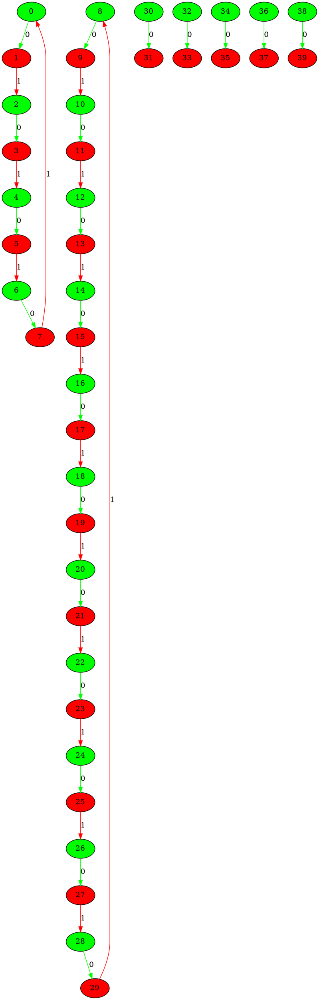
```graphviz
digraph G {
0[label="0" fillcolor="green" style="filled"];
1[label="1" fillcolor="red" style="filled"];
2[label="2" fillcolor="green" style="filled"];
3[label="3" fillcolor="red" style="filled"];
4[label="4" fillcolor="green" style="filled"];
5[label="5" fillcolor="red" style="filled"];
6[label="6" fillcolor="green" style="filled"];
7[label="7" fillcolor="red" style="filled"];
8[label="8" fillcolor="green" style="filled"];
9[label="9" fillcolor="red" style="filled"];
10[label="10" fillcolor="green" style="filled"];
11[label="11" fillcolor="red" style="filled"];
12[label="12" fillcolor="green" style="filled"];
13[label="13" fillcolor="red" style="filled"];
14[label="14" fillcolor="green" style="filled"];
15[label="15" fillcolor="red" style="filled"];
16[label="16" fillcolor="green" style="filled"];
17[label="17" fillcolor="red" style="filled"];
18[label="18" fillcolor="green" style="filled"];
19[label="19" fillcolor="red" style="filled"];
20[label="20" fillcolor="green" style="filled"];
21[label="21" fillcolor="red" style="filled"];
22[label="22" fillcolor="green" style="filled"];
23[label="23" fillcolor="red" style="filled"];
24[label="24" fillcolor="green" style="filled"];
25[label="25" fillcolor="red" style="filled"];
26[label="26" fillcolor="green" style="filled"];
27[label="27" fillcolor="red" style="filled"];
28[label="28" fillcolor="green" style="filled"];
29[label="29" fillcolor="red" style="filled"];
30[label="30" fillcolor="green" style="filled"];
31[label="31" fillcolor="red" style="filled"];
32[label="32" fillcolor="green" style="filled"];
33[label="33" fillcolor="red" style="filled"];
34[label="34" fillcolor="green" style="filled"];
35[label="35" fillcolor="red" style="filled"];
36[label="36" fillcolor="green" style="filled"];
37[label="37" fillcolor="red" style="filled"];
38[label="38" fillcolor="green" style="filled"];
39[label="39" fillcolor="red" style="filled"];
0->1 [label="0" color="green"];
1->2 [label="1" color="red"];
2->3 [label="0" color="green"];
3->4 [label="1" color="red"];
4->5 [label="0" color="green"];
5->6 [label="1" color="red"];
6->7 [label="0" color="green"];
7->0 [label="1" color="red"];
8->9 [label="0" color="green"];
9->10 [label="1" color="red"];
10->11 [label="0" color="green"];
11->12 [label="1" color="red"];
12->13 [label="0" color="green"];
13->14 [label="1" color="red"];
14->15 [label="0" color="green"];
15->16 [label="1" color="red"];
16->17 [label="0" color="green"];
17->18 [label="1" color="red"];
18->19 [label="0" color="green"];
19->20 [label="1" color="red"];
20->21 [label="0" color="green"];
21->22 [label="1" color="red"];
22->23 [label="0" color="green"];
23->24 [label="1" color="red"];
24->25 [label="0" color="green"];
25->26 [label="1" color="red"];
26->27 [label="0" color="green"];
27->28 [label="1" color="red"];
28->29 [label="0" color="green"];
29->8 [label="1" color="red"];
30->31 [label="0" color="green"];
32->33 [label="0" color="green"];
34->35 [label="0" color="green"];
36->37 [label="0" color="green"];
38->39 [label="0" color="green"];
}
```
___
## Graph 10303 - list de compréhension : 11|1,1,1,1,1,4
___

```graphviz
digraph G {
0[label="0" fillcolor="green" style="filled"];
1[label="1" fillcolor="red" style="filled"];
2[label="2" fillcolor="green" style="filled"];
3[label="3" fillcolor="red" style="filled"];
4[label="4" fillcolor="green" style="filled"];
5[label="5" fillcolor="red" style="filled"];
6[label="6" fillcolor="green" style="filled"];
7[label="7" fillcolor="red" style="filled"];
8[label="8" fillcolor="green" style="filled"];
9[label="9" fillcolor="red" style="filled"];
10[label="10" fillcolor="green" style="filled"];
11[label="11" fillcolor="red" style="filled"];
12[label="12" fillcolor="green" style="filled"];
13[label="13" fillcolor="red" style="filled"];
14[label="14" fillcolor="green" style="filled"];
15[label="15" fillcolor="red" style="filled"];
16[label="16" fillcolor="green" style="filled"];
17[label="17" fillcolor="red" style="filled"];
18[label="18" fillcolor="green" style="filled"];
19[label="19" fillcolor="red" style="filled"];
20[label="20" fillcolor="green" style="filled"];
21[label="21" fillcolor="red" style="filled"];
22[label="22" fillcolor="green" style="filled"];
23[label="23" fillcolor="red" style="filled"];
24[label="24" fillcolor="green" style="filled"];
25[label="25" fillcolor="red" style="filled"];
26[label="26" fillcolor="green" style="filled"];
27[label="27" fillcolor="red" style="filled"];
28[label="28" fillcolor="green" style="filled"];
29[label="29" fillcolor="red" style="filled"];
30[label="30" fillcolor="green" style="filled"];
31[label="31" fillcolor="red" style="filled"];
32[label="32" fillcolor="green" style="filled"];
33[label="33" fillcolor="red" style="filled"];
34[label="34" fillcolor="green" style="filled"];
35[label="35" fillcolor="red" style="filled"];
36[label="36" fillcolor="green" style="filled"];
37[label="37" fillcolor="red" style="filled"];
38[label="38" fillcolor="green" style="filled"];
39[label="39" fillcolor="red" style="filled"];
0->1 [label="0" color="green"];
1->2 [label="1" color="red"];
2->3 [label="0" color="green"];
3->4 [label="1" color="red"];
4->5 [label="0" color="green"];
5->6 [label="1" color="red"];
6->7 [label="0" color="green"];
7->8 [label="1" color="red"];
8->9 [label="0" color="green"];
9->10 [label="1" color="red"];
10->11 [label="0" color="green"];
11->12 [label="1" color="red"];
12->13 [label="0" color="green"];
13->14 [label="1" color="red"];
14->15 [label="0" color="green"];
15->16 [label="1" color="red"];
16->17 [label="0" color="green"];
17->18 [label="1" color="red"];
18->19 [label="0" color="green"];
19->20 [label="1" color="red"];
20->21 [label="0" color="green"];
21->0 [label="1" color="red"];
22->23 [label="0" color="green"];
24->25 [label="0" color="green"];
26->27 [label="0" color="green"];
28->29 [label="0" color="green"];
30->31 [label="0" color="green"];
32->33 [label="0" color="green"];
33->34 [label="1" color="red"];
34->35 [label="0" color="green"];
35->36 [label="1" color="red"];
36->37 [label="0" color="green"];
37->38 [label="1" color="red"];
38->39 [label="0" color="green"];
}
```
___
## Graph 10304 - list de compréhension : 0|1,1,1,1,1,5,5,5
___
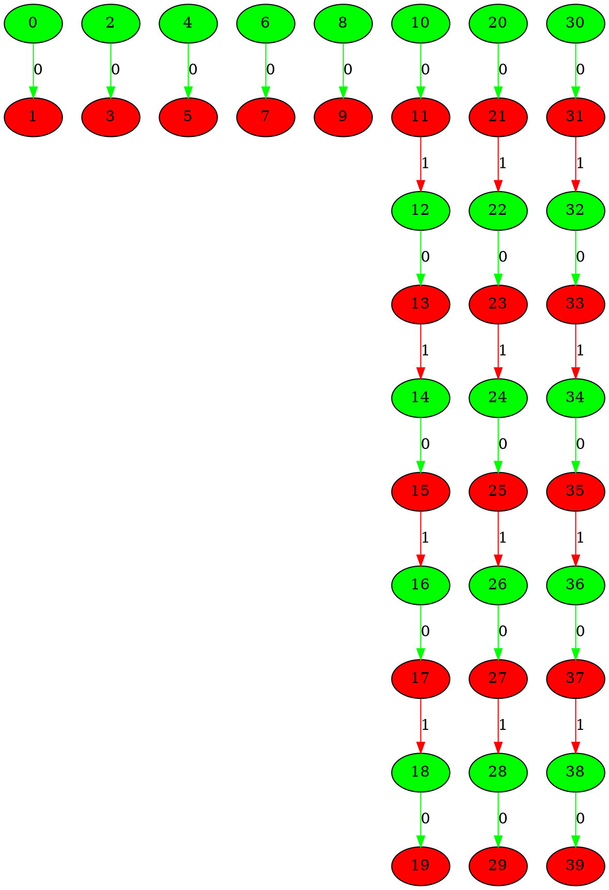
```graphviz
digraph G {
0[label="0" fillcolor="green" style="filled"];
1[label="1" fillcolor="red" style="filled"];
2[label="2" fillcolor="green" style="filled"];
3[label="3" fillcolor="red" style="filled"];
4[label="4" fillcolor="green" style="filled"];
5[label="5" fillcolor="red" style="filled"];
6[label="6" fillcolor="green" style="filled"];
7[label="7" fillcolor="red" style="filled"];
8[label="8" fillcolor="green" style="filled"];
9[label="9" fillcolor="red" style="filled"];
10[label="10" fillcolor="green" style="filled"];
11[label="11" fillcolor="red" style="filled"];
12[label="12" fillcolor="green" style="filled"];
13[label="13" fillcolor="red" style="filled"];
14[label="14" fillcolor="green" style="filled"];
15[label="15" fillcolor="red" style="filled"];
16[label="16" fillcolor="green" style="filled"];
17[label="17" fillcolor="red" style="filled"];
18[label="18" fillcolor="green" style="filled"];
19[label="19" fillcolor="red" style="filled"];
20[label="20" fillcolor="green" style="filled"];
21[label="21" fillcolor="red" style="filled"];
22[label="22" fillcolor="green" style="filled"];
23[label="23" fillcolor="red" style="filled"];
24[label="24" fillcolor="green" style="filled"];
25[label="25" fillcolor="red" style="filled"];
26[label="26" fillcolor="green" style="filled"];
27[label="27" fillcolor="red" style="filled"];
28[label="28" fillcolor="green" style="filled"];
29[label="29" fillcolor="red" style="filled"];
30[label="30" fillcolor="green" style="filled"];
31[label="31" fillcolor="red" style="filled"];
32[label="32" fillcolor="green" style="filled"];
33[label="33" fillcolor="red" style="filled"];
34[label="34" fillcolor="green" style="filled"];
35[label="35" fillcolor="red" style="filled"];
36[label="36" fillcolor="green" style="filled"];
37[label="37" fillcolor="red" style="filled"];
38[label="38" fillcolor="green" style="filled"];
39[label="39" fillcolor="red" style="filled"];
0->1 [label="0" color="green"];
2->3 [label="0" color="green"];
4->5 [label="0" color="green"];
6->7 [label="0" color="green"];
8->9 [label="0" color="green"];
10->11 [label="0" color="green"];
11->12 [label="1" color="red"];
12->13 [label="0" color="green"];
13->14 [label="1" color="red"];
14->15 [label="0" color="green"];
15->16 [label="1" color="red"];
16->17 [label="0" color="green"];
17->18 [label="1" color="red"];
18->19 [label="0" color="green"];
20->21 [label="0" color="green"];
21->22 [label="1" color="red"];
22->23 [label="0" color="green"];
23->24 [label="1" color="red"];
24->25 [label="0" color="green"];
25->26 [label="1" color="red"];
26->27 [label="0" color="green"];
27->28 [label="1" color="red"];
28->29 [label="0" color="green"];
30->31 [label="0" color="green"];
31->32 [label="1" color="red"];
32->33 [label="0" color="green"];
33->34 [label="1" color="red"];
34->35 [label="0" color="green"];
35->36 [label="1" color="red"];
36->37 [label="0" color="green"];
37->38 [label="1" color="red"];
38->39 [label="0" color="green"];
}
```
___
## Graph 10305 - list de compréhension : 1|1,1,1,1,5,5,5
___
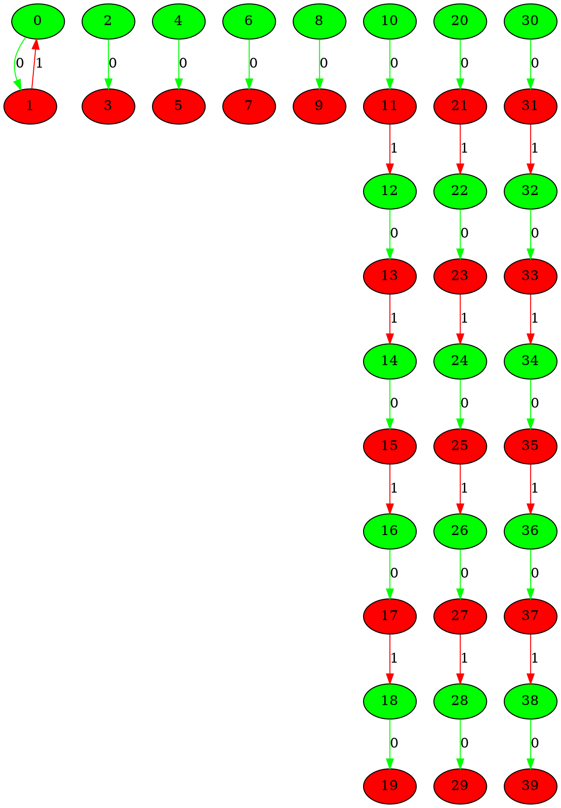
```graphviz
digraph G {
0[label="0" fillcolor="green" style="filled"];
1[label="1" fillcolor="red" style="filled"];
2[label="2" fillcolor="green" style="filled"];
3[label="3" fillcolor="red" style="filled"];
4[label="4" fillcolor="green" style="filled"];
5[label="5" fillcolor="red" style="filled"];
6[label="6" fillcolor="green" style="filled"];
7[label="7" fillcolor="red" style="filled"];
8[label="8" fillcolor="green" style="filled"];
9[label="9" fillcolor="red" style="filled"];
10[label="10" fillcolor="green" style="filled"];
11[label="11" fillcolor="red" style="filled"];
12[label="12" fillcolor="green" style="filled"];
13[label="13" fillcolor="red" style="filled"];
14[label="14" fillcolor="green" style="filled"];
15[label="15" fillcolor="red" style="filled"];
16[label="16" fillcolor="green" style="filled"];
17[label="17" fillcolor="red" style="filled"];
18[label="18" fillcolor="green" style="filled"];
19[label="19" fillcolor="red" style="filled"];
20[label="20" fillcolor="green" style="filled"];
21[label="21" fillcolor="red" style="filled"];
22[label="22" fillcolor="green" style="filled"];
23[label="23" fillcolor="red" style="filled"];
24[label="24" fillcolor="green" style="filled"];
25[label="25" fillcolor="red" style="filled"];
26[label="26" fillcolor="green" style="filled"];
27[label="27" fillcolor="red" style="filled"];
28[label="28" fillcolor="green" style="filled"];
29[label="29" fillcolor="red" style="filled"];
30[label="30" fillcolor="green" style="filled"];
31[label="31" fillcolor="red" style="filled"];
32[label="32" fillcolor="green" style="filled"];
33[label="33" fillcolor="red" style="filled"];
34[label="34" fillcolor="green" style="filled"];
35[label="35" fillcolor="red" style="filled"];
36[label="36" fillcolor="green" style="filled"];
37[label="37" fillcolor="red" style="filled"];
38[label="38" fillcolor="green" style="filled"];
39[label="39" fillcolor="red" style="filled"];
0->1 [label="0" color="green"];
1->0 [label="1" color="red"];
2->3 [label="0" color="green"];
4->5 [label="0" color="green"];
6->7 [label="0" color="green"];
8->9 [label="0" color="green"];
10->11 [label="0" color="green"];
11->12 [label="1" color="red"];
12->13 [label="0" color="green"];
13->14 [label="1" color="red"];
14->15 [label="0" color="green"];
15->16 [label="1" color="red"];
16->17 [label="0" color="green"];
17->18 [label="1" color="red"];
18->19 [label="0" color="green"];
20->21 [label="0" color="green"];
21->22 [label="1" color="red"];
22->23 [label="0" color="green"];
23->24 [label="1" color="red"];
24->25 [label="0" color="green"];
25->26 [label="1" color="red"];
26->27 [label="0" color="green"];
27->28 [label="1" color="red"];
28->29 [label="0" color="green"];
30->31 [label="0" color="green"];
31->32 [label="1" color="red"];
32->33 [label="0" color="green"];
33->34 [label="1" color="red"];
34->35 [label="0" color="green"];
35->36 [label="1" color="red"];
36->37 [label="0" color="green"];
37->38 [label="1" color="red"];
38->39 [label="0" color="green"];
}
```
___
## Graph 10306 - list de compréhension : 1,1|1,1,1,5,5,5
___
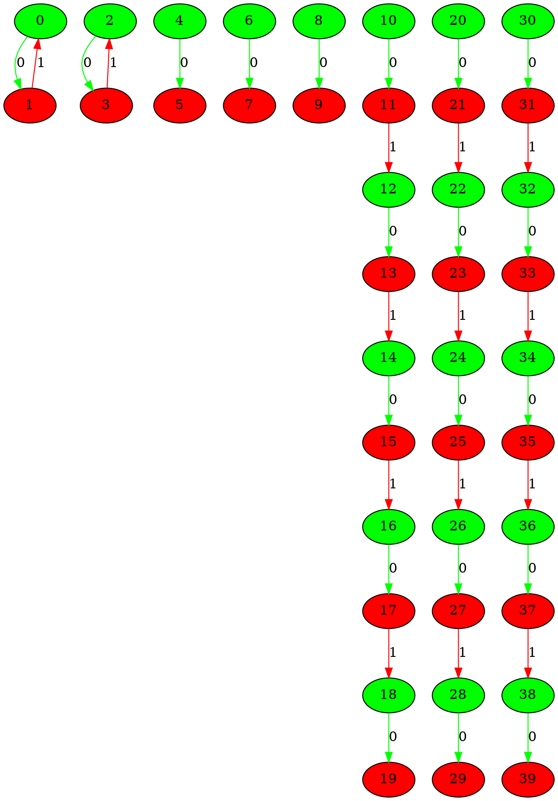
```graphviz
digraph G {
0[label="0" fillcolor="green" style="filled"];
1[label="1" fillcolor="red" style="filled"];
2[label="2" fillcolor="green" style="filled"];
3[label="3" fillcolor="red" style="filled"];
4[label="4" fillcolor="green" style="filled"];
5[label="5" fillcolor="red" style="filled"];
6[label="6" fillcolor="green" style="filled"];
7[label="7" fillcolor="red" style="filled"];
8[label="8" fillcolor="green" style="filled"];
9[label="9" fillcolor="red" style="filled"];
10[label="10" fillcolor="green" style="filled"];
11[label="11" fillcolor="red" style="filled"];
12[label="12" fillcolor="green" style="filled"];
13[label="13" fillcolor="red" style="filled"];
14[label="14" fillcolor="green" style="filled"];
15[label="15" fillcolor="red" style="filled"];
16[label="16" fillcolor="green" style="filled"];
17[label="17" fillcolor="red" style="filled"];
18[label="18" fillcolor="green" style="filled"];
19[label="19" fillcolor="red" style="filled"];
20[label="20" fillcolor="green" style="filled"];
21[label="21" fillcolor="red" style="filled"];
22[label="22" fillcolor="green" style="filled"];
23[label="23" fillcolor="red" style="filled"];
24[label="24" fillcolor="green" style="filled"];
25[label="25" fillcolor="red" style="filled"];
26[label="26" fillcolor="green" style="filled"];
27[label="27" fillcolor="red" style="filled"];
28[label="28" fillcolor="green" style="filled"];
29[label="29" fillcolor="red" style="filled"];
30[label="30" fillcolor="green" style="filled"];
31[label="31" fillcolor="red" style="filled"];
32[label="32" fillcolor="green" style="filled"];
33[label="33" fillcolor="red" style="filled"];
34[label="34" fillcolor="green" style="filled"];
35[label="35" fillcolor="red" style="filled"];
36[label="36" fillcolor="green" style="filled"];
37[label="37" fillcolor="red" style="filled"];
38[label="38" fillcolor="green" style="filled"];
39[label="39" fillcolor="red" style="filled"];
0->1 [label="0" color="green"];
1->0 [label="1" color="red"];
2->3 [label="0" color="green"];
3->2 [label="1" color="red"];
4->5 [label="0" color="green"];
6->7 [label="0" color="green"];
8->9 [label="0" color="green"];
10->11 [label="0" color="green"];
11->12 [label="1" color="red"];
12->13 [label="0" color="green"];
13->14 [label="1" color="red"];
14->15 [label="0" color="green"];
15->16 [label="1" color="red"];
16->17 [label="0" color="green"];
17->18 [label="1" color="red"];
18->19 [label="0" color="green"];
20->21 [label="0" color="green"];
21->22 [label="1" color="red"];
22->23 [label="0" color="green"];
23->24 [label="1" color="red"];
24->25 [label="0" color="green"];
25->26 [label="1" color="red"];
26->27 [label="0" color="green"];
27->28 [label="1" color="red"];
28->29 [label="0" color="green"];
30->31 [label="0" color="green"];
31->32 [label="1" color="red"];
32->33 [label="0" color="green"];
33->34 [label="1" color="red"];
34->35 [label="0" color="green"];
35->36 [label="1" color="red"];
36->37 [label="0" color="green"];
37->38 [label="1" color="red"];
38->39 [label="0" color="green"];
}
```
___
## Graph 10307 - list de compréhension : 1,1,1|1,1,5,5,5
___
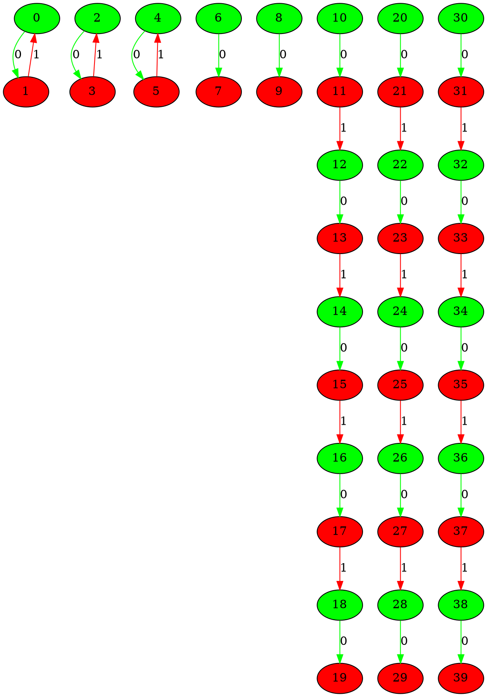
```graphviz
digraph G {
0[label="0" fillcolor="green" style="filled"];
1[label="1" fillcolor="red" style="filled"];
2[label="2" fillcolor="green" style="filled"];
3[label="3" fillcolor="red" style="filled"];
4[label="4" fillcolor="green" style="filled"];
5[label="5" fillcolor="red" style="filled"];
6[label="6" fillcolor="green" style="filled"];
7[label="7" fillcolor="red" style="filled"];
8[label="8" fillcolor="green" style="filled"];
9[label="9" fillcolor="red" style="filled"];
10[label="10" fillcolor="green" style="filled"];
11[label="11" fillcolor="red" style="filled"];
12[label="12" fillcolor="green" style="filled"];
13[label="13" fillcolor="red" style="filled"];
14[label="14" fillcolor="green" style="filled"];
15[label="15" fillcolor="red" style="filled"];
16[label="16" fillcolor="green" style="filled"];
17[label="17" fillcolor="red" style="filled"];
18[label="18" fillcolor="green" style="filled"];
19[label="19" fillcolor="red" style="filled"];
20[label="20" fillcolor="green" style="filled"];
21[label="21" fillcolor="red" style="filled"];
22[label="22" fillcolor="green" style="filled"];
23[label="23" fillcolor="red" style="filled"];
24[label="24" fillcolor="green" style="filled"];
25[label="25" fillcolor="red" style="filled"];
26[label="26" fillcolor="green" style="filled"];
27[label="27" fillcolor="red" style="filled"];
28[label="28" fillcolor="green" style="filled"];
29[label="29" fillcolor="red" style="filled"];
30[label="30" fillcolor="green" style="filled"];
31[label="31" fillcolor="red" style="filled"];
32[label="32" fillcolor="green" style="filled"];
33[label="33" fillcolor="red" style="filled"];
34[label="34" fillcolor="green" style="filled"];
35[label="35" fillcolor="red" style="filled"];
36[label="36" fillcolor="green" style="filled"];
37[label="37" fillcolor="red" style="filled"];
38[label="38" fillcolor="green" style="filled"];
39[label="39" fillcolor="red" style="filled"];
0->1 [label="0" color="green"];
1->0 [label="1" color="red"];
2->3 [label="0" color="green"];
3->2 [label="1" color="red"];
4->5 [label="0" color="green"];
5->4 [label="1" color="red"];
6->7 [label="0" color="green"];
8->9 [label="0" color="green"];
10->11 [label="0" color="green"];
11->12 [label="1" color="red"];
12->13 [label="0" color="green"];
13->14 [label="1" color="red"];
14->15 [label="0" color="green"];
15->16 [label="1" color="red"];
16->17 [label="0" color="green"];
17->18 [label="1" color="red"];
18->19 [label="0" color="green"];
20->21 [label="0" color="green"];
21->22 [label="1" color="red"];
22->23 [label="0" color="green"];
23->24 [label="1" color="red"];
24->25 [label="0" color="green"];
25->26 [label="1" color="red"];
26->27 [label="0" color="green"];
27->28 [label="1" color="red"];
28->29 [label="0" color="green"];
30->31 [label="0" color="green"];
31->32 [label="1" color="red"];
32->33 [label="0" color="green"];
33->34 [label="1" color="red"];
34->35 [label="0" color="green"];
35->36 [label="1" color="red"];
36->37 [label="0" color="green"];
37->38 [label="1" color="red"];
38->39 [label="0" color="green"];
}
```
___
## Graph 10308 - list de compréhension : 1,1,1,1|1,5,5,5
___
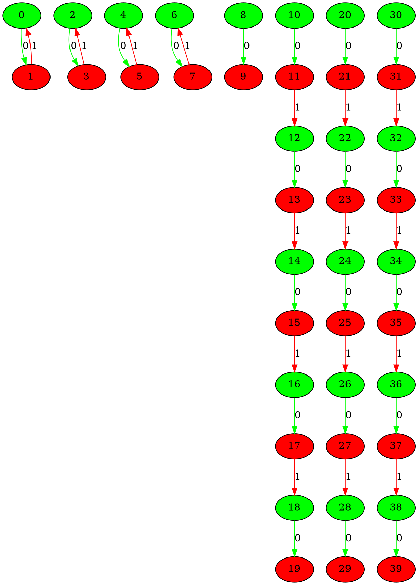
```graphviz
digraph G {
0[label="0" fillcolor="green" style="filled"];
1[label="1" fillcolor="red" style="filled"];
2[label="2" fillcolor="green" style="filled"];
3[label="3" fillcolor="red" style="filled"];
4[label="4" fillcolor="green" style="filled"];
5[label="5" fillcolor="red" style="filled"];
6[label="6" fillcolor="green" style="filled"];
7[label="7" fillcolor="red" style="filled"];
8[label="8" fillcolor="green" style="filled"];
9[label="9" fillcolor="red" style="filled"];
10[label="10" fillcolor="green" style="filled"];
11[label="11" fillcolor="red" style="filled"];
12[label="12" fillcolor="green" style="filled"];
13[label="13" fillcolor="red" style="filled"];
14[label="14" fillcolor="green" style="filled"];
15[label="15" fillcolor="red" style="filled"];
16[label="16" fillcolor="green" style="filled"];
17[label="17" fillcolor="red" style="filled"];
18[label="18" fillcolor="green" style="filled"];
19[label="19" fillcolor="red" style="filled"];
20[label="20" fillcolor="green" style="filled"];
21[label="21" fillcolor="red" style="filled"];
22[label="22" fillcolor="green" style="filled"];
23[label="23" fillcolor="red" style="filled"];
24[label="24" fillcolor="green" style="filled"];
25[label="25" fillcolor="red" style="filled"];
26[label="26" fillcolor="green" style="filled"];
27[label="27" fillcolor="red" style="filled"];
28[label="28" fillcolor="green" style="filled"];
29[label="29" fillcolor="red" style="filled"];
30[label="30" fillcolor="green" style="filled"];
31[label="31" fillcolor="red" style="filled"];
32[label="32" fillcolor="green" style="filled"];
33[label="33" fillcolor="red" style="filled"];
34[label="34" fillcolor="green" style="filled"];
35[label="35" fillcolor="red" style="filled"];
36[label="36" fillcolor="green" style="filled"];
37[label="37" fillcolor="red" style="filled"];
38[label="38" fillcolor="green" style="filled"];
39[label="39" fillcolor="red" style="filled"];
0->1 [label="0" color="green"];
1->0 [label="1" color="red"];
2->3 [label="0" color="green"];
3->2 [label="1" color="red"];
4->5 [label="0" color="green"];
5->4 [label="1" color="red"];
6->7 [label="0" color="green"];
7->6 [label="1" color="red"];
8->9 [label="0" color="green"];
10->11 [label="0" color="green"];
11->12 [label="1" color="red"];
12->13 [label="0" color="green"];
13->14 [label="1" color="red"];
14->15 [label="0" color="green"];
15->16 [label="1" color="red"];
16->17 [label="0" color="green"];
17->18 [label="1" color="red"];
18->19 [label="0" color="green"];
20->21 [label="0" color="green"];
21->22 [label="1" color="red"];
22->23 [label="0" color="green"];
23->24 [label="1" color="red"];
24->25 [label="0" color="green"];
25->26 [label="1" color="red"];
26->27 [label="0" color="green"];
27->28 [label="1" color="red"];
28->29 [label="0" color="green"];
30->31 [label="0" color="green"];
31->32 [label="1" color="red"];
32->33 [label="0" color="green"];
33->34 [label="1" color="red"];
34->35 [label="0" color="green"];
35->36 [label="1" color="red"];
36->37 [label="0" color="green"];
37->38 [label="1" color="red"];
38->39 [label="0" color="green"];
}
```
___
## Graph 10309 - list de compréhension : 1,1,1,1,1|5,5,5
___
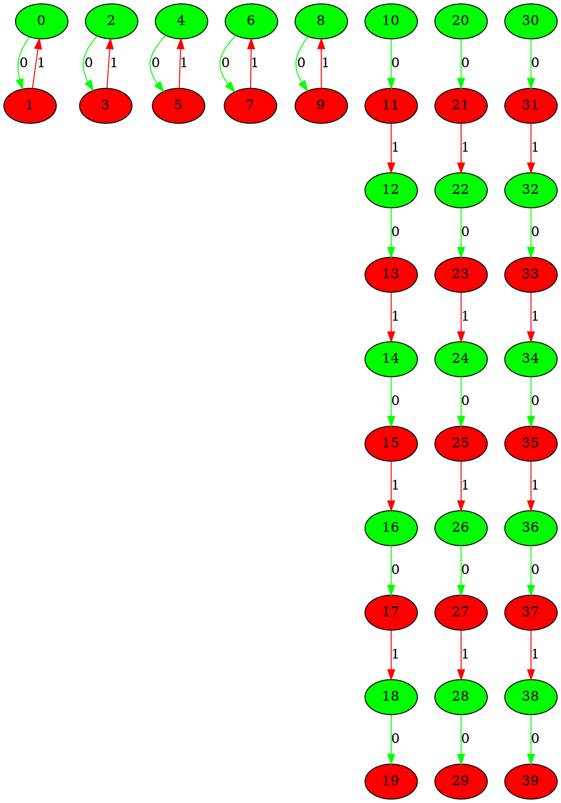
```graphviz
digraph G {
0[label="0" fillcolor="green" style="filled"];
1[label="1" fillcolor="red" style="filled"];
2[label="2" fillcolor="green" style="filled"];
3[label="3" fillcolor="red" style="filled"];
4[label="4" fillcolor="green" style="filled"];
5[label="5" fillcolor="red" style="filled"];
6[label="6" fillcolor="green" style="filled"];
7[label="7" fillcolor="red" style="filled"];
8[label="8" fillcolor="green" style="filled"];
9[label="9" fillcolor="red" style="filled"];
10[label="10" fillcolor="green" style="filled"];
11[label="11" fillcolor="red" style="filled"];
12[label="12" fillcolor="green" style="filled"];
13[label="13" fillcolor="red" style="filled"];
14[label="14" fillcolor="green" style="filled"];
15[label="15" fillcolor="red" style="filled"];
16[label="16" fillcolor="green" style="filled"];
17[label="17" fillcolor="red" style="filled"];
18[label="18" fillcolor="green" style="filled"];
19[label="19" fillcolor="red" style="filled"];
20[label="20" fillcolor="green" style="filled"];
21[label="21" fillcolor="red" style="filled"];
22[label="22" fillcolor="green" style="filled"];
23[label="23" fillcolor="red" style="filled"];
24[label="24" fillcolor="green" style="filled"];
25[label="25" fillcolor="red" style="filled"];
26[label="26" fillcolor="green" style="filled"];
27[label="27" fillcolor="red" style="filled"];
28[label="28" fillcolor="green" style="filled"];
29[label="29" fillcolor="red" style="filled"];
30[label="30" fillcolor="green" style="filled"];
31[label="31" fillcolor="red" style="filled"];
32[label="32" fillcolor="green" style="filled"];
33[label="33" fillcolor="red" style="filled"];
34[label="34" fillcolor="green" style="filled"];
35[label="35" fillcolor="red" style="filled"];
36[label="36" fillcolor="green" style="filled"];
37[label="37" fillcolor="red" style="filled"];
38[label="38" fillcolor="green" style="filled"];
39[label="39" fillcolor="red" style="filled"];
0->1 [label="0" color="green"];
1->0 [label="1" color="red"];
2->3 [label="0" color="green"];
3->2 [label="1" color="red"];
4->5 [label="0" color="green"];
5->4 [label="1" color="red"];
6->7 [label="0" color="green"];
7->6 [label="1" color="red"];
8->9 [label="0" color="green"];
9->8 [label="1" color="red"];
10->11 [label="0" color="green"];
11->12 [label="1" color="red"];
12->13 [label="0" color="green"];
13->14 [label="1" color="red"];
14->15 [label="0" color="green"];
15->16 [label="1" color="red"];
16->17 [label="0" color="green"];
17->18 [label="1" color="red"];
18->19 [label="0" color="green"];
20->21 [label="0" color="green"];
21->22 [label="1" color="red"];
22->23 [label="0" color="green"];
23->24 [label="1" color="red"];
24->25 [label="0" color="green"];
25->26 [label="1" color="red"];
26->27 [label="0" color="green"];
27->28 [label="1" color="red"];
28->29 [label="0" color="green"];
30->31 [label="0" color="green"];
31->32 [label="1" color="red"];
32->33 [label="0" color="green"];
33->34 [label="1" color="red"];
34->35 [label="0" color="green"];
35->36 [label="1" color="red"];
36->37 [label="0" color="green"];
37->38 [label="1" color="red"];
38->39 [label="0" color="green"];
}
```
___
## Graph 10310 - list de compréhension : 1,1,1,1,1,5|5,5
___
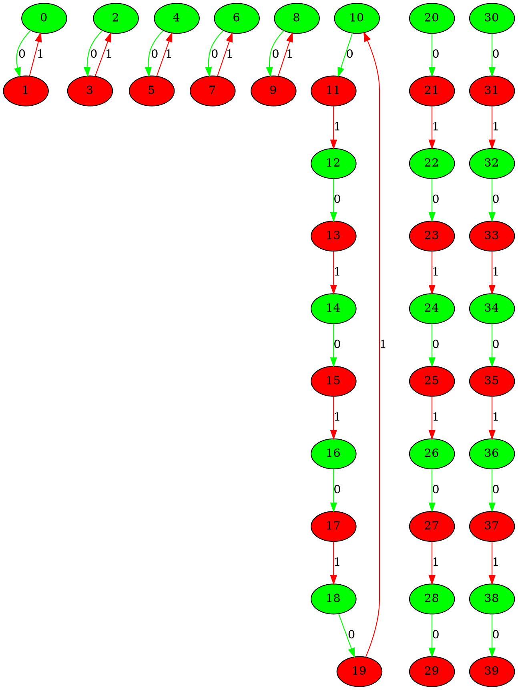
```graphviz
digraph G {
0[label="0" fillcolor="green" style="filled"];
1[label="1" fillcolor="red" style="filled"];
2[label="2" fillcolor="green" style="filled"];
3[label="3" fillcolor="red" style="filled"];
4[label="4" fillcolor="green" style="filled"];
5[label="5" fillcolor="red" style="filled"];
6[label="6" fillcolor="green" style="filled"];
7[label="7" fillcolor="red" style="filled"];
8[label="8" fillcolor="green" style="filled"];
9[label="9" fillcolor="red" style="filled"];
10[label="10" fillcolor="green" style="filled"];
11[label="11" fillcolor="red" style="filled"];
12[label="12" fillcolor="green" style="filled"];
13[label="13" fillcolor="red" style="filled"];
14[label="14" fillcolor="green" style="filled"];
15[label="15" fillcolor="red" style="filled"];
16[label="16" fillcolor="green" style="filled"];
17[label="17" fillcolor="red" style="filled"];
18[label="18" fillcolor="green" style="filled"];
19[label="19" fillcolor="red" style="filled"];
20[label="20" fillcolor="green" style="filled"];
21[label="21" fillcolor="red" style="filled"];
22[label="22" fillcolor="green" style="filled"];
23[label="23" fillcolor="red" style="filled"];
24[label="24" fillcolor="green" style="filled"];
25[label="25" fillcolor="red" style="filled"];
26[label="26" fillcolor="green" style="filled"];
27[label="27" fillcolor="red" style="filled"];
28[label="28" fillcolor="green" style="filled"];
29[label="29" fillcolor="red" style="filled"];
30[label="30" fillcolor="green" style="filled"];
31[label="31" fillcolor="red" style="filled"];
32[label="32" fillcolor="green" style="filled"];
33[label="33" fillcolor="red" style="filled"];
34[label="34" fillcolor="green" style="filled"];
35[label="35" fillcolor="red" style="filled"];
36[label="36" fillcolor="green" style="filled"];
37[label="37" fillcolor="red" style="filled"];
38[label="38" fillcolor="green" style="filled"];
39[label="39" fillcolor="red" style="filled"];
0->1 [label="0" color="green"];
1->0 [label="1" color="red"];
2->3 [label="0" color="green"];
3->2 [label="1" color="red"];
4->5 [label="0" color="green"];
5->4 [label="1" color="red"];
6->7 [label="0" color="green"];
7->6 [label="1" color="red"];
8->9 [label="0" color="green"];
9->8 [label="1" color="red"];
10->11 [label="0" color="green"];
11->12 [label="1" color="red"];
12->13 [label="0" color="green"];
13->14 [label="1" color="red"];
14->15 [label="0" color="green"];
15->16 [label="1" color="red"];
16->17 [label="0" color="green"];
17->18 [label="1" color="red"];
18->19 [label="0" color="green"];
19->10 [label="1" color="red"];
20->21 [label="0" color="green"];
21->22 [label="1" color="red"];
22->23 [label="0" color="green"];
23->24 [label="1" color="red"];
24->25 [label="0" color="green"];
25->26 [label="1" color="red"];
26->27 [label="0" color="green"];
27->28 [label="1" color="red"];
28->29 [label="0" color="green"];
30->31 [label="0" color="green"];
31->32 [label="1" color="red"];
32->33 [label="0" color="green"];
33->34 [label="1" color="red"];
34->35 [label="0" color="green"];
35->36 [label="1" color="red"];
36->37 [label="0" color="green"];
37->38 [label="1" color="red"];
38->39 [label="0" color="green"];
}
```
___
## Graph 10311 - list de compréhension : 1,1,1,1,1,5,5|5
___
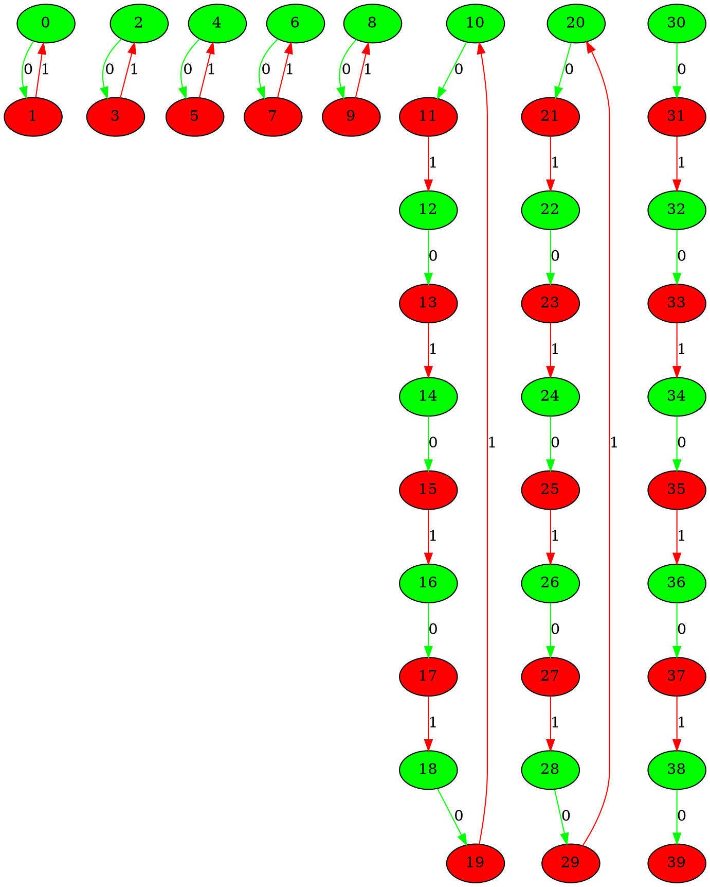
```graphviz
digraph G {
0[label="0" fillcolor="green" style="filled"];
1[label="1" fillcolor="red" style="filled"];
2[label="2" fillcolor="green" style="filled"];
3[label="3" fillcolor="red" style="filled"];
4[label="4" fillcolor="green" style="filled"];
5[label="5" fillcolor="red" style="filled"];
6[label="6" fillcolor="green" style="filled"];
7[label="7" fillcolor="red" style="filled"];
8[label="8" fillcolor="green" style="filled"];
9[label="9" fillcolor="red" style="filled"];
10[label="10" fillcolor="green" style="filled"];
11[label="11" fillcolor="red" style="filled"];
12[label="12" fillcolor="green" style="filled"];
13[label="13" fillcolor="red" style="filled"];
14[label="14" fillcolor="green" style="filled"];
15[label="15" fillcolor="red" style="filled"];
16[label="16" fillcolor="green" style="filled"];
17[label="17" fillcolor="red" style="filled"];
18[label="18" fillcolor="green" style="filled"];
19[label="19" fillcolor="red" style="filled"];
20[label="20" fillcolor="green" style="filled"];
21[label="21" fillcolor="red" style="filled"];
22[label="22" fillcolor="green" style="filled"];
23[label="23" fillcolor="red" style="filled"];
24[label="24" fillcolor="green" style="filled"];
25[label="25" fillcolor="red" style="filled"];
26[label="26" fillcolor="green" style="filled"];
27[label="27" fillcolor="red" style="filled"];
28[label="28" fillcolor="green" style="filled"];
29[label="29" fillcolor="red" style="filled"];
30[label="30" fillcolor="green" style="filled"];
31[label="31" fillcolor="red" style="filled"];
32[label="32" fillcolor="green" style="filled"];
33[label="33" fillcolor="red" style="filled"];
34[label="34" fillcolor="green" style="filled"];
35[label="35" fillcolor="red" style="filled"];
36[label="36" fillcolor="green" style="filled"];
37[label="37" fillcolor="red" style="filled"];
38[label="38" fillcolor="green" style="filled"];
39[label="39" fillcolor="red" style="filled"];
0->1 [label="0" color="green"];
1->0 [label="1" color="red"];
2->3 [label="0" color="green"];
3->2 [label="1" color="red"];
4->5 [label="0" color="green"];
5->4 [label="1" color="red"];
6->7 [label="0" color="green"];
7->6 [label="1" color="red"];
8->9 [label="0" color="green"];
9->8 [label="1" color="red"];
10->11 [label="0" color="green"];
11->12 [label="1" color="red"];
12->13 [label="0" color="green"];
13->14 [label="1" color="red"];
14->15 [label="0" color="green"];
15->16 [label="1" color="red"];
16->17 [label="0" color="green"];
17->18 [label="1" color="red"];
18->19 [label="0" color="green"];
19->10 [label="1" color="red"];
20->21 [label="0" color="green"];
21->22 [label="1" color="red"];
22->23 [label="0" color="green"];
23->24 [label="1" color="red"];
24->25 [label="0" color="green"];
25->26 [label="1" color="red"];
26->27 [label="0" color="green"];
27->28 [label="1" color="red"];
28->29 [label="0" color="green"];
29->20 [label="1" color="red"];
30->31 [label="0" color="green"];
31->32 [label="1" color="red"];
32->33 [label="0" color="green"];
33->34 [label="1" color="red"];
34->35 [label="0" color="green"];
35->36 [label="1" color="red"];
36->37 [label="0" color="green"];
37->38 [label="1" color="red"];
38->39 [label="0" color="green"];
}
```
___
## Graph 10312 - list de compréhension : 1,1,1,1,1,5,5,5|0
___
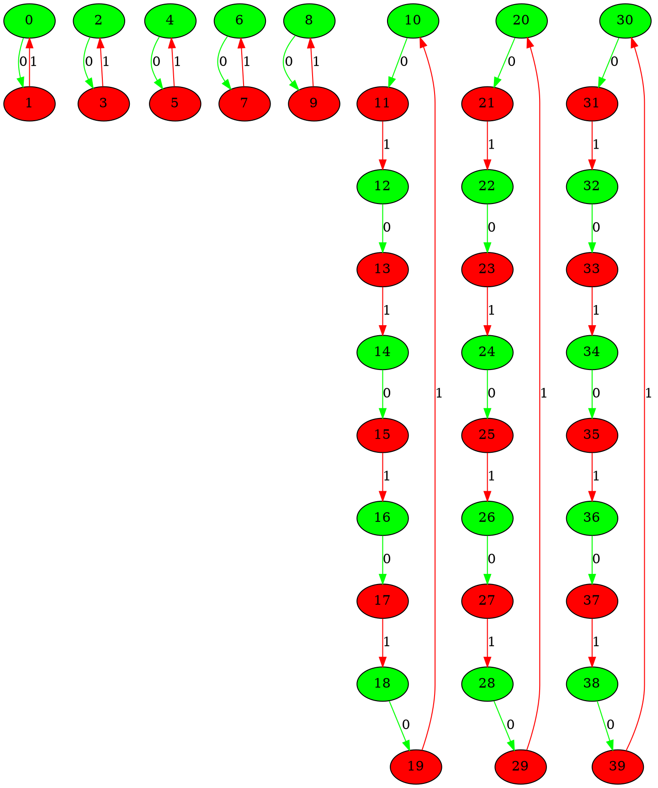
```graphviz
digraph G {
0[label="0" fillcolor="green" style="filled"];
1[label="1" fillcolor="red" style="filled"];
2[label="2" fillcolor="green" style="filled"];
3[label="3" fillcolor="red" style="filled"];
4[label="4" fillcolor="green" style="filled"];
5[label="5" fillcolor="red" style="filled"];
6[label="6" fillcolor="green" style="filled"];
7[label="7" fillcolor="red" style="filled"];
8[label="8" fillcolor="green" style="filled"];
9[label="9" fillcolor="red" style="filled"];
10[label="10" fillcolor="green" style="filled"];
11[label="11" fillcolor="red" style="filled"];
12[label="12" fillcolor="green" style="filled"];
13[label="13" fillcolor="red" style="filled"];
14[label="14" fillcolor="green" style="filled"];
15[label="15" fillcolor="red" style="filled"];
16[label="16" fillcolor="green" style="filled"];
17[label="17" fillcolor="red" style="filled"];
18[label="18" fillcolor="green" style="filled"];
19[label="19" fillcolor="red" style="filled"];
20[label="20" fillcolor="green" style="filled"];
21[label="21" fillcolor="red" style="filled"];
22[label="22" fillcolor="green" style="filled"];
23[label="23" fillcolor="red" style="filled"];
24[label="24" fillcolor="green" style="filled"];
25[label="25" fillcolor="red" style="filled"];
26[label="26" fillcolor="green" style="filled"];
27[label="27" fillcolor="red" style="filled"];
28[label="28" fillcolor="green" style="filled"];
29[label="29" fillcolor="red" style="filled"];
30[label="30" fillcolor="green" style="filled"];
31[label="31" fillcolor="red" style="filled"];
32[label="32" fillcolor="green" style="filled"];
33[label="33" fillcolor="red" style="filled"];
34[label="34" fillcolor="green" style="filled"];
35[label="35" fillcolor="red" style="filled"];
36[label="36" fillcolor="green" style="filled"];
37[label="37" fillcolor="red" style="filled"];
38[label="38" fillcolor="green" style="filled"];
39[label="39" fillcolor="red" style="filled"];
0->1 [label="0" color="green"];
1->0 [label="1" color="red"];
2->3 [label="0" color="green"];
3->2 [label="1" color="red"];
4->5 [label="0" color="green"];
5->4 [label="1" color="red"];
6->7 [label="0" color="green"];
7->6 [label="1" color="red"];
8->9 [label="0" color="green"];
9->8 [label="1" color="red"];
10->11 [label="0" color="green"];
11->12 [label="1" color="red"];
12->13 [label="0" color="green"];
13->14 [label="1" color="red"];
14->15 [label="0" color="green"];
15->16 [label="1" color="red"];
16->17 [label="0" color="green"];
17->18 [label="1" color="red"];
18->19 [label="0" color="green"];
19->10 [label="1" color="red"];
20->21 [label="0" color="green"];
21->22 [label="1" color="red"];
22->23 [label="0" color="green"];
23->24 [label="1" color="red"];
24->25 [label="0" color="green"];
25->26 [label="1" color="red"];
26->27 [label="0" color="green"];
27->28 [label="1" color="red"];
28->29 [label="0" color="green"];
29->20 [label="1" color="red"];
30->31 [label="0" color="green"];
31->32 [label="1" color="red"];
32->33 [label="0" color="green"];
33->34 [label="1" color="red"];
34->35 [label="0" color="green"];
35->36 [label="1" color="red"];
36->37 [label="0" color="green"];
37->38 [label="1" color="red"];
38->39 [label="0" color="green"];
39->30 [label="1" color="red"];
}
```
___
## Graph 10313 - list de compréhension : 1,1,1,1,5|1,5,5
___
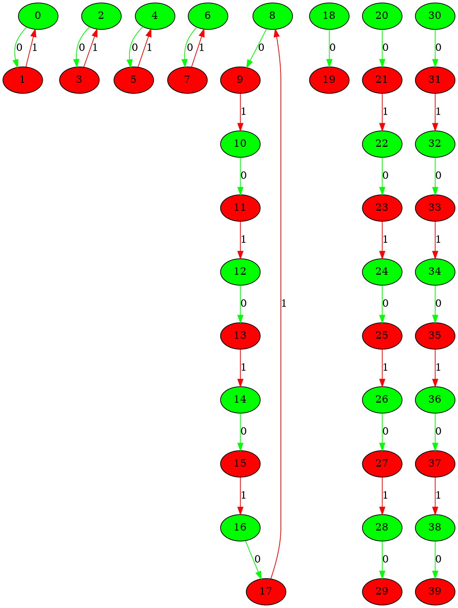
```graphviz
digraph G {
0[label="0" fillcolor="green" style="filled"];
1[label="1" fillcolor="red" style="filled"];
2[label="2" fillcolor="green" style="filled"];
3[label="3" fillcolor="red" style="filled"];
4[label="4" fillcolor="green" style="filled"];
5[label="5" fillcolor="red" style="filled"];
6[label="6" fillcolor="green" style="filled"];
7[label="7" fillcolor="red" style="filled"];
8[label="8" fillcolor="green" style="filled"];
9[label="9" fillcolor="red" style="filled"];
10[label="10" fillcolor="green" style="filled"];
11[label="11" fillcolor="red" style="filled"];
12[label="12" fillcolor="green" style="filled"];
13[label="13" fillcolor="red" style="filled"];
14[label="14" fillcolor="green" style="filled"];
15[label="15" fillcolor="red" style="filled"];
16[label="16" fillcolor="green" style="filled"];
17[label="17" fillcolor="red" style="filled"];
18[label="18" fillcolor="green" style="filled"];
19[label="19" fillcolor="red" style="filled"];
20[label="20" fillcolor="green" style="filled"];
21[label="21" fillcolor="red" style="filled"];
22[label="22" fillcolor="green" style="filled"];
23[label="23" fillcolor="red" style="filled"];
24[label="24" fillcolor="green" style="filled"];
25[label="25" fillcolor="red" style="filled"];
26[label="26" fillcolor="green" style="filled"];
27[label="27" fillcolor="red" style="filled"];
28[label="28" fillcolor="green" style="filled"];
29[label="29" fillcolor="red" style="filled"];
30[label="30" fillcolor="green" style="filled"];
31[label="31" fillcolor="red" style="filled"];
32[label="32" fillcolor="green" style="filled"];
33[label="33" fillcolor="red" style="filled"];
34[label="34" fillcolor="green" style="filled"];
35[label="35" fillcolor="red" style="filled"];
36[label="36" fillcolor="green" style="filled"];
37[label="37" fillcolor="red" style="filled"];
38[label="38" fillcolor="green" style="filled"];
39[label="39" fillcolor="red" style="filled"];
0->1 [label="0" color="green"];
1->0 [label="1" color="red"];
2->3 [label="0" color="green"];
3->2 [label="1" color="red"];
4->5 [label="0" color="green"];
5->4 [label="1" color="red"];
6->7 [label="0" color="green"];
7->6 [label="1" color="red"];
8->9 [label="0" color="green"];
9->10 [label="1" color="red"];
10->11 [label="0" color="green"];
11->12 [label="1" color="red"];
12->13 [label="0" color="green"];
13->14 [label="1" color="red"];
14->15 [label="0" color="green"];
15->16 [label="1" color="red"];
16->17 [label="0" color="green"];
17->8 [label="1" color="red"];
18->19 [label="0" color="green"];
20->21 [label="0" color="green"];
21->22 [label="1" color="red"];
22->23 [label="0" color="green"];
23->24 [label="1" color="red"];
24->25 [label="0" color="green"];
25->26 [label="1" color="red"];
26->27 [label="0" color="green"];
27->28 [label="1" color="red"];
28->29 [label="0" color="green"];
30->31 [label="0" color="green"];
31->32 [label="1" color="red"];
32->33 [label="0" color="green"];
33->34 [label="1" color="red"];
34->35 [label="0" color="green"];
35->36 [label="1" color="red"];
36->37 [label="0" color="green"];
37->38 [label="1" color="red"];
38->39 [label="0" color="green"];
}
```
___
## Graph 10314 - list de compréhension : 1,1,1,1,5,5|1,5
___
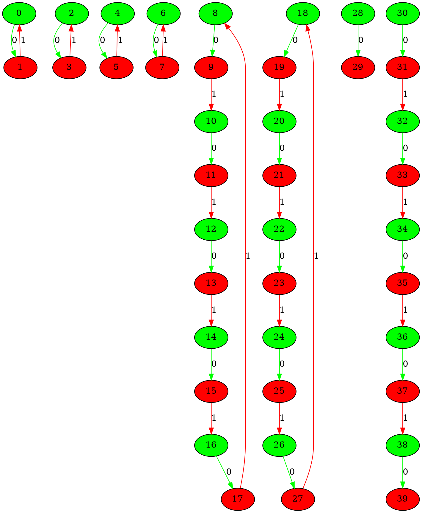
```graphviz
digraph G {
0[label="0" fillcolor="green" style="filled"];
1[label="1" fillcolor="red" style="filled"];
2[label="2" fillcolor="green" style="filled"];
3[label="3" fillcolor="red" style="filled"];
4[label="4" fillcolor="green" style="filled"];
5[label="5" fillcolor="red" style="filled"];
6[label="6" fillcolor="green" style="filled"];
7[label="7" fillcolor="red" style="filled"];
8[label="8" fillcolor="green" style="filled"];
9[label="9" fillcolor="red" style="filled"];
10[label="10" fillcolor="green" style="filled"];
11[label="11" fillcolor="red" style="filled"];
12[label="12" fillcolor="green" style="filled"];
13[label="13" fillcolor="red" style="filled"];
14[label="14" fillcolor="green" style="filled"];
15[label="15" fillcolor="red" style="filled"];
16[label="16" fillcolor="green" style="filled"];
17[label="17" fillcolor="red" style="filled"];
18[label="18" fillcolor="green" style="filled"];
19[label="19" fillcolor="red" style="filled"];
20[label="20" fillcolor="green" style="filled"];
21[label="21" fillcolor="red" style="filled"];
22[label="22" fillcolor="green" style="filled"];
23[label="23" fillcolor="red" style="filled"];
24[label="24" fillcolor="green" style="filled"];
25[label="25" fillcolor="red" style="filled"];
26[label="26" fillcolor="green" style="filled"];
27[label="27" fillcolor="red" style="filled"];
28[label="28" fillcolor="green" style="filled"];
29[label="29" fillcolor="red" style="filled"];
30[label="30" fillcolor="green" style="filled"];
31[label="31" fillcolor="red" style="filled"];
32[label="32" fillcolor="green" style="filled"];
33[label="33" fillcolor="red" style="filled"];
34[label="34" fillcolor="green" style="filled"];
35[label="35" fillcolor="red" style="filled"];
36[label="36" fillcolor="green" style="filled"];
37[label="37" fillcolor="red" style="filled"];
38[label="38" fillcolor="green" style="filled"];
39[label="39" fillcolor="red" style="filled"];
0->1 [label="0" color="green"];
1->0 [label="1" color="red"];
2->3 [label="0" color="green"];
3->2 [label="1" color="red"];
4->5 [label="0" color="green"];
5->4 [label="1" color="red"];
6->7 [label="0" color="green"];
7->6 [label="1" color="red"];
8->9 [label="0" color="green"];
9->10 [label="1" color="red"];
10->11 [label="0" color="green"];
11->12 [label="1" color="red"];
12->13 [label="0" color="green"];
13->14 [label="1" color="red"];
14->15 [label="0" color="green"];
15->16 [label="1" color="red"];
16->17 [label="0" color="green"];
17->8 [label="1" color="red"];
18->19 [label="0" color="green"];
19->20 [label="1" color="red"];
20->21 [label="0" color="green"];
21->22 [label="1" color="red"];
22->23 [label="0" color="green"];
23->24 [label="1" color="red"];
24->25 [label="0" color="green"];
25->26 [label="1" color="red"];
26->27 [label="0" color="green"];
27->18 [label="1" color="red"];
28->29 [label="0" color="green"];
30->31 [label="0" color="green"];
31->32 [label="1" color="red"];
32->33 [label="0" color="green"];
33->34 [label="1" color="red"];
34->35 [label="0" color="green"];
35->36 [label="1" color="red"];
36->37 [label="0" color="green"];
37->38 [label="1" color="red"];
38->39 [label="0" color="green"];
}
```
___
## Graph 10315 - list de compréhension : 1,1,1,1,5,5,5|1
___
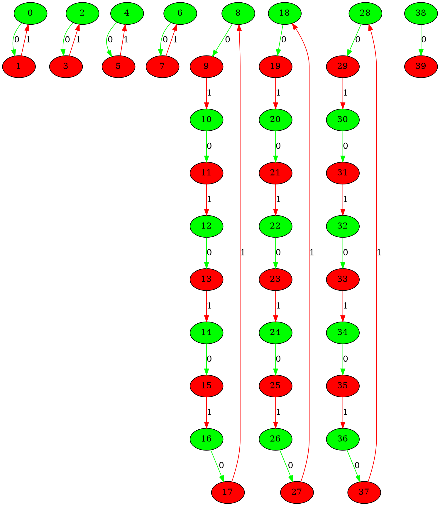
```graphviz
digraph G {
0[label="0" fillcolor="green" style="filled"];
1[label="1" fillcolor="red" style="filled"];
2[label="2" fillcolor="green" style="filled"];
3[label="3" fillcolor="red" style="filled"];
4[label="4" fillcolor="green" style="filled"];
5[label="5" fillcolor="red" style="filled"];
6[label="6" fillcolor="green" style="filled"];
7[label="7" fillcolor="red" style="filled"];
8[label="8" fillcolor="green" style="filled"];
9[label="9" fillcolor="red" style="filled"];
10[label="10" fillcolor="green" style="filled"];
11[label="11" fillcolor="red" style="filled"];
12[label="12" fillcolor="green" style="filled"];
13[label="13" fillcolor="red" style="filled"];
14[label="14" fillcolor="green" style="filled"];
15[label="15" fillcolor="red" style="filled"];
16[label="16" fillcolor="green" style="filled"];
17[label="17" fillcolor="red" style="filled"];
18[label="18" fillcolor="green" style="filled"];
19[label="19" fillcolor="red" style="filled"];
20[label="20" fillcolor="green" style="filled"];
21[label="21" fillcolor="red" style="filled"];
22[label="22" fillcolor="green" style="filled"];
23[label="23" fillcolor="red" style="filled"];
24[label="24" fillcolor="green" style="filled"];
25[label="25" fillcolor="red" style="filled"];
26[label="26" fillcolor="green" style="filled"];
27[label="27" fillcolor="red" style="filled"];
28[label="28" fillcolor="green" style="filled"];
29[label="29" fillcolor="red" style="filled"];
30[label="30" fillcolor="green" style="filled"];
31[label="31" fillcolor="red" style="filled"];
32[label="32" fillcolor="green" style="filled"];
33[label="33" fillcolor="red" style="filled"];
34[label="34" fillcolor="green" style="filled"];
35[label="35" fillcolor="red" style="filled"];
36[label="36" fillcolor="green" style="filled"];
37[label="37" fillcolor="red" style="filled"];
38[label="38" fillcolor="green" style="filled"];
39[label="39" fillcolor="red" style="filled"];
0->1 [label="0" color="green"];
1->0 [label="1" color="red"];
2->3 [label="0" color="green"];
3->2 [label="1" color="red"];
4->5 [label="0" color="green"];
5->4 [label="1" color="red"];
6->7 [label="0" color="green"];
7->6 [label="1" color="red"];
8->9 [label="0" color="green"];
9->10 [label="1" color="red"];
10->11 [label="0" color="green"];
11->12 [label="1" color="red"];
12->13 [label="0" color="green"];
13->14 [label="1" color="red"];
14->15 [label="0" color="green"];
15->16 [label="1" color="red"];
16->17 [label="0" color="green"];
17->8 [label="1" color="red"];
18->19 [label="0" color="green"];
19->20 [label="1" color="red"];
20->21 [label="0" color="green"];
21->22 [label="1" color="red"];
22->23 [label="0" color="green"];
23->24 [label="1" color="red"];
24->25 [label="0" color="green"];
25->26 [label="1" color="red"];
26->27 [label="0" color="green"];
27->18 [label="1" color="red"];
28->29 [label="0" color="green"];
29->30 [label="1" color="red"];
30->31 [label="0" color="green"];
31->32 [label="1" color="red"];
32->33 [label="0" color="green"];
33->34 [label="1" color="red"];
34->35 [label="0" color="green"];
35->36 [label="1" color="red"];
36->37 [label="0" color="green"];
37->28 [label="1" color="red"];
38->39 [label="0" color="green"];
}
```
___
## Graph 10316 - list de compréhension : 1,1,1,5|1,1,5,5
___
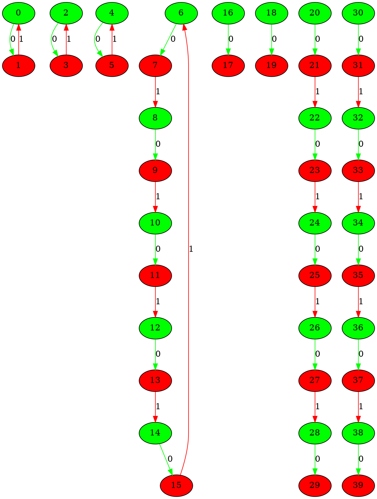
```graphviz
digraph G {
0[label="0" fillcolor="green" style="filled"];
1[label="1" fillcolor="red" style="filled"];
2[label="2" fillcolor="green" style="filled"];
3[label="3" fillcolor="red" style="filled"];
4[label="4" fillcolor="green" style="filled"];
5[label="5" fillcolor="red" style="filled"];
6[label="6" fillcolor="green" style="filled"];
7[label="7" fillcolor="red" style="filled"];
8[label="8" fillcolor="green" style="filled"];
9[label="9" fillcolor="red" style="filled"];
10[label="10" fillcolor="green" style="filled"];
11[label="11" fillcolor="red" style="filled"];
12[label="12" fillcolor="green" style="filled"];
13[label="13" fillcolor="red" style="filled"];
14[label="14" fillcolor="green" style="filled"];
15[label="15" fillcolor="red" style="filled"];
16[label="16" fillcolor="green" style="filled"];
17[label="17" fillcolor="red" style="filled"];
18[label="18" fillcolor="green" style="filled"];
19[label="19" fillcolor="red" style="filled"];
20[label="20" fillcolor="green" style="filled"];
21[label="21" fillcolor="red" style="filled"];
22[label="22" fillcolor="green" style="filled"];
23[label="23" fillcolor="red" style="filled"];
24[label="24" fillcolor="green" style="filled"];
25[label="25" fillcolor="red" style="filled"];
26[label="26" fillcolor="green" style="filled"];
27[label="27" fillcolor="red" style="filled"];
28[label="28" fillcolor="green" style="filled"];
29[label="29" fillcolor="red" style="filled"];
30[label="30" fillcolor="green" style="filled"];
31[label="31" fillcolor="red" style="filled"];
32[label="32" fillcolor="green" style="filled"];
33[label="33" fillcolor="red" style="filled"];
34[label="34" fillcolor="green" style="filled"];
35[label="35" fillcolor="red" style="filled"];
36[label="36" fillcolor="green" style="filled"];
37[label="37" fillcolor="red" style="filled"];
38[label="38" fillcolor="green" style="filled"];
39[label="39" fillcolor="red" style="filled"];
0->1 [label="0" color="green"];
1->0 [label="1" color="red"];
2->3 [label="0" color="green"];
3->2 [label="1" color="red"];
4->5 [label="0" color="green"];
5->4 [label="1" color="red"];
6->7 [label="0" color="green"];
7->8 [label="1" color="red"];
8->9 [label="0" color="green"];
9->10 [label="1" color="red"];
10->11 [label="0" color="green"];
11->12 [label="1" color="red"];
12->13 [label="0" color="green"];
13->14 [label="1" color="red"];
14->15 [label="0" color="green"];
15->6 [label="1" color="red"];
16->17 [label="0" color="green"];
18->19 [label="0" color="green"];
20->21 [label="0" color="green"];
21->22 [label="1" color="red"];
22->23 [label="0" color="green"];
23->24 [label="1" color="red"];
24->25 [label="0" color="green"];
25->26 [label="1" color="red"];
26->27 [label="0" color="green"];
27->28 [label="1" color="red"];
28->29 [label="0" color="green"];
30->31 [label="0" color="green"];
31->32 [label="1" color="red"];
32->33 [label="0" color="green"];
33->34 [label="1" color="red"];
34->35 [label="0" color="green"];
35->36 [label="1" color="red"];
36->37 [label="0" color="green"];
37->38 [label="1" color="red"];
38->39 [label="0" color="green"];
}
```
___
## Graph 10317 - list de compréhension : 1,1,1,5,5|1,1,5
___
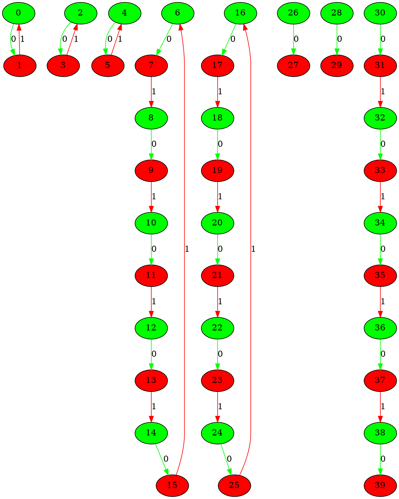
```graphviz
digraph G {
0[label="0" fillcolor="green" style="filled"];
1[label="1" fillcolor="red" style="filled"];
2[label="2" fillcolor="green" style="filled"];
3[label="3" fillcolor="red" style="filled"];
4[label="4" fillcolor="green" style="filled"];
5[label="5" fillcolor="red" style="filled"];
6[label="6" fillcolor="green" style="filled"];
7[label="7" fillcolor="red" style="filled"];
8[label="8" fillcolor="green" style="filled"];
9[label="9" fillcolor="red" style="filled"];
10[label="10" fillcolor="green" style="filled"];
11[label="11" fillcolor="red" style="filled"];
12[label="12" fillcolor="green" style="filled"];
13[label="13" fillcolor="red" style="filled"];
14[label="14" fillcolor="green" style="filled"];
15[label="15" fillcolor="red" style="filled"];
16[label="16" fillcolor="green" style="filled"];
17[label="17" fillcolor="red" style="filled"];
18[label="18" fillcolor="green" style="filled"];
19[label="19" fillcolor="red" style="filled"];
20[label="20" fillcolor="green" style="filled"];
21[label="21" fillcolor="red" style="filled"];
22[label="22" fillcolor="green" style="filled"];
23[label="23" fillcolor="red" style="filled"];
24[label="24" fillcolor="green" style="filled"];
25[label="25" fillcolor="red" style="filled"];
26[label="26" fillcolor="green" style="filled"];
27[label="27" fillcolor="red" style="filled"];
28[label="28" fillcolor="green" style="filled"];
29[label="29" fillcolor="red" style="filled"];
30[label="30" fillcolor="green" style="filled"];
31[label="31" fillcolor="red" style="filled"];
32[label="32" fillcolor="green" style="filled"];
33[label="33" fillcolor="red" style="filled"];
34[label="34" fillcolor="green" style="filled"];
35[label="35" fillcolor="red" style="filled"];
36[label="36" fillcolor="green" style="filled"];
37[label="37" fillcolor="red" style="filled"];
38[label="38" fillcolor="green" style="filled"];
39[label="39" fillcolor="red" style="filled"];
0->1 [label="0" color="green"];
1->0 [label="1" color="red"];
2->3 [label="0" color="green"];
3->2 [label="1" color="red"];
4->5 [label="0" color="green"];
5->4 [label="1" color="red"];
6->7 [label="0" color="green"];
7->8 [label="1" color="red"];
8->9 [label="0" color="green"];
9->10 [label="1" color="red"];
10->11 [label="0" color="green"];
11->12 [label="1" color="red"];
12->13 [label="0" color="green"];
13->14 [label="1" color="red"];
14->15 [label="0" color="green"];
15->6 [label="1" color="red"];
16->17 [label="0" color="green"];
17->18 [label="1" color="red"];
18->19 [label="0" color="green"];
19->20 [label="1" color="red"];
20->21 [label="0" color="green"];
21->22 [label="1" color="red"];
22->23 [label="0" color="green"];
23->24 [label="1" color="red"];
24->25 [label="0" color="green"];
25->16 [label="1" color="red"];
26->27 [label="0" color="green"];
28->29 [label="0" color="green"];
30->31 [label="0" color="green"];
31->32 [label="1" color="red"];
32->33 [label="0" color="green"];
33->34 [label="1" color="red"];
34->35 [label="0" color="green"];
35->36 [label="1" color="red"];
36->37 [label="0" color="green"];
37->38 [label="1" color="red"];
38->39 [label="0" color="green"];
}
```
___
## Graph 10318 - list de compréhension : 1,1,1,5,5,5|1,1
___
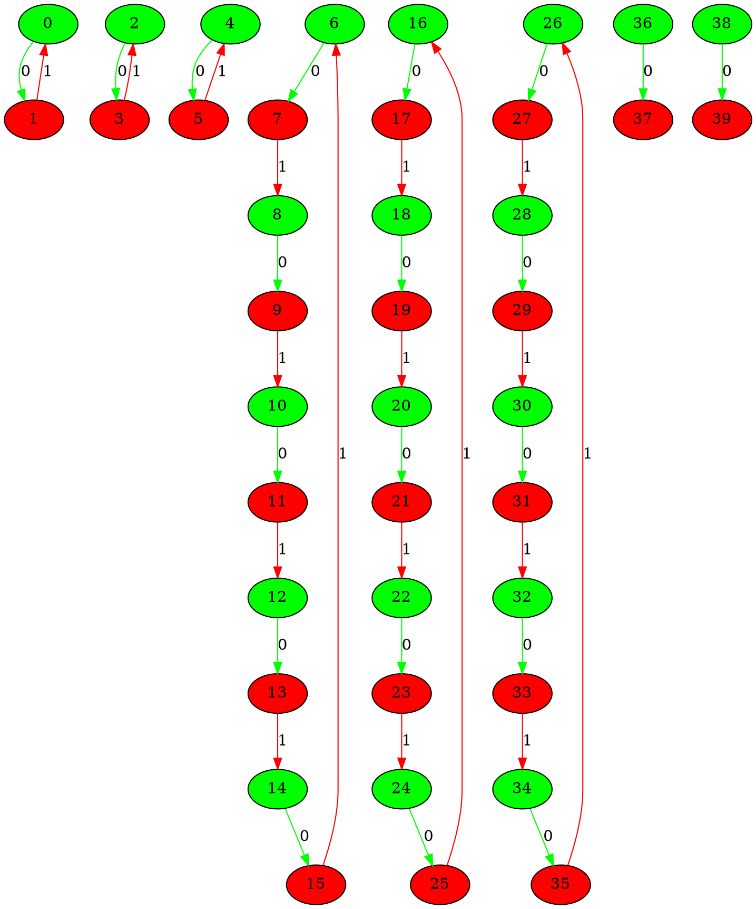
```graphviz
digraph G {
0[label="0" fillcolor="green" style="filled"];
1[label="1" fillcolor="red" style="filled"];
2[label="2" fillcolor="green" style="filled"];
3[label="3" fillcolor="red" style="filled"];
4[label="4" fillcolor="green" style="filled"];
5[label="5" fillcolor="red" style="filled"];
6[label="6" fillcolor="green" style="filled"];
7[label="7" fillcolor="red" style="filled"];
8[label="8" fillcolor="green" style="filled"];
9[label="9" fillcolor="red" style="filled"];
10[label="10" fillcolor="green" style="filled"];
11[label="11" fillcolor="red" style="filled"];
12[label="12" fillcolor="green" style="filled"];
13[label="13" fillcolor="red" style="filled"];
14[label="14" fillcolor="green" style="filled"];
15[label="15" fillcolor="red" style="filled"];
16[label="16" fillcolor="green" style="filled"];
17[label="17" fillcolor="red" style="filled"];
18[label="18" fillcolor="green" style="filled"];
19[label="19" fillcolor="red" style="filled"];
20[label="20" fillcolor="green" style="filled"];
21[label="21" fillcolor="red" style="filled"];
22[label="22" fillcolor="green" style="filled"];
23[label="23" fillcolor="red" style="filled"];
24[label="24" fillcolor="green" style="filled"];
25[label="25" fillcolor="red" style="filled"];
26[label="26" fillcolor="green" style="filled"];
27[label="27" fillcolor="red" style="filled"];
28[label="28" fillcolor="green" style="filled"];
29[label="29" fillcolor="red" style="filled"];
30[label="30" fillcolor="green" style="filled"];
31[label="31" fillcolor="red" style="filled"];
32[label="32" fillcolor="green" style="filled"];
33[label="33" fillcolor="red" style="filled"];
34[label="34" fillcolor="green" style="filled"];
35[label="35" fillcolor="red" style="filled"];
36[label="36" fillcolor="green" style="filled"];
37[label="37" fillcolor="red" style="filled"];
38[label="38" fillcolor="green" style="filled"];
39[label="39" fillcolor="red" style="filled"];
0->1 [label="0" color="green"];
1->0 [label="1" color="red"];
2->3 [label="0" color="green"];
3->2 [label="1" color="red"];
4->5 [label="0" color="green"];
5->4 [label="1" color="red"];
6->7 [label="0" color="green"];
7->8 [label="1" color="red"];
8->9 [label="0" color="green"];
9->10 [label="1" color="red"];
10->11 [label="0" color="green"];
11->12 [label="1" color="red"];
12->13 [label="0" color="green"];
13->14 [label="1" color="red"];
14->15 [label="0" color="green"];
15->6 [label="1" color="red"];
16->17 [label="0" color="green"];
17->18 [label="1" color="red"];
18->19 [label="0" color="green"];
19->20 [label="1" color="red"];
20->21 [label="0" color="green"];
21->22 [label="1" color="red"];
22->23 [label="0" color="green"];
23->24 [label="1" color="red"];
24->25 [label="0" color="green"];
25->16 [label="1" color="red"];
26->27 [label="0" color="green"];
27->28 [label="1" color="red"];
28->29 [label="0" color="green"];
29->30 [label="1" color="red"];
30->31 [label="0" color="green"];
31->32 [label="1" color="red"];
32->33 [label="0" color="green"];
33->34 [label="1" color="red"];
34->35 [label="0" color="green"];
35->26 [label="1" color="red"];
36->37 [label="0" color="green"];
38->39 [label="0" color="green"];
}
```
___
## Graph 10319 - list de compréhension : 1,1,5|1,1,1,5,5
___
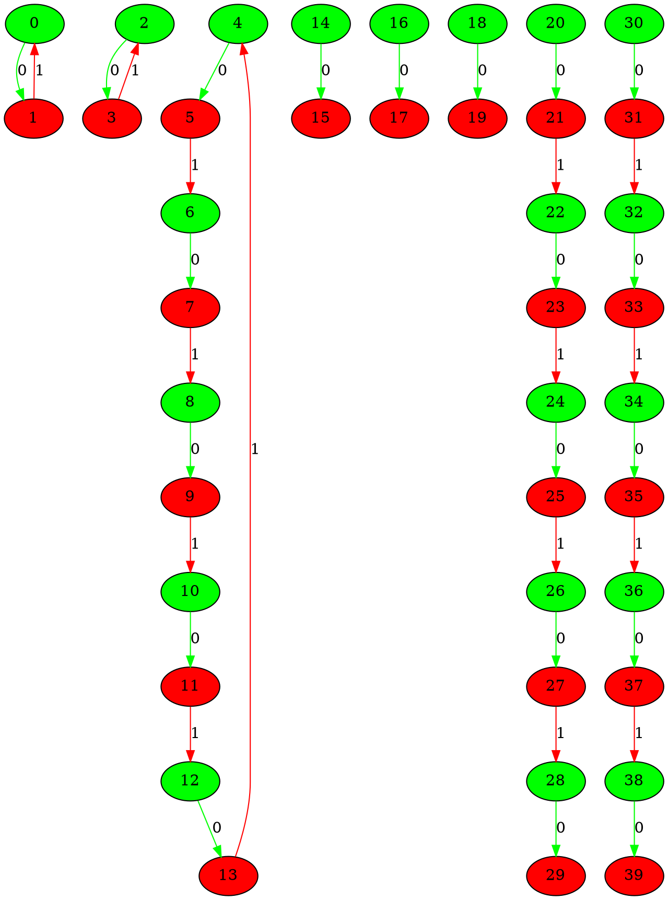
```graphviz
digraph G {
0[label="0" fillcolor="green" style="filled"];
1[label="1" fillcolor="red" style="filled"];
2[label="2" fillcolor="green" style="filled"];
3[label="3" fillcolor="red" style="filled"];
4[label="4" fillcolor="green" style="filled"];
5[label="5" fillcolor="red" style="filled"];
6[label="6" fillcolor="green" style="filled"];
7[label="7" fillcolor="red" style="filled"];
8[label="8" fillcolor="green" style="filled"];
9[label="9" fillcolor="red" style="filled"];
10[label="10" fillcolor="green" style="filled"];
11[label="11" fillcolor="red" style="filled"];
12[label="12" fillcolor="green" style="filled"];
13[label="13" fillcolor="red" style="filled"];
14[label="14" fillcolor="green" style="filled"];
15[label="15" fillcolor="red" style="filled"];
16[label="16" fillcolor="green" style="filled"];
17[label="17" fillcolor="red" style="filled"];
18[label="18" fillcolor="green" style="filled"];
19[label="19" fillcolor="red" style="filled"];
20[label="20" fillcolor="green" style="filled"];
21[label="21" fillcolor="red" style="filled"];
22[label="22" fillcolor="green" style="filled"];
23[label="23" fillcolor="red" style="filled"];
24[label="24" fillcolor="green" style="filled"];
25[label="25" fillcolor="red" style="filled"];
26[label="26" fillcolor="green" style="filled"];
27[label="27" fillcolor="red" style="filled"];
28[label="28" fillcolor="green" style="filled"];
29[label="29" fillcolor="red" style="filled"];
30[label="30" fillcolor="green" style="filled"];
31[label="31" fillcolor="red" style="filled"];
32[label="32" fillcolor="green" style="filled"];
33[label="33" fillcolor="red" style="filled"];
34[label="34" fillcolor="green" style="filled"];
35[label="35" fillcolor="red" style="filled"];
36[label="36" fillcolor="green" style="filled"];
37[label="37" fillcolor="red" style="filled"];
38[label="38" fillcolor="green" style="filled"];
39[label="39" fillcolor="red" style="filled"];
0->1 [label="0" color="green"];
1->0 [label="1" color="red"];
2->3 [label="0" color="green"];
3->2 [label="1" color="red"];
4->5 [label="0" color="green"];
5->6 [label="1" color="red"];
6->7 [label="0" color="green"];
7->8 [label="1" color="red"];
8->9 [label="0" color="green"];
9->10 [label="1" color="red"];
10->11 [label="0" color="green"];
11->12 [label="1" color="red"];
12->13 [label="0" color="green"];
13->4 [label="1" color="red"];
14->15 [label="0" color="green"];
16->17 [label="0" color="green"];
18->19 [label="0" color="green"];
20->21 [label="0" color="green"];
21->22 [label="1" color="red"];
22->23 [label="0" color="green"];
23->24 [label="1" color="red"];
24->25 [label="0" color="green"];
25->26 [label="1" color="red"];
26->27 [label="0" color="green"];
27->28 [label="1" color="red"];
28->29 [label="0" color="green"];
30->31 [label="0" color="green"];
31->32 [label="1" color="red"];
32->33 [label="0" color="green"];
33->34 [label="1" color="red"];
34->35 [label="0" color="green"];
35->36 [label="1" color="red"];
36->37 [label="0" color="green"];
37->38 [label="1" color="red"];
38->39 [label="0" color="green"];
}
```
___
## Graph 10320 - list de compréhension : 1,1,5,5|1,1,1,5
___
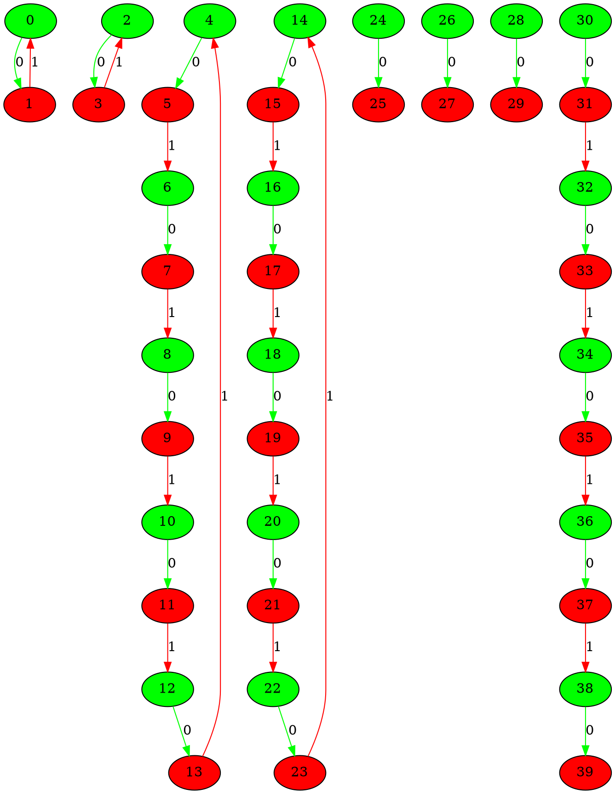
```graphviz
digraph G {
0[label="0" fillcolor="green" style="filled"];
1[label="1" fillcolor="red" style="filled"];
2[label="2" fillcolor="green" style="filled"];
3[label="3" fillcolor="red" style="filled"];
4[label="4" fillcolor="green" style="filled"];
5[label="5" fillcolor="red" style="filled"];
6[label="6" fillcolor="green" style="filled"];
7[label="7" fillcolor="red" style="filled"];
8[label="8" fillcolor="green" style="filled"];
9[label="9" fillcolor="red" style="filled"];
10[label="10" fillcolor="green" style="filled"];
11[label="11" fillcolor="red" style="filled"];
12[label="12" fillcolor="green" style="filled"];
13[label="13" fillcolor="red" style="filled"];
14[label="14" fillcolor="green" style="filled"];
15[label="15" fillcolor="red" style="filled"];
16[label="16" fillcolor="green" style="filled"];
17[label="17" fillcolor="red" style="filled"];
18[label="18" fillcolor="green" style="filled"];
19[label="19" fillcolor="red" style="filled"];
20[label="20" fillcolor="green" style="filled"];
21[label="21" fillcolor="red" style="filled"];
22[label="22" fillcolor="green" style="filled"];
23[label="23" fillcolor="red" style="filled"];
24[label="24" fillcolor="green" style="filled"];
25[label="25" fillcolor="red" style="filled"];
26[label="26" fillcolor="green" style="filled"];
27[label="27" fillcolor="red" style="filled"];
28[label="28" fillcolor="green" style="filled"];
29[label="29" fillcolor="red" style="filled"];
30[label="30" fillcolor="green" style="filled"];
31[label="31" fillcolor="red" style="filled"];
32[label="32" fillcolor="green" style="filled"];
33[label="33" fillcolor="red" style="filled"];
34[label="34" fillcolor="green" style="filled"];
35[label="35" fillcolor="red" style="filled"];
36[label="36" fillcolor="green" style="filled"];
37[label="37" fillcolor="red" style="filled"];
38[label="38" fillcolor="green" style="filled"];
39[label="39" fillcolor="red" style="filled"];
0->1 [label="0" color="green"];
1->0 [label="1" color="red"];
2->3 [label="0" color="green"];
3->2 [label="1" color="red"];
4->5 [label="0" color="green"];
5->6 [label="1" color="red"];
6->7 [label="0" color="green"];
7->8 [label="1" color="red"];
8->9 [label="0" color="green"];
9->10 [label="1" color="red"];
10->11 [label="0" color="green"];
11->12 [label="1" color="red"];
12->13 [label="0" color="green"];
13->4 [label="1" color="red"];
14->15 [label="0" color="green"];
15->16 [label="1" color="red"];
16->17 [label="0" color="green"];
17->18 [label="1" color="red"];
18->19 [label="0" color="green"];
19->20 [label="1" color="red"];
20->21 [label="0" color="green"];
21->22 [label="1" color="red"];
22->23 [label="0" color="green"];
23->14 [label="1" color="red"];
24->25 [label="0" color="green"];
26->27 [label="0" color="green"];
28->29 [label="0" color="green"];
30->31 [label="0" color="green"];
31->32 [label="1" color="red"];
32->33 [label="0" color="green"];
33->34 [label="1" color="red"];
34->35 [label="0" color="green"];
35->36 [label="1" color="red"];
36->37 [label="0" color="green"];
37->38 [label="1" color="red"];
38->39 [label="0" color="green"];
}
```
___
## Graph 10321 - list de compréhension : 1,1,5,5,5|1,1,1
___
```graphviz
digraph G {
0[label="0" fillcolor="green" style="filled"];
1[label="1" fillcolor="red" style="filled"];
2[label="2" fillcolor="green" style="filled"];
3[label="3" fillcolor="red" style="filled"];
4[label="4" fillcolor="green" style="filled"];
5[label="5" fillcolor="red" style="filled"];
6[label="6" fillcolor="green" style="filled"];
7[label="7" fillcolor="red" style="filled"];
8[label="8" fillcolor="green" style="filled"];
9[label="9" fillcolor="red" style="filled"];
10[label="10" fillcolor="green" style="filled"];
11[label="11" fillcolor="red" style="filled"];
12[label="12" fillcolor="green" style="filled"];
13[label="13" fillcolor="red" style="filled"];
14[label="14" fillcolor="green" style="filled"];
15[label="15" fillcolor="red" style="filled"];
16[label="16" fillcolor="green" style="filled"];
17[label="17" fillcolor="red" style="filled"];
18[label="18" fillcolor="green" style="filled"];
19[label="19" fillcolor="red" style="filled"];
20[label="20" fillcolor="green" style="filled"];
21[label="21" fillcolor="red" style="filled"];
22[label="22" fillcolor="green" style="filled"];
23[label="23" fillcolor="red" style="filled"];
24[label="24" fillcolor="green" style="filled"];
25[label="25" fillcolor="red" style="filled"];
26[label="26" fillcolor="green" style="filled"];
27[label="27" fillcolor="red" style="filled"];
28[label="28" fillcolor="green" style="filled"];
29[label="29" fillcolor="red" style="filled"];
30[label="30" fillcolor="green" style="filled"];
31[label="31" fillcolor="red" style="filled"];
32[label="32" fillcolor="green" style="filled"];
33[label="33" fillcolor="red" style="filled"];
34[label="34" fillcolor="green" style="filled"];
35[label="35" fillcolor="red" style="filled"];
36[label="36" fillcolor="green" style="filled"];
37[label="37" fillcolor="red" style="filled"];
38[label="38" fillcolor="green" style="filled"];
39[label="39" fillcolor="red" style="filled"];
0->1 [label="0" color="green"];
1->0 [label="1" color="red"];
2->3 [label="0" color="green"];
3->2 [label="1" color="red"];
4->5 [label="0" color="green"];
5->6 [label="1" color="red"];
6->7 [label="0" color="green"];
7->8 [label="1" color="red"];
8->9 [label="0" color="green"];
9->10 [label="1" color="red"];
10->11 [label="0" color="green"];
11->12 [label="1" color="red"];
12->13 [label="0" color="green"];
13->4 [label="1" color="red"];
14->15 [label="0" color="green"];
15->16 [label="1" color="red"];
16->17 [label="0" color="green"];
17->18 [label="1" color="red"];
18->19 [label="0" color="green"];
19->20 [label="1" color="red"];
20->21 [label="0" color="green"];
21->22 [label="1" color="red"];
22->23 [label="0" color="green"];
23->14 [label="1" color="red"];
24->25 [label="0" color="green"];
25->26 [label="1" color="red"];
26->27 [label="0" color="green"];
27->28 [label="1" color="red"];
28->29 [label="0" color="green"];
29->30 [label="1" color="red"];
30->31 [label="0" color="green"];
31->32 [label="1" color="red"];
32->33 [label="0" color="green"];
33->24 [label="1" color="red"];
34->35 [label="0" color="green"];
36->37 [label="0" color="green"];
38->39 [label="0" color="green"];
}
```
___
## Graph 10322 - list de compréhension : 1,5|1,1,1,1,5,5
___
```graphviz
digraph G {
0[label="0" fillcolor="green" style="filled"];
1[label="1" fillcolor="red" style="filled"];
2[label="2" fillcolor="green" style="filled"];
3[label="3" fillcolor="red" style="filled"];
4[label="4" fillcolor="green" style="filled"];
5[label="5" fillcolor="red" style="filled"];
6[label="6" fillcolor="green" style="filled"];
7[label="7" fillcolor="red" style="filled"];
8[label="8" fillcolor="green" style="filled"];
9[label="9" fillcolor="red" style="filled"];
10[label="10" fillcolor="green" style="filled"];
11[label="11" fillcolor="red" style="filled"];
12[label="12" fillcolor="green" style="filled"];
13[label="13" fillcolor="red" style="filled"];
14[label="14" fillcolor="green" style="filled"];
15[label="15" fillcolor="red" style="filled"];
16[label="16" fillcolor="green" style="filled"];
17[label="17" fillcolor="red" style="filled"];
18[label="18" fillcolor="green" style="filled"];
19[label="19" fillcolor="red" style="filled"];
20[label="20" fillcolor="green" style="filled"];
21[label="21" fillcolor="red" style="filled"];
22[label="22" fillcolor="green" style="filled"];
23[label="23" fillcolor="red" style="filled"];
24[label="24" fillcolor="green" style="filled"];
25[label="25" fillcolor="red" style="filled"];
26[label="26" fillcolor="green" style="filled"];
27[label="27" fillcolor="red" style="filled"];
28[label="28" fillcolor="green" style="filled"];
29[label="29" fillcolor="red" style="filled"];
30[label="30" fillcolor="green" style="filled"];
31[label="31" fillcolor="red" style="filled"];
32[label="32" fillcolor="green" style="filled"];
33[label="33" fillcolor="red" style="filled"];
34[label="34" fillcolor="green" style="filled"];
35[label="35" fillcolor="red" style="filled"];
36[label="36" fillcolor="green" style="filled"];
37[label="37" fillcolor="red" style="filled"];
38[label="38" fillcolor="green" style="filled"];
39[label="39" fillcolor="red" style="filled"];
0->1 [label="0" color="green"];
1->0 [label="1" color="red"];
2->3 [label="0" color="green"];
3->4 [label="1" color="red"];
4->5 [label="0" color="green"];
5->6 [label="1" color="red"];
6->7 [label="0" color="green"];
7->8 [label="1" color="red"];
8->9 [label="0" color="green"];
9->10 [label="1" color="red"];
10->11 [label="0" color="green"];
11->2 [label="1" color="red"];
12->13 [label="0" color="green"];
14->15 [label="0" color="green"];
16->17 [label="0" color="green"];
18->19 [label="0" color="green"];
20->21 [label="0" color="green"];
21->22 [label="1" color="red"];
22->23 [label="0" color="green"];
23->24 [label="1" color="red"];
24->25 [label="0" color="green"];
25->26 [label="1" color="red"];
26->27 [label="0" color="green"];
27->28 [label="1" color="red"];
28->29 [label="0" color="green"];
30->31 [label="0" color="green"];
31->32 [label="1" color="red"];
32->33 [label="0" color="green"];
33->34 [label="1" color="red"];
34->35 [label="0" color="green"];
35->36 [label="1" color="red"];
36->37 [label="0" color="green"];
37->38 [label="1" color="red"];
38->39 [label="0" color="green"];
}
```
___
## Graph 10323 - list de compréhension : 1,5,5|1,1,1,1,5
___
```graphviz
digraph G {
0[label="0" fillcolor="green" style="filled"];
1[label="1" fillcolor="red" style="filled"];
2[label="2" fillcolor="green" style="filled"];
3[label="3" fillcolor="red" style="filled"];
4[label="4" fillcolor="green" style="filled"];
5[label="5" fillcolor="red" style="filled"];
6[label="6" fillcolor="green" style="filled"];
7[label="7" fillcolor="red" style="filled"];
8[label="8" fillcolor="green" style="filled"];
9[label="9" fillcolor="red" style="filled"];
10[label="10" fillcolor="green" style="filled"];
11[label="11" fillcolor="red" style="filled"];
12[label="12" fillcolor="green" style="filled"];
13[label="13" fillcolor="red" style="filled"];
14[label="14" fillcolor="green" style="filled"];
15[label="15" fillcolor="red" style="filled"];
16[label="16" fillcolor="green" style="filled"];
17[label="17" fillcolor="red" style="filled"];
18[label="18" fillcolor="green" style="filled"];
19[label="19" fillcolor="red" style="filled"];
20[label="20" fillcolor="green" style="filled"];
21[label="21" fillcolor="red" style="filled"];
22[label="22" fillcolor="green" style="filled"];
23[label="23" fillcolor="red" style="filled"];
24[label="24" fillcolor="green" style="filled"];
25[label="25" fillcolor="red" style="filled"];
26[label="26" fillcolor="green" style="filled"];
27[label="27" fillcolor="red" style="filled"];
28[label="28" fillcolor="green" style="filled"];
29[label="29" fillcolor="red" style="filled"];
30[label="30" fillcolor="green" style="filled"];
31[label="31" fillcolor="red" style="filled"];
32[label="32" fillcolor="green" style="filled"];
33[label="33" fillcolor="red" style="filled"];
34[label="34" fillcolor="green" style="filled"];
35[label="35" fillcolor="red" style="filled"];
36[label="36" fillcolor="green" style="filled"];
37[label="37" fillcolor="red" style="filled"];
38[label="38" fillcolor="green" style="filled"];
39[label="39" fillcolor="red" style="filled"];
0->1 [label="0" color="green"];
1->0 [label="1" color="red"];
2->3 [label="0" color="green"];
3->4 [label="1" color="red"];
4->5 [label="0" color="green"];
5->6 [label="1" color="red"];
6->7 [label="0" color="green"];
7->8 [label="1" color="red"];
8->9 [label="0" color="green"];
9->10 [label="1" color="red"];
10->11 [label="0" color="green"];
11->2 [label="1" color="red"];
12->13 [label="0" color="green"];
13->14 [label="1" color="red"];
14->15 [label="0" color="green"];
15->16 [label="1" color="red"];
16->17 [label="0" color="green"];
17->18 [label="1" color="red"];
18->19 [label="0" color="green"];
19->20 [label="1" color="red"];
20->21 [label="0" color="green"];
21->12 [label="1" color="red"];
22->23 [label="0" color="green"];
24->25 [label="0" color="green"];
26->27 [label="0" color="green"];
28->29 [label="0" color="green"];
30->31 [label="0" color="green"];
31->32 [label="1" color="red"];
32->33 [label="0" color="green"];
33->34 [label="1" color="red"];
34->35 [label="0" color="green"];
35->36 [label="1" color="red"];
36->37 [label="0" color="green"];
37->38 [label="1" color="red"];
38->39 [label="0" color="green"];
}
```
___
## Graph 10324 - list de compréhension : 1,5,5,5|1,1,1,1
___
```graphviz
digraph G {
0[label="0" fillcolor="green" style="filled"];
1[label="1" fillcolor="red" style="filled"];
2[label="2" fillcolor="green" style="filled"];
3[label="3" fillcolor="red" style="filled"];
4[label="4" fillcolor="green" style="filled"];
5[label="5" fillcolor="red" style="filled"];
6[label="6" fillcolor="green" style="filled"];
7[label="7" fillcolor="red" style="filled"];
8[label="8" fillcolor="green" style="filled"];
9[label="9" fillcolor="red" style="filled"];
10[label="10" fillcolor="green" style="filled"];
11[label="11" fillcolor="red" style="filled"];
12[label="12" fillcolor="green" style="filled"];
13[label="13" fillcolor="red" style="filled"];
14[label="14" fillcolor="green" style="filled"];
15[label="15" fillcolor="red" style="filled"];
16[label="16" fillcolor="green" style="filled"];
17[label="17" fillcolor="red" style="filled"];
18[label="18" fillcolor="green" style="filled"];
19[label="19" fillcolor="red" style="filled"];
20[label="20" fillcolor="green" style="filled"];
21[label="21" fillcolor="red" style="filled"];
22[label="22" fillcolor="green" style="filled"];
23[label="23" fillcolor="red" style="filled"];
24[label="24" fillcolor="green" style="filled"];
25[label="25" fillcolor="red" style="filled"];
26[label="26" fillcolor="green" style="filled"];
27[label="27" fillcolor="red" style="filled"];
28[label="28" fillcolor="green" style="filled"];
29[label="29" fillcolor="red" style="filled"];
30[label="30" fillcolor="green" style="filled"];
31[label="31" fillcolor="red" style="filled"];
32[label="32" fillcolor="green" style="filled"];
33[label="33" fillcolor="red" style="filled"];
34[label="34" fillcolor="green" style="filled"];
35[label="35" fillcolor="red" style="filled"];
36[label="36" fillcolor="green" style="filled"];
37[label="37" fillcolor="red" style="filled"];
38[label="38" fillcolor="green" style="filled"];
39[label="39" fillcolor="red" style="filled"];
0->1 [label="0" color="green"];
1->0 [label="1" color="red"];
2->3 [label="0" color="green"];
3->4 [label="1" color="red"];
4->5 [label="0" color="green"];
5->6 [label="1" color="red"];
6->7 [label="0" color="green"];
7->8 [label="1" color="red"];
8->9 [label="0" color="green"];
9->10 [label="1" color="red"];
10->11 [label="0" color="green"];
11->2 [label="1" color="red"];
12->13 [label="0" color="green"];
13->14 [label="1" color="red"];
14->15 [label="0" color="green"];
15->16 [label="1" color="red"];
16->17 [label="0" color="green"];
17->18 [label="1" color="red"];
18->19 [label="0" color="green"];
19->20 [label="1" color="red"];
20->21 [label="0" color="green"];
21->12 [label="1" color="red"];
22->23 [label="0" color="green"];
23->24 [label="1" color="red"];
24->25 [label="0" color="green"];
25->26 [label="1" color="red"];
26->27 [label="0" color="green"];
27->28 [label="1" color="red"];
28->29 [label="0" color="green"];
29->30 [label="1" color="red"];
30->31 [label="0" color="green"];
31->22 [label="1" color="red"];
32->33 [label="0" color="green"];
34->35 [label="0" color="green"];
36->37 [label="0" color="green"];
38->39 [label="0" color="green"];
}
```
___
## Graph 10325 - list de compréhension : 5|1,1,1,1,1,5,5
___
```graphviz
digraph G {
0[label="0" fillcolor="green" style="filled"];
1[label="1" fillcolor="red" style="filled"];
2[label="2" fillcolor="green" style="filled"];
3[label="3" fillcolor="red" style="filled"];
4[label="4" fillcolor="green" style="filled"];
5[label="5" fillcolor="red" style="filled"];
6[label="6" fillcolor="green" style="filled"];
7[label="7" fillcolor="red" style="filled"];
8[label="8" fillcolor="green" style="filled"];
9[label="9" fillcolor="red" style="filled"];
10[label="10" fillcolor="green" style="filled"];
11[label="11" fillcolor="red" style="filled"];
12[label="12" fillcolor="green" style="filled"];
13[label="13" fillcolor="red" style="filled"];
14[label="14" fillcolor="green" style="filled"];
15[label="15" fillcolor="red" style="filled"];
16[label="16" fillcolor="green" style="filled"];
17[label="17" fillcolor="red" style="filled"];
18[label="18" fillcolor="green" style="filled"];
19[label="19" fillcolor="red" style="filled"];
20[label="20" fillcolor="green" style="filled"];
21[label="21" fillcolor="red" style="filled"];
22[label="22" fillcolor="green" style="filled"];
23[label="23" fillcolor="red" style="filled"];
24[label="24" fillcolor="green" style="filled"];
25[label="25" fillcolor="red" style="filled"];
26[label="26" fillcolor="green" style="filled"];
27[label="27" fillcolor="red" style="filled"];
28[label="28" fillcolor="green" style="filled"];
29[label="29" fillcolor="red" style="filled"];
30[label="30" fillcolor="green" style="filled"];
31[label="31" fillcolor="red" style="filled"];
32[label="32" fillcolor="green" style="filled"];
33[label="33" fillcolor="red" style="filled"];
34[label="34" fillcolor="green" style="filled"];
35[label="35" fillcolor="red" style="filled"];
36[label="36" fillcolor="green" style="filled"];
37[label="37" fillcolor="red" style="filled"];
38[label="38" fillcolor="green" style="filled"];
39[label="39" fillcolor="red" style="filled"];
0->1 [label="0" color="green"];
1->2 [label="1" color="red"];
2->3 [label="0" color="green"];
3->4 [label="1" color="red"];
4->5 [label="0" color="green"];
5->6 [label="1" color="red"];
6->7 [label="0" color="green"];
7->8 [label="1" color="red"];
8->9 [label="0" color="green"];
9->0 [label="1" color="red"];
10->11 [label="0" color="green"];
12->13 [label="0" color="green"];
14->15 [label="0" color="green"];
16->17 [label="0" color="green"];
18->19 [label="0" color="green"];
20->21 [label="0" color="green"];
21->22 [label="1" color="red"];
22->23 [label="0" color="green"];
23->24 [label="1" color="red"];
24->25 [label="0" color="green"];
25->26 [label="1" color="red"];
26->27 [label="0" color="green"];
27->28 [label="1" color="red"];
28->29 [label="0" color="green"];
30->31 [label="0" color="green"];
31->32 [label="1" color="red"];
32->33 [label="0" color="green"];
33->34 [label="1" color="red"];
34->35 [label="0" color="green"];
35->36 [label="1" color="red"];
36->37 [label="0" color="green"];
37->38 [label="1" color="red"];
38->39 [label="0" color="green"];
}
```
___
## Graph 10326 - list de compréhension : 5,5|1,1,1,1,1,5
___
```graphviz
digraph G {
0[label="0" fillcolor="green" style="filled"];
1[label="1" fillcolor="red" style="filled"];
2[label="2" fillcolor="green" style="filled"];
3[label="3" fillcolor="red" style="filled"];
4[label="4" fillcolor="green" style="filled"];
5[label="5" fillcolor="red" style="filled"];
6[label="6" fillcolor="green" style="filled"];
7[label="7" fillcolor="red" style="filled"];
8[label="8" fillcolor="green" style="filled"];
9[label="9" fillcolor="red" style="filled"];
10[label="10" fillcolor="green" style="filled"];
11[label="11" fillcolor="red" style="filled"];
12[label="12" fillcolor="green" style="filled"];
13[label="13" fillcolor="red" style="filled"];
14[label="14" fillcolor="green" style="filled"];
15[label="15" fillcolor="red" style="filled"];
16[label="16" fillcolor="green" style="filled"];
17[label="17" fillcolor="red" style="filled"];
18[label="18" fillcolor="green" style="filled"];
19[label="19" fillcolor="red" style="filled"];
20[label="20" fillcolor="green" style="filled"];
21[label="21" fillcolor="red" style="filled"];
22[label="22" fillcolor="green" style="filled"];
23[label="23" fillcolor="red" style="filled"];
24[label="24" fillcolor="green" style="filled"];
25[label="25" fillcolor="red" style="filled"];
26[label="26" fillcolor="green" style="filled"];
27[label="27" fillcolor="red" style="filled"];
28[label="28" fillcolor="green" style="filled"];
29[label="29" fillcolor="red" style="filled"];
30[label="30" fillcolor="green" style="filled"];
31[label="31" fillcolor="red" style="filled"];
32[label="32" fillcolor="green" style="filled"];
33[label="33" fillcolor="red" style="filled"];
34[label="34" fillcolor="green" style="filled"];
35[label="35" fillcolor="red" style="filled"];
36[label="36" fillcolor="green" style="filled"];
37[label="37" fillcolor="red" style="filled"];
38[label="38" fillcolor="green" style="filled"];
39[label="39" fillcolor="red" style="filled"];
0->1 [label="0" color="green"];
1->2 [label="1" color="red"];
2->3 [label="0" color="green"];
3->4 [label="1" color="red"];
4->5 [label="0" color="green"];
5->6 [label="1" color="red"];
6->7 [label="0" color="green"];
7->8 [label="1" color="red"];
8->9 [label="0" color="green"];
9->0 [label="1" color="red"];
10->11 [label="0" color="green"];
11->12 [label="1" color="red"];
12->13 [label="0" color="green"];
13->14 [label="1" color="red"];
14->15 [label="0" color="green"];
15->16 [label="1" color="red"];
16->17 [label="0" color="green"];
17->18 [label="1" color="red"];
18->19 [label="0" color="green"];
19->10 [label="1" color="red"];
20->21 [label="0" color="green"];
22->23 [label="0" color="green"];
24->25 [label="0" color="green"];
26->27 [label="0" color="green"];
28->29 [label="0" color="green"];
30->31 [label="0" color="green"];
31->32 [label="1" color="red"];
32->33 [label="0" color="green"];
33->34 [label="1" color="red"];
34->35 [label="0" color="green"];
35->36 [label="1" color="red"];
36->37 [label="0" color="green"];
37->38 [label="1" color="red"];
38->39 [label="0" color="green"];
}
```
___
## Graph 10327 - list de compréhension : 5,5,5|1,1,1,1,1
___
```graphviz
digraph G {
0[label="0" fillcolor="green" style="filled"];
1[label="1" fillcolor="red" style="filled"];
2[label="2" fillcolor="green" style="filled"];
3[label="3" fillcolor="red" style="filled"];
4[label="4" fillcolor="green" style="filled"];
5[label="5" fillcolor="red" style="filled"];
6[label="6" fillcolor="green" style="filled"];
7[label="7" fillcolor="red" style="filled"];
8[label="8" fillcolor="green" style="filled"];
9[label="9" fillcolor="red" style="filled"];
10[label="10" fillcolor="green" style="filled"];
11[label="11" fillcolor="red" style="filled"];
12[label="12" fillcolor="green" style="filled"];
13[label="13" fillcolor="red" style="filled"];
14[label="14" fillcolor="green" style="filled"];
15[label="15" fillcolor="red" style="filled"];
16[label="16" fillcolor="green" style="filled"];
17[label="17" fillcolor="red" style="filled"];
18[label="18" fillcolor="green" style="filled"];
19[label="19" fillcolor="red" style="filled"];
20[label="20" fillcolor="green" style="filled"];
21[label="21" fillcolor="red" style="filled"];
22[label="22" fillcolor="green" style="filled"];
23[label="23" fillcolor="red" style="filled"];
24[label="24" fillcolor="green" style="filled"];
25[label="25" fillcolor="red" style="filled"];
26[label="26" fillcolor="green" style="filled"];
27[label="27" fillcolor="red" style="filled"];
28[label="28" fillcolor="green" style="filled"];
29[label="29" fillcolor="red" style="filled"];
30[label="30" fillcolor="green" style="filled"];
31[label="31" fillcolor="red" style="filled"];
32[label="32" fillcolor="green" style="filled"];
33[label="33" fillcolor="red" style="filled"];
34[label="34" fillcolor="green" style="filled"];
35[label="35" fillcolor="red" style="filled"];
36[label="36" fillcolor="green" style="filled"];
37[label="37" fillcolor="red" style="filled"];
38[label="38" fillcolor="green" style="filled"];
39[label="39" fillcolor="red" style="filled"];
0->1 [label="0" color="green"];
1->2 [label="1" color="red"];
2->3 [label="0" color="green"];
3->4 [label="1" color="red"];
4->5 [label="0" color="green"];
5->6 [label="1" color="red"];
6->7 [label="0" color="green"];
7->8 [label="1" color="red"];
8->9 [label="0" color="green"];
9->0 [label="1" color="red"];
10->11 [label="0" color="green"];
11->12 [label="1" color="red"];
12->13 [label="0" color="green"];
13->14 [label="1" color="red"];
14->15 [label="0" color="green"];
15->16 [label="1" color="red"];
16->17 [label="0" color="green"];
17->18 [label="1" color="red"];
18->19 [label="0" color="green"];
19->10 [label="1" color="red"];
20->21 [label="0" color="green"];
21->22 [label="1" color="red"];
22->23 [label="0" color="green"];
23->24 [label="1" color="red"];
24->25 [label="0" color="green"];
25->26 [label="1" color="red"];
26->27 [label="0" color="green"];
27->28 [label="1" color="red"];
28->29 [label="0" color="green"];
29->20 [label="1" color="red"];
30->31 [label="0" color="green"];
32->33 [label="0" color="green"];
34->35 [label="0" color="green"];
36->37 [label="0" color="green"];
38->39 [label="0" color="green"];
}
```
___
## Graph 10328 - list de compréhension : 0|1,1,1,1,1,5,10
___
```graphviz
digraph G {
0[label="0" fillcolor="green" style="filled"];
1[label="1" fillcolor="red" style="filled"];
2[label="2" fillcolor="green" style="filled"];
3[label="3" fillcolor="red" style="filled"];
4[label="4" fillcolor="green" style="filled"];
5[label="5" fillcolor="red" style="filled"];
6[label="6" fillcolor="green" style="filled"];
7[label="7" fillcolor="red" style="filled"];
8[label="8" fillcolor="green" style="filled"];
9[label="9" fillcolor="red" style="filled"];
10[label="10" fillcolor="green" style="filled"];
11[label="11" fillcolor="red" style="filled"];
12[label="12" fillcolor="green" style="filled"];
13[label="13" fillcolor="red" style="filled"];
14[label="14" fillcolor="green" style="filled"];
15[label="15" fillcolor="red" style="filled"];
16[label="16" fillcolor="green" style="filled"];
17[label="17" fillcolor="red" style="filled"];
18[label="18" fillcolor="green" style="filled"];
19[label="19" fillcolor="red" style="filled"];
20[label="20" fillcolor="green" style="filled"];
21[label="21" fillcolor="red" style="filled"];
22[label="22" fillcolor="green" style="filled"];
23[label="23" fillcolor="red" style="filled"];
24[label="24" fillcolor="green" style="filled"];
25[label="25" fillcolor="red" style="filled"];
26[label="26" fillcolor="green" style="filled"];
27[label="27" fillcolor="red" style="filled"];
28[label="28" fillcolor="green" style="filled"];
29[label="29" fillcolor="red" style="filled"];
30[label="30" fillcolor="green" style="filled"];
31[label="31" fillcolor="red" style="filled"];
32[label="32" fillcolor="green" style="filled"];
33[label="33" fillcolor="red" style="filled"];
34[label="34" fillcolor="green" style="filled"];
35[label="35" fillcolor="red" style="filled"];
36[label="36" fillcolor="green" style="filled"];
37[label="37" fillcolor="red" style="filled"];
38[label="38" fillcolor="green" style="filled"];
39[label="39" fillcolor="red" style="filled"];
0->1 [label="0" color="green"];
2->3 [label="0" color="green"];
4->5 [label="0" color="green"];
6->7 [label="0" color="green"];
8->9 [label="0" color="green"];
10->11 [label="0" color="green"];
11->12 [label="1" color="red"];
12->13 [label="0" color="green"];
13->14 [label="1" color="red"];
14->15 [label="0" color="green"];
15->16 [label="1" color="red"];
16->17 [label="0" color="green"];
17->18 [label="1" color="red"];
18->19 [label="0" color="green"];
20->21 [label="0" color="green"];
21->22 [label="1" color="red"];
22->23 [label="0" color="green"];
23->24 [label="1" color="red"];
24->25 [label="0" color="green"];
25->26 [label="1" color="red"];
26->27 [label="0" color="green"];
27->28 [label="1" color="red"];
28->29 [label="0" color="green"];
29->30 [label="1" color="red"];
30->31 [label="0" color="green"];
31->32 [label="1" color="red"];
32->33 [label="0" color="green"];
33->34 [label="1" color="red"];
34->35 [label="0" color="green"];
35->36 [label="1" color="red"];
36->37 [label="0" color="green"];
37->38 [label="1" color="red"];
38->39 [label="0" color="green"];
}
```
___
## Graph 10329 - list de compréhension : 1|1,1,1,1,5,10
___
```graphviz
digraph G {
0[label="0" fillcolor="green" style="filled"];
1[label="1" fillcolor="red" style="filled"];
2[label="2" fillcolor="green" style="filled"];
3[label="3" fillcolor="red" style="filled"];
4[label="4" fillcolor="green" style="filled"];
5[label="5" fillcolor="red" style="filled"];
6[label="6" fillcolor="green" style="filled"];
7[label="7" fillcolor="red" style="filled"];
8[label="8" fillcolor="green" style="filled"];
9[label="9" fillcolor="red" style="filled"];
10[label="10" fillcolor="green" style="filled"];
11[label="11" fillcolor="red" style="filled"];
12[label="12" fillcolor="green" style="filled"];
13[label="13" fillcolor="red" style="filled"];
14[label="14" fillcolor="green" style="filled"];
15[label="15" fillcolor="red" style="filled"];
16[label="16" fillcolor="green" style="filled"];
17[label="17" fillcolor="red" style="filled"];
18[label="18" fillcolor="green" style="filled"];
19[label="19" fillcolor="red" style="filled"];
20[label="20" fillcolor="green" style="filled"];
21[label="21" fillcolor="red" style="filled"];
22[label="22" fillcolor="green" style="filled"];
23[label="23" fillcolor="red" style="filled"];
24[label="24" fillcolor="green" style="filled"];
25[label="25" fillcolor="red" style="filled"];
26[label="26" fillcolor="green" style="filled"];
27[label="27" fillcolor="red" style="filled"];
28[label="28" fillcolor="green" style="filled"];
29[label="29" fillcolor="red" style="filled"];
30[label="30" fillcolor="green" style="filled"];
31[label="31" fillcolor="red" style="filled"];
32[label="32" fillcolor="green" style="filled"];
33[label="33" fillcolor="red" style="filled"];
34[label="34" fillcolor="green" style="filled"];
35[label="35" fillcolor="red" style="filled"];
36[label="36" fillcolor="green" style="filled"];
37[label="37" fillcolor="red" style="filled"];
38[label="38" fillcolor="green" style="filled"];
39[label="39" fillcolor="red" style="filled"];
0->1 [label="0" color="green"];
1->0 [label="1" color="red"];
2->3 [label="0" color="green"];
4->5 [label="0" color="green"];
6->7 [label="0" color="green"];
8->9 [label="0" color="green"];
10->11 [label="0" color="green"];
11->12 [label="1" color="red"];
12->13 [label="0" color="green"];
13->14 [label="1" color="red"];
14->15 [label="0" color="green"];
15->16 [label="1" color="red"];
16->17 [label="0" color="green"];
17->18 [label="1" color="red"];
18->19 [label="0" color="green"];
20->21 [label="0" color="green"];
21->22 [label="1" color="red"];
22->23 [label="0" color="green"];
23->24 [label="1" color="red"];
24->25 [label="0" color="green"];
25->26 [label="1" color="red"];
26->27 [label="0" color="green"];
27->28 [label="1" color="red"];
28->29 [label="0" color="green"];
29->30 [label="1" color="red"];
30->31 [label="0" color="green"];
31->32 [label="1" color="red"];
32->33 [label="0" color="green"];
33->34 [label="1" color="red"];
34->35 [label="0" color="green"];
35->36 [label="1" color="red"];
36->37 [label="0" color="green"];
37->38 [label="1" color="red"];
38->39 [label="0" color="green"];
}
```
___
## Graph 10330 - list de compréhension : 1,1|1,1,1,5,10
___
```graphviz
digraph G {
0[label="0" fillcolor="green" style="filled"];
1[label="1" fillcolor="red" style="filled"];
2[label="2" fillcolor="green" style="filled"];
3[label="3" fillcolor="red" style="filled"];
4[label="4" fillcolor="green" style="filled"];
5[label="5" fillcolor="red" style="filled"];
6[label="6" fillcolor="green" style="filled"];
7[label="7" fillcolor="red" style="filled"];
8[label="8" fillcolor="green" style="filled"];
9[label="9" fillcolor="red" style="filled"];
10[label="10" fillcolor="green" style="filled"];
11[label="11" fillcolor="red" style="filled"];
12[label="12" fillcolor="green" style="filled"];
13[label="13" fillcolor="red" style="filled"];
14[label="14" fillcolor="green" style="filled"];
15[label="15" fillcolor="red" style="filled"];
16[label="16" fillcolor="green" style="filled"];
17[label="17" fillcolor="red" style="filled"];
18[label="18" fillcolor="green" style="filled"];
19[label="19" fillcolor="red" style="filled"];
20[label="20" fillcolor="green" style="filled"];
21[label="21" fillcolor="red" style="filled"];
22[label="22" fillcolor="green" style="filled"];
23[label="23" fillcolor="red" style="filled"];
24[label="24" fillcolor="green" style="filled"];
25[label="25" fillcolor="red" style="filled"];
26[label="26" fillcolor="green" style="filled"];
27[label="27" fillcolor="red" style="filled"];
28[label="28" fillcolor="green" style="filled"];
29[label="29" fillcolor="red" style="filled"];
30[label="30" fillcolor="green" style="filled"];
31[label="31" fillcolor="red" style="filled"];
32[label="32" fillcolor="green" style="filled"];
33[label="33" fillcolor="red" style="filled"];
34[label="34" fillcolor="green" style="filled"];
35[label="35" fillcolor="red" style="filled"];
36[label="36" fillcolor="green" style="filled"];
37[label="37" fillcolor="red" style="filled"];
38[label="38" fillcolor="green" style="filled"];
39[label="39" fillcolor="red" style="filled"];
0->1 [label="0" color="green"];
1->0 [label="1" color="red"];
2->3 [label="0" color="green"];
3->2 [label="1" color="red"];
4->5 [label="0" color="green"];
6->7 [label="0" color="green"];
8->9 [label="0" color="green"];
10->11 [label="0" color="green"];
11->12 [label="1" color="red"];
12->13 [label="0" color="green"];
13->14 [label="1" color="red"];
14->15 [label="0" color="green"];
15->16 [label="1" color="red"];
16->17 [label="0" color="green"];
17->18 [label="1" color="red"];
18->19 [label="0" color="green"];
20->21 [label="0" color="green"];
21->22 [label="1" color="red"];
22->23 [label="0" color="green"];
23->24 [label="1" color="red"];
24->25 [label="0" color="green"];
25->26 [label="1" color="red"];
26->27 [label="0" color="green"];
27->28 [label="1" color="red"];
28->29 [label="0" color="green"];
29->30 [label="1" color="red"];
30->31 [label="0" color="green"];
31->32 [label="1" color="red"];
32->33 [label="0" color="green"];
33->34 [label="1" color="red"];
34->35 [label="0" color="green"];
35->36 [label="1" color="red"];
36->37 [label="0" color="green"];
37->38 [label="1" color="red"];
38->39 [label="0" color="green"];
}
```
___
## Graph 10331 - list de compréhension : 1,1,1|1,1,5,10
___
```graphviz
digraph G {
0[label="0" fillcolor="green" style="filled"];
1[label="1" fillcolor="red" style="filled"];
2[label="2" fillcolor="green" style="filled"];
3[label="3" fillcolor="red" style="filled"];
4[label="4" fillcolor="green" style="filled"];
5[label="5" fillcolor="red" style="filled"];
6[label="6" fillcolor="green" style="filled"];
7[label="7" fillcolor="red" style="filled"];
8[label="8" fillcolor="green" style="filled"];
9[label="9" fillcolor="red" style="filled"];
10[label="10" fillcolor="green" style="filled"];
11[label="11" fillcolor="red" style="filled"];
12[label="12" fillcolor="green" style="filled"];
13[label="13" fillcolor="red" style="filled"];
14[label="14" fillcolor="green" style="filled"];
15[label="15" fillcolor="red" style="filled"];
16[label="16" fillcolor="green" style="filled"];
17[label="17" fillcolor="red" style="filled"];
18[label="18" fillcolor="green" style="filled"];
19[label="19" fillcolor="red" style="filled"];
20[label="20" fillcolor="green" style="filled"];
21[label="21" fillcolor="red" style="filled"];
22[label="22" fillcolor="green" style="filled"];
23[label="23" fillcolor="red" style="filled"];
24[label="24" fillcolor="green" style="filled"];
25[label="25" fillcolor="red" style="filled"];
26[label="26" fillcolor="green" style="filled"];
27[label="27" fillcolor="red" style="filled"];
28[label="28" fillcolor="green" style="filled"];
29[label="29" fillcolor="red" style="filled"];
30[label="30" fillcolor="green" style="filled"];
31[label="31" fillcolor="red" style="filled"];
32[label="32" fillcolor="green" style="filled"];
33[label="33" fillcolor="red" style="filled"];
34[label="34" fillcolor="green" style="filled"];
35[label="35" fillcolor="red" style="filled"];
36[label="36" fillcolor="green" style="filled"];
37[label="37" fillcolor="red" style="filled"];
38[label="38" fillcolor="green" style="filled"];
39[label="39" fillcolor="red" style="filled"];
0->1 [label="0" color="green"];
1->0 [label="1" color="red"];
2->3 [label="0" color="green"];
3->2 [label="1" color="red"];
4->5 [label="0" color="green"];
5->4 [label="1" color="red"];
6->7 [label="0" color="green"];
8->9 [label="0" color="green"];
10->11 [label="0" color="green"];
11->12 [label="1" color="red"];
12->13 [label="0" color="green"];
13->14 [label="1" color="red"];
14->15 [label="0" color="green"];
15->16 [label="1" color="red"];
16->17 [label="0" color="green"];
17->18 [label="1" color="red"];
18->19 [label="0" color="green"];
20->21 [label="0" color="green"];
21->22 [label="1" color="red"];
22->23 [label="0" color="green"];
23->24 [label="1" color="red"];
24->25 [label="0" color="green"];
25->26 [label="1" color="red"];
26->27 [label="0" color="green"];
27->28 [label="1" color="red"];
28->29 [label="0" color="green"];
29->30 [label="1" color="red"];
30->31 [label="0" color="green"];
31->32 [label="1" color="red"];
32->33 [label="0" color="green"];
33->34 [label="1" color="red"];
34->35 [label="0" color="green"];
35->36 [label="1" color="red"];
36->37 [label="0" color="green"];
37->38 [label="1" color="red"];
38->39 [label="0" color="green"];
}
```
___
## Graph 10332 - list de compréhension : 1,1,1,1|1,5,10
___
```graphviz
digraph G {
0[label="0" fillcolor="green" style="filled"];
1[label="1" fillcolor="red" style="filled"];
2[label="2" fillcolor="green" style="filled"];
3[label="3" fillcolor="red" style="filled"];
4[label="4" fillcolor="green" style="filled"];
5[label="5" fillcolor="red" style="filled"];
6[label="6" fillcolor="green" style="filled"];
7[label="7" fillcolor="red" style="filled"];
8[label="8" fillcolor="green" style="filled"];
9[label="9" fillcolor="red" style="filled"];
10[label="10" fillcolor="green" style="filled"];
11[label="11" fillcolor="red" style="filled"];
12[label="12" fillcolor="green" style="filled"];
13[label="13" fillcolor="red" style="filled"];
14[label="14" fillcolor="green" style="filled"];
15[label="15" fillcolor="red" style="filled"];
16[label="16" fillcolor="green" style="filled"];
17[label="17" fillcolor="red" style="filled"];
18[label="18" fillcolor="green" style="filled"];
19[label="19" fillcolor="red" style="filled"];
20[label="20" fillcolor="green" style="filled"];
21[label="21" fillcolor="red" style="filled"];
22[label="22" fillcolor="green" style="filled"];
23[label="23" fillcolor="red" style="filled"];
24[label="24" fillcolor="green" style="filled"];
25[label="25" fillcolor="red" style="filled"];
26[label="26" fillcolor="green" style="filled"];
27[label="27" fillcolor="red" style="filled"];
28[label="28" fillcolor="green" style="filled"];
29[label="29" fillcolor="red" style="filled"];
30[label="30" fillcolor="green" style="filled"];
31[label="31" fillcolor="red" style="filled"];
32[label="32" fillcolor="green" style="filled"];
33[label="33" fillcolor="red" style="filled"];
34[label="34" fillcolor="green" style="filled"];
35[label="35" fillcolor="red" style="filled"];
36[label="36" fillcolor="green" style="filled"];
37[label="37" fillcolor="red" style="filled"];
38[label="38" fillcolor="green" style="filled"];
39[label="39" fillcolor="red" style="filled"];
0->1 [label="0" color="green"];
1->0 [label="1" color="red"];
2->3 [label="0" color="green"];
3->2 [label="1" color="red"];
4->5 [label="0" color="green"];
5->4 [label="1" color="red"];
6->7 [label="0" color="green"];
7->6 [label="1" color="red"];
8->9 [label="0" color="green"];
10->11 [label="0" color="green"];
11->12 [label="1" color="red"];
12->13 [label="0" color="green"];
13->14 [label="1" color="red"];
14->15 [label="0" color="green"];
15->16 [label="1" color="red"];
16->17 [label="0" color="green"];
17->18 [label="1" color="red"];
18->19 [label="0" color="green"];
20->21 [label="0" color="green"];
21->22 [label="1" color="red"];
22->23 [label="0" color="green"];
23->24 [label="1" color="red"];
24->25 [label="0" color="green"];
25->26 [label="1" color="red"];
26->27 [label="0" color="green"];
27->28 [label="1" color="red"];
28->29 [label="0" color="green"];
29->30 [label="1" color="red"];
30->31 [label="0" color="green"];
31->32 [label="1" color="red"];
32->33 [label="0" color="green"];
33->34 [label="1" color="red"];
34->35 [label="0" color="green"];
35->36 [label="1" color="red"];
36->37 [label="0" color="green"];
37->38 [label="1" color="red"];
38->39 [label="0" color="green"];
}
```
___
## Graph 10333 - list de compréhension : 1,1,1,1,1|5,10
___
```graphviz
digraph G {
0[label="0" fillcolor="green" style="filled"];
1[label="1" fillcolor="red" style="filled"];
2[label="2" fillcolor="green" style="filled"];
3[label="3" fillcolor="red" style="filled"];
4[label="4" fillcolor="green" style="filled"];
5[label="5" fillcolor="red" style="filled"];
6[label="6" fillcolor="green" style="filled"];
7[label="7" fillcolor="red" style="filled"];
8[label="8" fillcolor="green" style="filled"];
9[label="9" fillcolor="red" style="filled"];
10[label="10" fillcolor="green" style="filled"];
11[label="11" fillcolor="red" style="filled"];
12[label="12" fillcolor="green" style="filled"];
13[label="13" fillcolor="red" style="filled"];
14[label="14" fillcolor="green" style="filled"];
15[label="15" fillcolor="red" style="filled"];
16[label="16" fillcolor="green" style="filled"];
17[label="17" fillcolor="red" style="filled"];
18[label="18" fillcolor="green" style="filled"];
19[label="19" fillcolor="red" style="filled"];
20[label="20" fillcolor="green" style="filled"];
21[label="21" fillcolor="red" style="filled"];
22[label="22" fillcolor="green" style="filled"];
23[label="23" fillcolor="red" style="filled"];
24[label="24" fillcolor="green" style="filled"];
25[label="25" fillcolor="red" style="filled"];
26[label="26" fillcolor="green" style="filled"];
27[label="27" fillcolor="red" style="filled"];
28[label="28" fillcolor="green" style="filled"];
29[label="29" fillcolor="red" style="filled"];
30[label="30" fillcolor="green" style="filled"];
31[label="31" fillcolor="red" style="filled"];
32[label="32" fillcolor="green" style="filled"];
33[label="33" fillcolor="red" style="filled"];
34[label="34" fillcolor="green" style="filled"];
35[label="35" fillcolor="red" style="filled"];
36[label="36" fillcolor="green" style="filled"];
37[label="37" fillcolor="red" style="filled"];
38[label="38" fillcolor="green" style="filled"];
39[label="39" fillcolor="red" style="filled"];
0->1 [label="0" color="green"];
1->0 [label="1" color="red"];
2->3 [label="0" color="green"];
3->2 [label="1" color="red"];
4->5 [label="0" color="green"];
5->4 [label="1" color="red"];
6->7 [label="0" color="green"];
7->6 [label="1" color="red"];
8->9 [label="0" color="green"];
9->8 [label="1" color="red"];
10->11 [label="0" color="green"];
11->12 [label="1" color="red"];
12->13 [label="0" color="green"];
13->14 [label="1" color="red"];
14->15 [label="0" color="green"];
15->16 [label="1" color="red"];
16->17 [label="0" color="green"];
17->18 [label="1" color="red"];
18->19 [label="0" color="green"];
20->21 [label="0" color="green"];
21->22 [label="1" color="red"];
22->23 [label="0" color="green"];
23->24 [label="1" color="red"];
24->25 [label="0" color="green"];
25->26 [label="1" color="red"];
26->27 [label="0" color="green"];
27->28 [label="1" color="red"];
28->29 [label="0" color="green"];
29->30 [label="1" color="red"];
30->31 [label="0" color="green"];
31->32 [label="1" color="red"];
32->33 [label="0" color="green"];
33->34 [label="1" color="red"];
34->35 [label="0" color="green"];
35->36 [label="1" color="red"];
36->37 [label="0" color="green"];
37->38 [label="1" color="red"];
38->39 [label="0" color="green"];
}
```
___
## Graph 10334 - list de compréhension : 1,1,1,1,1,5|10
___
```graphviz
digraph G {
0[label="0" fillcolor="green" style="filled"];
1[label="1" fillcolor="red" style="filled"];
2[label="2" fillcolor="green" style="filled"];
3[label="3" fillcolor="red" style="filled"];
4[label="4" fillcolor="green" style="filled"];
5[label="5" fillcolor="red" style="filled"];
6[label="6" fillcolor="green" style="filled"];
7[label="7" fillcolor="red" style="filled"];
8[label="8" fillcolor="green" style="filled"];
9[label="9" fillcolor="red" style="filled"];
10[label="10" fillcolor="green" style="filled"];
11[label="11" fillcolor="red" style="filled"];
12[label="12" fillcolor="green" style="filled"];
13[label="13" fillcolor="red" style="filled"];
14[label="14" fillcolor="green" style="filled"];
15[label="15" fillcolor="red" style="filled"];
16[label="16" fillcolor="green" style="filled"];
17[label="17" fillcolor="red" style="filled"];
18[label="18" fillcolor="green" style="filled"];
19[label="19" fillcolor="red" style="filled"];
20[label="20" fillcolor="green" style="filled"];
21[label="21" fillcolor="red" style="filled"];
22[label="22" fillcolor="green" style="filled"];
23[label="23" fillcolor="red" style="filled"];
24[label="24" fillcolor="green" style="filled"];
25[label="25" fillcolor="red" style="filled"];
26[label="26" fillcolor="green" style="filled"];
27[label="27" fillcolor="red" style="filled"];
28[label="28" fillcolor="green" style="filled"];
29[label="29" fillcolor="red" style="filled"];
30[label="30" fillcolor="green" style="filled"];
31[label="31" fillcolor="red" style="filled"];
32[label="32" fillcolor="green" style="filled"];
33[label="33" fillcolor="red" style="filled"];
34[label="34" fillcolor="green" style="filled"];
35[label="35" fillcolor="red" style="filled"];
36[label="36" fillcolor="green" style="filled"];
37[label="37" fillcolor="red" style="filled"];
38[label="38" fillcolor="green" style="filled"];
39[label="39" fillcolor="red" style="filled"];
0->1 [label="0" color="green"];
1->0 [label="1" color="red"];
2->3 [label="0" color="green"];
3->2 [label="1" color="red"];
4->5 [label="0" color="green"];
5->4 [label="1" color="red"];
6->7 [label="0" color="green"];
7->6 [label="1" color="red"];
8->9 [label="0" color="green"];
9->8 [label="1" color="red"];
10->11 [label="0" color="green"];
11->12 [label="1" color="red"];
12->13 [label="0" color="green"];
13->14 [label="1" color="red"];
14->15 [label="0" color="green"];
15->16 [label="1" color="red"];
16->17 [label="0" color="green"];
17->18 [label="1" color="red"];
18->19 [label="0" color="green"];
19->10 [label="1" color="red"];
20->21 [label="0" color="green"];
21->22 [label="1" color="red"];
22->23 [label="0" color="green"];
23->24 [label="1" color="red"];
24->25 [label="0" color="green"];
25->26 [label="1" color="red"];
26->27 [label="0" color="green"];
27->28 [label="1" color="red"];
28->29 [label="0" color="green"];
29->30 [label="1" color="red"];
30->31 [label="0" color="green"];
31->32 [label="1" color="red"];
32->33 [label="0" color="green"];
33->34 [label="1" color="red"];
34->35 [label="0" color="green"];
35->36 [label="1" color="red"];
36->37 [label="0" color="green"];
37->38 [label="1" color="red"];
38->39 [label="0" color="green"];
}
```
___
## Graph 10335 - list de compréhension : 1,1,1,1,1,5,10|0
___
```graphviz
digraph G {
0[label="0" fillcolor="green" style="filled"];
1[label="1" fillcolor="red" style="filled"];
2[label="2" fillcolor="green" style="filled"];
3[label="3" fillcolor="red" style="filled"];
4[label="4" fillcolor="green" style="filled"];
5[label="5" fillcolor="red" style="filled"];
6[label="6" fillcolor="green" style="filled"];
7[label="7" fillcolor="red" style="filled"];
8[label="8" fillcolor="green" style="filled"];
9[label="9" fillcolor="red" style="filled"];
10[label="10" fillcolor="green" style="filled"];
11[label="11" fillcolor="red" style="filled"];
12[label="12" fillcolor="green" style="filled"];
13[label="13" fillcolor="red" style="filled"];
14[label="14" fillcolor="green" style="filled"];
15[label="15" fillcolor="red" style="filled"];
16[label="16" fillcolor="green" style="filled"];
17[label="17" fillcolor="red" style="filled"];
18[label="18" fillcolor="green" style="filled"];
19[label="19" fillcolor="red" style="filled"];
20[label="20" fillcolor="green" style="filled"];
21[label="21" fillcolor="red" style="filled"];
22[label="22" fillcolor="green" style="filled"];
23[label="23" fillcolor="red" style="filled"];
24[label="24" fillcolor="green" style="filled"];
25[label="25" fillcolor="red" style="filled"];
26[label="26" fillcolor="green" style="filled"];
27[label="27" fillcolor="red" style="filled"];
28[label="28" fillcolor="green" style="filled"];
29[label="29" fillcolor="red" style="filled"];
30[label="30" fillcolor="green" style="filled"];
31[label="31" fillcolor="red" style="filled"];
32[label="32" fillcolor="green" style="filled"];
33[label="33" fillcolor="red" style="filled"];
34[label="34" fillcolor="green" style="filled"];
35[label="35" fillcolor="red" style="filled"];
36[label="36" fillcolor="green" style="filled"];
37[label="37" fillcolor="red" style="filled"];
38[label="38" fillcolor="green" style="filled"];
39[label="39" fillcolor="red" style="filled"];
0->1 [label="0" color="green"];
1->0 [label="1" color="red"];
2->3 [label="0" color="green"];
3->2 [label="1" color="red"];
4->5 [label="0" color="green"];
5->4 [label="1" color="red"];
6->7 [label="0" color="green"];
7->6 [label="1" color="red"];
8->9 [label="0" color="green"];
9->8 [label="1" color="red"];
10->11 [label="0" color="green"];
11->12 [label="1" color="red"];
12->13 [label="0" color="green"];
13->14 [label="1" color="red"];
14->15 [label="0" color="green"];
15->16 [label="1" color="red"];
16->17 [label="0" color="green"];
17->18 [label="1" color="red"];
18->19 [label="0" color="green"];
19->10 [label="1" color="red"];
20->21 [label="0" color="green"];
21->22 [label="1" color="red"];
22->23 [label="0" color="green"];
23->24 [label="1" color="red"];
24->25 [label="0" color="green"];
25->26 [label="1" color="red"];
26->27 [label="0" color="green"];
27->28 [label="1" color="red"];
28->29 [label="0" color="green"];
29->30 [label="1" color="red"];
30->31 [label="0" color="green"];
31->32 [label="1" color="red"];
32->33 [label="0" color="green"];
33->34 [label="1" color="red"];
34->35 [label="0" color="green"];
35->36 [label="1" color="red"];
36->37 [label="0" color="green"];
37->38 [label="1" color="red"];
38->39 [label="0" color="green"];
39->20 [label="1" color="red"];
}
```
___
## Graph 10336 - list de compréhension : 1,1,1,1,1,10|5
___
```graphviz
digraph G {
0[label="0" fillcolor="green" style="filled"];
1[label="1" fillcolor="red" style="filled"];
2[label="2" fillcolor="green" style="filled"];
3[label="3" fillcolor="red" style="filled"];
4[label="4" fillcolor="green" style="filled"];
5[label="5" fillcolor="red" style="filled"];
6[label="6" fillcolor="green" style="filled"];
7[label="7" fillcolor="red" style="filled"];
8[label="8" fillcolor="green" style="filled"];
9[label="9" fillcolor="red" style="filled"];
10[label="10" fillcolor="green" style="filled"];
11[label="11" fillcolor="red" style="filled"];
12[label="12" fillcolor="green" style="filled"];
13[label="13" fillcolor="red" style="filled"];
14[label="14" fillcolor="green" style="filled"];
15[label="15" fillcolor="red" style="filled"];
16[label="16" fillcolor="green" style="filled"];
17[label="17" fillcolor="red" style="filled"];
18[label="18" fillcolor="green" style="filled"];
19[label="19" fillcolor="red" style="filled"];
20[label="20" fillcolor="green" style="filled"];
21[label="21" fillcolor="red" style="filled"];
22[label="22" fillcolor="green" style="filled"];
23[label="23" fillcolor="red" style="filled"];
24[label="24" fillcolor="green" style="filled"];
25[label="25" fillcolor="red" style="filled"];
26[label="26" fillcolor="green" style="filled"];
27[label="27" fillcolor="red" style="filled"];
28[label="28" fillcolor="green" style="filled"];
29[label="29" fillcolor="red" style="filled"];
30[label="30" fillcolor="green" style="filled"];
31[label="31" fillcolor="red" style="filled"];
32[label="32" fillcolor="green" style="filled"];
33[label="33" fillcolor="red" style="filled"];
34[label="34" fillcolor="green" style="filled"];
35[label="35" fillcolor="red" style="filled"];
36[label="36" fillcolor="green" style="filled"];
37[label="37" fillcolor="red" style="filled"];
38[label="38" fillcolor="green" style="filled"];
39[label="39" fillcolor="red" style="filled"];
0->1 [label="0" color="green"];
1->0 [label="1" color="red"];
2->3 [label="0" color="green"];
3->2 [label="1" color="red"];
4->5 [label="0" color="green"];
5->4 [label="1" color="red"];
6->7 [label="0" color="green"];
7->6 [label="1" color="red"];
8->9 [label="0" color="green"];
9->8 [label="1" color="red"];
10->11 [label="0" color="green"];
11->12 [label="1" color="red"];
12->13 [label="0" color="green"];
13->14 [label="1" color="red"];
14->15 [label="0" color="green"];
15->16 [label="1" color="red"];
16->17 [label="0" color="green"];
17->18 [label="1" color="red"];
18->19 [label="0" color="green"];
19->20 [label="1" color="red"];
20->21 [label="0" color="green"];
21->22 [label="1" color="red"];
22->23 [label="0" color="green"];
23->24 [label="1" color="red"];
24->25 [label="0" color="green"];
25->26 [label="1" color="red"];
26->27 [label="0" color="green"];
27->28 [label="1" color="red"];
28->29 [label="0" color="green"];
29->10 [label="1" color="red"];
30->31 [label="0" color="green"];
31->32 [label="1" color="red"];
32->33 [label="0" color="green"];
33->34 [label="1" color="red"];
34->35 [label="0" color="green"];
35->36 [label="1" color="red"];
36->37 [label="0" color="green"];
37->38 [label="1" color="red"];
38->39 [label="0" color="green"];
}
```
___
## Graph 10337 - list de compréhension : 1,1,1,1,5|1,10
___
```graphviz
digraph G {
0[label="0" fillcolor="green" style="filled"];
1[label="1" fillcolor="red" style="filled"];
2[label="2" fillcolor="green" style="filled"];
3[label="3" fillcolor="red" style="filled"];
4[label="4" fillcolor="green" style="filled"];
5[label="5" fillcolor="red" style="filled"];
6[label="6" fillcolor="green" style="filled"];
7[label="7" fillcolor="red" style="filled"];
8[label="8" fillcolor="green" style="filled"];
9[label="9" fillcolor="red" style="filled"];
10[label="10" fillcolor="green" style="filled"];
11[label="11" fillcolor="red" style="filled"];
12[label="12" fillcolor="green" style="filled"];
13[label="13" fillcolor="red" style="filled"];
14[label="14" fillcolor="green" style="filled"];
15[label="15" fillcolor="red" style="filled"];
16[label="16" fillcolor="green" style="filled"];
17[label="17" fillcolor="red" style="filled"];
18[label="18" fillcolor="green" style="filled"];
19[label="19" fillcolor="red" style="filled"];
20[label="20" fillcolor="green" style="filled"];
21[label="21" fillcolor="red" style="filled"];
22[label="22" fillcolor="green" style="filled"];
23[label="23" fillcolor="red" style="filled"];
24[label="24" fillcolor="green" style="filled"];
25[label="25" fillcolor="red" style="filled"];
26[label="26" fillcolor="green" style="filled"];
27[label="27" fillcolor="red" style="filled"];
28[label="28" fillcolor="green" style="filled"];
29[label="29" fillcolor="red" style="filled"];
30[label="30" fillcolor="green" style="filled"];
31[label="31" fillcolor="red" style="filled"];
32[label="32" fillcolor="green" style="filled"];
33[label="33" fillcolor="red" style="filled"];
34[label="34" fillcolor="green" style="filled"];
35[label="35" fillcolor="red" style="filled"];
36[label="36" fillcolor="green" style="filled"];
37[label="37" fillcolor="red" style="filled"];
38[label="38" fillcolor="green" style="filled"];
39[label="39" fillcolor="red" style="filled"];
0->1 [label="0" color="green"];
1->0 [label="1" color="red"];
2->3 [label="0" color="green"];
3->2 [label="1" color="red"];
4->5 [label="0" color="green"];
5->4 [label="1" color="red"];
6->7 [label="0" color="green"];
7->6 [label="1" color="red"];
8->9 [label="0" color="green"];
9->10 [label="1" color="red"];
10->11 [label="0" color="green"];
11->12 [label="1" color="red"];
12->13 [label="0" color="green"];
13->14 [label="1" color="red"];
14->15 [label="0" color="green"];
15->16 [label="1" color="red"];
16->17 [label="0" color="green"];
17->8 [label="1" color="red"];
18->19 [label="0" color="green"];
20->21 [label="0" color="green"];
21->22 [label="1" color="red"];
22->23 [label="0" color="green"];
23->24 [label="1" color="red"];
24->25 [label="0" color="green"];
25->26 [label="1" color="red"];
26->27 [label="0" color="green"];
27->28 [label="1" color="red"];
28->29 [label="0" color="green"];
29->30 [label="1" color="red"];
30->31 [label="0" color="green"];
31->32 [label="1" color="red"];
32->33 [label="0" color="green"];
33->34 [label="1" color="red"];
34->35 [label="0" color="green"];
35->36 [label="1" color="red"];
36->37 [label="0" color="green"];
37->38 [label="1" color="red"];
38->39 [label="0" color="green"];
}
```
___
## Graph 10338 - list de compréhension : 1,1,1,1,5,10|1
___
```graphviz
digraph G {
0[label="0" fillcolor="green" style="filled"];
1[label="1" fillcolor="red" style="filled"];
2[label="2" fillcolor="green" style="filled"];
3[label="3" fillcolor="red" style="filled"];
4[label="4" fillcolor="green" style="filled"];
5[label="5" fillcolor="red" style="filled"];
6[label="6" fillcolor="green" style="filled"];
7[label="7" fillcolor="red" style="filled"];
8[label="8" fillcolor="green" style="filled"];
9[label="9" fillcolor="red" style="filled"];
10[label="10" fillcolor="green" style="filled"];
11[label="11" fillcolor="red" style="filled"];
12[label="12" fillcolor="green" style="filled"];
13[label="13" fillcolor="red" style="filled"];
14[label="14" fillcolor="green" style="filled"];
15[label="15" fillcolor="red" style="filled"];
16[label="16" fillcolor="green" style="filled"];
17[label="17" fillcolor="red" style="filled"];
18[label="18" fillcolor="green" style="filled"];
19[label="19" fillcolor="red" style="filled"];
20[label="20" fillcolor="green" style="filled"];
21[label="21" fillcolor="red" style="filled"];
22[label="22" fillcolor="green" style="filled"];
23[label="23" fillcolor="red" style="filled"];
24[label="24" fillcolor="green" style="filled"];
25[label="25" fillcolor="red" style="filled"];
26[label="26" fillcolor="green" style="filled"];
27[label="27" fillcolor="red" style="filled"];
28[label="28" fillcolor="green" style="filled"];
29[label="29" fillcolor="red" style="filled"];
30[label="30" fillcolor="green" style="filled"];
31[label="31" fillcolor="red" style="filled"];
32[label="32" fillcolor="green" style="filled"];
33[label="33" fillcolor="red" style="filled"];
34[label="34" fillcolor="green" style="filled"];
35[label="35" fillcolor="red" style="filled"];
36[label="36" fillcolor="green" style="filled"];
37[label="37" fillcolor="red" style="filled"];
38[label="38" fillcolor="green" style="filled"];
39[label="39" fillcolor="red" style="filled"];
0->1 [label="0" color="green"];
1->0 [label="1" color="red"];
2->3 [label="0" color="green"];
3->2 [label="1" color="red"];
4->5 [label="0" color="green"];
5->4 [label="1" color="red"];
6->7 [label="0" color="green"];
7->6 [label="1" color="red"];
8->9 [label="0" color="green"];
9->10 [label="1" color="red"];
10->11 [label="0" color="green"];
11->12 [label="1" color="red"];
12->13 [label="0" color="green"];
13->14 [label="1" color="red"];
14->15 [label="0" color="green"];
15->16 [label="1" color="red"];
16->17 [label="0" color="green"];
17->8 [label="1" color="red"];
18->19 [label="0" color="green"];
19->20 [label="1" color="red"];
20->21 [label="0" color="green"];
21->22 [label="1" color="red"];
22->23 [label="0" color="green"];
23->24 [label="1" color="red"];
24->25 [label="0" color="green"];
25->26 [label="1" color="red"];
26->27 [label="0" color="green"];
27->28 [label="1" color="red"];
28->29 [label="0" color="green"];
29->30 [label="1" color="red"];
30->31 [label="0" color="green"];
31->32 [label="1" color="red"];
32->33 [label="0" color="green"];
33->34 [label="1" color="red"];
34->35 [label="0" color="green"];
35->36 [label="1" color="red"];
36->37 [label="0" color="green"];
37->18 [label="1" color="red"];
38->39 [label="0" color="green"];
}
```
___
## Graph 10339 - list de compréhension : 1,1,1,1,10|1,5
___
```graphviz
digraph G {
0[label="0" fillcolor="green" style="filled"];
1[label="1" fillcolor="red" style="filled"];
2[label="2" fillcolor="green" style="filled"];
3[label="3" fillcolor="red" style="filled"];
4[label="4" fillcolor="green" style="filled"];
5[label="5" fillcolor="red" style="filled"];
6[label="6" fillcolor="green" style="filled"];
7[label="7" fillcolor="red" style="filled"];
8[label="8" fillcolor="green" style="filled"];
9[label="9" fillcolor="red" style="filled"];
10[label="10" fillcolor="green" style="filled"];
11[label="11" fillcolor="red" style="filled"];
12[label="12" fillcolor="green" style="filled"];
13[label="13" fillcolor="red" style="filled"];
14[label="14" fillcolor="green" style="filled"];
15[label="15" fillcolor="red" style="filled"];
16[label="16" fillcolor="green" style="filled"];
17[label="17" fillcolor="red" style="filled"];
18[label="18" fillcolor="green" style="filled"];
19[label="19" fillcolor="red" style="filled"];
20[label="20" fillcolor="green" style="filled"];
21[label="21" fillcolor="red" style="filled"];
22[label="22" fillcolor="green" style="filled"];
23[label="23" fillcolor="red" style="filled"];
24[label="24" fillcolor="green" style="filled"];
25[label="25" fillcolor="red" style="filled"];
26[label="26" fillcolor="green" style="filled"];
27[label="27" fillcolor="red" style="filled"];
28[label="28" fillcolor="green" style="filled"];
29[label="29" fillcolor="red" style="filled"];
30[label="30" fillcolor="green" style="filled"];
31[label="31" fillcolor="red" style="filled"];
32[label="32" fillcolor="green" style="filled"];
33[label="33" fillcolor="red" style="filled"];
34[label="34" fillcolor="green" style="filled"];
35[label="35" fillcolor="red" style="filled"];
36[label="36" fillcolor="green" style="filled"];
37[label="37" fillcolor="red" style="filled"];
38[label="38" fillcolor="green" style="filled"];
39[label="39" fillcolor="red" style="filled"];
0->1 [label="0" color="green"];
1->0 [label="1" color="red"];
2->3 [label="0" color="green"];
3->2 [label="1" color="red"];
4->5 [label="0" color="green"];
5->4 [label="1" color="red"];
6->7 [label="0" color="green"];
7->6 [label="1" color="red"];
8->9 [label="0" color="green"];
9->10 [label="1" color="red"];
10->11 [label="0" color="green"];
11->12 [label="1" color="red"];
12->13 [label="0" color="green"];
13->14 [label="1" color="red"];
14->15 [label="0" color="green"];
15->16 [label="1" color="red"];
16->17 [label="0" color="green"];
17->18 [label="1" color="red"];
18->19 [label="0" color="green"];
19->20 [label="1" color="red"];
20->21 [label="0" color="green"];
21->22 [label="1" color="red"];
22->23 [label="0" color="green"];
23->24 [label="1" color="red"];
24->25 [label="0" color="green"];
25->26 [label="1" color="red"];
26->27 [label="0" color="green"];
27->8 [label="1" color="red"];
28->29 [label="0" color="green"];
30->31 [label="0" color="green"];
31->32 [label="1" color="red"];
32->33 [label="0" color="green"];
33->34 [label="1" color="red"];
34->35 [label="0" color="green"];
35->36 [label="1" color="red"];
36->37 [label="0" color="green"];
37->38 [label="1" color="red"];
38->39 [label="0" color="green"];
}
```
___
## Graph 10340 - list de compréhension : 1,1,1,5|1,1,10
___
```graphviz
digraph G {
0[label="0" fillcolor="green" style="filled"];
1[label="1" fillcolor="red" style="filled"];
2[label="2" fillcolor="green" style="filled"];
3[label="3" fillcolor="red" style="filled"];
4[label="4" fillcolor="green" style="filled"];
5[label="5" fillcolor="red" style="filled"];
6[label="6" fillcolor="green" style="filled"];
7[label="7" fillcolor="red" style="filled"];
8[label="8" fillcolor="green" style="filled"];
9[label="9" fillcolor="red" style="filled"];
10[label="10" fillcolor="green" style="filled"];
11[label="11" fillcolor="red" style="filled"];
12[label="12" fillcolor="green" style="filled"];
13[label="13" fillcolor="red" style="filled"];
14[label="14" fillcolor="green" style="filled"];
15[label="15" fillcolor="red" style="filled"];
16[label="16" fillcolor="green" style="filled"];
17[label="17" fillcolor="red" style="filled"];
18[label="18" fillcolor="green" style="filled"];
19[label="19" fillcolor="red" style="filled"];
20[label="20" fillcolor="green" style="filled"];
21[label="21" fillcolor="red" style="filled"];
22[label="22" fillcolor="green" style="filled"];
23[label="23" fillcolor="red" style="filled"];
24[label="24" fillcolor="green" style="filled"];
25[label="25" fillcolor="red" style="filled"];
26[label="26" fillcolor="green" style="filled"];
27[label="27" fillcolor="red" style="filled"];
28[label="28" fillcolor="green" style="filled"];
29[label="29" fillcolor="red" style="filled"];
30[label="30" fillcolor="green" style="filled"];
31[label="31" fillcolor="red" style="filled"];
32[label="32" fillcolor="green" style="filled"];
33[label="33" fillcolor="red" style="filled"];
34[label="34" fillcolor="green" style="filled"];
35[label="35" fillcolor="red" style="filled"];
36[label="36" fillcolor="green" style="filled"];
37[label="37" fillcolor="red" style="filled"];
38[label="38" fillcolor="green" style="filled"];
39[label="39" fillcolor="red" style="filled"];
0->1 [label="0" color="green"];
1->0 [label="1" color="red"];
2->3 [label="0" color="green"];
3->2 [label="1" color="red"];
4->5 [label="0" color="green"];
5->4 [label="1" color="red"];
6->7 [label="0" color="green"];
7->8 [label="1" color="red"];
8->9 [label="0" color="green"];
9->10 [label="1" color="red"];
10->11 [label="0" color="green"];
11->12 [label="1" color="red"];
12->13 [label="0" color="green"];
13->14 [label="1" color="red"];
14->15 [label="0" color="green"];
15->6 [label="1" color="red"];
16->17 [label="0" color="green"];
18->19 [label="0" color="green"];
20->21 [label="0" color="green"];
21->22 [label="1" color="red"];
22->23 [label="0" color="green"];
23->24 [label="1" color="red"];
24->25 [label="0" color="green"];
25->26 [label="1" color="red"];
26->27 [label="0" color="green"];
27->28 [label="1" color="red"];
28->29 [label="0" color="green"];
29->30 [label="1" color="red"];
30->31 [label="0" color="green"];
31->32 [label="1" color="red"];
32->33 [label="0" color="green"];
33->34 [label="1" color="red"];
34->35 [label="0" color="green"];
35->36 [label="1" color="red"];
36->37 [label="0" color="green"];
37->38 [label="1" color="red"];
38->39 [label="0" color="green"];
}
```
___
## Graph 10341 - list de compréhension : 1,1,1,5,10|1,1
___
```graphviz
digraph G {
0[label="0" fillcolor="green" style="filled"];
1[label="1" fillcolor="red" style="filled"];
2[label="2" fillcolor="green" style="filled"];
3[label="3" fillcolor="red" style="filled"];
4[label="4" fillcolor="green" style="filled"];
5[label="5" fillcolor="red" style="filled"];
6[label="6" fillcolor="green" style="filled"];
7[label="7" fillcolor="red" style="filled"];
8[label="8" fillcolor="green" style="filled"];
9[label="9" fillcolor="red" style="filled"];
10[label="10" fillcolor="green" style="filled"];
11[label="11" fillcolor="red" style="filled"];
12[label="12" fillcolor="green" style="filled"];
13[label="13" fillcolor="red" style="filled"];
14[label="14" fillcolor="green" style="filled"];
15[label="15" fillcolor="red" style="filled"];
16[label="16" fillcolor="green" style="filled"];
17[label="17" fillcolor="red" style="filled"];
18[label="18" fillcolor="green" style="filled"];
19[label="19" fillcolor="red" style="filled"];
20[label="20" fillcolor="green" style="filled"];
21[label="21" fillcolor="red" style="filled"];
22[label="22" fillcolor="green" style="filled"];
23[label="23" fillcolor="red" style="filled"];
24[label="24" fillcolor="green" style="filled"];
25[label="25" fillcolor="red" style="filled"];
26[label="26" fillcolor="green" style="filled"];
27[label="27" fillcolor="red" style="filled"];
28[label="28" fillcolor="green" style="filled"];
29[label="29" fillcolor="red" style="filled"];
30[label="30" fillcolor="green" style="filled"];
31[label="31" fillcolor="red" style="filled"];
32[label="32" fillcolor="green" style="filled"];
33[label="33" fillcolor="red" style="filled"];
34[label="34" fillcolor="green" style="filled"];
35[label="35" fillcolor="red" style="filled"];
36[label="36" fillcolor="green" style="filled"];
37[label="37" fillcolor="red" style="filled"];
38[label="38" fillcolor="green" style="filled"];
39[label="39" fillcolor="red" style="filled"];
0->1 [label="0" color="green"];
1->0 [label="1" color="red"];
2->3 [label="0" color="green"];
3->2 [label="1" color="red"];
4->5 [label="0" color="green"];
5->4 [label="1" color="red"];
6->7 [label="0" color="green"];
7->8 [label="1" color="red"];
8->9 [label="0" color="green"];
9->10 [label="1" color="red"];
10->11 [label="0" color="green"];
11->12 [label="1" color="red"];
12->13 [label="0" color="green"];
13->14 [label="1" color="red"];
14->15 [label="0" color="green"];
15->6 [label="1" color="red"];
16->17 [label="0" color="green"];
17->18 [label="1" color="red"];
18->19 [label="0" color="green"];
19->20 [label="1" color="red"];
20->21 [label="0" color="green"];
21->22 [label="1" color="red"];
22->23 [label="0" color="green"];
23->24 [label="1" color="red"];
24->25 [label="0" color="green"];
25->26 [label="1" color="red"];
26->27 [label="0" color="green"];
27->28 [label="1" color="red"];
28->29 [label="0" color="green"];
29->30 [label="1" color="red"];
30->31 [label="0" color="green"];
31->32 [label="1" color="red"];
32->33 [label="0" color="green"];
33->34 [label="1" color="red"];
34->35 [label="0" color="green"];
35->16 [label="1" color="red"];
36->37 [label="0" color="green"];
38->39 [label="0" color="green"];
}
```
___
## Graph 10342 - list de compréhension : 1,1,1,10|1,1,5
___
```graphviz
digraph G {
0[label="0" fillcolor="green" style="filled"];
1[label="1" fillcolor="red" style="filled"];
2[label="2" fillcolor="green" style="filled"];
3[label="3" fillcolor="red" style="filled"];
4[label="4" fillcolor="green" style="filled"];
5[label="5" fillcolor="red" style="filled"];
6[label="6" fillcolor="green" style="filled"];
7[label="7" fillcolor="red" style="filled"];
8[label="8" fillcolor="green" style="filled"];
9[label="9" fillcolor="red" style="filled"];
10[label="10" fillcolor="green" style="filled"];
11[label="11" fillcolor="red" style="filled"];
12[label="12" fillcolor="green" style="filled"];
13[label="13" fillcolor="red" style="filled"];
14[label="14" fillcolor="green" style="filled"];
15[label="15" fillcolor="red" style="filled"];
16[label="16" fillcolor="green" style="filled"];
17[label="17" fillcolor="red" style="filled"];
18[label="18" fillcolor="green" style="filled"];
19[label="19" fillcolor="red" style="filled"];
20[label="20" fillcolor="green" style="filled"];
21[label="21" fillcolor="red" style="filled"];
22[label="22" fillcolor="green" style="filled"];
23[label="23" fillcolor="red" style="filled"];
24[label="24" fillcolor="green" style="filled"];
25[label="25" fillcolor="red" style="filled"];
26[label="26" fillcolor="green" style="filled"];
27[label="27" fillcolor="red" style="filled"];
28[label="28" fillcolor="green" style="filled"];
29[label="29" fillcolor="red" style="filled"];
30[label="30" fillcolor="green" style="filled"];
31[label="31" fillcolor="red" style="filled"];
32[label="32" fillcolor="green" style="filled"];
33[label="33" fillcolor="red" style="filled"];
34[label="34" fillcolor="green" style="filled"];
35[label="35" fillcolor="red" style="filled"];
36[label="36" fillcolor="green" style="filled"];
37[label="37" fillcolor="red" style="filled"];
38[label="38" fillcolor="green" style="filled"];
39[label="39" fillcolor="red" style="filled"];
0->1 [label="0" color="green"];
1->0 [label="1" color="red"];
2->3 [label="0" color="green"];
3->2 [label="1" color="red"];
4->5 [label="0" color="green"];
5->4 [label="1" color="red"];
6->7 [label="0" color="green"];
7->8 [label="1" color="red"];
8->9 [label="0" color="green"];
9->10 [label="1" color="red"];
10->11 [label="0" color="green"];
11->12 [label="1" color="red"];
12->13 [label="0" color="green"];
13->14 [label="1" color="red"];
14->15 [label="0" color="green"];
15->16 [label="1" color="red"];
16->17 [label="0" color="green"];
17->18 [label="1" color="red"];
18->19 [label="0" color="green"];
19->20 [label="1" color="red"];
20->21 [label="0" color="green"];
21->22 [label="1" color="red"];
22->23 [label="0" color="green"];
23->24 [label="1" color="red"];
24->25 [label="0" color="green"];
25->6 [label="1" color="red"];
26->27 [label="0" color="green"];
28->29 [label="0" color="green"];
30->31 [label="0" color="green"];
31->32 [label="1" color="red"];
32->33 [label="0" color="green"];
33->34 [label="1" color="red"];
34->35 [label="0" color="green"];
35->36 [label="1" color="red"];
36->37 [label="0" color="green"];
37->38 [label="1" color="red"];
38->39 [label="0" color="green"];
}
```
___
## Graph 10343 - list de compréhension : 1,1,5|1,1,1,10
___
```graphviz
digraph G {
0[label="0" fillcolor="green" style="filled"];
1[label="1" fillcolor="red" style="filled"];
2[label="2" fillcolor="green" style="filled"];
3[label="3" fillcolor="red" style="filled"];
4[label="4" fillcolor="green" style="filled"];
5[label="5" fillcolor="red" style="filled"];
6[label="6" fillcolor="green" style="filled"];
7[label="7" fillcolor="red" style="filled"];
8[label="8" fillcolor="green" style="filled"];
9[label="9" fillcolor="red" style="filled"];
10[label="10" fillcolor="green" style="filled"];
11[label="11" fillcolor="red" style="filled"];
12[label="12" fillcolor="green" style="filled"];
13[label="13" fillcolor="red" style="filled"];
14[label="14" fillcolor="green" style="filled"];
15[label="15" fillcolor="red" style="filled"];
16[label="16" fillcolor="green" style="filled"];
17[label="17" fillcolor="red" style="filled"];
18[label="18" fillcolor="green" style="filled"];
19[label="19" fillcolor="red" style="filled"];
20[label="20" fillcolor="green" style="filled"];
21[label="21" fillcolor="red" style="filled"];
22[label="22" fillcolor="green" style="filled"];
23[label="23" fillcolor="red" style="filled"];
24[label="24" fillcolor="green" style="filled"];
25[label="25" fillcolor="red" style="filled"];
26[label="26" fillcolor="green" style="filled"];
27[label="27" fillcolor="red" style="filled"];
28[label="28" fillcolor="green" style="filled"];
29[label="29" fillcolor="red" style="filled"];
30[label="30" fillcolor="green" style="filled"];
31[label="31" fillcolor="red" style="filled"];
32[label="32" fillcolor="green" style="filled"];
33[label="33" fillcolor="red" style="filled"];
34[label="34" fillcolor="green" style="filled"];
35[label="35" fillcolor="red" style="filled"];
36[label="36" fillcolor="green" style="filled"];
37[label="37" fillcolor="red" style="filled"];
38[label="38" fillcolor="green" style="filled"];
39[label="39" fillcolor="red" style="filled"];
0->1 [label="0" color="green"];
1->0 [label="1" color="red"];
2->3 [label="0" color="green"];
3->2 [label="1" color="red"];
4->5 [label="0" color="green"];
5->6 [label="1" color="red"];
6->7 [label="0" color="green"];
7->8 [label="1" color="red"];
8->9 [label="0" color="green"];
9->10 [label="1" color="red"];
10->11 [label="0" color="green"];
11->12 [label="1" color="red"];
12->13 [label="0" color="green"];
13->4 [label="1" color="red"];
14->15 [label="0" color="green"];
16->17 [label="0" color="green"];
18->19 [label="0" color="green"];
20->21 [label="0" color="green"];
21->22 [label="1" color="red"];
22->23 [label="0" color="green"];
23->24 [label="1" color="red"];
24->25 [label="0" color="green"];
25->26 [label="1" color="red"];
26->27 [label="0" color="green"];
27->28 [label="1" color="red"];
28->29 [label="0" color="green"];
29->30 [label="1" color="red"];
30->31 [label="0" color="green"];
31->32 [label="1" color="red"];
32->33 [label="0" color="green"];
33->34 [label="1" color="red"];
34->35 [label="0" color="green"];
35->36 [label="1" color="red"];
36->37 [label="0" color="green"];
37->38 [label="1" color="red"];
38->39 [label="0" color="green"];
}
```
___
## Graph 10344 - list de compréhension : 1,1,5,10|1,1,1
___
```graphviz
digraph G {
0[label="0" fillcolor="green" style="filled"];
1[label="1" fillcolor="red" style="filled"];
2[label="2" fillcolor="green" style="filled"];
3[label="3" fillcolor="red" style="filled"];
4[label="4" fillcolor="green" style="filled"];
5[label="5" fillcolor="red" style="filled"];
6[label="6" fillcolor="green" style="filled"];
7[label="7" fillcolor="red" style="filled"];
8[label="8" fillcolor="green" style="filled"];
9[label="9" fillcolor="red" style="filled"];
10[label="10" fillcolor="green" style="filled"];
11[label="11" fillcolor="red" style="filled"];
12[label="12" fillcolor="green" style="filled"];
13[label="13" fillcolor="red" style="filled"];
14[label="14" fillcolor="green" style="filled"];
15[label="15" fillcolor="red" style="filled"];
16[label="16" fillcolor="green" style="filled"];
17[label="17" fillcolor="red" style="filled"];
18[label="18" fillcolor="green" style="filled"];
19[label="19" fillcolor="red" style="filled"];
20[label="20" fillcolor="green" style="filled"];
21[label="21" fillcolor="red" style="filled"];
22[label="22" fillcolor="green" style="filled"];
23[label="23" fillcolor="red" style="filled"];
24[label="24" fillcolor="green" style="filled"];
25[label="25" fillcolor="red" style="filled"];
26[label="26" fillcolor="green" style="filled"];
27[label="27" fillcolor="red" style="filled"];
28[label="28" fillcolor="green" style="filled"];
29[label="29" fillcolor="red" style="filled"];
30[label="30" fillcolor="green" style="filled"];
31[label="31" fillcolor="red" style="filled"];
32[label="32" fillcolor="green" style="filled"];
33[label="33" fillcolor="red" style="filled"];
34[label="34" fillcolor="green" style="filled"];
35[label="35" fillcolor="red" style="filled"];
36[label="36" fillcolor="green" style="filled"];
37[label="37" fillcolor="red" style="filled"];
38[label="38" fillcolor="green" style="filled"];
39[label="39" fillcolor="red" style="filled"];
0->1 [label="0" color="green"];
1->0 [label="1" color="red"];
2->3 [label="0" color="green"];
3->2 [label="1" color="red"];
4->5 [label="0" color="green"];
5->6 [label="1" color="red"];
6->7 [label="0" color="green"];
7->8 [label="1" color="red"];
8->9 [label="0" color="green"];
9->10 [label="1" color="red"];
10->11 [label="0" color="green"];
11->12 [label="1" color="red"];
12->13 [label="0" color="green"];
13->4 [label="1" color="red"];
14->15 [label="0" color="green"];
15->16 [label="1" color="red"];
16->17 [label="0" color="green"];
17->18 [label="1" color="red"];
18->19 [label="0" color="green"];
19->20 [label="1" color="red"];
20->21 [label="0" color="green"];
21->22 [label="1" color="red"];
22->23 [label="0" color="green"];
23->24 [label="1" color="red"];
24->25 [label="0" color="green"];
25->26 [label="1" color="red"];
26->27 [label="0" color="green"];
27->28 [label="1" color="red"];
28->29 [label="0" color="green"];
29->30 [label="1" color="red"];
30->31 [label="0" color="green"];
31->32 [label="1" color="red"];
32->33 [label="0" color="green"];
33->14 [label="1" color="red"];
34->35 [label="0" color="green"];
36->37 [label="0" color="green"];
38->39 [label="0" color="green"];
}
```
___
## Graph 10345 - list de compréhension : 1,1,10|1,1,1,5
___
```graphviz
digraph G {
0[label="0" fillcolor="green" style="filled"];
1[label="1" fillcolor="red" style="filled"];
2[label="2" fillcolor="green" style="filled"];
3[label="3" fillcolor="red" style="filled"];
4[label="4" fillcolor="green" style="filled"];
5[label="5" fillcolor="red" style="filled"];
6[label="6" fillcolor="green" style="filled"];
7[label="7" fillcolor="red" style="filled"];
8[label="8" fillcolor="green" style="filled"];
9[label="9" fillcolor="red" style="filled"];
10[label="10" fillcolor="green" style="filled"];
11[label="11" fillcolor="red" style="filled"];
12[label="12" fillcolor="green" style="filled"];
13[label="13" fillcolor="red" style="filled"];
14[label="14" fillcolor="green" style="filled"];
15[label="15" fillcolor="red" style="filled"];
16[label="16" fillcolor="green" style="filled"];
17[label="17" fillcolor="red" style="filled"];
18[label="18" fillcolor="green" style="filled"];
19[label="19" fillcolor="red" style="filled"];
20[label="20" fillcolor="green" style="filled"];
21[label="21" fillcolor="red" style="filled"];
22[label="22" fillcolor="green" style="filled"];
23[label="23" fillcolor="red" style="filled"];
24[label="24" fillcolor="green" style="filled"];
25[label="25" fillcolor="red" style="filled"];
26[label="26" fillcolor="green" style="filled"];
27[label="27" fillcolor="red" style="filled"];
28[label="28" fillcolor="green" style="filled"];
29[label="29" fillcolor="red" style="filled"];
30[label="30" fillcolor="green" style="filled"];
31[label="31" fillcolor="red" style="filled"];
32[label="32" fillcolor="green" style="filled"];
33[label="33" fillcolor="red" style="filled"];
34[label="34" fillcolor="green" style="filled"];
35[label="35" fillcolor="red" style="filled"];
36[label="36" fillcolor="green" style="filled"];
37[label="37" fillcolor="red" style="filled"];
38[label="38" fillcolor="green" style="filled"];
39[label="39" fillcolor="red" style="filled"];
0->1 [label="0" color="green"];
1->0 [label="1" color="red"];
2->3 [label="0" color="green"];
3->2 [label="1" color="red"];
4->5 [label="0" color="green"];
5->6 [label="1" color="red"];
6->7 [label="0" color="green"];
7->8 [label="1" color="red"];
8->9 [label="0" color="green"];
9->10 [label="1" color="red"];
10->11 [label="0" color="green"];
11->12 [label="1" color="red"];
12->13 [label="0" color="green"];
13->14 [label="1" color="red"];
14->15 [label="0" color="green"];
15->16 [label="1" color="red"];
16->17 [label="0" color="green"];
17->18 [label="1" color="red"];
18->19 [label="0" color="green"];
19->20 [label="1" color="red"];
20->21 [label="0" color="green"];
21->22 [label="1" color="red"];
22->23 [label="0" color="green"];
23->4 [label="1" color="red"];
24->25 [label="0" color="green"];
26->27 [label="0" color="green"];
28->29 [label="0" color="green"];
30->31 [label="0" color="green"];
31->32 [label="1" color="red"];
32->33 [label="0" color="green"];
33->34 [label="1" color="red"];
34->35 [label="0" color="green"];
35->36 [label="1" color="red"];
36->37 [label="0" color="green"];
37->38 [label="1" color="red"];
38->39 [label="0" color="green"];
}
```
___
## Graph 10346 - list de compréhension : 1,5|1,1,1,1,10
___
```graphviz
digraph G {
0[label="0" fillcolor="green" style="filled"];
1[label="1" fillcolor="red" style="filled"];
2[label="2" fillcolor="green" style="filled"];
3[label="3" fillcolor="red" style="filled"];
4[label="4" fillcolor="green" style="filled"];
5[label="5" fillcolor="red" style="filled"];
6[label="6" fillcolor="green" style="filled"];
7[label="7" fillcolor="red" style="filled"];
8[label="8" fillcolor="green" style="filled"];
9[label="9" fillcolor="red" style="filled"];
10[label="10" fillcolor="green" style="filled"];
11[label="11" fillcolor="red" style="filled"];
12[label="12" fillcolor="green" style="filled"];
13[label="13" fillcolor="red" style="filled"];
14[label="14" fillcolor="green" style="filled"];
15[label="15" fillcolor="red" style="filled"];
16[label="16" fillcolor="green" style="filled"];
17[label="17" fillcolor="red" style="filled"];
18[label="18" fillcolor="green" style="filled"];
19[label="19" fillcolor="red" style="filled"];
20[label="20" fillcolor="green" style="filled"];
21[label="21" fillcolor="red" style="filled"];
22[label="22" fillcolor="green" style="filled"];
23[label="23" fillcolor="red" style="filled"];
24[label="24" fillcolor="green" style="filled"];
25[label="25" fillcolor="red" style="filled"];
26[label="26" fillcolor="green" style="filled"];
27[label="27" fillcolor="red" style="filled"];
28[label="28" fillcolor="green" style="filled"];
29[label="29" fillcolor="red" style="filled"];
30[label="30" fillcolor="green" style="filled"];
31[label="31" fillcolor="red" style="filled"];
32[label="32" fillcolor="green" style="filled"];
33[label="33" fillcolor="red" style="filled"];
34[label="34" fillcolor="green" style="filled"];
35[label="35" fillcolor="red" style="filled"];
36[label="36" fillcolor="green" style="filled"];
37[label="37" fillcolor="red" style="filled"];
38[label="38" fillcolor="green" style="filled"];
39[label="39" fillcolor="red" style="filled"];
0->1 [label="0" color="green"];
1->0 [label="1" color="red"];
2->3 [label="0" color="green"];
3->4 [label="1" color="red"];
4->5 [label="0" color="green"];
5->6 [label="1" color="red"];
6->7 [label="0" color="green"];
7->8 [label="1" color="red"];
8->9 [label="0" color="green"];
9->10 [label="1" color="red"];
10->11 [label="0" color="green"];
11->2 [label="1" color="red"];
12->13 [label="0" color="green"];
14->15 [label="0" color="green"];
16->17 [label="0" color="green"];
18->19 [label="0" color="green"];
20->21 [label="0" color="green"];
21->22 [label="1" color="red"];
22->23 [label="0" color="green"];
23->24 [label="1" color="red"];
24->25 [label="0" color="green"];
25->26 [label="1" color="red"];
26->27 [label="0" color="green"];
27->28 [label="1" color="red"];
28->29 [label="0" color="green"];
29->30 [label="1" color="red"];
30->31 [label="0" color="green"];
31->32 [label="1" color="red"];
32->33 [label="0" color="green"];
33->34 [label="1" color="red"];
34->35 [label="0" color="green"];
35->36 [label="1" color="red"];
36->37 [label="0" color="green"];
37->38 [label="1" color="red"];
38->39 [label="0" color="green"];
}
```
___
## Graph 10347 - list de compréhension : 1,5,10|1,1,1,1
___
```graphviz
digraph G {
0[label="0" fillcolor="green" style="filled"];
1[label="1" fillcolor="red" style="filled"];
2[label="2" fillcolor="green" style="filled"];
3[label="3" fillcolor="red" style="filled"];
4[label="4" fillcolor="green" style="filled"];
5[label="5" fillcolor="red" style="filled"];
6[label="6" fillcolor="green" style="filled"];
7[label="7" fillcolor="red" style="filled"];
8[label="8" fillcolor="green" style="filled"];
9[label="9" fillcolor="red" style="filled"];
10[label="10" fillcolor="green" style="filled"];
11[label="11" fillcolor="red" style="filled"];
12[label="12" fillcolor="green" style="filled"];
13[label="13" fillcolor="red" style="filled"];
14[label="14" fillcolor="green" style="filled"];
15[label="15" fillcolor="red" style="filled"];
16[label="16" fillcolor="green" style="filled"];
17[label="17" fillcolor="red" style="filled"];
18[label="18" fillcolor="green" style="filled"];
19[label="19" fillcolor="red" style="filled"];
20[label="20" fillcolor="green" style="filled"];
21[label="21" fillcolor="red" style="filled"];
22[label="22" fillcolor="green" style="filled"];
23[label="23" fillcolor="red" style="filled"];
24[label="24" fillcolor="green" style="filled"];
25[label="25" fillcolor="red" style="filled"];
26[label="26" fillcolor="green" style="filled"];
27[label="27" fillcolor="red" style="filled"];
28[label="28" fillcolor="green" style="filled"];
29[label="29" fillcolor="red" style="filled"];
30[label="30" fillcolor="green" style="filled"];
31[label="31" fillcolor="red" style="filled"];
32[label="32" fillcolor="green" style="filled"];
33[label="33" fillcolor="red" style="filled"];
34[label="34" fillcolor="green" style="filled"];
35[label="35" fillcolor="red" style="filled"];
36[label="36" fillcolor="green" style="filled"];
37[label="37" fillcolor="red" style="filled"];
38[label="38" fillcolor="green" style="filled"];
39[label="39" fillcolor="red" style="filled"];
0->1 [label="0" color="green"];
1->0 [label="1" color="red"];
2->3 [label="0" color="green"];
3->4 [label="1" color="red"];
4->5 [label="0" color="green"];
5->6 [label="1" color="red"];
6->7 [label="0" color="green"];
7->8 [label="1" color="red"];
8->9 [label="0" color="green"];
9->10 [label="1" color="red"];
10->11 [label="0" color="green"];
11->2 [label="1" color="red"];
12->13 [label="0" color="green"];
13->14 [label="1" color="red"];
14->15 [label="0" color="green"];
15->16 [label="1" color="red"];
16->17 [label="0" color="green"];
17->18 [label="1" color="red"];
18->19 [label="0" color="green"];
19->20 [label="1" color="red"];
20->21 [label="0" color="green"];
21->22 [label="1" color="red"];
22->23 [label="0" color="green"];
23->24 [label="1" color="red"];
24->25 [label="0" color="green"];
25->26 [label="1" color="red"];
26->27 [label="0" color="green"];
27->28 [label="1" color="red"];
28->29 [label="0" color="green"];
29->30 [label="1" color="red"];
30->31 [label="0" color="green"];
31->12 [label="1" color="red"];
32->33 [label="0" color="green"];
34->35 [label="0" color="green"];
36->37 [label="0" color="green"];
38->39 [label="0" color="green"];
}
```
___
## Graph 10348 - list de compréhension : 1,10|1,1,1,1,5
___
```graphviz
digraph G {
0[label="0" fillcolor="green" style="filled"];
1[label="1" fillcolor="red" style="filled"];
2[label="2" fillcolor="green" style="filled"];
3[label="3" fillcolor="red" style="filled"];
4[label="4" fillcolor="green" style="filled"];
5[label="5" fillcolor="red" style="filled"];
6[label="6" fillcolor="green" style="filled"];
7[label="7" fillcolor="red" style="filled"];
8[label="8" fillcolor="green" style="filled"];
9[label="9" fillcolor="red" style="filled"];
10[label="10" fillcolor="green" style="filled"];
11[label="11" fillcolor="red" style="filled"];
12[label="12" fillcolor="green" style="filled"];
13[label="13" fillcolor="red" style="filled"];
14[label="14" fillcolor="green" style="filled"];
15[label="15" fillcolor="red" style="filled"];
16[label="16" fillcolor="green" style="filled"];
17[label="17" fillcolor="red" style="filled"];
18[label="18" fillcolor="green" style="filled"];
19[label="19" fillcolor="red" style="filled"];
20[label="20" fillcolor="green" style="filled"];
21[label="21" fillcolor="red" style="filled"];
22[label="22" fillcolor="green" style="filled"];
23[label="23" fillcolor="red" style="filled"];
24[label="24" fillcolor="green" style="filled"];
25[label="25" fillcolor="red" style="filled"];
26[label="26" fillcolor="green" style="filled"];
27[label="27" fillcolor="red" style="filled"];
28[label="28" fillcolor="green" style="filled"];
29[label="29" fillcolor="red" style="filled"];
30[label="30" fillcolor="green" style="filled"];
31[label="31" fillcolor="red" style="filled"];
32[label="32" fillcolor="green" style="filled"];
33[label="33" fillcolor="red" style="filled"];
34[label="34" fillcolor="green" style="filled"];
35[label="35" fillcolor="red" style="filled"];
36[label="36" fillcolor="green" style="filled"];
37[label="37" fillcolor="red" style="filled"];
38[label="38" fillcolor="green" style="filled"];
39[label="39" fillcolor="red" style="filled"];
0->1 [label="0" color="green"];
1->0 [label="1" color="red"];
2->3 [label="0" color="green"];
3->4 [label="1" color="red"];
4->5 [label="0" color="green"];
5->6 [label="1" color="red"];
6->7 [label="0" color="green"];
7->8 [label="1" color="red"];
8->9 [label="0" color="green"];
9->10 [label="1" color="red"];
10->11 [label="0" color="green"];
11->12 [label="1" color="red"];
12->13 [label="0" color="green"];
13->14 [label="1" color="red"];
14->15 [label="0" color="green"];
15->16 [label="1" color="red"];
16->17 [label="0" color="green"];
17->18 [label="1" color="red"];
18->19 [label="0" color="green"];
19->20 [label="1" color="red"];
20->21 [label="0" color="green"];
21->2 [label="1" color="red"];
22->23 [label="0" color="green"];
24->25 [label="0" color="green"];
26->27 [label="0" color="green"];
28->29 [label="0" color="green"];
30->31 [label="0" color="green"];
31->32 [label="1" color="red"];
32->33 [label="0" color="green"];
33->34 [label="1" color="red"];
34->35 [label="0" color="green"];
35->36 [label="1" color="red"];
36->37 [label="0" color="green"];
37->38 [label="1" color="red"];
38->39 [label="0" color="green"];
}
```
___
## Graph 10349 - list de compréhension : 5|1,1,1,1,1,10
___
```graphviz
digraph G {
0[label="0" fillcolor="green" style="filled"];
1[label="1" fillcolor="red" style="filled"];
2[label="2" fillcolor="green" style="filled"];
3[label="3" fillcolor="red" style="filled"];
4[label="4" fillcolor="green" style="filled"];
5[label="5" fillcolor="red" style="filled"];
6[label="6" fillcolor="green" style="filled"];
7[label="7" fillcolor="red" style="filled"];
8[label="8" fillcolor="green" style="filled"];
9[label="9" fillcolor="red" style="filled"];
10[label="10" fillcolor="green" style="filled"];
11[label="11" fillcolor="red" style="filled"];
12[label="12" fillcolor="green" style="filled"];
13[label="13" fillcolor="red" style="filled"];
14[label="14" fillcolor="green" style="filled"];
15[label="15" fillcolor="red" style="filled"];
16[label="16" fillcolor="green" style="filled"];
17[label="17" fillcolor="red" style="filled"];
18[label="18" fillcolor="green" style="filled"];
19[label="19" fillcolor="red" style="filled"];
20[label="20" fillcolor="green" style="filled"];
21[label="21" fillcolor="red" style="filled"];
22[label="22" fillcolor="green" style="filled"];
23[label="23" fillcolor="red" style="filled"];
24[label="24" fillcolor="green" style="filled"];
25[label="25" fillcolor="red" style="filled"];
26[label="26" fillcolor="green" style="filled"];
27[label="27" fillcolor="red" style="filled"];
28[label="28" fillcolor="green" style="filled"];
29[label="29" fillcolor="red" style="filled"];
30[label="30" fillcolor="green" style="filled"];
31[label="31" fillcolor="red" style="filled"];
32[label="32" fillcolor="green" style="filled"];
33[label="33" fillcolor="red" style="filled"];
34[label="34" fillcolor="green" style="filled"];
35[label="35" fillcolor="red" style="filled"];
36[label="36" fillcolor="green" style="filled"];
37[label="37" fillcolor="red" style="filled"];
38[label="38" fillcolor="green" style="filled"];
39[label="39" fillcolor="red" style="filled"];
0->1 [label="0" color="green"];
1->2 [label="1" color="red"];
2->3 [label="0" color="green"];
3->4 [label="1" color="red"];
4->5 [label="0" color="green"];
5->6 [label="1" color="red"];
6->7 [label="0" color="green"];
7->8 [label="1" color="red"];
8->9 [label="0" color="green"];
9->0 [label="1" color="red"];
10->11 [label="0" color="green"];
12->13 [label="0" color="green"];
14->15 [label="0" color="green"];
16->17 [label="0" color="green"];
18->19 [label="0" color="green"];
20->21 [label="0" color="green"];
21->22 [label="1" color="red"];
22->23 [label="0" color="green"];
23->24 [label="1" color="red"];
24->25 [label="0" color="green"];
25->26 [label="1" color="red"];
26->27 [label="0" color="green"];
27->28 [label="1" color="red"];
28->29 [label="0" color="green"];
29->30 [label="1" color="red"];
30->31 [label="0" color="green"];
31->32 [label="1" color="red"];
32->33 [label="0" color="green"];
33->34 [label="1" color="red"];
34->35 [label="0" color="green"];
35->36 [label="1" color="red"];
36->37 [label="0" color="green"];
37->38 [label="1" color="red"];
38->39 [label="0" color="green"];
}
```
___
## Graph 10350 - list de compréhension : 5,10|1,1,1,1,1
___
```graphviz
digraph G {
0[label="0" fillcolor="green" style="filled"];
1[label="1" fillcolor="red" style="filled"];
2[label="2" fillcolor="green" style="filled"];
3[label="3" fillcolor="red" style="filled"];
4[label="4" fillcolor="green" style="filled"];
5[label="5" fillcolor="red" style="filled"];
6[label="6" fillcolor="green" style="filled"];
7[label="7" fillcolor="red" style="filled"];
8[label="8" fillcolor="green" style="filled"];
9[label="9" fillcolor="red" style="filled"];
10[label="10" fillcolor="green" style="filled"];
11[label="11" fillcolor="red" style="filled"];
12[label="12" fillcolor="green" style="filled"];
13[label="13" fillcolor="red" style="filled"];
14[label="14" fillcolor="green" style="filled"];
15[label="15" fillcolor="red" style="filled"];
16[label="16" fillcolor="green" style="filled"];
17[label="17" fillcolor="red" style="filled"];
18[label="18" fillcolor="green" style="filled"];
19[label="19" fillcolor="red" style="filled"];
20[label="20" fillcolor="green" style="filled"];
21[label="21" fillcolor="red" style="filled"];
22[label="22" fillcolor="green" style="filled"];
23[label="23" fillcolor="red" style="filled"];
24[label="24" fillcolor="green" style="filled"];
25[label="25" fillcolor="red" style="filled"];
26[label="26" fillcolor="green" style="filled"];
27[label="27" fillcolor="red" style="filled"];
28[label="28" fillcolor="green" style="filled"];
29[label="29" fillcolor="red" style="filled"];
30[label="30" fillcolor="green" style="filled"];
31[label="31" fillcolor="red" style="filled"];
32[label="32" fillcolor="green" style="filled"];
33[label="33" fillcolor="red" style="filled"];
34[label="34" fillcolor="green" style="filled"];
35[label="35" fillcolor="red" style="filled"];
36[label="36" fillcolor="green" style="filled"];
37[label="37" fillcolor="red" style="filled"];
38[label="38" fillcolor="green" style="filled"];
39[label="39" fillcolor="red" style="filled"];
0->1 [label="0" color="green"];
1->2 [label="1" color="red"];
2->3 [label="0" color="green"];
3->4 [label="1" color="red"];
4->5 [label="0" color="green"];
5->6 [label="1" color="red"];
6->7 [label="0" color="green"];
7->8 [label="1" color="red"];
8->9 [label="0" color="green"];
9->0 [label="1" color="red"];
10->11 [label="0" color="green"];
11->12 [label="1" color="red"];
12->13 [label="0" color="green"];
13->14 [label="1" color="red"];
14->15 [label="0" color="green"];
15->16 [label="1" color="red"];
16->17 [label="0" color="green"];
17->18 [label="1" color="red"];
18->19 [label="0" color="green"];
19->20 [label="1" color="red"];
20->21 [label="0" color="green"];
21->22 [label="1" color="red"];
22->23 [label="0" color="green"];
23->24 [label="1" color="red"];
24->25 [label="0" color="green"];
25->26 [label="1" color="red"];
26->27 [label="0" color="green"];
27->28 [label="1" color="red"];
28->29 [label="0" color="green"];
29->10 [label="1" color="red"];
30->31 [label="0" color="green"];
32->33 [label="0" color="green"];
34->35 [label="0" color="green"];
36->37 [label="0" color="green"];
38->39 [label="0" color="green"];
}
```
___
## Graph 10351 - list de compréhension : 10|1,1,1,1,1,5
___
```graphviz
digraph G {
0[label="0" fillcolor="green" style="filled"];
1[label="1" fillcolor="red" style="filled"];
2[label="2" fillcolor="green" style="filled"];
3[label="3" fillcolor="red" style="filled"];
4[label="4" fillcolor="green" style="filled"];
5[label="5" fillcolor="red" style="filled"];
6[label="6" fillcolor="green" style="filled"];
7[label="7" fillcolor="red" style="filled"];
8[label="8" fillcolor="green" style="filled"];
9[label="9" fillcolor="red" style="filled"];
10[label="10" fillcolor="green" style="filled"];
11[label="11" fillcolor="red" style="filled"];
12[label="12" fillcolor="green" style="filled"];
13[label="13" fillcolor="red" style="filled"];
14[label="14" fillcolor="green" style="filled"];
15[label="15" fillcolor="red" style="filled"];
16[label="16" fillcolor="green" style="filled"];
17[label="17" fillcolor="red" style="filled"];
18[label="18" fillcolor="green" style="filled"];
19[label="19" fillcolor="red" style="filled"];
20[label="20" fillcolor="green" style="filled"];
21[label="21" fillcolor="red" style="filled"];
22[label="22" fillcolor="green" style="filled"];
23[label="23" fillcolor="red" style="filled"];
24[label="24" fillcolor="green" style="filled"];
25[label="25" fillcolor="red" style="filled"];
26[label="26" fillcolor="green" style="filled"];
27[label="27" fillcolor="red" style="filled"];
28[label="28" fillcolor="green" style="filled"];
29[label="29" fillcolor="red" style="filled"];
30[label="30" fillcolor="green" style="filled"];
31[label="31" fillcolor="red" style="filled"];
32[label="32" fillcolor="green" style="filled"];
33[label="33" fillcolor="red" style="filled"];
34[label="34" fillcolor="green" style="filled"];
35[label="35" fillcolor="red" style="filled"];
36[label="36" fillcolor="green" style="filled"];
37[label="37" fillcolor="red" style="filled"];
38[label="38" fillcolor="green" style="filled"];
39[label="39" fillcolor="red" style="filled"];
0->1 [label="0" color="green"];
1->2 [label="1" color="red"];
2->3 [label="0" color="green"];
3->4 [label="1" color="red"];
4->5 [label="0" color="green"];
5->6 [label="1" color="red"];
6->7 [label="0" color="green"];
7->8 [label="1" color="red"];
8->9 [label="0" color="green"];
9->10 [label="1" color="red"];
10->11 [label="0" color="green"];
11->12 [label="1" color="red"];
12->13 [label="0" color="green"];
13->14 [label="1" color="red"];
14->15 [label="0" color="green"];
15->16 [label="1" color="red"];
16->17 [label="0" color="green"];
17->18 [label="1" color="red"];
18->19 [label="0" color="green"];
19->0 [label="1" color="red"];
20->21 [label="0" color="green"];
22->23 [label="0" color="green"];
24->25 [label="0" color="green"];
26->27 [label="0" color="green"];
28->29 [label="0" color="green"];
30->31 [label="0" color="green"];
31->32 [label="1" color="red"];
32->33 [label="0" color="green"];
33->34 [label="1" color="red"];
34->35 [label="0" color="green"];
35->36 [label="1" color="red"];
36->37 [label="0" color="green"];
37->38 [label="1" color="red"];
38->39 [label="0" color="green"];
}
```
___
## Graph 10352 - list de compréhension : 0|1,1,1,1,1,6,9
___
```graphviz
digraph G {
0[label="0" fillcolor="green" style="filled"];
1[label="1" fillcolor="red" style="filled"];
2[label="2" fillcolor="green" style="filled"];
3[label="3" fillcolor="red" style="filled"];
4[label="4" fillcolor="green" style="filled"];
5[label="5" fillcolor="red" style="filled"];
6[label="6" fillcolor="green" style="filled"];
7[label="7" fillcolor="red" style="filled"];
8[label="8" fillcolor="green" style="filled"];
9[label="9" fillcolor="red" style="filled"];
10[label="10" fillcolor="green" style="filled"];
11[label="11" fillcolor="red" style="filled"];
12[label="12" fillcolor="green" style="filled"];
13[label="13" fillcolor="red" style="filled"];
14[label="14" fillcolor="green" style="filled"];
15[label="15" fillcolor="red" style="filled"];
16[label="16" fillcolor="green" style="filled"];
17[label="17" fillcolor="red" style="filled"];
18[label="18" fillcolor="green" style="filled"];
19[label="19" fillcolor="red" style="filled"];
20[label="20" fillcolor="green" style="filled"];
21[label="21" fillcolor="red" style="filled"];
22[label="22" fillcolor="green" style="filled"];
23[label="23" fillcolor="red" style="filled"];
24[label="24" fillcolor="green" style="filled"];
25[label="25" fillcolor="red" style="filled"];
26[label="26" fillcolor="green" style="filled"];
27[label="27" fillcolor="red" style="filled"];
28[label="28" fillcolor="green" style="filled"];
29[label="29" fillcolor="red" style="filled"];
30[label="30" fillcolor="green" style="filled"];
31[label="31" fillcolor="red" style="filled"];
32[label="32" fillcolor="green" style="filled"];
33[label="33" fillcolor="red" style="filled"];
34[label="34" fillcolor="green" style="filled"];
35[label="35" fillcolor="red" style="filled"];
36[label="36" fillcolor="green" style="filled"];
37[label="37" fillcolor="red" style="filled"];
38[label="38" fillcolor="green" style="filled"];
39[label="39" fillcolor="red" style="filled"];
0->1 [label="0" color="green"];
2->3 [label="0" color="green"];
4->5 [label="0" color="green"];
6->7 [label="0" color="green"];
8->9 [label="0" color="green"];
10->11 [label="0" color="green"];
11->12 [label="1" color="red"];
12->13 [label="0" color="green"];
13->14 [label="1" color="red"];
14->15 [label="0" color="green"];
15->16 [label="1" color="red"];
16->17 [label="0" color="green"];
17->18 [label="1" color="red"];
18->19 [label="0" color="green"];
19->20 [label="1" color="red"];
20->21 [label="0" color="green"];
22->23 [label="0" color="green"];
23->24 [label="1" color="red"];
24->25 [label="0" color="green"];
25->26 [label="1" color="red"];
26->27 [label="0" color="green"];
27->28 [label="1" color="red"];
28->29 [label="0" color="green"];
29->30 [label="1" color="red"];
30->31 [label="0" color="green"];
31->32 [label="1" color="red"];
32->33 [label="0" color="green"];
33->34 [label="1" color="red"];
34->35 [label="0" color="green"];
35->36 [label="1" color="red"];
36->37 [label="0" color="green"];
37->38 [label="1" color="red"];
38->39 [label="0" color="green"];
}
```
___
## Graph 10353 - list de compréhension : 1|1,1,1,1,6,9
___
```graphviz
digraph G {
0[label="0" fillcolor="green" style="filled"];
1[label="1" fillcolor="red" style="filled"];
2[label="2" fillcolor="green" style="filled"];
3[label="3" fillcolor="red" style="filled"];
4[label="4" fillcolor="green" style="filled"];
5[label="5" fillcolor="red" style="filled"];
6[label="6" fillcolor="green" style="filled"];
7[label="7" fillcolor="red" style="filled"];
8[label="8" fillcolor="green" style="filled"];
9[label="9" fillcolor="red" style="filled"];
10[label="10" fillcolor="green" style="filled"];
11[label="11" fillcolor="red" style="filled"];
12[label="12" fillcolor="green" style="filled"];
13[label="13" fillcolor="red" style="filled"];
14[label="14" fillcolor="green" style="filled"];
15[label="15" fillcolor="red" style="filled"];
16[label="16" fillcolor="green" style="filled"];
17[label="17" fillcolor="red" style="filled"];
18[label="18" fillcolor="green" style="filled"];
19[label="19" fillcolor="red" style="filled"];
20[label="20" fillcolor="green" style="filled"];
21[label="21" fillcolor="red" style="filled"];
22[label="22" fillcolor="green" style="filled"];
23[label="23" fillcolor="red" style="filled"];
24[label="24" fillcolor="green" style="filled"];
25[label="25" fillcolor="red" style="filled"];
26[label="26" fillcolor="green" style="filled"];
27[label="27" fillcolor="red" style="filled"];
28[label="28" fillcolor="green" style="filled"];
29[label="29" fillcolor="red" style="filled"];
30[label="30" fillcolor="green" style="filled"];
31[label="31" fillcolor="red" style="filled"];
32[label="32" fillcolor="green" style="filled"];
33[label="33" fillcolor="red" style="filled"];
34[label="34" fillcolor="green" style="filled"];
35[label="35" fillcolor="red" style="filled"];
36[label="36" fillcolor="green" style="filled"];
37[label="37" fillcolor="red" style="filled"];
38[label="38" fillcolor="green" style="filled"];
39[label="39" fillcolor="red" style="filled"];
0->1 [label="0" color="green"];
1->0 [label="1" color="red"];
2->3 [label="0" color="green"];
4->5 [label="0" color="green"];
6->7 [label="0" color="green"];
8->9 [label="0" color="green"];
10->11 [label="0" color="green"];
11->12 [label="1" color="red"];
12->13 [label="0" color="green"];
13->14 [label="1" color="red"];
14->15 [label="0" color="green"];
15->16 [label="1" color="red"];
16->17 [label="0" color="green"];
17->18 [label="1" color="red"];
18->19 [label="0" color="green"];
19->20 [label="1" color="red"];
20->21 [label="0" color="green"];
22->23 [label="0" color="green"];
23->24 [label="1" color="red"];
24->25 [label="0" color="green"];
25->26 [label="1" color="red"];
26->27 [label="0" color="green"];
27->28 [label="1" color="red"];
28->29 [label="0" color="green"];
29->30 [label="1" color="red"];
30->31 [label="0" color="green"];
31->32 [label="1" color="red"];
32->33 [label="0" color="green"];
33->34 [label="1" color="red"];
34->35 [label="0" color="green"];
35->36 [label="1" color="red"];
36->37 [label="0" color="green"];
37->38 [label="1" color="red"];
38->39 [label="0" color="green"];
}
```
___
## Graph 10354 - list de compréhension : 1,1|1,1,1,6,9
___
```graphviz
digraph G {
0[label="0" fillcolor="green" style="filled"];
1[label="1" fillcolor="red" style="filled"];
2[label="2" fillcolor="green" style="filled"];
3[label="3" fillcolor="red" style="filled"];
4[label="4" fillcolor="green" style="filled"];
5[label="5" fillcolor="red" style="filled"];
6[label="6" fillcolor="green" style="filled"];
7[label="7" fillcolor="red" style="filled"];
8[label="8" fillcolor="green" style="filled"];
9[label="9" fillcolor="red" style="filled"];
10[label="10" fillcolor="green" style="filled"];
11[label="11" fillcolor="red" style="filled"];
12[label="12" fillcolor="green" style="filled"];
13[label="13" fillcolor="red" style="filled"];
14[label="14" fillcolor="green" style="filled"];
15[label="15" fillcolor="red" style="filled"];
16[label="16" fillcolor="green" style="filled"];
17[label="17" fillcolor="red" style="filled"];
18[label="18" fillcolor="green" style="filled"];
19[label="19" fillcolor="red" style="filled"];
20[label="20" fillcolor="green" style="filled"];
21[label="21" fillcolor="red" style="filled"];
22[label="22" fillcolor="green" style="filled"];
23[label="23" fillcolor="red" style="filled"];
24[label="24" fillcolor="green" style="filled"];
25[label="25" fillcolor="red" style="filled"];
26[label="26" fillcolor="green" style="filled"];
27[label="27" fillcolor="red" style="filled"];
28[label="28" fillcolor="green" style="filled"];
29[label="29" fillcolor="red" style="filled"];
30[label="30" fillcolor="green" style="filled"];
31[label="31" fillcolor="red" style="filled"];
32[label="32" fillcolor="green" style="filled"];
33[label="33" fillcolor="red" style="filled"];
34[label="34" fillcolor="green" style="filled"];
35[label="35" fillcolor="red" style="filled"];
36[label="36" fillcolor="green" style="filled"];
37[label="37" fillcolor="red" style="filled"];
38[label="38" fillcolor="green" style="filled"];
39[label="39" fillcolor="red" style="filled"];
0->1 [label="0" color="green"];
1->0 [label="1" color="red"];
2->3 [label="0" color="green"];
3->2 [label="1" color="red"];
4->5 [label="0" color="green"];
6->7 [label="0" color="green"];
8->9 [label="0" color="green"];
10->11 [label="0" color="green"];
11->12 [label="1" color="red"];
12->13 [label="0" color="green"];
13->14 [label="1" color="red"];
14->15 [label="0" color="green"];
15->16 [label="1" color="red"];
16->17 [label="0" color="green"];
17->18 [label="1" color="red"];
18->19 [label="0" color="green"];
19->20 [label="1" color="red"];
20->21 [label="0" color="green"];
22->23 [label="0" color="green"];
23->24 [label="1" color="red"];
24->25 [label="0" color="green"];
25->26 [label="1" color="red"];
26->27 [label="0" color="green"];
27->28 [label="1" color="red"];
28->29 [label="0" color="green"];
29->30 [label="1" color="red"];
30->31 [label="0" color="green"];
31->32 [label="1" color="red"];
32->33 [label="0" color="green"];
33->34 [label="1" color="red"];
34->35 [label="0" color="green"];
35->36 [label="1" color="red"];
36->37 [label="0" color="green"];
37->38 [label="1" color="red"];
38->39 [label="0" color="green"];
}
```
___
## Graph 10355 - list de compréhension : 1,1,1|1,1,6,9
___
```graphviz
digraph G {
0[label="0" fillcolor="green" style="filled"];
1[label="1" fillcolor="red" style="filled"];
2[label="2" fillcolor="green" style="filled"];
3[label="3" fillcolor="red" style="filled"];
4[label="4" fillcolor="green" style="filled"];
5[label="5" fillcolor="red" style="filled"];
6[label="6" fillcolor="green" style="filled"];
7[label="7" fillcolor="red" style="filled"];
8[label="8" fillcolor="green" style="filled"];
9[label="9" fillcolor="red" style="filled"];
10[label="10" fillcolor="green" style="filled"];
11[label="11" fillcolor="red" style="filled"];
12[label="12" fillcolor="green" style="filled"];
13[label="13" fillcolor="red" style="filled"];
14[label="14" fillcolor="green" style="filled"];
15[label="15" fillcolor="red" style="filled"];
16[label="16" fillcolor="green" style="filled"];
17[label="17" fillcolor="red" style="filled"];
18[label="18" fillcolor="green" style="filled"];
19[label="19" fillcolor="red" style="filled"];
20[label="20" fillcolor="green" style="filled"];
21[label="21" fillcolor="red" style="filled"];
22[label="22" fillcolor="green" style="filled"];
23[label="23" fillcolor="red" style="filled"];
24[label="24" fillcolor="green" style="filled"];
25[label="25" fillcolor="red" style="filled"];
26[label="26" fillcolor="green" style="filled"];
27[label="27" fillcolor="red" style="filled"];
28[label="28" fillcolor="green" style="filled"];
29[label="29" fillcolor="red" style="filled"];
30[label="30" fillcolor="green" style="filled"];
31[label="31" fillcolor="red" style="filled"];
32[label="32" fillcolor="green" style="filled"];
33[label="33" fillcolor="red" style="filled"];
34[label="34" fillcolor="green" style="filled"];
35[label="35" fillcolor="red" style="filled"];
36[label="36" fillcolor="green" style="filled"];
37[label="37" fillcolor="red" style="filled"];
38[label="38" fillcolor="green" style="filled"];
39[label="39" fillcolor="red" style="filled"];
0->1 [label="0" color="green"];
1->0 [label="1" color="red"];
2->3 [label="0" color="green"];
3->2 [label="1" color="red"];
4->5 [label="0" color="green"];
5->4 [label="1" color="red"];
6->7 [label="0" color="green"];
8->9 [label="0" color="green"];
10->11 [label="0" color="green"];
11->12 [label="1" color="red"];
12->13 [label="0" color="green"];
13->14 [label="1" color="red"];
14->15 [label="0" color="green"];
15->16 [label="1" color="red"];
16->17 [label="0" color="green"];
17->18 [label="1" color="red"];
18->19 [label="0" color="green"];
19->20 [label="1" color="red"];
20->21 [label="0" color="green"];
22->23 [label="0" color="green"];
23->24 [label="1" color="red"];
24->25 [label="0" color="green"];
25->26 [label="1" color="red"];
26->27 [label="0" color="green"];
27->28 [label="1" color="red"];
28->29 [label="0" color="green"];
29->30 [label="1" color="red"];
30->31 [label="0" color="green"];
31->32 [label="1" color="red"];
32->33 [label="0" color="green"];
33->34 [label="1" color="red"];
34->35 [label="0" color="green"];
35->36 [label="1" color="red"];
36->37 [label="0" color="green"];
37->38 [label="1" color="red"];
38->39 [label="0" color="green"];
}
```
___
## Graph 10356 - list de compréhension : 1,1,1,1|1,6,9
___
```graphviz
digraph G {
0[label="0" fillcolor="green" style="filled"];
1[label="1" fillcolor="red" style="filled"];
2[label="2" fillcolor="green" style="filled"];
3[label="3" fillcolor="red" style="filled"];
4[label="4" fillcolor="green" style="filled"];
5[label="5" fillcolor="red" style="filled"];
6[label="6" fillcolor="green" style="filled"];
7[label="7" fillcolor="red" style="filled"];
8[label="8" fillcolor="green" style="filled"];
9[label="9" fillcolor="red" style="filled"];
10[label="10" fillcolor="green" style="filled"];
11[label="11" fillcolor="red" style="filled"];
12[label="12" fillcolor="green" style="filled"];
13[label="13" fillcolor="red" style="filled"];
14[label="14" fillcolor="green" style="filled"];
15[label="15" fillcolor="red" style="filled"];
16[label="16" fillcolor="green" style="filled"];
17[label="17" fillcolor="red" style="filled"];
18[label="18" fillcolor="green" style="filled"];
19[label="19" fillcolor="red" style="filled"];
20[label="20" fillcolor="green" style="filled"];
21[label="21" fillcolor="red" style="filled"];
22[label="22" fillcolor="green" style="filled"];
23[label="23" fillcolor="red" style="filled"];
24[label="24" fillcolor="green" style="filled"];
25[label="25" fillcolor="red" style="filled"];
26[label="26" fillcolor="green" style="filled"];
27[label="27" fillcolor="red" style="filled"];
28[label="28" fillcolor="green" style="filled"];
29[label="29" fillcolor="red" style="filled"];
30[label="30" fillcolor="green" style="filled"];
31[label="31" fillcolor="red" style="filled"];
32[label="32" fillcolor="green" style="filled"];
33[label="33" fillcolor="red" style="filled"];
34[label="34" fillcolor="green" style="filled"];
35[label="35" fillcolor="red" style="filled"];
36[label="36" fillcolor="green" style="filled"];
37[label="37" fillcolor="red" style="filled"];
38[label="38" fillcolor="green" style="filled"];
39[label="39" fillcolor="red" style="filled"];
0->1 [label="0" color="green"];
1->0 [label="1" color="red"];
2->3 [label="0" color="green"];
3->2 [label="1" color="red"];
4->5 [label="0" color="green"];
5->4 [label="1" color="red"];
6->7 [label="0" color="green"];
7->6 [label="1" color="red"];
8->9 [label="0" color="green"];
10->11 [label="0" color="green"];
11->12 [label="1" color="red"];
12->13 [label="0" color="green"];
13->14 [label="1" color="red"];
14->15 [label="0" color="green"];
15->16 [label="1" color="red"];
16->17 [label="0" color="green"];
17->18 [label="1" color="red"];
18->19 [label="0" color="green"];
19->20 [label="1" color="red"];
20->21 [label="0" color="green"];
22->23 [label="0" color="green"];
23->24 [label="1" color="red"];
24->25 [label="0" color="green"];
25->26 [label="1" color="red"];
26->27 [label="0" color="green"];
27->28 [label="1" color="red"];
28->29 [label="0" color="green"];
29->30 [label="1" color="red"];
30->31 [label="0" color="green"];
31->32 [label="1" color="red"];
32->33 [label="0" color="green"];
33->34 [label="1" color="red"];
34->35 [label="0" color="green"];
35->36 [label="1" color="red"];
36->37 [label="0" color="green"];
37->38 [label="1" color="red"];
38->39 [label="0" color="green"];
}
```
___
## Graph 10357 - list de compréhension : 1,1,1,1,1|6,9
___
```graphviz
digraph G {
0[label="0" fillcolor="green" style="filled"];
1[label="1" fillcolor="red" style="filled"];
2[label="2" fillcolor="green" style="filled"];
3[label="3" fillcolor="red" style="filled"];
4[label="4" fillcolor="green" style="filled"];
5[label="5" fillcolor="red" style="filled"];
6[label="6" fillcolor="green" style="filled"];
7[label="7" fillcolor="red" style="filled"];
8[label="8" fillcolor="green" style="filled"];
9[label="9" fillcolor="red" style="filled"];
10[label="10" fillcolor="green" style="filled"];
11[label="11" fillcolor="red" style="filled"];
12[label="12" fillcolor="green" style="filled"];
13[label="13" fillcolor="red" style="filled"];
14[label="14" fillcolor="green" style="filled"];
15[label="15" fillcolor="red" style="filled"];
16[label="16" fillcolor="green" style="filled"];
17[label="17" fillcolor="red" style="filled"];
18[label="18" fillcolor="green" style="filled"];
19[label="19" fillcolor="red" style="filled"];
20[label="20" fillcolor="green" style="filled"];
21[label="21" fillcolor="red" style="filled"];
22[label="22" fillcolor="green" style="filled"];
23[label="23" fillcolor="red" style="filled"];
24[label="24" fillcolor="green" style="filled"];
25[label="25" fillcolor="red" style="filled"];
26[label="26" fillcolor="green" style="filled"];
27[label="27" fillcolor="red" style="filled"];
28[label="28" fillcolor="green" style="filled"];
29[label="29" fillcolor="red" style="filled"];
30[label="30" fillcolor="green" style="filled"];
31[label="31" fillcolor="red" style="filled"];
32[label="32" fillcolor="green" style="filled"];
33[label="33" fillcolor="red" style="filled"];
34[label="34" fillcolor="green" style="filled"];
35[label="35" fillcolor="red" style="filled"];
36[label="36" fillcolor="green" style="filled"];
37[label="37" fillcolor="red" style="filled"];
38[label="38" fillcolor="green" style="filled"];
39[label="39" fillcolor="red" style="filled"];
0->1 [label="0" color="green"];
1->0 [label="1" color="red"];
2->3 [label="0" color="green"];
3->2 [label="1" color="red"];
4->5 [label="0" color="green"];
5->4 [label="1" color="red"];
6->7 [label="0" color="green"];
7->6 [label="1" color="red"];
8->9 [label="0" color="green"];
9->8 [label="1" color="red"];
10->11 [label="0" color="green"];
11->12 [label="1" color="red"];
12->13 [label="0" color="green"];
13->14 [label="1" color="red"];
14->15 [label="0" color="green"];
15->16 [label="1" color="red"];
16->17 [label="0" color="green"];
17->18 [label="1" color="red"];
18->19 [label="0" color="green"];
19->20 [label="1" color="red"];
20->21 [label="0" color="green"];
22->23 [label="0" color="green"];
23->24 [label="1" color="red"];
24->25 [label="0" color="green"];
25->26 [label="1" color="red"];
26->27 [label="0" color="green"];
27->28 [label="1" color="red"];
28->29 [label="0" color="green"];
29->30 [label="1" color="red"];
30->31 [label="0" color="green"];
31->32 [label="1" color="red"];
32->33 [label="0" color="green"];
33->34 [label="1" color="red"];
34->35 [label="0" color="green"];
35->36 [label="1" color="red"];
36->37 [label="0" color="green"];
37->38 [label="1" color="red"];
38->39 [label="0" color="green"];
}
```
___
## Graph 10358 - list de compréhension : 1,1,1,1,1,6|9
___
```graphviz
digraph G {
0[label="0" fillcolor="green" style="filled"];
1[label="1" fillcolor="red" style="filled"];
2[label="2" fillcolor="green" style="filled"];
3[label="3" fillcolor="red" style="filled"];
4[label="4" fillcolor="green" style="filled"];
5[label="5" fillcolor="red" style="filled"];
6[label="6" fillcolor="green" style="filled"];
7[label="7" fillcolor="red" style="filled"];
8[label="8" fillcolor="green" style="filled"];
9[label="9" fillcolor="red" style="filled"];
10[label="10" fillcolor="green" style="filled"];
11[label="11" fillcolor="red" style="filled"];
12[label="12" fillcolor="green" style="filled"];
13[label="13" fillcolor="red" style="filled"];
14[label="14" fillcolor="green" style="filled"];
15[label="15" fillcolor="red" style="filled"];
16[label="16" fillcolor="green" style="filled"];
17[label="17" fillcolor="red" style="filled"];
18[label="18" fillcolor="green" style="filled"];
19[label="19" fillcolor="red" style="filled"];
20[label="20" fillcolor="green" style="filled"];
21[label="21" fillcolor="red" style="filled"];
22[label="22" fillcolor="green" style="filled"];
23[label="23" fillcolor="red" style="filled"];
24[label="24" fillcolor="green" style="filled"];
25[label="25" fillcolor="red" style="filled"];
26[label="26" fillcolor="green" style="filled"];
27[label="27" fillcolor="red" style="filled"];
28[label="28" fillcolor="green" style="filled"];
29[label="29" fillcolor="red" style="filled"];
30[label="30" fillcolor="green" style="filled"];
31[label="31" fillcolor="red" style="filled"];
32[label="32" fillcolor="green" style="filled"];
33[label="33" fillcolor="red" style="filled"];
34[label="34" fillcolor="green" style="filled"];
35[label="35" fillcolor="red" style="filled"];
36[label="36" fillcolor="green" style="filled"];
37[label="37" fillcolor="red" style="filled"];
38[label="38" fillcolor="green" style="filled"];
39[label="39" fillcolor="red" style="filled"];
0->1 [label="0" color="green"];
1->0 [label="1" color="red"];
2->3 [label="0" color="green"];
3->2 [label="1" color="red"];
4->5 [label="0" color="green"];
5->4 [label="1" color="red"];
6->7 [label="0" color="green"];
7->6 [label="1" color="red"];
8->9 [label="0" color="green"];
9->8 [label="1" color="red"];
10->11 [label="0" color="green"];
11->12 [label="1" color="red"];
12->13 [label="0" color="green"];
13->14 [label="1" color="red"];
14->15 [label="0" color="green"];
15->16 [label="1" color="red"];
16->17 [label="0" color="green"];
17->18 [label="1" color="red"];
18->19 [label="0" color="green"];
19->20 [label="1" color="red"];
20->21 [label="0" color="green"];
21->10 [label="1" color="red"];
22->23 [label="0" color="green"];
23->24 [label="1" color="red"];
24->25 [label="0" color="green"];
25->26 [label="1" color="red"];
26->27 [label="0" color="green"];
27->28 [label="1" color="red"];
28->29 [label="0" color="green"];
29->30 [label="1" color="red"];
30->31 [label="0" color="green"];
31->32 [label="1" color="red"];
32->33 [label="0" color="green"];
33->34 [label="1" color="red"];
34->35 [label="0" color="green"];
35->36 [label="1" color="red"];
36->37 [label="0" color="green"];
37->38 [label="1" color="red"];
38->39 [label="0" color="green"];
}
```
___
## Graph 10359 - list de compréhension : 1,1,1,1,1,6,9|0
___
```graphviz
digraph G {
0[label="0" fillcolor="green" style="filled"];
1[label="1" fillcolor="red" style="filled"];
2[label="2" fillcolor="green" style="filled"];
3[label="3" fillcolor="red" style="filled"];
4[label="4" fillcolor="green" style="filled"];
5[label="5" fillcolor="red" style="filled"];
6[label="6" fillcolor="green" style="filled"];
7[label="7" fillcolor="red" style="filled"];
8[label="8" fillcolor="green" style="filled"];
9[label="9" fillcolor="red" style="filled"];
10[label="10" fillcolor="green" style="filled"];
11[label="11" fillcolor="red" style="filled"];
12[label="12" fillcolor="green" style="filled"];
13[label="13" fillcolor="red" style="filled"];
14[label="14" fillcolor="green" style="filled"];
15[label="15" fillcolor="red" style="filled"];
16[label="16" fillcolor="green" style="filled"];
17[label="17" fillcolor="red" style="filled"];
18[label="18" fillcolor="green" style="filled"];
19[label="19" fillcolor="red" style="filled"];
20[label="20" fillcolor="green" style="filled"];
21[label="21" fillcolor="red" style="filled"];
22[label="22" fillcolor="green" style="filled"];
23[label="23" fillcolor="red" style="filled"];
24[label="24" fillcolor="green" style="filled"];
25[label="25" fillcolor="red" style="filled"];
26[label="26" fillcolor="green" style="filled"];
27[label="27" fillcolor="red" style="filled"];
28[label="28" fillcolor="green" style="filled"];
29[label="29" fillcolor="red" style="filled"];
30[label="30" fillcolor="green" style="filled"];
31[label="31" fillcolor="red" style="filled"];
32[label="32" fillcolor="green" style="filled"];
33[label="33" fillcolor="red" style="filled"];
34[label="34" fillcolor="green" style="filled"];
35[label="35" fillcolor="red" style="filled"];
36[label="36" fillcolor="green" style="filled"];
37[label="37" fillcolor="red" style="filled"];
38[label="38" fillcolor="green" style="filled"];
39[label="39" fillcolor="red" style="filled"];
0->1 [label="0" color="green"];
1->0 [label="1" color="red"];
2->3 [label="0" color="green"];
3->2 [label="1" color="red"];
4->5 [label="0" color="green"];
5->4 [label="1" color="red"];
6->7 [label="0" color="green"];
7->6 [label="1" color="red"];
8->9 [label="0" color="green"];
9->8 [label="1" color="red"];
10->11 [label="0" color="green"];
11->12 [label="1" color="red"];
12->13 [label="0" color="green"];
13->14 [label="1" color="red"];
14->15 [label="0" color="green"];
15->16 [label="1" color="red"];
16->17 [label="0" color="green"];
17->18 [label="1" color="red"];
18->19 [label="0" color="green"];
19->20 [label="1" color="red"];
20->21 [label="0" color="green"];
21->10 [label="1" color="red"];
22->23 [label="0" color="green"];
23->24 [label="1" color="red"];
24->25 [label="0" color="green"];
25->26 [label="1" color="red"];
26->27 [label="0" color="green"];
27->28 [label="1" color="red"];
28->29 [label="0" color="green"];
29->30 [label="1" color="red"];
30->31 [label="0" color="green"];
31->32 [label="1" color="red"];
32->33 [label="0" color="green"];
33->34 [label="1" color="red"];
34->35 [label="0" color="green"];
35->36 [label="1" color="red"];
36->37 [label="0" color="green"];
37->38 [label="1" color="red"];
38->39 [label="0" color="green"];
39->22 [label="1" color="red"];
}
```
___
## Graph 10360 - list de compréhension : 1,1,1,1,1,9|6
___
```graphviz
digraph G {
0[label="0" fillcolor="green" style="filled"];
1[label="1" fillcolor="red" style="filled"];
2[label="2" fillcolor="green" style="filled"];
3[label="3" fillcolor="red" style="filled"];
4[label="4" fillcolor="green" style="filled"];
5[label="5" fillcolor="red" style="filled"];
6[label="6" fillcolor="green" style="filled"];
7[label="7" fillcolor="red" style="filled"];
8[label="8" fillcolor="green" style="filled"];
9[label="9" fillcolor="red" style="filled"];
10[label="10" fillcolor="green" style="filled"];
11[label="11" fillcolor="red" style="filled"];
12[label="12" fillcolor="green" style="filled"];
13[label="13" fillcolor="red" style="filled"];
14[label="14" fillcolor="green" style="filled"];
15[label="15" fillcolor="red" style="filled"];
16[label="16" fillcolor="green" style="filled"];
17[label="17" fillcolor="red" style="filled"];
18[label="18" fillcolor="green" style="filled"];
19[label="19" fillcolor="red" style="filled"];
20[label="20" fillcolor="green" style="filled"];
21[label="21" fillcolor="red" style="filled"];
22[label="22" fillcolor="green" style="filled"];
23[label="23" fillcolor="red" style="filled"];
24[label="24" fillcolor="green" style="filled"];
25[label="25" fillcolor="red" style="filled"];
26[label="26" fillcolor="green" style="filled"];
27[label="27" fillcolor="red" style="filled"];
28[label="28" fillcolor="green" style="filled"];
29[label="29" fillcolor="red" style="filled"];
30[label="30" fillcolor="green" style="filled"];
31[label="31" fillcolor="red" style="filled"];
32[label="32" fillcolor="green" style="filled"];
33[label="33" fillcolor="red" style="filled"];
34[label="34" fillcolor="green" style="filled"];
35[label="35" fillcolor="red" style="filled"];
36[label="36" fillcolor="green" style="filled"];
37[label="37" fillcolor="red" style="filled"];
38[label="38" fillcolor="green" style="filled"];
39[label="39" fillcolor="red" style="filled"];
0->1 [label="0" color="green"];
1->0 [label="1" color="red"];
2->3 [label="0" color="green"];
3->2 [label="1" color="red"];
4->5 [label="0" color="green"];
5->4 [label="1" color="red"];
6->7 [label="0" color="green"];
7->6 [label="1" color="red"];
8->9 [label="0" color="green"];
9->8 [label="1" color="red"];
10->11 [label="0" color="green"];
11->12 [label="1" color="red"];
12->13 [label="0" color="green"];
13->14 [label="1" color="red"];
14->15 [label="0" color="green"];
15->16 [label="1" color="red"];
16->17 [label="0" color="green"];
17->18 [label="1" color="red"];
18->19 [label="0" color="green"];
19->20 [label="1" color="red"];
20->21 [label="0" color="green"];
21->22 [label="1" color="red"];
22->23 [label="0" color="green"];
23->24 [label="1" color="red"];
24->25 [label="0" color="green"];
25->26 [label="1" color="red"];
26->27 [label="0" color="green"];
27->10 [label="1" color="red"];
28->29 [label="0" color="green"];
29->30 [label="1" color="red"];
30->31 [label="0" color="green"];
31->32 [label="1" color="red"];
32->33 [label="0" color="green"];
33->34 [label="1" color="red"];
34->35 [label="0" color="green"];
35->36 [label="1" color="red"];
36->37 [label="0" color="green"];
37->38 [label="1" color="red"];
38->39 [label="0" color="green"];
}
```
___
## Graph 10361 - list de compréhension : 1,1,1,1,6|1,9
___
```graphviz
digraph G {
0[label="0" fillcolor="green" style="filled"];
1[label="1" fillcolor="red" style="filled"];
2[label="2" fillcolor="green" style="filled"];
3[label="3" fillcolor="red" style="filled"];
4[label="4" fillcolor="green" style="filled"];
5[label="5" fillcolor="red" style="filled"];
6[label="6" fillcolor="green" style="filled"];
7[label="7" fillcolor="red" style="filled"];
8[label="8" fillcolor="green" style="filled"];
9[label="9" fillcolor="red" style="filled"];
10[label="10" fillcolor="green" style="filled"];
11[label="11" fillcolor="red" style="filled"];
12[label="12" fillcolor="green" style="filled"];
13[label="13" fillcolor="red" style="filled"];
14[label="14" fillcolor="green" style="filled"];
15[label="15" fillcolor="red" style="filled"];
16[label="16" fillcolor="green" style="filled"];
17[label="17" fillcolor="red" style="filled"];
18[label="18" fillcolor="green" style="filled"];
19[label="19" fillcolor="red" style="filled"];
20[label="20" fillcolor="green" style="filled"];
21[label="21" fillcolor="red" style="filled"];
22[label="22" fillcolor="green" style="filled"];
23[label="23" fillcolor="red" style="filled"];
24[label="24" fillcolor="green" style="filled"];
25[label="25" fillcolor="red" style="filled"];
26[label="26" fillcolor="green" style="filled"];
27[label="27" fillcolor="red" style="filled"];
28[label="28" fillcolor="green" style="filled"];
29[label="29" fillcolor="red" style="filled"];
30[label="30" fillcolor="green" style="filled"];
31[label="31" fillcolor="red" style="filled"];
32[label="32" fillcolor="green" style="filled"];
33[label="33" fillcolor="red" style="filled"];
34[label="34" fillcolor="green" style="filled"];
35[label="35" fillcolor="red" style="filled"];
36[label="36" fillcolor="green" style="filled"];
37[label="37" fillcolor="red" style="filled"];
38[label="38" fillcolor="green" style="filled"];
39[label="39" fillcolor="red" style="filled"];
0->1 [label="0" color="green"];
1->0 [label="1" color="red"];
2->3 [label="0" color="green"];
3->2 [label="1" color="red"];
4->5 [label="0" color="green"];
5->4 [label="1" color="red"];
6->7 [label="0" color="green"];
7->6 [label="1" color="red"];
8->9 [label="0" color="green"];
9->10 [label="1" color="red"];
10->11 [label="0" color="green"];
11->12 [label="1" color="red"];
12->13 [label="0" color="green"];
13->14 [label="1" color="red"];
14->15 [label="0" color="green"];
15->16 [label="1" color="red"];
16->17 [label="0" color="green"];
17->18 [label="1" color="red"];
18->19 [label="0" color="green"];
19->8 [label="1" color="red"];
20->21 [label="0" color="green"];
22->23 [label="0" color="green"];
23->24 [label="1" color="red"];
24->25 [label="0" color="green"];
25->26 [label="1" color="red"];
26->27 [label="0" color="green"];
27->28 [label="1" color="red"];
28->29 [label="0" color="green"];
29->30 [label="1" color="red"];
30->31 [label="0" color="green"];
31->32 [label="1" color="red"];
32->33 [label="0" color="green"];
33->34 [label="1" color="red"];
34->35 [label="0" color="green"];
35->36 [label="1" color="red"];
36->37 [label="0" color="green"];
37->38 [label="1" color="red"];
38->39 [label="0" color="green"];
}
```
___
## Graph 10362 - list de compréhension : 1,1,1,1,6,9|1
___
```graphviz
digraph G {
0[label="0" fillcolor="green" style="filled"];
1[label="1" fillcolor="red" style="filled"];
2[label="2" fillcolor="green" style="filled"];
3[label="3" fillcolor="red" style="filled"];
4[label="4" fillcolor="green" style="filled"];
5[label="5" fillcolor="red" style="filled"];
6[label="6" fillcolor="green" style="filled"];
7[label="7" fillcolor="red" style="filled"];
8[label="8" fillcolor="green" style="filled"];
9[label="9" fillcolor="red" style="filled"];
10[label="10" fillcolor="green" style="filled"];
11[label="11" fillcolor="red" style="filled"];
12[label="12" fillcolor="green" style="filled"];
13[label="13" fillcolor="red" style="filled"];
14[label="14" fillcolor="green" style="filled"];
15[label="15" fillcolor="red" style="filled"];
16[label="16" fillcolor="green" style="filled"];
17[label="17" fillcolor="red" style="filled"];
18[label="18" fillcolor="green" style="filled"];
19[label="19" fillcolor="red" style="filled"];
20[label="20" fillcolor="green" style="filled"];
21[label="21" fillcolor="red" style="filled"];
22[label="22" fillcolor="green" style="filled"];
23[label="23" fillcolor="red" style="filled"];
24[label="24" fillcolor="green" style="filled"];
25[label="25" fillcolor="red" style="filled"];
26[label="26" fillcolor="green" style="filled"];
27[label="27" fillcolor="red" style="filled"];
28[label="28" fillcolor="green" style="filled"];
29[label="29" fillcolor="red" style="filled"];
30[label="30" fillcolor="green" style="filled"];
31[label="31" fillcolor="red" style="filled"];
32[label="32" fillcolor="green" style="filled"];
33[label="33" fillcolor="red" style="filled"];
34[label="34" fillcolor="green" style="filled"];
35[label="35" fillcolor="red" style="filled"];
36[label="36" fillcolor="green" style="filled"];
37[label="37" fillcolor="red" style="filled"];
38[label="38" fillcolor="green" style="filled"];
39[label="39" fillcolor="red" style="filled"];
0->1 [label="0" color="green"];
1->0 [label="1" color="red"];
2->3 [label="0" color="green"];
3->2 [label="1" color="red"];
4->5 [label="0" color="green"];
5->4 [label="1" color="red"];
6->7 [label="0" color="green"];
7->6 [label="1" color="red"];
8->9 [label="0" color="green"];
9->10 [label="1" color="red"];
10->11 [label="0" color="green"];
11->12 [label="1" color="red"];
12->13 [label="0" color="green"];
13->14 [label="1" color="red"];
14->15 [label="0" color="green"];
15->16 [label="1" color="red"];
16->17 [label="0" color="green"];
17->18 [label="1" color="red"];
18->19 [label="0" color="green"];
19->8 [label="1" color="red"];
20->21 [label="0" color="green"];
21->22 [label="1" color="red"];
22->23 [label="0" color="green"];
23->24 [label="1" color="red"];
24->25 [label="0" color="green"];
25->26 [label="1" color="red"];
26->27 [label="0" color="green"];
27->28 [label="1" color="red"];
28->29 [label="0" color="green"];
29->30 [label="1" color="red"];
30->31 [label="0" color="green"];
31->32 [label="1" color="red"];
32->33 [label="0" color="green"];
33->34 [label="1" color="red"];
34->35 [label="0" color="green"];
35->36 [label="1" color="red"];
36->37 [label="0" color="green"];
37->20 [label="1" color="red"];
38->39 [label="0" color="green"];
}
```
___
## Graph 10363 - list de compréhension : 1,1,1,1,9|1,6
___
```graphviz
digraph G {
0[label="0" fillcolor="green" style="filled"];
1[label="1" fillcolor="red" style="filled"];
2[label="2" fillcolor="green" style="filled"];
3[label="3" fillcolor="red" style="filled"];
4[label="4" fillcolor="green" style="filled"];
5[label="5" fillcolor="red" style="filled"];
6[label="6" fillcolor="green" style="filled"];
7[label="7" fillcolor="red" style="filled"];
8[label="8" fillcolor="green" style="filled"];
9[label="9" fillcolor="red" style="filled"];
10[label="10" fillcolor="green" style="filled"];
11[label="11" fillcolor="red" style="filled"];
12[label="12" fillcolor="green" style="filled"];
13[label="13" fillcolor="red" style="filled"];
14[label="14" fillcolor="green" style="filled"];
15[label="15" fillcolor="red" style="filled"];
16[label="16" fillcolor="green" style="filled"];
17[label="17" fillcolor="red" style="filled"];
18[label="18" fillcolor="green" style="filled"];
19[label="19" fillcolor="red" style="filled"];
20[label="20" fillcolor="green" style="filled"];
21[label="21" fillcolor="red" style="filled"];
22[label="22" fillcolor="green" style="filled"];
23[label="23" fillcolor="red" style="filled"];
24[label="24" fillcolor="green" style="filled"];
25[label="25" fillcolor="red" style="filled"];
26[label="26" fillcolor="green" style="filled"];
27[label="27" fillcolor="red" style="filled"];
28[label="28" fillcolor="green" style="filled"];
29[label="29" fillcolor="red" style="filled"];
30[label="30" fillcolor="green" style="filled"];
31[label="31" fillcolor="red" style="filled"];
32[label="32" fillcolor="green" style="filled"];
33[label="33" fillcolor="red" style="filled"];
34[label="34" fillcolor="green" style="filled"];
35[label="35" fillcolor="red" style="filled"];
36[label="36" fillcolor="green" style="filled"];
37[label="37" fillcolor="red" style="filled"];
38[label="38" fillcolor="green" style="filled"];
39[label="39" fillcolor="red" style="filled"];
0->1 [label="0" color="green"];
1->0 [label="1" color="red"];
2->3 [label="0" color="green"];
3->2 [label="1" color="red"];
4->5 [label="0" color="green"];
5->4 [label="1" color="red"];
6->7 [label="0" color="green"];
7->6 [label="1" color="red"];
8->9 [label="0" color="green"];
9->10 [label="1" color="red"];
10->11 [label="0" color="green"];
11->12 [label="1" color="red"];
12->13 [label="0" color="green"];
13->14 [label="1" color="red"];
14->15 [label="0" color="green"];
15->16 [label="1" color="red"];
16->17 [label="0" color="green"];
17->18 [label="1" color="red"];
18->19 [label="0" color="green"];
19->20 [label="1" color="red"];
20->21 [label="0" color="green"];
21->22 [label="1" color="red"];
22->23 [label="0" color="green"];
23->24 [label="1" color="red"];
24->25 [label="0" color="green"];
25->8 [label="1" color="red"];
26->27 [label="0" color="green"];
28->29 [label="0" color="green"];
29->30 [label="1" color="red"];
30->31 [label="0" color="green"];
31->32 [label="1" color="red"];
32->33 [label="0" color="green"];
33->34 [label="1" color="red"];
34->35 [label="0" color="green"];
35->36 [label="1" color="red"];
36->37 [label="0" color="green"];
37->38 [label="1" color="red"];
38->39 [label="0" color="green"];
}
```
___
## Graph 10364 - list de compréhension : 1,1,1,6|1,1,9
___
```graphviz
digraph G {
0[label="0" fillcolor="green" style="filled"];
1[label="1" fillcolor="red" style="filled"];
2[label="2" fillcolor="green" style="filled"];
3[label="3" fillcolor="red" style="filled"];
4[label="4" fillcolor="green" style="filled"];
5[label="5" fillcolor="red" style="filled"];
6[label="6" fillcolor="green" style="filled"];
7[label="7" fillcolor="red" style="filled"];
8[label="8" fillcolor="green" style="filled"];
9[label="9" fillcolor="red" style="filled"];
10[label="10" fillcolor="green" style="filled"];
11[label="11" fillcolor="red" style="filled"];
12[label="12" fillcolor="green" style="filled"];
13[label="13" fillcolor="red" style="filled"];
14[label="14" fillcolor="green" style="filled"];
15[label="15" fillcolor="red" style="filled"];
16[label="16" fillcolor="green" style="filled"];
17[label="17" fillcolor="red" style="filled"];
18[label="18" fillcolor="green" style="filled"];
19[label="19" fillcolor="red" style="filled"];
20[label="20" fillcolor="green" style="filled"];
21[label="21" fillcolor="red" style="filled"];
22[label="22" fillcolor="green" style="filled"];
23[label="23" fillcolor="red" style="filled"];
24[label="24" fillcolor="green" style="filled"];
25[label="25" fillcolor="red" style="filled"];
26[label="26" fillcolor="green" style="filled"];
27[label="27" fillcolor="red" style="filled"];
28[label="28" fillcolor="green" style="filled"];
29[label="29" fillcolor="red" style="filled"];
30[label="30" fillcolor="green" style="filled"];
31[label="31" fillcolor="red" style="filled"];
32[label="32" fillcolor="green" style="filled"];
33[label="33" fillcolor="red" style="filled"];
34[label="34" fillcolor="green" style="filled"];
35[label="35" fillcolor="red" style="filled"];
36[label="36" fillcolor="green" style="filled"];
37[label="37" fillcolor="red" style="filled"];
38[label="38" fillcolor="green" style="filled"];
39[label="39" fillcolor="red" style="filled"];
0->1 [label="0" color="green"];
1->0 [label="1" color="red"];
2->3 [label="0" color="green"];
3->2 [label="1" color="red"];
4->5 [label="0" color="green"];
5->4 [label="1" color="red"];
6->7 [label="0" color="green"];
7->8 [label="1" color="red"];
8->9 [label="0" color="green"];
9->10 [label="1" color="red"];
10->11 [label="0" color="green"];
11->12 [label="1" color="red"];
12->13 [label="0" color="green"];
13->14 [label="1" color="red"];
14->15 [label="0" color="green"];
15->16 [label="1" color="red"];
16->17 [label="0" color="green"];
17->6 [label="1" color="red"];
18->19 [label="0" color="green"];
20->21 [label="0" color="green"];
22->23 [label="0" color="green"];
23->24 [label="1" color="red"];
24->25 [label="0" color="green"];
25->26 [label="1" color="red"];
26->27 [label="0" color="green"];
27->28 [label="1" color="red"];
28->29 [label="0" color="green"];
29->30 [label="1" color="red"];
30->31 [label="0" color="green"];
31->32 [label="1" color="red"];
32->33 [label="0" color="green"];
33->34 [label="1" color="red"];
34->35 [label="0" color="green"];
35->36 [label="1" color="red"];
36->37 [label="0" color="green"];
37->38 [label="1" color="red"];
38->39 [label="0" color="green"];
}
```
___
## Graph 10365 - list de compréhension : 1,1,1,6,9|1,1
___
```graphviz
digraph G {
0[label="0" fillcolor="green" style="filled"];
1[label="1" fillcolor="red" style="filled"];
2[label="2" fillcolor="green" style="filled"];
3[label="3" fillcolor="red" style="filled"];
4[label="4" fillcolor="green" style="filled"];
5[label="5" fillcolor="red" style="filled"];
6[label="6" fillcolor="green" style="filled"];
7[label="7" fillcolor="red" style="filled"];
8[label="8" fillcolor="green" style="filled"];
9[label="9" fillcolor="red" style="filled"];
10[label="10" fillcolor="green" style="filled"];
11[label="11" fillcolor="red" style="filled"];
12[label="12" fillcolor="green" style="filled"];
13[label="13" fillcolor="red" style="filled"];
14[label="14" fillcolor="green" style="filled"];
15[label="15" fillcolor="red" style="filled"];
16[label="16" fillcolor="green" style="filled"];
17[label="17" fillcolor="red" style="filled"];
18[label="18" fillcolor="green" style="filled"];
19[label="19" fillcolor="red" style="filled"];
20[label="20" fillcolor="green" style="filled"];
21[label="21" fillcolor="red" style="filled"];
22[label="22" fillcolor="green" style="filled"];
23[label="23" fillcolor="red" style="filled"];
24[label="24" fillcolor="green" style="filled"];
25[label="25" fillcolor="red" style="filled"];
26[label="26" fillcolor="green" style="filled"];
27[label="27" fillcolor="red" style="filled"];
28[label="28" fillcolor="green" style="filled"];
29[label="29" fillcolor="red" style="filled"];
30[label="30" fillcolor="green" style="filled"];
31[label="31" fillcolor="red" style="filled"];
32[label="32" fillcolor="green" style="filled"];
33[label="33" fillcolor="red" style="filled"];
34[label="34" fillcolor="green" style="filled"];
35[label="35" fillcolor="red" style="filled"];
36[label="36" fillcolor="green" style="filled"];
37[label="37" fillcolor="red" style="filled"];
38[label="38" fillcolor="green" style="filled"];
39[label="39" fillcolor="red" style="filled"];
0->1 [label="0" color="green"];
1->0 [label="1" color="red"];
2->3 [label="0" color="green"];
3->2 [label="1" color="red"];
4->5 [label="0" color="green"];
5->4 [label="1" color="red"];
6->7 [label="0" color="green"];
7->8 [label="1" color="red"];
8->9 [label="0" color="green"];
9->10 [label="1" color="red"];
10->11 [label="0" color="green"];
11->12 [label="1" color="red"];
12->13 [label="0" color="green"];
13->14 [label="1" color="red"];
14->15 [label="0" color="green"];
15->16 [label="1" color="red"];
16->17 [label="0" color="green"];
17->6 [label="1" color="red"];
18->19 [label="0" color="green"];
19->20 [label="1" color="red"];
20->21 [label="0" color="green"];
21->22 [label="1" color="red"];
22->23 [label="0" color="green"];
23->24 [label="1" color="red"];
24->25 [label="0" color="green"];
25->26 [label="1" color="red"];
26->27 [label="0" color="green"];
27->28 [label="1" color="red"];
28->29 [label="0" color="green"];
29->30 [label="1" color="red"];
30->31 [label="0" color="green"];
31->32 [label="1" color="red"];
32->33 [label="0" color="green"];
33->34 [label="1" color="red"];
34->35 [label="0" color="green"];
35->18 [label="1" color="red"];
36->37 [label="0" color="green"];
38->39 [label="0" color="green"];
}
```
___
## Graph 10366 - list de compréhension : 1,1,1,9|1,1,6
___
```graphviz
digraph G {
0[label="0" fillcolor="green" style="filled"];
1[label="1" fillcolor="red" style="filled"];
2[label="2" fillcolor="green" style="filled"];
3[label="3" fillcolor="red" style="filled"];
4[label="4" fillcolor="green" style="filled"];
5[label="5" fillcolor="red" style="filled"];
6[label="6" fillcolor="green" style="filled"];
7[label="7" fillcolor="red" style="filled"];
8[label="8" fillcolor="green" style="filled"];
9[label="9" fillcolor="red" style="filled"];
10[label="10" fillcolor="green" style="filled"];
11[label="11" fillcolor="red" style="filled"];
12[label="12" fillcolor="green" style="filled"];
13[label="13" fillcolor="red" style="filled"];
14[label="14" fillcolor="green" style="filled"];
15[label="15" fillcolor="red" style="filled"];
16[label="16" fillcolor="green" style="filled"];
17[label="17" fillcolor="red" style="filled"];
18[label="18" fillcolor="green" style="filled"];
19[label="19" fillcolor="red" style="filled"];
20[label="20" fillcolor="green" style="filled"];
21[label="21" fillcolor="red" style="filled"];
22[label="22" fillcolor="green" style="filled"];
23[label="23" fillcolor="red" style="filled"];
24[label="24" fillcolor="green" style="filled"];
25[label="25" fillcolor="red" style="filled"];
26[label="26" fillcolor="green" style="filled"];
27[label="27" fillcolor="red" style="filled"];
28[label="28" fillcolor="green" style="filled"];
29[label="29" fillcolor="red" style="filled"];
30[label="30" fillcolor="green" style="filled"];
31[label="31" fillcolor="red" style="filled"];
32[label="32" fillcolor="green" style="filled"];
33[label="33" fillcolor="red" style="filled"];
34[label="34" fillcolor="green" style="filled"];
35[label="35" fillcolor="red" style="filled"];
36[label="36" fillcolor="green" style="filled"];
37[label="37" fillcolor="red" style="filled"];
38[label="38" fillcolor="green" style="filled"];
39[label="39" fillcolor="red" style="filled"];
0->1 [label="0" color="green"];
1->0 [label="1" color="red"];
2->3 [label="0" color="green"];
3->2 [label="1" color="red"];
4->5 [label="0" color="green"];
5->4 [label="1" color="red"];
6->7 [label="0" color="green"];
7->8 [label="1" color="red"];
8->9 [label="0" color="green"];
9->10 [label="1" color="red"];
10->11 [label="0" color="green"];
11->12 [label="1" color="red"];
12->13 [label="0" color="green"];
13->14 [label="1" color="red"];
14->15 [label="0" color="green"];
15->16 [label="1" color="red"];
16->17 [label="0" color="green"];
17->18 [label="1" color="red"];
18->19 [label="0" color="green"];
19->20 [label="1" color="red"];
20->21 [label="0" color="green"];
21->22 [label="1" color="red"];
22->23 [label="0" color="green"];
23->6 [label="1" color="red"];
24->25 [label="0" color="green"];
26->27 [label="0" color="green"];
28->29 [label="0" color="green"];
29->30 [label="1" color="red"];
30->31 [label="0" color="green"];
31->32 [label="1" color="red"];
32->33 [label="0" color="green"];
33->34 [label="1" color="red"];
34->35 [label="0" color="green"];
35->36 [label="1" color="red"];
36->37 [label="0" color="green"];
37->38 [label="1" color="red"];
38->39 [label="0" color="green"];
}
```
___
## Graph 10367 - list de compréhension : 1,1,6|1,1,1,9
___
```graphviz
digraph G {
0[label="0" fillcolor="green" style="filled"];
1[label="1" fillcolor="red" style="filled"];
2[label="2" fillcolor="green" style="filled"];
3[label="3" fillcolor="red" style="filled"];
4[label="4" fillcolor="green" style="filled"];
5[label="5" fillcolor="red" style="filled"];
6[label="6" fillcolor="green" style="filled"];
7[label="7" fillcolor="red" style="filled"];
8[label="8" fillcolor="green" style="filled"];
9[label="9" fillcolor="red" style="filled"];
10[label="10" fillcolor="green" style="filled"];
11[label="11" fillcolor="red" style="filled"];
12[label="12" fillcolor="green" style="filled"];
13[label="13" fillcolor="red" style="filled"];
14[label="14" fillcolor="green" style="filled"];
15[label="15" fillcolor="red" style="filled"];
16[label="16" fillcolor="green" style="filled"];
17[label="17" fillcolor="red" style="filled"];
18[label="18" fillcolor="green" style="filled"];
19[label="19" fillcolor="red" style="filled"];
20[label="20" fillcolor="green" style="filled"];
21[label="21" fillcolor="red" style="filled"];
22[label="22" fillcolor="green" style="filled"];
23[label="23" fillcolor="red" style="filled"];
24[label="24" fillcolor="green" style="filled"];
25[label="25" fillcolor="red" style="filled"];
26[label="26" fillcolor="green" style="filled"];
27[label="27" fillcolor="red" style="filled"];
28[label="28" fillcolor="green" style="filled"];
29[label="29" fillcolor="red" style="filled"];
30[label="30" fillcolor="green" style="filled"];
31[label="31" fillcolor="red" style="filled"];
32[label="32" fillcolor="green" style="filled"];
33[label="33" fillcolor="red" style="filled"];
34[label="34" fillcolor="green" style="filled"];
35[label="35" fillcolor="red" style="filled"];
36[label="36" fillcolor="green" style="filled"];
37[label="37" fillcolor="red" style="filled"];
38[label="38" fillcolor="green" style="filled"];
39[label="39" fillcolor="red" style="filled"];
0->1 [label="0" color="green"];
1->0 [label="1" color="red"];
2->3 [label="0" color="green"];
3->2 [label="1" color="red"];
4->5 [label="0" color="green"];
5->6 [label="1" color="red"];
6->7 [label="0" color="green"];
7->8 [label="1" color="red"];
8->9 [label="0" color="green"];
9->10 [label="1" color="red"];
10->11 [label="0" color="green"];
11->12 [label="1" color="red"];
12->13 [label="0" color="green"];
13->14 [label="1" color="red"];
14->15 [label="0" color="green"];
15->4 [label="1" color="red"];
16->17 [label="0" color="green"];
18->19 [label="0" color="green"];
20->21 [label="0" color="green"];
22->23 [label="0" color="green"];
23->24 [label="1" color="red"];
24->25 [label="0" color="green"];
25->26 [label="1" color="red"];
26->27 [label="0" color="green"];
27->28 [label="1" color="red"];
28->29 [label="0" color="green"];
29->30 [label="1" color="red"];
30->31 [label="0" color="green"];
31->32 [label="1" color="red"];
32->33 [label="0" color="green"];
33->34 [label="1" color="red"];
34->35 [label="0" color="green"];
35->36 [label="1" color="red"];
36->37 [label="0" color="green"];
37->38 [label="1" color="red"];
38->39 [label="0" color="green"];
}
```
___
## Graph 10368 - list de compréhension : 1,1,6,9|1,1,1
___
```graphviz
digraph G {
0[label="0" fillcolor="green" style="filled"];
1[label="1" fillcolor="red" style="filled"];
2[label="2" fillcolor="green" style="filled"];
3[label="3" fillcolor="red" style="filled"];
4[label="4" fillcolor="green" style="filled"];
5[label="5" fillcolor="red" style="filled"];
6[label="6" fillcolor="green" style="filled"];
7[label="7" fillcolor="red" style="filled"];
8[label="8" fillcolor="green" style="filled"];
9[label="9" fillcolor="red" style="filled"];
10[label="10" fillcolor="green" style="filled"];
11[label="11" fillcolor="red" style="filled"];
12[label="12" fillcolor="green" style="filled"];
13[label="13" fillcolor="red" style="filled"];
14[label="14" fillcolor="green" style="filled"];
15[label="15" fillcolor="red" style="filled"];
16[label="16" fillcolor="green" style="filled"];
17[label="17" fillcolor="red" style="filled"];
18[label="18" fillcolor="green" style="filled"];
19[label="19" fillcolor="red" style="filled"];
20[label="20" fillcolor="green" style="filled"];
21[label="21" fillcolor="red" style="filled"];
22[label="22" fillcolor="green" style="filled"];
23[label="23" fillcolor="red" style="filled"];
24[label="24" fillcolor="green" style="filled"];
25[label="25" fillcolor="red" style="filled"];
26[label="26" fillcolor="green" style="filled"];
27[label="27" fillcolor="red" style="filled"];
28[label="28" fillcolor="green" style="filled"];
29[label="29" fillcolor="red" style="filled"];
30[label="30" fillcolor="green" style="filled"];
31[label="31" fillcolor="red" style="filled"];
32[label="32" fillcolor="green" style="filled"];
33[label="33" fillcolor="red" style="filled"];
34[label="34" fillcolor="green" style="filled"];
35[label="35" fillcolor="red" style="filled"];
36[label="36" fillcolor="green" style="filled"];
37[label="37" fillcolor="red" style="filled"];
38[label="38" fillcolor="green" style="filled"];
39[label="39" fillcolor="red" style="filled"];
0->1 [label="0" color="green"];
1->0 [label="1" color="red"];
2->3 [label="0" color="green"];
3->2 [label="1" color="red"];
4->5 [label="0" color="green"];
5->6 [label="1" color="red"];
6->7 [label="0" color="green"];
7->8 [label="1" color="red"];
8->9 [label="0" color="green"];
9->10 [label="1" color="red"];
10->11 [label="0" color="green"];
11->12 [label="1" color="red"];
12->13 [label="0" color="green"];
13->14 [label="1" color="red"];
14->15 [label="0" color="green"];
15->4 [label="1" color="red"];
16->17 [label="0" color="green"];
17->18 [label="1" color="red"];
18->19 [label="0" color="green"];
19->20 [label="1" color="red"];
20->21 [label="0" color="green"];
21->22 [label="1" color="red"];
22->23 [label="0" color="green"];
23->24 [label="1" color="red"];
24->25 [label="0" color="green"];
25->26 [label="1" color="red"];
26->27 [label="0" color="green"];
27->28 [label="1" color="red"];
28->29 [label="0" color="green"];
29->30 [label="1" color="red"];
30->31 [label="0" color="green"];
31->32 [label="1" color="red"];
32->33 [label="0" color="green"];
33->16 [label="1" color="red"];
34->35 [label="0" color="green"];
36->37 [label="0" color="green"];
38->39 [label="0" color="green"];
}
```
___
## Graph 10369 - list de compréhension : 1,1,9|1,1,1,6
___
```graphviz
digraph G {
0[label="0" fillcolor="green" style="filled"];
1[label="1" fillcolor="red" style="filled"];
2[label="2" fillcolor="green" style="filled"];
3[label="3" fillcolor="red" style="filled"];
4[label="4" fillcolor="green" style="filled"];
5[label="5" fillcolor="red" style="filled"];
6[label="6" fillcolor="green" style="filled"];
7[label="7" fillcolor="red" style="filled"];
8[label="8" fillcolor="green" style="filled"];
9[label="9" fillcolor="red" style="filled"];
10[label="10" fillcolor="green" style="filled"];
11[label="11" fillcolor="red" style="filled"];
12[label="12" fillcolor="green" style="filled"];
13[label="13" fillcolor="red" style="filled"];
14[label="14" fillcolor="green" style="filled"];
15[label="15" fillcolor="red" style="filled"];
16[label="16" fillcolor="green" style="filled"];
17[label="17" fillcolor="red" style="filled"];
18[label="18" fillcolor="green" style="filled"];
19[label="19" fillcolor="red" style="filled"];
20[label="20" fillcolor="green" style="filled"];
21[label="21" fillcolor="red" style="filled"];
22[label="22" fillcolor="green" style="filled"];
23[label="23" fillcolor="red" style="filled"];
24[label="24" fillcolor="green" style="filled"];
25[label="25" fillcolor="red" style="filled"];
26[label="26" fillcolor="green" style="filled"];
27[label="27" fillcolor="red" style="filled"];
28[label="28" fillcolor="green" style="filled"];
29[label="29" fillcolor="red" style="filled"];
30[label="30" fillcolor="green" style="filled"];
31[label="31" fillcolor="red" style="filled"];
32[label="32" fillcolor="green" style="filled"];
33[label="33" fillcolor="red" style="filled"];
34[label="34" fillcolor="green" style="filled"];
35[label="35" fillcolor="red" style="filled"];
36[label="36" fillcolor="green" style="filled"];
37[label="37" fillcolor="red" style="filled"];
38[label="38" fillcolor="green" style="filled"];
39[label="39" fillcolor="red" style="filled"];
0->1 [label="0" color="green"];
1->0 [label="1" color="red"];
2->3 [label="0" color="green"];
3->2 [label="1" color="red"];
4->5 [label="0" color="green"];
5->6 [label="1" color="red"];
6->7 [label="0" color="green"];
7->8 [label="1" color="red"];
8->9 [label="0" color="green"];
9->10 [label="1" color="red"];
10->11 [label="0" color="green"];
11->12 [label="1" color="red"];
12->13 [label="0" color="green"];
13->14 [label="1" color="red"];
14->15 [label="0" color="green"];
15->16 [label="1" color="red"];
16->17 [label="0" color="green"];
17->18 [label="1" color="red"];
18->19 [label="0" color="green"];
19->20 [label="1" color="red"];
20->21 [label="0" color="green"];
21->4 [label="1" color="red"];
22->23 [label="0" color="green"];
24->25 [label="0" color="green"];
26->27 [label="0" color="green"];
28->29 [label="0" color="green"];
29->30 [label="1" color="red"];
30->31 [label="0" color="green"];
31->32 [label="1" color="red"];
32->33 [label="0" color="green"];
33->34 [label="1" color="red"];
34->35 [label="0" color="green"];
35->36 [label="1" color="red"];
36->37 [label="0" color="green"];
37->38 [label="1" color="red"];
38->39 [label="0" color="green"];
}
```
___
## Graph 10370 - list de compréhension : 1,6|1,1,1,1,9
___
```graphviz
digraph G {
0[label="0" fillcolor="green" style="filled"];
1[label="1" fillcolor="red" style="filled"];
2[label="2" fillcolor="green" style="filled"];
3[label="3" fillcolor="red" style="filled"];
4[label="4" fillcolor="green" style="filled"];
5[label="5" fillcolor="red" style="filled"];
6[label="6" fillcolor="green" style="filled"];
7[label="7" fillcolor="red" style="filled"];
8[label="8" fillcolor="green" style="filled"];
9[label="9" fillcolor="red" style="filled"];
10[label="10" fillcolor="green" style="filled"];
11[label="11" fillcolor="red" style="filled"];
12[label="12" fillcolor="green" style="filled"];
13[label="13" fillcolor="red" style="filled"];
14[label="14" fillcolor="green" style="filled"];
15[label="15" fillcolor="red" style="filled"];
16[label="16" fillcolor="green" style="filled"];
17[label="17" fillcolor="red" style="filled"];
18[label="18" fillcolor="green" style="filled"];
19[label="19" fillcolor="red" style="filled"];
20[label="20" fillcolor="green" style="filled"];
21[label="21" fillcolor="red" style="filled"];
22[label="22" fillcolor="green" style="filled"];
23[label="23" fillcolor="red" style="filled"];
24[label="24" fillcolor="green" style="filled"];
25[label="25" fillcolor="red" style="filled"];
26[label="26" fillcolor="green" style="filled"];
27[label="27" fillcolor="red" style="filled"];
28[label="28" fillcolor="green" style="filled"];
29[label="29" fillcolor="red" style="filled"];
30[label="30" fillcolor="green" style="filled"];
31[label="31" fillcolor="red" style="filled"];
32[label="32" fillcolor="green" style="filled"];
33[label="33" fillcolor="red" style="filled"];
34[label="34" fillcolor="green" style="filled"];
35[label="35" fillcolor="red" style="filled"];
36[label="36" fillcolor="green" style="filled"];
37[label="37" fillcolor="red" style="filled"];
38[label="38" fillcolor="green" style="filled"];
39[label="39" fillcolor="red" style="filled"];
0->1 [label="0" color="green"];
1->0 [label="1" color="red"];
2->3 [label="0" color="green"];
3->4 [label="1" color="red"];
4->5 [label="0" color="green"];
5->6 [label="1" color="red"];
6->7 [label="0" color="green"];
7->8 [label="1" color="red"];
8->9 [label="0" color="green"];
9->10 [label="1" color="red"];
10->11 [label="0" color="green"];
11->12 [label="1" color="red"];
12->13 [label="0" color="green"];
13->2 [label="1" color="red"];
14->15 [label="0" color="green"];
16->17 [label="0" color="green"];
18->19 [label="0" color="green"];
20->21 [label="0" color="green"];
22->23 [label="0" color="green"];
23->24 [label="1" color="red"];
24->25 [label="0" color="green"];
25->26 [label="1" color="red"];
26->27 [label="0" color="green"];
27->28 [label="1" color="red"];
28->29 [label="0" color="green"];
29->30 [label="1" color="red"];
30->31 [label="0" color="green"];
31->32 [label="1" color="red"];
32->33 [label="0" color="green"];
33->34 [label="1" color="red"];
34->35 [label="0" color="green"];
35->36 [label="1" color="red"];
36->37 [label="0" color="green"];
37->38 [label="1" color="red"];
38->39 [label="0" color="green"];
}
```
___
## Graph 10371 - list de compréhension : 1,6,9|1,1,1,1
___
```graphviz
digraph G {
0[label="0" fillcolor="green" style="filled"];
1[label="1" fillcolor="red" style="filled"];
2[label="2" fillcolor="green" style="filled"];
3[label="3" fillcolor="red" style="filled"];
4[label="4" fillcolor="green" style="filled"];
5[label="5" fillcolor="red" style="filled"];
6[label="6" fillcolor="green" style="filled"];
7[label="7" fillcolor="red" style="filled"];
8[label="8" fillcolor="green" style="filled"];
9[label="9" fillcolor="red" style="filled"];
10[label="10" fillcolor="green" style="filled"];
11[label="11" fillcolor="red" style="filled"];
12[label="12" fillcolor="green" style="filled"];
13[label="13" fillcolor="red" style="filled"];
14[label="14" fillcolor="green" style="filled"];
15[label="15" fillcolor="red" style="filled"];
16[label="16" fillcolor="green" style="filled"];
17[label="17" fillcolor="red" style="filled"];
18[label="18" fillcolor="green" style="filled"];
19[label="19" fillcolor="red" style="filled"];
20[label="20" fillcolor="green" style="filled"];
21[label="21" fillcolor="red" style="filled"];
22[label="22" fillcolor="green" style="filled"];
23[label="23" fillcolor="red" style="filled"];
24[label="24" fillcolor="green" style="filled"];
25[label="25" fillcolor="red" style="filled"];
26[label="26" fillcolor="green" style="filled"];
27[label="27" fillcolor="red" style="filled"];
28[label="28" fillcolor="green" style="filled"];
29[label="29" fillcolor="red" style="filled"];
30[label="30" fillcolor="green" style="filled"];
31[label="31" fillcolor="red" style="filled"];
32[label="32" fillcolor="green" style="filled"];
33[label="33" fillcolor="red" style="filled"];
34[label="34" fillcolor="green" style="filled"];
35[label="35" fillcolor="red" style="filled"];
36[label="36" fillcolor="green" style="filled"];
37[label="37" fillcolor="red" style="filled"];
38[label="38" fillcolor="green" style="filled"];
39[label="39" fillcolor="red" style="filled"];
0->1 [label="0" color="green"];
1->0 [label="1" color="red"];
2->3 [label="0" color="green"];
3->4 [label="1" color="red"];
4->5 [label="0" color="green"];
5->6 [label="1" color="red"];
6->7 [label="0" color="green"];
7->8 [label="1" color="red"];
8->9 [label="0" color="green"];
9->10 [label="1" color="red"];
10->11 [label="0" color="green"];
11->12 [label="1" color="red"];
12->13 [label="0" color="green"];
13->2 [label="1" color="red"];
14->15 [label="0" color="green"];
15->16 [label="1" color="red"];
16->17 [label="0" color="green"];
17->18 [label="1" color="red"];
18->19 [label="0" color="green"];
19->20 [label="1" color="red"];
20->21 [label="0" color="green"];
21->22 [label="1" color="red"];
22->23 [label="0" color="green"];
23->24 [label="1" color="red"];
24->25 [label="0" color="green"];
25->26 [label="1" color="red"];
26->27 [label="0" color="green"];
27->28 [label="1" color="red"];
28->29 [label="0" color="green"];
29->30 [label="1" color="red"];
30->31 [label="0" color="green"];
31->14 [label="1" color="red"];
32->33 [label="0" color="green"];
34->35 [label="0" color="green"];
36->37 [label="0" color="green"];
38->39 [label="0" color="green"];
}
```
___
## Graph 10372 - list de compréhension : 1,9|1,1,1,1,6
___
```graphviz
digraph G {
0[label="0" fillcolor="green" style="filled"];
1[label="1" fillcolor="red" style="filled"];
2[label="2" fillcolor="green" style="filled"];
3[label="3" fillcolor="red" style="filled"];
4[label="4" fillcolor="green" style="filled"];
5[label="5" fillcolor="red" style="filled"];
6[label="6" fillcolor="green" style="filled"];
7[label="7" fillcolor="red" style="filled"];
8[label="8" fillcolor="green" style="filled"];
9[label="9" fillcolor="red" style="filled"];
10[label="10" fillcolor="green" style="filled"];
11[label="11" fillcolor="red" style="filled"];
12[label="12" fillcolor="green" style="filled"];
13[label="13" fillcolor="red" style="filled"];
14[label="14" fillcolor="green" style="filled"];
15[label="15" fillcolor="red" style="filled"];
16[label="16" fillcolor="green" style="filled"];
17[label="17" fillcolor="red" style="filled"];
18[label="18" fillcolor="green" style="filled"];
19[label="19" fillcolor="red" style="filled"];
20[label="20" fillcolor="green" style="filled"];
21[label="21" fillcolor="red" style="filled"];
22[label="22" fillcolor="green" style="filled"];
23[label="23" fillcolor="red" style="filled"];
24[label="24" fillcolor="green" style="filled"];
25[label="25" fillcolor="red" style="filled"];
26[label="26" fillcolor="green" style="filled"];
27[label="27" fillcolor="red" style="filled"];
28[label="28" fillcolor="green" style="filled"];
29[label="29" fillcolor="red" style="filled"];
30[label="30" fillcolor="green" style="filled"];
31[label="31" fillcolor="red" style="filled"];
32[label="32" fillcolor="green" style="filled"];
33[label="33" fillcolor="red" style="filled"];
34[label="34" fillcolor="green" style="filled"];
35[label="35" fillcolor="red" style="filled"];
36[label="36" fillcolor="green" style="filled"];
37[label="37" fillcolor="red" style="filled"];
38[label="38" fillcolor="green" style="filled"];
39[label="39" fillcolor="red" style="filled"];
0->1 [label="0" color="green"];
1->0 [label="1" color="red"];
2->3 [label="0" color="green"];
3->4 [label="1" color="red"];
4->5 [label="0" color="green"];
5->6 [label="1" color="red"];
6->7 [label="0" color="green"];
7->8 [label="1" color="red"];
8->9 [label="0" color="green"];
9->10 [label="1" color="red"];
10->11 [label="0" color="green"];
11->12 [label="1" color="red"];
12->13 [label="0" color="green"];
13->14 [label="1" color="red"];
14->15 [label="0" color="green"];
15->16 [label="1" color="red"];
16->17 [label="0" color="green"];
17->18 [label="1" color="red"];
18->19 [label="0" color="green"];
19->2 [label="1" color="red"];
20->21 [label="0" color="green"];
22->23 [label="0" color="green"];
24->25 [label="0" color="green"];
26->27 [label="0" color="green"];
28->29 [label="0" color="green"];
29->30 [label="1" color="red"];
30->31 [label="0" color="green"];
31->32 [label="1" color="red"];
32->33 [label="0" color="green"];
33->34 [label="1" color="red"];
34->35 [label="0" color="green"];
35->36 [label="1" color="red"];
36->37 [label="0" color="green"];
37->38 [label="1" color="red"];
38->39 [label="0" color="green"];
}
```
___
## Graph 10373 - list de compréhension : 6|1,1,1,1,1,9
___
```graphviz
digraph G {
0[label="0" fillcolor="green" style="filled"];
1[label="1" fillcolor="red" style="filled"];
2[label="2" fillcolor="green" style="filled"];
3[label="3" fillcolor="red" style="filled"];
4[label="4" fillcolor="green" style="filled"];
5[label="5" fillcolor="red" style="filled"];
6[label="6" fillcolor="green" style="filled"];
7[label="7" fillcolor="red" style="filled"];
8[label="8" fillcolor="green" style="filled"];
9[label="9" fillcolor="red" style="filled"];
10[label="10" fillcolor="green" style="filled"];
11[label="11" fillcolor="red" style="filled"];
12[label="12" fillcolor="green" style="filled"];
13[label="13" fillcolor="red" style="filled"];
14[label="14" fillcolor="green" style="filled"];
15[label="15" fillcolor="red" style="filled"];
16[label="16" fillcolor="green" style="filled"];
17[label="17" fillcolor="red" style="filled"];
18[label="18" fillcolor="green" style="filled"];
19[label="19" fillcolor="red" style="filled"];
20[label="20" fillcolor="green" style="filled"];
21[label="21" fillcolor="red" style="filled"];
22[label="22" fillcolor="green" style="filled"];
23[label="23" fillcolor="red" style="filled"];
24[label="24" fillcolor="green" style="filled"];
25[label="25" fillcolor="red" style="filled"];
26[label="26" fillcolor="green" style="filled"];
27[label="27" fillcolor="red" style="filled"];
28[label="28" fillcolor="green" style="filled"];
29[label="29" fillcolor="red" style="filled"];
30[label="30" fillcolor="green" style="filled"];
31[label="31" fillcolor="red" style="filled"];
32[label="32" fillcolor="green" style="filled"];
33[label="33" fillcolor="red" style="filled"];
34[label="34" fillcolor="green" style="filled"];
35[label="35" fillcolor="red" style="filled"];
36[label="36" fillcolor="green" style="filled"];
37[label="37" fillcolor="red" style="filled"];
38[label="38" fillcolor="green" style="filled"];
39[label="39" fillcolor="red" style="filled"];
0->1 [label="0" color="green"];
1->2 [label="1" color="red"];
2->3 [label="0" color="green"];
3->4 [label="1" color="red"];
4->5 [label="0" color="green"];
5->6 [label="1" color="red"];
6->7 [label="0" color="green"];
7->8 [label="1" color="red"];
8->9 [label="0" color="green"];
9->10 [label="1" color="red"];
10->11 [label="0" color="green"];
11->0 [label="1" color="red"];
12->13 [label="0" color="green"];
14->15 [label="0" color="green"];
16->17 [label="0" color="green"];
18->19 [label="0" color="green"];
20->21 [label="0" color="green"];
22->23 [label="0" color="green"];
23->24 [label="1" color="red"];
24->25 [label="0" color="green"];
25->26 [label="1" color="red"];
26->27 [label="0" color="green"];
27->28 [label="1" color="red"];
28->29 [label="0" color="green"];
29->30 [label="1" color="red"];
30->31 [label="0" color="green"];
31->32 [label="1" color="red"];
32->33 [label="0" color="green"];
33->34 [label="1" color="red"];
34->35 [label="0" color="green"];
35->36 [label="1" color="red"];
36->37 [label="0" color="green"];
37->38 [label="1" color="red"];
38->39 [label="0" color="green"];
}
```
___
## Graph 10374 - list de compréhension : 6,9|1,1,1,1,1
___
```graphviz
digraph G {
0[label="0" fillcolor="green" style="filled"];
1[label="1" fillcolor="red" style="filled"];
2[label="2" fillcolor="green" style="filled"];
3[label="3" fillcolor="red" style="filled"];
4[label="4" fillcolor="green" style="filled"];
5[label="5" fillcolor="red" style="filled"];
6[label="6" fillcolor="green" style="filled"];
7[label="7" fillcolor="red" style="filled"];
8[label="8" fillcolor="green" style="filled"];
9[label="9" fillcolor="red" style="filled"];
10[label="10" fillcolor="green" style="filled"];
11[label="11" fillcolor="red" style="filled"];
12[label="12" fillcolor="green" style="filled"];
13[label="13" fillcolor="red" style="filled"];
14[label="14" fillcolor="green" style="filled"];
15[label="15" fillcolor="red" style="filled"];
16[label="16" fillcolor="green" style="filled"];
17[label="17" fillcolor="red" style="filled"];
18[label="18" fillcolor="green" style="filled"];
19[label="19" fillcolor="red" style="filled"];
20[label="20" fillcolor="green" style="filled"];
21[label="21" fillcolor="red" style="filled"];
22[label="22" fillcolor="green" style="filled"];
23[label="23" fillcolor="red" style="filled"];
24[label="24" fillcolor="green" style="filled"];
25[label="25" fillcolor="red" style="filled"];
26[label="26" fillcolor="green" style="filled"];
27[label="27" fillcolor="red" style="filled"];
28[label="28" fillcolor="green" style="filled"];
29[label="29" fillcolor="red" style="filled"];
30[label="30" fillcolor="green" style="filled"];
31[label="31" fillcolor="red" style="filled"];
32[label="32" fillcolor="green" style="filled"];
33[label="33" fillcolor="red" style="filled"];
34[label="34" fillcolor="green" style="filled"];
35[label="35" fillcolor="red" style="filled"];
36[label="36" fillcolor="green" style="filled"];
37[label="37" fillcolor="red" style="filled"];
38[label="38" fillcolor="green" style="filled"];
39[label="39" fillcolor="red" style="filled"];
0->1 [label="0" color="green"];
1->2 [label="1" color="red"];
2->3 [label="0" color="green"];
3->4 [label="1" color="red"];
4->5 [label="0" color="green"];
5->6 [label="1" color="red"];
6->7 [label="0" color="green"];
7->8 [label="1" color="red"];
8->9 [label="0" color="green"];
9->10 [label="1" color="red"];
10->11 [label="0" color="green"];
11->0 [label="1" color="red"];
12->13 [label="0" color="green"];
13->14 [label="1" color="red"];
14->15 [label="0" color="green"];
15->16 [label="1" color="red"];
16->17 [label="0" color="green"];
17->18 [label="1" color="red"];
18->19 [label="0" color="green"];
19->20 [label="1" color="red"];
20->21 [label="0" color="green"];
21->22 [label="1" color="red"];
22->23 [label="0" color="green"];
23->24 [label="1" color="red"];
24->25 [label="0" color="green"];
25->26 [label="1" color="red"];
26->27 [label="0" color="green"];
27->28 [label="1" color="red"];
28->29 [label="0" color="green"];
29->12 [label="1" color="red"];
30->31 [label="0" color="green"];
32->33 [label="0" color="green"];
34->35 [label="0" color="green"];
36->37 [label="0" color="green"];
38->39 [label="0" color="green"];
}
```
___
## Graph 10375 - list de compréhension : 9|1,1,1,1,1,6
___
```graphviz
digraph G {
0[label="0" fillcolor="green" style="filled"];
1[label="1" fillcolor="red" style="filled"];
2[label="2" fillcolor="green" style="filled"];
3[label="3" fillcolor="red" style="filled"];
4[label="4" fillcolor="green" style="filled"];
5[label="5" fillcolor="red" style="filled"];
6[label="6" fillcolor="green" style="filled"];
7[label="7" fillcolor="red" style="filled"];
8[label="8" fillcolor="green" style="filled"];
9[label="9" fillcolor="red" style="filled"];
10[label="10" fillcolor="green" style="filled"];
11[label="11" fillcolor="red" style="filled"];
12[label="12" fillcolor="green" style="filled"];
13[label="13" fillcolor="red" style="filled"];
14[label="14" fillcolor="green" style="filled"];
15[label="15" fillcolor="red" style="filled"];
16[label="16" fillcolor="green" style="filled"];
17[label="17" fillcolor="red" style="filled"];
18[label="18" fillcolor="green" style="filled"];
19[label="19" fillcolor="red" style="filled"];
20[label="20" fillcolor="green" style="filled"];
21[label="21" fillcolor="red" style="filled"];
22[label="22" fillcolor="green" style="filled"];
23[label="23" fillcolor="red" style="filled"];
24[label="24" fillcolor="green" style="filled"];
25[label="25" fillcolor="red" style="filled"];
26[label="26" fillcolor="green" style="filled"];
27[label="27" fillcolor="red" style="filled"];
28[label="28" fillcolor="green" style="filled"];
29[label="29" fillcolor="red" style="filled"];
30[label="30" fillcolor="green" style="filled"];
31[label="31" fillcolor="red" style="filled"];
32[label="32" fillcolor="green" style="filled"];
33[label="33" fillcolor="red" style="filled"];
34[label="34" fillcolor="green" style="filled"];
35[label="35" fillcolor="red" style="filled"];
36[label="36" fillcolor="green" style="filled"];
37[label="37" fillcolor="red" style="filled"];
38[label="38" fillcolor="green" style="filled"];
39[label="39" fillcolor="red" style="filled"];
0->1 [label="0" color="green"];
1->2 [label="1" color="red"];
2->3 [label="0" color="green"];
3->4 [label="1" color="red"];
4->5 [label="0" color="green"];
5->6 [label="1" color="red"];
6->7 [label="0" color="green"];
7->8 [label="1" color="red"];
8->9 [label="0" color="green"];
9->10 [label="1" color="red"];
10->11 [label="0" color="green"];
11->12 [label="1" color="red"];
12->13 [label="0" color="green"];
13->14 [label="1" color="red"];
14->15 [label="0" color="green"];
15->16 [label="1" color="red"];
16->17 [label="0" color="green"];
17->0 [label="1" color="red"];
18->19 [label="0" color="green"];
20->21 [label="0" color="green"];
22->23 [label="0" color="green"];
24->25 [label="0" color="green"];
26->27 [label="0" color="green"];
28->29 [label="0" color="green"];
29->30 [label="1" color="red"];
30->31 [label="0" color="green"];
31->32 [label="1" color="red"];
32->33 [label="0" color="green"];
33->34 [label="1" color="red"];
34->35 [label="0" color="green"];
35->36 [label="1" color="red"];
36->37 [label="0" color="green"];
37->38 [label="1" color="red"];
38->39 [label="0" color="green"];
}
```
___
## Graph 10376 - list de compréhension : 0|1,1,1,1,1,7,8
___
```graphviz
digraph G {
0[label="0" fillcolor="green" style="filled"];
1[label="1" fillcolor="red" style="filled"];
2[label="2" fillcolor="green" style="filled"];
3[label="3" fillcolor="red" style="filled"];
4[label="4" fillcolor="green" style="filled"];
5[label="5" fillcolor="red" style="filled"];
6[label="6" fillcolor="green" style="filled"];
7[label="7" fillcolor="red" style="filled"];
8[label="8" fillcolor="green" style="filled"];
9[label="9" fillcolor="red" style="filled"];
10[label="10" fillcolor="green" style="filled"];
11[label="11" fillcolor="red" style="filled"];
12[label="12" fillcolor="green" style="filled"];
13[label="13" fillcolor="red" style="filled"];
14[label="14" fillcolor="green" style="filled"];
15[label="15" fillcolor="red" style="filled"];
16[label="16" fillcolor="green" style="filled"];
17[label="17" fillcolor="red" style="filled"];
18[label="18" fillcolor="green" style="filled"];
19[label="19" fillcolor="red" style="filled"];
20[label="20" fillcolor="green" style="filled"];
21[label="21" fillcolor="red" style="filled"];
22[label="22" fillcolor="green" style="filled"];
23[label="23" fillcolor="red" style="filled"];
24[label="24" fillcolor="green" style="filled"];
25[label="25" fillcolor="red" style="filled"];
26[label="26" fillcolor="green" style="filled"];
27[label="27" fillcolor="red" style="filled"];
28[label="28" fillcolor="green" style="filled"];
29[label="29" fillcolor="red" style="filled"];
30[label="30" fillcolor="green" style="filled"];
31[label="31" fillcolor="red" style="filled"];
32[label="32" fillcolor="green" style="filled"];
33[label="33" fillcolor="red" style="filled"];
34[label="34" fillcolor="green" style="filled"];
35[label="35" fillcolor="red" style="filled"];
36[label="36" fillcolor="green" style="filled"];
37[label="37" fillcolor="red" style="filled"];
38[label="38" fillcolor="green" style="filled"];
39[label="39" fillcolor="red" style="filled"];
0->1 [label="0" color="green"];
2->3 [label="0" color="green"];
4->5 [label="0" color="green"];
6->7 [label="0" color="green"];
8->9 [label="0" color="green"];
10->11 [label="0" color="green"];
11->12 [label="1" color="red"];
12->13 [label="0" color="green"];
13->14 [label="1" color="red"];
14->15 [label="0" color="green"];
15->16 [label="1" color="red"];
16->17 [label="0" color="green"];
17->18 [label="1" color="red"];
18->19 [label="0" color="green"];
19->20 [label="1" color="red"];
20->21 [label="0" color="green"];
21->22 [label="1" color="red"];
22->23 [label="0" color="green"];
24->25 [label="0" color="green"];
25->26 [label="1" color="red"];
26->27 [label="0" color="green"];
27->28 [label="1" color="red"];
28->29 [label="0" color="green"];
29->30 [label="1" color="red"];
30->31 [label="0" color="green"];
31->32 [label="1" color="red"];
32->33 [label="0" color="green"];
33->34 [label="1" color="red"];
34->35 [label="0" color="green"];
35->36 [label="1" color="red"];
36->37 [label="0" color="green"];
37->38 [label="1" color="red"];
38->39 [label="0" color="green"];
}
```
___
## Graph 10377 - list de compréhension : 1|1,1,1,1,7,8
___
```graphviz
digraph G {
0[label="0" fillcolor="green" style="filled"];
1[label="1" fillcolor="red" style="filled"];
2[label="2" fillcolor="green" style="filled"];
3[label="3" fillcolor="red" style="filled"];
4[label="4" fillcolor="green" style="filled"];
5[label="5" fillcolor="red" style="filled"];
6[label="6" fillcolor="green" style="filled"];
7[label="7" fillcolor="red" style="filled"];
8[label="8" fillcolor="green" style="filled"];
9[label="9" fillcolor="red" style="filled"];
10[label="10" fillcolor="green" style="filled"];
11[label="11" fillcolor="red" style="filled"];
12[label="12" fillcolor="green" style="filled"];
13[label="13" fillcolor="red" style="filled"];
14[label="14" fillcolor="green" style="filled"];
15[label="15" fillcolor="red" style="filled"];
16[label="16" fillcolor="green" style="filled"];
17[label="17" fillcolor="red" style="filled"];
18[label="18" fillcolor="green" style="filled"];
19[label="19" fillcolor="red" style="filled"];
20[label="20" fillcolor="green" style="filled"];
21[label="21" fillcolor="red" style="filled"];
22[label="22" fillcolor="green" style="filled"];
23[label="23" fillcolor="red" style="filled"];
24[label="24" fillcolor="green" style="filled"];
25[label="25" fillcolor="red" style="filled"];
26[label="26" fillcolor="green" style="filled"];
27[label="27" fillcolor="red" style="filled"];
28[label="28" fillcolor="green" style="filled"];
29[label="29" fillcolor="red" style="filled"];
30[label="30" fillcolor="green" style="filled"];
31[label="31" fillcolor="red" style="filled"];
32[label="32" fillcolor="green" style="filled"];
33[label="33" fillcolor="red" style="filled"];
34[label="34" fillcolor="green" style="filled"];
35[label="35" fillcolor="red" style="filled"];
36[label="36" fillcolor="green" style="filled"];
37[label="37" fillcolor="red" style="filled"];
38[label="38" fillcolor="green" style="filled"];
39[label="39" fillcolor="red" style="filled"];
0->1 [label="0" color="green"];
1->0 [label="1" color="red"];
2->3 [label="0" color="green"];
4->5 [label="0" color="green"];
6->7 [label="0" color="green"];
8->9 [label="0" color="green"];
10->11 [label="0" color="green"];
11->12 [label="1" color="red"];
12->13 [label="0" color="green"];
13->14 [label="1" color="red"];
14->15 [label="0" color="green"];
15->16 [label="1" color="red"];
16->17 [label="0" color="green"];
17->18 [label="1" color="red"];
18->19 [label="0" color="green"];
19->20 [label="1" color="red"];
20->21 [label="0" color="green"];
21->22 [label="1" color="red"];
22->23 [label="0" color="green"];
24->25 [label="0" color="green"];
25->26 [label="1" color="red"];
26->27 [label="0" color="green"];
27->28 [label="1" color="red"];
28->29 [label="0" color="green"];
29->30 [label="1" color="red"];
30->31 [label="0" color="green"];
31->32 [label="1" color="red"];
32->33 [label="0" color="green"];
33->34 [label="1" color="red"];
34->35 [label="0" color="green"];
35->36 [label="1" color="red"];
36->37 [label="0" color="green"];
37->38 [label="1" color="red"];
38->39 [label="0" color="green"];
}
```
___
## Graph 10378 - list de compréhension : 1,1|1,1,1,7,8
___
```graphviz
digraph G {
0[label="0" fillcolor="green" style="filled"];
1[label="1" fillcolor="red" style="filled"];
2[label="2" fillcolor="green" style="filled"];
3[label="3" fillcolor="red" style="filled"];
4[label="4" fillcolor="green" style="filled"];
5[label="5" fillcolor="red" style="filled"];
6[label="6" fillcolor="green" style="filled"];
7[label="7" fillcolor="red" style="filled"];
8[label="8" fillcolor="green" style="filled"];
9[label="9" fillcolor="red" style="filled"];
10[label="10" fillcolor="green" style="filled"];
11[label="11" fillcolor="red" style="filled"];
12[label="12" fillcolor="green" style="filled"];
13[label="13" fillcolor="red" style="filled"];
14[label="14" fillcolor="green" style="filled"];
15[label="15" fillcolor="red" style="filled"];
16[label="16" fillcolor="green" style="filled"];
17[label="17" fillcolor="red" style="filled"];
18[label="18" fillcolor="green" style="filled"];
19[label="19" fillcolor="red" style="filled"];
20[label="20" fillcolor="green" style="filled"];
21[label="21" fillcolor="red" style="filled"];
22[label="22" fillcolor="green" style="filled"];
23[label="23" fillcolor="red" style="filled"];
24[label="24" fillcolor="green" style="filled"];
25[label="25" fillcolor="red" style="filled"];
26[label="26" fillcolor="green" style="filled"];
27[label="27" fillcolor="red" style="filled"];
28[label="28" fillcolor="green" style="filled"];
29[label="29" fillcolor="red" style="filled"];
30[label="30" fillcolor="green" style="filled"];
31[label="31" fillcolor="red" style="filled"];
32[label="32" fillcolor="green" style="filled"];
33[label="33" fillcolor="red" style="filled"];
34[label="34" fillcolor="green" style="filled"];
35[label="35" fillcolor="red" style="filled"];
36[label="36" fillcolor="green" style="filled"];
37[label="37" fillcolor="red" style="filled"];
38[label="38" fillcolor="green" style="filled"];
39[label="39" fillcolor="red" style="filled"];
0->1 [label="0" color="green"];
1->0 [label="1" color="red"];
2->3 [label="0" color="green"];
3->2 [label="1" color="red"];
4->5 [label="0" color="green"];
6->7 [label="0" color="green"];
8->9 [label="0" color="green"];
10->11 [label="0" color="green"];
11->12 [label="1" color="red"];
12->13 [label="0" color="green"];
13->14 [label="1" color="red"];
14->15 [label="0" color="green"];
15->16 [label="1" color="red"];
16->17 [label="0" color="green"];
17->18 [label="1" color="red"];
18->19 [label="0" color="green"];
19->20 [label="1" color="red"];
20->21 [label="0" color="green"];
21->22 [label="1" color="red"];
22->23 [label="0" color="green"];
24->25 [label="0" color="green"];
25->26 [label="1" color="red"];
26->27 [label="0" color="green"];
27->28 [label="1" color="red"];
28->29 [label="0" color="green"];
29->30 [label="1" color="red"];
30->31 [label="0" color="green"];
31->32 [label="1" color="red"];
32->33 [label="0" color="green"];
33->34 [label="1" color="red"];
34->35 [label="0" color="green"];
35->36 [label="1" color="red"];
36->37 [label="0" color="green"];
37->38 [label="1" color="red"];
38->39 [label="0" color="green"];
}
```
___
## Graph 10379 - list de compréhension : 1,1,1|1,1,7,8
___
```graphviz
digraph G {
0[label="0" fillcolor="green" style="filled"];
1[label="1" fillcolor="red" style="filled"];
2[label="2" fillcolor="green" style="filled"];
3[label="3" fillcolor="red" style="filled"];
4[label="4" fillcolor="green" style="filled"];
5[label="5" fillcolor="red" style="filled"];
6[label="6" fillcolor="green" style="filled"];
7[label="7" fillcolor="red" style="filled"];
8[label="8" fillcolor="green" style="filled"];
9[label="9" fillcolor="red" style="filled"];
10[label="10" fillcolor="green" style="filled"];
11[label="11" fillcolor="red" style="filled"];
12[label="12" fillcolor="green" style="filled"];
13[label="13" fillcolor="red" style="filled"];
14[label="14" fillcolor="green" style="filled"];
15[label="15" fillcolor="red" style="filled"];
16[label="16" fillcolor="green" style="filled"];
17[label="17" fillcolor="red" style="filled"];
18[label="18" fillcolor="green" style="filled"];
19[label="19" fillcolor="red" style="filled"];
20[label="20" fillcolor="green" style="filled"];
21[label="21" fillcolor="red" style="filled"];
22[label="22" fillcolor="green" style="filled"];
23[label="23" fillcolor="red" style="filled"];
24[label="24" fillcolor="green" style="filled"];
25[label="25" fillcolor="red" style="filled"];
26[label="26" fillcolor="green" style="filled"];
27[label="27" fillcolor="red" style="filled"];
28[label="28" fillcolor="green" style="filled"];
29[label="29" fillcolor="red" style="filled"];
30[label="30" fillcolor="green" style="filled"];
31[label="31" fillcolor="red" style="filled"];
32[label="32" fillcolor="green" style="filled"];
33[label="33" fillcolor="red" style="filled"];
34[label="34" fillcolor="green" style="filled"];
35[label="35" fillcolor="red" style="filled"];
36[label="36" fillcolor="green" style="filled"];
37[label="37" fillcolor="red" style="filled"];
38[label="38" fillcolor="green" style="filled"];
39[label="39" fillcolor="red" style="filled"];
0->1 [label="0" color="green"];
1->0 [label="1" color="red"];
2->3 [label="0" color="green"];
3->2 [label="1" color="red"];
4->5 [label="0" color="green"];
5->4 [label="1" color="red"];
6->7 [label="0" color="green"];
8->9 [label="0" color="green"];
10->11 [label="0" color="green"];
11->12 [label="1" color="red"];
12->13 [label="0" color="green"];
13->14 [label="1" color="red"];
14->15 [label="0" color="green"];
15->16 [label="1" color="red"];
16->17 [label="0" color="green"];
17->18 [label="1" color="red"];
18->19 [label="0" color="green"];
19->20 [label="1" color="red"];
20->21 [label="0" color="green"];
21->22 [label="1" color="red"];
22->23 [label="0" color="green"];
24->25 [label="0" color="green"];
25->26 [label="1" color="red"];
26->27 [label="0" color="green"];
27->28 [label="1" color="red"];
28->29 [label="0" color="green"];
29->30 [label="1" color="red"];
30->31 [label="0" color="green"];
31->32 [label="1" color="red"];
32->33 [label="0" color="green"];
33->34 [label="1" color="red"];
34->35 [label="0" color="green"];
35->36 [label="1" color="red"];
36->37 [label="0" color="green"];
37->38 [label="1" color="red"];
38->39 [label="0" color="green"];
}
```
___
## Graph 10380 - list de compréhension : 1,1,1,1|1,7,8
___
```graphviz
digraph G {
0[label="0" fillcolor="green" style="filled"];
1[label="1" fillcolor="red" style="filled"];
2[label="2" fillcolor="green" style="filled"];
3[label="3" fillcolor="red" style="filled"];
4[label="4" fillcolor="green" style="filled"];
5[label="5" fillcolor="red" style="filled"];
6[label="6" fillcolor="green" style="filled"];
7[label="7" fillcolor="red" style="filled"];
8[label="8" fillcolor="green" style="filled"];
9[label="9" fillcolor="red" style="filled"];
10[label="10" fillcolor="green" style="filled"];
11[label="11" fillcolor="red" style="filled"];
12[label="12" fillcolor="green" style="filled"];
13[label="13" fillcolor="red" style="filled"];
14[label="14" fillcolor="green" style="filled"];
15[label="15" fillcolor="red" style="filled"];
16[label="16" fillcolor="green" style="filled"];
17[label="17" fillcolor="red" style="filled"];
18[label="18" fillcolor="green" style="filled"];
19[label="19" fillcolor="red" style="filled"];
20[label="20" fillcolor="green" style="filled"];
21[label="21" fillcolor="red" style="filled"];
22[label="22" fillcolor="green" style="filled"];
23[label="23" fillcolor="red" style="filled"];
24[label="24" fillcolor="green" style="filled"];
25[label="25" fillcolor="red" style="filled"];
26[label="26" fillcolor="green" style="filled"];
27[label="27" fillcolor="red" style="filled"];
28[label="28" fillcolor="green" style="filled"];
29[label="29" fillcolor="red" style="filled"];
30[label="30" fillcolor="green" style="filled"];
31[label="31" fillcolor="red" style="filled"];
32[label="32" fillcolor="green" style="filled"];
33[label="33" fillcolor="red" style="filled"];
34[label="34" fillcolor="green" style="filled"];
35[label="35" fillcolor="red" style="filled"];
36[label="36" fillcolor="green" style="filled"];
37[label="37" fillcolor="red" style="filled"];
38[label="38" fillcolor="green" style="filled"];
39[label="39" fillcolor="red" style="filled"];
0->1 [label="0" color="green"];
1->0 [label="1" color="red"];
2->3 [label="0" color="green"];
3->2 [label="1" color="red"];
4->5 [label="0" color="green"];
5->4 [label="1" color="red"];
6->7 [label="0" color="green"];
7->6 [label="1" color="red"];
8->9 [label="0" color="green"];
10->11 [label="0" color="green"];
11->12 [label="1" color="red"];
12->13 [label="0" color="green"];
13->14 [label="1" color="red"];
14->15 [label="0" color="green"];
15->16 [label="1" color="red"];
16->17 [label="0" color="green"];
17->18 [label="1" color="red"];
18->19 [label="0" color="green"];
19->20 [label="1" color="red"];
20->21 [label="0" color="green"];
21->22 [label="1" color="red"];
22->23 [label="0" color="green"];
24->25 [label="0" color="green"];
25->26 [label="1" color="red"];
26->27 [label="0" color="green"];
27->28 [label="1" color="red"];
28->29 [label="0" color="green"];
29->30 [label="1" color="red"];
30->31 [label="0" color="green"];
31->32 [label="1" color="red"];
32->33 [label="0" color="green"];
33->34 [label="1" color="red"];
34->35 [label="0" color="green"];
35->36 [label="1" color="red"];
36->37 [label="0" color="green"];
37->38 [label="1" color="red"];
38->39 [label="0" color="green"];
}
```
___
## Graph 10381 - list de compréhension : 1,1,1,1,1|7,8
___
```graphviz
digraph G {
0[label="0" fillcolor="green" style="filled"];
1[label="1" fillcolor="red" style="filled"];
2[label="2" fillcolor="green" style="filled"];
3[label="3" fillcolor="red" style="filled"];
4[label="4" fillcolor="green" style="filled"];
5[label="5" fillcolor="red" style="filled"];
6[label="6" fillcolor="green" style="filled"];
7[label="7" fillcolor="red" style="filled"];
8[label="8" fillcolor="green" style="filled"];
9[label="9" fillcolor="red" style="filled"];
10[label="10" fillcolor="green" style="filled"];
11[label="11" fillcolor="red" style="filled"];
12[label="12" fillcolor="green" style="filled"];
13[label="13" fillcolor="red" style="filled"];
14[label="14" fillcolor="green" style="filled"];
15[label="15" fillcolor="red" style="filled"];
16[label="16" fillcolor="green" style="filled"];
17[label="17" fillcolor="red" style="filled"];
18[label="18" fillcolor="green" style="filled"];
19[label="19" fillcolor="red" style="filled"];
20[label="20" fillcolor="green" style="filled"];
21[label="21" fillcolor="red" style="filled"];
22[label="22" fillcolor="green" style="filled"];
23[label="23" fillcolor="red" style="filled"];
24[label="24" fillcolor="green" style="filled"];
25[label="25" fillcolor="red" style="filled"];
26[label="26" fillcolor="green" style="filled"];
27[label="27" fillcolor="red" style="filled"];
28[label="28" fillcolor="green" style="filled"];
29[label="29" fillcolor="red" style="filled"];
30[label="30" fillcolor="green" style="filled"];
31[label="31" fillcolor="red" style="filled"];
32[label="32" fillcolor="green" style="filled"];
33[label="33" fillcolor="red" style="filled"];
34[label="34" fillcolor="green" style="filled"];
35[label="35" fillcolor="red" style="filled"];
36[label="36" fillcolor="green" style="filled"];
37[label="37" fillcolor="red" style="filled"];
38[label="38" fillcolor="green" style="filled"];
39[label="39" fillcolor="red" style="filled"];
0->1 [label="0" color="green"];
1->0 [label="1" color="red"];
2->3 [label="0" color="green"];
3->2 [label="1" color="red"];
4->5 [label="0" color="green"];
5->4 [label="1" color="red"];
6->7 [label="0" color="green"];
7->6 [label="1" color="red"];
8->9 [label="0" color="green"];
9->8 [label="1" color="red"];
10->11 [label="0" color="green"];
11->12 [label="1" color="red"];
12->13 [label="0" color="green"];
13->14 [label="1" color="red"];
14->15 [label="0" color="green"];
15->16 [label="1" color="red"];
16->17 [label="0" color="green"];
17->18 [label="1" color="red"];
18->19 [label="0" color="green"];
19->20 [label="1" color="red"];
20->21 [label="0" color="green"];
21->22 [label="1" color="red"];
22->23 [label="0" color="green"];
24->25 [label="0" color="green"];
25->26 [label="1" color="red"];
26->27 [label="0" color="green"];
27->28 [label="1" color="red"];
28->29 [label="0" color="green"];
29->30 [label="1" color="red"];
30->31 [label="0" color="green"];
31->32 [label="1" color="red"];
32->33 [label="0" color="green"];
33->34 [label="1" color="red"];
34->35 [label="0" color="green"];
35->36 [label="1" color="red"];
36->37 [label="0" color="green"];
37->38 [label="1" color="red"];
38->39 [label="0" color="green"];
}
```
___
## Graph 10382 - list de compréhension : 1,1,1,1,1,7|8
___
```graphviz
digraph G {
0[label="0" fillcolor="green" style="filled"];
1[label="1" fillcolor="red" style="filled"];
2[label="2" fillcolor="green" style="filled"];
3[label="3" fillcolor="red" style="filled"];
4[label="4" fillcolor="green" style="filled"];
5[label="5" fillcolor="red" style="filled"];
6[label="6" fillcolor="green" style="filled"];
7[label="7" fillcolor="red" style="filled"];
8[label="8" fillcolor="green" style="filled"];
9[label="9" fillcolor="red" style="filled"];
10[label="10" fillcolor="green" style="filled"];
11[label="11" fillcolor="red" style="filled"];
12[label="12" fillcolor="green" style="filled"];
13[label="13" fillcolor="red" style="filled"];
14[label="14" fillcolor="green" style="filled"];
15[label="15" fillcolor="red" style="filled"];
16[label="16" fillcolor="green" style="filled"];
17[label="17" fillcolor="red" style="filled"];
18[label="18" fillcolor="green" style="filled"];
19[label="19" fillcolor="red" style="filled"];
20[label="20" fillcolor="green" style="filled"];
21[label="21" fillcolor="red" style="filled"];
22[label="22" fillcolor="green" style="filled"];
23[label="23" fillcolor="red" style="filled"];
24[label="24" fillcolor="green" style="filled"];
25[label="25" fillcolor="red" style="filled"];
26[label="26" fillcolor="green" style="filled"];
27[label="27" fillcolor="red" style="filled"];
28[label="28" fillcolor="green" style="filled"];
29[label="29" fillcolor="red" style="filled"];
30[label="30" fillcolor="green" style="filled"];
31[label="31" fillcolor="red" style="filled"];
32[label="32" fillcolor="green" style="filled"];
33[label="33" fillcolor="red" style="filled"];
34[label="34" fillcolor="green" style="filled"];
35[label="35" fillcolor="red" style="filled"];
36[label="36" fillcolor="green" style="filled"];
37[label="37" fillcolor="red" style="filled"];
38[label="38" fillcolor="green" style="filled"];
39[label="39" fillcolor="red" style="filled"];
0->1 [label="0" color="green"];
1->0 [label="1" color="red"];
2->3 [label="0" color="green"];
3->2 [label="1" color="red"];
4->5 [label="0" color="green"];
5->4 [label="1" color="red"];
6->7 [label="0" color="green"];
7->6 [label="1" color="red"];
8->9 [label="0" color="green"];
9->8 [label="1" color="red"];
10->11 [label="0" color="green"];
11->12 [label="1" color="red"];
12->13 [label="0" color="green"];
13->14 [label="1" color="red"];
14->15 [label="0" color="green"];
15->16 [label="1" color="red"];
16->17 [label="0" color="green"];
17->18 [label="1" color="red"];
18->19 [label="0" color="green"];
19->20 [label="1" color="red"];
20->21 [label="0" color="green"];
21->22 [label="1" color="red"];
22->23 [label="0" color="green"];
23->10 [label="1" color="red"];
24->25 [label="0" color="green"];
25->26 [label="1" color="red"];
26->27 [label="0" color="green"];
27->28 [label="1" color="red"];
28->29 [label="0" color="green"];
29->30 [label="1" color="red"];
30->31 [label="0" color="green"];
31->32 [label="1" color="red"];
32->33 [label="0" color="green"];
33->34 [label="1" color="red"];
34->35 [label="0" color="green"];
35->36 [label="1" color="red"];
36->37 [label="0" color="green"];
37->38 [label="1" color="red"];
38->39 [label="0" color="green"];
}
```
___
## Graph 10383 - list de compréhension : 1,1,1,1,1,7,8|0
___
```graphviz
digraph G {
0[label="0" fillcolor="green" style="filled"];
1[label="1" fillcolor="red" style="filled"];
2[label="2" fillcolor="green" style="filled"];
3[label="3" fillcolor="red" style="filled"];
4[label="4" fillcolor="green" style="filled"];
5[label="5" fillcolor="red" style="filled"];
6[label="6" fillcolor="green" style="filled"];
7[label="7" fillcolor="red" style="filled"];
8[label="8" fillcolor="green" style="filled"];
9[label="9" fillcolor="red" style="filled"];
10[label="10" fillcolor="green" style="filled"];
11[label="11" fillcolor="red" style="filled"];
12[label="12" fillcolor="green" style="filled"];
13[label="13" fillcolor="red" style="filled"];
14[label="14" fillcolor="green" style="filled"];
15[label="15" fillcolor="red" style="filled"];
16[label="16" fillcolor="green" style="filled"];
17[label="17" fillcolor="red" style="filled"];
18[label="18" fillcolor="green" style="filled"];
19[label="19" fillcolor="red" style="filled"];
20[label="20" fillcolor="green" style="filled"];
21[label="21" fillcolor="red" style="filled"];
22[label="22" fillcolor="green" style="filled"];
23[label="23" fillcolor="red" style="filled"];
24[label="24" fillcolor="green" style="filled"];
25[label="25" fillcolor="red" style="filled"];
26[label="26" fillcolor="green" style="filled"];
27[label="27" fillcolor="red" style="filled"];
28[label="28" fillcolor="green" style="filled"];
29[label="29" fillcolor="red" style="filled"];
30[label="30" fillcolor="green" style="filled"];
31[label="31" fillcolor="red" style="filled"];
32[label="32" fillcolor="green" style="filled"];
33[label="33" fillcolor="red" style="filled"];
34[label="34" fillcolor="green" style="filled"];
35[label="35" fillcolor="red" style="filled"];
36[label="36" fillcolor="green" style="filled"];
37[label="37" fillcolor="red" style="filled"];
38[label="38" fillcolor="green" style="filled"];
39[label="39" fillcolor="red" style="filled"];
0->1 [label="0" color="green"];
1->0 [label="1" color="red"];
2->3 [label="0" color="green"];
3->2 [label="1" color="red"];
4->5 [label="0" color="green"];
5->4 [label="1" color="red"];
6->7 [label="0" color="green"];
7->6 [label="1" color="red"];
8->9 [label="0" color="green"];
9->8 [label="1" color="red"];
10->11 [label="0" color="green"];
11->12 [label="1" color="red"];
12->13 [label="0" color="green"];
13->14 [label="1" color="red"];
14->15 [label="0" color="green"];
15->16 [label="1" color="red"];
16->17 [label="0" color="green"];
17->18 [label="1" color="red"];
18->19 [label="0" color="green"];
19->20 [label="1" color="red"];
20->21 [label="0" color="green"];
21->22 [label="1" color="red"];
22->23 [label="0" color="green"];
23->10 [label="1" color="red"];
24->25 [label="0" color="green"];
25->26 [label="1" color="red"];
26->27 [label="0" color="green"];
27->28 [label="1" color="red"];
28->29 [label="0" color="green"];
29->30 [label="1" color="red"];
30->31 [label="0" color="green"];
31->32 [label="1" color="red"];
32->33 [label="0" color="green"];
33->34 [label="1" color="red"];
34->35 [label="0" color="green"];
35->36 [label="1" color="red"];
36->37 [label="0" color="green"];
37->38 [label="1" color="red"];
38->39 [label="0" color="green"];
39->24 [label="1" color="red"];
}
```
___
## Graph 10384 - list de compréhension : 1,1,1,1,1,8|7
___
```graphviz
digraph G {
0[label="0" fillcolor="green" style="filled"];
1[label="1" fillcolor="red" style="filled"];
2[label="2" fillcolor="green" style="filled"];
3[label="3" fillcolor="red" style="filled"];
4[label="4" fillcolor="green" style="filled"];
5[label="5" fillcolor="red" style="filled"];
6[label="6" fillcolor="green" style="filled"];
7[label="7" fillcolor="red" style="filled"];
8[label="8" fillcolor="green" style="filled"];
9[label="9" fillcolor="red" style="filled"];
10[label="10" fillcolor="green" style="filled"];
11[label="11" fillcolor="red" style="filled"];
12[label="12" fillcolor="green" style="filled"];
13[label="13" fillcolor="red" style="filled"];
14[label="14" fillcolor="green" style="filled"];
15[label="15" fillcolor="red" style="filled"];
16[label="16" fillcolor="green" style="filled"];
17[label="17" fillcolor="red" style="filled"];
18[label="18" fillcolor="green" style="filled"];
19[label="19" fillcolor="red" style="filled"];
20[label="20" fillcolor="green" style="filled"];
21[label="21" fillcolor="red" style="filled"];
22[label="22" fillcolor="green" style="filled"];
23[label="23" fillcolor="red" style="filled"];
24[label="24" fillcolor="green" style="filled"];
25[label="25" fillcolor="red" style="filled"];
26[label="26" fillcolor="green" style="filled"];
27[label="27" fillcolor="red" style="filled"];
28[label="28" fillcolor="green" style="filled"];
29[label="29" fillcolor="red" style="filled"];
30[label="30" fillcolor="green" style="filled"];
31[label="31" fillcolor="red" style="filled"];
32[label="32" fillcolor="green" style="filled"];
33[label="33" fillcolor="red" style="filled"];
34[label="34" fillcolor="green" style="filled"];
35[label="35" fillcolor="red" style="filled"];
36[label="36" fillcolor="green" style="filled"];
37[label="37" fillcolor="red" style="filled"];
38[label="38" fillcolor="green" style="filled"];
39[label="39" fillcolor="red" style="filled"];
0->1 [label="0" color="green"];
1->0 [label="1" color="red"];
2->3 [label="0" color="green"];
3->2 [label="1" color="red"];
4->5 [label="0" color="green"];
5->4 [label="1" color="red"];
6->7 [label="0" color="green"];
7->6 [label="1" color="red"];
8->9 [label="0" color="green"];
9->8 [label="1" color="red"];
10->11 [label="0" color="green"];
11->12 [label="1" color="red"];
12->13 [label="0" color="green"];
13->14 [label="1" color="red"];
14->15 [label="0" color="green"];
15->16 [label="1" color="red"];
16->17 [label="0" color="green"];
17->18 [label="1" color="red"];
18->19 [label="0" color="green"];
19->20 [label="1" color="red"];
20->21 [label="0" color="green"];
21->22 [label="1" color="red"];
22->23 [label="0" color="green"];
23->24 [label="1" color="red"];
24->25 [label="0" color="green"];
25->10 [label="1" color="red"];
26->27 [label="0" color="green"];
27->28 [label="1" color="red"];
28->29 [label="0" color="green"];
29->30 [label="1" color="red"];
30->31 [label="0" color="green"];
31->32 [label="1" color="red"];
32->33 [label="0" color="green"];
33->34 [label="1" color="red"];
34->35 [label="0" color="green"];
35->36 [label="1" color="red"];
36->37 [label="0" color="green"];
37->38 [label="1" color="red"];
38->39 [label="0" color="green"];
}
```
___
## Graph 10385 - list de compréhension : 1,1,1,1,7|1,8
___
```graphviz
digraph G {
0[label="0" fillcolor="green" style="filled"];
1[label="1" fillcolor="red" style="filled"];
2[label="2" fillcolor="green" style="filled"];
3[label="3" fillcolor="red" style="filled"];
4[label="4" fillcolor="green" style="filled"];
5[label="5" fillcolor="red" style="filled"];
6[label="6" fillcolor="green" style="filled"];
7[label="7" fillcolor="red" style="filled"];
8[label="8" fillcolor="green" style="filled"];
9[label="9" fillcolor="red" style="filled"];
10[label="10" fillcolor="green" style="filled"];
11[label="11" fillcolor="red" style="filled"];
12[label="12" fillcolor="green" style="filled"];
13[label="13" fillcolor="red" style="filled"];
14[label="14" fillcolor="green" style="filled"];
15[label="15" fillcolor="red" style="filled"];
16[label="16" fillcolor="green" style="filled"];
17[label="17" fillcolor="red" style="filled"];
18[label="18" fillcolor="green" style="filled"];
19[label="19" fillcolor="red" style="filled"];
20[label="20" fillcolor="green" style="filled"];
21[label="21" fillcolor="red" style="filled"];
22[label="22" fillcolor="green" style="filled"];
23[label="23" fillcolor="red" style="filled"];
24[label="24" fillcolor="green" style="filled"];
25[label="25" fillcolor="red" style="filled"];
26[label="26" fillcolor="green" style="filled"];
27[label="27" fillcolor="red" style="filled"];
28[label="28" fillcolor="green" style="filled"];
29[label="29" fillcolor="red" style="filled"];
30[label="30" fillcolor="green" style="filled"];
31[label="31" fillcolor="red" style="filled"];
32[label="32" fillcolor="green" style="filled"];
33[label="33" fillcolor="red" style="filled"];
34[label="34" fillcolor="green" style="filled"];
35[label="35" fillcolor="red" style="filled"];
36[label="36" fillcolor="green" style="filled"];
37[label="37" fillcolor="red" style="filled"];
38[label="38" fillcolor="green" style="filled"];
39[label="39" fillcolor="red" style="filled"];
0->1 [label="0" color="green"];
1->0 [label="1" color="red"];
2->3 [label="0" color="green"];
3->2 [label="1" color="red"];
4->5 [label="0" color="green"];
5->4 [label="1" color="red"];
6->7 [label="0" color="green"];
7->6 [label="1" color="red"];
8->9 [label="0" color="green"];
9->10 [label="1" color="red"];
10->11 [label="0" color="green"];
11->12 [label="1" color="red"];
12->13 [label="0" color="green"];
13->14 [label="1" color="red"];
14->15 [label="0" color="green"];
15->16 [label="1" color="red"];
16->17 [label="0" color="green"];
17->18 [label="1" color="red"];
18->19 [label="0" color="green"];
19->20 [label="1" color="red"];
20->21 [label="0" color="green"];
21->8 [label="1" color="red"];
22->23 [label="0" color="green"];
24->25 [label="0" color="green"];
25->26 [label="1" color="red"];
26->27 [label="0" color="green"];
27->28 [label="1" color="red"];
28->29 [label="0" color="green"];
29->30 [label="1" color="red"];
30->31 [label="0" color="green"];
31->32 [label="1" color="red"];
32->33 [label="0" color="green"];
33->34 [label="1" color="red"];
34->35 [label="0" color="green"];
35->36 [label="1" color="red"];
36->37 [label="0" color="green"];
37->38 [label="1" color="red"];
38->39 [label="0" color="green"];
}
```
___
## Graph 10386 - list de compréhension : 1,1,1,1,7,8|1
___
```graphviz
digraph G {
0[label="0" fillcolor="green" style="filled"];
1[label="1" fillcolor="red" style="filled"];
2[label="2" fillcolor="green" style="filled"];
3[label="3" fillcolor="red" style="filled"];
4[label="4" fillcolor="green" style="filled"];
5[label="5" fillcolor="red" style="filled"];
6[label="6" fillcolor="green" style="filled"];
7[label="7" fillcolor="red" style="filled"];
8[label="8" fillcolor="green" style="filled"];
9[label="9" fillcolor="red" style="filled"];
10[label="10" fillcolor="green" style="filled"];
11[label="11" fillcolor="red" style="filled"];
12[label="12" fillcolor="green" style="filled"];
13[label="13" fillcolor="red" style="filled"];
14[label="14" fillcolor="green" style="filled"];
15[label="15" fillcolor="red" style="filled"];
16[label="16" fillcolor="green" style="filled"];
17[label="17" fillcolor="red" style="filled"];
18[label="18" fillcolor="green" style="filled"];
19[label="19" fillcolor="red" style="filled"];
20[label="20" fillcolor="green" style="filled"];
21[label="21" fillcolor="red" style="filled"];
22[label="22" fillcolor="green" style="filled"];
23[label="23" fillcolor="red" style="filled"];
24[label="24" fillcolor="green" style="filled"];
25[label="25" fillcolor="red" style="filled"];
26[label="26" fillcolor="green" style="filled"];
27[label="27" fillcolor="red" style="filled"];
28[label="28" fillcolor="green" style="filled"];
29[label="29" fillcolor="red" style="filled"];
30[label="30" fillcolor="green" style="filled"];
31[label="31" fillcolor="red" style="filled"];
32[label="32" fillcolor="green" style="filled"];
33[label="33" fillcolor="red" style="filled"];
34[label="34" fillcolor="green" style="filled"];
35[label="35" fillcolor="red" style="filled"];
36[label="36" fillcolor="green" style="filled"];
37[label="37" fillcolor="red" style="filled"];
38[label="38" fillcolor="green" style="filled"];
39[label="39" fillcolor="red" style="filled"];
0->1 [label="0" color="green"];
1->0 [label="1" color="red"];
2->3 [label="0" color="green"];
3->2 [label="1" color="red"];
4->5 [label="0" color="green"];
5->4 [label="1" color="red"];
6->7 [label="0" color="green"];
7->6 [label="1" color="red"];
8->9 [label="0" color="green"];
9->10 [label="1" color="red"];
10->11 [label="0" color="green"];
11->12 [label="1" color="red"];
12->13 [label="0" color="green"];
13->14 [label="1" color="red"];
14->15 [label="0" color="green"];
15->16 [label="1" color="red"];
16->17 [label="0" color="green"];
17->18 [label="1" color="red"];
18->19 [label="0" color="green"];
19->20 [label="1" color="red"];
20->21 [label="0" color="green"];
21->8 [label="1" color="red"];
22->23 [label="0" color="green"];
23->24 [label="1" color="red"];
24->25 [label="0" color="green"];
25->26 [label="1" color="red"];
26->27 [label="0" color="green"];
27->28 [label="1" color="red"];
28->29 [label="0" color="green"];
29->30 [label="1" color="red"];
30->31 [label="0" color="green"];
31->32 [label="1" color="red"];
32->33 [label="0" color="green"];
33->34 [label="1" color="red"];
34->35 [label="0" color="green"];
35->36 [label="1" color="red"];
36->37 [label="0" color="green"];
37->22 [label="1" color="red"];
38->39 [label="0" color="green"];
}
```
___
## Graph 10387 - list de compréhension : 1,1,1,1,8|1,7
___
```graphviz
digraph G {
0[label="0" fillcolor="green" style="filled"];
1[label="1" fillcolor="red" style="filled"];
2[label="2" fillcolor="green" style="filled"];
3[label="3" fillcolor="red" style="filled"];
4[label="4" fillcolor="green" style="filled"];
5[label="5" fillcolor="red" style="filled"];
6[label="6" fillcolor="green" style="filled"];
7[label="7" fillcolor="red" style="filled"];
8[label="8" fillcolor="green" style="filled"];
9[label="9" fillcolor="red" style="filled"];
10[label="10" fillcolor="green" style="filled"];
11[label="11" fillcolor="red" style="filled"];
12[label="12" fillcolor="green" style="filled"];
13[label="13" fillcolor="red" style="filled"];
14[label="14" fillcolor="green" style="filled"];
15[label="15" fillcolor="red" style="filled"];
16[label="16" fillcolor="green" style="filled"];
17[label="17" fillcolor="red" style="filled"];
18[label="18" fillcolor="green" style="filled"];
19[label="19" fillcolor="red" style="filled"];
20[label="20" fillcolor="green" style="filled"];
21[label="21" fillcolor="red" style="filled"];
22[label="22" fillcolor="green" style="filled"];
23[label="23" fillcolor="red" style="filled"];
24[label="24" fillcolor="green" style="filled"];
25[label="25" fillcolor="red" style="filled"];
26[label="26" fillcolor="green" style="filled"];
27[label="27" fillcolor="red" style="filled"];
28[label="28" fillcolor="green" style="filled"];
29[label="29" fillcolor="red" style="filled"];
30[label="30" fillcolor="green" style="filled"];
31[label="31" fillcolor="red" style="filled"];
32[label="32" fillcolor="green" style="filled"];
33[label="33" fillcolor="red" style="filled"];
34[label="34" fillcolor="green" style="filled"];
35[label="35" fillcolor="red" style="filled"];
36[label="36" fillcolor="green" style="filled"];
37[label="37" fillcolor="red" style="filled"];
38[label="38" fillcolor="green" style="filled"];
39[label="39" fillcolor="red" style="filled"];
0->1 [label="0" color="green"];
1->0 [label="1" color="red"];
2->3 [label="0" color="green"];
3->2 [label="1" color="red"];
4->5 [label="0" color="green"];
5->4 [label="1" color="red"];
6->7 [label="0" color="green"];
7->6 [label="1" color="red"];
8->9 [label="0" color="green"];
9->10 [label="1" color="red"];
10->11 [label="0" color="green"];
11->12 [label="1" color="red"];
12->13 [label="0" color="green"];
13->14 [label="1" color="red"];
14->15 [label="0" color="green"];
15->16 [label="1" color="red"];
16->17 [label="0" color="green"];
17->18 [label="1" color="red"];
18->19 [label="0" color="green"];
19->20 [label="1" color="red"];
20->21 [label="0" color="green"];
21->22 [label="1" color="red"];
22->23 [label="0" color="green"];
23->8 [label="1" color="red"];
24->25 [label="0" color="green"];
26->27 [label="0" color="green"];
27->28 [label="1" color="red"];
28->29 [label="0" color="green"];
29->30 [label="1" color="red"];
30->31 [label="0" color="green"];
31->32 [label="1" color="red"];
32->33 [label="0" color="green"];
33->34 [label="1" color="red"];
34->35 [label="0" color="green"];
35->36 [label="1" color="red"];
36->37 [label="0" color="green"];
37->38 [label="1" color="red"];
38->39 [label="0" color="green"];
}
```
___
## Graph 10388 - list de compréhension : 1,1,1,7|1,1,8
___
```graphviz
digraph G {
0[label="0" fillcolor="green" style="filled"];
1[label="1" fillcolor="red" style="filled"];
2[label="2" fillcolor="green" style="filled"];
3[label="3" fillcolor="red" style="filled"];
4[label="4" fillcolor="green" style="filled"];
5[label="5" fillcolor="red" style="filled"];
6[label="6" fillcolor="green" style="filled"];
7[label="7" fillcolor="red" style="filled"];
8[label="8" fillcolor="green" style="filled"];
9[label="9" fillcolor="red" style="filled"];
10[label="10" fillcolor="green" style="filled"];
11[label="11" fillcolor="red" style="filled"];
12[label="12" fillcolor="green" style="filled"];
13[label="13" fillcolor="red" style="filled"];
14[label="14" fillcolor="green" style="filled"];
15[label="15" fillcolor="red" style="filled"];
16[label="16" fillcolor="green" style="filled"];
17[label="17" fillcolor="red" style="filled"];
18[label="18" fillcolor="green" style="filled"];
19[label="19" fillcolor="red" style="filled"];
20[label="20" fillcolor="green" style="filled"];
21[label="21" fillcolor="red" style="filled"];
22[label="22" fillcolor="green" style="filled"];
23[label="23" fillcolor="red" style="filled"];
24[label="24" fillcolor="green" style="filled"];
25[label="25" fillcolor="red" style="filled"];
26[label="26" fillcolor="green" style="filled"];
27[label="27" fillcolor="red" style="filled"];
28[label="28" fillcolor="green" style="filled"];
29[label="29" fillcolor="red" style="filled"];
30[label="30" fillcolor="green" style="filled"];
31[label="31" fillcolor="red" style="filled"];
32[label="32" fillcolor="green" style="filled"];
33[label="33" fillcolor="red" style="filled"];
34[label="34" fillcolor="green" style="filled"];
35[label="35" fillcolor="red" style="filled"];
36[label="36" fillcolor="green" style="filled"];
37[label="37" fillcolor="red" style="filled"];
38[label="38" fillcolor="green" style="filled"];
39[label="39" fillcolor="red" style="filled"];
0->1 [label="0" color="green"];
1->0 [label="1" color="red"];
2->3 [label="0" color="green"];
3->2 [label="1" color="red"];
4->5 [label="0" color="green"];
5->4 [label="1" color="red"];
6->7 [label="0" color="green"];
7->8 [label="1" color="red"];
8->9 [label="0" color="green"];
9->10 [label="1" color="red"];
10->11 [label="0" color="green"];
11->12 [label="1" color="red"];
12->13 [label="0" color="green"];
13->14 [label="1" color="red"];
14->15 [label="0" color="green"];
15->16 [label="1" color="red"];
16->17 [label="0" color="green"];
17->18 [label="1" color="red"];
18->19 [label="0" color="green"];
19->6 [label="1" color="red"];
20->21 [label="0" color="green"];
22->23 [label="0" color="green"];
24->25 [label="0" color="green"];
25->26 [label="1" color="red"];
26->27 [label="0" color="green"];
27->28 [label="1" color="red"];
28->29 [label="0" color="green"];
29->30 [label="1" color="red"];
30->31 [label="0" color="green"];
31->32 [label="1" color="red"];
32->33 [label="0" color="green"];
33->34 [label="1" color="red"];
34->35 [label="0" color="green"];
35->36 [label="1" color="red"];
36->37 [label="0" color="green"];
37->38 [label="1" color="red"];
38->39 [label="0" color="green"];
}
```
___
## Graph 10389 - list de compréhension : 1,1,1,7,8|1,1
___
```graphviz
digraph G {
0[label="0" fillcolor="green" style="filled"];
1[label="1" fillcolor="red" style="filled"];
2[label="2" fillcolor="green" style="filled"];
3[label="3" fillcolor="red" style="filled"];
4[label="4" fillcolor="green" style="filled"];
5[label="5" fillcolor="red" style="filled"];
6[label="6" fillcolor="green" style="filled"];
7[label="7" fillcolor="red" style="filled"];
8[label="8" fillcolor="green" style="filled"];
9[label="9" fillcolor="red" style="filled"];
10[label="10" fillcolor="green" style="filled"];
11[label="11" fillcolor="red" style="filled"];
12[label="12" fillcolor="green" style="filled"];
13[label="13" fillcolor="red" style="filled"];
14[label="14" fillcolor="green" style="filled"];
15[label="15" fillcolor="red" style="filled"];
16[label="16" fillcolor="green" style="filled"];
17[label="17" fillcolor="red" style="filled"];
18[label="18" fillcolor="green" style="filled"];
19[label="19" fillcolor="red" style="filled"];
20[label="20" fillcolor="green" style="filled"];
21[label="21" fillcolor="red" style="filled"];
22[label="22" fillcolor="green" style="filled"];
23[label="23" fillcolor="red" style="filled"];
24[label="24" fillcolor="green" style="filled"];
25[label="25" fillcolor="red" style="filled"];
26[label="26" fillcolor="green" style="filled"];
27[label="27" fillcolor="red" style="filled"];
28[label="28" fillcolor="green" style="filled"];
29[label="29" fillcolor="red" style="filled"];
30[label="30" fillcolor="green" style="filled"];
31[label="31" fillcolor="red" style="filled"];
32[label="32" fillcolor="green" style="filled"];
33[label="33" fillcolor="red" style="filled"];
34[label="34" fillcolor="green" style="filled"];
35[label="35" fillcolor="red" style="filled"];
36[label="36" fillcolor="green" style="filled"];
37[label="37" fillcolor="red" style="filled"];
38[label="38" fillcolor="green" style="filled"];
39[label="39" fillcolor="red" style="filled"];
0->1 [label="0" color="green"];
1->0 [label="1" color="red"];
2->3 [label="0" color="green"];
3->2 [label="1" color="red"];
4->5 [label="0" color="green"];
5->4 [label="1" color="red"];
6->7 [label="0" color="green"];
7->8 [label="1" color="red"];
8->9 [label="0" color="green"];
9->10 [label="1" color="red"];
10->11 [label="0" color="green"];
11->12 [label="1" color="red"];
12->13 [label="0" color="green"];
13->14 [label="1" color="red"];
14->15 [label="0" color="green"];
15->16 [label="1" color="red"];
16->17 [label="0" color="green"];
17->18 [label="1" color="red"];
18->19 [label="0" color="green"];
19->6 [label="1" color="red"];
20->21 [label="0" color="green"];
21->22 [label="1" color="red"];
22->23 [label="0" color="green"];
23->24 [label="1" color="red"];
24->25 [label="0" color="green"];
25->26 [label="1" color="red"];
26->27 [label="0" color="green"];
27->28 [label="1" color="red"];
28->29 [label="0" color="green"];
29->30 [label="1" color="red"];
30->31 [label="0" color="green"];
31->32 [label="1" color="red"];
32->33 [label="0" color="green"];
33->34 [label="1" color="red"];
34->35 [label="0" color="green"];
35->20 [label="1" color="red"];
36->37 [label="0" color="green"];
38->39 [label="0" color="green"];
}
```
___
## Graph 10390 - list de compréhension : 1,1,1,8|1,1,7
___
```graphviz
digraph G {
0[label="0" fillcolor="green" style="filled"];
1[label="1" fillcolor="red" style="filled"];
2[label="2" fillcolor="green" style="filled"];
3[label="3" fillcolor="red" style="filled"];
4[label="4" fillcolor="green" style="filled"];
5[label="5" fillcolor="red" style="filled"];
6[label="6" fillcolor="green" style="filled"];
7[label="7" fillcolor="red" style="filled"];
8[label="8" fillcolor="green" style="filled"];
9[label="9" fillcolor="red" style="filled"];
10[label="10" fillcolor="green" style="filled"];
11[label="11" fillcolor="red" style="filled"];
12[label="12" fillcolor="green" style="filled"];
13[label="13" fillcolor="red" style="filled"];
14[label="14" fillcolor="green" style="filled"];
15[label="15" fillcolor="red" style="filled"];
16[label="16" fillcolor="green" style="filled"];
17[label="17" fillcolor="red" style="filled"];
18[label="18" fillcolor="green" style="filled"];
19[label="19" fillcolor="red" style="filled"];
20[label="20" fillcolor="green" style="filled"];
21[label="21" fillcolor="red" style="filled"];
22[label="22" fillcolor="green" style="filled"];
23[label="23" fillcolor="red" style="filled"];
24[label="24" fillcolor="green" style="filled"];
25[label="25" fillcolor="red" style="filled"];
26[label="26" fillcolor="green" style="filled"];
27[label="27" fillcolor="red" style="filled"];
28[label="28" fillcolor="green" style="filled"];
29[label="29" fillcolor="red" style="filled"];
30[label="30" fillcolor="green" style="filled"];
31[label="31" fillcolor="red" style="filled"];
32[label="32" fillcolor="green" style="filled"];
33[label="33" fillcolor="red" style="filled"];
34[label="34" fillcolor="green" style="filled"];
35[label="35" fillcolor="red" style="filled"];
36[label="36" fillcolor="green" style="filled"];
37[label="37" fillcolor="red" style="filled"];
38[label="38" fillcolor="green" style="filled"];
39[label="39" fillcolor="red" style="filled"];
0->1 [label="0" color="green"];
1->0 [label="1" color="red"];
2->3 [label="0" color="green"];
3->2 [label="1" color="red"];
4->5 [label="0" color="green"];
5->4 [label="1" color="red"];
6->7 [label="0" color="green"];
7->8 [label="1" color="red"];
8->9 [label="0" color="green"];
9->10 [label="1" color="red"];
10->11 [label="0" color="green"];
11->12 [label="1" color="red"];
12->13 [label="0" color="green"];
13->14 [label="1" color="red"];
14->15 [label="0" color="green"];
15->16 [label="1" color="red"];
16->17 [label="0" color="green"];
17->18 [label="1" color="red"];
18->19 [label="0" color="green"];
19->20 [label="1" color="red"];
20->21 [label="0" color="green"];
21->6 [label="1" color="red"];
22->23 [label="0" color="green"];
24->25 [label="0" color="green"];
26->27 [label="0" color="green"];
27->28 [label="1" color="red"];
28->29 [label="0" color="green"];
29->30 [label="1" color="red"];
30->31 [label="0" color="green"];
31->32 [label="1" color="red"];
32->33 [label="0" color="green"];
33->34 [label="1" color="red"];
34->35 [label="0" color="green"];
35->36 [label="1" color="red"];
36->37 [label="0" color="green"];
37->38 [label="1" color="red"];
38->39 [label="0" color="green"];
}
```
___
## Graph 10391 - list de compréhension : 1,1,7|1,1,1,8
___
```graphviz
digraph G {
0[label="0" fillcolor="green" style="filled"];
1[label="1" fillcolor="red" style="filled"];
2[label="2" fillcolor="green" style="filled"];
3[label="3" fillcolor="red" style="filled"];
4[label="4" fillcolor="green" style="filled"];
5[label="5" fillcolor="red" style="filled"];
6[label="6" fillcolor="green" style="filled"];
7[label="7" fillcolor="red" style="filled"];
8[label="8" fillcolor="green" style="filled"];
9[label="9" fillcolor="red" style="filled"];
10[label="10" fillcolor="green" style="filled"];
11[label="11" fillcolor="red" style="filled"];
12[label="12" fillcolor="green" style="filled"];
13[label="13" fillcolor="red" style="filled"];
14[label="14" fillcolor="green" style="filled"];
15[label="15" fillcolor="red" style="filled"];
16[label="16" fillcolor="green" style="filled"];
17[label="17" fillcolor="red" style="filled"];
18[label="18" fillcolor="green" style="filled"];
19[label="19" fillcolor="red" style="filled"];
20[label="20" fillcolor="green" style="filled"];
21[label="21" fillcolor="red" style="filled"];
22[label="22" fillcolor="green" style="filled"];
23[label="23" fillcolor="red" style="filled"];
24[label="24" fillcolor="green" style="filled"];
25[label="25" fillcolor="red" style="filled"];
26[label="26" fillcolor="green" style="filled"];
27[label="27" fillcolor="red" style="filled"];
28[label="28" fillcolor="green" style="filled"];
29[label="29" fillcolor="red" style="filled"];
30[label="30" fillcolor="green" style="filled"];
31[label="31" fillcolor="red" style="filled"];
32[label="32" fillcolor="green" style="filled"];
33[label="33" fillcolor="red" style="filled"];
34[label="34" fillcolor="green" style="filled"];
35[label="35" fillcolor="red" style="filled"];
36[label="36" fillcolor="green" style="filled"];
37[label="37" fillcolor="red" style="filled"];
38[label="38" fillcolor="green" style="filled"];
39[label="39" fillcolor="red" style="filled"];
0->1 [label="0" color="green"];
1->0 [label="1" color="red"];
2->3 [label="0" color="green"];
3->2 [label="1" color="red"];
4->5 [label="0" color="green"];
5->6 [label="1" color="red"];
6->7 [label="0" color="green"];
7->8 [label="1" color="red"];
8->9 [label="0" color="green"];
9->10 [label="1" color="red"];
10->11 [label="0" color="green"];
11->12 [label="1" color="red"];
12->13 [label="0" color="green"];
13->14 [label="1" color="red"];
14->15 [label="0" color="green"];
15->16 [label="1" color="red"];
16->17 [label="0" color="green"];
17->4 [label="1" color="red"];
18->19 [label="0" color="green"];
20->21 [label="0" color="green"];
22->23 [label="0" color="green"];
24->25 [label="0" color="green"];
25->26 [label="1" color="red"];
26->27 [label="0" color="green"];
27->28 [label="1" color="red"];
28->29 [label="0" color="green"];
29->30 [label="1" color="red"];
30->31 [label="0" color="green"];
31->32 [label="1" color="red"];
32->33 [label="0" color="green"];
33->34 [label="1" color="red"];
34->35 [label="0" color="green"];
35->36 [label="1" color="red"];
36->37 [label="0" color="green"];
37->38 [label="1" color="red"];
38->39 [label="0" color="green"];
}
```
___
## Graph 10392 - list de compréhension : 1,1,7,8|1,1,1
___
```graphviz
digraph G {
0[label="0" fillcolor="green" style="filled"];
1[label="1" fillcolor="red" style="filled"];
2[label="2" fillcolor="green" style="filled"];
3[label="3" fillcolor="red" style="filled"];
4[label="4" fillcolor="green" style="filled"];
5[label="5" fillcolor="red" style="filled"];
6[label="6" fillcolor="green" style="filled"];
7[label="7" fillcolor="red" style="filled"];
8[label="8" fillcolor="green" style="filled"];
9[label="9" fillcolor="red" style="filled"];
10[label="10" fillcolor="green" style="filled"];
11[label="11" fillcolor="red" style="filled"];
12[label="12" fillcolor="green" style="filled"];
13[label="13" fillcolor="red" style="filled"];
14[label="14" fillcolor="green" style="filled"];
15[label="15" fillcolor="red" style="filled"];
16[label="16" fillcolor="green" style="filled"];
17[label="17" fillcolor="red" style="filled"];
18[label="18" fillcolor="green" style="filled"];
19[label="19" fillcolor="red" style="filled"];
20[label="20" fillcolor="green" style="filled"];
21[label="21" fillcolor="red" style="filled"];
22[label="22" fillcolor="green" style="filled"];
23[label="23" fillcolor="red" style="filled"];
24[label="24" fillcolor="green" style="filled"];
25[label="25" fillcolor="red" style="filled"];
26[label="26" fillcolor="green" style="filled"];
27[label="27" fillcolor="red" style="filled"];
28[label="28" fillcolor="green" style="filled"];
29[label="29" fillcolor="red" style="filled"];
30[label="30" fillcolor="green" style="filled"];
31[label="31" fillcolor="red" style="filled"];
32[label="32" fillcolor="green" style="filled"];
33[label="33" fillcolor="red" style="filled"];
34[label="34" fillcolor="green" style="filled"];
35[label="35" fillcolor="red" style="filled"];
36[label="36" fillcolor="green" style="filled"];
37[label="37" fillcolor="red" style="filled"];
38[label="38" fillcolor="green" style="filled"];
39[label="39" fillcolor="red" style="filled"];
0->1 [label="0" color="green"];
1->0 [label="1" color="red"];
2->3 [label="0" color="green"];
3->2 [label="1" color="red"];
4->5 [label="0" color="green"];
5->6 [label="1" color="red"];
6->7 [label="0" color="green"];
7->8 [label="1" color="red"];
8->9 [label="0" color="green"];
9->10 [label="1" color="red"];
10->11 [label="0" color="green"];
11->12 [label="1" color="red"];
12->13 [label="0" color="green"];
13->14 [label="1" color="red"];
14->15 [label="0" color="green"];
15->16 [label="1" color="red"];
16->17 [label="0" color="green"];
17->4 [label="1" color="red"];
18->19 [label="0" color="green"];
19->20 [label="1" color="red"];
20->21 [label="0" color="green"];
21->22 [label="1" color="red"];
22->23 [label="0" color="green"];
23->24 [label="1" color="red"];
24->25 [label="0" color="green"];
25->26 [label="1" color="red"];
26->27 [label="0" color="green"];
27->28 [label="1" color="red"];
28->29 [label="0" color="green"];
29->30 [label="1" color="red"];
30->31 [label="0" color="green"];
31->32 [label="1" color="red"];
32->33 [label="0" color="green"];
33->18 [label="1" color="red"];
34->35 [label="0" color="green"];
36->37 [label="0" color="green"];
38->39 [label="0" color="green"];
}
```
___
## Graph 10393 - list de compréhension : 1,1,8|1,1,1,7
___
```graphviz
digraph G {
0[label="0" fillcolor="green" style="filled"];
1[label="1" fillcolor="red" style="filled"];
2[label="2" fillcolor="green" style="filled"];
3[label="3" fillcolor="red" style="filled"];
4[label="4" fillcolor="green" style="filled"];
5[label="5" fillcolor="red" style="filled"];
6[label="6" fillcolor="green" style="filled"];
7[label="7" fillcolor="red" style="filled"];
8[label="8" fillcolor="green" style="filled"];
9[label="9" fillcolor="red" style="filled"];
10[label="10" fillcolor="green" style="filled"];
11[label="11" fillcolor="red" style="filled"];
12[label="12" fillcolor="green" style="filled"];
13[label="13" fillcolor="red" style="filled"];
14[label="14" fillcolor="green" style="filled"];
15[label="15" fillcolor="red" style="filled"];
16[label="16" fillcolor="green" style="filled"];
17[label="17" fillcolor="red" style="filled"];
18[label="18" fillcolor="green" style="filled"];
19[label="19" fillcolor="red" style="filled"];
20[label="20" fillcolor="green" style="filled"];
21[label="21" fillcolor="red" style="filled"];
22[label="22" fillcolor="green" style="filled"];
23[label="23" fillcolor="red" style="filled"];
24[label="24" fillcolor="green" style="filled"];
25[label="25" fillcolor="red" style="filled"];
26[label="26" fillcolor="green" style="filled"];
27[label="27" fillcolor="red" style="filled"];
28[label="28" fillcolor="green" style="filled"];
29[label="29" fillcolor="red" style="filled"];
30[label="30" fillcolor="green" style="filled"];
31[label="31" fillcolor="red" style="filled"];
32[label="32" fillcolor="green" style="filled"];
33[label="33" fillcolor="red" style="filled"];
34[label="34" fillcolor="green" style="filled"];
35[label="35" fillcolor="red" style="filled"];
36[label="36" fillcolor="green" style="filled"];
37[label="37" fillcolor="red" style="filled"];
38[label="38" fillcolor="green" style="filled"];
39[label="39" fillcolor="red" style="filled"];
0->1 [label="0" color="green"];
1->0 [label="1" color="red"];
2->3 [label="0" color="green"];
3->2 [label="1" color="red"];
4->5 [label="0" color="green"];
5->6 [label="1" color="red"];
6->7 [label="0" color="green"];
7->8 [label="1" color="red"];
8->9 [label="0" color="green"];
9->10 [label="1" color="red"];
10->11 [label="0" color="green"];
11->12 [label="1" color="red"];
12->13 [label="0" color="green"];
13->14 [label="1" color="red"];
14->15 [label="0" color="green"];
15->16 [label="1" color="red"];
16->17 [label="0" color="green"];
17->18 [label="1" color="red"];
18->19 [label="0" color="green"];
19->4 [label="1" color="red"];
20->21 [label="0" color="green"];
22->23 [label="0" color="green"];
24->25 [label="0" color="green"];
26->27 [label="0" color="green"];
27->28 [label="1" color="red"];
28->29 [label="0" color="green"];
29->30 [label="1" color="red"];
30->31 [label="0" color="green"];
31->32 [label="1" color="red"];
32->33 [label="0" color="green"];
33->34 [label="1" color="red"];
34->35 [label="0" color="green"];
35->36 [label="1" color="red"];
36->37 [label="0" color="green"];
37->38 [label="1" color="red"];
38->39 [label="0" color="green"];
}
```
___
## Graph 10394 - list de compréhension : 1,7|1,1,1,1,8
___
```graphviz
digraph G {
0[label="0" fillcolor="green" style="filled"];
1[label="1" fillcolor="red" style="filled"];
2[label="2" fillcolor="green" style="filled"];
3[label="3" fillcolor="red" style="filled"];
4[label="4" fillcolor="green" style="filled"];
5[label="5" fillcolor="red" style="filled"];
6[label="6" fillcolor="green" style="filled"];
7[label="7" fillcolor="red" style="filled"];
8[label="8" fillcolor="green" style="filled"];
9[label="9" fillcolor="red" style="filled"];
10[label="10" fillcolor="green" style="filled"];
11[label="11" fillcolor="red" style="filled"];
12[label="12" fillcolor="green" style="filled"];
13[label="13" fillcolor="red" style="filled"];
14[label="14" fillcolor="green" style="filled"];
15[label="15" fillcolor="red" style="filled"];
16[label="16" fillcolor="green" style="filled"];
17[label="17" fillcolor="red" style="filled"];
18[label="18" fillcolor="green" style="filled"];
19[label="19" fillcolor="red" style="filled"];
20[label="20" fillcolor="green" style="filled"];
21[label="21" fillcolor="red" style="filled"];
22[label="22" fillcolor="green" style="filled"];
23[label="23" fillcolor="red" style="filled"];
24[label="24" fillcolor="green" style="filled"];
25[label="25" fillcolor="red" style="filled"];
26[label="26" fillcolor="green" style="filled"];
27[label="27" fillcolor="red" style="filled"];
28[label="28" fillcolor="green" style="filled"];
29[label="29" fillcolor="red" style="filled"];
30[label="30" fillcolor="green" style="filled"];
31[label="31" fillcolor="red" style="filled"];
32[label="32" fillcolor="green" style="filled"];
33[label="33" fillcolor="red" style="filled"];
34[label="34" fillcolor="green" style="filled"];
35[label="35" fillcolor="red" style="filled"];
36[label="36" fillcolor="green" style="filled"];
37[label="37" fillcolor="red" style="filled"];
38[label="38" fillcolor="green" style="filled"];
39[label="39" fillcolor="red" style="filled"];
0->1 [label="0" color="green"];
1->0 [label="1" color="red"];
2->3 [label="0" color="green"];
3->4 [label="1" color="red"];
4->5 [label="0" color="green"];
5->6 [label="1" color="red"];
6->7 [label="0" color="green"];
7->8 [label="1" color="red"];
8->9 [label="0" color="green"];
9->10 [label="1" color="red"];
10->11 [label="0" color="green"];
11->12 [label="1" color="red"];
12->13 [label="0" color="green"];
13->14 [label="1" color="red"];
14->15 [label="0" color="green"];
15->2 [label="1" color="red"];
16->17 [label="0" color="green"];
18->19 [label="0" color="green"];
20->21 [label="0" color="green"];
22->23 [label="0" color="green"];
24->25 [label="0" color="green"];
25->26 [label="1" color="red"];
26->27 [label="0" color="green"];
27->28 [label="1" color="red"];
28->29 [label="0" color="green"];
29->30 [label="1" color="red"];
30->31 [label="0" color="green"];
31->32 [label="1" color="red"];
32->33 [label="0" color="green"];
33->34 [label="1" color="red"];
34->35 [label="0" color="green"];
35->36 [label="1" color="red"];
36->37 [label="0" color="green"];
37->38 [label="1" color="red"];
38->39 [label="0" color="green"];
}
```
___
## Graph 10395 - list de compréhension : 1,7,8|1,1,1,1
___
```graphviz
digraph G {
0[label="0" fillcolor="green" style="filled"];
1[label="1" fillcolor="red" style="filled"];
2[label="2" fillcolor="green" style="filled"];
3[label="3" fillcolor="red" style="filled"];
4[label="4" fillcolor="green" style="filled"];
5[label="5" fillcolor="red" style="filled"];
6[label="6" fillcolor="green" style="filled"];
7[label="7" fillcolor="red" style="filled"];
8[label="8" fillcolor="green" style="filled"];
9[label="9" fillcolor="red" style="filled"];
10[label="10" fillcolor="green" style="filled"];
11[label="11" fillcolor="red" style="filled"];
12[label="12" fillcolor="green" style="filled"];
13[label="13" fillcolor="red" style="filled"];
14[label="14" fillcolor="green" style="filled"];
15[label="15" fillcolor="red" style="filled"];
16[label="16" fillcolor="green" style="filled"];
17[label="17" fillcolor="red" style="filled"];
18[label="18" fillcolor="green" style="filled"];
19[label="19" fillcolor="red" style="filled"];
20[label="20" fillcolor="green" style="filled"];
21[label="21" fillcolor="red" style="filled"];
22[label="22" fillcolor="green" style="filled"];
23[label="23" fillcolor="red" style="filled"];
24[label="24" fillcolor="green" style="filled"];
25[label="25" fillcolor="red" style="filled"];
26[label="26" fillcolor="green" style="filled"];
27[label="27" fillcolor="red" style="filled"];
28[label="28" fillcolor="green" style="filled"];
29[label="29" fillcolor="red" style="filled"];
30[label="30" fillcolor="green" style="filled"];
31[label="31" fillcolor="red" style="filled"];
32[label="32" fillcolor="green" style="filled"];
33[label="33" fillcolor="red" style="filled"];
34[label="34" fillcolor="green" style="filled"];
35[label="35" fillcolor="red" style="filled"];
36[label="36" fillcolor="green" style="filled"];
37[label="37" fillcolor="red" style="filled"];
38[label="38" fillcolor="green" style="filled"];
39[label="39" fillcolor="red" style="filled"];
0->1 [label="0" color="green"];
1->0 [label="1" color="red"];
2->3 [label="0" color="green"];
3->4 [label="1" color="red"];
4->5 [label="0" color="green"];
5->6 [label="1" color="red"];
6->7 [label="0" color="green"];
7->8 [label="1" color="red"];
8->9 [label="0" color="green"];
9->10 [label="1" color="red"];
10->11 [label="0" color="green"];
11->12 [label="1" color="red"];
12->13 [label="0" color="green"];
13->14 [label="1" color="red"];
14->15 [label="0" color="green"];
15->2 [label="1" color="red"];
16->17 [label="0" color="green"];
17->18 [label="1" color="red"];
18->19 [label="0" color="green"];
19->20 [label="1" color="red"];
20->21 [label="0" color="green"];
21->22 [label="1" color="red"];
22->23 [label="0" color="green"];
23->24 [label="1" color="red"];
24->25 [label="0" color="green"];
25->26 [label="1" color="red"];
26->27 [label="0" color="green"];
27->28 [label="1" color="red"];
28->29 [label="0" color="green"];
29->30 [label="1" color="red"];
30->31 [label="0" color="green"];
31->16 [label="1" color="red"];
32->33 [label="0" color="green"];
34->35 [label="0" color="green"];
36->37 [label="0" color="green"];
38->39 [label="0" color="green"];
}
```
___
## Graph 10396 - list de compréhension : 1,8|1,1,1,1,7
___
```graphviz
digraph G {
0[label="0" fillcolor="green" style="filled"];
1[label="1" fillcolor="red" style="filled"];
2[label="2" fillcolor="green" style="filled"];
3[label="3" fillcolor="red" style="filled"];
4[label="4" fillcolor="green" style="filled"];
5[label="5" fillcolor="red" style="filled"];
6[label="6" fillcolor="green" style="filled"];
7[label="7" fillcolor="red" style="filled"];
8[label="8" fillcolor="green" style="filled"];
9[label="9" fillcolor="red" style="filled"];
10[label="10" fillcolor="green" style="filled"];
11[label="11" fillcolor="red" style="filled"];
12[label="12" fillcolor="green" style="filled"];
13[label="13" fillcolor="red" style="filled"];
14[label="14" fillcolor="green" style="filled"];
15[label="15" fillcolor="red" style="filled"];
16[label="16" fillcolor="green" style="filled"];
17[label="17" fillcolor="red" style="filled"];
18[label="18" fillcolor="green" style="filled"];
19[label="19" fillcolor="red" style="filled"];
20[label="20" fillcolor="green" style="filled"];
21[label="21" fillcolor="red" style="filled"];
22[label="22" fillcolor="green" style="filled"];
23[label="23" fillcolor="red" style="filled"];
24[label="24" fillcolor="green" style="filled"];
25[label="25" fillcolor="red" style="filled"];
26[label="26" fillcolor="green" style="filled"];
27[label="27" fillcolor="red" style="filled"];
28[label="28" fillcolor="green" style="filled"];
29[label="29" fillcolor="red" style="filled"];
30[label="30" fillcolor="green" style="filled"];
31[label="31" fillcolor="red" style="filled"];
32[label="32" fillcolor="green" style="filled"];
33[label="33" fillcolor="red" style="filled"];
34[label="34" fillcolor="green" style="filled"];
35[label="35" fillcolor="red" style="filled"];
36[label="36" fillcolor="green" style="filled"];
37[label="37" fillcolor="red" style="filled"];
38[label="38" fillcolor="green" style="filled"];
39[label="39" fillcolor="red" style="filled"];
0->1 [label="0" color="green"];
1->0 [label="1" color="red"];
2->3 [label="0" color="green"];
3->4 [label="1" color="red"];
4->5 [label="0" color="green"];
5->6 [label="1" color="red"];
6->7 [label="0" color="green"];
7->8 [label="1" color="red"];
8->9 [label="0" color="green"];
9->10 [label="1" color="red"];
10->11 [label="0" color="green"];
11->12 [label="1" color="red"];
12->13 [label="0" color="green"];
13->14 [label="1" color="red"];
14->15 [label="0" color="green"];
15->16 [label="1" color="red"];
16->17 [label="0" color="green"];
17->2 [label="1" color="red"];
18->19 [label="0" color="green"];
20->21 [label="0" color="green"];
22->23 [label="0" color="green"];
24->25 [label="0" color="green"];
26->27 [label="0" color="green"];
27->28 [label="1" color="red"];
28->29 [label="0" color="green"];
29->30 [label="1" color="red"];
30->31 [label="0" color="green"];
31->32 [label="1" color="red"];
32->33 [label="0" color="green"];
33->34 [label="1" color="red"];
34->35 [label="0" color="green"];
35->36 [label="1" color="red"];
36->37 [label="0" color="green"];
37->38 [label="1" color="red"];
38->39 [label="0" color="green"];
}
```
___
## Graph 10397 - list de compréhension : 7|1,1,1,1,1,8
___
```graphviz
digraph G {
0[label="0" fillcolor="green" style="filled"];
1[label="1" fillcolor="red" style="filled"];
2[label="2" fillcolor="green" style="filled"];
3[label="3" fillcolor="red" style="filled"];
4[label="4" fillcolor="green" style="filled"];
5[label="5" fillcolor="red" style="filled"];
6[label="6" fillcolor="green" style="filled"];
7[label="7" fillcolor="red" style="filled"];
8[label="8" fillcolor="green" style="filled"];
9[label="9" fillcolor="red" style="filled"];
10[label="10" fillcolor="green" style="filled"];
11[label="11" fillcolor="red" style="filled"];
12[label="12" fillcolor="green" style="filled"];
13[label="13" fillcolor="red" style="filled"];
14[label="14" fillcolor="green" style="filled"];
15[label="15" fillcolor="red" style="filled"];
16[label="16" fillcolor="green" style="filled"];
17[label="17" fillcolor="red" style="filled"];
18[label="18" fillcolor="green" style="filled"];
19[label="19" fillcolor="red" style="filled"];
20[label="20" fillcolor="green" style="filled"];
21[label="21" fillcolor="red" style="filled"];
22[label="22" fillcolor="green" style="filled"];
23[label="23" fillcolor="red" style="filled"];
24[label="24" fillcolor="green" style="filled"];
25[label="25" fillcolor="red" style="filled"];
26[label="26" fillcolor="green" style="filled"];
27[label="27" fillcolor="red" style="filled"];
28[label="28" fillcolor="green" style="filled"];
29[label="29" fillcolor="red" style="filled"];
30[label="30" fillcolor="green" style="filled"];
31[label="31" fillcolor="red" style="filled"];
32[label="32" fillcolor="green" style="filled"];
33[label="33" fillcolor="red" style="filled"];
34[label="34" fillcolor="green" style="filled"];
35[label="35" fillcolor="red" style="filled"];
36[label="36" fillcolor="green" style="filled"];
37[label="37" fillcolor="red" style="filled"];
38[label="38" fillcolor="green" style="filled"];
39[label="39" fillcolor="red" style="filled"];
0->1 [label="0" color="green"];
1->2 [label="1" color="red"];
2->3 [label="0" color="green"];
3->4 [label="1" color="red"];
4->5 [label="0" color="green"];
5->6 [label="1" color="red"];
6->7 [label="0" color="green"];
7->8 [label="1" color="red"];
8->9 [label="0" color="green"];
9->10 [label="1" color="red"];
10->11 [label="0" color="green"];
11->12 [label="1" color="red"];
12->13 [label="0" color="green"];
13->0 [label="1" color="red"];
14->15 [label="0" color="green"];
16->17 [label="0" color="green"];
18->19 [label="0" color="green"];
20->21 [label="0" color="green"];
22->23 [label="0" color="green"];
24->25 [label="0" color="green"];
25->26 [label="1" color="red"];
26->27 [label="0" color="green"];
27->28 [label="1" color="red"];
28->29 [label="0" color="green"];
29->30 [label="1" color="red"];
30->31 [label="0" color="green"];
31->32 [label="1" color="red"];
32->33 [label="0" color="green"];
33->34 [label="1" color="red"];
34->35 [label="0" color="green"];
35->36 [label="1" color="red"];
36->37 [label="0" color="green"];
37->38 [label="1" color="red"];
38->39 [label="0" color="green"];
}
```
___
## Graph 10398 - list de compréhension : 7,8|1,1,1,1,1
___
```graphviz
digraph G {
0[label="0" fillcolor="green" style="filled"];
1[label="1" fillcolor="red" style="filled"];
2[label="2" fillcolor="green" style="filled"];
3[label="3" fillcolor="red" style="filled"];
4[label="4" fillcolor="green" style="filled"];
5[label="5" fillcolor="red" style="filled"];
6[label="6" fillcolor="green" style="filled"];
7[label="7" fillcolor="red" style="filled"];
8[label="8" fillcolor="green" style="filled"];
9[label="9" fillcolor="red" style="filled"];
10[label="10" fillcolor="green" style="filled"];
11[label="11" fillcolor="red" style="filled"];
12[label="12" fillcolor="green" style="filled"];
13[label="13" fillcolor="red" style="filled"];
14[label="14" fillcolor="green" style="filled"];
15[label="15" fillcolor="red" style="filled"];
16[label="16" fillcolor="green" style="filled"];
17[label="17" fillcolor="red" style="filled"];
18[label="18" fillcolor="green" style="filled"];
19[label="19" fillcolor="red" style="filled"];
20[label="20" fillcolor="green" style="filled"];
21[label="21" fillcolor="red" style="filled"];
22[label="22" fillcolor="green" style="filled"];
23[label="23" fillcolor="red" style="filled"];
24[label="24" fillcolor="green" style="filled"];
25[label="25" fillcolor="red" style="filled"];
26[label="26" fillcolor="green" style="filled"];
27[label="27" fillcolor="red" style="filled"];
28[label="28" fillcolor="green" style="filled"];
29[label="29" fillcolor="red" style="filled"];
30[label="30" fillcolor="green" style="filled"];
31[label="31" fillcolor="red" style="filled"];
32[label="32" fillcolor="green" style="filled"];
33[label="33" fillcolor="red" style="filled"];
34[label="34" fillcolor="green" style="filled"];
35[label="35" fillcolor="red" style="filled"];
36[label="36" fillcolor="green" style="filled"];
37[label="37" fillcolor="red" style="filled"];
38[label="38" fillcolor="green" style="filled"];
39[label="39" fillcolor="red" style="filled"];
0->1 [label="0" color="green"];
1->2 [label="1" color="red"];
2->3 [label="0" color="green"];
3->4 [label="1" color="red"];
4->5 [label="0" color="green"];
5->6 [label="1" color="red"];
6->7 [label="0" color="green"];
7->8 [label="1" color="red"];
8->9 [label="0" color="green"];
9->10 [label="1" color="red"];
10->11 [label="0" color="green"];
11->12 [label="1" color="red"];
12->13 [label="0" color="green"];
13->0 [label="1" color="red"];
14->15 [label="0" color="green"];
15->16 [label="1" color="red"];
16->17 [label="0" color="green"];
17->18 [label="1" color="red"];
18->19 [label="0" color="green"];
19->20 [label="1" color="red"];
20->21 [label="0" color="green"];
21->22 [label="1" color="red"];
22->23 [label="0" color="green"];
23->24 [label="1" color="red"];
24->25 [label="0" color="green"];
25->26 [label="1" color="red"];
26->27 [label="0" color="green"];
27->28 [label="1" color="red"];
28->29 [label="0" color="green"];
29->14 [label="1" color="red"];
30->31 [label="0" color="green"];
32->33 [label="0" color="green"];
34->35 [label="0" color="green"];
36->37 [label="0" color="green"];
38->39 [label="0" color="green"];
}
```
___
## Graph 10399 - list de compréhension : 8|1,1,1,1,1,7
___
```graphviz
digraph G {
0[label="0" fillcolor="green" style="filled"];
1[label="1" fillcolor="red" style="filled"];
2[label="2" fillcolor="green" style="filled"];
3[label="3" fillcolor="red" style="filled"];
4[label="4" fillcolor="green" style="filled"];
5[label="5" fillcolor="red" style="filled"];
6[label="6" fillcolor="green" style="filled"];
7[label="7" fillcolor="red" style="filled"];
8[label="8" fillcolor="green" style="filled"];
9[label="9" fillcolor="red" style="filled"];
10[label="10" fillcolor="green" style="filled"];
11[label="11" fillcolor="red" style="filled"];
12[label="12" fillcolor="green" style="filled"];
13[label="13" fillcolor="red" style="filled"];
14[label="14" fillcolor="green" style="filled"];
15[label="15" fillcolor="red" style="filled"];
16[label="16" fillcolor="green" style="filled"];
17[label="17" fillcolor="red" style="filled"];
18[label="18" fillcolor="green" style="filled"];
19[label="19" fillcolor="red" style="filled"];
20[label="20" fillcolor="green" style="filled"];
21[label="21" fillcolor="red" style="filled"];
22[label="22" fillcolor="green" style="filled"];
23[label="23" fillcolor="red" style="filled"];
24[label="24" fillcolor="green" style="filled"];
25[label="25" fillcolor="red" style="filled"];
26[label="26" fillcolor="green" style="filled"];
27[label="27" fillcolor="red" style="filled"];
28[label="28" fillcolor="green" style="filled"];
29[label="29" fillcolor="red" style="filled"];
30[label="30" fillcolor="green" style="filled"];
31[label="31" fillcolor="red" style="filled"];
32[label="32" fillcolor="green" style="filled"];
33[label="33" fillcolor="red" style="filled"];
34[label="34" fillcolor="green" style="filled"];
35[label="35" fillcolor="red" style="filled"];
36[label="36" fillcolor="green" style="filled"];
37[label="37" fillcolor="red" style="filled"];
38[label="38" fillcolor="green" style="filled"];
39[label="39" fillcolor="red" style="filled"];
0->1 [label="0" color="green"];
1->2 [label="1" color="red"];
2->3 [label="0" color="green"];
3->4 [label="1" color="red"];
4->5 [label="0" color="green"];
5->6 [label="1" color="red"];
6->7 [label="0" color="green"];
7->8 [label="1" color="red"];
8->9 [label="0" color="green"];
9->10 [label="1" color="red"];
10->11 [label="0" color="green"];
11->12 [label="1" color="red"];
12->13 [label="0" color="green"];
13->14 [label="1" color="red"];
14->15 [label="0" color="green"];
15->0 [label="1" color="red"];
16->17 [label="0" color="green"];
18->19 [label="0" color="green"];
20->21 [label="0" color="green"];
22->23 [label="0" color="green"];
24->25 [label="0" color="green"];
26->27 [label="0" color="green"];
27->28 [label="1" color="red"];
28->29 [label="0" color="green"];
29->30 [label="1" color="red"];
30->31 [label="0" color="green"];
31->32 [label="1" color="red"];
32->33 [label="0" color="green"];
33->34 [label="1" color="red"];
34->35 [label="0" color="green"];
35->36 [label="1" color="red"];
36->37 [label="0" color="green"];
37->38 [label="1" color="red"];
38->39 [label="0" color="green"];
}
```
___
## Graph 10400 - list de compréhension : 0|1,1,1,1,1,15
___
```graphviz
digraph G {
0[label="0" fillcolor="green" style="filled"];
1[label="1" fillcolor="red" style="filled"];
2[label="2" fillcolor="green" style="filled"];
3[label="3" fillcolor="red" style="filled"];
4[label="4" fillcolor="green" style="filled"];
5[label="5" fillcolor="red" style="filled"];
6[label="6" fillcolor="green" style="filled"];
7[label="7" fillcolor="red" style="filled"];
8[label="8" fillcolor="green" style="filled"];
9[label="9" fillcolor="red" style="filled"];
10[label="10" fillcolor="green" style="filled"];
11[label="11" fillcolor="red" style="filled"];
12[label="12" fillcolor="green" style="filled"];
13[label="13" fillcolor="red" style="filled"];
14[label="14" fillcolor="green" style="filled"];
15[label="15" fillcolor="red" style="filled"];
16[label="16" fillcolor="green" style="filled"];
17[label="17" fillcolor="red" style="filled"];
18[label="18" fillcolor="green" style="filled"];
19[label="19" fillcolor="red" style="filled"];
20[label="20" fillcolor="green" style="filled"];
21[label="21" fillcolor="red" style="filled"];
22[label="22" fillcolor="green" style="filled"];
23[label="23" fillcolor="red" style="filled"];
24[label="24" fillcolor="green" style="filled"];
25[label="25" fillcolor="red" style="filled"];
26[label="26" fillcolor="green" style="filled"];
27[label="27" fillcolor="red" style="filled"];
28[label="28" fillcolor="green" style="filled"];
29[label="29" fillcolor="red" style="filled"];
30[label="30" fillcolor="green" style="filled"];
31[label="31" fillcolor="red" style="filled"];
32[label="32" fillcolor="green" style="filled"];
33[label="33" fillcolor="red" style="filled"];
34[label="34" fillcolor="green" style="filled"];
35[label="35" fillcolor="red" style="filled"];
36[label="36" fillcolor="green" style="filled"];
37[label="37" fillcolor="red" style="filled"];
38[label="38" fillcolor="green" style="filled"];
39[label="39" fillcolor="red" style="filled"];
0->1 [label="0" color="green"];
2->3 [label="0" color="green"];
4->5 [label="0" color="green"];
6->7 [label="0" color="green"];
8->9 [label="0" color="green"];
10->11 [label="0" color="green"];
11->12 [label="1" color="red"];
12->13 [label="0" color="green"];
13->14 [label="1" color="red"];
14->15 [label="0" color="green"];
15->16 [label="1" color="red"];
16->17 [label="0" color="green"];
17->18 [label="1" color="red"];
18->19 [label="0" color="green"];
19->20 [label="1" color="red"];
20->21 [label="0" color="green"];
21->22 [label="1" color="red"];
22->23 [label="0" color="green"];
23->24 [label="1" color="red"];
24->25 [label="0" color="green"];
25->26 [label="1" color="red"];
26->27 [label="0" color="green"];
27->28 [label="1" color="red"];
28->29 [label="0" color="green"];
29->30 [label="1" color="red"];
30->31 [label="0" color="green"];
31->32 [label="1" color="red"];
32->33 [label="0" color="green"];
33->34 [label="1" color="red"];
34->35 [label="0" color="green"];
35->36 [label="1" color="red"];
36->37 [label="0" color="green"];
37->38 [label="1" color="red"];
38->39 [label="0" color="green"];
}
```
___
