# the graphs for number of 20 nodes from 11301 to 11400
## Graph 11301 - list de compréhension : 1,1,1,2|1,2,3,3,3,3
___
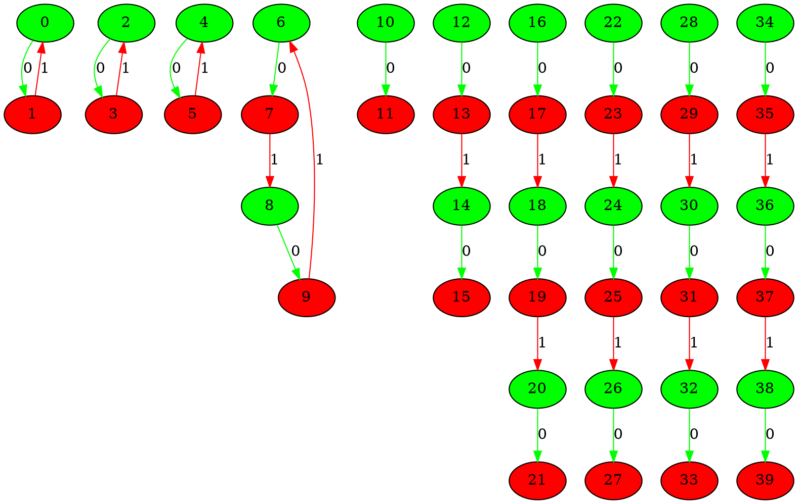
```graphviz
digraph G {
0[label="0" fillcolor="green" style="filled"];
1[label="1" fillcolor="red" style="filled"];
2[label="2" fillcolor="green" style="filled"];
3[label="3" fillcolor="red" style="filled"];
4[label="4" fillcolor="green" style="filled"];
5[label="5" fillcolor="red" style="filled"];
6[label="6" fillcolor="green" style="filled"];
7[label="7" fillcolor="red" style="filled"];
8[label="8" fillcolor="green" style="filled"];
9[label="9" fillcolor="red" style="filled"];
10[label="10" fillcolor="green" style="filled"];
11[label="11" fillcolor="red" style="filled"];
12[label="12" fillcolor="green" style="filled"];
13[label="13" fillcolor="red" style="filled"];
14[label="14" fillcolor="green" style="filled"];
15[label="15" fillcolor="red" style="filled"];
16[label="16" fillcolor="green" style="filled"];
17[label="17" fillcolor="red" style="filled"];
18[label="18" fillcolor="green" style="filled"];
19[label="19" fillcolor="red" style="filled"];
20[label="20" fillcolor="green" style="filled"];
21[label="21" fillcolor="red" style="filled"];
22[label="22" fillcolor="green" style="filled"];
23[label="23" fillcolor="red" style="filled"];
24[label="24" fillcolor="green" style="filled"];
25[label="25" fillcolor="red" style="filled"];
26[label="26" fillcolor="green" style="filled"];
27[label="27" fillcolor="red" style="filled"];
28[label="28" fillcolor="green" style="filled"];
29[label="29" fillcolor="red" style="filled"];
30[label="30" fillcolor="green" style="filled"];
31[label="31" fillcolor="red" style="filled"];
32[label="32" fillcolor="green" style="filled"];
33[label="33" fillcolor="red" style="filled"];
34[label="34" fillcolor="green" style="filled"];
35[label="35" fillcolor="red" style="filled"];
36[label="36" fillcolor="green" style="filled"];
37[label="37" fillcolor="red" style="filled"];
38[label="38" fillcolor="green" style="filled"];
39[label="39" fillcolor="red" style="filled"];
0->1 [label="0" color="green"];
1->0 [label="1" color="red"];
2->3 [label="0" color="green"];
3->2 [label="1" color="red"];
4->5 [label="0" color="green"];
5->4 [label="1" color="red"];
6->7 [label="0" color="green"];
7->8 [label="1" color="red"];
8->9 [label="0" color="green"];
9->6 [label="1" color="red"];
10->11 [label="0" color="green"];
12->13 [label="0" color="green"];
13->14 [label="1" color="red"];
14->15 [label="0" color="green"];
16->17 [label="0" color="green"];
17->18 [label="1" color="red"];
18->19 [label="0" color="green"];
19->20 [label="1" color="red"];
20->21 [label="0" color="green"];
22->23 [label="0" color="green"];
23->24 [label="1" color="red"];
24->25 [label="0" color="green"];
25->26 [label="1" color="red"];
26->27 [label="0" color="green"];
28->29 [label="0" color="green"];
29->30 [label="1" color="red"];
30->31 [label="0" color="green"];
31->32 [label="1" color="red"];
32->33 [label="0" color="green"];
34->35 [label="0" color="green"];
35->36 [label="1" color="red"];
36->37 [label="0" color="green"];
37->38 [label="1" color="red"];
38->39 [label="0" color="green"];
}
```
___
## Graph 11302 - list de compréhension : 1,1,1,2,2|1,3,3,3,3
___
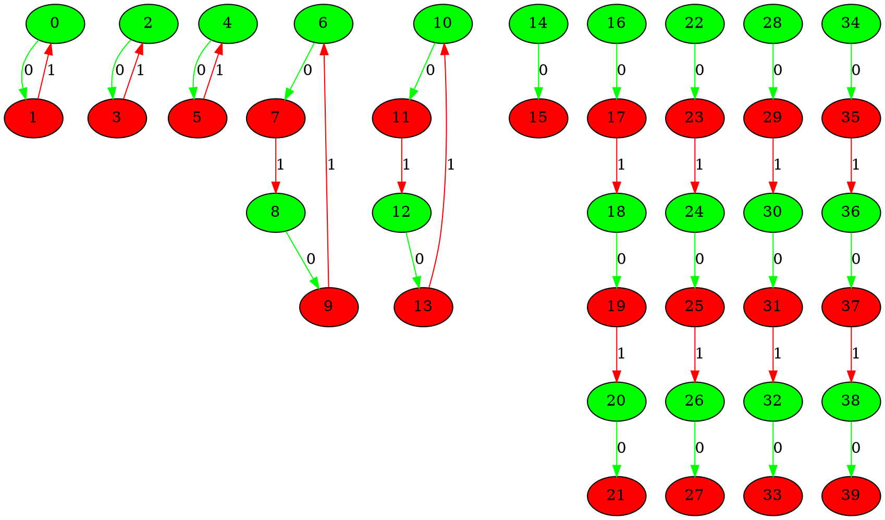
```graphviz
digraph G {
0[label="0" fillcolor="green" style="filled"];
1[label="1" fillcolor="red" style="filled"];
2[label="2" fillcolor="green" style="filled"];
3[label="3" fillcolor="red" style="filled"];
4[label="4" fillcolor="green" style="filled"];
5[label="5" fillcolor="red" style="filled"];
6[label="6" fillcolor="green" style="filled"];
7[label="7" fillcolor="red" style="filled"];
8[label="8" fillcolor="green" style="filled"];
9[label="9" fillcolor="red" style="filled"];
10[label="10" fillcolor="green" style="filled"];
11[label="11" fillcolor="red" style="filled"];
12[label="12" fillcolor="green" style="filled"];
13[label="13" fillcolor="red" style="filled"];
14[label="14" fillcolor="green" style="filled"];
15[label="15" fillcolor="red" style="filled"];
16[label="16" fillcolor="green" style="filled"];
17[label="17" fillcolor="red" style="filled"];
18[label="18" fillcolor="green" style="filled"];
19[label="19" fillcolor="red" style="filled"];
20[label="20" fillcolor="green" style="filled"];
21[label="21" fillcolor="red" style="filled"];
22[label="22" fillcolor="green" style="filled"];
23[label="23" fillcolor="red" style="filled"];
24[label="24" fillcolor="green" style="filled"];
25[label="25" fillcolor="red" style="filled"];
26[label="26" fillcolor="green" style="filled"];
27[label="27" fillcolor="red" style="filled"];
28[label="28" fillcolor="green" style="filled"];
29[label="29" fillcolor="red" style="filled"];
30[label="30" fillcolor="green" style="filled"];
31[label="31" fillcolor="red" style="filled"];
32[label="32" fillcolor="green" style="filled"];
33[label="33" fillcolor="red" style="filled"];
34[label="34" fillcolor="green" style="filled"];
35[label="35" fillcolor="red" style="filled"];
36[label="36" fillcolor="green" style="filled"];
37[label="37" fillcolor="red" style="filled"];
38[label="38" fillcolor="green" style="filled"];
39[label="39" fillcolor="red" style="filled"];
0->1 [label="0" color="green"];
1->0 [label="1" color="red"];
2->3 [label="0" color="green"];
3->2 [label="1" color="red"];
4->5 [label="0" color="green"];
5->4 [label="1" color="red"];
6->7 [label="0" color="green"];
7->8 [label="1" color="red"];
8->9 [label="0" color="green"];
9->6 [label="1" color="red"];
10->11 [label="0" color="green"];
11->12 [label="1" color="red"];
12->13 [label="0" color="green"];
13->10 [label="1" color="red"];
14->15 [label="0" color="green"];
16->17 [label="0" color="green"];
17->18 [label="1" color="red"];
18->19 [label="0" color="green"];
19->20 [label="1" color="red"];
20->21 [label="0" color="green"];
22->23 [label="0" color="green"];
23->24 [label="1" color="red"];
24->25 [label="0" color="green"];
25->26 [label="1" color="red"];
26->27 [label="0" color="green"];
28->29 [label="0" color="green"];
29->30 [label="1" color="red"];
30->31 [label="0" color="green"];
31->32 [label="1" color="red"];
32->33 [label="0" color="green"];
34->35 [label="0" color="green"];
35->36 [label="1" color="red"];
36->37 [label="0" color="green"];
37->38 [label="1" color="red"];
38->39 [label="0" color="green"];
}
```
___
## Graph 11303 - list de compréhension : 1,1,1,2,2,3|1,3,3,3
___
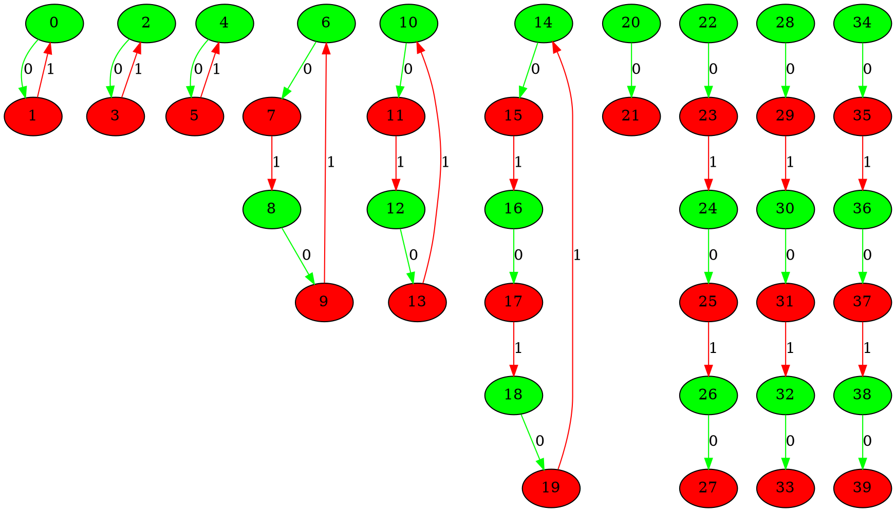
```graphviz
digraph G {
0[label="0" fillcolor="green" style="filled"];
1[label="1" fillcolor="red" style="filled"];
2[label="2" fillcolor="green" style="filled"];
3[label="3" fillcolor="red" style="filled"];
4[label="4" fillcolor="green" style="filled"];
5[label="5" fillcolor="red" style="filled"];
6[label="6" fillcolor="green" style="filled"];
7[label="7" fillcolor="red" style="filled"];
8[label="8" fillcolor="green" style="filled"];
9[label="9" fillcolor="red" style="filled"];
10[label="10" fillcolor="green" style="filled"];
11[label="11" fillcolor="red" style="filled"];
12[label="12" fillcolor="green" style="filled"];
13[label="13" fillcolor="red" style="filled"];
14[label="14" fillcolor="green" style="filled"];
15[label="15" fillcolor="red" style="filled"];
16[label="16" fillcolor="green" style="filled"];
17[label="17" fillcolor="red" style="filled"];
18[label="18" fillcolor="green" style="filled"];
19[label="19" fillcolor="red" style="filled"];
20[label="20" fillcolor="green" style="filled"];
21[label="21" fillcolor="red" style="filled"];
22[label="22" fillcolor="green" style="filled"];
23[label="23" fillcolor="red" style="filled"];
24[label="24" fillcolor="green" style="filled"];
25[label="25" fillcolor="red" style="filled"];
26[label="26" fillcolor="green" style="filled"];
27[label="27" fillcolor="red" style="filled"];
28[label="28" fillcolor="green" style="filled"];
29[label="29" fillcolor="red" style="filled"];
30[label="30" fillcolor="green" style="filled"];
31[label="31" fillcolor="red" style="filled"];
32[label="32" fillcolor="green" style="filled"];
33[label="33" fillcolor="red" style="filled"];
34[label="34" fillcolor="green" style="filled"];
35[label="35" fillcolor="red" style="filled"];
36[label="36" fillcolor="green" style="filled"];
37[label="37" fillcolor="red" style="filled"];
38[label="38" fillcolor="green" style="filled"];
39[label="39" fillcolor="red" style="filled"];
0->1 [label="0" color="green"];
1->0 [label="1" color="red"];
2->3 [label="0" color="green"];
3->2 [label="1" color="red"];
4->5 [label="0" color="green"];
5->4 [label="1" color="red"];
6->7 [label="0" color="green"];
7->8 [label="1" color="red"];
8->9 [label="0" color="green"];
9->6 [label="1" color="red"];
10->11 [label="0" color="green"];
11->12 [label="1" color="red"];
12->13 [label="0" color="green"];
13->10 [label="1" color="red"];
14->15 [label="0" color="green"];
15->16 [label="1" color="red"];
16->17 [label="0" color="green"];
17->18 [label="1" color="red"];
18->19 [label="0" color="green"];
19->14 [label="1" color="red"];
20->21 [label="0" color="green"];
22->23 [label="0" color="green"];
23->24 [label="1" color="red"];
24->25 [label="0" color="green"];
25->26 [label="1" color="red"];
26->27 [label="0" color="green"];
28->29 [label="0" color="green"];
29->30 [label="1" color="red"];
30->31 [label="0" color="green"];
31->32 [label="1" color="red"];
32->33 [label="0" color="green"];
34->35 [label="0" color="green"];
35->36 [label="1" color="red"];
36->37 [label="0" color="green"];
37->38 [label="1" color="red"];
38->39 [label="0" color="green"];
}
```
___
## Graph 11304 - list de compréhension : 1,1,1,2,2,3,3|1,3,3
___
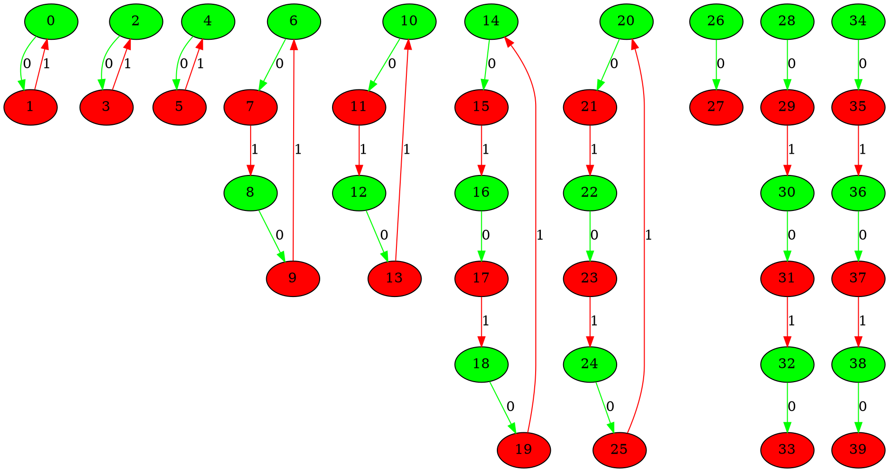
```graphviz
digraph G {
0[label="0" fillcolor="green" style="filled"];
1[label="1" fillcolor="red" style="filled"];
2[label="2" fillcolor="green" style="filled"];
3[label="3" fillcolor="red" style="filled"];
4[label="4" fillcolor="green" style="filled"];
5[label="5" fillcolor="red" style="filled"];
6[label="6" fillcolor="green" style="filled"];
7[label="7" fillcolor="red" style="filled"];
8[label="8" fillcolor="green" style="filled"];
9[label="9" fillcolor="red" style="filled"];
10[label="10" fillcolor="green" style="filled"];
11[label="11" fillcolor="red" style="filled"];
12[label="12" fillcolor="green" style="filled"];
13[label="13" fillcolor="red" style="filled"];
14[label="14" fillcolor="green" style="filled"];
15[label="15" fillcolor="red" style="filled"];
16[label="16" fillcolor="green" style="filled"];
17[label="17" fillcolor="red" style="filled"];
18[label="18" fillcolor="green" style="filled"];
19[label="19" fillcolor="red" style="filled"];
20[label="20" fillcolor="green" style="filled"];
21[label="21" fillcolor="red" style="filled"];
22[label="22" fillcolor="green" style="filled"];
23[label="23" fillcolor="red" style="filled"];
24[label="24" fillcolor="green" style="filled"];
25[label="25" fillcolor="red" style="filled"];
26[label="26" fillcolor="green" style="filled"];
27[label="27" fillcolor="red" style="filled"];
28[label="28" fillcolor="green" style="filled"];
29[label="29" fillcolor="red" style="filled"];
30[label="30" fillcolor="green" style="filled"];
31[label="31" fillcolor="red" style="filled"];
32[label="32" fillcolor="green" style="filled"];
33[label="33" fillcolor="red" style="filled"];
34[label="34" fillcolor="green" style="filled"];
35[label="35" fillcolor="red" style="filled"];
36[label="36" fillcolor="green" style="filled"];
37[label="37" fillcolor="red" style="filled"];
38[label="38" fillcolor="green" style="filled"];
39[label="39" fillcolor="red" style="filled"];
0->1 [label="0" color="green"];
1->0 [label="1" color="red"];
2->3 [label="0" color="green"];
3->2 [label="1" color="red"];
4->5 [label="0" color="green"];
5->4 [label="1" color="red"];
6->7 [label="0" color="green"];
7->8 [label="1" color="red"];
8->9 [label="0" color="green"];
9->6 [label="1" color="red"];
10->11 [label="0" color="green"];
11->12 [label="1" color="red"];
12->13 [label="0" color="green"];
13->10 [label="1" color="red"];
14->15 [label="0" color="green"];
15->16 [label="1" color="red"];
16->17 [label="0" color="green"];
17->18 [label="1" color="red"];
18->19 [label="0" color="green"];
19->14 [label="1" color="red"];
20->21 [label="0" color="green"];
21->22 [label="1" color="red"];
22->23 [label="0" color="green"];
23->24 [label="1" color="red"];
24->25 [label="0" color="green"];
25->20 [label="1" color="red"];
26->27 [label="0" color="green"];
28->29 [label="0" color="green"];
29->30 [label="1" color="red"];
30->31 [label="0" color="green"];
31->32 [label="1" color="red"];
32->33 [label="0" color="green"];
34->35 [label="0" color="green"];
35->36 [label="1" color="red"];
36->37 [label="0" color="green"];
37->38 [label="1" color="red"];
38->39 [label="0" color="green"];
}
```
___
## Graph 11305 - list de compréhension : 1,1,1,2,2,3,3,3|1,3
___
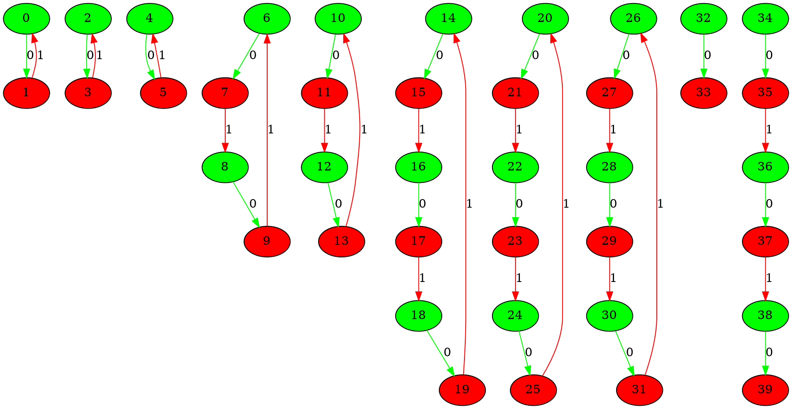
```graphviz
digraph G {
0[label="0" fillcolor="green" style="filled"];
1[label="1" fillcolor="red" style="filled"];
2[label="2" fillcolor="green" style="filled"];
3[label="3" fillcolor="red" style="filled"];
4[label="4" fillcolor="green" style="filled"];
5[label="5" fillcolor="red" style="filled"];
6[label="6" fillcolor="green" style="filled"];
7[label="7" fillcolor="red" style="filled"];
8[label="8" fillcolor="green" style="filled"];
9[label="9" fillcolor="red" style="filled"];
10[label="10" fillcolor="green" style="filled"];
11[label="11" fillcolor="red" style="filled"];
12[label="12" fillcolor="green" style="filled"];
13[label="13" fillcolor="red" style="filled"];
14[label="14" fillcolor="green" style="filled"];
15[label="15" fillcolor="red" style="filled"];
16[label="16" fillcolor="green" style="filled"];
17[label="17" fillcolor="red" style="filled"];
18[label="18" fillcolor="green" style="filled"];
19[label="19" fillcolor="red" style="filled"];
20[label="20" fillcolor="green" style="filled"];
21[label="21" fillcolor="red" style="filled"];
22[label="22" fillcolor="green" style="filled"];
23[label="23" fillcolor="red" style="filled"];
24[label="24" fillcolor="green" style="filled"];
25[label="25" fillcolor="red" style="filled"];
26[label="26" fillcolor="green" style="filled"];
27[label="27" fillcolor="red" style="filled"];
28[label="28" fillcolor="green" style="filled"];
29[label="29" fillcolor="red" style="filled"];
30[label="30" fillcolor="green" style="filled"];
31[label="31" fillcolor="red" style="filled"];
32[label="32" fillcolor="green" style="filled"];
33[label="33" fillcolor="red" style="filled"];
34[label="34" fillcolor="green" style="filled"];
35[label="35" fillcolor="red" style="filled"];
36[label="36" fillcolor="green" style="filled"];
37[label="37" fillcolor="red" style="filled"];
38[label="38" fillcolor="green" style="filled"];
39[label="39" fillcolor="red" style="filled"];
0->1 [label="0" color="green"];
1->0 [label="1" color="red"];
2->3 [label="0" color="green"];
3->2 [label="1" color="red"];
4->5 [label="0" color="green"];
5->4 [label="1" color="red"];
6->7 [label="0" color="green"];
7->8 [label="1" color="red"];
8->9 [label="0" color="green"];
9->6 [label="1" color="red"];
10->11 [label="0" color="green"];
11->12 [label="1" color="red"];
12->13 [label="0" color="green"];
13->10 [label="1" color="red"];
14->15 [label="0" color="green"];
15->16 [label="1" color="red"];
16->17 [label="0" color="green"];
17->18 [label="1" color="red"];
18->19 [label="0" color="green"];
19->14 [label="1" color="red"];
20->21 [label="0" color="green"];
21->22 [label="1" color="red"];
22->23 [label="0" color="green"];
23->24 [label="1" color="red"];
24->25 [label="0" color="green"];
25->20 [label="1" color="red"];
26->27 [label="0" color="green"];
27->28 [label="1" color="red"];
28->29 [label="0" color="green"];
29->30 [label="1" color="red"];
30->31 [label="0" color="green"];
31->26 [label="1" color="red"];
32->33 [label="0" color="green"];
34->35 [label="0" color="green"];
35->36 [label="1" color="red"];
36->37 [label="0" color="green"];
37->38 [label="1" color="red"];
38->39 [label="0" color="green"];
}
```
___
## Graph 11306 - list de compréhension : 1,1,1,2,2,3,3,3,3|1
___
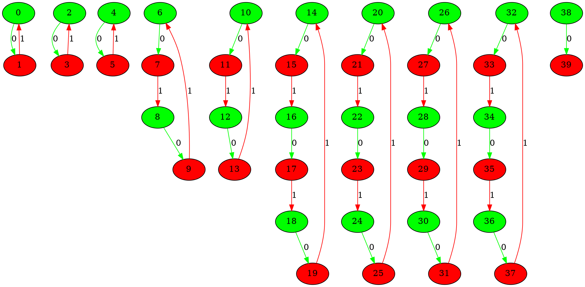
```graphviz
digraph G {
0[label="0" fillcolor="green" style="filled"];
1[label="1" fillcolor="red" style="filled"];
2[label="2" fillcolor="green" style="filled"];
3[label="3" fillcolor="red" style="filled"];
4[label="4" fillcolor="green" style="filled"];
5[label="5" fillcolor="red" style="filled"];
6[label="6" fillcolor="green" style="filled"];
7[label="7" fillcolor="red" style="filled"];
8[label="8" fillcolor="green" style="filled"];
9[label="9" fillcolor="red" style="filled"];
10[label="10" fillcolor="green" style="filled"];
11[label="11" fillcolor="red" style="filled"];
12[label="12" fillcolor="green" style="filled"];
13[label="13" fillcolor="red" style="filled"];
14[label="14" fillcolor="green" style="filled"];
15[label="15" fillcolor="red" style="filled"];
16[label="16" fillcolor="green" style="filled"];
17[label="17" fillcolor="red" style="filled"];
18[label="18" fillcolor="green" style="filled"];
19[label="19" fillcolor="red" style="filled"];
20[label="20" fillcolor="green" style="filled"];
21[label="21" fillcolor="red" style="filled"];
22[label="22" fillcolor="green" style="filled"];
23[label="23" fillcolor="red" style="filled"];
24[label="24" fillcolor="green" style="filled"];
25[label="25" fillcolor="red" style="filled"];
26[label="26" fillcolor="green" style="filled"];
27[label="27" fillcolor="red" style="filled"];
28[label="28" fillcolor="green" style="filled"];
29[label="29" fillcolor="red" style="filled"];
30[label="30" fillcolor="green" style="filled"];
31[label="31" fillcolor="red" style="filled"];
32[label="32" fillcolor="green" style="filled"];
33[label="33" fillcolor="red" style="filled"];
34[label="34" fillcolor="green" style="filled"];
35[label="35" fillcolor="red" style="filled"];
36[label="36" fillcolor="green" style="filled"];
37[label="37" fillcolor="red" style="filled"];
38[label="38" fillcolor="green" style="filled"];
39[label="39" fillcolor="red" style="filled"];
0->1 [label="0" color="green"];
1->0 [label="1" color="red"];
2->3 [label="0" color="green"];
3->2 [label="1" color="red"];
4->5 [label="0" color="green"];
5->4 [label="1" color="red"];
6->7 [label="0" color="green"];
7->8 [label="1" color="red"];
8->9 [label="0" color="green"];
9->6 [label="1" color="red"];
10->11 [label="0" color="green"];
11->12 [label="1" color="red"];
12->13 [label="0" color="green"];
13->10 [label="1" color="red"];
14->15 [label="0" color="green"];
15->16 [label="1" color="red"];
16->17 [label="0" color="green"];
17->18 [label="1" color="red"];
18->19 [label="0" color="green"];
19->14 [label="1" color="red"];
20->21 [label="0" color="green"];
21->22 [label="1" color="red"];
22->23 [label="0" color="green"];
23->24 [label="1" color="red"];
24->25 [label="0" color="green"];
25->20 [label="1" color="red"];
26->27 [label="0" color="green"];
27->28 [label="1" color="red"];
28->29 [label="0" color="green"];
29->30 [label="1" color="red"];
30->31 [label="0" color="green"];
31->26 [label="1" color="red"];
32->33 [label="0" color="green"];
33->34 [label="1" color="red"];
34->35 [label="0" color="green"];
35->36 [label="1" color="red"];
36->37 [label="0" color="green"];
37->32 [label="1" color="red"];
38->39 [label="0" color="green"];
}
```
___
## Graph 11307 - list de compréhension : 1,1,1,2,3|1,2,3,3,3
___
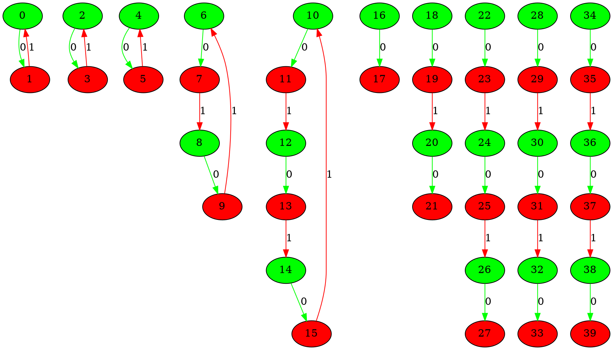
```graphviz
digraph G {
0[label="0" fillcolor="green" style="filled"];
1[label="1" fillcolor="red" style="filled"];
2[label="2" fillcolor="green" style="filled"];
3[label="3" fillcolor="red" style="filled"];
4[label="4" fillcolor="green" style="filled"];
5[label="5" fillcolor="red" style="filled"];
6[label="6" fillcolor="green" style="filled"];
7[label="7" fillcolor="red" style="filled"];
8[label="8" fillcolor="green" style="filled"];
9[label="9" fillcolor="red" style="filled"];
10[label="10" fillcolor="green" style="filled"];
11[label="11" fillcolor="red" style="filled"];
12[label="12" fillcolor="green" style="filled"];
13[label="13" fillcolor="red" style="filled"];
14[label="14" fillcolor="green" style="filled"];
15[label="15" fillcolor="red" style="filled"];
16[label="16" fillcolor="green" style="filled"];
17[label="17" fillcolor="red" style="filled"];
18[label="18" fillcolor="green" style="filled"];
19[label="19" fillcolor="red" style="filled"];
20[label="20" fillcolor="green" style="filled"];
21[label="21" fillcolor="red" style="filled"];
22[label="22" fillcolor="green" style="filled"];
23[label="23" fillcolor="red" style="filled"];
24[label="24" fillcolor="green" style="filled"];
25[label="25" fillcolor="red" style="filled"];
26[label="26" fillcolor="green" style="filled"];
27[label="27" fillcolor="red" style="filled"];
28[label="28" fillcolor="green" style="filled"];
29[label="29" fillcolor="red" style="filled"];
30[label="30" fillcolor="green" style="filled"];
31[label="31" fillcolor="red" style="filled"];
32[label="32" fillcolor="green" style="filled"];
33[label="33" fillcolor="red" style="filled"];
34[label="34" fillcolor="green" style="filled"];
35[label="35" fillcolor="red" style="filled"];
36[label="36" fillcolor="green" style="filled"];
37[label="37" fillcolor="red" style="filled"];
38[label="38" fillcolor="green" style="filled"];
39[label="39" fillcolor="red" style="filled"];
0->1 [label="0" color="green"];
1->0 [label="1" color="red"];
2->3 [label="0" color="green"];
3->2 [label="1" color="red"];
4->5 [label="0" color="green"];
5->4 [label="1" color="red"];
6->7 [label="0" color="green"];
7->8 [label="1" color="red"];
8->9 [label="0" color="green"];
9->6 [label="1" color="red"];
10->11 [label="0" color="green"];
11->12 [label="1" color="red"];
12->13 [label="0" color="green"];
13->14 [label="1" color="red"];
14->15 [label="0" color="green"];
15->10 [label="1" color="red"];
16->17 [label="0" color="green"];
18->19 [label="0" color="green"];
19->20 [label="1" color="red"];
20->21 [label="0" color="green"];
22->23 [label="0" color="green"];
23->24 [label="1" color="red"];
24->25 [label="0" color="green"];
25->26 [label="1" color="red"];
26->27 [label="0" color="green"];
28->29 [label="0" color="green"];
29->30 [label="1" color="red"];
30->31 [label="0" color="green"];
31->32 [label="1" color="red"];
32->33 [label="0" color="green"];
34->35 [label="0" color="green"];
35->36 [label="1" color="red"];
36->37 [label="0" color="green"];
37->38 [label="1" color="red"];
38->39 [label="0" color="green"];
}
```
___
## Graph 11308 - list de compréhension : 1,1,1,2,3,3|1,2,3,3
___
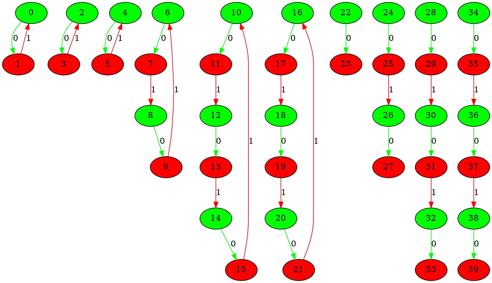
```graphviz
digraph G {
0[label="0" fillcolor="green" style="filled"];
1[label="1" fillcolor="red" style="filled"];
2[label="2" fillcolor="green" style="filled"];
3[label="3" fillcolor="red" style="filled"];
4[label="4" fillcolor="green" style="filled"];
5[label="5" fillcolor="red" style="filled"];
6[label="6" fillcolor="green" style="filled"];
7[label="7" fillcolor="red" style="filled"];
8[label="8" fillcolor="green" style="filled"];
9[label="9" fillcolor="red" style="filled"];
10[label="10" fillcolor="green" style="filled"];
11[label="11" fillcolor="red" style="filled"];
12[label="12" fillcolor="green" style="filled"];
13[label="13" fillcolor="red" style="filled"];
14[label="14" fillcolor="green" style="filled"];
15[label="15" fillcolor="red" style="filled"];
16[label="16" fillcolor="green" style="filled"];
17[label="17" fillcolor="red" style="filled"];
18[label="18" fillcolor="green" style="filled"];
19[label="19" fillcolor="red" style="filled"];
20[label="20" fillcolor="green" style="filled"];
21[label="21" fillcolor="red" style="filled"];
22[label="22" fillcolor="green" style="filled"];
23[label="23" fillcolor="red" style="filled"];
24[label="24" fillcolor="green" style="filled"];
25[label="25" fillcolor="red" style="filled"];
26[label="26" fillcolor="green" style="filled"];
27[label="27" fillcolor="red" style="filled"];
28[label="28" fillcolor="green" style="filled"];
29[label="29" fillcolor="red" style="filled"];
30[label="30" fillcolor="green" style="filled"];
31[label="31" fillcolor="red" style="filled"];
32[label="32" fillcolor="green" style="filled"];
33[label="33" fillcolor="red" style="filled"];
34[label="34" fillcolor="green" style="filled"];
35[label="35" fillcolor="red" style="filled"];
36[label="36" fillcolor="green" style="filled"];
37[label="37" fillcolor="red" style="filled"];
38[label="38" fillcolor="green" style="filled"];
39[label="39" fillcolor="red" style="filled"];
0->1 [label="0" color="green"];
1->0 [label="1" color="red"];
2->3 [label="0" color="green"];
3->2 [label="1" color="red"];
4->5 [label="0" color="green"];
5->4 [label="1" color="red"];
6->7 [label="0" color="green"];
7->8 [label="1" color="red"];
8->9 [label="0" color="green"];
9->6 [label="1" color="red"];
10->11 [label="0" color="green"];
11->12 [label="1" color="red"];
12->13 [label="0" color="green"];
13->14 [label="1" color="red"];
14->15 [label="0" color="green"];
15->10 [label="1" color="red"];
16->17 [label="0" color="green"];
17->18 [label="1" color="red"];
18->19 [label="0" color="green"];
19->20 [label="1" color="red"];
20->21 [label="0" color="green"];
21->16 [label="1" color="red"];
22->23 [label="0" color="green"];
24->25 [label="0" color="green"];
25->26 [label="1" color="red"];
26->27 [label="0" color="green"];
28->29 [label="0" color="green"];
29->30 [label="1" color="red"];
30->31 [label="0" color="green"];
31->32 [label="1" color="red"];
32->33 [label="0" color="green"];
34->35 [label="0" color="green"];
35->36 [label="1" color="red"];
36->37 [label="0" color="green"];
37->38 [label="1" color="red"];
38->39 [label="0" color="green"];
}
```
___
## Graph 11309 - list de compréhension : 1,1,1,2,3,3,3|1,2,3
___
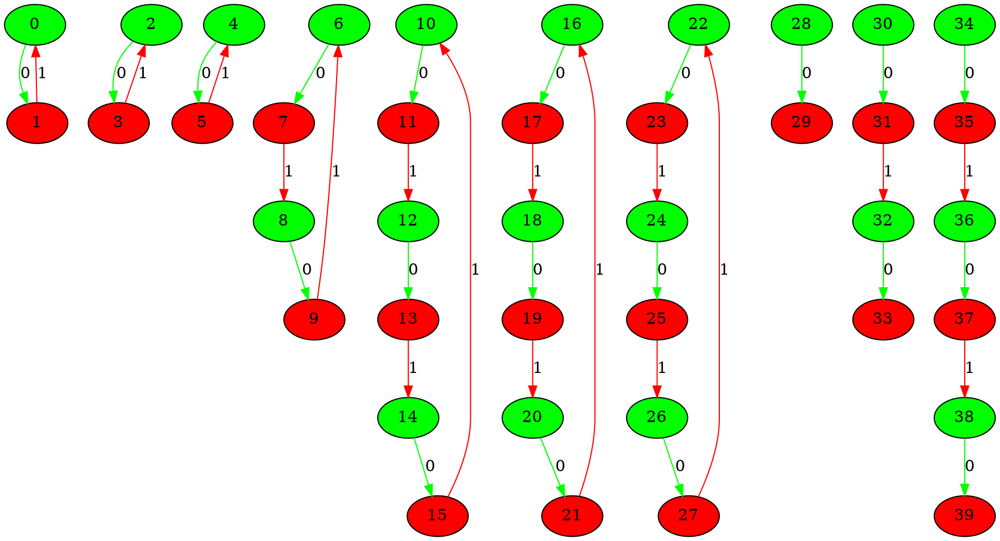
```graphviz
digraph G {
0[label="0" fillcolor="green" style="filled"];
1[label="1" fillcolor="red" style="filled"];
2[label="2" fillcolor="green" style="filled"];
3[label="3" fillcolor="red" style="filled"];
4[label="4" fillcolor="green" style="filled"];
5[label="5" fillcolor="red" style="filled"];
6[label="6" fillcolor="green" style="filled"];
7[label="7" fillcolor="red" style="filled"];
8[label="8" fillcolor="green" style="filled"];
9[label="9" fillcolor="red" style="filled"];
10[label="10" fillcolor="green" style="filled"];
11[label="11" fillcolor="red" style="filled"];
12[label="12" fillcolor="green" style="filled"];
13[label="13" fillcolor="red" style="filled"];
14[label="14" fillcolor="green" style="filled"];
15[label="15" fillcolor="red" style="filled"];
16[label="16" fillcolor="green" style="filled"];
17[label="17" fillcolor="red" style="filled"];
18[label="18" fillcolor="green" style="filled"];
19[label="19" fillcolor="red" style="filled"];
20[label="20" fillcolor="green" style="filled"];
21[label="21" fillcolor="red" style="filled"];
22[label="22" fillcolor="green" style="filled"];
23[label="23" fillcolor="red" style="filled"];
24[label="24" fillcolor="green" style="filled"];
25[label="25" fillcolor="red" style="filled"];
26[label="26" fillcolor="green" style="filled"];
27[label="27" fillcolor="red" style="filled"];
28[label="28" fillcolor="green" style="filled"];
29[label="29" fillcolor="red" style="filled"];
30[label="30" fillcolor="green" style="filled"];
31[label="31" fillcolor="red" style="filled"];
32[label="32" fillcolor="green" style="filled"];
33[label="33" fillcolor="red" style="filled"];
34[label="34" fillcolor="green" style="filled"];
35[label="35" fillcolor="red" style="filled"];
36[label="36" fillcolor="green" style="filled"];
37[label="37" fillcolor="red" style="filled"];
38[label="38" fillcolor="green" style="filled"];
39[label="39" fillcolor="red" style="filled"];
0->1 [label="0" color="green"];
1->0 [label="1" color="red"];
2->3 [label="0" color="green"];
3->2 [label="1" color="red"];
4->5 [label="0" color="green"];
5->4 [label="1" color="red"];
6->7 [label="0" color="green"];
7->8 [label="1" color="red"];
8->9 [label="0" color="green"];
9->6 [label="1" color="red"];
10->11 [label="0" color="green"];
11->12 [label="1" color="red"];
12->13 [label="0" color="green"];
13->14 [label="1" color="red"];
14->15 [label="0" color="green"];
15->10 [label="1" color="red"];
16->17 [label="0" color="green"];
17->18 [label="1" color="red"];
18->19 [label="0" color="green"];
19->20 [label="1" color="red"];
20->21 [label="0" color="green"];
21->16 [label="1" color="red"];
22->23 [label="0" color="green"];
23->24 [label="1" color="red"];
24->25 [label="0" color="green"];
25->26 [label="1" color="red"];
26->27 [label="0" color="green"];
27->22 [label="1" color="red"];
28->29 [label="0" color="green"];
30->31 [label="0" color="green"];
31->32 [label="1" color="red"];
32->33 [label="0" color="green"];
34->35 [label="0" color="green"];
35->36 [label="1" color="red"];
36->37 [label="0" color="green"];
37->38 [label="1" color="red"];
38->39 [label="0" color="green"];
}
```
___
## Graph 11310 - list de compréhension : 1,1,1,2,3,3,3,3|1,2
___
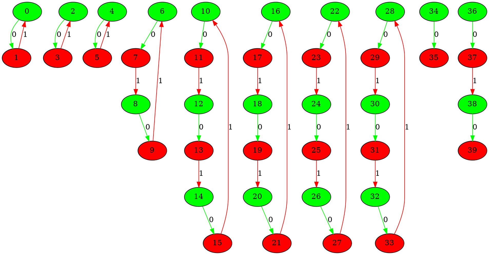
```graphviz
digraph G {
0[label="0" fillcolor="green" style="filled"];
1[label="1" fillcolor="red" style="filled"];
2[label="2" fillcolor="green" style="filled"];
3[label="3" fillcolor="red" style="filled"];
4[label="4" fillcolor="green" style="filled"];
5[label="5" fillcolor="red" style="filled"];
6[label="6" fillcolor="green" style="filled"];
7[label="7" fillcolor="red" style="filled"];
8[label="8" fillcolor="green" style="filled"];
9[label="9" fillcolor="red" style="filled"];
10[label="10" fillcolor="green" style="filled"];
11[label="11" fillcolor="red" style="filled"];
12[label="12" fillcolor="green" style="filled"];
13[label="13" fillcolor="red" style="filled"];
14[label="14" fillcolor="green" style="filled"];
15[label="15" fillcolor="red" style="filled"];
16[label="16" fillcolor="green" style="filled"];
17[label="17" fillcolor="red" style="filled"];
18[label="18" fillcolor="green" style="filled"];
19[label="19" fillcolor="red" style="filled"];
20[label="20" fillcolor="green" style="filled"];
21[label="21" fillcolor="red" style="filled"];
22[label="22" fillcolor="green" style="filled"];
23[label="23" fillcolor="red" style="filled"];
24[label="24" fillcolor="green" style="filled"];
25[label="25" fillcolor="red" style="filled"];
26[label="26" fillcolor="green" style="filled"];
27[label="27" fillcolor="red" style="filled"];
28[label="28" fillcolor="green" style="filled"];
29[label="29" fillcolor="red" style="filled"];
30[label="30" fillcolor="green" style="filled"];
31[label="31" fillcolor="red" style="filled"];
32[label="32" fillcolor="green" style="filled"];
33[label="33" fillcolor="red" style="filled"];
34[label="34" fillcolor="green" style="filled"];
35[label="35" fillcolor="red" style="filled"];
36[label="36" fillcolor="green" style="filled"];
37[label="37" fillcolor="red" style="filled"];
38[label="38" fillcolor="green" style="filled"];
39[label="39" fillcolor="red" style="filled"];
0->1 [label="0" color="green"];
1->0 [label="1" color="red"];
2->3 [label="0" color="green"];
3->2 [label="1" color="red"];
4->5 [label="0" color="green"];
5->4 [label="1" color="red"];
6->7 [label="0" color="green"];
7->8 [label="1" color="red"];
8->9 [label="0" color="green"];
9->6 [label="1" color="red"];
10->11 [label="0" color="green"];
11->12 [label="1" color="red"];
12->13 [label="0" color="green"];
13->14 [label="1" color="red"];
14->15 [label="0" color="green"];
15->10 [label="1" color="red"];
16->17 [label="0" color="green"];
17->18 [label="1" color="red"];
18->19 [label="0" color="green"];
19->20 [label="1" color="red"];
20->21 [label="0" color="green"];
21->16 [label="1" color="red"];
22->23 [label="0" color="green"];
23->24 [label="1" color="red"];
24->25 [label="0" color="green"];
25->26 [label="1" color="red"];
26->27 [label="0" color="green"];
27->22 [label="1" color="red"];
28->29 [label="0" color="green"];
29->30 [label="1" color="red"];
30->31 [label="0" color="green"];
31->32 [label="1" color="red"];
32->33 [label="0" color="green"];
33->28 [label="1" color="red"];
34->35 [label="0" color="green"];
36->37 [label="0" color="green"];
37->38 [label="1" color="red"];
38->39 [label="0" color="green"];
}
```
___
## Graph 11311 - list de compréhension : 1,1,1,3|1,2,2,3,3,3
___
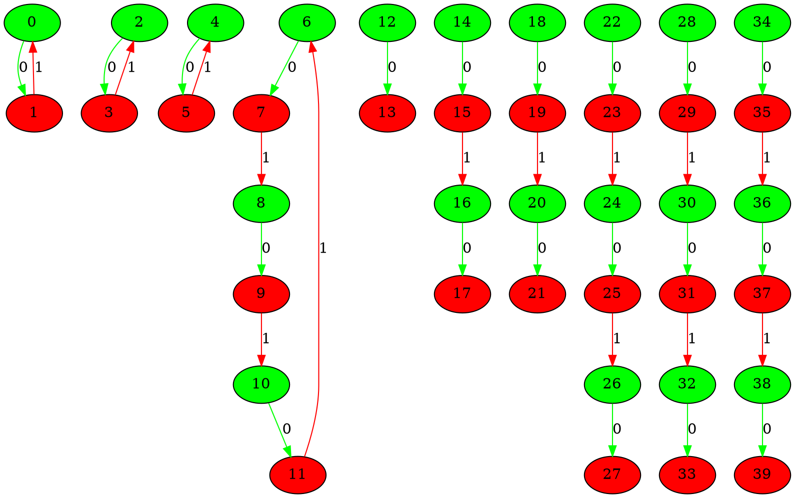
```graphviz
digraph G {
0[label="0" fillcolor="green" style="filled"];
1[label="1" fillcolor="red" style="filled"];
2[label="2" fillcolor="green" style="filled"];
3[label="3" fillcolor="red" style="filled"];
4[label="4" fillcolor="green" style="filled"];
5[label="5" fillcolor="red" style="filled"];
6[label="6" fillcolor="green" style="filled"];
7[label="7" fillcolor="red" style="filled"];
8[label="8" fillcolor="green" style="filled"];
9[label="9" fillcolor="red" style="filled"];
10[label="10" fillcolor="green" style="filled"];
11[label="11" fillcolor="red" style="filled"];
12[label="12" fillcolor="green" style="filled"];
13[label="13" fillcolor="red" style="filled"];
14[label="14" fillcolor="green" style="filled"];
15[label="15" fillcolor="red" style="filled"];
16[label="16" fillcolor="green" style="filled"];
17[label="17" fillcolor="red" style="filled"];
18[label="18" fillcolor="green" style="filled"];
19[label="19" fillcolor="red" style="filled"];
20[label="20" fillcolor="green" style="filled"];
21[label="21" fillcolor="red" style="filled"];
22[label="22" fillcolor="green" style="filled"];
23[label="23" fillcolor="red" style="filled"];
24[label="24" fillcolor="green" style="filled"];
25[label="25" fillcolor="red" style="filled"];
26[label="26" fillcolor="green" style="filled"];
27[label="27" fillcolor="red" style="filled"];
28[label="28" fillcolor="green" style="filled"];
29[label="29" fillcolor="red" style="filled"];
30[label="30" fillcolor="green" style="filled"];
31[label="31" fillcolor="red" style="filled"];
32[label="32" fillcolor="green" style="filled"];
33[label="33" fillcolor="red" style="filled"];
34[label="34" fillcolor="green" style="filled"];
35[label="35" fillcolor="red" style="filled"];
36[label="36" fillcolor="green" style="filled"];
37[label="37" fillcolor="red" style="filled"];
38[label="38" fillcolor="green" style="filled"];
39[label="39" fillcolor="red" style="filled"];
0->1 [label="0" color="green"];
1->0 [label="1" color="red"];
2->3 [label="0" color="green"];
3->2 [label="1" color="red"];
4->5 [label="0" color="green"];
5->4 [label="1" color="red"];
6->7 [label="0" color="green"];
7->8 [label="1" color="red"];
8->9 [label="0" color="green"];
9->10 [label="1" color="red"];
10->11 [label="0" color="green"];
11->6 [label="1" color="red"];
12->13 [label="0" color="green"];
14->15 [label="0" color="green"];
15->16 [label="1" color="red"];
16->17 [label="0" color="green"];
18->19 [label="0" color="green"];
19->20 [label="1" color="red"];
20->21 [label="0" color="green"];
22->23 [label="0" color="green"];
23->24 [label="1" color="red"];
24->25 [label="0" color="green"];
25->26 [label="1" color="red"];
26->27 [label="0" color="green"];
28->29 [label="0" color="green"];
29->30 [label="1" color="red"];
30->31 [label="0" color="green"];
31->32 [label="1" color="red"];
32->33 [label="0" color="green"];
34->35 [label="0" color="green"];
35->36 [label="1" color="red"];
36->37 [label="0" color="green"];
37->38 [label="1" color="red"];
38->39 [label="0" color="green"];
}
```
___
## Graph 11312 - list de compréhension : 1,1,1,3,3|1,2,2,3,3
___
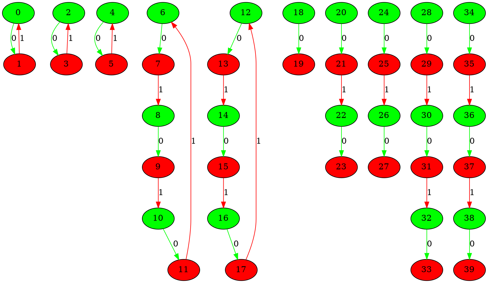
```graphviz
digraph G {
0[label="0" fillcolor="green" style="filled"];
1[label="1" fillcolor="red" style="filled"];
2[label="2" fillcolor="green" style="filled"];
3[label="3" fillcolor="red" style="filled"];
4[label="4" fillcolor="green" style="filled"];
5[label="5" fillcolor="red" style="filled"];
6[label="6" fillcolor="green" style="filled"];
7[label="7" fillcolor="red" style="filled"];
8[label="8" fillcolor="green" style="filled"];
9[label="9" fillcolor="red" style="filled"];
10[label="10" fillcolor="green" style="filled"];
11[label="11" fillcolor="red" style="filled"];
12[label="12" fillcolor="green" style="filled"];
13[label="13" fillcolor="red" style="filled"];
14[label="14" fillcolor="green" style="filled"];
15[label="15" fillcolor="red" style="filled"];
16[label="16" fillcolor="green" style="filled"];
17[label="17" fillcolor="red" style="filled"];
18[label="18" fillcolor="green" style="filled"];
19[label="19" fillcolor="red" style="filled"];
20[label="20" fillcolor="green" style="filled"];
21[label="21" fillcolor="red" style="filled"];
22[label="22" fillcolor="green" style="filled"];
23[label="23" fillcolor="red" style="filled"];
24[label="24" fillcolor="green" style="filled"];
25[label="25" fillcolor="red" style="filled"];
26[label="26" fillcolor="green" style="filled"];
27[label="27" fillcolor="red" style="filled"];
28[label="28" fillcolor="green" style="filled"];
29[label="29" fillcolor="red" style="filled"];
30[label="30" fillcolor="green" style="filled"];
31[label="31" fillcolor="red" style="filled"];
32[label="32" fillcolor="green" style="filled"];
33[label="33" fillcolor="red" style="filled"];
34[label="34" fillcolor="green" style="filled"];
35[label="35" fillcolor="red" style="filled"];
36[label="36" fillcolor="green" style="filled"];
37[label="37" fillcolor="red" style="filled"];
38[label="38" fillcolor="green" style="filled"];
39[label="39" fillcolor="red" style="filled"];
0->1 [label="0" color="green"];
1->0 [label="1" color="red"];
2->3 [label="0" color="green"];
3->2 [label="1" color="red"];
4->5 [label="0" color="green"];
5->4 [label="1" color="red"];
6->7 [label="0" color="green"];
7->8 [label="1" color="red"];
8->9 [label="0" color="green"];
9->10 [label="1" color="red"];
10->11 [label="0" color="green"];
11->6 [label="1" color="red"];
12->13 [label="0" color="green"];
13->14 [label="1" color="red"];
14->15 [label="0" color="green"];
15->16 [label="1" color="red"];
16->17 [label="0" color="green"];
17->12 [label="1" color="red"];
18->19 [label="0" color="green"];
20->21 [label="0" color="green"];
21->22 [label="1" color="red"];
22->23 [label="0" color="green"];
24->25 [label="0" color="green"];
25->26 [label="1" color="red"];
26->27 [label="0" color="green"];
28->29 [label="0" color="green"];
29->30 [label="1" color="red"];
30->31 [label="0" color="green"];
31->32 [label="1" color="red"];
32->33 [label="0" color="green"];
34->35 [label="0" color="green"];
35->36 [label="1" color="red"];
36->37 [label="0" color="green"];
37->38 [label="1" color="red"];
38->39 [label="0" color="green"];
}
```
___
## Graph 11313 - list de compréhension : 1,1,1,3,3,3|1,2,2,3
___
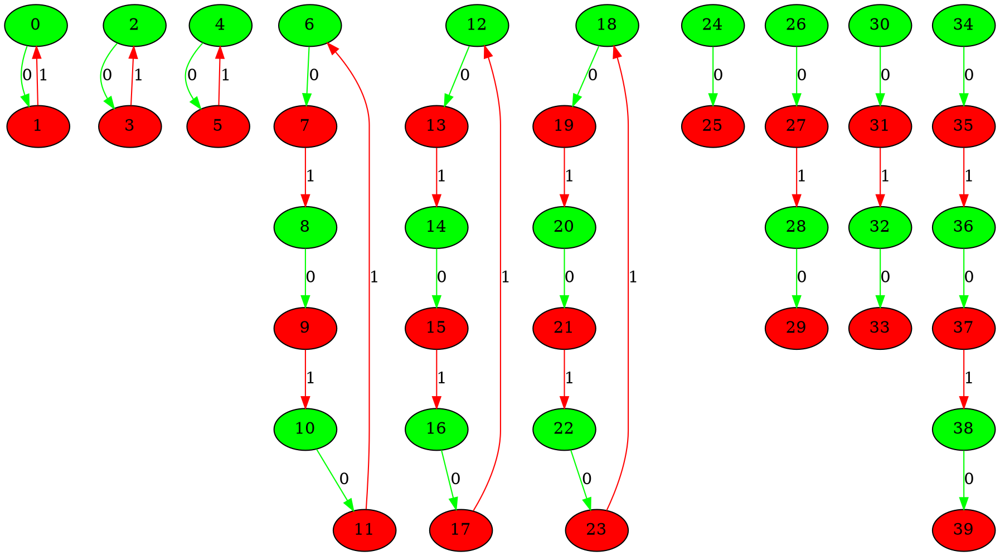
```graphviz
digraph G {
0[label="0" fillcolor="green" style="filled"];
1[label="1" fillcolor="red" style="filled"];
2[label="2" fillcolor="green" style="filled"];
3[label="3" fillcolor="red" style="filled"];
4[label="4" fillcolor="green" style="filled"];
5[label="5" fillcolor="red" style="filled"];
6[label="6" fillcolor="green" style="filled"];
7[label="7" fillcolor="red" style="filled"];
8[label="8" fillcolor="green" style="filled"];
9[label="9" fillcolor="red" style="filled"];
10[label="10" fillcolor="green" style="filled"];
11[label="11" fillcolor="red" style="filled"];
12[label="12" fillcolor="green" style="filled"];
13[label="13" fillcolor="red" style="filled"];
14[label="14" fillcolor="green" style="filled"];
15[label="15" fillcolor="red" style="filled"];
16[label="16" fillcolor="green" style="filled"];
17[label="17" fillcolor="red" style="filled"];
18[label="18" fillcolor="green" style="filled"];
19[label="19" fillcolor="red" style="filled"];
20[label="20" fillcolor="green" style="filled"];
21[label="21" fillcolor="red" style="filled"];
22[label="22" fillcolor="green" style="filled"];
23[label="23" fillcolor="red" style="filled"];
24[label="24" fillcolor="green" style="filled"];
25[label="25" fillcolor="red" style="filled"];
26[label="26" fillcolor="green" style="filled"];
27[label="27" fillcolor="red" style="filled"];
28[label="28" fillcolor="green" style="filled"];
29[label="29" fillcolor="red" style="filled"];
30[label="30" fillcolor="green" style="filled"];
31[label="31" fillcolor="red" style="filled"];
32[label="32" fillcolor="green" style="filled"];
33[label="33" fillcolor="red" style="filled"];
34[label="34" fillcolor="green" style="filled"];
35[label="35" fillcolor="red" style="filled"];
36[label="36" fillcolor="green" style="filled"];
37[label="37" fillcolor="red" style="filled"];
38[label="38" fillcolor="green" style="filled"];
39[label="39" fillcolor="red" style="filled"];
0->1 [label="0" color="green"];
1->0 [label="1" color="red"];
2->3 [label="0" color="green"];
3->2 [label="1" color="red"];
4->5 [label="0" color="green"];
5->4 [label="1" color="red"];
6->7 [label="0" color="green"];
7->8 [label="1" color="red"];
8->9 [label="0" color="green"];
9->10 [label="1" color="red"];
10->11 [label="0" color="green"];
11->6 [label="1" color="red"];
12->13 [label="0" color="green"];
13->14 [label="1" color="red"];
14->15 [label="0" color="green"];
15->16 [label="1" color="red"];
16->17 [label="0" color="green"];
17->12 [label="1" color="red"];
18->19 [label="0" color="green"];
19->20 [label="1" color="red"];
20->21 [label="0" color="green"];
21->22 [label="1" color="red"];
22->23 [label="0" color="green"];
23->18 [label="1" color="red"];
24->25 [label="0" color="green"];
26->27 [label="0" color="green"];
27->28 [label="1" color="red"];
28->29 [label="0" color="green"];
30->31 [label="0" color="green"];
31->32 [label="1" color="red"];
32->33 [label="0" color="green"];
34->35 [label="0" color="green"];
35->36 [label="1" color="red"];
36->37 [label="0" color="green"];
37->38 [label="1" color="red"];
38->39 [label="0" color="green"];
}
```
___
## Graph 11314 - list de compréhension : 1,1,1,3,3,3,3|1,2,2
___
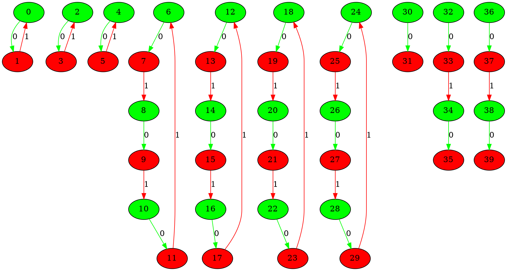
```graphviz
digraph G {
0[label="0" fillcolor="green" style="filled"];
1[label="1" fillcolor="red" style="filled"];
2[label="2" fillcolor="green" style="filled"];
3[label="3" fillcolor="red" style="filled"];
4[label="4" fillcolor="green" style="filled"];
5[label="5" fillcolor="red" style="filled"];
6[label="6" fillcolor="green" style="filled"];
7[label="7" fillcolor="red" style="filled"];
8[label="8" fillcolor="green" style="filled"];
9[label="9" fillcolor="red" style="filled"];
10[label="10" fillcolor="green" style="filled"];
11[label="11" fillcolor="red" style="filled"];
12[label="12" fillcolor="green" style="filled"];
13[label="13" fillcolor="red" style="filled"];
14[label="14" fillcolor="green" style="filled"];
15[label="15" fillcolor="red" style="filled"];
16[label="16" fillcolor="green" style="filled"];
17[label="17" fillcolor="red" style="filled"];
18[label="18" fillcolor="green" style="filled"];
19[label="19" fillcolor="red" style="filled"];
20[label="20" fillcolor="green" style="filled"];
21[label="21" fillcolor="red" style="filled"];
22[label="22" fillcolor="green" style="filled"];
23[label="23" fillcolor="red" style="filled"];
24[label="24" fillcolor="green" style="filled"];
25[label="25" fillcolor="red" style="filled"];
26[label="26" fillcolor="green" style="filled"];
27[label="27" fillcolor="red" style="filled"];
28[label="28" fillcolor="green" style="filled"];
29[label="29" fillcolor="red" style="filled"];
30[label="30" fillcolor="green" style="filled"];
31[label="31" fillcolor="red" style="filled"];
32[label="32" fillcolor="green" style="filled"];
33[label="33" fillcolor="red" style="filled"];
34[label="34" fillcolor="green" style="filled"];
35[label="35" fillcolor="red" style="filled"];
36[label="36" fillcolor="green" style="filled"];
37[label="37" fillcolor="red" style="filled"];
38[label="38" fillcolor="green" style="filled"];
39[label="39" fillcolor="red" style="filled"];
0->1 [label="0" color="green"];
1->0 [label="1" color="red"];
2->3 [label="0" color="green"];
3->2 [label="1" color="red"];
4->5 [label="0" color="green"];
5->4 [label="1" color="red"];
6->7 [label="0" color="green"];
7->8 [label="1" color="red"];
8->9 [label="0" color="green"];
9->10 [label="1" color="red"];
10->11 [label="0" color="green"];
11->6 [label="1" color="red"];
12->13 [label="0" color="green"];
13->14 [label="1" color="red"];
14->15 [label="0" color="green"];
15->16 [label="1" color="red"];
16->17 [label="0" color="green"];
17->12 [label="1" color="red"];
18->19 [label="0" color="green"];
19->20 [label="1" color="red"];
20->21 [label="0" color="green"];
21->22 [label="1" color="red"];
22->23 [label="0" color="green"];
23->18 [label="1" color="red"];
24->25 [label="0" color="green"];
25->26 [label="1" color="red"];
26->27 [label="0" color="green"];
27->28 [label="1" color="red"];
28->29 [label="0" color="green"];
29->24 [label="1" color="red"];
30->31 [label="0" color="green"];
32->33 [label="0" color="green"];
33->34 [label="1" color="red"];
34->35 [label="0" color="green"];
36->37 [label="0" color="green"];
37->38 [label="1" color="red"];
38->39 [label="0" color="green"];
}
```
___
## Graph 11315 - list de compréhension : 1,1,2|1,1,2,3,3,3,3
___
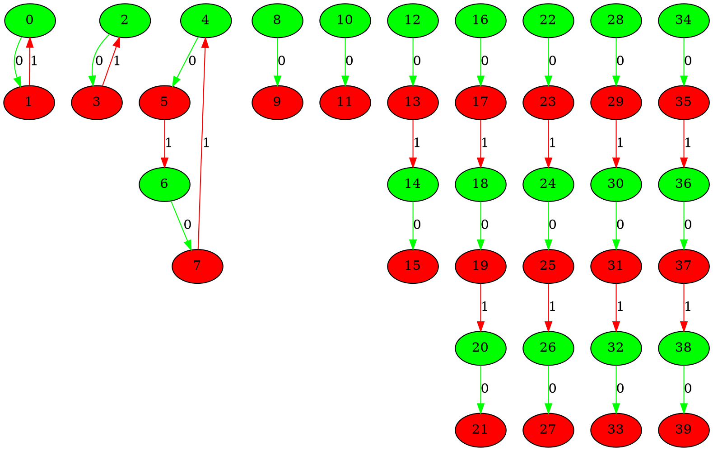
```graphviz
digraph G {
0[label="0" fillcolor="green" style="filled"];
1[label="1" fillcolor="red" style="filled"];
2[label="2" fillcolor="green" style="filled"];
3[label="3" fillcolor="red" style="filled"];
4[label="4" fillcolor="green" style="filled"];
5[label="5" fillcolor="red" style="filled"];
6[label="6" fillcolor="green" style="filled"];
7[label="7" fillcolor="red" style="filled"];
8[label="8" fillcolor="green" style="filled"];
9[label="9" fillcolor="red" style="filled"];
10[label="10" fillcolor="green" style="filled"];
11[label="11" fillcolor="red" style="filled"];
12[label="12" fillcolor="green" style="filled"];
13[label="13" fillcolor="red" style="filled"];
14[label="14" fillcolor="green" style="filled"];
15[label="15" fillcolor="red" style="filled"];
16[label="16" fillcolor="green" style="filled"];
17[label="17" fillcolor="red" style="filled"];
18[label="18" fillcolor="green" style="filled"];
19[label="19" fillcolor="red" style="filled"];
20[label="20" fillcolor="green" style="filled"];
21[label="21" fillcolor="red" style="filled"];
22[label="22" fillcolor="green" style="filled"];
23[label="23" fillcolor="red" style="filled"];
24[label="24" fillcolor="green" style="filled"];
25[label="25" fillcolor="red" style="filled"];
26[label="26" fillcolor="green" style="filled"];
27[label="27" fillcolor="red" style="filled"];
28[label="28" fillcolor="green" style="filled"];
29[label="29" fillcolor="red" style="filled"];
30[label="30" fillcolor="green" style="filled"];
31[label="31" fillcolor="red" style="filled"];
32[label="32" fillcolor="green" style="filled"];
33[label="33" fillcolor="red" style="filled"];
34[label="34" fillcolor="green" style="filled"];
35[label="35" fillcolor="red" style="filled"];
36[label="36" fillcolor="green" style="filled"];
37[label="37" fillcolor="red" style="filled"];
38[label="38" fillcolor="green" style="filled"];
39[label="39" fillcolor="red" style="filled"];
0->1 [label="0" color="green"];
1->0 [label="1" color="red"];
2->3 [label="0" color="green"];
3->2 [label="1" color="red"];
4->5 [label="0" color="green"];
5->6 [label="1" color="red"];
6->7 [label="0" color="green"];
7->4 [label="1" color="red"];
8->9 [label="0" color="green"];
10->11 [label="0" color="green"];
12->13 [label="0" color="green"];
13->14 [label="1" color="red"];
14->15 [label="0" color="green"];
16->17 [label="0" color="green"];
17->18 [label="1" color="red"];
18->19 [label="0" color="green"];
19->20 [label="1" color="red"];
20->21 [label="0" color="green"];
22->23 [label="0" color="green"];
23->24 [label="1" color="red"];
24->25 [label="0" color="green"];
25->26 [label="1" color="red"];
26->27 [label="0" color="green"];
28->29 [label="0" color="green"];
29->30 [label="1" color="red"];
30->31 [label="0" color="green"];
31->32 [label="1" color="red"];
32->33 [label="0" color="green"];
34->35 [label="0" color="green"];
35->36 [label="1" color="red"];
36->37 [label="0" color="green"];
37->38 [label="1" color="red"];
38->39 [label="0" color="green"];
}
```
___
## Graph 11316 - list de compréhension : 1,1,2,2|1,1,3,3,3,3
___
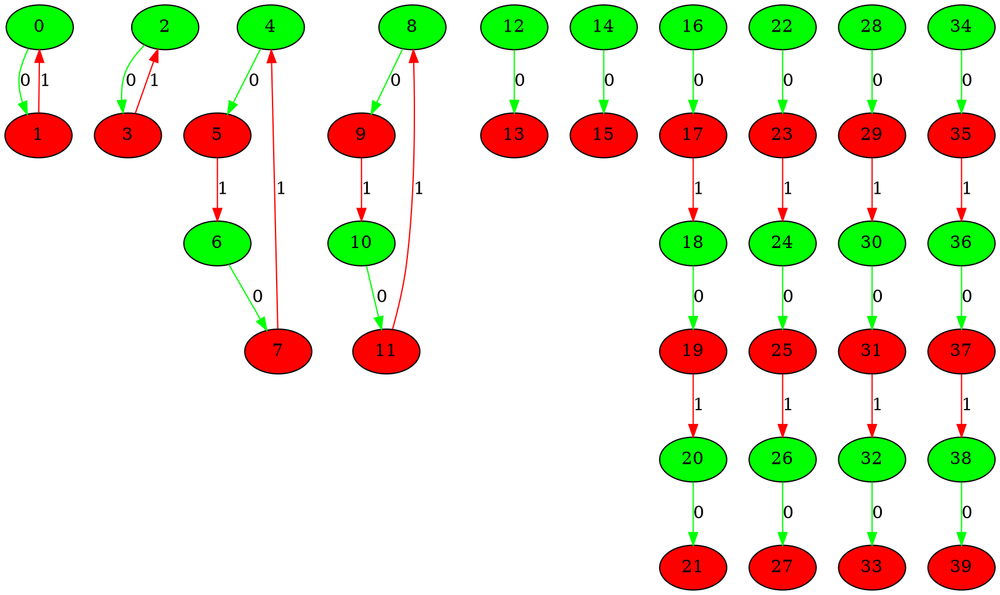
```graphviz
digraph G {
0[label="0" fillcolor="green" style="filled"];
1[label="1" fillcolor="red" style="filled"];
2[label="2" fillcolor="green" style="filled"];
3[label="3" fillcolor="red" style="filled"];
4[label="4" fillcolor="green" style="filled"];
5[label="5" fillcolor="red" style="filled"];
6[label="6" fillcolor="green" style="filled"];
7[label="7" fillcolor="red" style="filled"];
8[label="8" fillcolor="green" style="filled"];
9[label="9" fillcolor="red" style="filled"];
10[label="10" fillcolor="green" style="filled"];
11[label="11" fillcolor="red" style="filled"];
12[label="12" fillcolor="green" style="filled"];
13[label="13" fillcolor="red" style="filled"];
14[label="14" fillcolor="green" style="filled"];
15[label="15" fillcolor="red" style="filled"];
16[label="16" fillcolor="green" style="filled"];
17[label="17" fillcolor="red" style="filled"];
18[label="18" fillcolor="green" style="filled"];
19[label="19" fillcolor="red" style="filled"];
20[label="20" fillcolor="green" style="filled"];
21[label="21" fillcolor="red" style="filled"];
22[label="22" fillcolor="green" style="filled"];
23[label="23" fillcolor="red" style="filled"];
24[label="24" fillcolor="green" style="filled"];
25[label="25" fillcolor="red" style="filled"];
26[label="26" fillcolor="green" style="filled"];
27[label="27" fillcolor="red" style="filled"];
28[label="28" fillcolor="green" style="filled"];
29[label="29" fillcolor="red" style="filled"];
30[label="30" fillcolor="green" style="filled"];
31[label="31" fillcolor="red" style="filled"];
32[label="32" fillcolor="green" style="filled"];
33[label="33" fillcolor="red" style="filled"];
34[label="34" fillcolor="green" style="filled"];
35[label="35" fillcolor="red" style="filled"];
36[label="36" fillcolor="green" style="filled"];
37[label="37" fillcolor="red" style="filled"];
38[label="38" fillcolor="green" style="filled"];
39[label="39" fillcolor="red" style="filled"];
0->1 [label="0" color="green"];
1->0 [label="1" color="red"];
2->3 [label="0" color="green"];
3->2 [label="1" color="red"];
4->5 [label="0" color="green"];
5->6 [label="1" color="red"];
6->7 [label="0" color="green"];
7->4 [label="1" color="red"];
8->9 [label="0" color="green"];
9->10 [label="1" color="red"];
10->11 [label="0" color="green"];
11->8 [label="1" color="red"];
12->13 [label="0" color="green"];
14->15 [label="0" color="green"];
16->17 [label="0" color="green"];
17->18 [label="1" color="red"];
18->19 [label="0" color="green"];
19->20 [label="1" color="red"];
20->21 [label="0" color="green"];
22->23 [label="0" color="green"];
23->24 [label="1" color="red"];
24->25 [label="0" color="green"];
25->26 [label="1" color="red"];
26->27 [label="0" color="green"];
28->29 [label="0" color="green"];
29->30 [label="1" color="red"];
30->31 [label="0" color="green"];
31->32 [label="1" color="red"];
32->33 [label="0" color="green"];
34->35 [label="0" color="green"];
35->36 [label="1" color="red"];
36->37 [label="0" color="green"];
37->38 [label="1" color="red"];
38->39 [label="0" color="green"];
}
```
___
## Graph 11317 - list de compréhension : 1,1,2,2,3|1,1,3,3,3
___
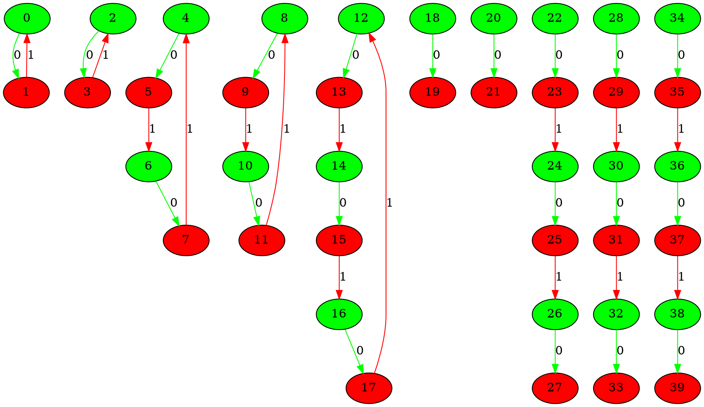
```graphviz
digraph G {
0[label="0" fillcolor="green" style="filled"];
1[label="1" fillcolor="red" style="filled"];
2[label="2" fillcolor="green" style="filled"];
3[label="3" fillcolor="red" style="filled"];
4[label="4" fillcolor="green" style="filled"];
5[label="5" fillcolor="red" style="filled"];
6[label="6" fillcolor="green" style="filled"];
7[label="7" fillcolor="red" style="filled"];
8[label="8" fillcolor="green" style="filled"];
9[label="9" fillcolor="red" style="filled"];
10[label="10" fillcolor="green" style="filled"];
11[label="11" fillcolor="red" style="filled"];
12[label="12" fillcolor="green" style="filled"];
13[label="13" fillcolor="red" style="filled"];
14[label="14" fillcolor="green" style="filled"];
15[label="15" fillcolor="red" style="filled"];
16[label="16" fillcolor="green" style="filled"];
17[label="17" fillcolor="red" style="filled"];
18[label="18" fillcolor="green" style="filled"];
19[label="19" fillcolor="red" style="filled"];
20[label="20" fillcolor="green" style="filled"];
21[label="21" fillcolor="red" style="filled"];
22[label="22" fillcolor="green" style="filled"];
23[label="23" fillcolor="red" style="filled"];
24[label="24" fillcolor="green" style="filled"];
25[label="25" fillcolor="red" style="filled"];
26[label="26" fillcolor="green" style="filled"];
27[label="27" fillcolor="red" style="filled"];
28[label="28" fillcolor="green" style="filled"];
29[label="29" fillcolor="red" style="filled"];
30[label="30" fillcolor="green" style="filled"];
31[label="31" fillcolor="red" style="filled"];
32[label="32" fillcolor="green" style="filled"];
33[label="33" fillcolor="red" style="filled"];
34[label="34" fillcolor="green" style="filled"];
35[label="35" fillcolor="red" style="filled"];
36[label="36" fillcolor="green" style="filled"];
37[label="37" fillcolor="red" style="filled"];
38[label="38" fillcolor="green" style="filled"];
39[label="39" fillcolor="red" style="filled"];
0->1 [label="0" color="green"];
1->0 [label="1" color="red"];
2->3 [label="0" color="green"];
3->2 [label="1" color="red"];
4->5 [label="0" color="green"];
5->6 [label="1" color="red"];
6->7 [label="0" color="green"];
7->4 [label="1" color="red"];
8->9 [label="0" color="green"];
9->10 [label="1" color="red"];
10->11 [label="0" color="green"];
11->8 [label="1" color="red"];
12->13 [label="0" color="green"];
13->14 [label="1" color="red"];
14->15 [label="0" color="green"];
15->16 [label="1" color="red"];
16->17 [label="0" color="green"];
17->12 [label="1" color="red"];
18->19 [label="0" color="green"];
20->21 [label="0" color="green"];
22->23 [label="0" color="green"];
23->24 [label="1" color="red"];
24->25 [label="0" color="green"];
25->26 [label="1" color="red"];
26->27 [label="0" color="green"];
28->29 [label="0" color="green"];
29->30 [label="1" color="red"];
30->31 [label="0" color="green"];
31->32 [label="1" color="red"];
32->33 [label="0" color="green"];
34->35 [label="0" color="green"];
35->36 [label="1" color="red"];
36->37 [label="0" color="green"];
37->38 [label="1" color="red"];
38->39 [label="0" color="green"];
}
```
___
## Graph 11318 - list de compréhension : 1,1,2,2,3,3|1,1,3,3
___
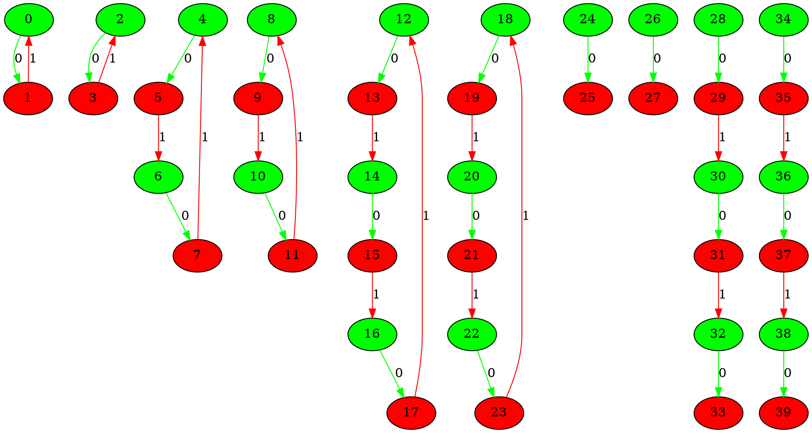
```graphviz
digraph G {
0[label="0" fillcolor="green" style="filled"];
1[label="1" fillcolor="red" style="filled"];
2[label="2" fillcolor="green" style="filled"];
3[label="3" fillcolor="red" style="filled"];
4[label="4" fillcolor="green" style="filled"];
5[label="5" fillcolor="red" style="filled"];
6[label="6" fillcolor="green" style="filled"];
7[label="7" fillcolor="red" style="filled"];
8[label="8" fillcolor="green" style="filled"];
9[label="9" fillcolor="red" style="filled"];
10[label="10" fillcolor="green" style="filled"];
11[label="11" fillcolor="red" style="filled"];
12[label="12" fillcolor="green" style="filled"];
13[label="13" fillcolor="red" style="filled"];
14[label="14" fillcolor="green" style="filled"];
15[label="15" fillcolor="red" style="filled"];
16[label="16" fillcolor="green" style="filled"];
17[label="17" fillcolor="red" style="filled"];
18[label="18" fillcolor="green" style="filled"];
19[label="19" fillcolor="red" style="filled"];
20[label="20" fillcolor="green" style="filled"];
21[label="21" fillcolor="red" style="filled"];
22[label="22" fillcolor="green" style="filled"];
23[label="23" fillcolor="red" style="filled"];
24[label="24" fillcolor="green" style="filled"];
25[label="25" fillcolor="red" style="filled"];
26[label="26" fillcolor="green" style="filled"];
27[label="27" fillcolor="red" style="filled"];
28[label="28" fillcolor="green" style="filled"];
29[label="29" fillcolor="red" style="filled"];
30[label="30" fillcolor="green" style="filled"];
31[label="31" fillcolor="red" style="filled"];
32[label="32" fillcolor="green" style="filled"];
33[label="33" fillcolor="red" style="filled"];
34[label="34" fillcolor="green" style="filled"];
35[label="35" fillcolor="red" style="filled"];
36[label="36" fillcolor="green" style="filled"];
37[label="37" fillcolor="red" style="filled"];
38[label="38" fillcolor="green" style="filled"];
39[label="39" fillcolor="red" style="filled"];
0->1 [label="0" color="green"];
1->0 [label="1" color="red"];
2->3 [label="0" color="green"];
3->2 [label="1" color="red"];
4->5 [label="0" color="green"];
5->6 [label="1" color="red"];
6->7 [label="0" color="green"];
7->4 [label="1" color="red"];
8->9 [label="0" color="green"];
9->10 [label="1" color="red"];
10->11 [label="0" color="green"];
11->8 [label="1" color="red"];
12->13 [label="0" color="green"];
13->14 [label="1" color="red"];
14->15 [label="0" color="green"];
15->16 [label="1" color="red"];
16->17 [label="0" color="green"];
17->12 [label="1" color="red"];
18->19 [label="0" color="green"];
19->20 [label="1" color="red"];
20->21 [label="0" color="green"];
21->22 [label="1" color="red"];
22->23 [label="0" color="green"];
23->18 [label="1" color="red"];
24->25 [label="0" color="green"];
26->27 [label="0" color="green"];
28->29 [label="0" color="green"];
29->30 [label="1" color="red"];
30->31 [label="0" color="green"];
31->32 [label="1" color="red"];
32->33 [label="0" color="green"];
34->35 [label="0" color="green"];
35->36 [label="1" color="red"];
36->37 [label="0" color="green"];
37->38 [label="1" color="red"];
38->39 [label="0" color="green"];
}
```
___
## Graph 11319 - list de compréhension : 1,1,2,2,3,3,3|1,1,3
___
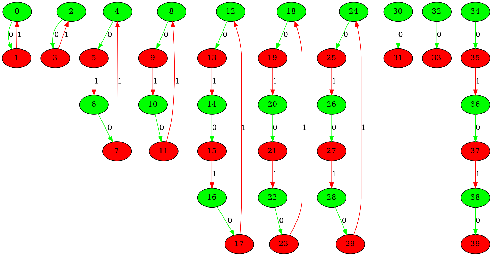
```graphviz
digraph G {
0[label="0" fillcolor="green" style="filled"];
1[label="1" fillcolor="red" style="filled"];
2[label="2" fillcolor="green" style="filled"];
3[label="3" fillcolor="red" style="filled"];
4[label="4" fillcolor="green" style="filled"];
5[label="5" fillcolor="red" style="filled"];
6[label="6" fillcolor="green" style="filled"];
7[label="7" fillcolor="red" style="filled"];
8[label="8" fillcolor="green" style="filled"];
9[label="9" fillcolor="red" style="filled"];
10[label="10" fillcolor="green" style="filled"];
11[label="11" fillcolor="red" style="filled"];
12[label="12" fillcolor="green" style="filled"];
13[label="13" fillcolor="red" style="filled"];
14[label="14" fillcolor="green" style="filled"];
15[label="15" fillcolor="red" style="filled"];
16[label="16" fillcolor="green" style="filled"];
17[label="17" fillcolor="red" style="filled"];
18[label="18" fillcolor="green" style="filled"];
19[label="19" fillcolor="red" style="filled"];
20[label="20" fillcolor="green" style="filled"];
21[label="21" fillcolor="red" style="filled"];
22[label="22" fillcolor="green" style="filled"];
23[label="23" fillcolor="red" style="filled"];
24[label="24" fillcolor="green" style="filled"];
25[label="25" fillcolor="red" style="filled"];
26[label="26" fillcolor="green" style="filled"];
27[label="27" fillcolor="red" style="filled"];
28[label="28" fillcolor="green" style="filled"];
29[label="29" fillcolor="red" style="filled"];
30[label="30" fillcolor="green" style="filled"];
31[label="31" fillcolor="red" style="filled"];
32[label="32" fillcolor="green" style="filled"];
33[label="33" fillcolor="red" style="filled"];
34[label="34" fillcolor="green" style="filled"];
35[label="35" fillcolor="red" style="filled"];
36[label="36" fillcolor="green" style="filled"];
37[label="37" fillcolor="red" style="filled"];
38[label="38" fillcolor="green" style="filled"];
39[label="39" fillcolor="red" style="filled"];
0->1 [label="0" color="green"];
1->0 [label="1" color="red"];
2->3 [label="0" color="green"];
3->2 [label="1" color="red"];
4->5 [label="0" color="green"];
5->6 [label="1" color="red"];
6->7 [label="0" color="green"];
7->4 [label="1" color="red"];
8->9 [label="0" color="green"];
9->10 [label="1" color="red"];
10->11 [label="0" color="green"];
11->8 [label="1" color="red"];
12->13 [label="0" color="green"];
13->14 [label="1" color="red"];
14->15 [label="0" color="green"];
15->16 [label="1" color="red"];
16->17 [label="0" color="green"];
17->12 [label="1" color="red"];
18->19 [label="0" color="green"];
19->20 [label="1" color="red"];
20->21 [label="0" color="green"];
21->22 [label="1" color="red"];
22->23 [label="0" color="green"];
23->18 [label="1" color="red"];
24->25 [label="0" color="green"];
25->26 [label="1" color="red"];
26->27 [label="0" color="green"];
27->28 [label="1" color="red"];
28->29 [label="0" color="green"];
29->24 [label="1" color="red"];
30->31 [label="0" color="green"];
32->33 [label="0" color="green"];
34->35 [label="0" color="green"];
35->36 [label="1" color="red"];
36->37 [label="0" color="green"];
37->38 [label="1" color="red"];
38->39 [label="0" color="green"];
}
```
___
## Graph 11320 - list de compréhension : 1,1,2,2,3,3,3,3|1,1
___
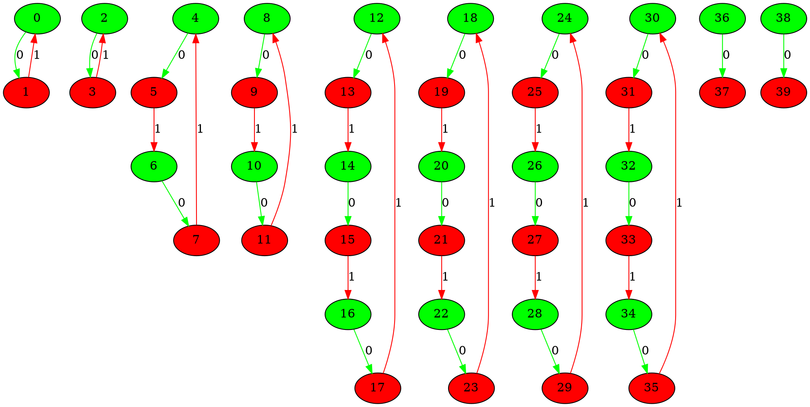
```graphviz
digraph G {
0[label="0" fillcolor="green" style="filled"];
1[label="1" fillcolor="red" style="filled"];
2[label="2" fillcolor="green" style="filled"];
3[label="3" fillcolor="red" style="filled"];
4[label="4" fillcolor="green" style="filled"];
5[label="5" fillcolor="red" style="filled"];
6[label="6" fillcolor="green" style="filled"];
7[label="7" fillcolor="red" style="filled"];
8[label="8" fillcolor="green" style="filled"];
9[label="9" fillcolor="red" style="filled"];
10[label="10" fillcolor="green" style="filled"];
11[label="11" fillcolor="red" style="filled"];
12[label="12" fillcolor="green" style="filled"];
13[label="13" fillcolor="red" style="filled"];
14[label="14" fillcolor="green" style="filled"];
15[label="15" fillcolor="red" style="filled"];
16[label="16" fillcolor="green" style="filled"];
17[label="17" fillcolor="red" style="filled"];
18[label="18" fillcolor="green" style="filled"];
19[label="19" fillcolor="red" style="filled"];
20[label="20" fillcolor="green" style="filled"];
21[label="21" fillcolor="red" style="filled"];
22[label="22" fillcolor="green" style="filled"];
23[label="23" fillcolor="red" style="filled"];
24[label="24" fillcolor="green" style="filled"];
25[label="25" fillcolor="red" style="filled"];
26[label="26" fillcolor="green" style="filled"];
27[label="27" fillcolor="red" style="filled"];
28[label="28" fillcolor="green" style="filled"];
29[label="29" fillcolor="red" style="filled"];
30[label="30" fillcolor="green" style="filled"];
31[label="31" fillcolor="red" style="filled"];
32[label="32" fillcolor="green" style="filled"];
33[label="33" fillcolor="red" style="filled"];
34[label="34" fillcolor="green" style="filled"];
35[label="35" fillcolor="red" style="filled"];
36[label="36" fillcolor="green" style="filled"];
37[label="37" fillcolor="red" style="filled"];
38[label="38" fillcolor="green" style="filled"];
39[label="39" fillcolor="red" style="filled"];
0->1 [label="0" color="green"];
1->0 [label="1" color="red"];
2->3 [label="0" color="green"];
3->2 [label="1" color="red"];
4->5 [label="0" color="green"];
5->6 [label="1" color="red"];
6->7 [label="0" color="green"];
7->4 [label="1" color="red"];
8->9 [label="0" color="green"];
9->10 [label="1" color="red"];
10->11 [label="0" color="green"];
11->8 [label="1" color="red"];
12->13 [label="0" color="green"];
13->14 [label="1" color="red"];
14->15 [label="0" color="green"];
15->16 [label="1" color="red"];
16->17 [label="0" color="green"];
17->12 [label="1" color="red"];
18->19 [label="0" color="green"];
19->20 [label="1" color="red"];
20->21 [label="0" color="green"];
21->22 [label="1" color="red"];
22->23 [label="0" color="green"];
23->18 [label="1" color="red"];
24->25 [label="0" color="green"];
25->26 [label="1" color="red"];
26->27 [label="0" color="green"];
27->28 [label="1" color="red"];
28->29 [label="0" color="green"];
29->24 [label="1" color="red"];
30->31 [label="0" color="green"];
31->32 [label="1" color="red"];
32->33 [label="0" color="green"];
33->34 [label="1" color="red"];
34->35 [label="0" color="green"];
35->30 [label="1" color="red"];
36->37 [label="0" color="green"];
38->39 [label="0" color="green"];
}
```
___
## Graph 11321 - list de compréhension : 1,1,2,3|1,1,2,3,3,3
___
```graphviz
digraph G {
0[label="0" fillcolor="green" style="filled"];
1[label="1" fillcolor="red" style="filled"];
2[label="2" fillcolor="green" style="filled"];
3[label="3" fillcolor="red" style="filled"];
4[label="4" fillcolor="green" style="filled"];
5[label="5" fillcolor="red" style="filled"];
6[label="6" fillcolor="green" style="filled"];
7[label="7" fillcolor="red" style="filled"];
8[label="8" fillcolor="green" style="filled"];
9[label="9" fillcolor="red" style="filled"];
10[label="10" fillcolor="green" style="filled"];
11[label="11" fillcolor="red" style="filled"];
12[label="12" fillcolor="green" style="filled"];
13[label="13" fillcolor="red" style="filled"];
14[label="14" fillcolor="green" style="filled"];
15[label="15" fillcolor="red" style="filled"];
16[label="16" fillcolor="green" style="filled"];
17[label="17" fillcolor="red" style="filled"];
18[label="18" fillcolor="green" style="filled"];
19[label="19" fillcolor="red" style="filled"];
20[label="20" fillcolor="green" style="filled"];
21[label="21" fillcolor="red" style="filled"];
22[label="22" fillcolor="green" style="filled"];
23[label="23" fillcolor="red" style="filled"];
24[label="24" fillcolor="green" style="filled"];
25[label="25" fillcolor="red" style="filled"];
26[label="26" fillcolor="green" style="filled"];
27[label="27" fillcolor="red" style="filled"];
28[label="28" fillcolor="green" style="filled"];
29[label="29" fillcolor="red" style="filled"];
30[label="30" fillcolor="green" style="filled"];
31[label="31" fillcolor="red" style="filled"];
32[label="32" fillcolor="green" style="filled"];
33[label="33" fillcolor="red" style="filled"];
34[label="34" fillcolor="green" style="filled"];
35[label="35" fillcolor="red" style="filled"];
36[label="36" fillcolor="green" style="filled"];
37[label="37" fillcolor="red" style="filled"];
38[label="38" fillcolor="green" style="filled"];
39[label="39" fillcolor="red" style="filled"];
0->1 [label="0" color="green"];
1->0 [label="1" color="red"];
2->3 [label="0" color="green"];
3->2 [label="1" color="red"];
4->5 [label="0" color="green"];
5->6 [label="1" color="red"];
6->7 [label="0" color="green"];
7->4 [label="1" color="red"];
8->9 [label="0" color="green"];
9->10 [label="1" color="red"];
10->11 [label="0" color="green"];
11->12 [label="1" color="red"];
12->13 [label="0" color="green"];
13->8 [label="1" color="red"];
14->15 [label="0" color="green"];
16->17 [label="0" color="green"];
18->19 [label="0" color="green"];
19->20 [label="1" color="red"];
20->21 [label="0" color="green"];
22->23 [label="0" color="green"];
23->24 [label="1" color="red"];
24->25 [label="0" color="green"];
25->26 [label="1" color="red"];
26->27 [label="0" color="green"];
28->29 [label="0" color="green"];
29->30 [label="1" color="red"];
30->31 [label="0" color="green"];
31->32 [label="1" color="red"];
32->33 [label="0" color="green"];
34->35 [label="0" color="green"];
35->36 [label="1" color="red"];
36->37 [label="0" color="green"];
37->38 [label="1" color="red"];
38->39 [label="0" color="green"];
}
```
___
## Graph 11322 - list de compréhension : 1,1,2,3,3|1,1,2,3,3
___
```graphviz
digraph G {
0[label="0" fillcolor="green" style="filled"];
1[label="1" fillcolor="red" style="filled"];
2[label="2" fillcolor="green" style="filled"];
3[label="3" fillcolor="red" style="filled"];
4[label="4" fillcolor="green" style="filled"];
5[label="5" fillcolor="red" style="filled"];
6[label="6" fillcolor="green" style="filled"];
7[label="7" fillcolor="red" style="filled"];
8[label="8" fillcolor="green" style="filled"];
9[label="9" fillcolor="red" style="filled"];
10[label="10" fillcolor="green" style="filled"];
11[label="11" fillcolor="red" style="filled"];
12[label="12" fillcolor="green" style="filled"];
13[label="13" fillcolor="red" style="filled"];
14[label="14" fillcolor="green" style="filled"];
15[label="15" fillcolor="red" style="filled"];
16[label="16" fillcolor="green" style="filled"];
17[label="17" fillcolor="red" style="filled"];
18[label="18" fillcolor="green" style="filled"];
19[label="19" fillcolor="red" style="filled"];
20[label="20" fillcolor="green" style="filled"];
21[label="21" fillcolor="red" style="filled"];
22[label="22" fillcolor="green" style="filled"];
23[label="23" fillcolor="red" style="filled"];
24[label="24" fillcolor="green" style="filled"];
25[label="25" fillcolor="red" style="filled"];
26[label="26" fillcolor="green" style="filled"];
27[label="27" fillcolor="red" style="filled"];
28[label="28" fillcolor="green" style="filled"];
29[label="29" fillcolor="red" style="filled"];
30[label="30" fillcolor="green" style="filled"];
31[label="31" fillcolor="red" style="filled"];
32[label="32" fillcolor="green" style="filled"];
33[label="33" fillcolor="red" style="filled"];
34[label="34" fillcolor="green" style="filled"];
35[label="35" fillcolor="red" style="filled"];
36[label="36" fillcolor="green" style="filled"];
37[label="37" fillcolor="red" style="filled"];
38[label="38" fillcolor="green" style="filled"];
39[label="39" fillcolor="red" style="filled"];
0->1 [label="0" color="green"];
1->0 [label="1" color="red"];
2->3 [label="0" color="green"];
3->2 [label="1" color="red"];
4->5 [label="0" color="green"];
5->6 [label="1" color="red"];
6->7 [label="0" color="green"];
7->4 [label="1" color="red"];
8->9 [label="0" color="green"];
9->10 [label="1" color="red"];
10->11 [label="0" color="green"];
11->12 [label="1" color="red"];
12->13 [label="0" color="green"];
13->8 [label="1" color="red"];
14->15 [label="0" color="green"];
15->16 [label="1" color="red"];
16->17 [label="0" color="green"];
17->18 [label="1" color="red"];
18->19 [label="0" color="green"];
19->14 [label="1" color="red"];
20->21 [label="0" color="green"];
22->23 [label="0" color="green"];
24->25 [label="0" color="green"];
25->26 [label="1" color="red"];
26->27 [label="0" color="green"];
28->29 [label="0" color="green"];
29->30 [label="1" color="red"];
30->31 [label="0" color="green"];
31->32 [label="1" color="red"];
32->33 [label="0" color="green"];
34->35 [label="0" color="green"];
35->36 [label="1" color="red"];
36->37 [label="0" color="green"];
37->38 [label="1" color="red"];
38->39 [label="0" color="green"];
}
```
___
## Graph 11323 - list de compréhension : 1,1,2,3,3,3|1,1,2,3
___
```graphviz
digraph G {
0[label="0" fillcolor="green" style="filled"];
1[label="1" fillcolor="red" style="filled"];
2[label="2" fillcolor="green" style="filled"];
3[label="3" fillcolor="red" style="filled"];
4[label="4" fillcolor="green" style="filled"];
5[label="5" fillcolor="red" style="filled"];
6[label="6" fillcolor="green" style="filled"];
7[label="7" fillcolor="red" style="filled"];
8[label="8" fillcolor="green" style="filled"];
9[label="9" fillcolor="red" style="filled"];
10[label="10" fillcolor="green" style="filled"];
11[label="11" fillcolor="red" style="filled"];
12[label="12" fillcolor="green" style="filled"];
13[label="13" fillcolor="red" style="filled"];
14[label="14" fillcolor="green" style="filled"];
15[label="15" fillcolor="red" style="filled"];
16[label="16" fillcolor="green" style="filled"];
17[label="17" fillcolor="red" style="filled"];
18[label="18" fillcolor="green" style="filled"];
19[label="19" fillcolor="red" style="filled"];
20[label="20" fillcolor="green" style="filled"];
21[label="21" fillcolor="red" style="filled"];
22[label="22" fillcolor="green" style="filled"];
23[label="23" fillcolor="red" style="filled"];
24[label="24" fillcolor="green" style="filled"];
25[label="25" fillcolor="red" style="filled"];
26[label="26" fillcolor="green" style="filled"];
27[label="27" fillcolor="red" style="filled"];
28[label="28" fillcolor="green" style="filled"];
29[label="29" fillcolor="red" style="filled"];
30[label="30" fillcolor="green" style="filled"];
31[label="31" fillcolor="red" style="filled"];
32[label="32" fillcolor="green" style="filled"];
33[label="33" fillcolor="red" style="filled"];
34[label="34" fillcolor="green" style="filled"];
35[label="35" fillcolor="red" style="filled"];
36[label="36" fillcolor="green" style="filled"];
37[label="37" fillcolor="red" style="filled"];
38[label="38" fillcolor="green" style="filled"];
39[label="39" fillcolor="red" style="filled"];
0->1 [label="0" color="green"];
1->0 [label="1" color="red"];
2->3 [label="0" color="green"];
3->2 [label="1" color="red"];
4->5 [label="0" color="green"];
5->6 [label="1" color="red"];
6->7 [label="0" color="green"];
7->4 [label="1" color="red"];
8->9 [label="0" color="green"];
9->10 [label="1" color="red"];
10->11 [label="0" color="green"];
11->12 [label="1" color="red"];
12->13 [label="0" color="green"];
13->8 [label="1" color="red"];
14->15 [label="0" color="green"];
15->16 [label="1" color="red"];
16->17 [label="0" color="green"];
17->18 [label="1" color="red"];
18->19 [label="0" color="green"];
19->14 [label="1" color="red"];
20->21 [label="0" color="green"];
21->22 [label="1" color="red"];
22->23 [label="0" color="green"];
23->24 [label="1" color="red"];
24->25 [label="0" color="green"];
25->20 [label="1" color="red"];
26->27 [label="0" color="green"];
28->29 [label="0" color="green"];
30->31 [label="0" color="green"];
31->32 [label="1" color="red"];
32->33 [label="0" color="green"];
34->35 [label="0" color="green"];
35->36 [label="1" color="red"];
36->37 [label="0" color="green"];
37->38 [label="1" color="red"];
38->39 [label="0" color="green"];
}
```
___
## Graph 11324 - list de compréhension : 1,1,2,3,3,3,3|1,1,2
___
```graphviz
digraph G {
0[label="0" fillcolor="green" style="filled"];
1[label="1" fillcolor="red" style="filled"];
2[label="2" fillcolor="green" style="filled"];
3[label="3" fillcolor="red" style="filled"];
4[label="4" fillcolor="green" style="filled"];
5[label="5" fillcolor="red" style="filled"];
6[label="6" fillcolor="green" style="filled"];
7[label="7" fillcolor="red" style="filled"];
8[label="8" fillcolor="green" style="filled"];
9[label="9" fillcolor="red" style="filled"];
10[label="10" fillcolor="green" style="filled"];
11[label="11" fillcolor="red" style="filled"];
12[label="12" fillcolor="green" style="filled"];
13[label="13" fillcolor="red" style="filled"];
14[label="14" fillcolor="green" style="filled"];
15[label="15" fillcolor="red" style="filled"];
16[label="16" fillcolor="green" style="filled"];
17[label="17" fillcolor="red" style="filled"];
18[label="18" fillcolor="green" style="filled"];
19[label="19" fillcolor="red" style="filled"];
20[label="20" fillcolor="green" style="filled"];
21[label="21" fillcolor="red" style="filled"];
22[label="22" fillcolor="green" style="filled"];
23[label="23" fillcolor="red" style="filled"];
24[label="24" fillcolor="green" style="filled"];
25[label="25" fillcolor="red" style="filled"];
26[label="26" fillcolor="green" style="filled"];
27[label="27" fillcolor="red" style="filled"];
28[label="28" fillcolor="green" style="filled"];
29[label="29" fillcolor="red" style="filled"];
30[label="30" fillcolor="green" style="filled"];
31[label="31" fillcolor="red" style="filled"];
32[label="32" fillcolor="green" style="filled"];
33[label="33" fillcolor="red" style="filled"];
34[label="34" fillcolor="green" style="filled"];
35[label="35" fillcolor="red" style="filled"];
36[label="36" fillcolor="green" style="filled"];
37[label="37" fillcolor="red" style="filled"];
38[label="38" fillcolor="green" style="filled"];
39[label="39" fillcolor="red" style="filled"];
0->1 [label="0" color="green"];
1->0 [label="1" color="red"];
2->3 [label="0" color="green"];
3->2 [label="1" color="red"];
4->5 [label="0" color="green"];
5->6 [label="1" color="red"];
6->7 [label="0" color="green"];
7->4 [label="1" color="red"];
8->9 [label="0" color="green"];
9->10 [label="1" color="red"];
10->11 [label="0" color="green"];
11->12 [label="1" color="red"];
12->13 [label="0" color="green"];
13->8 [label="1" color="red"];
14->15 [label="0" color="green"];
15->16 [label="1" color="red"];
16->17 [label="0" color="green"];
17->18 [label="1" color="red"];
18->19 [label="0" color="green"];
19->14 [label="1" color="red"];
20->21 [label="0" color="green"];
21->22 [label="1" color="red"];
22->23 [label="0" color="green"];
23->24 [label="1" color="red"];
24->25 [label="0" color="green"];
25->20 [label="1" color="red"];
26->27 [label="0" color="green"];
27->28 [label="1" color="red"];
28->29 [label="0" color="green"];
29->30 [label="1" color="red"];
30->31 [label="0" color="green"];
31->26 [label="1" color="red"];
32->33 [label="0" color="green"];
34->35 [label="0" color="green"];
36->37 [label="0" color="green"];
37->38 [label="1" color="red"];
38->39 [label="0" color="green"];
}
```
___
## Graph 11325 - list de compréhension : 1,1,3|1,1,2,2,3,3,3
___
```graphviz
digraph G {
0[label="0" fillcolor="green" style="filled"];
1[label="1" fillcolor="red" style="filled"];
2[label="2" fillcolor="green" style="filled"];
3[label="3" fillcolor="red" style="filled"];
4[label="4" fillcolor="green" style="filled"];
5[label="5" fillcolor="red" style="filled"];
6[label="6" fillcolor="green" style="filled"];
7[label="7" fillcolor="red" style="filled"];
8[label="8" fillcolor="green" style="filled"];
9[label="9" fillcolor="red" style="filled"];
10[label="10" fillcolor="green" style="filled"];
11[label="11" fillcolor="red" style="filled"];
12[label="12" fillcolor="green" style="filled"];
13[label="13" fillcolor="red" style="filled"];
14[label="14" fillcolor="green" style="filled"];
15[label="15" fillcolor="red" style="filled"];
16[label="16" fillcolor="green" style="filled"];
17[label="17" fillcolor="red" style="filled"];
18[label="18" fillcolor="green" style="filled"];
19[label="19" fillcolor="red" style="filled"];
20[label="20" fillcolor="green" style="filled"];
21[label="21" fillcolor="red" style="filled"];
22[label="22" fillcolor="green" style="filled"];
23[label="23" fillcolor="red" style="filled"];
24[label="24" fillcolor="green" style="filled"];
25[label="25" fillcolor="red" style="filled"];
26[label="26" fillcolor="green" style="filled"];
27[label="27" fillcolor="red" style="filled"];
28[label="28" fillcolor="green" style="filled"];
29[label="29" fillcolor="red" style="filled"];
30[label="30" fillcolor="green" style="filled"];
31[label="31" fillcolor="red" style="filled"];
32[label="32" fillcolor="green" style="filled"];
33[label="33" fillcolor="red" style="filled"];
34[label="34" fillcolor="green" style="filled"];
35[label="35" fillcolor="red" style="filled"];
36[label="36" fillcolor="green" style="filled"];
37[label="37" fillcolor="red" style="filled"];
38[label="38" fillcolor="green" style="filled"];
39[label="39" fillcolor="red" style="filled"];
0->1 [label="0" color="green"];
1->0 [label="1" color="red"];
2->3 [label="0" color="green"];
3->2 [label="1" color="red"];
4->5 [label="0" color="green"];
5->6 [label="1" color="red"];
6->7 [label="0" color="green"];
7->8 [label="1" color="red"];
8->9 [label="0" color="green"];
9->4 [label="1" color="red"];
10->11 [label="0" color="green"];
12->13 [label="0" color="green"];
14->15 [label="0" color="green"];
15->16 [label="1" color="red"];
16->17 [label="0" color="green"];
18->19 [label="0" color="green"];
19->20 [label="1" color="red"];
20->21 [label="0" color="green"];
22->23 [label="0" color="green"];
23->24 [label="1" color="red"];
24->25 [label="0" color="green"];
25->26 [label="1" color="red"];
26->27 [label="0" color="green"];
28->29 [label="0" color="green"];
29->30 [label="1" color="red"];
30->31 [label="0" color="green"];
31->32 [label="1" color="red"];
32->33 [label="0" color="green"];
34->35 [label="0" color="green"];
35->36 [label="1" color="red"];
36->37 [label="0" color="green"];
37->38 [label="1" color="red"];
38->39 [label="0" color="green"];
}
```
___
## Graph 11326 - list de compréhension : 1,1,3,3|1,1,2,2,3,3
___
```graphviz
digraph G {
0[label="0" fillcolor="green" style="filled"];
1[label="1" fillcolor="red" style="filled"];
2[label="2" fillcolor="green" style="filled"];
3[label="3" fillcolor="red" style="filled"];
4[label="4" fillcolor="green" style="filled"];
5[label="5" fillcolor="red" style="filled"];
6[label="6" fillcolor="green" style="filled"];
7[label="7" fillcolor="red" style="filled"];
8[label="8" fillcolor="green" style="filled"];
9[label="9" fillcolor="red" style="filled"];
10[label="10" fillcolor="green" style="filled"];
11[label="11" fillcolor="red" style="filled"];
12[label="12" fillcolor="green" style="filled"];
13[label="13" fillcolor="red" style="filled"];
14[label="14" fillcolor="green" style="filled"];
15[label="15" fillcolor="red" style="filled"];
16[label="16" fillcolor="green" style="filled"];
17[label="17" fillcolor="red" style="filled"];
18[label="18" fillcolor="green" style="filled"];
19[label="19" fillcolor="red" style="filled"];
20[label="20" fillcolor="green" style="filled"];
21[label="21" fillcolor="red" style="filled"];
22[label="22" fillcolor="green" style="filled"];
23[label="23" fillcolor="red" style="filled"];
24[label="24" fillcolor="green" style="filled"];
25[label="25" fillcolor="red" style="filled"];
26[label="26" fillcolor="green" style="filled"];
27[label="27" fillcolor="red" style="filled"];
28[label="28" fillcolor="green" style="filled"];
29[label="29" fillcolor="red" style="filled"];
30[label="30" fillcolor="green" style="filled"];
31[label="31" fillcolor="red" style="filled"];
32[label="32" fillcolor="green" style="filled"];
33[label="33" fillcolor="red" style="filled"];
34[label="34" fillcolor="green" style="filled"];
35[label="35" fillcolor="red" style="filled"];
36[label="36" fillcolor="green" style="filled"];
37[label="37" fillcolor="red" style="filled"];
38[label="38" fillcolor="green" style="filled"];
39[label="39" fillcolor="red" style="filled"];
0->1 [label="0" color="green"];
1->0 [label="1" color="red"];
2->3 [label="0" color="green"];
3->2 [label="1" color="red"];
4->5 [label="0" color="green"];
5->6 [label="1" color="red"];
6->7 [label="0" color="green"];
7->8 [label="1" color="red"];
8->9 [label="0" color="green"];
9->4 [label="1" color="red"];
10->11 [label="0" color="green"];
11->12 [label="1" color="red"];
12->13 [label="0" color="green"];
13->14 [label="1" color="red"];
14->15 [label="0" color="green"];
15->10 [label="1" color="red"];
16->17 [label="0" color="green"];
18->19 [label="0" color="green"];
20->21 [label="0" color="green"];
21->22 [label="1" color="red"];
22->23 [label="0" color="green"];
24->25 [label="0" color="green"];
25->26 [label="1" color="red"];
26->27 [label="0" color="green"];
28->29 [label="0" color="green"];
29->30 [label="1" color="red"];
30->31 [label="0" color="green"];
31->32 [label="1" color="red"];
32->33 [label="0" color="green"];
34->35 [label="0" color="green"];
35->36 [label="1" color="red"];
36->37 [label="0" color="green"];
37->38 [label="1" color="red"];
38->39 [label="0" color="green"];
}
```
___
## Graph 11327 - list de compréhension : 1,1,3,3,3|1,1,2,2,3
___
```graphviz
digraph G {
0[label="0" fillcolor="green" style="filled"];
1[label="1" fillcolor="red" style="filled"];
2[label="2" fillcolor="green" style="filled"];
3[label="3" fillcolor="red" style="filled"];
4[label="4" fillcolor="green" style="filled"];
5[label="5" fillcolor="red" style="filled"];
6[label="6" fillcolor="green" style="filled"];
7[label="7" fillcolor="red" style="filled"];
8[label="8" fillcolor="green" style="filled"];
9[label="9" fillcolor="red" style="filled"];
10[label="10" fillcolor="green" style="filled"];
11[label="11" fillcolor="red" style="filled"];
12[label="12" fillcolor="green" style="filled"];
13[label="13" fillcolor="red" style="filled"];
14[label="14" fillcolor="green" style="filled"];
15[label="15" fillcolor="red" style="filled"];
16[label="16" fillcolor="green" style="filled"];
17[label="17" fillcolor="red" style="filled"];
18[label="18" fillcolor="green" style="filled"];
19[label="19" fillcolor="red" style="filled"];
20[label="20" fillcolor="green" style="filled"];
21[label="21" fillcolor="red" style="filled"];
22[label="22" fillcolor="green" style="filled"];
23[label="23" fillcolor="red" style="filled"];
24[label="24" fillcolor="green" style="filled"];
25[label="25" fillcolor="red" style="filled"];
26[label="26" fillcolor="green" style="filled"];
27[label="27" fillcolor="red" style="filled"];
28[label="28" fillcolor="green" style="filled"];
29[label="29" fillcolor="red" style="filled"];
30[label="30" fillcolor="green" style="filled"];
31[label="31" fillcolor="red" style="filled"];
32[label="32" fillcolor="green" style="filled"];
33[label="33" fillcolor="red" style="filled"];
34[label="34" fillcolor="green" style="filled"];
35[label="35" fillcolor="red" style="filled"];
36[label="36" fillcolor="green" style="filled"];
37[label="37" fillcolor="red" style="filled"];
38[label="38" fillcolor="green" style="filled"];
39[label="39" fillcolor="red" style="filled"];
0->1 [label="0" color="green"];
1->0 [label="1" color="red"];
2->3 [label="0" color="green"];
3->2 [label="1" color="red"];
4->5 [label="0" color="green"];
5->6 [label="1" color="red"];
6->7 [label="0" color="green"];
7->8 [label="1" color="red"];
8->9 [label="0" color="green"];
9->4 [label="1" color="red"];
10->11 [label="0" color="green"];
11->12 [label="1" color="red"];
12->13 [label="0" color="green"];
13->14 [label="1" color="red"];
14->15 [label="0" color="green"];
15->10 [label="1" color="red"];
16->17 [label="0" color="green"];
17->18 [label="1" color="red"];
18->19 [label="0" color="green"];
19->20 [label="1" color="red"];
20->21 [label="0" color="green"];
21->16 [label="1" color="red"];
22->23 [label="0" color="green"];
24->25 [label="0" color="green"];
26->27 [label="0" color="green"];
27->28 [label="1" color="red"];
28->29 [label="0" color="green"];
30->31 [label="0" color="green"];
31->32 [label="1" color="red"];
32->33 [label="0" color="green"];
34->35 [label="0" color="green"];
35->36 [label="1" color="red"];
36->37 [label="0" color="green"];
37->38 [label="1" color="red"];
38->39 [label="0" color="green"];
}
```
___
## Graph 11328 - list de compréhension : 1,1,3,3,3,3|1,1,2,2
___
```graphviz
digraph G {
0[label="0" fillcolor="green" style="filled"];
1[label="1" fillcolor="red" style="filled"];
2[label="2" fillcolor="green" style="filled"];
3[label="3" fillcolor="red" style="filled"];
4[label="4" fillcolor="green" style="filled"];
5[label="5" fillcolor="red" style="filled"];
6[label="6" fillcolor="green" style="filled"];
7[label="7" fillcolor="red" style="filled"];
8[label="8" fillcolor="green" style="filled"];
9[label="9" fillcolor="red" style="filled"];
10[label="10" fillcolor="green" style="filled"];
11[label="11" fillcolor="red" style="filled"];
12[label="12" fillcolor="green" style="filled"];
13[label="13" fillcolor="red" style="filled"];
14[label="14" fillcolor="green" style="filled"];
15[label="15" fillcolor="red" style="filled"];
16[label="16" fillcolor="green" style="filled"];
17[label="17" fillcolor="red" style="filled"];
18[label="18" fillcolor="green" style="filled"];
19[label="19" fillcolor="red" style="filled"];
20[label="20" fillcolor="green" style="filled"];
21[label="21" fillcolor="red" style="filled"];
22[label="22" fillcolor="green" style="filled"];
23[label="23" fillcolor="red" style="filled"];
24[label="24" fillcolor="green" style="filled"];
25[label="25" fillcolor="red" style="filled"];
26[label="26" fillcolor="green" style="filled"];
27[label="27" fillcolor="red" style="filled"];
28[label="28" fillcolor="green" style="filled"];
29[label="29" fillcolor="red" style="filled"];
30[label="30" fillcolor="green" style="filled"];
31[label="31" fillcolor="red" style="filled"];
32[label="32" fillcolor="green" style="filled"];
33[label="33" fillcolor="red" style="filled"];
34[label="34" fillcolor="green" style="filled"];
35[label="35" fillcolor="red" style="filled"];
36[label="36" fillcolor="green" style="filled"];
37[label="37" fillcolor="red" style="filled"];
38[label="38" fillcolor="green" style="filled"];
39[label="39" fillcolor="red" style="filled"];
0->1 [label="0" color="green"];
1->0 [label="1" color="red"];
2->3 [label="0" color="green"];
3->2 [label="1" color="red"];
4->5 [label="0" color="green"];
5->6 [label="1" color="red"];
6->7 [label="0" color="green"];
7->8 [label="1" color="red"];
8->9 [label="0" color="green"];
9->4 [label="1" color="red"];
10->11 [label="0" color="green"];
11->12 [label="1" color="red"];
12->13 [label="0" color="green"];
13->14 [label="1" color="red"];
14->15 [label="0" color="green"];
15->10 [label="1" color="red"];
16->17 [label="0" color="green"];
17->18 [label="1" color="red"];
18->19 [label="0" color="green"];
19->20 [label="1" color="red"];
20->21 [label="0" color="green"];
21->16 [label="1" color="red"];
22->23 [label="0" color="green"];
23->24 [label="1" color="red"];
24->25 [label="0" color="green"];
25->26 [label="1" color="red"];
26->27 [label="0" color="green"];
27->22 [label="1" color="red"];
28->29 [label="0" color="green"];
30->31 [label="0" color="green"];
32->33 [label="0" color="green"];
33->34 [label="1" color="red"];
34->35 [label="0" color="green"];
36->37 [label="0" color="green"];
37->38 [label="1" color="red"];
38->39 [label="0" color="green"];
}
```
___
## Graph 11329 - list de compréhension : 1,2|1,1,1,2,3,3,3,3
___
```graphviz
digraph G {
0[label="0" fillcolor="green" style="filled"];
1[label="1" fillcolor="red" style="filled"];
2[label="2" fillcolor="green" style="filled"];
3[label="3" fillcolor="red" style="filled"];
4[label="4" fillcolor="green" style="filled"];
5[label="5" fillcolor="red" style="filled"];
6[label="6" fillcolor="green" style="filled"];
7[label="7" fillcolor="red" style="filled"];
8[label="8" fillcolor="green" style="filled"];
9[label="9" fillcolor="red" style="filled"];
10[label="10" fillcolor="green" style="filled"];
11[label="11" fillcolor="red" style="filled"];
12[label="12" fillcolor="green" style="filled"];
13[label="13" fillcolor="red" style="filled"];
14[label="14" fillcolor="green" style="filled"];
15[label="15" fillcolor="red" style="filled"];
16[label="16" fillcolor="green" style="filled"];
17[label="17" fillcolor="red" style="filled"];
18[label="18" fillcolor="green" style="filled"];
19[label="19" fillcolor="red" style="filled"];
20[label="20" fillcolor="green" style="filled"];
21[label="21" fillcolor="red" style="filled"];
22[label="22" fillcolor="green" style="filled"];
23[label="23" fillcolor="red" style="filled"];
24[label="24" fillcolor="green" style="filled"];
25[label="25" fillcolor="red" style="filled"];
26[label="26" fillcolor="green" style="filled"];
27[label="27" fillcolor="red" style="filled"];
28[label="28" fillcolor="green" style="filled"];
29[label="29" fillcolor="red" style="filled"];
30[label="30" fillcolor="green" style="filled"];
31[label="31" fillcolor="red" style="filled"];
32[label="32" fillcolor="green" style="filled"];
33[label="33" fillcolor="red" style="filled"];
34[label="34" fillcolor="green" style="filled"];
35[label="35" fillcolor="red" style="filled"];
36[label="36" fillcolor="green" style="filled"];
37[label="37" fillcolor="red" style="filled"];
38[label="38" fillcolor="green" style="filled"];
39[label="39" fillcolor="red" style="filled"];
0->1 [label="0" color="green"];
1->0 [label="1" color="red"];
2->3 [label="0" color="green"];
3->4 [label="1" color="red"];
4->5 [label="0" color="green"];
5->2 [label="1" color="red"];
6->7 [label="0" color="green"];
8->9 [label="0" color="green"];
10->11 [label="0" color="green"];
12->13 [label="0" color="green"];
13->14 [label="1" color="red"];
14->15 [label="0" color="green"];
16->17 [label="0" color="green"];
17->18 [label="1" color="red"];
18->19 [label="0" color="green"];
19->20 [label="1" color="red"];
20->21 [label="0" color="green"];
22->23 [label="0" color="green"];
23->24 [label="1" color="red"];
24->25 [label="0" color="green"];
25->26 [label="1" color="red"];
26->27 [label="0" color="green"];
28->29 [label="0" color="green"];
29->30 [label="1" color="red"];
30->31 [label="0" color="green"];
31->32 [label="1" color="red"];
32->33 [label="0" color="green"];
34->35 [label="0" color="green"];
35->36 [label="1" color="red"];
36->37 [label="0" color="green"];
37->38 [label="1" color="red"];
38->39 [label="0" color="green"];
}
```
___
## Graph 11330 - list de compréhension : 1,2,2|1,1,1,3,3,3,3
___
```graphviz
digraph G {
0[label="0" fillcolor="green" style="filled"];
1[label="1" fillcolor="red" style="filled"];
2[label="2" fillcolor="green" style="filled"];
3[label="3" fillcolor="red" style="filled"];
4[label="4" fillcolor="green" style="filled"];
5[label="5" fillcolor="red" style="filled"];
6[label="6" fillcolor="green" style="filled"];
7[label="7" fillcolor="red" style="filled"];
8[label="8" fillcolor="green" style="filled"];
9[label="9" fillcolor="red" style="filled"];
10[label="10" fillcolor="green" style="filled"];
11[label="11" fillcolor="red" style="filled"];
12[label="12" fillcolor="green" style="filled"];
13[label="13" fillcolor="red" style="filled"];
14[label="14" fillcolor="green" style="filled"];
15[label="15" fillcolor="red" style="filled"];
16[label="16" fillcolor="green" style="filled"];
17[label="17" fillcolor="red" style="filled"];
18[label="18" fillcolor="green" style="filled"];
19[label="19" fillcolor="red" style="filled"];
20[label="20" fillcolor="green" style="filled"];
21[label="21" fillcolor="red" style="filled"];
22[label="22" fillcolor="green" style="filled"];
23[label="23" fillcolor="red" style="filled"];
24[label="24" fillcolor="green" style="filled"];
25[label="25" fillcolor="red" style="filled"];
26[label="26" fillcolor="green" style="filled"];
27[label="27" fillcolor="red" style="filled"];
28[label="28" fillcolor="green" style="filled"];
29[label="29" fillcolor="red" style="filled"];
30[label="30" fillcolor="green" style="filled"];
31[label="31" fillcolor="red" style="filled"];
32[label="32" fillcolor="green" style="filled"];
33[label="33" fillcolor="red" style="filled"];
34[label="34" fillcolor="green" style="filled"];
35[label="35" fillcolor="red" style="filled"];
36[label="36" fillcolor="green" style="filled"];
37[label="37" fillcolor="red" style="filled"];
38[label="38" fillcolor="green" style="filled"];
39[label="39" fillcolor="red" style="filled"];
0->1 [label="0" color="green"];
1->0 [label="1" color="red"];
2->3 [label="0" color="green"];
3->4 [label="1" color="red"];
4->5 [label="0" color="green"];
5->2 [label="1" color="red"];
6->7 [label="0" color="green"];
7->8 [label="1" color="red"];
8->9 [label="0" color="green"];
9->6 [label="1" color="red"];
10->11 [label="0" color="green"];
12->13 [label="0" color="green"];
14->15 [label="0" color="green"];
16->17 [label="0" color="green"];
17->18 [label="1" color="red"];
18->19 [label="0" color="green"];
19->20 [label="1" color="red"];
20->21 [label="0" color="green"];
22->23 [label="0" color="green"];
23->24 [label="1" color="red"];
24->25 [label="0" color="green"];
25->26 [label="1" color="red"];
26->27 [label="0" color="green"];
28->29 [label="0" color="green"];
29->30 [label="1" color="red"];
30->31 [label="0" color="green"];
31->32 [label="1" color="red"];
32->33 [label="0" color="green"];
34->35 [label="0" color="green"];
35->36 [label="1" color="red"];
36->37 [label="0" color="green"];
37->38 [label="1" color="red"];
38->39 [label="0" color="green"];
}
```
___
## Graph 11331 - list de compréhension : 1,2,2,3|1,1,1,3,3,3
___
```graphviz
digraph G {
0[label="0" fillcolor="green" style="filled"];
1[label="1" fillcolor="red" style="filled"];
2[label="2" fillcolor="green" style="filled"];
3[label="3" fillcolor="red" style="filled"];
4[label="4" fillcolor="green" style="filled"];
5[label="5" fillcolor="red" style="filled"];
6[label="6" fillcolor="green" style="filled"];
7[label="7" fillcolor="red" style="filled"];
8[label="8" fillcolor="green" style="filled"];
9[label="9" fillcolor="red" style="filled"];
10[label="10" fillcolor="green" style="filled"];
11[label="11" fillcolor="red" style="filled"];
12[label="12" fillcolor="green" style="filled"];
13[label="13" fillcolor="red" style="filled"];
14[label="14" fillcolor="green" style="filled"];
15[label="15" fillcolor="red" style="filled"];
16[label="16" fillcolor="green" style="filled"];
17[label="17" fillcolor="red" style="filled"];
18[label="18" fillcolor="green" style="filled"];
19[label="19" fillcolor="red" style="filled"];
20[label="20" fillcolor="green" style="filled"];
21[label="21" fillcolor="red" style="filled"];
22[label="22" fillcolor="green" style="filled"];
23[label="23" fillcolor="red" style="filled"];
24[label="24" fillcolor="green" style="filled"];
25[label="25" fillcolor="red" style="filled"];
26[label="26" fillcolor="green" style="filled"];
27[label="27" fillcolor="red" style="filled"];
28[label="28" fillcolor="green" style="filled"];
29[label="29" fillcolor="red" style="filled"];
30[label="30" fillcolor="green" style="filled"];
31[label="31" fillcolor="red" style="filled"];
32[label="32" fillcolor="green" style="filled"];
33[label="33" fillcolor="red" style="filled"];
34[label="34" fillcolor="green" style="filled"];
35[label="35" fillcolor="red" style="filled"];
36[label="36" fillcolor="green" style="filled"];
37[label="37" fillcolor="red" style="filled"];
38[label="38" fillcolor="green" style="filled"];
39[label="39" fillcolor="red" style="filled"];
0->1 [label="0" color="green"];
1->0 [label="1" color="red"];
2->3 [label="0" color="green"];
3->4 [label="1" color="red"];
4->5 [label="0" color="green"];
5->2 [label="1" color="red"];
6->7 [label="0" color="green"];
7->8 [label="1" color="red"];
8->9 [label="0" color="green"];
9->6 [label="1" color="red"];
10->11 [label="0" color="green"];
11->12 [label="1" color="red"];
12->13 [label="0" color="green"];
13->14 [label="1" color="red"];
14->15 [label="0" color="green"];
15->10 [label="1" color="red"];
16->17 [label="0" color="green"];
18->19 [label="0" color="green"];
20->21 [label="0" color="green"];
22->23 [label="0" color="green"];
23->24 [label="1" color="red"];
24->25 [label="0" color="green"];
25->26 [label="1" color="red"];
26->27 [label="0" color="green"];
28->29 [label="0" color="green"];
29->30 [label="1" color="red"];
30->31 [label="0" color="green"];
31->32 [label="1" color="red"];
32->33 [label="0" color="green"];
34->35 [label="0" color="green"];
35->36 [label="1" color="red"];
36->37 [label="0" color="green"];
37->38 [label="1" color="red"];
38->39 [label="0" color="green"];
}
```
___
## Graph 11332 - list de compréhension : 1,2,2,3,3|1,1,1,3,3
___
```graphviz
digraph G {
0[label="0" fillcolor="green" style="filled"];
1[label="1" fillcolor="red" style="filled"];
2[label="2" fillcolor="green" style="filled"];
3[label="3" fillcolor="red" style="filled"];
4[label="4" fillcolor="green" style="filled"];
5[label="5" fillcolor="red" style="filled"];
6[label="6" fillcolor="green" style="filled"];
7[label="7" fillcolor="red" style="filled"];
8[label="8" fillcolor="green" style="filled"];
9[label="9" fillcolor="red" style="filled"];
10[label="10" fillcolor="green" style="filled"];
11[label="11" fillcolor="red" style="filled"];
12[label="12" fillcolor="green" style="filled"];
13[label="13" fillcolor="red" style="filled"];
14[label="14" fillcolor="green" style="filled"];
15[label="15" fillcolor="red" style="filled"];
16[label="16" fillcolor="green" style="filled"];
17[label="17" fillcolor="red" style="filled"];
18[label="18" fillcolor="green" style="filled"];
19[label="19" fillcolor="red" style="filled"];
20[label="20" fillcolor="green" style="filled"];
21[label="21" fillcolor="red" style="filled"];
22[label="22" fillcolor="green" style="filled"];
23[label="23" fillcolor="red" style="filled"];
24[label="24" fillcolor="green" style="filled"];
25[label="25" fillcolor="red" style="filled"];
26[label="26" fillcolor="green" style="filled"];
27[label="27" fillcolor="red" style="filled"];
28[label="28" fillcolor="green" style="filled"];
29[label="29" fillcolor="red" style="filled"];
30[label="30" fillcolor="green" style="filled"];
31[label="31" fillcolor="red" style="filled"];
32[label="32" fillcolor="green" style="filled"];
33[label="33" fillcolor="red" style="filled"];
34[label="34" fillcolor="green" style="filled"];
35[label="35" fillcolor="red" style="filled"];
36[label="36" fillcolor="green" style="filled"];
37[label="37" fillcolor="red" style="filled"];
38[label="38" fillcolor="green" style="filled"];
39[label="39" fillcolor="red" style="filled"];
0->1 [label="0" color="green"];
1->0 [label="1" color="red"];
2->3 [label="0" color="green"];
3->4 [label="1" color="red"];
4->5 [label="0" color="green"];
5->2 [label="1" color="red"];
6->7 [label="0" color="green"];
7->8 [label="1" color="red"];
8->9 [label="0" color="green"];
9->6 [label="1" color="red"];
10->11 [label="0" color="green"];
11->12 [label="1" color="red"];
12->13 [label="0" color="green"];
13->14 [label="1" color="red"];
14->15 [label="0" color="green"];
15->10 [label="1" color="red"];
16->17 [label="0" color="green"];
17->18 [label="1" color="red"];
18->19 [label="0" color="green"];
19->20 [label="1" color="red"];
20->21 [label="0" color="green"];
21->16 [label="1" color="red"];
22->23 [label="0" color="green"];
24->25 [label="0" color="green"];
26->27 [label="0" color="green"];
28->29 [label="0" color="green"];
29->30 [label="1" color="red"];
30->31 [label="0" color="green"];
31->32 [label="1" color="red"];
32->33 [label="0" color="green"];
34->35 [label="0" color="green"];
35->36 [label="1" color="red"];
36->37 [label="0" color="green"];
37->38 [label="1" color="red"];
38->39 [label="0" color="green"];
}
```
___
## Graph 11333 - list de compréhension : 1,2,2,3,3,3|1,1,1,3
___
```graphviz
digraph G {
0[label="0" fillcolor="green" style="filled"];
1[label="1" fillcolor="red" style="filled"];
2[label="2" fillcolor="green" style="filled"];
3[label="3" fillcolor="red" style="filled"];
4[label="4" fillcolor="green" style="filled"];
5[label="5" fillcolor="red" style="filled"];
6[label="6" fillcolor="green" style="filled"];
7[label="7" fillcolor="red" style="filled"];
8[label="8" fillcolor="green" style="filled"];
9[label="9" fillcolor="red" style="filled"];
10[label="10" fillcolor="green" style="filled"];
11[label="11" fillcolor="red" style="filled"];
12[label="12" fillcolor="green" style="filled"];
13[label="13" fillcolor="red" style="filled"];
14[label="14" fillcolor="green" style="filled"];
15[label="15" fillcolor="red" style="filled"];
16[label="16" fillcolor="green" style="filled"];
17[label="17" fillcolor="red" style="filled"];
18[label="18" fillcolor="green" style="filled"];
19[label="19" fillcolor="red" style="filled"];
20[label="20" fillcolor="green" style="filled"];
21[label="21" fillcolor="red" style="filled"];
22[label="22" fillcolor="green" style="filled"];
23[label="23" fillcolor="red" style="filled"];
24[label="24" fillcolor="green" style="filled"];
25[label="25" fillcolor="red" style="filled"];
26[label="26" fillcolor="green" style="filled"];
27[label="27" fillcolor="red" style="filled"];
28[label="28" fillcolor="green" style="filled"];
29[label="29" fillcolor="red" style="filled"];
30[label="30" fillcolor="green" style="filled"];
31[label="31" fillcolor="red" style="filled"];
32[label="32" fillcolor="green" style="filled"];
33[label="33" fillcolor="red" style="filled"];
34[label="34" fillcolor="green" style="filled"];
35[label="35" fillcolor="red" style="filled"];
36[label="36" fillcolor="green" style="filled"];
37[label="37" fillcolor="red" style="filled"];
38[label="38" fillcolor="green" style="filled"];
39[label="39" fillcolor="red" style="filled"];
0->1 [label="0" color="green"];
1->0 [label="1" color="red"];
2->3 [label="0" color="green"];
3->4 [label="1" color="red"];
4->5 [label="0" color="green"];
5->2 [label="1" color="red"];
6->7 [label="0" color="green"];
7->8 [label="1" color="red"];
8->9 [label="0" color="green"];
9->6 [label="1" color="red"];
10->11 [label="0" color="green"];
11->12 [label="1" color="red"];
12->13 [label="0" color="green"];
13->14 [label="1" color="red"];
14->15 [label="0" color="green"];
15->10 [label="1" color="red"];
16->17 [label="0" color="green"];
17->18 [label="1" color="red"];
18->19 [label="0" color="green"];
19->20 [label="1" color="red"];
20->21 [label="0" color="green"];
21->16 [label="1" color="red"];
22->23 [label="0" color="green"];
23->24 [label="1" color="red"];
24->25 [label="0" color="green"];
25->26 [label="1" color="red"];
26->27 [label="0" color="green"];
27->22 [label="1" color="red"];
28->29 [label="0" color="green"];
30->31 [label="0" color="green"];
32->33 [label="0" color="green"];
34->35 [label="0" color="green"];
35->36 [label="1" color="red"];
36->37 [label="0" color="green"];
37->38 [label="1" color="red"];
38->39 [label="0" color="green"];
}
```
___
## Graph 11334 - list de compréhension : 1,2,2,3,3,3,3|1,1,1
___
```graphviz
digraph G {
0[label="0" fillcolor="green" style="filled"];
1[label="1" fillcolor="red" style="filled"];
2[label="2" fillcolor="green" style="filled"];
3[label="3" fillcolor="red" style="filled"];
4[label="4" fillcolor="green" style="filled"];
5[label="5" fillcolor="red" style="filled"];
6[label="6" fillcolor="green" style="filled"];
7[label="7" fillcolor="red" style="filled"];
8[label="8" fillcolor="green" style="filled"];
9[label="9" fillcolor="red" style="filled"];
10[label="10" fillcolor="green" style="filled"];
11[label="11" fillcolor="red" style="filled"];
12[label="12" fillcolor="green" style="filled"];
13[label="13" fillcolor="red" style="filled"];
14[label="14" fillcolor="green" style="filled"];
15[label="15" fillcolor="red" style="filled"];
16[label="16" fillcolor="green" style="filled"];
17[label="17" fillcolor="red" style="filled"];
18[label="18" fillcolor="green" style="filled"];
19[label="19" fillcolor="red" style="filled"];
20[label="20" fillcolor="green" style="filled"];
21[label="21" fillcolor="red" style="filled"];
22[label="22" fillcolor="green" style="filled"];
23[label="23" fillcolor="red" style="filled"];
24[label="24" fillcolor="green" style="filled"];
25[label="25" fillcolor="red" style="filled"];
26[label="26" fillcolor="green" style="filled"];
27[label="27" fillcolor="red" style="filled"];
28[label="28" fillcolor="green" style="filled"];
29[label="29" fillcolor="red" style="filled"];
30[label="30" fillcolor="green" style="filled"];
31[label="31" fillcolor="red" style="filled"];
32[label="32" fillcolor="green" style="filled"];
33[label="33" fillcolor="red" style="filled"];
34[label="34" fillcolor="green" style="filled"];
35[label="35" fillcolor="red" style="filled"];
36[label="36" fillcolor="green" style="filled"];
37[label="37" fillcolor="red" style="filled"];
38[label="38" fillcolor="green" style="filled"];
39[label="39" fillcolor="red" style="filled"];
0->1 [label="0" color="green"];
1->0 [label="1" color="red"];
2->3 [label="0" color="green"];
3->4 [label="1" color="red"];
4->5 [label="0" color="green"];
5->2 [label="1" color="red"];
6->7 [label="0" color="green"];
7->8 [label="1" color="red"];
8->9 [label="0" color="green"];
9->6 [label="1" color="red"];
10->11 [label="0" color="green"];
11->12 [label="1" color="red"];
12->13 [label="0" color="green"];
13->14 [label="1" color="red"];
14->15 [label="0" color="green"];
15->10 [label="1" color="red"];
16->17 [label="0" color="green"];
17->18 [label="1" color="red"];
18->19 [label="0" color="green"];
19->20 [label="1" color="red"];
20->21 [label="0" color="green"];
21->16 [label="1" color="red"];
22->23 [label="0" color="green"];
23->24 [label="1" color="red"];
24->25 [label="0" color="green"];
25->26 [label="1" color="red"];
26->27 [label="0" color="green"];
27->22 [label="1" color="red"];
28->29 [label="0" color="green"];
29->30 [label="1" color="red"];
30->31 [label="0" color="green"];
31->32 [label="1" color="red"];
32->33 [label="0" color="green"];
33->28 [label="1" color="red"];
34->35 [label="0" color="green"];
36->37 [label="0" color="green"];
38->39 [label="0" color="green"];
}
```
___
## Graph 11335 - list de compréhension : 1,2,3|1,1,1,2,3,3,3
___
```graphviz
digraph G {
0[label="0" fillcolor="green" style="filled"];
1[label="1" fillcolor="red" style="filled"];
2[label="2" fillcolor="green" style="filled"];
3[label="3" fillcolor="red" style="filled"];
4[label="4" fillcolor="green" style="filled"];
5[label="5" fillcolor="red" style="filled"];
6[label="6" fillcolor="green" style="filled"];
7[label="7" fillcolor="red" style="filled"];
8[label="8" fillcolor="green" style="filled"];
9[label="9" fillcolor="red" style="filled"];
10[label="10" fillcolor="green" style="filled"];
11[label="11" fillcolor="red" style="filled"];
12[label="12" fillcolor="green" style="filled"];
13[label="13" fillcolor="red" style="filled"];
14[label="14" fillcolor="green" style="filled"];
15[label="15" fillcolor="red" style="filled"];
16[label="16" fillcolor="green" style="filled"];
17[label="17" fillcolor="red" style="filled"];
18[label="18" fillcolor="green" style="filled"];
19[label="19" fillcolor="red" style="filled"];
20[label="20" fillcolor="green" style="filled"];
21[label="21" fillcolor="red" style="filled"];
22[label="22" fillcolor="green" style="filled"];
23[label="23" fillcolor="red" style="filled"];
24[label="24" fillcolor="green" style="filled"];
25[label="25" fillcolor="red" style="filled"];
26[label="26" fillcolor="green" style="filled"];
27[label="27" fillcolor="red" style="filled"];
28[label="28" fillcolor="green" style="filled"];
29[label="29" fillcolor="red" style="filled"];
30[label="30" fillcolor="green" style="filled"];
31[label="31" fillcolor="red" style="filled"];
32[label="32" fillcolor="green" style="filled"];
33[label="33" fillcolor="red" style="filled"];
34[label="34" fillcolor="green" style="filled"];
35[label="35" fillcolor="red" style="filled"];
36[label="36" fillcolor="green" style="filled"];
37[label="37" fillcolor="red" style="filled"];
38[label="38" fillcolor="green" style="filled"];
39[label="39" fillcolor="red" style="filled"];
0->1 [label="0" color="green"];
1->0 [label="1" color="red"];
2->3 [label="0" color="green"];
3->4 [label="1" color="red"];
4->5 [label="0" color="green"];
5->2 [label="1" color="red"];
6->7 [label="0" color="green"];
7->8 [label="1" color="red"];
8->9 [label="0" color="green"];
9->10 [label="1" color="red"];
10->11 [label="0" color="green"];
11->6 [label="1" color="red"];
12->13 [label="0" color="green"];
14->15 [label="0" color="green"];
16->17 [label="0" color="green"];
18->19 [label="0" color="green"];
19->20 [label="1" color="red"];
20->21 [label="0" color="green"];
22->23 [label="0" color="green"];
23->24 [label="1" color="red"];
24->25 [label="0" color="green"];
25->26 [label="1" color="red"];
26->27 [label="0" color="green"];
28->29 [label="0" color="green"];
29->30 [label="1" color="red"];
30->31 [label="0" color="green"];
31->32 [label="1" color="red"];
32->33 [label="0" color="green"];
34->35 [label="0" color="green"];
35->36 [label="1" color="red"];
36->37 [label="0" color="green"];
37->38 [label="1" color="red"];
38->39 [label="0" color="green"];
}
```
___
## Graph 11336 - list de compréhension : 1,2,3,3|1,1,1,2,3,3
___
```graphviz
digraph G {
0[label="0" fillcolor="green" style="filled"];
1[label="1" fillcolor="red" style="filled"];
2[label="2" fillcolor="green" style="filled"];
3[label="3" fillcolor="red" style="filled"];
4[label="4" fillcolor="green" style="filled"];
5[label="5" fillcolor="red" style="filled"];
6[label="6" fillcolor="green" style="filled"];
7[label="7" fillcolor="red" style="filled"];
8[label="8" fillcolor="green" style="filled"];
9[label="9" fillcolor="red" style="filled"];
10[label="10" fillcolor="green" style="filled"];
11[label="11" fillcolor="red" style="filled"];
12[label="12" fillcolor="green" style="filled"];
13[label="13" fillcolor="red" style="filled"];
14[label="14" fillcolor="green" style="filled"];
15[label="15" fillcolor="red" style="filled"];
16[label="16" fillcolor="green" style="filled"];
17[label="17" fillcolor="red" style="filled"];
18[label="18" fillcolor="green" style="filled"];
19[label="19" fillcolor="red" style="filled"];
20[label="20" fillcolor="green" style="filled"];
21[label="21" fillcolor="red" style="filled"];
22[label="22" fillcolor="green" style="filled"];
23[label="23" fillcolor="red" style="filled"];
24[label="24" fillcolor="green" style="filled"];
25[label="25" fillcolor="red" style="filled"];
26[label="26" fillcolor="green" style="filled"];
27[label="27" fillcolor="red" style="filled"];
28[label="28" fillcolor="green" style="filled"];
29[label="29" fillcolor="red" style="filled"];
30[label="30" fillcolor="green" style="filled"];
31[label="31" fillcolor="red" style="filled"];
32[label="32" fillcolor="green" style="filled"];
33[label="33" fillcolor="red" style="filled"];
34[label="34" fillcolor="green" style="filled"];
35[label="35" fillcolor="red" style="filled"];
36[label="36" fillcolor="green" style="filled"];
37[label="37" fillcolor="red" style="filled"];
38[label="38" fillcolor="green" style="filled"];
39[label="39" fillcolor="red" style="filled"];
0->1 [label="0" color="green"];
1->0 [label="1" color="red"];
2->3 [label="0" color="green"];
3->4 [label="1" color="red"];
4->5 [label="0" color="green"];
5->2 [label="1" color="red"];
6->7 [label="0" color="green"];
7->8 [label="1" color="red"];
8->9 [label="0" color="green"];
9->10 [label="1" color="red"];
10->11 [label="0" color="green"];
11->6 [label="1" color="red"];
12->13 [label="0" color="green"];
13->14 [label="1" color="red"];
14->15 [label="0" color="green"];
15->16 [label="1" color="red"];
16->17 [label="0" color="green"];
17->12 [label="1" color="red"];
18->19 [label="0" color="green"];
20->21 [label="0" color="green"];
22->23 [label="0" color="green"];
24->25 [label="0" color="green"];
25->26 [label="1" color="red"];
26->27 [label="0" color="green"];
28->29 [label="0" color="green"];
29->30 [label="1" color="red"];
30->31 [label="0" color="green"];
31->32 [label="1" color="red"];
32->33 [label="0" color="green"];
34->35 [label="0" color="green"];
35->36 [label="1" color="red"];
36->37 [label="0" color="green"];
37->38 [label="1" color="red"];
38->39 [label="0" color="green"];
}
```
___
## Graph 11337 - list de compréhension : 1,2,3,3,3|1,1,1,2,3
___
```graphviz
digraph G {
0[label="0" fillcolor="green" style="filled"];
1[label="1" fillcolor="red" style="filled"];
2[label="2" fillcolor="green" style="filled"];
3[label="3" fillcolor="red" style="filled"];
4[label="4" fillcolor="green" style="filled"];
5[label="5" fillcolor="red" style="filled"];
6[label="6" fillcolor="green" style="filled"];
7[label="7" fillcolor="red" style="filled"];
8[label="8" fillcolor="green" style="filled"];
9[label="9" fillcolor="red" style="filled"];
10[label="10" fillcolor="green" style="filled"];
11[label="11" fillcolor="red" style="filled"];
12[label="12" fillcolor="green" style="filled"];
13[label="13" fillcolor="red" style="filled"];
14[label="14" fillcolor="green" style="filled"];
15[label="15" fillcolor="red" style="filled"];
16[label="16" fillcolor="green" style="filled"];
17[label="17" fillcolor="red" style="filled"];
18[label="18" fillcolor="green" style="filled"];
19[label="19" fillcolor="red" style="filled"];
20[label="20" fillcolor="green" style="filled"];
21[label="21" fillcolor="red" style="filled"];
22[label="22" fillcolor="green" style="filled"];
23[label="23" fillcolor="red" style="filled"];
24[label="24" fillcolor="green" style="filled"];
25[label="25" fillcolor="red" style="filled"];
26[label="26" fillcolor="green" style="filled"];
27[label="27" fillcolor="red" style="filled"];
28[label="28" fillcolor="green" style="filled"];
29[label="29" fillcolor="red" style="filled"];
30[label="30" fillcolor="green" style="filled"];
31[label="31" fillcolor="red" style="filled"];
32[label="32" fillcolor="green" style="filled"];
33[label="33" fillcolor="red" style="filled"];
34[label="34" fillcolor="green" style="filled"];
35[label="35" fillcolor="red" style="filled"];
36[label="36" fillcolor="green" style="filled"];
37[label="37" fillcolor="red" style="filled"];
38[label="38" fillcolor="green" style="filled"];
39[label="39" fillcolor="red" style="filled"];
0->1 [label="0" color="green"];
1->0 [label="1" color="red"];
2->3 [label="0" color="green"];
3->4 [label="1" color="red"];
4->5 [label="0" color="green"];
5->2 [label="1" color="red"];
6->7 [label="0" color="green"];
7->8 [label="1" color="red"];
8->9 [label="0" color="green"];
9->10 [label="1" color="red"];
10->11 [label="0" color="green"];
11->6 [label="1" color="red"];
12->13 [label="0" color="green"];
13->14 [label="1" color="red"];
14->15 [label="0" color="green"];
15->16 [label="1" color="red"];
16->17 [label="0" color="green"];
17->12 [label="1" color="red"];
18->19 [label="0" color="green"];
19->20 [label="1" color="red"];
20->21 [label="0" color="green"];
21->22 [label="1" color="red"];
22->23 [label="0" color="green"];
23->18 [label="1" color="red"];
24->25 [label="0" color="green"];
26->27 [label="0" color="green"];
28->29 [label="0" color="green"];
30->31 [label="0" color="green"];
31->32 [label="1" color="red"];
32->33 [label="0" color="green"];
34->35 [label="0" color="green"];
35->36 [label="1" color="red"];
36->37 [label="0" color="green"];
37->38 [label="1" color="red"];
38->39 [label="0" color="green"];
}
```
___
## Graph 11338 - list de compréhension : 1,2,3,3,3,3|1,1,1,2
___
```graphviz
digraph G {
0[label="0" fillcolor="green" style="filled"];
1[label="1" fillcolor="red" style="filled"];
2[label="2" fillcolor="green" style="filled"];
3[label="3" fillcolor="red" style="filled"];
4[label="4" fillcolor="green" style="filled"];
5[label="5" fillcolor="red" style="filled"];
6[label="6" fillcolor="green" style="filled"];
7[label="7" fillcolor="red" style="filled"];
8[label="8" fillcolor="green" style="filled"];
9[label="9" fillcolor="red" style="filled"];
10[label="10" fillcolor="green" style="filled"];
11[label="11" fillcolor="red" style="filled"];
12[label="12" fillcolor="green" style="filled"];
13[label="13" fillcolor="red" style="filled"];
14[label="14" fillcolor="green" style="filled"];
15[label="15" fillcolor="red" style="filled"];
16[label="16" fillcolor="green" style="filled"];
17[label="17" fillcolor="red" style="filled"];
18[label="18" fillcolor="green" style="filled"];
19[label="19" fillcolor="red" style="filled"];
20[label="20" fillcolor="green" style="filled"];
21[label="21" fillcolor="red" style="filled"];
22[label="22" fillcolor="green" style="filled"];
23[label="23" fillcolor="red" style="filled"];
24[label="24" fillcolor="green" style="filled"];
25[label="25" fillcolor="red" style="filled"];
26[label="26" fillcolor="green" style="filled"];
27[label="27" fillcolor="red" style="filled"];
28[label="28" fillcolor="green" style="filled"];
29[label="29" fillcolor="red" style="filled"];
30[label="30" fillcolor="green" style="filled"];
31[label="31" fillcolor="red" style="filled"];
32[label="32" fillcolor="green" style="filled"];
33[label="33" fillcolor="red" style="filled"];
34[label="34" fillcolor="green" style="filled"];
35[label="35" fillcolor="red" style="filled"];
36[label="36" fillcolor="green" style="filled"];
37[label="37" fillcolor="red" style="filled"];
38[label="38" fillcolor="green" style="filled"];
39[label="39" fillcolor="red" style="filled"];
0->1 [label="0" color="green"];
1->0 [label="1" color="red"];
2->3 [label="0" color="green"];
3->4 [label="1" color="red"];
4->5 [label="0" color="green"];
5->2 [label="1" color="red"];
6->7 [label="0" color="green"];
7->8 [label="1" color="red"];
8->9 [label="0" color="green"];
9->10 [label="1" color="red"];
10->11 [label="0" color="green"];
11->6 [label="1" color="red"];
12->13 [label="0" color="green"];
13->14 [label="1" color="red"];
14->15 [label="0" color="green"];
15->16 [label="1" color="red"];
16->17 [label="0" color="green"];
17->12 [label="1" color="red"];
18->19 [label="0" color="green"];
19->20 [label="1" color="red"];
20->21 [label="0" color="green"];
21->22 [label="1" color="red"];
22->23 [label="0" color="green"];
23->18 [label="1" color="red"];
24->25 [label="0" color="green"];
25->26 [label="1" color="red"];
26->27 [label="0" color="green"];
27->28 [label="1" color="red"];
28->29 [label="0" color="green"];
29->24 [label="1" color="red"];
30->31 [label="0" color="green"];
32->33 [label="0" color="green"];
34->35 [label="0" color="green"];
36->37 [label="0" color="green"];
37->38 [label="1" color="red"];
38->39 [label="0" color="green"];
}
```
___
## Graph 11339 - list de compréhension : 1,3|1,1,1,2,2,3,3,3
___
```graphviz
digraph G {
0[label="0" fillcolor="green" style="filled"];
1[label="1" fillcolor="red" style="filled"];
2[label="2" fillcolor="green" style="filled"];
3[label="3" fillcolor="red" style="filled"];
4[label="4" fillcolor="green" style="filled"];
5[label="5" fillcolor="red" style="filled"];
6[label="6" fillcolor="green" style="filled"];
7[label="7" fillcolor="red" style="filled"];
8[label="8" fillcolor="green" style="filled"];
9[label="9" fillcolor="red" style="filled"];
10[label="10" fillcolor="green" style="filled"];
11[label="11" fillcolor="red" style="filled"];
12[label="12" fillcolor="green" style="filled"];
13[label="13" fillcolor="red" style="filled"];
14[label="14" fillcolor="green" style="filled"];
15[label="15" fillcolor="red" style="filled"];
16[label="16" fillcolor="green" style="filled"];
17[label="17" fillcolor="red" style="filled"];
18[label="18" fillcolor="green" style="filled"];
19[label="19" fillcolor="red" style="filled"];
20[label="20" fillcolor="green" style="filled"];
21[label="21" fillcolor="red" style="filled"];
22[label="22" fillcolor="green" style="filled"];
23[label="23" fillcolor="red" style="filled"];
24[label="24" fillcolor="green" style="filled"];
25[label="25" fillcolor="red" style="filled"];
26[label="26" fillcolor="green" style="filled"];
27[label="27" fillcolor="red" style="filled"];
28[label="28" fillcolor="green" style="filled"];
29[label="29" fillcolor="red" style="filled"];
30[label="30" fillcolor="green" style="filled"];
31[label="31" fillcolor="red" style="filled"];
32[label="32" fillcolor="green" style="filled"];
33[label="33" fillcolor="red" style="filled"];
34[label="34" fillcolor="green" style="filled"];
35[label="35" fillcolor="red" style="filled"];
36[label="36" fillcolor="green" style="filled"];
37[label="37" fillcolor="red" style="filled"];
38[label="38" fillcolor="green" style="filled"];
39[label="39" fillcolor="red" style="filled"];
0->1 [label="0" color="green"];
1->0 [label="1" color="red"];
2->3 [label="0" color="green"];
3->4 [label="1" color="red"];
4->5 [label="0" color="green"];
5->6 [label="1" color="red"];
6->7 [label="0" color="green"];
7->2 [label="1" color="red"];
8->9 [label="0" color="green"];
10->11 [label="0" color="green"];
12->13 [label="0" color="green"];
14->15 [label="0" color="green"];
15->16 [label="1" color="red"];
16->17 [label="0" color="green"];
18->19 [label="0" color="green"];
19->20 [label="1" color="red"];
20->21 [label="0" color="green"];
22->23 [label="0" color="green"];
23->24 [label="1" color="red"];
24->25 [label="0" color="green"];
25->26 [label="1" color="red"];
26->27 [label="0" color="green"];
28->29 [label="0" color="green"];
29->30 [label="1" color="red"];
30->31 [label="0" color="green"];
31->32 [label="1" color="red"];
32->33 [label="0" color="green"];
34->35 [label="0" color="green"];
35->36 [label="1" color="red"];
36->37 [label="0" color="green"];
37->38 [label="1" color="red"];
38->39 [label="0" color="green"];
}
```
___
## Graph 11340 - list de compréhension : 1,3,3|1,1,1,2,2,3,3
___
```graphviz
digraph G {
0[label="0" fillcolor="green" style="filled"];
1[label="1" fillcolor="red" style="filled"];
2[label="2" fillcolor="green" style="filled"];
3[label="3" fillcolor="red" style="filled"];
4[label="4" fillcolor="green" style="filled"];
5[label="5" fillcolor="red" style="filled"];
6[label="6" fillcolor="green" style="filled"];
7[label="7" fillcolor="red" style="filled"];
8[label="8" fillcolor="green" style="filled"];
9[label="9" fillcolor="red" style="filled"];
10[label="10" fillcolor="green" style="filled"];
11[label="11" fillcolor="red" style="filled"];
12[label="12" fillcolor="green" style="filled"];
13[label="13" fillcolor="red" style="filled"];
14[label="14" fillcolor="green" style="filled"];
15[label="15" fillcolor="red" style="filled"];
16[label="16" fillcolor="green" style="filled"];
17[label="17" fillcolor="red" style="filled"];
18[label="18" fillcolor="green" style="filled"];
19[label="19" fillcolor="red" style="filled"];
20[label="20" fillcolor="green" style="filled"];
21[label="21" fillcolor="red" style="filled"];
22[label="22" fillcolor="green" style="filled"];
23[label="23" fillcolor="red" style="filled"];
24[label="24" fillcolor="green" style="filled"];
25[label="25" fillcolor="red" style="filled"];
26[label="26" fillcolor="green" style="filled"];
27[label="27" fillcolor="red" style="filled"];
28[label="28" fillcolor="green" style="filled"];
29[label="29" fillcolor="red" style="filled"];
30[label="30" fillcolor="green" style="filled"];
31[label="31" fillcolor="red" style="filled"];
32[label="32" fillcolor="green" style="filled"];
33[label="33" fillcolor="red" style="filled"];
34[label="34" fillcolor="green" style="filled"];
35[label="35" fillcolor="red" style="filled"];
36[label="36" fillcolor="green" style="filled"];
37[label="37" fillcolor="red" style="filled"];
38[label="38" fillcolor="green" style="filled"];
39[label="39" fillcolor="red" style="filled"];
0->1 [label="0" color="green"];
1->0 [label="1" color="red"];
2->3 [label="0" color="green"];
3->4 [label="1" color="red"];
4->5 [label="0" color="green"];
5->6 [label="1" color="red"];
6->7 [label="0" color="green"];
7->2 [label="1" color="red"];
8->9 [label="0" color="green"];
9->10 [label="1" color="red"];
10->11 [label="0" color="green"];
11->12 [label="1" color="red"];
12->13 [label="0" color="green"];
13->8 [label="1" color="red"];
14->15 [label="0" color="green"];
16->17 [label="0" color="green"];
18->19 [label="0" color="green"];
20->21 [label="0" color="green"];
21->22 [label="1" color="red"];
22->23 [label="0" color="green"];
24->25 [label="0" color="green"];
25->26 [label="1" color="red"];
26->27 [label="0" color="green"];
28->29 [label="0" color="green"];
29->30 [label="1" color="red"];
30->31 [label="0" color="green"];
31->32 [label="1" color="red"];
32->33 [label="0" color="green"];
34->35 [label="0" color="green"];
35->36 [label="1" color="red"];
36->37 [label="0" color="green"];
37->38 [label="1" color="red"];
38->39 [label="0" color="green"];
}
```
___
## Graph 11341 - list de compréhension : 1,3,3,3|1,1,1,2,2,3
___
```graphviz
digraph G {
0[label="0" fillcolor="green" style="filled"];
1[label="1" fillcolor="red" style="filled"];
2[label="2" fillcolor="green" style="filled"];
3[label="3" fillcolor="red" style="filled"];
4[label="4" fillcolor="green" style="filled"];
5[label="5" fillcolor="red" style="filled"];
6[label="6" fillcolor="green" style="filled"];
7[label="7" fillcolor="red" style="filled"];
8[label="8" fillcolor="green" style="filled"];
9[label="9" fillcolor="red" style="filled"];
10[label="10" fillcolor="green" style="filled"];
11[label="11" fillcolor="red" style="filled"];
12[label="12" fillcolor="green" style="filled"];
13[label="13" fillcolor="red" style="filled"];
14[label="14" fillcolor="green" style="filled"];
15[label="15" fillcolor="red" style="filled"];
16[label="16" fillcolor="green" style="filled"];
17[label="17" fillcolor="red" style="filled"];
18[label="18" fillcolor="green" style="filled"];
19[label="19" fillcolor="red" style="filled"];
20[label="20" fillcolor="green" style="filled"];
21[label="21" fillcolor="red" style="filled"];
22[label="22" fillcolor="green" style="filled"];
23[label="23" fillcolor="red" style="filled"];
24[label="24" fillcolor="green" style="filled"];
25[label="25" fillcolor="red" style="filled"];
26[label="26" fillcolor="green" style="filled"];
27[label="27" fillcolor="red" style="filled"];
28[label="28" fillcolor="green" style="filled"];
29[label="29" fillcolor="red" style="filled"];
30[label="30" fillcolor="green" style="filled"];
31[label="31" fillcolor="red" style="filled"];
32[label="32" fillcolor="green" style="filled"];
33[label="33" fillcolor="red" style="filled"];
34[label="34" fillcolor="green" style="filled"];
35[label="35" fillcolor="red" style="filled"];
36[label="36" fillcolor="green" style="filled"];
37[label="37" fillcolor="red" style="filled"];
38[label="38" fillcolor="green" style="filled"];
39[label="39" fillcolor="red" style="filled"];
0->1 [label="0" color="green"];
1->0 [label="1" color="red"];
2->3 [label="0" color="green"];
3->4 [label="1" color="red"];
4->5 [label="0" color="green"];
5->6 [label="1" color="red"];
6->7 [label="0" color="green"];
7->2 [label="1" color="red"];
8->9 [label="0" color="green"];
9->10 [label="1" color="red"];
10->11 [label="0" color="green"];
11->12 [label="1" color="red"];
12->13 [label="0" color="green"];
13->8 [label="1" color="red"];
14->15 [label="0" color="green"];
15->16 [label="1" color="red"];
16->17 [label="0" color="green"];
17->18 [label="1" color="red"];
18->19 [label="0" color="green"];
19->14 [label="1" color="red"];
20->21 [label="0" color="green"];
22->23 [label="0" color="green"];
24->25 [label="0" color="green"];
26->27 [label="0" color="green"];
27->28 [label="1" color="red"];
28->29 [label="0" color="green"];
30->31 [label="0" color="green"];
31->32 [label="1" color="red"];
32->33 [label="0" color="green"];
34->35 [label="0" color="green"];
35->36 [label="1" color="red"];
36->37 [label="0" color="green"];
37->38 [label="1" color="red"];
38->39 [label="0" color="green"];
}
```
___
## Graph 11342 - list de compréhension : 1,3,3,3,3|1,1,1,2,2
___
```graphviz
digraph G {
0[label="0" fillcolor="green" style="filled"];
1[label="1" fillcolor="red" style="filled"];
2[label="2" fillcolor="green" style="filled"];
3[label="3" fillcolor="red" style="filled"];
4[label="4" fillcolor="green" style="filled"];
5[label="5" fillcolor="red" style="filled"];
6[label="6" fillcolor="green" style="filled"];
7[label="7" fillcolor="red" style="filled"];
8[label="8" fillcolor="green" style="filled"];
9[label="9" fillcolor="red" style="filled"];
10[label="10" fillcolor="green" style="filled"];
11[label="11" fillcolor="red" style="filled"];
12[label="12" fillcolor="green" style="filled"];
13[label="13" fillcolor="red" style="filled"];
14[label="14" fillcolor="green" style="filled"];
15[label="15" fillcolor="red" style="filled"];
16[label="16" fillcolor="green" style="filled"];
17[label="17" fillcolor="red" style="filled"];
18[label="18" fillcolor="green" style="filled"];
19[label="19" fillcolor="red" style="filled"];
20[label="20" fillcolor="green" style="filled"];
21[label="21" fillcolor="red" style="filled"];
22[label="22" fillcolor="green" style="filled"];
23[label="23" fillcolor="red" style="filled"];
24[label="24" fillcolor="green" style="filled"];
25[label="25" fillcolor="red" style="filled"];
26[label="26" fillcolor="green" style="filled"];
27[label="27" fillcolor="red" style="filled"];
28[label="28" fillcolor="green" style="filled"];
29[label="29" fillcolor="red" style="filled"];
30[label="30" fillcolor="green" style="filled"];
31[label="31" fillcolor="red" style="filled"];
32[label="32" fillcolor="green" style="filled"];
33[label="33" fillcolor="red" style="filled"];
34[label="34" fillcolor="green" style="filled"];
35[label="35" fillcolor="red" style="filled"];
36[label="36" fillcolor="green" style="filled"];
37[label="37" fillcolor="red" style="filled"];
38[label="38" fillcolor="green" style="filled"];
39[label="39" fillcolor="red" style="filled"];
0->1 [label="0" color="green"];
1->0 [label="1" color="red"];
2->3 [label="0" color="green"];
3->4 [label="1" color="red"];
4->5 [label="0" color="green"];
5->6 [label="1" color="red"];
6->7 [label="0" color="green"];
7->2 [label="1" color="red"];
8->9 [label="0" color="green"];
9->10 [label="1" color="red"];
10->11 [label="0" color="green"];
11->12 [label="1" color="red"];
12->13 [label="0" color="green"];
13->8 [label="1" color="red"];
14->15 [label="0" color="green"];
15->16 [label="1" color="red"];
16->17 [label="0" color="green"];
17->18 [label="1" color="red"];
18->19 [label="0" color="green"];
19->14 [label="1" color="red"];
20->21 [label="0" color="green"];
21->22 [label="1" color="red"];
22->23 [label="0" color="green"];
23->24 [label="1" color="red"];
24->25 [label="0" color="green"];
25->20 [label="1" color="red"];
26->27 [label="0" color="green"];
28->29 [label="0" color="green"];
30->31 [label="0" color="green"];
32->33 [label="0" color="green"];
33->34 [label="1" color="red"];
34->35 [label="0" color="green"];
36->37 [label="0" color="green"];
37->38 [label="1" color="red"];
38->39 [label="0" color="green"];
}
```
___
## Graph 11343 - list de compréhension : 2|1,1,1,1,2,3,3,3,3
___
```graphviz
digraph G {
0[label="0" fillcolor="green" style="filled"];
1[label="1" fillcolor="red" style="filled"];
2[label="2" fillcolor="green" style="filled"];
3[label="3" fillcolor="red" style="filled"];
4[label="4" fillcolor="green" style="filled"];
5[label="5" fillcolor="red" style="filled"];
6[label="6" fillcolor="green" style="filled"];
7[label="7" fillcolor="red" style="filled"];
8[label="8" fillcolor="green" style="filled"];
9[label="9" fillcolor="red" style="filled"];
10[label="10" fillcolor="green" style="filled"];
11[label="11" fillcolor="red" style="filled"];
12[label="12" fillcolor="green" style="filled"];
13[label="13" fillcolor="red" style="filled"];
14[label="14" fillcolor="green" style="filled"];
15[label="15" fillcolor="red" style="filled"];
16[label="16" fillcolor="green" style="filled"];
17[label="17" fillcolor="red" style="filled"];
18[label="18" fillcolor="green" style="filled"];
19[label="19" fillcolor="red" style="filled"];
20[label="20" fillcolor="green" style="filled"];
21[label="21" fillcolor="red" style="filled"];
22[label="22" fillcolor="green" style="filled"];
23[label="23" fillcolor="red" style="filled"];
24[label="24" fillcolor="green" style="filled"];
25[label="25" fillcolor="red" style="filled"];
26[label="26" fillcolor="green" style="filled"];
27[label="27" fillcolor="red" style="filled"];
28[label="28" fillcolor="green" style="filled"];
29[label="29" fillcolor="red" style="filled"];
30[label="30" fillcolor="green" style="filled"];
31[label="31" fillcolor="red" style="filled"];
32[label="32" fillcolor="green" style="filled"];
33[label="33" fillcolor="red" style="filled"];
34[label="34" fillcolor="green" style="filled"];
35[label="35" fillcolor="red" style="filled"];
36[label="36" fillcolor="green" style="filled"];
37[label="37" fillcolor="red" style="filled"];
38[label="38" fillcolor="green" style="filled"];
39[label="39" fillcolor="red" style="filled"];
0->1 [label="0" color="green"];
1->2 [label="1" color="red"];
2->3 [label="0" color="green"];
3->0 [label="1" color="red"];
4->5 [label="0" color="green"];
6->7 [label="0" color="green"];
8->9 [label="0" color="green"];
10->11 [label="0" color="green"];
12->13 [label="0" color="green"];
13->14 [label="1" color="red"];
14->15 [label="0" color="green"];
16->17 [label="0" color="green"];
17->18 [label="1" color="red"];
18->19 [label="0" color="green"];
19->20 [label="1" color="red"];
20->21 [label="0" color="green"];
22->23 [label="0" color="green"];
23->24 [label="1" color="red"];
24->25 [label="0" color="green"];
25->26 [label="1" color="red"];
26->27 [label="0" color="green"];
28->29 [label="0" color="green"];
29->30 [label="1" color="red"];
30->31 [label="0" color="green"];
31->32 [label="1" color="red"];
32->33 [label="0" color="green"];
34->35 [label="0" color="green"];
35->36 [label="1" color="red"];
36->37 [label="0" color="green"];
37->38 [label="1" color="red"];
38->39 [label="0" color="green"];
}
```
___
## Graph 11344 - list de compréhension : 2,2|1,1,1,1,3,3,3,3
___
```graphviz
digraph G {
0[label="0" fillcolor="green" style="filled"];
1[label="1" fillcolor="red" style="filled"];
2[label="2" fillcolor="green" style="filled"];
3[label="3" fillcolor="red" style="filled"];
4[label="4" fillcolor="green" style="filled"];
5[label="5" fillcolor="red" style="filled"];
6[label="6" fillcolor="green" style="filled"];
7[label="7" fillcolor="red" style="filled"];
8[label="8" fillcolor="green" style="filled"];
9[label="9" fillcolor="red" style="filled"];
10[label="10" fillcolor="green" style="filled"];
11[label="11" fillcolor="red" style="filled"];
12[label="12" fillcolor="green" style="filled"];
13[label="13" fillcolor="red" style="filled"];
14[label="14" fillcolor="green" style="filled"];
15[label="15" fillcolor="red" style="filled"];
16[label="16" fillcolor="green" style="filled"];
17[label="17" fillcolor="red" style="filled"];
18[label="18" fillcolor="green" style="filled"];
19[label="19" fillcolor="red" style="filled"];
20[label="20" fillcolor="green" style="filled"];
21[label="21" fillcolor="red" style="filled"];
22[label="22" fillcolor="green" style="filled"];
23[label="23" fillcolor="red" style="filled"];
24[label="24" fillcolor="green" style="filled"];
25[label="25" fillcolor="red" style="filled"];
26[label="26" fillcolor="green" style="filled"];
27[label="27" fillcolor="red" style="filled"];
28[label="28" fillcolor="green" style="filled"];
29[label="29" fillcolor="red" style="filled"];
30[label="30" fillcolor="green" style="filled"];
31[label="31" fillcolor="red" style="filled"];
32[label="32" fillcolor="green" style="filled"];
33[label="33" fillcolor="red" style="filled"];
34[label="34" fillcolor="green" style="filled"];
35[label="35" fillcolor="red" style="filled"];
36[label="36" fillcolor="green" style="filled"];
37[label="37" fillcolor="red" style="filled"];
38[label="38" fillcolor="green" style="filled"];
39[label="39" fillcolor="red" style="filled"];
0->1 [label="0" color="green"];
1->2 [label="1" color="red"];
2->3 [label="0" color="green"];
3->0 [label="1" color="red"];
4->5 [label="0" color="green"];
5->6 [label="1" color="red"];
6->7 [label="0" color="green"];
7->4 [label="1" color="red"];
8->9 [label="0" color="green"];
10->11 [label="0" color="green"];
12->13 [label="0" color="green"];
14->15 [label="0" color="green"];
16->17 [label="0" color="green"];
17->18 [label="1" color="red"];
18->19 [label="0" color="green"];
19->20 [label="1" color="red"];
20->21 [label="0" color="green"];
22->23 [label="0" color="green"];
23->24 [label="1" color="red"];
24->25 [label="0" color="green"];
25->26 [label="1" color="red"];
26->27 [label="0" color="green"];
28->29 [label="0" color="green"];
29->30 [label="1" color="red"];
30->31 [label="0" color="green"];
31->32 [label="1" color="red"];
32->33 [label="0" color="green"];
34->35 [label="0" color="green"];
35->36 [label="1" color="red"];
36->37 [label="0" color="green"];
37->38 [label="1" color="red"];
38->39 [label="0" color="green"];
}
```
___
## Graph 11345 - list de compréhension : 2,2,3|1,1,1,1,3,3,3
___
```graphviz
digraph G {
0[label="0" fillcolor="green" style="filled"];
1[label="1" fillcolor="red" style="filled"];
2[label="2" fillcolor="green" style="filled"];
3[label="3" fillcolor="red" style="filled"];
4[label="4" fillcolor="green" style="filled"];
5[label="5" fillcolor="red" style="filled"];
6[label="6" fillcolor="green" style="filled"];
7[label="7" fillcolor="red" style="filled"];
8[label="8" fillcolor="green" style="filled"];
9[label="9" fillcolor="red" style="filled"];
10[label="10" fillcolor="green" style="filled"];
11[label="11" fillcolor="red" style="filled"];
12[label="12" fillcolor="green" style="filled"];
13[label="13" fillcolor="red" style="filled"];
14[label="14" fillcolor="green" style="filled"];
15[label="15" fillcolor="red" style="filled"];
16[label="16" fillcolor="green" style="filled"];
17[label="17" fillcolor="red" style="filled"];
18[label="18" fillcolor="green" style="filled"];
19[label="19" fillcolor="red" style="filled"];
20[label="20" fillcolor="green" style="filled"];
21[label="21" fillcolor="red" style="filled"];
22[label="22" fillcolor="green" style="filled"];
23[label="23" fillcolor="red" style="filled"];
24[label="24" fillcolor="green" style="filled"];
25[label="25" fillcolor="red" style="filled"];
26[label="26" fillcolor="green" style="filled"];
27[label="27" fillcolor="red" style="filled"];
28[label="28" fillcolor="green" style="filled"];
29[label="29" fillcolor="red" style="filled"];
30[label="30" fillcolor="green" style="filled"];
31[label="31" fillcolor="red" style="filled"];
32[label="32" fillcolor="green" style="filled"];
33[label="33" fillcolor="red" style="filled"];
34[label="34" fillcolor="green" style="filled"];
35[label="35" fillcolor="red" style="filled"];
36[label="36" fillcolor="green" style="filled"];
37[label="37" fillcolor="red" style="filled"];
38[label="38" fillcolor="green" style="filled"];
39[label="39" fillcolor="red" style="filled"];
0->1 [label="0" color="green"];
1->2 [label="1" color="red"];
2->3 [label="0" color="green"];
3->0 [label="1" color="red"];
4->5 [label="0" color="green"];
5->6 [label="1" color="red"];
6->7 [label="0" color="green"];
7->4 [label="1" color="red"];
8->9 [label="0" color="green"];
9->10 [label="1" color="red"];
10->11 [label="0" color="green"];
11->12 [label="1" color="red"];
12->13 [label="0" color="green"];
13->8 [label="1" color="red"];
14->15 [label="0" color="green"];
16->17 [label="0" color="green"];
18->19 [label="0" color="green"];
20->21 [label="0" color="green"];
22->23 [label="0" color="green"];
23->24 [label="1" color="red"];
24->25 [label="0" color="green"];
25->26 [label="1" color="red"];
26->27 [label="0" color="green"];
28->29 [label="0" color="green"];
29->30 [label="1" color="red"];
30->31 [label="0" color="green"];
31->32 [label="1" color="red"];
32->33 [label="0" color="green"];
34->35 [label="0" color="green"];
35->36 [label="1" color="red"];
36->37 [label="0" color="green"];
37->38 [label="1" color="red"];
38->39 [label="0" color="green"];
}
```
___
## Graph 11346 - list de compréhension : 2,2,3,3|1,1,1,1,3,3
___
```graphviz
digraph G {
0[label="0" fillcolor="green" style="filled"];
1[label="1" fillcolor="red" style="filled"];
2[label="2" fillcolor="green" style="filled"];
3[label="3" fillcolor="red" style="filled"];
4[label="4" fillcolor="green" style="filled"];
5[label="5" fillcolor="red" style="filled"];
6[label="6" fillcolor="green" style="filled"];
7[label="7" fillcolor="red" style="filled"];
8[label="8" fillcolor="green" style="filled"];
9[label="9" fillcolor="red" style="filled"];
10[label="10" fillcolor="green" style="filled"];
11[label="11" fillcolor="red" style="filled"];
12[label="12" fillcolor="green" style="filled"];
13[label="13" fillcolor="red" style="filled"];
14[label="14" fillcolor="green" style="filled"];
15[label="15" fillcolor="red" style="filled"];
16[label="16" fillcolor="green" style="filled"];
17[label="17" fillcolor="red" style="filled"];
18[label="18" fillcolor="green" style="filled"];
19[label="19" fillcolor="red" style="filled"];
20[label="20" fillcolor="green" style="filled"];
21[label="21" fillcolor="red" style="filled"];
22[label="22" fillcolor="green" style="filled"];
23[label="23" fillcolor="red" style="filled"];
24[label="24" fillcolor="green" style="filled"];
25[label="25" fillcolor="red" style="filled"];
26[label="26" fillcolor="green" style="filled"];
27[label="27" fillcolor="red" style="filled"];
28[label="28" fillcolor="green" style="filled"];
29[label="29" fillcolor="red" style="filled"];
30[label="30" fillcolor="green" style="filled"];
31[label="31" fillcolor="red" style="filled"];
32[label="32" fillcolor="green" style="filled"];
33[label="33" fillcolor="red" style="filled"];
34[label="34" fillcolor="green" style="filled"];
35[label="35" fillcolor="red" style="filled"];
36[label="36" fillcolor="green" style="filled"];
37[label="37" fillcolor="red" style="filled"];
38[label="38" fillcolor="green" style="filled"];
39[label="39" fillcolor="red" style="filled"];
0->1 [label="0" color="green"];
1->2 [label="1" color="red"];
2->3 [label="0" color="green"];
3->0 [label="1" color="red"];
4->5 [label="0" color="green"];
5->6 [label="1" color="red"];
6->7 [label="0" color="green"];
7->4 [label="1" color="red"];
8->9 [label="0" color="green"];
9->10 [label="1" color="red"];
10->11 [label="0" color="green"];
11->12 [label="1" color="red"];
12->13 [label="0" color="green"];
13->8 [label="1" color="red"];
14->15 [label="0" color="green"];
15->16 [label="1" color="red"];
16->17 [label="0" color="green"];
17->18 [label="1" color="red"];
18->19 [label="0" color="green"];
19->14 [label="1" color="red"];
20->21 [label="0" color="green"];
22->23 [label="0" color="green"];
24->25 [label="0" color="green"];
26->27 [label="0" color="green"];
28->29 [label="0" color="green"];
29->30 [label="1" color="red"];
30->31 [label="0" color="green"];
31->32 [label="1" color="red"];
32->33 [label="0" color="green"];
34->35 [label="0" color="green"];
35->36 [label="1" color="red"];
36->37 [label="0" color="green"];
37->38 [label="1" color="red"];
38->39 [label="0" color="green"];
}
```
___
## Graph 11347 - list de compréhension : 2,2,3,3,3|1,1,1,1,3
___
```graphviz
digraph G {
0[label="0" fillcolor="green" style="filled"];
1[label="1" fillcolor="red" style="filled"];
2[label="2" fillcolor="green" style="filled"];
3[label="3" fillcolor="red" style="filled"];
4[label="4" fillcolor="green" style="filled"];
5[label="5" fillcolor="red" style="filled"];
6[label="6" fillcolor="green" style="filled"];
7[label="7" fillcolor="red" style="filled"];
8[label="8" fillcolor="green" style="filled"];
9[label="9" fillcolor="red" style="filled"];
10[label="10" fillcolor="green" style="filled"];
11[label="11" fillcolor="red" style="filled"];
12[label="12" fillcolor="green" style="filled"];
13[label="13" fillcolor="red" style="filled"];
14[label="14" fillcolor="green" style="filled"];
15[label="15" fillcolor="red" style="filled"];
16[label="16" fillcolor="green" style="filled"];
17[label="17" fillcolor="red" style="filled"];
18[label="18" fillcolor="green" style="filled"];
19[label="19" fillcolor="red" style="filled"];
20[label="20" fillcolor="green" style="filled"];
21[label="21" fillcolor="red" style="filled"];
22[label="22" fillcolor="green" style="filled"];
23[label="23" fillcolor="red" style="filled"];
24[label="24" fillcolor="green" style="filled"];
25[label="25" fillcolor="red" style="filled"];
26[label="26" fillcolor="green" style="filled"];
27[label="27" fillcolor="red" style="filled"];
28[label="28" fillcolor="green" style="filled"];
29[label="29" fillcolor="red" style="filled"];
30[label="30" fillcolor="green" style="filled"];
31[label="31" fillcolor="red" style="filled"];
32[label="32" fillcolor="green" style="filled"];
33[label="33" fillcolor="red" style="filled"];
34[label="34" fillcolor="green" style="filled"];
35[label="35" fillcolor="red" style="filled"];
36[label="36" fillcolor="green" style="filled"];
37[label="37" fillcolor="red" style="filled"];
38[label="38" fillcolor="green" style="filled"];
39[label="39" fillcolor="red" style="filled"];
0->1 [label="0" color="green"];
1->2 [label="1" color="red"];
2->3 [label="0" color="green"];
3->0 [label="1" color="red"];
4->5 [label="0" color="green"];
5->6 [label="1" color="red"];
6->7 [label="0" color="green"];
7->4 [label="1" color="red"];
8->9 [label="0" color="green"];
9->10 [label="1" color="red"];
10->11 [label="0" color="green"];
11->12 [label="1" color="red"];
12->13 [label="0" color="green"];
13->8 [label="1" color="red"];
14->15 [label="0" color="green"];
15->16 [label="1" color="red"];
16->17 [label="0" color="green"];
17->18 [label="1" color="red"];
18->19 [label="0" color="green"];
19->14 [label="1" color="red"];
20->21 [label="0" color="green"];
21->22 [label="1" color="red"];
22->23 [label="0" color="green"];
23->24 [label="1" color="red"];
24->25 [label="0" color="green"];
25->20 [label="1" color="red"];
26->27 [label="0" color="green"];
28->29 [label="0" color="green"];
30->31 [label="0" color="green"];
32->33 [label="0" color="green"];
34->35 [label="0" color="green"];
35->36 [label="1" color="red"];
36->37 [label="0" color="green"];
37->38 [label="1" color="red"];
38->39 [label="0" color="green"];
}
```
___
## Graph 11348 - list de compréhension : 2,2,3,3,3,3|1,1,1,1
___
```graphviz
digraph G {
0[label="0" fillcolor="green" style="filled"];
1[label="1" fillcolor="red" style="filled"];
2[label="2" fillcolor="green" style="filled"];
3[label="3" fillcolor="red" style="filled"];
4[label="4" fillcolor="green" style="filled"];
5[label="5" fillcolor="red" style="filled"];
6[label="6" fillcolor="green" style="filled"];
7[label="7" fillcolor="red" style="filled"];
8[label="8" fillcolor="green" style="filled"];
9[label="9" fillcolor="red" style="filled"];
10[label="10" fillcolor="green" style="filled"];
11[label="11" fillcolor="red" style="filled"];
12[label="12" fillcolor="green" style="filled"];
13[label="13" fillcolor="red" style="filled"];
14[label="14" fillcolor="green" style="filled"];
15[label="15" fillcolor="red" style="filled"];
16[label="16" fillcolor="green" style="filled"];
17[label="17" fillcolor="red" style="filled"];
18[label="18" fillcolor="green" style="filled"];
19[label="19" fillcolor="red" style="filled"];
20[label="20" fillcolor="green" style="filled"];
21[label="21" fillcolor="red" style="filled"];
22[label="22" fillcolor="green" style="filled"];
23[label="23" fillcolor="red" style="filled"];
24[label="24" fillcolor="green" style="filled"];
25[label="25" fillcolor="red" style="filled"];
26[label="26" fillcolor="green" style="filled"];
27[label="27" fillcolor="red" style="filled"];
28[label="28" fillcolor="green" style="filled"];
29[label="29" fillcolor="red" style="filled"];
30[label="30" fillcolor="green" style="filled"];
31[label="31" fillcolor="red" style="filled"];
32[label="32" fillcolor="green" style="filled"];
33[label="33" fillcolor="red" style="filled"];
34[label="34" fillcolor="green" style="filled"];
35[label="35" fillcolor="red" style="filled"];
36[label="36" fillcolor="green" style="filled"];
37[label="37" fillcolor="red" style="filled"];
38[label="38" fillcolor="green" style="filled"];
39[label="39" fillcolor="red" style="filled"];
0->1 [label="0" color="green"];
1->2 [label="1" color="red"];
2->3 [label="0" color="green"];
3->0 [label="1" color="red"];
4->5 [label="0" color="green"];
5->6 [label="1" color="red"];
6->7 [label="0" color="green"];
7->4 [label="1" color="red"];
8->9 [label="0" color="green"];
9->10 [label="1" color="red"];
10->11 [label="0" color="green"];
11->12 [label="1" color="red"];
12->13 [label="0" color="green"];
13->8 [label="1" color="red"];
14->15 [label="0" color="green"];
15->16 [label="1" color="red"];
16->17 [label="0" color="green"];
17->18 [label="1" color="red"];
18->19 [label="0" color="green"];
19->14 [label="1" color="red"];
20->21 [label="0" color="green"];
21->22 [label="1" color="red"];
22->23 [label="0" color="green"];
23->24 [label="1" color="red"];
24->25 [label="0" color="green"];
25->20 [label="1" color="red"];
26->27 [label="0" color="green"];
27->28 [label="1" color="red"];
28->29 [label="0" color="green"];
29->30 [label="1" color="red"];
30->31 [label="0" color="green"];
31->26 [label="1" color="red"];
32->33 [label="0" color="green"];
34->35 [label="0" color="green"];
36->37 [label="0" color="green"];
38->39 [label="0" color="green"];
}
```
___
## Graph 11349 - list de compréhension : 2,3|1,1,1,1,2,3,3,3
___
```graphviz
digraph G {
0[label="0" fillcolor="green" style="filled"];
1[label="1" fillcolor="red" style="filled"];
2[label="2" fillcolor="green" style="filled"];
3[label="3" fillcolor="red" style="filled"];
4[label="4" fillcolor="green" style="filled"];
5[label="5" fillcolor="red" style="filled"];
6[label="6" fillcolor="green" style="filled"];
7[label="7" fillcolor="red" style="filled"];
8[label="8" fillcolor="green" style="filled"];
9[label="9" fillcolor="red" style="filled"];
10[label="10" fillcolor="green" style="filled"];
11[label="11" fillcolor="red" style="filled"];
12[label="12" fillcolor="green" style="filled"];
13[label="13" fillcolor="red" style="filled"];
14[label="14" fillcolor="green" style="filled"];
15[label="15" fillcolor="red" style="filled"];
16[label="16" fillcolor="green" style="filled"];
17[label="17" fillcolor="red" style="filled"];
18[label="18" fillcolor="green" style="filled"];
19[label="19" fillcolor="red" style="filled"];
20[label="20" fillcolor="green" style="filled"];
21[label="21" fillcolor="red" style="filled"];
22[label="22" fillcolor="green" style="filled"];
23[label="23" fillcolor="red" style="filled"];
24[label="24" fillcolor="green" style="filled"];
25[label="25" fillcolor="red" style="filled"];
26[label="26" fillcolor="green" style="filled"];
27[label="27" fillcolor="red" style="filled"];
28[label="28" fillcolor="green" style="filled"];
29[label="29" fillcolor="red" style="filled"];
30[label="30" fillcolor="green" style="filled"];
31[label="31" fillcolor="red" style="filled"];
32[label="32" fillcolor="green" style="filled"];
33[label="33" fillcolor="red" style="filled"];
34[label="34" fillcolor="green" style="filled"];
35[label="35" fillcolor="red" style="filled"];
36[label="36" fillcolor="green" style="filled"];
37[label="37" fillcolor="red" style="filled"];
38[label="38" fillcolor="green" style="filled"];
39[label="39" fillcolor="red" style="filled"];
0->1 [label="0" color="green"];
1->2 [label="1" color="red"];
2->3 [label="0" color="green"];
3->0 [label="1" color="red"];
4->5 [label="0" color="green"];
5->6 [label="1" color="red"];
6->7 [label="0" color="green"];
7->8 [label="1" color="red"];
8->9 [label="0" color="green"];
9->4 [label="1" color="red"];
10->11 [label="0" color="green"];
12->13 [label="0" color="green"];
14->15 [label="0" color="green"];
16->17 [label="0" color="green"];
18->19 [label="0" color="green"];
19->20 [label="1" color="red"];
20->21 [label="0" color="green"];
22->23 [label="0" color="green"];
23->24 [label="1" color="red"];
24->25 [label="0" color="green"];
25->26 [label="1" color="red"];
26->27 [label="0" color="green"];
28->29 [label="0" color="green"];
29->30 [label="1" color="red"];
30->31 [label="0" color="green"];
31->32 [label="1" color="red"];
32->33 [label="0" color="green"];
34->35 [label="0" color="green"];
35->36 [label="1" color="red"];
36->37 [label="0" color="green"];
37->38 [label="1" color="red"];
38->39 [label="0" color="green"];
}
```
___
## Graph 11350 - list de compréhension : 2,3,3|1,1,1,1,2,3,3
___
```graphviz
digraph G {
0[label="0" fillcolor="green" style="filled"];
1[label="1" fillcolor="red" style="filled"];
2[label="2" fillcolor="green" style="filled"];
3[label="3" fillcolor="red" style="filled"];
4[label="4" fillcolor="green" style="filled"];
5[label="5" fillcolor="red" style="filled"];
6[label="6" fillcolor="green" style="filled"];
7[label="7" fillcolor="red" style="filled"];
8[label="8" fillcolor="green" style="filled"];
9[label="9" fillcolor="red" style="filled"];
10[label="10" fillcolor="green" style="filled"];
11[label="11" fillcolor="red" style="filled"];
12[label="12" fillcolor="green" style="filled"];
13[label="13" fillcolor="red" style="filled"];
14[label="14" fillcolor="green" style="filled"];
15[label="15" fillcolor="red" style="filled"];
16[label="16" fillcolor="green" style="filled"];
17[label="17" fillcolor="red" style="filled"];
18[label="18" fillcolor="green" style="filled"];
19[label="19" fillcolor="red" style="filled"];
20[label="20" fillcolor="green" style="filled"];
21[label="21" fillcolor="red" style="filled"];
22[label="22" fillcolor="green" style="filled"];
23[label="23" fillcolor="red" style="filled"];
24[label="24" fillcolor="green" style="filled"];
25[label="25" fillcolor="red" style="filled"];
26[label="26" fillcolor="green" style="filled"];
27[label="27" fillcolor="red" style="filled"];
28[label="28" fillcolor="green" style="filled"];
29[label="29" fillcolor="red" style="filled"];
30[label="30" fillcolor="green" style="filled"];
31[label="31" fillcolor="red" style="filled"];
32[label="32" fillcolor="green" style="filled"];
33[label="33" fillcolor="red" style="filled"];
34[label="34" fillcolor="green" style="filled"];
35[label="35" fillcolor="red" style="filled"];
36[label="36" fillcolor="green" style="filled"];
37[label="37" fillcolor="red" style="filled"];
38[label="38" fillcolor="green" style="filled"];
39[label="39" fillcolor="red" style="filled"];
0->1 [label="0" color="green"];
1->2 [label="1" color="red"];
2->3 [label="0" color="green"];
3->0 [label="1" color="red"];
4->5 [label="0" color="green"];
5->6 [label="1" color="red"];
6->7 [label="0" color="green"];
7->8 [label="1" color="red"];
8->9 [label="0" color="green"];
9->4 [label="1" color="red"];
10->11 [label="0" color="green"];
11->12 [label="1" color="red"];
12->13 [label="0" color="green"];
13->14 [label="1" color="red"];
14->15 [label="0" color="green"];
15->10 [label="1" color="red"];
16->17 [label="0" color="green"];
18->19 [label="0" color="green"];
20->21 [label="0" color="green"];
22->23 [label="0" color="green"];
24->25 [label="0" color="green"];
25->26 [label="1" color="red"];
26->27 [label="0" color="green"];
28->29 [label="0" color="green"];
29->30 [label="1" color="red"];
30->31 [label="0" color="green"];
31->32 [label="1" color="red"];
32->33 [label="0" color="green"];
34->35 [label="0" color="green"];
35->36 [label="1" color="red"];
36->37 [label="0" color="green"];
37->38 [label="1" color="red"];
38->39 [label="0" color="green"];
}
```
___
## Graph 11351 - list de compréhension : 2,3,3,3|1,1,1,1,2,3
___
```graphviz
digraph G {
0[label="0" fillcolor="green" style="filled"];
1[label="1" fillcolor="red" style="filled"];
2[label="2" fillcolor="green" style="filled"];
3[label="3" fillcolor="red" style="filled"];
4[label="4" fillcolor="green" style="filled"];
5[label="5" fillcolor="red" style="filled"];
6[label="6" fillcolor="green" style="filled"];
7[label="7" fillcolor="red" style="filled"];
8[label="8" fillcolor="green" style="filled"];
9[label="9" fillcolor="red" style="filled"];
10[label="10" fillcolor="green" style="filled"];
11[label="11" fillcolor="red" style="filled"];
12[label="12" fillcolor="green" style="filled"];
13[label="13" fillcolor="red" style="filled"];
14[label="14" fillcolor="green" style="filled"];
15[label="15" fillcolor="red" style="filled"];
16[label="16" fillcolor="green" style="filled"];
17[label="17" fillcolor="red" style="filled"];
18[label="18" fillcolor="green" style="filled"];
19[label="19" fillcolor="red" style="filled"];
20[label="20" fillcolor="green" style="filled"];
21[label="21" fillcolor="red" style="filled"];
22[label="22" fillcolor="green" style="filled"];
23[label="23" fillcolor="red" style="filled"];
24[label="24" fillcolor="green" style="filled"];
25[label="25" fillcolor="red" style="filled"];
26[label="26" fillcolor="green" style="filled"];
27[label="27" fillcolor="red" style="filled"];
28[label="28" fillcolor="green" style="filled"];
29[label="29" fillcolor="red" style="filled"];
30[label="30" fillcolor="green" style="filled"];
31[label="31" fillcolor="red" style="filled"];
32[label="32" fillcolor="green" style="filled"];
33[label="33" fillcolor="red" style="filled"];
34[label="34" fillcolor="green" style="filled"];
35[label="35" fillcolor="red" style="filled"];
36[label="36" fillcolor="green" style="filled"];
37[label="37" fillcolor="red" style="filled"];
38[label="38" fillcolor="green" style="filled"];
39[label="39" fillcolor="red" style="filled"];
0->1 [label="0" color="green"];
1->2 [label="1" color="red"];
2->3 [label="0" color="green"];
3->0 [label="1" color="red"];
4->5 [label="0" color="green"];
5->6 [label="1" color="red"];
6->7 [label="0" color="green"];
7->8 [label="1" color="red"];
8->9 [label="0" color="green"];
9->4 [label="1" color="red"];
10->11 [label="0" color="green"];
11->12 [label="1" color="red"];
12->13 [label="0" color="green"];
13->14 [label="1" color="red"];
14->15 [label="0" color="green"];
15->10 [label="1" color="red"];
16->17 [label="0" color="green"];
17->18 [label="1" color="red"];
18->19 [label="0" color="green"];
19->20 [label="1" color="red"];
20->21 [label="0" color="green"];
21->16 [label="1" color="red"];
22->23 [label="0" color="green"];
24->25 [label="0" color="green"];
26->27 [label="0" color="green"];
28->29 [label="0" color="green"];
30->31 [label="0" color="green"];
31->32 [label="1" color="red"];
32->33 [label="0" color="green"];
34->35 [label="0" color="green"];
35->36 [label="1" color="red"];
36->37 [label="0" color="green"];
37->38 [label="1" color="red"];
38->39 [label="0" color="green"];
}
```
___
## Graph 11352 - list de compréhension : 2,3,3,3,3|1,1,1,1,2
___
```graphviz
digraph G {
0[label="0" fillcolor="green" style="filled"];
1[label="1" fillcolor="red" style="filled"];
2[label="2" fillcolor="green" style="filled"];
3[label="3" fillcolor="red" style="filled"];
4[label="4" fillcolor="green" style="filled"];
5[label="5" fillcolor="red" style="filled"];
6[label="6" fillcolor="green" style="filled"];
7[label="7" fillcolor="red" style="filled"];
8[label="8" fillcolor="green" style="filled"];
9[label="9" fillcolor="red" style="filled"];
10[label="10" fillcolor="green" style="filled"];
11[label="11" fillcolor="red" style="filled"];
12[label="12" fillcolor="green" style="filled"];
13[label="13" fillcolor="red" style="filled"];
14[label="14" fillcolor="green" style="filled"];
15[label="15" fillcolor="red" style="filled"];
16[label="16" fillcolor="green" style="filled"];
17[label="17" fillcolor="red" style="filled"];
18[label="18" fillcolor="green" style="filled"];
19[label="19" fillcolor="red" style="filled"];
20[label="20" fillcolor="green" style="filled"];
21[label="21" fillcolor="red" style="filled"];
22[label="22" fillcolor="green" style="filled"];
23[label="23" fillcolor="red" style="filled"];
24[label="24" fillcolor="green" style="filled"];
25[label="25" fillcolor="red" style="filled"];
26[label="26" fillcolor="green" style="filled"];
27[label="27" fillcolor="red" style="filled"];
28[label="28" fillcolor="green" style="filled"];
29[label="29" fillcolor="red" style="filled"];
30[label="30" fillcolor="green" style="filled"];
31[label="31" fillcolor="red" style="filled"];
32[label="32" fillcolor="green" style="filled"];
33[label="33" fillcolor="red" style="filled"];
34[label="34" fillcolor="green" style="filled"];
35[label="35" fillcolor="red" style="filled"];
36[label="36" fillcolor="green" style="filled"];
37[label="37" fillcolor="red" style="filled"];
38[label="38" fillcolor="green" style="filled"];
39[label="39" fillcolor="red" style="filled"];
0->1 [label="0" color="green"];
1->2 [label="1" color="red"];
2->3 [label="0" color="green"];
3->0 [label="1" color="red"];
4->5 [label="0" color="green"];
5->6 [label="1" color="red"];
6->7 [label="0" color="green"];
7->8 [label="1" color="red"];
8->9 [label="0" color="green"];
9->4 [label="1" color="red"];
10->11 [label="0" color="green"];
11->12 [label="1" color="red"];
12->13 [label="0" color="green"];
13->14 [label="1" color="red"];
14->15 [label="0" color="green"];
15->10 [label="1" color="red"];
16->17 [label="0" color="green"];
17->18 [label="1" color="red"];
18->19 [label="0" color="green"];
19->20 [label="1" color="red"];
20->21 [label="0" color="green"];
21->16 [label="1" color="red"];
22->23 [label="0" color="green"];
23->24 [label="1" color="red"];
24->25 [label="0" color="green"];
25->26 [label="1" color="red"];
26->27 [label="0" color="green"];
27->22 [label="1" color="red"];
28->29 [label="0" color="green"];
30->31 [label="0" color="green"];
32->33 [label="0" color="green"];
34->35 [label="0" color="green"];
36->37 [label="0" color="green"];
37->38 [label="1" color="red"];
38->39 [label="0" color="green"];
}
```
___
## Graph 11353 - list de compréhension : 3|1,1,1,1,2,2,3,3,3
___
```graphviz
digraph G {
0[label="0" fillcolor="green" style="filled"];
1[label="1" fillcolor="red" style="filled"];
2[label="2" fillcolor="green" style="filled"];
3[label="3" fillcolor="red" style="filled"];
4[label="4" fillcolor="green" style="filled"];
5[label="5" fillcolor="red" style="filled"];
6[label="6" fillcolor="green" style="filled"];
7[label="7" fillcolor="red" style="filled"];
8[label="8" fillcolor="green" style="filled"];
9[label="9" fillcolor="red" style="filled"];
10[label="10" fillcolor="green" style="filled"];
11[label="11" fillcolor="red" style="filled"];
12[label="12" fillcolor="green" style="filled"];
13[label="13" fillcolor="red" style="filled"];
14[label="14" fillcolor="green" style="filled"];
15[label="15" fillcolor="red" style="filled"];
16[label="16" fillcolor="green" style="filled"];
17[label="17" fillcolor="red" style="filled"];
18[label="18" fillcolor="green" style="filled"];
19[label="19" fillcolor="red" style="filled"];
20[label="20" fillcolor="green" style="filled"];
21[label="21" fillcolor="red" style="filled"];
22[label="22" fillcolor="green" style="filled"];
23[label="23" fillcolor="red" style="filled"];
24[label="24" fillcolor="green" style="filled"];
25[label="25" fillcolor="red" style="filled"];
26[label="26" fillcolor="green" style="filled"];
27[label="27" fillcolor="red" style="filled"];
28[label="28" fillcolor="green" style="filled"];
29[label="29" fillcolor="red" style="filled"];
30[label="30" fillcolor="green" style="filled"];
31[label="31" fillcolor="red" style="filled"];
32[label="32" fillcolor="green" style="filled"];
33[label="33" fillcolor="red" style="filled"];
34[label="34" fillcolor="green" style="filled"];
35[label="35" fillcolor="red" style="filled"];
36[label="36" fillcolor="green" style="filled"];
37[label="37" fillcolor="red" style="filled"];
38[label="38" fillcolor="green" style="filled"];
39[label="39" fillcolor="red" style="filled"];
0->1 [label="0" color="green"];
1->2 [label="1" color="red"];
2->3 [label="0" color="green"];
3->4 [label="1" color="red"];
4->5 [label="0" color="green"];
5->0 [label="1" color="red"];
6->7 [label="0" color="green"];
8->9 [label="0" color="green"];
10->11 [label="0" color="green"];
12->13 [label="0" color="green"];
14->15 [label="0" color="green"];
15->16 [label="1" color="red"];
16->17 [label="0" color="green"];
18->19 [label="0" color="green"];
19->20 [label="1" color="red"];
20->21 [label="0" color="green"];
22->23 [label="0" color="green"];
23->24 [label="1" color="red"];
24->25 [label="0" color="green"];
25->26 [label="1" color="red"];
26->27 [label="0" color="green"];
28->29 [label="0" color="green"];
29->30 [label="1" color="red"];
30->31 [label="0" color="green"];
31->32 [label="1" color="red"];
32->33 [label="0" color="green"];
34->35 [label="0" color="green"];
35->36 [label="1" color="red"];
36->37 [label="0" color="green"];
37->38 [label="1" color="red"];
38->39 [label="0" color="green"];
}
```
___
## Graph 11354 - list de compréhension : 3,3|1,1,1,1,2,2,3,3
___
```graphviz
digraph G {
0[label="0" fillcolor="green" style="filled"];
1[label="1" fillcolor="red" style="filled"];
2[label="2" fillcolor="green" style="filled"];
3[label="3" fillcolor="red" style="filled"];
4[label="4" fillcolor="green" style="filled"];
5[label="5" fillcolor="red" style="filled"];
6[label="6" fillcolor="green" style="filled"];
7[label="7" fillcolor="red" style="filled"];
8[label="8" fillcolor="green" style="filled"];
9[label="9" fillcolor="red" style="filled"];
10[label="10" fillcolor="green" style="filled"];
11[label="11" fillcolor="red" style="filled"];
12[label="12" fillcolor="green" style="filled"];
13[label="13" fillcolor="red" style="filled"];
14[label="14" fillcolor="green" style="filled"];
15[label="15" fillcolor="red" style="filled"];
16[label="16" fillcolor="green" style="filled"];
17[label="17" fillcolor="red" style="filled"];
18[label="18" fillcolor="green" style="filled"];
19[label="19" fillcolor="red" style="filled"];
20[label="20" fillcolor="green" style="filled"];
21[label="21" fillcolor="red" style="filled"];
22[label="22" fillcolor="green" style="filled"];
23[label="23" fillcolor="red" style="filled"];
24[label="24" fillcolor="green" style="filled"];
25[label="25" fillcolor="red" style="filled"];
26[label="26" fillcolor="green" style="filled"];
27[label="27" fillcolor="red" style="filled"];
28[label="28" fillcolor="green" style="filled"];
29[label="29" fillcolor="red" style="filled"];
30[label="30" fillcolor="green" style="filled"];
31[label="31" fillcolor="red" style="filled"];
32[label="32" fillcolor="green" style="filled"];
33[label="33" fillcolor="red" style="filled"];
34[label="34" fillcolor="green" style="filled"];
35[label="35" fillcolor="red" style="filled"];
36[label="36" fillcolor="green" style="filled"];
37[label="37" fillcolor="red" style="filled"];
38[label="38" fillcolor="green" style="filled"];
39[label="39" fillcolor="red" style="filled"];
0->1 [label="0" color="green"];
1->2 [label="1" color="red"];
2->3 [label="0" color="green"];
3->4 [label="1" color="red"];
4->5 [label="0" color="green"];
5->0 [label="1" color="red"];
6->7 [label="0" color="green"];
7->8 [label="1" color="red"];
8->9 [label="0" color="green"];
9->10 [label="1" color="red"];
10->11 [label="0" color="green"];
11->6 [label="1" color="red"];
12->13 [label="0" color="green"];
14->15 [label="0" color="green"];
16->17 [label="0" color="green"];
18->19 [label="0" color="green"];
20->21 [label="0" color="green"];
21->22 [label="1" color="red"];
22->23 [label="0" color="green"];
24->25 [label="0" color="green"];
25->26 [label="1" color="red"];
26->27 [label="0" color="green"];
28->29 [label="0" color="green"];
29->30 [label="1" color="red"];
30->31 [label="0" color="green"];
31->32 [label="1" color="red"];
32->33 [label="0" color="green"];
34->35 [label="0" color="green"];
35->36 [label="1" color="red"];
36->37 [label="0" color="green"];
37->38 [label="1" color="red"];
38->39 [label="0" color="green"];
}
```
___
## Graph 11355 - list de compréhension : 3,3,3|1,1,1,1,2,2,3
___
```graphviz
digraph G {
0[label="0" fillcolor="green" style="filled"];
1[label="1" fillcolor="red" style="filled"];
2[label="2" fillcolor="green" style="filled"];
3[label="3" fillcolor="red" style="filled"];
4[label="4" fillcolor="green" style="filled"];
5[label="5" fillcolor="red" style="filled"];
6[label="6" fillcolor="green" style="filled"];
7[label="7" fillcolor="red" style="filled"];
8[label="8" fillcolor="green" style="filled"];
9[label="9" fillcolor="red" style="filled"];
10[label="10" fillcolor="green" style="filled"];
11[label="11" fillcolor="red" style="filled"];
12[label="12" fillcolor="green" style="filled"];
13[label="13" fillcolor="red" style="filled"];
14[label="14" fillcolor="green" style="filled"];
15[label="15" fillcolor="red" style="filled"];
16[label="16" fillcolor="green" style="filled"];
17[label="17" fillcolor="red" style="filled"];
18[label="18" fillcolor="green" style="filled"];
19[label="19" fillcolor="red" style="filled"];
20[label="20" fillcolor="green" style="filled"];
21[label="21" fillcolor="red" style="filled"];
22[label="22" fillcolor="green" style="filled"];
23[label="23" fillcolor="red" style="filled"];
24[label="24" fillcolor="green" style="filled"];
25[label="25" fillcolor="red" style="filled"];
26[label="26" fillcolor="green" style="filled"];
27[label="27" fillcolor="red" style="filled"];
28[label="28" fillcolor="green" style="filled"];
29[label="29" fillcolor="red" style="filled"];
30[label="30" fillcolor="green" style="filled"];
31[label="31" fillcolor="red" style="filled"];
32[label="32" fillcolor="green" style="filled"];
33[label="33" fillcolor="red" style="filled"];
34[label="34" fillcolor="green" style="filled"];
35[label="35" fillcolor="red" style="filled"];
36[label="36" fillcolor="green" style="filled"];
37[label="37" fillcolor="red" style="filled"];
38[label="38" fillcolor="green" style="filled"];
39[label="39" fillcolor="red" style="filled"];
0->1 [label="0" color="green"];
1->2 [label="1" color="red"];
2->3 [label="0" color="green"];
3->4 [label="1" color="red"];
4->5 [label="0" color="green"];
5->0 [label="1" color="red"];
6->7 [label="0" color="green"];
7->8 [label="1" color="red"];
8->9 [label="0" color="green"];
9->10 [label="1" color="red"];
10->11 [label="0" color="green"];
11->6 [label="1" color="red"];
12->13 [label="0" color="green"];
13->14 [label="1" color="red"];
14->15 [label="0" color="green"];
15->16 [label="1" color="red"];
16->17 [label="0" color="green"];
17->12 [label="1" color="red"];
18->19 [label="0" color="green"];
20->21 [label="0" color="green"];
22->23 [label="0" color="green"];
24->25 [label="0" color="green"];
26->27 [label="0" color="green"];
27->28 [label="1" color="red"];
28->29 [label="0" color="green"];
30->31 [label="0" color="green"];
31->32 [label="1" color="red"];
32->33 [label="0" color="green"];
34->35 [label="0" color="green"];
35->36 [label="1" color="red"];
36->37 [label="0" color="green"];
37->38 [label="1" color="red"];
38->39 [label="0" color="green"];
}
```
___
## Graph 11356 - list de compréhension : 3,3,3,3|1,1,1,1,2,2
___
```graphviz
digraph G {
0[label="0" fillcolor="green" style="filled"];
1[label="1" fillcolor="red" style="filled"];
2[label="2" fillcolor="green" style="filled"];
3[label="3" fillcolor="red" style="filled"];
4[label="4" fillcolor="green" style="filled"];
5[label="5" fillcolor="red" style="filled"];
6[label="6" fillcolor="green" style="filled"];
7[label="7" fillcolor="red" style="filled"];
8[label="8" fillcolor="green" style="filled"];
9[label="9" fillcolor="red" style="filled"];
10[label="10" fillcolor="green" style="filled"];
11[label="11" fillcolor="red" style="filled"];
12[label="12" fillcolor="green" style="filled"];
13[label="13" fillcolor="red" style="filled"];
14[label="14" fillcolor="green" style="filled"];
15[label="15" fillcolor="red" style="filled"];
16[label="16" fillcolor="green" style="filled"];
17[label="17" fillcolor="red" style="filled"];
18[label="18" fillcolor="green" style="filled"];
19[label="19" fillcolor="red" style="filled"];
20[label="20" fillcolor="green" style="filled"];
21[label="21" fillcolor="red" style="filled"];
22[label="22" fillcolor="green" style="filled"];
23[label="23" fillcolor="red" style="filled"];
24[label="24" fillcolor="green" style="filled"];
25[label="25" fillcolor="red" style="filled"];
26[label="26" fillcolor="green" style="filled"];
27[label="27" fillcolor="red" style="filled"];
28[label="28" fillcolor="green" style="filled"];
29[label="29" fillcolor="red" style="filled"];
30[label="30" fillcolor="green" style="filled"];
31[label="31" fillcolor="red" style="filled"];
32[label="32" fillcolor="green" style="filled"];
33[label="33" fillcolor="red" style="filled"];
34[label="34" fillcolor="green" style="filled"];
35[label="35" fillcolor="red" style="filled"];
36[label="36" fillcolor="green" style="filled"];
37[label="37" fillcolor="red" style="filled"];
38[label="38" fillcolor="green" style="filled"];
39[label="39" fillcolor="red" style="filled"];
0->1 [label="0" color="green"];
1->2 [label="1" color="red"];
2->3 [label="0" color="green"];
3->4 [label="1" color="red"];
4->5 [label="0" color="green"];
5->0 [label="1" color="red"];
6->7 [label="0" color="green"];
7->8 [label="1" color="red"];
8->9 [label="0" color="green"];
9->10 [label="1" color="red"];
10->11 [label="0" color="green"];
11->6 [label="1" color="red"];
12->13 [label="0" color="green"];
13->14 [label="1" color="red"];
14->15 [label="0" color="green"];
15->16 [label="1" color="red"];
16->17 [label="0" color="green"];
17->12 [label="1" color="red"];
18->19 [label="0" color="green"];
19->20 [label="1" color="red"];
20->21 [label="0" color="green"];
21->22 [label="1" color="red"];
22->23 [label="0" color="green"];
23->18 [label="1" color="red"];
24->25 [label="0" color="green"];
26->27 [label="0" color="green"];
28->29 [label="0" color="green"];
30->31 [label="0" color="green"];
32->33 [label="0" color="green"];
33->34 [label="1" color="red"];
34->35 [label="0" color="green"];
36->37 [label="0" color="green"];
37->38 [label="1" color="red"];
38->39 [label="0" color="green"];
}
```
___
## Graph 11357 - list de compréhension : 0|1,1,1,1,2,2,3,3,6
___
```graphviz
digraph G {
0[label="0" fillcolor="green" style="filled"];
1[label="1" fillcolor="red" style="filled"];
2[label="2" fillcolor="green" style="filled"];
3[label="3" fillcolor="red" style="filled"];
4[label="4" fillcolor="green" style="filled"];
5[label="5" fillcolor="red" style="filled"];
6[label="6" fillcolor="green" style="filled"];
7[label="7" fillcolor="red" style="filled"];
8[label="8" fillcolor="green" style="filled"];
9[label="9" fillcolor="red" style="filled"];
10[label="10" fillcolor="green" style="filled"];
11[label="11" fillcolor="red" style="filled"];
12[label="12" fillcolor="green" style="filled"];
13[label="13" fillcolor="red" style="filled"];
14[label="14" fillcolor="green" style="filled"];
15[label="15" fillcolor="red" style="filled"];
16[label="16" fillcolor="green" style="filled"];
17[label="17" fillcolor="red" style="filled"];
18[label="18" fillcolor="green" style="filled"];
19[label="19" fillcolor="red" style="filled"];
20[label="20" fillcolor="green" style="filled"];
21[label="21" fillcolor="red" style="filled"];
22[label="22" fillcolor="green" style="filled"];
23[label="23" fillcolor="red" style="filled"];
24[label="24" fillcolor="green" style="filled"];
25[label="25" fillcolor="red" style="filled"];
26[label="26" fillcolor="green" style="filled"];
27[label="27" fillcolor="red" style="filled"];
28[label="28" fillcolor="green" style="filled"];
29[label="29" fillcolor="red" style="filled"];
30[label="30" fillcolor="green" style="filled"];
31[label="31" fillcolor="red" style="filled"];
32[label="32" fillcolor="green" style="filled"];
33[label="33" fillcolor="red" style="filled"];
34[label="34" fillcolor="green" style="filled"];
35[label="35" fillcolor="red" style="filled"];
36[label="36" fillcolor="green" style="filled"];
37[label="37" fillcolor="red" style="filled"];
38[label="38" fillcolor="green" style="filled"];
39[label="39" fillcolor="red" style="filled"];
0->1 [label="0" color="green"];
2->3 [label="0" color="green"];
4->5 [label="0" color="green"];
6->7 [label="0" color="green"];
8->9 [label="0" color="green"];
9->10 [label="1" color="red"];
10->11 [label="0" color="green"];
12->13 [label="0" color="green"];
13->14 [label="1" color="red"];
14->15 [label="0" color="green"];
16->17 [label="0" color="green"];
17->18 [label="1" color="red"];
18->19 [label="0" color="green"];
19->20 [label="1" color="red"];
20->21 [label="0" color="green"];
22->23 [label="0" color="green"];
23->24 [label="1" color="red"];
24->25 [label="0" color="green"];
25->26 [label="1" color="red"];
26->27 [label="0" color="green"];
28->29 [label="0" color="green"];
29->30 [label="1" color="red"];
30->31 [label="0" color="green"];
31->32 [label="1" color="red"];
32->33 [label="0" color="green"];
33->34 [label="1" color="red"];
34->35 [label="0" color="green"];
35->36 [label="1" color="red"];
36->37 [label="0" color="green"];
37->38 [label="1" color="red"];
38->39 [label="0" color="green"];
}
```
___
## Graph 11358 - list de compréhension : 1|1,1,1,2,2,3,3,6
___
```graphviz
digraph G {
0[label="0" fillcolor="green" style="filled"];
1[label="1" fillcolor="red" style="filled"];
2[label="2" fillcolor="green" style="filled"];
3[label="3" fillcolor="red" style="filled"];
4[label="4" fillcolor="green" style="filled"];
5[label="5" fillcolor="red" style="filled"];
6[label="6" fillcolor="green" style="filled"];
7[label="7" fillcolor="red" style="filled"];
8[label="8" fillcolor="green" style="filled"];
9[label="9" fillcolor="red" style="filled"];
10[label="10" fillcolor="green" style="filled"];
11[label="11" fillcolor="red" style="filled"];
12[label="12" fillcolor="green" style="filled"];
13[label="13" fillcolor="red" style="filled"];
14[label="14" fillcolor="green" style="filled"];
15[label="15" fillcolor="red" style="filled"];
16[label="16" fillcolor="green" style="filled"];
17[label="17" fillcolor="red" style="filled"];
18[label="18" fillcolor="green" style="filled"];
19[label="19" fillcolor="red" style="filled"];
20[label="20" fillcolor="green" style="filled"];
21[label="21" fillcolor="red" style="filled"];
22[label="22" fillcolor="green" style="filled"];
23[label="23" fillcolor="red" style="filled"];
24[label="24" fillcolor="green" style="filled"];
25[label="25" fillcolor="red" style="filled"];
26[label="26" fillcolor="green" style="filled"];
27[label="27" fillcolor="red" style="filled"];
28[label="28" fillcolor="green" style="filled"];
29[label="29" fillcolor="red" style="filled"];
30[label="30" fillcolor="green" style="filled"];
31[label="31" fillcolor="red" style="filled"];
32[label="32" fillcolor="green" style="filled"];
33[label="33" fillcolor="red" style="filled"];
34[label="34" fillcolor="green" style="filled"];
35[label="35" fillcolor="red" style="filled"];
36[label="36" fillcolor="green" style="filled"];
37[label="37" fillcolor="red" style="filled"];
38[label="38" fillcolor="green" style="filled"];
39[label="39" fillcolor="red" style="filled"];
0->1 [label="0" color="green"];
1->0 [label="1" color="red"];
2->3 [label="0" color="green"];
4->5 [label="0" color="green"];
6->7 [label="0" color="green"];
8->9 [label="0" color="green"];
9->10 [label="1" color="red"];
10->11 [label="0" color="green"];
12->13 [label="0" color="green"];
13->14 [label="1" color="red"];
14->15 [label="0" color="green"];
16->17 [label="0" color="green"];
17->18 [label="1" color="red"];
18->19 [label="0" color="green"];
19->20 [label="1" color="red"];
20->21 [label="0" color="green"];
22->23 [label="0" color="green"];
23->24 [label="1" color="red"];
24->25 [label="0" color="green"];
25->26 [label="1" color="red"];
26->27 [label="0" color="green"];
28->29 [label="0" color="green"];
29->30 [label="1" color="red"];
30->31 [label="0" color="green"];
31->32 [label="1" color="red"];
32->33 [label="0" color="green"];
33->34 [label="1" color="red"];
34->35 [label="0" color="green"];
35->36 [label="1" color="red"];
36->37 [label="0" color="green"];
37->38 [label="1" color="red"];
38->39 [label="0" color="green"];
}
```
___
## Graph 11359 - list de compréhension : 1,1|1,1,2,2,3,3,6
___
```graphviz
digraph G {
0[label="0" fillcolor="green" style="filled"];
1[label="1" fillcolor="red" style="filled"];
2[label="2" fillcolor="green" style="filled"];
3[label="3" fillcolor="red" style="filled"];
4[label="4" fillcolor="green" style="filled"];
5[label="5" fillcolor="red" style="filled"];
6[label="6" fillcolor="green" style="filled"];
7[label="7" fillcolor="red" style="filled"];
8[label="8" fillcolor="green" style="filled"];
9[label="9" fillcolor="red" style="filled"];
10[label="10" fillcolor="green" style="filled"];
11[label="11" fillcolor="red" style="filled"];
12[label="12" fillcolor="green" style="filled"];
13[label="13" fillcolor="red" style="filled"];
14[label="14" fillcolor="green" style="filled"];
15[label="15" fillcolor="red" style="filled"];
16[label="16" fillcolor="green" style="filled"];
17[label="17" fillcolor="red" style="filled"];
18[label="18" fillcolor="green" style="filled"];
19[label="19" fillcolor="red" style="filled"];
20[label="20" fillcolor="green" style="filled"];
21[label="21" fillcolor="red" style="filled"];
22[label="22" fillcolor="green" style="filled"];
23[label="23" fillcolor="red" style="filled"];
24[label="24" fillcolor="green" style="filled"];
25[label="25" fillcolor="red" style="filled"];
26[label="26" fillcolor="green" style="filled"];
27[label="27" fillcolor="red" style="filled"];
28[label="28" fillcolor="green" style="filled"];
29[label="29" fillcolor="red" style="filled"];
30[label="30" fillcolor="green" style="filled"];
31[label="31" fillcolor="red" style="filled"];
32[label="32" fillcolor="green" style="filled"];
33[label="33" fillcolor="red" style="filled"];
34[label="34" fillcolor="green" style="filled"];
35[label="35" fillcolor="red" style="filled"];
36[label="36" fillcolor="green" style="filled"];
37[label="37" fillcolor="red" style="filled"];
38[label="38" fillcolor="green" style="filled"];
39[label="39" fillcolor="red" style="filled"];
0->1 [label="0" color="green"];
1->0 [label="1" color="red"];
2->3 [label="0" color="green"];
3->2 [label="1" color="red"];
4->5 [label="0" color="green"];
6->7 [label="0" color="green"];
8->9 [label="0" color="green"];
9->10 [label="1" color="red"];
10->11 [label="0" color="green"];
12->13 [label="0" color="green"];
13->14 [label="1" color="red"];
14->15 [label="0" color="green"];
16->17 [label="0" color="green"];
17->18 [label="1" color="red"];
18->19 [label="0" color="green"];
19->20 [label="1" color="red"];
20->21 [label="0" color="green"];
22->23 [label="0" color="green"];
23->24 [label="1" color="red"];
24->25 [label="0" color="green"];
25->26 [label="1" color="red"];
26->27 [label="0" color="green"];
28->29 [label="0" color="green"];
29->30 [label="1" color="red"];
30->31 [label="0" color="green"];
31->32 [label="1" color="red"];
32->33 [label="0" color="green"];
33->34 [label="1" color="red"];
34->35 [label="0" color="green"];
35->36 [label="1" color="red"];
36->37 [label="0" color="green"];
37->38 [label="1" color="red"];
38->39 [label="0" color="green"];
}
```
___
## Graph 11360 - list de compréhension : 1,1,1|1,2,2,3,3,6
___
```graphviz
digraph G {
0[label="0" fillcolor="green" style="filled"];
1[label="1" fillcolor="red" style="filled"];
2[label="2" fillcolor="green" style="filled"];
3[label="3" fillcolor="red" style="filled"];
4[label="4" fillcolor="green" style="filled"];
5[label="5" fillcolor="red" style="filled"];
6[label="6" fillcolor="green" style="filled"];
7[label="7" fillcolor="red" style="filled"];
8[label="8" fillcolor="green" style="filled"];
9[label="9" fillcolor="red" style="filled"];
10[label="10" fillcolor="green" style="filled"];
11[label="11" fillcolor="red" style="filled"];
12[label="12" fillcolor="green" style="filled"];
13[label="13" fillcolor="red" style="filled"];
14[label="14" fillcolor="green" style="filled"];
15[label="15" fillcolor="red" style="filled"];
16[label="16" fillcolor="green" style="filled"];
17[label="17" fillcolor="red" style="filled"];
18[label="18" fillcolor="green" style="filled"];
19[label="19" fillcolor="red" style="filled"];
20[label="20" fillcolor="green" style="filled"];
21[label="21" fillcolor="red" style="filled"];
22[label="22" fillcolor="green" style="filled"];
23[label="23" fillcolor="red" style="filled"];
24[label="24" fillcolor="green" style="filled"];
25[label="25" fillcolor="red" style="filled"];
26[label="26" fillcolor="green" style="filled"];
27[label="27" fillcolor="red" style="filled"];
28[label="28" fillcolor="green" style="filled"];
29[label="29" fillcolor="red" style="filled"];
30[label="30" fillcolor="green" style="filled"];
31[label="31" fillcolor="red" style="filled"];
32[label="32" fillcolor="green" style="filled"];
33[label="33" fillcolor="red" style="filled"];
34[label="34" fillcolor="green" style="filled"];
35[label="35" fillcolor="red" style="filled"];
36[label="36" fillcolor="green" style="filled"];
37[label="37" fillcolor="red" style="filled"];
38[label="38" fillcolor="green" style="filled"];
39[label="39" fillcolor="red" style="filled"];
0->1 [label="0" color="green"];
1->0 [label="1" color="red"];
2->3 [label="0" color="green"];
3->2 [label="1" color="red"];
4->5 [label="0" color="green"];
5->4 [label="1" color="red"];
6->7 [label="0" color="green"];
8->9 [label="0" color="green"];
9->10 [label="1" color="red"];
10->11 [label="0" color="green"];
12->13 [label="0" color="green"];
13->14 [label="1" color="red"];
14->15 [label="0" color="green"];
16->17 [label="0" color="green"];
17->18 [label="1" color="red"];
18->19 [label="0" color="green"];
19->20 [label="1" color="red"];
20->21 [label="0" color="green"];
22->23 [label="0" color="green"];
23->24 [label="1" color="red"];
24->25 [label="0" color="green"];
25->26 [label="1" color="red"];
26->27 [label="0" color="green"];
28->29 [label="0" color="green"];
29->30 [label="1" color="red"];
30->31 [label="0" color="green"];
31->32 [label="1" color="red"];
32->33 [label="0" color="green"];
33->34 [label="1" color="red"];
34->35 [label="0" color="green"];
35->36 [label="1" color="red"];
36->37 [label="0" color="green"];
37->38 [label="1" color="red"];
38->39 [label="0" color="green"];
}
```
___
## Graph 11361 - list de compréhension : 1,1,1,1|2,2,3,3,6
___
```graphviz
digraph G {
0[label="0" fillcolor="green" style="filled"];
1[label="1" fillcolor="red" style="filled"];
2[label="2" fillcolor="green" style="filled"];
3[label="3" fillcolor="red" style="filled"];
4[label="4" fillcolor="green" style="filled"];
5[label="5" fillcolor="red" style="filled"];
6[label="6" fillcolor="green" style="filled"];
7[label="7" fillcolor="red" style="filled"];
8[label="8" fillcolor="green" style="filled"];
9[label="9" fillcolor="red" style="filled"];
10[label="10" fillcolor="green" style="filled"];
11[label="11" fillcolor="red" style="filled"];
12[label="12" fillcolor="green" style="filled"];
13[label="13" fillcolor="red" style="filled"];
14[label="14" fillcolor="green" style="filled"];
15[label="15" fillcolor="red" style="filled"];
16[label="16" fillcolor="green" style="filled"];
17[label="17" fillcolor="red" style="filled"];
18[label="18" fillcolor="green" style="filled"];
19[label="19" fillcolor="red" style="filled"];
20[label="20" fillcolor="green" style="filled"];
21[label="21" fillcolor="red" style="filled"];
22[label="22" fillcolor="green" style="filled"];
23[label="23" fillcolor="red" style="filled"];
24[label="24" fillcolor="green" style="filled"];
25[label="25" fillcolor="red" style="filled"];
26[label="26" fillcolor="green" style="filled"];
27[label="27" fillcolor="red" style="filled"];
28[label="28" fillcolor="green" style="filled"];
29[label="29" fillcolor="red" style="filled"];
30[label="30" fillcolor="green" style="filled"];
31[label="31" fillcolor="red" style="filled"];
32[label="32" fillcolor="green" style="filled"];
33[label="33" fillcolor="red" style="filled"];
34[label="34" fillcolor="green" style="filled"];
35[label="35" fillcolor="red" style="filled"];
36[label="36" fillcolor="green" style="filled"];
37[label="37" fillcolor="red" style="filled"];
38[label="38" fillcolor="green" style="filled"];
39[label="39" fillcolor="red" style="filled"];
0->1 [label="0" color="green"];
1->0 [label="1" color="red"];
2->3 [label="0" color="green"];
3->2 [label="1" color="red"];
4->5 [label="0" color="green"];
5->4 [label="1" color="red"];
6->7 [label="0" color="green"];
7->6 [label="1" color="red"];
8->9 [label="0" color="green"];
9->10 [label="1" color="red"];
10->11 [label="0" color="green"];
12->13 [label="0" color="green"];
13->14 [label="1" color="red"];
14->15 [label="0" color="green"];
16->17 [label="0" color="green"];
17->18 [label="1" color="red"];
18->19 [label="0" color="green"];
19->20 [label="1" color="red"];
20->21 [label="0" color="green"];
22->23 [label="0" color="green"];
23->24 [label="1" color="red"];
24->25 [label="0" color="green"];
25->26 [label="1" color="red"];
26->27 [label="0" color="green"];
28->29 [label="0" color="green"];
29->30 [label="1" color="red"];
30->31 [label="0" color="green"];
31->32 [label="1" color="red"];
32->33 [label="0" color="green"];
33->34 [label="1" color="red"];
34->35 [label="0" color="green"];
35->36 [label="1" color="red"];
36->37 [label="0" color="green"];
37->38 [label="1" color="red"];
38->39 [label="0" color="green"];
}
```
___
## Graph 11362 - list de compréhension : 1,1,1,1,2|2,3,3,6
___
```graphviz
digraph G {
0[label="0" fillcolor="green" style="filled"];
1[label="1" fillcolor="red" style="filled"];
2[label="2" fillcolor="green" style="filled"];
3[label="3" fillcolor="red" style="filled"];
4[label="4" fillcolor="green" style="filled"];
5[label="5" fillcolor="red" style="filled"];
6[label="6" fillcolor="green" style="filled"];
7[label="7" fillcolor="red" style="filled"];
8[label="8" fillcolor="green" style="filled"];
9[label="9" fillcolor="red" style="filled"];
10[label="10" fillcolor="green" style="filled"];
11[label="11" fillcolor="red" style="filled"];
12[label="12" fillcolor="green" style="filled"];
13[label="13" fillcolor="red" style="filled"];
14[label="14" fillcolor="green" style="filled"];
15[label="15" fillcolor="red" style="filled"];
16[label="16" fillcolor="green" style="filled"];
17[label="17" fillcolor="red" style="filled"];
18[label="18" fillcolor="green" style="filled"];
19[label="19" fillcolor="red" style="filled"];
20[label="20" fillcolor="green" style="filled"];
21[label="21" fillcolor="red" style="filled"];
22[label="22" fillcolor="green" style="filled"];
23[label="23" fillcolor="red" style="filled"];
24[label="24" fillcolor="green" style="filled"];
25[label="25" fillcolor="red" style="filled"];
26[label="26" fillcolor="green" style="filled"];
27[label="27" fillcolor="red" style="filled"];
28[label="28" fillcolor="green" style="filled"];
29[label="29" fillcolor="red" style="filled"];
30[label="30" fillcolor="green" style="filled"];
31[label="31" fillcolor="red" style="filled"];
32[label="32" fillcolor="green" style="filled"];
33[label="33" fillcolor="red" style="filled"];
34[label="34" fillcolor="green" style="filled"];
35[label="35" fillcolor="red" style="filled"];
36[label="36" fillcolor="green" style="filled"];
37[label="37" fillcolor="red" style="filled"];
38[label="38" fillcolor="green" style="filled"];
39[label="39" fillcolor="red" style="filled"];
0->1 [label="0" color="green"];
1->0 [label="1" color="red"];
2->3 [label="0" color="green"];
3->2 [label="1" color="red"];
4->5 [label="0" color="green"];
5->4 [label="1" color="red"];
6->7 [label="0" color="green"];
7->6 [label="1" color="red"];
8->9 [label="0" color="green"];
9->10 [label="1" color="red"];
10->11 [label="0" color="green"];
11->8 [label="1" color="red"];
12->13 [label="0" color="green"];
13->14 [label="1" color="red"];
14->15 [label="0" color="green"];
16->17 [label="0" color="green"];
17->18 [label="1" color="red"];
18->19 [label="0" color="green"];
19->20 [label="1" color="red"];
20->21 [label="0" color="green"];
22->23 [label="0" color="green"];
23->24 [label="1" color="red"];
24->25 [label="0" color="green"];
25->26 [label="1" color="red"];
26->27 [label="0" color="green"];
28->29 [label="0" color="green"];
29->30 [label="1" color="red"];
30->31 [label="0" color="green"];
31->32 [label="1" color="red"];
32->33 [label="0" color="green"];
33->34 [label="1" color="red"];
34->35 [label="0" color="green"];
35->36 [label="1" color="red"];
36->37 [label="0" color="green"];
37->38 [label="1" color="red"];
38->39 [label="0" color="green"];
}
```
___
## Graph 11363 - list de compréhension : 1,1,1,1,2,2|3,3,6
___
```graphviz
digraph G {
0[label="0" fillcolor="green" style="filled"];
1[label="1" fillcolor="red" style="filled"];
2[label="2" fillcolor="green" style="filled"];
3[label="3" fillcolor="red" style="filled"];
4[label="4" fillcolor="green" style="filled"];
5[label="5" fillcolor="red" style="filled"];
6[label="6" fillcolor="green" style="filled"];
7[label="7" fillcolor="red" style="filled"];
8[label="8" fillcolor="green" style="filled"];
9[label="9" fillcolor="red" style="filled"];
10[label="10" fillcolor="green" style="filled"];
11[label="11" fillcolor="red" style="filled"];
12[label="12" fillcolor="green" style="filled"];
13[label="13" fillcolor="red" style="filled"];
14[label="14" fillcolor="green" style="filled"];
15[label="15" fillcolor="red" style="filled"];
16[label="16" fillcolor="green" style="filled"];
17[label="17" fillcolor="red" style="filled"];
18[label="18" fillcolor="green" style="filled"];
19[label="19" fillcolor="red" style="filled"];
20[label="20" fillcolor="green" style="filled"];
21[label="21" fillcolor="red" style="filled"];
22[label="22" fillcolor="green" style="filled"];
23[label="23" fillcolor="red" style="filled"];
24[label="24" fillcolor="green" style="filled"];
25[label="25" fillcolor="red" style="filled"];
26[label="26" fillcolor="green" style="filled"];
27[label="27" fillcolor="red" style="filled"];
28[label="28" fillcolor="green" style="filled"];
29[label="29" fillcolor="red" style="filled"];
30[label="30" fillcolor="green" style="filled"];
31[label="31" fillcolor="red" style="filled"];
32[label="32" fillcolor="green" style="filled"];
33[label="33" fillcolor="red" style="filled"];
34[label="34" fillcolor="green" style="filled"];
35[label="35" fillcolor="red" style="filled"];
36[label="36" fillcolor="green" style="filled"];
37[label="37" fillcolor="red" style="filled"];
38[label="38" fillcolor="green" style="filled"];
39[label="39" fillcolor="red" style="filled"];
0->1 [label="0" color="green"];
1->0 [label="1" color="red"];
2->3 [label="0" color="green"];
3->2 [label="1" color="red"];
4->5 [label="0" color="green"];
5->4 [label="1" color="red"];
6->7 [label="0" color="green"];
7->6 [label="1" color="red"];
8->9 [label="0" color="green"];
9->10 [label="1" color="red"];
10->11 [label="0" color="green"];
11->8 [label="1" color="red"];
12->13 [label="0" color="green"];
13->14 [label="1" color="red"];
14->15 [label="0" color="green"];
15->12 [label="1" color="red"];
16->17 [label="0" color="green"];
17->18 [label="1" color="red"];
18->19 [label="0" color="green"];
19->20 [label="1" color="red"];
20->21 [label="0" color="green"];
22->23 [label="0" color="green"];
23->24 [label="1" color="red"];
24->25 [label="0" color="green"];
25->26 [label="1" color="red"];
26->27 [label="0" color="green"];
28->29 [label="0" color="green"];
29->30 [label="1" color="red"];
30->31 [label="0" color="green"];
31->32 [label="1" color="red"];
32->33 [label="0" color="green"];
33->34 [label="1" color="red"];
34->35 [label="0" color="green"];
35->36 [label="1" color="red"];
36->37 [label="0" color="green"];
37->38 [label="1" color="red"];
38->39 [label="0" color="green"];
}
```
___
## Graph 11364 - list de compréhension : 1,1,1,1,2,2,3|3,6
___
```graphviz
digraph G {
0[label="0" fillcolor="green" style="filled"];
1[label="1" fillcolor="red" style="filled"];
2[label="2" fillcolor="green" style="filled"];
3[label="3" fillcolor="red" style="filled"];
4[label="4" fillcolor="green" style="filled"];
5[label="5" fillcolor="red" style="filled"];
6[label="6" fillcolor="green" style="filled"];
7[label="7" fillcolor="red" style="filled"];
8[label="8" fillcolor="green" style="filled"];
9[label="9" fillcolor="red" style="filled"];
10[label="10" fillcolor="green" style="filled"];
11[label="11" fillcolor="red" style="filled"];
12[label="12" fillcolor="green" style="filled"];
13[label="13" fillcolor="red" style="filled"];
14[label="14" fillcolor="green" style="filled"];
15[label="15" fillcolor="red" style="filled"];
16[label="16" fillcolor="green" style="filled"];
17[label="17" fillcolor="red" style="filled"];
18[label="18" fillcolor="green" style="filled"];
19[label="19" fillcolor="red" style="filled"];
20[label="20" fillcolor="green" style="filled"];
21[label="21" fillcolor="red" style="filled"];
22[label="22" fillcolor="green" style="filled"];
23[label="23" fillcolor="red" style="filled"];
24[label="24" fillcolor="green" style="filled"];
25[label="25" fillcolor="red" style="filled"];
26[label="26" fillcolor="green" style="filled"];
27[label="27" fillcolor="red" style="filled"];
28[label="28" fillcolor="green" style="filled"];
29[label="29" fillcolor="red" style="filled"];
30[label="30" fillcolor="green" style="filled"];
31[label="31" fillcolor="red" style="filled"];
32[label="32" fillcolor="green" style="filled"];
33[label="33" fillcolor="red" style="filled"];
34[label="34" fillcolor="green" style="filled"];
35[label="35" fillcolor="red" style="filled"];
36[label="36" fillcolor="green" style="filled"];
37[label="37" fillcolor="red" style="filled"];
38[label="38" fillcolor="green" style="filled"];
39[label="39" fillcolor="red" style="filled"];
0->1 [label="0" color="green"];
1->0 [label="1" color="red"];
2->3 [label="0" color="green"];
3->2 [label="1" color="red"];
4->5 [label="0" color="green"];
5->4 [label="1" color="red"];
6->7 [label="0" color="green"];
7->6 [label="1" color="red"];
8->9 [label="0" color="green"];
9->10 [label="1" color="red"];
10->11 [label="0" color="green"];
11->8 [label="1" color="red"];
12->13 [label="0" color="green"];
13->14 [label="1" color="red"];
14->15 [label="0" color="green"];
15->12 [label="1" color="red"];
16->17 [label="0" color="green"];
17->18 [label="1" color="red"];
18->19 [label="0" color="green"];
19->20 [label="1" color="red"];
20->21 [label="0" color="green"];
21->16 [label="1" color="red"];
22->23 [label="0" color="green"];
23->24 [label="1" color="red"];
24->25 [label="0" color="green"];
25->26 [label="1" color="red"];
26->27 [label="0" color="green"];
28->29 [label="0" color="green"];
29->30 [label="1" color="red"];
30->31 [label="0" color="green"];
31->32 [label="1" color="red"];
32->33 [label="0" color="green"];
33->34 [label="1" color="red"];
34->35 [label="0" color="green"];
35->36 [label="1" color="red"];
36->37 [label="0" color="green"];
37->38 [label="1" color="red"];
38->39 [label="0" color="green"];
}
```
___
## Graph 11365 - list de compréhension : 1,1,1,1,2,2,3,3|6
___
```graphviz
digraph G {
0[label="0" fillcolor="green" style="filled"];
1[label="1" fillcolor="red" style="filled"];
2[label="2" fillcolor="green" style="filled"];
3[label="3" fillcolor="red" style="filled"];
4[label="4" fillcolor="green" style="filled"];
5[label="5" fillcolor="red" style="filled"];
6[label="6" fillcolor="green" style="filled"];
7[label="7" fillcolor="red" style="filled"];
8[label="8" fillcolor="green" style="filled"];
9[label="9" fillcolor="red" style="filled"];
10[label="10" fillcolor="green" style="filled"];
11[label="11" fillcolor="red" style="filled"];
12[label="12" fillcolor="green" style="filled"];
13[label="13" fillcolor="red" style="filled"];
14[label="14" fillcolor="green" style="filled"];
15[label="15" fillcolor="red" style="filled"];
16[label="16" fillcolor="green" style="filled"];
17[label="17" fillcolor="red" style="filled"];
18[label="18" fillcolor="green" style="filled"];
19[label="19" fillcolor="red" style="filled"];
20[label="20" fillcolor="green" style="filled"];
21[label="21" fillcolor="red" style="filled"];
22[label="22" fillcolor="green" style="filled"];
23[label="23" fillcolor="red" style="filled"];
24[label="24" fillcolor="green" style="filled"];
25[label="25" fillcolor="red" style="filled"];
26[label="26" fillcolor="green" style="filled"];
27[label="27" fillcolor="red" style="filled"];
28[label="28" fillcolor="green" style="filled"];
29[label="29" fillcolor="red" style="filled"];
30[label="30" fillcolor="green" style="filled"];
31[label="31" fillcolor="red" style="filled"];
32[label="32" fillcolor="green" style="filled"];
33[label="33" fillcolor="red" style="filled"];
34[label="34" fillcolor="green" style="filled"];
35[label="35" fillcolor="red" style="filled"];
36[label="36" fillcolor="green" style="filled"];
37[label="37" fillcolor="red" style="filled"];
38[label="38" fillcolor="green" style="filled"];
39[label="39" fillcolor="red" style="filled"];
0->1 [label="0" color="green"];
1->0 [label="1" color="red"];
2->3 [label="0" color="green"];
3->2 [label="1" color="red"];
4->5 [label="0" color="green"];
5->4 [label="1" color="red"];
6->7 [label="0" color="green"];
7->6 [label="1" color="red"];
8->9 [label="0" color="green"];
9->10 [label="1" color="red"];
10->11 [label="0" color="green"];
11->8 [label="1" color="red"];
12->13 [label="0" color="green"];
13->14 [label="1" color="red"];
14->15 [label="0" color="green"];
15->12 [label="1" color="red"];
16->17 [label="0" color="green"];
17->18 [label="1" color="red"];
18->19 [label="0" color="green"];
19->20 [label="1" color="red"];
20->21 [label="0" color="green"];
21->16 [label="1" color="red"];
22->23 [label="0" color="green"];
23->24 [label="1" color="red"];
24->25 [label="0" color="green"];
25->26 [label="1" color="red"];
26->27 [label="0" color="green"];
27->22 [label="1" color="red"];
28->29 [label="0" color="green"];
29->30 [label="1" color="red"];
30->31 [label="0" color="green"];
31->32 [label="1" color="red"];
32->33 [label="0" color="green"];
33->34 [label="1" color="red"];
34->35 [label="0" color="green"];
35->36 [label="1" color="red"];
36->37 [label="0" color="green"];
37->38 [label="1" color="red"];
38->39 [label="0" color="green"];
}
```
___
## Graph 11366 - list de compréhension : 1,1,1,1,2,2,3,3,6|0
___
```graphviz
digraph G {
0[label="0" fillcolor="green" style="filled"];
1[label="1" fillcolor="red" style="filled"];
2[label="2" fillcolor="green" style="filled"];
3[label="3" fillcolor="red" style="filled"];
4[label="4" fillcolor="green" style="filled"];
5[label="5" fillcolor="red" style="filled"];
6[label="6" fillcolor="green" style="filled"];
7[label="7" fillcolor="red" style="filled"];
8[label="8" fillcolor="green" style="filled"];
9[label="9" fillcolor="red" style="filled"];
10[label="10" fillcolor="green" style="filled"];
11[label="11" fillcolor="red" style="filled"];
12[label="12" fillcolor="green" style="filled"];
13[label="13" fillcolor="red" style="filled"];
14[label="14" fillcolor="green" style="filled"];
15[label="15" fillcolor="red" style="filled"];
16[label="16" fillcolor="green" style="filled"];
17[label="17" fillcolor="red" style="filled"];
18[label="18" fillcolor="green" style="filled"];
19[label="19" fillcolor="red" style="filled"];
20[label="20" fillcolor="green" style="filled"];
21[label="21" fillcolor="red" style="filled"];
22[label="22" fillcolor="green" style="filled"];
23[label="23" fillcolor="red" style="filled"];
24[label="24" fillcolor="green" style="filled"];
25[label="25" fillcolor="red" style="filled"];
26[label="26" fillcolor="green" style="filled"];
27[label="27" fillcolor="red" style="filled"];
28[label="28" fillcolor="green" style="filled"];
29[label="29" fillcolor="red" style="filled"];
30[label="30" fillcolor="green" style="filled"];
31[label="31" fillcolor="red" style="filled"];
32[label="32" fillcolor="green" style="filled"];
33[label="33" fillcolor="red" style="filled"];
34[label="34" fillcolor="green" style="filled"];
35[label="35" fillcolor="red" style="filled"];
36[label="36" fillcolor="green" style="filled"];
37[label="37" fillcolor="red" style="filled"];
38[label="38" fillcolor="green" style="filled"];
39[label="39" fillcolor="red" style="filled"];
0->1 [label="0" color="green"];
1->0 [label="1" color="red"];
2->3 [label="0" color="green"];
3->2 [label="1" color="red"];
4->5 [label="0" color="green"];
5->4 [label="1" color="red"];
6->7 [label="0" color="green"];
7->6 [label="1" color="red"];
8->9 [label="0" color="green"];
9->10 [label="1" color="red"];
10->11 [label="0" color="green"];
11->8 [label="1" color="red"];
12->13 [label="0" color="green"];
13->14 [label="1" color="red"];
14->15 [label="0" color="green"];
15->12 [label="1" color="red"];
16->17 [label="0" color="green"];
17->18 [label="1" color="red"];
18->19 [label="0" color="green"];
19->20 [label="1" color="red"];
20->21 [label="0" color="green"];
21->16 [label="1" color="red"];
22->23 [label="0" color="green"];
23->24 [label="1" color="red"];
24->25 [label="0" color="green"];
25->26 [label="1" color="red"];
26->27 [label="0" color="green"];
27->22 [label="1" color="red"];
28->29 [label="0" color="green"];
29->30 [label="1" color="red"];
30->31 [label="0" color="green"];
31->32 [label="1" color="red"];
32->33 [label="0" color="green"];
33->34 [label="1" color="red"];
34->35 [label="0" color="green"];
35->36 [label="1" color="red"];
36->37 [label="0" color="green"];
37->38 [label="1" color="red"];
38->39 [label="0" color="green"];
39->28 [label="1" color="red"];
}
```
___
## Graph 11367 - list de compréhension : 1,1,1,1,2,2,3,6|3
___
```graphviz
digraph G {
0[label="0" fillcolor="green" style="filled"];
1[label="1" fillcolor="red" style="filled"];
2[label="2" fillcolor="green" style="filled"];
3[label="3" fillcolor="red" style="filled"];
4[label="4" fillcolor="green" style="filled"];
5[label="5" fillcolor="red" style="filled"];
6[label="6" fillcolor="green" style="filled"];
7[label="7" fillcolor="red" style="filled"];
8[label="8" fillcolor="green" style="filled"];
9[label="9" fillcolor="red" style="filled"];
10[label="10" fillcolor="green" style="filled"];
11[label="11" fillcolor="red" style="filled"];
12[label="12" fillcolor="green" style="filled"];
13[label="13" fillcolor="red" style="filled"];
14[label="14" fillcolor="green" style="filled"];
15[label="15" fillcolor="red" style="filled"];
16[label="16" fillcolor="green" style="filled"];
17[label="17" fillcolor="red" style="filled"];
18[label="18" fillcolor="green" style="filled"];
19[label="19" fillcolor="red" style="filled"];
20[label="20" fillcolor="green" style="filled"];
21[label="21" fillcolor="red" style="filled"];
22[label="22" fillcolor="green" style="filled"];
23[label="23" fillcolor="red" style="filled"];
24[label="24" fillcolor="green" style="filled"];
25[label="25" fillcolor="red" style="filled"];
26[label="26" fillcolor="green" style="filled"];
27[label="27" fillcolor="red" style="filled"];
28[label="28" fillcolor="green" style="filled"];
29[label="29" fillcolor="red" style="filled"];
30[label="30" fillcolor="green" style="filled"];
31[label="31" fillcolor="red" style="filled"];
32[label="32" fillcolor="green" style="filled"];
33[label="33" fillcolor="red" style="filled"];
34[label="34" fillcolor="green" style="filled"];
35[label="35" fillcolor="red" style="filled"];
36[label="36" fillcolor="green" style="filled"];
37[label="37" fillcolor="red" style="filled"];
38[label="38" fillcolor="green" style="filled"];
39[label="39" fillcolor="red" style="filled"];
0->1 [label="0" color="green"];
1->0 [label="1" color="red"];
2->3 [label="0" color="green"];
3->2 [label="1" color="red"];
4->5 [label="0" color="green"];
5->4 [label="1" color="red"];
6->7 [label="0" color="green"];
7->6 [label="1" color="red"];
8->9 [label="0" color="green"];
9->10 [label="1" color="red"];
10->11 [label="0" color="green"];
11->8 [label="1" color="red"];
12->13 [label="0" color="green"];
13->14 [label="1" color="red"];
14->15 [label="0" color="green"];
15->12 [label="1" color="red"];
16->17 [label="0" color="green"];
17->18 [label="1" color="red"];
18->19 [label="0" color="green"];
19->20 [label="1" color="red"];
20->21 [label="0" color="green"];
21->16 [label="1" color="red"];
22->23 [label="0" color="green"];
23->24 [label="1" color="red"];
24->25 [label="0" color="green"];
25->26 [label="1" color="red"];
26->27 [label="0" color="green"];
27->28 [label="1" color="red"];
28->29 [label="0" color="green"];
29->30 [label="1" color="red"];
30->31 [label="0" color="green"];
31->32 [label="1" color="red"];
32->33 [label="0" color="green"];
33->22 [label="1" color="red"];
34->35 [label="0" color="green"];
35->36 [label="1" color="red"];
36->37 [label="0" color="green"];
37->38 [label="1" color="red"];
38->39 [label="0" color="green"];
}
```
___
## Graph 11368 - list de compréhension : 1,1,1,1,2,2,6|3,3
___
```graphviz
digraph G {
0[label="0" fillcolor="green" style="filled"];
1[label="1" fillcolor="red" style="filled"];
2[label="2" fillcolor="green" style="filled"];
3[label="3" fillcolor="red" style="filled"];
4[label="4" fillcolor="green" style="filled"];
5[label="5" fillcolor="red" style="filled"];
6[label="6" fillcolor="green" style="filled"];
7[label="7" fillcolor="red" style="filled"];
8[label="8" fillcolor="green" style="filled"];
9[label="9" fillcolor="red" style="filled"];
10[label="10" fillcolor="green" style="filled"];
11[label="11" fillcolor="red" style="filled"];
12[label="12" fillcolor="green" style="filled"];
13[label="13" fillcolor="red" style="filled"];
14[label="14" fillcolor="green" style="filled"];
15[label="15" fillcolor="red" style="filled"];
16[label="16" fillcolor="green" style="filled"];
17[label="17" fillcolor="red" style="filled"];
18[label="18" fillcolor="green" style="filled"];
19[label="19" fillcolor="red" style="filled"];
20[label="20" fillcolor="green" style="filled"];
21[label="21" fillcolor="red" style="filled"];
22[label="22" fillcolor="green" style="filled"];
23[label="23" fillcolor="red" style="filled"];
24[label="24" fillcolor="green" style="filled"];
25[label="25" fillcolor="red" style="filled"];
26[label="26" fillcolor="green" style="filled"];
27[label="27" fillcolor="red" style="filled"];
28[label="28" fillcolor="green" style="filled"];
29[label="29" fillcolor="red" style="filled"];
30[label="30" fillcolor="green" style="filled"];
31[label="31" fillcolor="red" style="filled"];
32[label="32" fillcolor="green" style="filled"];
33[label="33" fillcolor="red" style="filled"];
34[label="34" fillcolor="green" style="filled"];
35[label="35" fillcolor="red" style="filled"];
36[label="36" fillcolor="green" style="filled"];
37[label="37" fillcolor="red" style="filled"];
38[label="38" fillcolor="green" style="filled"];
39[label="39" fillcolor="red" style="filled"];
0->1 [label="0" color="green"];
1->0 [label="1" color="red"];
2->3 [label="0" color="green"];
3->2 [label="1" color="red"];
4->5 [label="0" color="green"];
5->4 [label="1" color="red"];
6->7 [label="0" color="green"];
7->6 [label="1" color="red"];
8->9 [label="0" color="green"];
9->10 [label="1" color="red"];
10->11 [label="0" color="green"];
11->8 [label="1" color="red"];
12->13 [label="0" color="green"];
13->14 [label="1" color="red"];
14->15 [label="0" color="green"];
15->12 [label="1" color="red"];
16->17 [label="0" color="green"];
17->18 [label="1" color="red"];
18->19 [label="0" color="green"];
19->20 [label="1" color="red"];
20->21 [label="0" color="green"];
21->22 [label="1" color="red"];
22->23 [label="0" color="green"];
23->24 [label="1" color="red"];
24->25 [label="0" color="green"];
25->26 [label="1" color="red"];
26->27 [label="0" color="green"];
27->16 [label="1" color="red"];
28->29 [label="0" color="green"];
29->30 [label="1" color="red"];
30->31 [label="0" color="green"];
31->32 [label="1" color="red"];
32->33 [label="0" color="green"];
34->35 [label="0" color="green"];
35->36 [label="1" color="red"];
36->37 [label="0" color="green"];
37->38 [label="1" color="red"];
38->39 [label="0" color="green"];
}
```
___
## Graph 11369 - list de compréhension : 1,1,1,1,2,3|2,3,6
___
```graphviz
digraph G {
0[label="0" fillcolor="green" style="filled"];
1[label="1" fillcolor="red" style="filled"];
2[label="2" fillcolor="green" style="filled"];
3[label="3" fillcolor="red" style="filled"];
4[label="4" fillcolor="green" style="filled"];
5[label="5" fillcolor="red" style="filled"];
6[label="6" fillcolor="green" style="filled"];
7[label="7" fillcolor="red" style="filled"];
8[label="8" fillcolor="green" style="filled"];
9[label="9" fillcolor="red" style="filled"];
10[label="10" fillcolor="green" style="filled"];
11[label="11" fillcolor="red" style="filled"];
12[label="12" fillcolor="green" style="filled"];
13[label="13" fillcolor="red" style="filled"];
14[label="14" fillcolor="green" style="filled"];
15[label="15" fillcolor="red" style="filled"];
16[label="16" fillcolor="green" style="filled"];
17[label="17" fillcolor="red" style="filled"];
18[label="18" fillcolor="green" style="filled"];
19[label="19" fillcolor="red" style="filled"];
20[label="20" fillcolor="green" style="filled"];
21[label="21" fillcolor="red" style="filled"];
22[label="22" fillcolor="green" style="filled"];
23[label="23" fillcolor="red" style="filled"];
24[label="24" fillcolor="green" style="filled"];
25[label="25" fillcolor="red" style="filled"];
26[label="26" fillcolor="green" style="filled"];
27[label="27" fillcolor="red" style="filled"];
28[label="28" fillcolor="green" style="filled"];
29[label="29" fillcolor="red" style="filled"];
30[label="30" fillcolor="green" style="filled"];
31[label="31" fillcolor="red" style="filled"];
32[label="32" fillcolor="green" style="filled"];
33[label="33" fillcolor="red" style="filled"];
34[label="34" fillcolor="green" style="filled"];
35[label="35" fillcolor="red" style="filled"];
36[label="36" fillcolor="green" style="filled"];
37[label="37" fillcolor="red" style="filled"];
38[label="38" fillcolor="green" style="filled"];
39[label="39" fillcolor="red" style="filled"];
0->1 [label="0" color="green"];
1->0 [label="1" color="red"];
2->3 [label="0" color="green"];
3->2 [label="1" color="red"];
4->5 [label="0" color="green"];
5->4 [label="1" color="red"];
6->7 [label="0" color="green"];
7->6 [label="1" color="red"];
8->9 [label="0" color="green"];
9->10 [label="1" color="red"];
10->11 [label="0" color="green"];
11->8 [label="1" color="red"];
12->13 [label="0" color="green"];
13->14 [label="1" color="red"];
14->15 [label="0" color="green"];
15->16 [label="1" color="red"];
16->17 [label="0" color="green"];
17->12 [label="1" color="red"];
18->19 [label="0" color="green"];
19->20 [label="1" color="red"];
20->21 [label="0" color="green"];
22->23 [label="0" color="green"];
23->24 [label="1" color="red"];
24->25 [label="0" color="green"];
25->26 [label="1" color="red"];
26->27 [label="0" color="green"];
28->29 [label="0" color="green"];
29->30 [label="1" color="red"];
30->31 [label="0" color="green"];
31->32 [label="1" color="red"];
32->33 [label="0" color="green"];
33->34 [label="1" color="red"];
34->35 [label="0" color="green"];
35->36 [label="1" color="red"];
36->37 [label="0" color="green"];
37->38 [label="1" color="red"];
38->39 [label="0" color="green"];
}
```
___
## Graph 11370 - list de compréhension : 1,1,1,1,2,3,3|2,6
___
```graphviz
digraph G {
0[label="0" fillcolor="green" style="filled"];
1[label="1" fillcolor="red" style="filled"];
2[label="2" fillcolor="green" style="filled"];
3[label="3" fillcolor="red" style="filled"];
4[label="4" fillcolor="green" style="filled"];
5[label="5" fillcolor="red" style="filled"];
6[label="6" fillcolor="green" style="filled"];
7[label="7" fillcolor="red" style="filled"];
8[label="8" fillcolor="green" style="filled"];
9[label="9" fillcolor="red" style="filled"];
10[label="10" fillcolor="green" style="filled"];
11[label="11" fillcolor="red" style="filled"];
12[label="12" fillcolor="green" style="filled"];
13[label="13" fillcolor="red" style="filled"];
14[label="14" fillcolor="green" style="filled"];
15[label="15" fillcolor="red" style="filled"];
16[label="16" fillcolor="green" style="filled"];
17[label="17" fillcolor="red" style="filled"];
18[label="18" fillcolor="green" style="filled"];
19[label="19" fillcolor="red" style="filled"];
20[label="20" fillcolor="green" style="filled"];
21[label="21" fillcolor="red" style="filled"];
22[label="22" fillcolor="green" style="filled"];
23[label="23" fillcolor="red" style="filled"];
24[label="24" fillcolor="green" style="filled"];
25[label="25" fillcolor="red" style="filled"];
26[label="26" fillcolor="green" style="filled"];
27[label="27" fillcolor="red" style="filled"];
28[label="28" fillcolor="green" style="filled"];
29[label="29" fillcolor="red" style="filled"];
30[label="30" fillcolor="green" style="filled"];
31[label="31" fillcolor="red" style="filled"];
32[label="32" fillcolor="green" style="filled"];
33[label="33" fillcolor="red" style="filled"];
34[label="34" fillcolor="green" style="filled"];
35[label="35" fillcolor="red" style="filled"];
36[label="36" fillcolor="green" style="filled"];
37[label="37" fillcolor="red" style="filled"];
38[label="38" fillcolor="green" style="filled"];
39[label="39" fillcolor="red" style="filled"];
0->1 [label="0" color="green"];
1->0 [label="1" color="red"];
2->3 [label="0" color="green"];
3->2 [label="1" color="red"];
4->5 [label="0" color="green"];
5->4 [label="1" color="red"];
6->7 [label="0" color="green"];
7->6 [label="1" color="red"];
8->9 [label="0" color="green"];
9->10 [label="1" color="red"];
10->11 [label="0" color="green"];
11->8 [label="1" color="red"];
12->13 [label="0" color="green"];
13->14 [label="1" color="red"];
14->15 [label="0" color="green"];
15->16 [label="1" color="red"];
16->17 [label="0" color="green"];
17->12 [label="1" color="red"];
18->19 [label="0" color="green"];
19->20 [label="1" color="red"];
20->21 [label="0" color="green"];
21->22 [label="1" color="red"];
22->23 [label="0" color="green"];
23->18 [label="1" color="red"];
24->25 [label="0" color="green"];
25->26 [label="1" color="red"];
26->27 [label="0" color="green"];
28->29 [label="0" color="green"];
29->30 [label="1" color="red"];
30->31 [label="0" color="green"];
31->32 [label="1" color="red"];
32->33 [label="0" color="green"];
33->34 [label="1" color="red"];
34->35 [label="0" color="green"];
35->36 [label="1" color="red"];
36->37 [label="0" color="green"];
37->38 [label="1" color="red"];
38->39 [label="0" color="green"];
}
```
___
## Graph 11371 - list de compréhension : 1,1,1,1,2,3,3,6|2
___
```graphviz
digraph G {
0[label="0" fillcolor="green" style="filled"];
1[label="1" fillcolor="red" style="filled"];
2[label="2" fillcolor="green" style="filled"];
3[label="3" fillcolor="red" style="filled"];
4[label="4" fillcolor="green" style="filled"];
5[label="5" fillcolor="red" style="filled"];
6[label="6" fillcolor="green" style="filled"];
7[label="7" fillcolor="red" style="filled"];
8[label="8" fillcolor="green" style="filled"];
9[label="9" fillcolor="red" style="filled"];
10[label="10" fillcolor="green" style="filled"];
11[label="11" fillcolor="red" style="filled"];
12[label="12" fillcolor="green" style="filled"];
13[label="13" fillcolor="red" style="filled"];
14[label="14" fillcolor="green" style="filled"];
15[label="15" fillcolor="red" style="filled"];
16[label="16" fillcolor="green" style="filled"];
17[label="17" fillcolor="red" style="filled"];
18[label="18" fillcolor="green" style="filled"];
19[label="19" fillcolor="red" style="filled"];
20[label="20" fillcolor="green" style="filled"];
21[label="21" fillcolor="red" style="filled"];
22[label="22" fillcolor="green" style="filled"];
23[label="23" fillcolor="red" style="filled"];
24[label="24" fillcolor="green" style="filled"];
25[label="25" fillcolor="red" style="filled"];
26[label="26" fillcolor="green" style="filled"];
27[label="27" fillcolor="red" style="filled"];
28[label="28" fillcolor="green" style="filled"];
29[label="29" fillcolor="red" style="filled"];
30[label="30" fillcolor="green" style="filled"];
31[label="31" fillcolor="red" style="filled"];
32[label="32" fillcolor="green" style="filled"];
33[label="33" fillcolor="red" style="filled"];
34[label="34" fillcolor="green" style="filled"];
35[label="35" fillcolor="red" style="filled"];
36[label="36" fillcolor="green" style="filled"];
37[label="37" fillcolor="red" style="filled"];
38[label="38" fillcolor="green" style="filled"];
39[label="39" fillcolor="red" style="filled"];
0->1 [label="0" color="green"];
1->0 [label="1" color="red"];
2->3 [label="0" color="green"];
3->2 [label="1" color="red"];
4->5 [label="0" color="green"];
5->4 [label="1" color="red"];
6->7 [label="0" color="green"];
7->6 [label="1" color="red"];
8->9 [label="0" color="green"];
9->10 [label="1" color="red"];
10->11 [label="0" color="green"];
11->8 [label="1" color="red"];
12->13 [label="0" color="green"];
13->14 [label="1" color="red"];
14->15 [label="0" color="green"];
15->16 [label="1" color="red"];
16->17 [label="0" color="green"];
17->12 [label="1" color="red"];
18->19 [label="0" color="green"];
19->20 [label="1" color="red"];
20->21 [label="0" color="green"];
21->22 [label="1" color="red"];
22->23 [label="0" color="green"];
23->18 [label="1" color="red"];
24->25 [label="0" color="green"];
25->26 [label="1" color="red"];
26->27 [label="0" color="green"];
27->28 [label="1" color="red"];
28->29 [label="0" color="green"];
29->30 [label="1" color="red"];
30->31 [label="0" color="green"];
31->32 [label="1" color="red"];
32->33 [label="0" color="green"];
33->34 [label="1" color="red"];
34->35 [label="0" color="green"];
35->24 [label="1" color="red"];
36->37 [label="0" color="green"];
37->38 [label="1" color="red"];
38->39 [label="0" color="green"];
}
```
___
## Graph 11372 - list de compréhension : 1,1,1,1,2,3,6|2,3
___
```graphviz
digraph G {
0[label="0" fillcolor="green" style="filled"];
1[label="1" fillcolor="red" style="filled"];
2[label="2" fillcolor="green" style="filled"];
3[label="3" fillcolor="red" style="filled"];
4[label="4" fillcolor="green" style="filled"];
5[label="5" fillcolor="red" style="filled"];
6[label="6" fillcolor="green" style="filled"];
7[label="7" fillcolor="red" style="filled"];
8[label="8" fillcolor="green" style="filled"];
9[label="9" fillcolor="red" style="filled"];
10[label="10" fillcolor="green" style="filled"];
11[label="11" fillcolor="red" style="filled"];
12[label="12" fillcolor="green" style="filled"];
13[label="13" fillcolor="red" style="filled"];
14[label="14" fillcolor="green" style="filled"];
15[label="15" fillcolor="red" style="filled"];
16[label="16" fillcolor="green" style="filled"];
17[label="17" fillcolor="red" style="filled"];
18[label="18" fillcolor="green" style="filled"];
19[label="19" fillcolor="red" style="filled"];
20[label="20" fillcolor="green" style="filled"];
21[label="21" fillcolor="red" style="filled"];
22[label="22" fillcolor="green" style="filled"];
23[label="23" fillcolor="red" style="filled"];
24[label="24" fillcolor="green" style="filled"];
25[label="25" fillcolor="red" style="filled"];
26[label="26" fillcolor="green" style="filled"];
27[label="27" fillcolor="red" style="filled"];
28[label="28" fillcolor="green" style="filled"];
29[label="29" fillcolor="red" style="filled"];
30[label="30" fillcolor="green" style="filled"];
31[label="31" fillcolor="red" style="filled"];
32[label="32" fillcolor="green" style="filled"];
33[label="33" fillcolor="red" style="filled"];
34[label="34" fillcolor="green" style="filled"];
35[label="35" fillcolor="red" style="filled"];
36[label="36" fillcolor="green" style="filled"];
37[label="37" fillcolor="red" style="filled"];
38[label="38" fillcolor="green" style="filled"];
39[label="39" fillcolor="red" style="filled"];
0->1 [label="0" color="green"];
1->0 [label="1" color="red"];
2->3 [label="0" color="green"];
3->2 [label="1" color="red"];
4->5 [label="0" color="green"];
5->4 [label="1" color="red"];
6->7 [label="0" color="green"];
7->6 [label="1" color="red"];
8->9 [label="0" color="green"];
9->10 [label="1" color="red"];
10->11 [label="0" color="green"];
11->8 [label="1" color="red"];
12->13 [label="0" color="green"];
13->14 [label="1" color="red"];
14->15 [label="0" color="green"];
15->16 [label="1" color="red"];
16->17 [label="0" color="green"];
17->12 [label="1" color="red"];
18->19 [label="0" color="green"];
19->20 [label="1" color="red"];
20->21 [label="0" color="green"];
21->22 [label="1" color="red"];
22->23 [label="0" color="green"];
23->24 [label="1" color="red"];
24->25 [label="0" color="green"];
25->26 [label="1" color="red"];
26->27 [label="0" color="green"];
27->28 [label="1" color="red"];
28->29 [label="0" color="green"];
29->18 [label="1" color="red"];
30->31 [label="0" color="green"];
31->32 [label="1" color="red"];
32->33 [label="0" color="green"];
34->35 [label="0" color="green"];
35->36 [label="1" color="red"];
36->37 [label="0" color="green"];
37->38 [label="1" color="red"];
38->39 [label="0" color="green"];
}
```
___
## Graph 11373 - list de compréhension : 1,1,1,1,2,6|2,3,3
___
```graphviz
digraph G {
0[label="0" fillcolor="green" style="filled"];
1[label="1" fillcolor="red" style="filled"];
2[label="2" fillcolor="green" style="filled"];
3[label="3" fillcolor="red" style="filled"];
4[label="4" fillcolor="green" style="filled"];
5[label="5" fillcolor="red" style="filled"];
6[label="6" fillcolor="green" style="filled"];
7[label="7" fillcolor="red" style="filled"];
8[label="8" fillcolor="green" style="filled"];
9[label="9" fillcolor="red" style="filled"];
10[label="10" fillcolor="green" style="filled"];
11[label="11" fillcolor="red" style="filled"];
12[label="12" fillcolor="green" style="filled"];
13[label="13" fillcolor="red" style="filled"];
14[label="14" fillcolor="green" style="filled"];
15[label="15" fillcolor="red" style="filled"];
16[label="16" fillcolor="green" style="filled"];
17[label="17" fillcolor="red" style="filled"];
18[label="18" fillcolor="green" style="filled"];
19[label="19" fillcolor="red" style="filled"];
20[label="20" fillcolor="green" style="filled"];
21[label="21" fillcolor="red" style="filled"];
22[label="22" fillcolor="green" style="filled"];
23[label="23" fillcolor="red" style="filled"];
24[label="24" fillcolor="green" style="filled"];
25[label="25" fillcolor="red" style="filled"];
26[label="26" fillcolor="green" style="filled"];
27[label="27" fillcolor="red" style="filled"];
28[label="28" fillcolor="green" style="filled"];
29[label="29" fillcolor="red" style="filled"];
30[label="30" fillcolor="green" style="filled"];
31[label="31" fillcolor="red" style="filled"];
32[label="32" fillcolor="green" style="filled"];
33[label="33" fillcolor="red" style="filled"];
34[label="34" fillcolor="green" style="filled"];
35[label="35" fillcolor="red" style="filled"];
36[label="36" fillcolor="green" style="filled"];
37[label="37" fillcolor="red" style="filled"];
38[label="38" fillcolor="green" style="filled"];
39[label="39" fillcolor="red" style="filled"];
0->1 [label="0" color="green"];
1->0 [label="1" color="red"];
2->3 [label="0" color="green"];
3->2 [label="1" color="red"];
4->5 [label="0" color="green"];
5->4 [label="1" color="red"];
6->7 [label="0" color="green"];
7->6 [label="1" color="red"];
8->9 [label="0" color="green"];
9->10 [label="1" color="red"];
10->11 [label="0" color="green"];
11->8 [label="1" color="red"];
12->13 [label="0" color="green"];
13->14 [label="1" color="red"];
14->15 [label="0" color="green"];
15->16 [label="1" color="red"];
16->17 [label="0" color="green"];
17->18 [label="1" color="red"];
18->19 [label="0" color="green"];
19->20 [label="1" color="red"];
20->21 [label="0" color="green"];
21->22 [label="1" color="red"];
22->23 [label="0" color="green"];
23->12 [label="1" color="red"];
24->25 [label="0" color="green"];
25->26 [label="1" color="red"];
26->27 [label="0" color="green"];
28->29 [label="0" color="green"];
29->30 [label="1" color="red"];
30->31 [label="0" color="green"];
31->32 [label="1" color="red"];
32->33 [label="0" color="green"];
34->35 [label="0" color="green"];
35->36 [label="1" color="red"];
36->37 [label="0" color="green"];
37->38 [label="1" color="red"];
38->39 [label="0" color="green"];
}
```
___
## Graph 11374 - list de compréhension : 1,1,1,1,3|2,2,3,6
___
```graphviz
digraph G {
0[label="0" fillcolor="green" style="filled"];
1[label="1" fillcolor="red" style="filled"];
2[label="2" fillcolor="green" style="filled"];
3[label="3" fillcolor="red" style="filled"];
4[label="4" fillcolor="green" style="filled"];
5[label="5" fillcolor="red" style="filled"];
6[label="6" fillcolor="green" style="filled"];
7[label="7" fillcolor="red" style="filled"];
8[label="8" fillcolor="green" style="filled"];
9[label="9" fillcolor="red" style="filled"];
10[label="10" fillcolor="green" style="filled"];
11[label="11" fillcolor="red" style="filled"];
12[label="12" fillcolor="green" style="filled"];
13[label="13" fillcolor="red" style="filled"];
14[label="14" fillcolor="green" style="filled"];
15[label="15" fillcolor="red" style="filled"];
16[label="16" fillcolor="green" style="filled"];
17[label="17" fillcolor="red" style="filled"];
18[label="18" fillcolor="green" style="filled"];
19[label="19" fillcolor="red" style="filled"];
20[label="20" fillcolor="green" style="filled"];
21[label="21" fillcolor="red" style="filled"];
22[label="22" fillcolor="green" style="filled"];
23[label="23" fillcolor="red" style="filled"];
24[label="24" fillcolor="green" style="filled"];
25[label="25" fillcolor="red" style="filled"];
26[label="26" fillcolor="green" style="filled"];
27[label="27" fillcolor="red" style="filled"];
28[label="28" fillcolor="green" style="filled"];
29[label="29" fillcolor="red" style="filled"];
30[label="30" fillcolor="green" style="filled"];
31[label="31" fillcolor="red" style="filled"];
32[label="32" fillcolor="green" style="filled"];
33[label="33" fillcolor="red" style="filled"];
34[label="34" fillcolor="green" style="filled"];
35[label="35" fillcolor="red" style="filled"];
36[label="36" fillcolor="green" style="filled"];
37[label="37" fillcolor="red" style="filled"];
38[label="38" fillcolor="green" style="filled"];
39[label="39" fillcolor="red" style="filled"];
0->1 [label="0" color="green"];
1->0 [label="1" color="red"];
2->3 [label="0" color="green"];
3->2 [label="1" color="red"];
4->5 [label="0" color="green"];
5->4 [label="1" color="red"];
6->7 [label="0" color="green"];
7->6 [label="1" color="red"];
8->9 [label="0" color="green"];
9->10 [label="1" color="red"];
10->11 [label="0" color="green"];
11->12 [label="1" color="red"];
12->13 [label="0" color="green"];
13->8 [label="1" color="red"];
14->15 [label="0" color="green"];
15->16 [label="1" color="red"];
16->17 [label="0" color="green"];
18->19 [label="0" color="green"];
19->20 [label="1" color="red"];
20->21 [label="0" color="green"];
22->23 [label="0" color="green"];
23->24 [label="1" color="red"];
24->25 [label="0" color="green"];
25->26 [label="1" color="red"];
26->27 [label="0" color="green"];
28->29 [label="0" color="green"];
29->30 [label="1" color="red"];
30->31 [label="0" color="green"];
31->32 [label="1" color="red"];
32->33 [label="0" color="green"];
33->34 [label="1" color="red"];
34->35 [label="0" color="green"];
35->36 [label="1" color="red"];
36->37 [label="0" color="green"];
37->38 [label="1" color="red"];
38->39 [label="0" color="green"];
}
```
___
## Graph 11375 - list de compréhension : 1,1,1,1,3,3|2,2,6
___
```graphviz
digraph G {
0[label="0" fillcolor="green" style="filled"];
1[label="1" fillcolor="red" style="filled"];
2[label="2" fillcolor="green" style="filled"];
3[label="3" fillcolor="red" style="filled"];
4[label="4" fillcolor="green" style="filled"];
5[label="5" fillcolor="red" style="filled"];
6[label="6" fillcolor="green" style="filled"];
7[label="7" fillcolor="red" style="filled"];
8[label="8" fillcolor="green" style="filled"];
9[label="9" fillcolor="red" style="filled"];
10[label="10" fillcolor="green" style="filled"];
11[label="11" fillcolor="red" style="filled"];
12[label="12" fillcolor="green" style="filled"];
13[label="13" fillcolor="red" style="filled"];
14[label="14" fillcolor="green" style="filled"];
15[label="15" fillcolor="red" style="filled"];
16[label="16" fillcolor="green" style="filled"];
17[label="17" fillcolor="red" style="filled"];
18[label="18" fillcolor="green" style="filled"];
19[label="19" fillcolor="red" style="filled"];
20[label="20" fillcolor="green" style="filled"];
21[label="21" fillcolor="red" style="filled"];
22[label="22" fillcolor="green" style="filled"];
23[label="23" fillcolor="red" style="filled"];
24[label="24" fillcolor="green" style="filled"];
25[label="25" fillcolor="red" style="filled"];
26[label="26" fillcolor="green" style="filled"];
27[label="27" fillcolor="red" style="filled"];
28[label="28" fillcolor="green" style="filled"];
29[label="29" fillcolor="red" style="filled"];
30[label="30" fillcolor="green" style="filled"];
31[label="31" fillcolor="red" style="filled"];
32[label="32" fillcolor="green" style="filled"];
33[label="33" fillcolor="red" style="filled"];
34[label="34" fillcolor="green" style="filled"];
35[label="35" fillcolor="red" style="filled"];
36[label="36" fillcolor="green" style="filled"];
37[label="37" fillcolor="red" style="filled"];
38[label="38" fillcolor="green" style="filled"];
39[label="39" fillcolor="red" style="filled"];
0->1 [label="0" color="green"];
1->0 [label="1" color="red"];
2->3 [label="0" color="green"];
3->2 [label="1" color="red"];
4->5 [label="0" color="green"];
5->4 [label="1" color="red"];
6->7 [label="0" color="green"];
7->6 [label="1" color="red"];
8->9 [label="0" color="green"];
9->10 [label="1" color="red"];
10->11 [label="0" color="green"];
11->12 [label="1" color="red"];
12->13 [label="0" color="green"];
13->8 [label="1" color="red"];
14->15 [label="0" color="green"];
15->16 [label="1" color="red"];
16->17 [label="0" color="green"];
17->18 [label="1" color="red"];
18->19 [label="0" color="green"];
19->14 [label="1" color="red"];
20->21 [label="0" color="green"];
21->22 [label="1" color="red"];
22->23 [label="0" color="green"];
24->25 [label="0" color="green"];
25->26 [label="1" color="red"];
26->27 [label="0" color="green"];
28->29 [label="0" color="green"];
29->30 [label="1" color="red"];
30->31 [label="0" color="green"];
31->32 [label="1" color="red"];
32->33 [label="0" color="green"];
33->34 [label="1" color="red"];
34->35 [label="0" color="green"];
35->36 [label="1" color="red"];
36->37 [label="0" color="green"];
37->38 [label="1" color="red"];
38->39 [label="0" color="green"];
}
```
___
## Graph 11376 - list de compréhension : 1,1,1,1,3,3,6|2,2
___
```graphviz
digraph G {
0[label="0" fillcolor="green" style="filled"];
1[label="1" fillcolor="red" style="filled"];
2[label="2" fillcolor="green" style="filled"];
3[label="3" fillcolor="red" style="filled"];
4[label="4" fillcolor="green" style="filled"];
5[label="5" fillcolor="red" style="filled"];
6[label="6" fillcolor="green" style="filled"];
7[label="7" fillcolor="red" style="filled"];
8[label="8" fillcolor="green" style="filled"];
9[label="9" fillcolor="red" style="filled"];
10[label="10" fillcolor="green" style="filled"];
11[label="11" fillcolor="red" style="filled"];
12[label="12" fillcolor="green" style="filled"];
13[label="13" fillcolor="red" style="filled"];
14[label="14" fillcolor="green" style="filled"];
15[label="15" fillcolor="red" style="filled"];
16[label="16" fillcolor="green" style="filled"];
17[label="17" fillcolor="red" style="filled"];
18[label="18" fillcolor="green" style="filled"];
19[label="19" fillcolor="red" style="filled"];
20[label="20" fillcolor="green" style="filled"];
21[label="21" fillcolor="red" style="filled"];
22[label="22" fillcolor="green" style="filled"];
23[label="23" fillcolor="red" style="filled"];
24[label="24" fillcolor="green" style="filled"];
25[label="25" fillcolor="red" style="filled"];
26[label="26" fillcolor="green" style="filled"];
27[label="27" fillcolor="red" style="filled"];
28[label="28" fillcolor="green" style="filled"];
29[label="29" fillcolor="red" style="filled"];
30[label="30" fillcolor="green" style="filled"];
31[label="31" fillcolor="red" style="filled"];
32[label="32" fillcolor="green" style="filled"];
33[label="33" fillcolor="red" style="filled"];
34[label="34" fillcolor="green" style="filled"];
35[label="35" fillcolor="red" style="filled"];
36[label="36" fillcolor="green" style="filled"];
37[label="37" fillcolor="red" style="filled"];
38[label="38" fillcolor="green" style="filled"];
39[label="39" fillcolor="red" style="filled"];
0->1 [label="0" color="green"];
1->0 [label="1" color="red"];
2->3 [label="0" color="green"];
3->2 [label="1" color="red"];
4->5 [label="0" color="green"];
5->4 [label="1" color="red"];
6->7 [label="0" color="green"];
7->6 [label="1" color="red"];
8->9 [label="0" color="green"];
9->10 [label="1" color="red"];
10->11 [label="0" color="green"];
11->12 [label="1" color="red"];
12->13 [label="0" color="green"];
13->8 [label="1" color="red"];
14->15 [label="0" color="green"];
15->16 [label="1" color="red"];
16->17 [label="0" color="green"];
17->18 [label="1" color="red"];
18->19 [label="0" color="green"];
19->14 [label="1" color="red"];
20->21 [label="0" color="green"];
21->22 [label="1" color="red"];
22->23 [label="0" color="green"];
23->24 [label="1" color="red"];
24->25 [label="0" color="green"];
25->26 [label="1" color="red"];
26->27 [label="0" color="green"];
27->28 [label="1" color="red"];
28->29 [label="0" color="green"];
29->30 [label="1" color="red"];
30->31 [label="0" color="green"];
31->20 [label="1" color="red"];
32->33 [label="0" color="green"];
33->34 [label="1" color="red"];
34->35 [label="0" color="green"];
36->37 [label="0" color="green"];
37->38 [label="1" color="red"];
38->39 [label="0" color="green"];
}
```
___
## Graph 11377 - list de compréhension : 1,1,1,1,3,6|2,2,3
___
```graphviz
digraph G {
0[label="0" fillcolor="green" style="filled"];
1[label="1" fillcolor="red" style="filled"];
2[label="2" fillcolor="green" style="filled"];
3[label="3" fillcolor="red" style="filled"];
4[label="4" fillcolor="green" style="filled"];
5[label="5" fillcolor="red" style="filled"];
6[label="6" fillcolor="green" style="filled"];
7[label="7" fillcolor="red" style="filled"];
8[label="8" fillcolor="green" style="filled"];
9[label="9" fillcolor="red" style="filled"];
10[label="10" fillcolor="green" style="filled"];
11[label="11" fillcolor="red" style="filled"];
12[label="12" fillcolor="green" style="filled"];
13[label="13" fillcolor="red" style="filled"];
14[label="14" fillcolor="green" style="filled"];
15[label="15" fillcolor="red" style="filled"];
16[label="16" fillcolor="green" style="filled"];
17[label="17" fillcolor="red" style="filled"];
18[label="18" fillcolor="green" style="filled"];
19[label="19" fillcolor="red" style="filled"];
20[label="20" fillcolor="green" style="filled"];
21[label="21" fillcolor="red" style="filled"];
22[label="22" fillcolor="green" style="filled"];
23[label="23" fillcolor="red" style="filled"];
24[label="24" fillcolor="green" style="filled"];
25[label="25" fillcolor="red" style="filled"];
26[label="26" fillcolor="green" style="filled"];
27[label="27" fillcolor="red" style="filled"];
28[label="28" fillcolor="green" style="filled"];
29[label="29" fillcolor="red" style="filled"];
30[label="30" fillcolor="green" style="filled"];
31[label="31" fillcolor="red" style="filled"];
32[label="32" fillcolor="green" style="filled"];
33[label="33" fillcolor="red" style="filled"];
34[label="34" fillcolor="green" style="filled"];
35[label="35" fillcolor="red" style="filled"];
36[label="36" fillcolor="green" style="filled"];
37[label="37" fillcolor="red" style="filled"];
38[label="38" fillcolor="green" style="filled"];
39[label="39" fillcolor="red" style="filled"];
0->1 [label="0" color="green"];
1->0 [label="1" color="red"];
2->3 [label="0" color="green"];
3->2 [label="1" color="red"];
4->5 [label="0" color="green"];
5->4 [label="1" color="red"];
6->7 [label="0" color="green"];
7->6 [label="1" color="red"];
8->9 [label="0" color="green"];
9->10 [label="1" color="red"];
10->11 [label="0" color="green"];
11->12 [label="1" color="red"];
12->13 [label="0" color="green"];
13->8 [label="1" color="red"];
14->15 [label="0" color="green"];
15->16 [label="1" color="red"];
16->17 [label="0" color="green"];
17->18 [label="1" color="red"];
18->19 [label="0" color="green"];
19->20 [label="1" color="red"];
20->21 [label="0" color="green"];
21->22 [label="1" color="red"];
22->23 [label="0" color="green"];
23->24 [label="1" color="red"];
24->25 [label="0" color="green"];
25->14 [label="1" color="red"];
26->27 [label="0" color="green"];
27->28 [label="1" color="red"];
28->29 [label="0" color="green"];
30->31 [label="0" color="green"];
31->32 [label="1" color="red"];
32->33 [label="0" color="green"];
34->35 [label="0" color="green"];
35->36 [label="1" color="red"];
36->37 [label="0" color="green"];
37->38 [label="1" color="red"];
38->39 [label="0" color="green"];
}
```
___
## Graph 11378 - list de compréhension : 1,1,1,1,6|2,2,3,3
___
```graphviz
digraph G {
0[label="0" fillcolor="green" style="filled"];
1[label="1" fillcolor="red" style="filled"];
2[label="2" fillcolor="green" style="filled"];
3[label="3" fillcolor="red" style="filled"];
4[label="4" fillcolor="green" style="filled"];
5[label="5" fillcolor="red" style="filled"];
6[label="6" fillcolor="green" style="filled"];
7[label="7" fillcolor="red" style="filled"];
8[label="8" fillcolor="green" style="filled"];
9[label="9" fillcolor="red" style="filled"];
10[label="10" fillcolor="green" style="filled"];
11[label="11" fillcolor="red" style="filled"];
12[label="12" fillcolor="green" style="filled"];
13[label="13" fillcolor="red" style="filled"];
14[label="14" fillcolor="green" style="filled"];
15[label="15" fillcolor="red" style="filled"];
16[label="16" fillcolor="green" style="filled"];
17[label="17" fillcolor="red" style="filled"];
18[label="18" fillcolor="green" style="filled"];
19[label="19" fillcolor="red" style="filled"];
20[label="20" fillcolor="green" style="filled"];
21[label="21" fillcolor="red" style="filled"];
22[label="22" fillcolor="green" style="filled"];
23[label="23" fillcolor="red" style="filled"];
24[label="24" fillcolor="green" style="filled"];
25[label="25" fillcolor="red" style="filled"];
26[label="26" fillcolor="green" style="filled"];
27[label="27" fillcolor="red" style="filled"];
28[label="28" fillcolor="green" style="filled"];
29[label="29" fillcolor="red" style="filled"];
30[label="30" fillcolor="green" style="filled"];
31[label="31" fillcolor="red" style="filled"];
32[label="32" fillcolor="green" style="filled"];
33[label="33" fillcolor="red" style="filled"];
34[label="34" fillcolor="green" style="filled"];
35[label="35" fillcolor="red" style="filled"];
36[label="36" fillcolor="green" style="filled"];
37[label="37" fillcolor="red" style="filled"];
38[label="38" fillcolor="green" style="filled"];
39[label="39" fillcolor="red" style="filled"];
0->1 [label="0" color="green"];
1->0 [label="1" color="red"];
2->3 [label="0" color="green"];
3->2 [label="1" color="red"];
4->5 [label="0" color="green"];
5->4 [label="1" color="red"];
6->7 [label="0" color="green"];
7->6 [label="1" color="red"];
8->9 [label="0" color="green"];
9->10 [label="1" color="red"];
10->11 [label="0" color="green"];
11->12 [label="1" color="red"];
12->13 [label="0" color="green"];
13->14 [label="1" color="red"];
14->15 [label="0" color="green"];
15->16 [label="1" color="red"];
16->17 [label="0" color="green"];
17->18 [label="1" color="red"];
18->19 [label="0" color="green"];
19->8 [label="1" color="red"];
20->21 [label="0" color="green"];
21->22 [label="1" color="red"];
22->23 [label="0" color="green"];
24->25 [label="0" color="green"];
25->26 [label="1" color="red"];
26->27 [label="0" color="green"];
28->29 [label="0" color="green"];
29->30 [label="1" color="red"];
30->31 [label="0" color="green"];
31->32 [label="1" color="red"];
32->33 [label="0" color="green"];
34->35 [label="0" color="green"];
35->36 [label="1" color="red"];
36->37 [label="0" color="green"];
37->38 [label="1" color="red"];
38->39 [label="0" color="green"];
}
```
___
## Graph 11379 - list de compréhension : 1,1,1,2|1,2,3,3,6
___
```graphviz
digraph G {
0[label="0" fillcolor="green" style="filled"];
1[label="1" fillcolor="red" style="filled"];
2[label="2" fillcolor="green" style="filled"];
3[label="3" fillcolor="red" style="filled"];
4[label="4" fillcolor="green" style="filled"];
5[label="5" fillcolor="red" style="filled"];
6[label="6" fillcolor="green" style="filled"];
7[label="7" fillcolor="red" style="filled"];
8[label="8" fillcolor="green" style="filled"];
9[label="9" fillcolor="red" style="filled"];
10[label="10" fillcolor="green" style="filled"];
11[label="11" fillcolor="red" style="filled"];
12[label="12" fillcolor="green" style="filled"];
13[label="13" fillcolor="red" style="filled"];
14[label="14" fillcolor="green" style="filled"];
15[label="15" fillcolor="red" style="filled"];
16[label="16" fillcolor="green" style="filled"];
17[label="17" fillcolor="red" style="filled"];
18[label="18" fillcolor="green" style="filled"];
19[label="19" fillcolor="red" style="filled"];
20[label="20" fillcolor="green" style="filled"];
21[label="21" fillcolor="red" style="filled"];
22[label="22" fillcolor="green" style="filled"];
23[label="23" fillcolor="red" style="filled"];
24[label="24" fillcolor="green" style="filled"];
25[label="25" fillcolor="red" style="filled"];
26[label="26" fillcolor="green" style="filled"];
27[label="27" fillcolor="red" style="filled"];
28[label="28" fillcolor="green" style="filled"];
29[label="29" fillcolor="red" style="filled"];
30[label="30" fillcolor="green" style="filled"];
31[label="31" fillcolor="red" style="filled"];
32[label="32" fillcolor="green" style="filled"];
33[label="33" fillcolor="red" style="filled"];
34[label="34" fillcolor="green" style="filled"];
35[label="35" fillcolor="red" style="filled"];
36[label="36" fillcolor="green" style="filled"];
37[label="37" fillcolor="red" style="filled"];
38[label="38" fillcolor="green" style="filled"];
39[label="39" fillcolor="red" style="filled"];
0->1 [label="0" color="green"];
1->0 [label="1" color="red"];
2->3 [label="0" color="green"];
3->2 [label="1" color="red"];
4->5 [label="0" color="green"];
5->4 [label="1" color="red"];
6->7 [label="0" color="green"];
7->8 [label="1" color="red"];
8->9 [label="0" color="green"];
9->6 [label="1" color="red"];
10->11 [label="0" color="green"];
12->13 [label="0" color="green"];
13->14 [label="1" color="red"];
14->15 [label="0" color="green"];
16->17 [label="0" color="green"];
17->18 [label="1" color="red"];
18->19 [label="0" color="green"];
19->20 [label="1" color="red"];
20->21 [label="0" color="green"];
22->23 [label="0" color="green"];
23->24 [label="1" color="red"];
24->25 [label="0" color="green"];
25->26 [label="1" color="red"];
26->27 [label="0" color="green"];
28->29 [label="0" color="green"];
29->30 [label="1" color="red"];
30->31 [label="0" color="green"];
31->32 [label="1" color="red"];
32->33 [label="0" color="green"];
33->34 [label="1" color="red"];
34->35 [label="0" color="green"];
35->36 [label="1" color="red"];
36->37 [label="0" color="green"];
37->38 [label="1" color="red"];
38->39 [label="0" color="green"];
}
```
___
## Graph 11380 - list de compréhension : 1,1,1,2,2|1,3,3,6
___
```graphviz
digraph G {
0[label="0" fillcolor="green" style="filled"];
1[label="1" fillcolor="red" style="filled"];
2[label="2" fillcolor="green" style="filled"];
3[label="3" fillcolor="red" style="filled"];
4[label="4" fillcolor="green" style="filled"];
5[label="5" fillcolor="red" style="filled"];
6[label="6" fillcolor="green" style="filled"];
7[label="7" fillcolor="red" style="filled"];
8[label="8" fillcolor="green" style="filled"];
9[label="9" fillcolor="red" style="filled"];
10[label="10" fillcolor="green" style="filled"];
11[label="11" fillcolor="red" style="filled"];
12[label="12" fillcolor="green" style="filled"];
13[label="13" fillcolor="red" style="filled"];
14[label="14" fillcolor="green" style="filled"];
15[label="15" fillcolor="red" style="filled"];
16[label="16" fillcolor="green" style="filled"];
17[label="17" fillcolor="red" style="filled"];
18[label="18" fillcolor="green" style="filled"];
19[label="19" fillcolor="red" style="filled"];
20[label="20" fillcolor="green" style="filled"];
21[label="21" fillcolor="red" style="filled"];
22[label="22" fillcolor="green" style="filled"];
23[label="23" fillcolor="red" style="filled"];
24[label="24" fillcolor="green" style="filled"];
25[label="25" fillcolor="red" style="filled"];
26[label="26" fillcolor="green" style="filled"];
27[label="27" fillcolor="red" style="filled"];
28[label="28" fillcolor="green" style="filled"];
29[label="29" fillcolor="red" style="filled"];
30[label="30" fillcolor="green" style="filled"];
31[label="31" fillcolor="red" style="filled"];
32[label="32" fillcolor="green" style="filled"];
33[label="33" fillcolor="red" style="filled"];
34[label="34" fillcolor="green" style="filled"];
35[label="35" fillcolor="red" style="filled"];
36[label="36" fillcolor="green" style="filled"];
37[label="37" fillcolor="red" style="filled"];
38[label="38" fillcolor="green" style="filled"];
39[label="39" fillcolor="red" style="filled"];
0->1 [label="0" color="green"];
1->0 [label="1" color="red"];
2->3 [label="0" color="green"];
3->2 [label="1" color="red"];
4->5 [label="0" color="green"];
5->4 [label="1" color="red"];
6->7 [label="0" color="green"];
7->8 [label="1" color="red"];
8->9 [label="0" color="green"];
9->6 [label="1" color="red"];
10->11 [label="0" color="green"];
11->12 [label="1" color="red"];
12->13 [label="0" color="green"];
13->10 [label="1" color="red"];
14->15 [label="0" color="green"];
16->17 [label="0" color="green"];
17->18 [label="1" color="red"];
18->19 [label="0" color="green"];
19->20 [label="1" color="red"];
20->21 [label="0" color="green"];
22->23 [label="0" color="green"];
23->24 [label="1" color="red"];
24->25 [label="0" color="green"];
25->26 [label="1" color="red"];
26->27 [label="0" color="green"];
28->29 [label="0" color="green"];
29->30 [label="1" color="red"];
30->31 [label="0" color="green"];
31->32 [label="1" color="red"];
32->33 [label="0" color="green"];
33->34 [label="1" color="red"];
34->35 [label="0" color="green"];
35->36 [label="1" color="red"];
36->37 [label="0" color="green"];
37->38 [label="1" color="red"];
38->39 [label="0" color="green"];
}
```
___
## Graph 11381 - list de compréhension : 1,1,1,2,2,3|1,3,6
___
```graphviz
digraph G {
0[label="0" fillcolor="green" style="filled"];
1[label="1" fillcolor="red" style="filled"];
2[label="2" fillcolor="green" style="filled"];
3[label="3" fillcolor="red" style="filled"];
4[label="4" fillcolor="green" style="filled"];
5[label="5" fillcolor="red" style="filled"];
6[label="6" fillcolor="green" style="filled"];
7[label="7" fillcolor="red" style="filled"];
8[label="8" fillcolor="green" style="filled"];
9[label="9" fillcolor="red" style="filled"];
10[label="10" fillcolor="green" style="filled"];
11[label="11" fillcolor="red" style="filled"];
12[label="12" fillcolor="green" style="filled"];
13[label="13" fillcolor="red" style="filled"];
14[label="14" fillcolor="green" style="filled"];
15[label="15" fillcolor="red" style="filled"];
16[label="16" fillcolor="green" style="filled"];
17[label="17" fillcolor="red" style="filled"];
18[label="18" fillcolor="green" style="filled"];
19[label="19" fillcolor="red" style="filled"];
20[label="20" fillcolor="green" style="filled"];
21[label="21" fillcolor="red" style="filled"];
22[label="22" fillcolor="green" style="filled"];
23[label="23" fillcolor="red" style="filled"];
24[label="24" fillcolor="green" style="filled"];
25[label="25" fillcolor="red" style="filled"];
26[label="26" fillcolor="green" style="filled"];
27[label="27" fillcolor="red" style="filled"];
28[label="28" fillcolor="green" style="filled"];
29[label="29" fillcolor="red" style="filled"];
30[label="30" fillcolor="green" style="filled"];
31[label="31" fillcolor="red" style="filled"];
32[label="32" fillcolor="green" style="filled"];
33[label="33" fillcolor="red" style="filled"];
34[label="34" fillcolor="green" style="filled"];
35[label="35" fillcolor="red" style="filled"];
36[label="36" fillcolor="green" style="filled"];
37[label="37" fillcolor="red" style="filled"];
38[label="38" fillcolor="green" style="filled"];
39[label="39" fillcolor="red" style="filled"];
0->1 [label="0" color="green"];
1->0 [label="1" color="red"];
2->3 [label="0" color="green"];
3->2 [label="1" color="red"];
4->5 [label="0" color="green"];
5->4 [label="1" color="red"];
6->7 [label="0" color="green"];
7->8 [label="1" color="red"];
8->9 [label="0" color="green"];
9->6 [label="1" color="red"];
10->11 [label="0" color="green"];
11->12 [label="1" color="red"];
12->13 [label="0" color="green"];
13->10 [label="1" color="red"];
14->15 [label="0" color="green"];
15->16 [label="1" color="red"];
16->17 [label="0" color="green"];
17->18 [label="1" color="red"];
18->19 [label="0" color="green"];
19->14 [label="1" color="red"];
20->21 [label="0" color="green"];
22->23 [label="0" color="green"];
23->24 [label="1" color="red"];
24->25 [label="0" color="green"];
25->26 [label="1" color="red"];
26->27 [label="0" color="green"];
28->29 [label="0" color="green"];
29->30 [label="1" color="red"];
30->31 [label="0" color="green"];
31->32 [label="1" color="red"];
32->33 [label="0" color="green"];
33->34 [label="1" color="red"];
34->35 [label="0" color="green"];
35->36 [label="1" color="red"];
36->37 [label="0" color="green"];
37->38 [label="1" color="red"];
38->39 [label="0" color="green"];
}
```
___
## Graph 11382 - list de compréhension : 1,1,1,2,2,3,3|1,6
___
```graphviz
digraph G {
0[label="0" fillcolor="green" style="filled"];
1[label="1" fillcolor="red" style="filled"];
2[label="2" fillcolor="green" style="filled"];
3[label="3" fillcolor="red" style="filled"];
4[label="4" fillcolor="green" style="filled"];
5[label="5" fillcolor="red" style="filled"];
6[label="6" fillcolor="green" style="filled"];
7[label="7" fillcolor="red" style="filled"];
8[label="8" fillcolor="green" style="filled"];
9[label="9" fillcolor="red" style="filled"];
10[label="10" fillcolor="green" style="filled"];
11[label="11" fillcolor="red" style="filled"];
12[label="12" fillcolor="green" style="filled"];
13[label="13" fillcolor="red" style="filled"];
14[label="14" fillcolor="green" style="filled"];
15[label="15" fillcolor="red" style="filled"];
16[label="16" fillcolor="green" style="filled"];
17[label="17" fillcolor="red" style="filled"];
18[label="18" fillcolor="green" style="filled"];
19[label="19" fillcolor="red" style="filled"];
20[label="20" fillcolor="green" style="filled"];
21[label="21" fillcolor="red" style="filled"];
22[label="22" fillcolor="green" style="filled"];
23[label="23" fillcolor="red" style="filled"];
24[label="24" fillcolor="green" style="filled"];
25[label="25" fillcolor="red" style="filled"];
26[label="26" fillcolor="green" style="filled"];
27[label="27" fillcolor="red" style="filled"];
28[label="28" fillcolor="green" style="filled"];
29[label="29" fillcolor="red" style="filled"];
30[label="30" fillcolor="green" style="filled"];
31[label="31" fillcolor="red" style="filled"];
32[label="32" fillcolor="green" style="filled"];
33[label="33" fillcolor="red" style="filled"];
34[label="34" fillcolor="green" style="filled"];
35[label="35" fillcolor="red" style="filled"];
36[label="36" fillcolor="green" style="filled"];
37[label="37" fillcolor="red" style="filled"];
38[label="38" fillcolor="green" style="filled"];
39[label="39" fillcolor="red" style="filled"];
0->1 [label="0" color="green"];
1->0 [label="1" color="red"];
2->3 [label="0" color="green"];
3->2 [label="1" color="red"];
4->5 [label="0" color="green"];
5->4 [label="1" color="red"];
6->7 [label="0" color="green"];
7->8 [label="1" color="red"];
8->9 [label="0" color="green"];
9->6 [label="1" color="red"];
10->11 [label="0" color="green"];
11->12 [label="1" color="red"];
12->13 [label="0" color="green"];
13->10 [label="1" color="red"];
14->15 [label="0" color="green"];
15->16 [label="1" color="red"];
16->17 [label="0" color="green"];
17->18 [label="1" color="red"];
18->19 [label="0" color="green"];
19->14 [label="1" color="red"];
20->21 [label="0" color="green"];
21->22 [label="1" color="red"];
22->23 [label="0" color="green"];
23->24 [label="1" color="red"];
24->25 [label="0" color="green"];
25->20 [label="1" color="red"];
26->27 [label="0" color="green"];
28->29 [label="0" color="green"];
29->30 [label="1" color="red"];
30->31 [label="0" color="green"];
31->32 [label="1" color="red"];
32->33 [label="0" color="green"];
33->34 [label="1" color="red"];
34->35 [label="0" color="green"];
35->36 [label="1" color="red"];
36->37 [label="0" color="green"];
37->38 [label="1" color="red"];
38->39 [label="0" color="green"];
}
```
___
## Graph 11383 - list de compréhension : 1,1,1,2,2,3,3,6|1
___
```graphviz
digraph G {
0[label="0" fillcolor="green" style="filled"];
1[label="1" fillcolor="red" style="filled"];
2[label="2" fillcolor="green" style="filled"];
3[label="3" fillcolor="red" style="filled"];
4[label="4" fillcolor="green" style="filled"];
5[label="5" fillcolor="red" style="filled"];
6[label="6" fillcolor="green" style="filled"];
7[label="7" fillcolor="red" style="filled"];
8[label="8" fillcolor="green" style="filled"];
9[label="9" fillcolor="red" style="filled"];
10[label="10" fillcolor="green" style="filled"];
11[label="11" fillcolor="red" style="filled"];
12[label="12" fillcolor="green" style="filled"];
13[label="13" fillcolor="red" style="filled"];
14[label="14" fillcolor="green" style="filled"];
15[label="15" fillcolor="red" style="filled"];
16[label="16" fillcolor="green" style="filled"];
17[label="17" fillcolor="red" style="filled"];
18[label="18" fillcolor="green" style="filled"];
19[label="19" fillcolor="red" style="filled"];
20[label="20" fillcolor="green" style="filled"];
21[label="21" fillcolor="red" style="filled"];
22[label="22" fillcolor="green" style="filled"];
23[label="23" fillcolor="red" style="filled"];
24[label="24" fillcolor="green" style="filled"];
25[label="25" fillcolor="red" style="filled"];
26[label="26" fillcolor="green" style="filled"];
27[label="27" fillcolor="red" style="filled"];
28[label="28" fillcolor="green" style="filled"];
29[label="29" fillcolor="red" style="filled"];
30[label="30" fillcolor="green" style="filled"];
31[label="31" fillcolor="red" style="filled"];
32[label="32" fillcolor="green" style="filled"];
33[label="33" fillcolor="red" style="filled"];
34[label="34" fillcolor="green" style="filled"];
35[label="35" fillcolor="red" style="filled"];
36[label="36" fillcolor="green" style="filled"];
37[label="37" fillcolor="red" style="filled"];
38[label="38" fillcolor="green" style="filled"];
39[label="39" fillcolor="red" style="filled"];
0->1 [label="0" color="green"];
1->0 [label="1" color="red"];
2->3 [label="0" color="green"];
3->2 [label="1" color="red"];
4->5 [label="0" color="green"];
5->4 [label="1" color="red"];
6->7 [label="0" color="green"];
7->8 [label="1" color="red"];
8->9 [label="0" color="green"];
9->6 [label="1" color="red"];
10->11 [label="0" color="green"];
11->12 [label="1" color="red"];
12->13 [label="0" color="green"];
13->10 [label="1" color="red"];
14->15 [label="0" color="green"];
15->16 [label="1" color="red"];
16->17 [label="0" color="green"];
17->18 [label="1" color="red"];
18->19 [label="0" color="green"];
19->14 [label="1" color="red"];
20->21 [label="0" color="green"];
21->22 [label="1" color="red"];
22->23 [label="0" color="green"];
23->24 [label="1" color="red"];
24->25 [label="0" color="green"];
25->20 [label="1" color="red"];
26->27 [label="0" color="green"];
27->28 [label="1" color="red"];
28->29 [label="0" color="green"];
29->30 [label="1" color="red"];
30->31 [label="0" color="green"];
31->32 [label="1" color="red"];
32->33 [label="0" color="green"];
33->34 [label="1" color="red"];
34->35 [label="0" color="green"];
35->36 [label="1" color="red"];
36->37 [label="0" color="green"];
37->26 [label="1" color="red"];
38->39 [label="0" color="green"];
}
```
___
## Graph 11384 - list de compréhension : 1,1,1,2,2,3,6|1,3
___
```graphviz
digraph G {
0[label="0" fillcolor="green" style="filled"];
1[label="1" fillcolor="red" style="filled"];
2[label="2" fillcolor="green" style="filled"];
3[label="3" fillcolor="red" style="filled"];
4[label="4" fillcolor="green" style="filled"];
5[label="5" fillcolor="red" style="filled"];
6[label="6" fillcolor="green" style="filled"];
7[label="7" fillcolor="red" style="filled"];
8[label="8" fillcolor="green" style="filled"];
9[label="9" fillcolor="red" style="filled"];
10[label="10" fillcolor="green" style="filled"];
11[label="11" fillcolor="red" style="filled"];
12[label="12" fillcolor="green" style="filled"];
13[label="13" fillcolor="red" style="filled"];
14[label="14" fillcolor="green" style="filled"];
15[label="15" fillcolor="red" style="filled"];
16[label="16" fillcolor="green" style="filled"];
17[label="17" fillcolor="red" style="filled"];
18[label="18" fillcolor="green" style="filled"];
19[label="19" fillcolor="red" style="filled"];
20[label="20" fillcolor="green" style="filled"];
21[label="21" fillcolor="red" style="filled"];
22[label="22" fillcolor="green" style="filled"];
23[label="23" fillcolor="red" style="filled"];
24[label="24" fillcolor="green" style="filled"];
25[label="25" fillcolor="red" style="filled"];
26[label="26" fillcolor="green" style="filled"];
27[label="27" fillcolor="red" style="filled"];
28[label="28" fillcolor="green" style="filled"];
29[label="29" fillcolor="red" style="filled"];
30[label="30" fillcolor="green" style="filled"];
31[label="31" fillcolor="red" style="filled"];
32[label="32" fillcolor="green" style="filled"];
33[label="33" fillcolor="red" style="filled"];
34[label="34" fillcolor="green" style="filled"];
35[label="35" fillcolor="red" style="filled"];
36[label="36" fillcolor="green" style="filled"];
37[label="37" fillcolor="red" style="filled"];
38[label="38" fillcolor="green" style="filled"];
39[label="39" fillcolor="red" style="filled"];
0->1 [label="0" color="green"];
1->0 [label="1" color="red"];
2->3 [label="0" color="green"];
3->2 [label="1" color="red"];
4->5 [label="0" color="green"];
5->4 [label="1" color="red"];
6->7 [label="0" color="green"];
7->8 [label="1" color="red"];
8->9 [label="0" color="green"];
9->6 [label="1" color="red"];
10->11 [label="0" color="green"];
11->12 [label="1" color="red"];
12->13 [label="0" color="green"];
13->10 [label="1" color="red"];
14->15 [label="0" color="green"];
15->16 [label="1" color="red"];
16->17 [label="0" color="green"];
17->18 [label="1" color="red"];
18->19 [label="0" color="green"];
19->14 [label="1" color="red"];
20->21 [label="0" color="green"];
21->22 [label="1" color="red"];
22->23 [label="0" color="green"];
23->24 [label="1" color="red"];
24->25 [label="0" color="green"];
25->26 [label="1" color="red"];
26->27 [label="0" color="green"];
27->28 [label="1" color="red"];
28->29 [label="0" color="green"];
29->30 [label="1" color="red"];
30->31 [label="0" color="green"];
31->20 [label="1" color="red"];
32->33 [label="0" color="green"];
34->35 [label="0" color="green"];
35->36 [label="1" color="red"];
36->37 [label="0" color="green"];
37->38 [label="1" color="red"];
38->39 [label="0" color="green"];
}
```
___
## Graph 11385 - list de compréhension : 1,1,1,2,2,6|1,3,3
___
```graphviz
digraph G {
0[label="0" fillcolor="green" style="filled"];
1[label="1" fillcolor="red" style="filled"];
2[label="2" fillcolor="green" style="filled"];
3[label="3" fillcolor="red" style="filled"];
4[label="4" fillcolor="green" style="filled"];
5[label="5" fillcolor="red" style="filled"];
6[label="6" fillcolor="green" style="filled"];
7[label="7" fillcolor="red" style="filled"];
8[label="8" fillcolor="green" style="filled"];
9[label="9" fillcolor="red" style="filled"];
10[label="10" fillcolor="green" style="filled"];
11[label="11" fillcolor="red" style="filled"];
12[label="12" fillcolor="green" style="filled"];
13[label="13" fillcolor="red" style="filled"];
14[label="14" fillcolor="green" style="filled"];
15[label="15" fillcolor="red" style="filled"];
16[label="16" fillcolor="green" style="filled"];
17[label="17" fillcolor="red" style="filled"];
18[label="18" fillcolor="green" style="filled"];
19[label="19" fillcolor="red" style="filled"];
20[label="20" fillcolor="green" style="filled"];
21[label="21" fillcolor="red" style="filled"];
22[label="22" fillcolor="green" style="filled"];
23[label="23" fillcolor="red" style="filled"];
24[label="24" fillcolor="green" style="filled"];
25[label="25" fillcolor="red" style="filled"];
26[label="26" fillcolor="green" style="filled"];
27[label="27" fillcolor="red" style="filled"];
28[label="28" fillcolor="green" style="filled"];
29[label="29" fillcolor="red" style="filled"];
30[label="30" fillcolor="green" style="filled"];
31[label="31" fillcolor="red" style="filled"];
32[label="32" fillcolor="green" style="filled"];
33[label="33" fillcolor="red" style="filled"];
34[label="34" fillcolor="green" style="filled"];
35[label="35" fillcolor="red" style="filled"];
36[label="36" fillcolor="green" style="filled"];
37[label="37" fillcolor="red" style="filled"];
38[label="38" fillcolor="green" style="filled"];
39[label="39" fillcolor="red" style="filled"];
0->1 [label="0" color="green"];
1->0 [label="1" color="red"];
2->3 [label="0" color="green"];
3->2 [label="1" color="red"];
4->5 [label="0" color="green"];
5->4 [label="1" color="red"];
6->7 [label="0" color="green"];
7->8 [label="1" color="red"];
8->9 [label="0" color="green"];
9->6 [label="1" color="red"];
10->11 [label="0" color="green"];
11->12 [label="1" color="red"];
12->13 [label="0" color="green"];
13->10 [label="1" color="red"];
14->15 [label="0" color="green"];
15->16 [label="1" color="red"];
16->17 [label="0" color="green"];
17->18 [label="1" color="red"];
18->19 [label="0" color="green"];
19->20 [label="1" color="red"];
20->21 [label="0" color="green"];
21->22 [label="1" color="red"];
22->23 [label="0" color="green"];
23->24 [label="1" color="red"];
24->25 [label="0" color="green"];
25->14 [label="1" color="red"];
26->27 [label="0" color="green"];
28->29 [label="0" color="green"];
29->30 [label="1" color="red"];
30->31 [label="0" color="green"];
31->32 [label="1" color="red"];
32->33 [label="0" color="green"];
34->35 [label="0" color="green"];
35->36 [label="1" color="red"];
36->37 [label="0" color="green"];
37->38 [label="1" color="red"];
38->39 [label="0" color="green"];
}
```
___
## Graph 11386 - list de compréhension : 1,1,1,2,3|1,2,3,6
___
```graphviz
digraph G {
0[label="0" fillcolor="green" style="filled"];
1[label="1" fillcolor="red" style="filled"];
2[label="2" fillcolor="green" style="filled"];
3[label="3" fillcolor="red" style="filled"];
4[label="4" fillcolor="green" style="filled"];
5[label="5" fillcolor="red" style="filled"];
6[label="6" fillcolor="green" style="filled"];
7[label="7" fillcolor="red" style="filled"];
8[label="8" fillcolor="green" style="filled"];
9[label="9" fillcolor="red" style="filled"];
10[label="10" fillcolor="green" style="filled"];
11[label="11" fillcolor="red" style="filled"];
12[label="12" fillcolor="green" style="filled"];
13[label="13" fillcolor="red" style="filled"];
14[label="14" fillcolor="green" style="filled"];
15[label="15" fillcolor="red" style="filled"];
16[label="16" fillcolor="green" style="filled"];
17[label="17" fillcolor="red" style="filled"];
18[label="18" fillcolor="green" style="filled"];
19[label="19" fillcolor="red" style="filled"];
20[label="20" fillcolor="green" style="filled"];
21[label="21" fillcolor="red" style="filled"];
22[label="22" fillcolor="green" style="filled"];
23[label="23" fillcolor="red" style="filled"];
24[label="24" fillcolor="green" style="filled"];
25[label="25" fillcolor="red" style="filled"];
26[label="26" fillcolor="green" style="filled"];
27[label="27" fillcolor="red" style="filled"];
28[label="28" fillcolor="green" style="filled"];
29[label="29" fillcolor="red" style="filled"];
30[label="30" fillcolor="green" style="filled"];
31[label="31" fillcolor="red" style="filled"];
32[label="32" fillcolor="green" style="filled"];
33[label="33" fillcolor="red" style="filled"];
34[label="34" fillcolor="green" style="filled"];
35[label="35" fillcolor="red" style="filled"];
36[label="36" fillcolor="green" style="filled"];
37[label="37" fillcolor="red" style="filled"];
38[label="38" fillcolor="green" style="filled"];
39[label="39" fillcolor="red" style="filled"];
0->1 [label="0" color="green"];
1->0 [label="1" color="red"];
2->3 [label="0" color="green"];
3->2 [label="1" color="red"];
4->5 [label="0" color="green"];
5->4 [label="1" color="red"];
6->7 [label="0" color="green"];
7->8 [label="1" color="red"];
8->9 [label="0" color="green"];
9->6 [label="1" color="red"];
10->11 [label="0" color="green"];
11->12 [label="1" color="red"];
12->13 [label="0" color="green"];
13->14 [label="1" color="red"];
14->15 [label="0" color="green"];
15->10 [label="1" color="red"];
16->17 [label="0" color="green"];
18->19 [label="0" color="green"];
19->20 [label="1" color="red"];
20->21 [label="0" color="green"];
22->23 [label="0" color="green"];
23->24 [label="1" color="red"];
24->25 [label="0" color="green"];
25->26 [label="1" color="red"];
26->27 [label="0" color="green"];
28->29 [label="0" color="green"];
29->30 [label="1" color="red"];
30->31 [label="0" color="green"];
31->32 [label="1" color="red"];
32->33 [label="0" color="green"];
33->34 [label="1" color="red"];
34->35 [label="0" color="green"];
35->36 [label="1" color="red"];
36->37 [label="0" color="green"];
37->38 [label="1" color="red"];
38->39 [label="0" color="green"];
}
```
___
## Graph 11387 - list de compréhension : 1,1,1,2,3,3|1,2,6
___
```graphviz
digraph G {
0[label="0" fillcolor="green" style="filled"];
1[label="1" fillcolor="red" style="filled"];
2[label="2" fillcolor="green" style="filled"];
3[label="3" fillcolor="red" style="filled"];
4[label="4" fillcolor="green" style="filled"];
5[label="5" fillcolor="red" style="filled"];
6[label="6" fillcolor="green" style="filled"];
7[label="7" fillcolor="red" style="filled"];
8[label="8" fillcolor="green" style="filled"];
9[label="9" fillcolor="red" style="filled"];
10[label="10" fillcolor="green" style="filled"];
11[label="11" fillcolor="red" style="filled"];
12[label="12" fillcolor="green" style="filled"];
13[label="13" fillcolor="red" style="filled"];
14[label="14" fillcolor="green" style="filled"];
15[label="15" fillcolor="red" style="filled"];
16[label="16" fillcolor="green" style="filled"];
17[label="17" fillcolor="red" style="filled"];
18[label="18" fillcolor="green" style="filled"];
19[label="19" fillcolor="red" style="filled"];
20[label="20" fillcolor="green" style="filled"];
21[label="21" fillcolor="red" style="filled"];
22[label="22" fillcolor="green" style="filled"];
23[label="23" fillcolor="red" style="filled"];
24[label="24" fillcolor="green" style="filled"];
25[label="25" fillcolor="red" style="filled"];
26[label="26" fillcolor="green" style="filled"];
27[label="27" fillcolor="red" style="filled"];
28[label="28" fillcolor="green" style="filled"];
29[label="29" fillcolor="red" style="filled"];
30[label="30" fillcolor="green" style="filled"];
31[label="31" fillcolor="red" style="filled"];
32[label="32" fillcolor="green" style="filled"];
33[label="33" fillcolor="red" style="filled"];
34[label="34" fillcolor="green" style="filled"];
35[label="35" fillcolor="red" style="filled"];
36[label="36" fillcolor="green" style="filled"];
37[label="37" fillcolor="red" style="filled"];
38[label="38" fillcolor="green" style="filled"];
39[label="39" fillcolor="red" style="filled"];
0->1 [label="0" color="green"];
1->0 [label="1" color="red"];
2->3 [label="0" color="green"];
3->2 [label="1" color="red"];
4->5 [label="0" color="green"];
5->4 [label="1" color="red"];
6->7 [label="0" color="green"];
7->8 [label="1" color="red"];
8->9 [label="0" color="green"];
9->6 [label="1" color="red"];
10->11 [label="0" color="green"];
11->12 [label="1" color="red"];
12->13 [label="0" color="green"];
13->14 [label="1" color="red"];
14->15 [label="0" color="green"];
15->10 [label="1" color="red"];
16->17 [label="0" color="green"];
17->18 [label="1" color="red"];
18->19 [label="0" color="green"];
19->20 [label="1" color="red"];
20->21 [label="0" color="green"];
21->16 [label="1" color="red"];
22->23 [label="0" color="green"];
24->25 [label="0" color="green"];
25->26 [label="1" color="red"];
26->27 [label="0" color="green"];
28->29 [label="0" color="green"];
29->30 [label="1" color="red"];
30->31 [label="0" color="green"];
31->32 [label="1" color="red"];
32->33 [label="0" color="green"];
33->34 [label="1" color="red"];
34->35 [label="0" color="green"];
35->36 [label="1" color="red"];
36->37 [label="0" color="green"];
37->38 [label="1" color="red"];
38->39 [label="0" color="green"];
}
```
___
## Graph 11388 - list de compréhension : 1,1,1,2,3,3,6|1,2
___
```graphviz
digraph G {
0[label="0" fillcolor="green" style="filled"];
1[label="1" fillcolor="red" style="filled"];
2[label="2" fillcolor="green" style="filled"];
3[label="3" fillcolor="red" style="filled"];
4[label="4" fillcolor="green" style="filled"];
5[label="5" fillcolor="red" style="filled"];
6[label="6" fillcolor="green" style="filled"];
7[label="7" fillcolor="red" style="filled"];
8[label="8" fillcolor="green" style="filled"];
9[label="9" fillcolor="red" style="filled"];
10[label="10" fillcolor="green" style="filled"];
11[label="11" fillcolor="red" style="filled"];
12[label="12" fillcolor="green" style="filled"];
13[label="13" fillcolor="red" style="filled"];
14[label="14" fillcolor="green" style="filled"];
15[label="15" fillcolor="red" style="filled"];
16[label="16" fillcolor="green" style="filled"];
17[label="17" fillcolor="red" style="filled"];
18[label="18" fillcolor="green" style="filled"];
19[label="19" fillcolor="red" style="filled"];
20[label="20" fillcolor="green" style="filled"];
21[label="21" fillcolor="red" style="filled"];
22[label="22" fillcolor="green" style="filled"];
23[label="23" fillcolor="red" style="filled"];
24[label="24" fillcolor="green" style="filled"];
25[label="25" fillcolor="red" style="filled"];
26[label="26" fillcolor="green" style="filled"];
27[label="27" fillcolor="red" style="filled"];
28[label="28" fillcolor="green" style="filled"];
29[label="29" fillcolor="red" style="filled"];
30[label="30" fillcolor="green" style="filled"];
31[label="31" fillcolor="red" style="filled"];
32[label="32" fillcolor="green" style="filled"];
33[label="33" fillcolor="red" style="filled"];
34[label="34" fillcolor="green" style="filled"];
35[label="35" fillcolor="red" style="filled"];
36[label="36" fillcolor="green" style="filled"];
37[label="37" fillcolor="red" style="filled"];
38[label="38" fillcolor="green" style="filled"];
39[label="39" fillcolor="red" style="filled"];
0->1 [label="0" color="green"];
1->0 [label="1" color="red"];
2->3 [label="0" color="green"];
3->2 [label="1" color="red"];
4->5 [label="0" color="green"];
5->4 [label="1" color="red"];
6->7 [label="0" color="green"];
7->8 [label="1" color="red"];
8->9 [label="0" color="green"];
9->6 [label="1" color="red"];
10->11 [label="0" color="green"];
11->12 [label="1" color="red"];
12->13 [label="0" color="green"];
13->14 [label="1" color="red"];
14->15 [label="0" color="green"];
15->10 [label="1" color="red"];
16->17 [label="0" color="green"];
17->18 [label="1" color="red"];
18->19 [label="0" color="green"];
19->20 [label="1" color="red"];
20->21 [label="0" color="green"];
21->16 [label="1" color="red"];
22->23 [label="0" color="green"];
23->24 [label="1" color="red"];
24->25 [label="0" color="green"];
25->26 [label="1" color="red"];
26->27 [label="0" color="green"];
27->28 [label="1" color="red"];
28->29 [label="0" color="green"];
29->30 [label="1" color="red"];
30->31 [label="0" color="green"];
31->32 [label="1" color="red"];
32->33 [label="0" color="green"];
33->22 [label="1" color="red"];
34->35 [label="0" color="green"];
36->37 [label="0" color="green"];
37->38 [label="1" color="red"];
38->39 [label="0" color="green"];
}
```
___
## Graph 11389 - list de compréhension : 1,1,1,2,3,6|1,2,3
___
```graphviz
digraph G {
0[label="0" fillcolor="green" style="filled"];
1[label="1" fillcolor="red" style="filled"];
2[label="2" fillcolor="green" style="filled"];
3[label="3" fillcolor="red" style="filled"];
4[label="4" fillcolor="green" style="filled"];
5[label="5" fillcolor="red" style="filled"];
6[label="6" fillcolor="green" style="filled"];
7[label="7" fillcolor="red" style="filled"];
8[label="8" fillcolor="green" style="filled"];
9[label="9" fillcolor="red" style="filled"];
10[label="10" fillcolor="green" style="filled"];
11[label="11" fillcolor="red" style="filled"];
12[label="12" fillcolor="green" style="filled"];
13[label="13" fillcolor="red" style="filled"];
14[label="14" fillcolor="green" style="filled"];
15[label="15" fillcolor="red" style="filled"];
16[label="16" fillcolor="green" style="filled"];
17[label="17" fillcolor="red" style="filled"];
18[label="18" fillcolor="green" style="filled"];
19[label="19" fillcolor="red" style="filled"];
20[label="20" fillcolor="green" style="filled"];
21[label="21" fillcolor="red" style="filled"];
22[label="22" fillcolor="green" style="filled"];
23[label="23" fillcolor="red" style="filled"];
24[label="24" fillcolor="green" style="filled"];
25[label="25" fillcolor="red" style="filled"];
26[label="26" fillcolor="green" style="filled"];
27[label="27" fillcolor="red" style="filled"];
28[label="28" fillcolor="green" style="filled"];
29[label="29" fillcolor="red" style="filled"];
30[label="30" fillcolor="green" style="filled"];
31[label="31" fillcolor="red" style="filled"];
32[label="32" fillcolor="green" style="filled"];
33[label="33" fillcolor="red" style="filled"];
34[label="34" fillcolor="green" style="filled"];
35[label="35" fillcolor="red" style="filled"];
36[label="36" fillcolor="green" style="filled"];
37[label="37" fillcolor="red" style="filled"];
38[label="38" fillcolor="green" style="filled"];
39[label="39" fillcolor="red" style="filled"];
0->1 [label="0" color="green"];
1->0 [label="1" color="red"];
2->3 [label="0" color="green"];
3->2 [label="1" color="red"];
4->5 [label="0" color="green"];
5->4 [label="1" color="red"];
6->7 [label="0" color="green"];
7->8 [label="1" color="red"];
8->9 [label="0" color="green"];
9->6 [label="1" color="red"];
10->11 [label="0" color="green"];
11->12 [label="1" color="red"];
12->13 [label="0" color="green"];
13->14 [label="1" color="red"];
14->15 [label="0" color="green"];
15->10 [label="1" color="red"];
16->17 [label="0" color="green"];
17->18 [label="1" color="red"];
18->19 [label="0" color="green"];
19->20 [label="1" color="red"];
20->21 [label="0" color="green"];
21->22 [label="1" color="red"];
22->23 [label="0" color="green"];
23->24 [label="1" color="red"];
24->25 [label="0" color="green"];
25->26 [label="1" color="red"];
26->27 [label="0" color="green"];
27->16 [label="1" color="red"];
28->29 [label="0" color="green"];
30->31 [label="0" color="green"];
31->32 [label="1" color="red"];
32->33 [label="0" color="green"];
34->35 [label="0" color="green"];
35->36 [label="1" color="red"];
36->37 [label="0" color="green"];
37->38 [label="1" color="red"];
38->39 [label="0" color="green"];
}
```
___
## Graph 11390 - list de compréhension : 1,1,1,2,6|1,2,3,3
___
```graphviz
digraph G {
0[label="0" fillcolor="green" style="filled"];
1[label="1" fillcolor="red" style="filled"];
2[label="2" fillcolor="green" style="filled"];
3[label="3" fillcolor="red" style="filled"];
4[label="4" fillcolor="green" style="filled"];
5[label="5" fillcolor="red" style="filled"];
6[label="6" fillcolor="green" style="filled"];
7[label="7" fillcolor="red" style="filled"];
8[label="8" fillcolor="green" style="filled"];
9[label="9" fillcolor="red" style="filled"];
10[label="10" fillcolor="green" style="filled"];
11[label="11" fillcolor="red" style="filled"];
12[label="12" fillcolor="green" style="filled"];
13[label="13" fillcolor="red" style="filled"];
14[label="14" fillcolor="green" style="filled"];
15[label="15" fillcolor="red" style="filled"];
16[label="16" fillcolor="green" style="filled"];
17[label="17" fillcolor="red" style="filled"];
18[label="18" fillcolor="green" style="filled"];
19[label="19" fillcolor="red" style="filled"];
20[label="20" fillcolor="green" style="filled"];
21[label="21" fillcolor="red" style="filled"];
22[label="22" fillcolor="green" style="filled"];
23[label="23" fillcolor="red" style="filled"];
24[label="24" fillcolor="green" style="filled"];
25[label="25" fillcolor="red" style="filled"];
26[label="26" fillcolor="green" style="filled"];
27[label="27" fillcolor="red" style="filled"];
28[label="28" fillcolor="green" style="filled"];
29[label="29" fillcolor="red" style="filled"];
30[label="30" fillcolor="green" style="filled"];
31[label="31" fillcolor="red" style="filled"];
32[label="32" fillcolor="green" style="filled"];
33[label="33" fillcolor="red" style="filled"];
34[label="34" fillcolor="green" style="filled"];
35[label="35" fillcolor="red" style="filled"];
36[label="36" fillcolor="green" style="filled"];
37[label="37" fillcolor="red" style="filled"];
38[label="38" fillcolor="green" style="filled"];
39[label="39" fillcolor="red" style="filled"];
0->1 [label="0" color="green"];
1->0 [label="1" color="red"];
2->3 [label="0" color="green"];
3->2 [label="1" color="red"];
4->5 [label="0" color="green"];
5->4 [label="1" color="red"];
6->7 [label="0" color="green"];
7->8 [label="1" color="red"];
8->9 [label="0" color="green"];
9->6 [label="1" color="red"];
10->11 [label="0" color="green"];
11->12 [label="1" color="red"];
12->13 [label="0" color="green"];
13->14 [label="1" color="red"];
14->15 [label="0" color="green"];
15->16 [label="1" color="red"];
16->17 [label="0" color="green"];
17->18 [label="1" color="red"];
18->19 [label="0" color="green"];
19->20 [label="1" color="red"];
20->21 [label="0" color="green"];
21->10 [label="1" color="red"];
22->23 [label="0" color="green"];
24->25 [label="0" color="green"];
25->26 [label="1" color="red"];
26->27 [label="0" color="green"];
28->29 [label="0" color="green"];
29->30 [label="1" color="red"];
30->31 [label="0" color="green"];
31->32 [label="1" color="red"];
32->33 [label="0" color="green"];
34->35 [label="0" color="green"];
35->36 [label="1" color="red"];
36->37 [label="0" color="green"];
37->38 [label="1" color="red"];
38->39 [label="0" color="green"];
}
```
___
## Graph 11391 - list de compréhension : 1,1,1,3|1,2,2,3,6
___
```graphviz
digraph G {
0[label="0" fillcolor="green" style="filled"];
1[label="1" fillcolor="red" style="filled"];
2[label="2" fillcolor="green" style="filled"];
3[label="3" fillcolor="red" style="filled"];
4[label="4" fillcolor="green" style="filled"];
5[label="5" fillcolor="red" style="filled"];
6[label="6" fillcolor="green" style="filled"];
7[label="7" fillcolor="red" style="filled"];
8[label="8" fillcolor="green" style="filled"];
9[label="9" fillcolor="red" style="filled"];
10[label="10" fillcolor="green" style="filled"];
11[label="11" fillcolor="red" style="filled"];
12[label="12" fillcolor="green" style="filled"];
13[label="13" fillcolor="red" style="filled"];
14[label="14" fillcolor="green" style="filled"];
15[label="15" fillcolor="red" style="filled"];
16[label="16" fillcolor="green" style="filled"];
17[label="17" fillcolor="red" style="filled"];
18[label="18" fillcolor="green" style="filled"];
19[label="19" fillcolor="red" style="filled"];
20[label="20" fillcolor="green" style="filled"];
21[label="21" fillcolor="red" style="filled"];
22[label="22" fillcolor="green" style="filled"];
23[label="23" fillcolor="red" style="filled"];
24[label="24" fillcolor="green" style="filled"];
25[label="25" fillcolor="red" style="filled"];
26[label="26" fillcolor="green" style="filled"];
27[label="27" fillcolor="red" style="filled"];
28[label="28" fillcolor="green" style="filled"];
29[label="29" fillcolor="red" style="filled"];
30[label="30" fillcolor="green" style="filled"];
31[label="31" fillcolor="red" style="filled"];
32[label="32" fillcolor="green" style="filled"];
33[label="33" fillcolor="red" style="filled"];
34[label="34" fillcolor="green" style="filled"];
35[label="35" fillcolor="red" style="filled"];
36[label="36" fillcolor="green" style="filled"];
37[label="37" fillcolor="red" style="filled"];
38[label="38" fillcolor="green" style="filled"];
39[label="39" fillcolor="red" style="filled"];
0->1 [label="0" color="green"];
1->0 [label="1" color="red"];
2->3 [label="0" color="green"];
3->2 [label="1" color="red"];
4->5 [label="0" color="green"];
5->4 [label="1" color="red"];
6->7 [label="0" color="green"];
7->8 [label="1" color="red"];
8->9 [label="0" color="green"];
9->10 [label="1" color="red"];
10->11 [label="0" color="green"];
11->6 [label="1" color="red"];
12->13 [label="0" color="green"];
14->15 [label="0" color="green"];
15->16 [label="1" color="red"];
16->17 [label="0" color="green"];
18->19 [label="0" color="green"];
19->20 [label="1" color="red"];
20->21 [label="0" color="green"];
22->23 [label="0" color="green"];
23->24 [label="1" color="red"];
24->25 [label="0" color="green"];
25->26 [label="1" color="red"];
26->27 [label="0" color="green"];
28->29 [label="0" color="green"];
29->30 [label="1" color="red"];
30->31 [label="0" color="green"];
31->32 [label="1" color="red"];
32->33 [label="0" color="green"];
33->34 [label="1" color="red"];
34->35 [label="0" color="green"];
35->36 [label="1" color="red"];
36->37 [label="0" color="green"];
37->38 [label="1" color="red"];
38->39 [label="0" color="green"];
}
```
___
## Graph 11392 - list de compréhension : 1,1,1,3,3|1,2,2,6
___
```graphviz
digraph G {
0[label="0" fillcolor="green" style="filled"];
1[label="1" fillcolor="red" style="filled"];
2[label="2" fillcolor="green" style="filled"];
3[label="3" fillcolor="red" style="filled"];
4[label="4" fillcolor="green" style="filled"];
5[label="5" fillcolor="red" style="filled"];
6[label="6" fillcolor="green" style="filled"];
7[label="7" fillcolor="red" style="filled"];
8[label="8" fillcolor="green" style="filled"];
9[label="9" fillcolor="red" style="filled"];
10[label="10" fillcolor="green" style="filled"];
11[label="11" fillcolor="red" style="filled"];
12[label="12" fillcolor="green" style="filled"];
13[label="13" fillcolor="red" style="filled"];
14[label="14" fillcolor="green" style="filled"];
15[label="15" fillcolor="red" style="filled"];
16[label="16" fillcolor="green" style="filled"];
17[label="17" fillcolor="red" style="filled"];
18[label="18" fillcolor="green" style="filled"];
19[label="19" fillcolor="red" style="filled"];
20[label="20" fillcolor="green" style="filled"];
21[label="21" fillcolor="red" style="filled"];
22[label="22" fillcolor="green" style="filled"];
23[label="23" fillcolor="red" style="filled"];
24[label="24" fillcolor="green" style="filled"];
25[label="25" fillcolor="red" style="filled"];
26[label="26" fillcolor="green" style="filled"];
27[label="27" fillcolor="red" style="filled"];
28[label="28" fillcolor="green" style="filled"];
29[label="29" fillcolor="red" style="filled"];
30[label="30" fillcolor="green" style="filled"];
31[label="31" fillcolor="red" style="filled"];
32[label="32" fillcolor="green" style="filled"];
33[label="33" fillcolor="red" style="filled"];
34[label="34" fillcolor="green" style="filled"];
35[label="35" fillcolor="red" style="filled"];
36[label="36" fillcolor="green" style="filled"];
37[label="37" fillcolor="red" style="filled"];
38[label="38" fillcolor="green" style="filled"];
39[label="39" fillcolor="red" style="filled"];
0->1 [label="0" color="green"];
1->0 [label="1" color="red"];
2->3 [label="0" color="green"];
3->2 [label="1" color="red"];
4->5 [label="0" color="green"];
5->4 [label="1" color="red"];
6->7 [label="0" color="green"];
7->8 [label="1" color="red"];
8->9 [label="0" color="green"];
9->10 [label="1" color="red"];
10->11 [label="0" color="green"];
11->6 [label="1" color="red"];
12->13 [label="0" color="green"];
13->14 [label="1" color="red"];
14->15 [label="0" color="green"];
15->16 [label="1" color="red"];
16->17 [label="0" color="green"];
17->12 [label="1" color="red"];
18->19 [label="0" color="green"];
20->21 [label="0" color="green"];
21->22 [label="1" color="red"];
22->23 [label="0" color="green"];
24->25 [label="0" color="green"];
25->26 [label="1" color="red"];
26->27 [label="0" color="green"];
28->29 [label="0" color="green"];
29->30 [label="1" color="red"];
30->31 [label="0" color="green"];
31->32 [label="1" color="red"];
32->33 [label="0" color="green"];
33->34 [label="1" color="red"];
34->35 [label="0" color="green"];
35->36 [label="1" color="red"];
36->37 [label="0" color="green"];
37->38 [label="1" color="red"];
38->39 [label="0" color="green"];
}
```
___
## Graph 11393 - list de compréhension : 1,1,1,3,3,6|1,2,2
___
```graphviz
digraph G {
0[label="0" fillcolor="green" style="filled"];
1[label="1" fillcolor="red" style="filled"];
2[label="2" fillcolor="green" style="filled"];
3[label="3" fillcolor="red" style="filled"];
4[label="4" fillcolor="green" style="filled"];
5[label="5" fillcolor="red" style="filled"];
6[label="6" fillcolor="green" style="filled"];
7[label="7" fillcolor="red" style="filled"];
8[label="8" fillcolor="green" style="filled"];
9[label="9" fillcolor="red" style="filled"];
10[label="10" fillcolor="green" style="filled"];
11[label="11" fillcolor="red" style="filled"];
12[label="12" fillcolor="green" style="filled"];
13[label="13" fillcolor="red" style="filled"];
14[label="14" fillcolor="green" style="filled"];
15[label="15" fillcolor="red" style="filled"];
16[label="16" fillcolor="green" style="filled"];
17[label="17" fillcolor="red" style="filled"];
18[label="18" fillcolor="green" style="filled"];
19[label="19" fillcolor="red" style="filled"];
20[label="20" fillcolor="green" style="filled"];
21[label="21" fillcolor="red" style="filled"];
22[label="22" fillcolor="green" style="filled"];
23[label="23" fillcolor="red" style="filled"];
24[label="24" fillcolor="green" style="filled"];
25[label="25" fillcolor="red" style="filled"];
26[label="26" fillcolor="green" style="filled"];
27[label="27" fillcolor="red" style="filled"];
28[label="28" fillcolor="green" style="filled"];
29[label="29" fillcolor="red" style="filled"];
30[label="30" fillcolor="green" style="filled"];
31[label="31" fillcolor="red" style="filled"];
32[label="32" fillcolor="green" style="filled"];
33[label="33" fillcolor="red" style="filled"];
34[label="34" fillcolor="green" style="filled"];
35[label="35" fillcolor="red" style="filled"];
36[label="36" fillcolor="green" style="filled"];
37[label="37" fillcolor="red" style="filled"];
38[label="38" fillcolor="green" style="filled"];
39[label="39" fillcolor="red" style="filled"];
0->1 [label="0" color="green"];
1->0 [label="1" color="red"];
2->3 [label="0" color="green"];
3->2 [label="1" color="red"];
4->5 [label="0" color="green"];
5->4 [label="1" color="red"];
6->7 [label="0" color="green"];
7->8 [label="1" color="red"];
8->9 [label="0" color="green"];
9->10 [label="1" color="red"];
10->11 [label="0" color="green"];
11->6 [label="1" color="red"];
12->13 [label="0" color="green"];
13->14 [label="1" color="red"];
14->15 [label="0" color="green"];
15->16 [label="1" color="red"];
16->17 [label="0" color="green"];
17->12 [label="1" color="red"];
18->19 [label="0" color="green"];
19->20 [label="1" color="red"];
20->21 [label="0" color="green"];
21->22 [label="1" color="red"];
22->23 [label="0" color="green"];
23->24 [label="1" color="red"];
24->25 [label="0" color="green"];
25->26 [label="1" color="red"];
26->27 [label="0" color="green"];
27->28 [label="1" color="red"];
28->29 [label="0" color="green"];
29->18 [label="1" color="red"];
30->31 [label="0" color="green"];
32->33 [label="0" color="green"];
33->34 [label="1" color="red"];
34->35 [label="0" color="green"];
36->37 [label="0" color="green"];
37->38 [label="1" color="red"];
38->39 [label="0" color="green"];
}
```
___
## Graph 11394 - list de compréhension : 1,1,1,3,6|1,2,2,3
___
```graphviz
digraph G {
0[label="0" fillcolor="green" style="filled"];
1[label="1" fillcolor="red" style="filled"];
2[label="2" fillcolor="green" style="filled"];
3[label="3" fillcolor="red" style="filled"];
4[label="4" fillcolor="green" style="filled"];
5[label="5" fillcolor="red" style="filled"];
6[label="6" fillcolor="green" style="filled"];
7[label="7" fillcolor="red" style="filled"];
8[label="8" fillcolor="green" style="filled"];
9[label="9" fillcolor="red" style="filled"];
10[label="10" fillcolor="green" style="filled"];
11[label="11" fillcolor="red" style="filled"];
12[label="12" fillcolor="green" style="filled"];
13[label="13" fillcolor="red" style="filled"];
14[label="14" fillcolor="green" style="filled"];
15[label="15" fillcolor="red" style="filled"];
16[label="16" fillcolor="green" style="filled"];
17[label="17" fillcolor="red" style="filled"];
18[label="18" fillcolor="green" style="filled"];
19[label="19" fillcolor="red" style="filled"];
20[label="20" fillcolor="green" style="filled"];
21[label="21" fillcolor="red" style="filled"];
22[label="22" fillcolor="green" style="filled"];
23[label="23" fillcolor="red" style="filled"];
24[label="24" fillcolor="green" style="filled"];
25[label="25" fillcolor="red" style="filled"];
26[label="26" fillcolor="green" style="filled"];
27[label="27" fillcolor="red" style="filled"];
28[label="28" fillcolor="green" style="filled"];
29[label="29" fillcolor="red" style="filled"];
30[label="30" fillcolor="green" style="filled"];
31[label="31" fillcolor="red" style="filled"];
32[label="32" fillcolor="green" style="filled"];
33[label="33" fillcolor="red" style="filled"];
34[label="34" fillcolor="green" style="filled"];
35[label="35" fillcolor="red" style="filled"];
36[label="36" fillcolor="green" style="filled"];
37[label="37" fillcolor="red" style="filled"];
38[label="38" fillcolor="green" style="filled"];
39[label="39" fillcolor="red" style="filled"];
0->1 [label="0" color="green"];
1->0 [label="1" color="red"];
2->3 [label="0" color="green"];
3->2 [label="1" color="red"];
4->5 [label="0" color="green"];
5->4 [label="1" color="red"];
6->7 [label="0" color="green"];
7->8 [label="1" color="red"];
8->9 [label="0" color="green"];
9->10 [label="1" color="red"];
10->11 [label="0" color="green"];
11->6 [label="1" color="red"];
12->13 [label="0" color="green"];
13->14 [label="1" color="red"];
14->15 [label="0" color="green"];
15->16 [label="1" color="red"];
16->17 [label="0" color="green"];
17->18 [label="1" color="red"];
18->19 [label="0" color="green"];
19->20 [label="1" color="red"];
20->21 [label="0" color="green"];
21->22 [label="1" color="red"];
22->23 [label="0" color="green"];
23->12 [label="1" color="red"];
24->25 [label="0" color="green"];
26->27 [label="0" color="green"];
27->28 [label="1" color="red"];
28->29 [label="0" color="green"];
30->31 [label="0" color="green"];
31->32 [label="1" color="red"];
32->33 [label="0" color="green"];
34->35 [label="0" color="green"];
35->36 [label="1" color="red"];
36->37 [label="0" color="green"];
37->38 [label="1" color="red"];
38->39 [label="0" color="green"];
}
```
___
## Graph 11395 - list de compréhension : 1,1,1,6|1,2,2,3,3
___
```graphviz
digraph G {
0[label="0" fillcolor="green" style="filled"];
1[label="1" fillcolor="red" style="filled"];
2[label="2" fillcolor="green" style="filled"];
3[label="3" fillcolor="red" style="filled"];
4[label="4" fillcolor="green" style="filled"];
5[label="5" fillcolor="red" style="filled"];
6[label="6" fillcolor="green" style="filled"];
7[label="7" fillcolor="red" style="filled"];
8[label="8" fillcolor="green" style="filled"];
9[label="9" fillcolor="red" style="filled"];
10[label="10" fillcolor="green" style="filled"];
11[label="11" fillcolor="red" style="filled"];
12[label="12" fillcolor="green" style="filled"];
13[label="13" fillcolor="red" style="filled"];
14[label="14" fillcolor="green" style="filled"];
15[label="15" fillcolor="red" style="filled"];
16[label="16" fillcolor="green" style="filled"];
17[label="17" fillcolor="red" style="filled"];
18[label="18" fillcolor="green" style="filled"];
19[label="19" fillcolor="red" style="filled"];
20[label="20" fillcolor="green" style="filled"];
21[label="21" fillcolor="red" style="filled"];
22[label="22" fillcolor="green" style="filled"];
23[label="23" fillcolor="red" style="filled"];
24[label="24" fillcolor="green" style="filled"];
25[label="25" fillcolor="red" style="filled"];
26[label="26" fillcolor="green" style="filled"];
27[label="27" fillcolor="red" style="filled"];
28[label="28" fillcolor="green" style="filled"];
29[label="29" fillcolor="red" style="filled"];
30[label="30" fillcolor="green" style="filled"];
31[label="31" fillcolor="red" style="filled"];
32[label="32" fillcolor="green" style="filled"];
33[label="33" fillcolor="red" style="filled"];
34[label="34" fillcolor="green" style="filled"];
35[label="35" fillcolor="red" style="filled"];
36[label="36" fillcolor="green" style="filled"];
37[label="37" fillcolor="red" style="filled"];
38[label="38" fillcolor="green" style="filled"];
39[label="39" fillcolor="red" style="filled"];
0->1 [label="0" color="green"];
1->0 [label="1" color="red"];
2->3 [label="0" color="green"];
3->2 [label="1" color="red"];
4->5 [label="0" color="green"];
5->4 [label="1" color="red"];
6->7 [label="0" color="green"];
7->8 [label="1" color="red"];
8->9 [label="0" color="green"];
9->10 [label="1" color="red"];
10->11 [label="0" color="green"];
11->12 [label="1" color="red"];
12->13 [label="0" color="green"];
13->14 [label="1" color="red"];
14->15 [label="0" color="green"];
15->16 [label="1" color="red"];
16->17 [label="0" color="green"];
17->6 [label="1" color="red"];
18->19 [label="0" color="green"];
20->21 [label="0" color="green"];
21->22 [label="1" color="red"];
22->23 [label="0" color="green"];
24->25 [label="0" color="green"];
25->26 [label="1" color="red"];
26->27 [label="0" color="green"];
28->29 [label="0" color="green"];
29->30 [label="1" color="red"];
30->31 [label="0" color="green"];
31->32 [label="1" color="red"];
32->33 [label="0" color="green"];
34->35 [label="0" color="green"];
35->36 [label="1" color="red"];
36->37 [label="0" color="green"];
37->38 [label="1" color="red"];
38->39 [label="0" color="green"];
}
```
___
## Graph 11396 - list de compréhension : 1,1,2|1,1,2,3,3,6
___
```graphviz
digraph G {
0[label="0" fillcolor="green" style="filled"];
1[label="1" fillcolor="red" style="filled"];
2[label="2" fillcolor="green" style="filled"];
3[label="3" fillcolor="red" style="filled"];
4[label="4" fillcolor="green" style="filled"];
5[label="5" fillcolor="red" style="filled"];
6[label="6" fillcolor="green" style="filled"];
7[label="7" fillcolor="red" style="filled"];
8[label="8" fillcolor="green" style="filled"];
9[label="9" fillcolor="red" style="filled"];
10[label="10" fillcolor="green" style="filled"];
11[label="11" fillcolor="red" style="filled"];
12[label="12" fillcolor="green" style="filled"];
13[label="13" fillcolor="red" style="filled"];
14[label="14" fillcolor="green" style="filled"];
15[label="15" fillcolor="red" style="filled"];
16[label="16" fillcolor="green" style="filled"];
17[label="17" fillcolor="red" style="filled"];
18[label="18" fillcolor="green" style="filled"];
19[label="19" fillcolor="red" style="filled"];
20[label="20" fillcolor="green" style="filled"];
21[label="21" fillcolor="red" style="filled"];
22[label="22" fillcolor="green" style="filled"];
23[label="23" fillcolor="red" style="filled"];
24[label="24" fillcolor="green" style="filled"];
25[label="25" fillcolor="red" style="filled"];
26[label="26" fillcolor="green" style="filled"];
27[label="27" fillcolor="red" style="filled"];
28[label="28" fillcolor="green" style="filled"];
29[label="29" fillcolor="red" style="filled"];
30[label="30" fillcolor="green" style="filled"];
31[label="31" fillcolor="red" style="filled"];
32[label="32" fillcolor="green" style="filled"];
33[label="33" fillcolor="red" style="filled"];
34[label="34" fillcolor="green" style="filled"];
35[label="35" fillcolor="red" style="filled"];
36[label="36" fillcolor="green" style="filled"];
37[label="37" fillcolor="red" style="filled"];
38[label="38" fillcolor="green" style="filled"];
39[label="39" fillcolor="red" style="filled"];
0->1 [label="0" color="green"];
1->0 [label="1" color="red"];
2->3 [label="0" color="green"];
3->2 [label="1" color="red"];
4->5 [label="0" color="green"];
5->6 [label="1" color="red"];
6->7 [label="0" color="green"];
7->4 [label="1" color="red"];
8->9 [label="0" color="green"];
10->11 [label="0" color="green"];
12->13 [label="0" color="green"];
13->14 [label="1" color="red"];
14->15 [label="0" color="green"];
16->17 [label="0" color="green"];
17->18 [label="1" color="red"];
18->19 [label="0" color="green"];
19->20 [label="1" color="red"];
20->21 [label="0" color="green"];
22->23 [label="0" color="green"];
23->24 [label="1" color="red"];
24->25 [label="0" color="green"];
25->26 [label="1" color="red"];
26->27 [label="0" color="green"];
28->29 [label="0" color="green"];
29->30 [label="1" color="red"];
30->31 [label="0" color="green"];
31->32 [label="1" color="red"];
32->33 [label="0" color="green"];
33->34 [label="1" color="red"];
34->35 [label="0" color="green"];
35->36 [label="1" color="red"];
36->37 [label="0" color="green"];
37->38 [label="1" color="red"];
38->39 [label="0" color="green"];
}
```
___
## Graph 11397 - list de compréhension : 1,1,2,2|1,1,3,3,6
___
```graphviz
digraph G {
0[label="0" fillcolor="green" style="filled"];
1[label="1" fillcolor="red" style="filled"];
2[label="2" fillcolor="green" style="filled"];
3[label="3" fillcolor="red" style="filled"];
4[label="4" fillcolor="green" style="filled"];
5[label="5" fillcolor="red" style="filled"];
6[label="6" fillcolor="green" style="filled"];
7[label="7" fillcolor="red" style="filled"];
8[label="8" fillcolor="green" style="filled"];
9[label="9" fillcolor="red" style="filled"];
10[label="10" fillcolor="green" style="filled"];
11[label="11" fillcolor="red" style="filled"];
12[label="12" fillcolor="green" style="filled"];
13[label="13" fillcolor="red" style="filled"];
14[label="14" fillcolor="green" style="filled"];
15[label="15" fillcolor="red" style="filled"];
16[label="16" fillcolor="green" style="filled"];
17[label="17" fillcolor="red" style="filled"];
18[label="18" fillcolor="green" style="filled"];
19[label="19" fillcolor="red" style="filled"];
20[label="20" fillcolor="green" style="filled"];
21[label="21" fillcolor="red" style="filled"];
22[label="22" fillcolor="green" style="filled"];
23[label="23" fillcolor="red" style="filled"];
24[label="24" fillcolor="green" style="filled"];
25[label="25" fillcolor="red" style="filled"];
26[label="26" fillcolor="green" style="filled"];
27[label="27" fillcolor="red" style="filled"];
28[label="28" fillcolor="green" style="filled"];
29[label="29" fillcolor="red" style="filled"];
30[label="30" fillcolor="green" style="filled"];
31[label="31" fillcolor="red" style="filled"];
32[label="32" fillcolor="green" style="filled"];
33[label="33" fillcolor="red" style="filled"];
34[label="34" fillcolor="green" style="filled"];
35[label="35" fillcolor="red" style="filled"];
36[label="36" fillcolor="green" style="filled"];
37[label="37" fillcolor="red" style="filled"];
38[label="38" fillcolor="green" style="filled"];
39[label="39" fillcolor="red" style="filled"];
0->1 [label="0" color="green"];
1->0 [label="1" color="red"];
2->3 [label="0" color="green"];
3->2 [label="1" color="red"];
4->5 [label="0" color="green"];
5->6 [label="1" color="red"];
6->7 [label="0" color="green"];
7->4 [label="1" color="red"];
8->9 [label="0" color="green"];
9->10 [label="1" color="red"];
10->11 [label="0" color="green"];
11->8 [label="1" color="red"];
12->13 [label="0" color="green"];
14->15 [label="0" color="green"];
16->17 [label="0" color="green"];
17->18 [label="1" color="red"];
18->19 [label="0" color="green"];
19->20 [label="1" color="red"];
20->21 [label="0" color="green"];
22->23 [label="0" color="green"];
23->24 [label="1" color="red"];
24->25 [label="0" color="green"];
25->26 [label="1" color="red"];
26->27 [label="0" color="green"];
28->29 [label="0" color="green"];
29->30 [label="1" color="red"];
30->31 [label="0" color="green"];
31->32 [label="1" color="red"];
32->33 [label="0" color="green"];
33->34 [label="1" color="red"];
34->35 [label="0" color="green"];
35->36 [label="1" color="red"];
36->37 [label="0" color="green"];
37->38 [label="1" color="red"];
38->39 [label="0" color="green"];
}
```
___
## Graph 11398 - list de compréhension : 1,1,2,2,3|1,1,3,6
___
```graphviz
digraph G {
0[label="0" fillcolor="green" style="filled"];
1[label="1" fillcolor="red" style="filled"];
2[label="2" fillcolor="green" style="filled"];
3[label="3" fillcolor="red" style="filled"];
4[label="4" fillcolor="green" style="filled"];
5[label="5" fillcolor="red" style="filled"];
6[label="6" fillcolor="green" style="filled"];
7[label="7" fillcolor="red" style="filled"];
8[label="8" fillcolor="green" style="filled"];
9[label="9" fillcolor="red" style="filled"];
10[label="10" fillcolor="green" style="filled"];
11[label="11" fillcolor="red" style="filled"];
12[label="12" fillcolor="green" style="filled"];
13[label="13" fillcolor="red" style="filled"];
14[label="14" fillcolor="green" style="filled"];
15[label="15" fillcolor="red" style="filled"];
16[label="16" fillcolor="green" style="filled"];
17[label="17" fillcolor="red" style="filled"];
18[label="18" fillcolor="green" style="filled"];
19[label="19" fillcolor="red" style="filled"];
20[label="20" fillcolor="green" style="filled"];
21[label="21" fillcolor="red" style="filled"];
22[label="22" fillcolor="green" style="filled"];
23[label="23" fillcolor="red" style="filled"];
24[label="24" fillcolor="green" style="filled"];
25[label="25" fillcolor="red" style="filled"];
26[label="26" fillcolor="green" style="filled"];
27[label="27" fillcolor="red" style="filled"];
28[label="28" fillcolor="green" style="filled"];
29[label="29" fillcolor="red" style="filled"];
30[label="30" fillcolor="green" style="filled"];
31[label="31" fillcolor="red" style="filled"];
32[label="32" fillcolor="green" style="filled"];
33[label="33" fillcolor="red" style="filled"];
34[label="34" fillcolor="green" style="filled"];
35[label="35" fillcolor="red" style="filled"];
36[label="36" fillcolor="green" style="filled"];
37[label="37" fillcolor="red" style="filled"];
38[label="38" fillcolor="green" style="filled"];
39[label="39" fillcolor="red" style="filled"];
0->1 [label="0" color="green"];
1->0 [label="1" color="red"];
2->3 [label="0" color="green"];
3->2 [label="1" color="red"];
4->5 [label="0" color="green"];
5->6 [label="1" color="red"];
6->7 [label="0" color="green"];
7->4 [label="1" color="red"];
8->9 [label="0" color="green"];
9->10 [label="1" color="red"];
10->11 [label="0" color="green"];
11->8 [label="1" color="red"];
12->13 [label="0" color="green"];
13->14 [label="1" color="red"];
14->15 [label="0" color="green"];
15->16 [label="1" color="red"];
16->17 [label="0" color="green"];
17->12 [label="1" color="red"];
18->19 [label="0" color="green"];
20->21 [label="0" color="green"];
22->23 [label="0" color="green"];
23->24 [label="1" color="red"];
24->25 [label="0" color="green"];
25->26 [label="1" color="red"];
26->27 [label="0" color="green"];
28->29 [label="0" color="green"];
29->30 [label="1" color="red"];
30->31 [label="0" color="green"];
31->32 [label="1" color="red"];
32->33 [label="0" color="green"];
33->34 [label="1" color="red"];
34->35 [label="0" color="green"];
35->36 [label="1" color="red"];
36->37 [label="0" color="green"];
37->38 [label="1" color="red"];
38->39 [label="0" color="green"];
}
```
___
## Graph 11399 - list de compréhension : 1,1,2,2,3,3|1,1,6
___
```graphviz
digraph G {
0[label="0" fillcolor="green" style="filled"];
1[label="1" fillcolor="red" style="filled"];
2[label="2" fillcolor="green" style="filled"];
3[label="3" fillcolor="red" style="filled"];
4[label="4" fillcolor="green" style="filled"];
5[label="5" fillcolor="red" style="filled"];
6[label="6" fillcolor="green" style="filled"];
7[label="7" fillcolor="red" style="filled"];
8[label="8" fillcolor="green" style="filled"];
9[label="9" fillcolor="red" style="filled"];
10[label="10" fillcolor="green" style="filled"];
11[label="11" fillcolor="red" style="filled"];
12[label="12" fillcolor="green" style="filled"];
13[label="13" fillcolor="red" style="filled"];
14[label="14" fillcolor="green" style="filled"];
15[label="15" fillcolor="red" style="filled"];
16[label="16" fillcolor="green" style="filled"];
17[label="17" fillcolor="red" style="filled"];
18[label="18" fillcolor="green" style="filled"];
19[label="19" fillcolor="red" style="filled"];
20[label="20" fillcolor="green" style="filled"];
21[label="21" fillcolor="red" style="filled"];
22[label="22" fillcolor="green" style="filled"];
23[label="23" fillcolor="red" style="filled"];
24[label="24" fillcolor="green" style="filled"];
25[label="25" fillcolor="red" style="filled"];
26[label="26" fillcolor="green" style="filled"];
27[label="27" fillcolor="red" style="filled"];
28[label="28" fillcolor="green" style="filled"];
29[label="29" fillcolor="red" style="filled"];
30[label="30" fillcolor="green" style="filled"];
31[label="31" fillcolor="red" style="filled"];
32[label="32" fillcolor="green" style="filled"];
33[label="33" fillcolor="red" style="filled"];
34[label="34" fillcolor="green" style="filled"];
35[label="35" fillcolor="red" style="filled"];
36[label="36" fillcolor="green" style="filled"];
37[label="37" fillcolor="red" style="filled"];
38[label="38" fillcolor="green" style="filled"];
39[label="39" fillcolor="red" style="filled"];
0->1 [label="0" color="green"];
1->0 [label="1" color="red"];
2->3 [label="0" color="green"];
3->2 [label="1" color="red"];
4->5 [label="0" color="green"];
5->6 [label="1" color="red"];
6->7 [label="0" color="green"];
7->4 [label="1" color="red"];
8->9 [label="0" color="green"];
9->10 [label="1" color="red"];
10->11 [label="0" color="green"];
11->8 [label="1" color="red"];
12->13 [label="0" color="green"];
13->14 [label="1" color="red"];
14->15 [label="0" color="green"];
15->16 [label="1" color="red"];
16->17 [label="0" color="green"];
17->12 [label="1" color="red"];
18->19 [label="0" color="green"];
19->20 [label="1" color="red"];
20->21 [label="0" color="green"];
21->22 [label="1" color="red"];
22->23 [label="0" color="green"];
23->18 [label="1" color="red"];
24->25 [label="0" color="green"];
26->27 [label="0" color="green"];
28->29 [label="0" color="green"];
29->30 [label="1" color="red"];
30->31 [label="0" color="green"];
31->32 [label="1" color="red"];
32->33 [label="0" color="green"];
33->34 [label="1" color="red"];
34->35 [label="0" color="green"];
35->36 [label="1" color="red"];
36->37 [label="0" color="green"];
37->38 [label="1" color="red"];
38->39 [label="0" color="green"];
}
```
___
## Graph 11400 - list de compréhension : 1,1,2,2,3,3,6|1,1
___
```graphviz
digraph G {
0[label="0" fillcolor="green" style="filled"];
1[label="1" fillcolor="red" style="filled"];
2[label="2" fillcolor="green" style="filled"];
3[label="3" fillcolor="red" style="filled"];
4[label="4" fillcolor="green" style="filled"];
5[label="5" fillcolor="red" style="filled"];
6[label="6" fillcolor="green" style="filled"];
7[label="7" fillcolor="red" style="filled"];
8[label="8" fillcolor="green" style="filled"];
9[label="9" fillcolor="red" style="filled"];
10[label="10" fillcolor="green" style="filled"];
11[label="11" fillcolor="red" style="filled"];
12[label="12" fillcolor="green" style="filled"];
13[label="13" fillcolor="red" style="filled"];
14[label="14" fillcolor="green" style="filled"];
15[label="15" fillcolor="red" style="filled"];
16[label="16" fillcolor="green" style="filled"];
17[label="17" fillcolor="red" style="filled"];
18[label="18" fillcolor="green" style="filled"];
19[label="19" fillcolor="red" style="filled"];
20[label="20" fillcolor="green" style="filled"];
21[label="21" fillcolor="red" style="filled"];
22[label="22" fillcolor="green" style="filled"];
23[label="23" fillcolor="red" style="filled"];
24[label="24" fillcolor="green" style="filled"];
25[label="25" fillcolor="red" style="filled"];
26[label="26" fillcolor="green" style="filled"];
27[label="27" fillcolor="red" style="filled"];
28[label="28" fillcolor="green" style="filled"];
29[label="29" fillcolor="red" style="filled"];
30[label="30" fillcolor="green" style="filled"];
31[label="31" fillcolor="red" style="filled"];
32[label="32" fillcolor="green" style="filled"];
33[label="33" fillcolor="red" style="filled"];
34[label="34" fillcolor="green" style="filled"];
35[label="35" fillcolor="red" style="filled"];
36[label="36" fillcolor="green" style="filled"];
37[label="37" fillcolor="red" style="filled"];
38[label="38" fillcolor="green" style="filled"];
39[label="39" fillcolor="red" style="filled"];
0->1 [label="0" color="green"];
1->0 [label="1" color="red"];
2->3 [label="0" color="green"];
3->2 [label="1" color="red"];
4->5 [label="0" color="green"];
5->6 [label="1" color="red"];
6->7 [label="0" color="green"];
7->4 [label="1" color="red"];
8->9 [label="0" color="green"];
9->10 [label="1" color="red"];
10->11 [label="0" color="green"];
11->8 [label="1" color="red"];
12->13 [label="0" color="green"];
13->14 [label="1" color="red"];
14->15 [label="0" color="green"];
15->16 [label="1" color="red"];
16->17 [label="0" color="green"];
17->12 [label="1" color="red"];
18->19 [label="0" color="green"];
19->20 [label="1" color="red"];
20->21 [label="0" color="green"];
21->22 [label="1" color="red"];
22->23 [label="0" color="green"];
23->18 [label="1" color="red"];
24->25 [label="0" color="green"];
25->26 [label="1" color="red"];
26->27 [label="0" color="green"];
27->28 [label="1" color="red"];
28->29 [label="0" color="green"];
29->30 [label="1" color="red"];
30->31 [label="0" color="green"];
31->32 [label="1" color="red"];
32->33 [label="0" color="green"];
33->34 [label="1" color="red"];
34->35 [label="0" color="green"];
35->24 [label="1" color="red"];
36->37 [label="0" color="green"];
38->39 [label="0" color="green"];
}
```
___
