# the graphs for number of 20 nodes from 12401 to 12500
## Graph 12401 - list de compréhension : 1,1,2,4,5|1,1,5
___
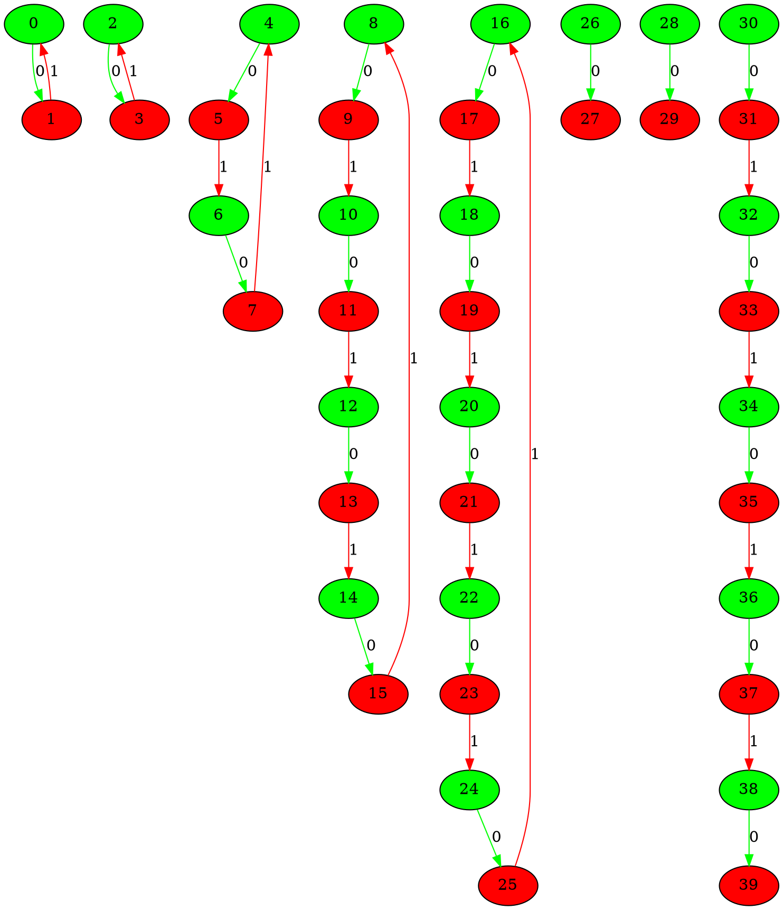
```graphviz
digraph G {
0[label="0" fillcolor="green" style="filled"];
1[label="1" fillcolor="red" style="filled"];
2[label="2" fillcolor="green" style="filled"];
3[label="3" fillcolor="red" style="filled"];
4[label="4" fillcolor="green" style="filled"];
5[label="5" fillcolor="red" style="filled"];
6[label="6" fillcolor="green" style="filled"];
7[label="7" fillcolor="red" style="filled"];
8[label="8" fillcolor="green" style="filled"];
9[label="9" fillcolor="red" style="filled"];
10[label="10" fillcolor="green" style="filled"];
11[label="11" fillcolor="red" style="filled"];
12[label="12" fillcolor="green" style="filled"];
13[label="13" fillcolor="red" style="filled"];
14[label="14" fillcolor="green" style="filled"];
15[label="15" fillcolor="red" style="filled"];
16[label="16" fillcolor="green" style="filled"];
17[label="17" fillcolor="red" style="filled"];
18[label="18" fillcolor="green" style="filled"];
19[label="19" fillcolor="red" style="filled"];
20[label="20" fillcolor="green" style="filled"];
21[label="21" fillcolor="red" style="filled"];
22[label="22" fillcolor="green" style="filled"];
23[label="23" fillcolor="red" style="filled"];
24[label="24" fillcolor="green" style="filled"];
25[label="25" fillcolor="red" style="filled"];
26[label="26" fillcolor="green" style="filled"];
27[label="27" fillcolor="red" style="filled"];
28[label="28" fillcolor="green" style="filled"];
29[label="29" fillcolor="red" style="filled"];
30[label="30" fillcolor="green" style="filled"];
31[label="31" fillcolor="red" style="filled"];
32[label="32" fillcolor="green" style="filled"];
33[label="33" fillcolor="red" style="filled"];
34[label="34" fillcolor="green" style="filled"];
35[label="35" fillcolor="red" style="filled"];
36[label="36" fillcolor="green" style="filled"];
37[label="37" fillcolor="red" style="filled"];
38[label="38" fillcolor="green" style="filled"];
39[label="39" fillcolor="red" style="filled"];
0->1 [label="0" color="green"];
1->0 [label="1" color="red"];
2->3 [label="0" color="green"];
3->2 [label="1" color="red"];
4->5 [label="0" color="green"];
5->6 [label="1" color="red"];
6->7 [label="0" color="green"];
7->4 [label="1" color="red"];
8->9 [label="0" color="green"];
9->10 [label="1" color="red"];
10->11 [label="0" color="green"];
11->12 [label="1" color="red"];
12->13 [label="0" color="green"];
13->14 [label="1" color="red"];
14->15 [label="0" color="green"];
15->8 [label="1" color="red"];
16->17 [label="0" color="green"];
17->18 [label="1" color="red"];
18->19 [label="0" color="green"];
19->20 [label="1" color="red"];
20->21 [label="0" color="green"];
21->22 [label="1" color="red"];
22->23 [label="0" color="green"];
23->24 [label="1" color="red"];
24->25 [label="0" color="green"];
25->16 [label="1" color="red"];
26->27 [label="0" color="green"];
28->29 [label="0" color="green"];
30->31 [label="0" color="green"];
31->32 [label="1" color="red"];
32->33 [label="0" color="green"];
33->34 [label="1" color="red"];
34->35 [label="0" color="green"];
35->36 [label="1" color="red"];
36->37 [label="0" color="green"];
37->38 [label="1" color="red"];
38->39 [label="0" color="green"];
}
```
___
## Graph 12402 - list de compréhension : 1,1,2,4,5,5|1,1
___
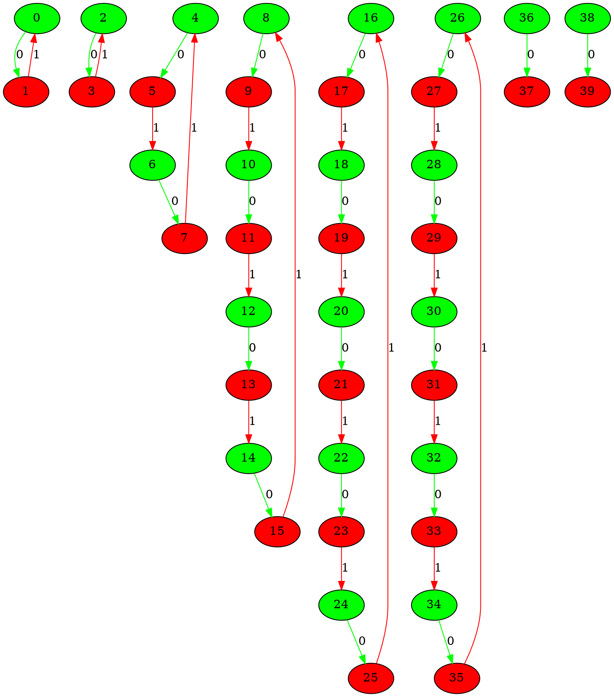
```graphviz
digraph G {
0[label="0" fillcolor="green" style="filled"];
1[label="1" fillcolor="red" style="filled"];
2[label="2" fillcolor="green" style="filled"];
3[label="3" fillcolor="red" style="filled"];
4[label="4" fillcolor="green" style="filled"];
5[label="5" fillcolor="red" style="filled"];
6[label="6" fillcolor="green" style="filled"];
7[label="7" fillcolor="red" style="filled"];
8[label="8" fillcolor="green" style="filled"];
9[label="9" fillcolor="red" style="filled"];
10[label="10" fillcolor="green" style="filled"];
11[label="11" fillcolor="red" style="filled"];
12[label="12" fillcolor="green" style="filled"];
13[label="13" fillcolor="red" style="filled"];
14[label="14" fillcolor="green" style="filled"];
15[label="15" fillcolor="red" style="filled"];
16[label="16" fillcolor="green" style="filled"];
17[label="17" fillcolor="red" style="filled"];
18[label="18" fillcolor="green" style="filled"];
19[label="19" fillcolor="red" style="filled"];
20[label="20" fillcolor="green" style="filled"];
21[label="21" fillcolor="red" style="filled"];
22[label="22" fillcolor="green" style="filled"];
23[label="23" fillcolor="red" style="filled"];
24[label="24" fillcolor="green" style="filled"];
25[label="25" fillcolor="red" style="filled"];
26[label="26" fillcolor="green" style="filled"];
27[label="27" fillcolor="red" style="filled"];
28[label="28" fillcolor="green" style="filled"];
29[label="29" fillcolor="red" style="filled"];
30[label="30" fillcolor="green" style="filled"];
31[label="31" fillcolor="red" style="filled"];
32[label="32" fillcolor="green" style="filled"];
33[label="33" fillcolor="red" style="filled"];
34[label="34" fillcolor="green" style="filled"];
35[label="35" fillcolor="red" style="filled"];
36[label="36" fillcolor="green" style="filled"];
37[label="37" fillcolor="red" style="filled"];
38[label="38" fillcolor="green" style="filled"];
39[label="39" fillcolor="red" style="filled"];
0->1 [label="0" color="green"];
1->0 [label="1" color="red"];
2->3 [label="0" color="green"];
3->2 [label="1" color="red"];
4->5 [label="0" color="green"];
5->6 [label="1" color="red"];
6->7 [label="0" color="green"];
7->4 [label="1" color="red"];
8->9 [label="0" color="green"];
9->10 [label="1" color="red"];
10->11 [label="0" color="green"];
11->12 [label="1" color="red"];
12->13 [label="0" color="green"];
13->14 [label="1" color="red"];
14->15 [label="0" color="green"];
15->8 [label="1" color="red"];
16->17 [label="0" color="green"];
17->18 [label="1" color="red"];
18->19 [label="0" color="green"];
19->20 [label="1" color="red"];
20->21 [label="0" color="green"];
21->22 [label="1" color="red"];
22->23 [label="0" color="green"];
23->24 [label="1" color="red"];
24->25 [label="0" color="green"];
25->16 [label="1" color="red"];
26->27 [label="0" color="green"];
27->28 [label="1" color="red"];
28->29 [label="0" color="green"];
29->30 [label="1" color="red"];
30->31 [label="0" color="green"];
31->32 [label="1" color="red"];
32->33 [label="0" color="green"];
33->34 [label="1" color="red"];
34->35 [label="0" color="green"];
35->26 [label="1" color="red"];
36->37 [label="0" color="green"];
38->39 [label="0" color="green"];
}
```
___
## Graph 12403 - list de compréhension : 1,1,2,5|1,1,4,5
___
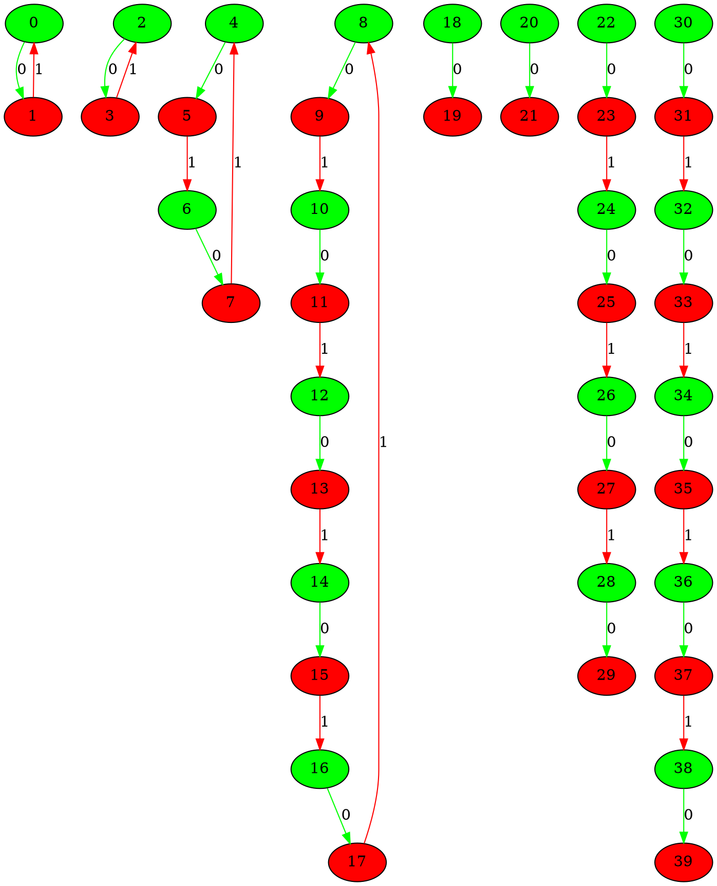
```graphviz
digraph G {
0[label="0" fillcolor="green" style="filled"];
1[label="1" fillcolor="red" style="filled"];
2[label="2" fillcolor="green" style="filled"];
3[label="3" fillcolor="red" style="filled"];
4[label="4" fillcolor="green" style="filled"];
5[label="5" fillcolor="red" style="filled"];
6[label="6" fillcolor="green" style="filled"];
7[label="7" fillcolor="red" style="filled"];
8[label="8" fillcolor="green" style="filled"];
9[label="9" fillcolor="red" style="filled"];
10[label="10" fillcolor="green" style="filled"];
11[label="11" fillcolor="red" style="filled"];
12[label="12" fillcolor="green" style="filled"];
13[label="13" fillcolor="red" style="filled"];
14[label="14" fillcolor="green" style="filled"];
15[label="15" fillcolor="red" style="filled"];
16[label="16" fillcolor="green" style="filled"];
17[label="17" fillcolor="red" style="filled"];
18[label="18" fillcolor="green" style="filled"];
19[label="19" fillcolor="red" style="filled"];
20[label="20" fillcolor="green" style="filled"];
21[label="21" fillcolor="red" style="filled"];
22[label="22" fillcolor="green" style="filled"];
23[label="23" fillcolor="red" style="filled"];
24[label="24" fillcolor="green" style="filled"];
25[label="25" fillcolor="red" style="filled"];
26[label="26" fillcolor="green" style="filled"];
27[label="27" fillcolor="red" style="filled"];
28[label="28" fillcolor="green" style="filled"];
29[label="29" fillcolor="red" style="filled"];
30[label="30" fillcolor="green" style="filled"];
31[label="31" fillcolor="red" style="filled"];
32[label="32" fillcolor="green" style="filled"];
33[label="33" fillcolor="red" style="filled"];
34[label="34" fillcolor="green" style="filled"];
35[label="35" fillcolor="red" style="filled"];
36[label="36" fillcolor="green" style="filled"];
37[label="37" fillcolor="red" style="filled"];
38[label="38" fillcolor="green" style="filled"];
39[label="39" fillcolor="red" style="filled"];
0->1 [label="0" color="green"];
1->0 [label="1" color="red"];
2->3 [label="0" color="green"];
3->2 [label="1" color="red"];
4->5 [label="0" color="green"];
5->6 [label="1" color="red"];
6->7 [label="0" color="green"];
7->4 [label="1" color="red"];
8->9 [label="0" color="green"];
9->10 [label="1" color="red"];
10->11 [label="0" color="green"];
11->12 [label="1" color="red"];
12->13 [label="0" color="green"];
13->14 [label="1" color="red"];
14->15 [label="0" color="green"];
15->16 [label="1" color="red"];
16->17 [label="0" color="green"];
17->8 [label="1" color="red"];
18->19 [label="0" color="green"];
20->21 [label="0" color="green"];
22->23 [label="0" color="green"];
23->24 [label="1" color="red"];
24->25 [label="0" color="green"];
25->26 [label="1" color="red"];
26->27 [label="0" color="green"];
27->28 [label="1" color="red"];
28->29 [label="0" color="green"];
30->31 [label="0" color="green"];
31->32 [label="1" color="red"];
32->33 [label="0" color="green"];
33->34 [label="1" color="red"];
34->35 [label="0" color="green"];
35->36 [label="1" color="red"];
36->37 [label="0" color="green"];
37->38 [label="1" color="red"];
38->39 [label="0" color="green"];
}
```
___
## Graph 12404 - list de compréhension : 1,1,2,5,5|1,1,4
___
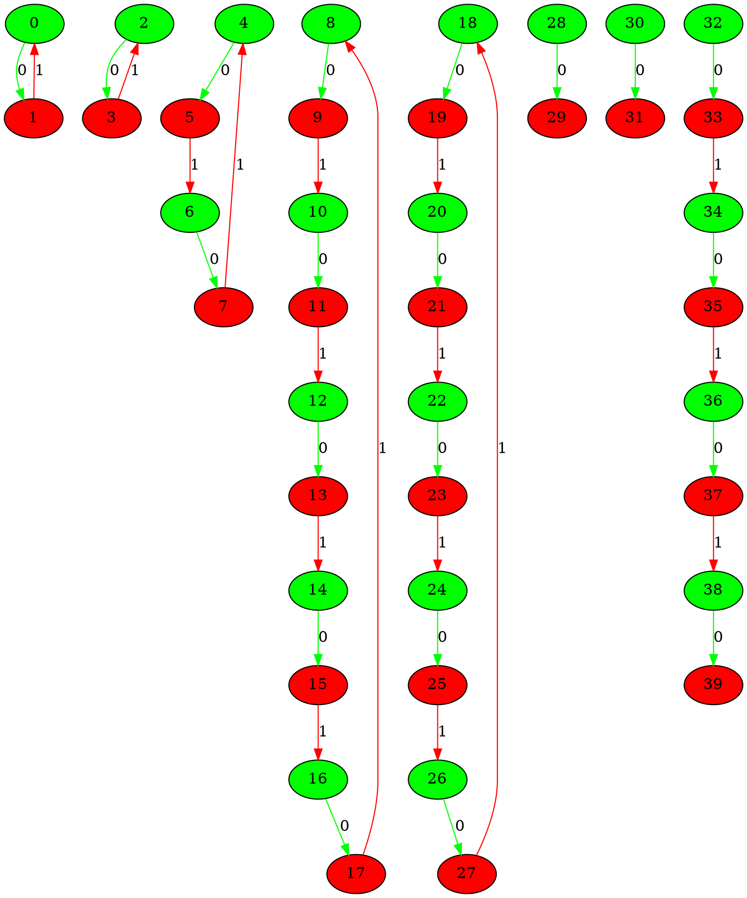
```graphviz
digraph G {
0[label="0" fillcolor="green" style="filled"];
1[label="1" fillcolor="red" style="filled"];
2[label="2" fillcolor="green" style="filled"];
3[label="3" fillcolor="red" style="filled"];
4[label="4" fillcolor="green" style="filled"];
5[label="5" fillcolor="red" style="filled"];
6[label="6" fillcolor="green" style="filled"];
7[label="7" fillcolor="red" style="filled"];
8[label="8" fillcolor="green" style="filled"];
9[label="9" fillcolor="red" style="filled"];
10[label="10" fillcolor="green" style="filled"];
11[label="11" fillcolor="red" style="filled"];
12[label="12" fillcolor="green" style="filled"];
13[label="13" fillcolor="red" style="filled"];
14[label="14" fillcolor="green" style="filled"];
15[label="15" fillcolor="red" style="filled"];
16[label="16" fillcolor="green" style="filled"];
17[label="17" fillcolor="red" style="filled"];
18[label="18" fillcolor="green" style="filled"];
19[label="19" fillcolor="red" style="filled"];
20[label="20" fillcolor="green" style="filled"];
21[label="21" fillcolor="red" style="filled"];
22[label="22" fillcolor="green" style="filled"];
23[label="23" fillcolor="red" style="filled"];
24[label="24" fillcolor="green" style="filled"];
25[label="25" fillcolor="red" style="filled"];
26[label="26" fillcolor="green" style="filled"];
27[label="27" fillcolor="red" style="filled"];
28[label="28" fillcolor="green" style="filled"];
29[label="29" fillcolor="red" style="filled"];
30[label="30" fillcolor="green" style="filled"];
31[label="31" fillcolor="red" style="filled"];
32[label="32" fillcolor="green" style="filled"];
33[label="33" fillcolor="red" style="filled"];
34[label="34" fillcolor="green" style="filled"];
35[label="35" fillcolor="red" style="filled"];
36[label="36" fillcolor="green" style="filled"];
37[label="37" fillcolor="red" style="filled"];
38[label="38" fillcolor="green" style="filled"];
39[label="39" fillcolor="red" style="filled"];
0->1 [label="0" color="green"];
1->0 [label="1" color="red"];
2->3 [label="0" color="green"];
3->2 [label="1" color="red"];
4->5 [label="0" color="green"];
5->6 [label="1" color="red"];
6->7 [label="0" color="green"];
7->4 [label="1" color="red"];
8->9 [label="0" color="green"];
9->10 [label="1" color="red"];
10->11 [label="0" color="green"];
11->12 [label="1" color="red"];
12->13 [label="0" color="green"];
13->14 [label="1" color="red"];
14->15 [label="0" color="green"];
15->16 [label="1" color="red"];
16->17 [label="0" color="green"];
17->8 [label="1" color="red"];
18->19 [label="0" color="green"];
19->20 [label="1" color="red"];
20->21 [label="0" color="green"];
21->22 [label="1" color="red"];
22->23 [label="0" color="green"];
23->24 [label="1" color="red"];
24->25 [label="0" color="green"];
25->26 [label="1" color="red"];
26->27 [label="0" color="green"];
27->18 [label="1" color="red"];
28->29 [label="0" color="green"];
30->31 [label="0" color="green"];
32->33 [label="0" color="green"];
33->34 [label="1" color="red"];
34->35 [label="0" color="green"];
35->36 [label="1" color="red"];
36->37 [label="0" color="green"];
37->38 [label="1" color="red"];
38->39 [label="0" color="green"];
}
```
___
## Graph 12405 - list de compréhension : 1,1,4|1,1,2,5,5
___
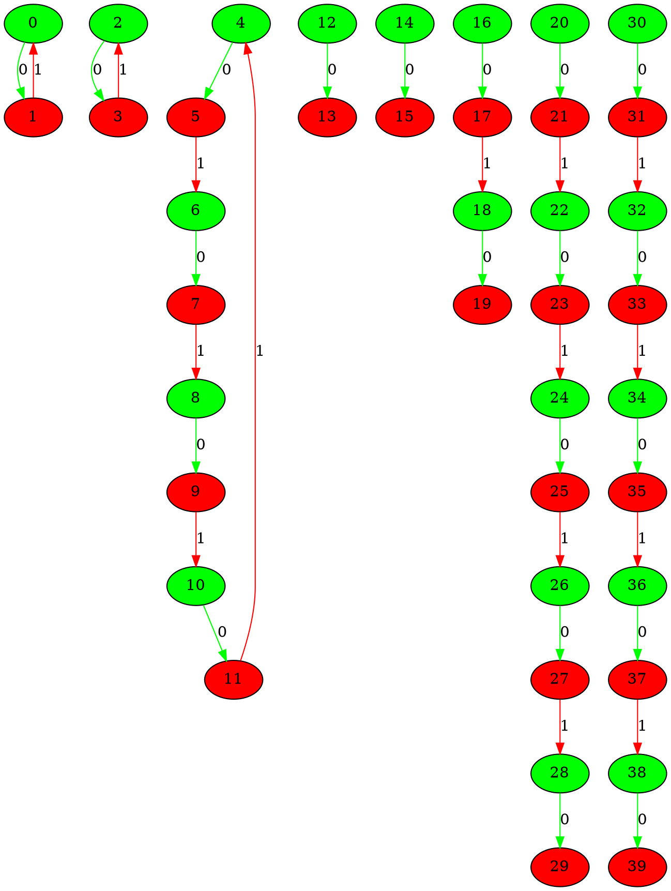
```graphviz
digraph G {
0[label="0" fillcolor="green" style="filled"];
1[label="1" fillcolor="red" style="filled"];
2[label="2" fillcolor="green" style="filled"];
3[label="3" fillcolor="red" style="filled"];
4[label="4" fillcolor="green" style="filled"];
5[label="5" fillcolor="red" style="filled"];
6[label="6" fillcolor="green" style="filled"];
7[label="7" fillcolor="red" style="filled"];
8[label="8" fillcolor="green" style="filled"];
9[label="9" fillcolor="red" style="filled"];
10[label="10" fillcolor="green" style="filled"];
11[label="11" fillcolor="red" style="filled"];
12[label="12" fillcolor="green" style="filled"];
13[label="13" fillcolor="red" style="filled"];
14[label="14" fillcolor="green" style="filled"];
15[label="15" fillcolor="red" style="filled"];
16[label="16" fillcolor="green" style="filled"];
17[label="17" fillcolor="red" style="filled"];
18[label="18" fillcolor="green" style="filled"];
19[label="19" fillcolor="red" style="filled"];
20[label="20" fillcolor="green" style="filled"];
21[label="21" fillcolor="red" style="filled"];
22[label="22" fillcolor="green" style="filled"];
23[label="23" fillcolor="red" style="filled"];
24[label="24" fillcolor="green" style="filled"];
25[label="25" fillcolor="red" style="filled"];
26[label="26" fillcolor="green" style="filled"];
27[label="27" fillcolor="red" style="filled"];
28[label="28" fillcolor="green" style="filled"];
29[label="29" fillcolor="red" style="filled"];
30[label="30" fillcolor="green" style="filled"];
31[label="31" fillcolor="red" style="filled"];
32[label="32" fillcolor="green" style="filled"];
33[label="33" fillcolor="red" style="filled"];
34[label="34" fillcolor="green" style="filled"];
35[label="35" fillcolor="red" style="filled"];
36[label="36" fillcolor="green" style="filled"];
37[label="37" fillcolor="red" style="filled"];
38[label="38" fillcolor="green" style="filled"];
39[label="39" fillcolor="red" style="filled"];
0->1 [label="0" color="green"];
1->0 [label="1" color="red"];
2->3 [label="0" color="green"];
3->2 [label="1" color="red"];
4->5 [label="0" color="green"];
5->6 [label="1" color="red"];
6->7 [label="0" color="green"];
7->8 [label="1" color="red"];
8->9 [label="0" color="green"];
9->10 [label="1" color="red"];
10->11 [label="0" color="green"];
11->4 [label="1" color="red"];
12->13 [label="0" color="green"];
14->15 [label="0" color="green"];
16->17 [label="0" color="green"];
17->18 [label="1" color="red"];
18->19 [label="0" color="green"];
20->21 [label="0" color="green"];
21->22 [label="1" color="red"];
22->23 [label="0" color="green"];
23->24 [label="1" color="red"];
24->25 [label="0" color="green"];
25->26 [label="1" color="red"];
26->27 [label="0" color="green"];
27->28 [label="1" color="red"];
28->29 [label="0" color="green"];
30->31 [label="0" color="green"];
31->32 [label="1" color="red"];
32->33 [label="0" color="green"];
33->34 [label="1" color="red"];
34->35 [label="0" color="green"];
35->36 [label="1" color="red"];
36->37 [label="0" color="green"];
37->38 [label="1" color="red"];
38->39 [label="0" color="green"];
}
```
___
## Graph 12406 - list de compréhension : 1,1,4,5|1,1,2,5
___
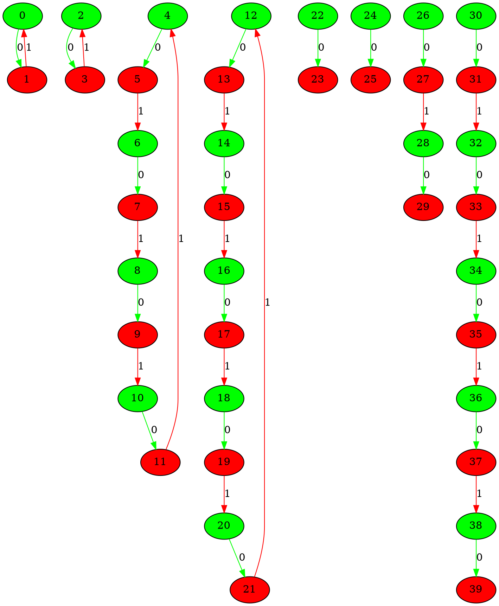
```graphviz
digraph G {
0[label="0" fillcolor="green" style="filled"];
1[label="1" fillcolor="red" style="filled"];
2[label="2" fillcolor="green" style="filled"];
3[label="3" fillcolor="red" style="filled"];
4[label="4" fillcolor="green" style="filled"];
5[label="5" fillcolor="red" style="filled"];
6[label="6" fillcolor="green" style="filled"];
7[label="7" fillcolor="red" style="filled"];
8[label="8" fillcolor="green" style="filled"];
9[label="9" fillcolor="red" style="filled"];
10[label="10" fillcolor="green" style="filled"];
11[label="11" fillcolor="red" style="filled"];
12[label="12" fillcolor="green" style="filled"];
13[label="13" fillcolor="red" style="filled"];
14[label="14" fillcolor="green" style="filled"];
15[label="15" fillcolor="red" style="filled"];
16[label="16" fillcolor="green" style="filled"];
17[label="17" fillcolor="red" style="filled"];
18[label="18" fillcolor="green" style="filled"];
19[label="19" fillcolor="red" style="filled"];
20[label="20" fillcolor="green" style="filled"];
21[label="21" fillcolor="red" style="filled"];
22[label="22" fillcolor="green" style="filled"];
23[label="23" fillcolor="red" style="filled"];
24[label="24" fillcolor="green" style="filled"];
25[label="25" fillcolor="red" style="filled"];
26[label="26" fillcolor="green" style="filled"];
27[label="27" fillcolor="red" style="filled"];
28[label="28" fillcolor="green" style="filled"];
29[label="29" fillcolor="red" style="filled"];
30[label="30" fillcolor="green" style="filled"];
31[label="31" fillcolor="red" style="filled"];
32[label="32" fillcolor="green" style="filled"];
33[label="33" fillcolor="red" style="filled"];
34[label="34" fillcolor="green" style="filled"];
35[label="35" fillcolor="red" style="filled"];
36[label="36" fillcolor="green" style="filled"];
37[label="37" fillcolor="red" style="filled"];
38[label="38" fillcolor="green" style="filled"];
39[label="39" fillcolor="red" style="filled"];
0->1 [label="0" color="green"];
1->0 [label="1" color="red"];
2->3 [label="0" color="green"];
3->2 [label="1" color="red"];
4->5 [label="0" color="green"];
5->6 [label="1" color="red"];
6->7 [label="0" color="green"];
7->8 [label="1" color="red"];
8->9 [label="0" color="green"];
9->10 [label="1" color="red"];
10->11 [label="0" color="green"];
11->4 [label="1" color="red"];
12->13 [label="0" color="green"];
13->14 [label="1" color="red"];
14->15 [label="0" color="green"];
15->16 [label="1" color="red"];
16->17 [label="0" color="green"];
17->18 [label="1" color="red"];
18->19 [label="0" color="green"];
19->20 [label="1" color="red"];
20->21 [label="0" color="green"];
21->12 [label="1" color="red"];
22->23 [label="0" color="green"];
24->25 [label="0" color="green"];
26->27 [label="0" color="green"];
27->28 [label="1" color="red"];
28->29 [label="0" color="green"];
30->31 [label="0" color="green"];
31->32 [label="1" color="red"];
32->33 [label="0" color="green"];
33->34 [label="1" color="red"];
34->35 [label="0" color="green"];
35->36 [label="1" color="red"];
36->37 [label="0" color="green"];
37->38 [label="1" color="red"];
38->39 [label="0" color="green"];
}
```
___
## Graph 12407 - list de compréhension : 1,1,4,5,5|1,1,2
___
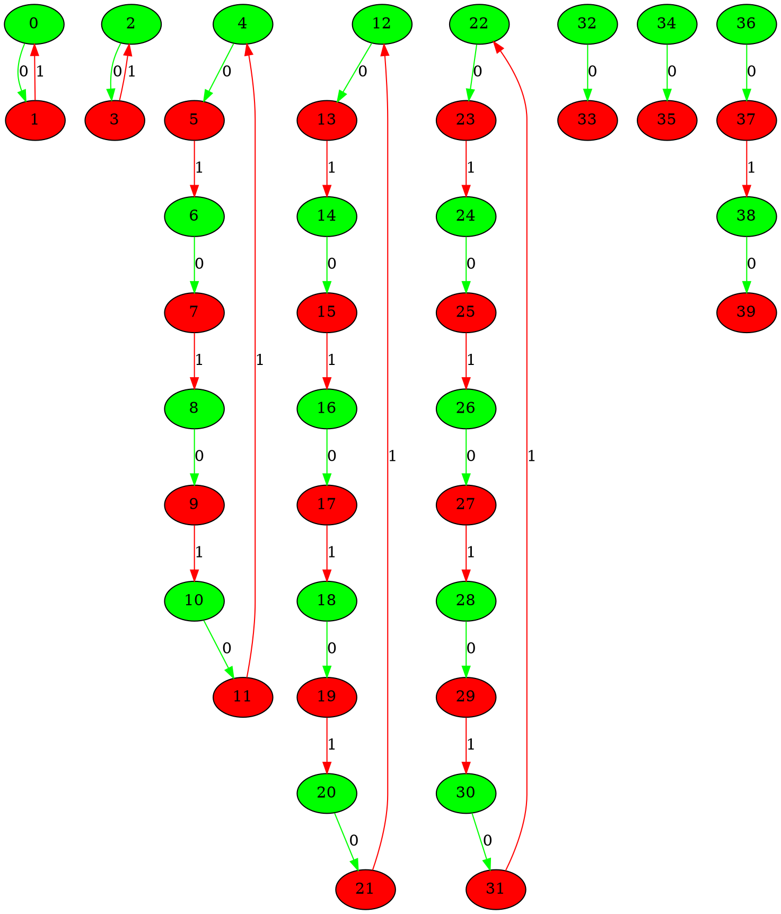
```graphviz
digraph G {
0[label="0" fillcolor="green" style="filled"];
1[label="1" fillcolor="red" style="filled"];
2[label="2" fillcolor="green" style="filled"];
3[label="3" fillcolor="red" style="filled"];
4[label="4" fillcolor="green" style="filled"];
5[label="5" fillcolor="red" style="filled"];
6[label="6" fillcolor="green" style="filled"];
7[label="7" fillcolor="red" style="filled"];
8[label="8" fillcolor="green" style="filled"];
9[label="9" fillcolor="red" style="filled"];
10[label="10" fillcolor="green" style="filled"];
11[label="11" fillcolor="red" style="filled"];
12[label="12" fillcolor="green" style="filled"];
13[label="13" fillcolor="red" style="filled"];
14[label="14" fillcolor="green" style="filled"];
15[label="15" fillcolor="red" style="filled"];
16[label="16" fillcolor="green" style="filled"];
17[label="17" fillcolor="red" style="filled"];
18[label="18" fillcolor="green" style="filled"];
19[label="19" fillcolor="red" style="filled"];
20[label="20" fillcolor="green" style="filled"];
21[label="21" fillcolor="red" style="filled"];
22[label="22" fillcolor="green" style="filled"];
23[label="23" fillcolor="red" style="filled"];
24[label="24" fillcolor="green" style="filled"];
25[label="25" fillcolor="red" style="filled"];
26[label="26" fillcolor="green" style="filled"];
27[label="27" fillcolor="red" style="filled"];
28[label="28" fillcolor="green" style="filled"];
29[label="29" fillcolor="red" style="filled"];
30[label="30" fillcolor="green" style="filled"];
31[label="31" fillcolor="red" style="filled"];
32[label="32" fillcolor="green" style="filled"];
33[label="33" fillcolor="red" style="filled"];
34[label="34" fillcolor="green" style="filled"];
35[label="35" fillcolor="red" style="filled"];
36[label="36" fillcolor="green" style="filled"];
37[label="37" fillcolor="red" style="filled"];
38[label="38" fillcolor="green" style="filled"];
39[label="39" fillcolor="red" style="filled"];
0->1 [label="0" color="green"];
1->0 [label="1" color="red"];
2->3 [label="0" color="green"];
3->2 [label="1" color="red"];
4->5 [label="0" color="green"];
5->6 [label="1" color="red"];
6->7 [label="0" color="green"];
7->8 [label="1" color="red"];
8->9 [label="0" color="green"];
9->10 [label="1" color="red"];
10->11 [label="0" color="green"];
11->4 [label="1" color="red"];
12->13 [label="0" color="green"];
13->14 [label="1" color="red"];
14->15 [label="0" color="green"];
15->16 [label="1" color="red"];
16->17 [label="0" color="green"];
17->18 [label="1" color="red"];
18->19 [label="0" color="green"];
19->20 [label="1" color="red"];
20->21 [label="0" color="green"];
21->12 [label="1" color="red"];
22->23 [label="0" color="green"];
23->24 [label="1" color="red"];
24->25 [label="0" color="green"];
25->26 [label="1" color="red"];
26->27 [label="0" color="green"];
27->28 [label="1" color="red"];
28->29 [label="0" color="green"];
29->30 [label="1" color="red"];
30->31 [label="0" color="green"];
31->22 [label="1" color="red"];
32->33 [label="0" color="green"];
34->35 [label="0" color="green"];
36->37 [label="0" color="green"];
37->38 [label="1" color="red"];
38->39 [label="0" color="green"];
}
```
___
## Graph 12408 - list de compréhension : 1,1,5|1,1,2,4,5
___
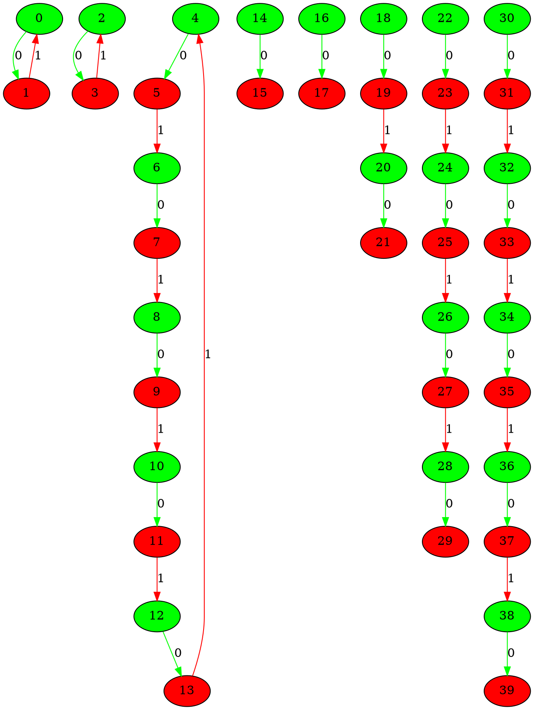
```graphviz
digraph G {
0[label="0" fillcolor="green" style="filled"];
1[label="1" fillcolor="red" style="filled"];
2[label="2" fillcolor="green" style="filled"];
3[label="3" fillcolor="red" style="filled"];
4[label="4" fillcolor="green" style="filled"];
5[label="5" fillcolor="red" style="filled"];
6[label="6" fillcolor="green" style="filled"];
7[label="7" fillcolor="red" style="filled"];
8[label="8" fillcolor="green" style="filled"];
9[label="9" fillcolor="red" style="filled"];
10[label="10" fillcolor="green" style="filled"];
11[label="11" fillcolor="red" style="filled"];
12[label="12" fillcolor="green" style="filled"];
13[label="13" fillcolor="red" style="filled"];
14[label="14" fillcolor="green" style="filled"];
15[label="15" fillcolor="red" style="filled"];
16[label="16" fillcolor="green" style="filled"];
17[label="17" fillcolor="red" style="filled"];
18[label="18" fillcolor="green" style="filled"];
19[label="19" fillcolor="red" style="filled"];
20[label="20" fillcolor="green" style="filled"];
21[label="21" fillcolor="red" style="filled"];
22[label="22" fillcolor="green" style="filled"];
23[label="23" fillcolor="red" style="filled"];
24[label="24" fillcolor="green" style="filled"];
25[label="25" fillcolor="red" style="filled"];
26[label="26" fillcolor="green" style="filled"];
27[label="27" fillcolor="red" style="filled"];
28[label="28" fillcolor="green" style="filled"];
29[label="29" fillcolor="red" style="filled"];
30[label="30" fillcolor="green" style="filled"];
31[label="31" fillcolor="red" style="filled"];
32[label="32" fillcolor="green" style="filled"];
33[label="33" fillcolor="red" style="filled"];
34[label="34" fillcolor="green" style="filled"];
35[label="35" fillcolor="red" style="filled"];
36[label="36" fillcolor="green" style="filled"];
37[label="37" fillcolor="red" style="filled"];
38[label="38" fillcolor="green" style="filled"];
39[label="39" fillcolor="red" style="filled"];
0->1 [label="0" color="green"];
1->0 [label="1" color="red"];
2->3 [label="0" color="green"];
3->2 [label="1" color="red"];
4->5 [label="0" color="green"];
5->6 [label="1" color="red"];
6->7 [label="0" color="green"];
7->8 [label="1" color="red"];
8->9 [label="0" color="green"];
9->10 [label="1" color="red"];
10->11 [label="0" color="green"];
11->12 [label="1" color="red"];
12->13 [label="0" color="green"];
13->4 [label="1" color="red"];
14->15 [label="0" color="green"];
16->17 [label="0" color="green"];
18->19 [label="0" color="green"];
19->20 [label="1" color="red"];
20->21 [label="0" color="green"];
22->23 [label="0" color="green"];
23->24 [label="1" color="red"];
24->25 [label="0" color="green"];
25->26 [label="1" color="red"];
26->27 [label="0" color="green"];
27->28 [label="1" color="red"];
28->29 [label="0" color="green"];
30->31 [label="0" color="green"];
31->32 [label="1" color="red"];
32->33 [label="0" color="green"];
33->34 [label="1" color="red"];
34->35 [label="0" color="green"];
35->36 [label="1" color="red"];
36->37 [label="0" color="green"];
37->38 [label="1" color="red"];
38->39 [label="0" color="green"];
}
```
___
## Graph 12409 - list de compréhension : 1,1,5,5|1,1,2,4
___
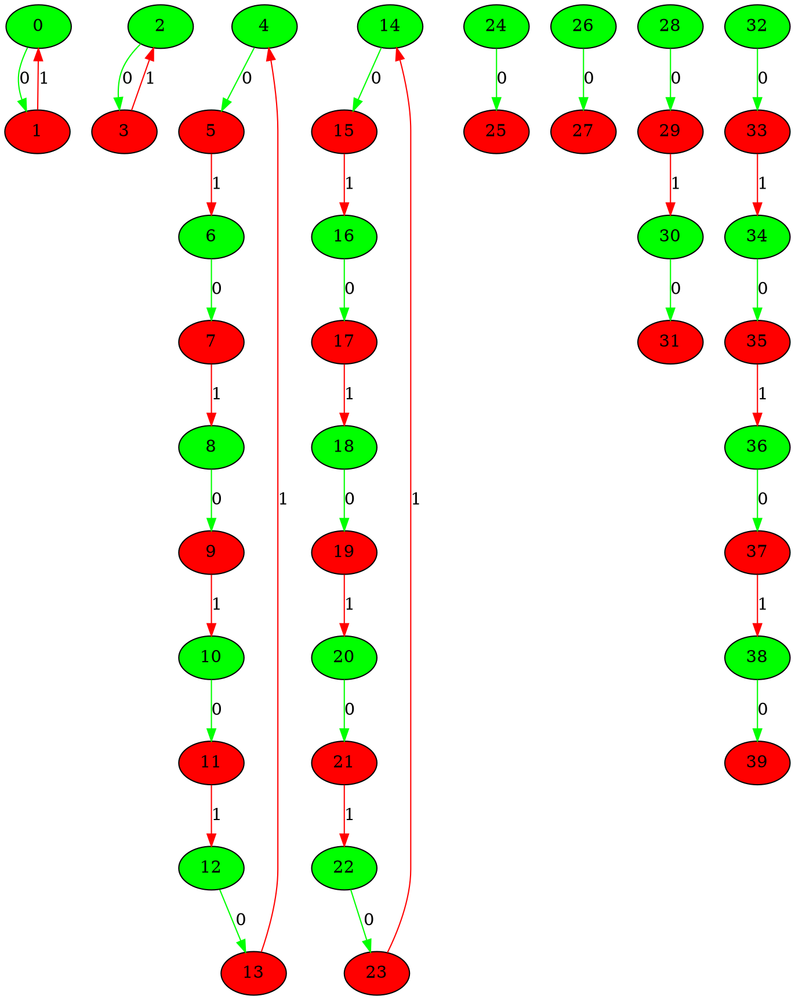
```graphviz
digraph G {
0[label="0" fillcolor="green" style="filled"];
1[label="1" fillcolor="red" style="filled"];
2[label="2" fillcolor="green" style="filled"];
3[label="3" fillcolor="red" style="filled"];
4[label="4" fillcolor="green" style="filled"];
5[label="5" fillcolor="red" style="filled"];
6[label="6" fillcolor="green" style="filled"];
7[label="7" fillcolor="red" style="filled"];
8[label="8" fillcolor="green" style="filled"];
9[label="9" fillcolor="red" style="filled"];
10[label="10" fillcolor="green" style="filled"];
11[label="11" fillcolor="red" style="filled"];
12[label="12" fillcolor="green" style="filled"];
13[label="13" fillcolor="red" style="filled"];
14[label="14" fillcolor="green" style="filled"];
15[label="15" fillcolor="red" style="filled"];
16[label="16" fillcolor="green" style="filled"];
17[label="17" fillcolor="red" style="filled"];
18[label="18" fillcolor="green" style="filled"];
19[label="19" fillcolor="red" style="filled"];
20[label="20" fillcolor="green" style="filled"];
21[label="21" fillcolor="red" style="filled"];
22[label="22" fillcolor="green" style="filled"];
23[label="23" fillcolor="red" style="filled"];
24[label="24" fillcolor="green" style="filled"];
25[label="25" fillcolor="red" style="filled"];
26[label="26" fillcolor="green" style="filled"];
27[label="27" fillcolor="red" style="filled"];
28[label="28" fillcolor="green" style="filled"];
29[label="29" fillcolor="red" style="filled"];
30[label="30" fillcolor="green" style="filled"];
31[label="31" fillcolor="red" style="filled"];
32[label="32" fillcolor="green" style="filled"];
33[label="33" fillcolor="red" style="filled"];
34[label="34" fillcolor="green" style="filled"];
35[label="35" fillcolor="red" style="filled"];
36[label="36" fillcolor="green" style="filled"];
37[label="37" fillcolor="red" style="filled"];
38[label="38" fillcolor="green" style="filled"];
39[label="39" fillcolor="red" style="filled"];
0->1 [label="0" color="green"];
1->0 [label="1" color="red"];
2->3 [label="0" color="green"];
3->2 [label="1" color="red"];
4->5 [label="0" color="green"];
5->6 [label="1" color="red"];
6->7 [label="0" color="green"];
7->8 [label="1" color="red"];
8->9 [label="0" color="green"];
9->10 [label="1" color="red"];
10->11 [label="0" color="green"];
11->12 [label="1" color="red"];
12->13 [label="0" color="green"];
13->4 [label="1" color="red"];
14->15 [label="0" color="green"];
15->16 [label="1" color="red"];
16->17 [label="0" color="green"];
17->18 [label="1" color="red"];
18->19 [label="0" color="green"];
19->20 [label="1" color="red"];
20->21 [label="0" color="green"];
21->22 [label="1" color="red"];
22->23 [label="0" color="green"];
23->14 [label="1" color="red"];
24->25 [label="0" color="green"];
26->27 [label="0" color="green"];
28->29 [label="0" color="green"];
29->30 [label="1" color="red"];
30->31 [label="0" color="green"];
32->33 [label="0" color="green"];
33->34 [label="1" color="red"];
34->35 [label="0" color="green"];
35->36 [label="1" color="red"];
36->37 [label="0" color="green"];
37->38 [label="1" color="red"];
38->39 [label="0" color="green"];
}
```
___
## Graph 12410 - list de compréhension : 1,2|1,1,1,4,5,5
___
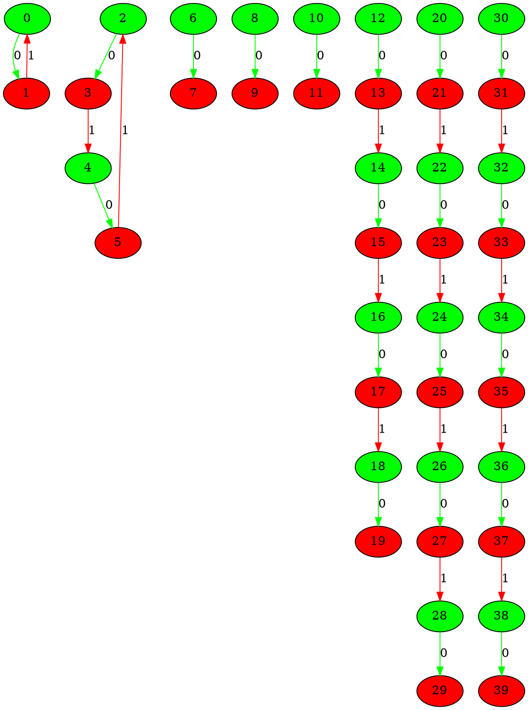
```graphviz
digraph G {
0[label="0" fillcolor="green" style="filled"];
1[label="1" fillcolor="red" style="filled"];
2[label="2" fillcolor="green" style="filled"];
3[label="3" fillcolor="red" style="filled"];
4[label="4" fillcolor="green" style="filled"];
5[label="5" fillcolor="red" style="filled"];
6[label="6" fillcolor="green" style="filled"];
7[label="7" fillcolor="red" style="filled"];
8[label="8" fillcolor="green" style="filled"];
9[label="9" fillcolor="red" style="filled"];
10[label="10" fillcolor="green" style="filled"];
11[label="11" fillcolor="red" style="filled"];
12[label="12" fillcolor="green" style="filled"];
13[label="13" fillcolor="red" style="filled"];
14[label="14" fillcolor="green" style="filled"];
15[label="15" fillcolor="red" style="filled"];
16[label="16" fillcolor="green" style="filled"];
17[label="17" fillcolor="red" style="filled"];
18[label="18" fillcolor="green" style="filled"];
19[label="19" fillcolor="red" style="filled"];
20[label="20" fillcolor="green" style="filled"];
21[label="21" fillcolor="red" style="filled"];
22[label="22" fillcolor="green" style="filled"];
23[label="23" fillcolor="red" style="filled"];
24[label="24" fillcolor="green" style="filled"];
25[label="25" fillcolor="red" style="filled"];
26[label="26" fillcolor="green" style="filled"];
27[label="27" fillcolor="red" style="filled"];
28[label="28" fillcolor="green" style="filled"];
29[label="29" fillcolor="red" style="filled"];
30[label="30" fillcolor="green" style="filled"];
31[label="31" fillcolor="red" style="filled"];
32[label="32" fillcolor="green" style="filled"];
33[label="33" fillcolor="red" style="filled"];
34[label="34" fillcolor="green" style="filled"];
35[label="35" fillcolor="red" style="filled"];
36[label="36" fillcolor="green" style="filled"];
37[label="37" fillcolor="red" style="filled"];
38[label="38" fillcolor="green" style="filled"];
39[label="39" fillcolor="red" style="filled"];
0->1 [label="0" color="green"];
1->0 [label="1" color="red"];
2->3 [label="0" color="green"];
3->4 [label="1" color="red"];
4->5 [label="0" color="green"];
5->2 [label="1" color="red"];
6->7 [label="0" color="green"];
8->9 [label="0" color="green"];
10->11 [label="0" color="green"];
12->13 [label="0" color="green"];
13->14 [label="1" color="red"];
14->15 [label="0" color="green"];
15->16 [label="1" color="red"];
16->17 [label="0" color="green"];
17->18 [label="1" color="red"];
18->19 [label="0" color="green"];
20->21 [label="0" color="green"];
21->22 [label="1" color="red"];
22->23 [label="0" color="green"];
23->24 [label="1" color="red"];
24->25 [label="0" color="green"];
25->26 [label="1" color="red"];
26->27 [label="0" color="green"];
27->28 [label="1" color="red"];
28->29 [label="0" color="green"];
30->31 [label="0" color="green"];
31->32 [label="1" color="red"];
32->33 [label="0" color="green"];
33->34 [label="1" color="red"];
34->35 [label="0" color="green"];
35->36 [label="1" color="red"];
36->37 [label="0" color="green"];
37->38 [label="1" color="red"];
38->39 [label="0" color="green"];
}
```
___
## Graph 12411 - list de compréhension : 1,2,4|1,1,1,5,5
___
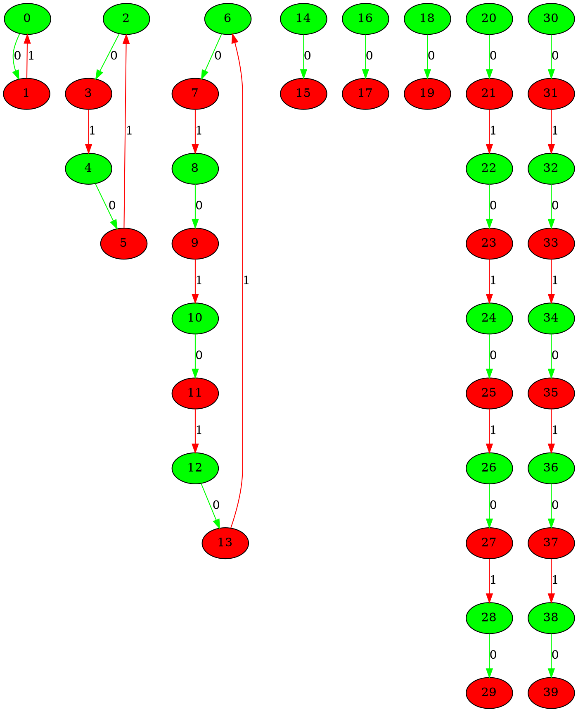
```graphviz
digraph G {
0[label="0" fillcolor="green" style="filled"];
1[label="1" fillcolor="red" style="filled"];
2[label="2" fillcolor="green" style="filled"];
3[label="3" fillcolor="red" style="filled"];
4[label="4" fillcolor="green" style="filled"];
5[label="5" fillcolor="red" style="filled"];
6[label="6" fillcolor="green" style="filled"];
7[label="7" fillcolor="red" style="filled"];
8[label="8" fillcolor="green" style="filled"];
9[label="9" fillcolor="red" style="filled"];
10[label="10" fillcolor="green" style="filled"];
11[label="11" fillcolor="red" style="filled"];
12[label="12" fillcolor="green" style="filled"];
13[label="13" fillcolor="red" style="filled"];
14[label="14" fillcolor="green" style="filled"];
15[label="15" fillcolor="red" style="filled"];
16[label="16" fillcolor="green" style="filled"];
17[label="17" fillcolor="red" style="filled"];
18[label="18" fillcolor="green" style="filled"];
19[label="19" fillcolor="red" style="filled"];
20[label="20" fillcolor="green" style="filled"];
21[label="21" fillcolor="red" style="filled"];
22[label="22" fillcolor="green" style="filled"];
23[label="23" fillcolor="red" style="filled"];
24[label="24" fillcolor="green" style="filled"];
25[label="25" fillcolor="red" style="filled"];
26[label="26" fillcolor="green" style="filled"];
27[label="27" fillcolor="red" style="filled"];
28[label="28" fillcolor="green" style="filled"];
29[label="29" fillcolor="red" style="filled"];
30[label="30" fillcolor="green" style="filled"];
31[label="31" fillcolor="red" style="filled"];
32[label="32" fillcolor="green" style="filled"];
33[label="33" fillcolor="red" style="filled"];
34[label="34" fillcolor="green" style="filled"];
35[label="35" fillcolor="red" style="filled"];
36[label="36" fillcolor="green" style="filled"];
37[label="37" fillcolor="red" style="filled"];
38[label="38" fillcolor="green" style="filled"];
39[label="39" fillcolor="red" style="filled"];
0->1 [label="0" color="green"];
1->0 [label="1" color="red"];
2->3 [label="0" color="green"];
3->4 [label="1" color="red"];
4->5 [label="0" color="green"];
5->2 [label="1" color="red"];
6->7 [label="0" color="green"];
7->8 [label="1" color="red"];
8->9 [label="0" color="green"];
9->10 [label="1" color="red"];
10->11 [label="0" color="green"];
11->12 [label="1" color="red"];
12->13 [label="0" color="green"];
13->6 [label="1" color="red"];
14->15 [label="0" color="green"];
16->17 [label="0" color="green"];
18->19 [label="0" color="green"];
20->21 [label="0" color="green"];
21->22 [label="1" color="red"];
22->23 [label="0" color="green"];
23->24 [label="1" color="red"];
24->25 [label="0" color="green"];
25->26 [label="1" color="red"];
26->27 [label="0" color="green"];
27->28 [label="1" color="red"];
28->29 [label="0" color="green"];
30->31 [label="0" color="green"];
31->32 [label="1" color="red"];
32->33 [label="0" color="green"];
33->34 [label="1" color="red"];
34->35 [label="0" color="green"];
35->36 [label="1" color="red"];
36->37 [label="0" color="green"];
37->38 [label="1" color="red"];
38->39 [label="0" color="green"];
}
```
___
## Graph 12412 - list de compréhension : 1,2,4,5|1,1,1,5
___
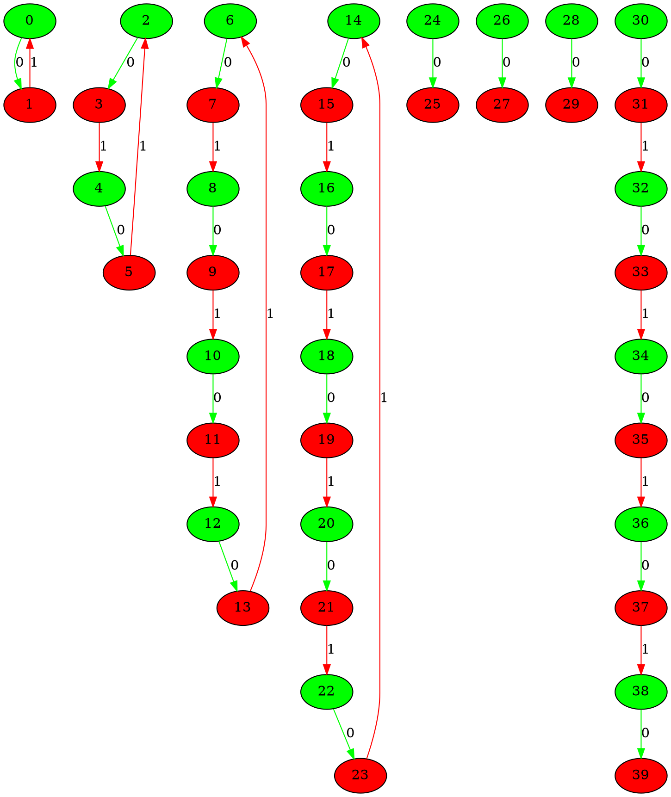
```graphviz
digraph G {
0[label="0" fillcolor="green" style="filled"];
1[label="1" fillcolor="red" style="filled"];
2[label="2" fillcolor="green" style="filled"];
3[label="3" fillcolor="red" style="filled"];
4[label="4" fillcolor="green" style="filled"];
5[label="5" fillcolor="red" style="filled"];
6[label="6" fillcolor="green" style="filled"];
7[label="7" fillcolor="red" style="filled"];
8[label="8" fillcolor="green" style="filled"];
9[label="9" fillcolor="red" style="filled"];
10[label="10" fillcolor="green" style="filled"];
11[label="11" fillcolor="red" style="filled"];
12[label="12" fillcolor="green" style="filled"];
13[label="13" fillcolor="red" style="filled"];
14[label="14" fillcolor="green" style="filled"];
15[label="15" fillcolor="red" style="filled"];
16[label="16" fillcolor="green" style="filled"];
17[label="17" fillcolor="red" style="filled"];
18[label="18" fillcolor="green" style="filled"];
19[label="19" fillcolor="red" style="filled"];
20[label="20" fillcolor="green" style="filled"];
21[label="21" fillcolor="red" style="filled"];
22[label="22" fillcolor="green" style="filled"];
23[label="23" fillcolor="red" style="filled"];
24[label="24" fillcolor="green" style="filled"];
25[label="25" fillcolor="red" style="filled"];
26[label="26" fillcolor="green" style="filled"];
27[label="27" fillcolor="red" style="filled"];
28[label="28" fillcolor="green" style="filled"];
29[label="29" fillcolor="red" style="filled"];
30[label="30" fillcolor="green" style="filled"];
31[label="31" fillcolor="red" style="filled"];
32[label="32" fillcolor="green" style="filled"];
33[label="33" fillcolor="red" style="filled"];
34[label="34" fillcolor="green" style="filled"];
35[label="35" fillcolor="red" style="filled"];
36[label="36" fillcolor="green" style="filled"];
37[label="37" fillcolor="red" style="filled"];
38[label="38" fillcolor="green" style="filled"];
39[label="39" fillcolor="red" style="filled"];
0->1 [label="0" color="green"];
1->0 [label="1" color="red"];
2->3 [label="0" color="green"];
3->4 [label="1" color="red"];
4->5 [label="0" color="green"];
5->2 [label="1" color="red"];
6->7 [label="0" color="green"];
7->8 [label="1" color="red"];
8->9 [label="0" color="green"];
9->10 [label="1" color="red"];
10->11 [label="0" color="green"];
11->12 [label="1" color="red"];
12->13 [label="0" color="green"];
13->6 [label="1" color="red"];
14->15 [label="0" color="green"];
15->16 [label="1" color="red"];
16->17 [label="0" color="green"];
17->18 [label="1" color="red"];
18->19 [label="0" color="green"];
19->20 [label="1" color="red"];
20->21 [label="0" color="green"];
21->22 [label="1" color="red"];
22->23 [label="0" color="green"];
23->14 [label="1" color="red"];
24->25 [label="0" color="green"];
26->27 [label="0" color="green"];
28->29 [label="0" color="green"];
30->31 [label="0" color="green"];
31->32 [label="1" color="red"];
32->33 [label="0" color="green"];
33->34 [label="1" color="red"];
34->35 [label="0" color="green"];
35->36 [label="1" color="red"];
36->37 [label="0" color="green"];
37->38 [label="1" color="red"];
38->39 [label="0" color="green"];
}
```
___
## Graph 12413 - list de compréhension : 1,2,4,5,5|1,1,1
___
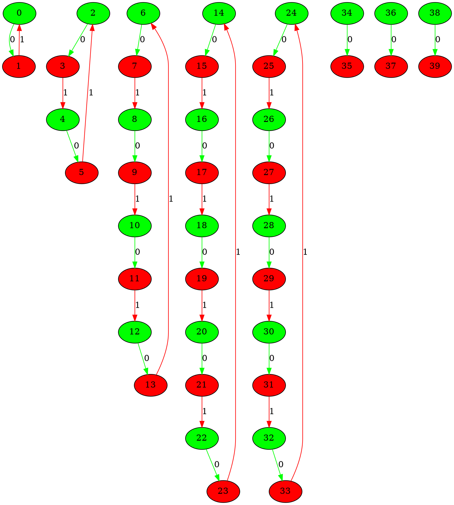
```graphviz
digraph G {
0[label="0" fillcolor="green" style="filled"];
1[label="1" fillcolor="red" style="filled"];
2[label="2" fillcolor="green" style="filled"];
3[label="3" fillcolor="red" style="filled"];
4[label="4" fillcolor="green" style="filled"];
5[label="5" fillcolor="red" style="filled"];
6[label="6" fillcolor="green" style="filled"];
7[label="7" fillcolor="red" style="filled"];
8[label="8" fillcolor="green" style="filled"];
9[label="9" fillcolor="red" style="filled"];
10[label="10" fillcolor="green" style="filled"];
11[label="11" fillcolor="red" style="filled"];
12[label="12" fillcolor="green" style="filled"];
13[label="13" fillcolor="red" style="filled"];
14[label="14" fillcolor="green" style="filled"];
15[label="15" fillcolor="red" style="filled"];
16[label="16" fillcolor="green" style="filled"];
17[label="17" fillcolor="red" style="filled"];
18[label="18" fillcolor="green" style="filled"];
19[label="19" fillcolor="red" style="filled"];
20[label="20" fillcolor="green" style="filled"];
21[label="21" fillcolor="red" style="filled"];
22[label="22" fillcolor="green" style="filled"];
23[label="23" fillcolor="red" style="filled"];
24[label="24" fillcolor="green" style="filled"];
25[label="25" fillcolor="red" style="filled"];
26[label="26" fillcolor="green" style="filled"];
27[label="27" fillcolor="red" style="filled"];
28[label="28" fillcolor="green" style="filled"];
29[label="29" fillcolor="red" style="filled"];
30[label="30" fillcolor="green" style="filled"];
31[label="31" fillcolor="red" style="filled"];
32[label="32" fillcolor="green" style="filled"];
33[label="33" fillcolor="red" style="filled"];
34[label="34" fillcolor="green" style="filled"];
35[label="35" fillcolor="red" style="filled"];
36[label="36" fillcolor="green" style="filled"];
37[label="37" fillcolor="red" style="filled"];
38[label="38" fillcolor="green" style="filled"];
39[label="39" fillcolor="red" style="filled"];
0->1 [label="0" color="green"];
1->0 [label="1" color="red"];
2->3 [label="0" color="green"];
3->4 [label="1" color="red"];
4->5 [label="0" color="green"];
5->2 [label="1" color="red"];
6->7 [label="0" color="green"];
7->8 [label="1" color="red"];
8->9 [label="0" color="green"];
9->10 [label="1" color="red"];
10->11 [label="0" color="green"];
11->12 [label="1" color="red"];
12->13 [label="0" color="green"];
13->6 [label="1" color="red"];
14->15 [label="0" color="green"];
15->16 [label="1" color="red"];
16->17 [label="0" color="green"];
17->18 [label="1" color="red"];
18->19 [label="0" color="green"];
19->20 [label="1" color="red"];
20->21 [label="0" color="green"];
21->22 [label="1" color="red"];
22->23 [label="0" color="green"];
23->14 [label="1" color="red"];
24->25 [label="0" color="green"];
25->26 [label="1" color="red"];
26->27 [label="0" color="green"];
27->28 [label="1" color="red"];
28->29 [label="0" color="green"];
29->30 [label="1" color="red"];
30->31 [label="0" color="green"];
31->32 [label="1" color="red"];
32->33 [label="0" color="green"];
33->24 [label="1" color="red"];
34->35 [label="0" color="green"];
36->37 [label="0" color="green"];
38->39 [label="0" color="green"];
}
```
___
## Graph 12414 - list de compréhension : 1,2,5|1,1,1,4,5
___
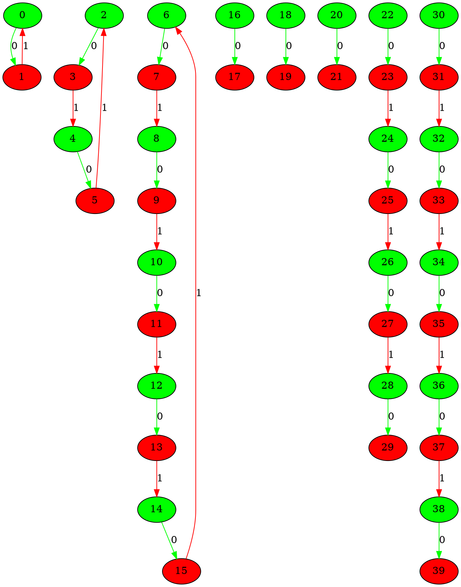
```graphviz
digraph G {
0[label="0" fillcolor="green" style="filled"];
1[label="1" fillcolor="red" style="filled"];
2[label="2" fillcolor="green" style="filled"];
3[label="3" fillcolor="red" style="filled"];
4[label="4" fillcolor="green" style="filled"];
5[label="5" fillcolor="red" style="filled"];
6[label="6" fillcolor="green" style="filled"];
7[label="7" fillcolor="red" style="filled"];
8[label="8" fillcolor="green" style="filled"];
9[label="9" fillcolor="red" style="filled"];
10[label="10" fillcolor="green" style="filled"];
11[label="11" fillcolor="red" style="filled"];
12[label="12" fillcolor="green" style="filled"];
13[label="13" fillcolor="red" style="filled"];
14[label="14" fillcolor="green" style="filled"];
15[label="15" fillcolor="red" style="filled"];
16[label="16" fillcolor="green" style="filled"];
17[label="17" fillcolor="red" style="filled"];
18[label="18" fillcolor="green" style="filled"];
19[label="19" fillcolor="red" style="filled"];
20[label="20" fillcolor="green" style="filled"];
21[label="21" fillcolor="red" style="filled"];
22[label="22" fillcolor="green" style="filled"];
23[label="23" fillcolor="red" style="filled"];
24[label="24" fillcolor="green" style="filled"];
25[label="25" fillcolor="red" style="filled"];
26[label="26" fillcolor="green" style="filled"];
27[label="27" fillcolor="red" style="filled"];
28[label="28" fillcolor="green" style="filled"];
29[label="29" fillcolor="red" style="filled"];
30[label="30" fillcolor="green" style="filled"];
31[label="31" fillcolor="red" style="filled"];
32[label="32" fillcolor="green" style="filled"];
33[label="33" fillcolor="red" style="filled"];
34[label="34" fillcolor="green" style="filled"];
35[label="35" fillcolor="red" style="filled"];
36[label="36" fillcolor="green" style="filled"];
37[label="37" fillcolor="red" style="filled"];
38[label="38" fillcolor="green" style="filled"];
39[label="39" fillcolor="red" style="filled"];
0->1 [label="0" color="green"];
1->0 [label="1" color="red"];
2->3 [label="0" color="green"];
3->4 [label="1" color="red"];
4->5 [label="0" color="green"];
5->2 [label="1" color="red"];
6->7 [label="0" color="green"];
7->8 [label="1" color="red"];
8->9 [label="0" color="green"];
9->10 [label="1" color="red"];
10->11 [label="0" color="green"];
11->12 [label="1" color="red"];
12->13 [label="0" color="green"];
13->14 [label="1" color="red"];
14->15 [label="0" color="green"];
15->6 [label="1" color="red"];
16->17 [label="0" color="green"];
18->19 [label="0" color="green"];
20->21 [label="0" color="green"];
22->23 [label="0" color="green"];
23->24 [label="1" color="red"];
24->25 [label="0" color="green"];
25->26 [label="1" color="red"];
26->27 [label="0" color="green"];
27->28 [label="1" color="red"];
28->29 [label="0" color="green"];
30->31 [label="0" color="green"];
31->32 [label="1" color="red"];
32->33 [label="0" color="green"];
33->34 [label="1" color="red"];
34->35 [label="0" color="green"];
35->36 [label="1" color="red"];
36->37 [label="0" color="green"];
37->38 [label="1" color="red"];
38->39 [label="0" color="green"];
}
```
___
## Graph 12415 - list de compréhension : 1,2,5,5|1,1,1,4
___
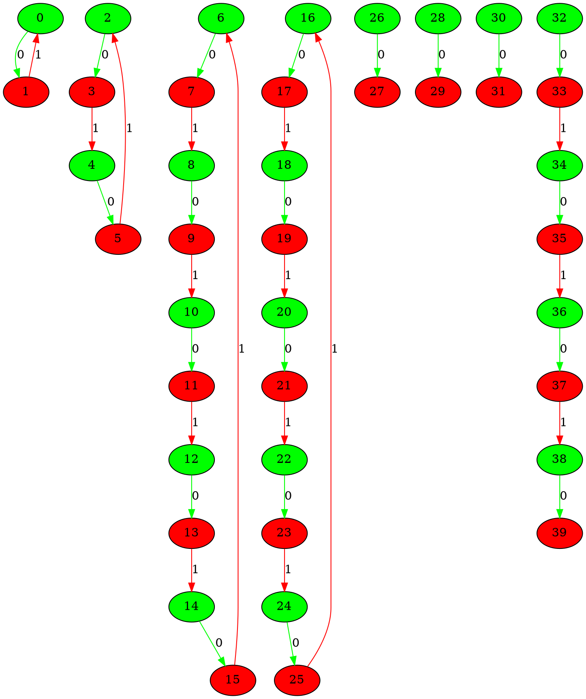
```graphviz
digraph G {
0[label="0" fillcolor="green" style="filled"];
1[label="1" fillcolor="red" style="filled"];
2[label="2" fillcolor="green" style="filled"];
3[label="3" fillcolor="red" style="filled"];
4[label="4" fillcolor="green" style="filled"];
5[label="5" fillcolor="red" style="filled"];
6[label="6" fillcolor="green" style="filled"];
7[label="7" fillcolor="red" style="filled"];
8[label="8" fillcolor="green" style="filled"];
9[label="9" fillcolor="red" style="filled"];
10[label="10" fillcolor="green" style="filled"];
11[label="11" fillcolor="red" style="filled"];
12[label="12" fillcolor="green" style="filled"];
13[label="13" fillcolor="red" style="filled"];
14[label="14" fillcolor="green" style="filled"];
15[label="15" fillcolor="red" style="filled"];
16[label="16" fillcolor="green" style="filled"];
17[label="17" fillcolor="red" style="filled"];
18[label="18" fillcolor="green" style="filled"];
19[label="19" fillcolor="red" style="filled"];
20[label="20" fillcolor="green" style="filled"];
21[label="21" fillcolor="red" style="filled"];
22[label="22" fillcolor="green" style="filled"];
23[label="23" fillcolor="red" style="filled"];
24[label="24" fillcolor="green" style="filled"];
25[label="25" fillcolor="red" style="filled"];
26[label="26" fillcolor="green" style="filled"];
27[label="27" fillcolor="red" style="filled"];
28[label="28" fillcolor="green" style="filled"];
29[label="29" fillcolor="red" style="filled"];
30[label="30" fillcolor="green" style="filled"];
31[label="31" fillcolor="red" style="filled"];
32[label="32" fillcolor="green" style="filled"];
33[label="33" fillcolor="red" style="filled"];
34[label="34" fillcolor="green" style="filled"];
35[label="35" fillcolor="red" style="filled"];
36[label="36" fillcolor="green" style="filled"];
37[label="37" fillcolor="red" style="filled"];
38[label="38" fillcolor="green" style="filled"];
39[label="39" fillcolor="red" style="filled"];
0->1 [label="0" color="green"];
1->0 [label="1" color="red"];
2->3 [label="0" color="green"];
3->4 [label="1" color="red"];
4->5 [label="0" color="green"];
5->2 [label="1" color="red"];
6->7 [label="0" color="green"];
7->8 [label="1" color="red"];
8->9 [label="0" color="green"];
9->10 [label="1" color="red"];
10->11 [label="0" color="green"];
11->12 [label="1" color="red"];
12->13 [label="0" color="green"];
13->14 [label="1" color="red"];
14->15 [label="0" color="green"];
15->6 [label="1" color="red"];
16->17 [label="0" color="green"];
17->18 [label="1" color="red"];
18->19 [label="0" color="green"];
19->20 [label="1" color="red"];
20->21 [label="0" color="green"];
21->22 [label="1" color="red"];
22->23 [label="0" color="green"];
23->24 [label="1" color="red"];
24->25 [label="0" color="green"];
25->16 [label="1" color="red"];
26->27 [label="0" color="green"];
28->29 [label="0" color="green"];
30->31 [label="0" color="green"];
32->33 [label="0" color="green"];
33->34 [label="1" color="red"];
34->35 [label="0" color="green"];
35->36 [label="1" color="red"];
36->37 [label="0" color="green"];
37->38 [label="1" color="red"];
38->39 [label="0" color="green"];
}
```
___
## Graph 12416 - list de compréhension : 1,4|1,1,1,2,5,5
___
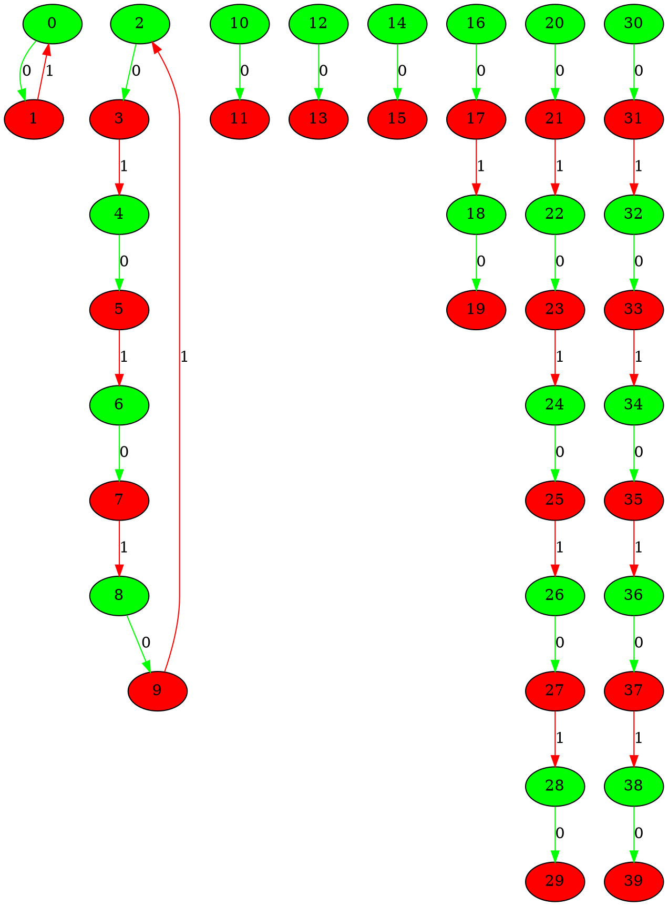
```graphviz
digraph G {
0[label="0" fillcolor="green" style="filled"];
1[label="1" fillcolor="red" style="filled"];
2[label="2" fillcolor="green" style="filled"];
3[label="3" fillcolor="red" style="filled"];
4[label="4" fillcolor="green" style="filled"];
5[label="5" fillcolor="red" style="filled"];
6[label="6" fillcolor="green" style="filled"];
7[label="7" fillcolor="red" style="filled"];
8[label="8" fillcolor="green" style="filled"];
9[label="9" fillcolor="red" style="filled"];
10[label="10" fillcolor="green" style="filled"];
11[label="11" fillcolor="red" style="filled"];
12[label="12" fillcolor="green" style="filled"];
13[label="13" fillcolor="red" style="filled"];
14[label="14" fillcolor="green" style="filled"];
15[label="15" fillcolor="red" style="filled"];
16[label="16" fillcolor="green" style="filled"];
17[label="17" fillcolor="red" style="filled"];
18[label="18" fillcolor="green" style="filled"];
19[label="19" fillcolor="red" style="filled"];
20[label="20" fillcolor="green" style="filled"];
21[label="21" fillcolor="red" style="filled"];
22[label="22" fillcolor="green" style="filled"];
23[label="23" fillcolor="red" style="filled"];
24[label="24" fillcolor="green" style="filled"];
25[label="25" fillcolor="red" style="filled"];
26[label="26" fillcolor="green" style="filled"];
27[label="27" fillcolor="red" style="filled"];
28[label="28" fillcolor="green" style="filled"];
29[label="29" fillcolor="red" style="filled"];
30[label="30" fillcolor="green" style="filled"];
31[label="31" fillcolor="red" style="filled"];
32[label="32" fillcolor="green" style="filled"];
33[label="33" fillcolor="red" style="filled"];
34[label="34" fillcolor="green" style="filled"];
35[label="35" fillcolor="red" style="filled"];
36[label="36" fillcolor="green" style="filled"];
37[label="37" fillcolor="red" style="filled"];
38[label="38" fillcolor="green" style="filled"];
39[label="39" fillcolor="red" style="filled"];
0->1 [label="0" color="green"];
1->0 [label="1" color="red"];
2->3 [label="0" color="green"];
3->4 [label="1" color="red"];
4->5 [label="0" color="green"];
5->6 [label="1" color="red"];
6->7 [label="0" color="green"];
7->8 [label="1" color="red"];
8->9 [label="0" color="green"];
9->2 [label="1" color="red"];
10->11 [label="0" color="green"];
12->13 [label="0" color="green"];
14->15 [label="0" color="green"];
16->17 [label="0" color="green"];
17->18 [label="1" color="red"];
18->19 [label="0" color="green"];
20->21 [label="0" color="green"];
21->22 [label="1" color="red"];
22->23 [label="0" color="green"];
23->24 [label="1" color="red"];
24->25 [label="0" color="green"];
25->26 [label="1" color="red"];
26->27 [label="0" color="green"];
27->28 [label="1" color="red"];
28->29 [label="0" color="green"];
30->31 [label="0" color="green"];
31->32 [label="1" color="red"];
32->33 [label="0" color="green"];
33->34 [label="1" color="red"];
34->35 [label="0" color="green"];
35->36 [label="1" color="red"];
36->37 [label="0" color="green"];
37->38 [label="1" color="red"];
38->39 [label="0" color="green"];
}
```
___
## Graph 12417 - list de compréhension : 1,4,5|1,1,1,2,5
___
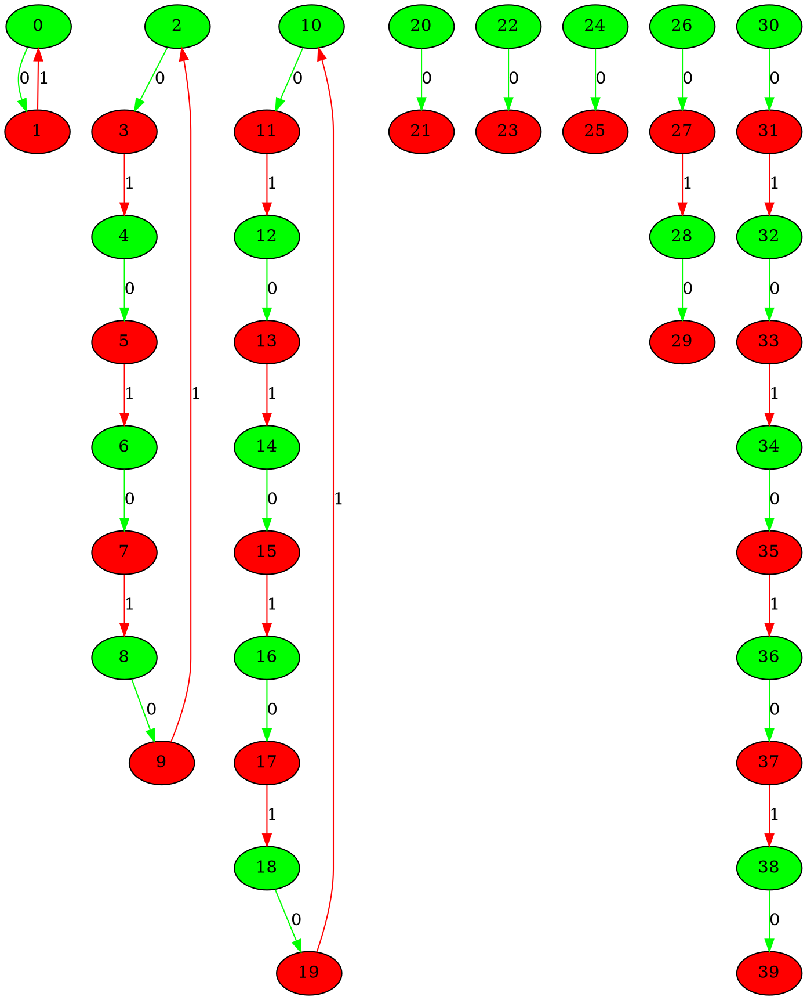
```graphviz
digraph G {
0[label="0" fillcolor="green" style="filled"];
1[label="1" fillcolor="red" style="filled"];
2[label="2" fillcolor="green" style="filled"];
3[label="3" fillcolor="red" style="filled"];
4[label="4" fillcolor="green" style="filled"];
5[label="5" fillcolor="red" style="filled"];
6[label="6" fillcolor="green" style="filled"];
7[label="7" fillcolor="red" style="filled"];
8[label="8" fillcolor="green" style="filled"];
9[label="9" fillcolor="red" style="filled"];
10[label="10" fillcolor="green" style="filled"];
11[label="11" fillcolor="red" style="filled"];
12[label="12" fillcolor="green" style="filled"];
13[label="13" fillcolor="red" style="filled"];
14[label="14" fillcolor="green" style="filled"];
15[label="15" fillcolor="red" style="filled"];
16[label="16" fillcolor="green" style="filled"];
17[label="17" fillcolor="red" style="filled"];
18[label="18" fillcolor="green" style="filled"];
19[label="19" fillcolor="red" style="filled"];
20[label="20" fillcolor="green" style="filled"];
21[label="21" fillcolor="red" style="filled"];
22[label="22" fillcolor="green" style="filled"];
23[label="23" fillcolor="red" style="filled"];
24[label="24" fillcolor="green" style="filled"];
25[label="25" fillcolor="red" style="filled"];
26[label="26" fillcolor="green" style="filled"];
27[label="27" fillcolor="red" style="filled"];
28[label="28" fillcolor="green" style="filled"];
29[label="29" fillcolor="red" style="filled"];
30[label="30" fillcolor="green" style="filled"];
31[label="31" fillcolor="red" style="filled"];
32[label="32" fillcolor="green" style="filled"];
33[label="33" fillcolor="red" style="filled"];
34[label="34" fillcolor="green" style="filled"];
35[label="35" fillcolor="red" style="filled"];
36[label="36" fillcolor="green" style="filled"];
37[label="37" fillcolor="red" style="filled"];
38[label="38" fillcolor="green" style="filled"];
39[label="39" fillcolor="red" style="filled"];
0->1 [label="0" color="green"];
1->0 [label="1" color="red"];
2->3 [label="0" color="green"];
3->4 [label="1" color="red"];
4->5 [label="0" color="green"];
5->6 [label="1" color="red"];
6->7 [label="0" color="green"];
7->8 [label="1" color="red"];
8->9 [label="0" color="green"];
9->2 [label="1" color="red"];
10->11 [label="0" color="green"];
11->12 [label="1" color="red"];
12->13 [label="0" color="green"];
13->14 [label="1" color="red"];
14->15 [label="0" color="green"];
15->16 [label="1" color="red"];
16->17 [label="0" color="green"];
17->18 [label="1" color="red"];
18->19 [label="0" color="green"];
19->10 [label="1" color="red"];
20->21 [label="0" color="green"];
22->23 [label="0" color="green"];
24->25 [label="0" color="green"];
26->27 [label="0" color="green"];
27->28 [label="1" color="red"];
28->29 [label="0" color="green"];
30->31 [label="0" color="green"];
31->32 [label="1" color="red"];
32->33 [label="0" color="green"];
33->34 [label="1" color="red"];
34->35 [label="0" color="green"];
35->36 [label="1" color="red"];
36->37 [label="0" color="green"];
37->38 [label="1" color="red"];
38->39 [label="0" color="green"];
}
```
___
## Graph 12418 - list de compréhension : 1,4,5,5|1,1,1,2
___
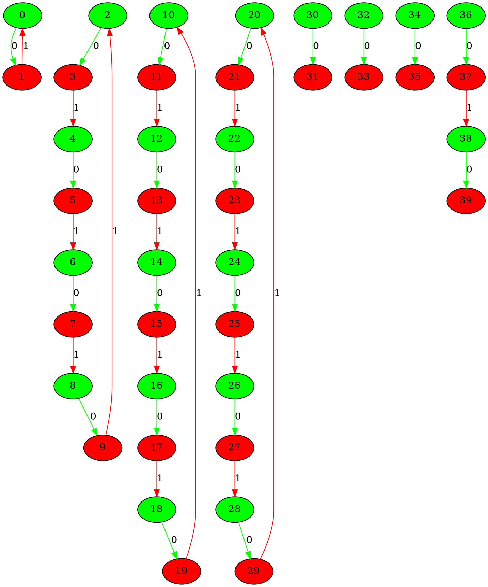
```graphviz
digraph G {
0[label="0" fillcolor="green" style="filled"];
1[label="1" fillcolor="red" style="filled"];
2[label="2" fillcolor="green" style="filled"];
3[label="3" fillcolor="red" style="filled"];
4[label="4" fillcolor="green" style="filled"];
5[label="5" fillcolor="red" style="filled"];
6[label="6" fillcolor="green" style="filled"];
7[label="7" fillcolor="red" style="filled"];
8[label="8" fillcolor="green" style="filled"];
9[label="9" fillcolor="red" style="filled"];
10[label="10" fillcolor="green" style="filled"];
11[label="11" fillcolor="red" style="filled"];
12[label="12" fillcolor="green" style="filled"];
13[label="13" fillcolor="red" style="filled"];
14[label="14" fillcolor="green" style="filled"];
15[label="15" fillcolor="red" style="filled"];
16[label="16" fillcolor="green" style="filled"];
17[label="17" fillcolor="red" style="filled"];
18[label="18" fillcolor="green" style="filled"];
19[label="19" fillcolor="red" style="filled"];
20[label="20" fillcolor="green" style="filled"];
21[label="21" fillcolor="red" style="filled"];
22[label="22" fillcolor="green" style="filled"];
23[label="23" fillcolor="red" style="filled"];
24[label="24" fillcolor="green" style="filled"];
25[label="25" fillcolor="red" style="filled"];
26[label="26" fillcolor="green" style="filled"];
27[label="27" fillcolor="red" style="filled"];
28[label="28" fillcolor="green" style="filled"];
29[label="29" fillcolor="red" style="filled"];
30[label="30" fillcolor="green" style="filled"];
31[label="31" fillcolor="red" style="filled"];
32[label="32" fillcolor="green" style="filled"];
33[label="33" fillcolor="red" style="filled"];
34[label="34" fillcolor="green" style="filled"];
35[label="35" fillcolor="red" style="filled"];
36[label="36" fillcolor="green" style="filled"];
37[label="37" fillcolor="red" style="filled"];
38[label="38" fillcolor="green" style="filled"];
39[label="39" fillcolor="red" style="filled"];
0->1 [label="0" color="green"];
1->0 [label="1" color="red"];
2->3 [label="0" color="green"];
3->4 [label="1" color="red"];
4->5 [label="0" color="green"];
5->6 [label="1" color="red"];
6->7 [label="0" color="green"];
7->8 [label="1" color="red"];
8->9 [label="0" color="green"];
9->2 [label="1" color="red"];
10->11 [label="0" color="green"];
11->12 [label="1" color="red"];
12->13 [label="0" color="green"];
13->14 [label="1" color="red"];
14->15 [label="0" color="green"];
15->16 [label="1" color="red"];
16->17 [label="0" color="green"];
17->18 [label="1" color="red"];
18->19 [label="0" color="green"];
19->10 [label="1" color="red"];
20->21 [label="0" color="green"];
21->22 [label="1" color="red"];
22->23 [label="0" color="green"];
23->24 [label="1" color="red"];
24->25 [label="0" color="green"];
25->26 [label="1" color="red"];
26->27 [label="0" color="green"];
27->28 [label="1" color="red"];
28->29 [label="0" color="green"];
29->20 [label="1" color="red"];
30->31 [label="0" color="green"];
32->33 [label="0" color="green"];
34->35 [label="0" color="green"];
36->37 [label="0" color="green"];
37->38 [label="1" color="red"];
38->39 [label="0" color="green"];
}
```
___
## Graph 12419 - list de compréhension : 1,5|1,1,1,2,4,5
___
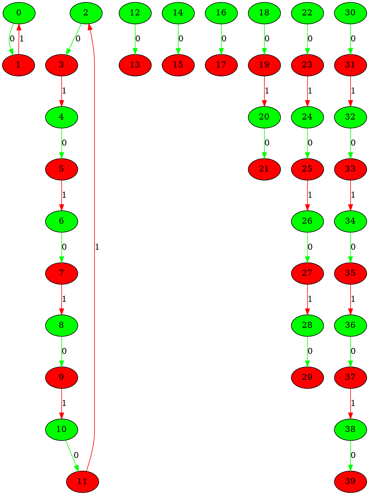
```graphviz
digraph G {
0[label="0" fillcolor="green" style="filled"];
1[label="1" fillcolor="red" style="filled"];
2[label="2" fillcolor="green" style="filled"];
3[label="3" fillcolor="red" style="filled"];
4[label="4" fillcolor="green" style="filled"];
5[label="5" fillcolor="red" style="filled"];
6[label="6" fillcolor="green" style="filled"];
7[label="7" fillcolor="red" style="filled"];
8[label="8" fillcolor="green" style="filled"];
9[label="9" fillcolor="red" style="filled"];
10[label="10" fillcolor="green" style="filled"];
11[label="11" fillcolor="red" style="filled"];
12[label="12" fillcolor="green" style="filled"];
13[label="13" fillcolor="red" style="filled"];
14[label="14" fillcolor="green" style="filled"];
15[label="15" fillcolor="red" style="filled"];
16[label="16" fillcolor="green" style="filled"];
17[label="17" fillcolor="red" style="filled"];
18[label="18" fillcolor="green" style="filled"];
19[label="19" fillcolor="red" style="filled"];
20[label="20" fillcolor="green" style="filled"];
21[label="21" fillcolor="red" style="filled"];
22[label="22" fillcolor="green" style="filled"];
23[label="23" fillcolor="red" style="filled"];
24[label="24" fillcolor="green" style="filled"];
25[label="25" fillcolor="red" style="filled"];
26[label="26" fillcolor="green" style="filled"];
27[label="27" fillcolor="red" style="filled"];
28[label="28" fillcolor="green" style="filled"];
29[label="29" fillcolor="red" style="filled"];
30[label="30" fillcolor="green" style="filled"];
31[label="31" fillcolor="red" style="filled"];
32[label="32" fillcolor="green" style="filled"];
33[label="33" fillcolor="red" style="filled"];
34[label="34" fillcolor="green" style="filled"];
35[label="35" fillcolor="red" style="filled"];
36[label="36" fillcolor="green" style="filled"];
37[label="37" fillcolor="red" style="filled"];
38[label="38" fillcolor="green" style="filled"];
39[label="39" fillcolor="red" style="filled"];
0->1 [label="0" color="green"];
1->0 [label="1" color="red"];
2->3 [label="0" color="green"];
3->4 [label="1" color="red"];
4->5 [label="0" color="green"];
5->6 [label="1" color="red"];
6->7 [label="0" color="green"];
7->8 [label="1" color="red"];
8->9 [label="0" color="green"];
9->10 [label="1" color="red"];
10->11 [label="0" color="green"];
11->2 [label="1" color="red"];
12->13 [label="0" color="green"];
14->15 [label="0" color="green"];
16->17 [label="0" color="green"];
18->19 [label="0" color="green"];
19->20 [label="1" color="red"];
20->21 [label="0" color="green"];
22->23 [label="0" color="green"];
23->24 [label="1" color="red"];
24->25 [label="0" color="green"];
25->26 [label="1" color="red"];
26->27 [label="0" color="green"];
27->28 [label="1" color="red"];
28->29 [label="0" color="green"];
30->31 [label="0" color="green"];
31->32 [label="1" color="red"];
32->33 [label="0" color="green"];
33->34 [label="1" color="red"];
34->35 [label="0" color="green"];
35->36 [label="1" color="red"];
36->37 [label="0" color="green"];
37->38 [label="1" color="red"];
38->39 [label="0" color="green"];
}
```
___
## Graph 12420 - list de compréhension : 1,5,5|1,1,1,2,4
___
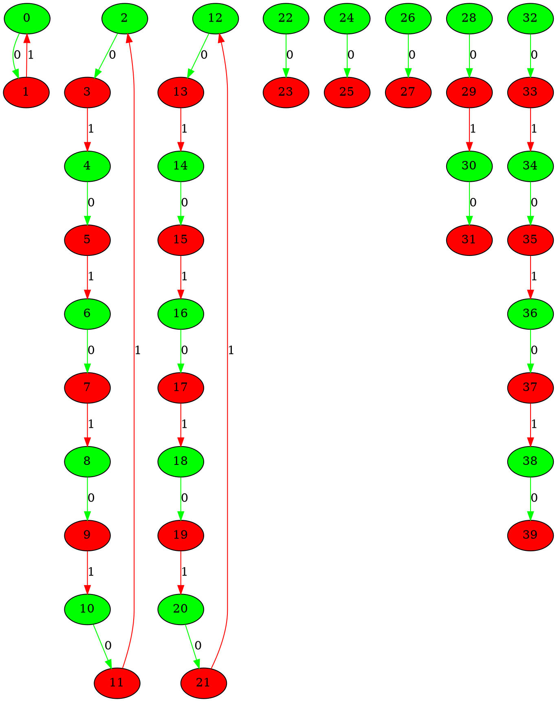
```graphviz
digraph G {
0[label="0" fillcolor="green" style="filled"];
1[label="1" fillcolor="red" style="filled"];
2[label="2" fillcolor="green" style="filled"];
3[label="3" fillcolor="red" style="filled"];
4[label="4" fillcolor="green" style="filled"];
5[label="5" fillcolor="red" style="filled"];
6[label="6" fillcolor="green" style="filled"];
7[label="7" fillcolor="red" style="filled"];
8[label="8" fillcolor="green" style="filled"];
9[label="9" fillcolor="red" style="filled"];
10[label="10" fillcolor="green" style="filled"];
11[label="11" fillcolor="red" style="filled"];
12[label="12" fillcolor="green" style="filled"];
13[label="13" fillcolor="red" style="filled"];
14[label="14" fillcolor="green" style="filled"];
15[label="15" fillcolor="red" style="filled"];
16[label="16" fillcolor="green" style="filled"];
17[label="17" fillcolor="red" style="filled"];
18[label="18" fillcolor="green" style="filled"];
19[label="19" fillcolor="red" style="filled"];
20[label="20" fillcolor="green" style="filled"];
21[label="21" fillcolor="red" style="filled"];
22[label="22" fillcolor="green" style="filled"];
23[label="23" fillcolor="red" style="filled"];
24[label="24" fillcolor="green" style="filled"];
25[label="25" fillcolor="red" style="filled"];
26[label="26" fillcolor="green" style="filled"];
27[label="27" fillcolor="red" style="filled"];
28[label="28" fillcolor="green" style="filled"];
29[label="29" fillcolor="red" style="filled"];
30[label="30" fillcolor="green" style="filled"];
31[label="31" fillcolor="red" style="filled"];
32[label="32" fillcolor="green" style="filled"];
33[label="33" fillcolor="red" style="filled"];
34[label="34" fillcolor="green" style="filled"];
35[label="35" fillcolor="red" style="filled"];
36[label="36" fillcolor="green" style="filled"];
37[label="37" fillcolor="red" style="filled"];
38[label="38" fillcolor="green" style="filled"];
39[label="39" fillcolor="red" style="filled"];
0->1 [label="0" color="green"];
1->0 [label="1" color="red"];
2->3 [label="0" color="green"];
3->4 [label="1" color="red"];
4->5 [label="0" color="green"];
5->6 [label="1" color="red"];
6->7 [label="0" color="green"];
7->8 [label="1" color="red"];
8->9 [label="0" color="green"];
9->10 [label="1" color="red"];
10->11 [label="0" color="green"];
11->2 [label="1" color="red"];
12->13 [label="0" color="green"];
13->14 [label="1" color="red"];
14->15 [label="0" color="green"];
15->16 [label="1" color="red"];
16->17 [label="0" color="green"];
17->18 [label="1" color="red"];
18->19 [label="0" color="green"];
19->20 [label="1" color="red"];
20->21 [label="0" color="green"];
21->12 [label="1" color="red"];
22->23 [label="0" color="green"];
24->25 [label="0" color="green"];
26->27 [label="0" color="green"];
28->29 [label="0" color="green"];
29->30 [label="1" color="red"];
30->31 [label="0" color="green"];
32->33 [label="0" color="green"];
33->34 [label="1" color="red"];
34->35 [label="0" color="green"];
35->36 [label="1" color="red"];
36->37 [label="0" color="green"];
37->38 [label="1" color="red"];
38->39 [label="0" color="green"];
}
```
___
## Graph 12421 - list de compréhension : 2|1,1,1,1,4,5,5
___
```graphviz
digraph G {
0[label="0" fillcolor="green" style="filled"];
1[label="1" fillcolor="red" style="filled"];
2[label="2" fillcolor="green" style="filled"];
3[label="3" fillcolor="red" style="filled"];
4[label="4" fillcolor="green" style="filled"];
5[label="5" fillcolor="red" style="filled"];
6[label="6" fillcolor="green" style="filled"];
7[label="7" fillcolor="red" style="filled"];
8[label="8" fillcolor="green" style="filled"];
9[label="9" fillcolor="red" style="filled"];
10[label="10" fillcolor="green" style="filled"];
11[label="11" fillcolor="red" style="filled"];
12[label="12" fillcolor="green" style="filled"];
13[label="13" fillcolor="red" style="filled"];
14[label="14" fillcolor="green" style="filled"];
15[label="15" fillcolor="red" style="filled"];
16[label="16" fillcolor="green" style="filled"];
17[label="17" fillcolor="red" style="filled"];
18[label="18" fillcolor="green" style="filled"];
19[label="19" fillcolor="red" style="filled"];
20[label="20" fillcolor="green" style="filled"];
21[label="21" fillcolor="red" style="filled"];
22[label="22" fillcolor="green" style="filled"];
23[label="23" fillcolor="red" style="filled"];
24[label="24" fillcolor="green" style="filled"];
25[label="25" fillcolor="red" style="filled"];
26[label="26" fillcolor="green" style="filled"];
27[label="27" fillcolor="red" style="filled"];
28[label="28" fillcolor="green" style="filled"];
29[label="29" fillcolor="red" style="filled"];
30[label="30" fillcolor="green" style="filled"];
31[label="31" fillcolor="red" style="filled"];
32[label="32" fillcolor="green" style="filled"];
33[label="33" fillcolor="red" style="filled"];
34[label="34" fillcolor="green" style="filled"];
35[label="35" fillcolor="red" style="filled"];
36[label="36" fillcolor="green" style="filled"];
37[label="37" fillcolor="red" style="filled"];
38[label="38" fillcolor="green" style="filled"];
39[label="39" fillcolor="red" style="filled"];
0->1 [label="0" color="green"];
1->2 [label="1" color="red"];
2->3 [label="0" color="green"];
3->0 [label="1" color="red"];
4->5 [label="0" color="green"];
6->7 [label="0" color="green"];
8->9 [label="0" color="green"];
10->11 [label="0" color="green"];
12->13 [label="0" color="green"];
13->14 [label="1" color="red"];
14->15 [label="0" color="green"];
15->16 [label="1" color="red"];
16->17 [label="0" color="green"];
17->18 [label="1" color="red"];
18->19 [label="0" color="green"];
20->21 [label="0" color="green"];
21->22 [label="1" color="red"];
22->23 [label="0" color="green"];
23->24 [label="1" color="red"];
24->25 [label="0" color="green"];
25->26 [label="1" color="red"];
26->27 [label="0" color="green"];
27->28 [label="1" color="red"];
28->29 [label="0" color="green"];
30->31 [label="0" color="green"];
31->32 [label="1" color="red"];
32->33 [label="0" color="green"];
33->34 [label="1" color="red"];
34->35 [label="0" color="green"];
35->36 [label="1" color="red"];
36->37 [label="0" color="green"];
37->38 [label="1" color="red"];
38->39 [label="0" color="green"];
}
```
___
## Graph 12422 - list de compréhension : 2,4|1,1,1,1,5,5
___
```graphviz
digraph G {
0[label="0" fillcolor="green" style="filled"];
1[label="1" fillcolor="red" style="filled"];
2[label="2" fillcolor="green" style="filled"];
3[label="3" fillcolor="red" style="filled"];
4[label="4" fillcolor="green" style="filled"];
5[label="5" fillcolor="red" style="filled"];
6[label="6" fillcolor="green" style="filled"];
7[label="7" fillcolor="red" style="filled"];
8[label="8" fillcolor="green" style="filled"];
9[label="9" fillcolor="red" style="filled"];
10[label="10" fillcolor="green" style="filled"];
11[label="11" fillcolor="red" style="filled"];
12[label="12" fillcolor="green" style="filled"];
13[label="13" fillcolor="red" style="filled"];
14[label="14" fillcolor="green" style="filled"];
15[label="15" fillcolor="red" style="filled"];
16[label="16" fillcolor="green" style="filled"];
17[label="17" fillcolor="red" style="filled"];
18[label="18" fillcolor="green" style="filled"];
19[label="19" fillcolor="red" style="filled"];
20[label="20" fillcolor="green" style="filled"];
21[label="21" fillcolor="red" style="filled"];
22[label="22" fillcolor="green" style="filled"];
23[label="23" fillcolor="red" style="filled"];
24[label="24" fillcolor="green" style="filled"];
25[label="25" fillcolor="red" style="filled"];
26[label="26" fillcolor="green" style="filled"];
27[label="27" fillcolor="red" style="filled"];
28[label="28" fillcolor="green" style="filled"];
29[label="29" fillcolor="red" style="filled"];
30[label="30" fillcolor="green" style="filled"];
31[label="31" fillcolor="red" style="filled"];
32[label="32" fillcolor="green" style="filled"];
33[label="33" fillcolor="red" style="filled"];
34[label="34" fillcolor="green" style="filled"];
35[label="35" fillcolor="red" style="filled"];
36[label="36" fillcolor="green" style="filled"];
37[label="37" fillcolor="red" style="filled"];
38[label="38" fillcolor="green" style="filled"];
39[label="39" fillcolor="red" style="filled"];
0->1 [label="0" color="green"];
1->2 [label="1" color="red"];
2->3 [label="0" color="green"];
3->0 [label="1" color="red"];
4->5 [label="0" color="green"];
5->6 [label="1" color="red"];
6->7 [label="0" color="green"];
7->8 [label="1" color="red"];
8->9 [label="0" color="green"];
9->10 [label="1" color="red"];
10->11 [label="0" color="green"];
11->4 [label="1" color="red"];
12->13 [label="0" color="green"];
14->15 [label="0" color="green"];
16->17 [label="0" color="green"];
18->19 [label="0" color="green"];
20->21 [label="0" color="green"];
21->22 [label="1" color="red"];
22->23 [label="0" color="green"];
23->24 [label="1" color="red"];
24->25 [label="0" color="green"];
25->26 [label="1" color="red"];
26->27 [label="0" color="green"];
27->28 [label="1" color="red"];
28->29 [label="0" color="green"];
30->31 [label="0" color="green"];
31->32 [label="1" color="red"];
32->33 [label="0" color="green"];
33->34 [label="1" color="red"];
34->35 [label="0" color="green"];
35->36 [label="1" color="red"];
36->37 [label="0" color="green"];
37->38 [label="1" color="red"];
38->39 [label="0" color="green"];
}
```
___
## Graph 12423 - list de compréhension : 2,4,5|1,1,1,1,5
___
```graphviz
digraph G {
0[label="0" fillcolor="green" style="filled"];
1[label="1" fillcolor="red" style="filled"];
2[label="2" fillcolor="green" style="filled"];
3[label="3" fillcolor="red" style="filled"];
4[label="4" fillcolor="green" style="filled"];
5[label="5" fillcolor="red" style="filled"];
6[label="6" fillcolor="green" style="filled"];
7[label="7" fillcolor="red" style="filled"];
8[label="8" fillcolor="green" style="filled"];
9[label="9" fillcolor="red" style="filled"];
10[label="10" fillcolor="green" style="filled"];
11[label="11" fillcolor="red" style="filled"];
12[label="12" fillcolor="green" style="filled"];
13[label="13" fillcolor="red" style="filled"];
14[label="14" fillcolor="green" style="filled"];
15[label="15" fillcolor="red" style="filled"];
16[label="16" fillcolor="green" style="filled"];
17[label="17" fillcolor="red" style="filled"];
18[label="18" fillcolor="green" style="filled"];
19[label="19" fillcolor="red" style="filled"];
20[label="20" fillcolor="green" style="filled"];
21[label="21" fillcolor="red" style="filled"];
22[label="22" fillcolor="green" style="filled"];
23[label="23" fillcolor="red" style="filled"];
24[label="24" fillcolor="green" style="filled"];
25[label="25" fillcolor="red" style="filled"];
26[label="26" fillcolor="green" style="filled"];
27[label="27" fillcolor="red" style="filled"];
28[label="28" fillcolor="green" style="filled"];
29[label="29" fillcolor="red" style="filled"];
30[label="30" fillcolor="green" style="filled"];
31[label="31" fillcolor="red" style="filled"];
32[label="32" fillcolor="green" style="filled"];
33[label="33" fillcolor="red" style="filled"];
34[label="34" fillcolor="green" style="filled"];
35[label="35" fillcolor="red" style="filled"];
36[label="36" fillcolor="green" style="filled"];
37[label="37" fillcolor="red" style="filled"];
38[label="38" fillcolor="green" style="filled"];
39[label="39" fillcolor="red" style="filled"];
0->1 [label="0" color="green"];
1->2 [label="1" color="red"];
2->3 [label="0" color="green"];
3->0 [label="1" color="red"];
4->5 [label="0" color="green"];
5->6 [label="1" color="red"];
6->7 [label="0" color="green"];
7->8 [label="1" color="red"];
8->9 [label="0" color="green"];
9->10 [label="1" color="red"];
10->11 [label="0" color="green"];
11->4 [label="1" color="red"];
12->13 [label="0" color="green"];
13->14 [label="1" color="red"];
14->15 [label="0" color="green"];
15->16 [label="1" color="red"];
16->17 [label="0" color="green"];
17->18 [label="1" color="red"];
18->19 [label="0" color="green"];
19->20 [label="1" color="red"];
20->21 [label="0" color="green"];
21->12 [label="1" color="red"];
22->23 [label="0" color="green"];
24->25 [label="0" color="green"];
26->27 [label="0" color="green"];
28->29 [label="0" color="green"];
30->31 [label="0" color="green"];
31->32 [label="1" color="red"];
32->33 [label="0" color="green"];
33->34 [label="1" color="red"];
34->35 [label="0" color="green"];
35->36 [label="1" color="red"];
36->37 [label="0" color="green"];
37->38 [label="1" color="red"];
38->39 [label="0" color="green"];
}
```
___
## Graph 12424 - list de compréhension : 2,4,5,5|1,1,1,1
___
```graphviz
digraph G {
0[label="0" fillcolor="green" style="filled"];
1[label="1" fillcolor="red" style="filled"];
2[label="2" fillcolor="green" style="filled"];
3[label="3" fillcolor="red" style="filled"];
4[label="4" fillcolor="green" style="filled"];
5[label="5" fillcolor="red" style="filled"];
6[label="6" fillcolor="green" style="filled"];
7[label="7" fillcolor="red" style="filled"];
8[label="8" fillcolor="green" style="filled"];
9[label="9" fillcolor="red" style="filled"];
10[label="10" fillcolor="green" style="filled"];
11[label="11" fillcolor="red" style="filled"];
12[label="12" fillcolor="green" style="filled"];
13[label="13" fillcolor="red" style="filled"];
14[label="14" fillcolor="green" style="filled"];
15[label="15" fillcolor="red" style="filled"];
16[label="16" fillcolor="green" style="filled"];
17[label="17" fillcolor="red" style="filled"];
18[label="18" fillcolor="green" style="filled"];
19[label="19" fillcolor="red" style="filled"];
20[label="20" fillcolor="green" style="filled"];
21[label="21" fillcolor="red" style="filled"];
22[label="22" fillcolor="green" style="filled"];
23[label="23" fillcolor="red" style="filled"];
24[label="24" fillcolor="green" style="filled"];
25[label="25" fillcolor="red" style="filled"];
26[label="26" fillcolor="green" style="filled"];
27[label="27" fillcolor="red" style="filled"];
28[label="28" fillcolor="green" style="filled"];
29[label="29" fillcolor="red" style="filled"];
30[label="30" fillcolor="green" style="filled"];
31[label="31" fillcolor="red" style="filled"];
32[label="32" fillcolor="green" style="filled"];
33[label="33" fillcolor="red" style="filled"];
34[label="34" fillcolor="green" style="filled"];
35[label="35" fillcolor="red" style="filled"];
36[label="36" fillcolor="green" style="filled"];
37[label="37" fillcolor="red" style="filled"];
38[label="38" fillcolor="green" style="filled"];
39[label="39" fillcolor="red" style="filled"];
0->1 [label="0" color="green"];
1->2 [label="1" color="red"];
2->3 [label="0" color="green"];
3->0 [label="1" color="red"];
4->5 [label="0" color="green"];
5->6 [label="1" color="red"];
6->7 [label="0" color="green"];
7->8 [label="1" color="red"];
8->9 [label="0" color="green"];
9->10 [label="1" color="red"];
10->11 [label="0" color="green"];
11->4 [label="1" color="red"];
12->13 [label="0" color="green"];
13->14 [label="1" color="red"];
14->15 [label="0" color="green"];
15->16 [label="1" color="red"];
16->17 [label="0" color="green"];
17->18 [label="1" color="red"];
18->19 [label="0" color="green"];
19->20 [label="1" color="red"];
20->21 [label="0" color="green"];
21->12 [label="1" color="red"];
22->23 [label="0" color="green"];
23->24 [label="1" color="red"];
24->25 [label="0" color="green"];
25->26 [label="1" color="red"];
26->27 [label="0" color="green"];
27->28 [label="1" color="red"];
28->29 [label="0" color="green"];
29->30 [label="1" color="red"];
30->31 [label="0" color="green"];
31->22 [label="1" color="red"];
32->33 [label="0" color="green"];
34->35 [label="0" color="green"];
36->37 [label="0" color="green"];
38->39 [label="0" color="green"];
}
```
___
## Graph 12425 - list de compréhension : 2,5|1,1,1,1,4,5
___
```graphviz
digraph G {
0[label="0" fillcolor="green" style="filled"];
1[label="1" fillcolor="red" style="filled"];
2[label="2" fillcolor="green" style="filled"];
3[label="3" fillcolor="red" style="filled"];
4[label="4" fillcolor="green" style="filled"];
5[label="5" fillcolor="red" style="filled"];
6[label="6" fillcolor="green" style="filled"];
7[label="7" fillcolor="red" style="filled"];
8[label="8" fillcolor="green" style="filled"];
9[label="9" fillcolor="red" style="filled"];
10[label="10" fillcolor="green" style="filled"];
11[label="11" fillcolor="red" style="filled"];
12[label="12" fillcolor="green" style="filled"];
13[label="13" fillcolor="red" style="filled"];
14[label="14" fillcolor="green" style="filled"];
15[label="15" fillcolor="red" style="filled"];
16[label="16" fillcolor="green" style="filled"];
17[label="17" fillcolor="red" style="filled"];
18[label="18" fillcolor="green" style="filled"];
19[label="19" fillcolor="red" style="filled"];
20[label="20" fillcolor="green" style="filled"];
21[label="21" fillcolor="red" style="filled"];
22[label="22" fillcolor="green" style="filled"];
23[label="23" fillcolor="red" style="filled"];
24[label="24" fillcolor="green" style="filled"];
25[label="25" fillcolor="red" style="filled"];
26[label="26" fillcolor="green" style="filled"];
27[label="27" fillcolor="red" style="filled"];
28[label="28" fillcolor="green" style="filled"];
29[label="29" fillcolor="red" style="filled"];
30[label="30" fillcolor="green" style="filled"];
31[label="31" fillcolor="red" style="filled"];
32[label="32" fillcolor="green" style="filled"];
33[label="33" fillcolor="red" style="filled"];
34[label="34" fillcolor="green" style="filled"];
35[label="35" fillcolor="red" style="filled"];
36[label="36" fillcolor="green" style="filled"];
37[label="37" fillcolor="red" style="filled"];
38[label="38" fillcolor="green" style="filled"];
39[label="39" fillcolor="red" style="filled"];
0->1 [label="0" color="green"];
1->2 [label="1" color="red"];
2->3 [label="0" color="green"];
3->0 [label="1" color="red"];
4->5 [label="0" color="green"];
5->6 [label="1" color="red"];
6->7 [label="0" color="green"];
7->8 [label="1" color="red"];
8->9 [label="0" color="green"];
9->10 [label="1" color="red"];
10->11 [label="0" color="green"];
11->12 [label="1" color="red"];
12->13 [label="0" color="green"];
13->4 [label="1" color="red"];
14->15 [label="0" color="green"];
16->17 [label="0" color="green"];
18->19 [label="0" color="green"];
20->21 [label="0" color="green"];
22->23 [label="0" color="green"];
23->24 [label="1" color="red"];
24->25 [label="0" color="green"];
25->26 [label="1" color="red"];
26->27 [label="0" color="green"];
27->28 [label="1" color="red"];
28->29 [label="0" color="green"];
30->31 [label="0" color="green"];
31->32 [label="1" color="red"];
32->33 [label="0" color="green"];
33->34 [label="1" color="red"];
34->35 [label="0" color="green"];
35->36 [label="1" color="red"];
36->37 [label="0" color="green"];
37->38 [label="1" color="red"];
38->39 [label="0" color="green"];
}
```
___
## Graph 12426 - list de compréhension : 2,5,5|1,1,1,1,4
___
```graphviz
digraph G {
0[label="0" fillcolor="green" style="filled"];
1[label="1" fillcolor="red" style="filled"];
2[label="2" fillcolor="green" style="filled"];
3[label="3" fillcolor="red" style="filled"];
4[label="4" fillcolor="green" style="filled"];
5[label="5" fillcolor="red" style="filled"];
6[label="6" fillcolor="green" style="filled"];
7[label="7" fillcolor="red" style="filled"];
8[label="8" fillcolor="green" style="filled"];
9[label="9" fillcolor="red" style="filled"];
10[label="10" fillcolor="green" style="filled"];
11[label="11" fillcolor="red" style="filled"];
12[label="12" fillcolor="green" style="filled"];
13[label="13" fillcolor="red" style="filled"];
14[label="14" fillcolor="green" style="filled"];
15[label="15" fillcolor="red" style="filled"];
16[label="16" fillcolor="green" style="filled"];
17[label="17" fillcolor="red" style="filled"];
18[label="18" fillcolor="green" style="filled"];
19[label="19" fillcolor="red" style="filled"];
20[label="20" fillcolor="green" style="filled"];
21[label="21" fillcolor="red" style="filled"];
22[label="22" fillcolor="green" style="filled"];
23[label="23" fillcolor="red" style="filled"];
24[label="24" fillcolor="green" style="filled"];
25[label="25" fillcolor="red" style="filled"];
26[label="26" fillcolor="green" style="filled"];
27[label="27" fillcolor="red" style="filled"];
28[label="28" fillcolor="green" style="filled"];
29[label="29" fillcolor="red" style="filled"];
30[label="30" fillcolor="green" style="filled"];
31[label="31" fillcolor="red" style="filled"];
32[label="32" fillcolor="green" style="filled"];
33[label="33" fillcolor="red" style="filled"];
34[label="34" fillcolor="green" style="filled"];
35[label="35" fillcolor="red" style="filled"];
36[label="36" fillcolor="green" style="filled"];
37[label="37" fillcolor="red" style="filled"];
38[label="38" fillcolor="green" style="filled"];
39[label="39" fillcolor="red" style="filled"];
0->1 [label="0" color="green"];
1->2 [label="1" color="red"];
2->3 [label="0" color="green"];
3->0 [label="1" color="red"];
4->5 [label="0" color="green"];
5->6 [label="1" color="red"];
6->7 [label="0" color="green"];
7->8 [label="1" color="red"];
8->9 [label="0" color="green"];
9->10 [label="1" color="red"];
10->11 [label="0" color="green"];
11->12 [label="1" color="red"];
12->13 [label="0" color="green"];
13->4 [label="1" color="red"];
14->15 [label="0" color="green"];
15->16 [label="1" color="red"];
16->17 [label="0" color="green"];
17->18 [label="1" color="red"];
18->19 [label="0" color="green"];
19->20 [label="1" color="red"];
20->21 [label="0" color="green"];
21->22 [label="1" color="red"];
22->23 [label="0" color="green"];
23->14 [label="1" color="red"];
24->25 [label="0" color="green"];
26->27 [label="0" color="green"];
28->29 [label="0" color="green"];
30->31 [label="0" color="green"];
32->33 [label="0" color="green"];
33->34 [label="1" color="red"];
34->35 [label="0" color="green"];
35->36 [label="1" color="red"];
36->37 [label="0" color="green"];
37->38 [label="1" color="red"];
38->39 [label="0" color="green"];
}
```
___
## Graph 12427 - list de compréhension : 4|1,1,1,1,2,5,5
___
```graphviz
digraph G {
0[label="0" fillcolor="green" style="filled"];
1[label="1" fillcolor="red" style="filled"];
2[label="2" fillcolor="green" style="filled"];
3[label="3" fillcolor="red" style="filled"];
4[label="4" fillcolor="green" style="filled"];
5[label="5" fillcolor="red" style="filled"];
6[label="6" fillcolor="green" style="filled"];
7[label="7" fillcolor="red" style="filled"];
8[label="8" fillcolor="green" style="filled"];
9[label="9" fillcolor="red" style="filled"];
10[label="10" fillcolor="green" style="filled"];
11[label="11" fillcolor="red" style="filled"];
12[label="12" fillcolor="green" style="filled"];
13[label="13" fillcolor="red" style="filled"];
14[label="14" fillcolor="green" style="filled"];
15[label="15" fillcolor="red" style="filled"];
16[label="16" fillcolor="green" style="filled"];
17[label="17" fillcolor="red" style="filled"];
18[label="18" fillcolor="green" style="filled"];
19[label="19" fillcolor="red" style="filled"];
20[label="20" fillcolor="green" style="filled"];
21[label="21" fillcolor="red" style="filled"];
22[label="22" fillcolor="green" style="filled"];
23[label="23" fillcolor="red" style="filled"];
24[label="24" fillcolor="green" style="filled"];
25[label="25" fillcolor="red" style="filled"];
26[label="26" fillcolor="green" style="filled"];
27[label="27" fillcolor="red" style="filled"];
28[label="28" fillcolor="green" style="filled"];
29[label="29" fillcolor="red" style="filled"];
30[label="30" fillcolor="green" style="filled"];
31[label="31" fillcolor="red" style="filled"];
32[label="32" fillcolor="green" style="filled"];
33[label="33" fillcolor="red" style="filled"];
34[label="34" fillcolor="green" style="filled"];
35[label="35" fillcolor="red" style="filled"];
36[label="36" fillcolor="green" style="filled"];
37[label="37" fillcolor="red" style="filled"];
38[label="38" fillcolor="green" style="filled"];
39[label="39" fillcolor="red" style="filled"];
0->1 [label="0" color="green"];
1->2 [label="1" color="red"];
2->3 [label="0" color="green"];
3->4 [label="1" color="red"];
4->5 [label="0" color="green"];
5->6 [label="1" color="red"];
6->7 [label="0" color="green"];
7->0 [label="1" color="red"];
8->9 [label="0" color="green"];
10->11 [label="0" color="green"];
12->13 [label="0" color="green"];
14->15 [label="0" color="green"];
16->17 [label="0" color="green"];
17->18 [label="1" color="red"];
18->19 [label="0" color="green"];
20->21 [label="0" color="green"];
21->22 [label="1" color="red"];
22->23 [label="0" color="green"];
23->24 [label="1" color="red"];
24->25 [label="0" color="green"];
25->26 [label="1" color="red"];
26->27 [label="0" color="green"];
27->28 [label="1" color="red"];
28->29 [label="0" color="green"];
30->31 [label="0" color="green"];
31->32 [label="1" color="red"];
32->33 [label="0" color="green"];
33->34 [label="1" color="red"];
34->35 [label="0" color="green"];
35->36 [label="1" color="red"];
36->37 [label="0" color="green"];
37->38 [label="1" color="red"];
38->39 [label="0" color="green"];
}
```
___
## Graph 12428 - list de compréhension : 4,5|1,1,1,1,2,5
___
```graphviz
digraph G {
0[label="0" fillcolor="green" style="filled"];
1[label="1" fillcolor="red" style="filled"];
2[label="2" fillcolor="green" style="filled"];
3[label="3" fillcolor="red" style="filled"];
4[label="4" fillcolor="green" style="filled"];
5[label="5" fillcolor="red" style="filled"];
6[label="6" fillcolor="green" style="filled"];
7[label="7" fillcolor="red" style="filled"];
8[label="8" fillcolor="green" style="filled"];
9[label="9" fillcolor="red" style="filled"];
10[label="10" fillcolor="green" style="filled"];
11[label="11" fillcolor="red" style="filled"];
12[label="12" fillcolor="green" style="filled"];
13[label="13" fillcolor="red" style="filled"];
14[label="14" fillcolor="green" style="filled"];
15[label="15" fillcolor="red" style="filled"];
16[label="16" fillcolor="green" style="filled"];
17[label="17" fillcolor="red" style="filled"];
18[label="18" fillcolor="green" style="filled"];
19[label="19" fillcolor="red" style="filled"];
20[label="20" fillcolor="green" style="filled"];
21[label="21" fillcolor="red" style="filled"];
22[label="22" fillcolor="green" style="filled"];
23[label="23" fillcolor="red" style="filled"];
24[label="24" fillcolor="green" style="filled"];
25[label="25" fillcolor="red" style="filled"];
26[label="26" fillcolor="green" style="filled"];
27[label="27" fillcolor="red" style="filled"];
28[label="28" fillcolor="green" style="filled"];
29[label="29" fillcolor="red" style="filled"];
30[label="30" fillcolor="green" style="filled"];
31[label="31" fillcolor="red" style="filled"];
32[label="32" fillcolor="green" style="filled"];
33[label="33" fillcolor="red" style="filled"];
34[label="34" fillcolor="green" style="filled"];
35[label="35" fillcolor="red" style="filled"];
36[label="36" fillcolor="green" style="filled"];
37[label="37" fillcolor="red" style="filled"];
38[label="38" fillcolor="green" style="filled"];
39[label="39" fillcolor="red" style="filled"];
0->1 [label="0" color="green"];
1->2 [label="1" color="red"];
2->3 [label="0" color="green"];
3->4 [label="1" color="red"];
4->5 [label="0" color="green"];
5->6 [label="1" color="red"];
6->7 [label="0" color="green"];
7->0 [label="1" color="red"];
8->9 [label="0" color="green"];
9->10 [label="1" color="red"];
10->11 [label="0" color="green"];
11->12 [label="1" color="red"];
12->13 [label="0" color="green"];
13->14 [label="1" color="red"];
14->15 [label="0" color="green"];
15->16 [label="1" color="red"];
16->17 [label="0" color="green"];
17->8 [label="1" color="red"];
18->19 [label="0" color="green"];
20->21 [label="0" color="green"];
22->23 [label="0" color="green"];
24->25 [label="0" color="green"];
26->27 [label="0" color="green"];
27->28 [label="1" color="red"];
28->29 [label="0" color="green"];
30->31 [label="0" color="green"];
31->32 [label="1" color="red"];
32->33 [label="0" color="green"];
33->34 [label="1" color="red"];
34->35 [label="0" color="green"];
35->36 [label="1" color="red"];
36->37 [label="0" color="green"];
37->38 [label="1" color="red"];
38->39 [label="0" color="green"];
}
```
___
## Graph 12429 - list de compréhension : 4,5,5|1,1,1,1,2
___
```graphviz
digraph G {
0[label="0" fillcolor="green" style="filled"];
1[label="1" fillcolor="red" style="filled"];
2[label="2" fillcolor="green" style="filled"];
3[label="3" fillcolor="red" style="filled"];
4[label="4" fillcolor="green" style="filled"];
5[label="5" fillcolor="red" style="filled"];
6[label="6" fillcolor="green" style="filled"];
7[label="7" fillcolor="red" style="filled"];
8[label="8" fillcolor="green" style="filled"];
9[label="9" fillcolor="red" style="filled"];
10[label="10" fillcolor="green" style="filled"];
11[label="11" fillcolor="red" style="filled"];
12[label="12" fillcolor="green" style="filled"];
13[label="13" fillcolor="red" style="filled"];
14[label="14" fillcolor="green" style="filled"];
15[label="15" fillcolor="red" style="filled"];
16[label="16" fillcolor="green" style="filled"];
17[label="17" fillcolor="red" style="filled"];
18[label="18" fillcolor="green" style="filled"];
19[label="19" fillcolor="red" style="filled"];
20[label="20" fillcolor="green" style="filled"];
21[label="21" fillcolor="red" style="filled"];
22[label="22" fillcolor="green" style="filled"];
23[label="23" fillcolor="red" style="filled"];
24[label="24" fillcolor="green" style="filled"];
25[label="25" fillcolor="red" style="filled"];
26[label="26" fillcolor="green" style="filled"];
27[label="27" fillcolor="red" style="filled"];
28[label="28" fillcolor="green" style="filled"];
29[label="29" fillcolor="red" style="filled"];
30[label="30" fillcolor="green" style="filled"];
31[label="31" fillcolor="red" style="filled"];
32[label="32" fillcolor="green" style="filled"];
33[label="33" fillcolor="red" style="filled"];
34[label="34" fillcolor="green" style="filled"];
35[label="35" fillcolor="red" style="filled"];
36[label="36" fillcolor="green" style="filled"];
37[label="37" fillcolor="red" style="filled"];
38[label="38" fillcolor="green" style="filled"];
39[label="39" fillcolor="red" style="filled"];
0->1 [label="0" color="green"];
1->2 [label="1" color="red"];
2->3 [label="0" color="green"];
3->4 [label="1" color="red"];
4->5 [label="0" color="green"];
5->6 [label="1" color="red"];
6->7 [label="0" color="green"];
7->0 [label="1" color="red"];
8->9 [label="0" color="green"];
9->10 [label="1" color="red"];
10->11 [label="0" color="green"];
11->12 [label="1" color="red"];
12->13 [label="0" color="green"];
13->14 [label="1" color="red"];
14->15 [label="0" color="green"];
15->16 [label="1" color="red"];
16->17 [label="0" color="green"];
17->8 [label="1" color="red"];
18->19 [label="0" color="green"];
19->20 [label="1" color="red"];
20->21 [label="0" color="green"];
21->22 [label="1" color="red"];
22->23 [label="0" color="green"];
23->24 [label="1" color="red"];
24->25 [label="0" color="green"];
25->26 [label="1" color="red"];
26->27 [label="0" color="green"];
27->18 [label="1" color="red"];
28->29 [label="0" color="green"];
30->31 [label="0" color="green"];
32->33 [label="0" color="green"];
34->35 [label="0" color="green"];
36->37 [label="0" color="green"];
37->38 [label="1" color="red"];
38->39 [label="0" color="green"];
}
```
___
## Graph 12430 - list de compréhension : 5|1,1,1,1,2,4,5
___
```graphviz
digraph G {
0[label="0" fillcolor="green" style="filled"];
1[label="1" fillcolor="red" style="filled"];
2[label="2" fillcolor="green" style="filled"];
3[label="3" fillcolor="red" style="filled"];
4[label="4" fillcolor="green" style="filled"];
5[label="5" fillcolor="red" style="filled"];
6[label="6" fillcolor="green" style="filled"];
7[label="7" fillcolor="red" style="filled"];
8[label="8" fillcolor="green" style="filled"];
9[label="9" fillcolor="red" style="filled"];
10[label="10" fillcolor="green" style="filled"];
11[label="11" fillcolor="red" style="filled"];
12[label="12" fillcolor="green" style="filled"];
13[label="13" fillcolor="red" style="filled"];
14[label="14" fillcolor="green" style="filled"];
15[label="15" fillcolor="red" style="filled"];
16[label="16" fillcolor="green" style="filled"];
17[label="17" fillcolor="red" style="filled"];
18[label="18" fillcolor="green" style="filled"];
19[label="19" fillcolor="red" style="filled"];
20[label="20" fillcolor="green" style="filled"];
21[label="21" fillcolor="red" style="filled"];
22[label="22" fillcolor="green" style="filled"];
23[label="23" fillcolor="red" style="filled"];
24[label="24" fillcolor="green" style="filled"];
25[label="25" fillcolor="red" style="filled"];
26[label="26" fillcolor="green" style="filled"];
27[label="27" fillcolor="red" style="filled"];
28[label="28" fillcolor="green" style="filled"];
29[label="29" fillcolor="red" style="filled"];
30[label="30" fillcolor="green" style="filled"];
31[label="31" fillcolor="red" style="filled"];
32[label="32" fillcolor="green" style="filled"];
33[label="33" fillcolor="red" style="filled"];
34[label="34" fillcolor="green" style="filled"];
35[label="35" fillcolor="red" style="filled"];
36[label="36" fillcolor="green" style="filled"];
37[label="37" fillcolor="red" style="filled"];
38[label="38" fillcolor="green" style="filled"];
39[label="39" fillcolor="red" style="filled"];
0->1 [label="0" color="green"];
1->2 [label="1" color="red"];
2->3 [label="0" color="green"];
3->4 [label="1" color="red"];
4->5 [label="0" color="green"];
5->6 [label="1" color="red"];
6->7 [label="0" color="green"];
7->8 [label="1" color="red"];
8->9 [label="0" color="green"];
9->0 [label="1" color="red"];
10->11 [label="0" color="green"];
12->13 [label="0" color="green"];
14->15 [label="0" color="green"];
16->17 [label="0" color="green"];
18->19 [label="0" color="green"];
19->20 [label="1" color="red"];
20->21 [label="0" color="green"];
22->23 [label="0" color="green"];
23->24 [label="1" color="red"];
24->25 [label="0" color="green"];
25->26 [label="1" color="red"];
26->27 [label="0" color="green"];
27->28 [label="1" color="red"];
28->29 [label="0" color="green"];
30->31 [label="0" color="green"];
31->32 [label="1" color="red"];
32->33 [label="0" color="green"];
33->34 [label="1" color="red"];
34->35 [label="0" color="green"];
35->36 [label="1" color="red"];
36->37 [label="0" color="green"];
37->38 [label="1" color="red"];
38->39 [label="0" color="green"];
}
```
___
## Graph 12431 - list de compréhension : 5,5|1,1,1,1,2,4
___
```graphviz
digraph G {
0[label="0" fillcolor="green" style="filled"];
1[label="1" fillcolor="red" style="filled"];
2[label="2" fillcolor="green" style="filled"];
3[label="3" fillcolor="red" style="filled"];
4[label="4" fillcolor="green" style="filled"];
5[label="5" fillcolor="red" style="filled"];
6[label="6" fillcolor="green" style="filled"];
7[label="7" fillcolor="red" style="filled"];
8[label="8" fillcolor="green" style="filled"];
9[label="9" fillcolor="red" style="filled"];
10[label="10" fillcolor="green" style="filled"];
11[label="11" fillcolor="red" style="filled"];
12[label="12" fillcolor="green" style="filled"];
13[label="13" fillcolor="red" style="filled"];
14[label="14" fillcolor="green" style="filled"];
15[label="15" fillcolor="red" style="filled"];
16[label="16" fillcolor="green" style="filled"];
17[label="17" fillcolor="red" style="filled"];
18[label="18" fillcolor="green" style="filled"];
19[label="19" fillcolor="red" style="filled"];
20[label="20" fillcolor="green" style="filled"];
21[label="21" fillcolor="red" style="filled"];
22[label="22" fillcolor="green" style="filled"];
23[label="23" fillcolor="red" style="filled"];
24[label="24" fillcolor="green" style="filled"];
25[label="25" fillcolor="red" style="filled"];
26[label="26" fillcolor="green" style="filled"];
27[label="27" fillcolor="red" style="filled"];
28[label="28" fillcolor="green" style="filled"];
29[label="29" fillcolor="red" style="filled"];
30[label="30" fillcolor="green" style="filled"];
31[label="31" fillcolor="red" style="filled"];
32[label="32" fillcolor="green" style="filled"];
33[label="33" fillcolor="red" style="filled"];
34[label="34" fillcolor="green" style="filled"];
35[label="35" fillcolor="red" style="filled"];
36[label="36" fillcolor="green" style="filled"];
37[label="37" fillcolor="red" style="filled"];
38[label="38" fillcolor="green" style="filled"];
39[label="39" fillcolor="red" style="filled"];
0->1 [label="0" color="green"];
1->2 [label="1" color="red"];
2->3 [label="0" color="green"];
3->4 [label="1" color="red"];
4->5 [label="0" color="green"];
5->6 [label="1" color="red"];
6->7 [label="0" color="green"];
7->8 [label="1" color="red"];
8->9 [label="0" color="green"];
9->0 [label="1" color="red"];
10->11 [label="0" color="green"];
11->12 [label="1" color="red"];
12->13 [label="0" color="green"];
13->14 [label="1" color="red"];
14->15 [label="0" color="green"];
15->16 [label="1" color="red"];
16->17 [label="0" color="green"];
17->18 [label="1" color="red"];
18->19 [label="0" color="green"];
19->10 [label="1" color="red"];
20->21 [label="0" color="green"];
22->23 [label="0" color="green"];
24->25 [label="0" color="green"];
26->27 [label="0" color="green"];
28->29 [label="0" color="green"];
29->30 [label="1" color="red"];
30->31 [label="0" color="green"];
32->33 [label="0" color="green"];
33->34 [label="1" color="red"];
34->35 [label="0" color="green"];
35->36 [label="1" color="red"];
36->37 [label="0" color="green"];
37->38 [label="1" color="red"];
38->39 [label="0" color="green"];
}
```
___
## Graph 12432 - list de compréhension : 0|1,1,1,1,2,4,10
___
```graphviz
digraph G {
0[label="0" fillcolor="green" style="filled"];
1[label="1" fillcolor="red" style="filled"];
2[label="2" fillcolor="green" style="filled"];
3[label="3" fillcolor="red" style="filled"];
4[label="4" fillcolor="green" style="filled"];
5[label="5" fillcolor="red" style="filled"];
6[label="6" fillcolor="green" style="filled"];
7[label="7" fillcolor="red" style="filled"];
8[label="8" fillcolor="green" style="filled"];
9[label="9" fillcolor="red" style="filled"];
10[label="10" fillcolor="green" style="filled"];
11[label="11" fillcolor="red" style="filled"];
12[label="12" fillcolor="green" style="filled"];
13[label="13" fillcolor="red" style="filled"];
14[label="14" fillcolor="green" style="filled"];
15[label="15" fillcolor="red" style="filled"];
16[label="16" fillcolor="green" style="filled"];
17[label="17" fillcolor="red" style="filled"];
18[label="18" fillcolor="green" style="filled"];
19[label="19" fillcolor="red" style="filled"];
20[label="20" fillcolor="green" style="filled"];
21[label="21" fillcolor="red" style="filled"];
22[label="22" fillcolor="green" style="filled"];
23[label="23" fillcolor="red" style="filled"];
24[label="24" fillcolor="green" style="filled"];
25[label="25" fillcolor="red" style="filled"];
26[label="26" fillcolor="green" style="filled"];
27[label="27" fillcolor="red" style="filled"];
28[label="28" fillcolor="green" style="filled"];
29[label="29" fillcolor="red" style="filled"];
30[label="30" fillcolor="green" style="filled"];
31[label="31" fillcolor="red" style="filled"];
32[label="32" fillcolor="green" style="filled"];
33[label="33" fillcolor="red" style="filled"];
34[label="34" fillcolor="green" style="filled"];
35[label="35" fillcolor="red" style="filled"];
36[label="36" fillcolor="green" style="filled"];
37[label="37" fillcolor="red" style="filled"];
38[label="38" fillcolor="green" style="filled"];
39[label="39" fillcolor="red" style="filled"];
0->1 [label="0" color="green"];
2->3 [label="0" color="green"];
4->5 [label="0" color="green"];
6->7 [label="0" color="green"];
8->9 [label="0" color="green"];
9->10 [label="1" color="red"];
10->11 [label="0" color="green"];
12->13 [label="0" color="green"];
13->14 [label="1" color="red"];
14->15 [label="0" color="green"];
15->16 [label="1" color="red"];
16->17 [label="0" color="green"];
17->18 [label="1" color="red"];
18->19 [label="0" color="green"];
20->21 [label="0" color="green"];
21->22 [label="1" color="red"];
22->23 [label="0" color="green"];
23->24 [label="1" color="red"];
24->25 [label="0" color="green"];
25->26 [label="1" color="red"];
26->27 [label="0" color="green"];
27->28 [label="1" color="red"];
28->29 [label="0" color="green"];
29->30 [label="1" color="red"];
30->31 [label="0" color="green"];
31->32 [label="1" color="red"];
32->33 [label="0" color="green"];
33->34 [label="1" color="red"];
34->35 [label="0" color="green"];
35->36 [label="1" color="red"];
36->37 [label="0" color="green"];
37->38 [label="1" color="red"];
38->39 [label="0" color="green"];
}
```
___
## Graph 12433 - list de compréhension : 1|1,1,1,2,4,10
___
```graphviz
digraph G {
0[label="0" fillcolor="green" style="filled"];
1[label="1" fillcolor="red" style="filled"];
2[label="2" fillcolor="green" style="filled"];
3[label="3" fillcolor="red" style="filled"];
4[label="4" fillcolor="green" style="filled"];
5[label="5" fillcolor="red" style="filled"];
6[label="6" fillcolor="green" style="filled"];
7[label="7" fillcolor="red" style="filled"];
8[label="8" fillcolor="green" style="filled"];
9[label="9" fillcolor="red" style="filled"];
10[label="10" fillcolor="green" style="filled"];
11[label="11" fillcolor="red" style="filled"];
12[label="12" fillcolor="green" style="filled"];
13[label="13" fillcolor="red" style="filled"];
14[label="14" fillcolor="green" style="filled"];
15[label="15" fillcolor="red" style="filled"];
16[label="16" fillcolor="green" style="filled"];
17[label="17" fillcolor="red" style="filled"];
18[label="18" fillcolor="green" style="filled"];
19[label="19" fillcolor="red" style="filled"];
20[label="20" fillcolor="green" style="filled"];
21[label="21" fillcolor="red" style="filled"];
22[label="22" fillcolor="green" style="filled"];
23[label="23" fillcolor="red" style="filled"];
24[label="24" fillcolor="green" style="filled"];
25[label="25" fillcolor="red" style="filled"];
26[label="26" fillcolor="green" style="filled"];
27[label="27" fillcolor="red" style="filled"];
28[label="28" fillcolor="green" style="filled"];
29[label="29" fillcolor="red" style="filled"];
30[label="30" fillcolor="green" style="filled"];
31[label="31" fillcolor="red" style="filled"];
32[label="32" fillcolor="green" style="filled"];
33[label="33" fillcolor="red" style="filled"];
34[label="34" fillcolor="green" style="filled"];
35[label="35" fillcolor="red" style="filled"];
36[label="36" fillcolor="green" style="filled"];
37[label="37" fillcolor="red" style="filled"];
38[label="38" fillcolor="green" style="filled"];
39[label="39" fillcolor="red" style="filled"];
0->1 [label="0" color="green"];
1->0 [label="1" color="red"];
2->3 [label="0" color="green"];
4->5 [label="0" color="green"];
6->7 [label="0" color="green"];
8->9 [label="0" color="green"];
9->10 [label="1" color="red"];
10->11 [label="0" color="green"];
12->13 [label="0" color="green"];
13->14 [label="1" color="red"];
14->15 [label="0" color="green"];
15->16 [label="1" color="red"];
16->17 [label="0" color="green"];
17->18 [label="1" color="red"];
18->19 [label="0" color="green"];
20->21 [label="0" color="green"];
21->22 [label="1" color="red"];
22->23 [label="0" color="green"];
23->24 [label="1" color="red"];
24->25 [label="0" color="green"];
25->26 [label="1" color="red"];
26->27 [label="0" color="green"];
27->28 [label="1" color="red"];
28->29 [label="0" color="green"];
29->30 [label="1" color="red"];
30->31 [label="0" color="green"];
31->32 [label="1" color="red"];
32->33 [label="0" color="green"];
33->34 [label="1" color="red"];
34->35 [label="0" color="green"];
35->36 [label="1" color="red"];
36->37 [label="0" color="green"];
37->38 [label="1" color="red"];
38->39 [label="0" color="green"];
}
```
___
## Graph 12434 - list de compréhension : 1,1|1,1,2,4,10
___
```graphviz
digraph G {
0[label="0" fillcolor="green" style="filled"];
1[label="1" fillcolor="red" style="filled"];
2[label="2" fillcolor="green" style="filled"];
3[label="3" fillcolor="red" style="filled"];
4[label="4" fillcolor="green" style="filled"];
5[label="5" fillcolor="red" style="filled"];
6[label="6" fillcolor="green" style="filled"];
7[label="7" fillcolor="red" style="filled"];
8[label="8" fillcolor="green" style="filled"];
9[label="9" fillcolor="red" style="filled"];
10[label="10" fillcolor="green" style="filled"];
11[label="11" fillcolor="red" style="filled"];
12[label="12" fillcolor="green" style="filled"];
13[label="13" fillcolor="red" style="filled"];
14[label="14" fillcolor="green" style="filled"];
15[label="15" fillcolor="red" style="filled"];
16[label="16" fillcolor="green" style="filled"];
17[label="17" fillcolor="red" style="filled"];
18[label="18" fillcolor="green" style="filled"];
19[label="19" fillcolor="red" style="filled"];
20[label="20" fillcolor="green" style="filled"];
21[label="21" fillcolor="red" style="filled"];
22[label="22" fillcolor="green" style="filled"];
23[label="23" fillcolor="red" style="filled"];
24[label="24" fillcolor="green" style="filled"];
25[label="25" fillcolor="red" style="filled"];
26[label="26" fillcolor="green" style="filled"];
27[label="27" fillcolor="red" style="filled"];
28[label="28" fillcolor="green" style="filled"];
29[label="29" fillcolor="red" style="filled"];
30[label="30" fillcolor="green" style="filled"];
31[label="31" fillcolor="red" style="filled"];
32[label="32" fillcolor="green" style="filled"];
33[label="33" fillcolor="red" style="filled"];
34[label="34" fillcolor="green" style="filled"];
35[label="35" fillcolor="red" style="filled"];
36[label="36" fillcolor="green" style="filled"];
37[label="37" fillcolor="red" style="filled"];
38[label="38" fillcolor="green" style="filled"];
39[label="39" fillcolor="red" style="filled"];
0->1 [label="0" color="green"];
1->0 [label="1" color="red"];
2->3 [label="0" color="green"];
3->2 [label="1" color="red"];
4->5 [label="0" color="green"];
6->7 [label="0" color="green"];
8->9 [label="0" color="green"];
9->10 [label="1" color="red"];
10->11 [label="0" color="green"];
12->13 [label="0" color="green"];
13->14 [label="1" color="red"];
14->15 [label="0" color="green"];
15->16 [label="1" color="red"];
16->17 [label="0" color="green"];
17->18 [label="1" color="red"];
18->19 [label="0" color="green"];
20->21 [label="0" color="green"];
21->22 [label="1" color="red"];
22->23 [label="0" color="green"];
23->24 [label="1" color="red"];
24->25 [label="0" color="green"];
25->26 [label="1" color="red"];
26->27 [label="0" color="green"];
27->28 [label="1" color="red"];
28->29 [label="0" color="green"];
29->30 [label="1" color="red"];
30->31 [label="0" color="green"];
31->32 [label="1" color="red"];
32->33 [label="0" color="green"];
33->34 [label="1" color="red"];
34->35 [label="0" color="green"];
35->36 [label="1" color="red"];
36->37 [label="0" color="green"];
37->38 [label="1" color="red"];
38->39 [label="0" color="green"];
}
```
___
## Graph 12435 - list de compréhension : 1,1,1|1,2,4,10
___
```graphviz
digraph G {
0[label="0" fillcolor="green" style="filled"];
1[label="1" fillcolor="red" style="filled"];
2[label="2" fillcolor="green" style="filled"];
3[label="3" fillcolor="red" style="filled"];
4[label="4" fillcolor="green" style="filled"];
5[label="5" fillcolor="red" style="filled"];
6[label="6" fillcolor="green" style="filled"];
7[label="7" fillcolor="red" style="filled"];
8[label="8" fillcolor="green" style="filled"];
9[label="9" fillcolor="red" style="filled"];
10[label="10" fillcolor="green" style="filled"];
11[label="11" fillcolor="red" style="filled"];
12[label="12" fillcolor="green" style="filled"];
13[label="13" fillcolor="red" style="filled"];
14[label="14" fillcolor="green" style="filled"];
15[label="15" fillcolor="red" style="filled"];
16[label="16" fillcolor="green" style="filled"];
17[label="17" fillcolor="red" style="filled"];
18[label="18" fillcolor="green" style="filled"];
19[label="19" fillcolor="red" style="filled"];
20[label="20" fillcolor="green" style="filled"];
21[label="21" fillcolor="red" style="filled"];
22[label="22" fillcolor="green" style="filled"];
23[label="23" fillcolor="red" style="filled"];
24[label="24" fillcolor="green" style="filled"];
25[label="25" fillcolor="red" style="filled"];
26[label="26" fillcolor="green" style="filled"];
27[label="27" fillcolor="red" style="filled"];
28[label="28" fillcolor="green" style="filled"];
29[label="29" fillcolor="red" style="filled"];
30[label="30" fillcolor="green" style="filled"];
31[label="31" fillcolor="red" style="filled"];
32[label="32" fillcolor="green" style="filled"];
33[label="33" fillcolor="red" style="filled"];
34[label="34" fillcolor="green" style="filled"];
35[label="35" fillcolor="red" style="filled"];
36[label="36" fillcolor="green" style="filled"];
37[label="37" fillcolor="red" style="filled"];
38[label="38" fillcolor="green" style="filled"];
39[label="39" fillcolor="red" style="filled"];
0->1 [label="0" color="green"];
1->0 [label="1" color="red"];
2->3 [label="0" color="green"];
3->2 [label="1" color="red"];
4->5 [label="0" color="green"];
5->4 [label="1" color="red"];
6->7 [label="0" color="green"];
8->9 [label="0" color="green"];
9->10 [label="1" color="red"];
10->11 [label="0" color="green"];
12->13 [label="0" color="green"];
13->14 [label="1" color="red"];
14->15 [label="0" color="green"];
15->16 [label="1" color="red"];
16->17 [label="0" color="green"];
17->18 [label="1" color="red"];
18->19 [label="0" color="green"];
20->21 [label="0" color="green"];
21->22 [label="1" color="red"];
22->23 [label="0" color="green"];
23->24 [label="1" color="red"];
24->25 [label="0" color="green"];
25->26 [label="1" color="red"];
26->27 [label="0" color="green"];
27->28 [label="1" color="red"];
28->29 [label="0" color="green"];
29->30 [label="1" color="red"];
30->31 [label="0" color="green"];
31->32 [label="1" color="red"];
32->33 [label="0" color="green"];
33->34 [label="1" color="red"];
34->35 [label="0" color="green"];
35->36 [label="1" color="red"];
36->37 [label="0" color="green"];
37->38 [label="1" color="red"];
38->39 [label="0" color="green"];
}
```
___
## Graph 12436 - list de compréhension : 1,1,1,1|2,4,10
___
```graphviz
digraph G {
0[label="0" fillcolor="green" style="filled"];
1[label="1" fillcolor="red" style="filled"];
2[label="2" fillcolor="green" style="filled"];
3[label="3" fillcolor="red" style="filled"];
4[label="4" fillcolor="green" style="filled"];
5[label="5" fillcolor="red" style="filled"];
6[label="6" fillcolor="green" style="filled"];
7[label="7" fillcolor="red" style="filled"];
8[label="8" fillcolor="green" style="filled"];
9[label="9" fillcolor="red" style="filled"];
10[label="10" fillcolor="green" style="filled"];
11[label="11" fillcolor="red" style="filled"];
12[label="12" fillcolor="green" style="filled"];
13[label="13" fillcolor="red" style="filled"];
14[label="14" fillcolor="green" style="filled"];
15[label="15" fillcolor="red" style="filled"];
16[label="16" fillcolor="green" style="filled"];
17[label="17" fillcolor="red" style="filled"];
18[label="18" fillcolor="green" style="filled"];
19[label="19" fillcolor="red" style="filled"];
20[label="20" fillcolor="green" style="filled"];
21[label="21" fillcolor="red" style="filled"];
22[label="22" fillcolor="green" style="filled"];
23[label="23" fillcolor="red" style="filled"];
24[label="24" fillcolor="green" style="filled"];
25[label="25" fillcolor="red" style="filled"];
26[label="26" fillcolor="green" style="filled"];
27[label="27" fillcolor="red" style="filled"];
28[label="28" fillcolor="green" style="filled"];
29[label="29" fillcolor="red" style="filled"];
30[label="30" fillcolor="green" style="filled"];
31[label="31" fillcolor="red" style="filled"];
32[label="32" fillcolor="green" style="filled"];
33[label="33" fillcolor="red" style="filled"];
34[label="34" fillcolor="green" style="filled"];
35[label="35" fillcolor="red" style="filled"];
36[label="36" fillcolor="green" style="filled"];
37[label="37" fillcolor="red" style="filled"];
38[label="38" fillcolor="green" style="filled"];
39[label="39" fillcolor="red" style="filled"];
0->1 [label="0" color="green"];
1->0 [label="1" color="red"];
2->3 [label="0" color="green"];
3->2 [label="1" color="red"];
4->5 [label="0" color="green"];
5->4 [label="1" color="red"];
6->7 [label="0" color="green"];
7->6 [label="1" color="red"];
8->9 [label="0" color="green"];
9->10 [label="1" color="red"];
10->11 [label="0" color="green"];
12->13 [label="0" color="green"];
13->14 [label="1" color="red"];
14->15 [label="0" color="green"];
15->16 [label="1" color="red"];
16->17 [label="0" color="green"];
17->18 [label="1" color="red"];
18->19 [label="0" color="green"];
20->21 [label="0" color="green"];
21->22 [label="1" color="red"];
22->23 [label="0" color="green"];
23->24 [label="1" color="red"];
24->25 [label="0" color="green"];
25->26 [label="1" color="red"];
26->27 [label="0" color="green"];
27->28 [label="1" color="red"];
28->29 [label="0" color="green"];
29->30 [label="1" color="red"];
30->31 [label="0" color="green"];
31->32 [label="1" color="red"];
32->33 [label="0" color="green"];
33->34 [label="1" color="red"];
34->35 [label="0" color="green"];
35->36 [label="1" color="red"];
36->37 [label="0" color="green"];
37->38 [label="1" color="red"];
38->39 [label="0" color="green"];
}
```
___
## Graph 12437 - list de compréhension : 1,1,1,1,2|4,10
___
```graphviz
digraph G {
0[label="0" fillcolor="green" style="filled"];
1[label="1" fillcolor="red" style="filled"];
2[label="2" fillcolor="green" style="filled"];
3[label="3" fillcolor="red" style="filled"];
4[label="4" fillcolor="green" style="filled"];
5[label="5" fillcolor="red" style="filled"];
6[label="6" fillcolor="green" style="filled"];
7[label="7" fillcolor="red" style="filled"];
8[label="8" fillcolor="green" style="filled"];
9[label="9" fillcolor="red" style="filled"];
10[label="10" fillcolor="green" style="filled"];
11[label="11" fillcolor="red" style="filled"];
12[label="12" fillcolor="green" style="filled"];
13[label="13" fillcolor="red" style="filled"];
14[label="14" fillcolor="green" style="filled"];
15[label="15" fillcolor="red" style="filled"];
16[label="16" fillcolor="green" style="filled"];
17[label="17" fillcolor="red" style="filled"];
18[label="18" fillcolor="green" style="filled"];
19[label="19" fillcolor="red" style="filled"];
20[label="20" fillcolor="green" style="filled"];
21[label="21" fillcolor="red" style="filled"];
22[label="22" fillcolor="green" style="filled"];
23[label="23" fillcolor="red" style="filled"];
24[label="24" fillcolor="green" style="filled"];
25[label="25" fillcolor="red" style="filled"];
26[label="26" fillcolor="green" style="filled"];
27[label="27" fillcolor="red" style="filled"];
28[label="28" fillcolor="green" style="filled"];
29[label="29" fillcolor="red" style="filled"];
30[label="30" fillcolor="green" style="filled"];
31[label="31" fillcolor="red" style="filled"];
32[label="32" fillcolor="green" style="filled"];
33[label="33" fillcolor="red" style="filled"];
34[label="34" fillcolor="green" style="filled"];
35[label="35" fillcolor="red" style="filled"];
36[label="36" fillcolor="green" style="filled"];
37[label="37" fillcolor="red" style="filled"];
38[label="38" fillcolor="green" style="filled"];
39[label="39" fillcolor="red" style="filled"];
0->1 [label="0" color="green"];
1->0 [label="1" color="red"];
2->3 [label="0" color="green"];
3->2 [label="1" color="red"];
4->5 [label="0" color="green"];
5->4 [label="1" color="red"];
6->7 [label="0" color="green"];
7->6 [label="1" color="red"];
8->9 [label="0" color="green"];
9->10 [label="1" color="red"];
10->11 [label="0" color="green"];
11->8 [label="1" color="red"];
12->13 [label="0" color="green"];
13->14 [label="1" color="red"];
14->15 [label="0" color="green"];
15->16 [label="1" color="red"];
16->17 [label="0" color="green"];
17->18 [label="1" color="red"];
18->19 [label="0" color="green"];
20->21 [label="0" color="green"];
21->22 [label="1" color="red"];
22->23 [label="0" color="green"];
23->24 [label="1" color="red"];
24->25 [label="0" color="green"];
25->26 [label="1" color="red"];
26->27 [label="0" color="green"];
27->28 [label="1" color="red"];
28->29 [label="0" color="green"];
29->30 [label="1" color="red"];
30->31 [label="0" color="green"];
31->32 [label="1" color="red"];
32->33 [label="0" color="green"];
33->34 [label="1" color="red"];
34->35 [label="0" color="green"];
35->36 [label="1" color="red"];
36->37 [label="0" color="green"];
37->38 [label="1" color="red"];
38->39 [label="0" color="green"];
}
```
___
## Graph 12438 - list de compréhension : 1,1,1,1,2,4|10
___
```graphviz
digraph G {
0[label="0" fillcolor="green" style="filled"];
1[label="1" fillcolor="red" style="filled"];
2[label="2" fillcolor="green" style="filled"];
3[label="3" fillcolor="red" style="filled"];
4[label="4" fillcolor="green" style="filled"];
5[label="5" fillcolor="red" style="filled"];
6[label="6" fillcolor="green" style="filled"];
7[label="7" fillcolor="red" style="filled"];
8[label="8" fillcolor="green" style="filled"];
9[label="9" fillcolor="red" style="filled"];
10[label="10" fillcolor="green" style="filled"];
11[label="11" fillcolor="red" style="filled"];
12[label="12" fillcolor="green" style="filled"];
13[label="13" fillcolor="red" style="filled"];
14[label="14" fillcolor="green" style="filled"];
15[label="15" fillcolor="red" style="filled"];
16[label="16" fillcolor="green" style="filled"];
17[label="17" fillcolor="red" style="filled"];
18[label="18" fillcolor="green" style="filled"];
19[label="19" fillcolor="red" style="filled"];
20[label="20" fillcolor="green" style="filled"];
21[label="21" fillcolor="red" style="filled"];
22[label="22" fillcolor="green" style="filled"];
23[label="23" fillcolor="red" style="filled"];
24[label="24" fillcolor="green" style="filled"];
25[label="25" fillcolor="red" style="filled"];
26[label="26" fillcolor="green" style="filled"];
27[label="27" fillcolor="red" style="filled"];
28[label="28" fillcolor="green" style="filled"];
29[label="29" fillcolor="red" style="filled"];
30[label="30" fillcolor="green" style="filled"];
31[label="31" fillcolor="red" style="filled"];
32[label="32" fillcolor="green" style="filled"];
33[label="33" fillcolor="red" style="filled"];
34[label="34" fillcolor="green" style="filled"];
35[label="35" fillcolor="red" style="filled"];
36[label="36" fillcolor="green" style="filled"];
37[label="37" fillcolor="red" style="filled"];
38[label="38" fillcolor="green" style="filled"];
39[label="39" fillcolor="red" style="filled"];
0->1 [label="0" color="green"];
1->0 [label="1" color="red"];
2->3 [label="0" color="green"];
3->2 [label="1" color="red"];
4->5 [label="0" color="green"];
5->4 [label="1" color="red"];
6->7 [label="0" color="green"];
7->6 [label="1" color="red"];
8->9 [label="0" color="green"];
9->10 [label="1" color="red"];
10->11 [label="0" color="green"];
11->8 [label="1" color="red"];
12->13 [label="0" color="green"];
13->14 [label="1" color="red"];
14->15 [label="0" color="green"];
15->16 [label="1" color="red"];
16->17 [label="0" color="green"];
17->18 [label="1" color="red"];
18->19 [label="0" color="green"];
19->12 [label="1" color="red"];
20->21 [label="0" color="green"];
21->22 [label="1" color="red"];
22->23 [label="0" color="green"];
23->24 [label="1" color="red"];
24->25 [label="0" color="green"];
25->26 [label="1" color="red"];
26->27 [label="0" color="green"];
27->28 [label="1" color="red"];
28->29 [label="0" color="green"];
29->30 [label="1" color="red"];
30->31 [label="0" color="green"];
31->32 [label="1" color="red"];
32->33 [label="0" color="green"];
33->34 [label="1" color="red"];
34->35 [label="0" color="green"];
35->36 [label="1" color="red"];
36->37 [label="0" color="green"];
37->38 [label="1" color="red"];
38->39 [label="0" color="green"];
}
```
___
## Graph 12439 - list de compréhension : 1,1,1,1,2,4,10|0
___
```graphviz
digraph G {
0[label="0" fillcolor="green" style="filled"];
1[label="1" fillcolor="red" style="filled"];
2[label="2" fillcolor="green" style="filled"];
3[label="3" fillcolor="red" style="filled"];
4[label="4" fillcolor="green" style="filled"];
5[label="5" fillcolor="red" style="filled"];
6[label="6" fillcolor="green" style="filled"];
7[label="7" fillcolor="red" style="filled"];
8[label="8" fillcolor="green" style="filled"];
9[label="9" fillcolor="red" style="filled"];
10[label="10" fillcolor="green" style="filled"];
11[label="11" fillcolor="red" style="filled"];
12[label="12" fillcolor="green" style="filled"];
13[label="13" fillcolor="red" style="filled"];
14[label="14" fillcolor="green" style="filled"];
15[label="15" fillcolor="red" style="filled"];
16[label="16" fillcolor="green" style="filled"];
17[label="17" fillcolor="red" style="filled"];
18[label="18" fillcolor="green" style="filled"];
19[label="19" fillcolor="red" style="filled"];
20[label="20" fillcolor="green" style="filled"];
21[label="21" fillcolor="red" style="filled"];
22[label="22" fillcolor="green" style="filled"];
23[label="23" fillcolor="red" style="filled"];
24[label="24" fillcolor="green" style="filled"];
25[label="25" fillcolor="red" style="filled"];
26[label="26" fillcolor="green" style="filled"];
27[label="27" fillcolor="red" style="filled"];
28[label="28" fillcolor="green" style="filled"];
29[label="29" fillcolor="red" style="filled"];
30[label="30" fillcolor="green" style="filled"];
31[label="31" fillcolor="red" style="filled"];
32[label="32" fillcolor="green" style="filled"];
33[label="33" fillcolor="red" style="filled"];
34[label="34" fillcolor="green" style="filled"];
35[label="35" fillcolor="red" style="filled"];
36[label="36" fillcolor="green" style="filled"];
37[label="37" fillcolor="red" style="filled"];
38[label="38" fillcolor="green" style="filled"];
39[label="39" fillcolor="red" style="filled"];
0->1 [label="0" color="green"];
1->0 [label="1" color="red"];
2->3 [label="0" color="green"];
3->2 [label="1" color="red"];
4->5 [label="0" color="green"];
5->4 [label="1" color="red"];
6->7 [label="0" color="green"];
7->6 [label="1" color="red"];
8->9 [label="0" color="green"];
9->10 [label="1" color="red"];
10->11 [label="0" color="green"];
11->8 [label="1" color="red"];
12->13 [label="0" color="green"];
13->14 [label="1" color="red"];
14->15 [label="0" color="green"];
15->16 [label="1" color="red"];
16->17 [label="0" color="green"];
17->18 [label="1" color="red"];
18->19 [label="0" color="green"];
19->12 [label="1" color="red"];
20->21 [label="0" color="green"];
21->22 [label="1" color="red"];
22->23 [label="0" color="green"];
23->24 [label="1" color="red"];
24->25 [label="0" color="green"];
25->26 [label="1" color="red"];
26->27 [label="0" color="green"];
27->28 [label="1" color="red"];
28->29 [label="0" color="green"];
29->30 [label="1" color="red"];
30->31 [label="0" color="green"];
31->32 [label="1" color="red"];
32->33 [label="0" color="green"];
33->34 [label="1" color="red"];
34->35 [label="0" color="green"];
35->36 [label="1" color="red"];
36->37 [label="0" color="green"];
37->38 [label="1" color="red"];
38->39 [label="0" color="green"];
39->20 [label="1" color="red"];
}
```
___
## Graph 12440 - list de compréhension : 1,1,1,1,2,10|4
___
```graphviz
digraph G {
0[label="0" fillcolor="green" style="filled"];
1[label="1" fillcolor="red" style="filled"];
2[label="2" fillcolor="green" style="filled"];
3[label="3" fillcolor="red" style="filled"];
4[label="4" fillcolor="green" style="filled"];
5[label="5" fillcolor="red" style="filled"];
6[label="6" fillcolor="green" style="filled"];
7[label="7" fillcolor="red" style="filled"];
8[label="8" fillcolor="green" style="filled"];
9[label="9" fillcolor="red" style="filled"];
10[label="10" fillcolor="green" style="filled"];
11[label="11" fillcolor="red" style="filled"];
12[label="12" fillcolor="green" style="filled"];
13[label="13" fillcolor="red" style="filled"];
14[label="14" fillcolor="green" style="filled"];
15[label="15" fillcolor="red" style="filled"];
16[label="16" fillcolor="green" style="filled"];
17[label="17" fillcolor="red" style="filled"];
18[label="18" fillcolor="green" style="filled"];
19[label="19" fillcolor="red" style="filled"];
20[label="20" fillcolor="green" style="filled"];
21[label="21" fillcolor="red" style="filled"];
22[label="22" fillcolor="green" style="filled"];
23[label="23" fillcolor="red" style="filled"];
24[label="24" fillcolor="green" style="filled"];
25[label="25" fillcolor="red" style="filled"];
26[label="26" fillcolor="green" style="filled"];
27[label="27" fillcolor="red" style="filled"];
28[label="28" fillcolor="green" style="filled"];
29[label="29" fillcolor="red" style="filled"];
30[label="30" fillcolor="green" style="filled"];
31[label="31" fillcolor="red" style="filled"];
32[label="32" fillcolor="green" style="filled"];
33[label="33" fillcolor="red" style="filled"];
34[label="34" fillcolor="green" style="filled"];
35[label="35" fillcolor="red" style="filled"];
36[label="36" fillcolor="green" style="filled"];
37[label="37" fillcolor="red" style="filled"];
38[label="38" fillcolor="green" style="filled"];
39[label="39" fillcolor="red" style="filled"];
0->1 [label="0" color="green"];
1->0 [label="1" color="red"];
2->3 [label="0" color="green"];
3->2 [label="1" color="red"];
4->5 [label="0" color="green"];
5->4 [label="1" color="red"];
6->7 [label="0" color="green"];
7->6 [label="1" color="red"];
8->9 [label="0" color="green"];
9->10 [label="1" color="red"];
10->11 [label="0" color="green"];
11->8 [label="1" color="red"];
12->13 [label="0" color="green"];
13->14 [label="1" color="red"];
14->15 [label="0" color="green"];
15->16 [label="1" color="red"];
16->17 [label="0" color="green"];
17->18 [label="1" color="red"];
18->19 [label="0" color="green"];
19->20 [label="1" color="red"];
20->21 [label="0" color="green"];
21->22 [label="1" color="red"];
22->23 [label="0" color="green"];
23->24 [label="1" color="red"];
24->25 [label="0" color="green"];
25->26 [label="1" color="red"];
26->27 [label="0" color="green"];
27->28 [label="1" color="red"];
28->29 [label="0" color="green"];
29->30 [label="1" color="red"];
30->31 [label="0" color="green"];
31->12 [label="1" color="red"];
32->33 [label="0" color="green"];
33->34 [label="1" color="red"];
34->35 [label="0" color="green"];
35->36 [label="1" color="red"];
36->37 [label="0" color="green"];
37->38 [label="1" color="red"];
38->39 [label="0" color="green"];
}
```
___
## Graph 12441 - list de compréhension : 1,1,1,1,4|2,10
___
```graphviz
digraph G {
0[label="0" fillcolor="green" style="filled"];
1[label="1" fillcolor="red" style="filled"];
2[label="2" fillcolor="green" style="filled"];
3[label="3" fillcolor="red" style="filled"];
4[label="4" fillcolor="green" style="filled"];
5[label="5" fillcolor="red" style="filled"];
6[label="6" fillcolor="green" style="filled"];
7[label="7" fillcolor="red" style="filled"];
8[label="8" fillcolor="green" style="filled"];
9[label="9" fillcolor="red" style="filled"];
10[label="10" fillcolor="green" style="filled"];
11[label="11" fillcolor="red" style="filled"];
12[label="12" fillcolor="green" style="filled"];
13[label="13" fillcolor="red" style="filled"];
14[label="14" fillcolor="green" style="filled"];
15[label="15" fillcolor="red" style="filled"];
16[label="16" fillcolor="green" style="filled"];
17[label="17" fillcolor="red" style="filled"];
18[label="18" fillcolor="green" style="filled"];
19[label="19" fillcolor="red" style="filled"];
20[label="20" fillcolor="green" style="filled"];
21[label="21" fillcolor="red" style="filled"];
22[label="22" fillcolor="green" style="filled"];
23[label="23" fillcolor="red" style="filled"];
24[label="24" fillcolor="green" style="filled"];
25[label="25" fillcolor="red" style="filled"];
26[label="26" fillcolor="green" style="filled"];
27[label="27" fillcolor="red" style="filled"];
28[label="28" fillcolor="green" style="filled"];
29[label="29" fillcolor="red" style="filled"];
30[label="30" fillcolor="green" style="filled"];
31[label="31" fillcolor="red" style="filled"];
32[label="32" fillcolor="green" style="filled"];
33[label="33" fillcolor="red" style="filled"];
34[label="34" fillcolor="green" style="filled"];
35[label="35" fillcolor="red" style="filled"];
36[label="36" fillcolor="green" style="filled"];
37[label="37" fillcolor="red" style="filled"];
38[label="38" fillcolor="green" style="filled"];
39[label="39" fillcolor="red" style="filled"];
0->1 [label="0" color="green"];
1->0 [label="1" color="red"];
2->3 [label="0" color="green"];
3->2 [label="1" color="red"];
4->5 [label="0" color="green"];
5->4 [label="1" color="red"];
6->7 [label="0" color="green"];
7->6 [label="1" color="red"];
8->9 [label="0" color="green"];
9->10 [label="1" color="red"];
10->11 [label="0" color="green"];
11->12 [label="1" color="red"];
12->13 [label="0" color="green"];
13->14 [label="1" color="red"];
14->15 [label="0" color="green"];
15->8 [label="1" color="red"];
16->17 [label="0" color="green"];
17->18 [label="1" color="red"];
18->19 [label="0" color="green"];
20->21 [label="0" color="green"];
21->22 [label="1" color="red"];
22->23 [label="0" color="green"];
23->24 [label="1" color="red"];
24->25 [label="0" color="green"];
25->26 [label="1" color="red"];
26->27 [label="0" color="green"];
27->28 [label="1" color="red"];
28->29 [label="0" color="green"];
29->30 [label="1" color="red"];
30->31 [label="0" color="green"];
31->32 [label="1" color="red"];
32->33 [label="0" color="green"];
33->34 [label="1" color="red"];
34->35 [label="0" color="green"];
35->36 [label="1" color="red"];
36->37 [label="0" color="green"];
37->38 [label="1" color="red"];
38->39 [label="0" color="green"];
}
```
___
## Graph 12442 - list de compréhension : 1,1,1,1,4,10|2
___
```graphviz
digraph G {
0[label="0" fillcolor="green" style="filled"];
1[label="1" fillcolor="red" style="filled"];
2[label="2" fillcolor="green" style="filled"];
3[label="3" fillcolor="red" style="filled"];
4[label="4" fillcolor="green" style="filled"];
5[label="5" fillcolor="red" style="filled"];
6[label="6" fillcolor="green" style="filled"];
7[label="7" fillcolor="red" style="filled"];
8[label="8" fillcolor="green" style="filled"];
9[label="9" fillcolor="red" style="filled"];
10[label="10" fillcolor="green" style="filled"];
11[label="11" fillcolor="red" style="filled"];
12[label="12" fillcolor="green" style="filled"];
13[label="13" fillcolor="red" style="filled"];
14[label="14" fillcolor="green" style="filled"];
15[label="15" fillcolor="red" style="filled"];
16[label="16" fillcolor="green" style="filled"];
17[label="17" fillcolor="red" style="filled"];
18[label="18" fillcolor="green" style="filled"];
19[label="19" fillcolor="red" style="filled"];
20[label="20" fillcolor="green" style="filled"];
21[label="21" fillcolor="red" style="filled"];
22[label="22" fillcolor="green" style="filled"];
23[label="23" fillcolor="red" style="filled"];
24[label="24" fillcolor="green" style="filled"];
25[label="25" fillcolor="red" style="filled"];
26[label="26" fillcolor="green" style="filled"];
27[label="27" fillcolor="red" style="filled"];
28[label="28" fillcolor="green" style="filled"];
29[label="29" fillcolor="red" style="filled"];
30[label="30" fillcolor="green" style="filled"];
31[label="31" fillcolor="red" style="filled"];
32[label="32" fillcolor="green" style="filled"];
33[label="33" fillcolor="red" style="filled"];
34[label="34" fillcolor="green" style="filled"];
35[label="35" fillcolor="red" style="filled"];
36[label="36" fillcolor="green" style="filled"];
37[label="37" fillcolor="red" style="filled"];
38[label="38" fillcolor="green" style="filled"];
39[label="39" fillcolor="red" style="filled"];
0->1 [label="0" color="green"];
1->0 [label="1" color="red"];
2->3 [label="0" color="green"];
3->2 [label="1" color="red"];
4->5 [label="0" color="green"];
5->4 [label="1" color="red"];
6->7 [label="0" color="green"];
7->6 [label="1" color="red"];
8->9 [label="0" color="green"];
9->10 [label="1" color="red"];
10->11 [label="0" color="green"];
11->12 [label="1" color="red"];
12->13 [label="0" color="green"];
13->14 [label="1" color="red"];
14->15 [label="0" color="green"];
15->8 [label="1" color="red"];
16->17 [label="0" color="green"];
17->18 [label="1" color="red"];
18->19 [label="0" color="green"];
19->20 [label="1" color="red"];
20->21 [label="0" color="green"];
21->22 [label="1" color="red"];
22->23 [label="0" color="green"];
23->24 [label="1" color="red"];
24->25 [label="0" color="green"];
25->26 [label="1" color="red"];
26->27 [label="0" color="green"];
27->28 [label="1" color="red"];
28->29 [label="0" color="green"];
29->30 [label="1" color="red"];
30->31 [label="0" color="green"];
31->32 [label="1" color="red"];
32->33 [label="0" color="green"];
33->34 [label="1" color="red"];
34->35 [label="0" color="green"];
35->16 [label="1" color="red"];
36->37 [label="0" color="green"];
37->38 [label="1" color="red"];
38->39 [label="0" color="green"];
}
```
___
## Graph 12443 - list de compréhension : 1,1,1,1,10|2,4
___
```graphviz
digraph G {
0[label="0" fillcolor="green" style="filled"];
1[label="1" fillcolor="red" style="filled"];
2[label="2" fillcolor="green" style="filled"];
3[label="3" fillcolor="red" style="filled"];
4[label="4" fillcolor="green" style="filled"];
5[label="5" fillcolor="red" style="filled"];
6[label="6" fillcolor="green" style="filled"];
7[label="7" fillcolor="red" style="filled"];
8[label="8" fillcolor="green" style="filled"];
9[label="9" fillcolor="red" style="filled"];
10[label="10" fillcolor="green" style="filled"];
11[label="11" fillcolor="red" style="filled"];
12[label="12" fillcolor="green" style="filled"];
13[label="13" fillcolor="red" style="filled"];
14[label="14" fillcolor="green" style="filled"];
15[label="15" fillcolor="red" style="filled"];
16[label="16" fillcolor="green" style="filled"];
17[label="17" fillcolor="red" style="filled"];
18[label="18" fillcolor="green" style="filled"];
19[label="19" fillcolor="red" style="filled"];
20[label="20" fillcolor="green" style="filled"];
21[label="21" fillcolor="red" style="filled"];
22[label="22" fillcolor="green" style="filled"];
23[label="23" fillcolor="red" style="filled"];
24[label="24" fillcolor="green" style="filled"];
25[label="25" fillcolor="red" style="filled"];
26[label="26" fillcolor="green" style="filled"];
27[label="27" fillcolor="red" style="filled"];
28[label="28" fillcolor="green" style="filled"];
29[label="29" fillcolor="red" style="filled"];
30[label="30" fillcolor="green" style="filled"];
31[label="31" fillcolor="red" style="filled"];
32[label="32" fillcolor="green" style="filled"];
33[label="33" fillcolor="red" style="filled"];
34[label="34" fillcolor="green" style="filled"];
35[label="35" fillcolor="red" style="filled"];
36[label="36" fillcolor="green" style="filled"];
37[label="37" fillcolor="red" style="filled"];
38[label="38" fillcolor="green" style="filled"];
39[label="39" fillcolor="red" style="filled"];
0->1 [label="0" color="green"];
1->0 [label="1" color="red"];
2->3 [label="0" color="green"];
3->2 [label="1" color="red"];
4->5 [label="0" color="green"];
5->4 [label="1" color="red"];
6->7 [label="0" color="green"];
7->6 [label="1" color="red"];
8->9 [label="0" color="green"];
9->10 [label="1" color="red"];
10->11 [label="0" color="green"];
11->12 [label="1" color="red"];
12->13 [label="0" color="green"];
13->14 [label="1" color="red"];
14->15 [label="0" color="green"];
15->16 [label="1" color="red"];
16->17 [label="0" color="green"];
17->18 [label="1" color="red"];
18->19 [label="0" color="green"];
19->20 [label="1" color="red"];
20->21 [label="0" color="green"];
21->22 [label="1" color="red"];
22->23 [label="0" color="green"];
23->24 [label="1" color="red"];
24->25 [label="0" color="green"];
25->26 [label="1" color="red"];
26->27 [label="0" color="green"];
27->8 [label="1" color="red"];
28->29 [label="0" color="green"];
29->30 [label="1" color="red"];
30->31 [label="0" color="green"];
32->33 [label="0" color="green"];
33->34 [label="1" color="red"];
34->35 [label="0" color="green"];
35->36 [label="1" color="red"];
36->37 [label="0" color="green"];
37->38 [label="1" color="red"];
38->39 [label="0" color="green"];
}
```
___
## Graph 12444 - list de compréhension : 1,1,1,2|1,4,10
___
```graphviz
digraph G {
0[label="0" fillcolor="green" style="filled"];
1[label="1" fillcolor="red" style="filled"];
2[label="2" fillcolor="green" style="filled"];
3[label="3" fillcolor="red" style="filled"];
4[label="4" fillcolor="green" style="filled"];
5[label="5" fillcolor="red" style="filled"];
6[label="6" fillcolor="green" style="filled"];
7[label="7" fillcolor="red" style="filled"];
8[label="8" fillcolor="green" style="filled"];
9[label="9" fillcolor="red" style="filled"];
10[label="10" fillcolor="green" style="filled"];
11[label="11" fillcolor="red" style="filled"];
12[label="12" fillcolor="green" style="filled"];
13[label="13" fillcolor="red" style="filled"];
14[label="14" fillcolor="green" style="filled"];
15[label="15" fillcolor="red" style="filled"];
16[label="16" fillcolor="green" style="filled"];
17[label="17" fillcolor="red" style="filled"];
18[label="18" fillcolor="green" style="filled"];
19[label="19" fillcolor="red" style="filled"];
20[label="20" fillcolor="green" style="filled"];
21[label="21" fillcolor="red" style="filled"];
22[label="22" fillcolor="green" style="filled"];
23[label="23" fillcolor="red" style="filled"];
24[label="24" fillcolor="green" style="filled"];
25[label="25" fillcolor="red" style="filled"];
26[label="26" fillcolor="green" style="filled"];
27[label="27" fillcolor="red" style="filled"];
28[label="28" fillcolor="green" style="filled"];
29[label="29" fillcolor="red" style="filled"];
30[label="30" fillcolor="green" style="filled"];
31[label="31" fillcolor="red" style="filled"];
32[label="32" fillcolor="green" style="filled"];
33[label="33" fillcolor="red" style="filled"];
34[label="34" fillcolor="green" style="filled"];
35[label="35" fillcolor="red" style="filled"];
36[label="36" fillcolor="green" style="filled"];
37[label="37" fillcolor="red" style="filled"];
38[label="38" fillcolor="green" style="filled"];
39[label="39" fillcolor="red" style="filled"];
0->1 [label="0" color="green"];
1->0 [label="1" color="red"];
2->3 [label="0" color="green"];
3->2 [label="1" color="red"];
4->5 [label="0" color="green"];
5->4 [label="1" color="red"];
6->7 [label="0" color="green"];
7->8 [label="1" color="red"];
8->9 [label="0" color="green"];
9->6 [label="1" color="red"];
10->11 [label="0" color="green"];
12->13 [label="0" color="green"];
13->14 [label="1" color="red"];
14->15 [label="0" color="green"];
15->16 [label="1" color="red"];
16->17 [label="0" color="green"];
17->18 [label="1" color="red"];
18->19 [label="0" color="green"];
20->21 [label="0" color="green"];
21->22 [label="1" color="red"];
22->23 [label="0" color="green"];
23->24 [label="1" color="red"];
24->25 [label="0" color="green"];
25->26 [label="1" color="red"];
26->27 [label="0" color="green"];
27->28 [label="1" color="red"];
28->29 [label="0" color="green"];
29->30 [label="1" color="red"];
30->31 [label="0" color="green"];
31->32 [label="1" color="red"];
32->33 [label="0" color="green"];
33->34 [label="1" color="red"];
34->35 [label="0" color="green"];
35->36 [label="1" color="red"];
36->37 [label="0" color="green"];
37->38 [label="1" color="red"];
38->39 [label="0" color="green"];
}
```
___
## Graph 12445 - list de compréhension : 1,1,1,2,4|1,10
___
```graphviz
digraph G {
0[label="0" fillcolor="green" style="filled"];
1[label="1" fillcolor="red" style="filled"];
2[label="2" fillcolor="green" style="filled"];
3[label="3" fillcolor="red" style="filled"];
4[label="4" fillcolor="green" style="filled"];
5[label="5" fillcolor="red" style="filled"];
6[label="6" fillcolor="green" style="filled"];
7[label="7" fillcolor="red" style="filled"];
8[label="8" fillcolor="green" style="filled"];
9[label="9" fillcolor="red" style="filled"];
10[label="10" fillcolor="green" style="filled"];
11[label="11" fillcolor="red" style="filled"];
12[label="12" fillcolor="green" style="filled"];
13[label="13" fillcolor="red" style="filled"];
14[label="14" fillcolor="green" style="filled"];
15[label="15" fillcolor="red" style="filled"];
16[label="16" fillcolor="green" style="filled"];
17[label="17" fillcolor="red" style="filled"];
18[label="18" fillcolor="green" style="filled"];
19[label="19" fillcolor="red" style="filled"];
20[label="20" fillcolor="green" style="filled"];
21[label="21" fillcolor="red" style="filled"];
22[label="22" fillcolor="green" style="filled"];
23[label="23" fillcolor="red" style="filled"];
24[label="24" fillcolor="green" style="filled"];
25[label="25" fillcolor="red" style="filled"];
26[label="26" fillcolor="green" style="filled"];
27[label="27" fillcolor="red" style="filled"];
28[label="28" fillcolor="green" style="filled"];
29[label="29" fillcolor="red" style="filled"];
30[label="30" fillcolor="green" style="filled"];
31[label="31" fillcolor="red" style="filled"];
32[label="32" fillcolor="green" style="filled"];
33[label="33" fillcolor="red" style="filled"];
34[label="34" fillcolor="green" style="filled"];
35[label="35" fillcolor="red" style="filled"];
36[label="36" fillcolor="green" style="filled"];
37[label="37" fillcolor="red" style="filled"];
38[label="38" fillcolor="green" style="filled"];
39[label="39" fillcolor="red" style="filled"];
0->1 [label="0" color="green"];
1->0 [label="1" color="red"];
2->3 [label="0" color="green"];
3->2 [label="1" color="red"];
4->5 [label="0" color="green"];
5->4 [label="1" color="red"];
6->7 [label="0" color="green"];
7->8 [label="1" color="red"];
8->9 [label="0" color="green"];
9->6 [label="1" color="red"];
10->11 [label="0" color="green"];
11->12 [label="1" color="red"];
12->13 [label="0" color="green"];
13->14 [label="1" color="red"];
14->15 [label="0" color="green"];
15->16 [label="1" color="red"];
16->17 [label="0" color="green"];
17->10 [label="1" color="red"];
18->19 [label="0" color="green"];
20->21 [label="0" color="green"];
21->22 [label="1" color="red"];
22->23 [label="0" color="green"];
23->24 [label="1" color="red"];
24->25 [label="0" color="green"];
25->26 [label="1" color="red"];
26->27 [label="0" color="green"];
27->28 [label="1" color="red"];
28->29 [label="0" color="green"];
29->30 [label="1" color="red"];
30->31 [label="0" color="green"];
31->32 [label="1" color="red"];
32->33 [label="0" color="green"];
33->34 [label="1" color="red"];
34->35 [label="0" color="green"];
35->36 [label="1" color="red"];
36->37 [label="0" color="green"];
37->38 [label="1" color="red"];
38->39 [label="0" color="green"];
}
```
___
## Graph 12446 - list de compréhension : 1,1,1,2,4,10|1
___
```graphviz
digraph G {
0[label="0" fillcolor="green" style="filled"];
1[label="1" fillcolor="red" style="filled"];
2[label="2" fillcolor="green" style="filled"];
3[label="3" fillcolor="red" style="filled"];
4[label="4" fillcolor="green" style="filled"];
5[label="5" fillcolor="red" style="filled"];
6[label="6" fillcolor="green" style="filled"];
7[label="7" fillcolor="red" style="filled"];
8[label="8" fillcolor="green" style="filled"];
9[label="9" fillcolor="red" style="filled"];
10[label="10" fillcolor="green" style="filled"];
11[label="11" fillcolor="red" style="filled"];
12[label="12" fillcolor="green" style="filled"];
13[label="13" fillcolor="red" style="filled"];
14[label="14" fillcolor="green" style="filled"];
15[label="15" fillcolor="red" style="filled"];
16[label="16" fillcolor="green" style="filled"];
17[label="17" fillcolor="red" style="filled"];
18[label="18" fillcolor="green" style="filled"];
19[label="19" fillcolor="red" style="filled"];
20[label="20" fillcolor="green" style="filled"];
21[label="21" fillcolor="red" style="filled"];
22[label="22" fillcolor="green" style="filled"];
23[label="23" fillcolor="red" style="filled"];
24[label="24" fillcolor="green" style="filled"];
25[label="25" fillcolor="red" style="filled"];
26[label="26" fillcolor="green" style="filled"];
27[label="27" fillcolor="red" style="filled"];
28[label="28" fillcolor="green" style="filled"];
29[label="29" fillcolor="red" style="filled"];
30[label="30" fillcolor="green" style="filled"];
31[label="31" fillcolor="red" style="filled"];
32[label="32" fillcolor="green" style="filled"];
33[label="33" fillcolor="red" style="filled"];
34[label="34" fillcolor="green" style="filled"];
35[label="35" fillcolor="red" style="filled"];
36[label="36" fillcolor="green" style="filled"];
37[label="37" fillcolor="red" style="filled"];
38[label="38" fillcolor="green" style="filled"];
39[label="39" fillcolor="red" style="filled"];
0->1 [label="0" color="green"];
1->0 [label="1" color="red"];
2->3 [label="0" color="green"];
3->2 [label="1" color="red"];
4->5 [label="0" color="green"];
5->4 [label="1" color="red"];
6->7 [label="0" color="green"];
7->8 [label="1" color="red"];
8->9 [label="0" color="green"];
9->6 [label="1" color="red"];
10->11 [label="0" color="green"];
11->12 [label="1" color="red"];
12->13 [label="0" color="green"];
13->14 [label="1" color="red"];
14->15 [label="0" color="green"];
15->16 [label="1" color="red"];
16->17 [label="0" color="green"];
17->10 [label="1" color="red"];
18->19 [label="0" color="green"];
19->20 [label="1" color="red"];
20->21 [label="0" color="green"];
21->22 [label="1" color="red"];
22->23 [label="0" color="green"];
23->24 [label="1" color="red"];
24->25 [label="0" color="green"];
25->26 [label="1" color="red"];
26->27 [label="0" color="green"];
27->28 [label="1" color="red"];
28->29 [label="0" color="green"];
29->30 [label="1" color="red"];
30->31 [label="0" color="green"];
31->32 [label="1" color="red"];
32->33 [label="0" color="green"];
33->34 [label="1" color="red"];
34->35 [label="0" color="green"];
35->36 [label="1" color="red"];
36->37 [label="0" color="green"];
37->18 [label="1" color="red"];
38->39 [label="0" color="green"];
}
```
___
## Graph 12447 - list de compréhension : 1,1,1,2,10|1,4
___
```graphviz
digraph G {
0[label="0" fillcolor="green" style="filled"];
1[label="1" fillcolor="red" style="filled"];
2[label="2" fillcolor="green" style="filled"];
3[label="3" fillcolor="red" style="filled"];
4[label="4" fillcolor="green" style="filled"];
5[label="5" fillcolor="red" style="filled"];
6[label="6" fillcolor="green" style="filled"];
7[label="7" fillcolor="red" style="filled"];
8[label="8" fillcolor="green" style="filled"];
9[label="9" fillcolor="red" style="filled"];
10[label="10" fillcolor="green" style="filled"];
11[label="11" fillcolor="red" style="filled"];
12[label="12" fillcolor="green" style="filled"];
13[label="13" fillcolor="red" style="filled"];
14[label="14" fillcolor="green" style="filled"];
15[label="15" fillcolor="red" style="filled"];
16[label="16" fillcolor="green" style="filled"];
17[label="17" fillcolor="red" style="filled"];
18[label="18" fillcolor="green" style="filled"];
19[label="19" fillcolor="red" style="filled"];
20[label="20" fillcolor="green" style="filled"];
21[label="21" fillcolor="red" style="filled"];
22[label="22" fillcolor="green" style="filled"];
23[label="23" fillcolor="red" style="filled"];
24[label="24" fillcolor="green" style="filled"];
25[label="25" fillcolor="red" style="filled"];
26[label="26" fillcolor="green" style="filled"];
27[label="27" fillcolor="red" style="filled"];
28[label="28" fillcolor="green" style="filled"];
29[label="29" fillcolor="red" style="filled"];
30[label="30" fillcolor="green" style="filled"];
31[label="31" fillcolor="red" style="filled"];
32[label="32" fillcolor="green" style="filled"];
33[label="33" fillcolor="red" style="filled"];
34[label="34" fillcolor="green" style="filled"];
35[label="35" fillcolor="red" style="filled"];
36[label="36" fillcolor="green" style="filled"];
37[label="37" fillcolor="red" style="filled"];
38[label="38" fillcolor="green" style="filled"];
39[label="39" fillcolor="red" style="filled"];
0->1 [label="0" color="green"];
1->0 [label="1" color="red"];
2->3 [label="0" color="green"];
3->2 [label="1" color="red"];
4->5 [label="0" color="green"];
5->4 [label="1" color="red"];
6->7 [label="0" color="green"];
7->8 [label="1" color="red"];
8->9 [label="0" color="green"];
9->6 [label="1" color="red"];
10->11 [label="0" color="green"];
11->12 [label="1" color="red"];
12->13 [label="0" color="green"];
13->14 [label="1" color="red"];
14->15 [label="0" color="green"];
15->16 [label="1" color="red"];
16->17 [label="0" color="green"];
17->18 [label="1" color="red"];
18->19 [label="0" color="green"];
19->20 [label="1" color="red"];
20->21 [label="0" color="green"];
21->22 [label="1" color="red"];
22->23 [label="0" color="green"];
23->24 [label="1" color="red"];
24->25 [label="0" color="green"];
25->26 [label="1" color="red"];
26->27 [label="0" color="green"];
27->28 [label="1" color="red"];
28->29 [label="0" color="green"];
29->10 [label="1" color="red"];
30->31 [label="0" color="green"];
32->33 [label="0" color="green"];
33->34 [label="1" color="red"];
34->35 [label="0" color="green"];
35->36 [label="1" color="red"];
36->37 [label="0" color="green"];
37->38 [label="1" color="red"];
38->39 [label="0" color="green"];
}
```
___
## Graph 12448 - list de compréhension : 1,1,1,4|1,2,10
___
```graphviz
digraph G {
0[label="0" fillcolor="green" style="filled"];
1[label="1" fillcolor="red" style="filled"];
2[label="2" fillcolor="green" style="filled"];
3[label="3" fillcolor="red" style="filled"];
4[label="4" fillcolor="green" style="filled"];
5[label="5" fillcolor="red" style="filled"];
6[label="6" fillcolor="green" style="filled"];
7[label="7" fillcolor="red" style="filled"];
8[label="8" fillcolor="green" style="filled"];
9[label="9" fillcolor="red" style="filled"];
10[label="10" fillcolor="green" style="filled"];
11[label="11" fillcolor="red" style="filled"];
12[label="12" fillcolor="green" style="filled"];
13[label="13" fillcolor="red" style="filled"];
14[label="14" fillcolor="green" style="filled"];
15[label="15" fillcolor="red" style="filled"];
16[label="16" fillcolor="green" style="filled"];
17[label="17" fillcolor="red" style="filled"];
18[label="18" fillcolor="green" style="filled"];
19[label="19" fillcolor="red" style="filled"];
20[label="20" fillcolor="green" style="filled"];
21[label="21" fillcolor="red" style="filled"];
22[label="22" fillcolor="green" style="filled"];
23[label="23" fillcolor="red" style="filled"];
24[label="24" fillcolor="green" style="filled"];
25[label="25" fillcolor="red" style="filled"];
26[label="26" fillcolor="green" style="filled"];
27[label="27" fillcolor="red" style="filled"];
28[label="28" fillcolor="green" style="filled"];
29[label="29" fillcolor="red" style="filled"];
30[label="30" fillcolor="green" style="filled"];
31[label="31" fillcolor="red" style="filled"];
32[label="32" fillcolor="green" style="filled"];
33[label="33" fillcolor="red" style="filled"];
34[label="34" fillcolor="green" style="filled"];
35[label="35" fillcolor="red" style="filled"];
36[label="36" fillcolor="green" style="filled"];
37[label="37" fillcolor="red" style="filled"];
38[label="38" fillcolor="green" style="filled"];
39[label="39" fillcolor="red" style="filled"];
0->1 [label="0" color="green"];
1->0 [label="1" color="red"];
2->3 [label="0" color="green"];
3->2 [label="1" color="red"];
4->5 [label="0" color="green"];
5->4 [label="1" color="red"];
6->7 [label="0" color="green"];
7->8 [label="1" color="red"];
8->9 [label="0" color="green"];
9->10 [label="1" color="red"];
10->11 [label="0" color="green"];
11->12 [label="1" color="red"];
12->13 [label="0" color="green"];
13->6 [label="1" color="red"];
14->15 [label="0" color="green"];
16->17 [label="0" color="green"];
17->18 [label="1" color="red"];
18->19 [label="0" color="green"];
20->21 [label="0" color="green"];
21->22 [label="1" color="red"];
22->23 [label="0" color="green"];
23->24 [label="1" color="red"];
24->25 [label="0" color="green"];
25->26 [label="1" color="red"];
26->27 [label="0" color="green"];
27->28 [label="1" color="red"];
28->29 [label="0" color="green"];
29->30 [label="1" color="red"];
30->31 [label="0" color="green"];
31->32 [label="1" color="red"];
32->33 [label="0" color="green"];
33->34 [label="1" color="red"];
34->35 [label="0" color="green"];
35->36 [label="1" color="red"];
36->37 [label="0" color="green"];
37->38 [label="1" color="red"];
38->39 [label="0" color="green"];
}
```
___
## Graph 12449 - list de compréhension : 1,1,1,4,10|1,2
___
```graphviz
digraph G {
0[label="0" fillcolor="green" style="filled"];
1[label="1" fillcolor="red" style="filled"];
2[label="2" fillcolor="green" style="filled"];
3[label="3" fillcolor="red" style="filled"];
4[label="4" fillcolor="green" style="filled"];
5[label="5" fillcolor="red" style="filled"];
6[label="6" fillcolor="green" style="filled"];
7[label="7" fillcolor="red" style="filled"];
8[label="8" fillcolor="green" style="filled"];
9[label="9" fillcolor="red" style="filled"];
10[label="10" fillcolor="green" style="filled"];
11[label="11" fillcolor="red" style="filled"];
12[label="12" fillcolor="green" style="filled"];
13[label="13" fillcolor="red" style="filled"];
14[label="14" fillcolor="green" style="filled"];
15[label="15" fillcolor="red" style="filled"];
16[label="16" fillcolor="green" style="filled"];
17[label="17" fillcolor="red" style="filled"];
18[label="18" fillcolor="green" style="filled"];
19[label="19" fillcolor="red" style="filled"];
20[label="20" fillcolor="green" style="filled"];
21[label="21" fillcolor="red" style="filled"];
22[label="22" fillcolor="green" style="filled"];
23[label="23" fillcolor="red" style="filled"];
24[label="24" fillcolor="green" style="filled"];
25[label="25" fillcolor="red" style="filled"];
26[label="26" fillcolor="green" style="filled"];
27[label="27" fillcolor="red" style="filled"];
28[label="28" fillcolor="green" style="filled"];
29[label="29" fillcolor="red" style="filled"];
30[label="30" fillcolor="green" style="filled"];
31[label="31" fillcolor="red" style="filled"];
32[label="32" fillcolor="green" style="filled"];
33[label="33" fillcolor="red" style="filled"];
34[label="34" fillcolor="green" style="filled"];
35[label="35" fillcolor="red" style="filled"];
36[label="36" fillcolor="green" style="filled"];
37[label="37" fillcolor="red" style="filled"];
38[label="38" fillcolor="green" style="filled"];
39[label="39" fillcolor="red" style="filled"];
0->1 [label="0" color="green"];
1->0 [label="1" color="red"];
2->3 [label="0" color="green"];
3->2 [label="1" color="red"];
4->5 [label="0" color="green"];
5->4 [label="1" color="red"];
6->7 [label="0" color="green"];
7->8 [label="1" color="red"];
8->9 [label="0" color="green"];
9->10 [label="1" color="red"];
10->11 [label="0" color="green"];
11->12 [label="1" color="red"];
12->13 [label="0" color="green"];
13->6 [label="1" color="red"];
14->15 [label="0" color="green"];
15->16 [label="1" color="red"];
16->17 [label="0" color="green"];
17->18 [label="1" color="red"];
18->19 [label="0" color="green"];
19->20 [label="1" color="red"];
20->21 [label="0" color="green"];
21->22 [label="1" color="red"];
22->23 [label="0" color="green"];
23->24 [label="1" color="red"];
24->25 [label="0" color="green"];
25->26 [label="1" color="red"];
26->27 [label="0" color="green"];
27->28 [label="1" color="red"];
28->29 [label="0" color="green"];
29->30 [label="1" color="red"];
30->31 [label="0" color="green"];
31->32 [label="1" color="red"];
32->33 [label="0" color="green"];
33->14 [label="1" color="red"];
34->35 [label="0" color="green"];
36->37 [label="0" color="green"];
37->38 [label="1" color="red"];
38->39 [label="0" color="green"];
}
```
___
## Graph 12450 - list de compréhension : 1,1,1,10|1,2,4
___
```graphviz
digraph G {
0[label="0" fillcolor="green" style="filled"];
1[label="1" fillcolor="red" style="filled"];
2[label="2" fillcolor="green" style="filled"];
3[label="3" fillcolor="red" style="filled"];
4[label="4" fillcolor="green" style="filled"];
5[label="5" fillcolor="red" style="filled"];
6[label="6" fillcolor="green" style="filled"];
7[label="7" fillcolor="red" style="filled"];
8[label="8" fillcolor="green" style="filled"];
9[label="9" fillcolor="red" style="filled"];
10[label="10" fillcolor="green" style="filled"];
11[label="11" fillcolor="red" style="filled"];
12[label="12" fillcolor="green" style="filled"];
13[label="13" fillcolor="red" style="filled"];
14[label="14" fillcolor="green" style="filled"];
15[label="15" fillcolor="red" style="filled"];
16[label="16" fillcolor="green" style="filled"];
17[label="17" fillcolor="red" style="filled"];
18[label="18" fillcolor="green" style="filled"];
19[label="19" fillcolor="red" style="filled"];
20[label="20" fillcolor="green" style="filled"];
21[label="21" fillcolor="red" style="filled"];
22[label="22" fillcolor="green" style="filled"];
23[label="23" fillcolor="red" style="filled"];
24[label="24" fillcolor="green" style="filled"];
25[label="25" fillcolor="red" style="filled"];
26[label="26" fillcolor="green" style="filled"];
27[label="27" fillcolor="red" style="filled"];
28[label="28" fillcolor="green" style="filled"];
29[label="29" fillcolor="red" style="filled"];
30[label="30" fillcolor="green" style="filled"];
31[label="31" fillcolor="red" style="filled"];
32[label="32" fillcolor="green" style="filled"];
33[label="33" fillcolor="red" style="filled"];
34[label="34" fillcolor="green" style="filled"];
35[label="35" fillcolor="red" style="filled"];
36[label="36" fillcolor="green" style="filled"];
37[label="37" fillcolor="red" style="filled"];
38[label="38" fillcolor="green" style="filled"];
39[label="39" fillcolor="red" style="filled"];
0->1 [label="0" color="green"];
1->0 [label="1" color="red"];
2->3 [label="0" color="green"];
3->2 [label="1" color="red"];
4->5 [label="0" color="green"];
5->4 [label="1" color="red"];
6->7 [label="0" color="green"];
7->8 [label="1" color="red"];
8->9 [label="0" color="green"];
9->10 [label="1" color="red"];
10->11 [label="0" color="green"];
11->12 [label="1" color="red"];
12->13 [label="0" color="green"];
13->14 [label="1" color="red"];
14->15 [label="0" color="green"];
15->16 [label="1" color="red"];
16->17 [label="0" color="green"];
17->18 [label="1" color="red"];
18->19 [label="0" color="green"];
19->20 [label="1" color="red"];
20->21 [label="0" color="green"];
21->22 [label="1" color="red"];
22->23 [label="0" color="green"];
23->24 [label="1" color="red"];
24->25 [label="0" color="green"];
25->6 [label="1" color="red"];
26->27 [label="0" color="green"];
28->29 [label="0" color="green"];
29->30 [label="1" color="red"];
30->31 [label="0" color="green"];
32->33 [label="0" color="green"];
33->34 [label="1" color="red"];
34->35 [label="0" color="green"];
35->36 [label="1" color="red"];
36->37 [label="0" color="green"];
37->38 [label="1" color="red"];
38->39 [label="0" color="green"];
}
```
___
## Graph 12451 - list de compréhension : 1,1,2|1,1,4,10
___
```graphviz
digraph G {
0[label="0" fillcolor="green" style="filled"];
1[label="1" fillcolor="red" style="filled"];
2[label="2" fillcolor="green" style="filled"];
3[label="3" fillcolor="red" style="filled"];
4[label="4" fillcolor="green" style="filled"];
5[label="5" fillcolor="red" style="filled"];
6[label="6" fillcolor="green" style="filled"];
7[label="7" fillcolor="red" style="filled"];
8[label="8" fillcolor="green" style="filled"];
9[label="9" fillcolor="red" style="filled"];
10[label="10" fillcolor="green" style="filled"];
11[label="11" fillcolor="red" style="filled"];
12[label="12" fillcolor="green" style="filled"];
13[label="13" fillcolor="red" style="filled"];
14[label="14" fillcolor="green" style="filled"];
15[label="15" fillcolor="red" style="filled"];
16[label="16" fillcolor="green" style="filled"];
17[label="17" fillcolor="red" style="filled"];
18[label="18" fillcolor="green" style="filled"];
19[label="19" fillcolor="red" style="filled"];
20[label="20" fillcolor="green" style="filled"];
21[label="21" fillcolor="red" style="filled"];
22[label="22" fillcolor="green" style="filled"];
23[label="23" fillcolor="red" style="filled"];
24[label="24" fillcolor="green" style="filled"];
25[label="25" fillcolor="red" style="filled"];
26[label="26" fillcolor="green" style="filled"];
27[label="27" fillcolor="red" style="filled"];
28[label="28" fillcolor="green" style="filled"];
29[label="29" fillcolor="red" style="filled"];
30[label="30" fillcolor="green" style="filled"];
31[label="31" fillcolor="red" style="filled"];
32[label="32" fillcolor="green" style="filled"];
33[label="33" fillcolor="red" style="filled"];
34[label="34" fillcolor="green" style="filled"];
35[label="35" fillcolor="red" style="filled"];
36[label="36" fillcolor="green" style="filled"];
37[label="37" fillcolor="red" style="filled"];
38[label="38" fillcolor="green" style="filled"];
39[label="39" fillcolor="red" style="filled"];
0->1 [label="0" color="green"];
1->0 [label="1" color="red"];
2->3 [label="0" color="green"];
3->2 [label="1" color="red"];
4->5 [label="0" color="green"];
5->6 [label="1" color="red"];
6->7 [label="0" color="green"];
7->4 [label="1" color="red"];
8->9 [label="0" color="green"];
10->11 [label="0" color="green"];
12->13 [label="0" color="green"];
13->14 [label="1" color="red"];
14->15 [label="0" color="green"];
15->16 [label="1" color="red"];
16->17 [label="0" color="green"];
17->18 [label="1" color="red"];
18->19 [label="0" color="green"];
20->21 [label="0" color="green"];
21->22 [label="1" color="red"];
22->23 [label="0" color="green"];
23->24 [label="1" color="red"];
24->25 [label="0" color="green"];
25->26 [label="1" color="red"];
26->27 [label="0" color="green"];
27->28 [label="1" color="red"];
28->29 [label="0" color="green"];
29->30 [label="1" color="red"];
30->31 [label="0" color="green"];
31->32 [label="1" color="red"];
32->33 [label="0" color="green"];
33->34 [label="1" color="red"];
34->35 [label="0" color="green"];
35->36 [label="1" color="red"];
36->37 [label="0" color="green"];
37->38 [label="1" color="red"];
38->39 [label="0" color="green"];
}
```
___
## Graph 12452 - list de compréhension : 1,1,2,4|1,1,10
___
```graphviz
digraph G {
0[label="0" fillcolor="green" style="filled"];
1[label="1" fillcolor="red" style="filled"];
2[label="2" fillcolor="green" style="filled"];
3[label="3" fillcolor="red" style="filled"];
4[label="4" fillcolor="green" style="filled"];
5[label="5" fillcolor="red" style="filled"];
6[label="6" fillcolor="green" style="filled"];
7[label="7" fillcolor="red" style="filled"];
8[label="8" fillcolor="green" style="filled"];
9[label="9" fillcolor="red" style="filled"];
10[label="10" fillcolor="green" style="filled"];
11[label="11" fillcolor="red" style="filled"];
12[label="12" fillcolor="green" style="filled"];
13[label="13" fillcolor="red" style="filled"];
14[label="14" fillcolor="green" style="filled"];
15[label="15" fillcolor="red" style="filled"];
16[label="16" fillcolor="green" style="filled"];
17[label="17" fillcolor="red" style="filled"];
18[label="18" fillcolor="green" style="filled"];
19[label="19" fillcolor="red" style="filled"];
20[label="20" fillcolor="green" style="filled"];
21[label="21" fillcolor="red" style="filled"];
22[label="22" fillcolor="green" style="filled"];
23[label="23" fillcolor="red" style="filled"];
24[label="24" fillcolor="green" style="filled"];
25[label="25" fillcolor="red" style="filled"];
26[label="26" fillcolor="green" style="filled"];
27[label="27" fillcolor="red" style="filled"];
28[label="28" fillcolor="green" style="filled"];
29[label="29" fillcolor="red" style="filled"];
30[label="30" fillcolor="green" style="filled"];
31[label="31" fillcolor="red" style="filled"];
32[label="32" fillcolor="green" style="filled"];
33[label="33" fillcolor="red" style="filled"];
34[label="34" fillcolor="green" style="filled"];
35[label="35" fillcolor="red" style="filled"];
36[label="36" fillcolor="green" style="filled"];
37[label="37" fillcolor="red" style="filled"];
38[label="38" fillcolor="green" style="filled"];
39[label="39" fillcolor="red" style="filled"];
0->1 [label="0" color="green"];
1->0 [label="1" color="red"];
2->3 [label="0" color="green"];
3->2 [label="1" color="red"];
4->5 [label="0" color="green"];
5->6 [label="1" color="red"];
6->7 [label="0" color="green"];
7->4 [label="1" color="red"];
8->9 [label="0" color="green"];
9->10 [label="1" color="red"];
10->11 [label="0" color="green"];
11->12 [label="1" color="red"];
12->13 [label="0" color="green"];
13->14 [label="1" color="red"];
14->15 [label="0" color="green"];
15->8 [label="1" color="red"];
16->17 [label="0" color="green"];
18->19 [label="0" color="green"];
20->21 [label="0" color="green"];
21->22 [label="1" color="red"];
22->23 [label="0" color="green"];
23->24 [label="1" color="red"];
24->25 [label="0" color="green"];
25->26 [label="1" color="red"];
26->27 [label="0" color="green"];
27->28 [label="1" color="red"];
28->29 [label="0" color="green"];
29->30 [label="1" color="red"];
30->31 [label="0" color="green"];
31->32 [label="1" color="red"];
32->33 [label="0" color="green"];
33->34 [label="1" color="red"];
34->35 [label="0" color="green"];
35->36 [label="1" color="red"];
36->37 [label="0" color="green"];
37->38 [label="1" color="red"];
38->39 [label="0" color="green"];
}
```
___
## Graph 12453 - list de compréhension : 1,1,2,4,10|1,1
___
```graphviz
digraph G {
0[label="0" fillcolor="green" style="filled"];
1[label="1" fillcolor="red" style="filled"];
2[label="2" fillcolor="green" style="filled"];
3[label="3" fillcolor="red" style="filled"];
4[label="4" fillcolor="green" style="filled"];
5[label="5" fillcolor="red" style="filled"];
6[label="6" fillcolor="green" style="filled"];
7[label="7" fillcolor="red" style="filled"];
8[label="8" fillcolor="green" style="filled"];
9[label="9" fillcolor="red" style="filled"];
10[label="10" fillcolor="green" style="filled"];
11[label="11" fillcolor="red" style="filled"];
12[label="12" fillcolor="green" style="filled"];
13[label="13" fillcolor="red" style="filled"];
14[label="14" fillcolor="green" style="filled"];
15[label="15" fillcolor="red" style="filled"];
16[label="16" fillcolor="green" style="filled"];
17[label="17" fillcolor="red" style="filled"];
18[label="18" fillcolor="green" style="filled"];
19[label="19" fillcolor="red" style="filled"];
20[label="20" fillcolor="green" style="filled"];
21[label="21" fillcolor="red" style="filled"];
22[label="22" fillcolor="green" style="filled"];
23[label="23" fillcolor="red" style="filled"];
24[label="24" fillcolor="green" style="filled"];
25[label="25" fillcolor="red" style="filled"];
26[label="26" fillcolor="green" style="filled"];
27[label="27" fillcolor="red" style="filled"];
28[label="28" fillcolor="green" style="filled"];
29[label="29" fillcolor="red" style="filled"];
30[label="30" fillcolor="green" style="filled"];
31[label="31" fillcolor="red" style="filled"];
32[label="32" fillcolor="green" style="filled"];
33[label="33" fillcolor="red" style="filled"];
34[label="34" fillcolor="green" style="filled"];
35[label="35" fillcolor="red" style="filled"];
36[label="36" fillcolor="green" style="filled"];
37[label="37" fillcolor="red" style="filled"];
38[label="38" fillcolor="green" style="filled"];
39[label="39" fillcolor="red" style="filled"];
0->1 [label="0" color="green"];
1->0 [label="1" color="red"];
2->3 [label="0" color="green"];
3->2 [label="1" color="red"];
4->5 [label="0" color="green"];
5->6 [label="1" color="red"];
6->7 [label="0" color="green"];
7->4 [label="1" color="red"];
8->9 [label="0" color="green"];
9->10 [label="1" color="red"];
10->11 [label="0" color="green"];
11->12 [label="1" color="red"];
12->13 [label="0" color="green"];
13->14 [label="1" color="red"];
14->15 [label="0" color="green"];
15->8 [label="1" color="red"];
16->17 [label="0" color="green"];
17->18 [label="1" color="red"];
18->19 [label="0" color="green"];
19->20 [label="1" color="red"];
20->21 [label="0" color="green"];
21->22 [label="1" color="red"];
22->23 [label="0" color="green"];
23->24 [label="1" color="red"];
24->25 [label="0" color="green"];
25->26 [label="1" color="red"];
26->27 [label="0" color="green"];
27->28 [label="1" color="red"];
28->29 [label="0" color="green"];
29->30 [label="1" color="red"];
30->31 [label="0" color="green"];
31->32 [label="1" color="red"];
32->33 [label="0" color="green"];
33->34 [label="1" color="red"];
34->35 [label="0" color="green"];
35->16 [label="1" color="red"];
36->37 [label="0" color="green"];
38->39 [label="0" color="green"];
}
```
___
## Graph 12454 - list de compréhension : 1,1,2,10|1,1,4
___
```graphviz
digraph G {
0[label="0" fillcolor="green" style="filled"];
1[label="1" fillcolor="red" style="filled"];
2[label="2" fillcolor="green" style="filled"];
3[label="3" fillcolor="red" style="filled"];
4[label="4" fillcolor="green" style="filled"];
5[label="5" fillcolor="red" style="filled"];
6[label="6" fillcolor="green" style="filled"];
7[label="7" fillcolor="red" style="filled"];
8[label="8" fillcolor="green" style="filled"];
9[label="9" fillcolor="red" style="filled"];
10[label="10" fillcolor="green" style="filled"];
11[label="11" fillcolor="red" style="filled"];
12[label="12" fillcolor="green" style="filled"];
13[label="13" fillcolor="red" style="filled"];
14[label="14" fillcolor="green" style="filled"];
15[label="15" fillcolor="red" style="filled"];
16[label="16" fillcolor="green" style="filled"];
17[label="17" fillcolor="red" style="filled"];
18[label="18" fillcolor="green" style="filled"];
19[label="19" fillcolor="red" style="filled"];
20[label="20" fillcolor="green" style="filled"];
21[label="21" fillcolor="red" style="filled"];
22[label="22" fillcolor="green" style="filled"];
23[label="23" fillcolor="red" style="filled"];
24[label="24" fillcolor="green" style="filled"];
25[label="25" fillcolor="red" style="filled"];
26[label="26" fillcolor="green" style="filled"];
27[label="27" fillcolor="red" style="filled"];
28[label="28" fillcolor="green" style="filled"];
29[label="29" fillcolor="red" style="filled"];
30[label="30" fillcolor="green" style="filled"];
31[label="31" fillcolor="red" style="filled"];
32[label="32" fillcolor="green" style="filled"];
33[label="33" fillcolor="red" style="filled"];
34[label="34" fillcolor="green" style="filled"];
35[label="35" fillcolor="red" style="filled"];
36[label="36" fillcolor="green" style="filled"];
37[label="37" fillcolor="red" style="filled"];
38[label="38" fillcolor="green" style="filled"];
39[label="39" fillcolor="red" style="filled"];
0->1 [label="0" color="green"];
1->0 [label="1" color="red"];
2->3 [label="0" color="green"];
3->2 [label="1" color="red"];
4->5 [label="0" color="green"];
5->6 [label="1" color="red"];
6->7 [label="0" color="green"];
7->4 [label="1" color="red"];
8->9 [label="0" color="green"];
9->10 [label="1" color="red"];
10->11 [label="0" color="green"];
11->12 [label="1" color="red"];
12->13 [label="0" color="green"];
13->14 [label="1" color="red"];
14->15 [label="0" color="green"];
15->16 [label="1" color="red"];
16->17 [label="0" color="green"];
17->18 [label="1" color="red"];
18->19 [label="0" color="green"];
19->20 [label="1" color="red"];
20->21 [label="0" color="green"];
21->22 [label="1" color="red"];
22->23 [label="0" color="green"];
23->24 [label="1" color="red"];
24->25 [label="0" color="green"];
25->26 [label="1" color="red"];
26->27 [label="0" color="green"];
27->8 [label="1" color="red"];
28->29 [label="0" color="green"];
30->31 [label="0" color="green"];
32->33 [label="0" color="green"];
33->34 [label="1" color="red"];
34->35 [label="0" color="green"];
35->36 [label="1" color="red"];
36->37 [label="0" color="green"];
37->38 [label="1" color="red"];
38->39 [label="0" color="green"];
}
```
___
## Graph 12455 - list de compréhension : 1,1,4|1,1,2,10
___
```graphviz
digraph G {
0[label="0" fillcolor="green" style="filled"];
1[label="1" fillcolor="red" style="filled"];
2[label="2" fillcolor="green" style="filled"];
3[label="3" fillcolor="red" style="filled"];
4[label="4" fillcolor="green" style="filled"];
5[label="5" fillcolor="red" style="filled"];
6[label="6" fillcolor="green" style="filled"];
7[label="7" fillcolor="red" style="filled"];
8[label="8" fillcolor="green" style="filled"];
9[label="9" fillcolor="red" style="filled"];
10[label="10" fillcolor="green" style="filled"];
11[label="11" fillcolor="red" style="filled"];
12[label="12" fillcolor="green" style="filled"];
13[label="13" fillcolor="red" style="filled"];
14[label="14" fillcolor="green" style="filled"];
15[label="15" fillcolor="red" style="filled"];
16[label="16" fillcolor="green" style="filled"];
17[label="17" fillcolor="red" style="filled"];
18[label="18" fillcolor="green" style="filled"];
19[label="19" fillcolor="red" style="filled"];
20[label="20" fillcolor="green" style="filled"];
21[label="21" fillcolor="red" style="filled"];
22[label="22" fillcolor="green" style="filled"];
23[label="23" fillcolor="red" style="filled"];
24[label="24" fillcolor="green" style="filled"];
25[label="25" fillcolor="red" style="filled"];
26[label="26" fillcolor="green" style="filled"];
27[label="27" fillcolor="red" style="filled"];
28[label="28" fillcolor="green" style="filled"];
29[label="29" fillcolor="red" style="filled"];
30[label="30" fillcolor="green" style="filled"];
31[label="31" fillcolor="red" style="filled"];
32[label="32" fillcolor="green" style="filled"];
33[label="33" fillcolor="red" style="filled"];
34[label="34" fillcolor="green" style="filled"];
35[label="35" fillcolor="red" style="filled"];
36[label="36" fillcolor="green" style="filled"];
37[label="37" fillcolor="red" style="filled"];
38[label="38" fillcolor="green" style="filled"];
39[label="39" fillcolor="red" style="filled"];
0->1 [label="0" color="green"];
1->0 [label="1" color="red"];
2->3 [label="0" color="green"];
3->2 [label="1" color="red"];
4->5 [label="0" color="green"];
5->6 [label="1" color="red"];
6->7 [label="0" color="green"];
7->8 [label="1" color="red"];
8->9 [label="0" color="green"];
9->10 [label="1" color="red"];
10->11 [label="0" color="green"];
11->4 [label="1" color="red"];
12->13 [label="0" color="green"];
14->15 [label="0" color="green"];
16->17 [label="0" color="green"];
17->18 [label="1" color="red"];
18->19 [label="0" color="green"];
20->21 [label="0" color="green"];
21->22 [label="1" color="red"];
22->23 [label="0" color="green"];
23->24 [label="1" color="red"];
24->25 [label="0" color="green"];
25->26 [label="1" color="red"];
26->27 [label="0" color="green"];
27->28 [label="1" color="red"];
28->29 [label="0" color="green"];
29->30 [label="1" color="red"];
30->31 [label="0" color="green"];
31->32 [label="1" color="red"];
32->33 [label="0" color="green"];
33->34 [label="1" color="red"];
34->35 [label="0" color="green"];
35->36 [label="1" color="red"];
36->37 [label="0" color="green"];
37->38 [label="1" color="red"];
38->39 [label="0" color="green"];
}
```
___
## Graph 12456 - list de compréhension : 1,1,4,10|1,1,2
___
```graphviz
digraph G {
0[label="0" fillcolor="green" style="filled"];
1[label="1" fillcolor="red" style="filled"];
2[label="2" fillcolor="green" style="filled"];
3[label="3" fillcolor="red" style="filled"];
4[label="4" fillcolor="green" style="filled"];
5[label="5" fillcolor="red" style="filled"];
6[label="6" fillcolor="green" style="filled"];
7[label="7" fillcolor="red" style="filled"];
8[label="8" fillcolor="green" style="filled"];
9[label="9" fillcolor="red" style="filled"];
10[label="10" fillcolor="green" style="filled"];
11[label="11" fillcolor="red" style="filled"];
12[label="12" fillcolor="green" style="filled"];
13[label="13" fillcolor="red" style="filled"];
14[label="14" fillcolor="green" style="filled"];
15[label="15" fillcolor="red" style="filled"];
16[label="16" fillcolor="green" style="filled"];
17[label="17" fillcolor="red" style="filled"];
18[label="18" fillcolor="green" style="filled"];
19[label="19" fillcolor="red" style="filled"];
20[label="20" fillcolor="green" style="filled"];
21[label="21" fillcolor="red" style="filled"];
22[label="22" fillcolor="green" style="filled"];
23[label="23" fillcolor="red" style="filled"];
24[label="24" fillcolor="green" style="filled"];
25[label="25" fillcolor="red" style="filled"];
26[label="26" fillcolor="green" style="filled"];
27[label="27" fillcolor="red" style="filled"];
28[label="28" fillcolor="green" style="filled"];
29[label="29" fillcolor="red" style="filled"];
30[label="30" fillcolor="green" style="filled"];
31[label="31" fillcolor="red" style="filled"];
32[label="32" fillcolor="green" style="filled"];
33[label="33" fillcolor="red" style="filled"];
34[label="34" fillcolor="green" style="filled"];
35[label="35" fillcolor="red" style="filled"];
36[label="36" fillcolor="green" style="filled"];
37[label="37" fillcolor="red" style="filled"];
38[label="38" fillcolor="green" style="filled"];
39[label="39" fillcolor="red" style="filled"];
0->1 [label="0" color="green"];
1->0 [label="1" color="red"];
2->3 [label="0" color="green"];
3->2 [label="1" color="red"];
4->5 [label="0" color="green"];
5->6 [label="1" color="red"];
6->7 [label="0" color="green"];
7->8 [label="1" color="red"];
8->9 [label="0" color="green"];
9->10 [label="1" color="red"];
10->11 [label="0" color="green"];
11->4 [label="1" color="red"];
12->13 [label="0" color="green"];
13->14 [label="1" color="red"];
14->15 [label="0" color="green"];
15->16 [label="1" color="red"];
16->17 [label="0" color="green"];
17->18 [label="1" color="red"];
18->19 [label="0" color="green"];
19->20 [label="1" color="red"];
20->21 [label="0" color="green"];
21->22 [label="1" color="red"];
22->23 [label="0" color="green"];
23->24 [label="1" color="red"];
24->25 [label="0" color="green"];
25->26 [label="1" color="red"];
26->27 [label="0" color="green"];
27->28 [label="1" color="red"];
28->29 [label="0" color="green"];
29->30 [label="1" color="red"];
30->31 [label="0" color="green"];
31->12 [label="1" color="red"];
32->33 [label="0" color="green"];
34->35 [label="0" color="green"];
36->37 [label="0" color="green"];
37->38 [label="1" color="red"];
38->39 [label="0" color="green"];
}
```
___
## Graph 12457 - list de compréhension : 1,1,10|1,1,2,4
___
```graphviz
digraph G {
0[label="0" fillcolor="green" style="filled"];
1[label="1" fillcolor="red" style="filled"];
2[label="2" fillcolor="green" style="filled"];
3[label="3" fillcolor="red" style="filled"];
4[label="4" fillcolor="green" style="filled"];
5[label="5" fillcolor="red" style="filled"];
6[label="6" fillcolor="green" style="filled"];
7[label="7" fillcolor="red" style="filled"];
8[label="8" fillcolor="green" style="filled"];
9[label="9" fillcolor="red" style="filled"];
10[label="10" fillcolor="green" style="filled"];
11[label="11" fillcolor="red" style="filled"];
12[label="12" fillcolor="green" style="filled"];
13[label="13" fillcolor="red" style="filled"];
14[label="14" fillcolor="green" style="filled"];
15[label="15" fillcolor="red" style="filled"];
16[label="16" fillcolor="green" style="filled"];
17[label="17" fillcolor="red" style="filled"];
18[label="18" fillcolor="green" style="filled"];
19[label="19" fillcolor="red" style="filled"];
20[label="20" fillcolor="green" style="filled"];
21[label="21" fillcolor="red" style="filled"];
22[label="22" fillcolor="green" style="filled"];
23[label="23" fillcolor="red" style="filled"];
24[label="24" fillcolor="green" style="filled"];
25[label="25" fillcolor="red" style="filled"];
26[label="26" fillcolor="green" style="filled"];
27[label="27" fillcolor="red" style="filled"];
28[label="28" fillcolor="green" style="filled"];
29[label="29" fillcolor="red" style="filled"];
30[label="30" fillcolor="green" style="filled"];
31[label="31" fillcolor="red" style="filled"];
32[label="32" fillcolor="green" style="filled"];
33[label="33" fillcolor="red" style="filled"];
34[label="34" fillcolor="green" style="filled"];
35[label="35" fillcolor="red" style="filled"];
36[label="36" fillcolor="green" style="filled"];
37[label="37" fillcolor="red" style="filled"];
38[label="38" fillcolor="green" style="filled"];
39[label="39" fillcolor="red" style="filled"];
0->1 [label="0" color="green"];
1->0 [label="1" color="red"];
2->3 [label="0" color="green"];
3->2 [label="1" color="red"];
4->5 [label="0" color="green"];
5->6 [label="1" color="red"];
6->7 [label="0" color="green"];
7->8 [label="1" color="red"];
8->9 [label="0" color="green"];
9->10 [label="1" color="red"];
10->11 [label="0" color="green"];
11->12 [label="1" color="red"];
12->13 [label="0" color="green"];
13->14 [label="1" color="red"];
14->15 [label="0" color="green"];
15->16 [label="1" color="red"];
16->17 [label="0" color="green"];
17->18 [label="1" color="red"];
18->19 [label="0" color="green"];
19->20 [label="1" color="red"];
20->21 [label="0" color="green"];
21->22 [label="1" color="red"];
22->23 [label="0" color="green"];
23->4 [label="1" color="red"];
24->25 [label="0" color="green"];
26->27 [label="0" color="green"];
28->29 [label="0" color="green"];
29->30 [label="1" color="red"];
30->31 [label="0" color="green"];
32->33 [label="0" color="green"];
33->34 [label="1" color="red"];
34->35 [label="0" color="green"];
35->36 [label="1" color="red"];
36->37 [label="0" color="green"];
37->38 [label="1" color="red"];
38->39 [label="0" color="green"];
}
```
___
## Graph 12458 - list de compréhension : 1,2|1,1,1,4,10
___
```graphviz
digraph G {
0[label="0" fillcolor="green" style="filled"];
1[label="1" fillcolor="red" style="filled"];
2[label="2" fillcolor="green" style="filled"];
3[label="3" fillcolor="red" style="filled"];
4[label="4" fillcolor="green" style="filled"];
5[label="5" fillcolor="red" style="filled"];
6[label="6" fillcolor="green" style="filled"];
7[label="7" fillcolor="red" style="filled"];
8[label="8" fillcolor="green" style="filled"];
9[label="9" fillcolor="red" style="filled"];
10[label="10" fillcolor="green" style="filled"];
11[label="11" fillcolor="red" style="filled"];
12[label="12" fillcolor="green" style="filled"];
13[label="13" fillcolor="red" style="filled"];
14[label="14" fillcolor="green" style="filled"];
15[label="15" fillcolor="red" style="filled"];
16[label="16" fillcolor="green" style="filled"];
17[label="17" fillcolor="red" style="filled"];
18[label="18" fillcolor="green" style="filled"];
19[label="19" fillcolor="red" style="filled"];
20[label="20" fillcolor="green" style="filled"];
21[label="21" fillcolor="red" style="filled"];
22[label="22" fillcolor="green" style="filled"];
23[label="23" fillcolor="red" style="filled"];
24[label="24" fillcolor="green" style="filled"];
25[label="25" fillcolor="red" style="filled"];
26[label="26" fillcolor="green" style="filled"];
27[label="27" fillcolor="red" style="filled"];
28[label="28" fillcolor="green" style="filled"];
29[label="29" fillcolor="red" style="filled"];
30[label="30" fillcolor="green" style="filled"];
31[label="31" fillcolor="red" style="filled"];
32[label="32" fillcolor="green" style="filled"];
33[label="33" fillcolor="red" style="filled"];
34[label="34" fillcolor="green" style="filled"];
35[label="35" fillcolor="red" style="filled"];
36[label="36" fillcolor="green" style="filled"];
37[label="37" fillcolor="red" style="filled"];
38[label="38" fillcolor="green" style="filled"];
39[label="39" fillcolor="red" style="filled"];
0->1 [label="0" color="green"];
1->0 [label="1" color="red"];
2->3 [label="0" color="green"];
3->4 [label="1" color="red"];
4->5 [label="0" color="green"];
5->2 [label="1" color="red"];
6->7 [label="0" color="green"];
8->9 [label="0" color="green"];
10->11 [label="0" color="green"];
12->13 [label="0" color="green"];
13->14 [label="1" color="red"];
14->15 [label="0" color="green"];
15->16 [label="1" color="red"];
16->17 [label="0" color="green"];
17->18 [label="1" color="red"];
18->19 [label="0" color="green"];
20->21 [label="0" color="green"];
21->22 [label="1" color="red"];
22->23 [label="0" color="green"];
23->24 [label="1" color="red"];
24->25 [label="0" color="green"];
25->26 [label="1" color="red"];
26->27 [label="0" color="green"];
27->28 [label="1" color="red"];
28->29 [label="0" color="green"];
29->30 [label="1" color="red"];
30->31 [label="0" color="green"];
31->32 [label="1" color="red"];
32->33 [label="0" color="green"];
33->34 [label="1" color="red"];
34->35 [label="0" color="green"];
35->36 [label="1" color="red"];
36->37 [label="0" color="green"];
37->38 [label="1" color="red"];
38->39 [label="0" color="green"];
}
```
___
## Graph 12459 - list de compréhension : 1,2,4|1,1,1,10
___
```graphviz
digraph G {
0[label="0" fillcolor="green" style="filled"];
1[label="1" fillcolor="red" style="filled"];
2[label="2" fillcolor="green" style="filled"];
3[label="3" fillcolor="red" style="filled"];
4[label="4" fillcolor="green" style="filled"];
5[label="5" fillcolor="red" style="filled"];
6[label="6" fillcolor="green" style="filled"];
7[label="7" fillcolor="red" style="filled"];
8[label="8" fillcolor="green" style="filled"];
9[label="9" fillcolor="red" style="filled"];
10[label="10" fillcolor="green" style="filled"];
11[label="11" fillcolor="red" style="filled"];
12[label="12" fillcolor="green" style="filled"];
13[label="13" fillcolor="red" style="filled"];
14[label="14" fillcolor="green" style="filled"];
15[label="15" fillcolor="red" style="filled"];
16[label="16" fillcolor="green" style="filled"];
17[label="17" fillcolor="red" style="filled"];
18[label="18" fillcolor="green" style="filled"];
19[label="19" fillcolor="red" style="filled"];
20[label="20" fillcolor="green" style="filled"];
21[label="21" fillcolor="red" style="filled"];
22[label="22" fillcolor="green" style="filled"];
23[label="23" fillcolor="red" style="filled"];
24[label="24" fillcolor="green" style="filled"];
25[label="25" fillcolor="red" style="filled"];
26[label="26" fillcolor="green" style="filled"];
27[label="27" fillcolor="red" style="filled"];
28[label="28" fillcolor="green" style="filled"];
29[label="29" fillcolor="red" style="filled"];
30[label="30" fillcolor="green" style="filled"];
31[label="31" fillcolor="red" style="filled"];
32[label="32" fillcolor="green" style="filled"];
33[label="33" fillcolor="red" style="filled"];
34[label="34" fillcolor="green" style="filled"];
35[label="35" fillcolor="red" style="filled"];
36[label="36" fillcolor="green" style="filled"];
37[label="37" fillcolor="red" style="filled"];
38[label="38" fillcolor="green" style="filled"];
39[label="39" fillcolor="red" style="filled"];
0->1 [label="0" color="green"];
1->0 [label="1" color="red"];
2->3 [label="0" color="green"];
3->4 [label="1" color="red"];
4->5 [label="0" color="green"];
5->2 [label="1" color="red"];
6->7 [label="0" color="green"];
7->8 [label="1" color="red"];
8->9 [label="0" color="green"];
9->10 [label="1" color="red"];
10->11 [label="0" color="green"];
11->12 [label="1" color="red"];
12->13 [label="0" color="green"];
13->6 [label="1" color="red"];
14->15 [label="0" color="green"];
16->17 [label="0" color="green"];
18->19 [label="0" color="green"];
20->21 [label="0" color="green"];
21->22 [label="1" color="red"];
22->23 [label="0" color="green"];
23->24 [label="1" color="red"];
24->25 [label="0" color="green"];
25->26 [label="1" color="red"];
26->27 [label="0" color="green"];
27->28 [label="1" color="red"];
28->29 [label="0" color="green"];
29->30 [label="1" color="red"];
30->31 [label="0" color="green"];
31->32 [label="1" color="red"];
32->33 [label="0" color="green"];
33->34 [label="1" color="red"];
34->35 [label="0" color="green"];
35->36 [label="1" color="red"];
36->37 [label="0" color="green"];
37->38 [label="1" color="red"];
38->39 [label="0" color="green"];
}
```
___
## Graph 12460 - list de compréhension : 1,2,4,10|1,1,1
___
```graphviz
digraph G {
0[label="0" fillcolor="green" style="filled"];
1[label="1" fillcolor="red" style="filled"];
2[label="2" fillcolor="green" style="filled"];
3[label="3" fillcolor="red" style="filled"];
4[label="4" fillcolor="green" style="filled"];
5[label="5" fillcolor="red" style="filled"];
6[label="6" fillcolor="green" style="filled"];
7[label="7" fillcolor="red" style="filled"];
8[label="8" fillcolor="green" style="filled"];
9[label="9" fillcolor="red" style="filled"];
10[label="10" fillcolor="green" style="filled"];
11[label="11" fillcolor="red" style="filled"];
12[label="12" fillcolor="green" style="filled"];
13[label="13" fillcolor="red" style="filled"];
14[label="14" fillcolor="green" style="filled"];
15[label="15" fillcolor="red" style="filled"];
16[label="16" fillcolor="green" style="filled"];
17[label="17" fillcolor="red" style="filled"];
18[label="18" fillcolor="green" style="filled"];
19[label="19" fillcolor="red" style="filled"];
20[label="20" fillcolor="green" style="filled"];
21[label="21" fillcolor="red" style="filled"];
22[label="22" fillcolor="green" style="filled"];
23[label="23" fillcolor="red" style="filled"];
24[label="24" fillcolor="green" style="filled"];
25[label="25" fillcolor="red" style="filled"];
26[label="26" fillcolor="green" style="filled"];
27[label="27" fillcolor="red" style="filled"];
28[label="28" fillcolor="green" style="filled"];
29[label="29" fillcolor="red" style="filled"];
30[label="30" fillcolor="green" style="filled"];
31[label="31" fillcolor="red" style="filled"];
32[label="32" fillcolor="green" style="filled"];
33[label="33" fillcolor="red" style="filled"];
34[label="34" fillcolor="green" style="filled"];
35[label="35" fillcolor="red" style="filled"];
36[label="36" fillcolor="green" style="filled"];
37[label="37" fillcolor="red" style="filled"];
38[label="38" fillcolor="green" style="filled"];
39[label="39" fillcolor="red" style="filled"];
0->1 [label="0" color="green"];
1->0 [label="1" color="red"];
2->3 [label="0" color="green"];
3->4 [label="1" color="red"];
4->5 [label="0" color="green"];
5->2 [label="1" color="red"];
6->7 [label="0" color="green"];
7->8 [label="1" color="red"];
8->9 [label="0" color="green"];
9->10 [label="1" color="red"];
10->11 [label="0" color="green"];
11->12 [label="1" color="red"];
12->13 [label="0" color="green"];
13->6 [label="1" color="red"];
14->15 [label="0" color="green"];
15->16 [label="1" color="red"];
16->17 [label="0" color="green"];
17->18 [label="1" color="red"];
18->19 [label="0" color="green"];
19->20 [label="1" color="red"];
20->21 [label="0" color="green"];
21->22 [label="1" color="red"];
22->23 [label="0" color="green"];
23->24 [label="1" color="red"];
24->25 [label="0" color="green"];
25->26 [label="1" color="red"];
26->27 [label="0" color="green"];
27->28 [label="1" color="red"];
28->29 [label="0" color="green"];
29->30 [label="1" color="red"];
30->31 [label="0" color="green"];
31->32 [label="1" color="red"];
32->33 [label="0" color="green"];
33->14 [label="1" color="red"];
34->35 [label="0" color="green"];
36->37 [label="0" color="green"];
38->39 [label="0" color="green"];
}
```
___
## Graph 12461 - list de compréhension : 1,2,10|1,1,1,4
___
```graphviz
digraph G {
0[label="0" fillcolor="green" style="filled"];
1[label="1" fillcolor="red" style="filled"];
2[label="2" fillcolor="green" style="filled"];
3[label="3" fillcolor="red" style="filled"];
4[label="4" fillcolor="green" style="filled"];
5[label="5" fillcolor="red" style="filled"];
6[label="6" fillcolor="green" style="filled"];
7[label="7" fillcolor="red" style="filled"];
8[label="8" fillcolor="green" style="filled"];
9[label="9" fillcolor="red" style="filled"];
10[label="10" fillcolor="green" style="filled"];
11[label="11" fillcolor="red" style="filled"];
12[label="12" fillcolor="green" style="filled"];
13[label="13" fillcolor="red" style="filled"];
14[label="14" fillcolor="green" style="filled"];
15[label="15" fillcolor="red" style="filled"];
16[label="16" fillcolor="green" style="filled"];
17[label="17" fillcolor="red" style="filled"];
18[label="18" fillcolor="green" style="filled"];
19[label="19" fillcolor="red" style="filled"];
20[label="20" fillcolor="green" style="filled"];
21[label="21" fillcolor="red" style="filled"];
22[label="22" fillcolor="green" style="filled"];
23[label="23" fillcolor="red" style="filled"];
24[label="24" fillcolor="green" style="filled"];
25[label="25" fillcolor="red" style="filled"];
26[label="26" fillcolor="green" style="filled"];
27[label="27" fillcolor="red" style="filled"];
28[label="28" fillcolor="green" style="filled"];
29[label="29" fillcolor="red" style="filled"];
30[label="30" fillcolor="green" style="filled"];
31[label="31" fillcolor="red" style="filled"];
32[label="32" fillcolor="green" style="filled"];
33[label="33" fillcolor="red" style="filled"];
34[label="34" fillcolor="green" style="filled"];
35[label="35" fillcolor="red" style="filled"];
36[label="36" fillcolor="green" style="filled"];
37[label="37" fillcolor="red" style="filled"];
38[label="38" fillcolor="green" style="filled"];
39[label="39" fillcolor="red" style="filled"];
0->1 [label="0" color="green"];
1->0 [label="1" color="red"];
2->3 [label="0" color="green"];
3->4 [label="1" color="red"];
4->5 [label="0" color="green"];
5->2 [label="1" color="red"];
6->7 [label="0" color="green"];
7->8 [label="1" color="red"];
8->9 [label="0" color="green"];
9->10 [label="1" color="red"];
10->11 [label="0" color="green"];
11->12 [label="1" color="red"];
12->13 [label="0" color="green"];
13->14 [label="1" color="red"];
14->15 [label="0" color="green"];
15->16 [label="1" color="red"];
16->17 [label="0" color="green"];
17->18 [label="1" color="red"];
18->19 [label="0" color="green"];
19->20 [label="1" color="red"];
20->21 [label="0" color="green"];
21->22 [label="1" color="red"];
22->23 [label="0" color="green"];
23->24 [label="1" color="red"];
24->25 [label="0" color="green"];
25->6 [label="1" color="red"];
26->27 [label="0" color="green"];
28->29 [label="0" color="green"];
30->31 [label="0" color="green"];
32->33 [label="0" color="green"];
33->34 [label="1" color="red"];
34->35 [label="0" color="green"];
35->36 [label="1" color="red"];
36->37 [label="0" color="green"];
37->38 [label="1" color="red"];
38->39 [label="0" color="green"];
}
```
___
## Graph 12462 - list de compréhension : 1,4|1,1,1,2,10
___
```graphviz
digraph G {
0[label="0" fillcolor="green" style="filled"];
1[label="1" fillcolor="red" style="filled"];
2[label="2" fillcolor="green" style="filled"];
3[label="3" fillcolor="red" style="filled"];
4[label="4" fillcolor="green" style="filled"];
5[label="5" fillcolor="red" style="filled"];
6[label="6" fillcolor="green" style="filled"];
7[label="7" fillcolor="red" style="filled"];
8[label="8" fillcolor="green" style="filled"];
9[label="9" fillcolor="red" style="filled"];
10[label="10" fillcolor="green" style="filled"];
11[label="11" fillcolor="red" style="filled"];
12[label="12" fillcolor="green" style="filled"];
13[label="13" fillcolor="red" style="filled"];
14[label="14" fillcolor="green" style="filled"];
15[label="15" fillcolor="red" style="filled"];
16[label="16" fillcolor="green" style="filled"];
17[label="17" fillcolor="red" style="filled"];
18[label="18" fillcolor="green" style="filled"];
19[label="19" fillcolor="red" style="filled"];
20[label="20" fillcolor="green" style="filled"];
21[label="21" fillcolor="red" style="filled"];
22[label="22" fillcolor="green" style="filled"];
23[label="23" fillcolor="red" style="filled"];
24[label="24" fillcolor="green" style="filled"];
25[label="25" fillcolor="red" style="filled"];
26[label="26" fillcolor="green" style="filled"];
27[label="27" fillcolor="red" style="filled"];
28[label="28" fillcolor="green" style="filled"];
29[label="29" fillcolor="red" style="filled"];
30[label="30" fillcolor="green" style="filled"];
31[label="31" fillcolor="red" style="filled"];
32[label="32" fillcolor="green" style="filled"];
33[label="33" fillcolor="red" style="filled"];
34[label="34" fillcolor="green" style="filled"];
35[label="35" fillcolor="red" style="filled"];
36[label="36" fillcolor="green" style="filled"];
37[label="37" fillcolor="red" style="filled"];
38[label="38" fillcolor="green" style="filled"];
39[label="39" fillcolor="red" style="filled"];
0->1 [label="0" color="green"];
1->0 [label="1" color="red"];
2->3 [label="0" color="green"];
3->4 [label="1" color="red"];
4->5 [label="0" color="green"];
5->6 [label="1" color="red"];
6->7 [label="0" color="green"];
7->8 [label="1" color="red"];
8->9 [label="0" color="green"];
9->2 [label="1" color="red"];
10->11 [label="0" color="green"];
12->13 [label="0" color="green"];
14->15 [label="0" color="green"];
16->17 [label="0" color="green"];
17->18 [label="1" color="red"];
18->19 [label="0" color="green"];
20->21 [label="0" color="green"];
21->22 [label="1" color="red"];
22->23 [label="0" color="green"];
23->24 [label="1" color="red"];
24->25 [label="0" color="green"];
25->26 [label="1" color="red"];
26->27 [label="0" color="green"];
27->28 [label="1" color="red"];
28->29 [label="0" color="green"];
29->30 [label="1" color="red"];
30->31 [label="0" color="green"];
31->32 [label="1" color="red"];
32->33 [label="0" color="green"];
33->34 [label="1" color="red"];
34->35 [label="0" color="green"];
35->36 [label="1" color="red"];
36->37 [label="0" color="green"];
37->38 [label="1" color="red"];
38->39 [label="0" color="green"];
}
```
___
## Graph 12463 - list de compréhension : 1,4,10|1,1,1,2
___
```graphviz
digraph G {
0[label="0" fillcolor="green" style="filled"];
1[label="1" fillcolor="red" style="filled"];
2[label="2" fillcolor="green" style="filled"];
3[label="3" fillcolor="red" style="filled"];
4[label="4" fillcolor="green" style="filled"];
5[label="5" fillcolor="red" style="filled"];
6[label="6" fillcolor="green" style="filled"];
7[label="7" fillcolor="red" style="filled"];
8[label="8" fillcolor="green" style="filled"];
9[label="9" fillcolor="red" style="filled"];
10[label="10" fillcolor="green" style="filled"];
11[label="11" fillcolor="red" style="filled"];
12[label="12" fillcolor="green" style="filled"];
13[label="13" fillcolor="red" style="filled"];
14[label="14" fillcolor="green" style="filled"];
15[label="15" fillcolor="red" style="filled"];
16[label="16" fillcolor="green" style="filled"];
17[label="17" fillcolor="red" style="filled"];
18[label="18" fillcolor="green" style="filled"];
19[label="19" fillcolor="red" style="filled"];
20[label="20" fillcolor="green" style="filled"];
21[label="21" fillcolor="red" style="filled"];
22[label="22" fillcolor="green" style="filled"];
23[label="23" fillcolor="red" style="filled"];
24[label="24" fillcolor="green" style="filled"];
25[label="25" fillcolor="red" style="filled"];
26[label="26" fillcolor="green" style="filled"];
27[label="27" fillcolor="red" style="filled"];
28[label="28" fillcolor="green" style="filled"];
29[label="29" fillcolor="red" style="filled"];
30[label="30" fillcolor="green" style="filled"];
31[label="31" fillcolor="red" style="filled"];
32[label="32" fillcolor="green" style="filled"];
33[label="33" fillcolor="red" style="filled"];
34[label="34" fillcolor="green" style="filled"];
35[label="35" fillcolor="red" style="filled"];
36[label="36" fillcolor="green" style="filled"];
37[label="37" fillcolor="red" style="filled"];
38[label="38" fillcolor="green" style="filled"];
39[label="39" fillcolor="red" style="filled"];
0->1 [label="0" color="green"];
1->0 [label="1" color="red"];
2->3 [label="0" color="green"];
3->4 [label="1" color="red"];
4->5 [label="0" color="green"];
5->6 [label="1" color="red"];
6->7 [label="0" color="green"];
7->8 [label="1" color="red"];
8->9 [label="0" color="green"];
9->2 [label="1" color="red"];
10->11 [label="0" color="green"];
11->12 [label="1" color="red"];
12->13 [label="0" color="green"];
13->14 [label="1" color="red"];
14->15 [label="0" color="green"];
15->16 [label="1" color="red"];
16->17 [label="0" color="green"];
17->18 [label="1" color="red"];
18->19 [label="0" color="green"];
19->20 [label="1" color="red"];
20->21 [label="0" color="green"];
21->22 [label="1" color="red"];
22->23 [label="0" color="green"];
23->24 [label="1" color="red"];
24->25 [label="0" color="green"];
25->26 [label="1" color="red"];
26->27 [label="0" color="green"];
27->28 [label="1" color="red"];
28->29 [label="0" color="green"];
29->10 [label="1" color="red"];
30->31 [label="0" color="green"];
32->33 [label="0" color="green"];
34->35 [label="0" color="green"];
36->37 [label="0" color="green"];
37->38 [label="1" color="red"];
38->39 [label="0" color="green"];
}
```
___
## Graph 12464 - list de compréhension : 1,10|1,1,1,2,4
___
```graphviz
digraph G {
0[label="0" fillcolor="green" style="filled"];
1[label="1" fillcolor="red" style="filled"];
2[label="2" fillcolor="green" style="filled"];
3[label="3" fillcolor="red" style="filled"];
4[label="4" fillcolor="green" style="filled"];
5[label="5" fillcolor="red" style="filled"];
6[label="6" fillcolor="green" style="filled"];
7[label="7" fillcolor="red" style="filled"];
8[label="8" fillcolor="green" style="filled"];
9[label="9" fillcolor="red" style="filled"];
10[label="10" fillcolor="green" style="filled"];
11[label="11" fillcolor="red" style="filled"];
12[label="12" fillcolor="green" style="filled"];
13[label="13" fillcolor="red" style="filled"];
14[label="14" fillcolor="green" style="filled"];
15[label="15" fillcolor="red" style="filled"];
16[label="16" fillcolor="green" style="filled"];
17[label="17" fillcolor="red" style="filled"];
18[label="18" fillcolor="green" style="filled"];
19[label="19" fillcolor="red" style="filled"];
20[label="20" fillcolor="green" style="filled"];
21[label="21" fillcolor="red" style="filled"];
22[label="22" fillcolor="green" style="filled"];
23[label="23" fillcolor="red" style="filled"];
24[label="24" fillcolor="green" style="filled"];
25[label="25" fillcolor="red" style="filled"];
26[label="26" fillcolor="green" style="filled"];
27[label="27" fillcolor="red" style="filled"];
28[label="28" fillcolor="green" style="filled"];
29[label="29" fillcolor="red" style="filled"];
30[label="30" fillcolor="green" style="filled"];
31[label="31" fillcolor="red" style="filled"];
32[label="32" fillcolor="green" style="filled"];
33[label="33" fillcolor="red" style="filled"];
34[label="34" fillcolor="green" style="filled"];
35[label="35" fillcolor="red" style="filled"];
36[label="36" fillcolor="green" style="filled"];
37[label="37" fillcolor="red" style="filled"];
38[label="38" fillcolor="green" style="filled"];
39[label="39" fillcolor="red" style="filled"];
0->1 [label="0" color="green"];
1->0 [label="1" color="red"];
2->3 [label="0" color="green"];
3->4 [label="1" color="red"];
4->5 [label="0" color="green"];
5->6 [label="1" color="red"];
6->7 [label="0" color="green"];
7->8 [label="1" color="red"];
8->9 [label="0" color="green"];
9->10 [label="1" color="red"];
10->11 [label="0" color="green"];
11->12 [label="1" color="red"];
12->13 [label="0" color="green"];
13->14 [label="1" color="red"];
14->15 [label="0" color="green"];
15->16 [label="1" color="red"];
16->17 [label="0" color="green"];
17->18 [label="1" color="red"];
18->19 [label="0" color="green"];
19->20 [label="1" color="red"];
20->21 [label="0" color="green"];
21->2 [label="1" color="red"];
22->23 [label="0" color="green"];
24->25 [label="0" color="green"];
26->27 [label="0" color="green"];
28->29 [label="0" color="green"];
29->30 [label="1" color="red"];
30->31 [label="0" color="green"];
32->33 [label="0" color="green"];
33->34 [label="1" color="red"];
34->35 [label="0" color="green"];
35->36 [label="1" color="red"];
36->37 [label="0" color="green"];
37->38 [label="1" color="red"];
38->39 [label="0" color="green"];
}
```
___
## Graph 12465 - list de compréhension : 2|1,1,1,1,4,10
___
```graphviz
digraph G {
0[label="0" fillcolor="green" style="filled"];
1[label="1" fillcolor="red" style="filled"];
2[label="2" fillcolor="green" style="filled"];
3[label="3" fillcolor="red" style="filled"];
4[label="4" fillcolor="green" style="filled"];
5[label="5" fillcolor="red" style="filled"];
6[label="6" fillcolor="green" style="filled"];
7[label="7" fillcolor="red" style="filled"];
8[label="8" fillcolor="green" style="filled"];
9[label="9" fillcolor="red" style="filled"];
10[label="10" fillcolor="green" style="filled"];
11[label="11" fillcolor="red" style="filled"];
12[label="12" fillcolor="green" style="filled"];
13[label="13" fillcolor="red" style="filled"];
14[label="14" fillcolor="green" style="filled"];
15[label="15" fillcolor="red" style="filled"];
16[label="16" fillcolor="green" style="filled"];
17[label="17" fillcolor="red" style="filled"];
18[label="18" fillcolor="green" style="filled"];
19[label="19" fillcolor="red" style="filled"];
20[label="20" fillcolor="green" style="filled"];
21[label="21" fillcolor="red" style="filled"];
22[label="22" fillcolor="green" style="filled"];
23[label="23" fillcolor="red" style="filled"];
24[label="24" fillcolor="green" style="filled"];
25[label="25" fillcolor="red" style="filled"];
26[label="26" fillcolor="green" style="filled"];
27[label="27" fillcolor="red" style="filled"];
28[label="28" fillcolor="green" style="filled"];
29[label="29" fillcolor="red" style="filled"];
30[label="30" fillcolor="green" style="filled"];
31[label="31" fillcolor="red" style="filled"];
32[label="32" fillcolor="green" style="filled"];
33[label="33" fillcolor="red" style="filled"];
34[label="34" fillcolor="green" style="filled"];
35[label="35" fillcolor="red" style="filled"];
36[label="36" fillcolor="green" style="filled"];
37[label="37" fillcolor="red" style="filled"];
38[label="38" fillcolor="green" style="filled"];
39[label="39" fillcolor="red" style="filled"];
0->1 [label="0" color="green"];
1->2 [label="1" color="red"];
2->3 [label="0" color="green"];
3->0 [label="1" color="red"];
4->5 [label="0" color="green"];
6->7 [label="0" color="green"];
8->9 [label="0" color="green"];
10->11 [label="0" color="green"];
12->13 [label="0" color="green"];
13->14 [label="1" color="red"];
14->15 [label="0" color="green"];
15->16 [label="1" color="red"];
16->17 [label="0" color="green"];
17->18 [label="1" color="red"];
18->19 [label="0" color="green"];
20->21 [label="0" color="green"];
21->22 [label="1" color="red"];
22->23 [label="0" color="green"];
23->24 [label="1" color="red"];
24->25 [label="0" color="green"];
25->26 [label="1" color="red"];
26->27 [label="0" color="green"];
27->28 [label="1" color="red"];
28->29 [label="0" color="green"];
29->30 [label="1" color="red"];
30->31 [label="0" color="green"];
31->32 [label="1" color="red"];
32->33 [label="0" color="green"];
33->34 [label="1" color="red"];
34->35 [label="0" color="green"];
35->36 [label="1" color="red"];
36->37 [label="0" color="green"];
37->38 [label="1" color="red"];
38->39 [label="0" color="green"];
}
```
___
## Graph 12466 - list de compréhension : 2,4|1,1,1,1,10
___
```graphviz
digraph G {
0[label="0" fillcolor="green" style="filled"];
1[label="1" fillcolor="red" style="filled"];
2[label="2" fillcolor="green" style="filled"];
3[label="3" fillcolor="red" style="filled"];
4[label="4" fillcolor="green" style="filled"];
5[label="5" fillcolor="red" style="filled"];
6[label="6" fillcolor="green" style="filled"];
7[label="7" fillcolor="red" style="filled"];
8[label="8" fillcolor="green" style="filled"];
9[label="9" fillcolor="red" style="filled"];
10[label="10" fillcolor="green" style="filled"];
11[label="11" fillcolor="red" style="filled"];
12[label="12" fillcolor="green" style="filled"];
13[label="13" fillcolor="red" style="filled"];
14[label="14" fillcolor="green" style="filled"];
15[label="15" fillcolor="red" style="filled"];
16[label="16" fillcolor="green" style="filled"];
17[label="17" fillcolor="red" style="filled"];
18[label="18" fillcolor="green" style="filled"];
19[label="19" fillcolor="red" style="filled"];
20[label="20" fillcolor="green" style="filled"];
21[label="21" fillcolor="red" style="filled"];
22[label="22" fillcolor="green" style="filled"];
23[label="23" fillcolor="red" style="filled"];
24[label="24" fillcolor="green" style="filled"];
25[label="25" fillcolor="red" style="filled"];
26[label="26" fillcolor="green" style="filled"];
27[label="27" fillcolor="red" style="filled"];
28[label="28" fillcolor="green" style="filled"];
29[label="29" fillcolor="red" style="filled"];
30[label="30" fillcolor="green" style="filled"];
31[label="31" fillcolor="red" style="filled"];
32[label="32" fillcolor="green" style="filled"];
33[label="33" fillcolor="red" style="filled"];
34[label="34" fillcolor="green" style="filled"];
35[label="35" fillcolor="red" style="filled"];
36[label="36" fillcolor="green" style="filled"];
37[label="37" fillcolor="red" style="filled"];
38[label="38" fillcolor="green" style="filled"];
39[label="39" fillcolor="red" style="filled"];
0->1 [label="0" color="green"];
1->2 [label="1" color="red"];
2->3 [label="0" color="green"];
3->0 [label="1" color="red"];
4->5 [label="0" color="green"];
5->6 [label="1" color="red"];
6->7 [label="0" color="green"];
7->8 [label="1" color="red"];
8->9 [label="0" color="green"];
9->10 [label="1" color="red"];
10->11 [label="0" color="green"];
11->4 [label="1" color="red"];
12->13 [label="0" color="green"];
14->15 [label="0" color="green"];
16->17 [label="0" color="green"];
18->19 [label="0" color="green"];
20->21 [label="0" color="green"];
21->22 [label="1" color="red"];
22->23 [label="0" color="green"];
23->24 [label="1" color="red"];
24->25 [label="0" color="green"];
25->26 [label="1" color="red"];
26->27 [label="0" color="green"];
27->28 [label="1" color="red"];
28->29 [label="0" color="green"];
29->30 [label="1" color="red"];
30->31 [label="0" color="green"];
31->32 [label="1" color="red"];
32->33 [label="0" color="green"];
33->34 [label="1" color="red"];
34->35 [label="0" color="green"];
35->36 [label="1" color="red"];
36->37 [label="0" color="green"];
37->38 [label="1" color="red"];
38->39 [label="0" color="green"];
}
```
___
## Graph 12467 - list de compréhension : 2,4,10|1,1,1,1
___
```graphviz
digraph G {
0[label="0" fillcolor="green" style="filled"];
1[label="1" fillcolor="red" style="filled"];
2[label="2" fillcolor="green" style="filled"];
3[label="3" fillcolor="red" style="filled"];
4[label="4" fillcolor="green" style="filled"];
5[label="5" fillcolor="red" style="filled"];
6[label="6" fillcolor="green" style="filled"];
7[label="7" fillcolor="red" style="filled"];
8[label="8" fillcolor="green" style="filled"];
9[label="9" fillcolor="red" style="filled"];
10[label="10" fillcolor="green" style="filled"];
11[label="11" fillcolor="red" style="filled"];
12[label="12" fillcolor="green" style="filled"];
13[label="13" fillcolor="red" style="filled"];
14[label="14" fillcolor="green" style="filled"];
15[label="15" fillcolor="red" style="filled"];
16[label="16" fillcolor="green" style="filled"];
17[label="17" fillcolor="red" style="filled"];
18[label="18" fillcolor="green" style="filled"];
19[label="19" fillcolor="red" style="filled"];
20[label="20" fillcolor="green" style="filled"];
21[label="21" fillcolor="red" style="filled"];
22[label="22" fillcolor="green" style="filled"];
23[label="23" fillcolor="red" style="filled"];
24[label="24" fillcolor="green" style="filled"];
25[label="25" fillcolor="red" style="filled"];
26[label="26" fillcolor="green" style="filled"];
27[label="27" fillcolor="red" style="filled"];
28[label="28" fillcolor="green" style="filled"];
29[label="29" fillcolor="red" style="filled"];
30[label="30" fillcolor="green" style="filled"];
31[label="31" fillcolor="red" style="filled"];
32[label="32" fillcolor="green" style="filled"];
33[label="33" fillcolor="red" style="filled"];
34[label="34" fillcolor="green" style="filled"];
35[label="35" fillcolor="red" style="filled"];
36[label="36" fillcolor="green" style="filled"];
37[label="37" fillcolor="red" style="filled"];
38[label="38" fillcolor="green" style="filled"];
39[label="39" fillcolor="red" style="filled"];
0->1 [label="0" color="green"];
1->2 [label="1" color="red"];
2->3 [label="0" color="green"];
3->0 [label="1" color="red"];
4->5 [label="0" color="green"];
5->6 [label="1" color="red"];
6->7 [label="0" color="green"];
7->8 [label="1" color="red"];
8->9 [label="0" color="green"];
9->10 [label="1" color="red"];
10->11 [label="0" color="green"];
11->4 [label="1" color="red"];
12->13 [label="0" color="green"];
13->14 [label="1" color="red"];
14->15 [label="0" color="green"];
15->16 [label="1" color="red"];
16->17 [label="0" color="green"];
17->18 [label="1" color="red"];
18->19 [label="0" color="green"];
19->20 [label="1" color="red"];
20->21 [label="0" color="green"];
21->22 [label="1" color="red"];
22->23 [label="0" color="green"];
23->24 [label="1" color="red"];
24->25 [label="0" color="green"];
25->26 [label="1" color="red"];
26->27 [label="0" color="green"];
27->28 [label="1" color="red"];
28->29 [label="0" color="green"];
29->30 [label="1" color="red"];
30->31 [label="0" color="green"];
31->12 [label="1" color="red"];
32->33 [label="0" color="green"];
34->35 [label="0" color="green"];
36->37 [label="0" color="green"];
38->39 [label="0" color="green"];
}
```
___
## Graph 12468 - list de compréhension : 2,10|1,1,1,1,4
___
```graphviz
digraph G {
0[label="0" fillcolor="green" style="filled"];
1[label="1" fillcolor="red" style="filled"];
2[label="2" fillcolor="green" style="filled"];
3[label="3" fillcolor="red" style="filled"];
4[label="4" fillcolor="green" style="filled"];
5[label="5" fillcolor="red" style="filled"];
6[label="6" fillcolor="green" style="filled"];
7[label="7" fillcolor="red" style="filled"];
8[label="8" fillcolor="green" style="filled"];
9[label="9" fillcolor="red" style="filled"];
10[label="10" fillcolor="green" style="filled"];
11[label="11" fillcolor="red" style="filled"];
12[label="12" fillcolor="green" style="filled"];
13[label="13" fillcolor="red" style="filled"];
14[label="14" fillcolor="green" style="filled"];
15[label="15" fillcolor="red" style="filled"];
16[label="16" fillcolor="green" style="filled"];
17[label="17" fillcolor="red" style="filled"];
18[label="18" fillcolor="green" style="filled"];
19[label="19" fillcolor="red" style="filled"];
20[label="20" fillcolor="green" style="filled"];
21[label="21" fillcolor="red" style="filled"];
22[label="22" fillcolor="green" style="filled"];
23[label="23" fillcolor="red" style="filled"];
24[label="24" fillcolor="green" style="filled"];
25[label="25" fillcolor="red" style="filled"];
26[label="26" fillcolor="green" style="filled"];
27[label="27" fillcolor="red" style="filled"];
28[label="28" fillcolor="green" style="filled"];
29[label="29" fillcolor="red" style="filled"];
30[label="30" fillcolor="green" style="filled"];
31[label="31" fillcolor="red" style="filled"];
32[label="32" fillcolor="green" style="filled"];
33[label="33" fillcolor="red" style="filled"];
34[label="34" fillcolor="green" style="filled"];
35[label="35" fillcolor="red" style="filled"];
36[label="36" fillcolor="green" style="filled"];
37[label="37" fillcolor="red" style="filled"];
38[label="38" fillcolor="green" style="filled"];
39[label="39" fillcolor="red" style="filled"];
0->1 [label="0" color="green"];
1->2 [label="1" color="red"];
2->3 [label="0" color="green"];
3->0 [label="1" color="red"];
4->5 [label="0" color="green"];
5->6 [label="1" color="red"];
6->7 [label="0" color="green"];
7->8 [label="1" color="red"];
8->9 [label="0" color="green"];
9->10 [label="1" color="red"];
10->11 [label="0" color="green"];
11->12 [label="1" color="red"];
12->13 [label="0" color="green"];
13->14 [label="1" color="red"];
14->15 [label="0" color="green"];
15->16 [label="1" color="red"];
16->17 [label="0" color="green"];
17->18 [label="1" color="red"];
18->19 [label="0" color="green"];
19->20 [label="1" color="red"];
20->21 [label="0" color="green"];
21->22 [label="1" color="red"];
22->23 [label="0" color="green"];
23->4 [label="1" color="red"];
24->25 [label="0" color="green"];
26->27 [label="0" color="green"];
28->29 [label="0" color="green"];
30->31 [label="0" color="green"];
32->33 [label="0" color="green"];
33->34 [label="1" color="red"];
34->35 [label="0" color="green"];
35->36 [label="1" color="red"];
36->37 [label="0" color="green"];
37->38 [label="1" color="red"];
38->39 [label="0" color="green"];
}
```
___
## Graph 12469 - list de compréhension : 4|1,1,1,1,2,10
___
```graphviz
digraph G {
0[label="0" fillcolor="green" style="filled"];
1[label="1" fillcolor="red" style="filled"];
2[label="2" fillcolor="green" style="filled"];
3[label="3" fillcolor="red" style="filled"];
4[label="4" fillcolor="green" style="filled"];
5[label="5" fillcolor="red" style="filled"];
6[label="6" fillcolor="green" style="filled"];
7[label="7" fillcolor="red" style="filled"];
8[label="8" fillcolor="green" style="filled"];
9[label="9" fillcolor="red" style="filled"];
10[label="10" fillcolor="green" style="filled"];
11[label="11" fillcolor="red" style="filled"];
12[label="12" fillcolor="green" style="filled"];
13[label="13" fillcolor="red" style="filled"];
14[label="14" fillcolor="green" style="filled"];
15[label="15" fillcolor="red" style="filled"];
16[label="16" fillcolor="green" style="filled"];
17[label="17" fillcolor="red" style="filled"];
18[label="18" fillcolor="green" style="filled"];
19[label="19" fillcolor="red" style="filled"];
20[label="20" fillcolor="green" style="filled"];
21[label="21" fillcolor="red" style="filled"];
22[label="22" fillcolor="green" style="filled"];
23[label="23" fillcolor="red" style="filled"];
24[label="24" fillcolor="green" style="filled"];
25[label="25" fillcolor="red" style="filled"];
26[label="26" fillcolor="green" style="filled"];
27[label="27" fillcolor="red" style="filled"];
28[label="28" fillcolor="green" style="filled"];
29[label="29" fillcolor="red" style="filled"];
30[label="30" fillcolor="green" style="filled"];
31[label="31" fillcolor="red" style="filled"];
32[label="32" fillcolor="green" style="filled"];
33[label="33" fillcolor="red" style="filled"];
34[label="34" fillcolor="green" style="filled"];
35[label="35" fillcolor="red" style="filled"];
36[label="36" fillcolor="green" style="filled"];
37[label="37" fillcolor="red" style="filled"];
38[label="38" fillcolor="green" style="filled"];
39[label="39" fillcolor="red" style="filled"];
0->1 [label="0" color="green"];
1->2 [label="1" color="red"];
2->3 [label="0" color="green"];
3->4 [label="1" color="red"];
4->5 [label="0" color="green"];
5->6 [label="1" color="red"];
6->7 [label="0" color="green"];
7->0 [label="1" color="red"];
8->9 [label="0" color="green"];
10->11 [label="0" color="green"];
12->13 [label="0" color="green"];
14->15 [label="0" color="green"];
16->17 [label="0" color="green"];
17->18 [label="1" color="red"];
18->19 [label="0" color="green"];
20->21 [label="0" color="green"];
21->22 [label="1" color="red"];
22->23 [label="0" color="green"];
23->24 [label="1" color="red"];
24->25 [label="0" color="green"];
25->26 [label="1" color="red"];
26->27 [label="0" color="green"];
27->28 [label="1" color="red"];
28->29 [label="0" color="green"];
29->30 [label="1" color="red"];
30->31 [label="0" color="green"];
31->32 [label="1" color="red"];
32->33 [label="0" color="green"];
33->34 [label="1" color="red"];
34->35 [label="0" color="green"];
35->36 [label="1" color="red"];
36->37 [label="0" color="green"];
37->38 [label="1" color="red"];
38->39 [label="0" color="green"];
}
```
___
## Graph 12470 - list de compréhension : 4,10|1,1,1,1,2
___
```graphviz
digraph G {
0[label="0" fillcolor="green" style="filled"];
1[label="1" fillcolor="red" style="filled"];
2[label="2" fillcolor="green" style="filled"];
3[label="3" fillcolor="red" style="filled"];
4[label="4" fillcolor="green" style="filled"];
5[label="5" fillcolor="red" style="filled"];
6[label="6" fillcolor="green" style="filled"];
7[label="7" fillcolor="red" style="filled"];
8[label="8" fillcolor="green" style="filled"];
9[label="9" fillcolor="red" style="filled"];
10[label="10" fillcolor="green" style="filled"];
11[label="11" fillcolor="red" style="filled"];
12[label="12" fillcolor="green" style="filled"];
13[label="13" fillcolor="red" style="filled"];
14[label="14" fillcolor="green" style="filled"];
15[label="15" fillcolor="red" style="filled"];
16[label="16" fillcolor="green" style="filled"];
17[label="17" fillcolor="red" style="filled"];
18[label="18" fillcolor="green" style="filled"];
19[label="19" fillcolor="red" style="filled"];
20[label="20" fillcolor="green" style="filled"];
21[label="21" fillcolor="red" style="filled"];
22[label="22" fillcolor="green" style="filled"];
23[label="23" fillcolor="red" style="filled"];
24[label="24" fillcolor="green" style="filled"];
25[label="25" fillcolor="red" style="filled"];
26[label="26" fillcolor="green" style="filled"];
27[label="27" fillcolor="red" style="filled"];
28[label="28" fillcolor="green" style="filled"];
29[label="29" fillcolor="red" style="filled"];
30[label="30" fillcolor="green" style="filled"];
31[label="31" fillcolor="red" style="filled"];
32[label="32" fillcolor="green" style="filled"];
33[label="33" fillcolor="red" style="filled"];
34[label="34" fillcolor="green" style="filled"];
35[label="35" fillcolor="red" style="filled"];
36[label="36" fillcolor="green" style="filled"];
37[label="37" fillcolor="red" style="filled"];
38[label="38" fillcolor="green" style="filled"];
39[label="39" fillcolor="red" style="filled"];
0->1 [label="0" color="green"];
1->2 [label="1" color="red"];
2->3 [label="0" color="green"];
3->4 [label="1" color="red"];
4->5 [label="0" color="green"];
5->6 [label="1" color="red"];
6->7 [label="0" color="green"];
7->0 [label="1" color="red"];
8->9 [label="0" color="green"];
9->10 [label="1" color="red"];
10->11 [label="0" color="green"];
11->12 [label="1" color="red"];
12->13 [label="0" color="green"];
13->14 [label="1" color="red"];
14->15 [label="0" color="green"];
15->16 [label="1" color="red"];
16->17 [label="0" color="green"];
17->18 [label="1" color="red"];
18->19 [label="0" color="green"];
19->20 [label="1" color="red"];
20->21 [label="0" color="green"];
21->22 [label="1" color="red"];
22->23 [label="0" color="green"];
23->24 [label="1" color="red"];
24->25 [label="0" color="green"];
25->26 [label="1" color="red"];
26->27 [label="0" color="green"];
27->8 [label="1" color="red"];
28->29 [label="0" color="green"];
30->31 [label="0" color="green"];
32->33 [label="0" color="green"];
34->35 [label="0" color="green"];
36->37 [label="0" color="green"];
37->38 [label="1" color="red"];
38->39 [label="0" color="green"];
}
```
___
## Graph 12471 - list de compréhension : 10|1,1,1,1,2,4
___
```graphviz
digraph G {
0[label="0" fillcolor="green" style="filled"];
1[label="1" fillcolor="red" style="filled"];
2[label="2" fillcolor="green" style="filled"];
3[label="3" fillcolor="red" style="filled"];
4[label="4" fillcolor="green" style="filled"];
5[label="5" fillcolor="red" style="filled"];
6[label="6" fillcolor="green" style="filled"];
7[label="7" fillcolor="red" style="filled"];
8[label="8" fillcolor="green" style="filled"];
9[label="9" fillcolor="red" style="filled"];
10[label="10" fillcolor="green" style="filled"];
11[label="11" fillcolor="red" style="filled"];
12[label="12" fillcolor="green" style="filled"];
13[label="13" fillcolor="red" style="filled"];
14[label="14" fillcolor="green" style="filled"];
15[label="15" fillcolor="red" style="filled"];
16[label="16" fillcolor="green" style="filled"];
17[label="17" fillcolor="red" style="filled"];
18[label="18" fillcolor="green" style="filled"];
19[label="19" fillcolor="red" style="filled"];
20[label="20" fillcolor="green" style="filled"];
21[label="21" fillcolor="red" style="filled"];
22[label="22" fillcolor="green" style="filled"];
23[label="23" fillcolor="red" style="filled"];
24[label="24" fillcolor="green" style="filled"];
25[label="25" fillcolor="red" style="filled"];
26[label="26" fillcolor="green" style="filled"];
27[label="27" fillcolor="red" style="filled"];
28[label="28" fillcolor="green" style="filled"];
29[label="29" fillcolor="red" style="filled"];
30[label="30" fillcolor="green" style="filled"];
31[label="31" fillcolor="red" style="filled"];
32[label="32" fillcolor="green" style="filled"];
33[label="33" fillcolor="red" style="filled"];
34[label="34" fillcolor="green" style="filled"];
35[label="35" fillcolor="red" style="filled"];
36[label="36" fillcolor="green" style="filled"];
37[label="37" fillcolor="red" style="filled"];
38[label="38" fillcolor="green" style="filled"];
39[label="39" fillcolor="red" style="filled"];
0->1 [label="0" color="green"];
1->2 [label="1" color="red"];
2->3 [label="0" color="green"];
3->4 [label="1" color="red"];
4->5 [label="0" color="green"];
5->6 [label="1" color="red"];
6->7 [label="0" color="green"];
7->8 [label="1" color="red"];
8->9 [label="0" color="green"];
9->10 [label="1" color="red"];
10->11 [label="0" color="green"];
11->12 [label="1" color="red"];
12->13 [label="0" color="green"];
13->14 [label="1" color="red"];
14->15 [label="0" color="green"];
15->16 [label="1" color="red"];
16->17 [label="0" color="green"];
17->18 [label="1" color="red"];
18->19 [label="0" color="green"];
19->0 [label="1" color="red"];
20->21 [label="0" color="green"];
22->23 [label="0" color="green"];
24->25 [label="0" color="green"];
26->27 [label="0" color="green"];
28->29 [label="0" color="green"];
29->30 [label="1" color="red"];
30->31 [label="0" color="green"];
32->33 [label="0" color="green"];
33->34 [label="1" color="red"];
34->35 [label="0" color="green"];
35->36 [label="1" color="red"];
36->37 [label="0" color="green"];
37->38 [label="1" color="red"];
38->39 [label="0" color="green"];
}
```
___
## Graph 12472 - list de compréhension : 0|1,1,1,1,2,5,9
___
```graphviz
digraph G {
0[label="0" fillcolor="green" style="filled"];
1[label="1" fillcolor="red" style="filled"];
2[label="2" fillcolor="green" style="filled"];
3[label="3" fillcolor="red" style="filled"];
4[label="4" fillcolor="green" style="filled"];
5[label="5" fillcolor="red" style="filled"];
6[label="6" fillcolor="green" style="filled"];
7[label="7" fillcolor="red" style="filled"];
8[label="8" fillcolor="green" style="filled"];
9[label="9" fillcolor="red" style="filled"];
10[label="10" fillcolor="green" style="filled"];
11[label="11" fillcolor="red" style="filled"];
12[label="12" fillcolor="green" style="filled"];
13[label="13" fillcolor="red" style="filled"];
14[label="14" fillcolor="green" style="filled"];
15[label="15" fillcolor="red" style="filled"];
16[label="16" fillcolor="green" style="filled"];
17[label="17" fillcolor="red" style="filled"];
18[label="18" fillcolor="green" style="filled"];
19[label="19" fillcolor="red" style="filled"];
20[label="20" fillcolor="green" style="filled"];
21[label="21" fillcolor="red" style="filled"];
22[label="22" fillcolor="green" style="filled"];
23[label="23" fillcolor="red" style="filled"];
24[label="24" fillcolor="green" style="filled"];
25[label="25" fillcolor="red" style="filled"];
26[label="26" fillcolor="green" style="filled"];
27[label="27" fillcolor="red" style="filled"];
28[label="28" fillcolor="green" style="filled"];
29[label="29" fillcolor="red" style="filled"];
30[label="30" fillcolor="green" style="filled"];
31[label="31" fillcolor="red" style="filled"];
32[label="32" fillcolor="green" style="filled"];
33[label="33" fillcolor="red" style="filled"];
34[label="34" fillcolor="green" style="filled"];
35[label="35" fillcolor="red" style="filled"];
36[label="36" fillcolor="green" style="filled"];
37[label="37" fillcolor="red" style="filled"];
38[label="38" fillcolor="green" style="filled"];
39[label="39" fillcolor="red" style="filled"];
0->1 [label="0" color="green"];
2->3 [label="0" color="green"];
4->5 [label="0" color="green"];
6->7 [label="0" color="green"];
8->9 [label="0" color="green"];
9->10 [label="1" color="red"];
10->11 [label="0" color="green"];
12->13 [label="0" color="green"];
13->14 [label="1" color="red"];
14->15 [label="0" color="green"];
15->16 [label="1" color="red"];
16->17 [label="0" color="green"];
17->18 [label="1" color="red"];
18->19 [label="0" color="green"];
19->20 [label="1" color="red"];
20->21 [label="0" color="green"];
22->23 [label="0" color="green"];
23->24 [label="1" color="red"];
24->25 [label="0" color="green"];
25->26 [label="1" color="red"];
26->27 [label="0" color="green"];
27->28 [label="1" color="red"];
28->29 [label="0" color="green"];
29->30 [label="1" color="red"];
30->31 [label="0" color="green"];
31->32 [label="1" color="red"];
32->33 [label="0" color="green"];
33->34 [label="1" color="red"];
34->35 [label="0" color="green"];
35->36 [label="1" color="red"];
36->37 [label="0" color="green"];
37->38 [label="1" color="red"];
38->39 [label="0" color="green"];
}
```
___
## Graph 12473 - list de compréhension : 1|1,1,1,2,5,9
___
```graphviz
digraph G {
0[label="0" fillcolor="green" style="filled"];
1[label="1" fillcolor="red" style="filled"];
2[label="2" fillcolor="green" style="filled"];
3[label="3" fillcolor="red" style="filled"];
4[label="4" fillcolor="green" style="filled"];
5[label="5" fillcolor="red" style="filled"];
6[label="6" fillcolor="green" style="filled"];
7[label="7" fillcolor="red" style="filled"];
8[label="8" fillcolor="green" style="filled"];
9[label="9" fillcolor="red" style="filled"];
10[label="10" fillcolor="green" style="filled"];
11[label="11" fillcolor="red" style="filled"];
12[label="12" fillcolor="green" style="filled"];
13[label="13" fillcolor="red" style="filled"];
14[label="14" fillcolor="green" style="filled"];
15[label="15" fillcolor="red" style="filled"];
16[label="16" fillcolor="green" style="filled"];
17[label="17" fillcolor="red" style="filled"];
18[label="18" fillcolor="green" style="filled"];
19[label="19" fillcolor="red" style="filled"];
20[label="20" fillcolor="green" style="filled"];
21[label="21" fillcolor="red" style="filled"];
22[label="22" fillcolor="green" style="filled"];
23[label="23" fillcolor="red" style="filled"];
24[label="24" fillcolor="green" style="filled"];
25[label="25" fillcolor="red" style="filled"];
26[label="26" fillcolor="green" style="filled"];
27[label="27" fillcolor="red" style="filled"];
28[label="28" fillcolor="green" style="filled"];
29[label="29" fillcolor="red" style="filled"];
30[label="30" fillcolor="green" style="filled"];
31[label="31" fillcolor="red" style="filled"];
32[label="32" fillcolor="green" style="filled"];
33[label="33" fillcolor="red" style="filled"];
34[label="34" fillcolor="green" style="filled"];
35[label="35" fillcolor="red" style="filled"];
36[label="36" fillcolor="green" style="filled"];
37[label="37" fillcolor="red" style="filled"];
38[label="38" fillcolor="green" style="filled"];
39[label="39" fillcolor="red" style="filled"];
0->1 [label="0" color="green"];
1->0 [label="1" color="red"];
2->3 [label="0" color="green"];
4->5 [label="0" color="green"];
6->7 [label="0" color="green"];
8->9 [label="0" color="green"];
9->10 [label="1" color="red"];
10->11 [label="0" color="green"];
12->13 [label="0" color="green"];
13->14 [label="1" color="red"];
14->15 [label="0" color="green"];
15->16 [label="1" color="red"];
16->17 [label="0" color="green"];
17->18 [label="1" color="red"];
18->19 [label="0" color="green"];
19->20 [label="1" color="red"];
20->21 [label="0" color="green"];
22->23 [label="0" color="green"];
23->24 [label="1" color="red"];
24->25 [label="0" color="green"];
25->26 [label="1" color="red"];
26->27 [label="0" color="green"];
27->28 [label="1" color="red"];
28->29 [label="0" color="green"];
29->30 [label="1" color="red"];
30->31 [label="0" color="green"];
31->32 [label="1" color="red"];
32->33 [label="0" color="green"];
33->34 [label="1" color="red"];
34->35 [label="0" color="green"];
35->36 [label="1" color="red"];
36->37 [label="0" color="green"];
37->38 [label="1" color="red"];
38->39 [label="0" color="green"];
}
```
___
## Graph 12474 - list de compréhension : 1,1|1,1,2,5,9
___
```graphviz
digraph G {
0[label="0" fillcolor="green" style="filled"];
1[label="1" fillcolor="red" style="filled"];
2[label="2" fillcolor="green" style="filled"];
3[label="3" fillcolor="red" style="filled"];
4[label="4" fillcolor="green" style="filled"];
5[label="5" fillcolor="red" style="filled"];
6[label="6" fillcolor="green" style="filled"];
7[label="7" fillcolor="red" style="filled"];
8[label="8" fillcolor="green" style="filled"];
9[label="9" fillcolor="red" style="filled"];
10[label="10" fillcolor="green" style="filled"];
11[label="11" fillcolor="red" style="filled"];
12[label="12" fillcolor="green" style="filled"];
13[label="13" fillcolor="red" style="filled"];
14[label="14" fillcolor="green" style="filled"];
15[label="15" fillcolor="red" style="filled"];
16[label="16" fillcolor="green" style="filled"];
17[label="17" fillcolor="red" style="filled"];
18[label="18" fillcolor="green" style="filled"];
19[label="19" fillcolor="red" style="filled"];
20[label="20" fillcolor="green" style="filled"];
21[label="21" fillcolor="red" style="filled"];
22[label="22" fillcolor="green" style="filled"];
23[label="23" fillcolor="red" style="filled"];
24[label="24" fillcolor="green" style="filled"];
25[label="25" fillcolor="red" style="filled"];
26[label="26" fillcolor="green" style="filled"];
27[label="27" fillcolor="red" style="filled"];
28[label="28" fillcolor="green" style="filled"];
29[label="29" fillcolor="red" style="filled"];
30[label="30" fillcolor="green" style="filled"];
31[label="31" fillcolor="red" style="filled"];
32[label="32" fillcolor="green" style="filled"];
33[label="33" fillcolor="red" style="filled"];
34[label="34" fillcolor="green" style="filled"];
35[label="35" fillcolor="red" style="filled"];
36[label="36" fillcolor="green" style="filled"];
37[label="37" fillcolor="red" style="filled"];
38[label="38" fillcolor="green" style="filled"];
39[label="39" fillcolor="red" style="filled"];
0->1 [label="0" color="green"];
1->0 [label="1" color="red"];
2->3 [label="0" color="green"];
3->2 [label="1" color="red"];
4->5 [label="0" color="green"];
6->7 [label="0" color="green"];
8->9 [label="0" color="green"];
9->10 [label="1" color="red"];
10->11 [label="0" color="green"];
12->13 [label="0" color="green"];
13->14 [label="1" color="red"];
14->15 [label="0" color="green"];
15->16 [label="1" color="red"];
16->17 [label="0" color="green"];
17->18 [label="1" color="red"];
18->19 [label="0" color="green"];
19->20 [label="1" color="red"];
20->21 [label="0" color="green"];
22->23 [label="0" color="green"];
23->24 [label="1" color="red"];
24->25 [label="0" color="green"];
25->26 [label="1" color="red"];
26->27 [label="0" color="green"];
27->28 [label="1" color="red"];
28->29 [label="0" color="green"];
29->30 [label="1" color="red"];
30->31 [label="0" color="green"];
31->32 [label="1" color="red"];
32->33 [label="0" color="green"];
33->34 [label="1" color="red"];
34->35 [label="0" color="green"];
35->36 [label="1" color="red"];
36->37 [label="0" color="green"];
37->38 [label="1" color="red"];
38->39 [label="0" color="green"];
}
```
___
## Graph 12475 - list de compréhension : 1,1,1|1,2,5,9
___
```graphviz
digraph G {
0[label="0" fillcolor="green" style="filled"];
1[label="1" fillcolor="red" style="filled"];
2[label="2" fillcolor="green" style="filled"];
3[label="3" fillcolor="red" style="filled"];
4[label="4" fillcolor="green" style="filled"];
5[label="5" fillcolor="red" style="filled"];
6[label="6" fillcolor="green" style="filled"];
7[label="7" fillcolor="red" style="filled"];
8[label="8" fillcolor="green" style="filled"];
9[label="9" fillcolor="red" style="filled"];
10[label="10" fillcolor="green" style="filled"];
11[label="11" fillcolor="red" style="filled"];
12[label="12" fillcolor="green" style="filled"];
13[label="13" fillcolor="red" style="filled"];
14[label="14" fillcolor="green" style="filled"];
15[label="15" fillcolor="red" style="filled"];
16[label="16" fillcolor="green" style="filled"];
17[label="17" fillcolor="red" style="filled"];
18[label="18" fillcolor="green" style="filled"];
19[label="19" fillcolor="red" style="filled"];
20[label="20" fillcolor="green" style="filled"];
21[label="21" fillcolor="red" style="filled"];
22[label="22" fillcolor="green" style="filled"];
23[label="23" fillcolor="red" style="filled"];
24[label="24" fillcolor="green" style="filled"];
25[label="25" fillcolor="red" style="filled"];
26[label="26" fillcolor="green" style="filled"];
27[label="27" fillcolor="red" style="filled"];
28[label="28" fillcolor="green" style="filled"];
29[label="29" fillcolor="red" style="filled"];
30[label="30" fillcolor="green" style="filled"];
31[label="31" fillcolor="red" style="filled"];
32[label="32" fillcolor="green" style="filled"];
33[label="33" fillcolor="red" style="filled"];
34[label="34" fillcolor="green" style="filled"];
35[label="35" fillcolor="red" style="filled"];
36[label="36" fillcolor="green" style="filled"];
37[label="37" fillcolor="red" style="filled"];
38[label="38" fillcolor="green" style="filled"];
39[label="39" fillcolor="red" style="filled"];
0->1 [label="0" color="green"];
1->0 [label="1" color="red"];
2->3 [label="0" color="green"];
3->2 [label="1" color="red"];
4->5 [label="0" color="green"];
5->4 [label="1" color="red"];
6->7 [label="0" color="green"];
8->9 [label="0" color="green"];
9->10 [label="1" color="red"];
10->11 [label="0" color="green"];
12->13 [label="0" color="green"];
13->14 [label="1" color="red"];
14->15 [label="0" color="green"];
15->16 [label="1" color="red"];
16->17 [label="0" color="green"];
17->18 [label="1" color="red"];
18->19 [label="0" color="green"];
19->20 [label="1" color="red"];
20->21 [label="0" color="green"];
22->23 [label="0" color="green"];
23->24 [label="1" color="red"];
24->25 [label="0" color="green"];
25->26 [label="1" color="red"];
26->27 [label="0" color="green"];
27->28 [label="1" color="red"];
28->29 [label="0" color="green"];
29->30 [label="1" color="red"];
30->31 [label="0" color="green"];
31->32 [label="1" color="red"];
32->33 [label="0" color="green"];
33->34 [label="1" color="red"];
34->35 [label="0" color="green"];
35->36 [label="1" color="red"];
36->37 [label="0" color="green"];
37->38 [label="1" color="red"];
38->39 [label="0" color="green"];
}
```
___
## Graph 12476 - list de compréhension : 1,1,1,1|2,5,9
___
```graphviz
digraph G {
0[label="0" fillcolor="green" style="filled"];
1[label="1" fillcolor="red" style="filled"];
2[label="2" fillcolor="green" style="filled"];
3[label="3" fillcolor="red" style="filled"];
4[label="4" fillcolor="green" style="filled"];
5[label="5" fillcolor="red" style="filled"];
6[label="6" fillcolor="green" style="filled"];
7[label="7" fillcolor="red" style="filled"];
8[label="8" fillcolor="green" style="filled"];
9[label="9" fillcolor="red" style="filled"];
10[label="10" fillcolor="green" style="filled"];
11[label="11" fillcolor="red" style="filled"];
12[label="12" fillcolor="green" style="filled"];
13[label="13" fillcolor="red" style="filled"];
14[label="14" fillcolor="green" style="filled"];
15[label="15" fillcolor="red" style="filled"];
16[label="16" fillcolor="green" style="filled"];
17[label="17" fillcolor="red" style="filled"];
18[label="18" fillcolor="green" style="filled"];
19[label="19" fillcolor="red" style="filled"];
20[label="20" fillcolor="green" style="filled"];
21[label="21" fillcolor="red" style="filled"];
22[label="22" fillcolor="green" style="filled"];
23[label="23" fillcolor="red" style="filled"];
24[label="24" fillcolor="green" style="filled"];
25[label="25" fillcolor="red" style="filled"];
26[label="26" fillcolor="green" style="filled"];
27[label="27" fillcolor="red" style="filled"];
28[label="28" fillcolor="green" style="filled"];
29[label="29" fillcolor="red" style="filled"];
30[label="30" fillcolor="green" style="filled"];
31[label="31" fillcolor="red" style="filled"];
32[label="32" fillcolor="green" style="filled"];
33[label="33" fillcolor="red" style="filled"];
34[label="34" fillcolor="green" style="filled"];
35[label="35" fillcolor="red" style="filled"];
36[label="36" fillcolor="green" style="filled"];
37[label="37" fillcolor="red" style="filled"];
38[label="38" fillcolor="green" style="filled"];
39[label="39" fillcolor="red" style="filled"];
0->1 [label="0" color="green"];
1->0 [label="1" color="red"];
2->3 [label="0" color="green"];
3->2 [label="1" color="red"];
4->5 [label="0" color="green"];
5->4 [label="1" color="red"];
6->7 [label="0" color="green"];
7->6 [label="1" color="red"];
8->9 [label="0" color="green"];
9->10 [label="1" color="red"];
10->11 [label="0" color="green"];
12->13 [label="0" color="green"];
13->14 [label="1" color="red"];
14->15 [label="0" color="green"];
15->16 [label="1" color="red"];
16->17 [label="0" color="green"];
17->18 [label="1" color="red"];
18->19 [label="0" color="green"];
19->20 [label="1" color="red"];
20->21 [label="0" color="green"];
22->23 [label="0" color="green"];
23->24 [label="1" color="red"];
24->25 [label="0" color="green"];
25->26 [label="1" color="red"];
26->27 [label="0" color="green"];
27->28 [label="1" color="red"];
28->29 [label="0" color="green"];
29->30 [label="1" color="red"];
30->31 [label="0" color="green"];
31->32 [label="1" color="red"];
32->33 [label="0" color="green"];
33->34 [label="1" color="red"];
34->35 [label="0" color="green"];
35->36 [label="1" color="red"];
36->37 [label="0" color="green"];
37->38 [label="1" color="red"];
38->39 [label="0" color="green"];
}
```
___
## Graph 12477 - list de compréhension : 1,1,1,1,2|5,9
___
```graphviz
digraph G {
0[label="0" fillcolor="green" style="filled"];
1[label="1" fillcolor="red" style="filled"];
2[label="2" fillcolor="green" style="filled"];
3[label="3" fillcolor="red" style="filled"];
4[label="4" fillcolor="green" style="filled"];
5[label="5" fillcolor="red" style="filled"];
6[label="6" fillcolor="green" style="filled"];
7[label="7" fillcolor="red" style="filled"];
8[label="8" fillcolor="green" style="filled"];
9[label="9" fillcolor="red" style="filled"];
10[label="10" fillcolor="green" style="filled"];
11[label="11" fillcolor="red" style="filled"];
12[label="12" fillcolor="green" style="filled"];
13[label="13" fillcolor="red" style="filled"];
14[label="14" fillcolor="green" style="filled"];
15[label="15" fillcolor="red" style="filled"];
16[label="16" fillcolor="green" style="filled"];
17[label="17" fillcolor="red" style="filled"];
18[label="18" fillcolor="green" style="filled"];
19[label="19" fillcolor="red" style="filled"];
20[label="20" fillcolor="green" style="filled"];
21[label="21" fillcolor="red" style="filled"];
22[label="22" fillcolor="green" style="filled"];
23[label="23" fillcolor="red" style="filled"];
24[label="24" fillcolor="green" style="filled"];
25[label="25" fillcolor="red" style="filled"];
26[label="26" fillcolor="green" style="filled"];
27[label="27" fillcolor="red" style="filled"];
28[label="28" fillcolor="green" style="filled"];
29[label="29" fillcolor="red" style="filled"];
30[label="30" fillcolor="green" style="filled"];
31[label="31" fillcolor="red" style="filled"];
32[label="32" fillcolor="green" style="filled"];
33[label="33" fillcolor="red" style="filled"];
34[label="34" fillcolor="green" style="filled"];
35[label="35" fillcolor="red" style="filled"];
36[label="36" fillcolor="green" style="filled"];
37[label="37" fillcolor="red" style="filled"];
38[label="38" fillcolor="green" style="filled"];
39[label="39" fillcolor="red" style="filled"];
0->1 [label="0" color="green"];
1->0 [label="1" color="red"];
2->3 [label="0" color="green"];
3->2 [label="1" color="red"];
4->5 [label="0" color="green"];
5->4 [label="1" color="red"];
6->7 [label="0" color="green"];
7->6 [label="1" color="red"];
8->9 [label="0" color="green"];
9->10 [label="1" color="red"];
10->11 [label="0" color="green"];
11->8 [label="1" color="red"];
12->13 [label="0" color="green"];
13->14 [label="1" color="red"];
14->15 [label="0" color="green"];
15->16 [label="1" color="red"];
16->17 [label="0" color="green"];
17->18 [label="1" color="red"];
18->19 [label="0" color="green"];
19->20 [label="1" color="red"];
20->21 [label="0" color="green"];
22->23 [label="0" color="green"];
23->24 [label="1" color="red"];
24->25 [label="0" color="green"];
25->26 [label="1" color="red"];
26->27 [label="0" color="green"];
27->28 [label="1" color="red"];
28->29 [label="0" color="green"];
29->30 [label="1" color="red"];
30->31 [label="0" color="green"];
31->32 [label="1" color="red"];
32->33 [label="0" color="green"];
33->34 [label="1" color="red"];
34->35 [label="0" color="green"];
35->36 [label="1" color="red"];
36->37 [label="0" color="green"];
37->38 [label="1" color="red"];
38->39 [label="0" color="green"];
}
```
___
## Graph 12478 - list de compréhension : 1,1,1,1,2,5|9
___
```graphviz
digraph G {
0[label="0" fillcolor="green" style="filled"];
1[label="1" fillcolor="red" style="filled"];
2[label="2" fillcolor="green" style="filled"];
3[label="3" fillcolor="red" style="filled"];
4[label="4" fillcolor="green" style="filled"];
5[label="5" fillcolor="red" style="filled"];
6[label="6" fillcolor="green" style="filled"];
7[label="7" fillcolor="red" style="filled"];
8[label="8" fillcolor="green" style="filled"];
9[label="9" fillcolor="red" style="filled"];
10[label="10" fillcolor="green" style="filled"];
11[label="11" fillcolor="red" style="filled"];
12[label="12" fillcolor="green" style="filled"];
13[label="13" fillcolor="red" style="filled"];
14[label="14" fillcolor="green" style="filled"];
15[label="15" fillcolor="red" style="filled"];
16[label="16" fillcolor="green" style="filled"];
17[label="17" fillcolor="red" style="filled"];
18[label="18" fillcolor="green" style="filled"];
19[label="19" fillcolor="red" style="filled"];
20[label="20" fillcolor="green" style="filled"];
21[label="21" fillcolor="red" style="filled"];
22[label="22" fillcolor="green" style="filled"];
23[label="23" fillcolor="red" style="filled"];
24[label="24" fillcolor="green" style="filled"];
25[label="25" fillcolor="red" style="filled"];
26[label="26" fillcolor="green" style="filled"];
27[label="27" fillcolor="red" style="filled"];
28[label="28" fillcolor="green" style="filled"];
29[label="29" fillcolor="red" style="filled"];
30[label="30" fillcolor="green" style="filled"];
31[label="31" fillcolor="red" style="filled"];
32[label="32" fillcolor="green" style="filled"];
33[label="33" fillcolor="red" style="filled"];
34[label="34" fillcolor="green" style="filled"];
35[label="35" fillcolor="red" style="filled"];
36[label="36" fillcolor="green" style="filled"];
37[label="37" fillcolor="red" style="filled"];
38[label="38" fillcolor="green" style="filled"];
39[label="39" fillcolor="red" style="filled"];
0->1 [label="0" color="green"];
1->0 [label="1" color="red"];
2->3 [label="0" color="green"];
3->2 [label="1" color="red"];
4->5 [label="0" color="green"];
5->4 [label="1" color="red"];
6->7 [label="0" color="green"];
7->6 [label="1" color="red"];
8->9 [label="0" color="green"];
9->10 [label="1" color="red"];
10->11 [label="0" color="green"];
11->8 [label="1" color="red"];
12->13 [label="0" color="green"];
13->14 [label="1" color="red"];
14->15 [label="0" color="green"];
15->16 [label="1" color="red"];
16->17 [label="0" color="green"];
17->18 [label="1" color="red"];
18->19 [label="0" color="green"];
19->20 [label="1" color="red"];
20->21 [label="0" color="green"];
21->12 [label="1" color="red"];
22->23 [label="0" color="green"];
23->24 [label="1" color="red"];
24->25 [label="0" color="green"];
25->26 [label="1" color="red"];
26->27 [label="0" color="green"];
27->28 [label="1" color="red"];
28->29 [label="0" color="green"];
29->30 [label="1" color="red"];
30->31 [label="0" color="green"];
31->32 [label="1" color="red"];
32->33 [label="0" color="green"];
33->34 [label="1" color="red"];
34->35 [label="0" color="green"];
35->36 [label="1" color="red"];
36->37 [label="0" color="green"];
37->38 [label="1" color="red"];
38->39 [label="0" color="green"];
}
```
___
## Graph 12479 - list de compréhension : 1,1,1,1,2,5,9|0
___
```graphviz
digraph G {
0[label="0" fillcolor="green" style="filled"];
1[label="1" fillcolor="red" style="filled"];
2[label="2" fillcolor="green" style="filled"];
3[label="3" fillcolor="red" style="filled"];
4[label="4" fillcolor="green" style="filled"];
5[label="5" fillcolor="red" style="filled"];
6[label="6" fillcolor="green" style="filled"];
7[label="7" fillcolor="red" style="filled"];
8[label="8" fillcolor="green" style="filled"];
9[label="9" fillcolor="red" style="filled"];
10[label="10" fillcolor="green" style="filled"];
11[label="11" fillcolor="red" style="filled"];
12[label="12" fillcolor="green" style="filled"];
13[label="13" fillcolor="red" style="filled"];
14[label="14" fillcolor="green" style="filled"];
15[label="15" fillcolor="red" style="filled"];
16[label="16" fillcolor="green" style="filled"];
17[label="17" fillcolor="red" style="filled"];
18[label="18" fillcolor="green" style="filled"];
19[label="19" fillcolor="red" style="filled"];
20[label="20" fillcolor="green" style="filled"];
21[label="21" fillcolor="red" style="filled"];
22[label="22" fillcolor="green" style="filled"];
23[label="23" fillcolor="red" style="filled"];
24[label="24" fillcolor="green" style="filled"];
25[label="25" fillcolor="red" style="filled"];
26[label="26" fillcolor="green" style="filled"];
27[label="27" fillcolor="red" style="filled"];
28[label="28" fillcolor="green" style="filled"];
29[label="29" fillcolor="red" style="filled"];
30[label="30" fillcolor="green" style="filled"];
31[label="31" fillcolor="red" style="filled"];
32[label="32" fillcolor="green" style="filled"];
33[label="33" fillcolor="red" style="filled"];
34[label="34" fillcolor="green" style="filled"];
35[label="35" fillcolor="red" style="filled"];
36[label="36" fillcolor="green" style="filled"];
37[label="37" fillcolor="red" style="filled"];
38[label="38" fillcolor="green" style="filled"];
39[label="39" fillcolor="red" style="filled"];
0->1 [label="0" color="green"];
1->0 [label="1" color="red"];
2->3 [label="0" color="green"];
3->2 [label="1" color="red"];
4->5 [label="0" color="green"];
5->4 [label="1" color="red"];
6->7 [label="0" color="green"];
7->6 [label="1" color="red"];
8->9 [label="0" color="green"];
9->10 [label="1" color="red"];
10->11 [label="0" color="green"];
11->8 [label="1" color="red"];
12->13 [label="0" color="green"];
13->14 [label="1" color="red"];
14->15 [label="0" color="green"];
15->16 [label="1" color="red"];
16->17 [label="0" color="green"];
17->18 [label="1" color="red"];
18->19 [label="0" color="green"];
19->20 [label="1" color="red"];
20->21 [label="0" color="green"];
21->12 [label="1" color="red"];
22->23 [label="0" color="green"];
23->24 [label="1" color="red"];
24->25 [label="0" color="green"];
25->26 [label="1" color="red"];
26->27 [label="0" color="green"];
27->28 [label="1" color="red"];
28->29 [label="0" color="green"];
29->30 [label="1" color="red"];
30->31 [label="0" color="green"];
31->32 [label="1" color="red"];
32->33 [label="0" color="green"];
33->34 [label="1" color="red"];
34->35 [label="0" color="green"];
35->36 [label="1" color="red"];
36->37 [label="0" color="green"];
37->38 [label="1" color="red"];
38->39 [label="0" color="green"];
39->22 [label="1" color="red"];
}
```
___
## Graph 12480 - list de compréhension : 1,1,1,1,2,9|5
___
```graphviz
digraph G {
0[label="0" fillcolor="green" style="filled"];
1[label="1" fillcolor="red" style="filled"];
2[label="2" fillcolor="green" style="filled"];
3[label="3" fillcolor="red" style="filled"];
4[label="4" fillcolor="green" style="filled"];
5[label="5" fillcolor="red" style="filled"];
6[label="6" fillcolor="green" style="filled"];
7[label="7" fillcolor="red" style="filled"];
8[label="8" fillcolor="green" style="filled"];
9[label="9" fillcolor="red" style="filled"];
10[label="10" fillcolor="green" style="filled"];
11[label="11" fillcolor="red" style="filled"];
12[label="12" fillcolor="green" style="filled"];
13[label="13" fillcolor="red" style="filled"];
14[label="14" fillcolor="green" style="filled"];
15[label="15" fillcolor="red" style="filled"];
16[label="16" fillcolor="green" style="filled"];
17[label="17" fillcolor="red" style="filled"];
18[label="18" fillcolor="green" style="filled"];
19[label="19" fillcolor="red" style="filled"];
20[label="20" fillcolor="green" style="filled"];
21[label="21" fillcolor="red" style="filled"];
22[label="22" fillcolor="green" style="filled"];
23[label="23" fillcolor="red" style="filled"];
24[label="24" fillcolor="green" style="filled"];
25[label="25" fillcolor="red" style="filled"];
26[label="26" fillcolor="green" style="filled"];
27[label="27" fillcolor="red" style="filled"];
28[label="28" fillcolor="green" style="filled"];
29[label="29" fillcolor="red" style="filled"];
30[label="30" fillcolor="green" style="filled"];
31[label="31" fillcolor="red" style="filled"];
32[label="32" fillcolor="green" style="filled"];
33[label="33" fillcolor="red" style="filled"];
34[label="34" fillcolor="green" style="filled"];
35[label="35" fillcolor="red" style="filled"];
36[label="36" fillcolor="green" style="filled"];
37[label="37" fillcolor="red" style="filled"];
38[label="38" fillcolor="green" style="filled"];
39[label="39" fillcolor="red" style="filled"];
0->1 [label="0" color="green"];
1->0 [label="1" color="red"];
2->3 [label="0" color="green"];
3->2 [label="1" color="red"];
4->5 [label="0" color="green"];
5->4 [label="1" color="red"];
6->7 [label="0" color="green"];
7->6 [label="1" color="red"];
8->9 [label="0" color="green"];
9->10 [label="1" color="red"];
10->11 [label="0" color="green"];
11->8 [label="1" color="red"];
12->13 [label="0" color="green"];
13->14 [label="1" color="red"];
14->15 [label="0" color="green"];
15->16 [label="1" color="red"];
16->17 [label="0" color="green"];
17->18 [label="1" color="red"];
18->19 [label="0" color="green"];
19->20 [label="1" color="red"];
20->21 [label="0" color="green"];
21->22 [label="1" color="red"];
22->23 [label="0" color="green"];
23->24 [label="1" color="red"];
24->25 [label="0" color="green"];
25->26 [label="1" color="red"];
26->27 [label="0" color="green"];
27->28 [label="1" color="red"];
28->29 [label="0" color="green"];
29->12 [label="1" color="red"];
30->31 [label="0" color="green"];
31->32 [label="1" color="red"];
32->33 [label="0" color="green"];
33->34 [label="1" color="red"];
34->35 [label="0" color="green"];
35->36 [label="1" color="red"];
36->37 [label="0" color="green"];
37->38 [label="1" color="red"];
38->39 [label="0" color="green"];
}
```
___
## Graph 12481 - list de compréhension : 1,1,1,1,5|2,9
___
```graphviz
digraph G {
0[label="0" fillcolor="green" style="filled"];
1[label="1" fillcolor="red" style="filled"];
2[label="2" fillcolor="green" style="filled"];
3[label="3" fillcolor="red" style="filled"];
4[label="4" fillcolor="green" style="filled"];
5[label="5" fillcolor="red" style="filled"];
6[label="6" fillcolor="green" style="filled"];
7[label="7" fillcolor="red" style="filled"];
8[label="8" fillcolor="green" style="filled"];
9[label="9" fillcolor="red" style="filled"];
10[label="10" fillcolor="green" style="filled"];
11[label="11" fillcolor="red" style="filled"];
12[label="12" fillcolor="green" style="filled"];
13[label="13" fillcolor="red" style="filled"];
14[label="14" fillcolor="green" style="filled"];
15[label="15" fillcolor="red" style="filled"];
16[label="16" fillcolor="green" style="filled"];
17[label="17" fillcolor="red" style="filled"];
18[label="18" fillcolor="green" style="filled"];
19[label="19" fillcolor="red" style="filled"];
20[label="20" fillcolor="green" style="filled"];
21[label="21" fillcolor="red" style="filled"];
22[label="22" fillcolor="green" style="filled"];
23[label="23" fillcolor="red" style="filled"];
24[label="24" fillcolor="green" style="filled"];
25[label="25" fillcolor="red" style="filled"];
26[label="26" fillcolor="green" style="filled"];
27[label="27" fillcolor="red" style="filled"];
28[label="28" fillcolor="green" style="filled"];
29[label="29" fillcolor="red" style="filled"];
30[label="30" fillcolor="green" style="filled"];
31[label="31" fillcolor="red" style="filled"];
32[label="32" fillcolor="green" style="filled"];
33[label="33" fillcolor="red" style="filled"];
34[label="34" fillcolor="green" style="filled"];
35[label="35" fillcolor="red" style="filled"];
36[label="36" fillcolor="green" style="filled"];
37[label="37" fillcolor="red" style="filled"];
38[label="38" fillcolor="green" style="filled"];
39[label="39" fillcolor="red" style="filled"];
0->1 [label="0" color="green"];
1->0 [label="1" color="red"];
2->3 [label="0" color="green"];
3->2 [label="1" color="red"];
4->5 [label="0" color="green"];
5->4 [label="1" color="red"];
6->7 [label="0" color="green"];
7->6 [label="1" color="red"];
8->9 [label="0" color="green"];
9->10 [label="1" color="red"];
10->11 [label="0" color="green"];
11->12 [label="1" color="red"];
12->13 [label="0" color="green"];
13->14 [label="1" color="red"];
14->15 [label="0" color="green"];
15->16 [label="1" color="red"];
16->17 [label="0" color="green"];
17->8 [label="1" color="red"];
18->19 [label="0" color="green"];
19->20 [label="1" color="red"];
20->21 [label="0" color="green"];
22->23 [label="0" color="green"];
23->24 [label="1" color="red"];
24->25 [label="0" color="green"];
25->26 [label="1" color="red"];
26->27 [label="0" color="green"];
27->28 [label="1" color="red"];
28->29 [label="0" color="green"];
29->30 [label="1" color="red"];
30->31 [label="0" color="green"];
31->32 [label="1" color="red"];
32->33 [label="0" color="green"];
33->34 [label="1" color="red"];
34->35 [label="0" color="green"];
35->36 [label="1" color="red"];
36->37 [label="0" color="green"];
37->38 [label="1" color="red"];
38->39 [label="0" color="green"];
}
```
___
## Graph 12482 - list de compréhension : 1,1,1,1,5,9|2
___
```graphviz
digraph G {
0[label="0" fillcolor="green" style="filled"];
1[label="1" fillcolor="red" style="filled"];
2[label="2" fillcolor="green" style="filled"];
3[label="3" fillcolor="red" style="filled"];
4[label="4" fillcolor="green" style="filled"];
5[label="5" fillcolor="red" style="filled"];
6[label="6" fillcolor="green" style="filled"];
7[label="7" fillcolor="red" style="filled"];
8[label="8" fillcolor="green" style="filled"];
9[label="9" fillcolor="red" style="filled"];
10[label="10" fillcolor="green" style="filled"];
11[label="11" fillcolor="red" style="filled"];
12[label="12" fillcolor="green" style="filled"];
13[label="13" fillcolor="red" style="filled"];
14[label="14" fillcolor="green" style="filled"];
15[label="15" fillcolor="red" style="filled"];
16[label="16" fillcolor="green" style="filled"];
17[label="17" fillcolor="red" style="filled"];
18[label="18" fillcolor="green" style="filled"];
19[label="19" fillcolor="red" style="filled"];
20[label="20" fillcolor="green" style="filled"];
21[label="21" fillcolor="red" style="filled"];
22[label="22" fillcolor="green" style="filled"];
23[label="23" fillcolor="red" style="filled"];
24[label="24" fillcolor="green" style="filled"];
25[label="25" fillcolor="red" style="filled"];
26[label="26" fillcolor="green" style="filled"];
27[label="27" fillcolor="red" style="filled"];
28[label="28" fillcolor="green" style="filled"];
29[label="29" fillcolor="red" style="filled"];
30[label="30" fillcolor="green" style="filled"];
31[label="31" fillcolor="red" style="filled"];
32[label="32" fillcolor="green" style="filled"];
33[label="33" fillcolor="red" style="filled"];
34[label="34" fillcolor="green" style="filled"];
35[label="35" fillcolor="red" style="filled"];
36[label="36" fillcolor="green" style="filled"];
37[label="37" fillcolor="red" style="filled"];
38[label="38" fillcolor="green" style="filled"];
39[label="39" fillcolor="red" style="filled"];
0->1 [label="0" color="green"];
1->0 [label="1" color="red"];
2->3 [label="0" color="green"];
3->2 [label="1" color="red"];
4->5 [label="0" color="green"];
5->4 [label="1" color="red"];
6->7 [label="0" color="green"];
7->6 [label="1" color="red"];
8->9 [label="0" color="green"];
9->10 [label="1" color="red"];
10->11 [label="0" color="green"];
11->12 [label="1" color="red"];
12->13 [label="0" color="green"];
13->14 [label="1" color="red"];
14->15 [label="0" color="green"];
15->16 [label="1" color="red"];
16->17 [label="0" color="green"];
17->8 [label="1" color="red"];
18->19 [label="0" color="green"];
19->20 [label="1" color="red"];
20->21 [label="0" color="green"];
21->22 [label="1" color="red"];
22->23 [label="0" color="green"];
23->24 [label="1" color="red"];
24->25 [label="0" color="green"];
25->26 [label="1" color="red"];
26->27 [label="0" color="green"];
27->28 [label="1" color="red"];
28->29 [label="0" color="green"];
29->30 [label="1" color="red"];
30->31 [label="0" color="green"];
31->32 [label="1" color="red"];
32->33 [label="0" color="green"];
33->34 [label="1" color="red"];
34->35 [label="0" color="green"];
35->18 [label="1" color="red"];
36->37 [label="0" color="green"];
37->38 [label="1" color="red"];
38->39 [label="0" color="green"];
}
```
___
## Graph 12483 - list de compréhension : 1,1,1,1,9|2,5
___
```graphviz
digraph G {
0[label="0" fillcolor="green" style="filled"];
1[label="1" fillcolor="red" style="filled"];
2[label="2" fillcolor="green" style="filled"];
3[label="3" fillcolor="red" style="filled"];
4[label="4" fillcolor="green" style="filled"];
5[label="5" fillcolor="red" style="filled"];
6[label="6" fillcolor="green" style="filled"];
7[label="7" fillcolor="red" style="filled"];
8[label="8" fillcolor="green" style="filled"];
9[label="9" fillcolor="red" style="filled"];
10[label="10" fillcolor="green" style="filled"];
11[label="11" fillcolor="red" style="filled"];
12[label="12" fillcolor="green" style="filled"];
13[label="13" fillcolor="red" style="filled"];
14[label="14" fillcolor="green" style="filled"];
15[label="15" fillcolor="red" style="filled"];
16[label="16" fillcolor="green" style="filled"];
17[label="17" fillcolor="red" style="filled"];
18[label="18" fillcolor="green" style="filled"];
19[label="19" fillcolor="red" style="filled"];
20[label="20" fillcolor="green" style="filled"];
21[label="21" fillcolor="red" style="filled"];
22[label="22" fillcolor="green" style="filled"];
23[label="23" fillcolor="red" style="filled"];
24[label="24" fillcolor="green" style="filled"];
25[label="25" fillcolor="red" style="filled"];
26[label="26" fillcolor="green" style="filled"];
27[label="27" fillcolor="red" style="filled"];
28[label="28" fillcolor="green" style="filled"];
29[label="29" fillcolor="red" style="filled"];
30[label="30" fillcolor="green" style="filled"];
31[label="31" fillcolor="red" style="filled"];
32[label="32" fillcolor="green" style="filled"];
33[label="33" fillcolor="red" style="filled"];
34[label="34" fillcolor="green" style="filled"];
35[label="35" fillcolor="red" style="filled"];
36[label="36" fillcolor="green" style="filled"];
37[label="37" fillcolor="red" style="filled"];
38[label="38" fillcolor="green" style="filled"];
39[label="39" fillcolor="red" style="filled"];
0->1 [label="0" color="green"];
1->0 [label="1" color="red"];
2->3 [label="0" color="green"];
3->2 [label="1" color="red"];
4->5 [label="0" color="green"];
5->4 [label="1" color="red"];
6->7 [label="0" color="green"];
7->6 [label="1" color="red"];
8->9 [label="0" color="green"];
9->10 [label="1" color="red"];
10->11 [label="0" color="green"];
11->12 [label="1" color="red"];
12->13 [label="0" color="green"];
13->14 [label="1" color="red"];
14->15 [label="0" color="green"];
15->16 [label="1" color="red"];
16->17 [label="0" color="green"];
17->18 [label="1" color="red"];
18->19 [label="0" color="green"];
19->20 [label="1" color="red"];
20->21 [label="0" color="green"];
21->22 [label="1" color="red"];
22->23 [label="0" color="green"];
23->24 [label="1" color="red"];
24->25 [label="0" color="green"];
25->8 [label="1" color="red"];
26->27 [label="0" color="green"];
27->28 [label="1" color="red"];
28->29 [label="0" color="green"];
30->31 [label="0" color="green"];
31->32 [label="1" color="red"];
32->33 [label="0" color="green"];
33->34 [label="1" color="red"];
34->35 [label="0" color="green"];
35->36 [label="1" color="red"];
36->37 [label="0" color="green"];
37->38 [label="1" color="red"];
38->39 [label="0" color="green"];
}
```
___
## Graph 12484 - list de compréhension : 1,1,1,2|1,5,9
___
```graphviz
digraph G {
0[label="0" fillcolor="green" style="filled"];
1[label="1" fillcolor="red" style="filled"];
2[label="2" fillcolor="green" style="filled"];
3[label="3" fillcolor="red" style="filled"];
4[label="4" fillcolor="green" style="filled"];
5[label="5" fillcolor="red" style="filled"];
6[label="6" fillcolor="green" style="filled"];
7[label="7" fillcolor="red" style="filled"];
8[label="8" fillcolor="green" style="filled"];
9[label="9" fillcolor="red" style="filled"];
10[label="10" fillcolor="green" style="filled"];
11[label="11" fillcolor="red" style="filled"];
12[label="12" fillcolor="green" style="filled"];
13[label="13" fillcolor="red" style="filled"];
14[label="14" fillcolor="green" style="filled"];
15[label="15" fillcolor="red" style="filled"];
16[label="16" fillcolor="green" style="filled"];
17[label="17" fillcolor="red" style="filled"];
18[label="18" fillcolor="green" style="filled"];
19[label="19" fillcolor="red" style="filled"];
20[label="20" fillcolor="green" style="filled"];
21[label="21" fillcolor="red" style="filled"];
22[label="22" fillcolor="green" style="filled"];
23[label="23" fillcolor="red" style="filled"];
24[label="24" fillcolor="green" style="filled"];
25[label="25" fillcolor="red" style="filled"];
26[label="26" fillcolor="green" style="filled"];
27[label="27" fillcolor="red" style="filled"];
28[label="28" fillcolor="green" style="filled"];
29[label="29" fillcolor="red" style="filled"];
30[label="30" fillcolor="green" style="filled"];
31[label="31" fillcolor="red" style="filled"];
32[label="32" fillcolor="green" style="filled"];
33[label="33" fillcolor="red" style="filled"];
34[label="34" fillcolor="green" style="filled"];
35[label="35" fillcolor="red" style="filled"];
36[label="36" fillcolor="green" style="filled"];
37[label="37" fillcolor="red" style="filled"];
38[label="38" fillcolor="green" style="filled"];
39[label="39" fillcolor="red" style="filled"];
0->1 [label="0" color="green"];
1->0 [label="1" color="red"];
2->3 [label="0" color="green"];
3->2 [label="1" color="red"];
4->5 [label="0" color="green"];
5->4 [label="1" color="red"];
6->7 [label="0" color="green"];
7->8 [label="1" color="red"];
8->9 [label="0" color="green"];
9->6 [label="1" color="red"];
10->11 [label="0" color="green"];
12->13 [label="0" color="green"];
13->14 [label="1" color="red"];
14->15 [label="0" color="green"];
15->16 [label="1" color="red"];
16->17 [label="0" color="green"];
17->18 [label="1" color="red"];
18->19 [label="0" color="green"];
19->20 [label="1" color="red"];
20->21 [label="0" color="green"];
22->23 [label="0" color="green"];
23->24 [label="1" color="red"];
24->25 [label="0" color="green"];
25->26 [label="1" color="red"];
26->27 [label="0" color="green"];
27->28 [label="1" color="red"];
28->29 [label="0" color="green"];
29->30 [label="1" color="red"];
30->31 [label="0" color="green"];
31->32 [label="1" color="red"];
32->33 [label="0" color="green"];
33->34 [label="1" color="red"];
34->35 [label="0" color="green"];
35->36 [label="1" color="red"];
36->37 [label="0" color="green"];
37->38 [label="1" color="red"];
38->39 [label="0" color="green"];
}
```
___
## Graph 12485 - list de compréhension : 1,1,1,2,5|1,9
___
```graphviz
digraph G {
0[label="0" fillcolor="green" style="filled"];
1[label="1" fillcolor="red" style="filled"];
2[label="2" fillcolor="green" style="filled"];
3[label="3" fillcolor="red" style="filled"];
4[label="4" fillcolor="green" style="filled"];
5[label="5" fillcolor="red" style="filled"];
6[label="6" fillcolor="green" style="filled"];
7[label="7" fillcolor="red" style="filled"];
8[label="8" fillcolor="green" style="filled"];
9[label="9" fillcolor="red" style="filled"];
10[label="10" fillcolor="green" style="filled"];
11[label="11" fillcolor="red" style="filled"];
12[label="12" fillcolor="green" style="filled"];
13[label="13" fillcolor="red" style="filled"];
14[label="14" fillcolor="green" style="filled"];
15[label="15" fillcolor="red" style="filled"];
16[label="16" fillcolor="green" style="filled"];
17[label="17" fillcolor="red" style="filled"];
18[label="18" fillcolor="green" style="filled"];
19[label="19" fillcolor="red" style="filled"];
20[label="20" fillcolor="green" style="filled"];
21[label="21" fillcolor="red" style="filled"];
22[label="22" fillcolor="green" style="filled"];
23[label="23" fillcolor="red" style="filled"];
24[label="24" fillcolor="green" style="filled"];
25[label="25" fillcolor="red" style="filled"];
26[label="26" fillcolor="green" style="filled"];
27[label="27" fillcolor="red" style="filled"];
28[label="28" fillcolor="green" style="filled"];
29[label="29" fillcolor="red" style="filled"];
30[label="30" fillcolor="green" style="filled"];
31[label="31" fillcolor="red" style="filled"];
32[label="32" fillcolor="green" style="filled"];
33[label="33" fillcolor="red" style="filled"];
34[label="34" fillcolor="green" style="filled"];
35[label="35" fillcolor="red" style="filled"];
36[label="36" fillcolor="green" style="filled"];
37[label="37" fillcolor="red" style="filled"];
38[label="38" fillcolor="green" style="filled"];
39[label="39" fillcolor="red" style="filled"];
0->1 [label="0" color="green"];
1->0 [label="1" color="red"];
2->3 [label="0" color="green"];
3->2 [label="1" color="red"];
4->5 [label="0" color="green"];
5->4 [label="1" color="red"];
6->7 [label="0" color="green"];
7->8 [label="1" color="red"];
8->9 [label="0" color="green"];
9->6 [label="1" color="red"];
10->11 [label="0" color="green"];
11->12 [label="1" color="red"];
12->13 [label="0" color="green"];
13->14 [label="1" color="red"];
14->15 [label="0" color="green"];
15->16 [label="1" color="red"];
16->17 [label="0" color="green"];
17->18 [label="1" color="red"];
18->19 [label="0" color="green"];
19->10 [label="1" color="red"];
20->21 [label="0" color="green"];
22->23 [label="0" color="green"];
23->24 [label="1" color="red"];
24->25 [label="0" color="green"];
25->26 [label="1" color="red"];
26->27 [label="0" color="green"];
27->28 [label="1" color="red"];
28->29 [label="0" color="green"];
29->30 [label="1" color="red"];
30->31 [label="0" color="green"];
31->32 [label="1" color="red"];
32->33 [label="0" color="green"];
33->34 [label="1" color="red"];
34->35 [label="0" color="green"];
35->36 [label="1" color="red"];
36->37 [label="0" color="green"];
37->38 [label="1" color="red"];
38->39 [label="0" color="green"];
}
```
___
## Graph 12486 - list de compréhension : 1,1,1,2,5,9|1
___
```graphviz
digraph G {
0[label="0" fillcolor="green" style="filled"];
1[label="1" fillcolor="red" style="filled"];
2[label="2" fillcolor="green" style="filled"];
3[label="3" fillcolor="red" style="filled"];
4[label="4" fillcolor="green" style="filled"];
5[label="5" fillcolor="red" style="filled"];
6[label="6" fillcolor="green" style="filled"];
7[label="7" fillcolor="red" style="filled"];
8[label="8" fillcolor="green" style="filled"];
9[label="9" fillcolor="red" style="filled"];
10[label="10" fillcolor="green" style="filled"];
11[label="11" fillcolor="red" style="filled"];
12[label="12" fillcolor="green" style="filled"];
13[label="13" fillcolor="red" style="filled"];
14[label="14" fillcolor="green" style="filled"];
15[label="15" fillcolor="red" style="filled"];
16[label="16" fillcolor="green" style="filled"];
17[label="17" fillcolor="red" style="filled"];
18[label="18" fillcolor="green" style="filled"];
19[label="19" fillcolor="red" style="filled"];
20[label="20" fillcolor="green" style="filled"];
21[label="21" fillcolor="red" style="filled"];
22[label="22" fillcolor="green" style="filled"];
23[label="23" fillcolor="red" style="filled"];
24[label="24" fillcolor="green" style="filled"];
25[label="25" fillcolor="red" style="filled"];
26[label="26" fillcolor="green" style="filled"];
27[label="27" fillcolor="red" style="filled"];
28[label="28" fillcolor="green" style="filled"];
29[label="29" fillcolor="red" style="filled"];
30[label="30" fillcolor="green" style="filled"];
31[label="31" fillcolor="red" style="filled"];
32[label="32" fillcolor="green" style="filled"];
33[label="33" fillcolor="red" style="filled"];
34[label="34" fillcolor="green" style="filled"];
35[label="35" fillcolor="red" style="filled"];
36[label="36" fillcolor="green" style="filled"];
37[label="37" fillcolor="red" style="filled"];
38[label="38" fillcolor="green" style="filled"];
39[label="39" fillcolor="red" style="filled"];
0->1 [label="0" color="green"];
1->0 [label="1" color="red"];
2->3 [label="0" color="green"];
3->2 [label="1" color="red"];
4->5 [label="0" color="green"];
5->4 [label="1" color="red"];
6->7 [label="0" color="green"];
7->8 [label="1" color="red"];
8->9 [label="0" color="green"];
9->6 [label="1" color="red"];
10->11 [label="0" color="green"];
11->12 [label="1" color="red"];
12->13 [label="0" color="green"];
13->14 [label="1" color="red"];
14->15 [label="0" color="green"];
15->16 [label="1" color="red"];
16->17 [label="0" color="green"];
17->18 [label="1" color="red"];
18->19 [label="0" color="green"];
19->10 [label="1" color="red"];
20->21 [label="0" color="green"];
21->22 [label="1" color="red"];
22->23 [label="0" color="green"];
23->24 [label="1" color="red"];
24->25 [label="0" color="green"];
25->26 [label="1" color="red"];
26->27 [label="0" color="green"];
27->28 [label="1" color="red"];
28->29 [label="0" color="green"];
29->30 [label="1" color="red"];
30->31 [label="0" color="green"];
31->32 [label="1" color="red"];
32->33 [label="0" color="green"];
33->34 [label="1" color="red"];
34->35 [label="0" color="green"];
35->36 [label="1" color="red"];
36->37 [label="0" color="green"];
37->20 [label="1" color="red"];
38->39 [label="0" color="green"];
}
```
___
## Graph 12487 - list de compréhension : 1,1,1,2,9|1,5
___
```graphviz
digraph G {
0[label="0" fillcolor="green" style="filled"];
1[label="1" fillcolor="red" style="filled"];
2[label="2" fillcolor="green" style="filled"];
3[label="3" fillcolor="red" style="filled"];
4[label="4" fillcolor="green" style="filled"];
5[label="5" fillcolor="red" style="filled"];
6[label="6" fillcolor="green" style="filled"];
7[label="7" fillcolor="red" style="filled"];
8[label="8" fillcolor="green" style="filled"];
9[label="9" fillcolor="red" style="filled"];
10[label="10" fillcolor="green" style="filled"];
11[label="11" fillcolor="red" style="filled"];
12[label="12" fillcolor="green" style="filled"];
13[label="13" fillcolor="red" style="filled"];
14[label="14" fillcolor="green" style="filled"];
15[label="15" fillcolor="red" style="filled"];
16[label="16" fillcolor="green" style="filled"];
17[label="17" fillcolor="red" style="filled"];
18[label="18" fillcolor="green" style="filled"];
19[label="19" fillcolor="red" style="filled"];
20[label="20" fillcolor="green" style="filled"];
21[label="21" fillcolor="red" style="filled"];
22[label="22" fillcolor="green" style="filled"];
23[label="23" fillcolor="red" style="filled"];
24[label="24" fillcolor="green" style="filled"];
25[label="25" fillcolor="red" style="filled"];
26[label="26" fillcolor="green" style="filled"];
27[label="27" fillcolor="red" style="filled"];
28[label="28" fillcolor="green" style="filled"];
29[label="29" fillcolor="red" style="filled"];
30[label="30" fillcolor="green" style="filled"];
31[label="31" fillcolor="red" style="filled"];
32[label="32" fillcolor="green" style="filled"];
33[label="33" fillcolor="red" style="filled"];
34[label="34" fillcolor="green" style="filled"];
35[label="35" fillcolor="red" style="filled"];
36[label="36" fillcolor="green" style="filled"];
37[label="37" fillcolor="red" style="filled"];
38[label="38" fillcolor="green" style="filled"];
39[label="39" fillcolor="red" style="filled"];
0->1 [label="0" color="green"];
1->0 [label="1" color="red"];
2->3 [label="0" color="green"];
3->2 [label="1" color="red"];
4->5 [label="0" color="green"];
5->4 [label="1" color="red"];
6->7 [label="0" color="green"];
7->8 [label="1" color="red"];
8->9 [label="0" color="green"];
9->6 [label="1" color="red"];
10->11 [label="0" color="green"];
11->12 [label="1" color="red"];
12->13 [label="0" color="green"];
13->14 [label="1" color="red"];
14->15 [label="0" color="green"];
15->16 [label="1" color="red"];
16->17 [label="0" color="green"];
17->18 [label="1" color="red"];
18->19 [label="0" color="green"];
19->20 [label="1" color="red"];
20->21 [label="0" color="green"];
21->22 [label="1" color="red"];
22->23 [label="0" color="green"];
23->24 [label="1" color="red"];
24->25 [label="0" color="green"];
25->26 [label="1" color="red"];
26->27 [label="0" color="green"];
27->10 [label="1" color="red"];
28->29 [label="0" color="green"];
30->31 [label="0" color="green"];
31->32 [label="1" color="red"];
32->33 [label="0" color="green"];
33->34 [label="1" color="red"];
34->35 [label="0" color="green"];
35->36 [label="1" color="red"];
36->37 [label="0" color="green"];
37->38 [label="1" color="red"];
38->39 [label="0" color="green"];
}
```
___
## Graph 12488 - list de compréhension : 1,1,1,5|1,2,9
___
```graphviz
digraph G {
0[label="0" fillcolor="green" style="filled"];
1[label="1" fillcolor="red" style="filled"];
2[label="2" fillcolor="green" style="filled"];
3[label="3" fillcolor="red" style="filled"];
4[label="4" fillcolor="green" style="filled"];
5[label="5" fillcolor="red" style="filled"];
6[label="6" fillcolor="green" style="filled"];
7[label="7" fillcolor="red" style="filled"];
8[label="8" fillcolor="green" style="filled"];
9[label="9" fillcolor="red" style="filled"];
10[label="10" fillcolor="green" style="filled"];
11[label="11" fillcolor="red" style="filled"];
12[label="12" fillcolor="green" style="filled"];
13[label="13" fillcolor="red" style="filled"];
14[label="14" fillcolor="green" style="filled"];
15[label="15" fillcolor="red" style="filled"];
16[label="16" fillcolor="green" style="filled"];
17[label="17" fillcolor="red" style="filled"];
18[label="18" fillcolor="green" style="filled"];
19[label="19" fillcolor="red" style="filled"];
20[label="20" fillcolor="green" style="filled"];
21[label="21" fillcolor="red" style="filled"];
22[label="22" fillcolor="green" style="filled"];
23[label="23" fillcolor="red" style="filled"];
24[label="24" fillcolor="green" style="filled"];
25[label="25" fillcolor="red" style="filled"];
26[label="26" fillcolor="green" style="filled"];
27[label="27" fillcolor="red" style="filled"];
28[label="28" fillcolor="green" style="filled"];
29[label="29" fillcolor="red" style="filled"];
30[label="30" fillcolor="green" style="filled"];
31[label="31" fillcolor="red" style="filled"];
32[label="32" fillcolor="green" style="filled"];
33[label="33" fillcolor="red" style="filled"];
34[label="34" fillcolor="green" style="filled"];
35[label="35" fillcolor="red" style="filled"];
36[label="36" fillcolor="green" style="filled"];
37[label="37" fillcolor="red" style="filled"];
38[label="38" fillcolor="green" style="filled"];
39[label="39" fillcolor="red" style="filled"];
0->1 [label="0" color="green"];
1->0 [label="1" color="red"];
2->3 [label="0" color="green"];
3->2 [label="1" color="red"];
4->5 [label="0" color="green"];
5->4 [label="1" color="red"];
6->7 [label="0" color="green"];
7->8 [label="1" color="red"];
8->9 [label="0" color="green"];
9->10 [label="1" color="red"];
10->11 [label="0" color="green"];
11->12 [label="1" color="red"];
12->13 [label="0" color="green"];
13->14 [label="1" color="red"];
14->15 [label="0" color="green"];
15->6 [label="1" color="red"];
16->17 [label="0" color="green"];
18->19 [label="0" color="green"];
19->20 [label="1" color="red"];
20->21 [label="0" color="green"];
22->23 [label="0" color="green"];
23->24 [label="1" color="red"];
24->25 [label="0" color="green"];
25->26 [label="1" color="red"];
26->27 [label="0" color="green"];
27->28 [label="1" color="red"];
28->29 [label="0" color="green"];
29->30 [label="1" color="red"];
30->31 [label="0" color="green"];
31->32 [label="1" color="red"];
32->33 [label="0" color="green"];
33->34 [label="1" color="red"];
34->35 [label="0" color="green"];
35->36 [label="1" color="red"];
36->37 [label="0" color="green"];
37->38 [label="1" color="red"];
38->39 [label="0" color="green"];
}
```
___
## Graph 12489 - list de compréhension : 1,1,1,5,9|1,2
___
```graphviz
digraph G {
0[label="0" fillcolor="green" style="filled"];
1[label="1" fillcolor="red" style="filled"];
2[label="2" fillcolor="green" style="filled"];
3[label="3" fillcolor="red" style="filled"];
4[label="4" fillcolor="green" style="filled"];
5[label="5" fillcolor="red" style="filled"];
6[label="6" fillcolor="green" style="filled"];
7[label="7" fillcolor="red" style="filled"];
8[label="8" fillcolor="green" style="filled"];
9[label="9" fillcolor="red" style="filled"];
10[label="10" fillcolor="green" style="filled"];
11[label="11" fillcolor="red" style="filled"];
12[label="12" fillcolor="green" style="filled"];
13[label="13" fillcolor="red" style="filled"];
14[label="14" fillcolor="green" style="filled"];
15[label="15" fillcolor="red" style="filled"];
16[label="16" fillcolor="green" style="filled"];
17[label="17" fillcolor="red" style="filled"];
18[label="18" fillcolor="green" style="filled"];
19[label="19" fillcolor="red" style="filled"];
20[label="20" fillcolor="green" style="filled"];
21[label="21" fillcolor="red" style="filled"];
22[label="22" fillcolor="green" style="filled"];
23[label="23" fillcolor="red" style="filled"];
24[label="24" fillcolor="green" style="filled"];
25[label="25" fillcolor="red" style="filled"];
26[label="26" fillcolor="green" style="filled"];
27[label="27" fillcolor="red" style="filled"];
28[label="28" fillcolor="green" style="filled"];
29[label="29" fillcolor="red" style="filled"];
30[label="30" fillcolor="green" style="filled"];
31[label="31" fillcolor="red" style="filled"];
32[label="32" fillcolor="green" style="filled"];
33[label="33" fillcolor="red" style="filled"];
34[label="34" fillcolor="green" style="filled"];
35[label="35" fillcolor="red" style="filled"];
36[label="36" fillcolor="green" style="filled"];
37[label="37" fillcolor="red" style="filled"];
38[label="38" fillcolor="green" style="filled"];
39[label="39" fillcolor="red" style="filled"];
0->1 [label="0" color="green"];
1->0 [label="1" color="red"];
2->3 [label="0" color="green"];
3->2 [label="1" color="red"];
4->5 [label="0" color="green"];
5->4 [label="1" color="red"];
6->7 [label="0" color="green"];
7->8 [label="1" color="red"];
8->9 [label="0" color="green"];
9->10 [label="1" color="red"];
10->11 [label="0" color="green"];
11->12 [label="1" color="red"];
12->13 [label="0" color="green"];
13->14 [label="1" color="red"];
14->15 [label="0" color="green"];
15->6 [label="1" color="red"];
16->17 [label="0" color="green"];
17->18 [label="1" color="red"];
18->19 [label="0" color="green"];
19->20 [label="1" color="red"];
20->21 [label="0" color="green"];
21->22 [label="1" color="red"];
22->23 [label="0" color="green"];
23->24 [label="1" color="red"];
24->25 [label="0" color="green"];
25->26 [label="1" color="red"];
26->27 [label="0" color="green"];
27->28 [label="1" color="red"];
28->29 [label="0" color="green"];
29->30 [label="1" color="red"];
30->31 [label="0" color="green"];
31->32 [label="1" color="red"];
32->33 [label="0" color="green"];
33->16 [label="1" color="red"];
34->35 [label="0" color="green"];
36->37 [label="0" color="green"];
37->38 [label="1" color="red"];
38->39 [label="0" color="green"];
}
```
___
## Graph 12490 - list de compréhension : 1,1,1,9|1,2,5
___
```graphviz
digraph G {
0[label="0" fillcolor="green" style="filled"];
1[label="1" fillcolor="red" style="filled"];
2[label="2" fillcolor="green" style="filled"];
3[label="3" fillcolor="red" style="filled"];
4[label="4" fillcolor="green" style="filled"];
5[label="5" fillcolor="red" style="filled"];
6[label="6" fillcolor="green" style="filled"];
7[label="7" fillcolor="red" style="filled"];
8[label="8" fillcolor="green" style="filled"];
9[label="9" fillcolor="red" style="filled"];
10[label="10" fillcolor="green" style="filled"];
11[label="11" fillcolor="red" style="filled"];
12[label="12" fillcolor="green" style="filled"];
13[label="13" fillcolor="red" style="filled"];
14[label="14" fillcolor="green" style="filled"];
15[label="15" fillcolor="red" style="filled"];
16[label="16" fillcolor="green" style="filled"];
17[label="17" fillcolor="red" style="filled"];
18[label="18" fillcolor="green" style="filled"];
19[label="19" fillcolor="red" style="filled"];
20[label="20" fillcolor="green" style="filled"];
21[label="21" fillcolor="red" style="filled"];
22[label="22" fillcolor="green" style="filled"];
23[label="23" fillcolor="red" style="filled"];
24[label="24" fillcolor="green" style="filled"];
25[label="25" fillcolor="red" style="filled"];
26[label="26" fillcolor="green" style="filled"];
27[label="27" fillcolor="red" style="filled"];
28[label="28" fillcolor="green" style="filled"];
29[label="29" fillcolor="red" style="filled"];
30[label="30" fillcolor="green" style="filled"];
31[label="31" fillcolor="red" style="filled"];
32[label="32" fillcolor="green" style="filled"];
33[label="33" fillcolor="red" style="filled"];
34[label="34" fillcolor="green" style="filled"];
35[label="35" fillcolor="red" style="filled"];
36[label="36" fillcolor="green" style="filled"];
37[label="37" fillcolor="red" style="filled"];
38[label="38" fillcolor="green" style="filled"];
39[label="39" fillcolor="red" style="filled"];
0->1 [label="0" color="green"];
1->0 [label="1" color="red"];
2->3 [label="0" color="green"];
3->2 [label="1" color="red"];
4->5 [label="0" color="green"];
5->4 [label="1" color="red"];
6->7 [label="0" color="green"];
7->8 [label="1" color="red"];
8->9 [label="0" color="green"];
9->10 [label="1" color="red"];
10->11 [label="0" color="green"];
11->12 [label="1" color="red"];
12->13 [label="0" color="green"];
13->14 [label="1" color="red"];
14->15 [label="0" color="green"];
15->16 [label="1" color="red"];
16->17 [label="0" color="green"];
17->18 [label="1" color="red"];
18->19 [label="0" color="green"];
19->20 [label="1" color="red"];
20->21 [label="0" color="green"];
21->22 [label="1" color="red"];
22->23 [label="0" color="green"];
23->6 [label="1" color="red"];
24->25 [label="0" color="green"];
26->27 [label="0" color="green"];
27->28 [label="1" color="red"];
28->29 [label="0" color="green"];
30->31 [label="0" color="green"];
31->32 [label="1" color="red"];
32->33 [label="0" color="green"];
33->34 [label="1" color="red"];
34->35 [label="0" color="green"];
35->36 [label="1" color="red"];
36->37 [label="0" color="green"];
37->38 [label="1" color="red"];
38->39 [label="0" color="green"];
}
```
___
## Graph 12491 - list de compréhension : 1,1,2|1,1,5,9
___
```graphviz
digraph G {
0[label="0" fillcolor="green" style="filled"];
1[label="1" fillcolor="red" style="filled"];
2[label="2" fillcolor="green" style="filled"];
3[label="3" fillcolor="red" style="filled"];
4[label="4" fillcolor="green" style="filled"];
5[label="5" fillcolor="red" style="filled"];
6[label="6" fillcolor="green" style="filled"];
7[label="7" fillcolor="red" style="filled"];
8[label="8" fillcolor="green" style="filled"];
9[label="9" fillcolor="red" style="filled"];
10[label="10" fillcolor="green" style="filled"];
11[label="11" fillcolor="red" style="filled"];
12[label="12" fillcolor="green" style="filled"];
13[label="13" fillcolor="red" style="filled"];
14[label="14" fillcolor="green" style="filled"];
15[label="15" fillcolor="red" style="filled"];
16[label="16" fillcolor="green" style="filled"];
17[label="17" fillcolor="red" style="filled"];
18[label="18" fillcolor="green" style="filled"];
19[label="19" fillcolor="red" style="filled"];
20[label="20" fillcolor="green" style="filled"];
21[label="21" fillcolor="red" style="filled"];
22[label="22" fillcolor="green" style="filled"];
23[label="23" fillcolor="red" style="filled"];
24[label="24" fillcolor="green" style="filled"];
25[label="25" fillcolor="red" style="filled"];
26[label="26" fillcolor="green" style="filled"];
27[label="27" fillcolor="red" style="filled"];
28[label="28" fillcolor="green" style="filled"];
29[label="29" fillcolor="red" style="filled"];
30[label="30" fillcolor="green" style="filled"];
31[label="31" fillcolor="red" style="filled"];
32[label="32" fillcolor="green" style="filled"];
33[label="33" fillcolor="red" style="filled"];
34[label="34" fillcolor="green" style="filled"];
35[label="35" fillcolor="red" style="filled"];
36[label="36" fillcolor="green" style="filled"];
37[label="37" fillcolor="red" style="filled"];
38[label="38" fillcolor="green" style="filled"];
39[label="39" fillcolor="red" style="filled"];
0->1 [label="0" color="green"];
1->0 [label="1" color="red"];
2->3 [label="0" color="green"];
3->2 [label="1" color="red"];
4->5 [label="0" color="green"];
5->6 [label="1" color="red"];
6->7 [label="0" color="green"];
7->4 [label="1" color="red"];
8->9 [label="0" color="green"];
10->11 [label="0" color="green"];
12->13 [label="0" color="green"];
13->14 [label="1" color="red"];
14->15 [label="0" color="green"];
15->16 [label="1" color="red"];
16->17 [label="0" color="green"];
17->18 [label="1" color="red"];
18->19 [label="0" color="green"];
19->20 [label="1" color="red"];
20->21 [label="0" color="green"];
22->23 [label="0" color="green"];
23->24 [label="1" color="red"];
24->25 [label="0" color="green"];
25->26 [label="1" color="red"];
26->27 [label="0" color="green"];
27->28 [label="1" color="red"];
28->29 [label="0" color="green"];
29->30 [label="1" color="red"];
30->31 [label="0" color="green"];
31->32 [label="1" color="red"];
32->33 [label="0" color="green"];
33->34 [label="1" color="red"];
34->35 [label="0" color="green"];
35->36 [label="1" color="red"];
36->37 [label="0" color="green"];
37->38 [label="1" color="red"];
38->39 [label="0" color="green"];
}
```
___
## Graph 12492 - list de compréhension : 1,1,2,5|1,1,9
___
```graphviz
digraph G {
0[label="0" fillcolor="green" style="filled"];
1[label="1" fillcolor="red" style="filled"];
2[label="2" fillcolor="green" style="filled"];
3[label="3" fillcolor="red" style="filled"];
4[label="4" fillcolor="green" style="filled"];
5[label="5" fillcolor="red" style="filled"];
6[label="6" fillcolor="green" style="filled"];
7[label="7" fillcolor="red" style="filled"];
8[label="8" fillcolor="green" style="filled"];
9[label="9" fillcolor="red" style="filled"];
10[label="10" fillcolor="green" style="filled"];
11[label="11" fillcolor="red" style="filled"];
12[label="12" fillcolor="green" style="filled"];
13[label="13" fillcolor="red" style="filled"];
14[label="14" fillcolor="green" style="filled"];
15[label="15" fillcolor="red" style="filled"];
16[label="16" fillcolor="green" style="filled"];
17[label="17" fillcolor="red" style="filled"];
18[label="18" fillcolor="green" style="filled"];
19[label="19" fillcolor="red" style="filled"];
20[label="20" fillcolor="green" style="filled"];
21[label="21" fillcolor="red" style="filled"];
22[label="22" fillcolor="green" style="filled"];
23[label="23" fillcolor="red" style="filled"];
24[label="24" fillcolor="green" style="filled"];
25[label="25" fillcolor="red" style="filled"];
26[label="26" fillcolor="green" style="filled"];
27[label="27" fillcolor="red" style="filled"];
28[label="28" fillcolor="green" style="filled"];
29[label="29" fillcolor="red" style="filled"];
30[label="30" fillcolor="green" style="filled"];
31[label="31" fillcolor="red" style="filled"];
32[label="32" fillcolor="green" style="filled"];
33[label="33" fillcolor="red" style="filled"];
34[label="34" fillcolor="green" style="filled"];
35[label="35" fillcolor="red" style="filled"];
36[label="36" fillcolor="green" style="filled"];
37[label="37" fillcolor="red" style="filled"];
38[label="38" fillcolor="green" style="filled"];
39[label="39" fillcolor="red" style="filled"];
0->1 [label="0" color="green"];
1->0 [label="1" color="red"];
2->3 [label="0" color="green"];
3->2 [label="1" color="red"];
4->5 [label="0" color="green"];
5->6 [label="1" color="red"];
6->7 [label="0" color="green"];
7->4 [label="1" color="red"];
8->9 [label="0" color="green"];
9->10 [label="1" color="red"];
10->11 [label="0" color="green"];
11->12 [label="1" color="red"];
12->13 [label="0" color="green"];
13->14 [label="1" color="red"];
14->15 [label="0" color="green"];
15->16 [label="1" color="red"];
16->17 [label="0" color="green"];
17->8 [label="1" color="red"];
18->19 [label="0" color="green"];
20->21 [label="0" color="green"];
22->23 [label="0" color="green"];
23->24 [label="1" color="red"];
24->25 [label="0" color="green"];
25->26 [label="1" color="red"];
26->27 [label="0" color="green"];
27->28 [label="1" color="red"];
28->29 [label="0" color="green"];
29->30 [label="1" color="red"];
30->31 [label="0" color="green"];
31->32 [label="1" color="red"];
32->33 [label="0" color="green"];
33->34 [label="1" color="red"];
34->35 [label="0" color="green"];
35->36 [label="1" color="red"];
36->37 [label="0" color="green"];
37->38 [label="1" color="red"];
38->39 [label="0" color="green"];
}
```
___
## Graph 12493 - list de compréhension : 1,1,2,5,9|1,1
___
```graphviz
digraph G {
0[label="0" fillcolor="green" style="filled"];
1[label="1" fillcolor="red" style="filled"];
2[label="2" fillcolor="green" style="filled"];
3[label="3" fillcolor="red" style="filled"];
4[label="4" fillcolor="green" style="filled"];
5[label="5" fillcolor="red" style="filled"];
6[label="6" fillcolor="green" style="filled"];
7[label="7" fillcolor="red" style="filled"];
8[label="8" fillcolor="green" style="filled"];
9[label="9" fillcolor="red" style="filled"];
10[label="10" fillcolor="green" style="filled"];
11[label="11" fillcolor="red" style="filled"];
12[label="12" fillcolor="green" style="filled"];
13[label="13" fillcolor="red" style="filled"];
14[label="14" fillcolor="green" style="filled"];
15[label="15" fillcolor="red" style="filled"];
16[label="16" fillcolor="green" style="filled"];
17[label="17" fillcolor="red" style="filled"];
18[label="18" fillcolor="green" style="filled"];
19[label="19" fillcolor="red" style="filled"];
20[label="20" fillcolor="green" style="filled"];
21[label="21" fillcolor="red" style="filled"];
22[label="22" fillcolor="green" style="filled"];
23[label="23" fillcolor="red" style="filled"];
24[label="24" fillcolor="green" style="filled"];
25[label="25" fillcolor="red" style="filled"];
26[label="26" fillcolor="green" style="filled"];
27[label="27" fillcolor="red" style="filled"];
28[label="28" fillcolor="green" style="filled"];
29[label="29" fillcolor="red" style="filled"];
30[label="30" fillcolor="green" style="filled"];
31[label="31" fillcolor="red" style="filled"];
32[label="32" fillcolor="green" style="filled"];
33[label="33" fillcolor="red" style="filled"];
34[label="34" fillcolor="green" style="filled"];
35[label="35" fillcolor="red" style="filled"];
36[label="36" fillcolor="green" style="filled"];
37[label="37" fillcolor="red" style="filled"];
38[label="38" fillcolor="green" style="filled"];
39[label="39" fillcolor="red" style="filled"];
0->1 [label="0" color="green"];
1->0 [label="1" color="red"];
2->3 [label="0" color="green"];
3->2 [label="1" color="red"];
4->5 [label="0" color="green"];
5->6 [label="1" color="red"];
6->7 [label="0" color="green"];
7->4 [label="1" color="red"];
8->9 [label="0" color="green"];
9->10 [label="1" color="red"];
10->11 [label="0" color="green"];
11->12 [label="1" color="red"];
12->13 [label="0" color="green"];
13->14 [label="1" color="red"];
14->15 [label="0" color="green"];
15->16 [label="1" color="red"];
16->17 [label="0" color="green"];
17->8 [label="1" color="red"];
18->19 [label="0" color="green"];
19->20 [label="1" color="red"];
20->21 [label="0" color="green"];
21->22 [label="1" color="red"];
22->23 [label="0" color="green"];
23->24 [label="1" color="red"];
24->25 [label="0" color="green"];
25->26 [label="1" color="red"];
26->27 [label="0" color="green"];
27->28 [label="1" color="red"];
28->29 [label="0" color="green"];
29->30 [label="1" color="red"];
30->31 [label="0" color="green"];
31->32 [label="1" color="red"];
32->33 [label="0" color="green"];
33->34 [label="1" color="red"];
34->35 [label="0" color="green"];
35->18 [label="1" color="red"];
36->37 [label="0" color="green"];
38->39 [label="0" color="green"];
}
```
___
## Graph 12494 - list de compréhension : 1,1,2,9|1,1,5
___
```graphviz
digraph G {
0[label="0" fillcolor="green" style="filled"];
1[label="1" fillcolor="red" style="filled"];
2[label="2" fillcolor="green" style="filled"];
3[label="3" fillcolor="red" style="filled"];
4[label="4" fillcolor="green" style="filled"];
5[label="5" fillcolor="red" style="filled"];
6[label="6" fillcolor="green" style="filled"];
7[label="7" fillcolor="red" style="filled"];
8[label="8" fillcolor="green" style="filled"];
9[label="9" fillcolor="red" style="filled"];
10[label="10" fillcolor="green" style="filled"];
11[label="11" fillcolor="red" style="filled"];
12[label="12" fillcolor="green" style="filled"];
13[label="13" fillcolor="red" style="filled"];
14[label="14" fillcolor="green" style="filled"];
15[label="15" fillcolor="red" style="filled"];
16[label="16" fillcolor="green" style="filled"];
17[label="17" fillcolor="red" style="filled"];
18[label="18" fillcolor="green" style="filled"];
19[label="19" fillcolor="red" style="filled"];
20[label="20" fillcolor="green" style="filled"];
21[label="21" fillcolor="red" style="filled"];
22[label="22" fillcolor="green" style="filled"];
23[label="23" fillcolor="red" style="filled"];
24[label="24" fillcolor="green" style="filled"];
25[label="25" fillcolor="red" style="filled"];
26[label="26" fillcolor="green" style="filled"];
27[label="27" fillcolor="red" style="filled"];
28[label="28" fillcolor="green" style="filled"];
29[label="29" fillcolor="red" style="filled"];
30[label="30" fillcolor="green" style="filled"];
31[label="31" fillcolor="red" style="filled"];
32[label="32" fillcolor="green" style="filled"];
33[label="33" fillcolor="red" style="filled"];
34[label="34" fillcolor="green" style="filled"];
35[label="35" fillcolor="red" style="filled"];
36[label="36" fillcolor="green" style="filled"];
37[label="37" fillcolor="red" style="filled"];
38[label="38" fillcolor="green" style="filled"];
39[label="39" fillcolor="red" style="filled"];
0->1 [label="0" color="green"];
1->0 [label="1" color="red"];
2->3 [label="0" color="green"];
3->2 [label="1" color="red"];
4->5 [label="0" color="green"];
5->6 [label="1" color="red"];
6->7 [label="0" color="green"];
7->4 [label="1" color="red"];
8->9 [label="0" color="green"];
9->10 [label="1" color="red"];
10->11 [label="0" color="green"];
11->12 [label="1" color="red"];
12->13 [label="0" color="green"];
13->14 [label="1" color="red"];
14->15 [label="0" color="green"];
15->16 [label="1" color="red"];
16->17 [label="0" color="green"];
17->18 [label="1" color="red"];
18->19 [label="0" color="green"];
19->20 [label="1" color="red"];
20->21 [label="0" color="green"];
21->22 [label="1" color="red"];
22->23 [label="0" color="green"];
23->24 [label="1" color="red"];
24->25 [label="0" color="green"];
25->8 [label="1" color="red"];
26->27 [label="0" color="green"];
28->29 [label="0" color="green"];
30->31 [label="0" color="green"];
31->32 [label="1" color="red"];
32->33 [label="0" color="green"];
33->34 [label="1" color="red"];
34->35 [label="0" color="green"];
35->36 [label="1" color="red"];
36->37 [label="0" color="green"];
37->38 [label="1" color="red"];
38->39 [label="0" color="green"];
}
```
___
## Graph 12495 - list de compréhension : 1,1,5|1,1,2,9
___
```graphviz
digraph G {
0[label="0" fillcolor="green" style="filled"];
1[label="1" fillcolor="red" style="filled"];
2[label="2" fillcolor="green" style="filled"];
3[label="3" fillcolor="red" style="filled"];
4[label="4" fillcolor="green" style="filled"];
5[label="5" fillcolor="red" style="filled"];
6[label="6" fillcolor="green" style="filled"];
7[label="7" fillcolor="red" style="filled"];
8[label="8" fillcolor="green" style="filled"];
9[label="9" fillcolor="red" style="filled"];
10[label="10" fillcolor="green" style="filled"];
11[label="11" fillcolor="red" style="filled"];
12[label="12" fillcolor="green" style="filled"];
13[label="13" fillcolor="red" style="filled"];
14[label="14" fillcolor="green" style="filled"];
15[label="15" fillcolor="red" style="filled"];
16[label="16" fillcolor="green" style="filled"];
17[label="17" fillcolor="red" style="filled"];
18[label="18" fillcolor="green" style="filled"];
19[label="19" fillcolor="red" style="filled"];
20[label="20" fillcolor="green" style="filled"];
21[label="21" fillcolor="red" style="filled"];
22[label="22" fillcolor="green" style="filled"];
23[label="23" fillcolor="red" style="filled"];
24[label="24" fillcolor="green" style="filled"];
25[label="25" fillcolor="red" style="filled"];
26[label="26" fillcolor="green" style="filled"];
27[label="27" fillcolor="red" style="filled"];
28[label="28" fillcolor="green" style="filled"];
29[label="29" fillcolor="red" style="filled"];
30[label="30" fillcolor="green" style="filled"];
31[label="31" fillcolor="red" style="filled"];
32[label="32" fillcolor="green" style="filled"];
33[label="33" fillcolor="red" style="filled"];
34[label="34" fillcolor="green" style="filled"];
35[label="35" fillcolor="red" style="filled"];
36[label="36" fillcolor="green" style="filled"];
37[label="37" fillcolor="red" style="filled"];
38[label="38" fillcolor="green" style="filled"];
39[label="39" fillcolor="red" style="filled"];
0->1 [label="0" color="green"];
1->0 [label="1" color="red"];
2->3 [label="0" color="green"];
3->2 [label="1" color="red"];
4->5 [label="0" color="green"];
5->6 [label="1" color="red"];
6->7 [label="0" color="green"];
7->8 [label="1" color="red"];
8->9 [label="0" color="green"];
9->10 [label="1" color="red"];
10->11 [label="0" color="green"];
11->12 [label="1" color="red"];
12->13 [label="0" color="green"];
13->4 [label="1" color="red"];
14->15 [label="0" color="green"];
16->17 [label="0" color="green"];
18->19 [label="0" color="green"];
19->20 [label="1" color="red"];
20->21 [label="0" color="green"];
22->23 [label="0" color="green"];
23->24 [label="1" color="red"];
24->25 [label="0" color="green"];
25->26 [label="1" color="red"];
26->27 [label="0" color="green"];
27->28 [label="1" color="red"];
28->29 [label="0" color="green"];
29->30 [label="1" color="red"];
30->31 [label="0" color="green"];
31->32 [label="1" color="red"];
32->33 [label="0" color="green"];
33->34 [label="1" color="red"];
34->35 [label="0" color="green"];
35->36 [label="1" color="red"];
36->37 [label="0" color="green"];
37->38 [label="1" color="red"];
38->39 [label="0" color="green"];
}
```
___
## Graph 12496 - list de compréhension : 1,1,5,9|1,1,2
___
```graphviz
digraph G {
0[label="0" fillcolor="green" style="filled"];
1[label="1" fillcolor="red" style="filled"];
2[label="2" fillcolor="green" style="filled"];
3[label="3" fillcolor="red" style="filled"];
4[label="4" fillcolor="green" style="filled"];
5[label="5" fillcolor="red" style="filled"];
6[label="6" fillcolor="green" style="filled"];
7[label="7" fillcolor="red" style="filled"];
8[label="8" fillcolor="green" style="filled"];
9[label="9" fillcolor="red" style="filled"];
10[label="10" fillcolor="green" style="filled"];
11[label="11" fillcolor="red" style="filled"];
12[label="12" fillcolor="green" style="filled"];
13[label="13" fillcolor="red" style="filled"];
14[label="14" fillcolor="green" style="filled"];
15[label="15" fillcolor="red" style="filled"];
16[label="16" fillcolor="green" style="filled"];
17[label="17" fillcolor="red" style="filled"];
18[label="18" fillcolor="green" style="filled"];
19[label="19" fillcolor="red" style="filled"];
20[label="20" fillcolor="green" style="filled"];
21[label="21" fillcolor="red" style="filled"];
22[label="22" fillcolor="green" style="filled"];
23[label="23" fillcolor="red" style="filled"];
24[label="24" fillcolor="green" style="filled"];
25[label="25" fillcolor="red" style="filled"];
26[label="26" fillcolor="green" style="filled"];
27[label="27" fillcolor="red" style="filled"];
28[label="28" fillcolor="green" style="filled"];
29[label="29" fillcolor="red" style="filled"];
30[label="30" fillcolor="green" style="filled"];
31[label="31" fillcolor="red" style="filled"];
32[label="32" fillcolor="green" style="filled"];
33[label="33" fillcolor="red" style="filled"];
34[label="34" fillcolor="green" style="filled"];
35[label="35" fillcolor="red" style="filled"];
36[label="36" fillcolor="green" style="filled"];
37[label="37" fillcolor="red" style="filled"];
38[label="38" fillcolor="green" style="filled"];
39[label="39" fillcolor="red" style="filled"];
0->1 [label="0" color="green"];
1->0 [label="1" color="red"];
2->3 [label="0" color="green"];
3->2 [label="1" color="red"];
4->5 [label="0" color="green"];
5->6 [label="1" color="red"];
6->7 [label="0" color="green"];
7->8 [label="1" color="red"];
8->9 [label="0" color="green"];
9->10 [label="1" color="red"];
10->11 [label="0" color="green"];
11->12 [label="1" color="red"];
12->13 [label="0" color="green"];
13->4 [label="1" color="red"];
14->15 [label="0" color="green"];
15->16 [label="1" color="red"];
16->17 [label="0" color="green"];
17->18 [label="1" color="red"];
18->19 [label="0" color="green"];
19->20 [label="1" color="red"];
20->21 [label="0" color="green"];
21->22 [label="1" color="red"];
22->23 [label="0" color="green"];
23->24 [label="1" color="red"];
24->25 [label="0" color="green"];
25->26 [label="1" color="red"];
26->27 [label="0" color="green"];
27->28 [label="1" color="red"];
28->29 [label="0" color="green"];
29->30 [label="1" color="red"];
30->31 [label="0" color="green"];
31->14 [label="1" color="red"];
32->33 [label="0" color="green"];
34->35 [label="0" color="green"];
36->37 [label="0" color="green"];
37->38 [label="1" color="red"];
38->39 [label="0" color="green"];
}
```
___
## Graph 12497 - list de compréhension : 1,1,9|1,1,2,5
___
```graphviz
digraph G {
0[label="0" fillcolor="green" style="filled"];
1[label="1" fillcolor="red" style="filled"];
2[label="2" fillcolor="green" style="filled"];
3[label="3" fillcolor="red" style="filled"];
4[label="4" fillcolor="green" style="filled"];
5[label="5" fillcolor="red" style="filled"];
6[label="6" fillcolor="green" style="filled"];
7[label="7" fillcolor="red" style="filled"];
8[label="8" fillcolor="green" style="filled"];
9[label="9" fillcolor="red" style="filled"];
10[label="10" fillcolor="green" style="filled"];
11[label="11" fillcolor="red" style="filled"];
12[label="12" fillcolor="green" style="filled"];
13[label="13" fillcolor="red" style="filled"];
14[label="14" fillcolor="green" style="filled"];
15[label="15" fillcolor="red" style="filled"];
16[label="16" fillcolor="green" style="filled"];
17[label="17" fillcolor="red" style="filled"];
18[label="18" fillcolor="green" style="filled"];
19[label="19" fillcolor="red" style="filled"];
20[label="20" fillcolor="green" style="filled"];
21[label="21" fillcolor="red" style="filled"];
22[label="22" fillcolor="green" style="filled"];
23[label="23" fillcolor="red" style="filled"];
24[label="24" fillcolor="green" style="filled"];
25[label="25" fillcolor="red" style="filled"];
26[label="26" fillcolor="green" style="filled"];
27[label="27" fillcolor="red" style="filled"];
28[label="28" fillcolor="green" style="filled"];
29[label="29" fillcolor="red" style="filled"];
30[label="30" fillcolor="green" style="filled"];
31[label="31" fillcolor="red" style="filled"];
32[label="32" fillcolor="green" style="filled"];
33[label="33" fillcolor="red" style="filled"];
34[label="34" fillcolor="green" style="filled"];
35[label="35" fillcolor="red" style="filled"];
36[label="36" fillcolor="green" style="filled"];
37[label="37" fillcolor="red" style="filled"];
38[label="38" fillcolor="green" style="filled"];
39[label="39" fillcolor="red" style="filled"];
0->1 [label="0" color="green"];
1->0 [label="1" color="red"];
2->3 [label="0" color="green"];
3->2 [label="1" color="red"];
4->5 [label="0" color="green"];
5->6 [label="1" color="red"];
6->7 [label="0" color="green"];
7->8 [label="1" color="red"];
8->9 [label="0" color="green"];
9->10 [label="1" color="red"];
10->11 [label="0" color="green"];
11->12 [label="1" color="red"];
12->13 [label="0" color="green"];
13->14 [label="1" color="red"];
14->15 [label="0" color="green"];
15->16 [label="1" color="red"];
16->17 [label="0" color="green"];
17->18 [label="1" color="red"];
18->19 [label="0" color="green"];
19->20 [label="1" color="red"];
20->21 [label="0" color="green"];
21->4 [label="1" color="red"];
22->23 [label="0" color="green"];
24->25 [label="0" color="green"];
26->27 [label="0" color="green"];
27->28 [label="1" color="red"];
28->29 [label="0" color="green"];
30->31 [label="0" color="green"];
31->32 [label="1" color="red"];
32->33 [label="0" color="green"];
33->34 [label="1" color="red"];
34->35 [label="0" color="green"];
35->36 [label="1" color="red"];
36->37 [label="0" color="green"];
37->38 [label="1" color="red"];
38->39 [label="0" color="green"];
}
```
___
## Graph 12498 - list de compréhension : 1,2|1,1,1,5,9
___
```graphviz
digraph G {
0[label="0" fillcolor="green" style="filled"];
1[label="1" fillcolor="red" style="filled"];
2[label="2" fillcolor="green" style="filled"];
3[label="3" fillcolor="red" style="filled"];
4[label="4" fillcolor="green" style="filled"];
5[label="5" fillcolor="red" style="filled"];
6[label="6" fillcolor="green" style="filled"];
7[label="7" fillcolor="red" style="filled"];
8[label="8" fillcolor="green" style="filled"];
9[label="9" fillcolor="red" style="filled"];
10[label="10" fillcolor="green" style="filled"];
11[label="11" fillcolor="red" style="filled"];
12[label="12" fillcolor="green" style="filled"];
13[label="13" fillcolor="red" style="filled"];
14[label="14" fillcolor="green" style="filled"];
15[label="15" fillcolor="red" style="filled"];
16[label="16" fillcolor="green" style="filled"];
17[label="17" fillcolor="red" style="filled"];
18[label="18" fillcolor="green" style="filled"];
19[label="19" fillcolor="red" style="filled"];
20[label="20" fillcolor="green" style="filled"];
21[label="21" fillcolor="red" style="filled"];
22[label="22" fillcolor="green" style="filled"];
23[label="23" fillcolor="red" style="filled"];
24[label="24" fillcolor="green" style="filled"];
25[label="25" fillcolor="red" style="filled"];
26[label="26" fillcolor="green" style="filled"];
27[label="27" fillcolor="red" style="filled"];
28[label="28" fillcolor="green" style="filled"];
29[label="29" fillcolor="red" style="filled"];
30[label="30" fillcolor="green" style="filled"];
31[label="31" fillcolor="red" style="filled"];
32[label="32" fillcolor="green" style="filled"];
33[label="33" fillcolor="red" style="filled"];
34[label="34" fillcolor="green" style="filled"];
35[label="35" fillcolor="red" style="filled"];
36[label="36" fillcolor="green" style="filled"];
37[label="37" fillcolor="red" style="filled"];
38[label="38" fillcolor="green" style="filled"];
39[label="39" fillcolor="red" style="filled"];
0->1 [label="0" color="green"];
1->0 [label="1" color="red"];
2->3 [label="0" color="green"];
3->4 [label="1" color="red"];
4->5 [label="0" color="green"];
5->2 [label="1" color="red"];
6->7 [label="0" color="green"];
8->9 [label="0" color="green"];
10->11 [label="0" color="green"];
12->13 [label="0" color="green"];
13->14 [label="1" color="red"];
14->15 [label="0" color="green"];
15->16 [label="1" color="red"];
16->17 [label="0" color="green"];
17->18 [label="1" color="red"];
18->19 [label="0" color="green"];
19->20 [label="1" color="red"];
20->21 [label="0" color="green"];
22->23 [label="0" color="green"];
23->24 [label="1" color="red"];
24->25 [label="0" color="green"];
25->26 [label="1" color="red"];
26->27 [label="0" color="green"];
27->28 [label="1" color="red"];
28->29 [label="0" color="green"];
29->30 [label="1" color="red"];
30->31 [label="0" color="green"];
31->32 [label="1" color="red"];
32->33 [label="0" color="green"];
33->34 [label="1" color="red"];
34->35 [label="0" color="green"];
35->36 [label="1" color="red"];
36->37 [label="0" color="green"];
37->38 [label="1" color="red"];
38->39 [label="0" color="green"];
}
```
___
## Graph 12499 - list de compréhension : 1,2,5|1,1,1,9
___
```graphviz
digraph G {
0[label="0" fillcolor="green" style="filled"];
1[label="1" fillcolor="red" style="filled"];
2[label="2" fillcolor="green" style="filled"];
3[label="3" fillcolor="red" style="filled"];
4[label="4" fillcolor="green" style="filled"];
5[label="5" fillcolor="red" style="filled"];
6[label="6" fillcolor="green" style="filled"];
7[label="7" fillcolor="red" style="filled"];
8[label="8" fillcolor="green" style="filled"];
9[label="9" fillcolor="red" style="filled"];
10[label="10" fillcolor="green" style="filled"];
11[label="11" fillcolor="red" style="filled"];
12[label="12" fillcolor="green" style="filled"];
13[label="13" fillcolor="red" style="filled"];
14[label="14" fillcolor="green" style="filled"];
15[label="15" fillcolor="red" style="filled"];
16[label="16" fillcolor="green" style="filled"];
17[label="17" fillcolor="red" style="filled"];
18[label="18" fillcolor="green" style="filled"];
19[label="19" fillcolor="red" style="filled"];
20[label="20" fillcolor="green" style="filled"];
21[label="21" fillcolor="red" style="filled"];
22[label="22" fillcolor="green" style="filled"];
23[label="23" fillcolor="red" style="filled"];
24[label="24" fillcolor="green" style="filled"];
25[label="25" fillcolor="red" style="filled"];
26[label="26" fillcolor="green" style="filled"];
27[label="27" fillcolor="red" style="filled"];
28[label="28" fillcolor="green" style="filled"];
29[label="29" fillcolor="red" style="filled"];
30[label="30" fillcolor="green" style="filled"];
31[label="31" fillcolor="red" style="filled"];
32[label="32" fillcolor="green" style="filled"];
33[label="33" fillcolor="red" style="filled"];
34[label="34" fillcolor="green" style="filled"];
35[label="35" fillcolor="red" style="filled"];
36[label="36" fillcolor="green" style="filled"];
37[label="37" fillcolor="red" style="filled"];
38[label="38" fillcolor="green" style="filled"];
39[label="39" fillcolor="red" style="filled"];
0->1 [label="0" color="green"];
1->0 [label="1" color="red"];
2->3 [label="0" color="green"];
3->4 [label="1" color="red"];
4->5 [label="0" color="green"];
5->2 [label="1" color="red"];
6->7 [label="0" color="green"];
7->8 [label="1" color="red"];
8->9 [label="0" color="green"];
9->10 [label="1" color="red"];
10->11 [label="0" color="green"];
11->12 [label="1" color="red"];
12->13 [label="0" color="green"];
13->14 [label="1" color="red"];
14->15 [label="0" color="green"];
15->6 [label="1" color="red"];
16->17 [label="0" color="green"];
18->19 [label="0" color="green"];
20->21 [label="0" color="green"];
22->23 [label="0" color="green"];
23->24 [label="1" color="red"];
24->25 [label="0" color="green"];
25->26 [label="1" color="red"];
26->27 [label="0" color="green"];
27->28 [label="1" color="red"];
28->29 [label="0" color="green"];
29->30 [label="1" color="red"];
30->31 [label="0" color="green"];
31->32 [label="1" color="red"];
32->33 [label="0" color="green"];
33->34 [label="1" color="red"];
34->35 [label="0" color="green"];
35->36 [label="1" color="red"];
36->37 [label="0" color="green"];
37->38 [label="1" color="red"];
38->39 [label="0" color="green"];
}
```
___
## Graph 12500 - list de compréhension : 1,2,5,9|1,1,1
___
```graphviz
digraph G {
0[label="0" fillcolor="green" style="filled"];
1[label="1" fillcolor="red" style="filled"];
2[label="2" fillcolor="green" style="filled"];
3[label="3" fillcolor="red" style="filled"];
4[label="4" fillcolor="green" style="filled"];
5[label="5" fillcolor="red" style="filled"];
6[label="6" fillcolor="green" style="filled"];
7[label="7" fillcolor="red" style="filled"];
8[label="8" fillcolor="green" style="filled"];
9[label="9" fillcolor="red" style="filled"];
10[label="10" fillcolor="green" style="filled"];
11[label="11" fillcolor="red" style="filled"];
12[label="12" fillcolor="green" style="filled"];
13[label="13" fillcolor="red" style="filled"];
14[label="14" fillcolor="green" style="filled"];
15[label="15" fillcolor="red" style="filled"];
16[label="16" fillcolor="green" style="filled"];
17[label="17" fillcolor="red" style="filled"];
18[label="18" fillcolor="green" style="filled"];
19[label="19" fillcolor="red" style="filled"];
20[label="20" fillcolor="green" style="filled"];
21[label="21" fillcolor="red" style="filled"];
22[label="22" fillcolor="green" style="filled"];
23[label="23" fillcolor="red" style="filled"];
24[label="24" fillcolor="green" style="filled"];
25[label="25" fillcolor="red" style="filled"];
26[label="26" fillcolor="green" style="filled"];
27[label="27" fillcolor="red" style="filled"];
28[label="28" fillcolor="green" style="filled"];
29[label="29" fillcolor="red" style="filled"];
30[label="30" fillcolor="green" style="filled"];
31[label="31" fillcolor="red" style="filled"];
32[label="32" fillcolor="green" style="filled"];
33[label="33" fillcolor="red" style="filled"];
34[label="34" fillcolor="green" style="filled"];
35[label="35" fillcolor="red" style="filled"];
36[label="36" fillcolor="green" style="filled"];
37[label="37" fillcolor="red" style="filled"];
38[label="38" fillcolor="green" style="filled"];
39[label="39" fillcolor="red" style="filled"];
0->1 [label="0" color="green"];
1->0 [label="1" color="red"];
2->3 [label="0" color="green"];
3->4 [label="1" color="red"];
4->5 [label="0" color="green"];
5->2 [label="1" color="red"];
6->7 [label="0" color="green"];
7->8 [label="1" color="red"];
8->9 [label="0" color="green"];
9->10 [label="1" color="red"];
10->11 [label="0" color="green"];
11->12 [label="1" color="red"];
12->13 [label="0" color="green"];
13->14 [label="1" color="red"];
14->15 [label="0" color="green"];
15->6 [label="1" color="red"];
16->17 [label="0" color="green"];
17->18 [label="1" color="red"];
18->19 [label="0" color="green"];
19->20 [label="1" color="red"];
20->21 [label="0" color="green"];
21->22 [label="1" color="red"];
22->23 [label="0" color="green"];
23->24 [label="1" color="red"];
24->25 [label="0" color="green"];
25->26 [label="1" color="red"];
26->27 [label="0" color="green"];
27->28 [label="1" color="red"];
28->29 [label="0" color="green"];
29->30 [label="1" color="red"];
30->31 [label="0" color="green"];
31->32 [label="1" color="red"];
32->33 [label="0" color="green"];
33->16 [label="1" color="red"];
34->35 [label="0" color="green"];
36->37 [label="0" color="green"];
38->39 [label="0" color="green"];
}
```
___
