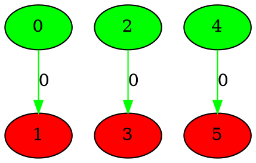
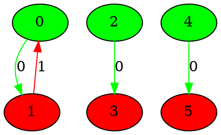
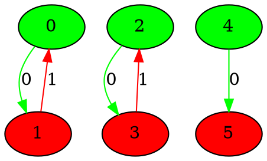
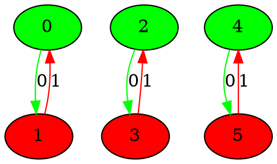
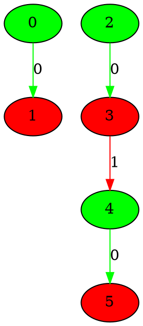
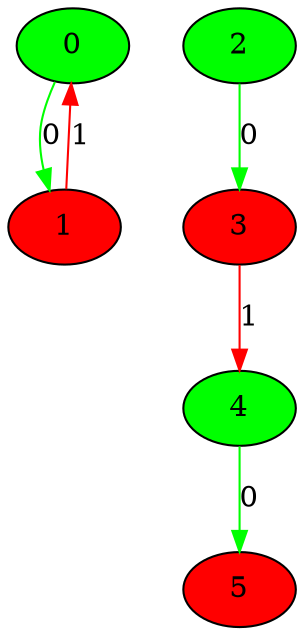
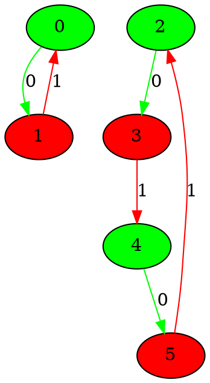
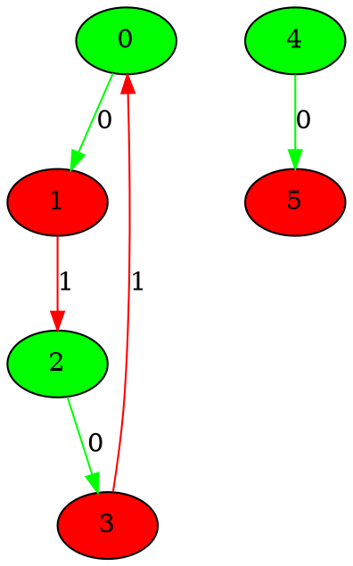
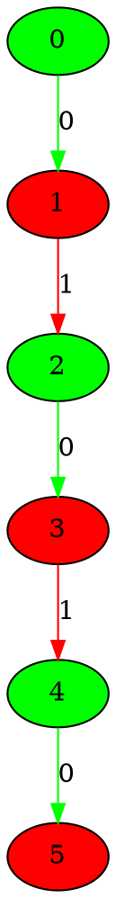
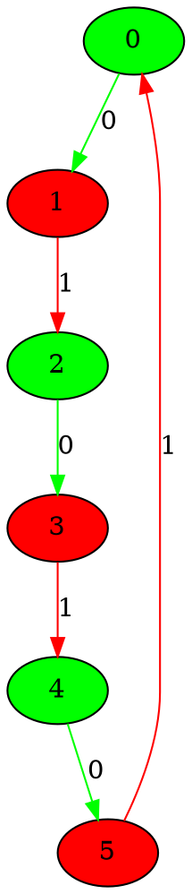

# the graphs for number of 3 nodes from 1 to 10
## Graph 1 - list de compréhension : 0|1,1,1
___

___
## Graph 2 - list de compréhension : 1|1,1
___

___
## Graph 3 - list de compréhension : 1,1|1
___

___
## Graph 4 - list de compréhension : 1,1,1|0
___

___
## Graph 5 - list de compréhension : 0|1,2
___

___
## Graph 6 - list de compréhension : 1|2
___

___
## Graph 7 - list de compréhension : 1,2|0
___

___
## Graph 8 - list de compréhension : 2|1
___

___
## Graph 9 - list de compréhension : 0|3
___

___
## Graph 10 - list de compréhension : 3|0
___

___
